# P99：栈溢出-汇编指令及字节序 - 网络安全就业推荐 - BV1Zu411s79i

然后一些常见的汇编指令，因为我们这是一个易胖嘛。

溢溢出主要是涉及到一些站的操作，函数调用的一些操作，比如说push push就是入站，普奇一呢就是将一个数据压入栈中，它一个入站是什么意思呢。

我们看后面的后面的一个站的图，这就是一个站，这是战地一dp 4664位，就是r b p就是战机，就是战地，我通过我怎么访问里面的数据，我通过暂停，这下面是一个高地址，上面是一个低地址，那我是站站停。

也就是esp，我再继续往下加，继续往下加，就一个访问下面的地址，那我要入账怎么办呢，我现在e s p这里是存在暂停的地址，我就把数据铺起一把。

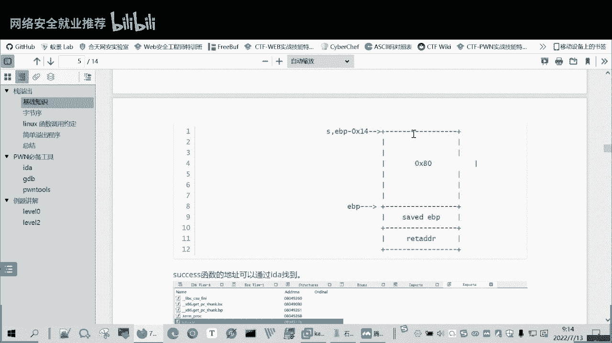

数据一存在这个e s p这里，然后e s p的位置在上上走两走。

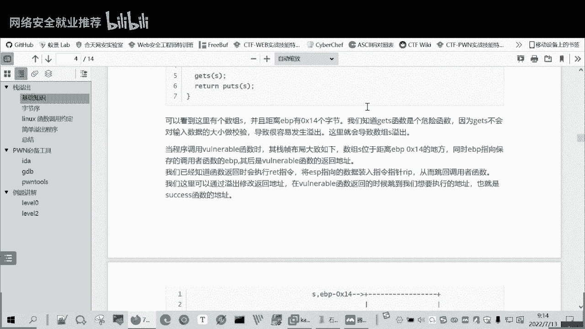

32位是四字节。

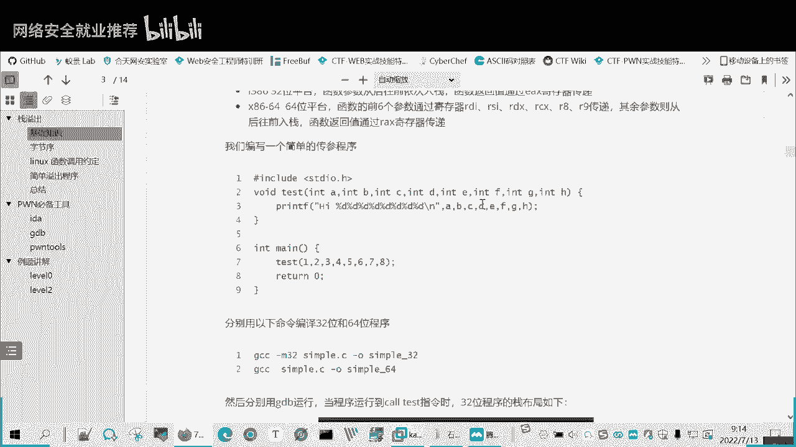

然后64位的话就是八字节，那么这，所以往上走上面是小地址，所以说要先要把这个esp的值减去八，然后这个再把这个一放进来，这个括号一，这个r sp呢就是你直接上i s b，就是i s p里面的值。

它里面值那是一个地址。

i s p本身是一个寄存器，暂停存着栈顶地址的一个寄存器。

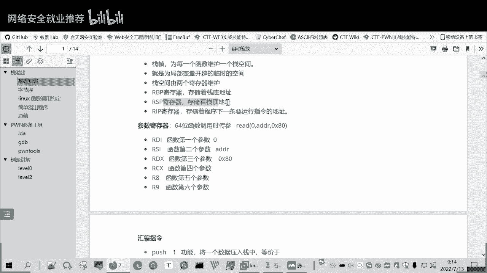

那么你外面打上括号的就是这个地址处的值，一个是这是地址。

这是指，然后pop就是与这个push相反，就是出站就是从站里面取数据。

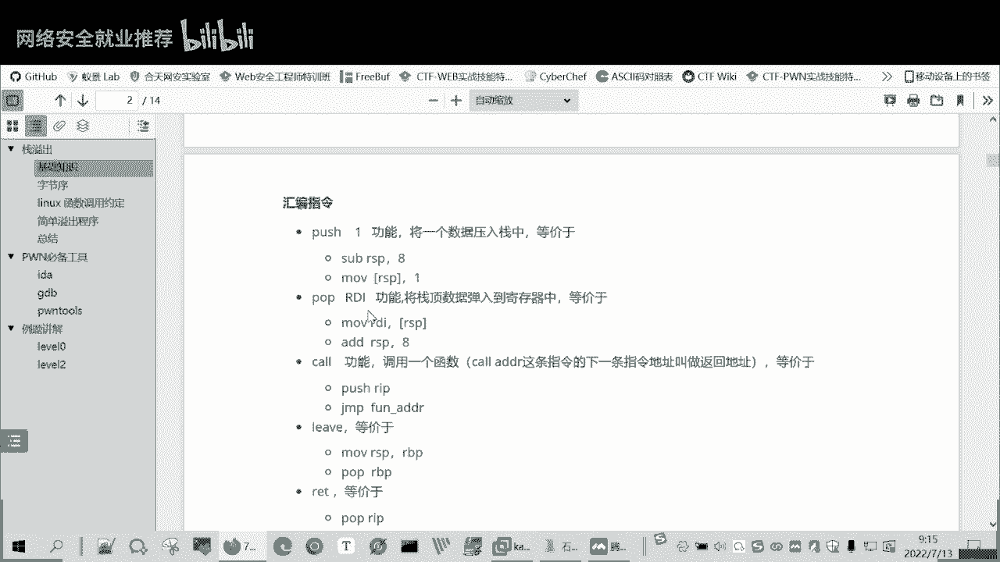

这是存这是取，那取数据呢，pop我把数据取到哪里去，取到r d i当中去，那么因为站他只能从站点出入数据，所以输入是把栈顶的值不是他的地址，把站点的值给放在rdi 7存器当中，然后栈顶的值呢。

这个站点它的存在地址就是加八，只有四级节和加八就向下移动八个字节，下面是高低，是刚才的那个图。

这是top和入push的入站出站，然后call呢是一个函数调用，我们将要call什么function cosystem，跨界调用一个函数，他要进行的实际上的操作呢，就是相当于结合我们前面的。

就相当于这两个操作，首先我扩一个函数，然后下面还有一条成本，它本来是执行完这个括号指令，要执行下一条指令，所以我把下一条指令r i p的值ip就存储了，下一条指令，把这个值我先保存下来。

因为你现在快一个函数就不是这样，直接到下一步指令了，是要进入这个函数内部执行的，所以我先把下一条指令值保存起来，保存到这个站中，这是我当前函数的展，它每个函数有一个自己的战环境。

然后我在jp到你call函数这个地址上去，在你这个子函数里面，相当于再继续的执行，执行完之后，最后return我怎么返回出来呢，就是因为我之前已经保存了，我括号下面这条命令的地址。

所以我后面你括号的这个函数执行完之后，我还是能够返回的，返回到你括号下面这条指令，我继续执行，这就是一个函数执行结束，然后逆过来也是一个，他是离开这个函数，他离开这个函数呢，它这个操作是什么。

他是把这个站给删除了，不就是r s p是站顶的值，占顶的地址，我把站点的地址移到站点，就相当于把这个站给清除了。

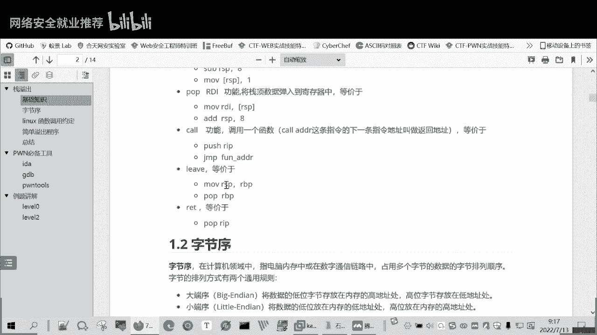

rt也是发挥他，不过他没有清楚站的操作。

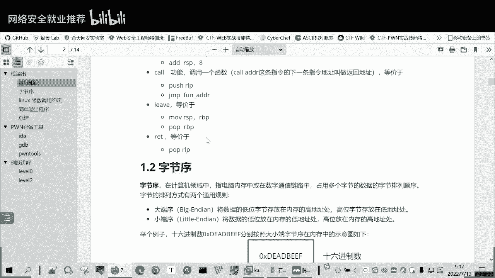

然后我们还要这里面还要用到一个就是字节序，就是我们在构造paut的时候，需要用到这里是地址相关的，就在测试计算机领域当中呢，电脑内存或数据据通信电路中，它字节的一个排排列顺序有一个大单曲。

big和小单序之分，他们俩就正好相反的大，但是呢是向数据的第一位，次线就是我们通俗你这个位是低位，然后十位百位是高位，低位字节放在内存的高地址处，高位字节放在低地址处。

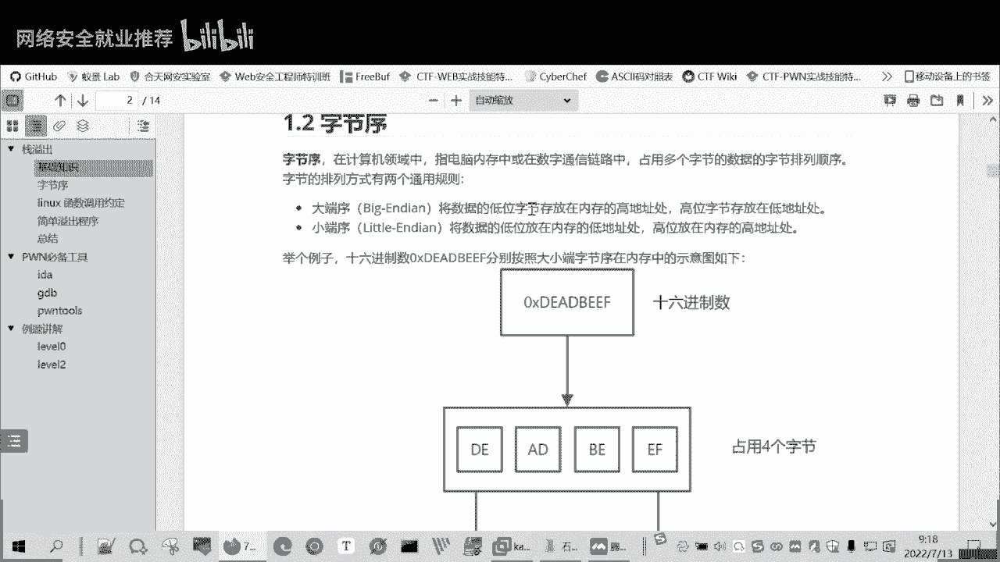

别看它比二和，实际上它是比较好理解的，我们先看这一个，比如说有个16进制数据，这是16进制数据，d e a d b e e f。

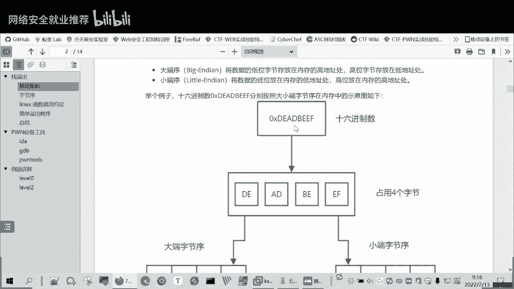

这都是16进制的，他每一个一个16进制就是二的四次方，所以每个是占四比特，然后两个就d是四比特，然后d e呢就巴比特一字节，所以它是四个字节，就是每一个字节啊。

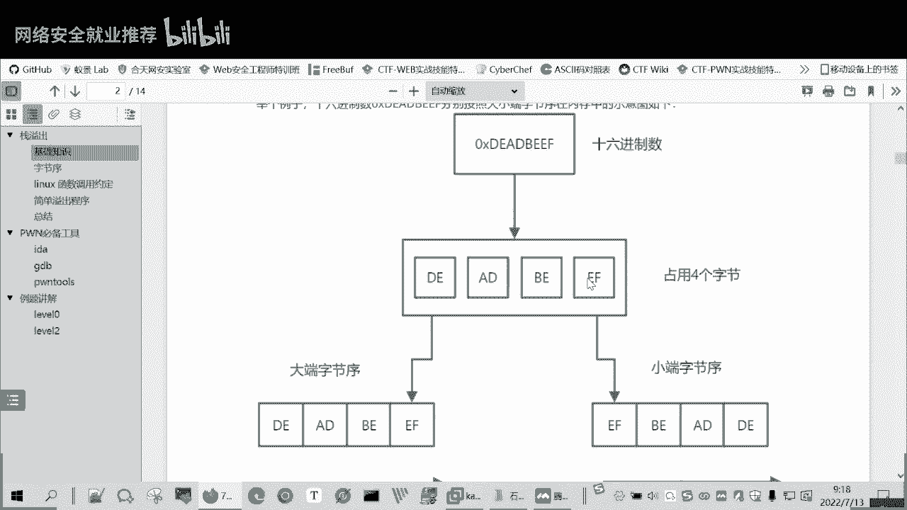

计算机是按照字节存储的，我们都说我们这个单位都是字节。

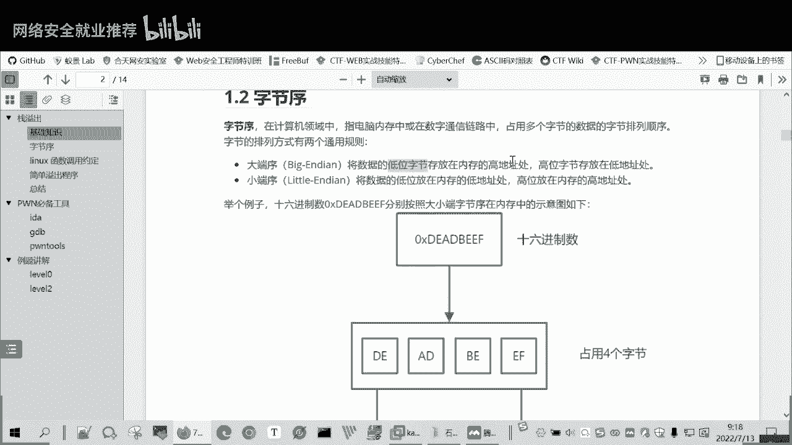

低位字节，高位字节，这里呢就相当于我们通常里的个位十位。

百位千位啊，就是通知你它的第一位字节呢，就要放在地址的高处，这是地址的内存增长方向，右边是高，左边是地址的第一处，低位磁铁放在高处，高位次点放在基础，所以它在内存中呢是这样存储。

就d e a d b e b e f。

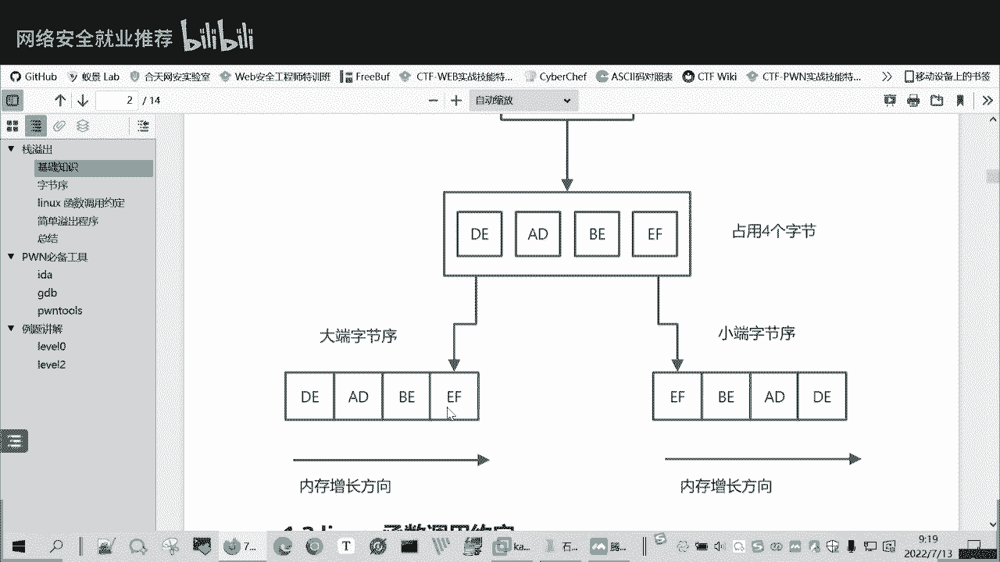

这是比较符合人类习惯的，然后小端序是正好有它相反，将数据的低位字节放在内存的dd。

指出高位放在高利润低位之间，各位放在内存的低地之中，十位高低入手，然后最高位放在内存最高的地方，所以这么看起来是与我们的阅读习惯是相反的。

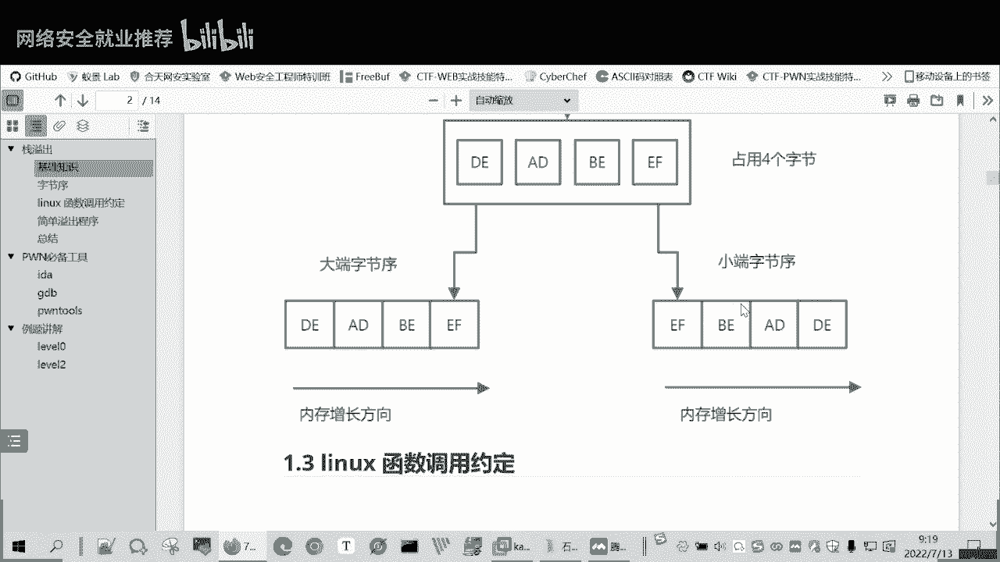

嗯但是也不知道什么原因，反正这个小团子也是在这个程序里面。

用的是很多的。

这是一个字节需要高点后面，所以我们后面在构造配note的时候，需要注意这个顺序，要不然的话你就你直接这样的话。

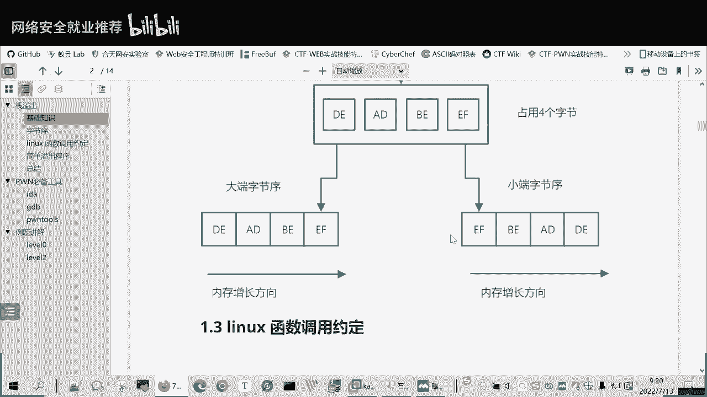

就是它有两种解释嘛。

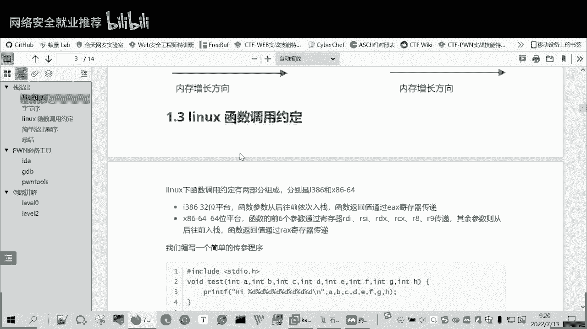