# 课程 P99：栈溢出-汇编指令及字节序 🧠

在本节课中，我们将要学习栈溢出相关的核心汇编指令，以及一个关键概念——字节序。理解这些基础知识是分析栈溢出漏洞和构造利用载荷（Payload）的前提。


## 概述

栈溢出主要涉及栈的操作和函数调用。为了理解溢出过程，我们需要先掌握几个关键的汇编指令和计算机存储数据的方式。

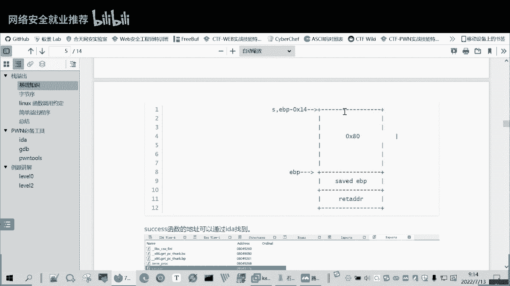

## 常见的汇编指令


上一节我们介绍了课程背景，本节中我们来看看与栈操作相关的核心汇编指令。


### 栈的结构

在深入指令之前，我们需要了解栈的基本结构。栈是一段连续的内存区域，用于存储临时数据。栈顶由栈指针寄存器（32位为`esp`，64位为`rsp`）指向。栈的增长方向是从高地址向低地址。

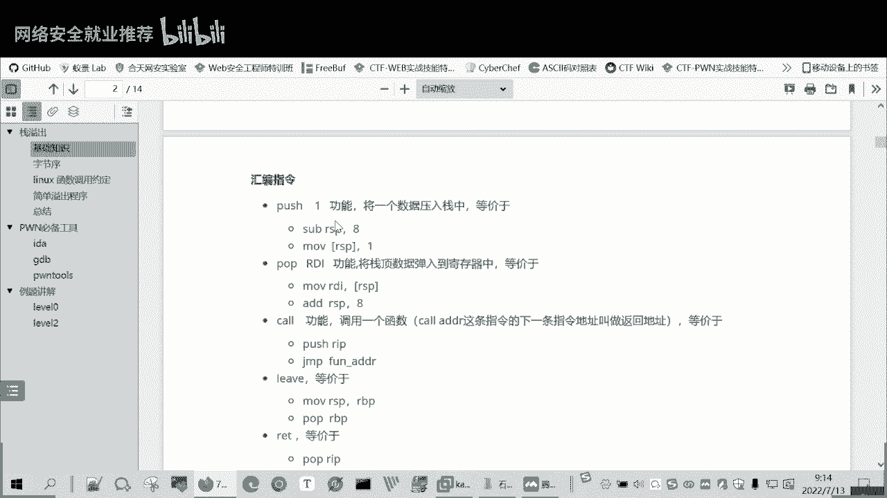

### PUSH 指令


`PUSH`指令用于将数据压入栈中，即“入栈”。

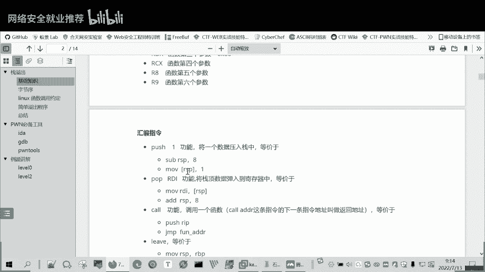

以下是`PUSH`指令的操作步骤：
1.  首先，栈指针（`esp`或`rsp`）的值会减少。在32位系统中减少4字节，在64位系统中减少8字节。这相当于在栈上“开辟”了新的空间。
2.  然后，将要压入的数据存入新的栈顶地址所指向的内存位置。

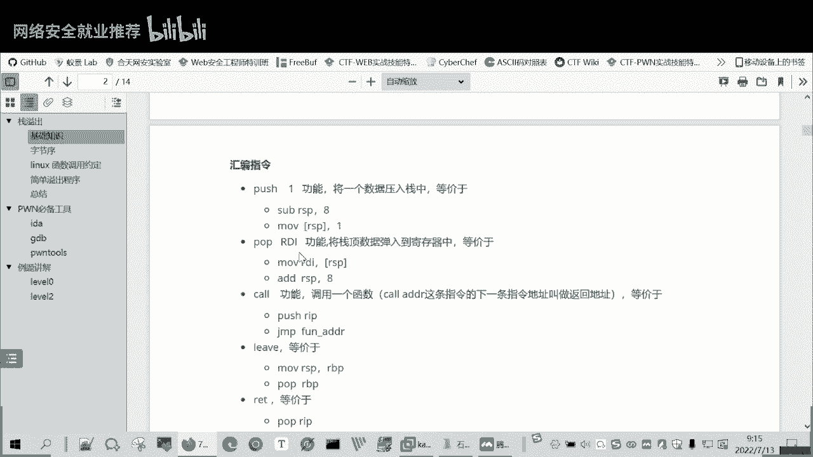

用伪代码可以描述为：
```
// 以64位系统为例
rsp = rsp - 8;        // 栈顶指针上移（地址减小）
*(rsp) = data;        // 将数据存入新的栈顶
```

### POP 指令


`POP`指令与`PUSH`相反，用于从栈中取出数据，即“出栈”。

以下是`POP`指令的操作步骤：
1.  首先，将当前栈顶地址所指向的内存中的值，加载到指定的寄存器中（例如`rdi`）。
2.  然后，栈指针（`esp`或`rsp`）的值会增加（32位加4，64位加8）。这相当于“释放”已取出的栈空间。

用伪代码可以描述为：
```
// 以64位系统为例
rdi = *(rsp);         // 将栈顶的值存入rdi寄存器
rsp = rsp + 8;        // 栈顶指针下移（地址增加）
```

### CALL 指令

`CALL`指令用于调用一个函数。它的内部操作可以分解为几个步骤。

以下是`CALL`指令执行的操作：
1.  将下一条指令的地址（即`rip`寄存器的当前值）压入栈中。这个地址被称为“返回地址”，是函数执行完毕后应该返回的地方。
2.  跳转（`jmp`）到被调用函数的起始地址开始执行。


当被调用的函数执行完毕，使用`RET`指令返回时，它会从栈顶弹出之前保存的返回地址，并跳转到该地址，从而继续执行`CALL`之后的指令。

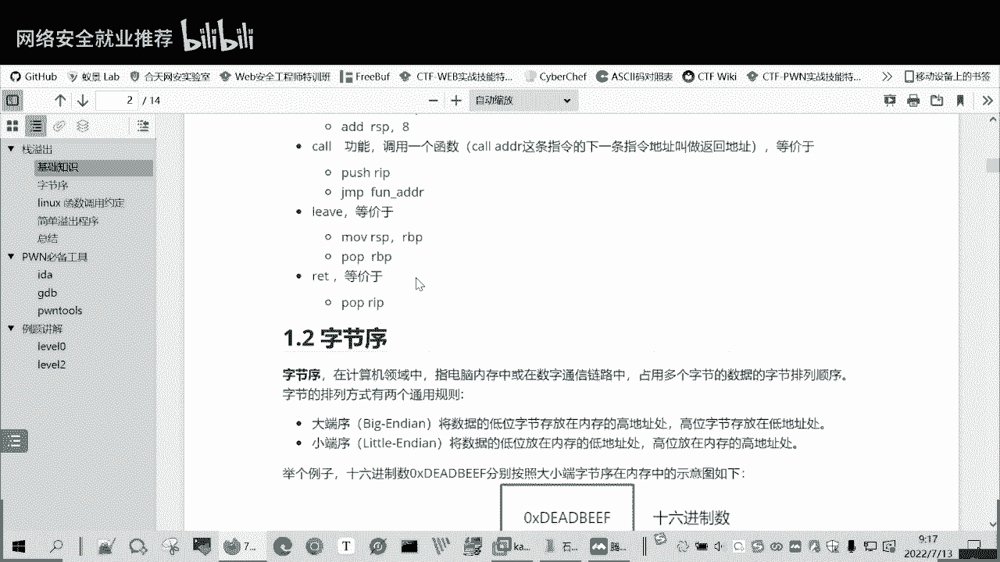

### RET 指令

`RET`指令用于从函数调用中返回。


`RET`指令执行的操作是：
1.  从当前栈顶弹出一个值，这个值就是之前`CALL`指令保存的返回地址。
2.  跳转到这个返回地址，继续执行。

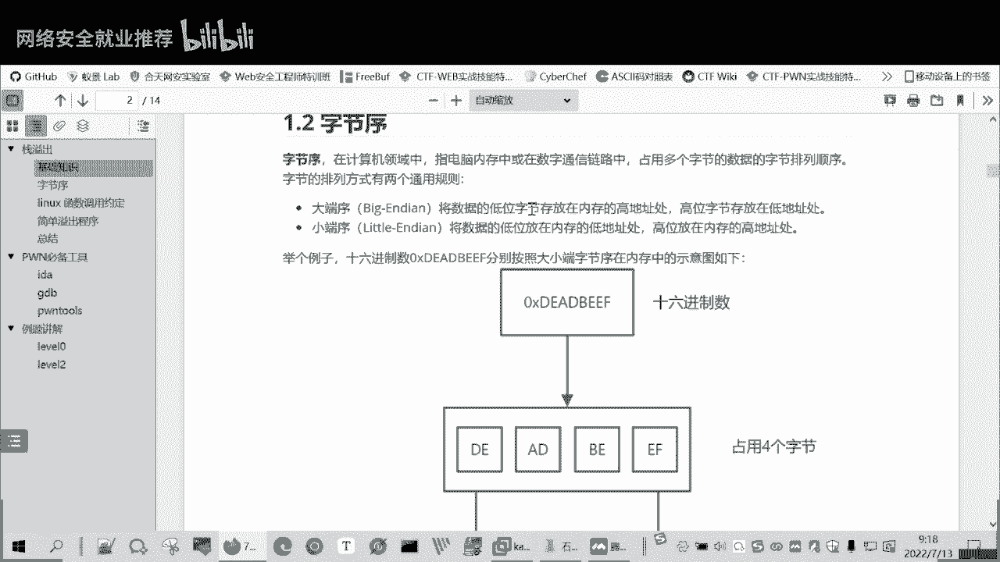

它相当于执行了`POP rip`。需要注意的是，`RET`指令本身通常不负责清理栈上的局部变量等数据，这部分清理工作通常由被调用函数在返回前完成（例如通过`add rsp, X`指令）。

## 字节序

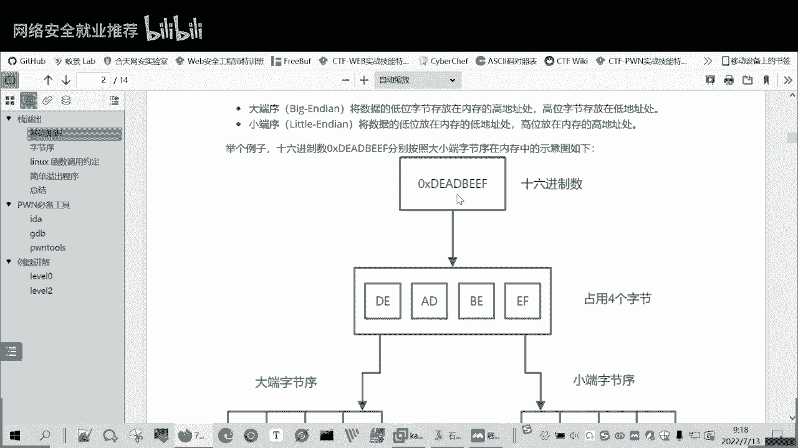

上一节我们介绍了函数调用的过程，本节中我们来看看数据在内存中是如何存储的，这涉及到字节序的概念。


在计算机领域，字节序（Endianness）指的是多字节数据（如整数、地址）在内存中或网络传输时的字节排列顺序。主要分为大端序和小端序。

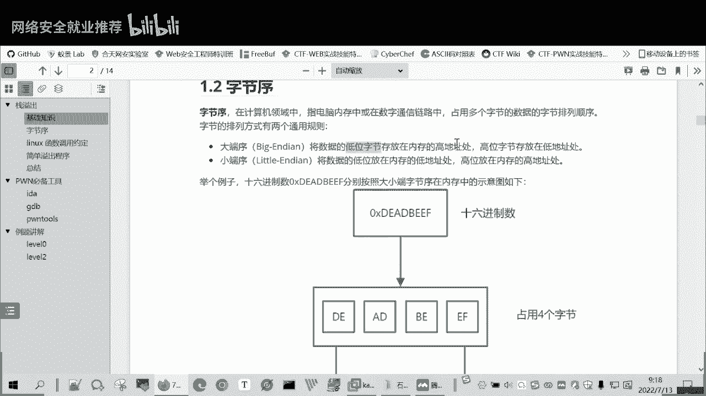

### 大端序

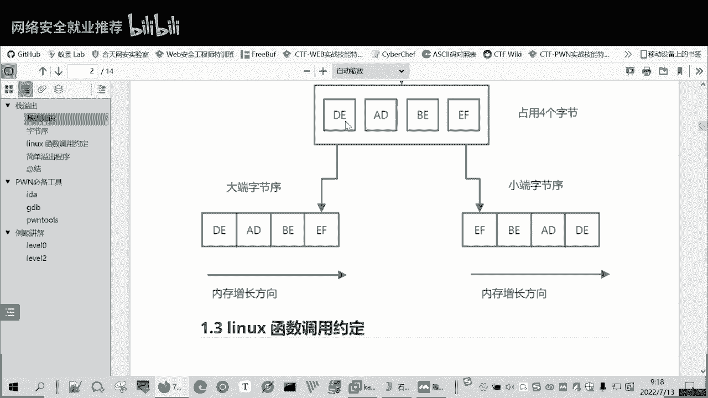

大端序将数据的**高位字节**存储在内存的**低地址**处，将**低位字节**存储在内存的**高地址**处。

例如，对于十六进制数据 `0xdeadbeef`（共4个字节：`de`, `ad`, `be`, `ef`），在大端序系统中的内存布局（从左到右地址递增）为：
```
地址：  低  ---->  高
数据： de    ad    be    ef
```
这种存储方式比较符合人类的阅读习惯。


### 小端序

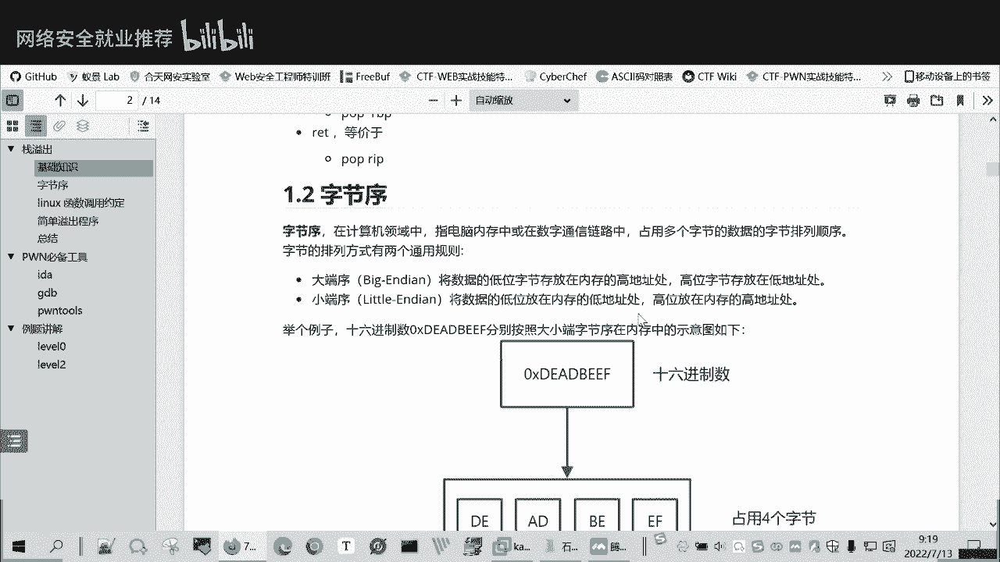

小端序与大端序正好相反，将数据的**低位字节**存储在内存的**低地址**处，将**高位字节**存储在内存的**高地址**处。


同样对于数据 `0xdeadbeef`，在小端序系统中的内存布局为：
```
地址：  低  ---->  高
数据： ef    be    ad    de
```
这种存储方式看起来与我们的书写习惯相反。

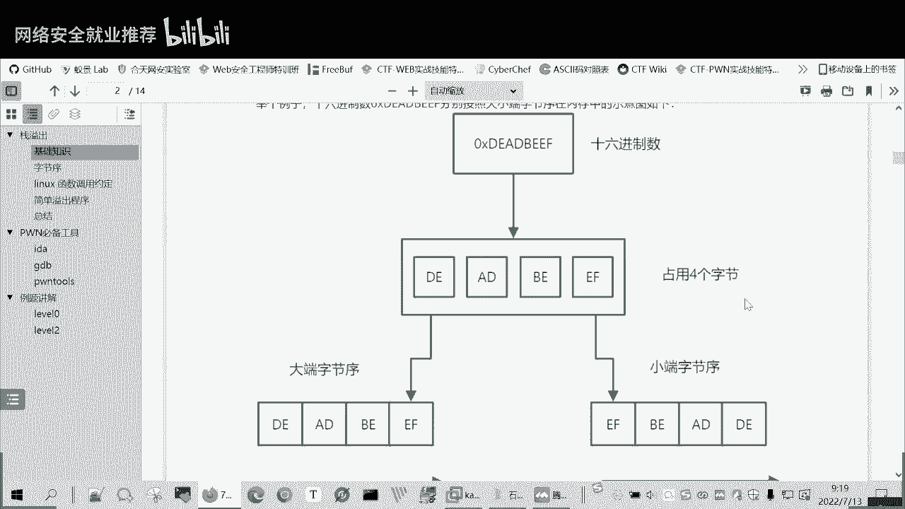

> **注意**：在x86/x86-64架构的个人计算机和服务器上，普遍采用**小端序**。因此，在后续构造栈溢出利用的Payload时，我们写入的地址（如返回地址、函数地址）必须按照小端序的格式排列，否则程序会错误地解释这些数据。


## 总结

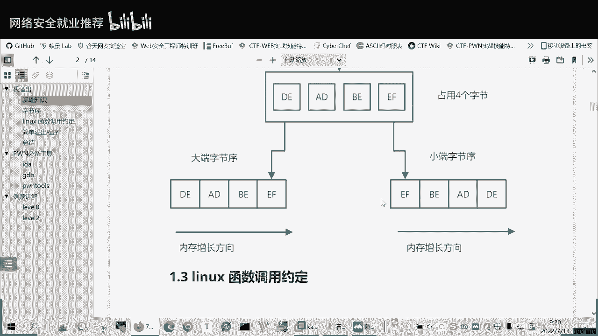

本节课中我们一起学习了栈溢出相关的核心知识：
1.  我们掌握了`PUSH`、`POP`、`CALL`、`RET`这几个关键汇编指令的工作原理，理解了函数调用和返回时栈的变化过程。
2.  我们了解了**字节序**的概念，区分了大端序和小端序，并明确了在常见的x86/x64环境下使用的是**小端序**。这是后续正确构造攻击载荷的关键。


理解这些底层机制，是分析软件漏洞、进行二进制安全研究的重要基础。