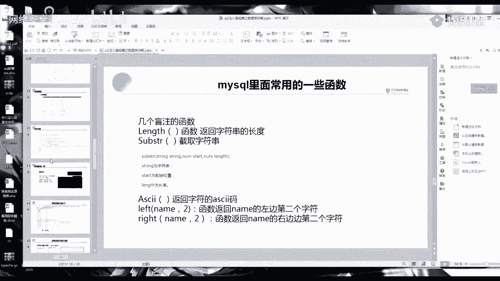
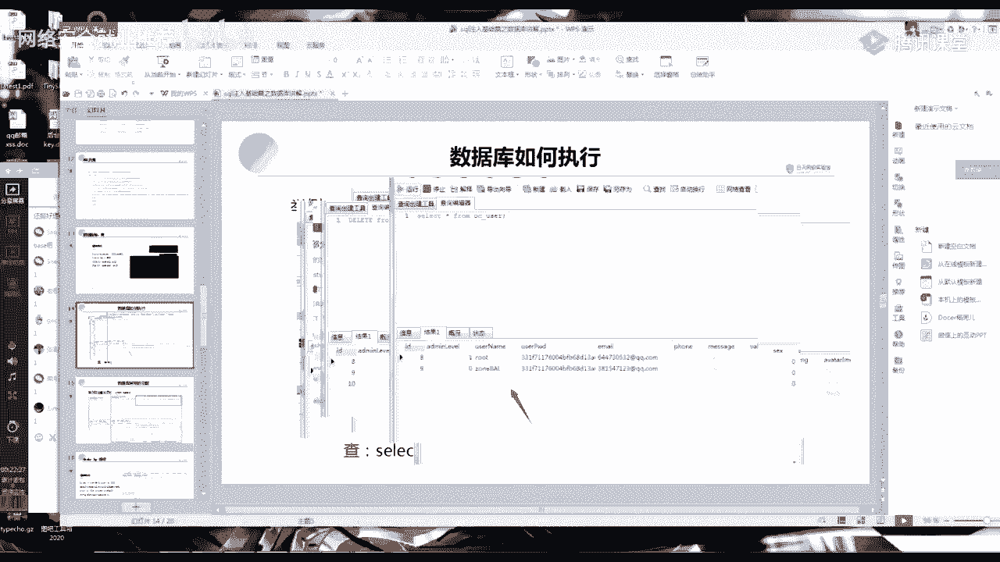
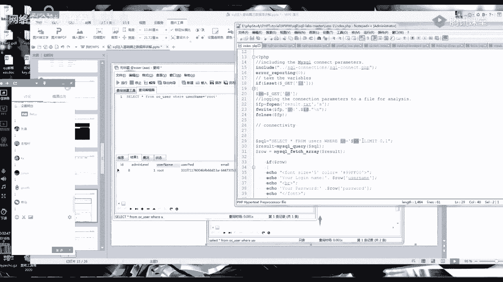
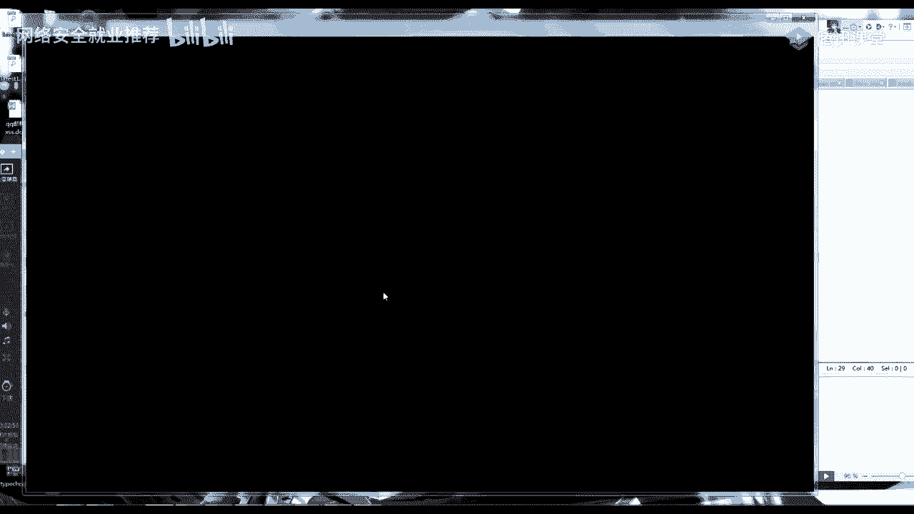
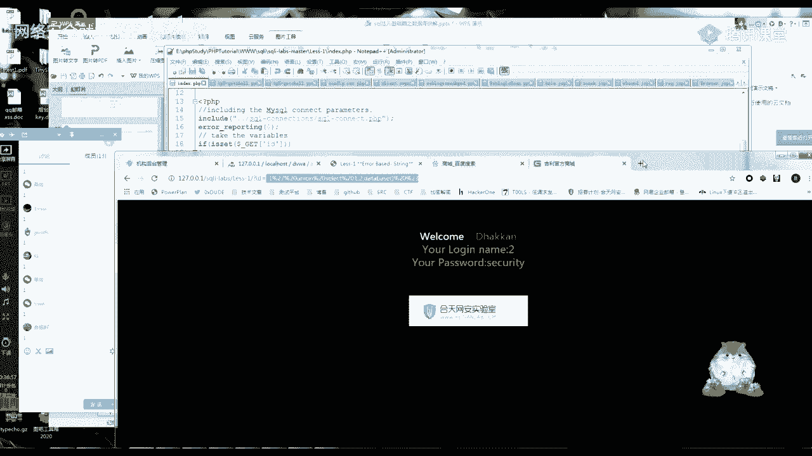
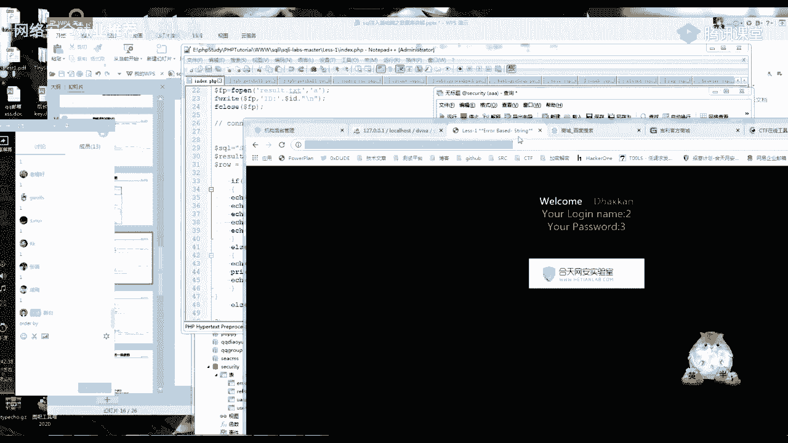
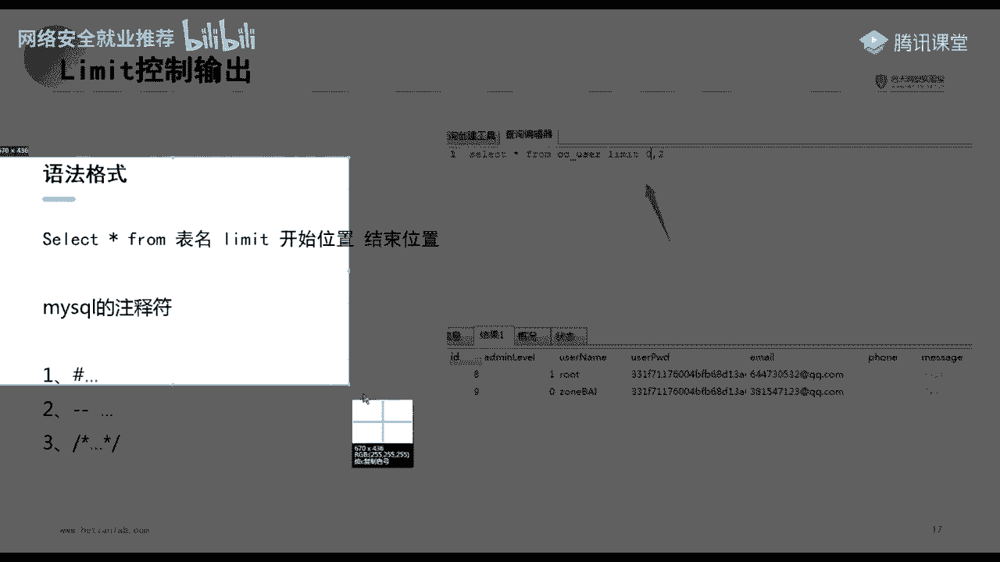
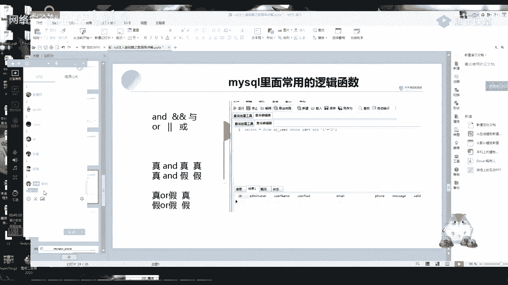

# 【B站最系统的网络安全教程】北大大佬196小时讲完的网安教程，全程干货无废话！学完即可就业，别在盲目自学了！！！ - P10：第8天：SQL注入漏洞-mysql基础 - 网络安全就业推荐 - BV1Zu411s79i

今天讲的内容比较简单啊，而且我讲的知识点就讲的知识点的话，基本上就只会那几个，也就就是说我我这门课呢，更主要的是教你们一个思路，就是你比如说一些死的一个东西啊，例如mysql守住的一些需要记的一些语句。

就是如果你在理解的情况下，这一个在理解的情况下，甚至就算你这些语音根本都不用记，根本不需要记啊，但是你要知道它的原理。

现在开始上课吧，刚好时间到了，现在开始上课。

啊今天呢要给大家讲的是一个mysql的一个基础，我稍微拉一下mysql的一个基础讲解啊，公司跟讲师介绍我就弄了，大家看一下今天的一个课程，就是今天的一个主要课程，在第二个部分。

这包括这一节课的一个45分钟啊，你比如说你前面的第一部分和第三部分，都可以不听，但是你第二部分一定要学会，我们开始接下来的一个课程啊，首先第一章是一个mysql数据库的一个基础，在讲之前呢。

给大家看一下一个网站的一个普通结构呀，啊大家学了s t m l，然后学了前端的话，这个应该是看得懂的啊，就是比如说这是我自己，我给我这个web服务器提交了一个请求，然后这个请求他就解析到解析。

然后传下这个数据库，那我数据库接到你这个请求，那我就会啊做出一个响应嘛，然后我把这个响应传给这个web服务器，然后这个服务器再传给我这个攻击者，这一部分呢啊你们有没有不懂的，这个应该很好理解吧。

懂的话你扣个一好吧，懂的话你扣个一，让我知道一下，应该是跟你们讲过的，不懂你就可以扣个二，这个没事的，啊好没有quiet的话，那就是基本上都是理解了，这时候我们要想到一个问题啊。

就是我这是一个正常的一个处理过程，然后我这里是一个数据库，那我数据库跟这个vivo服务器，还有这个攻击者，他们是怎样的进行一个传递呢，对不对，他们是怎么进行的，这样的一个过程呢，是你要理解的。

接下来我们就开始看，首先第一个什么是数据库，数据库的话，你简单理解就是一个存放数据的地方，对不对，你们啊，因为第一节课就教你们搭了一个网站嘛，对数据库大概有个了解。

就是我这个数据库就是存放数据的一个地方，就是我这个网站的一些关键数据，都存在我这个数据库里面，然后呢要去查找数据的时候，就是直接从数据库里面调用，这点呢应该啊有没有不理解。

就是你如果数据库是什么东西都不知道，你就扣个二好吧，应该没有吧，如果你们搭了网站的话，肯定是应该会了解一个数据库的基础，就是总体来说技术还算比较开，可以的好吧，我以前教过。

就是可能数据库都不知道是什么东西的，有这样的一些，既然大部分都懂，我这里呢就简单的过一下，简单的过一下。

还是看一下吧，好像他们说是有延迟，o。

那我数据库过了之后，我们看一下思考是什么东西，就是我数据库是叫四个server，然后我思考是什么呢，就是用来操控数据库的一个语言，也就是说我一个p啊，比如说我的一个代码对吧。

我的一个网站我要操控我的数据库，就是我要从我的数据库里面拿东西，那我就要通过这一门sql的语言，来进行一个操作的一个存储，这就是一个sql，那我们接下来看呢，常见的sql数据库有mysql。

sql server，oracle，常见的就是这前面三种的，然后其实前面你要记住所有的数据库，还有最多还有一个access，所有的数据库，它的一个操控原理全部都是一样的，全部都是一样的。

今天我们要讲的就是这个mysql，注意啊，今天的一个重点是你不是要记住这些句子，还是要理解，就是理解这个东西是干嘛用的，啊首先我们来看一下一个数据库的一个结构，这里呢你简单的就理解为啊。

我一个数据库就是一个大的一个客户框，我这个大的框框里面呢，然后就会有一个表，就是我这个数据库之后就是一个表，然后我表之后呢就是一个字段，然后我字段里面呢就是我存储的一个数据，这里呢可能看看的不太清楚。

我们用pcv 4 study的那个东西来看一下，就是数据库的一个结构，你一定要记住啊，很简单，就是首先我是一个数据库，然后我库里面有表，然后我表里面有字段，字段里面有数据，那是怎么理解呢。

我们来看我们的一个，我还是用这个psp卖的命来看，这个比较清晰，啊首先你来看这里呢，就是我们的一个数据库的一个名字对吧，就对应的这个数据库的一个名字，q1 q2 嘛，数据库的一个名字。

然后我这个数据库里面有什么东西呢，比如说我这里有一个d b w a里面都有的吗，d b w a的一个数据库，那我d b w a里面呢，它就有两个表，两张表，然后我看一下user的这个表。

这个表里面有什么东西，然后这个表里面有这么多的一个字段，比如说user id，last name on user id，user password，这里呢就是这个这张表的一个字段。

然后我这里面这个admin，它对应的就是这些字段的一个值，你看这里user就是admin password，就是密码，还有一个数据库呢，就是以一个这样的形式进行了一个存储，这一部分有没有不懂的啊。

我还是挑在这里吧，数据，这个一定要记住啊，记住，啊你还是同样的，你懂的话，你就扣个一，不懂就扣个二，啊不会了，说出来没事啊，就是我看你只有一部分的同学在这啊，不会也没事，就是你一定要记住啊。

就是一定要记住这个，ok一定要记住这个结构，它是一个这样的一个结构，那我们接下来就是一个怎么样的呢，嗯看一下对，就是大大泡小的，这里呢有一个数据类型，数据类型不需要记啊，就是你要知道有这种类型的。

我不需要你记，你只要稍微看一下这个int blood，还有这里呢是一个啊书本里面会写的一个数据，但是我不需要你们记，你只要知道有这个东西就可以了，就是有这个东西，因为很多时候如果除非是你学数据库。

不然的话是用不到这些东西的，然后这里呢也是数据类型，这是文本的这一些，你记住有这个东西就ok了，然后呢有一个约束，这个约束呢也是大家记住啊，就是你们只要知道有这个东西就ok了。

一般都是lost word，你看这个黑空，这是因为为什么要理解呢，就是在执行一个sql语句，比如说要建立表，然后建立据库等这些东西需要用的，这里呢就是待会我把之后我把ppt发给你们吧。

这是中间记住你们记住这三个这几个啊，数据类型啊，还有字符串类型啊，字符串的类型啊，然后还有这个sql的一个约束，你们我不需要你们记这些记，我觉得就是在实战中基本上是用不到，但是你们一定要知道有这个东西。

好那我们就来进行一个操作，你们数据库，我今天给你们发了一个，there be cut for my circle，本来要发新版本的，忘了，待会下完课我给你们发一下，我发的是一个，是一个这样的一个东西。

那个cut，然后呢啊如果你没有装这个的也没事，你们不是有ph b4 study吗，我这是老版本了，你们是新版本pcb 4 study呢，找到mysql工具，有一个mysql的一个命令行。

然后输入密码就可以登录这个mysql，那我们接下来要学的是什么呢，就是mysql的一些简单的一个句子，这里的一个新建数据库新建表，这里有什么用呢，就是还是给大家便于大家理解。

就是记住一些简单的一个sql语句，我们后面的sql注入是可以用到的，首先啊你们看习惯navy cut，自己本机的话就是3306，然后你输入自己的一个密码进行一个连接，连接测试成功就可以连接。

你就可以看到自己的一个数据库这里，然后你要怎么执行一个命令呢，就是啊有一个新建查询吧，应该是查询，然后找一张表，随便找个test新建查询，这里面，给大家看一下，首先是收，然后这里运行这呢。

就可以看到一个数据库的一个名字，我的比较多呀，跟这里是一样的，跟这里呢是一样的，然后我们看一下呢，就是简单的看一些句子，简单的看一些句子，首先呢第一个是创建一个数据库，啊，this this。

然后这里是一个新建数据库，这点如果英英语好的话，就知道这里就是一个新建的意思，debu就是数据库嘛，对不对，我们随便创一个啊，给我创一个空白，好多了个s，ok对，打错了，我知道。

然后可以看到自己就创建了一个空白，还是为了这个是用来干嘛呢，还是给你们进行一个理解，就是理解这个数据库是一个什么样的，然后呢就是也同样的会有一些简单的一个句子，这里呢就创建哪个数据库啊。

如果你们手快的呀，手快的可以跟我来一下，但是如果手慢的话就可以啊，手慢的话你就看一下就得了，课后自己去进行一个操作，因为你操作的话是永远跟不上的，然后呢它这里呢就是创建一个数据库。

这里的意思呢就是创建一个表，然后这里呢有一个a的名的一个表明，the main里面呢有一个username，这个username的属性是vr chat 30，然后它的一个约束是lol，约束是一定要有的。

可以看到这这的一个约束，当然我觉得就是这个创建表嗯，稍微理解一下就行了吧，也不也不需要怎么记，这样弄几十呢弄一个吧，哦的，这里呢就是我创建完数据库之后对吧，我要进入到这个数据库里面，叫user。

进入数据库里面，然后我在数据库里面创建一个表，然后我们输一下这个数据库里面的一个表，哎呦这做的，啊你记错了吧，没事不管他了，这里只要这里呢，只要记住这一个是新建表信息库，这是常见的命令，这个记住啊。

这个还不是重点，重点的是这个就是我个人觉得你mysql里面，不管是mysql还是其他的一个oracle access等，这些这个注入基本上全部是根据这四个，就这四句话，就这四句话来进行一个操作的。

就是你前面什么东西都不记没事，但是这四句这四条，这四条你一定要知道是什么意思，也就是说我们今天整个45分钟，我就学四条就ok了，什么东西都不用学，我就学四条，啊首先看一下这里呢是一个查询语句。

slice，这里呢是什么意思呢，这个就是查询，然后星号，代表一个服用这个表，oc杠user这个表就是我查询oc user这个表，这里面的所有一个内容，这句话能理解吗，能理解，你们还是扣个一。

啊你们应该之前也是预习了呀，就是我们的一个所有的一个条件，这个记住信号是代表所有不啊，它是一个正则的一个东西，然后第二个就是进行一个增加啊，我把这四条语句帮你们，帮你们那个，等一下待会还是发ppt吧。

截个图吧。

这十条语句发群里吧。

这个植入其实真的很简单，只要你们会了这四条语句，这是一个查询的一个语句，然后我们再来看一下这里呢就是一个增加啊，给这个id，username，user。

user p w d email这四个属性添加对应的一个值，就是id，这里就是十use name，就是这个就是一个进行一个对应的这个oc user，就是这张表里面的一个值。

就这一张表对oc user这个表里面的这四个值，即兴音不对，这四个列添加对应的这四个值，这条语句我们来挑一下吧，嗯我找个少一点的表扬，就是这张表太大了，不太好看，好像是这张表吧，对这张表的话。

它东西比较少，你这，这里呢就是一个查询语句，刚刚大家都懂了，然后你们可以看到呀，他这里呢有四个属性，当然他后面也有很多属性啊，有很多他这个内容我很差，自己呢我只是随便的添加一下，id啊，然后上来。

user awd，嗯啊然后，你的xs e r还是没装上，没事，待会儿课后我给你们看一下吧，就是课后我会在那个群里面开个自然课，因为你们都还在吗，都有时间吧，你们有时间的话就扣个一，要是忙的话。

我就再找个时间，我看一下你们大部分人这个时间，of tea，什么什么什么什么东西，难道我又记错了，好久没弄了，insito b r s，high sie啊啊，待会儿回去给你们看一下吧，给你们看一下。

哦已经有了，就弄个12吧，好可以，看到这里呢有添加成功，然后我们再来查看一下，看看他这个表，待会儿都给你们讲一下，就是下完课你们别走，放学别走，待会儿晚上会给你们看点东西的。

可以看到我刚刚自己添加成功了，这里语句呢我也不一样，是我觉得就是这些东西啊，没有很大的一个必要，你全部都记着吧，我们重要的是一个理解，这样就是四个语句，算是一个理解，可以看这里就是更新了。

进行一个更新更新啊，这个语句呢还是给你们看啊，自己就是改更改oc杠，user这个表里面seed就是这个这个是什么，就是这个user name等于，然后email等于多少，然后做了一个条件。

就是修改id等于十的这个usn等于多少，email等于多少，这条应该也能理解吧，然后可以看这里就进行了一个更改，这里呢就是删除删除这个oc user里面，where id等于十。

就是id等于十的这条信息，就是我把这条给删掉啊，这四个语句里面有哪个地方没搞懂的，你们现在就讲一下，就是现在发一下，不懂的一定要说呀，不懂的一定要说，因为明天的话肯定是交新知识了，不懂你就扣个二啊。

我等一分钟，如果没有没有扣二的，我就过了，mysql的一个增删改查，就是这几个语句应该都懂的对吧，那我们看一下接下来的一个重点，接下来的一个重点，就是有一个联合查询的语句啊，你比如说看这里。

我首先查询一个非要uc等于root的一个语句，它就会返回我一个username等于root的一个结果，对不对，但是如果我加一个联合查询呢，你们有没有发现一个变化，这就是多了一条。

多了一条查询的一个信息出来，对不对，所以呢为什么我会说这里是一个重点呢，嗯先给大家看一个简单的一个图，我翻一翻吧，看看能不能翻到，就是，给大家看一个cms里面是怎么写的哦，用靶场给你们看吧。

我们首先来看一下，一个正常有存在sql注入的一个语句是怎么写的，这一串啊，这个应该大家很熟吧，就是我查询这个所有的在这个user表里面所有的，然后这个id等于我这个id进行一个输入的id，等于多少。

然后就返回一个结果，这条语句应该大家都懂，对不对，然后这个id是可控的，就对不对，那这时候我们的id，如果输入的是这一个联合查询的一个语句呢，那它这个返回结果会变成一个什么样的，一个变化。

就是会不会我们后面的这条句子，都是自己可以进行一个执行的，那会不会就是我想查询哪一个啊，想查询哪一个是啊，哪一个东西，就是我随便查询什么东西，他都可以给我返回一个结果，对不对，这里理解吗，理解的话。

扣个一，啊，大部分是不理解吗，那我再来说一遍，再来说一遍，我再给大家解释一下啊，首先我们来看还是同样的吧，我用这个数据库进行一个操作，这里吗，不要uer，等于usn码。

由于root我自己呢就模拟一个查询语句，模拟的查询语句是不是啊，就类似就类似我这一个这条sql语句，就是类似我这个场景里面的这条语句，到这一步懂的话，你扣个一对吧，这个基本上是一模一样的意思吧。

嗯好这里呢是一模一样的，然后我这个输入的id的这个值。

是不是可以自己随意地进行一个变化，对不对啊。

我就拿着这个靶场的一个网站给你们看。

啊比如说就这里了，我id等于一，对不对，就是对应的这个id等于一进行了一个查询，然后id等于二，正常的网站逻辑是不是都是这样的，就是我随便找一个网站嘛，我随便找一个网站啊，上海，我随便找一个网站。

吉利官方网站啊，就比如说我这里呢，它就类似我这个id等于282，就是这辆汽车，就跟我它的数据啊，它的一个语句是不是就有可能是一个这样的，就是我查询这个id等于多少，我就返回这样的一个结果。

给我的一个web服务器，然后我在这里改281好，它商品以及线下，那我改这里了，它这里是294，那我294，就是这一量体力加g281 ，它就不存在，我262就是这一类这一类东西。

就是我正常的一个网站是不是都是这样写的，就是以前来说正常的一个网站，然后这里呢我是不是说了一个数据库，有一个这样的一个句子啊，就是比如说我这里呢就是相当于是一个id嘛，对吧。

那我这个id变成一个啊root，然后打一个信号，然后再加一套这样的句子，一条这样的一个语句啊，就是我把这条句子扣在这个里面了，因为这里是我可以自己随便输入的嘛对吧，那我call在这个里面。

那我是不是他这个sql语句的一个句子，就会变成一个这样子，到这里的话，到这里能理解的话，扣个一，因为我这个id是可控的，这应该就很好理解了对吧，好，那我啊那我就就先演示一下啊，比如说这里。

i d等于-1，然后我这里能进行一个查询语句，u i o n flag，啊我先看一下他的这个先闭合，然后，好像是三行吧，好，这里呢slice that best的，它的一个意思就是我把这个拼接进去啊。

我把这个拼接进去，嗯等一下我找个ua网解码的一个地方。

我拼接进来，他这个语句呢是不是就变成这样子了，这条是我们输入的，那他是不是就会返回这一条select database，然后就变成了就变成了这个样子，把这个数据库的一个名字给显示出来了。

用我们的联合查询语句，是会执行后面这一条语句，懂吗，你就相当于把这个不看，然后他执行了后面这一条语句，然后你再想一下我自己一个select我后面的语句，是不是自己可以控制的。

就是我自己想怎么输就怎么输入，对不对，那我如果要查询它，这里面的一个root用户的一个密码呢，比如说你说啊，如果我这个吉利这个网站，我存在一个sql注入，然后呢我就在这个地方出个个型号。

然后进行一个查询，这是举个例子啊，补充某某某某，然后我就是不是如果它存在注入，我通过这样的构造，就可以把他的一个就可以执行，任意的一个sql语句，然后把它的一个管理员用户密码给他给查出来，对不对。

他这里能理解吗，能理解的话，扣个一还是就是因为我这个id可控，然后可以随便输入数据库的一个语句，这样好了吧，ok然后我们就开始看这里呢，old by排序自己学了是有什么用呢，就是学了之后会让你啊。

学了之后就会让你知道我后面的一个sol注入，是怎么样进行的，sql注入是怎么进行的，首先我们来看这个old by有什么用啊，哦我不我先不跟你们讲这个，我觉得跟你们讲这个的话会太抽象了。

而且没什么用。

先让你们理解一下什么有一个什么样的一个用，对吧，就是我这个old by，我这里呢有一个23列，懂吧，只有23列，然后当我old by小于这个列数的时候，我这个结果会查询出来，就是会把我的结果给返回出来。

但是我当这个old by大于它的这一条列数的时候，那他就不会返回回一个结果，就是会返回错误，那这里有什么用呢，它这里呢是一个这样的一个作用，我们还是来从代码里面进行一个分析。

哦我干脆就找到你找到这个表吧，好吧，找到这个表给你们看，这里我新建一个查询，我先看下几张表啊，啊可以看我这个u s表有三列，对不对，然后goodbye 3，他还是返回这样的，没有问题。

那我old by 4，他就返回错误了。

那我是不是我的by 3，它就有三列好，我们同样的在这个上面进行一个输入，八没有问题，我by 4函数报错，那这个有什么用呢，我们再来看后面的一个语句啊，就是这里有一个echo。

echo的意思就是显示显示了username和password，好，然后我们来看一下，于是那个password对应的是不是数据库里面的，是一个第二列和第三列，对不对，第二类跟第三列。

那我们的这个old by，就是为了查出它这个显示的对应的是哪一列，第一你可以看我这里呢，因为我是o的by 3，所以这里是select 123，不用火狐给你们看吧，这个五个浏览器的ui r编码。

你们估计看的很难受。

至于oby，是为了查出我这个显示的是第二列还是第三列。

这是一个回血的一个常规操作，然后my sl的三个注释符，注释符大家应该能理解什么意思吧，就是我加了一个注释符，那后面的东西就是没有用的，就类似这样啊，我加一个井号随便打，你可以看颜色变了。

就是让后面的语句失效。

啊我其他的不要求你们什么。

但是这三个注册符你必须给我记住，三个注释符，必须给我记住，后面有大用，然后这里面呢有一些常用的一个函数啊，同样的就是我不要求你全部都记住，你给我记住一个就ok，就是我不会的，没事我全部记不住没事。

那我去百度搜一下，或者我记个小笔记，我记一个小笔记写在自己的记事本上，这些你们都全部给我略过，都全部都有，我略过，就是我这一块我不要求你们都记住，你只要知道大概有这样的一个东西就可以了。

后面我后面我再给你们念的时候，你就给我对着这张表来看它的一个sl语句，一个一个是什么意思，因为你一天要记的话是啊，瞬间这是一个一个知识点太多了，还有这个啊，这几个的话应该很好理解吧。

and跟or and and呢跟这两个是一样的，就是雨的意思，for的话就是或的意思，或者还有女的话，就是and跟我应该都能理解吧，and were不理解的，你扣个二让我知道好吧，按个w。

应该没有不理解的吧，这个呢都是为了后面的几节课打一个基础。

就是我不要求你们知道啊，sql语句直接默写出来，但是我必须要让你们知道，它是有一个什么样的一个一意思，知道意思之后很好能真的能很好的一个理解，前面呢前面的这个呢就是sol注入。

你是不是觉得嗯好像就一点点，我支持的一个现实场景，受得住，知道的差不多就这么一点，只需要这么一些，不需要更多的一个东西，啊还是同样的，我强调一个重点，就是我刚刚发群里面的这个增删改查词条语句。

再加上这一个盲注，这几条，还有这个注释的一个句子，你们呢最好就写一个小笔记，比如说我创建一个，我创一个文本，你就自己创一个文本啊，四字输入比，当然你们有那个呃笔记工具更好呀，就是比如说有道云笔记呀。

或者这一些的，你们自己记个笔记啊，一定要记住啊，做笔记的话还是挺有用的，我不说特别大用，但是还是挺有用的，自己做一个笔记，好然后我们再来了解一个表，就是这个mysql的一个特性。

阴风information设置这一个表，这个表呢你就简单的记住，这个表里面有所有的一个mysql的表，就是mysql所有的表都在这个大表里面，我通过这个大表就可以查到mysql数据库里面。

所有的一个语句，这个表。

这个表啊，然后我还是给大家看一下。

我今天好像是不是有点讲的太慢了，这些呢也只是就是你这个东西你理解就ok，记住有这样的一张表，他这张表里面呢会有一个所有的一个数据，所有的数据表，我知道妈呀，然后呢就会有这样的一个句子。

好我们一一个语句一个语句的来分析一下好吧，啊我们首先来看这样的一条语句，啊我们来看这样的一条语句，啊首先我这里呢是查询这个table n，这个tb nt是一个字段。

然后在这个information设置点tables，就是这个库点tb这张表里面，然后呢这个条件是ta search等于这个database，然后这个debus呢，就是当前的一个数据库的一个名字。

那我们结合来看一下，就是我查询这一张表里面的这一个heaven name，就是这tm就是这个表哎，应该这样说，就是查询当前数据库的一个表的一个名字，这条能理解吗，条件是等于当前的一个数据库。

我查询当前数据库的一个表的名字，因为我这个数据库里面是有所有的一个表的，就是有masa所有的一个数据库，这条能理解的话，你扣个一这一条，啊没人，啊这三位同学理解吗，嗯好我再来讲一遍，再来讲一遍。

我们就这样看吧，我们就这样看，我这里呢是这里它的一个数据库，然后我这个数据库的一个tbs就是在这个地方，把这张图抠出来吧，information and tables，就是我查询这一个数据库里面。

对不对，然后我查询之后它就是一个这样的一张表，然后呢再加一个条件，就这个tab search，反正我是查询这一张表里面的这个字段嘛，tb temon字段就是这个字段，然后呢它的一个条件是。

tap search，就是这个等于我这个当前的数据库的名字，你理解的最长的话，后面也就很好理解了，你首先可以看这个呢是每一张表里面的一个，这里就是mask的所有的一个数据库。

然后呢我是查找这一个这个字段，等于当前的一个数据库，也就是我自己的一个数据库，的这个数值，你就简单来说是差这两列吗，然后我查的这一列是他这个tp search，等于当前数据库的一个名字。

然后这个呢其实是同样的，就是我查询它这个列的名字，there are templon等于oc user，oc user呢是刚刚这里面查出来的，所以说你还是这一条理解，不会的，我待会写个。

我待会一个一个给你们解释好吧，我待会儿写一个东西给你们在里面，然后你们今天呢就会有一个任务啊，其他数据库的话就嗯有两个文章在这里，就是你们可以看，其实两个都是一样的，就是跟mysql差距都不大。

然后你们今天的任务就是你去了解这两个东西，啊啊因为时间其实有点点晚，今天你们去了解这两个东西，然后我待会儿把这个语句我一个字给你们解释，写上这一条是什么意思，今天的内容就这样ok了，其实东西很少呀。

东西很少，你就想简直就想四条语句哦，五条语句吧，登删改查四条语句，再加上这一条查找这个表的一个语句，五条语句，你们今天就去理解这五条语句就ok了，嗯好今天的课程呢就暂时在这，然后我待会在qq群的话。

就给你们开始开一个直播，进行一个一些简单的一些东西的一些讲解啊，所以呢我就先下课了，我们qq群见，哇这个好像有点那个呀，嗯找一下，嗯各位同学，你们现在去qq群吧，这个这里我刚刚看错了哟，原来调整成杠杆。

