# 【B站最系统的网络安全教程】北大大佬196小时讲完的网安教程，全程干货无废话！学完即可就业，别在盲目自学了！！！ - P13：第11天：SQL注入漏洞-sqlmap使用，报错注入 - 网络安全就业推荐 - BV1Zu411s79i

看一下论坛，cf rf，这是哪里就传送了，看一下，这要是。

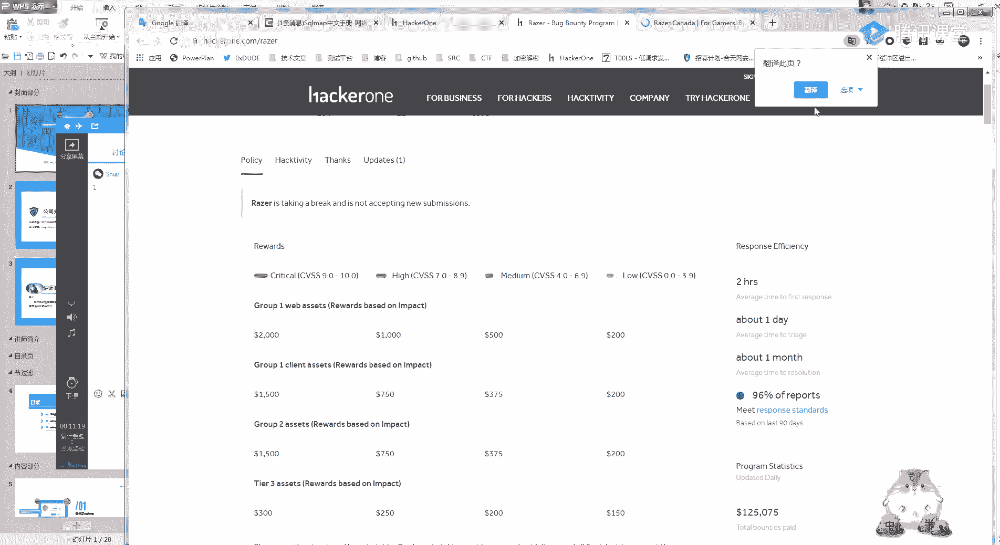

雷蛇，没绳子这一家的呀。

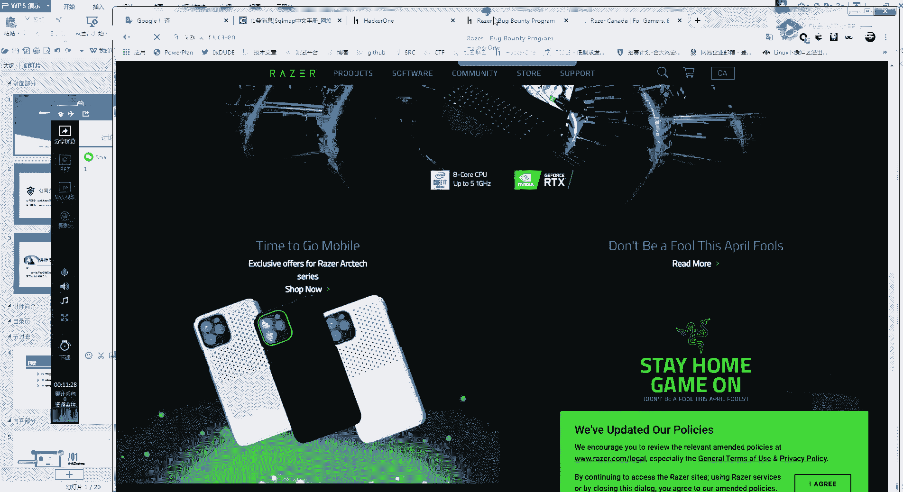

找个时间可以看一下，2000刀，临时商城，58嗯，再等两分钟，我们就开始今天的一个内容，今天要讲的非常简单呀，这个东西，而且你们学起来也会感觉特别舒服，可能违规，别搞事呀，1w vs，好开始。

今天的一个课程内容，就是这个注入之smap的一个使用，看一下第一个是介绍什么是司空，可以失误了，谁还打错了，好，第一啊第一点呢是什么，是smap，第二个呢是smap的一些常用手法。

第三个呢就是smap编写一个temple，还是跟平常的一样，就是我这一次主要的一个内容呢，不是给你们把斯科拉那些中文手册呀，就是一个完整的说明书都给你们讲，还是一样的，我只教你们重点还有常用的常见的。

你们不需要记那么多东西啊，我们首先来看一下什么是sm cup呢，就是一个开源的深度测试工具，你简单来说就是用来自动化检测，还有利用红色的注入的一个工具啊，这个工具很久了很久很久了，但是现在一直还在更新。

而且一样的特别好用，然后他能干什么呢，他就是啊我们在学sm学四柱的时候，是不是有一个烦恼，就是这个sk注入的语句特别多，而且自己写也很烦，因为你如果要把整个数据库的内容全部做出来。

你算一下你那一个啊注入你要敲多少遍，就这我啊这基本上是不可能的好吧，你比如说一个数据库，它可能有一些有个几百g，你要是自己手工悄悄到什么时候，然后呢比较厉害的，他就开始写自动化的程序，写脚本。

然后呢就有安全公司出了一个smap这款工具，他这里呢一个下载地址，我把这个发群里啊，你不管是python 2还是python 3，现在都能用，你们去github找一下这个smap的一个安装。

这里呢就是superb的一个开源的一个地址，它是老外写的，嗯我们就自己随便下载一个吧，把它下下来，当然我这原来已经下好了，你把这个解压就可以了，找一下四个map，然后呢大概就是一个python脚本。

python脚本，然后你们在这里打开命令行，跑一下一个，开始运行一下，出现这样的一个图标，就说明你那个安装完成了，但是嗯有时候可能有些人觉得很麻烦啦。

因为我每次都要这样打开去进行一个smap。

这里呢就教你们一个简单的一个办法，就是在windows下添加一个快捷方式，创建一个快捷方式，然后在这个地方就填入我们的一个cmd，当然待会儿告诉你个更简单的呀，然后你右键呢在这个起始位置。

就加入你那个smap的一个位置，然后你每次用的时候就点击一下那个快捷方式，它就会自动运行，当然有个更简单的办法，啊你们应该啊，之前添加环境的时候跟你们说过吧，一个环境变量对吧，给你们讲过一个环境变量。

那我把这个smap的一个环境变量添加到，添加到我的一个，cfm的一个位置，添加到我的这个环境变量里面去，就是添加到这个里面去，然后我看一下啊，嗯刚刚是不是有中文呢，好这三个smap。py。

直接添加到这个环境变量里面，然后这就可以直接使用了，啊它的一个安装应该很简单啊，就是之前你们装过pc环境，还有装过这么多一个子域名工具，基本都知道用了，所以呢这个就不多说，今天还是一个主要的内容。

就是教你们怎么用这个system map这个工具，之前有同学就是说过嘛，就是a老师，我的那个sk mark怎么一个晚上都跑不出来，应该你们是有印象的对吧，就是我一个一个网站都跑不出来。

或者你们应该也用到过，就是4k map，可能明明有一个四个注入点，但是还是跑不出来，这是为什么呢，待会儿就教你们。

samp等于个常用的一些东西，首先我们了解一个smap的话。

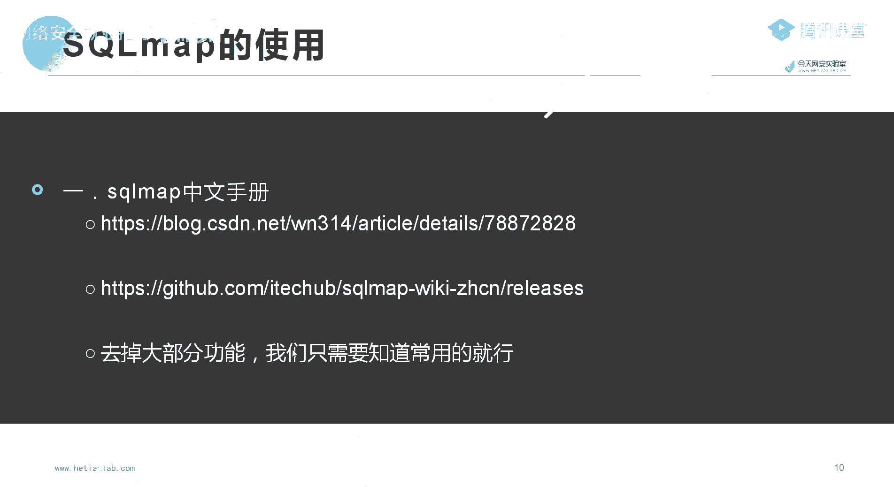

我们要知道一个smap的一个使用说明啊，就是我们常见的一个说明书，之前早就发给你们预习过了，我觉得他这里呢还写的算比较好的呀，算比较好的，就是他这一个中文吗，还有其他的都写的还算比较可以的，嗯好。

我们现在呢就开始进行一个smap的一个简单使用，你要记住一个点，我觉得这个呢我可以给你们标红，因为smap它整个的一个功能非常非常强大，然后你要把他所有的一个所有的一个内容看完。

是很难受很难受的一个东西，就是你学的垃圾知识过多懂吧，有些东西根本就没有用，我们还是好跟你们先说一下，我在跑sk mom的时候，你们别跟我一起跑呀，不然我怕我我们的这个赞这个靶场会崩掉。

嗯还是回到我们的一个靶场了。

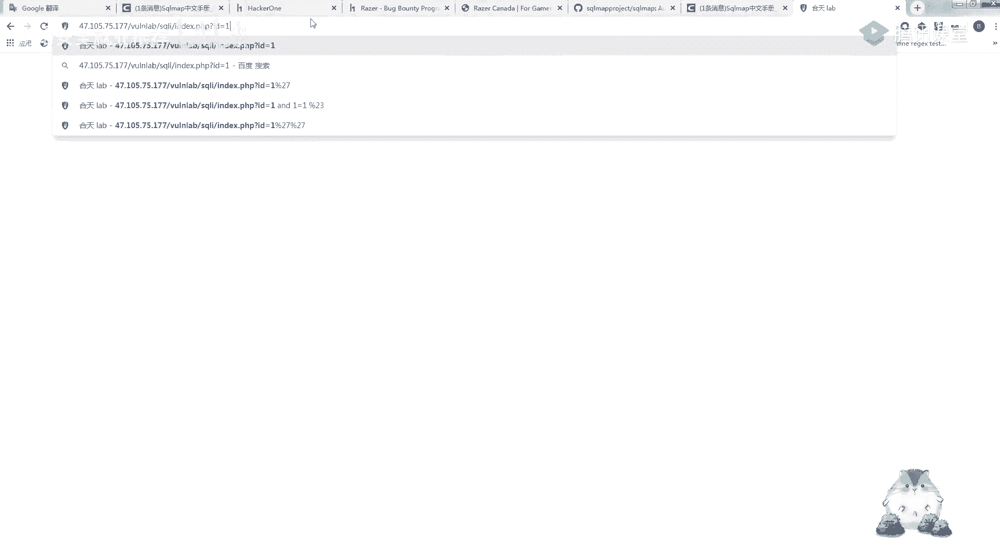

回到我们的一个sc club。

我们首先来看smap它的一个常用的一个参数呢，就是sk map，甘u应该大家都试过了，或者没有事的，你们可以拿我们的网站测一下，我们嗯，我们用smap开始进行一个实操，首先第一个最常用的就是sm。py。

然后杠u你再把这一条呢，就是这一个存在sql注入的一个网址，把它抠下来，然后拖到这个上面去，跑一下，他看他这条是什么意思呢，就是说它看起来像嗯一个mysql，然后呢你想跳过其他的，直接用谷歌翻译吧。

它后端看起来是mysql，你是否要跳过特定的测试，这里呢无所谓啊，就是我们在遇到这个时候，你按y跟按n都无所谓，其实我觉得，然后呢他自己呢就开始进行了一个跑，然后他自己就出了，他说这个id是一个脆弱点。

你还想吃其他的一个点吗，就是它这里已经识别出来了，我这一个，我这个位置这个id这个地方是一个注入点，这个大家都很了解吧，然后我因为我跟你说，正常情况下你带跑其他的是浪费时间了。

就是我测出了一个注入点之后再好，其他的有点浪费时间，我们直接跳过就可以了，然后呢就可以看到它这里出了一个po的，还有一个说明他就说他这个id是一个脆弱点，然后呢就输出了这两个。

第一个是一个布尔的一个盲注，第二个时间帮助，第三个就是我们的联合注入，就是都可以用，这里呢是它一个检测的po的，当然这里没有什么说的呀，就是你简单的我拉黑，我干u跑一下这个位置。

就能识别出它是一个注入点，这一点有没有啊，有没有需要特别说明的，如果觉得这个都看不懂的话，你们就去把这个smap呢下载下来，然后自己出个甘u去跑一下，这个是最简单的用法，然后呢我们怎么做呢。

我们还是同样的，你们还记得一个sql注入的一个过程吗，我是不是告诉过你们四个注入的一个流程，就是我先判断它是不是一个注入点，然后再把他的数据库的名字给报出来，然后再把这个数据，然后再跑表，然后再跑列。

再跑列里面的数据，这个注入的流程是这样，应该都记得吧，那我smap也是一样的，就是我先用这个杠杠dbs跑出一个数据库，你们这个流程一定要记住杠杠dbs，然后看看dbs跑一下，你可以发现他很快的。

把我们这里面的一个数据库给跑出来了，那我们比如说我在跑这一个，我要跑这个数据库后面的表呢，就是我杠b杠d，就是前面的杠杠dbs啊，你这个dbs你就改成杠大d，看b昨天看看table tbs呢。

就是我们的一个表明，就是你们其他的先不用记，你反正记住了，第一个杠杠bbs就是跑数据库，第二个刚刚tables就是跑数据库的一个表，这里让你们待会儿就是自己去手动实操呀，一直实操到哪个程度呢。

就是我不要看这个说明书，我一直杠低杠杠tables，然后杠杠那一个查表，然后刚刚查数据，你把自己变先跑下来，我们继续跑一下这个真的，你是不是可以看到这个工具跑的特别快啊，是不是就是啊。

如果你遇到一个sql注入，我直接用这个工具一跑，它所有的数据都出来了，然后就不需要你手工一个一个慢慢去写了，是不是就应该嗯应该会感觉比较爽吧，至于为什么你们可能问，为什么我不一开始就教你们。

待会儿会跟你说，因为你啊就是如果你真的做安全的话，你就不要只光顾着就是用工具就能跑出来，很多东西的话，还是要知道原理，知道原理之后，你才有一个啊更深走下去的一个可能性吧，然后同样的我跑完数据库。

那我是不是就要跑裂了，我跑完列是不是就要跑一个数据了，这里呢还是同样的，你看杠低还是数据库名gt real啊，我们前面是跟上tvs吗，然后我这里就改成一个杠t杠大t，再加这个表的名字。

再加这个列的名字，杠8t user，然后我这一跑id password username，他这一个表的一个列名，然后又出来了，然后呢我再跑，比如说我这有一个啊杠c嘛，杠c我要指定这一个，难道我记错了吗。

哦看刚刚，然后你就可以发现几秒钟的时间，一两秒钟的时间，我这个数据就全部跑出来了，这个temp就是这样的一个简单暴力，好这里呢让你们提一下问题啊，刚刚前面操作啊，有不懂的吗，不懂的话，你扣个一。

因为它仅仅是一个工具的使用了，这是一个最简单的一个使用，啊所以前面可能讲的有点快啊，就是一个工具的一个简单使用，它就是你们看说明书就可以了，会有跑不出来的情况下吗，肯定会有的啊，你不是遇到一个刺客注入。

我用smap就百分之百能跑出来啊，不然我后面就是我，不然我后面要跟你们讲的不就白费了吗，你就这样就这样啊，直接默认输入的话，很大的一个可能性是跑不出来的，在真实场景里面。

因为sucup他有很多的一条命令啊，但是我给里面的这个就是这种最简单的注入，肯定是能跑出来的，待会儿呢我会给你们讲一个smap，一个通用的一个习惯，也就是说我自己啊，添加环境那里是直接到现哦。

对这里呢我记得我跟你们讲过一个添加环境，这个添加环境变量的一个意思，就是你简单的可以理解为我只要在这个pet里面，就是我只要在这个p t s里面，加入任意的一个路径啊，你比如说我是加一个啊。

这个一找个好用一点的吧，就比如说我要用一个工具，对不对啊，我每次如果要在命令行对，如果我每次都要在命令行这里打开，进入他的这个命令行，进入他的这个目录里面，是不是就很麻烦，那我就直接把它这一个目录。

添加到我们的这个p这个环境变量里面，那我那我每次我不管cmd在哪个位置，我都可以直接使用，就是我不需要再打开进入它这个目录底下了，这个懂了吧，应该就是你觉得麻烦就这样，就是你觉得啊每次都进入他这个目录。

麻烦你就加加进去啊，你觉得无所谓，就可以不加卡了，一下可以卡里比卡里有自带的一个是什么啊，它里是有自带的smap的，呃待会儿再安装，安装的话，你们自己就是下载下来，用python环境就能跑。

这个嗯比较简单，你们主要是要记住的是，首先你要记住这个流程，就是我先跑数据库，在跑数据库的一个表，你现在先不要记啊，就是待会下完课，你们自己就拿我们的靶场，拿smart就直接跑自己手套先做出来。

然后后面那个，我上次不是给了你们一个实际的一个场景吗，那一个你们就当一个真实的一个啊，当然真实的那个场景去用一下，这个是方向不好会有惊喜的，接下来我要讲的重点呢就是个map，一些常用的一些东西。

这里呢这条命令这些命令我也不说，然后我pp上也没有写，应该你们有细心的，细心的话，应该有关注过吧，就是你比如说啊我这一个我这一个，驻点是一个get的请求吗，那我get的请求。

然后我这里杠u是可以输进去的，对不对，那我如果是post的请求呢，对不对，如果是一个post的请求smap呢，它有一套专门对，就是专门用来进行post请求的一个东西啊，还有那一个head头的。

但是我觉得嗯不好用。

你懂吧，我给你们讲一下，就是我们常用的一些东西，那一个肯定不会崩的，我发给你们的那一个肯定是不会崩的，你去查一下，大家那个是业内比较出名的一个东西，知道吧，这里呢客户跟你们说，这里呢还是给你们讲一下。

就是如果遇到post请求的，你别看它这个使用说明啊，我来给你们做一个简单的一个演示，首先我为什么之前要跟你们说，bp是一个神器，没信啊，首先就给我开启bp，啊首先我们把bp开启。

然后我找一个post请求的一个四个都，我把这片区study看一下，嗯就是你们给你们记住我这个习惯就可以了，就是一个万能，基本上是一个万能的一个表达式，一个万能的方法，当然你可以不学我这样，但是我啊。

但是我教你们的就是这样教，你们到后面可有自己的习惯，你们可能会看其他的一个讲smap的一些老师，就是把crab的每一个功能点都给你们讲一遍啊，但是我觉得挺不实用的，这些东西，就拿这个来说吧。

比如说啊我这个地方有一个注入好吧，然后我看一下啊，错误什么什么什么，这里呢我看一下啊，这是个什么圈啊，第12关我都忘记是个什么住了，但是他肯定是有的，就是我们遇到这种情况。

比如说我直接拿这个杠u是不是肯定就没有啊，是不是肯定就跑不出来啊，我把这个甘雨给你们试一下啊。

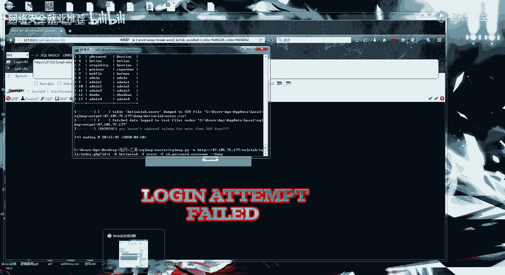

因为他的一个请求，他的请求都在这个里面了，就是都在我这个都在我这个包里面了，看一下这个是什么，基于错误的一个啊，它是双引号，双引号报错，那遇到这种呢，比如说要登录的，那这种情况我们怎么用cup呢。

教你们一个习惯，首先第一个啊，我这一个bp是可以把这个包给保留下来的，就是copy to fail，就是我可以把这个数据包给它保存下来，一定要记住这个右键，然后这个位置，保存为一个文件。

然后呢我就改一个名字。

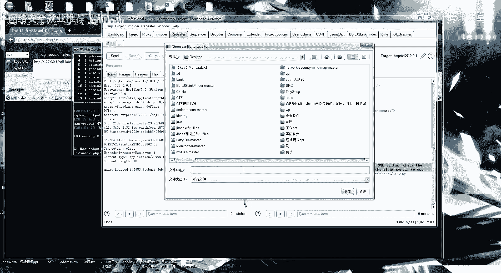

比如说我改一个去b点贴个七嘛，无所谓，然后呢他就把这个包给他存下来了，那我们把这个包呢就copy到这个sf这个位置，我就把这个保存好的这个文件copy到这个里面，来到这一步应该啊还比较懂吧。

就是我有一个设备注的一个点，把这个包保存为一个文件，再把这个文件放到smap这个里面。

然后呢smap呢有一个，干嘛这个参数干啥呢，就是读取，杠杆就是读取这一个，txt文本里面的一些东西，读取这个文本里面的，然后我再继续进行一个注入，看一下啊啊这里为了快速一点啊，应付，真想让他跑一下。

我们可以看了，他这里呢就开始检测，我这个包里面的一个内容了，然后呢，因为我刚刚没有加任何参数啊，它默认呢就一般只会跑这几个东西，稍微等一下，好我们先看一下，这个有一点点慢了，然后你可以看。

就是我们正常的跑一个这样的包啊，需要的时间还是挺久的，那我可以有个什么办法呢，自己让他跑，我们继续讲一个课程。

我居然没写出来，这就很尴尬了，就是有一个呢杠p参数，钢坯就是指定这个注入点，然后呢我要跟你们讲的就是你们要注意的就是。

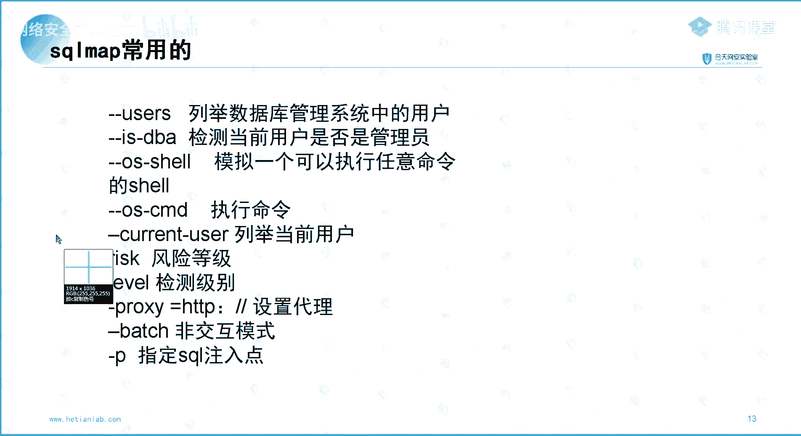

一个两个三个三个点，注意的呢就是这三个点，就是教你们一个习惯叫smap。py讲啊，它是一个文本文件，然后，这样就是你每遇到一个有四个猪的包，把它抠下来，然后你就这样把它给它放进去好，你可以看到我这里。

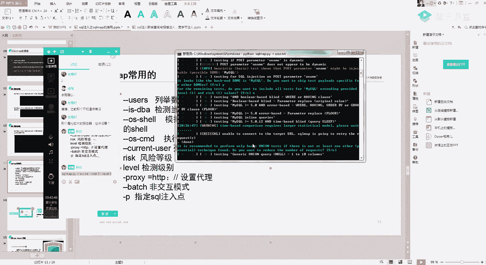

他说我的数据库炸了。

不能访问到这个url，没这么真实吧，没有，自然就开始进行了一个检测，这个东西老慢了，呃教你们一点那个，反正就教你们一个习惯了，这个万能的一个通用的异常命令，这条命令你们记住啊，我再跑一个吧。

他这个这么慢，搞到什么时候去结束了，然后我干p in 14难，是吧好用，那，好我就这样指定，然后我们可以看一下他跑的一个速度，啊哈哈，八参数后面打信号也可以哦，对这样也行。

它还有一个就是包着参数后面打星号也可以，但是有时候呢就是他这个新号啊，我在这是我个人而言了，我在用的时候有时候会有一点点bug，你懂吧，就是好像是遇到一个什么情况去了，好。

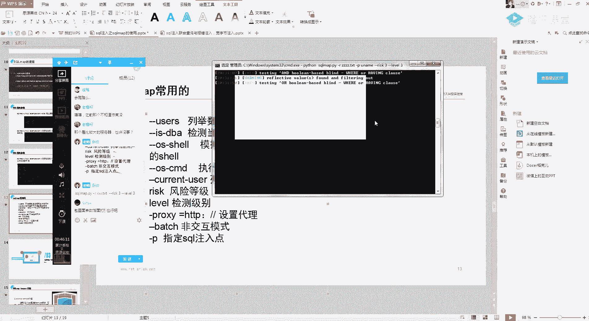

可能是我啊本地的这个pb 48的有点渣呀。

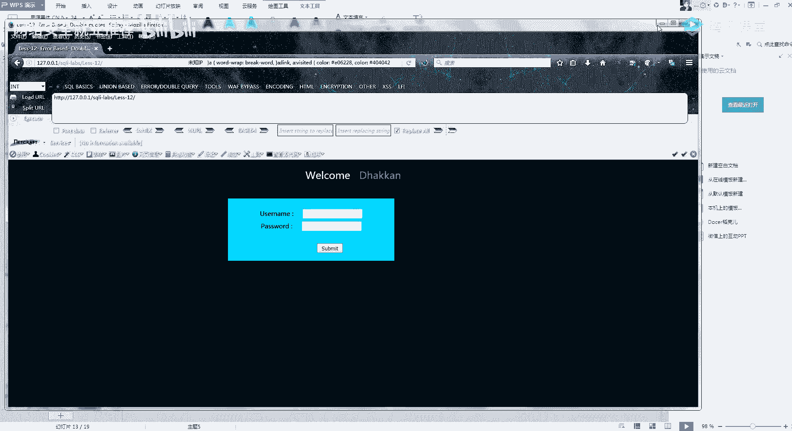

所以他跑的特别慢，主要是有个东西我又不能给你们演示，只能线下把这个直播给关了之后，才能给你们进行一个演示，哦我想起来了，就是我们在跑这一个呢，我们在跑这一个叫什么去了，再跑我自己本地的环境时候，我傻了。

我们这个靶场可以进行一个演示呀，这里呢有一个啊布尔盲注，或者是一个，这有一个四个输入的一个点啊，这个呢也是我给你们的一个考核，就是它这个有一点点过滤，还有这个select呢也会有一点点过滤。

这两关我先给你们讲这个吧，他这个跑我还不知道得等到什么时候去，因为跑本地你看他这个请求都慢得要死，我们首先呢我的一个建议呢，是自己在服务器上还是同样的，因为你自己电脑终归是要做一些东西的。

还是在服务器上弄一个smap，就或者弄一些扫描器，怎么就比较舒服吧，我们来试一下啊，这个，试一下它的几条命令啊，就是刚刚uc刚刚is dba，刚刚with shell。

这个呢就是你们还要记住的是一个刚刚vsc，这个功能，你们我只给你们演示一下，你们具体的必须得自己去看说明书，因为这个东西不实操的话，根本就体验不出什么东西，我们还是先同样的，查一下这个。

你看我这服务器上跑的一个速度，跟我本地跑的一个速度，对吧，完全是两个完全是两回事，这个速度，然后我们试一下，我们试一下这个刚刚us，他自己就会把我们的一个这个数据库里面的，那一个叫什么去了。

数据库里面的用户名都给你枚举出来，这里其实就是一个root，然后呢有一个注意的是，这个杠杠with shell，嗯你们应该理解，就是诶之前是有给你们讲过菜刀这个工具吗，菜刀，啊没跟你们讲菜刀吗。

呃那我要讲命令执行，这个就会比较尴尬，我就这样简单的跟你说吧，就是我命令执行的一个意思呢，就是我控制了我这一台，就是我控制了我这一个，搭建网站的这一台服务器，控制了搭建这个网站的这台服务器。

可以执行任意的命令，就是你比如说啊我自己在本地的时候，我可以执行命令，对不对，if看fig或者ping什么东西，那我这里呢有一个，四个注入点就是正常来说mysql的四个注入是很哦，没具体讲。

我在这里就只提一下吧，就是mysql的杠杠vs cl，干式呀，在遇到某些情况下是可以进行啊命令执行的啊，我就这里举个例子啊，因为我之前为了我这台服务器上拿，为了方便你们做后面一道题，我是降低难度的。

就是有一个科学，就是呢这里呢有一个对，这里可以直接拿下，这有一个目录呢，他有个可写的一个操作，就这样试一下啊，然后呢sk map呢我加上这杠这个杠杠vs gushell，你们自己先只要了解。

就是后面自己去实操持仓，就知道这个这个工具有多舒服了，反正要到周末了嘛，而且刚刚为干shell，所以呢我就给你们举例说吧，为什么要执行这个操作呢，就是比如说我一个fc它的一个漏洞评级，它有四个等级。

我这个四个注入只能到这个高的一个等级，就是它的一个设置注入它的一个评级是高高危，但是如果我变成了命令执行，那我的这一个漏洞就相当严重，他会多好几千块钱，这里也只给你们看一下啊，他这里的dwg是。

enable啊，然后死里，好可以看到这里就多了一个os干shell，可以发现，你会发现我这里呢可以直接进行一个命令执行，qun mi阿帕奇的一个权限，这个呢之后你们自己去拿着这个sc map进行演示。

就是你今天要记住的一个点，就一条命令，就是靠，我这个还没跑，这是我给你们发的这一条，我发群里好吧，sk buff干啥，这一条命令就是k和bp，配合bp这保存成一个txt文件。

然后再丢到这个super map，这一条你一定要牢记，我觉得super map的一个核心就在这一条，还有sk map的一个跑数据，这个你们去实操，今天要给你们讲的，就是不能只能跟你们讲这种呃。

没有什么一个技术含量的一个东西啊，因为它就是一个使用工具嘛，对不对，还有这一条是什么意思呢，就是设置代理，这里面也去研究一下，你们刺客buff就不会具体给你们讲很多了，就是一个单纯的工具使用。

这里要给你们讲的是一个smap的一个，temple的一个编写，啊应该你们知不知道wap是什么意思，wa，你可以简单地理解为一个防火墙呃，提前的话，我这节课不会教呀，我这节课不会教。

后面的话提前会有一些教程，但是提前没有在微博群里面知道吧，当然到时候我们可以搞点资料给你们吧，微博安全的课程是没有计划在地球的，其实其实也不难，按这些东西。

今天来教你们怎么用这个temple进行一个绕袜，可能你们啊今天就是因为才接触这个东西嘛，会有一个知识盲区啊，我就教你们一个简单的一个理解，就是你可以把这个这个temple呢就叫一个规则。

就是我可以自己编写一个规则，我可以自己编写4k map的一个规则，比如说嗯，然后我也不教啊，就是我不讲这种这么抽象化的一个东西啊，就教你们用吧好吧，直接教你们用。

首先第一个呢这里呢是一个smap的一个temple，它大概就长这个样子，就长这个样子，那我教你们用是怎么用呢，嗯还是我先把这个发给你们，我把这个取消了啊，先给你们看效果。

啊比如说我这里的有一关，有一个关卡呢叫slice的一个攻略，这关是什么意思呢，就是这一关你可以看到我们输入语句，这个set它这个地方呢把它过滤掉了，那我们输入，那我们丢到sc map里面跑呢。

我把他丢到这个map里面跑，我把它丢在4m里面跑，可以就可以发现一个东西啊，就是，因为我这里的一个select被过滤了，他的话可能就会识别叫什么呢啊，好吧，这个buff。

他这个他自己有一点点的一个叫什么东西去了，这个就很尴尬了，他自己可以稍微绕一点点一些，简单的一个waf啊，就是因为我这写的太简单了，因为写的太简单了，比如说可以这里可以用and，然后。

哇他这还是一个没有区分大小写的，就比如说，我看一下啊，这里直接大小写就能绕过去，尴尬，哦我想起来了，我用什么东西给你们演示看，稍微等一下啊。

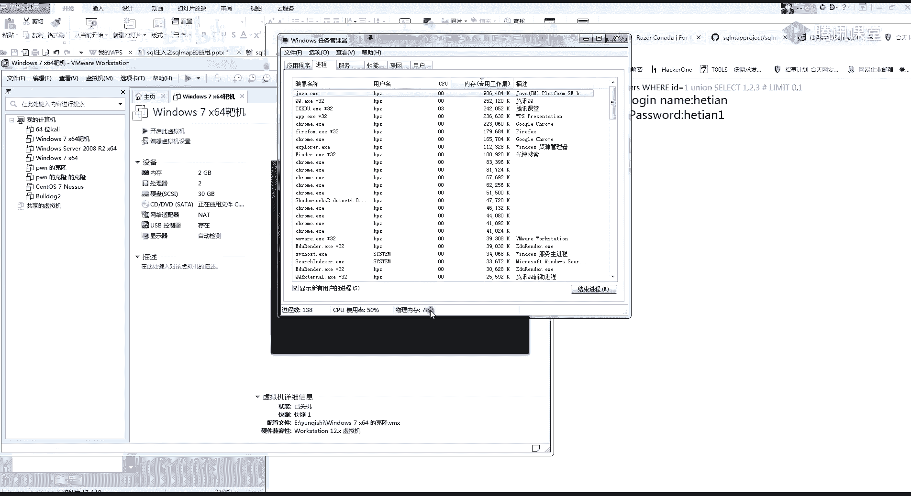

我开一个，我先看一下啊，有没有内存够。

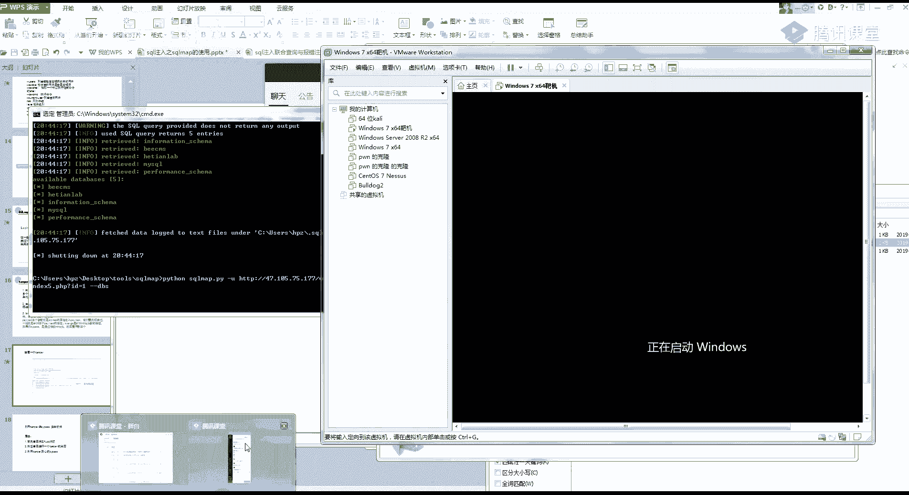

嗯他自带开g5 ，就跟你们说，就是我这个temple，可以让smap根据我自己制定的一个规则，来进行一个运行，比如说我这里的规则，就是我把这个select变成变成一个这个样子，啊我用bp给你们演示看了。

就是，首先我这一个，p x y是，这里呢是一个设置代理的意思，我这里的8080就是我bp的这个端口，我让这一个smap的一个流量全部走，我的bp，我们首先来看一下啊，我们看一下它的一个注入，你可以看。

诶我这有缓存了，我加一个刚刚temple，有缓存吗，换一个，好看这里，自然就会出现bp的一个他这一个镜头，我们以这一条为例啊，以这一条为例，啊你们是不是可以看到我正常来说，这里是slice，对不对。

然后我刚刚这里呢，这个temple用了我这个自己编写的一个temple规则，也就是说我这个select会变成这个样子，也就是说我这个包里面的这个，然后我这个and呢and的吗，这里的一个and呢。

就会变成我这个自己预定的一个样子，这个是根据自己的一个规则来写的呀，你可以看我自己的个and，就变成了我自己规定的一个样子，那我这个temple有什么意义呢，它这个temple就是，啊。

就是跟你们前面为什么要学它这个原理有关系。

啊，就是为什么要学它的原理，我们在遇到一些wave的时候，给你们看现在比较常见的一款waf，有点卡，你们看市面上常见一款袜子，我感觉今天的内容是不是好像有点太难了，如果讲cap的话。

我之前自己也扯了半天。

好我们来看这个。

嗯正常的检测，现在1。1，可以发现就是比如说我遇到这种呢，有一个网站防火墙的一个情况下，我们是不是啊，要想办法从这个网站防火墙里面绕过去，就是我要绕过这一个防火墙，会不会有这样的一些操作对。

就是脚本就是我写一个脚本吗，规定这个smap他会它的一个规则的一个变化，但是我直接拿防火墙跟你们讲，你们可能会有点，因为没有给你们讲什么，by pass对吧，该pass这门课要教的话。

可能我们这些课程不太够，我到后面我会发一些资料给你们，自己去稍微看一下，好你们就简单的理解就是我这个temple，你这个就是我给你们的temple，你甚至都不用改，你知道吧。

我直接在这个地方进行一个修改，规则就是你比如说我还要再加一行，我还要加一行，加一行，一个物，变成一个过2%，变成一个自己那个名字，你们后面的tao，你只要在这后面拿着这个tao。

这个规定的一个脚本在这个后面改就ok了，那它有什么用呢，就是我们在遇到wap的时候，你如果要守住，是很很恶心的一件事吧，应该说是特别恶心的一件事，你比如说我这一直在测试。

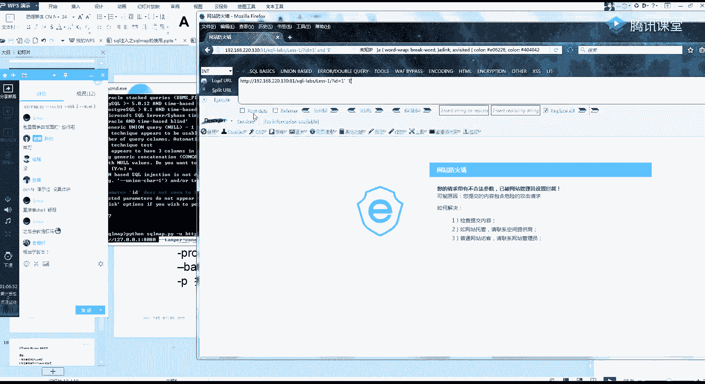

一直都是被拦截的，嗯比如说我随便输一个，and，看着没有回蓝戒。

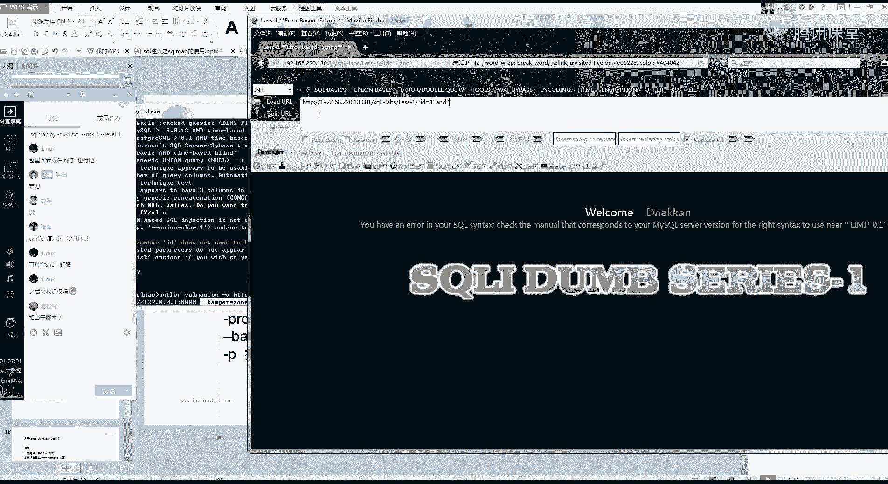

然后我取个单引号又被拦截了。

tx，但是我hex又没有拦截。

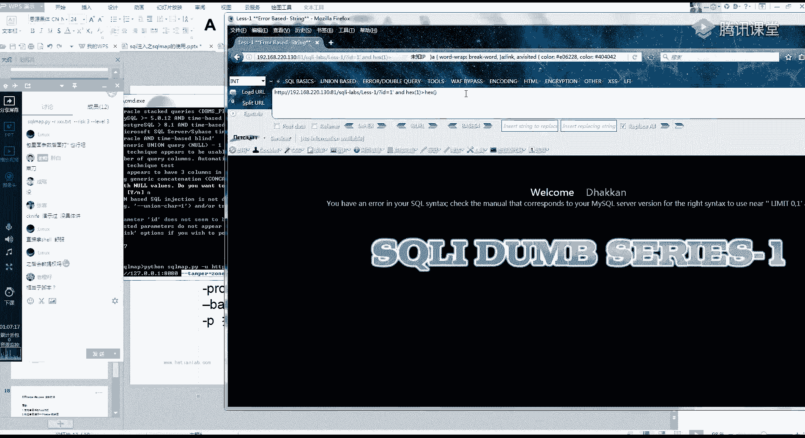

我再续个大鱼，你看他又拦截了，就是当我们自己手工测试出一些脚本，就是我可以怎么绕过这个buff啊，可以绕过这个buff啊，哦我找一下我的那个脚本吗，好像是这里吧，不知道还不还能不能用啊。

看一下啊，诶好像还能用，反斜杠a snet，这就很尴尬了，6v一啊傻了，就比如说啊我自己呢我有一个规则，我我自己测试出来了一个规则。

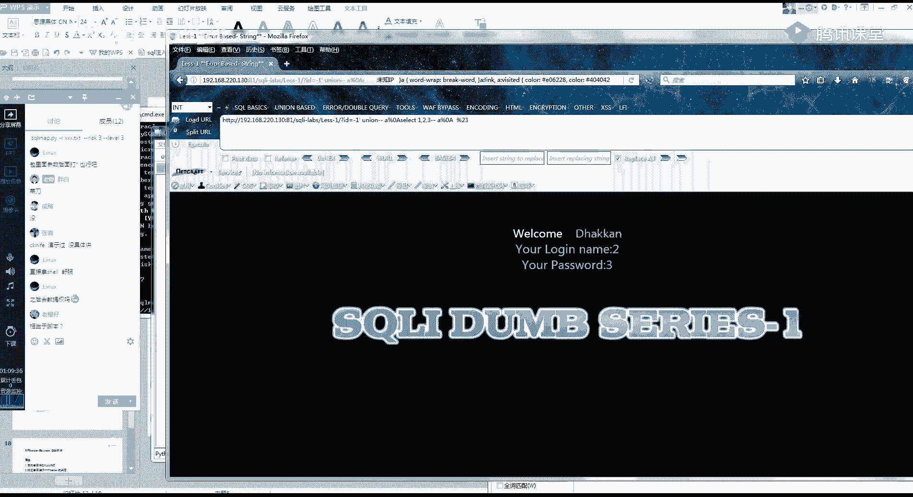

可以过掉这个防火墙，可以从这个防火墙里面通过我的一个规则呢。

大概就是一个这样的样子，比如说因为如果我直接用sc map跑，我是跑不出数据的，你们懂吗，我如果用直接用sc map跑，我这个防火墙肯定是会把我的一个smap，给他进行一个拦截。

那这个时候呢我就通过手工测试出来了，一个可以把这一个防火墙给绕过的一个方法，大概就是啊比如说我这是空格替换成这个样子，空格替换成这个样子，那你想一下，如果因为我cup，我肯定他跑不出来。

那如果我每一个啊，就是我每一个每一个文件，我都要自己去手工注入，那你那你有没有想过，就是我比如说我每一个空格都要替换成这样，或者还有一些其他的一些过滤，我都要我都要自己去手工操作。

那是不是特别麻烦的一件事，那smap的一个temple就体现出来了，就是啊比如说我利用这个temple，我在这里面了，我把这个给加进去，其实他这几个都一样啊，我把它这里改一下吧。

就是让我把我的这一个cao，这个规则给它写进去，这里的一个空格替换成一个杠杠1%，自己的一个括号替换成哪一个，这样用单引号吧，然后呢我就把它这个写到这个temple里面。

它的一个规则的一个变化写到这个temple里面，然后呢我再利用这个temple跑一下我的一个，存在安全狗的一个存在安全狗的一个东西。

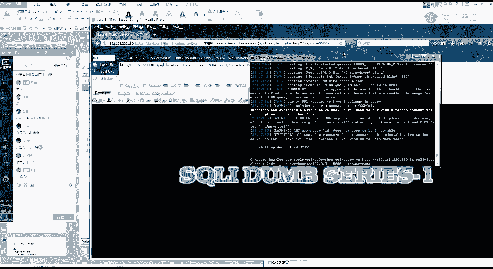

然后就要跑一遍，我们注意看一下这边的一个流量啊，就是你可以利用bp跟这个斯特曼进行一个，联合的一个组合，查看这个smap的一个pload到底是什么样子的，好他这里呢就开始了，我们来看一下啊。

看一下他的请求，你有没有发现他这里的一个空格，就变成我们刚刚替换的，而且呢你看他有一些是会被网站防火墙拦截的，但是这里呢用我们的temple的，它就绕过去了，还是因为我这本地的网络的原因啊。

他这个跑肯定还会跑很久，你大概的理解就是就这样理解，就是我把自己识别出来，我把自己啊，我把自己的一个规则，就是我自己发明的一个规则吧，就是我自己发明的规则，比如说我用我需要我发明了一个利用这个括号。

然后里面加一个杠杠a百分之a替换这个括号。

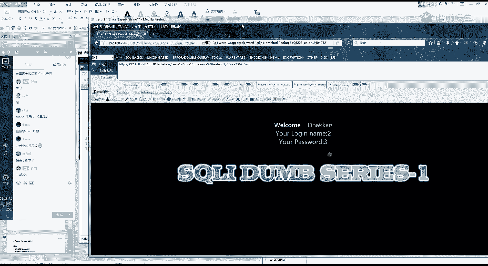

可以过掉这个防火墙，那我就把这个规则写到我的一个temple里面去，然后我以后我如果再用smap。

那我就只需要用这个temple，就可以直接把这个防火墙给绕过去，因为你自己手工的话是特别麻烦的一件事嘛。

所以这还是一个借用自动化，当然这个东西啊说简单也简单，说麻烦也麻烦，你们要自己去测才知道，然后今天的second mark的话，我觉得你们都得手动才有体验吧。

我这样讲，我觉得你们应该是一点体验都没有。

刚才就这样吧嗯。

你们今天用，你们今天用这一个smap把我们进行这个实验。

1234，你们随便挑一个，我这个这个是跑不出来的呀，这个smap是跑不出来的，你在前面啊，这个宽字节注入的话也有一点小技巧，你们就把前面四个，利用这个sc pop把他跑出来好吧，今天就当这个课后作业。

然后这个temple的话，我再找点其他资料给你们，帮你们理解一下好吧，因为我知道刚刚肯定没有说的很清楚，好今天的话也有刚好时间到了呀，时间到的话，我们今天就先下课。

然后你们自己去手动练一下这个smap吧，好吧啊，现在开始解答吧，就是你们先把自己的提问给哪些地方不懂的，你先写出来，然后我总结一下，我写个文档给你们扩到这个，给你们扩到这个培训的这个群里面去。

你们先提下问吧好吧，提问提问完之后，我就先下课，temple自带脚本啊，首先第一个temple它的脚本呢是cup自带的，它可以绕过一些简单的wap脚本，可以一个换，还是可以换一个加一个。

比如说and换掉了amd，分别用了，后面还有空格，and换掉了amd两个用处，后面还有空格，只有空格没换掉，那我再加个位置，你简单的理解为就是一个一个换还是换一个加，不是他换，是全局的，换懂吧。

他不是只换你单独这一个，他是会把你这里面所有的空格，或者所有的and全部都变为你自己写的这个样子，tap自带的脚本对你就是要加一个自定义的，知道吧，took cfd字典放在这里面的嗯，这个你得自己写。

我这里呢有一个脚本丢给你们吧，有一个好久以前自己写的一个bypass的一个脚本，但是你们要自己去改一下，我就是by pass，用这个sc level进行一个by pass的，q子的字典，我跟你说。

你字典的话肯定是最好的，自己就是社科map自带的懂吧，所以他们把它自带的字典，应该是有史以来所有强扫描器里面是最强大的，斯格拉姆的本质也就是通过啊，一个数组的一个字典进行一个判断的。

这个诶这个没跑出来吗，这么尴尬吗，哦忘记加参数了，然后我开始说的杠杠rsk刚刚l e b l3 ，不管是那个干拉还是你们这就用cp简单的跑，一定要有这个习惯了，就是把它给加进去。

这两个的作用呢就是提高它的一个风险等级，和一个检测的一个级别，也就是说嗯它默认的话，默认的话级别是一，如果你不输这个的话，默认级别是一，然后不输入的话，smap只会检测一些简单的一些注。

但是如果你加上了三的话，他可能会跑的时间久一点，但是它会检测的更加详细，就是更加仔细，嗯好，如果你们还有什么问题的话，你直接就干脆在群里面提好吧，直接在群里面提，然后待会就给你们进行一个解答。

然后今天我就先下课。

