# 【B站最系统的网络安全教程】北大大佬196小时讲完的网安教程，全程干货无废话！学完即可就业，别在盲目自学了！！！ - P14：第12天：SQL注入漏洞-布尔盲注，时间盲注及堆叠注入 - 网络安全就业推荐 - BV1Zu411s79i

美团啊，今天出来的美团有一个活动，就是最近的这两个web，你可以看他这专属范围内，它是有一个三倍的一个奖励，然后其他的话也会有一个两倍的安全币奖励，也就是说你可能平时挖个挖个。

比如说就像短信空大这种小洞，你可能就呃100 百来块钱，这翻个倍就是好几百啊，你们可以去看一下，然后要你们选的一个src的一个目标，应该有人选了吧，都选了吗，我我我待会去问一下班主任行啊，选了之后嗯。

明天或者什么时候吧，我就还是把原来的一个y sc的一个过程，给你们过一下，就简单的带一下，让你们了解一个流程，你们反正就是你之后就按照我这个流程，然后自己去找，或者你也可以有一个自己的一个思路吧。

怎么去找漏洞啊，你还没的话，你自己去选一个吧，你就觉得哪个看起来舒服，或者就是你对哪个业务比较熟，你比如说我啊，我饿了么也美团啊什么，如果你有一些啊，比如说商家的账号，商户的账号，或者比如说我饿了妈。

我可能有一些起手呀或者什么的账号，别人没有的，你这种啊就是你掌握的信息就是比别人多吧，然后你挖洞的一个概率就会比别人更大，好啊，八点了开始讲一下，简单讲一下昨天的一个呃，上周五吧，上周五的一个作业。

上周五就很简单，主要是让你们随便选一个简单的测试一下，一个buff嘛，简单的跑一下smart，这是我们的一个靶场吧，啊，简单的就是我把用四川up把这个跑出来，然后另外那个站的话，我待会儿讲完了。

就是我下完课给你们讲，下完课之后就给你们讲，那一个的速度是怎么来的，对吧，就拿着这个白色方面跑一下就可以了，因为施工具的话具体也不多说，本来这个盲注呢应该是在四up之前讲，但是可能稍微有点难理解。

所以我就放到这个smap后面，但是你们仔细听，我就是啊，我用我自己的理解跟你们说，这样的话应该会比较简单，首先你们啊可能对忙碌的话不太熟呀，因为之前一直跟你们讲的，是一个有回血的一个输入。

首先我们再来讲一下什么是盲数好，我们开始不是判断一个思考注入，还记得吧啊，就是比如说我判断一个四个注入，我这种有危险的，就是因为他会报错，所以我就知道他有一个四合注入，但是遇到另外一种了啊。

遇到这种布尔盲注，就是我加一个单引号，它并没有一个报错出来，但是你可以感觉到这个页面在发生变化，看到没有，这个ui in，我再加一个单引号没了，再加一个，大家好，他要出现了。

就是你能感觉到这个页面发生了一些变化，当然更好的就是告诉你教你们一个习惯了，万事你先就是你在挖掘漏洞或者在干啥的时候，你就开个bp，当一个习惯了，就是，当一个习惯我不管干啥，我都先开个bp。

啊我就跟你们说个比较有意思的呀，啊你们有人看斗鱼吧，斗鱼这种直播的平台对吧，上次我就啊挖挖漏洞，挖洞的时候，然后我那个bp就没关，然后点开一看，就是就开始看直播嘛，因为我有时候也看那个直播斗鱼。

然后点开看一下，给我看哎，bp刚好给关，我就看他过一下流量，然后就在斗鱼找了，找了两个洞，虽然都是小众吧，但也有三四百块钱嘛，所以说啊要有一个这样的习惯，干啥都开个bb，嗯然后呢其实我告诉你们怎么看呢。

首先第一个哦，我们来看一个正常的一个页面了，你们可以看到这个地方，它这里呢有一个679byt，它这里代表的是什么，就是我整个页面它的一个大小就是679，然后这里呢就是一个反应的一个速度。

它是把30m s吗，这个679反正不变的，这两个呢你们一定要注意啊，这两个东西，然后我们再来看一下，我加个单引号，695，再加一个679，再加一个695，再加一个179，这里呢是不是就可以发现。

它根据我们的一个单引号，加一个单引号，它就会进行一个页面的数据进行一个啊改变嘛，就是说改变就是有一些差异，但是我一个单引号跟三个单引号，它返回的结果又是一样的，这里呢你就有这样的一个思路啊。

首先我们的sql语句是这样的，我sql语句如果是一个错误的，那我就不会执行，就是我加了一个单引号，因为它是错误的，所以他就不会执行，然后我再加一个单引号，然后我把那两个蛋就是我前面加的。

就现在有两个单引号吧，两个单引号已经闭合了，然后就是一个完整的句子，他就执行了这个词汇语句，然后那个页面又发生了变化，这里呢就是一个盲注，待会儿给你们看一下效果就知道了，啊这里呢因为我写上了一个原理。

在页面里面，如果你正确执行的sql语句，就会返回一种页面，如果sql语句执行错误，就会返回另外一个页面，基于两种页面来判断sql语句是否正确，来达到一个获取的一个目的，这里呢要先给你们讲一个原理啊。

应该你们还记得吧，好我有给你们讲过，那个用and一等于一，and一等于二来判断这个四个注入存不存在，还记得吗，记得的话，并且理解与还记得原理的话，你就扣个一，就是用n一等于一，an一等于二。

既然记得的话，那就好说了，啊这里呢你们来记一下啊，咳，那就先看我的图吧，写好的呃，首先第一个我们看一下这条句子，这条句子能看清吧，id等于一，id等于一，然后呢这个debus的这个长度等于八。

啊我们这里回想一下，就是and一等于二的时候，他是不是这个语句就会报错，然后这里呢就会没有回血，当时我是教你们这样判断的对吧，然后你想一下，如果这个等式不成立的话，那是不是他没有数据。

如果这个等号成立的话，那他就有数据，就是跟我们的and一等于一，n一等于二一样的原理，对不对，这样这样说的话应该就很清楚了，然后我们再来看这个这里呢，你看我当我这一个长度等于一的时候，那它就没有数据。

那我当它等于八的时候，就是八是一个正确的嘛，那他就有数据，那我这里是不是就可以猜出，我这个data base的一个长度就是为八，因为它等号成立，那我再来看后面的，首先啊记一下自己一个函数啊。

这个你算啊叫什么去了，这里我截图还是发群里，就是你不要去死记硬背，待会儿呢我就拿一个句子，一个句子跟你们讲，你们拿着去套就可以了，用的多就自然熟练了，如果你去啊自己记住，到时候不会用，那反而没啥用。

这个呢我就发图，你们就暂时先不看，我们来看一下呢他这个盲注的一个流程，首先还是其实你可以看一下，跟我们原来的一个流程，其实基本上是一样的，只是它这里呢它要获取一个数据库的一个长度。

然后第三个呢就是猜这个数据库的一个名字，然后再拆这个表的数量，再猜某个表的长度，当然了，就是很多地方很多步骤你可以其实可以省略掉，但是你一个正常的一个逻辑是这样的，就是正常正常的一个拆解的一个过程啊。

首先我们来看它的一个过程是怎么样，第一个判断注入不用讲了，第二个就是获取数据库的一个长度啊，为什么要获取长度呢，啊，你比如说我刚刚这里获得了一个数据库的，长度是八，然后我再来结合一下前面的一个字符串。

这里是截取字符串，啊因为忙著的话不了这个，我就觉得你们不看了，我直接用实力跟你们讲，我觉得看这个反而会头晕，我们来看一下啊，首先我们来看一下我截张图，搞张图放这，然后把群屏都开着，好首先我们来看一下啊。

这里呢是盲注的第一个过程，这是我这个id等于一，and left less debus，然后1=1，这个left是什么意思呢，你来看这个比较一下。

首先这个left n this name是不是就是这个slibbe，就是我们的数据库名，然后呢我这一个一就是啊，你简单理解就是，啊这个数据库名的第一个字符，然后我这里呢前面有一个and。

那是不是只有当我这一个，就是当我后面这个等式成立的时候，就只有这个left select device一等于s的时候，它才会返回一个正确的一个结果，对不对，就是1=1嘛，到这里能理解吗，啊能眯着眼的话。

你还是扣个一，不能理解就扣个二，你先把啊，还有，基本是都理解了吗，都理解的话，后面就很好理解了，就是啊如果都理解的话，后面就很简单了，看一下啊，基本上都在这儿了吧，好我们继续来看，再看第二个句子。

再看第二个句子，林肯第一个句子是截取这个debu，第一个字符是s，那我后面猜第二个字符，第三个字符，第五个，第六个，第七个，第八个，是不是也可以用同样的方法来进行一个拆解，我们用还是用这个。

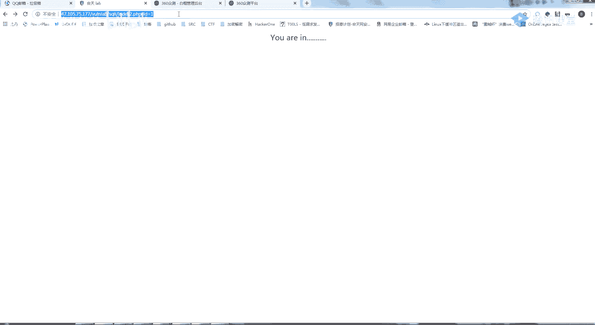

啊首先为了快速啊。

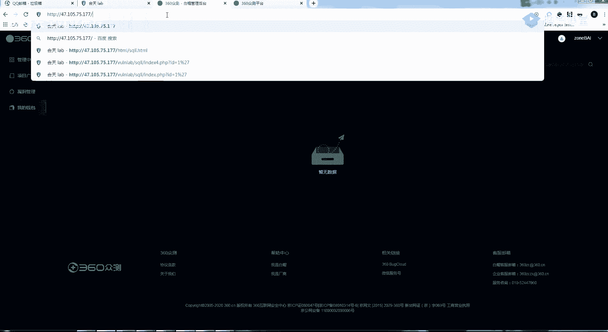

为了快速，首先我们还是先从这个缝隙来看一下啊，啊首先它这一个，数据库名是叫和田apple，对不对，你们当时做的什么数据库名是和田nel，然后呢呃我先不用忙忙著做好吧，我先用这个做。

就是我and一等于继续看啊，and一等于一，就是我and一等于的时候，这个页面它是返回正确的，然后我and一等于二，那它是返回错误的，那我比如说我把这两个条件改一下好吧，我把这个一和一改为一个debu。

等于一，那他是不是这个dbs肯定就不等于一，因为它是等于和田的apple嘛，所以这个语句他就报错了，就是我这个数据库就没有执行，那我当它等于和田nel的时候呢，因为debus肯定是等于和田nel。

那我这一个就是相对于这个等式是成立的，那我这个就会返回一个正确的一个结果，那我在盲注的时候是不是也是一样的，呃首先他这个门就应该是，我这1=1啊，n一等于一，它是ui in n一等于二，他这里就没有了。

同样的，那我是不是可以从这个debu来进行一个拆解，就是哦就是我通过一个一个拆，就可以把它这个数据库明给拆出来，到这部分应该说的很明显了吧，然后呢这里呢就是一个开表，就是我们拆完数据库名。

是不是要开始进行拆一个表的名字了，当然这里呢我不会跟你们一句一句的，就是让你们自己去做啊，因为是很傻的一件事，里面还是最重要的，首先是理解，看一下这里呢是and这个left呢，然后你们就跟前面的一样嘛。

就是我截取这里面这一条查询语句的，第一个结果，看到没有，执行这里面的第一个结果，啊我拿个笔一个一个来啊，首先是and，然后呢这里呢就是一个整体懂吧，这里呢就是一个完整的一个查询语句，就是一个整体。

你说从这里开始，这里呢就是一个整体，这是约我这个circle的一个查询语句，它会返回一个结果嘛对吧，我自己呢就是查这一个表的名字，然后当前数据库的这个表的名字，这一条你先不看，这条语句应该很熟吧。

让你们度过无数遍了，包头猪肉呀，还有啊联合诸如都做过，然后呢我就返回啊，我们原来的一个数据库名，它的一个表明是不是有四个表，有四个表对吧，那我四个表，但是我要猜的话，只能一个一个的猜，一个一个的猜。

因为我每次只能猜啊一个字符嘛，对不对，那我这里呢就利用这一个limit，我们看一下它这个是什么意思，返回a加一开始的b条记录是什么意思呢，就是比如说我是一杠一，那我返回了就是第四个表中的第一个。

那是从零开始吧，它的一个总整体意思呢，就是我返回我自查询表里面的第一个表，然后的第一个表再截取他的第一个字符，看它等于多少，因为我可以用大鱼跟小鱼先来判断嘛，然后判断到一定的值，就再用等于。

这条语句能搞懂吗，这条语句能搞懂，你就扣个一，我后面就不会很细，不会很细的说了，因为后面的语句都是一个意思，它的大于小于是按照abcd顺序吗，啊有几种啊，一种就是比26个字母吗，对啊。

因为啊我们来看一般的一个表明跟一个列名了，你看他们是不是一般都只有，最多就是数字加上字母，再加一个一个，那我猜的话啊，我只要把这几十个字符给他全部猜一遍，它总有一个是对的，对不对，他总有一个是对的。

当然这里我是要你们理解这个语，句的一个意思呀，不是让你们自己手工去把这东西给拆出来呀，不然我也不会教你们用csmap的，最开始就叫你们能理解这个语句的意思吗，不理解我就再给你们说一遍，首先这个and。

你就先不看，然后呢这个left它就是，反函数返回name啊，我搞个我搞个东西给你们试一下好吧，the ney cut，好我们首先来看一下啊，这一个left，比如说我这是2005，然后取一。

我们看一下我这个left me，这一个一它是不是返回a那我取一个五呢，那他是不是返回我的命，那我取个二呢，他是不是返回d，对不对，a跟d，那我同样的啊，我置顶了，首先我是第一个字符。

因为我要猜是猜第一个字符，对不对，第一个字符我们这里就用desps来代替，啊因为这一个呢是一个x s s e r，它的数据库名是xs s e r，所以我第一个就返回的是s对吧，那我第二个返回的就是xs。

同理第三个就是xs，第四个就是x x s1 ，那我这里呢是不是有一个东西啊，就是我首先我猜第一个字符嗯，我用这个来进行啊，用这个给你们来说明，看一下啊，首先你看这一条还是同样的呀。

我们一个一个通过参通过这个语句来看，这个表太多了，我找一下原来的表啊，原始的表，好我们来看这个，首先你来看这个语句，首先这条语句是查询它的这一个数据库的，表明这个应该还是记得的对吧。

那我加一个这个呢嗯加一个limit，1~1，啊还是扣掉啊，看一下啊，首先第一个表是email s，对不对，那我自己从零开始，因为它的意思呢就是，从a加一开始取b条数据。

就是我从零开始取第一条数据就是email，那我啊取两条数据就是email加f1 s，这个能理解吧，那我这里加一个left，我把这个括起来，嗯还有个括号吧，几，啊我首先这个返回的是email。

那我这个left在边上加个一，那第一个是不是返回的一，第二个返回的是em，第三个就是返回的emma，然后到后面一直加一直到返回email，就整个表到这里可以理解了吧，就是我这条语句它的一个意思。

那我是不是就开始拆啊，比如说我自己呢它是不是小于啊，就比如说它是不是大于a，大于a，大于a它这里要返回的是一，比如说我是不是大于，他还是对的兵啊，a b c d e f大于f，它返回的是零。

然后我如果因为它等于嘛，就是我等于一哈哈等于一，它为什么是返回的，这个这个我得去研究一下啊，他好像大v1 ，他也是对的，他这个就有点奇怪，他这个不服，它的一个整体思路就是通过我这条句子。

它是不是正确的来进行一个判断，这个整个的句子是不是正确的，到这里能理解的，你扣个一，应该讲的挺清楚了吧，嗯好，所以呢这个啊这个查表明他就是这样，一条一条这样查下去的，同样的呀，同样的这个查列也是一样的。

你看这条查列的一个语句，这个呢就是查这个username的第一啊，第一列，然后通过这个字符的这个对比来进行一个判断，那它有什么用呢，就是我自己呢主要是教你们思路，这同样的这个差值也是一模一样的。

你可以看他之，我就是先查这个password for users，然后第一个值，然后的第二个字母，就是从左边开始的那两个字符嘛，等于这个如果是正确的，它就会返回ui in，如果是错误的。

它就会什么东西都不显示，这里呢就是一个盲注，应该很好理解吧，好那理解了之后，我就再带你们看一下啊，记住啊，记住这个and呀，一定要理解，因为延时盲注跟盲注也是一样的，一模一样的。

首先你要记住有一个这个东西啊，就是，我这里面呢这个查询里面，sql语句里面有一个sleep的一个，他就是睡眠的意思，我给你们看一下有什么用啊，比如说我睡眠五秒，你来看一下1234，看到没有。

睡眠五秒之后他就弹了，比如说我睡眠零秒是不是马上就瘫了，我再睡眠十秒呢，然后你就自己数十秒，看到没有，它的一个意思呢，它的一个意思就是，让我们的一个数据库睡眠几秒，你这个sleep是几，它叫睡眠几秒。

那我讲这个有什么用呢，啊我们还是回到，这个首先我用这个数字型的一个注入好吧，然后呢还是回到我们的这一个里面看一下，我这里要加一个and sleep，两秒，有没有看到这个网站反应的有点慢，回过头来啊。

到这里来，他自己是不是返回了两秒，我这里加一个零，他是不是只返回了28ms，我再加个五呢，他这个网站返回了五秒，这个首先你要记住，有一个这样的一个sleep，然后呢有一个if语句，if的话。

如果你们写代码的话，就知道了一个判断语句，他这一个时间注入呢就是这样来的，就是第一个，如果第一个语句正确，那他就会执行第二个语句，如果错误就执行第三个语句，那你看一下这个and。

如果s s等于s等于s是正确的，他就会执行这个sleep，否则就会执行这个一，所以他的依据呢就是我如果在前面是正确的，那我就会延迟执行这个sleep，错误的话就不会延迟。

因为这个执行一的话是没有起作用的，那这里的s等于s，是不是可以结合一下刚刚的一个盲注，就是我一个查询语句，我是一个盲猜的语句，sli啊，猜比如说猜他这个数据库名等于多少，如果他前面这个等。

如果前面他这个句子成立，那我就会sleep，如果不成立，那就不会延迟，我们来看一下这个，如果这个debust的第一个字母等于s，那就会延迟，如果不等于它，就不会延迟到这里，那就能理解了吧，可以理解了吧。

延迟注入跟一个延迟注入，跟一个盲注的一个区别，啊这是我学习注以来的一个理解啊，呃理解的话，你还是扣个一吧，让我让我知道一下好吧，如果不知道，我就再给你们讲一遍，只有四位同学啊，完全理解了吗，五位，六个。

好七位同学理解的话就是超过大部分理解的话，我就先过一下，如果不会的，你们可以直接私聊我，或者私聊我们的助教，其实群里一直有个助教的，然后你们一直啊这里呢这个是一个助教，但是感觉没有啥区别。

放心待会儿晚上就会让你们看到一个区别，就是我除了忙注，我还给你们找了一个时间录的一个漏洞，就是单看它的一个写法来是没什么区别对吧好，我们来看一下啊，给你看个有意思的嗯，是第八关吧。

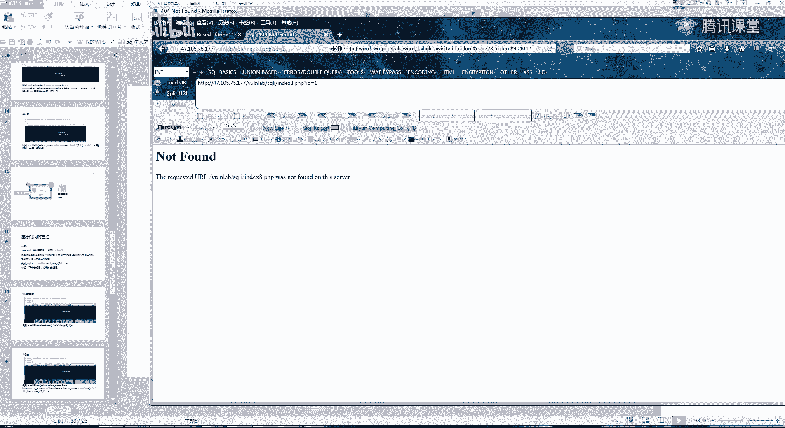

好像八关还是第九关去了，第八关是啊，我看一下啊，id等于一，下一个这里呢你看我加一个单引号，它就产生变化，就是一个盲注好吧。

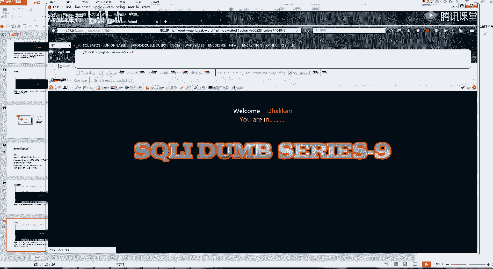

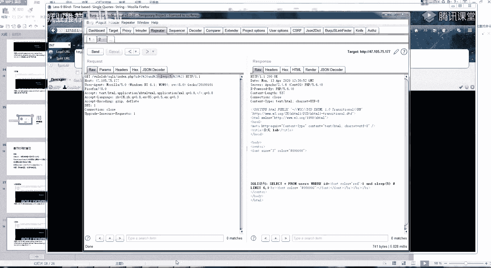

你看我这第九关，我家这单引号有区别吗，诶这好像是加双引号。

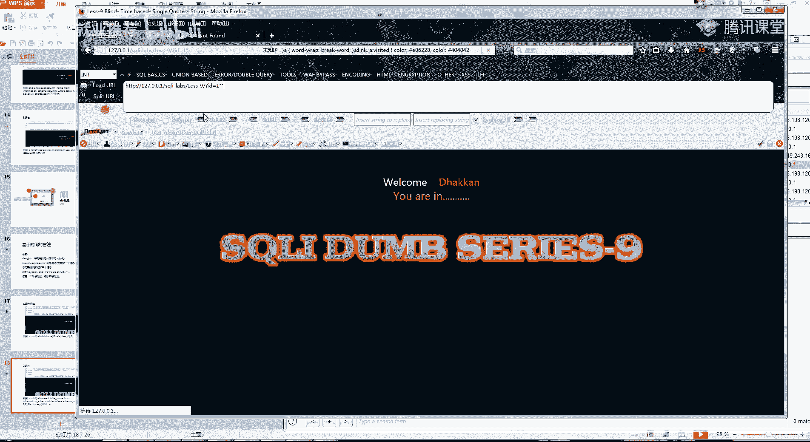

没有。

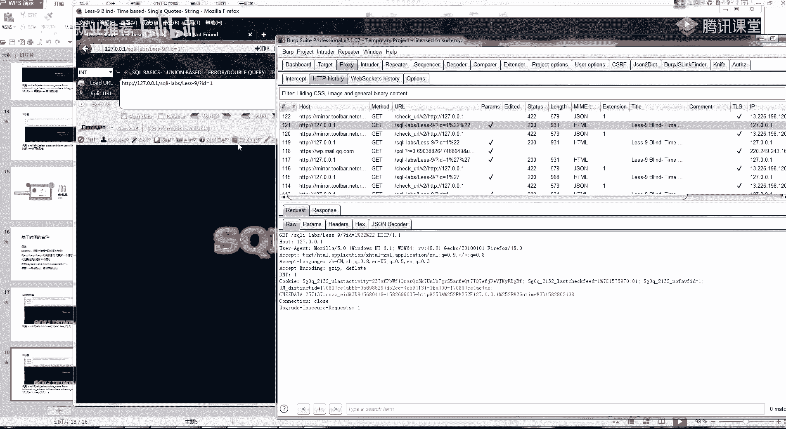

那应该这就是一个时间度，你看我自己加单引号也判断不出来，他是他是是不是一个注入。

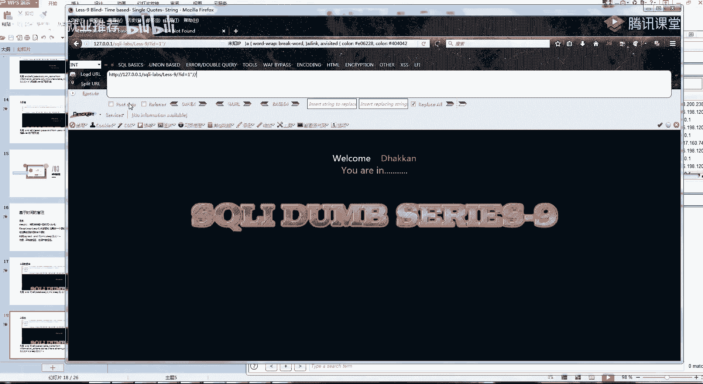

双引号也判换号也判断不出来，反斜杠呢，反斜杠也判断不出来，那遇到这种注入，那我是不是就只能用啊。

看一下它能不能执行sleep，and，加个五，然后就是三。

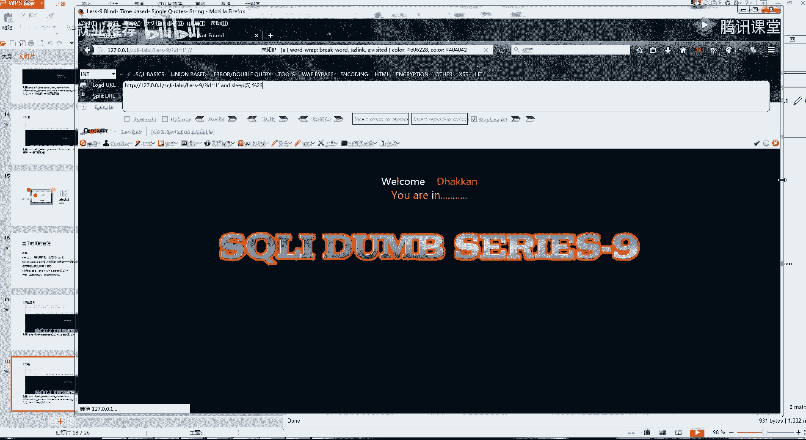

看到没有，你看一下刚刚他反映了多久，他是不是反应了六秒，那我再改一下leaf 0，一秒一秒加五秒，是不是刚好就六秒，那我这样才判断一个sk注入，就是我常规手法，我没办法判断出来他是一个十字路呀。

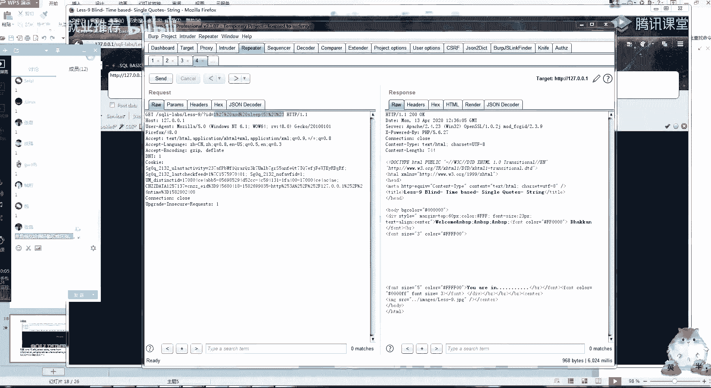

只有通过这个sleep能理解了吧，为什么要学这个。

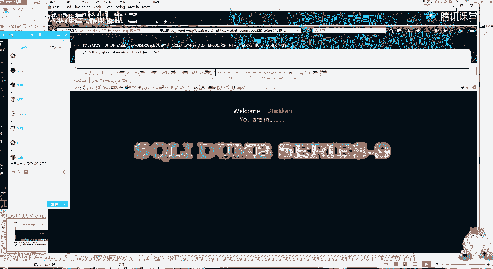

它的一个就是为什么我跟你们说啊，这你如果如果我不跟你们这样讲，你是啊，你可能自己就慢慢去学会，学的很慢的，我跟你们讲的就是他的一个判断方式是一样的，然后其实后面都可以看。

我就是这个if这个地方改一下这个语句，那就行了，判断帮助，这样就ok，呃，还有不清楚的吗，就是那个啊延时注入跟盲注，还有不理解的吗，当然我教你们最好的办法就是今天，这个待会儿待会儿跟你们说。

待会跟你们说啊，好吧，你这一个同学也可能违规，这个呢我们就都在这个小课堂，小课q群里面说这种东西，待会儿下完课会给你们讲，同样的啊，我之前教你们的smap吗，为什么要教你们的smap。

因为我刚刚啊你们刚刚看了一下反应速度对吧，就是我如果进行一个盲猜，你有没有思考过，我把一整个我不说，我不说把数据全部都盲猜出来，我光是把一个不光是把它的表明给盲猜出来，你算一下时间都要多久。

每个语句每个人这样猜，他，每一个你就算用二分法，就是大于小于这种啊，你每一个字符都好像要拆拍多少次啊，反正要拆挺多次，因为别墅你把所有都跑出来了，啊没事没事，这个只能我看得到，所以说你想一下。

这时候告诉你们的好办法就是啊，首先我先是手工判断了，记住啊，盲注跟这个刺客跟这一个时间录入啊，你不管扫描器扫没扫出来任何的猪，你都要知道怎么手工判断，就是我首先我要知道怎么判断他。

扫描器有没有给我一个误报，然后我跑出来之后，我就把我这个盲注的这个url，同样的就是map里面，昨天我跟你们讲了一个，最快的一个，就是我啊最方便的一个吧，就是我利用这个bp这个包。

把它铺成一个text的文件，然后用smap进行一个打开，然后呢smap gr，然后就让他自己跑了，你看这盲蛛，它就自己萌猪出来了，其实你可以看了他这里盲目了，check map也是一个一个一个一个拆的。

你看他出来的一个速度，它是不是一个一个拆，只不过这种自动化的，就比我们手工要舒服太多了，它也是一个种植的这么多菜，你看，他首先第一个是它有几个数据库，这个数目也都是一样的呀。

然后再拆这个数据库的一个名字，然后再一个一个菜，所以说呢我们的这一个啊盲盲注的话就是这样，然后你这里有一个延时注吧，延时注入力位太慢了呀，他这个时间忙不特别特别慢，我这里就首先我简单的判断一下就好了。

就是我不跑dbs了，ebs可太慢了，你看看他这就测试这一个延时注入，那接下来呢还要给你们讲一种啊，还要给你们讲一种，就是叫堆叠注入。

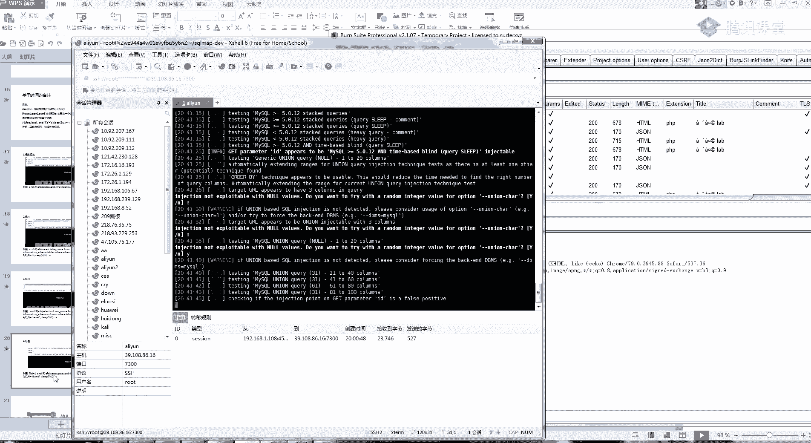

要给你们讲一个堆叠注入，这里呢我就随便让他跑了。

前面两种盲目应该讲的很清楚了，我觉得要给你们讲一个堆叠注入，比较有意思的一个注入啊，首先我们看一下这个sl语句的一个特性，就是我这里用逗号隔开，你可以发现我这里呢就会执行两个语句。

比如说我这一个首先我执行一个，然后我用这一个分号隔开，那我再刷前面一个，看到没有，我用这个分号隔开，user，password，拍个什么数据库去了，嗯等一下啊，还有个什么表情啊，mail，报什么错呀。

room，好可以看到我这里加一个分隔符的话，它会返回两个结果，就是我如果利用这个分隔符，那我这一个语句就可以执行两个语句，然后呢如果有分隔符的话，对你好的好的好的好，就是我如果有两个语句的话啊。

我如果可以用分隔符，那我这一条语句是不是可以自己随便输入，就是我包括啊，因此，从此处包括更新，包括delete，然后包括我的update，就是更新数据堆叠注入呢，就是我如果可以用单引号隔开的话。

那我所有的一个查询都可以做，就是后面所有的语句都可以做，那他什么时候会出现这种东西呢，首先我们来看什么叫堆叠输入，就是一堆sql语句可以一起执行，然而真实的运用也是这样吗，首先我们来看第一个。

我们从源源代码来看嘛，看到这两个没有，这两个函数，我们看一下，qq语句里面的一个函数，首先第一个它的一个sql语句，这是他的sql语句，然后呢他利用这一个函数来执行这个sql语句。

这个函数呢只能单条执行，看我这上面的一个说明，只能支持单条的一个数据库查询，但是呢这里呢还有一个函数，就是可以执行一啊，执行一条或者多条查询，然后多条查询的话，就用这个分隔符分号进行一个分隔。

这里呢啊十秒钟给你们看一下，记住这两个函数，然后我们看正常的普通的sql语句啊，就是普通的sql注入都是指单调的单调的，但是你想一下，如果当一个业务啊，就是如果这个业务的这个地方啊。

我我有多条sql语句要运用的话，那是不是只能用这个函数，你看，原理还是一样的，就是我这个sql语句带进去，唯一的不同点呢就是我这个地方啊，我可以用这一个单元，这一个分号来进行一个执行。

就类似这里我这里呢执行了一个id等于一，然后又执行了这个intrintr，就是像我的这个id，就是在password里面加入38再38ho，当然这一种呢也比较难遇到呀，所以呢只给你们提一下。

就是可以进行一个他这种就权限很高。

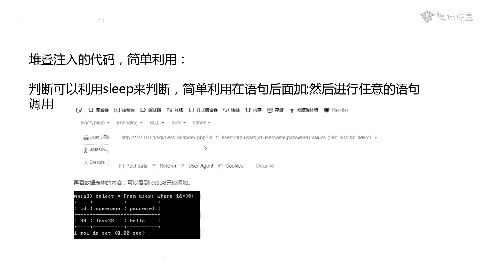

可以执行任意的一个sql语句，可以执行任意的4k语句。

那我为什么要跟你们讲这个呢，啊待会呢会给你们看一下一个，就是除了我之前给你们的两个四个注入呀，还会给你们看一个新的这个注入，当然那一个我待会会在群里面进行演示好吧，然后关于今天的第一个堆叠注入。

还有两个盲注，不会的，你现在就在这里面说，直接给我提问，然后我就给你们解答一下，再过五分钟左右的话，我就直接下课，然后在群里面给你们看一下小课，记住啊，重要的是理解，堆叠还是不明白好，我再讲一遍。

首先第一个，我这一个思考语句里面，就是我是用分号进行一个划分的，就是我一条查询语句，我是通过一个分号，你看比如说我这里呢，我这样就会有两个结果，结果一结果二，那我再来一个，嗯看看还有哪个表。

我这样呢你看底下两个结果，现在是不是会有三个结果，就是因为我sl语句是通过这个分号来进行，一个注入的啊，这就是我通过这个分号来划分一个sl语句的，这里能理解吗，能理解的话，你就扣个一，它是通过这个封号。

好，然后呢它有第二个函数，看到没有，这里呢我们的菲律宾里面，它有这样的两个mysql的一个执行的一个函数，他这一个函数你看到没有，因为我sql语句要执行，对不对，我的整个程序。

我要跟我的一个数据库进行一个交互，那我就要一个函数执行这一条sql语句对吧，然后呢我这里呢刚刚我们首先回到这里，我们的分号是执行一条四个语句，那我在我的这个后面还是回到原来的质量，啊这个这个语句。

这个id这里我把它改成这样，那他我这个语句是不是就变成了这个样子，我用分号执行了前面的这条语句，然后又执行了这后面一条，然后又执行了这一条，就执行了三条语句，三条四条语句，到这里能懂吧，自己能懂的话。

这就简单了呀，就是因为这里有一个函数，我这个mysql函数，它可以执行一个或者多个数据库的查询，就是跟你普通的sql注入没什么很大的区别，只是堆叠注入啊，因为你想一下我堆叠注入，因为我可以用分号隔开。

那我后面的语句是不是可以自己随意，比如说自己进行一个更新啊，或者进行一个删除啊，对不对，都是可以自定义的，但是我们原最原始的一个cil注入，是不是只能啊他这里查询的话。

那我只能用一个u n i o n直接查询，就没办法用我们的一个分号进行一个隔开，很简单理解，就是堆叠注入要比普通的注入权限大，可以理解了吧，嗯然后呢给你们的一个现场的一个实战练习。

就是这一个知识的一个思考的一个绕过，对助教老师都出现了呀，这里呢是一个，b e s的一个cm s，你们的一个课后作业呢，就是我我不要求你们把所有的都注入出来啊，我只要求你们啊注入出一个表。

都是数据库名吧，我只要求你们把这个数据库名给输入出来，就可以了，当然你们想做更多的就自己去做，你们如果把这一个啊就是单纯用思考注入做呀，做完之后你们应该就可以理解很多东西了吧，这个猪差不多就掌握了。

剩下的就是自己去寻找漏洞，对id。

然后后面加个分号，然后你后面再执行这个语句就可以了。

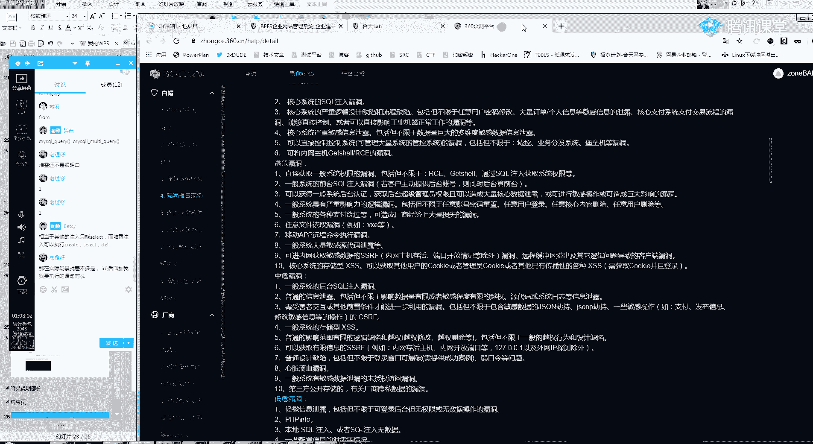

好然后呢嗯你们今天得我还是发公告吧，我写公告里面4月13的一个作业，还没有选择src的，就把src发给班主任啊，明天的话，因为明天是我四个柱子最后一节课了，然后我大概的话会休息个一周多。

中间是啊啊小姐姐给你们讲，或者是另外的啊，呃刘师傅跟你们讲，然后我明天的话就带你们挖一下，你们选择sr c的话，明天大概是明天吧，明天你们就跟我一起进行一个漏洞的挖掘，进行一下尝试啊。

挖洞的话也没那么难的呀，今天今天我大概跑了一下，美团的话，今天也就也花了一两千块钱，1000多块钱吧，反正也就弄了，就交了两个简单的洞，好那今天的话就下课，剩下的我群里面给你们讲一下那两个输入呀。

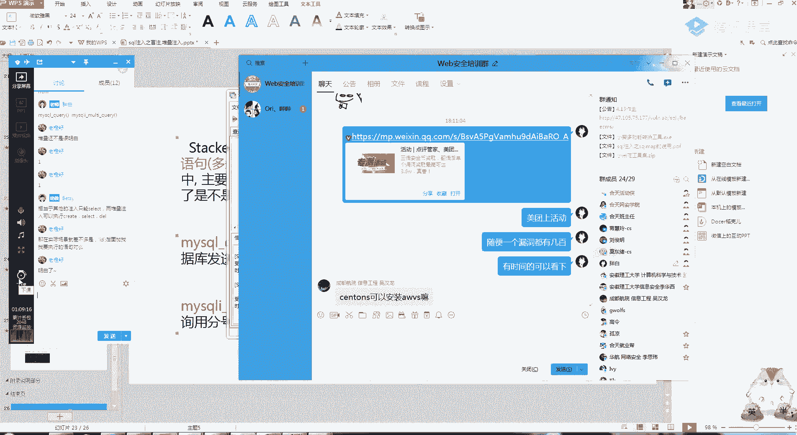

好吧，在群里面开小课。