# 【B站最系统的网络安全教程】北大大佬196小时讲完的网安教程，全程干货无废话！学完即可就业，别在盲目自学了！！！ - P18：第16天：文件上传漏洞靶场实操 - 网络安全就业推荐 - BV1Zu411s79i

就是对于我们在进行一个文件上传的时候，好针对他的一些检测方法，我们啊给大家介绍了一些啊，就是如何去针对他的这种检测方法，来进行一个绕过来，来上传我们的一个web shell木马，然后这节课的话。

我我们把上节课就是没有给大家，就是讲完的这样这样的一些内容，就是说通过我们上节课讲的一些内容的话，我们在这节课呃，在更加深入的，通过实际的一些操作来给大家做一个啊，更生物的一个理解，然后大家应该也嗯。

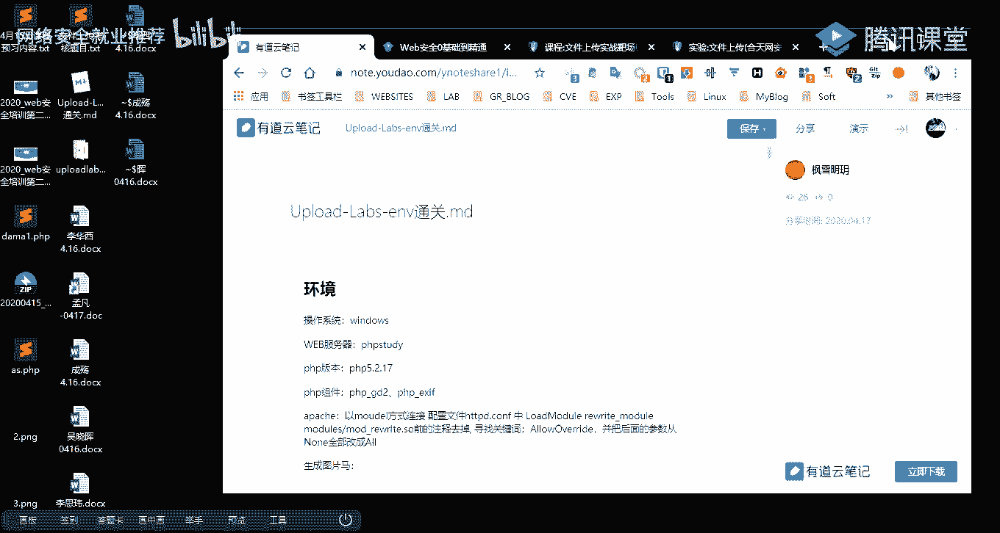

大家应该有做这个我发给大家的一个靶场吧，就是这个，然后的话呃我看大家都在全年的话，是有一些问题，就是说有一些关卡完成不了，对吧，就嗯，所以说我特意就是发了一个。

我自己已经配置好的这样的一个菲律宾study，呃呃因为它里面的一些关卡的话，它需要呃对配置文件做一些配置，因为它需要有这样子的一个条件来，才能够去进行一个利用，所以的话嗯我这里的话是用。

就是已经帮你们改好了，你们直接用这个就可以了，呃但是可能就会有一些问题啊，我这里的话就大概。

针对大家提的一些问题做一个解答吧，然后大家看我这样这里的一个文档，其实我这个文档的话已经呃写得很详细了吧，就首先的话环境的话就是呃大家看一下，这里的话需要有两个组件，这两个组件的话需要开启。

开启这两个组件的话，呃，我们在这里这里的菲律宾study，这里有一个菲律宾扩展，我们选择这里把这两一个两个勾勾选上，这个还有这个勾选勾选上好的话，还有就是一个阿帕奇，它需要以这个mod方式去进行一个连。

接，好的话，我们需要修改它的一个配置文件，就是把这里的一个重写的一个模块给他，给呃前面的一个注释去掉，也就是把它给开起来，然后嗯，好配置文件的话，我们在这里直接右键。

然后这里不是有一个hdp d干空乘b，然的话我们用编辑器打开，然后找到这一行，然后把前面的一个注释给进行一个去掉，就是这里啊这里的一个注释，前面原原来的话是有一个注释的，就是有一个减号。

这样的话我们把它给去掉，然后去除他的一个注释，还有的话就是呃有一个这里有一个这个，roy override，这个的话其实默认的话它也它是word的，然后我们找到所有的里面有这个的，把它改成一个or。

其实这个的话关系不大，然后还有的话还有一个就是大家在做那一个，就是修改成那个就是绕过那个黑名，黑名单的时候，我们啊比如说其他的一些。

就是啊可以解析的一些菲律宾后缀。

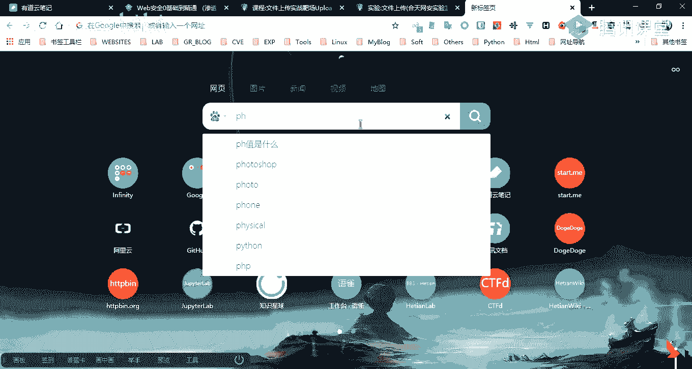

比如说嗯，比如说kh比啊三，还有kh p是啊，还有五等等的，这种，就是都是呃，可以去当做一个p h p的一个文件去解析的。

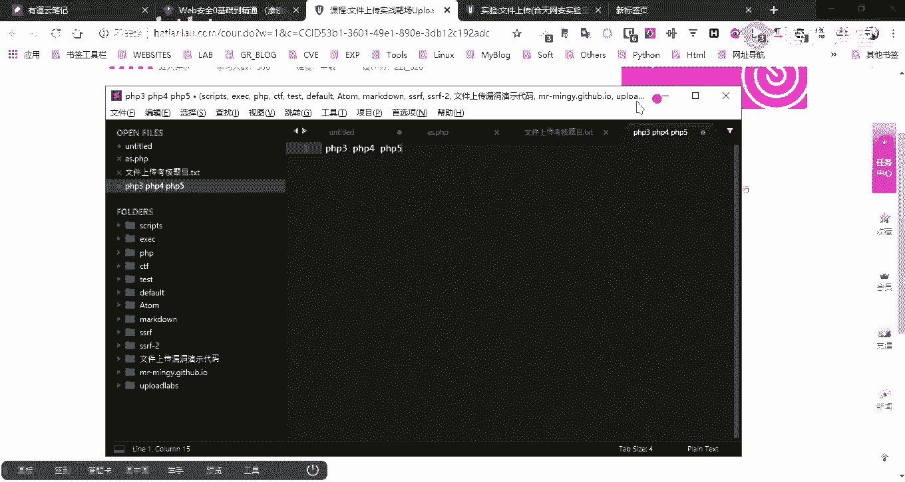

当时的话它的一个前提条件，就是我们在配置文件里面，这里需要有一个这样的一个a type，这一行，就是把我们的这里的这种文件，后缀的一个啊类型，就是我们可以把这种啊扩展名，把它当成一个啊。

菲律宾的一个文件去进行一个解析，这样的话我们需要添加一下，大概的话就是这里这里的一些问题，大家有碰到的，然后我发给大家的，这个的话是我已经有配置好了。

呃然后的话我们回归我们的一个内容，就是呃刚刚的话我有看大家，就是呃有发的一些作业，就是一个文档，就我看看大家做的做的一些，我发现的话大家其实应该都完成的比较好，就是呃有发呃，发了文档的话。

就步骤的话也很详细，然后然后这里的话我问一下大家应该都有做吧，然后大家就是对这个大家做的这些，有没有什么疑问，就是呃是就是两种方案，就是大家针对，就是大家在做的时候碰到的一个问题。

然后的话需要我去给大家做一个解释，然后的话我就一一的给大家做一个解释，如果说大家需要我全都就是把这里的，这里的呃作业的17个关卡都要讲一遍的话。

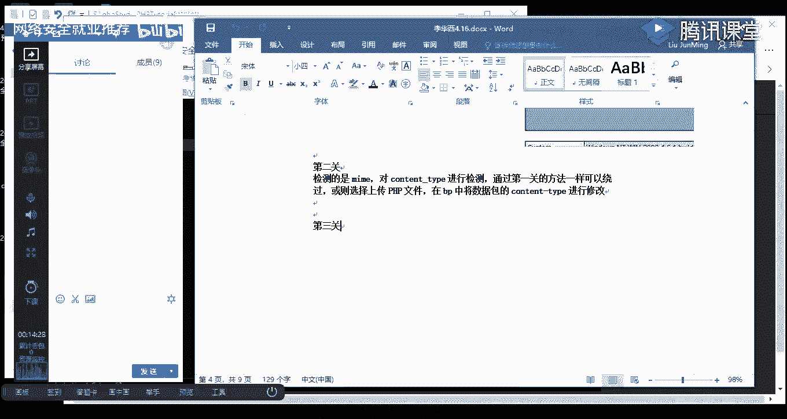

我也可以给大家一个做一个解答。

大家有没有什么问题，就是呃大家选哪一种方案，就我看大家就是有做了的话是呃都做得挺好的，都，有步骤什么的。

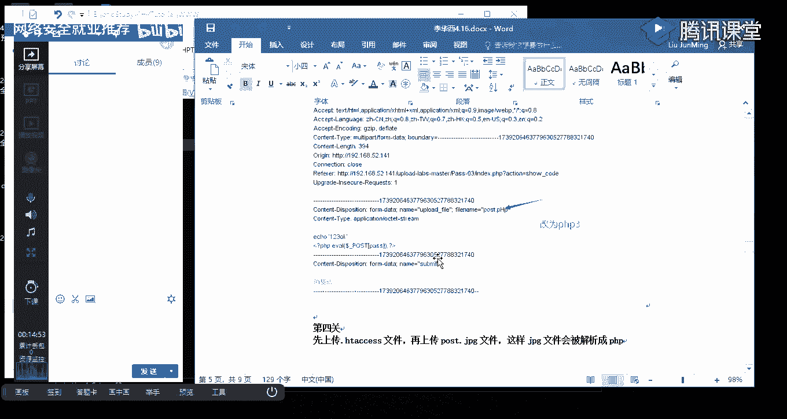

还有操作。

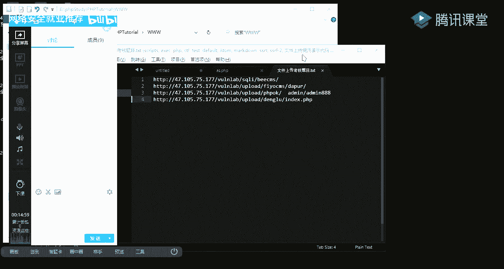

有问有人有问题吗，就现在有问题的话，直接提吧，都都没人，有问题吗，前面两题不用其他的都讲。

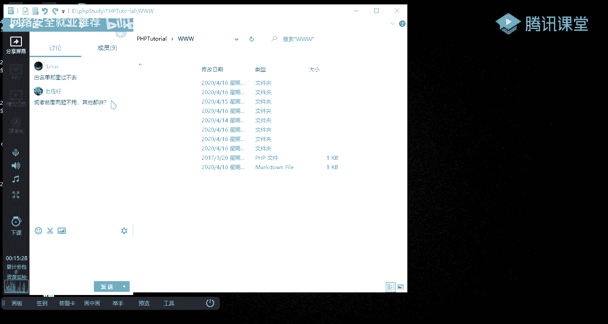

行吧，那就，呃其实这些的话嗯，大家如果看了我这个文档的话，其实应该做的话应该是没有什么问题的，就可能的话就是有，就是在靶场的时候会有一个问题，是因为你们你们没有就是做这样的一个配置，就没有用。

我已经配置好的那个靶场，然后的话呃前面两个的话，第一个的话我已经在上节课已经给大家讲过了，对吧，这是一个前端的一个js检测，绕过我们怎么去对它做一个判断，它是一个前端的一个js检测，也有给大家说了。

好logo方法的话就是两种嘛对吧，禁用网站的一个js，然后的话我们就是啊一般的话用第二种就是啊，上传一个包含一句话嘛，一句话的一个图片嘛对吧，然后的话我们在因为它是在前端，对我们的一个文件后缀啊。

文件类型做一个检测，我们只需要绕过，就是说啊在我们上传文件的时候，选择一个图片的一个文件，就可以绕过它前端的一个检测，然后的话我们再把好发送到服务端的一个数据。

用bp抓包把它修改为一个点p p的一个后缀，就能够进行一个绕过，然后这里的一个代码的话呃，大家主要的话看这里，就它这里的话定义了我们上传文件的一个类型，它这里的话是一个js的一个代码哦。

这里的一个js代码的话，我们可以看到它这里是定义了，这样子的一个函数，就check file这个函数。

然后的话这个函数的话，它会在我们上传文件的时候，对我们的上传文件做一个检测。

直接看源代码，就是在这里我们这里上传文件的时候，这里有一个on submit，就在我们提交我们上传文件的时候，它就会对我们的一个上传文件，就是跳转到这里的一个函数，对我们啊好上传了一个文件做一个检测。

然后的话与我们这里定义的一个文件类型，做一个匹配，如果匹配到了这里是呃它允许上传的一个文件，它就会啊允许我们上传，如果不允许的话，它就会输出一个呃，抽就输出，这里的就是说这个文件它是不允许上传的。

这就是一个前端的一个js检测的一个绕过，而第二个的话，第二个的话就更加简单了，就是一个mmo类型的一个检测啊，我们只跟上面的一个方法是一样的，然后这里的话需要就是啊一个图片呃，就是啊对，还有就是啊。

我看群里有人问这个图片码怎么生成，就只需要用这样的一个一句话就可以了，然后打具具体的一个步骤的话，俱乐部一个步骤的话。

我这里啊你先准备两个文件，就是这里的一个呃psp的一句话码的一个文件。

以及一个呃正常的一个文件，里面的话是呃没有依旧诶，这个有啊，我换一个。

我这样的话就随便嗯。

搞一找一个这样的一个文件，然后的话我们在当前目录，注意是要在当前目录下面啊，打开一个这样的一个cmd，然后我们使用这个copy命令接啊，我们的一个图片就是二点jpg，然后的话注意要加一个这里的一个参数。

一个斜杠，然后加一个啊b参数，这里的一个这里的两个参数就是一个杠b，还有一个杠a的一个参数，我们可以通过看他的一个帮助信息啊，大家要注意的话，在windows里面它的一个参数的话是啊一个斜杠。

斜杠后面啊接接一个参数，然后在linux里面的话是一个横杠，而这里的一个查看帮助线的话是打一个问号，就斜杠问号，然后就能够看到这个命令的一些，相关的一些信息，主要的话就是前面两个杠杆以及杠b。

就干a的话就是表示啊一个20个，一个文本文件，就说我们，我先讲吧，第二个杠b的话，就是表示一个二进制的一个文件啊，这里的一个代码的一个意思的话就是我们copy，二点jpg，它是一个二进制的一个形式。

然后加我们的一个一句话吧，cs。p h b，然后我们需要保存，需要保留这一个ph文件里面的一个内容对吧，所以的话我们需要把它保存成，就是以一个文本文件的一个形式呃，文本文件的话就是一个a杠a。

然后的话保存为什么样的一个文件，我们这里的话啊a。jpg好，我们回撤回撤之后的话，他可以看到就复制了一个文件，它这里的话会生成一个这样的一个三点jpg。

我们直接用一个文本编辑器打开的话，就能够在这里看到有这样子的一个一句话，码对吧，这就然后的话它这个图片的话，是能够正常的打开的对吧，这就是一个图片码的一个制作的一个步骤，然后这里的一个mmo类型的话。

就是我们啊，只需要上传一个图片文件的一个后缀，它就会呃把它就是它的一个content type，content type的一个类型的话，就是一个图片的一个类型，然后的话就能绕过它的一个检测。

然后代码的话，主要的话就是这一段的一个代码哦，我们看这里，我们可以看到这里的话，它会对我们获它会获取我们的上传文件，然后获取的上传文件的一个属性的话，就是获取到我们上传文件的一个类型，这个类型的话。

然后的话与他自己啊，与他这里定义的这几个类型做一个啊比对，如果说呃是这样子的一个image jpg，还有pg，还有一个gf的话，我们就执行下面的一个上传文件的一个操作。

这样的话它是会获取我们上传文件的一个名字，然后的话它会上传到这样的一个路径，下面这个路径的话是在呃，其他的一个文件有做一个定义啊，一般的话就会上传到当前的一个目录下面，然后的话呃它的一个文件名的话。

就是我们这里上传的一个文件的一个名字，然后体现在我们bp里面的话。

就是一个呃有一个fire name得这样的一个。

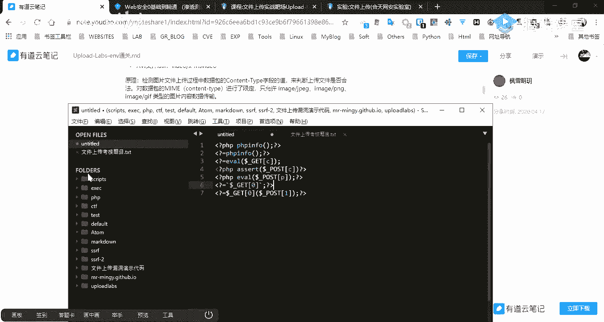

呃参数这里。

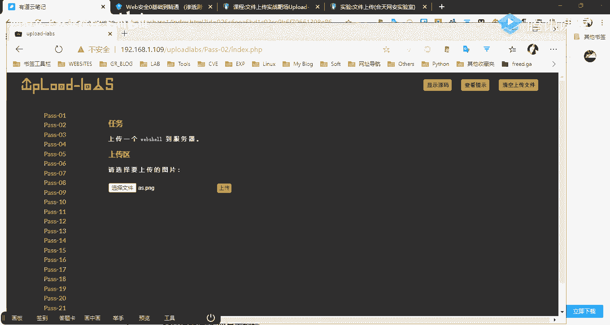

我这里上传一个这样的一个图片文件，然后的话它的一个体系的话，就是它获取的一个文件的一个名字，就是从我们这里获取到的，然后这里的话我们再发送到服务器，服务端的时候，我们这里把它更改成为一个p h p的话。

服务端它在获取我们的一个文件名的时候，他就会获取我们这里发送给他的一个值，然后的话它会保存到服务器啊磁盘上面，然后它保存了一个文件的一个名字的话，就是一个s。p h p。

可以看到就是在这样子就是目录的话。

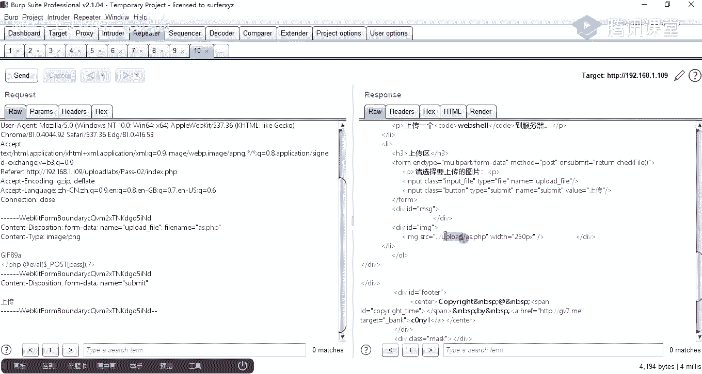

就是在这个upload的一个目录，这就是第二关，然后第三关的话，我们就其实呃我们在呃再去做一个文件上传，那个绕过的时候，我们首先我们要做的事情是什么呢，就是说我们首先要去对它做一个判断。

就是说判断他而服务端或者说客户端，它对我们上传的一个文件，有做什么样子的一个过滤，以及它以及一个检测，那么我们怎么去啊获取到这样的一些信息呢，就是说我们可以，因为它这里是有一个上传文件的一个功能对吧。

好的话，我们先选择这样子的一个文件，选择这样子的，我们先随意上传一个，比如说我们上传一个a s0 ，p h p的一个文件对吧，那我们上传上传之后的话，那这里的话呃有这样子的一个提示啊。

他可能是会提示在这里对吧，也有可能是会弹一个框，弹给你，就说啊他会提啊，他有告诉你，就是说不允许上传这样子后缀的一个文件，那么那么我们通过这样子的话可以啊，有一个基本的一个判断。

就是啊他有一个黑名单对吧，它会获取我们这样子的一个嗯，当然的话我们现在这里的话是无法做一个判断，应该是说就是说它有很多的一种类型啊，很多的一个检测方式对吧，我们这里的话我们再上传一个s点啊。

就是上传一个图片文件对吧，看它是否允许我们上传。

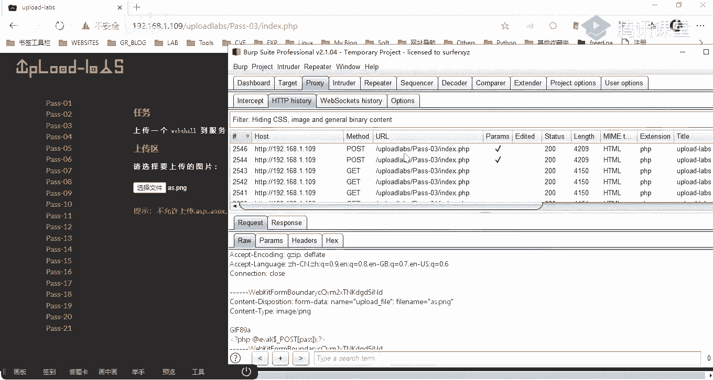

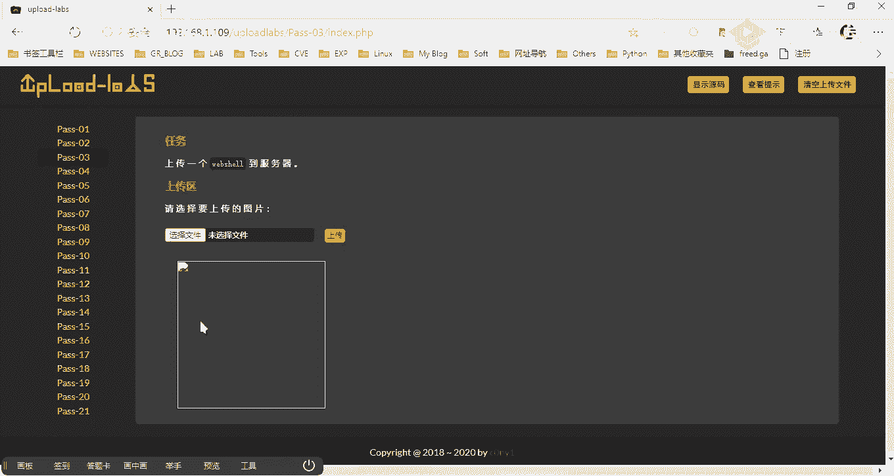

我们上传一个图片文件的话，可以看到它是允许我们上传的。

然后他上传的一个路径的话，就是在这里对吧，然后呃我们如何去查看，就是说它的一个信息。

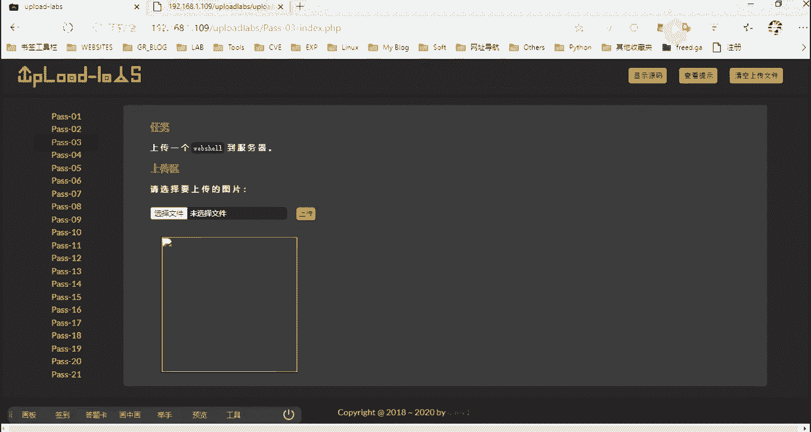

我们通过bp的一个他的一个请求包，就是说通过我们他的一个就是向服务端发送的，一个请求，以及服务端它返回给我们的一个呃响应，来去做一个判断，我们可以看到，就是说我们这里的话上传这样子的一个。

菲律宾的一个呃不是一个偏激的一个图片文件，上传之后的话，它的一个响应的话可以看到他在这里会啊，有这样子的一个路径对吧，就是说他这里的话是一个保存的一个路径，然后这里的话它的一个文件名，它这里是啊。

不是我们这里上传了一个文件名了对吧，那我们可以知道它是有做一个，就是随机的一个文件名啊，其实我们从文件名也能够看到，它其实就是一个当前的一个日期对吧，2020041720。

然后后面的话是有一个随机的一个字符串，这就是我们需要去获取到的一个信息，然的话我们怎么去绕过啊，就是这里的话就会用到，我们就是上节课讲到的一些，就是说啊文件上传绕过的一些知识。

我们可以去进行一个尝试，就是说啊通过一些嗯绕过黑名单对吧，就是说大小写还有一些空格点，这样子的一个方法去进行一个尝试，好的话，判断服务端它是否对我们的这样的一个呃。

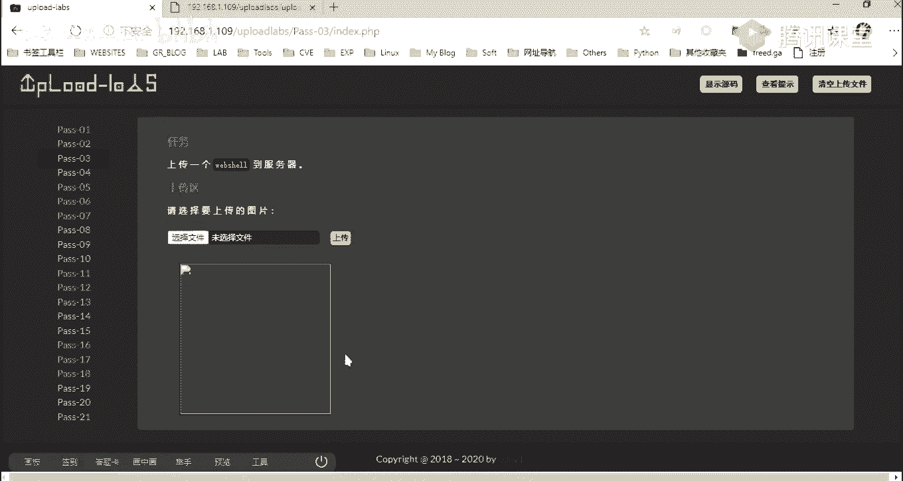

比如说一个空格对吧，我们在这里输入一个空格，我们在上传文件的时候，我们在这里上传文件的时候，我们在后面加一个空格对吧，然后的话我们去进行一个上传，上传之后的话可能会能够允许你上传。

然后的话发现他这样的话是不允许的对吧，那我们是不是能够有一个判断，就是说他啊对我们的这个空格做了一个过滤呢，对吧，然后我们再用一个点跟一个方式，然后上传，然后可以看到他这里的话是也做了一个。

就是也是不允许我们这样子的一个后缀上传的，然后的话还有就是呃，我们通过这个，它可有可能是检测文件的一个内容对吧，那么我们用这样子的一个呃形式，那这样子的一个就是加一个文件幻数的一个形。

式来去进行一个测试。

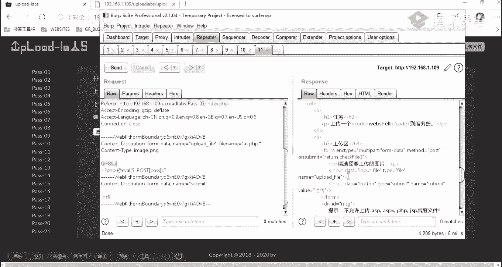

对吧，哦还有的话呃就是说通过上传一个图片嘛。

上传一个这样的一个图片嘛。

然后的话呃也有可能能够进行一个绕过好。

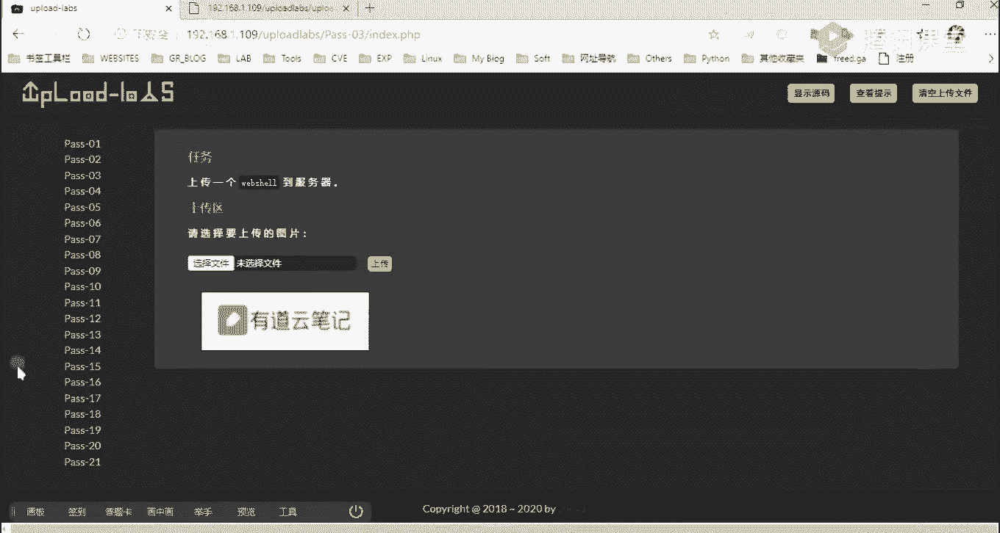

这里的话是呃我就是呃讲了一下，就说利用这样子的一个啊靶场，就是给大家介绍，就是说我们怎么去啊，绕过去寻找这样子的一个文件，上传漏洞，漏洞的一些思路。

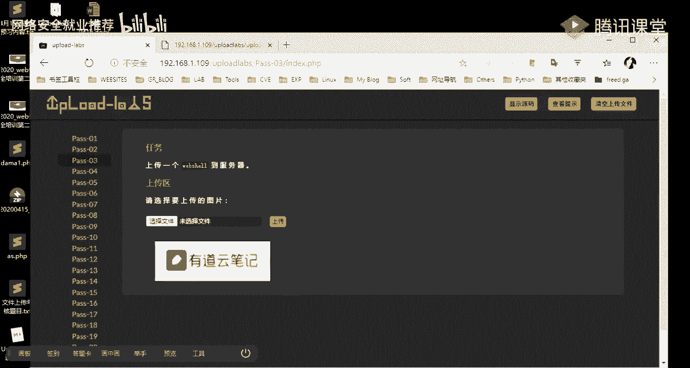

然后这里的话我们回归这个题目，这个题目的话我们其实从前面的话。

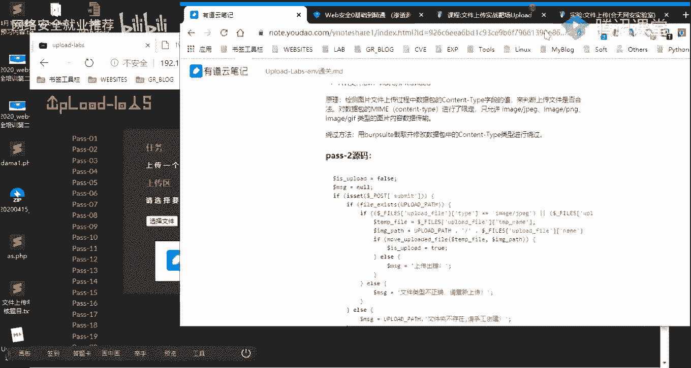

我们也能够基本的有一个判断对吧，我们呃上传一个p h p的这种文件。

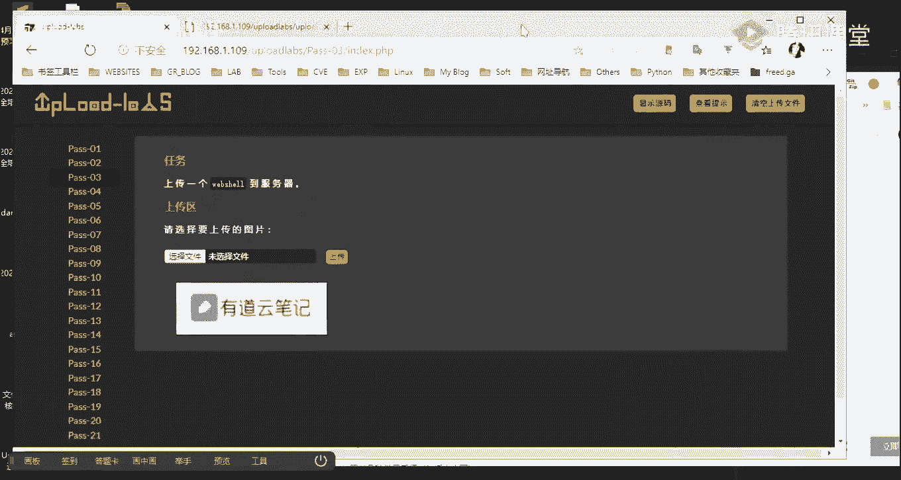

这种好可执行的一个脚本文件的话，它会在这里有提示，就是说啊不允许上传这样的一个文件，那么我们能够有一个判断，就是它有一个黑名单对吧，然后这里的话也是一个黑名单的一个检测，一个logo。

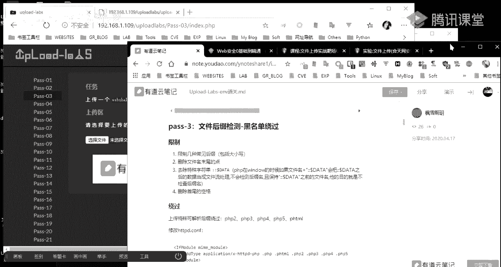

然后这里的话它的一个代码呃，其实啊在这里的话，因为是可以去查看源码的对吧，查看源码的话就能够知道这样子的一些信息，但是的话实际的一个场景，它是不会有这样的一个源码给你直接去看的。

除非的话是你啊已经就是获得了他的一个源码，然后的话针对这个源码做一个代码审计，代码审计，查看它啊做了哪些过滤对吧，做了哪些性质，然后的话我们针对他这一个性质，来进行一个绕过，那这里的话我们呃。

主要的话是通过这一个靶场来去学习，他的一个嗯它的一个绕过。

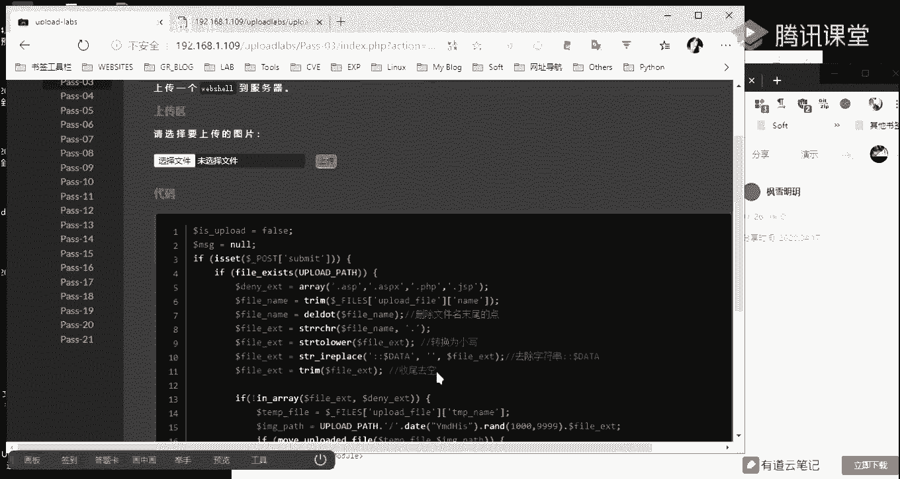

然后这里的话这个题目的话，它主要限制了这样的一个四点啊，我这样的话写的应该挺详细的，主要的话就是对我们常见的一个后缀，就包括大小写，就呃大家可能就是在之前尝试的时候对吧，也尝试有大小写。

但是的话发现不能够去见个上传的话就好，他应该是对我们的一个后缀，做了一个大小写的一个过滤对吧，然后的话呃还有第二个的话，就是他删除了文件名末尾的一个点，就是说还有的话有空格对吧，我们之前都有尝试。

是无法去进行一个呃绕过的，然后这里的话还有一个，就是这样的一个特殊字符串，上节课也有讲到，那针对这样的一个logo的话，我们就可以通过这样子的一个呃，其他的上传，特殊的一个可解析的一个后缀的一个文件名。

去进行一个绕过，我这里的话有列举了这样的一些，然后直观的话我们从代码去进行一个查看，就是说这里的话，我们可以看到他对我们获取的一个，我们上传的一个文件名，它呃这的话新定义了这样子的一个黑名单。

就说里面的话是这些后缀对吧，就说这些后缀的话，它是不允许我们去进行一个上传的，我们然后的话它会在这里啊啊。

这样的话其实有注释都已经有了，我这里的话一个代码也是。

就是扩到他这里的一个源码，我们就用它这个源码来说吧，好这样的话他用这样的一个delete dot，这样的一个函数，就是说大家在嗯再去做这种ph p的时候，就比如说你做代码审计的时候，其实啊。

你不一定说要把所有的一个pp代码都能够看懂，而且你不一定说你要能精通一个ph的代码，我们只需要就是能够大概能看懂对吧，因为你要精通的话，你得从头学学一个学门语言，其实花的一个时间的话还是比较多的。

我们这里的话，我们就呃大概了解它的一个结构就可以了，就是它的一个变量的一个定义对吧，这样的话其实你大有一个有一点的一个语言的，一个基础的话都能够看懂，像这种衣服判断的一个结呃，呃结构。

还有的话其实主要的话菲律宾你去做这种的话，你要了解的就是它的这样的一些函数，它的一个使用，比如说我们这里的一个excel这样的一个函数。

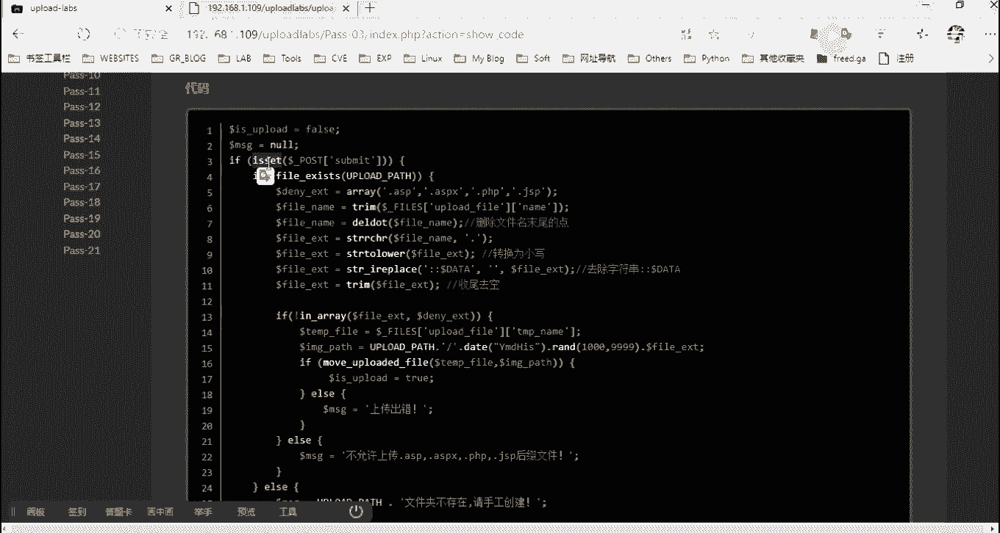

我们不知道它是什么意思，我们啊去查可以大家去查那一个手册，k hp的一个手册，官方手册，然后的话通过它的一个官方手册，对它的一个函数做一个理解，就是理解它这个函数它是干嘛的。

我这里的话呃手册的话就是这个菲律宾donut啊，他这里的话是支持啊简体中文的，就是说不会说存在看不懂，然后的话我们可以直接看到它的一个，就说这个函数，它的一个意思就是检测变量是否已经设置。

也就是说检测我们啊传给我们，传递给这一个呃，服务端的一个这样的一个，它限制的一个变量是否已经啊存在，或者说是否有这样子的一个变量，而这里的话它判断的就是这里的一个啊，我们的一个submit这样的传啊。

用post的方式接收到这样的一个summit，它是否存在，就这个summit就是我们这里请求包当中，我们这里的一个啊就是上传的一个动作，它的一个值，然后它检测到我们这里上传之后的话。

它就会获取我们的一个上传的一个路径，就是它会判断我们上传的路径对吧，这里的话也是一个函数，我这里的话就不一一的去啊，去查手册给大家看了，我就大概讲一下意思好吧，还检测我们上传的一个路径，它是否存在。

就说这个路径的话，它是在代码里面已经定义了，然后的话后面的话就是啊啊，几个变量定义了一个黑名单，然后的话还有就是呃这个可，这里的一个train，这个函数就是我们需要去了解的，如果不知道的话对吧。

它的一个意思就是去除字符串首尾的一个，空白的一个字符，就是说它会啊，把我们上传的这样的一个文件的一个名字，它会去除首尾的一个呃空白的一个字符，就去控了对吧，就这里的话也是一样的一个意思。

就是说会把我们的一个文件名的一个空，格给去除掉，然后第二个的话就是这个第二dot，就是删除文件名末尾的一个点啊，以及这里的话转换一个小写，就是这样的一个函数，就是它的一个意思的话。

就是呃理解这个p h p代码的话，就是理解它的一个函数的意思就好ok了，然后这里的意思的话就是呃他会把我们的获，它会获取我们的一个文件名的一个后缀对吧，获取到这样的一个后缀的话。

他会用这个函数对它做一个处理，处理的话，就是把啊文件后缀里面的。

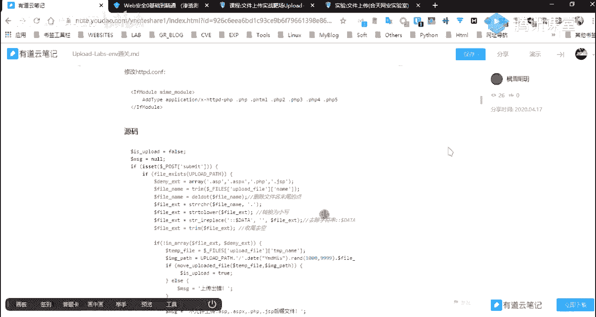

所有的一个字符都转化为小写，如果它转化为小写的话对吧，就是说它是过滤了我们的这种大小写的一个，混合对吧，比如说我这里上传一个这样的一个大写的，一个p hp，它会把我们这里所有的一个字符。

都转化为一个小写对吧，就是一个菲律宾转化成这样，然后的话转化成这样子的话，他就能够他就好。

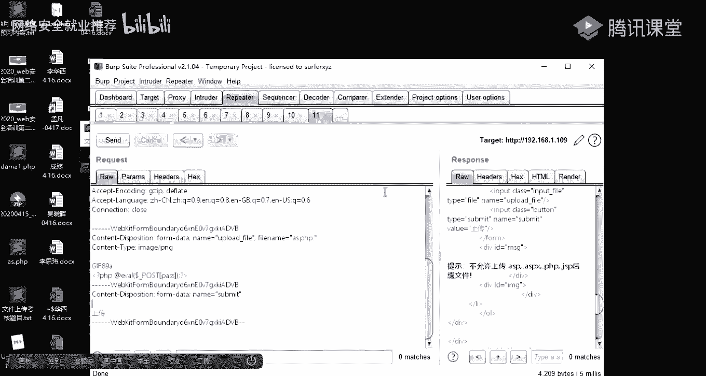

因为它这里的话嗯哪去了。

唉他这里的话，因为他这里的话原来的话就已经有定义了，这样子的一个原不原啊，就是拒绝的一个后缀对吧，他会把这里获取到的一个转化为小写的，与前面的这里做一个匹配，匹配之后的话。

他会把呃就是如果它转化为小写的话，自然的话就过滤了啊，这种大小写混合的这种文件后缀，然后的话就是不会允许你上传，然后这里的话这个的话就是这个函数是joy，in repair，这个函数的一个意思的话。

就是把我们这里的啊获取到的这个字符，获取到的，这里具体一点的话就是我们获取到的一个后缀，我觉得这个这个号哦，这里的话还要注意点的话，就是这个这里这里我老越过了，就说这里的话。

就是把我们的一个获取到的一个文件名对吧，就是说这里删除了一个文件名，空格的一个文件名，然后把它的一点做了一个分隔。

就是说我们的一个后缀都是一个文件名对吧，嗯比如说s。p h p，他都是这样子的一个文件名，然后他以这里的一个点。

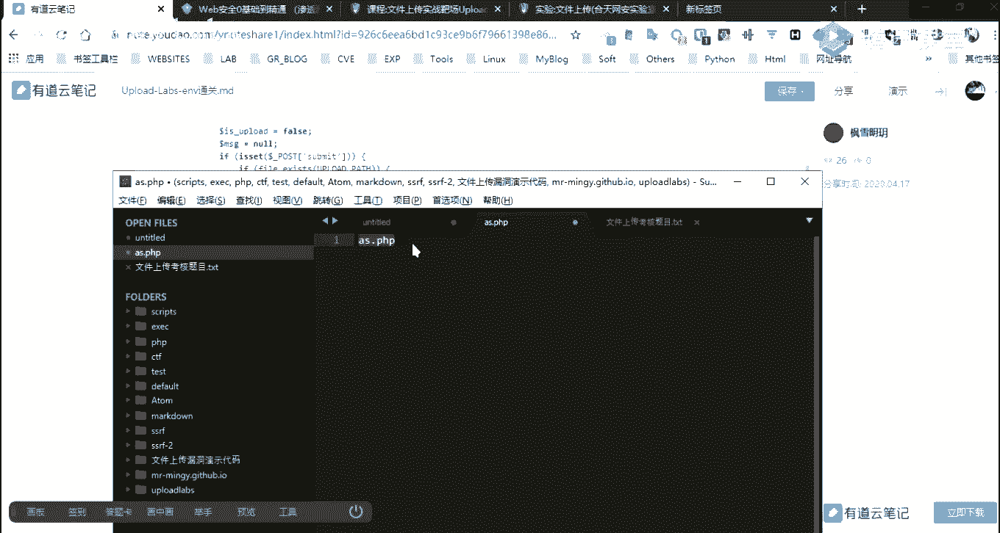

你做了一个风格，然后获取到我们点后面的一个后缀，也就是我们的一个文件扩展名，然后的话付给了这一个值，然后的话再对我们这里获取到的一个扩展名，做一个判断，这里的话就是过滤了这一个呃。

在windows里面的这种这个特殊的一个字符串，然后呃还有的话就是一个首尾的一个触控，就是这个函数的一个意思好下面的话就是呃，下面的话就是一个判断就判断啊，前面这里经过了这样的一些操作之后。

他得到的这样的一个后缀对吧，这里比如说我们的一个写的是一个大写的，一个这样子的，大写的一个我们的一个上传了一个文件名，是这样子的，然后的话它就会嗯，在后面的话再加一个空格以及加一个点是吧。

他这里的下来的话，他就获取到我们整个的一个文件名对吧，它首先会删除我们文件名末尾的一个点诶，他会把这个过滤掉对吧，过滤掉之后的话，它会以我们这里的一个点做一个分格，获取到我们的一个后后缀。

还有一个后缀的话就是像这样子对吧，后面接一个空格的好的话，他会把这里的一个字符串，它全都转化为小写对吧，就是说它会去除掉，他把我们的一个大写的一个p，把它给转化为小写，就啊得到了一个后缀的话。

就是这样子，然后的话在下一步的话，就是如果后面有接这样的一个字符字符串的话，他就会把这个字符串同样的给替换掉，给呃替换掉，就是过滤掉就替换的话，它这里的话替换为空，然后的话再再到最后的话。

就是它会把我们的一个首尾的一个空格，就前面的一个空格，还有后后面的一个空格给攻击下过滤之后的话，最后剩的一个字符串就是这一个，而这一个的话就是最终过滤之后的一个后缀，一个呃上传文件的一个扩展名。

然后的话他在与获取到的这个扩展名之后的话，再与他这里定义的这一个数组里面的呃，不允许上传的一个一些后缀做一个匹配判断，就是说如果是不是存在这里的一些后缀的话，它才执行我们的一个文件上传的一个操作。

这里的话呃就是文件上传的一个操作，主要的就是看一下，再理解一下，这里这样的话就是呃上传文件的一个路径，他这里一个路径的话，它我们前面有看到，就是说它对我们的一个上传了一个文件名。

做了一个随机的一个处理对吧，这里的一个其实也不是随机，它的一个代码，意思的话就是获取当前的一个日期，就我这里的一个日期对吧，202000417就是4月17号，然后后面的话再接了一个随机数。

这个render的话就是随机的，一个是就是随机生成的，已在，百99之间的一个随机数，然后的话在后面接我们的一个呃，这里经过过滤之后的这样的一个后缀，然后组成了这样子的一个文件名。

这就是呃这一个代码的一个意思，大家有明白吗，应该能听得明白吧，能听明白是吧，好的好的，能听明，能听明白的话好，我这里的话就是特意的把这里第一个做了一个，比较详细的一个讲解。

因为后面的话其实就是一个类似的，它的一个代码其实都是类似的，主要的话就是说他在进行一个过滤的时候，它呃有一些没有做一个过滤，就是说这种呃，还有的话就是像这种黑名单的一个形式的话，它的一个过滤的话。

它是呃不严格的，它的一个就是服务端它的一个，而在对文件上传的一个检测的话，它的一个过滤的一个措施，它是有缺陷的，好的话我们利用这个缺陷来进行一个绕过，然后这里的话我们通过代码的话，其实就能够明白了。

主要的话呃大家可能不太理解的一个点，就是这里就这里的话，我们可以通过这种呃特殊的，可以解析的一个后缀去进行一个logo，因为它这里的话它是一个黑名单的一个形式，它是没有包括我们这里的这种特殊的一个。

啊后缀的对吧，然后这里的话呃，我们就可以通过这样的一个方式来进行，一个绕过，然后大家这里今天有同学问我这样的一个问题，就是你通过这样的一个方式上传的话，他解析不了你，你会看到就是说啊。

上传了这样的这样的一个文件，你访问的话，你浏览器访问的话，它显示的是一个文件的一个内容，为什么呢，就是说而服务端没有对你的这，你这里的一个代码里面的内容做一个解析，也就是说他没有执行我们的一个。

菲律宾的一个脚本代码，所以的话你只是看到了一个，它里面的一个文件内容，然后这里的话就是啊你需要给他啊，就是我前面讲的需要做这样子的一个配置，这样的话哦好我就不演示了吧，就其实就改改一下。

改一下这样子的一个后缀就ok了，然后第四个的话，第四个的话，我就直接讲代码，直接啊就是讲方法吧，因为前面的话开头的话我已经有，我已经给大家介绍了，就是说呃文件上传，我们怎么去进行一个测试对吧。

来判断服务端对我们上传的一个文件，他是做了什么样子的一个性质以及过滤对吧，好的话，我们再针对这样的一个呃方在，利用我们的这样的一些绕过的一个方法，进行一个绕过，这样的话哦。

大家应该在操作的时候应该是没有什么问题的，我通过看大家的一个文档的话，大家呃这样的一些操作，包括使用dp发包啊，还有抓包这些什么都没有问题的，主要的话就是要理解呃，呃它里面的一个代码的一个意思。

以及我们为什么要用这样的一个方法去进行，一个绕过对吧，然后第四个的话就是呃文件后缀的一个，黑名单的一个绕过，跟上面的话其实啊类似的，它的一个限制的话，我们通过测试的话能够有发现就是这样的啊。

一些性质就跟上面的话其实是啊一样的，然后这里的一个不同点的话，就是它这里的一个啊文，对于文件后缀的一个性质的话，它是比较严格的一个性质，我们可以从代码能够看得到，我们如果还是使用上面的一个绕过方法。

比如说我们用这样子的一个菲律宾五的这种特，殊的一个后缀去进行一个绕过的话，你会发现是不行的，因为它这里的一个黑名单的话，它的一个限制的话是比较多的，它限制了我们这里啊，常见的一些可以解析的一些后缀对吧。

偶尔ph 223，还有这种大小写的对吧，还有一些常见的呃一些解析的，一些可解析的一些文件后缀，然后然后后面的话代码的话跟上面其实类似的，就呃过滤了文件名的一个末尾的点，还有转化为小写。

还有去除的这种特殊字符，然后这里的一个呃知识点的话，就是说我们这里这个在上节课有讲到的，这样的一个分布式的一个配置文件，这个点h ta c c e s这样的一个文件，然后我们可以看到它这里的一个啊哈。

黑名单的一个后缀里面的话，它是没有对我们的这种呃文件做一个过滤的，对吧，那么我们就可以通过这样的一个呃后缀，这样的一个文件名来进行一个上传，然后上传的话就是啊，里面的一个代码的一个意思嗯。

这里的话我操作一下吧，好吧。

这样的话代码的一个内容的话，就是这样子的一个内容，我们首先新建一个，新建一个这样子的一个呃，文件里面的一个内容的话，就是这样子呃，呃代码的一个意思的话应该都明白吧，上节课也讲到，这样的话。

我这里呃写一个s。jpg，这里的话我们大我们可以自己去定义的，你你不可你可以不写成这样，你可以啊，就写成一个s也是可以的，然后的话我们上传文件的时候，我们直接上传一个as的一个文件。

你后面不接后缀什么的都是可以的，然后的话你上传上传成功之后的话，我们在直接去访问这样子的一个s的一个文件，里面的话，就是我们的一个啊p h p的一个一句话码，它同样的能够去解析我们这里的一个呃代码。

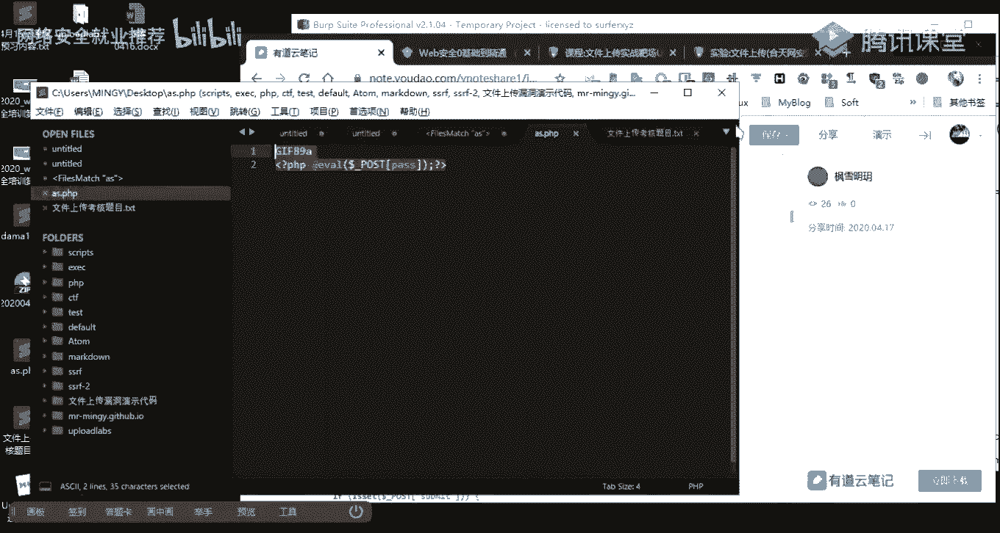

我来操作一下，我这里的话就呃s。pg吧，然后我保存保存为一个点这个h ta c c s保存。

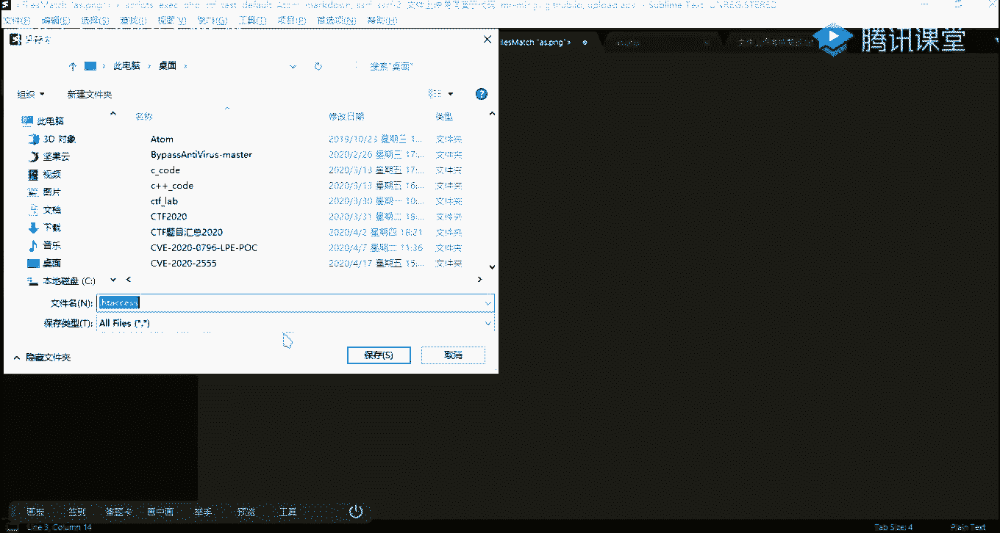

然后大家一定要注意的话，就是他的一个文件名，大家别写错了。

哪去了，在这里，还有一个文件名的话是呃别写错了，就是你少一个字母的话，他就是在服务，你上传到服务端，他也不认识这样子的一个文件，它就不会去啊，读取这一个配置文件里面的一个内容，就hta。

然后cc 1 s要注意。

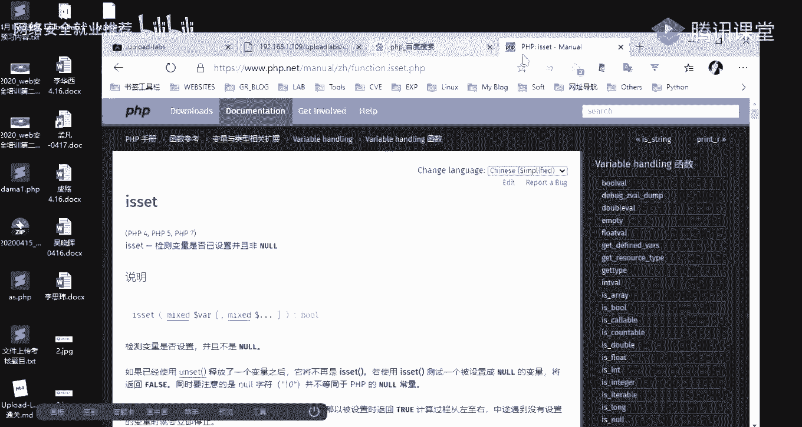

好的话，我们再用这一个我们上传上传这样的一个点，这样的一个配置文件。

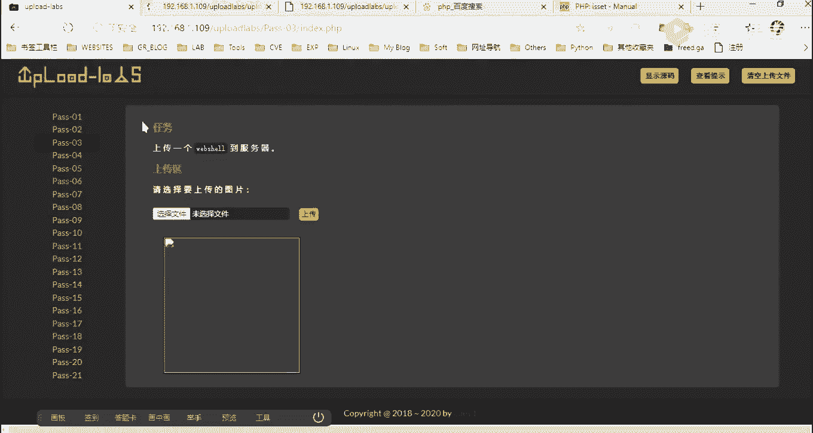

然后我们上传上传之后的话，可以看到他这里的话是上传成功了对吧。

它里面的内容呢内容的话就是这样子，这个内容好的话，我们再上传一个，cs点偏激，那我这里的一个，这个文件。

我们啊我这里的一个s。pg的一个内容的话。

就是一个一句话对吧。

好的话，我再直接去上传，上传之后的话，可以看到这里的话已经上传成功了对吧，然后的话。

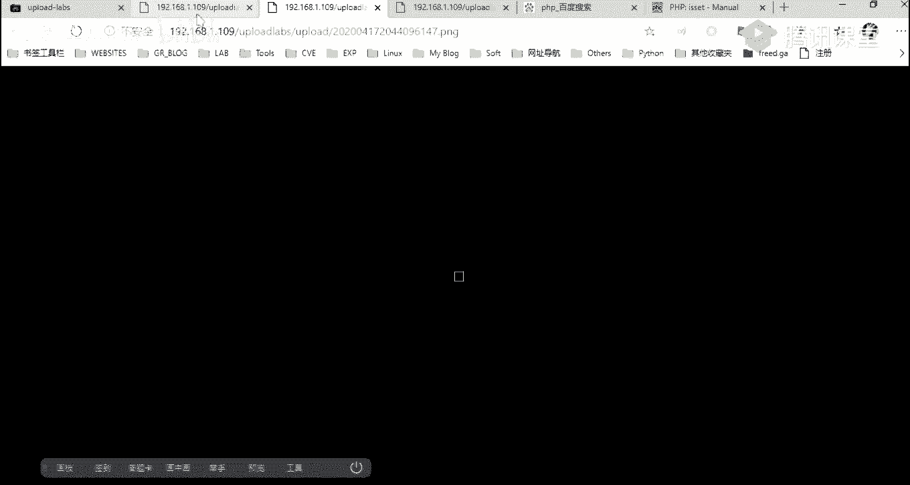

哦这里有个问题啊。

没事好的话，我们上传之后的话，我们啊直接去，用我们我们连接我们的一个一句话码的一个方，式来去进行一个访问。

嗯这样的话有个问题。

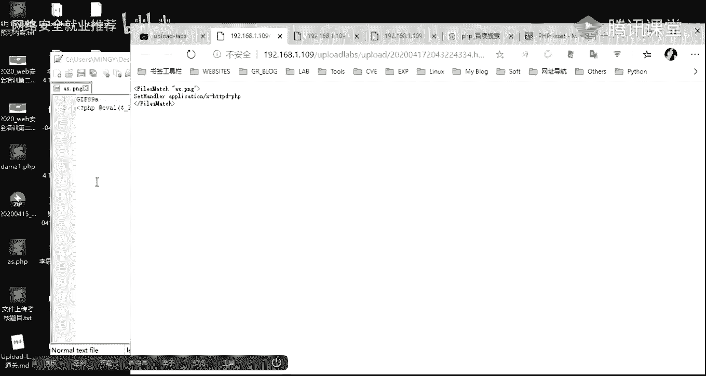

我这里的一个代码。

因为呃我们这里上传之后的一个文件名的话，就是像这样子的一个文件名，然后的话我这里的一个代码的话，它是匹配的是一个s点偏激，所以说的话他匹配不到会好，这样的话我们需要修改一下这一个文件。

修改的话我直接就匹配一个png，好的话，我再重新上传一下。

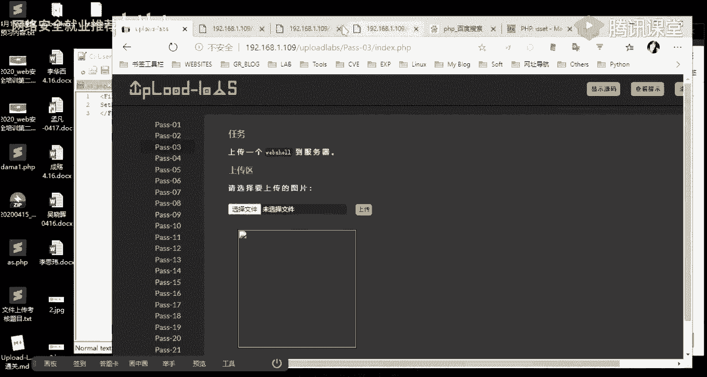

没看到上传成功了，上传成功之后的话，我们再去访问一下这一个啊，偏激。

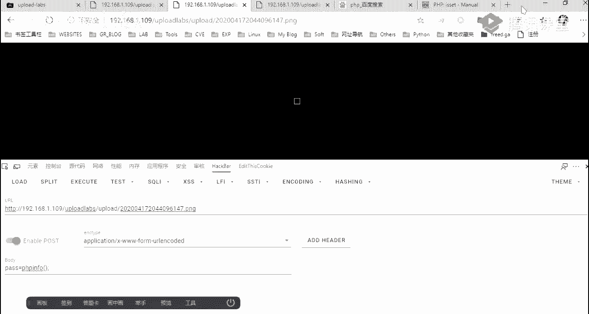

没有解析吗，看一下，呃我这里原来上传的东西有点多，哦这里，我这里原来的一个内容是这样子的一个内容，就没有替换掉了，我这里的话直接在这里改一下吧，我的话直接改成一个pg，搞错了哟。

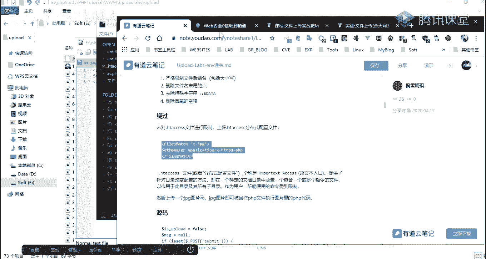

我这里是关卡搞错了呀。

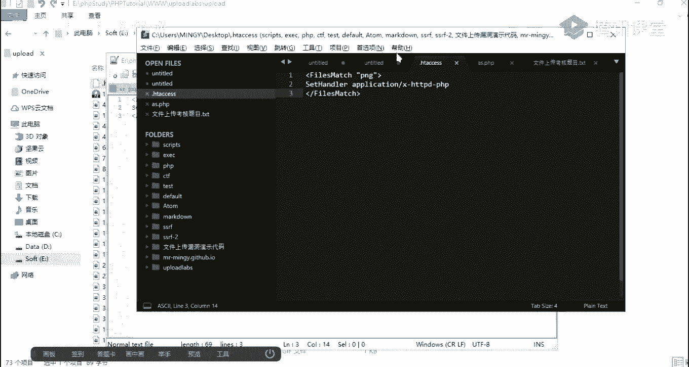

咳咳咳，这里是第四关，我用的第三关的一个。

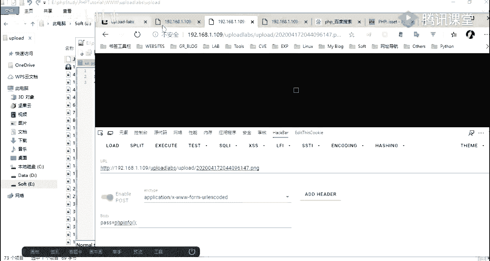

因为第三关的话，他对那个呃我们上传了一个文件名，做了一个从随机的一个命名，所以的话我刚刚那里上传了这样的一个点。

htc s的一个文件的话，它啊随机了一个生成的一个文件名，我们可以看到应该是会有一个这个对，就这个，所以说的话他是就说诶，所以说的话内容的话就是这样子嘛，但是的话他这种就正正确的一个文件源的话。

应该是这样子的，所以的话他这里的话会有一个问题，就是我这样的话就不去进行一个上传了，我这里的话直接改一下吧，呃就把这里的一个内容改一下，就步骤的话还是一样的一个步骤。

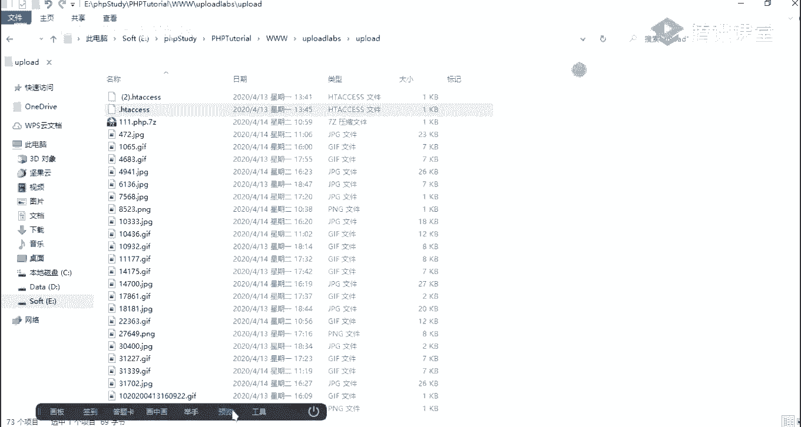

内容的话就是这样的一个偏激的一个内容，然后的话我在这里在重新试一下。

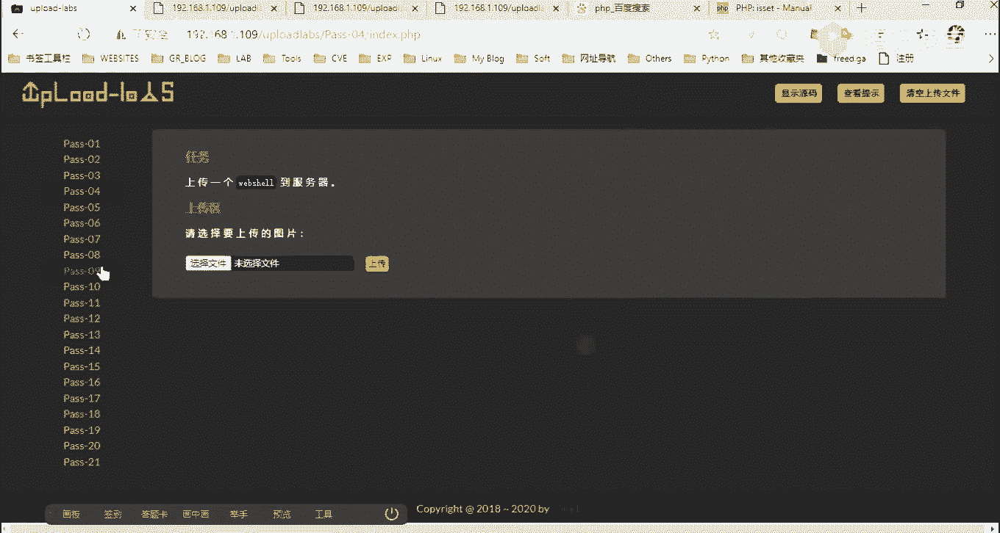

我们执行执行之后的话，可以看到之前的话它是一个png对吧，只是一个啊，我们是啊一个偏激的就不能够解析的一个后缀，然后的话我们通过就是说上传这样子的一个啊，这样子的一个特殊的一个文件分布式配置文件。

然后的话我们能够把我们的一个，就是说这种在这种不可解析的一个后缀，里面的一个psp代码，能够把它当成一个菲律宾的一个一个文件，做一个解析，这就是啊这一个文件的一个作用，以及这一关的一个绕过的一个方法啊。

就说这里面涉及到的一个知识点，就是这这样的一个文件，而这里的一个呃代码的话，就是像这样子的，其它的一个意思就是匹配这里的一个字符串，就是说啊在当前它只针对当前目录下面。

就说在当前目录下面的一个啊，我以这一个文件对吧，当前目录下面的这样的所有的一些文件，如果他呃这个文件名里面，它包含有这样子的一个png的话，他都能够啊，作为一个p h p的一个文件去进行一个解析。

就包括这样的其他的一些文件里面，如果说就是说我们上传的一个一句话啊。

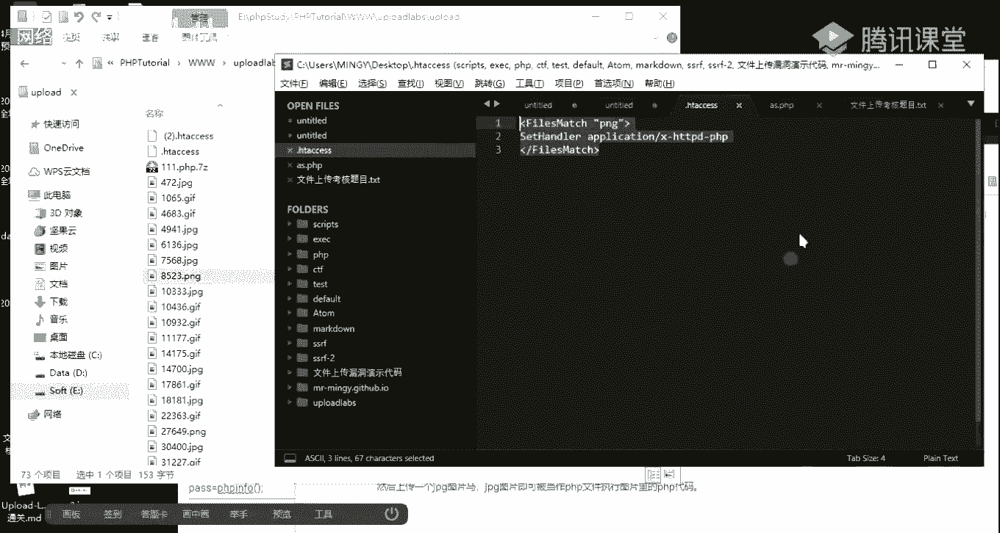

这种图片码的话都能够去进行一个解析，然后的话呃第五个第五个的话呃，代码其实跟上面的话是一样的，然后呢我们经过测试的话，我们能够就是呃，有就是知道他的一些限制的一个条件。

然后这里的话跟上面的不一样的一个地方的话，就是它过滤了这样的一个顶，ht a c c e s的一个文件，就是说我们在做第五关的时候，我们上传这个文件，它是不会允许你上传了。

所以说我们上面的一个绕过法宝的话就失效了，好的话，在这里的话呃，我们就利用它的这样子的一个，就是它的一个过滤的它的一个性质，它的一个过滤的一个条件，我们从这里来看一下，就是说我们通过测试的话。

能够知道它是删除了文件名末尾的一个点，还有就是呃我们的一个末尾的一个空格对吧，那么我们可以通过构造这样子的一个啊点空格，就说这种多重的一个点空格的一个组合，这样子的一个文件名，我们来理一下。

就是说我们要上传这样子的一个文件对吧，然后的话经过这样子的一个服务端的一个，代码的一个过滤之后对吧，他首先会删除文件名末尾的一个点，它删除完这一个点对吧，删除完之后的话，它再放到下面转化为小写字母是吧。

这里本来就是小写的，好的话，它会以啊一个点的一个后缀做一个分隔，它会获取到这里的一个内容，然后的话他会去除我们的一个，啊一个空格对去除我们的一个空格，它去除完这一个空格之后的话。

我们后面的我们这里的一个文件名的话，就是成了一个这样子的一个文件名，就点啊，就是一个p h p后面接一个点的，然后的话因为他没他只是做了一个就代码的话，它是从上到下嘛对吧，从上到下一一层一层的作业了。

一个这样子的一个过滤，然后他最后到获取到的一个啊文件名的话，就是像这样子的，一个菲律宾点的一个文件名对吧，然后的话因为他这里的话是一个白名单啊，不是一个黑名单啊。

好我们可以它会把我们这里获取到一个文件名，与这里的一个啊黑名单的一个文件名，做一个匹配，然后可以看到它这里的是一点p h p，这样子的对吧，然后我们这里的一个后缀的话，它是不存在这样一个黑名单的。

所以的话我们就能够进行一个logo，然后的话我们再利用在windows上面的一个特性，就是说我们这样子的一个文件后缀的话，它在windows里面，它是会自动把后面的一个点给去除掉的。

然后实际保存到服务器的服务器的话，就是一个菲律宾后缀的一个文件，这这就是呃我们这样子的一个绕过的一个，方法的一个原理，好啊。

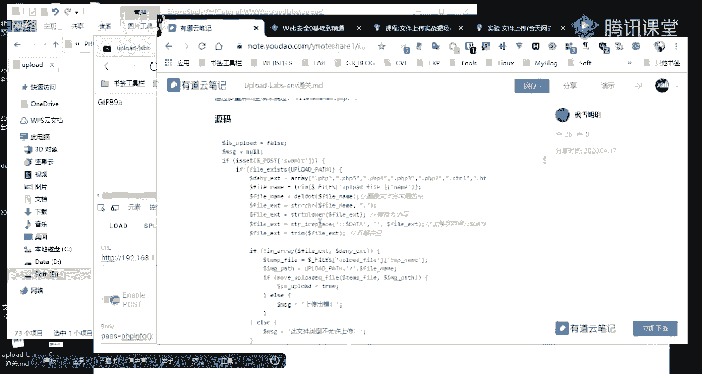

我们来看一下，操作看一下第五关，同样的我们先啊，随便上传一个文件。

好我先上传一个s点，偏激对吧。

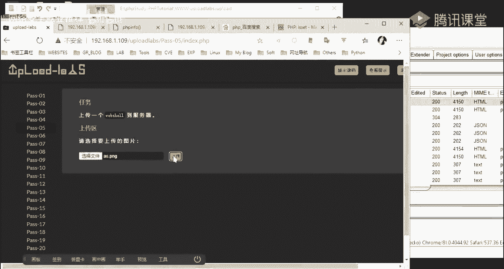

我们上传一个正常的一个图片文件，然后我们上传上传之后的话，我们主要是看这里他的一个包，嗯我们呃把这里的他的一个上传文件的一个包，把它放到这里，我们发送一下，然后可以看到它的一个路径，它是这样子保存的。

保存在这个目录下面，文件名是这样子的对吧，那我们好再利用前面的一些方法做一个测试，我们首先输入一个空格对吧，让我们发送发送之后的话，可以看到就是说它这里保存的一个文件名的话，可以发现它是一个s点偏激。

但是他把我们末尾的这样的，一个多的一个空格给去除掉了对吧，那么我们从这里就能够判断它，对我们的一个末尾的一个空格，就是首尾的一个空格做了一个啊过滤，可以看到我们在前面加一个空格也是被过滤了。

然后我们在这里的话在加一个点对吧，再加一个点，然后我们再上传，上传之后的话，可以看到他把我们的一个点给过滤了，但是可以看到这里的话它是有一个空格的，这个空格它没有过滤掉，那么我们在这里。

我们这里它保存到服务器端的一个文件名啊，我这里重新换一个文件名，然后然后我我还有，这样的一个文件名，然后的话我再进行一个上传啊，我直接在这里服务端，我把这些都删了吧，我这里进行一个上传。

上传之后的话可以看到，保存在服务器端的话，它就是这样子的一个文件名对吧，然后这里的话因为是使用的一个png后缀，那么我们在这里改成一个菲律宾，我们再进行一个上传的，然后可以看诶。

好这里的话它就不允许了啊，为什么不允许呢，就是说他这里的话嗯，我们从代码里面刚刚也看，刚刚也理解了，就是说他最后他获取到的一个其实是它会，如果说你在这里呃，我们在这里再多加一个点，再来看一下好吧。

我们再发送一下，发送之后的话可以看到啊，我在这里再多加一个点的话，他把我们的这里的一个呃，其实这里这样子也可以的，我们在这里再多加一个点，然后上传之后的话，可以看到在服务端它保存了一个文件。

就是一个菲律宾后缀的一个文件，那么我们就顺利的进行了一个绕过对吧，我们其实也可以再你再多加几个也是可以的，然后他这里获取到了一个文件名，其实在服务端他获取到一个文件名，就是这样子的，所以所以说他跟。

因为黑名单里面没有这样子的一个后缀嘛，所以的话我们就能够绕过，然后的话windows上面的话，它后面它会自动把我们的这种点顶，还有空格，这种都会给自动的去除，所以它实际保存到服务端的话。

它是这样子的一个啊p h p的一个后缀文件，我们这里的话就呃，成功的上传了这样的一个一句话嘛，绕过了它的一个过滤，然后第六关的话就是一个后缀名的一个大小写，其实跟上面的话也是类似的，然后这里的话是呃。

嗯主要的话就是一个，它同样是严格限制的一个文件后缀，然后这里的一个文件后缀的话，就是啊这个例子的话就能够充分的说明，就是说你的一个黑名单的这种策略的话，去啊进行一个过滤限制的话，它是啊有缺陷的。

就说他无法去把我们所有的这种呃这种，就是不允许上传的这种后缀，都给它列到一块对吧，你总会有就是说没有去没有，就是列到这里面的，那么我们就可以利用啊，这样子的就是没在这个黑名单的这种后缀啊。

来进行一个绕过，这句话就是一个文件后缀名的一个大小写，为什么人到过的话，就是在这里的话，可以看到它是没有像这种类型的一个后缀的，对吧，就自然而然的就能够去进行一个绕过，这个的话呃代码什么的话。

跟上面都是类似的，这个话应该没有什么太大的问题啊，好这一题是哪一题，第三题吗，第三题啊，就是说这个这个是吧，这个是因为你没有你没有配置这一个环境，也也就是说你没。

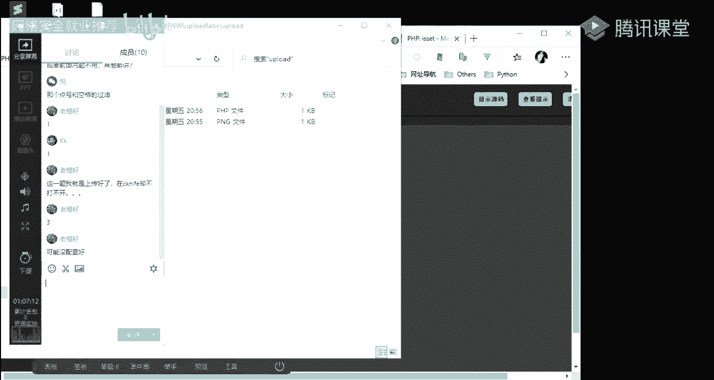

你如果是用用我配置好的这个文件的话，是没有问题的，我这里给你试一下吧，好，嗯我这里的话就直接用这个，ph view，然后可以看到我这里直接访问对吧，直接访问的话，他如果说你没有。

就是说有有同学给我就是截的图的话，就是他这里的话，它是会显示的是里面的一个代码对吧，就说这这样子的一个内容对吧，那是因为你没有就是做一个就是服务端，它没有对你的这样子的一个文件做一个解析。

我这里的话可以看到，它显示了这样子的一个内容，然后的话他把我的一个菲律宾代码做了一个，顺利的一个解析对吧，然后在这里，我直接做一个实验，然后执行一下，可以看到它是能够顺利地执行的。

然后用需要管理工具的话，如果说你在web端能够去执行这种命令的话，这个需要工具也是可以的，可以看到对吧，我这句话直接就呃得到了这样子的一个呃，就是连接成功了对吧，就是说你的一个问题的话，就是你没有啊。

就是，没有配置好，就所以说我建议你们使用，我发给你们的那个靶场，有那个的话是我已经配置好了的，在这里好，现在的话应该没有什么问题吧，能够正常的做一个连接的，就大家在测试，再就是说再去连接之前的话。

先用web用浏览器去访问一下，如果说没有说有这种报错什么的对吧，那说明的话你的这个码是能够正常的解析的，就自然而然的就能够用这样子的一个，这种需要管理工具去进行一个连接，好那么我们继续。

呃前面的话我们讲讲到了这个后缀名的一个，大小写的一个logo，就是说啊利用他的一个黑名单的一个缺陷啊，第七个的话就是嗯后缀名空格的一个绕过啊，其实这个的话跟上面的这一个是也是类似的，就是说这里的话。

就是他没有对我们的这样的一个空格，做一个过滤，他没有对这样的一个空格作为一个过滤，但是他对我们的这种呃，就是末尾的一个点做了一个过滤，然后它过滤了这这里的一个点缀的话，它获取到的一个后缀的话。

就是这样的一个p h p加一个空格的后缀，然后的话就自然的能够，绕过这样子的一个黑名单，然后保存到服务端的话，它实际存储的一个后缀的话就是一个菲律宾，这样的话应该哦跟前面的话是类似的，应该很好理解对吧。

好第九个第九个的话就是他没有对啊，我们的这样的一个特殊的这种字符串，做一个绕过，然后他把我们上面的像这种dht，还有大小写啊点啊，还有前面前面的一些空格都过滤了，但是的话在呃这种方法。

其实呃再去做这种windows上面的一个环境的话，就在c t f题题目里面也是啊比较常见的，就是说如果你啊发现像这种前上面的这种，没有做一个，就是说不能够去绕过的话，你可以尝试用这样子的一个方法。

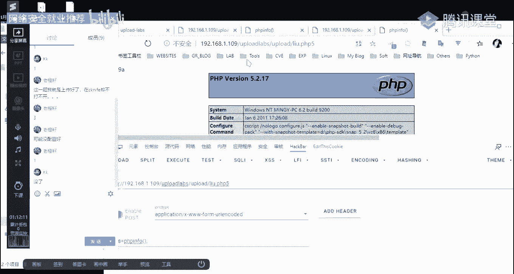

就只看，我们来测试一下。

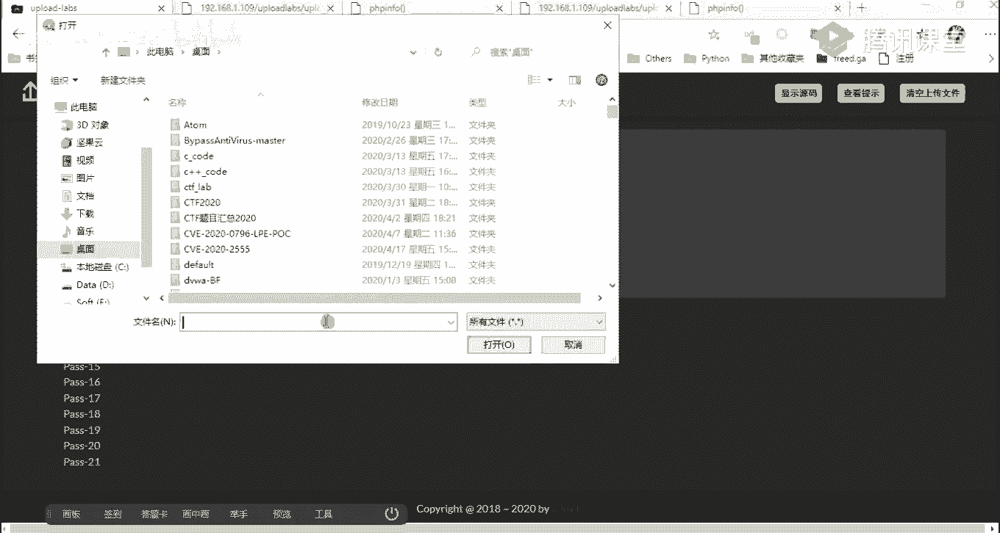

第九关，这样的话我同样的先上传一个天机，先呃得到它的一个这样的一个请求包，主要的就是这个包，然后把它发送到我们的repeat模块，然后的话我们啊就前面的这种测试，就是说点空格的这种。

我们去判断它的一个服务端的这种检测的话，我们就不一一的去做了，这样的话直接改成一个菲律宾，我们用这种方式去进行一个尝试，date这样子的一个方式，就实际它的一个后缀的话，就是像这样子的一个后缀对吧。

然后的话我们再进行一个上传，我们看一下这里的一个目录，我们上传上传之后的话，可以看到它实际保存到服务端的话，就是一个p h p的这样子的一个文件，我们可以从它的一个响应包当中去看到。

可以看到它是这样子的一个啊，就是保存到服务端的话，它是这样子的一个样子对吧，但是在windows上面的话，它会把后面的这样的一个特殊字符把它给啊，就是就保存到服务端的话，他看到这样子的一个文件名的话。

他会把它保存为这样子的一个呃，就是把后面的一个去掉，这里的话就是一个windows上面的一个特性，然后的话就是第十个，第十个的话呃，同样的就是啊跟前面的话类似的，这样的话就是呃这种顶空格就是多重的。

这种顶空格的一个绕过，最主要的话就是代码，它代码的话是呃，一个差别的话就是，呃跟前面的话其实没有什么太大的一个差别，就同样的是去除了顶，还有空格，当然这里的话是嗯我们的一个po的话，就是像这样子。

我们把它改成这样子的一个文件名，就我们啊在做一个测试的时候对吧，我们可以直接在这里去进行一个改版，然后通过查看观察它的一个响应包，它它的就是说它存储到服务端，它的一个啊文件名是怎样子的。

然后的话再一的做一个调整嘛对吧，你可以再多加几个，就直到啊找到能够正常正确的绕过它的，一个检测的一个方法，这样的话我应该没有什么问题吧，应该跟前面的话是类似的啊，第四，诶第11个也是啊。

第11个的话跟上面的logo方法的话是一样的，就这里的话是它是代码的一个实现方式，可能不一样呃，这句话同样的，它是定义了这样子的一个黑名单对吧，然后的话它是过滤了这种呃htc的这种字符对吧。

然后的话它这里的话是有一个诶，看一下这里我好像我应该是搞错了哦，这里的话是我写错了呀，这里实际上的话应该是一个，他把我们的一个文件名对吧，然后的话他会把我们的这样子的。

就是他这里拒绝的就是黑名单的一个文件名，把它给替换为空，主要的就是这个函数，就是说看到就是说他有这种替换操作的话。

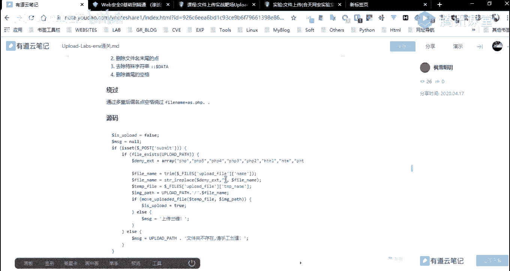

那么我们就可以使用双斜的，就是啊，就是后缀名的话唉怎么回事，后缀名的话我们可以使用这样，像这样，比如说一个s。ktp，然后的话我在这里在中间再加一个hp。

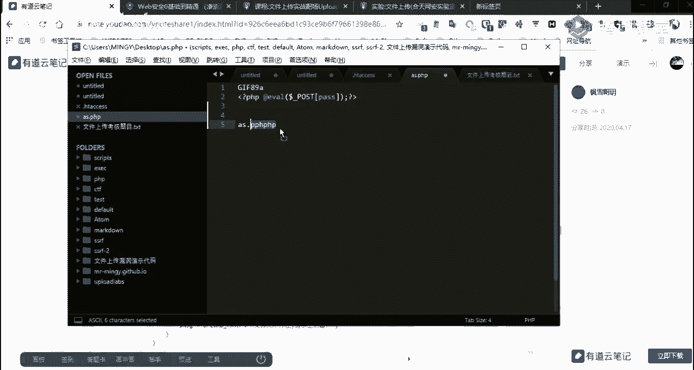

这个的话就是一个双写，然后他这里的话在服务端，它对我们的这种后缀做一个检测的时候，它会获取我们这里的一个后缀对吧，然后的话获取到的一个后缀的话，它会与我们这里的一个黑名单的一个内容，做一个啊匹配。

就是说它会把我们这里获取到的一个后缀，里面的存在黑名单里面的这种后缀，这种字符做一个替换，他替换的话就是哎这个就替换为空，然后他，这里的话我们可以看到，这里的话是有这样的一个pp对吧，它的一个代码的话。

它就会把这里替换为空，替换为空，但是它替换为空之后的话，我们最后的一个呃后缀通，啊不好意思啊啊咳嗽有点有点难受啊，搞得我了，而这里他实际的获取到的就是，他最后获取到的一个后缀。

其实还是一个菲律宾的一个后缀对吧，然后他存储的话，后面还是存储的一个菲律宾的一个文件，这样的话我这里是搞错了，就是说写错了，我这样的话应该是直接复制了上面的，所以啊忘记改了。

第12个那就是啊一个年龄阶段呃，关于您明年几段的话，我们上一节课也讲，如果说还没有就说不是很明白的话，大家可以去看一下这里的这个文章，这篇文章的话对这个年龄阶阶段，它的一个根源，就是。

我们为什么能够利用这样子的一个年龄阶段，做了一个比较详细的一个解释，这样的话呃，我们把这两个跟就这一个跟这一个做一个比，较，它这两个的一个区别的话，就在于我们的这里的一个。

呃就是这里这里它获取的一个保存的一个路径，它的一个方式它是啊不一样的，这里第一个的话它是以个体的方式，就是说我们在这里的一个保存路径，它是呃放在我们的一个u r l当当中，好，这里第二个的话。

它是以pos的方式去进行一个接收，所以我们传我们客户端的，我们传递和服务端的这个保存的一个路径，的一个值的话，它是放在我们的一个post的请求当中，然后这里的一个这里的梁啊，大家要了解的一个知识点的话。

就是这里的一个年龄阶段，它在一个get方式以及post的方式，它的一个不同之处，就其实上节课的话呃，也给大家就是有说到这样的话。

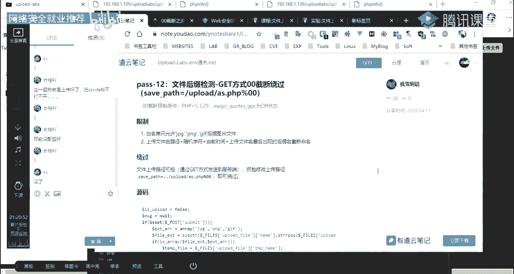

我以这两个题目做一个。

演示。

首先的话我们嗯是哪一个，第12个，第12个的话，我们首先同样的就是前面的一个测试的一个方。

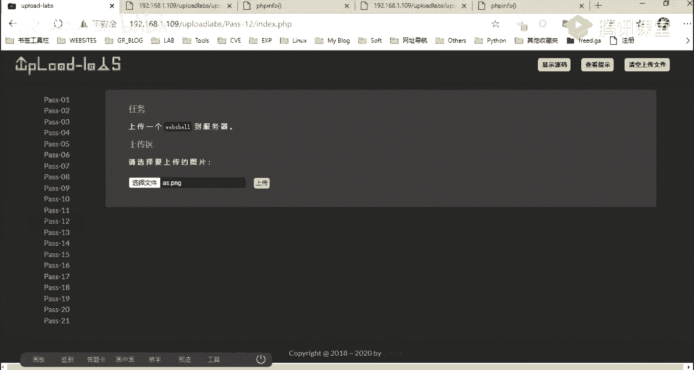

式对吧，我先上传一个呃偏激。

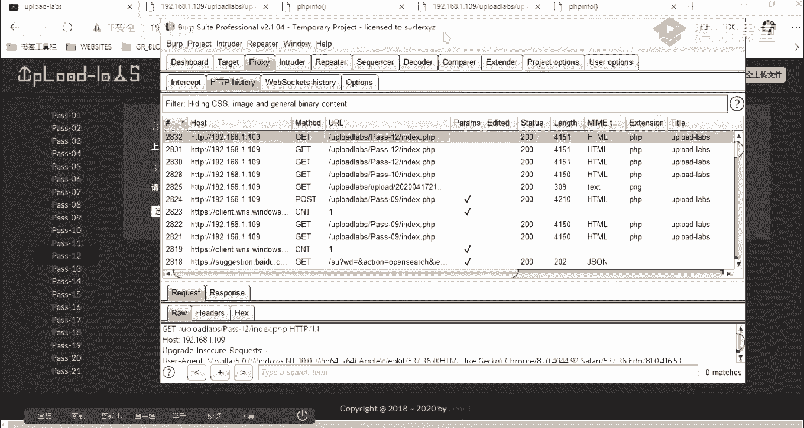

然后的话我们观察它的一个请求包。

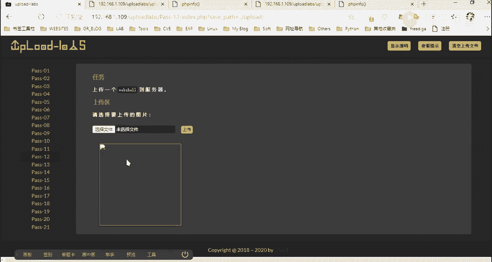

上上船看完之后的话，可以看到它是允许我们上传的，然后的话从，哇嗯嗯嗯，然后的话我们观察它的一个请求包，以及它的一个响应，我们这里的话把它放到这里，呃发送一下，我们可以看到就是我们的请求包当中。

它是一个post请求对吧，然后的话主要的话是观察它这里的一个u r i，它的啊有一个点就是这里，这里的话就是有一个save path，save pace的话，它的一个啊就这一个参数。

它的一个值的话就是顶顶杠的一个payload啊，不upload这样子的一个目录对吧，然后的话我们再从它的一个响应包当中，来进行一个查看，查看之后的话，其实可以看到。

在这里的一个就是保存到服务端的一个路径，它是这样子的对吧，顶顶干upload，然后这里还有多了一个对，然后其实它的一个它这里的一个代码的话，意思的话我们可以判断，就是说它是从这里的一个我们这里的一个呃。

保存的一个路径，然后的话与我们它这里啊，同样的做了一个随机对吧啊文件名的一个随机，然后的话做了一个拼接，就拼接之后的话，这个路径就是它的一个保存路径对吧，所以说这里的话它的一个问题的话。

就是说在于我们的这里的一个目录，这里的一个保存的路径其实是我们可以控制的，就是我们可以控制它这里的一个保存路径啊，发送到服务端是什么样子的，然后这里的话就是涉及到了这样的一个，年龄阶段的一个知识点。

我们来去进行一个绕过，就是说我们知道这里的话，我们通过前面的一个测试，知道它是这里的一个app的字串字符串，然后的话跟我们的这里的后面获取到的一个，文件名做了一个拼接对吧，好的话。

我们想要让服务端保存我们的一个pp后缀的话，我们就利用这样的一个年龄阶段，在这里写一个00%呃，前面的话我们随便写一个，比如说一个sd f。p h p，然后的话后面的话接一个00%。

然后这里的话就是一个00%的一个特性，它会把我们呃在这里的一个00%，后面的这样的一个字符串给忽略掉，然后实际它会存储到服务端的话，它就是前面的这一段，就是有一个a s d f。p h p到这里。

然后它解析了嗯，它解析到这里的话，它会把后面的字串都会给啊去掉，那我们可以来查啊，测试一下，我们进行一个发送，发送之后的话可以看到啊，它是保存的，它实际的一个好文件名，就是它的一个保存的一个路径的话。

就是这样子对吧，然后可以发现他这里是有一个这样子的，一个特殊的一个字符，就是零零阶段做了一个url的一个解码之后，就是这个00%，他在服务端啊，就客户端到服务端做了一个解码，做了一个url的一个解码。

解码成了一个这样的一个特殊字符，好的话，这种特殊字符的话，它在保存到服务端的时候，他会把后面的一个字符给去掉，我们可以看一下，在这里对吧，我们可以发现它是保存的，他服务端返回给我们的一个响应。

就是他保存的一个路径的话，是这样子的对吧，但实际在服务端，它是以一个s d f等于k h p的，一个一句话码的一个，菲律宾的一个web shell，这就是以它的一个问题。

就是在于这里它的一个保存的一个路径，就是说保存到服务端的一个路径，是我们能够去进行一个控制的，然后的话我们再利用这样的一个年龄阶段的，一个特性进行一个绕过。

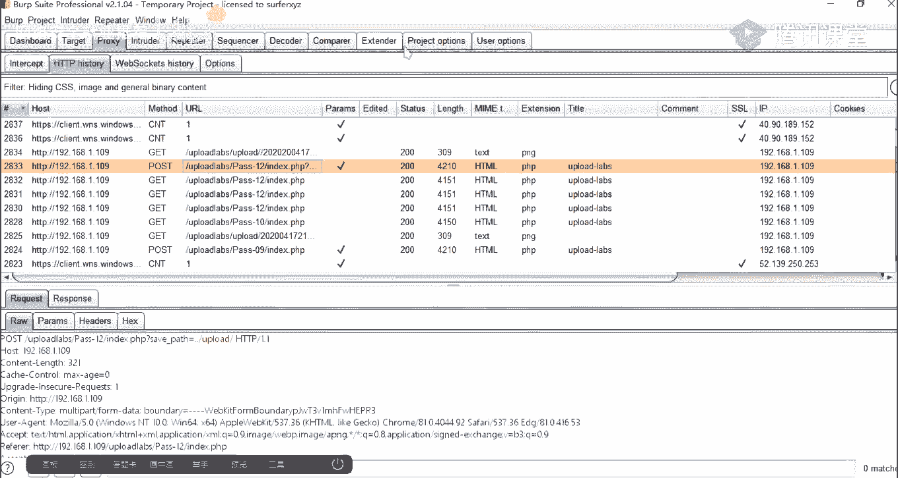

然后pose的话跟get的话，就其实就是呃我们同样的来进行一个。

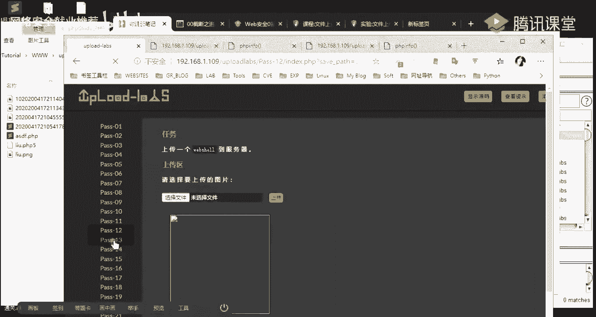

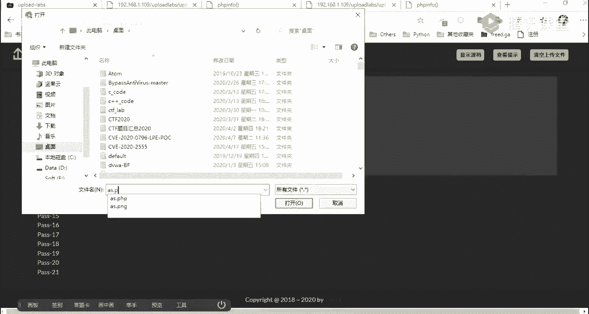

测试，按照上传一个这样的一个偏激，我们观察它的一个请求包，然后可以看到跟上面不同的点的话，就是说它不是在一个啊url上面，也就是说不是以get方式去进行一个，数据的一个传递。

然后我们发现它啊观察这个请求包的话，可以看到它的一个请求内容，在这里有一个参数，有一个same page对吧，然后的话这里它的一个值的话就是一个顶啊，顶顶干upload对吧，那我们可以看到啊。

我们先发送一下，发送之后的话，我们观察它的一个响应，观察响应之后的话，发现它跟前面其实是一样的，它同样的是把我们的这里的一个值，与我们保存的一个文件做了一个拼接，然后的话拼接保存到服务端。

所以说这里的话我们同样的使用一个年龄阶段，来进行一个绕过，我这样的话呃，随便写一个文件名，然后的话这里要注意的点的话，就是在post的请求的话，我们pos的这个数据的话，它传递到服务端的话。

他不会对我们的这样子的一个00%，做一个url的一个解码，解码成那个特殊字符，所以说的话我们需要在这里直接就是啊，更改为我们的那个特殊字符，这样的话我们就需要用到这个hex的一个编码。

我们需要找到这一行，我这样的话加了一个空格，就是为了呃就是把我们的一个诶没了，就找到这里，就是我们要在这里加一个那个零啊，零零阶段的一个字符，我们找到这个部分就是说在这里对吧。

然后在这里的话我们啊要知道的话，就是空格它的一个呃，16进制的一个字符的话是一个二零，就是二零，然后的话我们需要把这里改成一个零，零，改成零零之后的话，我们在这里可以看到它这里多了一个对吧。

多了一个这样的一个特殊字符，然后的话我们再发送到服务端的话，它就会从这里的一个呃内容，与我们上传的一个文件做一个拼接，我们可以看一下，可以看到它保存的一个路径就是这里对吧，文件名是这一串。

然后的话它同样的能够，就是说它会把我们这里的一个特殊字符，后面的内容给忽略掉，然后保存到服务端的话，是这样子的一个文件名，这里的两个例子的话就是呃让大家明白，让大家理解，就是这里的一个年龄阶段。

他在get以及post方式的话，它的一个好操作以及它的一个区别，啊这里的话大家应该没有什么问题吧，应该没有问题吧，有问题吗，啊没问题，那我们我们继续，就大家在听我讲的时候呃。

可以在自己的一个靶场上面跟着我一起做，这样子的话呃，可能大家理解的一个效果会更好一点，然后呃第14个的话就是啊，文件内容的一个检测了，前面的话都是啊，对我们的一个文件后缀的一个检测对吧。

这样的话就是啊对服务端，对我们的一个文件内容做了一个检测，logo的话，就是呃就其实就是我们它的一个检测的话，主要的话就是文件头的一个检测吗，还有的话就是后面的一个文件内容的一个检测。

就是他通过这样子的一个函数，通过这个函数来获取，我们上传文件里面的一些信息，好的话，通过里面的一个信息来判断，我们上传的一个文件它是什么样的一个类型，哦这里的一个文件头的一个检测的话。

应该没有什么问题的吧，就嗯跟我们上节课讲的一个内容，就通过图片码的一个方式对吧，加还有的话就是加这种呃文件幻数，常见的一个gf 89 a就是这样子的一个方式，能够进行一个绕过啊。

源码的话嗯主要的话就是这里吧，这里他首先的话它会获取我们上传那个文件，它这里的一个函数的话，就是获取你上传文件里面的一个内容，就是这里上传了一个文件内容的前两个字节，然后通过前两个字节来判断。

来判断你上传的一个文件类型，是不是这像他这里列的这三个类型，还有还有的话是不是就说不知道，就是说不是上面的这三种类型，然后的话这里会有一个判断就判断啊，如果说是这样子的一个呃类型的话。

它就允许你去进行一个上传，如果是unknow的话，它就会好给一个报错，就是啊上传出错，这里的话应该没有太多的一个问题哦，这个的话就是主要的话就是这个函数的一个理，解，我们啊这样的话大家看一下吧。

就获取图像文件的一个大小，然后返回它的一个尺寸，还有文件的一些类型的一个信息啊，这样的话主要的话就是呃通过图片嘛，还有就是这种图片的一个标识字段，加一句话码去进行一个绕过，就是从代码里面的话。

我们可以看到它就是啊，同样的是一个黑名单对吧，就是它的一个文件类型是限定了这三种，然后的话嗯，它会通过这个函数对我们的一个文件提取，里面的一个信息，它提取了一个信息的话，主要就是这一个好二二的一个信息。

我们看一下这个，这个页面就这篇文章的话，对这个函数做了一个比较详细的一个解释，好就是这里的话它的一个二的一个信息的话，就是索引二，啊这里索引二就给出的话就是一个图像的类型，就是然后它通过获取到图像的。

这个索引二的一个值，就它的一个值的话，就是像这里有列了一些获取到这样的一个值，来去判断它的一个文件的一个类型，是什么样的一个文件类型，再比如说一的话就是gf 2的话就是jpg。

好的话来判断它的一个我们上传的一个文件，是什么样的，一个是不是允许上传的一个文件类型，第16个的话，就是同样的就是这个函数的一个logo，就嗯理解这个函数就ok了，然后的话这样子的一个logo的话。

同样的就是图片嘛，就就我们常常常用的一个方式，就能够去进行一个logo，然后就是最后一个，文件内容的一个渲染的一个logo，上节课的话我们有提到就是通过代码注入啊，这里的一个呃渲染logo的话。

主要的话就是理解它的一个这几个函数，首先的话这里的话啊我们先从明代码来看吧，就是嗯嗯这里有注释就获取到它的一个文件名，还有它的一个类型，以及临时文件的一个路径和文件名什么的，一些信息。

然后的话主要的话就是这三个函数呃，这三个函数imagistrate from jpg，这个函数的话就是啊把我们就说这里的话，它首先会对我们上传的一个文件做一个判断嘛。

他判断是不是一个j p e g的一个文件，如果是的话啊，是的话，他就会交给我们的这一个p h p函数，让它把我们文件里面的一个内容做一个好渲染，渲染之后的话，他会把里面的一个内容做一个就是好。

简单点来说的话，就是把里面的内容做一个改变，改变之后的话，如果说我们使用这样子的一个图片码，就是说正常的这种图片码的话，他会把我们里面的这种图片码的一个内容，做一个打乱就去除。

它会去除掉里面的过滤掉里面的一个图片啊，过滤掉里面的一个一句话木马，所以的话就是我们上面的使用的一个图片码的，一个方式去进行一个logo的话，它就会失效，然后的话就是呃分别啊下面的话还有两个函数。

就是分别是png，还有gf的这种图片类型，如果你上传的话，它就会而做这样子的一个渲染的一个啊测试，做这样的一个渲染，然后这里的话对于他的一个绕过的话，就是我们通过这种图像处理软件。

然后的话在不破坏它文件本身的，一个渲染情况下，找一个空白的一个区域，进行一个代码的一个填充，就一般的话是这种图片注释区，前提呢是要保证它文件的一个结构的，一个完整性，就对于这种啊渲染的一个测试的话。

它基本上是能够绕过的，就是说呃可能通过在这一句话不是很好理解，它的一个意思的话，就是嗯我们因为我们通过前面的一个原理的话，理解到就说我们上传的一个图片码的话，他要把里面的一个内容做一个打乱对吧，好的话。

我们需要找到这样的一个图片，里面的一个空白区，这个区域的话我们就是说他在做渲染的时候，它其实是不会对里面的一个内容做一个改变的，就是说需要这样子的一个区域，我们把这样的一个一句话码插入进去的话。

就能够成功的上传一个这样子的一个图片嘛。

vx可以可以的。

然后这里的话，但是的话呃就是说这里你去进行一个填充的话，你如果说你直接去使用一个wx的话，你没有找到他一个空白区的话，你是你直接去进行一个填充的话，它是会破坏它的一个文件的一个结构性的。

如果说你破坏了它的一个文件结构性的话，你就是在这里的获取到它的一个文件的，一些信息的时候，因为这里的话它是只允许这三种，就是说jpg电机，还有gf这种图片文件去进行一个上传的。

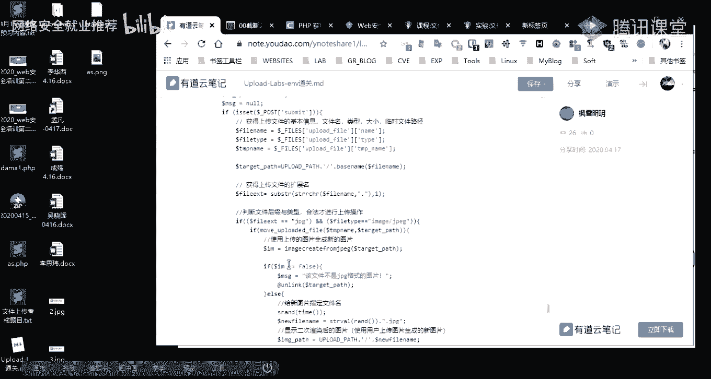

如果说它不符合这样子的一个图片，文件的一个类型的话，它是直接就不会让你去进行一个上传的，然后这里的话呃，我这里的话呃，已经有生成的几个，能够绕过的一个文件，就说是特特特就说特意生成的一个文件。

我们首先的话先用正常的一个方法，正常的方法进行一个测试，17吧，我这话先使用这里的一个图片嘛对吧，同学们，这里的一个图片码的话，它里面的话其实就是跟我们前面上传的一个，是一样的，这样的话我是好用的。

其他的你自己去建一个生成也是可以的，就他的一个代码的话。

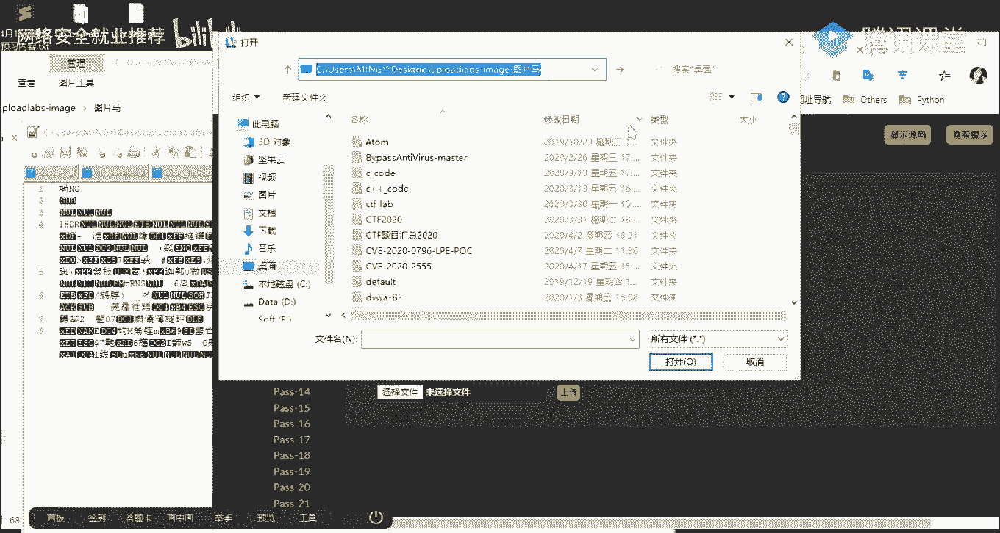

就是这里对吧，好的话，我们再把这个文件上传，上传这个文件对吧。

上传上传之后的话，它是这样子的一个呃内容对吧。

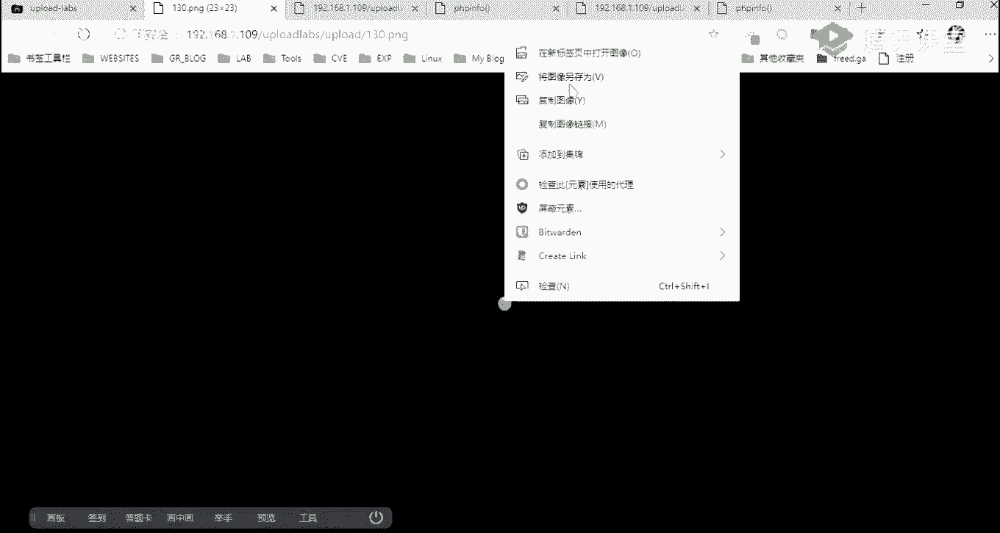

然后我们把在复制把它再做一个保存。

把就是我们上传到啊服务器的这一个文件，把它给下载下来。

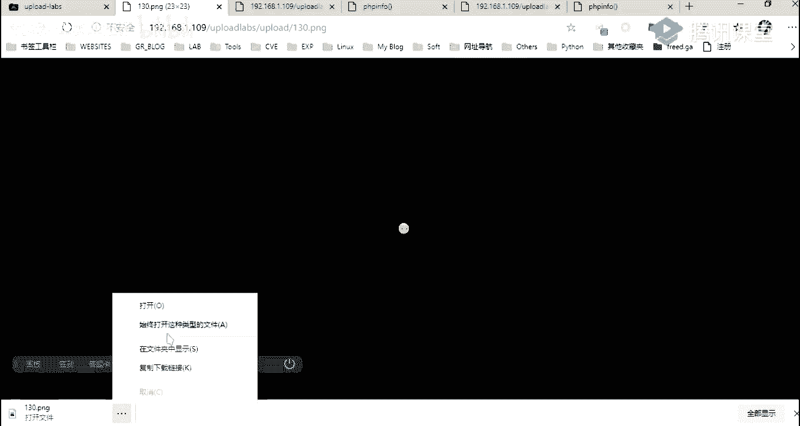

就到，下载下来的话就是这样子的一个文件对吧，然后的话我们通过这样子的一个，就是说这个编辑器把它打开，然后我们来对比一下这两个文件的一个内容啊，其实可以看到我们圆心，这里的话是有一个一一句话码的对吧。

然后实际上传到服务器的一个文件的话，它里面是已经没有了这样子的一个啊，菲律宾的一个代码，就是说我们可以通过这样的一个方式，来对它一个做一个判断，对它做一个判断，就是服务端。

它对我们上传的个这种图片文件做了一个渲染，他把我我们里面的一个内容做了一个打乱。

就说我们呃平常使用的这种图片码的话，它是不能够去进行一个绕过了，也就是说不能够去进行一个解析。

然后的话我们这里的话使用啊，我这里已经有的，这里的呃，比如说这个偏激的，这里的一个码，我们可以来看一下，里面的一个内容，它的一个内容的话其实就是这样，你这样子的一个内容，它我们可以看一下。

它是这样子的一个图片对吧。

那它里面的内容的话就是这样子的好，我们同样的把这个码做一个上传。

我们上传这样的一个码，上传上传之后的话，它是这样子的一个文件对吧，我们把它给下载下来。

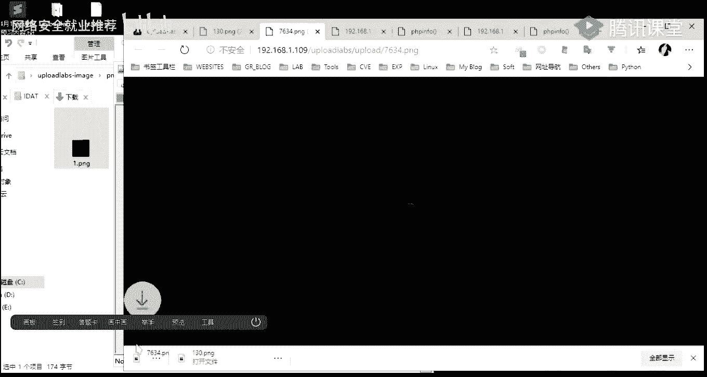

下载下载之后的话就是这样的一个文件对吧，然后我们打开来与云星，我们上传的一个文件做一个对比，我们之前上传那个文件内容是这样子的对吧，我们可以看到在这里的话，有一个psp的一个一句话码，好的话，在这里。

这个的话就是我们上传到我们的一个服务器，上面的一个文件内容，然后可以看到与之前不同的一个地方的话，就是它上传到服务器的这样的一个文件的话，它同样是保留了我们的一个菲律宾的一个，一句话码的一个内容。

就是说我们可以通过这样子的一个文件来进行。

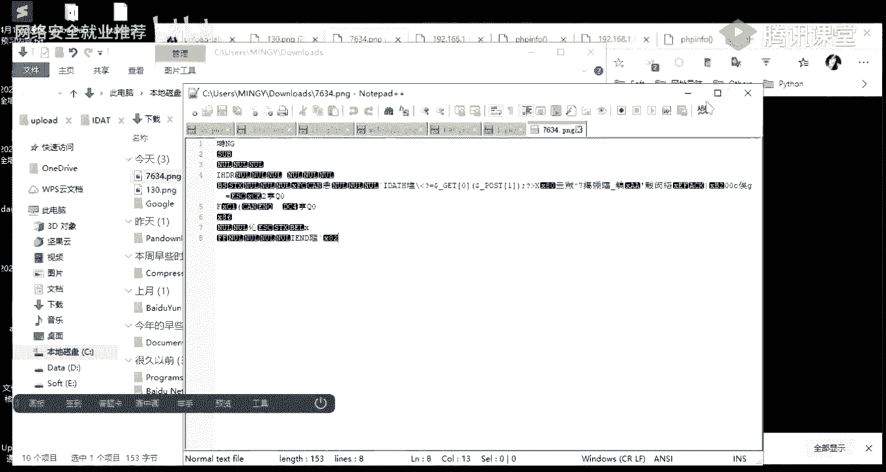

一个或得到服务器的一个web share。

然后这里的话嗯，这里的话就是还有一个点点的话，就是因为我们这里的话，只是能够去上传这样子的一个图片文件，好的话，就算你上传了这样的一个图片文件。

但是你在服务端，我们它是不能够去解析里面的一句话，码的一个内容的，然后的话我们需要结合其他的一个内。

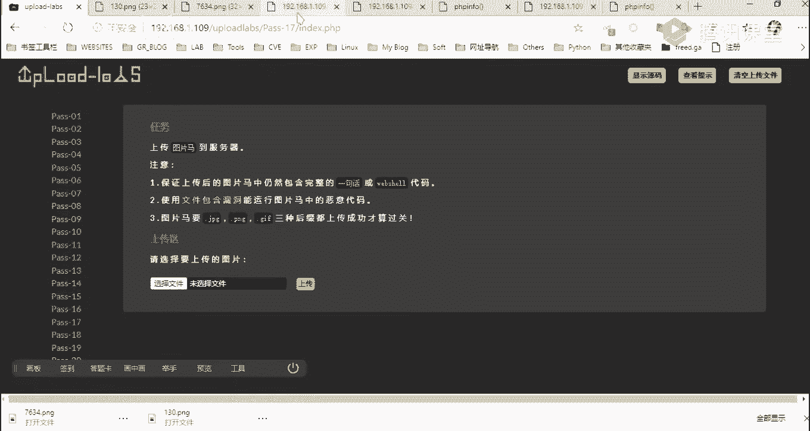

其他的一个漏洞，就是这样的话就是一个文件包含的一个漏洞。

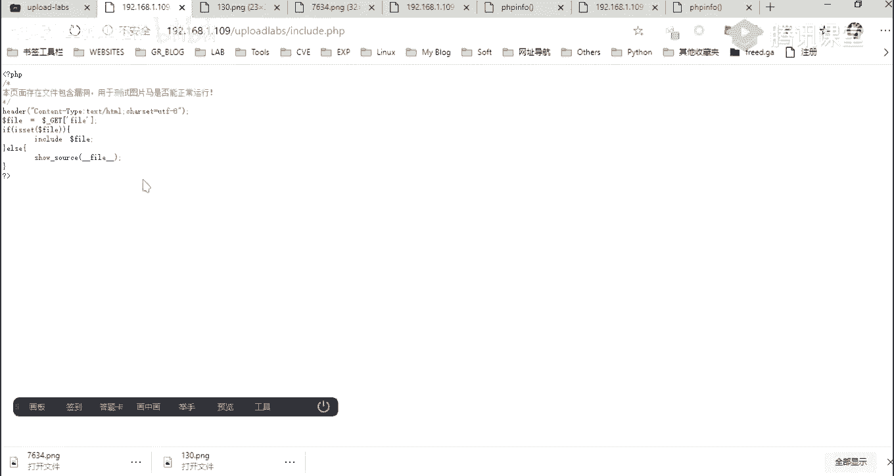

就在下节课会有讲到。

这里的一个文件包含的一个漏洞的话哦，这样的话他已经有提供了。

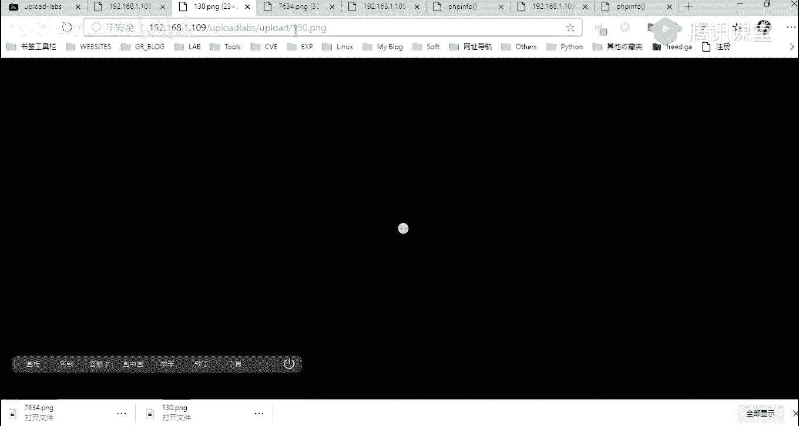

就说我们需要通过这样的一个文件包含漏洞，才能够得到，需要就是说才能够去解析里面的一个啊，这个图片文件里面的一个代码，这样的话我就给大家演示一下，具体的一个原理的话，我就先不说啊，这里的话给了一个代码。

其实代码的话也很好理解，主要的就是这里通过get方式获取我们这一个file，好参数等里面的一个字符串的一个内容对吧，然后的话再教给我们的这一个include，这个include的一个函数。

这个函数的话就是一个文件包含漏洞，经常会碰到的一个和函数，就是说通过这个函数来包含里面的一个文件啊，就包含我们这里用get方式发送的这一个字符串，然后的话它包含之后的话，他就会哦。

它会获取到我们这里的一个包含的一个文件，的一个内容，然后的话再输出来，我们这里首先来做一个测试，首先的话我们需要通过这个fire函数啊，不fire参数啊，搞错了，来传递我们的一个啊字符串。

这样的话我们想要去读取的一个文件内容，文件的话就我们就用这一个对吧，我们的这里的一个内容，啊或者说这个我还有点偏激吧，我们想要这里要想要读取它的一个文件，哪哪一个文件内容的话，我们可以通过一个就是路径。

这样的话是一个相对路径，就是说我们这，绝对路径以及相对路径大家要分清，就是我这样的话就提一下，就说我们当前所在的这样的一个文件对吧，它所在的一个目录是在这一个app roads，也就是这个目录下面对吧。

然后的话我们想要呃，就是说，绝对路径我们先来说绝对路径嘛，就这一个就是它存储在我们的一个磁盘上的，这样的一个路径，这个路径的话就是绝对路径，然后的话我们想要嗯，我们以这个文件为例子。

就说这一个文件它存储在我们的硬盘上的话，它的一个绝对路径就是这样子，然后的话呃加一个l u。j嗯，pg这个这个的话就是它的一个绝对路径对吧，我们可以直接这样子来去访问，然后的话相对路径的话。

就是我们通过这样子的app，后面接我们的一个就是这个l o l点，pg这样的一个内容好，我们回撤回车之后的话，可以干他这里的话啊，显示我们这里的一个内容，我们前面我们看一下它的一个文件的问题。

是这样子的对吧，然可以我们很熟悉的发现，他把我们里面的一个ph p代码做了一个解析，然后这里的话就是使用的一个相对路径，就是说这里的这个路径，它是相对于你当前的一个路径。

我们可以看到就你当前的这个文件的话，是这个嘛对吧，include。k hp，然后的话他当前目录下面有一个upload目录，ut upload目录对吧，然后后面接我们的一个文件名，然后这里文件包含的话。

他就会去查找，你单纯的就是它会包含你当前的这样的，这里给的一个路径的这样的一个文件，里面的一个内容，然后它包含用那个include函数包含之后的话，他会把里面的一个内容做一个ph啊。

当成一个p h p的一个啊文件做一个解析，也就是会解析里面的一个菲律宾的一个一句话，码的一个内容，我们可以来测试一下，pass等于嗯该去inf，我们执行一下，可以看到他这里。

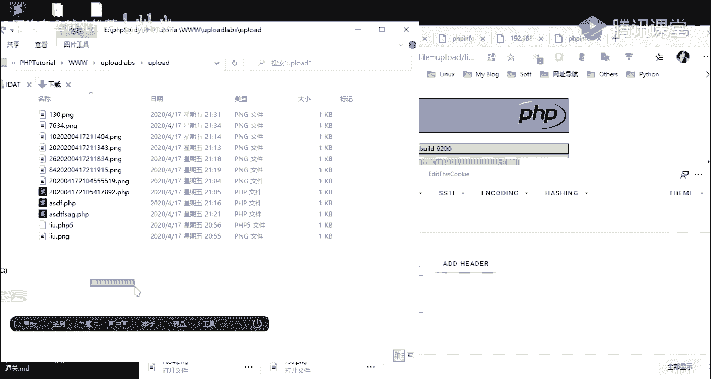

我这里的话是接的一个图片文件，它同样的能够去进行一个解析对吧，然后的话呃，我们再结合前面的，我们这里上传的这样的一个图片对吧。

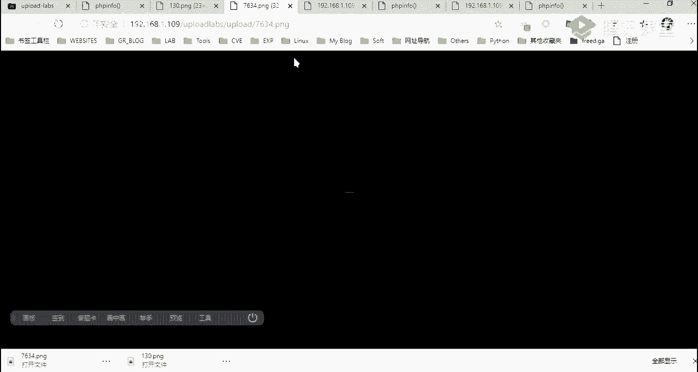

就是说我们通过绕过这样这里的一个渲染，测试的这样的一个上传的一句话码的一个图片，来进行一个测试，然后可以看到这里的话，它显示的就是呃那个图片文件里面多余的内容，我们来测试一下哦，这里的话这样的话。

因为里面的一个码的话是不一样的，是这一个，你是这个哦，是这一个文件，是这一个文件，上传的话是，骑牛杀四，点png，然后这里的话是这样子的一个码，这个码的话就是呃，其实就是啊跟我们正常那个码是一样的。

它的一个意思的话，就是通过post的方式来获取，我们传递给这个一参数的一个字符，然后的话这里的话就是一个get方法，来获取我们的一个零参数的一个值啊，其实它的一个意思的话。

就是我们可以来构造这样子的一个函数，好不好，构造这样子的一个一句话，马就我们可以来观察一下，就是，我们这里的这种正常的一个一句话嘛对吧，就说这样的话，前面的话它是一个hour，一个执行的一个函数。

后面的话接括号，然后这里的话是我们啊以什么样的方式来获取，我们啊来接受我们传递的一个参数，然后这里的话就我们可以通过呃，像我们的这一个零参数，呃它是以get方式来进行一个传递的，像一个零参数。

我们构造一个呃aa函数，然后的话他在以post的方式，我们在以post的方式来向他传传，我们想要它执行了一个命令啊，就是一等于ph p for，好我们执行，好这里的话搞错了，零等于，cover。

刚刚的话是呃不是这一个文件，我们，诶好，平民four，没有直接，没写错，诶嘿，有个问题，737634是这个合适的，这里不应该呀，嗯稍等一下。

那也等于，嗯可以的呀，这哪里出了问题呢，一定不喊我看一下，可能我哪里搞错了，没出一，能等于power，嘿，这就奇怪了啦，这个马的话是没有问题的，我之前是也是都是可以连的呀。

我忘了是可能我这里零的时候有问题，这个码的话是没有问题的，而且它的一个内容的话其实解析了，当然他这里的话有报了一个错，你copath路径，呃这个的话我课后我再看一下吧，啊其实这个码的话是没有问题的。

我测试可以看到在这里的话，我这里写的这样的一个ph码的话对吧，是可以这样子去进行一个，直接去进行一个连接的解析的对吧，它的一个意思的话，就是这里我们传递这样子的一个，可执行的一个参数。

然后它其实就会呃把它放到这里来，它会放到这里来，然后构造一个像这样子的一个a s s压t对吧，然后这里的话我们可以看到，就跟我们前面的一个一句话码的话是类似的。

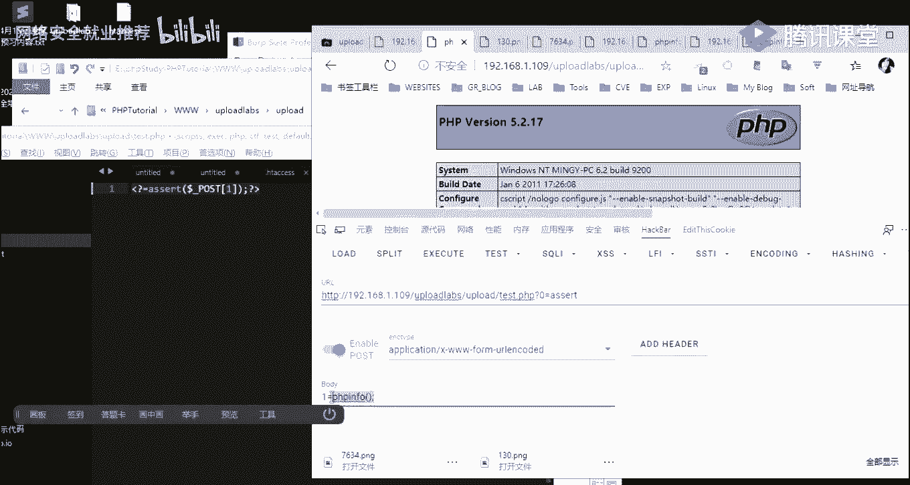

而我们只需要在这里就传递，我们这里执行的一个命令就ok了，这个马的话是没有问题的。

然后这里的话呃呃时间关系。

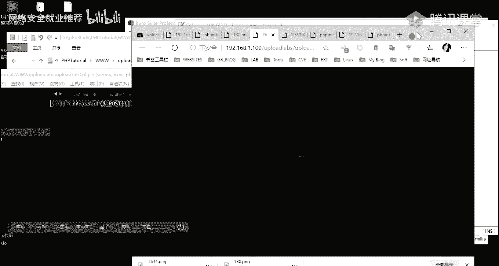

这个我呃我下课之后的话，我再看一下吧，我咨询室的话是没有问题的，好吧，然后的话今天的课程的话大概就到这里了。

今天的话讲的比较多，因为它的一个内容的话比较多啊，我讲了十多个，这个内容的话有点多，然后大家应该都能够听懂吧，呃，大家都能够听懂吧，再去弄一次对啊，我建议大家大建议大家的话再去弄一次啊，对啊。

我看大家这里的话呃，我这里有的这个这些啊，同学的话他给的呃不是很全的，就说大家在呃这节课课后的话。

再去自己再去尝试一下好吧，就是因为你可能你看我操作的话，还感觉感觉很简单对吧，然后你看着看着就懂了，但是你实际你在在你自己去进行一个操作的时，候，你看别人操作的时候其实很容易忘对，确实有点多。

其实呃就我之前也不是很不是太想讲，全都讲了，因为其实有些的话其实是比较，就是一些报过的一些知识嘛，其实我们上节课也讲了，然后主要的就是代码，这些代码的话呃，它的一个意思就理解它的一个意思。

他是怎么去进行一个绕过滤的对吧，然后我们针对这种过滤，我们通过啊观观察他的一个请求包，就是我们发送这样的一个上传文件的一个数据，然后观察他的一个响应对吧，观察了一个响应，它对我们的一个网上传的一个文件。

做了什么样子的一个过滤，好的话我们在猜测就是推测他做了哪些过滤，我们在针对这些过滤，来进行一个上传的一个绕过，然后就是测试的话，就是我们上节课讲的那些知识吧，其实这个啊大家用熟了的话就会就会很简单了。

就是你直接上手，就直接用那些知识去进行一个测试，然后再做一个判断嘛对吧，啊wtx这种工具的一个使用的话，大家百度1下吧，好吧，就是这种工具的一个使用的话，呃我相信大家就是呃百度1下。

然后自己玩一下应该就会了，然后其实其实我看了一下大家的一个评论，我觉得这位同学说的很对啊，啊应该就就是就是你吧，就是其实外表的话其实简单其实也简单吧，就是呃一些工具的一个使用，你熟悉的话。

就其实工具的话使用的话是很简单的，然后主要的话你是就是我们要教给大家的，让大家明白的，其实也是就是这些漏洞，它的一个原理，好的，我们怎么去，寻找这样子的一个漏洞，在什么地方寻找漏洞。

我们怎么去进行一个测试对吧，这些是要大家还有就是这些啊测试的一些知识，这些才是大家要去学习的。

去啊去搞明白的一些东西对吧，然后今天的话哇讲的有点久啊，就希望大家呃课后再去做一下吧，然后呃其他的闲话也不多说了，大家有问题的话私聊我吧，好吧呃但是啊我建议大家还是早点休息啊。

真的我建议大家还是早点休息吧，昨天晚上有位同学，有位同学，有位老哥晚上一点多钟问我问题，正好还被我看到了，我这我这你们这么晚还搞学习，我这想不回答问题都难啊，然后说着说着就一两点钟了。

就我建议大家还是你啊学习啊永无止境，但是还是晚上该休息还是要休息是吧，好问问题，欢迎大家来问，然后尽量还是呃白天吧好吧。

然后其他的也不多说了吧。

呃最后的话就是呃下周的话还有一节课，就是一个文件上传的一个实战考核，然后考核的话考核的一个内容的话，就是这里我在啊那一个靶机上面的话，又搭建了几个环境，就是一些cm。

啊然后的话包括之前的之前一个circl注入啊，对一个靶场的话，就是大家通过sql注入，得到了他的一个账号密码对吧，登录到后台之后，他其实是啊存在一些文件上传的一些功能顶的，然后的话这个cm s的话。

它其实就存在一个文件上传的一个漏洞的，而这里的几个考核都是呃，存在这样的相关的一些漏洞的，有些的话在网上也能找到，就我啊要求啊，就大家的话，花点时间去做一下，就实际的去做一下。

然后的话在下周一的话有一节课的话，就是针对大家的一个就做这些，实际去做这些这些测试的时候碰到的一些问题，给大家做一个讲解好吧，然后的话到时有问题的话，在课堂上面我们在一起讨论。

然后呃这节课的话内容的话就到这里结束了，然后嗯其他的哦，其他的话也不多说了吧，我们就今天的快乐的话就到这里结束，我们下课下课，大家早点休息啊。

