# 【B站最系统的网络安全教程】北大大佬196小时讲完的网安教程，全程干货无废话！学完即可就业，别在盲目自学了！！！ - P19：第17天：文件上传漏洞挖掘思路 - 网络安全就业推荐 - BV1Zu411s79i

然后的话我应该都，同学们应该都过来了吧，好，那么我们的话就正式开始我们今天的课程内容，然后首先的话对这节课的话，是对我们上周的一个课程的一个考核，然后的话呃我在课前的话，在群里发了这样的几个文件。

首先第一个的话就是呃一个夫子的，夫子的一个字典里面的话呃，里面的话是包括了一些呃，我这边收集的一些字典，里面的话有这样的三个字点，其实大家大家去github上面去搜的话，有很多的这种这种字典。

然后这里的话我就只下了这三个，大家可以去看一下，去研究一下这个怎么用，就是你再去做一些爆破的时候。

你就会需要用到这样的一些字典，比如说你看circle circle的这种语句对吧，这种语句如果说你不知道你怎么去测对吧。

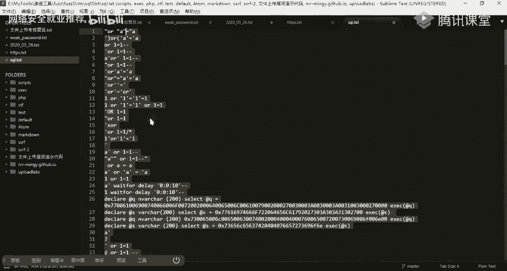

你可以直接用bp的那个模块，去把这把我们的这样的一个字典。

一个一个的去跑，好的还有就是呃有文件上传的一个字典，这个的话就是呃就是我上周和周六，周六的时候发给大家的那个那篇文章，那篇文章的话，我建议大家去看一下，就是他啊几乎介绍全了。

就是我们在课堂上面讲的一个文件。

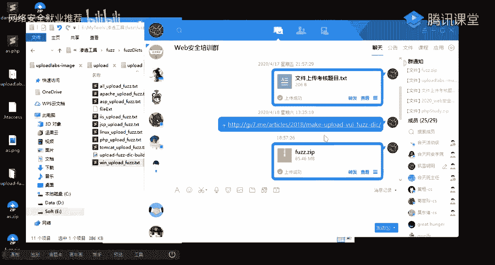

上传的一些点，好的话，他根据这些点，然后他自己啊用python写的这样子的一个啊，文件上传漏洞的一个，夫子的一个字典的一个生成脚本。

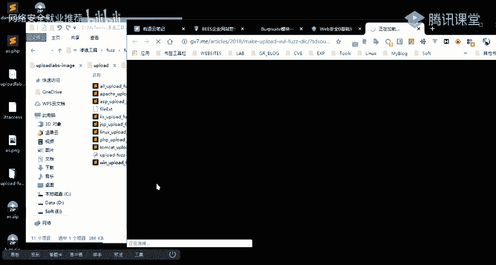

就这一个。

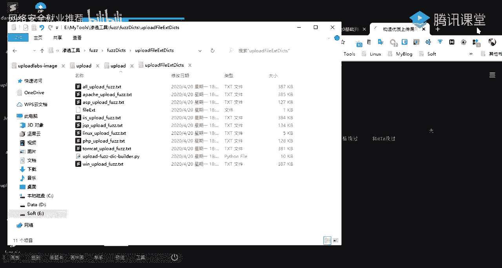

就这篇文章这篇文章大家可以看一下，如果代码看不懂的话，没关系，你就看他的列的这样的一些，就是说在文件上传当中，存在着这样子的一些漏洞，我们怎么去利用，比如说这种大小写混合的这种绕过方法。

它结合这样子的各个的呃，文件上传的一些漏洞的一个绕过方法，然后冰雪相对应的一个字典。

然后的话呃。

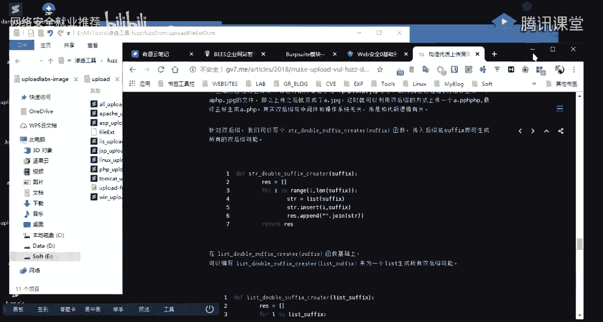

这一个的话就是他分享在那个github上面的，一个项目，大家可以去使用一下。

使用的话也是十分简单的啊，他这里的话已经有现成的。

它生成了这样的一些字典，可以看到。

这个的话是可以常见的一个菲律宾，你常见的这种p h p，就我们可以看到有像这种00%的对吧，然后还有的话就是这种大小写的，还有呃h t m的这种后缀的，kh p5 这种后缀的，它都把它就是做了一个结合。

然后的话大家再去使用的时候，只就呃你一个一个试，就是比较麻烦嘛，你手工去测的话，你可以使用这种字典就去跑它的一个后缀，如果跑出来的话，你从通过通过他的一个响应内容的话。

能够知道你的就说这样的一个logo方法是啊，什么样的，好然后第二个的话是这个upload这个images，这个的话就是我上节课的呃，就是绕过那个渲染的几个嗯，payload就几张图片。

就是啊已经生成了几个图片，我们可以直接使用这样子的一个，利用的一个图片，来去达到绕过我们文件上传渲染的一个目的。

然后这里面的话呃，其实看一下它里面的话，就是已经写好了这样子的一个一句话，就是这里这个的话是我根据呃一个项目，就是别人的一个项目改的，这个项目是哪一个，我在github上面根据别人的一个项目改的。

但是他那个他在里面写的这样的一个，一句话的话，我试了之后，他是就是绕不过那个渲染的，它里面的这个里面的这个代码，它会被也会被打乱，就是后面的这一节会没有，所以的话他是会失败的。

然后的话我就根据他那个做了一个，根据他那个改了。

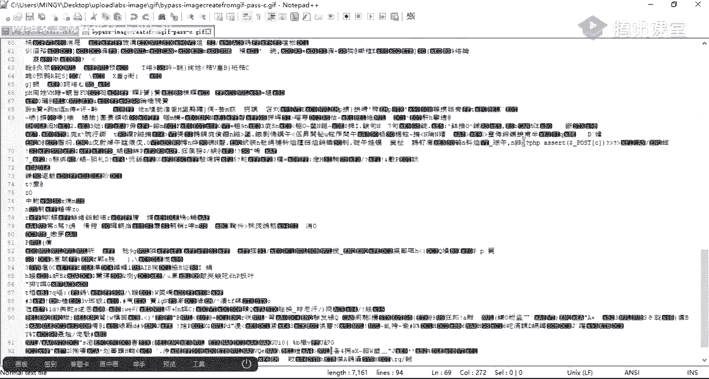

重新改了一个这样的一个一句话，这个是一个g i f后缀的，还有的话就是一个偏激，偏激的话，就是昨天的一个呃，呃不是是上周的一个留的一个坑哦。

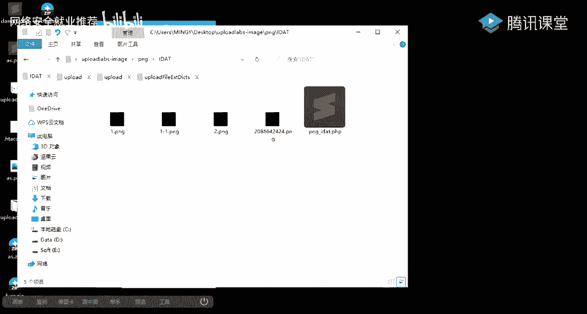

就是我上周不是啊。

因为那个时间比较紧，我就没去西没去仔细的去那个了，所以的话其实上次那个的话，其实是已经绕过了的，然后我没出新啊。

我们可以来看一下嗯，我这句话上传这里的线程的一个文件。

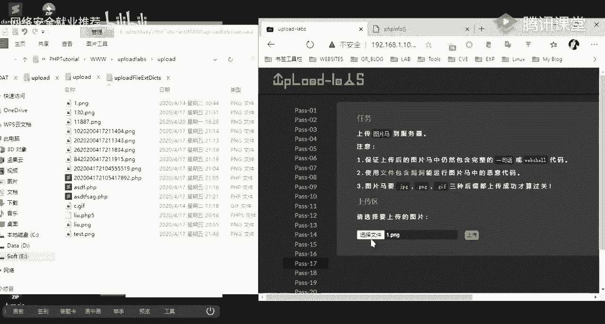

然后的话我们看一下它的一个文件名。

是这个26700。

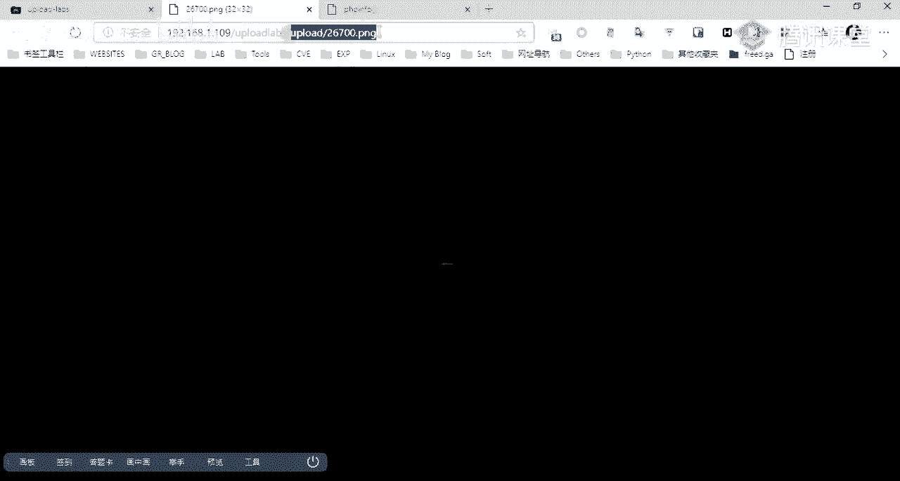

就这一个文件，然后的话我们打开之后的话，可以看到它是这样子的一个一句话对吧。

是没有问题的，然后我昨天哦不，我上次上周的一个问题是出在哪呢。

是好没有没有认真了没有认真去检查啊，十哦对了，还有就是呃上周课后的话。

有人问我说，就是你上传的这样子的一个图片码，怎么去进行一个利用，因为这里的话他那个代码是写的，就是说啊无法去就我们无法通过logo。

然后的话在服务器上面生成一个p，h p的一个后缀的一个web shell，就像这种，就这里的话我还需要啊，我需要再强调一下，就是说从那位同学他的一个提问的话来看的话，呃，我就是发现大家可能不是很理解。

还是没有太理解这样的一个啊web share，然后呢然后的话我们去怎么去进行一个连接，就是说我们的一个web share，首先我们回顾一下之前的一个内容，就是说它是一个啊菲律宾。

或者是说sp j s p的这样的一个，可以动态执行成一个啊脚本对吧，所以的话你要你你要是一个脚本的话，它的一个后缀我们直接看的话，就是它是一个这样子的一个后缀，是一个点菲律宾的一个文件对吧。

这个的话这样子的话才是一个web share，然后的话如果说像这样子啊，比如说我这里的这里的一个png的一个图片，然后的话里面是一个啊一句话码的一个内容，这个的话叫做图片码。

就是说它是一个它其实我们从后缀的话，而且服务端去进行一个判断的话，如果他没有对内容做一个判断的话，它是会把它当成一个图片的，好大家好，如果是图片的话，服务器他是不会去解析我们的这样的。

这个图片的一个里面的一个菲律宾代码，所以的话你直接去进行一个连接，连接这样子的一个文件的话，它是无法去啊得到需要的，所以说啊我们前面也说了，就是说我们需要绕过服务端的这种检测。

然后的话绕过的方法的话就是啊上节课啊，上节课讲的那些内容，用一些特性以及一些啊特殊的一个字符，然后绕过的话，就是说我们需要在，我们要能够直接得到服务端的一个shell的话。

就需要生成这样子这样子的一个web share对吧，也就是一个点菲律宾后缀的一个菲律宾文件，你才能够去直接的一个连接，如果说就像这里的。

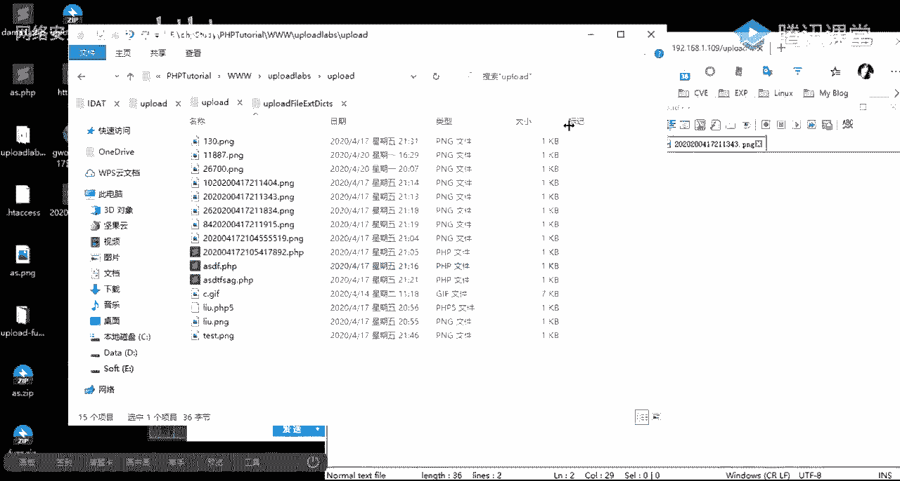

然后的话第二种的话就是说像我们这里的话，它是呃我们无法去绕过。

然后的话在里面生成一个p h p的，一个呃后缀的一个文件的，所以说的话我们只能是啊。

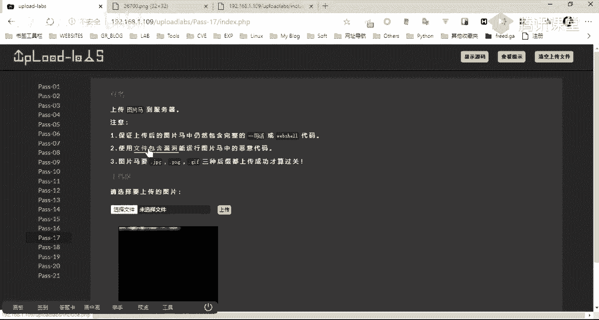

需要去利用其他的一些漏洞，这里的话有一个文件包含的一个漏洞。

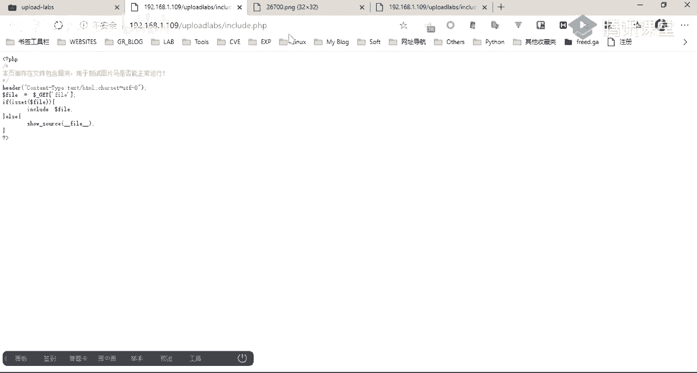

文件包含漏洞的话，在明天啊会给大家就是介绍。

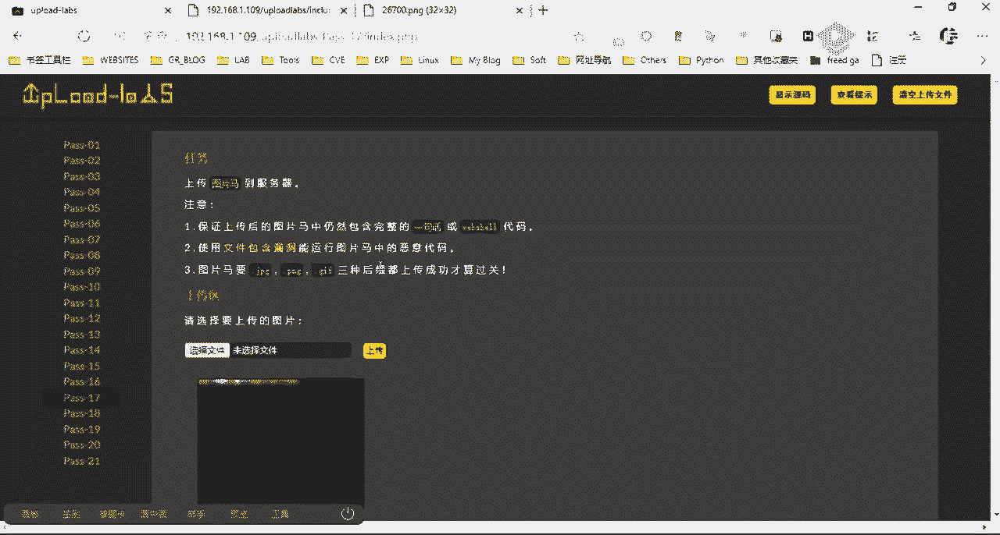

然后然后的话我们需要利用这一个这样的一个，文件，包含漏洞，来去，包含，我们的一个包含有一句话码的，这样的一个图片文件，因为文件包含漏洞的话，它的它它的一个作用，就是我们可以包含这样子的。

还有一句话码的一个图片文件，然后的话来执行这个图片码里面的一句话嘛，也就是执行这这个图片文件里面的一个，菲律宾的一个代码，然后上周的一个问题的话就是呃时间关系，就因为时间关系的话。

我就嗯没有仔细的去检查了，就是上周的一个原因的话，是我在这里我去传一个参重仓的时候，是使用的一个问号对吧，这里还有g5 就使用的一个问号诶，不是这个，是哪个文件，是不是，262700这一个图片吗。

2670有编剧，也就是在这一个文件，然后的话我上周的话是呃打的一个问号，问号问号我们就是在第一节课的时候就有讲过，就是说我们一个html的话，它是就是说前面就是问号。

后面的话是接了一些接的我们的一些参数对吧，好的话，我们这里的话需要再另外传递一个参数的话。

因为前面的话嗯。

诶前面是，因为前面是已经有传了一个fire参数对吧，好的话，我们后面是要需要用and的符号，来去连接两个参数的，然后上周的一个问题的话，就是我在这里的话是呃用问号啊，问号的话是不对的，所以的话它解析它。

因为我这里的话就不是一个url了，它就无法访问到那个资源，对我这里的话是要用这一个and符号，来去连接两个参数啊，我要零，我要传递的一个参数，那就是零给他传递一个值的话，就是我们和ph的一个执行函数。

asset，然后的话呃我要传递的一个啊，用post的方式传递的一个参的话，就ph p m for。

那我们执行，然后可以看到这里的话是能够正常执行的。

对吧。

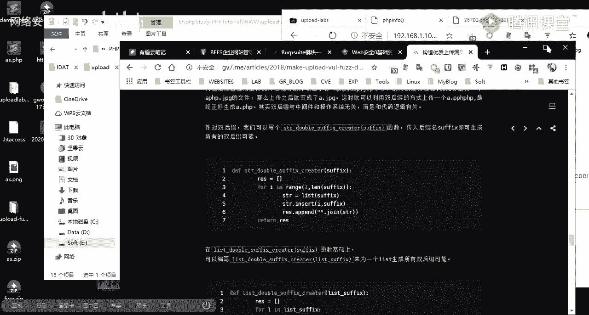

然后使用呃，连接工具也是可以正常的去进行一个连接的，连接工具的话，因为它这里的话是一个文件包含的一个形式，然后然后这里的话我们需要a，同样的复制这样子的一个优啊。

这这里的话才是他王者的他完整的一个url，然后我们复制到这里，然后的话我们需要传递的一个密码，也就是我们要pos的这样的一个参数的话，就是这个一，然后我们脚本类型的话是菲律宾添加，添加之后的话。

访问可以看到的话是能够正常的去连接的，就说他这里的话啊，文它不像我们之前是直接这样子的，一个菲律宾的一个呃web share，这里的话是使用的一个文件包含的一个漏洞，来去包含我们的一个图片码。

然后的话再来啊。

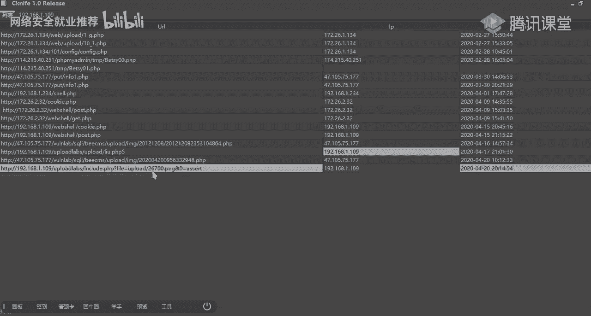

执行我们的一个图片码里面的一个代码来get share，这里的话应该没有没有问题吧，大家有没有问题，啊这里的话是给上周的啊，填了一个坑了，应该没有问题啊，好没有问题的话，那么那么我们继续。

然后的话呃之前呢之前的话说到了，就是，那几个图片文件就是啊能够直接去绕过嗯，在哪直接去绕过，这样的一个渲染的这几个图片文件，大家可以去尝试一下，然后的话大家就是应该有去尝试吧。

就是你用正常的一个图片吧，然后上传上传之后的话，它里面的一个代码它其实就已经被打乱了。

啊然后的话嗯，然后的话呃我还发了这样子的两个链接，这个链接的话就是呃我这里写的这个好，我们上周的一个文件，上传题目的详细的一个解题报告，祝大家哦给大家做一个对照，就是啊。

因为我这边的话只暂时收到了一位同学的。

一个这样的一个解题报告，然后我看了一下，他的话是啊，我觉得是写的挺好的，就是啊该有的点都有，而且都做对了，差不多，这个的话是有一个这个，然后第一个bbc m。

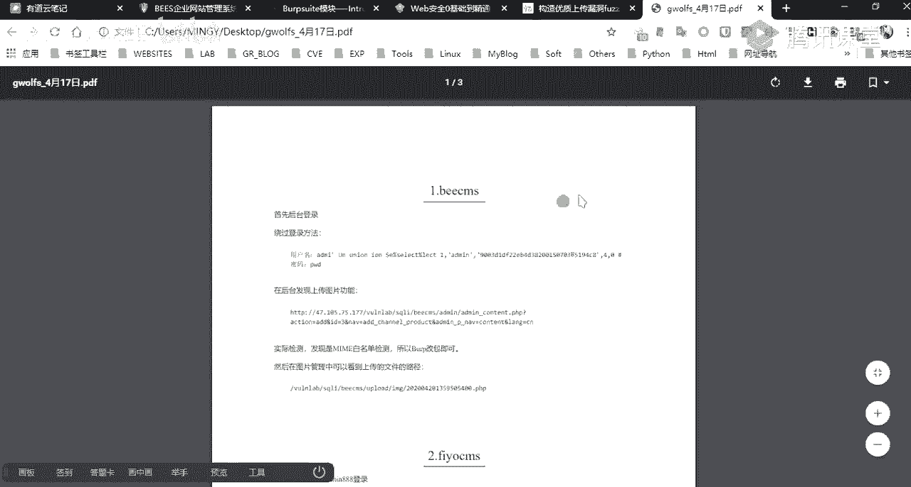

这个的话应该，大家其实应该就是在讲sql注入的时候。

已经有讲过了对吧，但是这一个sm的话，它同样的是有文件上传的一个漏洞，好，这样的话，我们呃就开始我们的一个上节课的一个课程，考核的一个讲解。

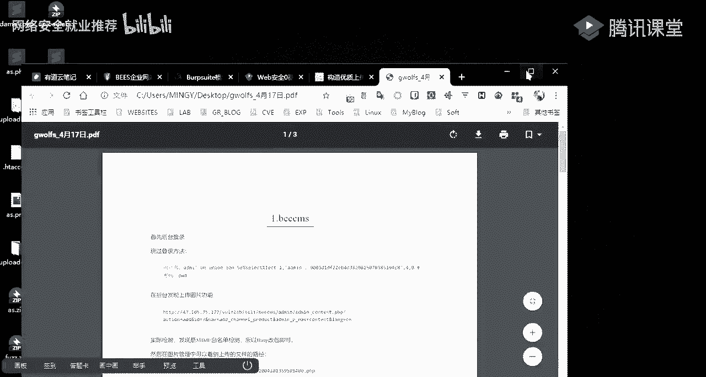

首先的话呃，首先的话第一个bb c m s，这个这个的话大家有没有什么问题呢，就是啊大家在做的时候有没有什么问题，第二个点不动啊，我们先来先来讨论一下第一个吧，第二个的话，等讲完这个再再那个吧。

这这一个的话大家有没有什么问题呢，呃有问题的话在讨论区扣个一吧，大家都没有什么问题吗，大家有有问题就直接提吧，不要也不要觉得就是不好意思什么的啊，反正这里的话应该是都这么多天了，大家都应该熟了呀对吧。

有什么问题直接提吗，我没有问题的话，那么呃那我直接讲吧好吧，这句话就是一个这样的一个cm s，然后呃之前的话应该是讲设备注入的时候，应该给给你们讲过了对吧，就这样子的一个，这样子的一个登录界面对吧。

啊这种管理登录界面的话，就是我们可能刚开始，就是说我们，比如说我们找到这样子的一个站对吧，我们找到这样子的一个站，这样子的一个站，我们想要找到他一个后台地址是吧，就给大家一些思路。

就一般的话一些后台地址，他都有一些这样子的一些关键词，就比如说像这种要命对吧，就是你的一个管理用户的一个啊给一个目录，再有一个管理目录，然后下面的话就是一些啊登录的一个页面对吧。

你只需要只只需要输入一个add命，或者说直接就是add命点骗去p，还有的话像这种logo啊，还有admin logan等等的这种，然后的话可能的话就就常见的嘛，就是直接直接尝试一下就可以得到。

但是不常见的话，大家就可以用一些就是一个目录的一个扫描器，直接去扫它的一个目录，然后扫墓的话就也能够去发现它的一个，管理后台，这样的话大家常用的一些扫目录的一些工具，大家一般用的是什么，之前的话有奖吗。

遇见还有还有吗，呃di search的啊，我觉得这个di search还是挺好用的，就主要的话速度也比较快，而且字典的话还是比较大的，区间的话区间的话呃，你用自己的一个字典的话也也是可以的。

而且速度也挺快。

啊我这里的话我也用，就是，当然也还有其他的一些工具，我这样的话就用这一个电压色体，去进行一个测试吧，因为啊之后的话后面也有几个题目是没有给，应该没有给吧，没有给这种登录界面吧。

大家可能的话用手去尝试的话，不一定能尝试得出来对吧，所以的话我们就使用工具嘛，工具的话大家去找一下，而且现在的一些工具的话都是比较强大的。

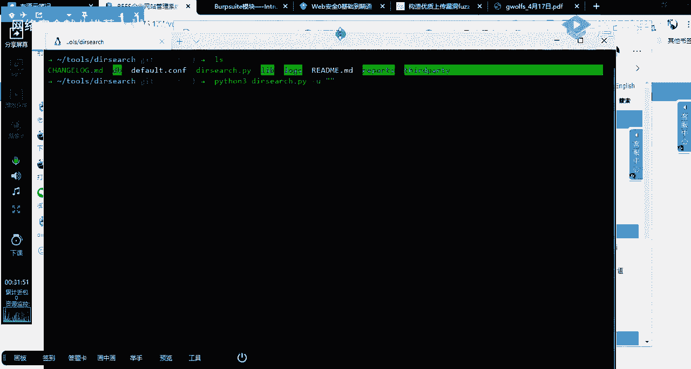

而且就是别人都已经分享出来了。

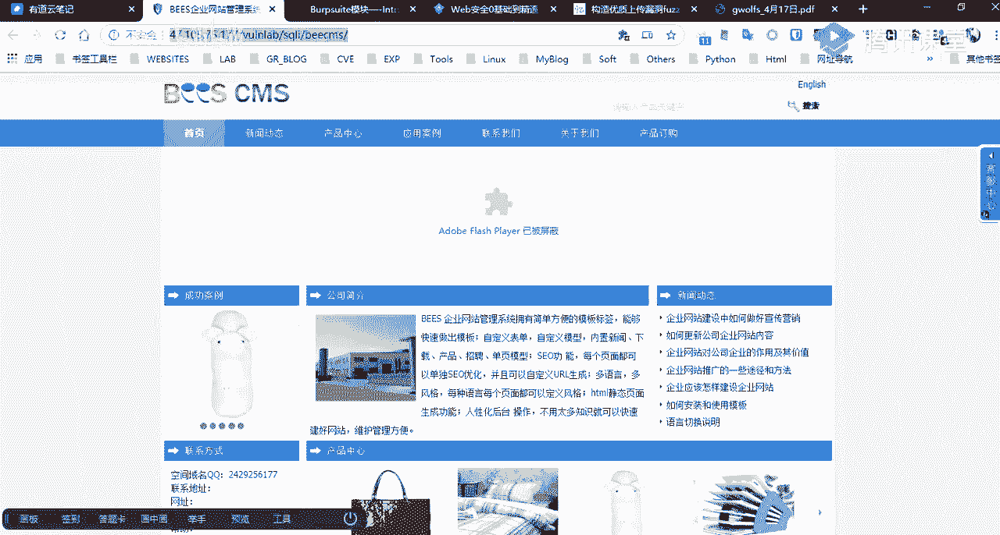

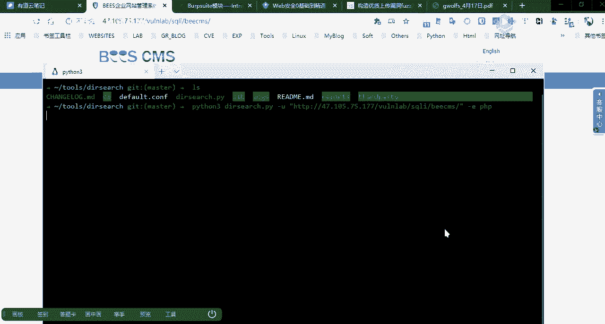

好的话，我们只需要扫一下它的一个目录对吧，就能够找得到它的管理后台。

可以看到，还有一些其他的一些页面，说不定的话就能够找到一些漏洞的一些页面，对吧，就总比我们我们这样子去手点点，这样的一些功能点的话，可能要直接方便一些好这样的话我就不多说，主要的话就是介绍和一种思路。

好的话，我们到了这样子的一个登登录后台的话对吧，登录后台的话，大家啊上节课而言讲的是蛇口注入嘛对吧，搜狗注入的话，直接去进行一个注入，然后的话我们直接测试一下，对吧，最常见的就是一个单引号对吧。

然后的话我们看到可以看到有这里，这里有个报错，而且这里报错的话有显示这样的一些字段名，以及啊我们的一个表明等等，那些信息都有已经显示出了，我们能够可以直接做一个判断，它是有一个sl注入的。

然后sql注入的话哦这样的话我就不讲了吧，因为上节课的话已经讲过了，主要的话是呃，我们通过这样子的一个sql注入对吧，然后的话通过爆破获取到它的一个呃，admin的一个账号密码啊。

获取到的话应该是这样子的，一串md 5加密的一个值，然后的话我们可以通过呃cm d5 ，通过cmd 5区域进行一个解密，还有的话像还有其他的一些，md d5 的一些解密工具，因为有samd的话。

它的一个呃就是它的一个库的话是很大的，就很多的一些md 5都能解密出来，但是有些话他可能是要可能是要要收费的，这样的话能够直接解出来，它的面积是三，然后的话你也可以去尝试一下。

其他的一些md 5的一些解密的一个工具，嗯我发群里，这些网站的话大家可以去找一下，有挺多的，国外的也有一些，当然的话啊，一般的话这个cmd 5都能够解得出来，好的话。

我们解密出来的话就是这样子的一个admin的面，一三的一个啊，账号密码对吧，那么我们直接登录登录到后台，d614 ，这样的话就已经到了后台，然后的话我们咳咳，因为我们这里的话已经是一个admin的一个。

管理用户对吧，就说这个网站的一个web web的一个应用的话，我们是已经拿下来了对吧，他所有的一些功能我们都能够去进行一个访问，以及做一个修改，然后的话我们下一步的话。

我们就需要去寻找那种寻找啊一些漏洞，这些漏洞是我们需要去利用它，来得到我们的这样的一个网站，这个web网站，它的一个服务器的一个权限，然后这边的话我们就呃，使用我们上节课学到的一个文件上传。

然后文件上传的话，大家回想一下，就是说我们怎么去查找它的一些漏洞，就说这种漏洞它存在的一些点，它是一般都会在哪里对吧，一般的话我们上节课也讲到，一般的话就是在我们的一种图片的一个，上传对吧。

还有像这种word文档的一些上传等等的一些功能，点，是啊很容易存在这样子的一个漏洞的，然后的话这里我直接点开一个就能够发现是吧，这里就有上传图片的这样子的一些功能呃。

这里的话应该是你们今天你们今天做的吧，这么多p h p，然后这里的话，这里的话就是一个上传图片的一个点对吧，然后我们的话，就是利用我们啊上节课学到的呃，文件上传的一些知识点去对它做一个测试。

我们首先的话先上传一个，这句话先直接尝试上传一个sp，然后上传的话，它显示就是上传图片格式是不正确的，那这样的话嗯，打开app，我们先来啊上传一张图片来测试，来看一下他上传的一些请求包。

以及响应包的一些内容来去啊，对这样的一个呃功能点去做一个测试，我们上传上传之后的话，可以看到已经上传成功了，他这个格式的话是png对吧，好的话，我们在bp里面看一下它的一个请求包，请求包的话就是。

请求包的话可以看到我们啊是这个这个请求包，这就是我们刚刚的一个上传图片的一个，请求包对吧，这里的话就是我们的一个图片的一个呃，上传文件的一个内容，以及我们的一个后缀对吧，然后这里的话就使用我们上节课。

说，讲到的一些知识对吧，比如说我直接上传一个啊，直接进行一个p h p好的话，我们查看它的一个响应，响应的话，响应的话我们可以看到就是我们这里的话，直接就是上传了这样子的一个p h p对吧。

然后可以看到他在他的一个响应里面的话，我们可以看到图片的一个格式，已经变成了一个菲律宾，然后的话这里的一个我们上传之后的一个路径，就是这个，然后可以可以看到我，我这里的话就随意的测试了一下。

就发现这边的话已经上传成功了，那那他为什么上传成功了呢，这个的话就是它的一个呃，上传成功之后的一个路径，那么我们从这里的一个啊，我们发送的一个请求以及响应包的话，能够基本的判断他只是啊对我们的这里对吧。

因为我们刚刚的话上传了一个，就直接上传了一个p h p的一个文件对吧，它是不允许我们的一个上传的，然后这里的话我跟之前的一个区别，就在于这里的一个content type的一个字段。

是一个图片的一个类型对吧，我们就可以判断它是指对我们的一个content type的，一个类型做了一个判断过滤，所以的话我们在直接通过bp进行一个抓包，以及发包的话就直接上传成功了。

这里的话就是我们的一个shell，的，然后的话呃它的一个路径的话，大家要注意，就是它的一个路径的话是在这个upload image对吧，然后的话我们看这里就是说这里的话是他的啊。

那个图片的一个这个应该是一个缩略图，它的一个路径，我们从这里的话，能够知道它是在这个bb c m这个目录下面对吧，我们复制一下bbc m下面有一个upload，这样子的一个目录，好，我们可以这里写错了。

app可以看到这里的话已经解析了对吧，然后啊做一个执行命令的一个测试，然后的话可以看到我们这的话是已经成功的，得到了他的一个shell，然后的话呃下一步的话，我们用这种需要管理工具去进行一个临界。

然还有其他的一些操作，然后呃这样的话我就不做演示了，然后这里的话呃关于这一个的话，大家有没有什么疑问，我这里讲了之后的话，工具，这个工具吗，这个工具的话就是对他就是把我们的一些目录。

就说这一个网站它的一些目录，因为它里面也是有字典的，通过它的一个字典，把这些目录以及它的一些常见的一些文件，把它给枚举出来，就说就等于就是说我们直接去进行一个，哎正常的一个访问对吧。

如果说我们我们正常去访问它，这个页面存在的话，它就会返回这样子的，比如说一个200的一个状态值对吧。

或者说这种302跳转的一个状态值，就说就说明我们的这里的好这个页面，它是能够去访问到的，也就是说它是存在这样子的一个页面的对吧，还有的话像这种可以看到它这里不是也有啊，403这种的话它是使用的呃。

尝试使用这样子的一个文件去进行一个访问，对吧，就说明他返回了一个403的一个状态值的话。

就说明它是不存在这样子的一个文件的，然后大家对这一个题目的话有没有什么疑问呢，没有对吧啊，大家应该都做出来了对吧。

因为这里的话就是比较简单的。

然后图片的话可以看到就是这样子的一个，这个的话是它的一个缩略图啊，应该是我们组我们其实，确定我们其实就是选择这个图片的话，它的一个路径其实是这样子的一个路径，就其实是我们的一个ph p的一个文件。

然后之前的就是这个，你说下载之后打不开对吧，是，我这里的话下载一下好吧，去听了，诶，是上面，哦这里的话，因为这里的话因为你这一个菲律宾的一个文件，它是解析了的，就是说它里面的一个代码是已经解析了。

然后我这里的话下载的话，只是这里的这一个页面。

这个页面的话，其实就是你查看源代码的这样的一个页面。

没有吧，然后的话你你这你这样子去下载的话，是下载不下来的一个ph p文件的话，因为它会对我们的这样的一个页面做一个解析，而且而且你可以看到就是说那种菲律宾页面，你去查看它的一个源码的话，你是查看不到的。

因为因为在这个页面，它是把我们的一个菲律宾代码解析之后，返回的一个结果，才呈现给我们的这里的一个页面，所以说你是不能够直接下载到它的一个。

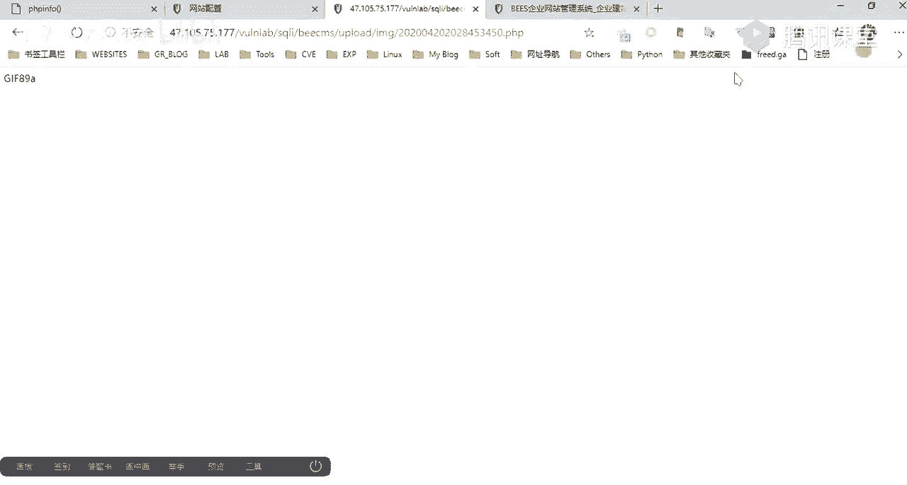

菲律宾的一个源代码的，然后图片文件的话，你这像这种图片文件的话。

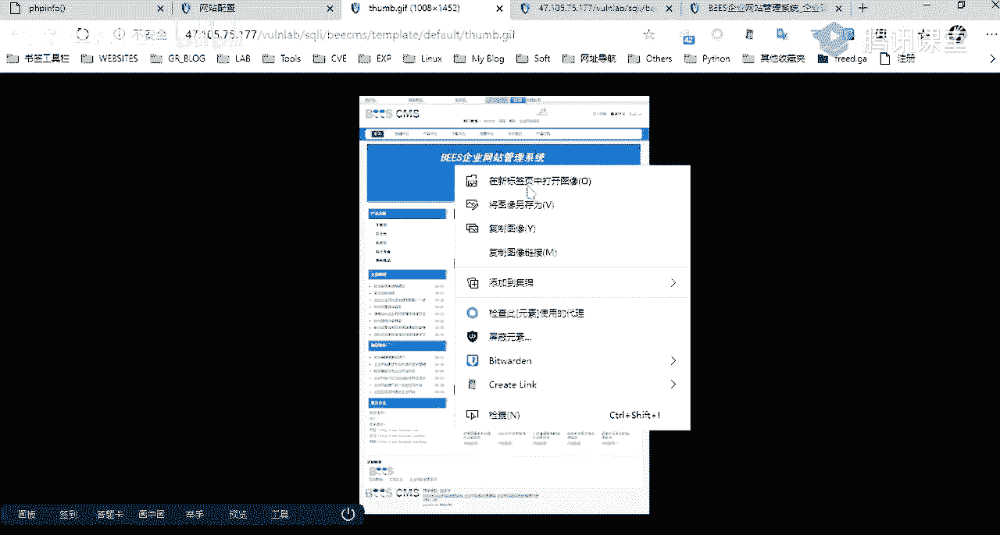

你是肯定可以直接直接下载的，然后下载的话，你这样的话，不能够读。

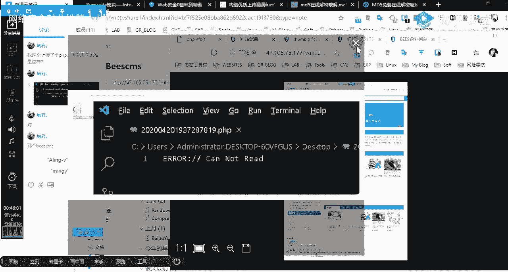

不能够读的话，这个呃你换一个其他的一个，你不用vscode打开，你用一个像这种sublime才有呃，像这种呃，notepad这种可以直接打开这种二进制文件的这种，编辑器你试一下，不然啊。

然后的话也有可能是，你这里下载的话是有问题的，这里没有下载，下载对，好的话还有疑问吗，应该没有问题了吧，好没有问题的话，那么我们继续啊，第二个，这句话啊，我这句话其实写的很详细了，还有图片。

然后第二个的话哦哦对了，还有就是这个的话其实还有其他的一些哦，还有其他的好几处文件上传的一些点，它都是一样的，就其实呃其实它都是在这样的一个页面，其他都是呃在呃他的这样的一个图片，上传那个这个功能。

然后的话上传之后的话，他这个图片的话它会在这里嘛对吧，然后其他的一些功能点也是一样的一个意思，然后第二个的话就是这个fc马。

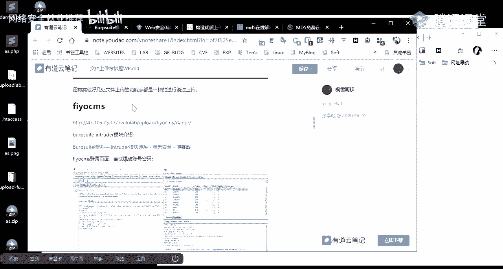

这句话直接打开的话，就是这样子的一个页面对吧，同样的是一个登录页面啊，拿到多少可以坐一起烧烤猪，做一些sql注入了一个尝试对吧，在这里的话，你测试之后的话，其实呃。

没有这样子的一个cil注入的一个漏洞啊。

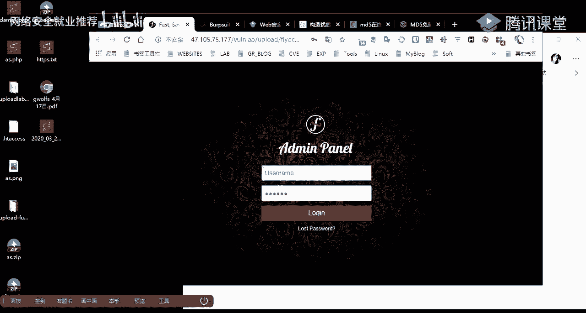

这样的话哦你尝试之后的话，其实他没有这样子的一个吃口注入漏洞，好的话，像我们碰到这样子的一种登录框的话，我们有什么样的一些思路呢对吧，第一个的话就是我们呃之前学过的这种，登录框的一个注入对吧。

我们用常用的一些pao的去进行一个测试对吧，如果有报错什么的，我们能够做一个基本的一个判断，然后第二种的话就是我们可以发现这里的话，他是没有这种什么图片的一个验证码的，还有没有其他的一些验证的一些条件。

它只是只有一个这个用户名以及密码，这样子的一个登录的一个页面，所以说这里的话我们可以，我们可以去尝试进行一个爆破，就是说通过啊我们的这样的一个bp的。

这里的一个爆破模块，来对我们的这样的一个用户名及密码，做一个爆破，然后爆破的话就需要使用到这个bp的这个，instrua的一个模块。

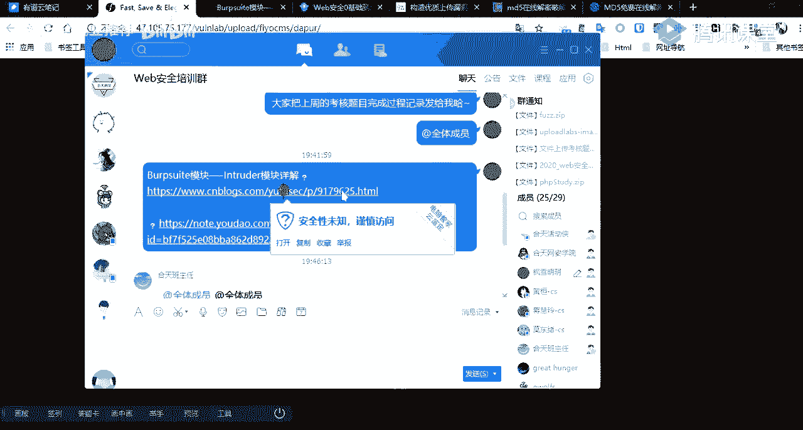

然后这个模块的话大家看一下这篇文章吧，就这篇文章的话，他写的很详细了，然后这里的话主要的话就是我们怎么去进行，一个使用，我以这一个例子做一个啊，我以这一个好页面做一个演示，啊前面有有讲到这一个吗。

good pad可以是吧，对就是一个用户名的一个枚举，用户名密码的一个枚举，就是用这个爆破，啊啊这里的话就是说这个bp的一个模块的话。

大家之前有有使用过吗。

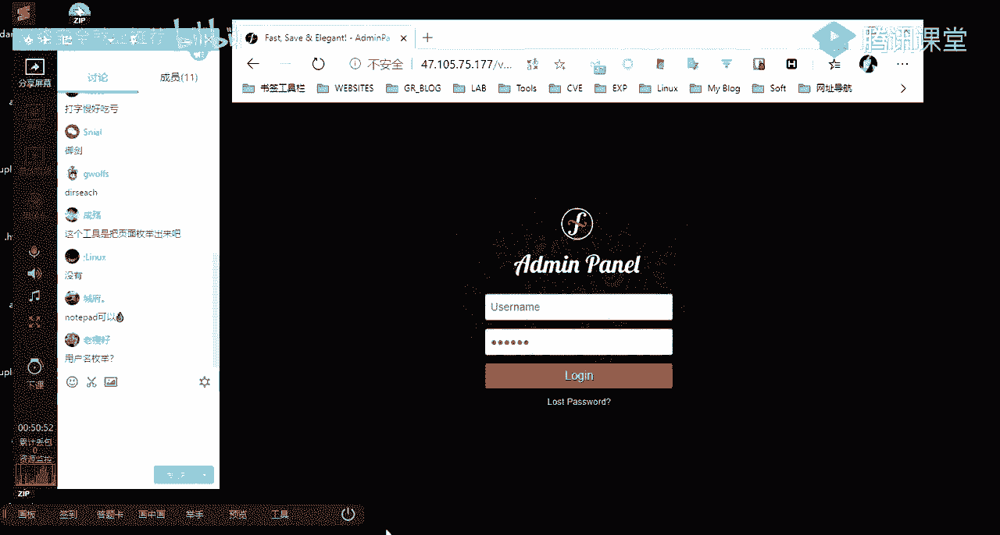

大家之前有使用过吗，这个模块，这个暴风模块，使用过的在讨论区扣个一吧，没没使用过的，没使用过的，在讨论区扣个二，都使用过的吧，就他之前有讲过是吧，有使用过的话，那那就好，那那这里的话我还需要呃讲一下吗。

要。

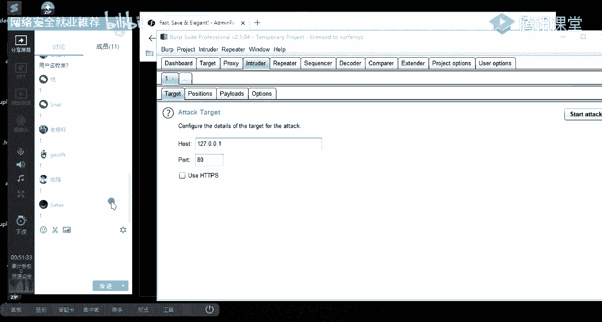

就是说这里的啊进行一个爆破，我还需要去讲一下吗，呃没人回吗，没人回，需要讲一下是吧。

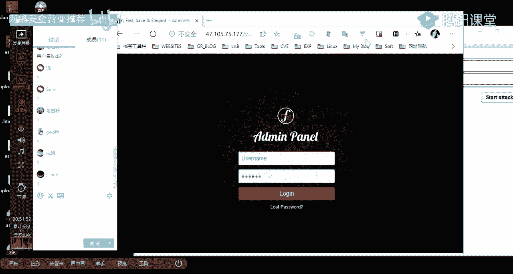

那我这里的话呃介绍一下吧，然后这个模块怎么去使用的话呃，首先我这里的话，我先随便输了一个账号密码对吧，那这样的话我们主要的话是，看他的这样的一个诶，看他的这样的一个请求包。

这个的话就是他登录的一个请求包对吧，然后的话我们，可以看到，就我这里只好把它放到这个从发包的一个模块，我直接发发送这样子的一个包，可以看到的话，他这里的话又给了一个响应对吧，我们主要看这里还有个响应体。

全体的话我们看这里的一个内容，它是一个呃就是说报错对吧，hero就是错误，就是我们的一个用户名密码的话是错误的，可以看到这里有这样子的一个提示，然后的话，我们把它放到一个我们的这一个intro这个模块。

然后的话呃我们需要对啊，这一个admin，我们的一个用户名以及密码做一个爆破对吧，然后这里的话嗯主要的话就是这几个啊，攻击类型的这四个的一个使用，这样的话大家看那篇文章吧，我这样的话大概说一下。

第一个的话它就是一个呃，就比如说我这里标记两个呃，标记两个爆破的一个点对吧，标记之后的话，他我这里的话需要加一个pad，他这样的话是只有一个po的对吧，我这边的话随便加一个hero的。

然后的话我进行一个，开始进行一个爆破，然后它爆破的话，我们其实可以看它的一个啊内容，能够知道它其实是呃首先对我们的第一个点，可以看到，因为我这里的话默认的话它是一个admi in对吧，就初始的一个指示。

也就是第一个和第二个的话，就是他把我们的一个user设置为了，我们这里的一个payload的，这里的第一个值对吧，然后然后的话第二个的这个pass的话，它是没有变的，然后的话就是说我们第二个第三个。

第四个它都是一样的，就是我们只是对我们这里的定义的这一个，第一个位置的一个值，使用了这一个payload，然后的话这里的一个password，是我们啊初始的这个值，进行了一个这样子的一个枚举。

然后的话第一个参数枚举完之后的话，它就会在我们的第二个位置，啊他这里还没没举完啊，啊这里的一个字典的话比较大，然后第一个参数的就是把这里我们的这个po的，也就是这一个字典里面。

所有的值都给编辑完之后的话，它才会编辑这样的第二个字段，第二个自动的字的话，它同样是使用的同一个payload，这就是这一个第一个模块，这个的话也就叫狙击手模块，然后这样的话啊我时间关系的话。

我只遍历这一个值啊，因为我已经知道他是一个用户名的话是命，我这样的话只爆破这一个这一个值，也就是我们的一个密码，然后的话这里啊选择一个po的好pao的话，我使用的是啊，我发给大家的这个。

这个夫子的字典里面的。

这个这个爆破的一个就是week password，一个password的话就是呃弱密码嘛，这个支点的话有7000多个，我这样的话我就只做演示，只做演示的话，我就只取前200个。

然后其实那个就是我就是那个因为是只做演示，就其实那个真实的一个密码，其实是已经在我的这一个字典里面了，这样的话把它粘贴进去，这句话只只有200个，200个值，可以看到200个配乐的。

然后我这里呃进行一个包括，爆破的话我们如何去进行一个内容的一个查看，这样的话我们需要去啊，就是我们如何去查看我们爆破出来的一个内容，它是不是正确的，我们查看这里的一个length。

这个length的话就是我们的这一个，请求它的一个响应，咳咳请求它的一个响应的一个长度，也就是我们的一个响应包的一个长度，好的话，这里的话他有我们可以在这里做做一个排序好，我们首先看一下这个。

就这一个447的这个请求，它的一个响应，可以看到他这里的话，它的一个内容的话是这个对吧，就是说呃用户名密码它是错误的，也就是说没有爆破成功，下面的话这些话都是一样的，就说像这种都是447长度的话。

它在这里的一个内容其实都是一样的，好的我们再好看一下其他的一个长度的，你看到这里的话也是一个错误，然后这里的话我们看一下这个451，45451的话，可以看到这里。

它的一个内容的话是一个login success，也就是登录成功了，登录成功，那么那么就可以说明我们的这里的一个啊payload，也就是我们的这里的一个请求的一个，用户名以及密码，它是正确的。

然后的话呃，因为这里的话是，因为呃它的一个环境的一个问题，就是说我们这里，呃我们这里登录成功了，登录成功了之后的话，他后面的所有的这种请求，所有的这种请求他都会显示登录成功。

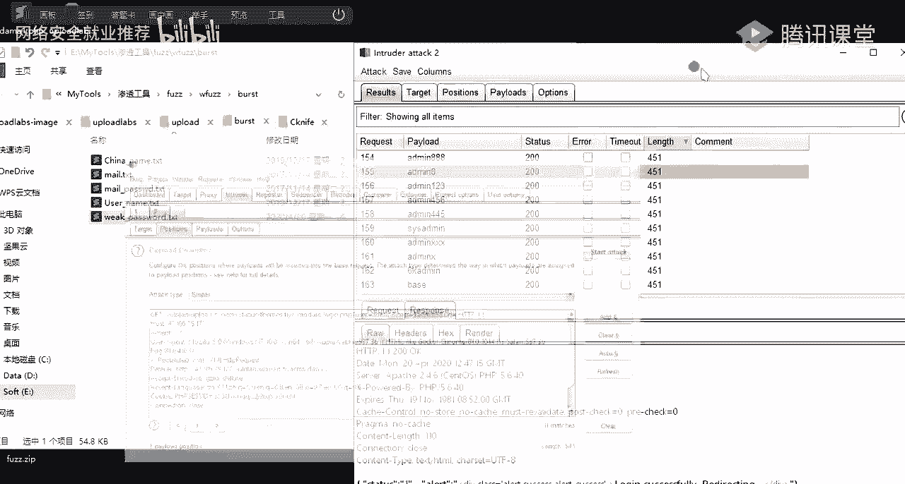

然后这里的话其实它也有这样子的一个漏洞，就是说我们爆破如果爆破成功了之后的话。

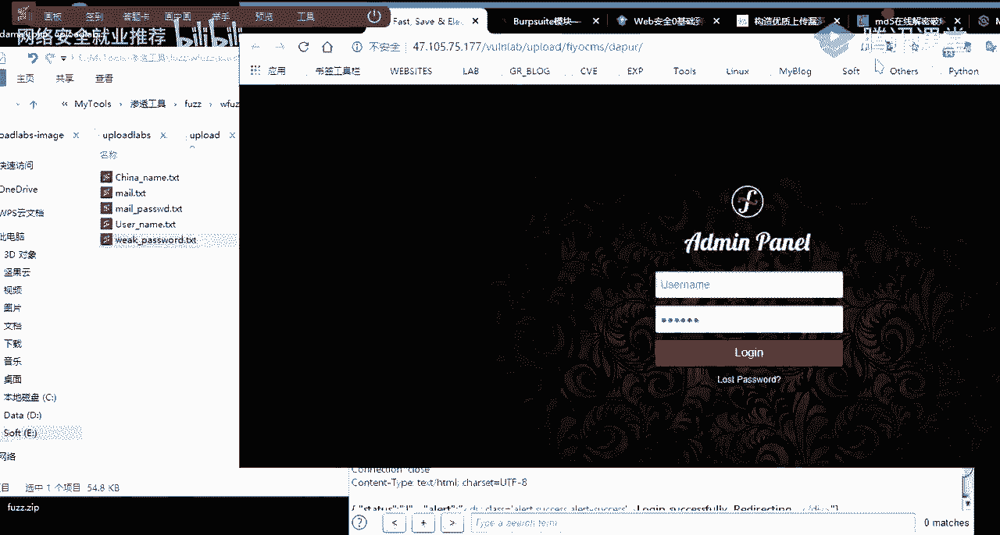

我们在这里啊，服务端它会啊。

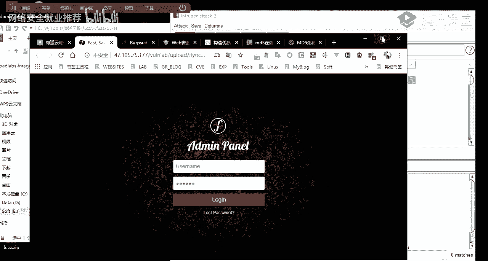

我们前面的话有就是有解释过cookie这种东西对吧，它会记录我们的一个登录状态。

是这样的话，我们通过bp爆破爆破之后的话，好正确的一个用户名密码，他在服务端做了一个验证，验证成功之后的话，它会生成一个cookie，甚至枯萎的话，我们可以。

生成cookie之后，它就会保存我们的这样子的一个登录状态，然后的话我们后面的一个请求，它都是都是，就是说我们后面的这种登录的一个请求的话。

它都是会返回这样子的一个登录成功，哦不是这个这里我们可以在这里刷新一下。

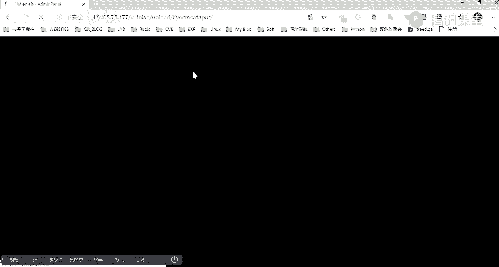

刷新之后的话，其实可以看到我没有输入密码对吧，它同样的能够进行一个登录，而且登录成功了啊。

我们的一个账号密码的话，就是这个admin 888，我们可以也可以啊，直接去进行一个登录的一个测试也是可以的，好这里，我的命没命好吧，然后这里的话和这里的话是一个cm，s的一个漏洞，就这个cm的话。

其实大家百度1下都能也能够找到它的一个，漏洞的一个点，好我们我这样的话就呃先就说一下思路吧，就我们碰到这个点了对吧，然后我们通过爆破，通过爆破我们的一个登登录，然后登录成功的登录到了它的一个后台。

而且是一个管理后台，登录到后台之后的话，我们同样的就是查看它的一些功能点对吧，然后的话我们的一个目的就是要gushell，也就是得到我们服务器的一个权限，那么要跟写好的话，我们啊就想到好文件上传。

还有其他的一些，就是说能够直接得到服务器需要的，这样的一些方法，然后的话我们可能就看到这样子的一个界面，我们也不知道如何如何去入手对吧，我们没有什么思路，那么我们其实可以看一下。

就大概看一下它的一些信息，一些给我提供给我们的一些信息，其实在这里的话我们就能够看到它的一个版本，歪曲的话是二点点六对吧，那么我们直接百度1下吧，对吧，你直接百度1下的话，他就有这样子的一些文章对吧。

就说这个版本的一个漏洞，然后的话我们再查看，查看它的这样的一些信息嘛对吧，然后呢我们可以直接去进行一个，就是在我们的这样的一个cm上面，去进行一个利用对吧。

如果说是能正好是能够去进行一个get shell，的一些漏洞的话，那就更好了，然后这里的话哦，是那个，200，牛，然后的话可以看到的话，我们去进行一个紧锁，紧锁它的一个漏洞。

就是说这个版本的一些漏洞信息对吧，我们其实有一些现成的这种啊，漏洞利用的一些啊思路，一些脚本什么的，你可以直接去进行一个使用的对吧，然后这里的话呃，这里的话其实就是在一个cm s的一个漏洞。

它的一个漏洞顶的话在嗯看一下这个，多种点的话是在这里，在这个csm，在这个themes的这个default，然后的话这里有一个fs，这里的一个fire的话，我们可以看到它。

这里的话有显示这样的一些文件对吧，形成这样的一些文件，我们呃就是正常的就是正常的去访问一下，然后这句话，观察我们的这样的bp的一些请求包，诶，其实我们的一些这样的，如果我们手工去测试这样的一些漏洞的话。

主要的话去查看他的一些请求包，里面的一些参数什么的，还有的话他的一些请求哦，ul等等的一些，它里面的话包含着一些信息，然后的话，我们主要的话就是去发现这样的一些信息，然后去进行一个利用。

这样的话我们先啊访问一下这一个，然后的话嗯，看这里，啊是这个请求吗，对，我们首先我们刚刚的话是访问了那样的一个index，等菲律宾的一个文件，这样的话应该是呃它的一个就是说这个sims。

这个呃主题的一个文件，那我们反问之后的话，我们发现有这样子的一个请求包对吧，请求包的话我们看看到的话它是get请求，主要的是看这里有一个s r c，s r c的话。

就是啊在htm的话就是一个路径的一个意思嘛，对吧，就资源路径，然后面的话有一个name，就是呃我们刚刚请求的一个呃文件文件名好，我们先发送一下这样的一个请求包，可以看到这样的话他返回了这样的一些信息。

在信息的话，其实跟我们的这里页面的一些信息，做一个对比的话，就能够发现它其实啊返回到这样的一个index 0，菲律宾的一个内容，然后这里的话，我们看到有这样子的一个文件对吧，然后有这样子的一个路径。

而且这里的一个路径以及文件名，是我们可控的对吧，那么我们可以尝试一下去做一个修改对吧，把它修改修改其他的一些路径是吧，说不定有就是呃文件读取，因为这里的话它的一个功能就是读取，我们这里只建了一个文件名。

而且是这个路径下面的这个文件名的一个啊，内容对吧，这样的话我们可以做一个修改，尝试修改它的，我们这里可以去进行一个控制的一些内容，然后的话查看它的一个响应，看是否能够看是否能够读取它的一个啊。

你指定的一个文件的一个内容，然后这样的话呃，这样的话我做一个呃修改，比如说我要查看这个function in js，它是在一个这一个就是这个index顶配区域，这个目录也就是在这一个js目录下面对吧。

文件名的话就是这个functions，点，js，嗯可以看到的话，这里的内容的话是呃跟这样的话是一样的对吧，function，然后的话document，好在这里在这里显示了一个内容。

在这里function document，还有这个forge什么的对吧，这里的话显示了这样的一个文件的一个内容，当然当然，这里的话是我们能够查看到的一个文件，那么我们尝试一下其他的。

就是我们在这里页面无法去查看到的一些内容，比如说呃，比如说我在这里的话，和我新建一个这样的一个文件，一点菲律宾这样的一个文件，它是在这个，sims在一个目录下面，好的话。

我要访问的一个文件名的话是一点p p p对吧。

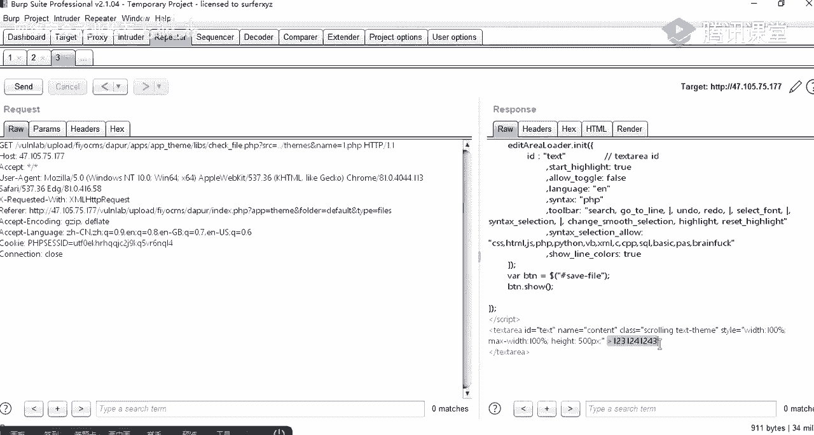

然后的话我进行一个发送，发包装的话可以看到他阵营的话呃，显示我刚刚输入的那一个内容，然后这里的话就说明它是存在这样子的一个，任意文件的读取漏洞的，然后的话我们其实也可以啊访问像这种。

就像这种常见的这种config。

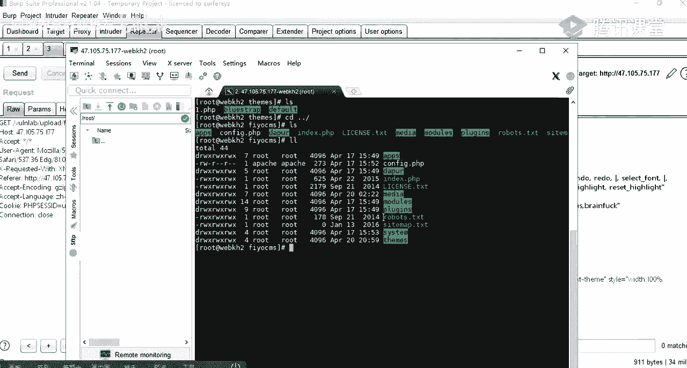

点p h p，也就是一些配置文件，还有像这种robots的这种文件，就是说啊一些常见的一些文件，然后这里的话我这里，你这个config，有pp这个文件为例，可以看到这里的话。

它显示了返回了这样的一个config，也就是在那个根目录下面，这个网站根目录下面的一个config。

点p hp的一个内容显示的啊，数据库的一个用户名以及密码的一些信息对吧。

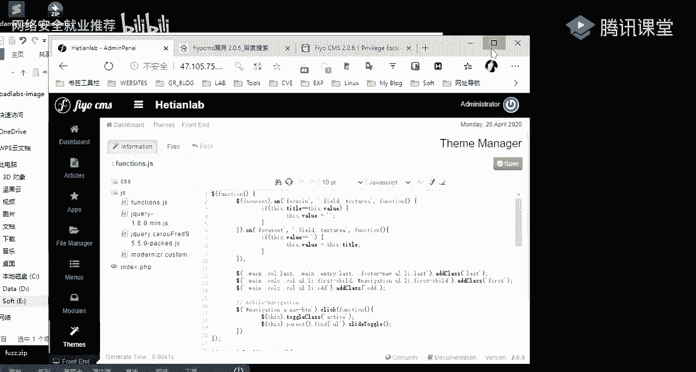

这里的话就有一个这样的一个文件读取，然后这里的话其实不是我们这一个，这一个get shell的一个方法，这样的话我只是只是呃就是说一下思路，就我们再去进行这样子的一些嗯，漏洞的一些寻找的时候。

我们通过这这样的一些请求包，然后的话对这些就是我们可以看到啊，这请求包里面的这样的一些内容，这些特殊的一些参数对它做一个测试，然后的话你就会发现一些，啊不同寻常的一些点。

然后的话就可能会存在这样子的一些漏洞，然后这样的话我其他的我也不多说了，这句话它的一个漏洞点，就是我们可以去进行一个任意的一个，文件的一个写入，然后它的一个功能的话就是这个save在我们。

因为这里的话我们可以去进行一个编辑对吧，就编辑这样的一个内容，就是说这一个主题文件的一个内容，好的话，我们看一下它的一个请求包，他的一个请求包的话，问题就是出在嗯。

问题就出在他的这样的一个请求包里面对吧，我们可以来查看一下，如果说你刚开始看到这样的一个请求包对吧，其实你也会发现他的这样的一个请求包，就跟我们之前提到的那个请求包类似，挺类似的对吧。

他同样的有这样子的一个s r c的，这样的一个敏感的一个参数，就是指定我们的一个文件的路径对吧，你看到他这里的话是指定的这个index，点p h p的一个路径，然后的话它这里的一个参数。

其实是我们可以去做一个修改的对吧，然后这里的一个content的话，从字面意思的话，我们就知道他是一个内容嘛对吧，就其实这里的一个内容，这里的一个content的话就是我们在这里的啊。

一个index 0 p h p的一个内容，因为我们这里有个save的话，就是把我们这里更改的一个内容，把它保存到这个文件里面对吧，然后的话这里的话，这里的一些内容，都是我们可以去进行一个操控的。

可以去进行一个操作的对吧，那么我们是不是啊可以尝试去写一点东西对吧，比如说我这里的话改一个需要点菲律宾，然后我这里学的一个内容的话是一个，hp info，好我尝试一下发包发包。

这的话可以看到它这里的话是返回了一个200，就说明我们的这个请求的是成功了，成功了之后的话，我们在这里来看一下，我们刷新一下看一下，然后可以看到他这样的话，这里的一个需要点p h p。

而且是p h p后缀的一个文件，已经呃，它的一个内容是我们的写入的一个ph p four，那我们怎么去进行一个访问呢，访问的话它的一个目录是在这个呃，诶seems default对吧。

然后的话是在呃有一个shell点这一个，这里的话就是一个index。p h p嘛，有一个需要点p h p我们去进行一个访问，可以看到是能够正常的访问到我们写入的，这样的一个需要点pp的一个文件。

然后的话这里的话，那么我们就可以把它改成一个一句话对吧，它保存到我们的服务端之后的话就是一个web shell，这里的话就是这个啊sm的一个点，然后的话呃之前的话是呃，我记得是有位同学说顶不动。

你说的这个顶不动是指哪里呢，就大家对这个有没有什么疑问啊，这个的话其实就是一个就是一个cm，现成的一个漏洞吧，然后的话主要的话是介绍了这样子的一些呃，思路，就说大家再去查找这种后台的这样的一些呃。

漏洞的时候，这里是吧，这个image吧，这里的话没有没有上传的一些点啊，对啊，你说这个upload是吧，这个确实点不动，这个是点不动啊，嗯嗯嗯啊，其实这个按理来说的话，其实也不能算是文件上传。

应该算是一个啊文件写入，就是任意文件写入的一个漏洞，因为它其实不是一个上传的一个功能点，而是一个啊，就是这种文件的一个写入的一个功能点，但是的话他服务端没有对我们写入的，这样的一个啊这种文件内容。

还有的话就是它的一个路径，就主要的话就是这里的这一个路径，它是我们可控的对吧，我们其实可以写到其他的一个目录下面，也是可以的，就我们可以直接写到它的根目录下面，我们只需要把前面这一节删掉就ok了。

然后这这里的话应该没有什么问题啊，行进目录，你说啊这里的一个sim什么，在这里新建目录吗，还是说哪里，这里的话没有新建目录的一个功能吧，然后的话这个应该没有什么其他的问题啊，新进目录哦，可以试一下。

呃我觉得应该不行吧，可以吗，看一下就应该可以啊，他这里请发送的请求乱是成功了，啊可以看到他新建了这样子的一个东西啊，但这个应该不是目录吧，是目录吗，写个文件，按一下，咳咳，你看到他这里的话是啊。

不是目录啊，就是写不进去，他在他这里的一个功能点的话是，写文件就是说把我把这里的一个内容，把它写到你指定的这个路径，下面的一个文件里面，好这里的话应该没有什么问题啊，主要的话就是观察他的一个请求包，就。

好，然后第三个的话就是一个ph pk，这个其实也是一个，现在现成的一个漏洞，大家去搜索的话，其实也能够找得到它的一个呃利用方法，这里的话呃，我这句话是给了一个用户名密码的，这样的话呃打开之后的话。

同样的是这样子的一个呃首页对吧，鼠标的话我们呃想要它的一个管理页面，管理页面的话，同样的就使用一个add me，这种常见的这种去进行一个测试，去进行一个尝试，好的话，如果你直接去这样子去进行一个城市。

不行的话，就通过这样子的一些呃，目录的一些扫描工具去进行一个枚举，那这样的话是一个登录的一个页面，然后这里的话因为它是存在一个印证码的，而且而且他这里的话是有一个登录次数的，一个性质。

就是说你多少次失败之后的话，它就会啊，就是你这一个账户的话就被锁定两个小时，所以的话他这里不存在一个这种啊，爆破的就是用户名密码爆破的一个漏洞，就他的一个呃那种呃，这个性质的话是做的比较严格的。

就性质了你的一个呃呃错误的一个次数，还有的话有一个验证码，这样的话我是给了啊，给了大家一个用户名以及密码的，然后访问之后的话就是到了这样子的后台啊，同样的就是我们去要去寻找。

我们的一个能够进行一个文件上传的，一个一些功能点，这样的话我们就需要去进行一个查找对吧，这样的话它的一个内容的话是比较多的，然后我们它的一个一些我们通过查找之后的话，能够在这一个内容管理这里。

这句话有很有好几个的这种呃，上传文件的一些功能点，我们比如说第一个资讯中心，你怎么防备我来，是不是你们都在扫啊，怎么突然变卡了，怎么访问这么慢呢，可以了，你们你们先先别扫，不没有练手的话，呃。

等会下课之后再再去练吧，再去操作吧，那这样的话好有这样子的，就是一些发布资讯的一些功能点对吧，我们呃可以看一下这里的话有个加号对吧，我们可以去进行一个内容的一些发布，内容发布的话。

这种发布的话我们可以在这里有看到，就是有上传文件的一些功能点对吧，那么我们去进行一个啊文件上传的一个测试，然后测试的话我们点开的话，发现这里的话是啊有这样子的一些格式，就是允许去上传附件的一些格式对吧。

然后这样的话，我们先选择本地文件去进行一个测试，看是否测试一下它的一些绕过的一些规则，看是否能够去进行一个啊绕过同样的，我们呃先随意上传一个p h e对吧，然后发现的话他这里的话是不允许上传。

然后我们上传一个，png好看一下刚刚的那个请求包，请求包的话就是这个，刚刚的话附件的话是已经上传成功了对吧，就是这个这个文件，然后这里的话可以看到它的一个文件名，是这个这样这样的一个文件名。

是一个png的一个文件名，那我们看一下这一个请求包，我们分析一下，然后可以看到这里的话，就是我们的一个上传文件的一个内容对吧，然后主要的话在这里的一个u r l里面，它是一个post的请求。

然后这里那个ui里面的话，它有很多的一些参数对吧，我们可以啊能够直接的看到的话，就是有啊，这个比如说菲律宾session对吧，筛选的话其实它就是这里的一个筛选值。

然后的话还有就是name这里的一个name值，就是我们的一个上传文件的一个文件名啊，还有的话就是一个type type的话，就是我们这里的上传文件的一个那个文件类型，对吧。

就是说content type的一个词，然后其实这里的话啊，我们可以看到它这里是呃把这样的一些呃，我们上传文件的一些这样的一些信息，把它放到了我们那个url里面。

其实也就是一个啊像啊一个get方式的这样子的，一个船舱的一个方式去向服务器传传递，我们啊我们上传文件的一些信息，然后还有就是呃上传文件的一个时间等等，然后这样的话。

其实我们主要的话就是对我们的一个文件名，对吧，我们这里上传了一个文件名，我们可以去进行一个修改，去进行一个测试对吧，我们这里直接先好更改一下，我们的一个更改一下我们那个psp文件，我们尝试一下。

尝试的话，我发现他这里的话是返回了这样子的一个内容，这里的一个内容的话要提一点的话，它是一个unit code的一个冰嘛，unico的一个兵马的话，我们想要哦，我们想要去查看到它的一个内容的话。

它其实呃我们需要做一个解码，我们使用一个就编码工具，你也可以用线上在线的那种也是可以的，我们把它把一个unit code，把它给转化成中文的话，就可以发现它的一个内容其实是一个附件类型，不符合要求。

也就是说我们这里上传的这个p h p后缀的话，我们，我们这里上传的这种ph标志的话，它是不允许我们去进行一个上传的，然后的话我们同样的可以测试其他的一些，测试其他的一些logo的一些方法啊。

比如说我们之前说过的一些点空格对吧，点空格点这种这这样的一些方式，然后发现他是会报错的，还有其他的一些，然后的话嗯如果手工测试不那个的话，你也可以使用一个夫子对吧，用那个字典。

用那个字典去跑它的一个这样子的一个文件名，使用那个呃，可以使用那个我发给大家的那个工具。

就这个就这个脚本，这个脚本你可以自己去进行一个生成，但是它里面啊它生成的话其实内容还是挺多的。

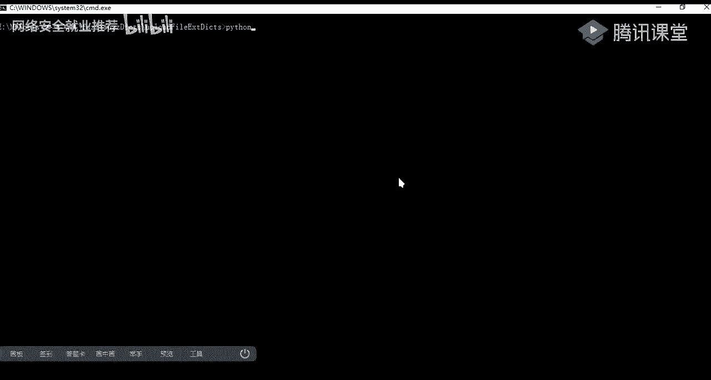

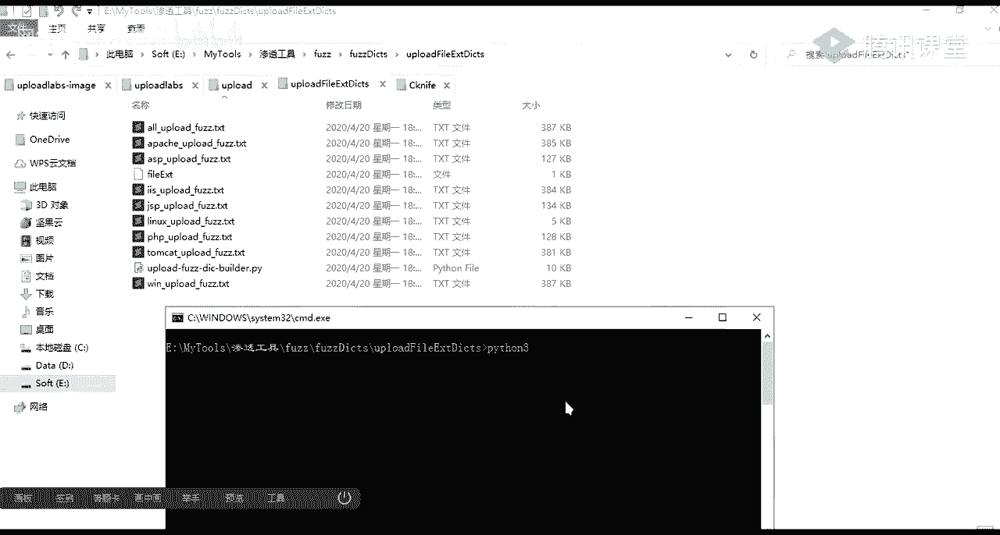

那这样的话是psl，我们可以用杠h参数来查看他的一些呃，一些使用的一些信息，然后的话这里的话是要生产，常见的一些ph p后缀的啊，我们使用杠a参数指定一个菲律宾对吧。

看看参数的话是指定我们上传的一个文件名，我这边的话就a s d。

然后还有就是嗯杠m参数的话。

指定我们的一个中间件，中间件的话，这里的话应该就是一个阿帕奇吧，啊啊是一个阿帕奇，如果如果查看它的一个中间件的话。

我们可以通过就是看我们的一个请求。

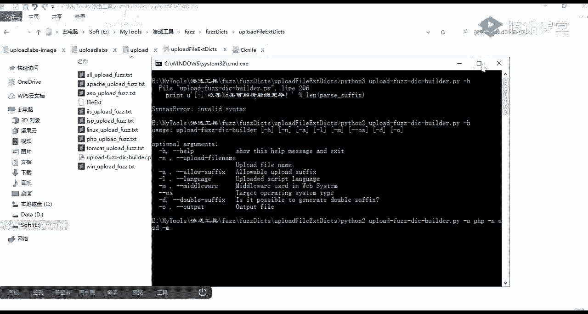

它的一个响应包嘛对吧，这样的话有一个阿帕奇，它是一个生透s系统上面的，所以我们这里的一个中间件的话，是一个阿帕奇是吧，他的话啊和5s看看，r s的话就是一个linux吧，然后的话我们刚刚输出一个嗯。

pasta电影，然后的话它就自动生成了呃，符合我们的这样的一些要求的呃。

一些呃可以解析的一些后缀，保存到了这一个text。txt里面，然后这里的话就是它里面的一些内容，然后的话我们可以用bp发包，把我们的这样的一些好这个字典，把它呃发包嘛对吧。

就是在我们的这里的这个文件名这里，我们把它把它发到这个intro的模块，然后的话我们指定这一个参数是一个文件名，然后的话我们去进行一个好像爆破一样的，去进行一个发包，一直发，把我们的一个置顶。

就说这里生成了这样的一些后缀，把它进行一个测试，然后的话通过查看它的一个响应包，来进行一个判断，然后其实呃我看就是这位同学，他这位同学他就有这样子去进行一个尝试对吧，我觉得这样这样子挺好的。

就大家多去进行一个在这种尝试，我看我看你之前是哪一个，有这样子去进行一个夫子对吧，就我觉得这样子的话，这样子去进行一个尝试，可以的，就如果说没有这样子的一些失误的时候的话，都你你都是负腿的啊。

这就像常见的一些，你还是可以先手工新手工测试一下嘛，就你负责的话，你这样子其实那一个你这样子一直去发包的话，那你那工作量还是比较大的，我啊我这里的话，这些这些其实都是比较简单的，就不是很很难的。

如果说比较严格的一些过滤的话，你夫子其实也不一定能够出得来，呃然后的话我们呃回归我们的，我们的一些一个课程内容吧，讲到哪了好，就是我们做做一个测试之后的话，发现他其实都有进行一个。

就是不允许我们去进行一个上传，都有一个过滤，然后的话我们没有其他办法，我们需要去寻找其他的一些功能点，然后在查找之后的话，其实查找之后的话，在这里有一个啊附近的一个分类管理，其实我们在这里的话。

其实选择图片的时候，我们可以看到它这里有这样子的一些，就是选择附近的一个分类对吧，他这里的话已经写定就已经写死了，只能上传这样的一些文件类型，然后这里的话我们能够查找到有这样子的一个。

附近分类的一个功能啊，这这个功能的话，我们可以看到它其实这里的一个类型对吧，跟我们前面的这里的一个好，允许上传附件的一个类型，它其实是对应的对啊，其实这里的一个分类附近的一个分类管理的话。

就是啊设置了我们这里啊上传文件的一些类型，它是什么样子的，然后的话我们可以尝试去进行一个修改，就是说修改我们这里啊，能够支持去进行一个上传的一个附件类型，我们把它修改成一个菲律宾，提交提交之后。

我们在这边来看一下，我们选择图片看一下，我们在这里选择图片看一下，可以看到的话，这里的一个图片上传，就是上传的一个附近分类的话，后面的话是成了一个啊，有了一个点菲律宾的一个后缀。

我们来尝试一下上传一个kpl的文件，看它是否允许我们去建一个上传，然后我们直接上场之后的话，可以发现它是能够直接的上传成功的，也就是这个好，我们预览一下，预览之后的话，可以看到看到他的一个文件名是这个。

然后呃就点那个点击下载，然后我们可以看，我们可以直接跳转到我们的这样的一个文件名，因为它是一个p h p文件，它是会啊做一个解析的，解析之后的话它就是这样子，然后我们进行一个尝试。

去进行一个执行命令对吧，验证一下我们的一个贴，我们的一个web share，它是否上传成功，是否能够执行命令，可以看到这样的话是能够执行的，这个的话就是呃就是，就是这一个的一个，cm的一个漏洞。

就是一个文件上传的一个漏洞，然后其实像这种像这种去修改这种附件，后缀的这样的一些功能的话，其实啊大家之后的话，其实也很有可能会去碰到的，就是说如果说你得到了一个这样子的一个，网站的一个管理后台对吧。

如果你得到他一个后台，因为其实我们已经得到了他的一个网站的，这个网站的一个一些这种操作的一个权限对吧，好的话，我们就要利用他的这种操作权限，来去进行一个啊获得服务器的一个权限，好，这个时候的话。

咳咳我们想要去上传这种文件对吧，它不支持这种文件的一个上传，那么我们是否能够去找到这种它的这样子的一，个就是说附近分类的一个管理，就是说允许去修改，允许去啊，允许管理员去设置啊。

他上传的一个文件类型是什么样子的对吧，那么我们就可以利用他的这样子的一个功能，来修改它的，允许我们上传的一个菲律宾的一个后缀，然后的话来好上传我们的一个web share。

从而达到一个get shell的一个目的，当然的话哦这里的话是这一个cm s，它的这样子的一个呃操作，在其他的一些cm s里面，也有可能存在这样子的一些功能，而大家对这个题目的话有有疑问吗。

然后其实这个的话还有其他的一些呃，这种就是说上传文件的一这样的一些功能点，像比如说呃对吧，下载中心你可以啊，上传这样子的选择压缩软件对吧，这个的话那就是只能支持这种格式对吧，当然我们也可以选这种。

然后其实我们也可以，就是把这里的一个附近扩展，全都后面都加一个p h p嘛对吧，就他的这各种的一些构功能，都能够去上传我们的一个菲律宾的一个后缀，还有其他的呃，一些功能点，嗯没有了吗，对啊。

比如说像在这里，那我们，我们要去寻找的也是像类似的，像这样子的一些功能点，然后的话对它做一个测试，但是否能够去进行一个get share，大家应该都没有问题啊，没问题的话，那呃我们继续后面的最后的一个。

这一个的话，这个的话哦我们看一下打开它的一个网址的话，你会发现它是一个这样子的一个，学生会简历系统对吧，是一个这样子的一个登录界面，然后的话呃看到这种登录界面的话，我就我我也不多说了，就前面也介绍了。

就是相应的一些思路对吧，就进行一个注入啊，还要进行一个爆破，这样的话都是可以的，就是说我们首先的话进行一个注入的，一个测试对吧，然后注入测试的话，这里就是介绍，我们直接。

其实直接使用一个万能密码去进行一个登录，这样的话密码的话随意输入啊，这样的话我们使用这样子的一个形式，去进行一个登录，然后可以看到是能够正常的登录成功的，就是说它其实是存在一个sql注入的一个漏洞的。

然后的话我们可以直接通过这样的一个，万能密码进行一个登录，这里的话应该假设个注册的时候有讲过，然后这里的话我们去进行一个文件的一个上传，当然的话，当然的话我们也可以通过就是呃用second map好。

不用那个去进行一个密码的一个爆破，同样的使用那个in instrua的那个模块，去进行一个密码的一个爆破，也是同样的能够去进行一个成功的一个爆破的，爆破之后的一个密码的话就是admin 445。

然后的话第三种方法，那就是用呃一个second map，去跑他的一个登录的账号密码，因为他像这种的话是存在一个柱漏洞的对吧，这里的话就是一个登录框的一个啊注入，然后他进行一个登录框的一个注入的话。

应啊讲sql注入的时候应该也讲了吧，我们他的一个就是一个方法的话，主要就是呃抓取他的一个登录的，一个一个就是post请求，就是他的一个登录的话，就是一个那个pose的请求。

其实就是这样的一个post请求对吧，然后的话这句话是一个用户名以及密码，传递给服务端，然后的话就去进行一个判断，然后我们用去进行一个circle circmp，去进行一个跑的话。

我们只需要复制这样的一个请求包，然后的话把它丢到sql map里面去跑就可以了。

诶我扫个码服了。

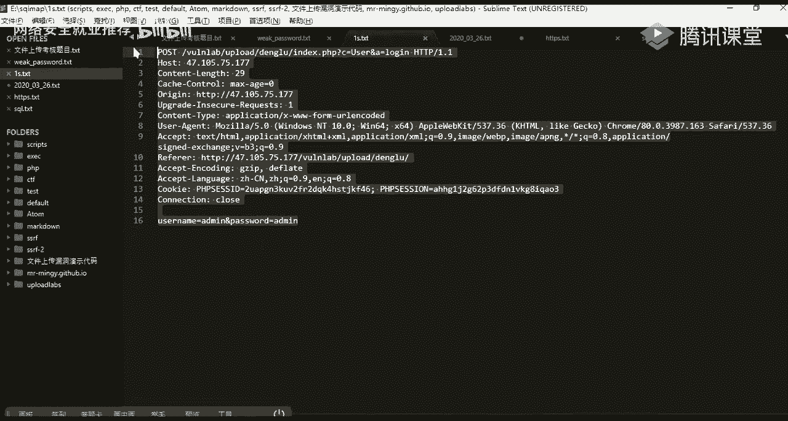

所以说首先的话你把这个请求包。

把它保存到一个文件里面，然后的话用那个circmp的一个干拉参数。

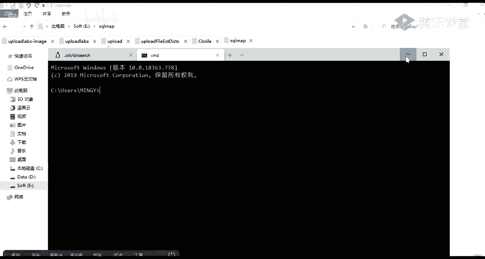

嗯我这段话不演示了吧，大家看这个图吧，用那个circmp的gr参数就指定这个请求包，然后的话后面接我们常见的一些参数，d d b d b m s的话，就指定我们的一个数据库类型。

然后刚刚d b s就是报我们的一个数据库对吧，然后的话就去进行一个跑跑的话，好的话可以看到，就是说它这里有一个info信息对吧，这个info信息的话，可以看到它这里就是说这个username的这个参数。

它是存在一个啊，就是基于时间的一个盲注对吧，就是说它是可以去进行一个注入的应用的，然后的话我们接下来继续跑的话，就能够跑出呃他的一些他的一些数据库，然后的话呃就是就一步一步来嘛。

跑出数据库的话就跑跑跑表吗，跑出表的话跑跑字段，跑出字段的话就跑字段值，就跑里面的一个数据，导出数据的话，就是得到的这样的一个这样的一个呃，md 5加密对吧，我们用那个md 5去进行一个解就可以了。

这个的话我试了一下，用这个的话是收费的，然后这个时候就可以尝试一下其他的吧，尝试其他的话去进行一个解密，诶好解密之后的话就是这一个的面试四五，在这里的话就是啊三种三种去突破。

这种登录到后台的啊测试的一个方法，诶哪去了，我这的话也就是列举了这样的三种方法，然后跑获得到他的一个登录啊名之后的话，我们就去进行一个啊后台的一个测试对吧，后台测试的话，其实这里的话。

它的一个功能点的话是十分简单的，四四我们登录登录之后的话，他这个后台的话就这样，就这样子的一个页页面对吧，然后主要的话就是看这里有一个呃，上传文件的一个功能，我们可以看一下这里它其实好。

这里就是你们之前谁传了一个是吧，这里是你们之前谁传的一个，然后的话我换一个用户吧，再一个你们应该没有，没用过吧，he，都一样的吗，行吧，就这里的话本来是一张图片的。

然后的话我们可以去进行一个文件的一个上传。

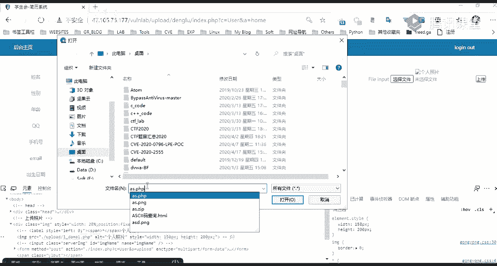

首先的话啊其实这样的话就更加的简单吧。

同样的我们先随随意的上传一张啊，上方一个菲律宾来尝试一下，然后注意看他的一个请求包，上传之后才发现是error，就是说不允许我们去进行一个上传对吧，然后我们主要的话是分析一下，它的这一个请求包。

请求包的话，这里的话是一个上传的一个功能对吧，然后这里的话是我们上传的一个内容，这里是文件名，然后我们可以使用其他的一些，就是之前一直都说的一些方法，对我这种话就不是不再啰嗦了。

然后这里的话它的一个应用的话，就是通过这个大小写去可以去进行一个绕过，据说他没有对我们的一个后缀的一个大小写，做一个严格的一个检测，就我们可以通过这样的一个方法去进行一个logo。

然后可以看到直接上传之后的话，你看到它是successful，就是说我们已经成功上传了，成功上传之后的话，我们在这里，在这里能够通过f 12，能够查看到当前的这个照片的一个路径，也就是这个对吧。

然后的话我们就能够直接去进行一个访问，cr load目录下面有一个这样子的一个pp文件，对吧，然后测试区进行一个，它的一个可行性，可以看到是能够成功的执行命令，然后的话我们也就成功的得到了他的一个需要。

呃然后的话我们这次的一个考核内容的话，就到就是这样的一些内容，就大家有大家，我看大家没有什么，没有人没有多少人提问啊，大家都是都自己做过了，然后都会嘛，我还是希望大家多提点提点问题啊，就。

就只有就是你去解决了这些问题的时候，你才能够去就是有深刻的一个理解吧，然后大家自己多去动下手吧，就可以照着我这里的这个文档是吧对吧，就是这样的各种方法，然后的话就是我在课上讲的。

我们怎么去进行一个这样子的一个啊测试，然后的话我们找这些功能点，测试的一些思路对吧，然后的话就是登就是啊，通过我们就是如何去进行啊，就利用一些方法如何去啊，绕过这种登录对吧，绕过这种登录。

然后到后台去进行这样子的一个好查找，文件上传的这样的一些点来get shell呃，这节课的话其主要的还是思路吧，就这样的一些点就通过这几个啊，c m s的一些漏洞。

就大家就是注意的话就呃注意的几点就是对吧，找这种功能点，然后的话就是一定要去就是去查看，去观察他的这种请求包，所以说这个bp bp的这个工具的话是呃，相当的好用，就是说去观察他这种请求包。

然后这请求包的这些内容的话，就是说它的一个意思啊什么的，大家要去理解是吧，就菲律宾的这种呃请求的一些数据啊，一些内容它什么意思对吧，还有一些一些请求头的一个意思，明天再过一遍，可以的。

我觉得然后大家也都没有什么问题啊是吧，如果没有问题的话，今天时间不早了，又又加了半个小时的班呢，那我们今天的一个课程内容，内容的话就到这里了，希望大家和，然后明天的话是讲文件上传文件包含的话。

那好吧哦不是，明天的话是讲文件包含，文件上传内容的话就到这里了。

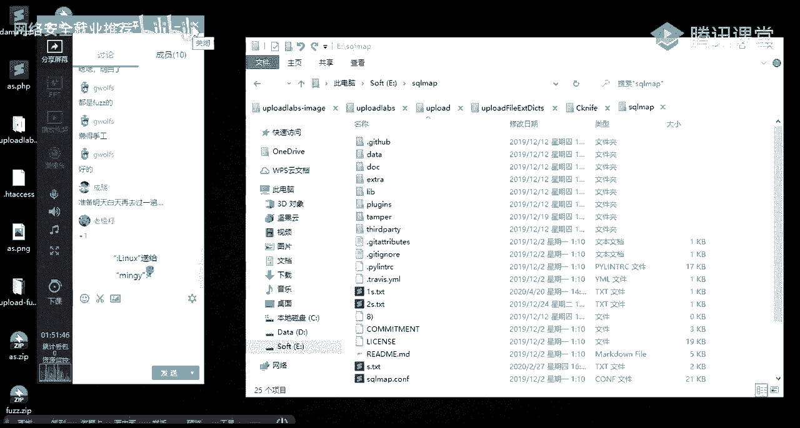

希望大家都学会了。