# 【B站最系统的网络安全教程】北大大佬196小时讲完的网安教程，全程干货无废话！学完即可就业，别在盲目自学了！！！ - P26：第24天：CSRF漏洞-CORS跨域漏洞及jsonp漏洞利用 - 网络安全就业推荐 - BV1Zu411s79i

啊。

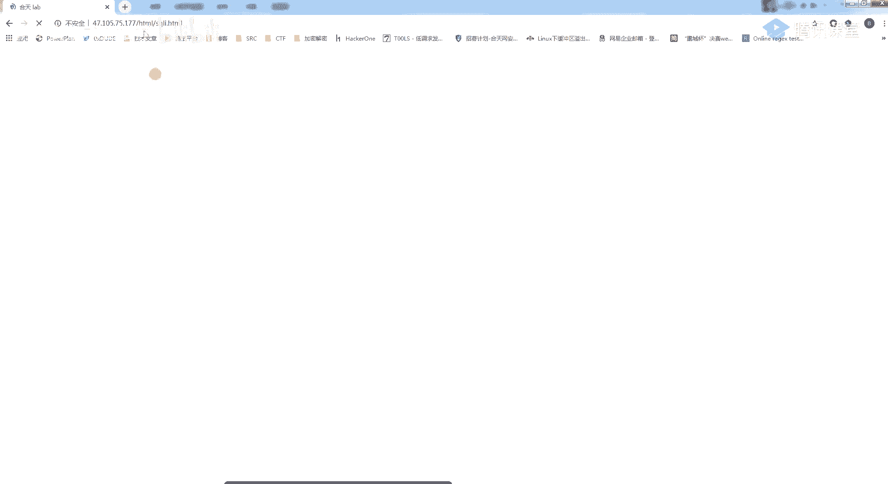

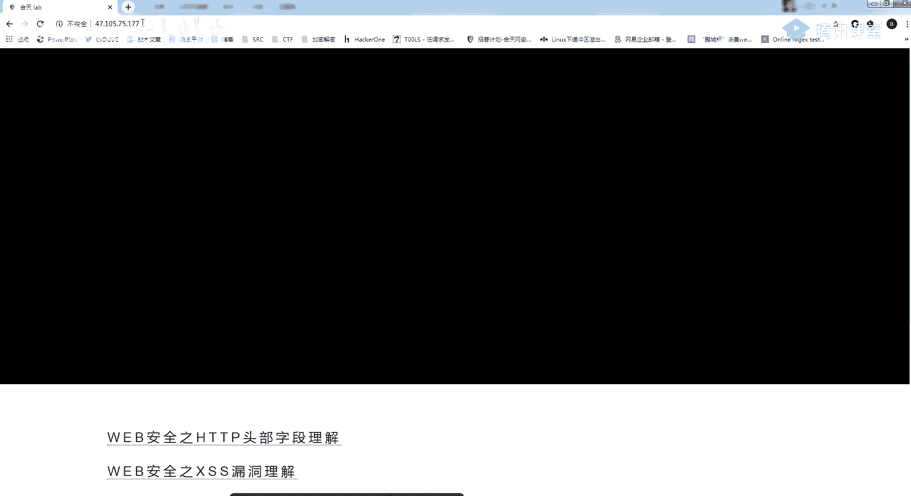

b妈诶你好，我也慌了，待会看一下，看一下就会开了六个人吗，好在上课之前呢，我们看一下作业啊，作业的话大部分人都交了，然后呢有少部分的呢，有少部分的同学啊，就是去找了这一个jason，嗯作业。

好来看一下啊，首先昨天的一个作业情况是，哪里去了，这里第一个呢d b w a的，对d g c s i f交给我的呢，基本上都是完成了，音乐就很简单嘛，然后必须抓一下，必须抓个包，然后改一下就行了。

然后第二个呢，第二个遇到json格式的csf怎么办，这里呢有2~3位同学做了，啊其中给我作业里面了，就是有些同学是研究了那一个研究两个问题吧，我待会儿待会把这个罪给你们讲一遍。

就是待会下完课到小课的时候给你们讲，至于第三个呢，就是叫你们对我进行一个施工，就是对我进行一个施工，然后呢大概教的现在有，首先这是低位加的同学的，然后大家可以看一下啊，他这个其实教的很诡异。

他这个作业呢他教的是一个html的一个作业，他交的是这样的一个作业啊，然后呢他是通过班主任发给我的，因为我们每天需要查看你们的作业的，然后他就发了一个tml的，然后你可以看这里呢。

就是一个dv w a的一个修改的一个作业，然后我们简单看一下网页源码呀，可以看到在这个位置呢，在这个位置，它这里呢就插入了我们的一个添加后台的一个，账号密码，当然他这几天叫错了，不过这种形式也是可以的。

也就是说通过班主任，通过班主任，因为我是比较信任班主任的，他发给我的文件我一般直接点开，然后呢这里呢就得到了一个csf，一个桥施工，然后第二个同学呢，这个呢罗志祥的实锤有点意思吧。

最近啊罗罗志祥这个东西还是比较火的，对吧，然后我们再来看一下它的一个代码，这里呢。

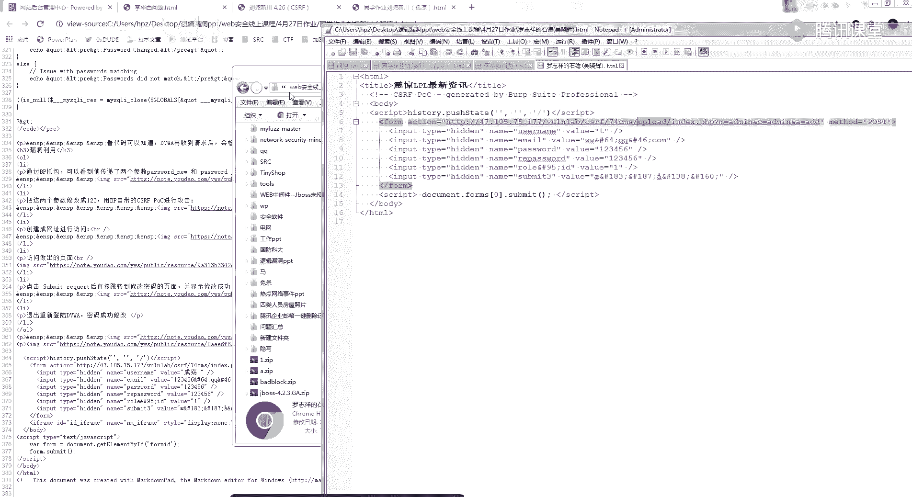

这里呢当然也是有问题的。

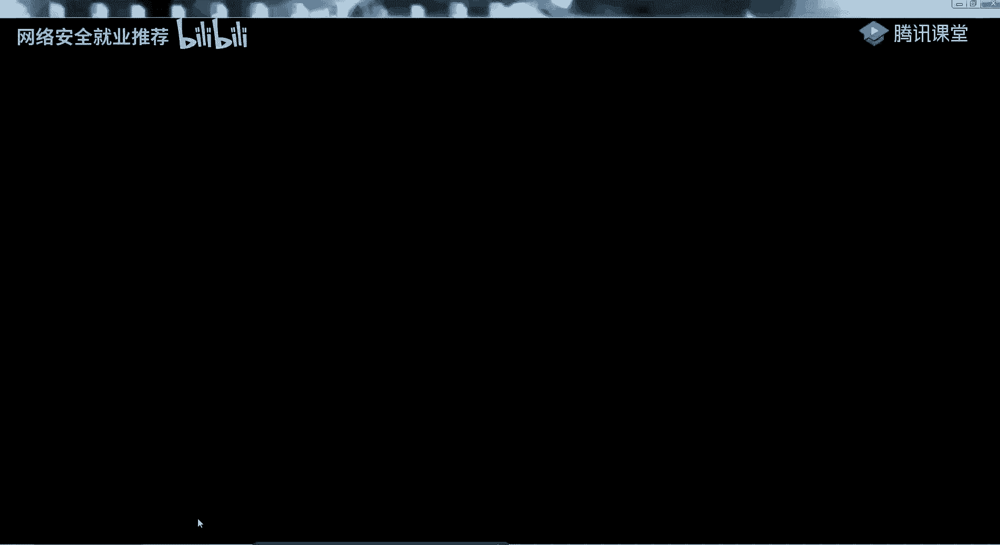

知道吧，因为你可以看到他是给我的，就是一般来说如果我比较八卦八卦我会点，但是呢它这里的这个ui l链接是有一点问题的，是没有弄好的，所以我刚刚打开就是有用一些啊，比较，嗯比较吸引人的一个标题，吸来打开。

然后看一下这位同学的，啊不是这里，你的心理华系的问题，这里呢应该我记得是跟你们讲过的，你这应该就是啊用bp call的一个，他这个链接是没有错的，但是呢这个提交的一个按钮，因为你如果要欺骗人的话。

你如果要欺欺骗人的话，你需要把这里的一个按钮，进行一个自动化的一个提交，而不是让我自己点，这样你才能骗到人，然后呢刚刚我看了一下啊，嗯李思伟同学的一个这个这位同学呢，就是上之前啊。

在自己挖了几个csf的这个同学，然后他就说在s r c上发现一个存储的xs s，给我看，这样也是一种施工的一个手段，然后其他几位同学的话可以自己尝试一下啊，就是觉得自己能想到什么样的骚操作。

能想到什么样的骚操作，就给我进行一个演示，就是来施工，我自己呢稍微给点提示，你比如说我是不是会有邮箱，然后给我发邮，给我发邮件，然后啊是不是可以对我进行一个问问题，或者是，嗯就类似这种交作业啊。

反正就是看你们怎么能够想到什么办法，对我进行一个欺骗，然后在实战的时候记住csf，他除了这些操作之外，他这个csf呢是可以进行一个get share的，当然明天的话再讲考核的时候，我会给你们讲。

然后讲一些关于施工方面的一些比较，有意思的一些东西，好开始一个今天的一个课程，是讲csf的一个读取漏洞，我们昨天的时候，我就提过了一个csf的一个读取漏洞，csf的一个读取漏洞呢。

主要是在这一个jsp跟c r i s这上面，这个fans的这个跨域劫持的话就很老了呀，很老的东西了，基本上是遇不到，但是稍微有一点，稍微有一些，这里呢我就没有，就不会给你们具体讲了，就稍微提一下。

稍微提一下，然后看一下我们今天的一个学习内容，等一下啊，有点失灵了，今天的一个学习呢，就是别提jsp跟cos的一个利用，然后还有一个，怎么寻找这两个漏洞，因为其实也是比较简单的，但是它的一个利用的话。

我给你们模板的话，你们照着模板改就可以了，如果想自己写的话，就还是稍微一点点麻烦，你们需要熟悉js跟阿贾克斯，我们来看一下q r r s的一个介绍，在讲之前呢，给你们讲一个同源策略，重新策略的话。

应该是应该我记得之前上课是给你们讲过的吧，是有跟你们讲过的，它的一个意思呢就是不同源的一个脚本，在没有明确授权的情况下，不能够读取对方的资源，所以呢你可以看，我这一个a网站下的js版本来读取。

这个b网站里面的文件数据，它是会被拒绝的，然后让它限制了，从同一个源加载的文档或者脚本，如何来自于另一个圆之间进行交互，这里呢就是一个浏览器的安全策略，同源策略，然后我们再来看一下。

这里呢是我写的一个简单的一个测试，这里呢就是我想用我的这一个本地来读取，我和田nel的一个信息，可以发现他这里是拒绝的，这里呢是因为一个同源策略的一个阻止，但是呢，你要想我们从一个域名的网页。

去请求另一个域名的网页时，他自己呢是没办法成功的，但是呢啊应该你要记住一些点，就是在某些业务的一个情况下，就是因为现在是前后端分离嘛，他那一个接口可能就是另外的一个域名。

大家为了方便就会想要跨域获取一个资源，然后呢跨域它的一个解决方案，他就提了三点出来啊，这个postmessage用的很少，而且也不常见了，现在用的最多的还是一个jason p跟一个c r s。

也就是说我原来的这两个，这两个东西是用来解决同源跨啊，就是一个跨越的一个问题，但是呢因为他们的一个配置不当，可以被我们进行一个利用而造成的一个漏洞，然后我们先看一个cos，什么是cos。

啊你看这么他这么密麻麻的呢，其实关键呢关键在这里，他就是会在我们的一个请求包里面，加入一个请求头，请求头的一个字符是这个样子的，然后呢，它会根据这个请求头来判断，哪些地方是可以跨越的。

哪些地方是不可以跨越，可以看它的一个处理过程，就是我添加一个牛头过去，然后后台就会经过一系列处理，然后确定接收请求，就是如果我可以确定它可以跨越，就是这个请求头是对的。

他就会在这个响应包里面加入这一个字段，然后浏览器判断对应头里面是否包含这一个，然后有的话浏览器就会处理响应，然后我们就可以拿到这个响应的数据，如果不包含，就会直接驳回，这时候我们无法拉到响应数据。

这里面是什么意思呢，哦我给大家看一个例子，给大家看一个例子，这里要用到bp进行一个抓包查看，啊我们可以看到bp里面呢，它是会有一些jason的一个数据的，然后你可以在这里看到我们的一个请求头。

我这外面有点吵呀，我换一下窗，等一下，可以看到呢这里就有一个请求头的一个数据，也就是说刚刚我们这里的一个字段cos一个字段，然后它这个字段的一个，它这个字段的意思就是什么呢。

就是如果我加入这个响应头之后，然后我，嗯不能这样说，就简单说的话，就是他这个就是为了解决一个宽裕的问题，就是我隔天的话，可能会从其他地方需要跨域得到一些东西，当然这里的话不明显啊，我用靶场给你们讲。

靶场的话，我是弄了一个cos的一个靶场，用这一串数据给你们看，啊可以在这里在这里你可以看到，就是我这个位置呢设置了一个cos，然后呢我这边请求头其实是没有的，然后我在这里加入一个请求头。

这是我们刚刚的一个cos的一个字段改为aa，可以看到它这里的一个请求头，会随着我的这一个产生变化，然后我们再来看和田的，你可以看和田岛，核心的这一边呢，它是没有设置这个，它是没有是这个字段的。

也就是说啊，我和田没有设置一个c r s，虽然有有我这个请求头啊，但是我没有设置c o r r s，也就是我这一个网站的，所有我网站的这个jason的一个数据，不允许其他网站的，就是其他网站来加载。

我这里面的一个数据，不允许其他网站加载我们的数据，但是我这个靶场这里呢有这一个请求头，并且呢它这个急救头，会根据我这个请求包里面的字段发生一个变化，也就是说我这一个网站是允许其他网站来读取。

我们的这个数据的，所以呢你就要想到一个点了，你可以看它的一个漏洞的成因，就是在配置了cos的一个前提下，然后你登录网站a并且跨域访问网站b的时候，浏览器就会判断你的操作是跨越。

如果这个时候你加了一个这样的字段，然后浏览器里面有这里的一个字段，就我刚刚发给里面的这个字段，它这个浏览器就会被判断，唉你设置了一个cos，我允许你跨越，当然你们可能不理解这个跨越有什么意思。

或者这个cos有什么意思，然后给你们看一下啊，因为它是属于一个读取类的，co和csi f，然后它的一个寻找呢就是根据这个字段来的，那它有什么用呢，是不是我们注意到它有什么用。

首先你要记住它是一个读取类型的c o r s，c s s，对不起，读取类型的cf f，啊我们的操作类型的csf是不是发一个网址，发一个网址给那个，发一个网址给我们的一个受害者吧，发发一个网址给受害者。

受害者点击之后会执行他一个操作，就是执行他不想做的一些操作，这是你设定好的，然后他这个读取类型的呢，就是我发一个链接给你，我就可以读取到你当前页面的一个数据，或者是说我设置的那个接口的一个数据。

所以呢我们这里要做的一个就是构造代码，然后发给受害者，然后就获取一个结果，这里来给你们看个例子好吧，举个实际的例子，通过例子来看的话，可能就会好理解了，啊我看一下啊，首先我们的这个网站，啊这是假设啊。

假设这是我登录了之后，我这个网站有cos的一个漏洞，这个靶场肯定是有的嘛，你看他cos是怎么判断呢。

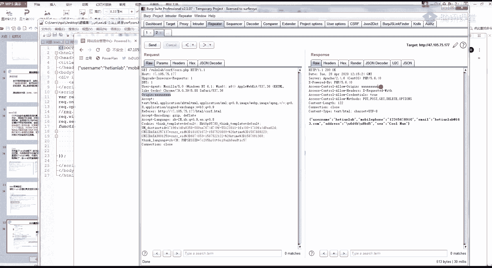

就是我家这样的一个头，然后它这边的两个字段。

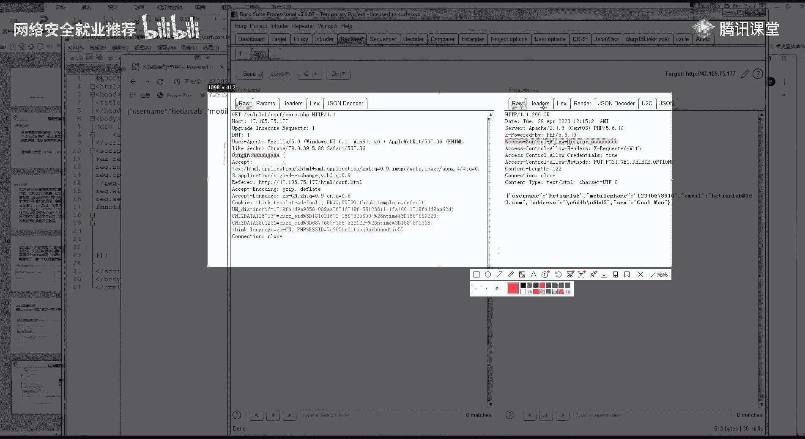

然后这两个字段会发生变化，那就判断它有一个csf，那么当它存在csf的时候，我们看一下，首先看一下我的一个操作，这是我的一个代码，也就是说呢我这个页面还是同样的，我把我这个页面发给别人。

自己我们自己模拟打开啊，然后我加载了这样的一个页面，可以看到，我这边呢就通过我的一个dma，读取到了这个页面的一个信息，虽然你简单理解，就是我给你发送一个html的一个代码。

然后我就可以读取你当前页面的一个信息，你当前接口的这个接口是我自己随便设置的，这个csf漏洞可以理解吗，不理解的话，可不可以，只有一位同学理解吗，嗯那我重新讲一遍好吧，就是你们先听我的呀，先听我的。

你们操作类型的csf，首先是这样，操作类型的csf是我发一个网址给你，你会执行一个操作对吧，给你掰开是填满，你会执行一个操作，这个你是懂的，然后我读取类型呢就是我给你发一个html。

我可以获取到你这个页面的一个信息，呃我用个更更通俗一点的吧，更通俗一点的嗯，就是，如果你这个网站里面存在一个cs啊，存在一个c o r s的漏洞，那我就可以获取你这个用户。

就是你点击了你登录的这个人的用户，的一个任意的一个信息，它的一个攻击场景是这样的哦，我还是用一个用京东或者什么哪里的，当然京东以前是有cos的呀，后面都被别人教了，然后修复了。

因为你可能从我们的这个靶场里面看不出来，我这里只是举个例子，举个例子啊，首先我们来看一下我们的一个敏感信息啊，收货地址好吧，还只是当假设好吧，假设这是我们的一个收货地址。

然后你可以看到京东呢是有一个cs的一个位置，对不是他改的，另一个就是他登录了，然后我就可以看到，啊假设我这里存这个cos的一个漏洞好吧，假设我这里存在一个c r s的一个漏洞。

然后呢这边是我的一个敏感信息，然后我这个信息就是每个人的一个，收货地址信息，如果我存在ccs的漏洞，那我就可以通过这一个，通过我给他发一个html的源码，给他发个html的一个代码。

获取到他这个人的收货地址信息，这就叫读取类型的cos，能理解吗，理解的话，你再扣个一，简单来说就是我给你发一个html，我就可以获取到你当前网站的一个个人信息，我在用通俗易懂的吧，嗯还是用靶场来说。

因为你如果理解cos的话，jsp后面也好理解了，我先跟你们讲这个cos先讲通，首先你要看我们的一个操作，返回，我的操作返回是不是返回了这一条信息，对不对，我的一个个人操作，就是我访问的这个接口。

获得的是一个个人的一个信息，然后如果我存在c o r s的一个漏洞，我就可以，我就可以得到你的一个这个操作，返回的一个信息，也就是说这一条我当前操作返回了，什么样的信息，我都可以达到，这样能听懂吗。

能听懂你再扣个一好吧，这样都听不懂吗，你们先把我前面的都去掉，你就简单来说就是，如果存在cos漏洞的话，我就可以得到你这个包返回的一个信息，因为我这个包可能里面会有一些敏感迹象，不管是什么样的信息啊。

找一个我找到敏感一点的，我找个敏感一点的，就是你们可能还不理解危害或者什么东西，好你首先来看了，他这个位置呢没办法获取到的，是因为他这里有一个东西限制死了，这没办法弄，他不是根据cookie来的。

等一下啊，他这个圈是根据cookie来判断的，那我这不就获取到别人的敏感信息了吗，好我们来我们来进行一个实际的一个操作呀，你首先来看我这里呢是不是有一个敏感的信息，这里面我有我的手机号，有我的一个姓名。

还有的一个地址，是不是有一个敏感的信息，对不对，然后，我这里存在一个cos的一个漏洞，懂吧，存在一个cos的漏洞，那我就可以通过我这一个漏洞，获取到你这个返回的信息，就是获取到你的这个信息。

这个返回包里面的信息可以获取得到，所以说为什么要读取的csf，就是我给你发一个包，然后你就会把这个包里面的信息返回给我，然后就读取到里面的内容，这样讲可以吗，终于懂了吧，好，那我们来看一下啊。

我们的一个操作过程，首先我是过多的一个代码，代码的话我会发给你们，现在就发吧，免得待会我忘了。

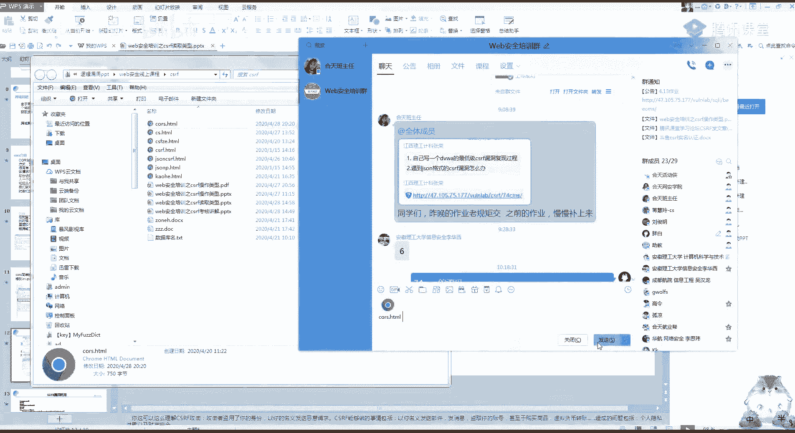

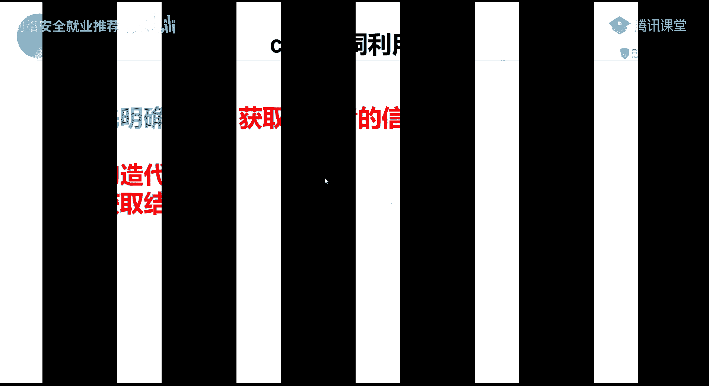

我们首先构造一个代码，然后看一下代码是怎么写的呀，啊不不看那个了，看我这上面看，看一下我们的代码是怎么写的，首先我们的一个代码是，首先我们的一个获取信息的接口，是这个47。105，这个接口可以看到这里。

这个get就是获取到了这个接口，当然他有也有一个post类型的呀，post类型的话你们自己去研究一下吧，其实也很简单，待会儿下完课给你们讲吧，你可以看这里呢就是我们的一个接口，首先是请求这个接口。

然后你在这个位置把这个u r l改为自己的dns，dns，弄个地址，html代码，你说这里吗，这一段是通过加载这个叫什么tech的，加载阿贾克斯的一个东西，你固定好就可以了，这一串代码是不太一样的。

这一串也是必须要的呀，这是加载这里面的一个js，加载这个js后面的才有这个功能，用，然后这里呢，然后他自己的url就是自己的dns弄个地址，dns弄个地址，大家理解知道是什么意思吧。

就是啊我比如说这里是，啊bp自带的一个dns s log，我这里对他进行一下访问，我这里访问一下，然后呢我这边就会有一个记载，就会有一个记录，然后我的一个ip都在上面。

就是它会记录我们的一个访问的一个请求，访问访问的一个请求，我们再来看一下这个代码，首先这一个iq这里呢是访问我们的这个地址，访问模的这个地址，然后访问地址之后，它就有一个返回，知道吧。

有一个返回就是在这个位置，然后我下面的代码就是请求这个地址，然后它的一个请求头，就是我们这里的一个返回的一个包，然后我们的dns longer上面，就会有一个这样子的一个请求，简单的来说。

它就是发起了一个这样的一个请求，他最强的作用就是发起一个这样的一个请求，他对我们的地址发现了一个这样的一个请求，所以呢我的dns弄的上面就可以接收到这个信息，也就是说。

我可以获取到别人的一个读取的一个位置，这段代码应该很简单吧，能懂吧，或者你不懂的，你就自己自己照着我的模板改都可以，这一段是读取的地址，这一段是你自己的dns is longer地址。

如果没有dns is longer的，去这个网站，在群里面发了b y e自己去申请一个dm的地址，自己去申请一个知道创宇的，那cos的漏洞是不是就这样利用完了，然后他的寻找我也跟你们说了。

就是很简单看这两个参数就可以了，就是你在他的这个请求头里面，加一个挖机的一个参数加在里面，然后呢我这里输aa这两个会相对应，这两个会相对应，那我就可以了，只要我相对应，好然后再来看第二个jsp。

如果还不会的，待会自己做一下时间就可以了，因为cos很少会有我讲的这么详细的呀，自己我当时我自己看文章也是看了挺久，可能会有点难理解，这个jsp看一下啊，前面这段你都可以不看。

我们就来看最关键的一个东西，就举个例子，这个xs s经常用的一个s c r i p t，这个标签应该还记得吧，我这个标签呢在加载其他的js的时候，是可以这样进行一个加载的。

这个就是你们打psx等于根pc，肯定应该还是记得的，因为你这里呢是一个js的一个数据，获取到的数据会作为js来执行，但是就是如果我访问的这个链接，访问的这个链接是一个json格式的。

如果你直接作为js运行的话，是会报错的，然后为了解决这样的一个问题呢，别人就发明了一个回调的一个函数，就是call back，简单的来说就是我要获取js的话，就是我要运行这个js的话。

我后面就有一个call back，或者是其他的，有些可能改名了呀，最多的就是这个quebec，很多地方都有，呃然后我们来看一下，还是同样的看我们的一个靶场，可以看到呢。

这里呢有一个json p的一个八叉json p，我们看一下包，我这个jsp呢它不会加载一个东西啊，然后我加一个call back at等于a，就是我在后面加一个cobat等于a。

你可以看到它这里呢是会发生一个变化的，我随便加他，这个call back是跟我这个发生会发生变化的，所以你简单的判断就是我是一个jason p，如果存在jason p就是我改造了call back的值。

它就会发生一个变化，你就记住这个点，就是我改正，我改这里的值。

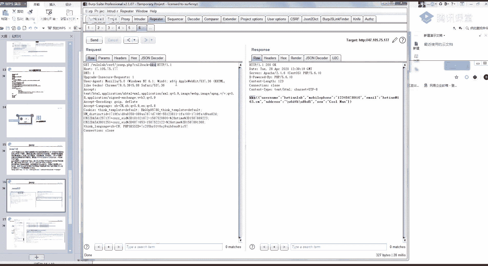

它这里会发生一个对应的一个变化，它就存在加分p的一个漏洞。

那我这个jason p是怎么操作的呢，同样的它也是一个读取类型的cos，只是他这个代码的构造有点稍微有点不一样的，121，我同样的我把代码发给你们，他两个的一个构造呀，其实是类似的。

你简单的理解就是我如果存在jsp和cos漏洞，那我就有一个读取类型的csf，那我的一个构造是什么样的啊，还是同样的用我们的一个靶场来操作，这是靶场的一个url，然后我get类型加载。

然后呢它返回的类型是一个json p，参数名是call back，然后call back的名字我这里是a我就改为a，然后这里同样的是我的一个dns longer的一个地址，我这里要用bp的就可以了。

看一下啊，这里是12啊，我这存一下，然后同样的在我的充电器上面打开，可以看到，我的一个dlg，是不是就把我们的一个数据读取到了，就是把我们jsp json p的这一段数据给读取到了。

是不是跟那个cos基本上是一样的，只是两种的一个表现形式不一样而已，希望s是在这个地方加个war i g，i n的一个字段，然后这个jason p是修改这个call back这两个位置。

这个读取漏洞能理解吗，能理解的话，可以，一个都没理解啊，那今天是我的失败了，我把整个全盘来全盘来回一下好吧，全盘来回顾一下，你听我讲关键啊，听我讲关键，首先我们一步一步来。

首先第一个浏览器的一个同源策略，因为浏览器的一个同源策略，的一个的一个作用啊，就是我这个阿贾克斯我就没办法跨域读取，别人给个信息，也就是说这条信息啊，我选一个和田的一个地址给你看，选择和田的一个接口。

这里还有吗，好，然后，找个和弦的get请求这个方法吧，全pose，pos就pos吧，用浏览器的这个同源策略的一个方法，就是我如果我没有设置，就是我如果没有这个跨域，没有设置这个cos。

那我是没有办法获取到这个数据的，这里呢是因为我之前输入啊，好你可以看他根本就没有返回过来，然后我们f 12看一下，可以看到他这个请求是一个红色的，fir的质量，就是因为浏览器的同源策略的一个问题。

就是我没办法跨越加载这个星球，然后呢你要想就是我们在一些大公司里面，他比如说有很多网站我都要调用一个数据，那我肯定是需要跨越的，对不对，就是我要从另外一个域名里面去请求，另外一个域名的资源。

那这里呢浏览器就提供了三种办法给你，第一种是jsp，第二种是c o r s，因为要跨越没办法，然后我这个cos它是可以自己设置的吗，就是有这样的一个头，挂机的一个头，我设置了这样的一个头。

然后我的返回包里面有这样一条信息，那我就可以进行一个跨越，然后能跨越的话，我就可以读取它的一个信息，到这里的话应该能理解了吧，这个cos就是因为跨越。

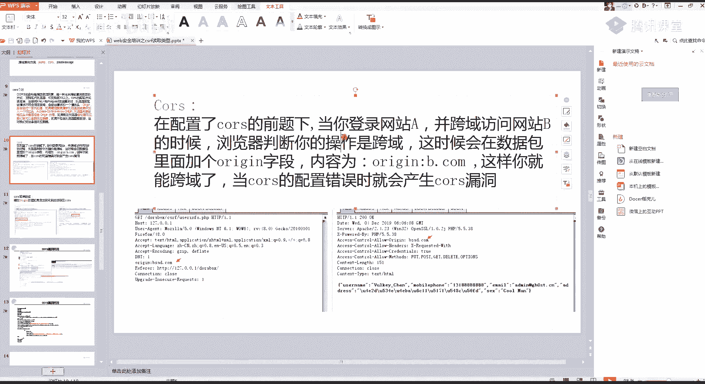

然后它配置不当是什么啊。

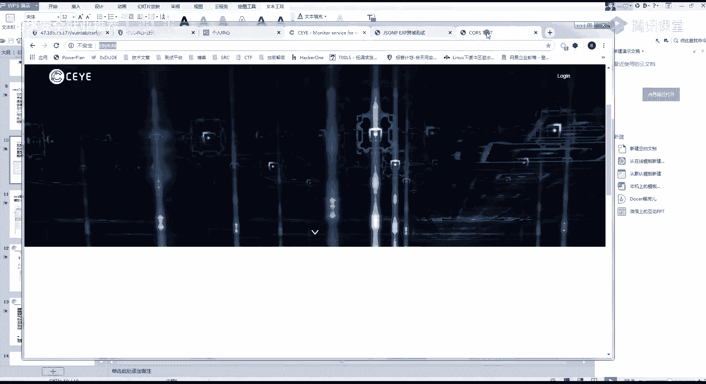

是什么情况呢，我们来看它配置不当的一种情况，配置不当的情况，就是我所有的域名我都可以读取到，就是所有的域名都可以进行一个跨域读取，到你这个资源，他一个正常的一个请求应该是这样的。

我们用qq的一个cos来看，首先我们来看qq的它的一个跨越，它这两个链接也是对应的，但是我把它修改掉，你可以看到它这里呢就不会进行一个读取了，然后我把cs删掉也没有，就是说呢我跨域可以选择。

我只只允许我哪一个域名进行一个跨越，懂吗，这个域名是可以自己在服务器那边设置的，如果我这个cos我这个服务器那边没有设置，就是只允许这些域名读取，那我就会存在一个cos，就是配置不当。

配置不当就是允许所有的网站，所有的网站都可以读取你这里面的一个内容，好然后第二个jsp我刚刚说了，他这个跨语同样的音乐同源策略的问题，我这个jason p也是一个跨域解决的一个办法。

在取决于你这个网站它是用的哪两种办法，就是我可能用的cs来解决的，他不怕远，有可能用的js p来解决的，跨越就是有两种办法，然后我们的一个jason p它的一个漏洞就是，我只要设置了jsp。

我都可以进行一个跨越，然后他的判断办法就是修改这个call back的一个值，修改这个cob的值，然后他只要设置了js p，我们都可以跨域进行一个读取，也就是说同样的我发一个html的源码给你。

我就可以跨越读取到你的这些敏感的信息，那它是怎么解决的呢，啊我是在讲csf的时候，我是给你们讲过一个ref，讲过一个report字段，json p的防御也是通过这个report字段来防御的。

你们把这个捋一下，自己捋一下，懂的话扣个一不懂的话，你就直接打不在线给你们解答，没啥实感，jason p一般也是个人信息那边吗，不不不就是jason p完全就是看数据包对吧，完全就是看数据包啊。

我举个简单的例子，我们来看一下，比如说你打开还是用京东吧，用京东登录了，你可以看到这是我京东的一个网站，你可以看到它是不是有很多jason的一个数据对。

然后我们找一下有没有什么call back的一个数据，啊比如说我随便点开一个底下的一个，我这里直接搜索，go back，你来看吧，我这call back是不是京东这些网，很多大网站都有这个。

它是用来加载数据的，然后我随便修改，那我这里就有aa，然后我把reform删掉，你看它还是存在，好吧，那这里呢它就存在一个jsp的一个漏洞，看到没有，它自己就存在一个json p的漏洞，但是啊。

但是你要想因为只有敏感数据才有危害啊，只有敏感数据才有危害，同样的我用这个网站进行演示好吧，我用这个网站进行演示啊，我们的一个，没错吧，是这个地址，我就把这个地址改一下，然后call back。

这还是call back，改为123，然后我就访问一下，内个是来看一下啊，京东它的有一个，读取了呀，这，看一下他的一个请求啊，嗯get，再测一下啊，call back等于123，他这没加载。

是因为refer的原因吗，你也看自己加载了，但是他这个reform没有，就是没有做，我这个请求没有请求到我的这个地址上面来，呃还有一个这样的原因，可能有一个这样的一个原因，我把它放在网站上面试一下啊。

pc data啊，那我换个，换个url，get类型，jsp call back，讲道理应该是会加载的呀，我看一下这个请求包呀，还是没有加载过去，这是为什么，1234，等一下，可能是哪个位置出问题了吗。

我用我这个再测一下啊，我这个阿贾克斯这里呢有一个东西写错了呀，可以看到它这里呢直接加载就失败了，他就直接加载就失败了，嗯我看一下他失败的一个原因啊，lol bp啊，这哪里会失败啊，讲道理。

他这个jason p就是完全的看jason p呃，待会我再看一下啊，上小课的时候给你们看一下，这个就很尴尬了，他这莫名其妙就失败了，几分钟前还可以，嗯好，然后呢我们要找的就是类似刚刚的一个cos。

还有一个jsp，就是要找一个敏感信息，记住啊，s i c a车中只有敏感信息这种读取类型的，csf他才会收，包括操作类型的，你只有敏感操作才会收，之前有个有些比较有意思的，就是教师吗，一些叫什么奇葩动。

一些奇葩洞，就是那种那种是什么去啊，csf修改性别或者cf f读取啊，读取性别等，这种就没有什么用，啊如果没啥体验的话，我待会就现在吧，我现在先把这边的一个课下了，然后我群里开个小课。

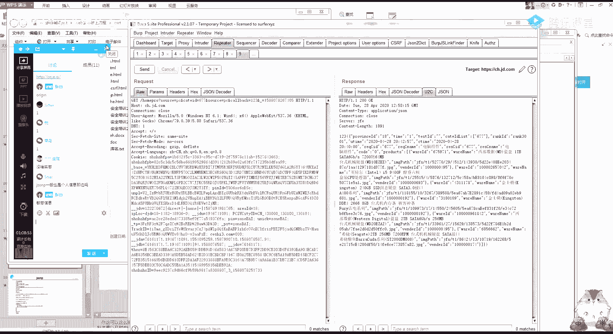

之前说了嘛，今天直播挖一下那一个csf的一个漏洞。

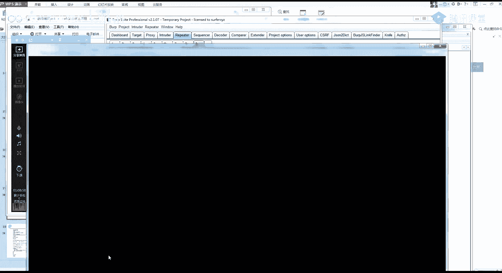

给你们体验一下，然后今天这个课后作业呢，就是你们去做一下我的这两个靶场，这个csf就很奇怪，刚刚一秒钟之前还可以做，然后莫名其妙我这一个jsp就不能用了，就是这两个实验js b跟cos。

啊你防御的话很好搞呀，希望s，js p d设置于后，先看群体小课好吧，看群体小课，你就是通过实例来看就知道了。

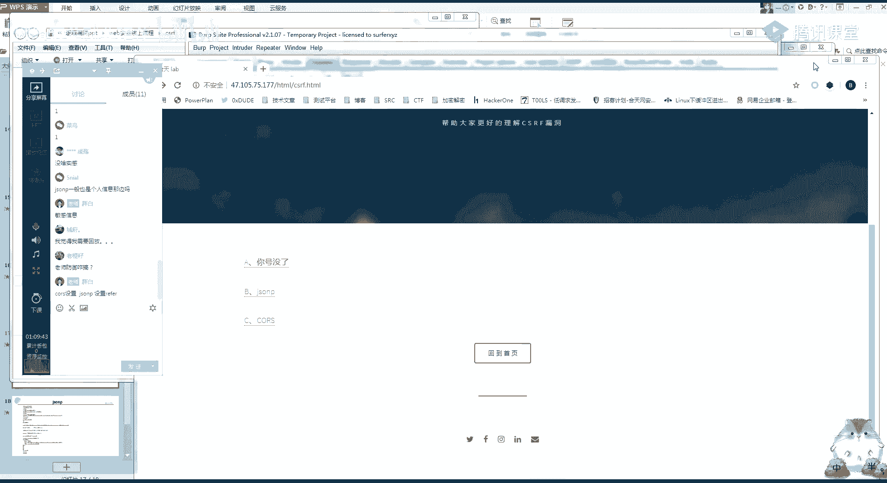

好这里呢我就先下课了。