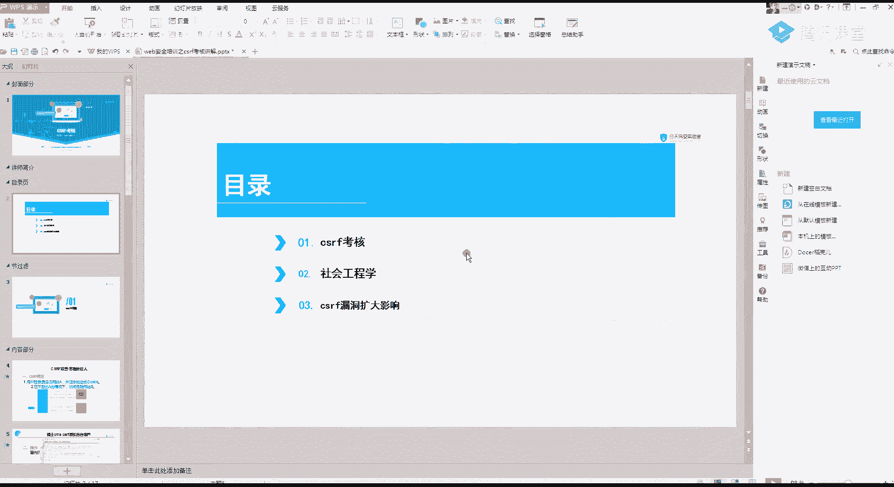
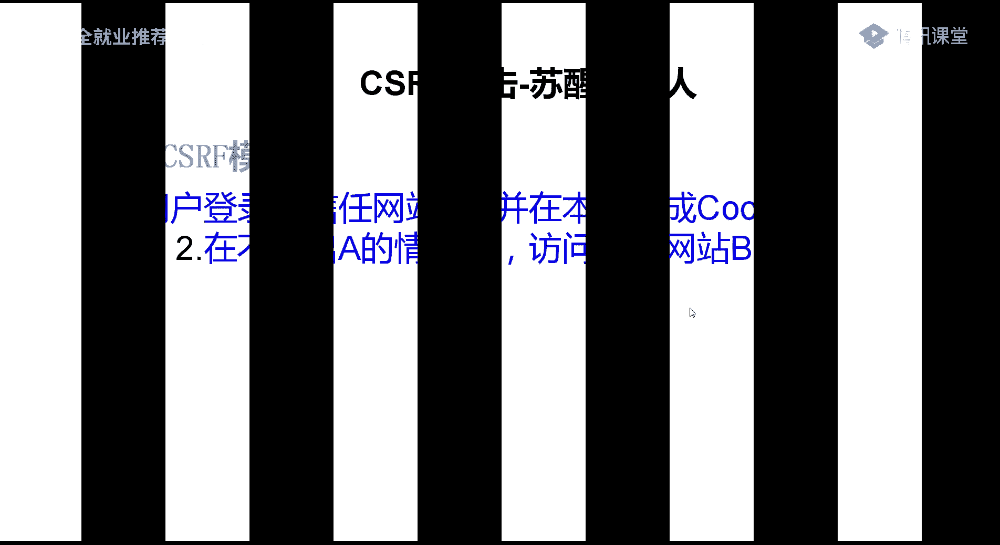
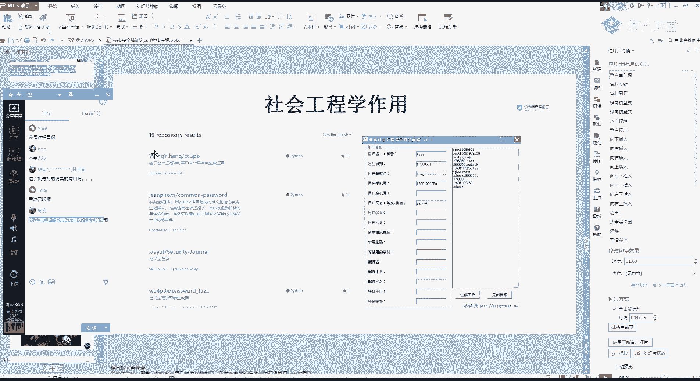

# 【B站最系统的网络安全教程】北大大佬196小时讲完的网安教程，全程干货无废话！学完即可就业，别在盲目自学了！！！ - P27：第25天：CSRF漏洞-csrf漏洞扩大影响 - 网络安全就业推荐 - BV1Zu411s79i

看看一下哈，嗯好开始今天的一个课程，今天是一个csf的一个考核，其实按道理来说呢，课程是比较简单的，所以呢在这里呢我就给大家加了一点点小内容，就是给大家会讲一下社会工程学的一点点知识。

然后再给大家讲一下一个cs的一个负的影响。

首先从这个c s f，大家的一个交作业的情况来讲，大部分同学是基本上已经还可以了吧，就是基本上已经把csf的一个知识给掌握了，然后呢我给你们的一个要求，就是通过这个骑士cm s进行一个对。

我进行一个施工，进行一个csf，然后呢施工的一个情况的话呃，不是很满意啊，大概只有一半的同学进行了一个这样的作业，我当时的一个思路呢是这样的，就是啊你们比如说你可以加我一个qq好友。

然后跟我进行一个私聊，然后呢你就或者假装问我，问问我问题，就是你比如说我发现一篇文章，然后你就说我啊老师我遇到一篇文章，然后自己哪些地方有不懂的，然后你就发个链接给我，我继续一点类似这样的一些场景。

或者直接发到我的邮箱，让我去进行一个上钩，但是大部分同学是一半的同学吧，这一半的同学是做了这个作业的啊，作业的话，昨天啊基本上也是给你们展示的，几位同学的一个作业，思路多还可以好吧，都还不错。

啊然后这里呢我就简单的演示一下嗯，因为骑士cms那个账号是多少，我找一下账号，有，这里呢就是添加管理员，二的这个包，这里基本上大家都是完成了，基本上是完成了，然后呢我在这里只做一个简单的一个演示。

先把这个删掉呀，然后直接利用bp给你的一个体验网址，直接copy打开，只有添加成功了，这里呢基本上大家都是完成了的呀，就是基本上大家都是完成了这个，csf的一个操作，但是在施工这一块呢。

大家可以尽量去做尝试，你要想好不容易有这么一次啊，合理的欺骗老师的一个机会，今天的一个重点内容呢，就是给大家讲一下，这个社会工程学是一个什么东西，有一些同学的话应该是已经了解过了。

它社会工程学的一个意思呢，就是通过他人合法的一个交流，使其心理受到影响，然后做出某些动作，或者透露一些诶透露出一些机密的信息，这一类的通常是认为一种欺诈他人，以收集信息，芯片和入侵计算机系统的一个行为。

简单的来说就是啊进行一个欺骗，具体有哪一些例子呢，其实这张图的话啊，我觉得很叫什么很形象啊，这个图很形象，就是我们的社会工程学，通常认为是一种物理攻击的一个行为，我们看一些社会工程学的一些例子，你。

没调，不好意思，开一些社会工程学的一个简单例子，首先这是以前很有名的一个，16年诈骗的一个例子，啊虽然我就是正常来说的话，我们是叫诈骗啊，就是日常生活中里面叫诈骗，在深度测试里面就是叫一个。

叫什么叫社会工程学，然后通过这个例子呢告诉我们什么呢，我们学了这一个不是叫我们去诈骗了，而是利用到一些，首先第一个是自己的一个安全意识的提升，第二个就是如果呀如果以后，你们是从事了一个安全的一些渗透。

就是比较敏敏感的一块的一些东西，这里是什么东西，就具体不说，就会发现社会工程学是一个，应该是一个什么，是一个很有效的一个方式吧，你可以看他这里的一个案例呢是什么。

这是因为某个人他侵入了一个招生的信息平台，然后呢拿到了这些的信息，然后你可以看这里呢，也是通过一个网络技术的一个说法，就是因为他拿到了一个个人的，一个个人足够多的信息，这样才可以啊让那一个受害者相信。

所以还是自己再提一点了，讲了这么多课，应该也给你们提过啊，学了这个千万别去搞事情了，网络的选法在心中，然后我们再来看一下最常见的一个施工案例，就是钓鱼邮件，我也跟你们说过，钓鱼邮件的一个事情。

就是让你们通过一个钓鱼，比如说你模拟是我公司的，因为你知道吗，我是何天乐，你就发条信息给我啊，因为和田的一个什么邮箱要干什么事情，然后底下呢就是一个详情，然后详情里面就是你的一个csf的一个代码。

正常人的话他肯定是会去点开的，但是这里呢给大家就是教大家一个，我觉得在渗透里面最有效的一个方式啊，钓鱼钓鱼邮件，应该说是现在渗透里面攻击，最有效的一个方式了，这里呢你们可以去网上搜一些。

钓鱼邮件的一个模板，然后根据这个模板稍微涂涂改改改一下，当然不要去尝试了呀，只是告诉你们有这个东西，看到没有，他这里呢就是把这个收件人，收件人发了这些信息，看到没有，迁移升级。

请你把这些信息回复到哪个地方，然后真的有人就发过来了，啊不知道你们有没有去尝试过，这是什么，我是谁，好看啊，然后记住啊，一定要记住钓鱼攻击是很有效的一个说法，呃，后面的话你们可以自己去尝试一下。

第三个呢就是一个钓鱼的一个页面，这里举的一个很经典的一个例子呢，就是腾讯的一个问卷，你可以看到就是一般我们遇到钓鱼邮件，钓鱼软件是不是就是不是腾讯的域名，但是如果我在腾讯的这个问卷上。

创建一个这样的一个信息，然后发给你，你有没有可能会相信呢，因为这个域名是腾讯的，当然我们遇到的更多的一些钓鱼的，一个是就是别人说什么啊，英雄联盟啊，或者什么游戏啊，你有活动啊。

然后领东西这种最多就是最多的数据，说的是那种，应该是没有想过用这个qq或者其他的一个问卷，来制作这样的一个钓鱼页面，发给别人，那这个社会工程学在我们的一个渗透测试里面，有一个什么样的一个作用呢。

首先它有一个最大的作用，是我们这里呢是进行一个信息收集，因为社会工程学除了我们刚刚的一个钓鱼之外，还有一个就是对信息的一个搜集，就比如说这里啊，我们通过一个人的一个，比如说一个网站吧，我就举个例子。

比如说这里呢是一个什么啊，门户网站，门户网站或者是做网站的，网站制作，对吧，你比如说有这么多的一个广告，然后我这个人呢，我就我又不想出钱去买他们的广告，但是我又想白嫖到他们的一个源码，那怎么办。

那怎么办，呃给大家讲一点点思路啊，上面是没有写的，这上面是没有写的一些思路，盗号的域名手机好久的事情了，这个你不用他们管了挺久的东西了，就比如这一种呢，现在很流行的就是找客服懂吧。

就是跟客服进行一个聊天，说哎客服我对你们的一个网站就很有兴趣，然后看他能不能搞一个测试站出来，因为你要知道这种网站后台的话，一般是会有一些文件上传啊，或者什么样的漏洞。

然后我就直接传文件给它进行一个get shell，然后另外呢可能还有会遇到一些啊，黄赌毒的这种网站了，然后你就可以跟客服聊，说你遇到一个什么问题，然后趁机就发一个木马给他，这种手法是最常见的一些事情啊。

很常见的一些东西，然后当然还有我们这种，就是我比如说有还是同样的，有一些什么网站制作交流群啊，或者什么东西，或者说让我通过这里的一些信息收集，查找到他们的一个交流群，就比如说是我一个啊和田智慧好吧。

我们和田的话就有一个和平交流群，然后呢我通过这个群呢，我就可以拿到一些qq号，对不对，拿到一些qq号，然后拿到一些公告啊，什么东西就会有一些足够的一个信息，然后呢这里你要想到呀这些客服的qq号。

我只是举例子啊，不要你们去试这些客服的一个qq号。

他可能他可能会不会有一个，历史的一个遗留信息呢，就是我们通过这个qq号去这些施工库里面查询，这个qq号的一些旧密码或者是一些信息等，然后有可能是可以得到一些，就是你可以登录进去的呀。

这里呢是github上面有一些施工字典的一个生成，你可以看到根据你的一个用户名，出生日期，邮箱用户手机，然后做机啊，还有什么东西，你知道的东西越多，它这个字典就会给你生成了一个密码越多。

还有一个常用密码等，这里的话应该还记得吧，我发了一篇文章给你们，不知道你们看到没有，看一下，这里就是和田之前的一篇文章，你可以看一下这篇文章的一个东西，首先它是通过这个qq号，然后通过这个社工。

库的一个东西就是查这个群关系啊，通过社工库，然后再通过这个数据库查到了一些密码，然后再通过这个ig 007，通过这一个网站呢，它是可以就是比如说你们可以查到手机号，注册过的一些东西啊，这个网站。

就随便查一个哎好自己的吧，你看这里呢，我是把我自己屏蔽了呀，这里你就搜不到，随便找个人的，查一下刘老师的，来听班主任，你看可以通过这根据邮箱查到，注册过的一些东西，然后呢我再根据我们找到的这个密码。

就是这个生物库查的一些常用的密码，再去进行一个简单的一个测试，可以看到这里就通过这些简历，还有什么东西查到了很多东西啊，这个是删减版的，我那里有个原版的，因为可能原版的会有一点点。

有一点点可能会封号，所以就只发一个精简版给了你们。

然后施工的话推荐你们去看一部电影啊，这部电影还挺有意思的，这部电影才是发群里面，建议去看一下这部电影，看完之后，你们可能就会对社工这些东西，有一个深刻的一个体会了，呃关于施工这一块啊。

还有没有什么想问的，没有什么想问的，有什么想问的话，现在提出来给你们稍微解答一下，五，社工库，这里不能教你们了，待会儿待会儿群里面跟你们说，现在的有现在比较出名的就是一个tg url，不知道咋换哦。

你是说那个昨天的那个作业吗，如果在网上搜索到自己的账号，没法，你没你现在唯一的防御就是改密码，懂吧，或者是自己亲痕迹也不用，每个站就是你设置一个比较复杂的一个密码，我就跟你们说吧。

就是说一个简单的例子啊，就包括微博呀，qq还有qq的xml，qq的xm，那个qq xml不太好改呀，那个qq的菜没，我待会儿下次给你们说，因为上课这个东西不好弄，每个网站密码不一样。

如果收到自己账号的话，建议就是改密码，我之前是去搜过呀，施工库施工过，我自己我发现我什么什么隐私都没有，还好我不搞事情啊，我也搞事情，百分之百被抓，没有隐私，然后你们可以去了解一下tg的一个。

做工瀑布的，之前有一个什么样的一个新闻呢，央视央视都报道过了，但是吧但是到现在他还是没有被打掉了，社工库机器人新闻，网上的话数据的话很多东西可以搜到，包括原来的一个qq群数据啊，qq群数据的话。

大概是08年还是什么时候去搜一下啊，不是08年，看到没有，qq群关系的一个数据库，14年挺久了呀，然后群关系的话，他大概有100多g的样子，我手里是有的，但是我们要自己去弄了。

社工库你可以选择自己搭建啊，可以选择自己搭建，但是你要有一个足够的一个机器，还有一些东西最好是自己搭呀，或者是你花钱去查别人的，但是你如果要自己发的话，那些数据啥的要去自己搜集一下。

很多东西可以自己可以搜到的，但是搭起来要花时间，好关于施工这一块，其实是稍微有点敏感的一些话题啊，就不多说了，讲一下csf的一个扩大的一个影响，首先啊我们要确定一个点了，就是，你如果是vocsf的话。

一定要记住五个，一般有csf点的情况是，整个站都会有一个csf的一个漏洞，对吧，是整个站，然后呢它修复呢它也是直接修，就是全站进行修复，大家懂吧，一修就是把所有的都修复了，然后读取类的也是一样的。

所以我们操作内容呢，就要尽量找敏感的一些信息操作，你比如说啊删除账号，更换手机这样的一些敏感操作，第二个读取类的也是，最好是找账号接管的一些拓展信息，然后还有一个个人的一些地址信息等。

尽量找敏感的信息啊，这里的一个滑铲，其实你们应该是去搜购的，这个云骑士的一个cm是可以get shell的，但是要在后台，然后他的一个get shell的一个办法，就是后台登录之后。

然后运行这样的一条命令，l s吧运行这样的一条命令，他这里呢就会写到一个看一个config里面啊，当然这里这里好像我把它权限设置没了，网上设置成了不可不可写的一个权限，这就很尴尬了，这种本地的环境吧。

然后他的一个后台get share的一个漏洞，在这里发给大家，这里呢包括提示，还有很多cms的漏洞，这里有一个集合，大家有时间可以看一下，增长一下自己的知识面，那这里的也很简单。

就是一个这样的一个登录后台之后，进行一个这样的一个操作，但是这里的话是因为我设置了一个权限了，让它权限不可写，所以他这里就直接报错了，给大家看一下本地的一个环境，这里要给大家讲的是什么呢。

就是我你不要想着csf，他只能做一些单纯的一个，做一些单纯的一个叫什么东西是吧，单纯的一些读写操作呀，csf它是可以进行一个get shell的，包括xx也是，我的csf这里要给大家看一篇文章。

这一篇呢有一个xc加cf组合拳的一个get shell，的一个漏洞，哎呦喂，他自己的一个pc就是这样的，我这里稍微改一下，因为我之前是运行过了，改不了了哦，可以改，你可以看到。

我这里呢就是一条命令执行的一个语句，在这个位置，然后我们看一下我们刚刚的一个运行，可以看到是一条这样的命令，那这里是不是也可以构造一个csf，csf的一个构造也唉我也不做也不做测试了呀。

因为这个东西就很容易就生成了，所以这里呢要你们学到的是，重要的是一个思路啊，重要的是一个思路，遇到csf的时候，不要叫什么，先不要急，就是先不要急着把这个漏洞就给它交了，包括是xx还有所有四个注入。

包括所有的漏洞都是一样的，你如果挖到了这个漏洞，首先就不要急，你要想到的是怎么利用这个漏洞去进行一个，去进行一个最大化的一个利用吧，就是在这个过程中你会学到很多的技术呀，当然不只是技术。

它一个奖励也是很丰厚的，给大家看一下最近的一个私密项目吧，嗯我去找一下那张图，这是五一期间的一个活动吧，五一期间的一个活动，然后我就发我发群里好吧，这是517的一个美团的一个活动，它的一个要求就是。

你通过这个漏洞导入到美团的一个内部，当然它这里是禁止了一个钓鱼跟施工啊，不然的话他是很容易通过待遇，施工的话是很容易进入内网的，他这里明确禁用了，当你遇到一个漏洞的时候，如果加深就是入侵到里面了。

它的一个漏洞奖金大概是5万块钱，一个像我们单独的一个漏洞的话，他可能就美团院奖励比较高，单独的话可能就1万块钱或者是八九千块钱，但是如果你遇到这种活动，然后又知道把这些漏洞深入利用的话。

你这个奖金是非常丰厚的，另外再给你们看一个例子，一个例子呢，就是我之前的一个漏洞挖掘的一个经历啊，这样的话我就嗯因为已经修复了，啊学会了也不好讲了的，我只能跟这样跟你们说，首先第一个xs s等于dv。

或者是中位，dv大概是把中v吧，中规，大概是300块钱的样子，然后呢又发现了一个csf，大概是csf就50块钱，但是cs i f加上xs s组合成一个如同，或者自动触发的操作。

然后他这个奖励就变为了一个5000，所以呢这里要教你们一个经验了，你们现在虽然刚开始挖，但是也要有一个这样的经验，你遇到csf跟xx可以先不交，先自己留着，找一些组合漏洞进行一个寻找，然后进行一个攻击。

嗯然后我再讲一个这个吧，今天的课程其实就这么点，我感觉内容有点少，我看一下一个qq的一个xml呀，你社工的话用qq的xml，这一点其实很难弄到，因为qq tml它是自动加载的，他他那个链接跳转。

我教你们一个更有趣的吧，假如说这是一个哔哩哔哩的一个网站啊，然后随便点一个，哔哩哔哩我觉得是有一个分享的一个东西，通过qq分享或者通过qq微博的分享，分享到微博吧，这里我简单的抓个包，那么跳转不进去啊。

就例如这把看到没有，他们这里呢类似微博这种，有这样的一个分享的一个链接，这里简单抓一个包，就可以看到一些内容啊，首先我这一个是我这个名字，然后我这个refer就是他的这个壁纸，我这里随便改一下啊。

改为百度，然后link shell，分享成功去我的微博看一下，然后我这里呢就是一个明日方舟什么诶，是我刚刚哪里点错了，刚刚这个抓包没抓到，好呀，我先分享一下，那就不是这个点了。

哔哩哔哩share code，因为我很久没有抓过这个包了呀，微博是哔哩哔哩，然后看一下，这是什么鬼吗，分享成功看一下哔哩哔哩，然后百度，那我就把这个改一下，报纸牌，好勾一下，分享成功。

诶讲道理应该是分享成功的呀，再改一下，再改一下，有点尴尬，好久没弄了，有可能会，哇他们把这个漏洞修了吧，应该是，四个就很尴尬了，这是我去年的时候找到的一个，就是我在分享的时候。

我可以替换这里面的一个url，但是我这个图片，但是我这个图片，不过这个图片还是那个还是那一个叫什么去啊，我这个图片还是哔哩哔哩的图片，但是这里面的ur l呢我就可以进行一个替换。

可能他们这个漏洞是进行了一个修复呀，那我再想想哪个地方能施工了，如果分享到qq空间呢，试一下，好可以看到这里，我这个图片虽然还是哔哩哔哩的呀，但是我这个地址已经变为了百度的，所以说如果你加我一个好友。

然后啊，就发一点我们这种肥宅比较喜欢看的这个图片，然后点一下，就跳转到了你的一个csf的一个地址，当然这种东西呢你就把自己空间屏蔽了，然后去尝试啊，不然，网络安全法在心中还是一句话。

好今天的一个课程呢基本上就这结束了，你们有没有什么想问的，因为感觉没有什么想讲的呀，csf这个东西，所以呢我就先把这个关闭，因为刚刚那刚刚那位同学说的一个，就是你利用一个叫什么叫利用那个qq的xml。

一xml扫描仪转发，你像我你像我刚刚这种说说，就是我刚刚删掉的这种说说，我根本不需要借助那个xml的一个扫描仪了，我直接利用刚刚我空间的这个，然后分享给你们，你们去点开，你们自己去点开。

然后就会自动跳转到你的一个csf的一个位置。

好这里我就下了啊。