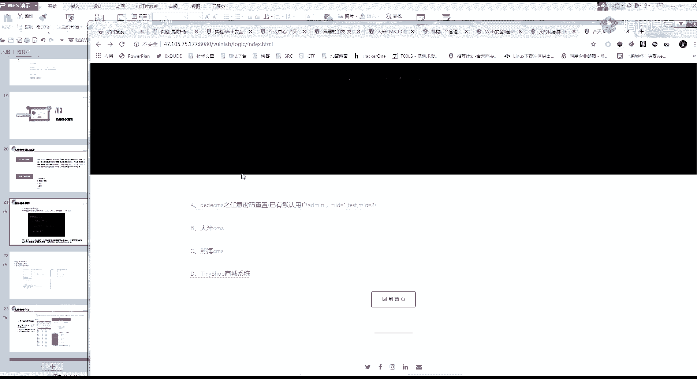

# 【B站最系统的网络安全教程】北大大佬196小时讲完的网安教程，全程干货无废话！学完即可就业，别在盲目自学了！！！ - P30：第28天：逻辑漏洞-越权漏洞及支付逻辑漏洞 - 网络安全就业推荐 - BV1Zu411s79i

好开始今天的一个课程逻辑漏洞的第三部分。

模具漏洞的话，大家应该学了前面两部分，应该可以知道是一类比较简单的一个漏洞啊，今天呢要给大家讲的就是一个逻辑漏洞的一些，比较常见的一些漏洞吧，比如说一个月全，还有个支付逻辑漏洞，还有一个条件提升。

这三类呢我觉得应该是在，src中出现的是比较多的三类，前面两类出现的比较多，a3 类的话有时又有时没有，今天的话，主要是要教你们怎么去寻找这个逻辑漏洞，然后叫什么嗯，反正这种漏洞特别好挖呀。

首先来看一下今天讲的第一个漏洞，是一个月全漏洞，他越权漏洞呢又叫横向啊，又分为一个横向的一个月权，跟一个纵向的一个月权，其实你简单的理解就是，一个正常用户a可以操作，另外一个用户b才能做的事情。

大家能理解什么意思吧，就是啊我举个简单例子，比如说我用户a啊，我用户只能修改我自己的信息，对不对，用户，然后我用户，但是呢，嗯但是呢啊比如说我抓个包，拿一个简单的一个例子。

我抓一个包。

随便。

我bp没有开，哈哈啊，就这样举例吧，你比如说我在修改一个用户a的时候对吧，我修改用户a的信息，那它是根据什么东西来判断，我这个当前用户是用户a，那他有没有可能第一个是根据cookie。

就是你当前登录的cookie来判断对吧，第二个他有可能会有一些，比如说一个user呀，user等于多少呀，user id，user id等于多少，对不对，如果用cookie来判断的。

使用cookie判断是不是就是存在一个cf i f，但是如果是第二种，他通过这种user id来判断，他如果没有，他如果没有做好一个限制的话，我是不是这个usd是可以任意的进行一个修改的。

包括查看个人的信息，也是，虽然这就是一个简单的一个月全漏洞，我用户可以操作，另外一个用户b才能做的一个事情，然后呢它还有一个叫纵向月权，可能下月前跟纵向越权的一个区别。

就是比如说横向越权就是我用户a可以操作，用户b就是正常用户啊，两个相同等级之间的人需要一个，横向纵向呢就是重视上跟下嘛，就是我一个普通用户，可以操作管理员的一个用户，然后我们看一下作用它产生的一个原因。

其实也都很简单，就是因为啊对客户的，对客户端的一个请求数据过分的相信，而遗漏了一个权限的一个判断，这里呢我们从实例里面看就很简单了，这也是平行越权跟这一个垂直越权，大家可以看一下一个重点。

就是在观察请求参数的时候，记住面全漏洞没有其他技巧，就是修改里面就是修改参数里面的一个值，我应该算越权，这个漏洞是所有f i c，包括所有的网站里面，除了入口令之外，出现的是最多的一个情况。

漏洞越权一定要记住，灭全真的是出现的最多的，垂直越权的话，这里也不详细讲了，很简单的就是认为我一个普通的用户，一个普通用户可以操作管理员，才能做的一个事情，这里呢主要是要教你们一个漏洞的一个利用。

跟一个寻找吧，其实我觉得逻辑漏洞啊最重要的是这一点，思路一定要清晰，你要明白每个参数的一个作用，然后它这个漏洞呢也特别特别简单吧，就是抓包改id啊，这里本来有一个简单的一个考核的。

是这个新shop的一个简单漏洞。

这里呢就会存在一个月权的啊。

存在一个月权的一个漏洞，给大家看一下，首先我随便注册一个账号好吧。

这里呢我随便注册一个账号，然后呢这里会有个用户中心，这两大家思考一下，大家思考一下啊，他这个地方有可能出现月全漏洞的是哪一个点，最有可能出现的是哪些点。

然后你们把自己思考的写在上面，呃csf也可以个人资料对一个，然后，地址，密码密码的话就不叫越权了，因为密码你看这里有一个旧密码，新密码正常来说也是啊，这里我告诉你们一个思路。

就是没如果你遇到的是一个src的每一个功能，你都给我去看啊，它这个地方呢是一个地址的位置，有一个月圈的一个功能，然后大家要记住啊，在漏洞挖掘的时候，这种查看别人地址的，一查看别人地址。

这种敏感信息的涉及敏感信息的越权特别值钱，他的一个危害跟一个四个柱子的危害。

是差不多的，因为都是要数据嘛，这里直接给大家进行一个演示。

啊你比如说我正常正常情况下来说啊，我这里是添加了一个数据包，对不对，就是刚刚可能点了两下呀，添加了一个。

地址，然后我们点击一下修改，可以看到这个地方，这里呢有一个地址的一个位置，你看这是地址的一个值对吧。

这个就是一个壁纸的一个请求，一每个人的一个地址，我点击修改的时候会弹出来吗，然后呢你可以看到这个请求，这里越权漏洞就这么简单，这里一个id是九对吧，那我把他id随便改一下，比如说我改个一，改个二。

你可以看到这改个一诶，它发生了一个变化，再改一下，改个二又发生了一个变化，这里呢就是一个简单的一个月全是不是很简单，我改id就可以了，抓包改包，一定要记住一个思路，就是所有的漏洞啊。

不是所有的功能点都有可能出现，月全所有的功能点。

所以它的一个简单的一个流程就是抓包，然后修改里面的一个参数，然后呢这里呢我还同样的用网线，是举个例子，其实昨天跟你们讲了，好我们首先来看一下啊和天网安实验室，它这里的一个添加实验。

他这里是不是有一个ec，就是我们没有添加时间的时候，它是一个ec等于e c d什么什么东西，这里的一个参数，然后呢再来看一下，添加完之后它变成了一个c，一等于多少多少多少，那他你想一下。

那他和天网安实验室是不是就是通过这个c1 ，来判断你到底有没有购买这个实验，对不对，那这个c一就是对应到每一个人啊，我这个人因为每个人的c是不一样的，你可以看到从这个评论里面就可以看到这个cad。

每个人的cad是不一样的，也就是说每个人的一个cad就是对应的这个实验，那你想一下，我们利用这个cad可以进行一个，什么样的一个月权，就是从这个功能点来进行一个判断，are you。

因为逻辑漏洞的话是要非常熟悉业务的啊，首先我这里给你们列了一个例子呢，就是我自己的一个思路，你们可以看一下，和平晚安实验室它的一个功能就是。

创建啊，它的一个功能就是一个创建实验嘛对吧，创建实验，然后销毁实验，创建实验机，然后销毁实验机，然后评论啊，答题呀，问答呀，这几种，还有一个指导书呀，这种，所以我们的思路就一定要清晰啊。

就是我一个月全漏洞，它的一个影响是什么呢，它都是根据业务来的，你这个业务可以做什么，我就有可能可以做什么，它是关于业务的，所有的逻辑漏洞都是关于业务的呀，就是你挖逻辑中一定要熟悉业务。

就是知道我这个东西可以干嘛，嗯然后其实偷偷跟你们说，就是我以前的话，这里面的六个漏，这里面的六个逻辑漏洞，我在网上实验室基本上是挖了一半的，当然后面都修复了呀，以前以前的话都是可以啊。

白嫖时间拿什么东西的，然后再看一下几个案例运行漏洞的一个案例，你可以看到它这里呢就是登录下单，然后抓这个订单的一个包，就是订单里面有一个add id，就是对应的一个地址，然后修改这个id，他就可以约选。

就特别简单，然后实操的话，这是一个课后作业啊，就是王实验室的一个权限，绕过漏洞，这块逻辑漏洞就很简单，白嫖是最终目的，具体怎么白嫖的，还是不能跟你们说啊，然后再来看第二个呀，月全月群真的就很简单。

抓包改包，支付和机动也是一样的，首先看一下啊支付逻辑，它的一个原因就是这一段都是白扯呀，这样就不看了，看它的一个原因就是啊在对这个金叫什么去了，它这里面呢，简单来说。

就是它后端没有对这个请求包进行一个验证，就是他请求包里面的参数是不是正确的，所以呢这个漏洞也特别特别简单了，就是抓包改包，然后我给大家举一个例子啊，就是你们在买东西的时候，这几个东西肯定是要的对吧。

一个购买的一个数量，一个购买的一个价格，一个购买的一个商品，商品是对应的id嘛对吧，然后还有一个支付的状态，就是你有没有付钱，支付成功或者支付失败，然后优惠券对不对。

然后这里呢有一个最特殊的就是测试数据包，待会儿呢会给大家一个进行一个解释，啊，首先我们开始来看了他这一个修改购买数量，是怎么回事啊，就是我们在买的时候，你是不是只能一件或者多件，对不对。

一件两件或者三件四件这种，但是你有没有想过我这一个一键，我是不是可以改为-1。

改为-1。

这里呢啊用完先验室的一个漏洞给你们，给你们来看一下，啊首先我看一下这个啊，他这里是进行一个简单的一个注册，先，不麻烦，会员名，可登录谜语，诶。

那，他这里为什么不能选呢，看一下啊，好成功了啊，我们看一下它这里是叫什么，它这里是一个充钱的一个操作呀。

他在这个位置。

他这个好麻烦啊，我觉得，充值卡，然后卡密是多少去了。

可以看一下它，这里呢就是在这个团购的一个位置啊，因为点进来之后，有一些比如说啊什么团购呀啥的，随便点一下，随便点一个吧，然后呢这里有一个购买，然后我们想一下一个正常的一个购买流程。

购买流程啊，我这里呢给他抓个包，你想一下一个物品，它的一个购买对应的几个参数，第一个是不是价格，第二个是不是凭这个购买的一个数量，对不对，这是，这个是叫什么去了，叫最基础的哪个参数吧。

看一下它这有一个价格，一个数量，这里比如说我随便输个，我在这里输个-1，点击一下提交，然后我们看一下这里面啊，我这里的一个-1呢，它是没有起作用的，这里数量还是一，但是我们的数据包里面你可以看到。

这也是我们的一个数据包，这也是我的一个电话，然后对你有它的一个数量，我把这个数量改为-1，再看一下，请填写手机号码就太尴尬了，这里改为一个-1，然后我们看我们去看一下我们的一个订单。

这里呢我改为了一个-1，你可以看，数量零已付款，然后我们看一下资金流水，刚刚我们的-1变成了100，就是本来是66嘛，然后我点成-1，那我就变成了一个加钱，66乘-1等于啊，相当于是多66块嘛。

对大部分都很简单，主要还是要熟悉业务。

所以说逻辑漏洞都是叫什么，会抓包改包你就能挖，但是重要的是你要有这个思路，就是我知道哪个地方我要去抓包改包，我要改什么东西，这里就是一个修改数量，然后第二个就是进行一个修改价格，修改价格也很简单啊。

就是刚刚我的一个抓包。

我刚刚抓个包，因为里面会有一个价格吗，对吧，然后这里也也有一个例子。

这里有一个简单的一个例子，这里你可以看我这里有五块钱，然后呢我这里买一本书是十块钱一本，同样的我就这里抓个包，我这里买的时候，我们一个包里面那个参数，这里是一个十块，这里一个数量好吧，那我就改为一个0。

01，然后再看一下，就是我把刚刚的这个价格改为一个0。01，可以看到，本来是十块。

我把它这个价格改一下，然后你看购买成功，然后就用一分钱买了一个书籍。

另外跟你们说啊，这种东西是很常见的呀，说个比较搞笑的事情，以前用过一分钱买了几十吨钢材，当然他后面没发货啊，后面没发货，然后你要记住啊，除了我们刚刚的一个订购确认信息，就是我们刚刚的一个确认订单。

这三个步骤，你每一个订购，然后确认订单，然后付款，在每个步骤中，它都可以尝试进行一个修改，所以逻辑漏洞还是一个业务方面的一个问题，你们可以看一些比较正常的一个，一块钱买宝马呀，然后一块钱买无人机啊。

大疆给大家说个更有意思的一个事情啊，就是以前乌云好像有用五块钱买了一辆特拉斯，特斯拉的，然后好像那边还发货了，就是为了表示感谢，然后还把那个特拉斯给送给他了，就几块钱买的，然后一个修改修改id的话。

就是比如说你在选订单的时候嘛，它会有一个id，然后对应的多少钱，然后呢我自己呢我我选择一个价格少的，就是比如说我这个价格它有验证码，价格是一块钱的一个东西，然后我把他的id改一下，然后就改了。

修改订单状态也是基本上都是一样的呀，就是你支付没有支付的状态，跟实际支付的状态是不太一样的，就是我昨天说的类似修改返回包，我先抓一个修啊，支付成功的一个返回包，然后呢。

我就把这个支付成功的这个返回包的东西，丢到那个未没支付成功的那个上面去，然后另外呢要注意一点这个东西啊，就是优惠券，优惠券的话应该是逻辑漏洞里面，出现问题最多的地方的，优惠券，优惠券。

因为它比如说这个优惠券，它可能固定的一个金额，然后固定了一个数量，优惠券上面就是我可以比如说我这是五块钱，然后修改成99，改成100，他可能都没有验证，然后给大家说个比较有意思的。

就是手机上手机上那一种领取优惠的呀，啊你比如说某些游戏里面啦，嗯腾讯的，腾讯的那个王者某耀不就会有一些优惠券嘛，然后以前的话是刷那个包，然后修改优惠券的一个数量是可以进行一下。

是可以进行一个无限制的刷的，然后这个积分金额也是一样的，然后还有个无限制的使用，就是我优惠券会对应一个状态码，就是可能会有一个有一个码吧。

对应的一个码，就比如说我的腾讯。

腾讯一个答案好吧，我腾讯课堂，我腾讯课堂的一个优惠券，诶我没得优惠券，那我去发一个优惠券啊，我发一个优惠券，其实偷偷告诉你们，腾讯课堂的话，我是之前挖了很多很多很多漏洞的，啊比如说我随便选择一门课程。

然后一块钱一张私密发布吧，可以看一下他这张优惠券呢，它是有一个对应的一个id的，在这个位置就是我领取的时候我会有一个id，然后呢我去付款的时候，我还会验证这个id，但是我这个id它可以无限制使用。

大家懂什么意思吧，就是我买了一次之后，这个id还没有生效，还没有失效，可以无限制的使用，这就是一个优惠券的一个位置，大家都是为什么支付逻辑漏洞，就是为了一个字对两个字白嫖，对吧。

所以这些位置都是都是很有可能的呀，然后第六个叫测试数据包位删除是什么意思呢，给大家举个例子啊，就是我遇到过的呃，我当当时是一个这样的一个情况。

我们在购买商品，对不对，还是同样的，就类似类似于我这个腾讯课堂。

比如说我买课对吧，我买课这里的话就会有一个找个户型了，我这里要买课看一下，领券后购买，不领了，我是缺这100块钱的人吗，反正我也不买，我们看一下这里他这里呢一个报名付款。

它是不是会有一个对应的这个user的一个id，就是这个课程的一个id，你可以看465686465686，那你想一下这个id他有没有可能开发，在测试的时候，他这里会有一些测试的一些课程呢，或者商城里面。

比如说有一些测试的课程啊，比如说一毛钱一毛钱买什么苹果手机呀，什么东西的一堆，那我是不是可以去，就是这个创建订单的这个包嗯，有一个穿刚刚那个包丢哪里去了，再抓一个吧，就是我们刚刚的这一个包，对吧。

这个id我是不是就可以放到这个bp里面，对它进行一个便利，就是进行一个爆破，看能不能找到一些测试的一个数据包，我记得当时我挖v p k的话，是挖到了很多那种白嫖的保养，就是零元，零元送什么，零元送什么。

零元送什么一堆，因为零元的话它会自动的一个成交，根本就不需要付钱，或者有些很少的钱买很价格很高的一些东西啊，这就是一个测试数据包位，删除其他的话，比如说嗯一个什么修改支付接口呀，当然这种很少很少见啊。

现在的支付接口基本都是支付宝微信了，然后那两个东西吃的话就基本上不要想了，我觉得最多的呢还是用的这个重复支付，还有一个最大额的一个，就是你当输入你的这个支付啊，支付的价格达到一个最大的一个数量的时候。

它可能会存在一个溢出，直接变为零，另外一个条件竞争的一个漏洞，其实也是我待会要讲的就是条件竞争嗯，下一个就是讲了他，条件竞争啊，几分钟之后再跟你讲，刚好也在这里了，然后呢这里呢是一个案例。

这叫大米cm的一个支付逻辑漏洞，也是也是给你们做了一个靶场啊。

就是还是这个。

还是这个之前发给你们的一个靶场，这里有一个大米cm，我们看一下它的一个简单的一个过程，他自己就是注册一个账号嘛，然后购买产品，然后在这个位置呢，就是支付的时候就进行了一个抓包，随便点击一个产品。

然后支付的时候抓包，然后他就得到了一个这样的一个包嘛，基本上你正常来说就是我不需要了解它的逻辑，我都可能可以猜得到呀，我这个id肯定就是我这个产品的一个数量对吧，然后我这里呢就是在它的价格6000。

这里呢就是产品的数量，那它这个漏洞呢，就是在这个位置修改它这个产品的一个数量，把一改为-1，然后就会发现莫名其妙就赚了6000块，很有很多很多这样的案例啊，很多很多你们随便网上一搜都有，另外想做的。

还是之前给你们做预习的一个支付逻辑漏洞，能不能白嫖，就看你们能不能玩得到了，好，然后来到今天的最后一个知识点，叫条件竞争漏洞，前面的一个逻辑漏洞啊，一个支付逻辑的话，叠加叠加也叠加。

也有可能就是之前说了嘛，我这个id是可以修改数量的，你比如说我用我价格不能改对吧，我比如说我一块钱，我一块钱能买999件，1万件，也就是刚刚的这个修改数量嘛一样的，我只是在那里改为了一个-1而已。

你可以尝试修改更多的，然后开始今天的一个条件机制漏洞，因为都我觉得逻辑漏洞都特别特别简单了，你们你们需要的是思路，知道吧，需要的是思路，而不是死记硬背，就是我我可能啊，我这个地方可能会出现一个漏洞。

就是你知道哪个位置可能会出现漏洞，实际场景的话还是得自己去抓包，然后看，讲一下条件机制漏洞，什么是条件机制漏洞呢，它就是在多个线程同时访问，同一个共享代码的时候，它这个变量文件没有进行锁操作。

嗯简单的理解呢就是它有这么一串了，你简单的理解就是我同时发送多个请求包。

就是我同时发送多个请求包，给你们做一下简单的演示啊。

你比如说我这里一个修改地址的一个信息对吧，我这里修改地址，嗯改一个一，修改信息是不是我就发了一个请求包对吧，我修改了一个信息，发了一个请求包，但是呢bp有个爆破模块，大家知道吧。

是可以进行一个多线程的一个发布，bp的爆破模块，我，那我呢我比如说我这里我随便选一个啊，无关紧要的一个数值，然后在这个地方随便改一个1~999改为一，然后我开始爆破，是不是他可能同时会发送好几个包。

就是我啊，你看999个宝多久啊，一分钟不到看完了，就是有可能存在这样的情况，我同时发送多个请求包，然后呢，他这一个代码呢，就会有一个意想不到的一个结果，就例如一个我首先一个领取优惠券，然后抽奖。

这两个人应该是出现的最多的呀，领取优惠券，然后抽奖，你想一下，原来我的点击一次是只领取一个优惠券，但是如果同时发送100个包呢，他有没有可能100个包里面可以乘他四五个，五六个，那我是不是就血赚。

同样的给你们讲个简单的案例的话，就是不知道你们玩不玩了，那个叫什么和平精英吧，司机手机手，守约的司机里面就会有经常一些什么领金币啊，领什么东西，那你呢以前也是出过一个条件去争论证的。

就是我同时同时点击这个领取，可以同时领很多金币，但是现在还有没有，我就不知道了，然后抽奖也是同样的道理，我本来只有一次机会，但是我同时发送有可能有很多次转账。

同样的都是一样的。

然后这个条件竞争的一个文件上传了，这里的一个文件，上传的一个场景的话是特别特别叫什么呢，特别特别难遇到的一个场景。

因为与其他的东西不太一样，所以特别列出来讲一下，他这里的一个源码呢就是你剪它的一个源码呢，就是，我上传一个文件，大家知道吧，我传一个文件，把它传到服务器上面，然后呢。

他后面就写判断我这个服务器的一个后缀，服务器的后缀，是不是这个只有jpg或者png g i f这个类型的，如果不是，我就把这个文件删除掉，你先理一下逻辑啊，就是我先传到服务器上。

然后我这个程序在判断我这个文件的后缀，是不是这样的，如果不，如果不是，我就把它删除掉，那他中间是不是就会有一个空档期，有个空余的时间，就是我传上去留在服务器，然后我文件还要再进行判断一次。

那我这个判断的时候，是不是就是一个空的一个时间，你们在讲文件上传的时候，应该是讲过这个例子的，他这所以他这个条件竞争的应用，就是我利用这个空档的一个区，我无限制的一个发报，就是我一直发一个相同的文件名。

它总有三部及的一个情况下。

就是他可能删的没那么快，可以看一下这里的一个案例，就是我不断的发这个上传的文件的一个包，然后我在不断的访问这个文件，他就总有一两个可以访问得到，当然我觉得没什么讲的呀，给你们看一个我在乌云找的一个案例。

这也是一个领红包的个案例，新人免费领一次红包，然后抓他用这个fd fd的话，也是抓包的一个工具啊，看你们个人我是比较喜欢用bp，所以给你们讲的是bp，他就抓住一个免费领红包的一个包。

然后同时发出去就给你很多红包，跟领优惠券是一样的一个道理啊，可以看到本来只有20块钱，然后就领了25个红包，还能做一个的，所以呢就很简单，抓个包，然后无限发就可以了，今天的话三个知识点的话就讲完了。

就这么快，企业有些不是新啊，有些不是新疆物件对，所以我说了嘛，是一个场景，是可遇不可求，但是呢你要知道呀，总有一些程序员的脑回路比较比较奇葩，你们应该也遇到过了吧，你要你要想一下。

帮你们学到漏洞里面是不是，特别是逻辑漏洞这一块，总有一些比较奇葩的，比如说它的验证码在前台就回血了，对不对，现在的一个基本上文件上传判断都是啊，先判断的，你这个基本上基于白名单了吧，白名单当然也有呀。

大家一定要记住啊，漏洞的话，漏洞的话都是因为程序员不专业写的呀，那你们再来回想一下我今天讲的一个，第一个就是一个月权，再来回顾一下简单的第一个月，全月全就是让你们抓包，然后明白每个参数的作用。

然后就去改这个参数里面的值，然后再回到一个逻辑漏洞，支付逻辑也是同样的，就是我们在支付的时候给他抓一个包，然后修改它这个相关的一个支付的一个参数，相关的一个支付的一个参数，简单来说就是抓包改包。

抓包改包，条件竞争，就是把一个操作，只有只能有一次性操作的一个东西，同时给他发很多次，就是叫条件竞争，那今天有没有什么要问的，应该还比较简单吧，啊如果没有什么要问的，那基本上我就。

下课了，然后我会发一点点安利给你们，琼海cms百度没有看到这个的话。

这个的话，明天的话我会给你们一一的讲，这三个cs的一个操作。

然后还会讲一点点逻辑录，每个案例就是因为实操嘛就那么简单。

这几个就相当于是你们的一个，课后作业的一个考核，熊海cmos的话叫什么呢，我觉得学安全里面很重要的一个点，就是会搜索功能吧，我举个简单的例子啊，你比如说我这个熊孩cm s漏洞50不到，对不对。

那我说一个逻辑漏洞，然后你可以看到这里是不是有个后台登录，绕过的一个漏洞，这不就出来了吗，这里面，然后比如说还有这些猪肉呀，什么一大堆都懂吧，一大堆，然后呃后台登录，如果他做一个你看不了。

那我再搜一下呗，看有没有类似的，你看，这里有漏洞复现，大家一定要记住啊，搜索搜索的话是一个叫什么，也是一个你们那个能力吧，不管是学什么，爆破出来了，后台账号密码也可以啊，账号密码我都不知道是怎么设的。

另外另外那个横是设的，输入出来了也可以。

他这里的话是有一个后台登录的一个绕过漏洞。

所以你们自己是不是觉得有思路啊，就是我遇到一个网站，就是你们，你们我这个是不是根本就没有给你们讲过，我一个具体的一个漏洞是什么，你们就当它是一个网站，进行一个渗透就可以了呀，你们就是现实里面的一个渗透。

就是这样的，我就给你一个网站，然后你自己去看我应该怎么做，然后你们嗯其实可以自己去找一些小型的，一些对面s什么自己试一下啊，然后还有没有什么其他的一个问题，最后一分钟啊，没有人提，我就下课了。

注入啊也可以好，那我今天的一个课程就到这儿下课了，大家一定要记住，逻辑漏洞真的是最容易最容易挖的。

因为这个东西它扫描器扫不出来，你得一直抓包改包，好了我要下了。