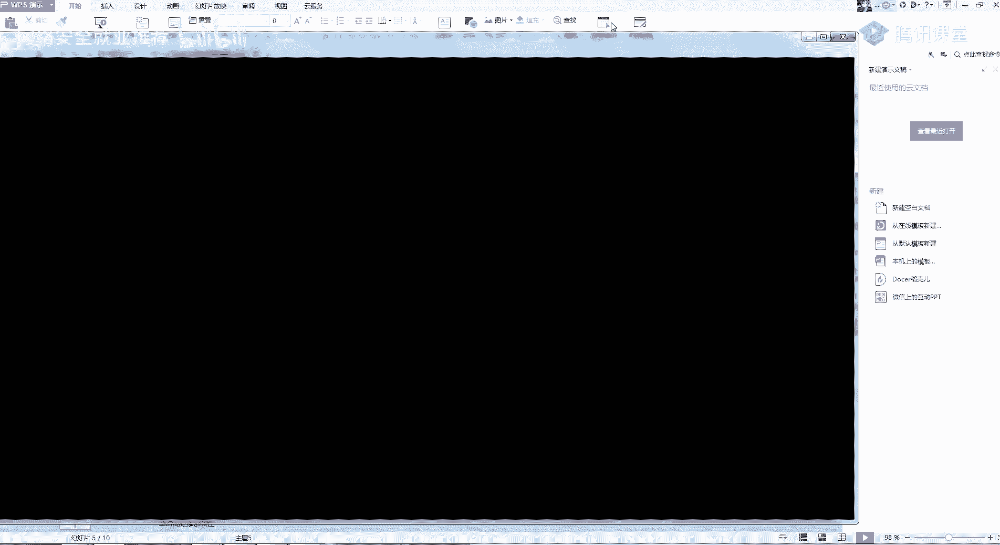
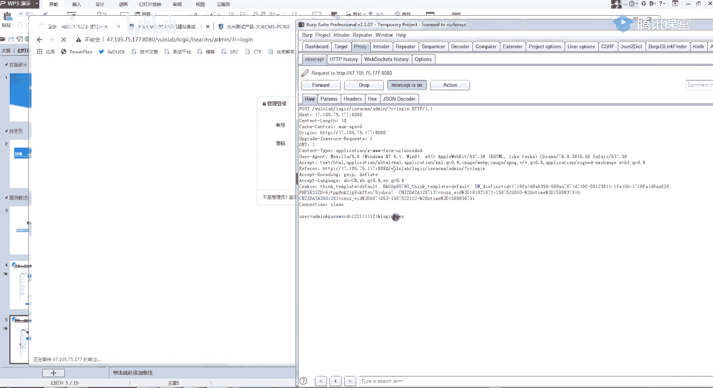
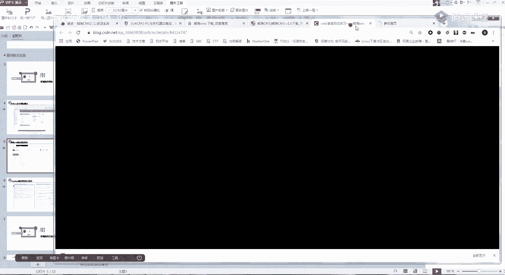
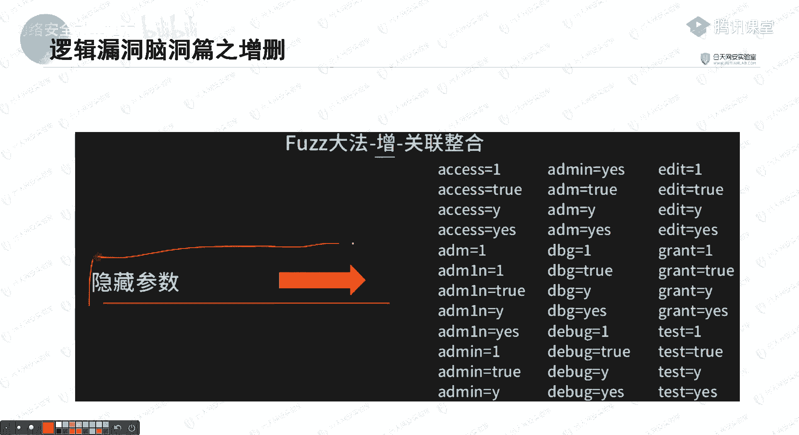
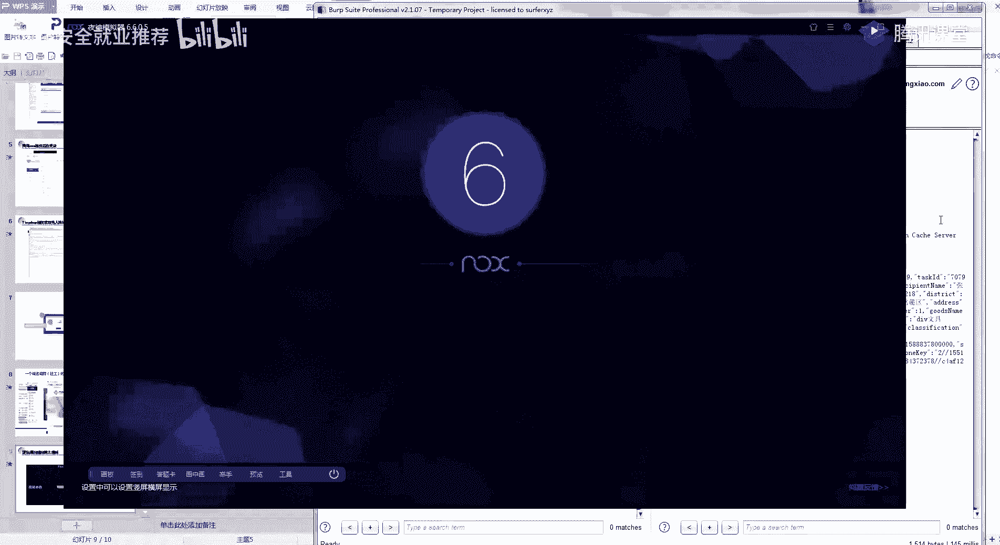
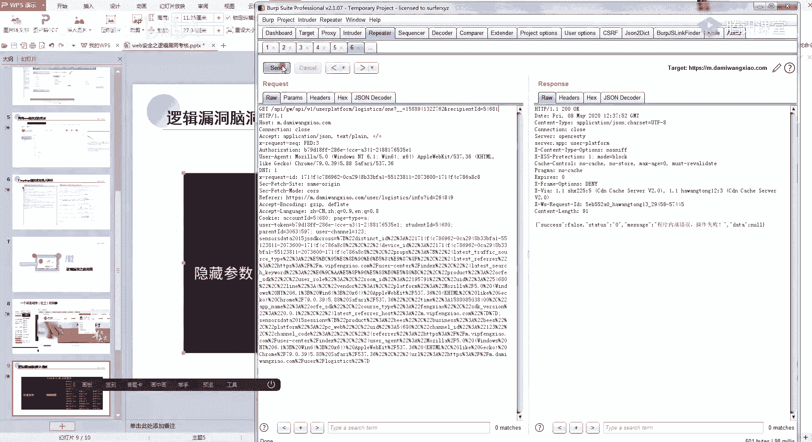
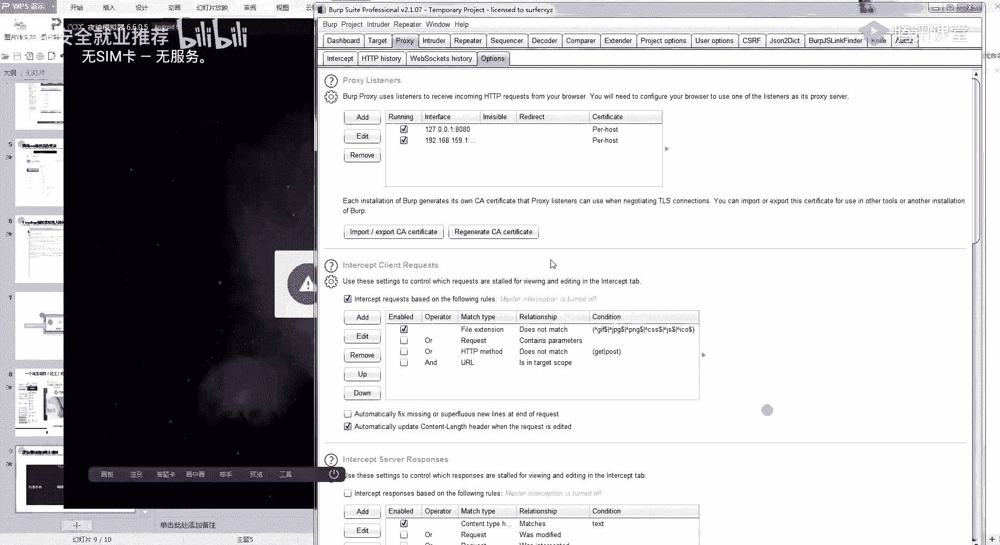
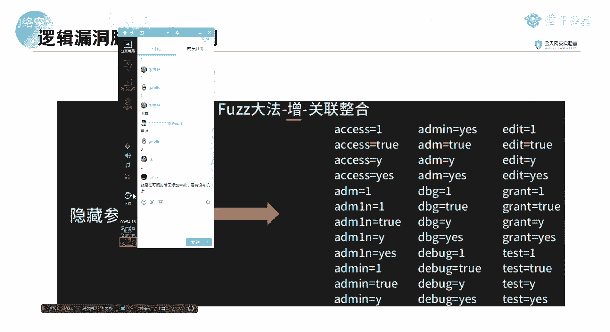

# 【B站最系统的网络安全教程】北大大佬196小时讲完的网安教程，全程干货无废话！学完即可就业，别在盲目自学了！！！ - P31：第29天：逻辑漏洞挖掘思路脑洞篇 - 网络安全就业推荐 - BV1Zu411s79i

哦还有一分钟吧。

开始今天的一个内容的一个讲解，今天呢主要是对之前的几个题目，进行一个简单的讲解，然后呢在后面我会讲完这几个题目，我会给大家看一点点，就是逻辑漏洞里面的一点点的一个脑洞吧。

或者是说我的挖逻辑漏洞的时候的一点点经验，也会给大家讲一下，然后大概就是分为两块，第一块就是一个考核的一个讲解，然后第二个就是逻辑漏洞的一个老动物篇，我们首先来看一下让你们做的那几个题目呀。

首先第一个是大米cm的一个，支付逻辑的一个漏洞，也就是这个这个大米cm，然后交这个作业的话，我当时就看到两个同学交了呀，你们没有做的，可以就是自己找时间做一下，然后把作业交给班主任。

我们先看一下简单的一个步骤，这里呢我是随便注册了一个admin的一个用户名字，叫，然后呢我随便注册之后，就去找了他的一个工程案例，就是它的一个产品，然后点击一个购买，然后呢。

这里在购买的时候就进行一个简单的一个抓包，这里说，然后呢就看这个包里面的内容吧，把这个数量一改为-1，它就实行了一个看到没有，就这个位置实行了一个赚钱的，就是昨天跟你们说的吗，变为了一个赚钱。

然后这里数量-1，价格6000就可以看得到，这个约里面只有12000，这里让我们进行一个简单的一个演示啊，首先注册嘛，你随便注册一个账号，注册账号，这不就不多说好，我们看一下，看一下注册账号之后。

它这里是一个购买的一个功能吗，然后在这里呢就会有一些产品展示呀，或者网站案例啊对吧，这些东西一般来说产品嘛就是在这个里面，然后我们首先看一下，随便点一个产品，5000多，6000多，应该还记得吧。

我跟你们说，所有的逻辑漏洞，基本都是基于一个抓包改包来的，这样我首先你就随便点一个购买嘛，这里也随便填，然后一定要记住啊，这里有一个付款的一个方式，因为如果是支付宝这种的话，没有配置。

然后这里呢就是选择一个站内的一个扣款，因为你想一下，如果是货到付款的话，他这个-1肯定也没有用，然后这里如果是支付宝的话，那肯定也没有用，那我们就选择一个站内的一个扣款，然后在这里抓包。

应该还记得我跟你们说吧，逻辑漏洞就在于你对这个包的一个认识，清不清晰，这里你们来听我说，你看首先我们看这一个包里面的一个东西，它的价格是5400对吧，然后这里是我的名字，这是我的电话。

然后这里有一个一肯定是一个数量对吧，然后这里呢就是它的名字，还有什么tap呀，这个id就是这个东西的一个类别，这样这样来看的话，这个包应该还是比较清楚吧，你看那我在这里把我的一改为一个-1看一下。

订单提交成功，查看我的订单价格，5400 -1，然后看一下在线充值，我要提现是不是就赚了1万，赚了1万块，那我们再再来试一下，就是除了，他这里呢除了购买这个价格，因为刚刚我们看了有好几个包对吧。

比如说他这个5400的包，我们再简单的试一下啊，然后我们再抓一个包，那我们是不是也可以继续改这个价格，我把这个价格如果改成一个-5400呢，行不行，试一下，你看也提交什么了，但是这里呢你可以可以看到它。

这里是没有发生变化的，然后再看一下我的一个价格，只要5400了，所以说这是我们在测支付逻辑漏洞的时候呀，他这里的每一个参数，你都可以定点的去测一下每一个参数，因为它有可能啊。

我这个价格的参数它是正确的做了判断，但是我这个数量又没有做判断，因为你可以看里面出的价格，还有数量，还有这个id，这每一个都可以去自己进行一个变换，所以说他这个支付逻辑漏洞就是这么简单。

只要会抓包改包就可以了，这个有没有不懂的，懂的话，你就扣个一，不懂我就继续问，好大部分的话应该是越比较简单了，你就这样转思路嘛，就是我抓包改包就ok了。

我在上传订单的时候抓包，然后改一个包。

然后我们再来看一下这个熊海cms的一个，劳动这里呢我觉得啊你们做的比较好呀，因为你们记住记得我以前讲过，就是发现一个cms去百度进行一个搜索，因为我这里呢主要是考逻辑漏洞。

所以我就只把一个月全给你们列出来了，然后我看有同学交的作业啊，包括熊海cms的一个四个注入呀，还有一些四个四个注入，还有一些其他的一个漏洞也都写在上面了，这一点思维就很对，因为我们挖漏洞，漏洞是怎么来。

你肯定要用不常规的思维啊，啊叫什么黑客的思维，能跟我们普通人啊，能跟普通人一样吗，肯定肯定要不一样对吧，想的要比较多，这里呢其实也很简单，我记得我是跟你们讲过，就是有一些cm s呢。

它是经过cookie这个位置呢来进行一个判断的，就是cookie里面的一个username来进行一个判断的，这个琼海cmos呢也是这样的，他这个熊海cms的一个判断就是。

呃首先我们来抓个包呀。

熊海神max，他这个cmos呢是一个后台的一个漏洞，我们看一下，首先我们来确定一个东西啊，首先要知道参数随便说，还是同样的，我跟你们讲过吗，逻辑漏洞一定要熟悉每一个参数，不管是逻辑的其他漏洞也都一样。

就是每个参数有什么用，首先第一个r等于log，是不是这一个页面就是叫什么去了，这个登录的页面，这个r得是一个位置，然后这里用户名密码这里就不用多说了。

然后我们先正常用一下用户名或者密码错误。

对吧，你看如果我在这里啊加一个username等于它的命，可以看到它还是一样的，没有用，那是因为呢我这里的一个我这里的这个位置，他一直调用的是这个longan的一个页面，那我们如果要跳转到后排。

是不是就要找一下后台里面有哪些参数啊对吧，就是有哪一些页面你可以看，这是他后台拥有的一个页面了，当然你可能会这样子跟我说，就是唉老师我拿着这个赞，我我怎么知道他后面有这些东西呢对吧。

首先我们拿到这个东西呢，听思路有两种办法，第一种它是一个cmos对吧，cm是什么呢，就是开源的系统cm s，什么叫cms，就是共享免费的开源的，那我这里第一种办法我就是去搜熊海cm，然后我去下载给它下。

直接下载一个源码，然后我们就可以看到里面有哪些目录了，就是你直接去把他这个代码给下载下来，然后包括你看这随便一搜都可以看到它，这里有很多的一个漏洞，自己去下载源码，对吧，你看这里很多。

然后我们随便下下来，随便下载下来就可以看到，就是在他的后台这里就可以看到它的一个源码，那我们这里呢如果我这里改个包，改成一点，可以看到这里就跳转了，他这还是跳转到登录的位置，我们这里呢就还是同样的。

先抓个包，随便数，u er吧，优势那还是uer去了，我都快忘了，看一下啊，username，然后这里改成，index它不行，那我就再挑一个这里啊，这里有很多，那我就再跳一个嘛，比如说它等于，wc。

还是没调整过去，难道是呃我们再看一下啊，要命，然后再随便选一个，改为一个get类型，试一下，还是跳转到弄的，那是不是这里是一个优势呀，不是usn，可能是我记错了吗，这里是user呀。

你可以看到这里是我记错了，我们再来改一下，登录，然后这里加一个uc等于a的命，然后呢这里再重新的选一个index吧，最常见的可以看到我直接跳转过来了，所以这一题呢也很简单，就是在这个cookie的位置。

在这个cookie的位置，哪里去了，嗯可能不见了，在这个cookie的位置加一个user，等于v的命在这里，这里呢就是第二题，所以其实逻辑漏洞都特别简单，这一题你们有没有什么想提问的，还是同样的。

你懂了的话，就扣个一，让我看一下好吧，不懂的我就再给你们讲一下，啊如果还是不会的呢，你就去叫什么呢，自己把这三个自己一定要去做一下，就是逻辑漏洞，只要你动了手，挖到挖到了第一个类型。

你就知道后面的该怎么做了，全部都是相似的。

包括昨天在给你们讲课的时候，然后我昨天又稍微去挖了一个。

也也还挖了几千块钱，你看积分又上来了，也就是简单的越权，我就跟你说，就是简单的我抓包，然后改个数值，发现可以变，那好ok 122000块钱就到手了。

当然啊就是你类似琼海cm s这种通过cookie修改的，很少很少见啊，很少很少见，然后我们再来看一下第三个，就是最经典的一个月权，昨天其实是跟你们讲过了的，就是这一个，嗯完了完了又点错了。

他腾讯正常这个设计的有点不科学，他这个画板，就是这个呢thing shop的这个收货地址的一个月权，首先是给你们讲过来的，其实这里呢就是跟你们说添加一个新壁纸，然后修改月全，然后我要跟你们说呢。

你们知道这些漏洞，这里这里这些漏洞啊，就是越权漏洞在哪，就在哪些地方出现的最多吗，其实是那个医院，医院你们懂吧，就是音乐里面可能会有很多的一个病患信息，然后通过一个查询一个uid的话。

医医院的几10万病例基本上全部都在里面了，发生过很多这样的事情了，医院还有学校啊，然后你们有没有用过那个超星，诶，你们有没有去用过这个东西，这个超新，有，应该应该大部分都用过吧。

然后啊我这里只提点你们一句啊，我不会给你们演示，就是这个东西啊，这个东西里面应该是有很多漏洞的，大概自己心里清楚就行了，以前是超星，有一个有一个月全的一个漏洞，可以遍历所有学校的一个学生的一些资料。

它的一个测试就是这么简单，就是抓个包，你比如说在某些地方啊抓个包，然后看到有一个id，然后改一下id就可以了，特别特别简单，然后呢其实今天的一个重点了，不是前面的三个考核啊，是要跟你们讲的一个脑洞片。

就是我平时挖漏洞的一些思路吧，就是因为你首先要记住一个点了，四个注入，它是不是一个增删改查，这个操作，然后逻辑漏洞你再仔细想一想，逻辑漏洞你是不是指做啊，就是只操作过这个改的操作，增删的操作都没有区别。

都没有去做过，其实逻辑漏洞里面呢还有其他多种啊，也都会有一个增删的一个操作，啊然后看我首先第一个案例啊，是我昨天给你们讲的一个社工的一个案例，就是脑洞片嘛，逻辑漏洞，大家一定要记住，不要局限死了呀。

不要局限死了，首先第一个要讲的是昨天的一个，施工的一个漏洞啊，他这里呢从这个who is看到一个域名的注册邮箱，这个东西大家应该还记得吧，就是我们站长工具可能就可以查得到，站长工具，然后查一个备案。

比如说我查我的和田，有点卡呀，他这个比如说查我们和田的一个公司，这里呢就会有一个域名的什么年龄啊，域名解析啊，就是一些，简单的一个信息，但是呢它还有一个叫who is的一个东西，这是插su。

然后我们看一下，这有一个枯叶子的一个查询，他可以查一个域名的一些备案啊，比如说查我们的一个，昨天你可以看到这里呢就会有一个邮箱，这是在哪里注册的，看到没有，这里是阿里云了嘛对吧，然后呢。

他这就是通过这个会议的查到了一个邮箱，然后再通过一个社工库的一个查询啊，社工库的话，因为现在有的要涉及到的可能要翻墙啊，可能要翻墙啊，今天有一个有一个稍微新一点的，就是不算收工库吧。

就是可以查你有没有一个密码泄露的，我把这篇文章发给你们，你们可以去查一下，就是可能会有一些泄露的密码，就是社工库，有些老密码，他自己的思路就是，通过这个邮箱对吧，通过这个邮箱拿到一个旧密码，然后呢。

拿到这个旧密码之后，大家应该还记得，我给你们讲了一个ig 007，这个，你可以查邮箱跟手机注册过哪哪些账号，他自己就通过这个密码了，然后去登录一些相关的一个网站，然后又获得了这个12126的一个邮箱。

最后呢就是登录到了一个百度云盘呢，然后就拿到了很多东西啊，你看这个身份证啊，还有什么素质啥的，什么东西都有，然后就通过这个邮箱这个密码登录，这个我们的一个阿里云系下的一个愿望，然后就把这个域名给劫持了。

这是一种比较新奇的一个词吧，所以要你们讲，然后就讲今天的一个重点，叫逻辑漏洞的增删的一个操作，他这个思路呢也很有意思呀，就是我在我在当时学的时候对这个是叫什么呢，我觉得对我有一个很大的一个启发呀。

首先第一个删除参数查看结果啊，我举个最简单的例子啊，你们还记得我在讲cs i f的时候吗，在讲csf的时候啊，包括拉和天啦，还有包括自己跳动的一些网站啊，是给你们演示过的吗，就是有可能的。

有可能对一些参数有可能是一个假的，就是不起作用的，一直在给你们讲和田的时候，是讲过这个位置的，你可以看一个数据包，首先看一个数据包，这里修改的时候，这里修改的时候，它是带有一个token的，对吧。

他只是带有一个token的，然后呢这个token正常情况下，我们看到一个token就可能会觉得哎，这肯定就没有csf漏洞了，然后你看完之后就会觉得我们如果把它删掉，试一下呢，对不对。

这就是一个三的一个操作，然后我们看一下这一个例子，这里呢是请求一个比较敏感的一个参数啊，一个比较敏感的一个请求，那然后他这里呢他把这个cookie给删掉了，标明了这里就是三的操作，把cookie删掉。

然后还是可以看到结果，那这个时候你们是不是可以有一个启发呀，啊还是用我们这个举例，因为如果它一个浏览器判断用户登录的话，是一个cookie来判断，对不对，就是说我们和田来做测试。

我是根据cookie来判断的，如果我把这个cookie删掉之后，这个包里面含有敏感信息，那它是不是就会存在一个未授权的一个漏洞，也就是说我们常见，然后未授权的话，那我这个参数可以任意修改。

比如说这是修改的包，那我是不是就可以达到一个，达到一个叫什么东西去了啊，越权的一个操作，然后我前几天的话，vip k的那一个高位基本上是跟这个类似的，就是我一个修改一个特别重要的一个地方。

我把cookie给他删掉了，然后这里我把cookie给它删掉，然后这个id的地方id的地方不变，go一下，它还是可以修改成功，那他就肯定存在一个月权漏洞，因为他根本就没有判断你有没有登录。

这就是我说的一个三的一个操作，那我们的一个添加的一个操作是什么意思呢。

添加的话就更有意思了，添加的话你要记住一个点嘛，就是这一个办法只适合于你啊，比较单点的渗透呀，不适合批量的一个挖洞，就是我们的一个数据包里面，可能会有一些隐藏的一个参数，隐藏的一些参数啊。

应该你们叫哪里去了，我想一下，有个例子嗯，啊这样应该你们对一个用字典跑目录。

应该是有印象的对吧，就是比如说我这个网站这里如果点不到的话，比如说我网站那个目录，它是有一些隐藏的一个目录的，那我这个参数呢，也是有可能会有一些隐藏的一个参数的，那我怎么测试呢。

首先第一个是要有一个字典，跟你们跑目录一样，是要有一个字典，然后你把这个字典你就放到bp里面嘛，然后你就把这个参数给他弄起来，然后翻一下字典，字典的话还是推荐你们一个字典。

就是我们也是我团队一个师傅的一个字典，是一个字典发群里以前也是跟你们讲过的，这一个字典里面呢就会就有一些参数字典，它这个参数字典呢就是，给大家看一下，这里面有很多很多的资料。

http fdr有点masfm，随便找一个呀，那我也忘记我的字典在哪里去了，有一段时间没有弄啊，call back，唉拿这个call back举例吧，应该大家还是有印还是有印象。

给大家讲的这个jason p的一个漏洞，首先我们看这个jsp，大家还记得吗，就是这个我给大家说过，就是这个call back呀，可能要自己是通过call back来判断的，那我如果遇到这种啊。

就是我们正常的一个这种这种js，那我是不是他要通过增加一个cob，增加一个call back才知道有这个jsp的一个漏洞，也是我常说的一个增加的一个操作，那我们这里就比如说我随便在这里啊打个问号。

然后写个一，然后呢我就把这个字典给它导进去，然后就把这个字典导进去，就跑一下，看一下他自己有没有什么一些变化或者啥的，记住要把这里点掉，它这里会有一个url的一个编码，然后可以看一下。

是不是看到有一条明显不一样的，那我是不是就可以确定，他这个位置有一个加上p的一个漏洞，这就是一个增加的一个操作呀，增加参数的一个操作，然后还有一些更有意思的一个这个隐藏参数，它怎么来呢，还是同样的。

再给大家看一下，一个v k的一个比较有意思的一个东西啊，他那个地方虽然没有漏洞啊，但是我觉得可以给大家这样，我们来看一下，嗯应该是物流里面吧，啊你比如说这个地方对吧，我这里有一个物流。

他这里就单纯的只有一个参数id，然后我们看这个包里面了，看这个包他是不是这一个啊，54680对应的是这里面的一个数据啊，对吧，对应的是这个，那如果我把这个copy过来改一下诶，你有没有发现。

因为发现很神奇的地方，它还是出来了，那我再加一个test id，另外他就是这个list这个里面的一些东西啊，我估计我把他们都删掉，应该也无所谓吧，没有，他自己就是一定要有东西啊，然后我再随便点开。

我点开一个看一下啊，这个地方它就有一个，打卡id等于2486，然后我尝试我在这里修改参数，然后我的参数是从哪里来呢，从这个json包里面看看，这里对应了一个54680，看一下不行，那我再尝试看一下。

通过自改id呢，通过这个id在这里进行一个修改还是不行，是哪个位置去了嗯，那我们再换一下其他地方，看一下啊，哦在那个人没有在这个位置啊，我想一下在哪个位置，他可能是在这个app上。

在app上，他的一个简单的思路就是我告诉你们。

那个漏洞当时是怎么来的呀，他那个漏洞呢，当时就是这里只有一个id的一个查询，对i d i548 ，然后我改一下，发现他非法都要用，没有办法实现，然后呢我就想一下，我这里面有这么多独立的一个参数。

那我能不能修改呢，就是比如说我这里修改成一个54680。

把这里进行一样的一个修改，然后我当时呢也可以说叫运气好吧。

当时就刚好他有一个student id的一个判断，然后还有一个family id的一个判断，我就取这个family那个student id，他直接做了一个限制。

然后他那个family id呢他没有做限制，然后就直接造成了一个月全拉了3000块。

我看一下，我看一下他们那个位置还可不可以啊。

那你是没有越权了，但是修改参数应该还是可以的，这里的话我就是抓了一个手机的一个包呀，看手机app的一个包，没记错的话，应该是3g1 ，嗯我换一个账号，好就这个位置，你看一下这个id啊。

他这里呢是通过这个final id来进行一个判断的，我们把这个final id在里面看到没有，那你想一下，我这里面有这么多，我把这个翻倍的id去掉了，首先去掉，看一下没有用，参数为空，那我再学一下。

我举这个student id，你有没有发现，我通过这个里面的这个student id，也是可以进行的，那是不是说明一个什么样的问题，我这里存在一个隐藏的student id的一个参数。

那我在同事查这个o o的，那还有没有，那就说明我们这里存在一个隐藏的一个，student tt的一个参数，那他有没有可能，这个student tt就可以进行一个便利呢，然后还有后面的一个。

你比如说有一个还有专属的啊，比如说他这里还有一个id，那他有没有可能这个id也可以进行一个修改，8820不行，所以说呢我们那个思维就是什么思，自己要思维要发散啊，不要局限于一点。

就是我诶我这些参数我可能没有漏洞，那我就不去进行尝试了，你只要自己去进行尝试，才可以发现更多的一些漏洞，所以今天的话要给你们讲的就是这几个思路吧。

另外要记住啊，这一个隐藏参数的一个方法是特别特别好用的，因为你要想一下，我为什么要把这个函数隐藏掉，然后这个隐藏参数别人是不是根本也找不到呀，那存在漏洞的可能性是不是就更大，好今天的一个课程的话。

基本上也就这样了，如果你们啊你们有什么不会的，现在继续提出来，就是哪哪一个位置不明白，对在可疑的后面添加一个参数，看有没有机会，因为你想一下，就是你不要参数，单纯的从月球来讲啊。

就是如果我既然可以添加参数，那我有没有可能这个参数也还可以设置注入呢，那我还可以啊，比如说csf啊，这种各种各样的漏洞都有可能存在，这是思维，包括你们是以后工作呀，包括以后工作在做渗透的时候。

脑洞一定要大呀，自己要想事情，呃还有没有什么想要提问的，还有两分钟，如果没有想问的，那我就直接下课了，然后你们可以在群里面一起讨论吗，群里面反正大家都自己人嘛，你遇到比如说你遇到哪个地方。

如果漏洞不知道想讨论的，你可以直接在群里面问，大家一起大家的思维嘛，大家可以一起讨论，每个人的思维都不一样，漏洞的有趣就在这里，这里每个人的思维可能会造成不一样的结果。

