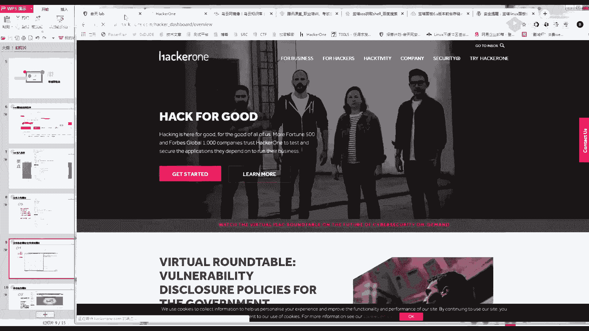
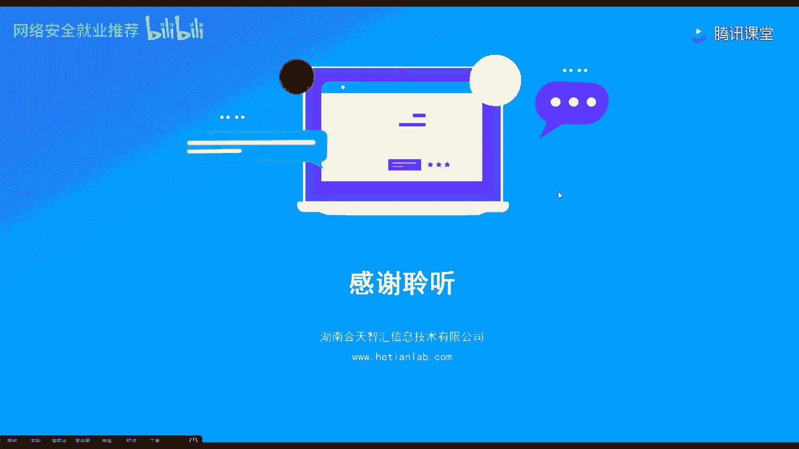
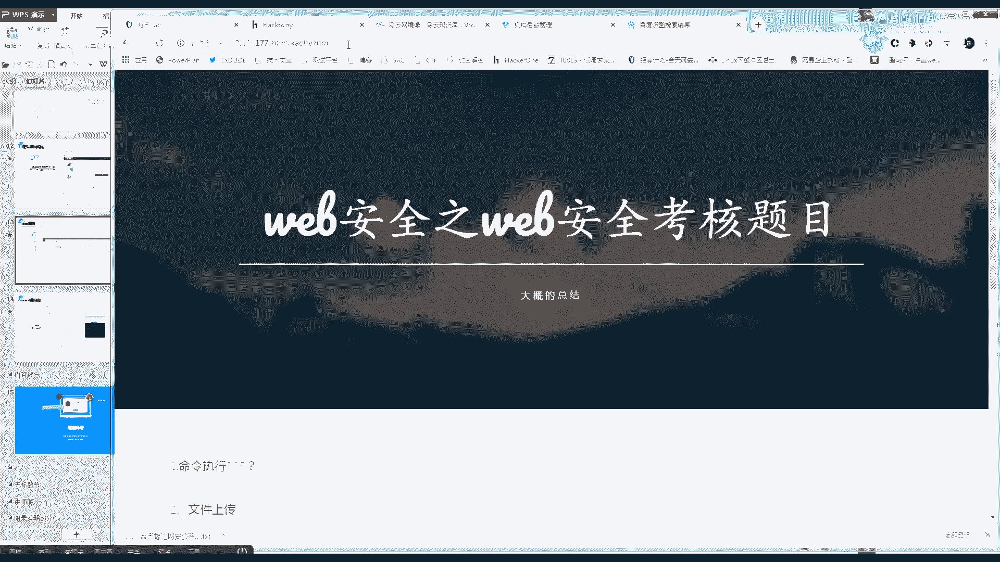
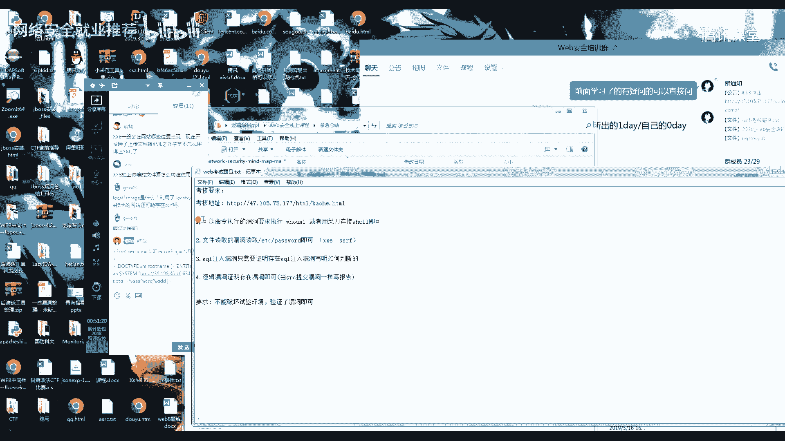
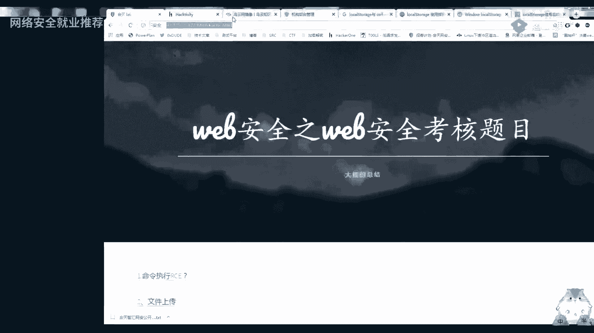
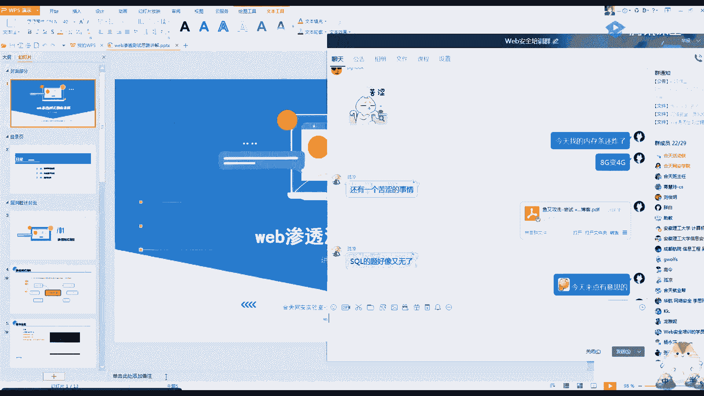
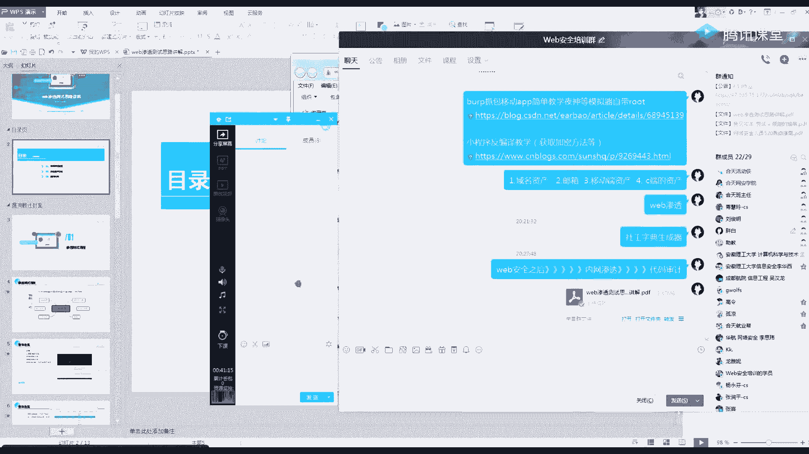

# 【B站最系统的网络安全教程】北大大佬196小时讲完的网安教程，全程干货无废话！学完即可就业，别在盲目自学了！！！ - P38：第36天：web安全思路讲解 - 网络安全就业推荐 - BV1Zu411s79i

已经上完了，然后今天的话我会把大家学的这一类的漏洞，就是一个怎么去寻找一个脆弱点，给大家进行一个梳理，虽然今天着重的一个点呢，就是在讲一个怎么去发现漏洞，嗯希望大家就认真的听一下，就是包括一些案例啊。

还有包括一些我的一些个人经验，我在找漏洞的时候，大部分都是我挖掘过的一些漏洞吧，还是无名的一些案例，再等一分钟吧，还是等一分钟，但是芭蕾开车八点了，然后就开始一个今天的一个内容。

首先今天的一个内容是主要是第2年了，第一点寻找资产的话不会多提及，就会稍微就是简单讲述一下我的一个思路，主要在第二点，今天的是一个学习重点，首先第一个啊我们在搞渗透测试的时候。

就是包括是微不安全的时候啊，这时候你要明确一个自己的一个目标啊，啊我学了这个会不安全，比如说我出去做项目，啊我出去做项目，我这一个目的是干什么，首先第一个还是确定一个目标，就是你确定这个网址是多少对吧。

然后我们的目的就是什么，尽可能的拿到他的服务器，然后再去内网拿数据，当然内网这一块的话跟我们微博是不太一样的，所以我们的课程是没有讲的，这样首先明确自己的目的是要进行一个get shell。

就是你出去以后工作呀，做项目，或者是包括做一些比较嗯私密的一些项目吧，你要不就是拿下，要不就是拿数据，这是什么项目，就不给大家说了，跟src的一个差距还是有很大的，然后这时候我们就开始。

这是最常规的一个思路，最常规的思路就是我首先我打开他的目标，去查找这个网站是不是有漏洞，然后在啊如果没有的话，就再去探测它的子域名，探测他的c段，探测它的一端移动app，探索它的小程序。

反正就是在移动端对吧，如果还没有，那我们就进行一个社工钓鱼的一个操作，这个思路就是最常规的一个渗透思路，最常规的，但是呢包括我们在互网，包括我们在做项目的时候，其实最难最难的点是这一个就是内网。

什么东西都不是事，你只要有一个特点进内网，基本上是完全可以录下来的，问题不大，但是最难的一个点呢，就是怎么去找到这个突破点，就是它的一个边界啊，在我们搞渗透的一个常规的方法就叫打点好吧。

打点啊你们应该听那种，比如说啊什么小偷打点什么也是一个意思，就是找到一个脆弱点，最难的是一个打点的一个操作，然后今天所以要给你们讲的一个重点的突破点，就是怎么去，就是一个网站摆在这里。

你怎么去查找它的一个边界，就是它的一个脆弱点，除了扫描器之外，我们更多的要知道自己一个手动的一个操作，手动的挖掘，以及一个扫描器，扫了之后，你们应该用aw vs用了这么久。

应该也知道很多太监是有一个误报的，aw vs相对应的话还是比较好的，一款扫描器可能还不是很多，但是如果用其他的啊一堆，比如说某些厂商的一些扫描器吧，如果以后你们工作肯定可以接收到。

他可能会报一些莫名其妙的一些漏洞，然后需要你自己去验证的，这里你首先要知道自己怎么去验证，我们从我们开始学习的一个漏洞开始讲起啊，首先第一个就是我们最好学的一个xss，对不对，首先xz大家一定要记住。

就两条，没有多的，就是除了多m型的呀，除了多模型的，一般来说反射跟你一个反射跟一个存储就两条，有框就差有编辑的位置就差，嗯嗯然后呢我们看一下简单的一个案例，这里呢是乌云的一个案例，然后这里符合这一条吧。

有编辑的位置嗯，他在编辑的位，编辑日的这个位置进行了一个插入，一个tx的一个代码，看到没有这个标题啊，什么东西，然后他就插进去了，这个是最常规的，然后反射xx呢，应该你们啊。

我也是给过一些你们的一个案例的反射差，它一般就是在一个查询的一个位置，或者在一个啊用户名安，或者一些其他的一个位置，应该你们猜一下子去挖掘的话，应该也是遇到了挺多的，就是比如说这里搜索的位置。

这里打码没打好呀，之前也是给你们看过的，打码没打好，有点小失误，关于xs s，反正你们就记住两条，有框就差有编辑的位置就差，就是你不管是什么变形，你就你插入一段插1x的代码，如果他弹了。

就肯定有没有就算了，这样是最省事的，也是最容易找的，然后拆c4 的话，一个一个来拆c4 ，有没有什么不了解的，就是就是你觉得可以了，拆开就可以了，你就扣个一，然后我就过了，觉得不行，你就扣个二好吧。

x x x如果进了s t公里啊，首先要给你们讲一个问题，h t t p only它并不是防止拆s，你懂吧，http only它的一个意思是为了防止xx里面的一个cookie。

就是我这里的一个cookie，我这里有个cookie，如果有http only对，就比如这个如果有http，那我的这个xx就获取不到它的一个值，获取不到这个这个字，你看它有htpo里。

但是你要这样思考呀，我们xss难道，启动了xss，什么意思啊，你这是，启动啊对啊，他就是启用了一个s t v n0 ，启用了hg o i，只是妨碍你获取不到这个值，但是应该你们还记得我给你们发过例子吧。

就是比如说啊xs最经典的一个，就是那个宝塔的tcs或者cl，这个，就是我们拆一些是你要有这样的一个思路，我们拆盒子，反正是调用前端的一个东西，对不对，就是我可以任意构造js的话。

那我是不是我不需要拿着他的qq，如果我xx就是给你们做c csf的时候，是讲过他这个前端是可以给你写请求的，就是让你控制这个浏览器的一个请求，啊那你是csf，如如果呀如果有xs s的话，它有htmi。

它是会降级，但是不是什么操作都不可以做呀，啊具体你可以去搜一下这篇文章试一下，就是xx，我们最常见的是跟一个csf进行一个组合，可以去了解一下，他开了htv里，你只是打不到出题而已。

啊关于xz还有什么要提问的吗，今天是一个最后也就两节课了呀，我给你们上的，明天还有一节课，不过之前跟你们讲群是不会解散的，随时你们随时都可以来提问来听，啊如果xx过的话，我就来讲sl了。

sc注入呢你首先要思考一个点了，就是我微博哪个位置，可能要跟数据库进行一个交互，然后我数据库常见的不也就是这几个吗，增删改查四个位置，对不对，数据库它常用的操作就是增删改查嘛，那你再想一下。

微博里面哪些位置可能会有一个增删改查呢，无非就是注册登录查询，删除更新无非就是这几个位置，对不对，那我们具体表现会表现在哪个点上了，就是最多最多呀，大家还记得，我给你们讲那个雷电的一个测试出路对吧。

最多的其实就是会出现在一个查询的一个位置，当然还有一个二次注入，是没有给你们深入的那个嗯，后面我找时间再给你们讲吧，这里呢要记住常见的一个这个输出点，就是在这个查询的位置，应该大家还是有印象的。

车库注入，当时是给了你们好几个例子，就是教你们怎么去找，你可以看这里包括乌云出现的这些例子，你看基本上都是出现在这个查询的一个位置的，查询，违禁他一个柱查询，这一个地方呢。

这个位置就是在这个学生的一个位置，学生姓名，这里其实就是一个更新的一个位置啊，你看到没有，insert intro写入的一个位置，应该说是，那这啊那我们的思路是不是就很清晰了。

如果遇到网上哪个位置有增删改查这四个操作，那我就去试一下，比如说我加个单引号，或者加个其他的一个判断字符，是不是就可以判断了，然后你再看医生修改，就是我们常说的一个更新，无非就是增删改查。

嗯三个注入的话，应该主要还是要靠大家自己去找啊，这个东西没有什么其他的一个技巧，好关于四个中路出现，你们继续讲，可以的话就扣个，一，不行的话就提问，就是我们在找漏洞的时候，要有这样的一个思路哦。

我哪个位置有可能会出现啊，会出现漏洞呢，就是哪个位置会用到那个，就例如刺客的查询的，这是一个注册登录查询，重点就是这个查询的位置，然后就结合手动的话，就是结合我之前说的一个bp抓个包，然后修改一下。

当时我真的就没什么其他的一个办法，包括呃和天呢，包括其他的很多地方，基本都是查询的位置出现过车的注入，我挖掘sc的话，然后开始给你们扩展一下一个文件上传，因为文件上传的话，可能你们之前现在很少了。

现在很少了，因为大家对这个文件上传基本上都有一些房，就是都有一些意识的，不能让你直接传shell，这种呢一般只有在那个后台，或者一些比较老的一些网站会有这种，你首先要思考一个。

我文件上传可以造成什么样的一个影响，首先第一点最常见的思路就传，就是这个上传cl，这个大家都了解，第二个上传html造成xz我也给大家讲过，但是第三个呢你们可能就了解的很少呀。

要记住文件上传是可以造成一个r c1 ，就是我们的命令执行，还有一个叉叉一漏洞的，这里呢给大家看一下一些例子，主要都是因为它一个插件的一个问题啊，首先最常见的就是上传这个shell。

这是比较久的一个站了，啊这是乌云的呀，记住啊，这东西看见就跑呀，测都不用测，千万不要千万不能撤，g o b，首先你要思考哪些位置，会有一个需要文件上传了，而我们常见的是不是首先第一个上传附件。

第二个上传头像，第三个啊，不说这三个就是你一切觉得有上传的位置，你包括上传视频啊，上传什么东西都是有上传的位置，然后文件上传的一个rc呢，大家可以去搜一下这个漏洞，imagine。

这个常见的一个rc就是文件上传那个rc，基本都是由这个东西来的，包括现在也有啊，包括现在也有啊，给你们看一下pg one，当时前段时间吧，前段时间还是什么时候去啊。

就出就出了一个这样的阿c，好像直接给了2万美刀还是多少刀去了。

不知道还能不能翻到啊，好像也有点时间了，呃也有点久远了算了。

你们去搜索一下那一个东西。

就是这一个我标红的。

然后我们和天玩实验室的话也是有这个漏洞，就是有这个实验的呀，大家应该那个账号的话应该还是没有过期的吧，有这样的这个时间，大家可以去学习一下，就是文件上传的一些另外操作，然后叉叉一的话，文件上传叉叉一。

待会的话我会在叉叉一的时候给你们讲，为什么会造成一个叉叉一个漏洞，今天大家主要是记住，记住一个就是了解哪些地方有可能出现，然后第四个漏洞就是我们的一个文件包含，或者一个文件读取的一个位置。

首先最常见最常见的下摆的一个位置，就是通过这个方面进行一个下载，然后如果只要它是通过分类下载的，你就可以去尝试加一个这个加一些，然后这个漏洞的话是很常见很常见的，任意下载文件包含很少见。

但是文件读取这个漏洞或者是文任意文件下载，这个漏洞是特别特别常见的，总有一些开发不注意，可以看到，然后你再来看他这里呢这些读取的一些位置，基本上都是它有一个地址啊，就是它可能是一个文件名。

你们注意抓包之后就注意看这些参数，它可能是一个文件名，也有可能是一个文件的一个地址，就是这些位置呢特别容易出现一个，文件读取的一个漏洞，这种大概应该还是有思路的吧，就是比如说我点一个文件下载。

呃当然和核电好像是没有这个功能的呀，嗯就例如唉随便搞这里抓个包吧，开个bp，就例如我的腾讯课堂，包括我挖到我挖到的这些文件，包含的东西基本上全部都是这个下载的位置，没有其他的，没有其他的位置。

全尼玛是下载位置挖到的，然后其他部分的话我就包含有是有，但是很少很少，要不就是代码审计出来的黑黑盒的话，全部都是这个文件下载的位置出来的，也是挖到过一些吧，不说很多，但是一些还是有的，1p我开一下。

啊例如这种啊，下载的位置你一定要注意啊，就比如说我这里它下载位置，它只有一个id的一个参数对吧，我这里是通过一个id进行一个便利的一个下载，然后就出了这一串，当然这里呢他可能是没有一个任意下载的呀。

这里我之前是教过一个漏洞的呀，这里是可以进行一个任意的一个下载的，有一些它是比如说它是直接下载一个，比如说他可能是这样干，e t c杠password这种包，遇到这种文件，你就一定要一定一定要敏感了。

挖漏洞全在于一个敏感，我看到这个参数觉得诶这里有漏洞，那我就觉得那我就去尝试，特别是下摆的位置特别容易出漏洞，这里呢还有之前给你们的一个乌云，乌云镜像，大家应该都是有的吧，大概就是如果我唉。

我不知道这个漏洞怎么去挖掘对吧，那我就去看安利，我看到案例，我就知道他大概可能会出现一个，什么样的一个场景了，看案例是最好的一个学习方式，你可以看，这里基本上都是一个下载的位置出来的，然后命令执行的话。

命令执行啊，这几个最常见的呀我基本都包括在这了，前阵子那个李四伟同学是挖了一个rc的呀，挖了一个命令执行的，就啊漏洞类型的话就在这个里面，所以说呢这里呢我没办法，就是因为它的种类特别特别多。

我只能给大家提到一个这个东西，或者把这个截图给大家，因为他的一个知识点含量特别多，还有一些包括新出的一些漏洞啊，这种都是需要一个知识积累的，就是我没办法给你速成，都是一个知识积累的一个过程啊，你可以看。

这个漏洞了，包括乌云出现了，包括乌云出现了，包括现在所有的出现了，全部都是基于这一个历史漏洞，包括我们挖的一个全部都是基于历史漏洞，没有什么新的，大家懂吧，你看乌云这里就是struts to。

然后这里又是一个四抓27，然后它这里又是一个微博能及格的一个反序化，反序列化，我给你们截图，这些点呢是叫你们自己去啊，以后的一个知识积累啊，要记住一个这样的一个点，我们里面有这样的一句话。

就是叫你知识点越广，你的攻击面就越广，懂吧，你的攻击面跟你的知识点是一个相对应的，这里也不多说废话了，大家去了解一下这几个，然后包括包括github上面，也是会有很多的一个插件的，别人已经写好的。

具体就不多说了，主要是给你们提点一下csi f的，我觉得我讲讲的很详细的，就一个点看数据包，按数据包，然后李四位同学的话应该也同样的，csf也是挖了挺多的，找个时间的话给你们做一个就是开一个公开课。

就是讲一下他的一些漏洞，文档的话我就不叫他提供了，因为文档怕流出去也会有风险，所以还是讲课比较好，然后csf大家还记得我给你们讲的一个重点，就是看数据包，看里面有没有token。

或者有没有一些自己不能构造的一个参数，好再来看逻辑漏洞的话，逻辑漏洞我也不会多讲，因为没办法，逻辑漏洞这个东西啊，是整个安全界以来，我觉得最难攻克的一个点扫描器，真的没办法扫出来。

因为这个跟程序员他的一个，它的一个设计逻辑有关系啊，这个是唯一就是唯一没有办法有特性的，你懂吧，唯一的一个重点，就是你知道可能会出现这样的漏洞，就是包括我以前挖掘到的一些漏洞啊。

就是后面自己去挖掘的很多，其实根本就是逻辑漏洞，根本上没有写的，但是我认为他这里就是有危害，然后就交上去，别人就说了，重点还是在于一个抓爆改化，啊你可以看这里的一些任意密码。

任意任意密码重置最多的就是这种啊，什么爆破爆破定制码呀，然后修改这种返回值啊，这些你可以看，诶我这个叉叉一直怎么过来了，卡bug了吧，等一下等一下等一下，不好意思不好意思，叉叉一，这个也太真实了。

没有听见动画，所以说逻辑漏洞呢，我是唯一没有办法给你们讲哪些位置可能有的，但是常见的常见的我上课全部给你们讲过了，就是我的课全部是给你们讲过了，你们如果还不会的，就去乌云看例子，然后看我的课。

然后再讲一个，现在特别特别容易出现的一个位置，就直接摆明了跟你说，通过这个上传excel，女性在外面很少是能翻到这样的一个文档的，外面很少很难翻到这个点，就是上传一个sword的这些位置。

就可能是在叉叉一给大家看一个例子，就是为什么会造成这样的，大家应该是有去，我不知道那个蒋老师给你们讲了没有啊，大家随便找一个差lsx的一个文档，就是你们随便建一个这个后缀的一个文档。

或者一个doc x的文档，你把它改成一个z a p包，应该就可以看到它这个呢其实是有一些差ml的，一个文档来进行一个构成的，那这里你是不是要想象一下一个流程啊，比如说我一个批量导入的一个过程对吧。

批量导入以前是挖掘过顺丰的一个批量，一个上传文档的位置，就是有个批量导入地址的一个位置，批量导入地址就是要打一个excel的一个文件，然后你要想他是怎么去获取，我这个excel文件里面的一个值啊。

就是我这个excel文件里面，他到底是怎么去获取里面的一个数值，他肯定是要解析这个xml对吧，那解析xml那是不是就很简单了，叉叉一的一个漏洞过程，是不是就是因为咋知道是啥框架。

这个呢也是根据一个经验去判断，你懂吗，如果你去把我开我群里给你截图的，这个你每个都去复现一遍，基本上就都知道了，每个都去复现一遍，不用你去其他地方和田，很多很多都有你，比如说我合同几个微博。

这个这个呢就跟你们说现在的大杀器，很多政府呀，还有什么全部都是用的这个东西，而且很多都有动，具体啊，不要搞事啊，还是一个前提，不要搞事，包括内网，内网也是最多的，继续回到我们的叉叉一。

等我把所有的漏洞讲完，再给你们进行一个解答好吧，前面的一个漏洞，你们可以先用小笔记记一下，就是哪些位置，可能我没听懂，我待会都会给你们解答，我们猜猜e是不是就很明显的一个点，它就是解析差ml的一个位置。

因为把我们的参ml代码解析了，所以就会，造成一个叉叉一的一个漏洞，所以我们要找的是哪些位置，它会解析这个xml，还是同样的，我要知道哪个地方有啊，有这个漏洞点，肯定就要先想到哪些位置可能会调用这个东西。

首先第一个就是我们的一个数据包里面，sp数据包里面它可能会有一个xml的一个地方嗯，我给大家看一下吧，如果我没记错的话，qq邮箱是有一个类似的一个东西啊，如果我没记错的话，因为有一段时间了。

怎么邮箱登录不进去，我是说内网啊，我没有说政府，没有说政府这种东西啊，大家就当没听见呃，之后再给你们看吧，因为你们在学习c的时候也是遇到过的吧，首先第一个就是解析xml文啊，xml代码的一个位置。

然后第二个就是这一个上传一个cl文件的位置，一个cl它是一个包含多个xml的一个地方，记住啊，这个东西在很多的一个简历平台，简历平台是有这个漏洞的，具体在哪里我就不说了。

还有一个最神奇的就是上传图片的位置，gp 1 g它也能解析参，还有没有这个案例呢，是一个哈克望的一个案例，我当时也是研究了半天啊，因为以前确实没有尝试过上传gp 1 g图片，它可以解析，猜有没有。

这都是一些姿势呀，压箱底的都教你们了，就看你们能不能掌握了，然后最后一个就是你们最近学的一个s sf，一个c f f它的一个漏洞点呢，其实就是一个url的一个位置，大家懂吧，s s f没有其他的。

就是请求url的位置，它最多出现在哪些位置呢，第一个啊头像可以看头像，然后第二个就是请求图片的url，请求图片的优雅，这个里面是出现的最多的啊，我那个a w s里面还有一个腾讯的一个s sf。

当然他那个不同内网他们不收，我不知道当时给你们没有忘了，然后这里呢你可以看360视图上传图片，因为图片是要有一个url的，对不对，就是比如说我随便找一个吧，比如说百度识图。

你看图片的url地址，任意需要粘贴url的一个地址，都有可能存在s s s f最主要是任意。

好然后基本上给你们讲了一个漏洞点了，基本都提，基本都提了，其实知识点说多也不多吧，说少也不少，大家有什么要提问的，大家要提问的，直接在上面打，会打出来现场解答，因为今天是一个总结课呀，一个总结课，啊。

然后要给大家提醒的一个点，就是我给大家发了，我给大家发截图，就肯定是重点懂吗，这个你们如果去掌握了的话，就会发现很多很多的一个东西啊，这是一个叫什么呢，教学的一个福利吧，今天这节课我也只标了30分钟。

然后你们有什么要问的，赶紧说啊。

好像你们在说的时候。

我把考核的地址发你们，xm xml一般会存在哪些位置，开始除了上传文件，转xml觉得不怎么用的。

上传ma对，这也是一个重要的点吧。

我觉得time ml，它只能在一个网站里面去看，就是上传文件要怎么构造使用，不是跟你们那个平时都是一样嘛，我一个一个来啊，这个我好像我也没去研究你发的这个，这个呃html 5中这个我是没去研究。

但是谷歌最近好像出了一个东西啊，就是谷歌最近出了一个东西，好像会把整个csf基本上把它给弄掉吧，具体我也没去研究这个，好我先回到他们的啊，一个一个来叉叉一一般会出现在哪个位置，给你们画重点了。

其实叉叉e我跟你说，最多的就是出现在这个上传的一个，上传xml文件的一个位置，然后怎么构造呢，怎么构造，我待会儿发篇文章给你们好吧，上传怎么构造，它这个构造其实是跟那一个叫。

跟那一个叫芒叉叉e是差不多的一个意思，我给你们看一下我这个叉叉e的一个标本，这一条是盲猜差一验证的一个plc，这也是我的dns龙给地址，给你们叉叉一等，那个基本上是一样的，懂吗。

你就是在xml里面插入你的plc就可以了，待会儿怎么构造，我会给你们发文章，这个不用提xml会在哪些位置，现在我说实话吧，xml用到的真的不多了，因为因为本来xml是一个主流的。

后来基本上感觉都是用js了，总体还是得根据这个网站去看，就是你网我网站哪个地方调用了，查有没有，我再去查，这个这个我是真没去了解，你这个属性这个属性的话，讲道理啊，用谷歌随便搜一篇，应该可能就会有的。

嗯看一下，主要是我记得谷歌他们新出的那个技术，不是这个东西啊，好像不是这个东西，但是但是想你，你想把这个东西给他普及过来的话，还是要感觉还要多久呢，起码十来年吧，没办法，现在普及就是这么慢，看一下。

他这里是说把图片放在这个里面，不会自动添加的sp请求里面，对如果他不会添加到actp请求里面的话，那它就不存在csf了，但是有个前提啊，要你用了用了这个东西，你得把那个叫什么东西去了呃。

你得把你里面的一个数值放在里面才行，它不会自动添加到ttp请求里面，把这篇文章调取，你，啊还有没有什么想问的，他就是用了这个技术，还是有可能存在csf的，全看怎么写，啊如果没有什么，如果没有什么疑问的。

大家一定要记住啊，去做这个考核，然后我把考核的一个要求发给大家，然后考核截止的话是到21号晚上，21号晚上，也就是说你们两天的时间进行一个操作，然后大家可以看一下我提的一个要求。

这次题目呢你们就是当时一个sc进行一个挖掘，首先第一个要求就是你不能破坏漏洞，首先我给大家讲一个要求，就是啊我个人觉得呀，只是我个人觉得我觉得在深度测试里面，首先最重要的一点是怎么去发现漏洞。

就是我了解它这个漏洞的一个点在哪里，第二个才是利用漏洞，大家懂吧，首先你要知道是怎么去发现漏洞，因为如果我发现了，那我肯定我自己去百度搜文章，说什么我肯定是能搞出来的，但是如果你会利用。

但是不会挖掘一点用没有。

大家仔细看一下我的这个，然后总共的话大概是。

八道题的样子吧，然后我们会根据一个平时的一个课程分，然后还有你们一个做题的，你们能做多少就做多少，很多都是你们上课的一个作业，大部分能做出来的话，基本上就会直接给你们发一个证书。

然后证书的前言里面也不用出，我们这边肯我们这边肯定是自己垫了，好今天的课程的话基本上就是到这了，我就下课了，然后明天的话还有一节总结的课，明天的总结跟今天是不一样的呀，明天会带大家了解。

就是我们日常的一个渗透攻击的一个行为，的一个整个流程，今天只是带大家就是一个怎么找微博里面学的，这个漏洞吧，好今天就大概就这样，还有一个大家要注意的一点，就是大家多去挖下s r c吧。

真的你们这一个学费很容易就挖回来了，包括李四伟同学，他开始也跟你们一样，开始就没挖到，后来他挖到第一个洞之后啊，就开始基本上是那一个星期吧，一个星期基本上钱就回来了，所以大家还是多去动手，多去实战好。

今天课程就到这儿了，对考的白字是4444的一个简单的一个思路，就是我们在做微博的时候，如果你遇到一个目标，他可能搞定不了，就是你常规手法是弄不下来的，你可以听一下我今天的一个内容之后。

再去看一下这篇文章，是可以给你们一些思路吧，就是，网络安全渗透，这个就是不要只局限在一个微博安全上面了，还有很多东西交给你们的，这个就不具体给你们看了，挺复杂的。

呃然后呢就开始还好吧。

开始今天的一个内容的一个讲解，就是一个整体的一个思路的一个夹角，昨天说了，最后今天呢应该也是一个知识点的，最后一节课吧，大家可以好好听一下，就是扩展一下里面的一个攻击的一个思路。

嗯首先我们主要讲的是一个简单的一个流程，然后还有一个边缘资产的一个查找，第三个呢就是一个资产的一个利用，就是利用这些信息能有什么作用，我们看一下今天的，首先看一下一个简单的一个过程啊。

跟你们讲过很多遍了，首先第一点就是确定一个目标，对不对啊，是我这里举例的目标呢，就是我们和天的一个自己的公司嘛，自己加不能搞别人家的，对不对啊，就假如我们要对，和天做一个完整的一个渗透测试。

那应该怎么做，然后呢我们首先最常见的大家啊自己要思考呀，搞渗透，还有包括微博安全，第一个我们要做的是不是都是一个信息收集，对吧，应该你们听我说过吧，就是信息收集，你收集的越多的话，信息收集的越多。

攻击的一个面积越广，拉下来的可能性就越大，常见的一些应该也是跟你们讲过的，第一个就是这些微博资产，c端的资产，移动端，微信小程序，客户端，公众号，员工信息等，最近还出了一些比较新的一个东西啊。

就是qq也有一个小程序，qq也做小程序了，然后还有支付宝的一个小程序，这是另外的一些思路，大家只要记住一个点，就是你收集的信息越全，你拿的东西就越多，待会儿呢啊刚好吧，昨天是哪天去了，大家呃。

有人发了一个信息收集，发了一篇圈内啊，圈内大佬发了一篇信息收集的一个思路吧，嗯我待会儿呢下完课，我就把那个文章发群里面给你们看一下，就是大家一定要记住啊，搞网络安全最重要的作用就是你思路不能说死，自己。

要有一个发散的一个思维，然后拿到这个针对目标呢，我们有几种攻击手法呢，这里呢我们主要学的还是这一个微博的一个渗，透，这一块，主要还是学的web这一块，但是实际实际上我们的一个攻击手法，还有很多种啊。

比如说鱼叉攻击啊，发你们的裙子里面有一篇文章了，鱼叉攻击的一篇文章，然后还有类似的一个水坑啊，路过式啊，社工零day等，零day的话，这里就涉及到一个代码审计的一些东西了，不只是vivo的零件啊。

还有还有很多啊，你比如说一个客户端的零件啊，比如说或者浏览器的零件啊，很多种自然也不给大家过个四级，就是晚安，竟然还是有很多很多东西大家要继续学的，我们就开始对我们的目标，进行一个简单的一个渗透，好吧。

这里应该也是给大家讲过的，通过这一个app的一个备案查询是可以查到，通过备案可以查到一系列的一个域名的，对不对，这里就是查到了和田的三个域名，应该以前也是跟你们讲过的。

然后呢我们再利用一个子域名的一个工具，像这里呢就是跑出了公司的一个ip，然后跑出了公司的一些域名，然后还有一些邮箱常见的一些信息吧，这是常见的一个收集的一个信息，然后呢我们再根据比如说这是子瑜明工具啊。

这个是wwp的，这个呢是我的那个提莫跑的，然后这里呢两边大概其实差不了很多呀，大概就是这个地址啊，我通过这个地址是找到了一个脆弱点的，就前阵子搞的一个吧，就前阵子搞的找到了一个脆弱点。

所以说我们在收集信息的时候呃，收集的越多，他找到退路点的一个问题就越多，然后除了刚刚我们的一个域名，域名跟邮箱跑完之后，是不是就可以看c段的一些东西了，这个呢也是给大家多次强调过的呀。

就是一个c段的一个东西，然后我们利用这个c段呢，就大概可以推出一个和田的一个域名啊，一些东西，就比如说这个地址嘛，这个网址肯定是和田的，然后我就可以去扫端口或者干其他的一个操作。

然后呢找到了一个黑段之后，大家要记住，我们要做的是，首先要看的是常见的一个未授权的一个端口，好，未授权的一个实验的话啊，我们我是跟你们讲的比较少的呀，这是一些历史漏洞的一些东西。

你比如说你随便去我们网上实验室做一下，做一下，比如说这些spring boot未授权，然后各种的一个未授权的一些漏洞，就是个人的一些知识点吧，然后呢就大概是这些东西，哦我这里没有列全了。

我那里有一个自己写了一个小笔记，里面是有常见的一个漏洞端口的一个东西，然后我就通过这里找到一个radio，这里是一个monster db，然后这里呢是我们8。99嘛，你可以看8。99。

这一个呢是我们自己公司的对吧，8。99，然后这里呢有一个vn c的一个东西，当然你们是没有接触啊，不知道这里主要是给你们讲一个思路，你首先要记住，就是我知道c段之后。

我首先要做的就是去扫一些未授权的一个端口，这个东西危害很大呀，包括不管是内网还是外网啊，很多很多的一个位授权，这东西是最容易找的，就是你随便想拉黑主角，就拿这些未授权去扫都可以少出很多。

啊然后呢我们要就是我通过这些业务啊，还有这些未授权之后，你想一下现在我们手里有什么东西，第一个是域名跟子域名，第二个就是一个，邮箱，第三个就是它可能有一些啊脆弱的一些，叫什么东西。

是脆弱的一些服务吧对吧，就有一些脆弱的服务，那我们现在要做的是干什么，是不是就通过我们刚刚的这些资产，就是我们刚刚找到的这些资产，对它进行一个定点的一个渗透，就是进行一个攻击，对不对。

然后我们主要要注意哪些东西呢，第一个是比较老的一个资产，这一点大概大家应该都知道吧，就是大概给你举个这样的例子啊，你比如说如果是啊，网络安全法没出来之前的10年，网站上是一几年是吧，就举10年以前的吧。

10年以前的网站，你随便找一个网站都有四个注入，就是你随便拿个工具扫一下，你都可以直接把这个网站给拿下来，就是有这么不靠谱，这里第一个比较老的资产是很容易出现漏洞的，第二个业务比较多的一个资产。

业务比较多的一个资产呢，就是嗯啊可能是他自己研发的，因为业务一多嘛，他毕竟程序员也是一个人呢啊，业务多的话就很容易出现一个错误，所以业务多的一个资产也很容易受到攻击。

第三个是给你们讲的最多最多的一个东西，开源的一个cms的系统，包括这次的考核，我一直给大家强调的，就是一个个人的一个渗透思路，遇到开源的，遇到开源的cms，第一个时间你要想到的就是去百度。

看他有没有什么历史漏洞，开源的cms，如果没有历史漏洞，就自己去进行一个代码审计，然后第四个呢就是一个旧的一个业务系统，这个是什么样子的呢，这个旧的业务，旧的一个业务系统是，举个例子吧。

就比如说可能会有一些这种旧的一个微波炉，几个呀，当然我底下也说了呀，因为它是一个通用的通用的一些插件吧，比如说web logic sync psp啊，这些东西，这个psp这种呢是用的最多最多的。

历史遗留的漏洞，简单来说就是历史遗留漏洞，然后我图的话，我是昨天也给你们发的嘛，就是国内常见的漏洞，包括src啊，基本上就是这些了，没有什么其他的一个东西，基本上都在这个里面了，历史一的漏洞。

啊然后最好用的就是就给你们举个例子吧，就是这个structo的这个漏洞还为不能几个啊，他们大概是在去年的时候吧，去年有人就是专门用在补天刷四抓四秋，跟我们弄几个这两个东西，一个月刷个几万块钱。

随随便便就是啊全世界的一个跑，也不说全世界吧，就是大规模的一个跑，就只跑这两个漏洞，不跑其他的，当然还有更多的一个更多的一些漏洞啊，你比如说一些oa啊，比如说一些oa的一个漏洞啊。

就是全是历史的一个漏洞吧，所以说搞渗透这一行业在于一个经验，就是你知识点越就是你掌握的知识越多的话，你渗透的一个思路就越多，当你看到就是当你看到这个系统看一眼，我就知道啊，他大概是个什么样的一个系统。

然后大概的一个功能，然后基本上就可以要什么思考一下，就可以去进行一个渗透了，到这个时候你基本上就是一个技术还可以的吧，技术还可以的，然后再讲一下一个移动的一个资产，移动端我是没有给你们讲的呀，移动端啊。

因为今天我的一个叫什么东西去了，我的一个内存条崩了呀，所以我现在用一个4g的内存条再跟你们讲，你可以看我这个夜视模拟器是根本没办法开的，一开我就卡死了，大概的一个思路呢，就是在这我把这两个东西破给你们。

大概的思路就是，第一个就是用bp抓这个移动app的一个包，然后啊测app就跟我们测vivo一样，去测他的vivo服务，然后去找漏洞，跟正常的测网站是基本上是一样的，第二个就是微信的一个小程序。

微信的小程序大家要记住是可以反编译的，而且一点难度没有，就是你只要用了这个小程序，你就可以把这个小程序的源码给拿到，至于怎么编译的，我这个上面都直接给你们了，直接贴了一个地址。

然后我去找我们和田的时候呢，我就发现一个很惊奇的一个东西啊，啊直接搜和田智慧，就大概只能找到我们的一个公众号，然后呢我去搜完实验室，发现也只能找到我们的一个公众号，后面后面搜了一个和田apple。

居然发现我们公司还有一个小程序，然后这个小程序上面的话，反正就是大概有一些问题吧，大概有一些问题，那我这里又找到一个突破点，除了我开始给你们的一个子域名之外，我在移动端的小程序这里又找到一个突破点。

啊然后你们这个呢可以点啊，其实现在src还有包括外面的渗透，很多很多都是出在移动端上面，你们如果感兴趣的，可以自己去学一下那些app的反编译啊，还有一些东西，当然啊都是以后就是以后里面的一个。

长远的一个发展路线吧，现在你们先把自己的webk学好就可以了，一个一个来，不要不要学的太多太杂，知道吧，然后再给你们讲一下，一个，就是刚刚我们再看一下自己手里的一个东西啊，自己再数一下手里的一个东西。

我们现在手里是不是有一个域名资产，就是子域名和子域名那个资产，第二个邮箱，第三个移动端的资产，第四个c段的资产，基本上前面的啊域名，然后移动端c端都是基于一个web渗透的，都是基于一个web的，对不对。

这里呢我们我就要给大家举一个，现在我不说多吧啊，虽然大家都一直在强调这个钓鱼，钓鱼钓鱼也很多人都也很多人意识到啊，钓鱼钓鱼邮件对吧，钓鱼邮件的一个危害，但是一个企业里面啊。

一个企业里面总有那么几个就是没什么卵啊，没什么安全意识的这种人，这种这种大家应该同意吧，再举个例子，就是我直接去贴吧，我去百度贴吧，好吧啊，我去百度贴吧遇到过什么东西呢，就是我直接搜那种身份证号。

身身份，学号吧，好也没用，就拿我就拿我学校来说吧，请我去学校的，就说一个身份证，你甚至都可以搜到，就是很多人的一些身份证号，还有一些学号，还有一些密码等，就是每个叫什么，每个地方总有那么一些。

就是没什么安全意识的人，这句话大家同意吧，包括你们身边的同学也一样，所以呢这个邮箱邮箱的一个钓鱼，永远是我们就是搞定点深后，效率最高的一个东西，好我们首先要做的就是第一个收集邮箱。

然后根据邮箱的一个组成规律，就是把这个公司的一个，有大部分的用户给弄出来吧，然后再发邮，再发一个邮箱的一个钓鱼邮件，这是一个思路，第二个呢是利用邮箱的账号，进行一个入口令的爆破，这个也是一个思路。

第三个思路就是利用邮箱账号去查询社工库，看能不能查出一些账号密码等东西，第四个就是你用这个邮箱去github搜一些项目，看看这个邮箱有没有一些泄露的东西，当然最常见的还是这个钓鱼邮件啊。

这也是为什么我特意把这个文章发给你们了，你们到时候去看就知道呃，一个真正的一个企业啊，当他有个成千上万人的时候，你就会发现其实打入内部真的很简单，然后钓鱼用用到的一个漏洞，主要还是一个pdf。

还有一个cl，还有一个c，主要还是这三种啊，当然当然了，最重要的还是代表一个免杀跟一个话术，免杀这个的话嗯，刘师傅的那一个森罗特斯那个课程是会教的，我们微博的话就专专注搞微博嘛，毕竟方向是不一样的。

当然如果想学的话，你们可以去看一下那一个课程表吧，就是我们那个深度测试课程的那个课程表，跟微博完全是两方面的一个东西吧，应该说，这个，很多东西完全是不一样的，就是关于内网的一些东西，然后我们再来看一下。

就是我刚刚说了这么多，点了它的一个邮箱入口令，大概是要怎么样呢，就是你的邮箱绕口令，你不能弄得这么死啊，你的思路不能局限在top 100，top 6000这种绕口令啊，不能局限在这种上面了。

就是你要做的，首先第一个是我自己组成一个邮箱，你比如说他利用姓名，top 500进行一个邮箱的一个组成，然后第二个呢你要做一个做一个什么邮箱呢，作为一个弱肯定弱口令的一个字典，首先top 100。

这是百分之百要的，然后你再想一下，别人常见的常用的一些绕口令啊，我就举个例子吧，你们有没有用过，比如说自己的一个姓名，然后加123，或者是利用生日呀，或者利用手机号这这种的一个这种的一个密码。

应该是会有吧，或者qq啊什么的，应该是会有吧，那这里呢就是我们在爆破邮箱的时候，你可以自己这是你自己看自己的一个思路吧，自己去做一个绕口令，然后你网上随便搜就是搜rock啊，rock令生成器。

你随便搜一下一些弱口令生成器啊，然后什么社工社工字典生成器啊，这种东西，永远都是一个定点的绕口令，永远要比你瞎鸡高啊，就是瞎鸡儿跑要好，效率要高，然后通过邮箱入口令的话，你可以看到很多很多东西吧。

很多很多东西，包括啊包括自己公司以前也是有的，就是我们以前做排查的时候啊，比较过分的就是跑出了跑出了一些吧啊，特别是那些小姐姐呀啥的，特别喜欢用那种入口令，然后第二个钓鱼攻击。

这里呢我还是拿我发给你们的那一篇做一个，首先你要做的是收集邮箱，然后呢它这里面有一个伪造邮箱的一个操作呀，伪造邮箱的这个，同样的这个申论测试课程里面会讲，这里呢我稍微给你们提一下。

然后再给你们看一下它的一个它的一个主题吧，就是我们在做这个邮箱的时候一定要记住啊，因为我们是一个定点的一个渗透，定点大家了解是什么意思，就是我给你一个目标，你明确这个目标了啊，就举个例子。

你比如说我们要做的渗透是做一家化妆品公司，那你如果是化妆品公司的话，那你就要想我们的话术应该怎么样，就是我发什么样的邮件给他，他会自己接受，这里大家可以思考一下，然后你可以在弹幕上面敲一下。

就是一些思路吧，比如说我如果要做，要对一家化妆品公司发一些钓鱼邮件，你们能想到一些什么样的一个话术，哦对这个东西不能特别那个假啊，还是你们自己你们也别打了，还是自己去自己去思考。

很多东西都是自己需要思考的呀，收集邮箱这一个我也不用多说，大家啊，大家这个能力应该还是有的，我相信毕竟搞了这么也学了这么久了，怎么去搜邮箱，然后这个伪造邮件呢，是一个比较麻烦的一个事情，还有一个免杀。

当然只要自己学的也很快啊，主要还是围着我先给一个免，就是过杀软，然后其实这里可以给你看，它只有30几个c，他这排到了31，这里11开始就是20拍，所以你你想一下，如果我们是打微博的话。

你如果你想把20个网站下来，还是这个公司的大概一个难度，大家应该也能猜得到吧对吧，就是你如果想搞20个站，但是他这随便发一个钓鱼邮件，他这里直接就拿下来了，拿下来了20台电脑。

大概一个差距大家就可以看得到，然后实验室的话，有一个简单的一个钓鱼的一个实验，大家可以体验一下。

嗯然后我把这一个鱼叉工具的这个模板啊。

的一个给大家看一下，这里呢是我们的一个互网行动的，一个当时的一个东西啊，不枉行动的一个东西，啊互网行动是个什么东西，我简单给大家讲一下，就是嗯每年大概这个时候吧，每年大概啊可能是今年疫情是推迟的呀。

一般可能是4月份开始，4月份到6月份之间，国家的话会举办一个互网行动，就是让国内的这些黑客呀，就是在公安那边去攻击我们国家的一些，重要的一些公司吧，你比如说啊石油啊，石油电网啊，这种公司。

去年的去年的去年的一个情况，我去年打了呀，去年给你们简单的讲一下一些简单的一个结果，就是两桶油，大家知道吧，就是石油石油跟那个石化，中石化跟中石油吧，两家全部都沦陷沦陷了，然后包括顺丰啊。

还有包括什么国家，大部分的一些公司基本上都沦陷了，你可能扛得住微博攻击，但是扛不住钓鱼，你看他这里呢就是他假装是领导发的一个通知，就是给你发一个补丁文件，发过去，它的一个代码执行文件，然后呢。

实际上他这个一键修复的补丁就是一个码，就是一个木马，然后他这后面的话，这整篇文章后面写了他一些是怎么秒杀的，然后一个免杀的一个思路啊什么的，这里呢因为也比较复杂呀，没人自己感兴趣的就自己去看。

另外不要乱传，就是自己看就得了，包括这里面很多的一个技术跟微博完全是两块，然后要给大家讲的就是，基本上技术讲解也就结束了，然后大家要跟大家讲的是一个微博安全之后，恢复安全之后，还有一些内网渗透。

然后代码机大家不要学完微博安全之后，你就只看这一个，如果你想变强的话，后面的内网渗透，还有代码审计，这些东西都是需要你们自己去进行一个学习的，啊对于今天的一个内容，你们有没有什么想提问的。

然后因为本来只有半个小时，就给你们五分钟的一个提问时间好吧，有什么想提问的，就直接在上面打，这个ppt的话我待会会发群里，另外还是提一句，就是如果大家对这个渗透测试啊，就是学完微博安全之后。

对渗透测试感兴趣的，大家也可以稍微看一下，因为要给大家讲的是，我们后面的一些为保安全课，都是基于这个课上面开的，也就是说你们买了一次之后，后面的课程全部都是可以进行一个学习的，如果你们没有要提问的。

那我就直接下课了呀，今天主要还是给你们讲一个思路啊，嗯好，那我就直接下课了，有什么以后有什么问题呢，大家可以在群里说。

