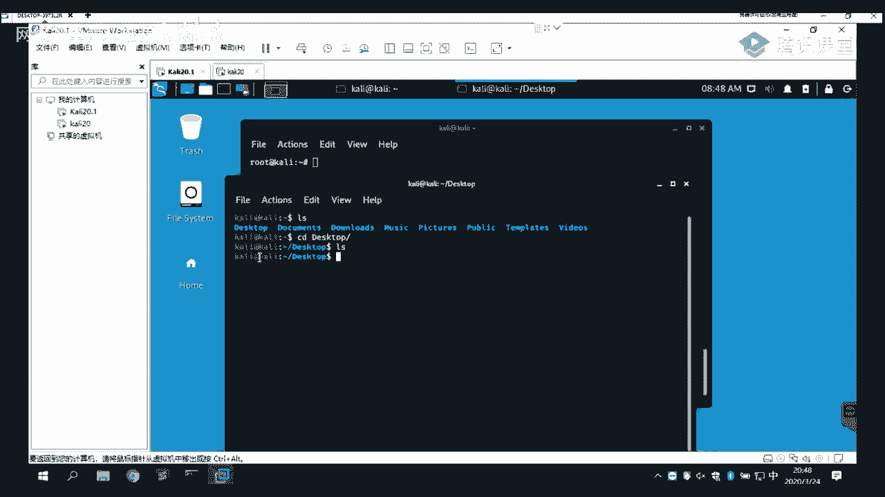

# 【B站最系统的网络安全教程】北大大佬196小时讲完的网安教程，全程干货无废话！学完即可就业，别在盲目自学了！！！ - P3：第1天：Vmware安装及kali虚拟机安装 - 网络安全就业推荐 - BV1Zu411s79i

第二期的一个web安全培训的第一节课呃，首先的话欢迎大家来到和田智慧进行一个呃，web安全，web安全的一个学习吧，然后的话呃我也不多说其他的话了，就大家应该也有，就是我昨天的话呃。

汉白是不是应该跟大家有讲，我们课程的大概的一些内容对吧好，这里的话已经写得很清楚了，我们接下来呃接下来的一个多月的时间的话，会按照这样子的一个课程大纲，给大家做一个课程的一个讲解。

然后的话今天的话我们首先的话是，我讲解的是一个web安全基础的一个环境搭建，以及一些基本工具的一个使用，首先我们先一起来看一下，我们今天的话主要讲的话是一个www，安装卡里以及windows系统。

然后呃在环境准备这一个课程内容的话后，稍等一下，忘记录屏，在环境准备这一块的一个课程内容的话，我主要的话分为了这四个，首先第一个的话是一个vmware的安装，看你以及windows，这是一个呃，我们。

从事安全人员必须要去学会，也就也是一个基基本要去掌握的一个东西，这个的话是一个l a m p以及ph study，一个漏洞靶场的一个部署，第三个的话是一个java以及python环境的一个安装。

这两个呃，环境安装的话，是我们在之后讲课的一个课程内容上，会使用到呃很多的一些工具，这些工具的话就需要这样的一些环境，意思的话就是一些呃常用的一些呃，我们在进行一个web安全测试的时候。

会经常会使用到的一些工具，比如说map sc map以及bp的一个安装，然后今天的一个课程的话是讲的是一个vim 2，安装candy以及windows，首先的话呃。

大家对rewell应该有一定的一个了解吧，刚刚的话群里也有人在，再问就是说这个ww，以及看梁装相关的一些问题啊，啊这里的话www的话我就大概说一下，它是一个呃虚拟化的一个软件。

比如说我们在啊我们可以通过这个软件的话啊，因为我我这样的话是使用的是一个呃，win 10的一个系统对吧，就是说我这一个机器的话只能使用这一个系统，但是的话在我们实际啊。

就是说我们想要做一些其他的一些内容的时候，比如说需要使用到一个linux的系统，或者是说需要使用到一个win 7的一个系统，这个时候的话，我们就可以通过这个www的一个工具来安来安装，呃。

其他的这样的一个操作系统版本，来进行一个使用，这样的话它的一个官网是这个，这电话，大家不要找错了，是这个www。com，这是它的一个官网，然后的话我们要去下载它的这样的一个软件，的话。

是好在这里有一个download，然后我们需要选择这个workstation pro。

选择之后的话，他这里有这样子的，可以看到有这里有两个版本，最新版本的话就是15：10，5。5。2的一个版本可以看到在这里它有，就是说在windows上面使用的，以及也有在linux系统上面去使用的。

这样的一个vr软件，然后我们要下载的话，在这里啊，这里有一个donnload free chwindows linux，我们可以直接点击，然后的话他就会去进行一个下载。

然后的话我这里的话就已经在进行一个下载了，不然的话我这里的话已经下载好了，我就不去下载了，然后我在群里的话有给大家发了一个呃，发了两个，发了一个文件里面的话就是呃两个百度网，百度网盘的一个链接。

就这里面的话我已经下载好了的，就说有一个canon linux的一个好www版本的，以及有一个ios的一个镜像，还有的话就是www 15。5。2，也就是刚刚那个最新版本的一个啊软件。

以及一个破解的一个工具，都在那一个压缩包里面，然后下载之后的话，我们需要去进行一个安装，安装的话其实呃安装的话就比较简单，就常规的下一步下一步就ok了，这样的话我就不多讲了，然后的话安装之后的话。

因为www的话它是需要一个它是一个收费软件，就说它是呃，当然的话你这里去下的话，我们可以下有一个免费使用的一个版本，当然的话呃就是有一些呃高级一点的功能的话，它是无法去使用，以及它是有实现的。

所以的话呃我们的话对它做一个破解，破解之后的话，能够得到它完整的一个功能。

这样的话呃，我在我这一个机器上面，给大家做一个基本的一个操作，我的话已经下载好了，那个win ww的压缩包，里面的话就是这两个文件，我们直接进行一个安装，安装的话可能需要稍微等待一会儿。

呃其实其实之前的话我是已经安装好了的，就为了如果给大家演示这样的一个过程的话，我是重新下载了之后再给大家进行一个安装，这样的话点下一步，然后接受许可，下一步，这样的话我们根据你自己的一个需求。

去更改它的安装目录，我这样的话我呃建议的话就是这种软件的话，还是不要装在c盘，c盘在外面是系统盘，就你装一些这种软件的话，如果你软件越来越多的话，你的系统盘空间不足，会导致你的一个系统会越来越缓慢。

就没有没有足够的硬盘空间，去进行一个系统的一些加载，以及系统的一个运行，所以这里的话我选择一个d盘，d盘的这个目录，我在这里新建一个文件夹叫bru，下一步进行一个安装，这里的话呃，可选可不选。

这里的话哦，我都不选嘛，然后下一步，然后的话直接安装，安装的话还是比较快的，呃大家可以就是如果提前下载好了的话，我可以跟着我一起进行一个操作，刚刚的话也有同学是使用了一个12版本的。

一个啊dream well，就12版本的话已经太老了，就是有一些功能啊，还有一些啊特性的话，它是更新版本的话不一样，所以说我建议的话还是使用新版本，而且啊不会有以前版本的一些bug什么的。

这里的话是呃我使用的一个另外的一台机器啊，使用啊一个team vr去进行一个远程连接的，因为我自己本机电脑上面的话是已经啊。

已经有安装的，然后我有安装了很多的一些环境，所以的话我就另外去拿了一台电脑，进行了一个进行，给大家进行一个操作演示，然后这里的话已经安装完成，安装完成之后的话，他这里说要求你输入许可证。

我们这里的话先不输入，点击完成，点击完成之后的话，我们这里有一个p卷这样子的一个破解软件，我们把它复制到我们的一个呃安装目录。

这时候的话我们只呃双击执行它，执行之后的话，它会生成这样子的一个，是一个激活码，然后我们打开，打开之后的话，我们在这里可以看一下，就是关于这一个诶，这样的话已经哦我之前的话。

因为之前的话是已经有安装激活过了，然后这边的话是一个许可哦，如果你们，你们那边应该是会要让你输入许可证的，我们这里直接输入一个许可证，就直接从这里复制复制过来，粘贴过来，就然后点击确定，然后就可以了。

key吗，呃这个key的话，用这个工具去进行一个生成就可以了，我我在那个我在群里发的那个环境准备的，这个文件里面有，你们去下一下那个rewell的那个压缩包吧，然后进行一个安装，哦哦这样的话我已经有了。

我先把它给移除，好这里的话就是安装之后，安装完成之后的话就是这样子的一个界面。

然后的话在我们去进行一个看你的一个安装，之前的话呃，大概给大家讲解一下，就介绍一下什么是k就看了linux的话，它是一个基于低变的一个linux发行版本，就是说我们去死啊。

经常会去使用到这样的一个卡尼尔，因为它的一个最大的一个呃优势，以及它的一个特点的话，就是呃它包含有数百种web安全以及渗透测试，相关的一些工具，我们可以直接在这样的一个linux系统里面。

去进行一些工具的使用以及操作，而且它是它的一个目的，就是啊用于高级的一个渗透测试以及安全审核，就说我们而且的话，它是一个完全免费的一个linux系统，而且它也支持支持中文，就是说我们呃经常会去使用到。

这样子的一个系统，这样的话详细的一个工具列表是在这个网址呃，发出来。

它包括有600多个渗透测试工具。

我们可以大概来看一下，呃我这里网速稍微有点慢了。

然后这里的话是一个pad list，它的一个工具列表，里面的话有它所包含的一些工具，以及他的呃一些详细的一个介绍以及用法，大家可以去看一下哦，因为里面的话工具相当的多。

然后的话我们在介绍完什么是看你之后的话，我们一起来，然后接下看你的一个安装，首先的话我们需要安装哦，不首先的话我们需要下载它的一个按钮，linx系统，它的一个网址是这一个，我们直接，搜索一个ky。

第一个就是这个网址点开点开之后的话，我们可以看到这里有这在这么一些呃，可供你下载的一个版本，然后呃就是新版本的话，他这里给的这些新版本的话，它不像之前有那么多的一个呃版本了，因为新版本的话它取消了。

就是说他没有对特定的一些桌面，比如说什么差分啊，还有啊金nora，还有kd e等等的这样的一些桌面系统，他专门做一个这种的一个镜像供你下载，它已经取消了，就是说他这里只给了这样的啊。

比如说这种第一个这一个看点，历史64位的一个安装版本，然后32位的，还有的话就是实时运行的一个版本，就实时运行的话，就是说我们可以把它放到一个u盘里面好，我们可以直接通过一个u盘来运行。

这样的一个看你系统，以及还有一个net install，net install的话就是通啊，就是在线安装的一个版本，所以说这里的一个啊，它的一个大小的话是最小的，因为啊很多的一些工具的话。

它是直接通过这个软件在线下载安装到你本地，而这里的话是已经有集成的这样的啊，很多的一些工具以及一些，工具的一些资源都在这一个镜像里面，所以的话他呃稍微会大一点，然后下面的话就是有提供啊。

一个www版本的，一个看，然后在我发给大家的这一个呃，要说这一个百度网盘的话，有包含这样子的一个，这样的一个压缩包我已经下载好了，放在那个里那个里面，然后也有一个安装的一个iso的一个镜像文件。

是64位的，大家有需要的话可以去下载我那个压缩包，也可以在这个官网去进行一个下载，这样的话官网的话可能输的话会稍微会慢一点，因为它里因为它是一个外国的一个软件，奥特曼。

还有支持这种white books的一个版本，完全books，它它也跟vivo它是一个类似的一个虚拟化软件，呃就这一个，它的一个下载之后的话，它的一个格式的话是一个ova的一个格式。

就其实呃跟ww呃类似吧，当然的话它的它其实也有差别的，那常用的话就用bb就足够了，然后下面他也有提供其他的一些版本，比如说在一个m系统上面的一些镜像，以及啊，还有就是每周都有更新的这样子的一个镜像。

可以去进行一个下载，哦我下载的话，我这样的话就不下载了，因为我比较大了，而且的话下载的话会比较慢，我在的话已经下载好了，在这个，下载好了，在这里，就如果大家要呃自己去进行一个安装。

就说用镜像去进行一个安装的话，就下载下载这样子的一个镜像啊，如果大家不想去麻烦，就嫌麻烦，不想去进行一个一步一步的一个安装的话，可以下载这样子的一个www的一个版本，就这这种的话，我们直接可以啊。

双击打开这一个点，闭幕x结尾的这样的一个文件，如果你安装了一个ww啊www的话，双击之后的话会直接打开，打个招的话，可以直接在ram里面开启，然后这里的话哦还要注意一点的话。

就是呃新版本的2020版本的话，它是取消了一个默认的一个root用户，就之前那一个版本的话，它是呃之前那个版本的话，就是你安装之后的话啊，使用登录的时候也是使用的一个root用户。

当然用root用户的话，它的一个方它是它的一个方便性，是比不用root用户要方便的，就我们经常也就是使用的话，也会去使用到一个root用户，使用note用户去进行一个登录的话，他是一个不安全的一个措施。

所以的话在新版本的话，他有进行一个这样的取消，取消了用root用户去进行一个登录，这样的话给了一个默认的一个用户是卡里，密码是卡里，嗯安装步骤的话，我待会给大家演示，大家也可以看一下这两篇文章吧。

就呃他们的话写的也很详细了，哦哦这样的话我先给大家就是讲一下，就是说呃直接用这样的一个www版本，怎么去进行一个使用。

就我们直接打开之后的话，我们直接开启就ok了。

直接开开启这样的一个虚拟机，开启之后的话会到这样子的一个界面，我们选第一个。

然后的话它会进行一个启动，启动的话可能需要稍微等待一会儿。

然后这里的话已经启动完毕，启动完毕之后的话，我们需要去进行一个登录，我们首先的话可以试一下，使用root用户去进行一个登录，因为之前版本的话，如果大家去也要去，有去使用到使用过这一个看点的话。

是可以直接用root用户去进行一个登录的，这里这里我改了密码，因为我之前的话已经是那个了。

这样的话是我就是本来的话，默认的话它是使用的一个卡里用户。

我这里先用擦脸谱，是我卡里卡里这样的一个用户，去进行一个登录的，然后呃如果大家有去进行一个操作的话，就说你只能去使用到一个，看你用户去进行一个登录，你用root用户登录的话会报错。

然后你登录进去进来之后的话就是这样子，就是之前呃如果有接触过的话，就是像这样子的一个样子，然后大家要注意的话，呃就可以看到，就如果说之前有使用到的话，如果是使用一个root用户去进去，进行一个登录的话。

他都这样子的一个host，不是name，它是会显示为红色的，而这里的话因为默认的话是使用那个卡里，所以它这里显示的为红色，我们呃刚刚有看到，就是我切切，我去使用一个root用户去进行一个登录的话。

它这里的话是一个白色的，没有其他颜色的，然后我大家如果说有跟着我一起做的话，我们怎么去进行一个，就是说使用一个漏水用户去进去，进行一个登录呢，因为我们使用一个卡里用户。

就是说这种啊比较低权限的一个用户去进去，进行一个操作的话，比如说安装一些软件什么的，都都比较繁琐，都要去打上一个收入去进行一个提前对吧，所以说我们其实如果对这个了解的话。

我们直接可以使用一个root用户，然后我们去进行一个root用户密码的一个更改，直接使用这样的一个so do uh，so do as well ro，然后的话它这里会让你输入一个，看你的一个密码。

也就是你当前用户看你的一个密码，我们是出一个看你，打错了，他是word啊，你直接输入so do password root，然后他会让你输入一个新用新的一个密码的话，直接输入一个root就可以了。

可以看到的话，这里的话已经修改成功，我们可以去登录一下root用户，登录到的话就是这样子，然后的话我们进入了这样子的一个系统的话。

我们大概来了解一下啊，这样的一个系统工程去进行一个使用吧，这样的话首先我们可以点右上角，左上角，左上角的话，我们可以在这里看到有这么多的一个集合，这些集合的话就是我们前面看到的啊，它的一个工具。

他每一个工具它有做一个分类，比如说第一个的话是一个信息收集的一些工具，比如说d的一个分析啊，还有i d s的一个一些检测呀，以及存活主机的一个检测等等等等，以及端口网络的一个扫描。

这样的一些信息收集的工具，它都分在这样的一个类别下面，以及还有一些啊漏洞的一些分析的一些工具，它有做一个明确的一个分类，然后这里的话，诶这这一个的话就是呃跟我们的一个windows下面的。

一个返回桌面是类似的，然后我们其实用的最多的也是啊，这样子的一个终端吧，就我们如果呃对了，我忘了问了问大家，就说大家对linux系统的一个操作熟悉吗，或者说了解吗，挺熟的都都了解是吧，海军，还好啊。

有四个人说都都还好是吧，都还好的话，那那那挺好的，不太了解吗，就说啊大家都把自己的一个了解情况哦，画一下吧，就说如果如果说就是各位对linux系统的一个操作，不是很了解的话。

就是说后面的一个可能讲课的话不是很方便，而且对于大家之后的一个，就是说从事一个web安全渗透测试方面的，一个学习的话是不利的，就希望大家去啊，多去学习使用这样子的一个啊linux系统啊，我这里了解的话。

大家对都对linux都挺熟的是吧，挺熟的话，我就我不再去做过的那个讲解，如果大家大部分同学都不是很熟的话，呃可以考虑给大家开一个啊，linux相关的一个课程吧，有一位同学不太了解的话，呃。

这位同学可以课后找我，做一个了解吧，就我可以推荐你一些学习的一些资源给大家去，给你去进行一个学习，系统语言，系统语言的话你可以改成中文的，但是呃其实你用英文的，用多了的话就熟了嘛对吧。

这些也都是比较常见的一些英文，中文输入法的话，你可以去啊，你可以直接安装一个，安装一个那个呃叫什么来着，有一个什么什么拼音来着，一个输入法，你去百度1下的话都有的，中文输入法的一个安装，进目录吗。

进目录的话不是中不是英文的吗，你直接cd敲敲英文不就可以了吗。

行吧，然后这里的话就是一个呃比较方便的一个，直接使用一个ram while的，已经安装好的一个镜像去进行一个使用，然后下面的话我给大家介绍一下，如何去使用一个镜像。

使用一个iso iso镜像去进行一个linux，系统的一个安装，首先进行安装之前的话，你就你首先需要有这样子的一个，i s o的一个镜像文件，然后我们需要在这里选择文件，然后新建一个虚拟机。

然后选择一个自定义，也就是高级啊，不建议去选择这一个典型啊，我们选择自定义，后面的话我们需要自己去进行一个，自定义的一些操作，这里默认的话就是一个vm十五点15点多的，好默认就可以了。

下一步下一步之后的话，我们这里需要让让你选择一个操作系统，这里我们选择稍后安装，它会让你选择一个操作系统的一个类型，有windows以及有linux啊，还有其他的一些操作系统。

我们这里的话安装了一个看脸的话，是一个linux系统，然后好看，你的话，我们前面了解到，他是一个基于d bin的一个linux发行版本，所以的话我们选择一个d bin，然后的话是64位的。

因为最新版本的话，我们就选择这一个db，十点多的一个64位的一个版本，然后选择下一步，这样的话我们需要进行一个命名，命名的话我就直接呃看你，快点，好这里我们要注意的话，是要选择一个呃。

我们的这种这个镜像安装的一个位置，我们这里的话，它默认的话是安装在c盘的一个用户目录下面，但是的话在c盘的话，安装虚拟机的话是啊十分不经意的，因为你一个虚拟机安装之后的话。

它所占的一个内存的话还是比较大的，我们这样的话选择安装在，这个vm目录下面你们可以自己新建一个，在其他的一个呃卷下面，找一个文件夹去进行一个安装，然后选择下一步，这样的话会让你选择一个处理器的一个数量。

对的话，大家根据自己电脑的一个，大家根据自己电脑的一个情况，去进行一个设置吧，如果你配置低的话，就直接就默认就ok了，你选择一个一个处理器，一个内核，这样的话如果你呃电脑配置强的话。

你可以选择多个处理器，而且现在的一个电脑的话都是多核心的，你可以选择多个处理器，多个核心都是可以的，怎么去看这看这一个的话，怎么去看自己电脑的这个东西的话，应该都了解吧，在系统这里可以看到。

关于可以看到自己电脑的一个信息啊，这样的话我就直接默认就可以了，然后这里它会让你选择一个运行内存，运行内存的话，我这个电脑的话它是一个8g的运行内存好，如果你电脑是16g的话，你可以选择2g或者4g。

这样子的话就是说你这个虚拟机的话，它运行的话会更加流畅，然后的话前提是你电脑的话配置比较强大，我这里的话就选择2g或者1g吧，都是可以的，我这的话就默认选择2g吧。

然后的话我们需要去进行一个选择网络类型，这样的话给大家大概做一个介绍，他这里给了这样子的啊，几个类型，网络连接类型，第一个的话是使用桥接网络，就桥接网络的话，看一下大家对呃，这个操作有问题吗。

虚拟机安装好了呃，大家如果没有下载完的话，可以在课后的话去进行一个下载，大家可以先听我去听听我进行一个操作了，都没有什么问题是吧，好我们来一起了解一下什么是桥接网络，就桥接的话。

一般的话它这个网卡是会显示成一个web net 0，就是呃，我们可以在这里的一个虚拟编辑器，就是说我们编辑我们的一个网卡信息，我们可以在这里看到，一般条件的话，它会显示为一个名称的话是wb net 0。

然后的话桥接模式，它是将我们主机的一个网卡，与我们虚拟机网络的一个虚拟网卡，进行一个虚拟桥接，然后再进行一个通信，就其实大家可以这样子去理解，就我们把我们的一个物理机当做了一个交换机。

然后我们交换机连接网络的话，我们想要去呃，连接网络的话，我们需要连接我们的一个路由器，也就是我们的网关对吧，然后的话我们想要让我们的一个虚拟机，进行一个上网的话。

我们也需要通过我们的一个web net 0，这样的一个虚拟网卡来与我们的一个主机，也就是我们的一个交换机进行一个连接，连接之后我们才能够进行一个上网，桥接模式它的一个特点的话就是。

你桥接的一个物理桥接的一个虚拟机，它的一个ip是跟你物理机的一个ip是同，一个网段的，然后的话呃因为就说是如果你使用桥接，前提是你需要知道你自己的一个网络，你是否有足够的这样子的一个i p啊。

你这样的一个网站，因为你桥接的话，如果你虚拟机数量比较多的话，它是会，占用你啊网关的一个ip的，如果你比如说你公司你啊你公司人比较多对吧，然后的话只有这一个网站，这个网站的话。

总共的话只有200多个ip，200多个ip的话，你的一个虚拟机通过调节的一个方式，调节到啊网关上面，它会消耗你啊公司的这样的一个内网ip的，就是说呃使用桥接网络的话，前提是你，你的一个ip数量足够。

而第二的话是一个nt nt，它就是一个网络地址转换，如果大家有对网络比较牛啊，有学习过的话，应该都有学习过这样的一个，n t网络机制的转换，这个nt模式的话，一般的话是一个renee，是一个名称号。

是它的一个虚拟网卡，名称的话是remnet，一，一般的话，然后，然后我们使用nata的一个模式是，呃，是为了呃怎么说呢，就是说我们使用a t的话，就是啊，因为它是通过一个renee的一个虚拟网卡。

来与你的一个主机进行一个通信，然后的话它的一个ip的话，它是跟你主机这个ip是，这里不太好讲哦，大家对这一块了解吗，就说我们前面有说到的话，一个桥接模式的话呃，是会消耗我们的一个网络ip资源的。

如果我们使用，如果我们的一个i p资源不足的话，我们就可以使用这样的一个n a t模式，这个n n n a t模式的话，它不会消耗我们的一个网关ip的一个数量，而是会与。

而是我们可以在这里我们自己的一个虚拟网卡，这里去进行一个设置，比如说我这里的话，设置的一个指网的话是三网段，而我。

啊我这里本地的一个ip的话，它是一个。

我这里本机ip的话是一个二网段，我这里这个机器的话是跟我们的一个网关，是连接的，但是我这里的一个虚拟机的一个ip的话，是跟它是不在一个网段的，所以的话不会去消耗我们网关的一个呃资源啊，n a t的话。

它是通过我们的一个物理主机，来去跟外网去进行一个通信，然后主机模式的话，就是它会把我们的一个呃虚拟机，跟外网去做一个隔离，据说它是不能够去访问外网的，而只能够是跟我们的一个物理主机，进行一个通信。

以及跟啊同一个同一个网段，下面的一个虚拟机去进行一个通讯通信，然后这里的话我们我这里的话选择呃，桥接跟a t都是可以的，我这样的话就选择一个桥接模式吧，啊因为便于我去好。

在我的这一个物理机上面去进行一个连接，然后这里的话我们选择默认就可以了，然后下一步下一步这里我选择磁盘的话，我们选择第一个，然后磁盘的一个大小的话呃，我建议的话，如果大家内存足够的话，硬盘内存足够的话。

可以选大一点，就尽量大一点，你可以选择40g或者说五六十g都可以啊，因为如果你使用的多的话，它的一个你的这几十斤啊的一个硬盘容量的话，可能会不够啊，我这样的话呃就是诶，一，那你重新给我取消掉吧。

然后默认就行，先调解调，这样的话我选择啊就30斤，然后的话存储为单个多个都是可以的，这样的话他也做一个解释，我这样的话就呃多个吧，默认就行了哦，完成完成之后的话会给你这样子的一个界面。

在这里的话我们需要去进行一个一些配置，这配置的话大家前面应该记得，就是说前面的话，我们只是创建了这样子的一个空的一个磁盘，而没有选择我们的一个操作系统，也就是我们的一个镜像。

这样的话我们需需要在这里选择，我们想要安装的一个镜像，我这样的话是，安装这个选择好的话，前面我们做的这样的一些配置，我们可以在这里去进行一个更改，都是可以的。

然后选择确定，确定之后的话，我们开启启动它的一个虚拟机，启动之后的话会进入到这样子的一个界面，这样的话有这样子的一些选项，我们选择第一个就可以了，第一个的话它是一个图形安装。

就是说方便我们去进行一个安装的一个操作。

然后的话他会去进行一个安装启动，启动的话我们在这里的话会让你选择一个语言，也就是我们在啊安装过程当中的一个，所使用到的一个语言，这样的话我们选择中文简体就不啊，如果大家英语不是很好的话。

就可以选择中文简体，然后选择中国汉语，然后它会啊检测我们的一个安装的一个呃镜像，然后加载我们镜像里面的一些呃的一个文件，然后一些组件进行一个安装的一个准备，然后安装过程的话它是会比较长的。

这样的话我先给他放在一个，好了的话。

它会让我们输入这样的一个系统的一个主机名，这里主机名的话也就是我们的一个housing name。

也就是呃这一个，就是我们登进去之后的话，这一个的话就是我们的一个a house of the name，好吧，这这一个的话是我们的一个用户名啊。

然后这里的话也就是我们的一个主机名。

主机名的话就是在这里，我们可以去进行一个设置。

当然的话我们进入到系统之后的话，我们也可以去进行一个更改，更改我们的一个主机名，这话我们呃就选择一个默认的一个卡里，然后的话会让你选择一个域名，因为我们只是在本地去进行一个使用的话，我们可以不停啊。

不是啊，作为一个服务器的话，我们就需要通过填写它的一个域名，来进行一个连接或者访问，哦需要输入一个用户名，这样的话，他有说就说我们需要创建一个用来替代root，来执行非管理任务的一个普通用户账户。

而是我们需要创建一个普通账户，普通账户的话呃，我们呃随便输入一个吧，如果我这里的话，输入一个，然后账户的一个全名，然后的话输入一个密码，密码的话，啊密码的话大家可以随意的去进行一个输入。

当然的话我们这里的话只是在本地去进行一个，使用的话，我们可以随便输入的话，就输入一个123456，那如果是在一个服务器上面，或者是说公网的一个环境的话啊，大家要输入一个就是比较强的一个密码吧。

就不要去使用这样子的一个弱密码，我们可以使用这种，对的，我们可以使用这种密码生成器，来生成一个这种啊包含数字啊，小写字母，还有大写字母的这种比较强类型的一个密码，就不要去使用这种弱密码。

我这样的话只是本地区进一个使用图方便。

然后的话呃他会继续进行一个设置，这样的话因为比较耗时间，我这样的话就让他放在这吧。

先让它进行一个安装好，下面的话大概给大家介绍一下，怎么去进行一个windows的一个安装，windows安装的话哦，我这里的话找了有一篇写的，还算写的比较详细的一个，安装的一个过程。

啊关于前面的几种那个网络网络模式的话，如果大家还是不了解的话，呃课后的话，我，大家可以自己去找点资料去查看一下吧，就说如果没有去接触过网络这一块的话，可能会比较难理解，而且有些不是很让他讲。

如果大家如果接触过网络，学习过网络这一块的话，对这一个的话是比较好理解的，应该会然后讲这讲这个网络模式的话，是因为我们在啊我们使用一个虚拟机，想要去进行一个上万去连接网络。

去访问外网的时候，就需要去进行一个这样的一个网络配置，然后的话它会到这里的话，它会让我们让我们选择一个磁盘分区，也就是他这里给了我们几种分区的一个方案，有一个啊有三个向导，就是。

第一个的话它是不会使用整个磁盘，使用整个磁盘的话，它就是适合新手设新手去进行一个操作，因为它会自动帮你去进行一个分区，它会把啊整个系统的一些呃文件系统，它会安装在整个磁盘上面。

它会占用整个磁盘的一些空间，然后下面的话我们可以自己去进行一个，手动的一个安装，手动的话我们需要自己去进行一个啊，文件系统的一个配置，就是说比如说大家都了解linux的话。

linux它是一个树状型的一个文件系统对吧，它是从根目录，然后下面的话是一个目，每一个目录构成有很多很多的一些系统目录，然后再进行一个呃系统安装的时候，我们就是最长啊，一直会接触到的这几个目录。

这样的话给大概大家说一下，首先第一个的话就是一个干，也就是我们的一个根目录，第二个的话就是一个home tom的话，也就是我们的一个普通用户，也就是我们的一个用户加入，还有的话就是一个bot。

bot的话就是我们的一些启动的，我们系统的一个启动配置，以及它的一个引导配置，都是会存，都是会在这个目录下面的系统启动了，你把配置，还有的话呃，有一个swap斯外普的一个交换空间。

交换空间的这样子的一个目录，就说这个交换空间的话嗯，就是便于我们之后，我们之后进行一个系统的一个呃扩容，他会呃，一般的话我们在进行一个自己进行，一个配置的话，会留留几个g的这种交换空间。

就是以被我们的一个啊，我们的一个上面的一些系统空间被软件啊，还有我们的一些文件所占用了，然后的话系统没有足够的一些空间去啊，支撑系统的一个运行，这个时候的话，我们可以使。

把我们这里的一个交换空间进行一个挂载，然后作为我们的一个呃，就是啊作为我们的一个系统的一个使用，这样的话就是我们在安装的时候，常用的会几个目录，而我们对这些目录的话，这里的话。

我这里是选择的是一个30g的一个硬盘，我们需要对这个硬盘去进行一个分区，分区的话呃，这种就是说给每一个目录分多大的，这种方案的一个分配的话，看大家的一个需求，我这里的话就大概说了一下好。

首先的话就是加入对，号码目录，号码目录的话就是适用于那种就是说多个用户，你的这个服务器是有多个用户去进行一个，实用的，因为我们如果是多个用户的话，它会在这一个home目录下面。

会建一个以以以用户名为名的一个呃加目录，这个目录的话就是那个用户的一个，另一个用户的一些文件所存储的一个目录，也就是它的一些文件的一个存放目录，如果说你的这个服务器，它是而适用于很多的一个用户去进行。

一个使用的话，尽量建议就是把这个home目录是把它设置为啊，你硬盘就是说比如说我这里30g，如果说你是多用户的话，你建议把它分到足够大，比如说分到20级都是可以的，就为了满足啊一个这个系统的一个需求。

好的话，bot分区的话，一般的话，是啊，一般的话，200兆，或者是说看你系统的一个配置可以给到400兆，当然这个boss的话，他其实大家可以不用怎么去管了，因为它本来它占了一个空间也不是很大。

就给200兆是足够的，然后的话交换空间的话，我们可以预留两个g好top目录，这种的话还有的话哦，还有的话有其他的，比如说一些优者目录，标准目录，就是说你的一些软件啊，安装你一些软件。

安装的话都会有去使用到这样的一个目录，这个目录下面的话，它会存放你的一些系统的一些软件，还还有说你自己安装那些软件，一般的也是习惯性的会放到这样子的一个，右转目录下面，如果说你为了满足你的一个。

比如说你的一个这种软件安装是很，就是它很占内，很占空空定的，就建议的话单独给他分一个目录，就是单独给这一个优整目录，然后分配你想要给他的一个空间，然后呃根目录的话，就是把剩下的这些空间都给它，就就对了。

因为根目录的话它是我们系统啊，对于一个目录，然后这里的话我大概给大家操作一下吧，选择这个，然后我们需要在这个下面上面去建一个分区，建个这样的一个分区，就跟我们如果熟悉windows的话。

我们首先需要对这个硬盘去进行一个格式化，对吧，格式化之后的话就建立这样的一个分区，然后我们再把它分成一个c d e f g的一个盘，对吧，好，我们创建一个分区，这个分区大小的话，我们可以按照自己。

比如说我们首先给一个bot目录分一个200兆，开始，然后这里的话我们需要选择一个挂载点，这样的话也列了一些常见的一些挂载点，这样的话我们可以根据自己的需求手动输入，我们这里的话。

比如说选择一个这一个包产目录，还有一个文件类型的话是e x t4 ，就现在呃一般的linux系统的话，它这个文件系统，现在的话应该都是用的这个ext 4的一个格式，然后继续好设定，结束设定之后的话。

就给了这个bot分区啊，200兆的一个空间，后面的话依次的去进行一个设置哦，这里需要注意的一个的话，就是这个有一个swap分区，就是一个交换空间，这里比如说我这里给他两个g，给了两个g。

好这里的话我们需要选择一个，我们需要建立这样子的一个交换分区的话，我们在这里挂载点，他这里是看不到的，有这样子的一个swap交换空间的，我们是在这里选择一个磁盘分区的一个。

而系统类型我们选择一个交换空间，然后的话设定设定之后的话，就进了这样子的一个2g的一个交换空间，然后依次的话给根目录啊，还有home目录，如果你有这方面的需求的话，如果你没有说home目录这种需求的话。

我们可以把呃这里，我这里剩下的一个空间都给根目录，而这样的话我就不去啊，进行这样的一个磁盘分区了，我这的话为了方便的话，直接使用这样的一个使用整个磁盘，就是默认的话。

一大家可以去使用这样的一个使用整个磁盘，它会自己去进行一个分区，然后这里他也有给你分，比如说弯路后母目录这种单位啊，放一个单独的一个分区，我们这样的话，就把所有文件都放在一个分区当中就ok了。

然后它这里会有进这样两个分区啊，可以看到的话，主要的话就是一个这个swap交换空间，分区的话是必要的，然后的话就是一个主空间，也就是根目录，也就是我们的啊前面所讲到的这些号码目录啊，还有这种构成目录。

所有的一些分区都在这一个啊，所有的这些文件都在这一个分区里面，也就是我们的一个根目录，我们选择确定，然后这里的话把我们的一个改动，也是我们的一个分区啊，写入磁盘，呃然后的话在这里的话进行一个安装的话。

它是比较消耗时间的啊，如果时间长一点的话，可能会要个十多分钟，因为时间关系啊啊这样的话已经九点多钟了，就已经呃超过了我们的一个讲课时间啊，所以因为时间关系的话，我这样的话就不去进行一个操作了吧。

在这里等他装完的话，还需要挺长时间的。

哦呃实际关系的话，这里一个windows安装的话，留给大家自己课后去进行一个操作好吧，我这样的话就不在课上去进行一个讲解，然后呃关于windows系统的一个下载的话，我自己啊。

我那个压缩包里面的话是没没有给的，就呃我建议的话大家去这个md，我告诉你这样的一个网站去进行一个下载，这样的话，还有很多的这样的一个系统，有win 10啊等等的，各个版本的一个最新版的一个系统都有。

如果你想要想要安装哪一个版本的话，你可以在这里去进行一个下载，看到各种语言的都有，一般的话我们如果是安装分机的话，就选择中文简体嘛，然后这里的话有各种版本的，有比如说有sp的，还有其他的这种64啊。

86位的等等，然后我们这里选择详细信息，就复制这一个e d i k的一个链接，然后呃使用迅雷啊这种工具去进行一个下载，然后这里的话下载的话啊会比较快，比我换到一个百度网盘上面下的话，肯定是要快一点的。

这样的话是看你网速。

如果你放百度网盘的话，是看百度网盘的网速，然后本节课的一个内容的话就是这样子，这里的话呃，他这里的话，前面的一个基本的一个安装已经完成了，我这样的话再稍微花一点时间过一下。

这样的话它会让你填一个htb的一个代理信息，我们这里的话嗯，如果说你想要啊通过一个外部网络，就是说通过代理来去进行一个连接的话，去进行一个软件的一些下载的话，我们这里可以进行一个填写，如果没有的话。

我们直接留空不停，然后的话它后面会去进行一个呃安装，现在的话它会进行一个正式的一个安装，它会从网络上面去下载一个文件，就前面的一个代理的话，就是说用于这里的一个文件的一个下载。

它必要必要的一些安装文件的一个下载，就如果你网网络不好的话，它的一个下载安装可能会失败啊，如果失败的话呃，大家不要慌，就是啊重试几下，或者说换一个好一点的网络就ok了。

然后这里的话有96个软件去进行一个下载，呃由于时间关系的话，我这里的话就不操作了，不等了吧，然后本节课的一个内容也就到此结束了，那大家有没有什么问题吗。

呃安装完之后的话就是网络嘛，直接安装完之后的话，你因为你安装之后的话，就是这样子的一个系统，如果说你想要去啊，用浏览器去访问一个外网对吧，访问百度哦，去访问百度。

你这里的话就需要去进行一个网络的配置，也就是我们也就是我之前有讲到的，这里的一个网络的一个配置哦，对这里的一个网络配置的话。

我这里给大家啊讲一下。

就啊如果说你使用的是一个，n a t好不好，你使用的是一个桥接模式，如果说因为我这里前面的话是嗯，我在你前面的话，这里选的是a，我在你前面的话是选的是一个桥接模式，所以说我想要让这。

我的这个机器去进行一个上网的话，我需要在这里去进行一个设置，这里的一个桥接桥接模式的话，我这里需要调节到我的一个网卡，网卡的话，网卡的话如果是你连接的一个有幸有幸的话，就选择我们的一个有线网卡。

也就是这个网卡怎么去看，应该呃知道吧，我们这里打开我们的一个网络配置，网络适配器，这样的话我们可以看到我们的一个网卡，就是这个v n的话就是一个无线网卡，我们这里的话连接的一个有线的话，是这个以太网上。

也就是这个网卡relax p c i e这个，所以说我们这里想要啊，通过这一个我们的这一个有线物理机的一个，网卡去进行一个上网的话，我这里的话就需要桥接到我的这一个哦，不是这个嗯。

这个这个才是我的一个有线网卡，桥接到这个网卡到这里的话，这里选择一个井主机，这里选择一个n a t诶，前面有说到的话，一般的话桥接模式是renet 0嘛，这句话选择一个nt，然后这里我们的一个指网。

我们可以去自己去进行一个更改，然后这里桥接的话，这里的话我们不要去自己进行一个配置，因为桥接的话，它会跟我们的一个物理机对是同一个网段，然后的话它分配的一个ip的话，是由我们物理机的一个网关。

这一个dh cp服务器自动去进行一个分配的，然后这里的话我们就配置完进行一个应用，应用之后的话哦，我应该我应该改这一个的，就应用之后的话，我们可以进系统之后，然后去进行一个进行一个，访问。

比如说我这里访问一个，有点看，因为我这里的话是使用的，我刚刚是改了这个机器，这个机器改的是一个桥接模式，因为我然后的话我这里是使用了一个mt对话，他无法去进一个上网，我这里把它改成桥接。

然后的话这里的话就可以看到的话，是能够直接访问百度去进行一个上网对吧，就是啊因为，因为我，就因为我在给很多的一些，就是刚学这一块的一些同学朋友，就是讲讲课的时候的话，就他们在刚接触这一块的话。

对于这一根卡里面的一个网络配置，是一直都是搞不懂的，就是有很多的问题，就他一直问我，就比如说你一直就一直上不了网，我这里为什么上不了网，然后这里的一个其实就是你这里的一个网络，要去进行一个配置。

然后配置完成之后，配置完配置正确了，我们就能够去进行一个上网，然后还有的话就是一个，比如说你想要去安装一个软件对吧，按照什么，安装一个htp，啊就比如说你要去进行一个安装一个软件对吧，你安装啊这个。

我们这里去骗去骗一个域名，如果说你骗这个域名，你拼不通，还有就是你如果说你啊a p t，你去安装安装一些软件，它显示就是啊某个域名，比如说github什么什么那种好域名，它无法去进行一个解析的话。

我们就需要去更改我们的一个dns，就在这一个在这里我们需要更改我们的一个dns，就常见的一些dns啊，比如说，比如说呃8。8。八点，把我们改成我们的一个一些公用的一些dns，阿里的呀。

还有谷歌的这种dns，然后的话就能够去进行一个域名的解析，那样的话这里的话是嗯，是正常的一个域名解析的，就这这个也是就是呃刚学这一块，大家可能会碰到的一个问题，就经常碰到的一个问题。

就需要大家去进行一个注意吧，然后还有的话一些网络的一些配置啊，比如说更改一些host呀等等的话，这里的话我就不过多讲了吧，我们可以在这一个etc这个house name里面去更改。

我们的这样子的一个主机名，更改成你自己想要的一个名字都是可以的，哦还有什么问题吗。

哦mac版的话，mac版的话有啊，在这个www官网的话，这里不是。

哦没不是哦，mac版本的话，那个wilmwr的话不是不是叫wmwr，是叫那个叫叫啥来着，因为我也不用。

我用的我一般用的是windows啊，对就是这个运while fish这个这个虚拟机，你可以去进行一个呃，下载这一个，你如果用的mac的话，嗯还还有问题吗，如果没有问题的话。

那我们今天一个今天的一个课程内容的话就好，到这里就结束了，如果还有如果还有问题的话，大家可以课后在群里提问，或者是啊明天上课的时候也可以进行一个提问，没有手动分区的话影响不大的，没有多大的影响。

就呃就是因为安装这个卡点的话，其实也就是作为一个工具嘛，这这个的话是完全足够的，我们也就是不是专门做运维的这种，必须要去这种考虑各个方面的一个需求，对我们的一个练习系统，去进行这种的一个分区的话。

是没有必要去啊，去自己去手动分配的，就按照它那个自动的一个引导分配就可以了。

