# 【B站最系统的网络安全教程】北大大佬196小时讲完的网安教程，全程干货无废话！学完即可就业，别在盲目自学了！！！ - P40：第1天：渗透测试工具环境准备 - 网络安全就业推荐 - BV1Zu411s79i

解，这节课主要讲啊vm word安装及啊卡里linux的安装，然后卡里的一个使用jdk python的环境安装，还有渗透测试过程中常用的工具一个介绍，还有使用。

首先我们来看v m word安装v m wor呃，在我们群里的这个文文件就是一个在线文件里，群在线文档中有我们的这个预习内容，大家可以就是在上课之前前一天，我会把这个预习内容放到这个文档中。

大家可以去看一下啊，这些有这呃vm word的一个下载地址，还有呃卡里的一个下载地址，大家可以提前预习一下，还有这些安装的方法和文档，那vmo啊我们就把它下载，然后进行安装破解就行。

这里大家嗯就是有没有一个linux基础，包括vo安装，大家有没有问题，如果有问题的话，你扣一下一，在在这个嗯聊天框扣一下一，如果有问题的话，就是说不会安装啊，这个卡里不会安装的话，就扣一下一。

ok那大家呃这个vmwr没有问题的话，我们就把这一块给简单介绍一下了，首先我们v m v，就是可以搭载我们虚拟机的一个软件，我们先下载，然后输入一个密钥进行安装，安装之后我们需要安装cad虚拟机。

卡里linux是基于deband的一个linux发行版本，它里面包含了各种数百种渗透测试工具，可用于各种信息安全任务，比如渗透测试，安全研究，计算机取证和印象工程。

那我们为什么需要使用卡里的一个虚拟机呢，因为卡里已经帮我们配置好了，渗透测试的一些基础的环境，自带600多个渗透测试工具，第二卡利呢是完全免费，并且支持中文，我们可以用它更方便的去入门渗透测试。

卡里的一个下载地址，大家可以到这个啊卡利的官网进行下载，这里有64位的一个卡里和32位，大家直接下载即可开立的安装这里啊，这个我在预习内容中也已经给出了这个链接，大家如果没有问题的话。

这里就嗯给大家嗯就简单过一下了，如果就是安装不好或者安装中中间有错了，大家可以在课后时间在群里问，或者是我诶就是教你要怎么安装，如果大家就是呃不会安装看力的话。

vivo在渗透测试过程中也需要安装windows操作系统，我们可以啊去百度搜索，或者是自己去尝试windows操作系统的虚拟机，应该如何安装，因为我们在渗透测试过程中，我们一般是模拟我们的公积金。

公积金和靶机，也就是攻击方和被攻击方，我们都需要在虚拟环境下进行操作，把虚拟环境学习好了，我们在真实的工作中，就能够正常的进行渗透测试，下面我们来看一下卡利的基础配置及使用。

卡利是基于deban的发行版本，那d ban是什么呢，d ban是一个linux操作系统的发行版，linux操作系统不同于我们的windows操作系统，windows操作系统是微软的。

而linux操作系统是一种开源的，类unix的一个全新的系统，它通常呢会有各个发行版，比如deban，乌班图红帽，还有我们的sd os，oracle linux等等，我们比较常用的了。

就是我们的卡里是属于低段啊，常用的乌班图红帽，大家在学习ink操作系统的时候，一般都是使用red head，也就是红帽操作系统，下面我们服务器常用的，大家都知道，我们在嗯。

现在基本上云服务器都是以linux操作系统搭建，我们的阿帕奇服务运行嗯，运行这个网站的，所以我们一般是使用sd os，作为我们的服务器操作系统嗯，剩下还有oracle linux啊。

open su s e等等，当然还有其他的一些发行版，比如国内的红旗，linux目录结构是一个简单的树状结构，大家一定要记住，在linux操作系统中，万物皆文件。

linux操作系统一定是以文件来进行操作的，我们啊这个配置是一个文件，文档是文件，你插入一个usb，插入一个u盘，u盘也是以文件的形式在linux操作系统中的。

linux操作系统最顶级的目录为根目录及一个斜杠，根目录下有很多linux自带的操作系统目录，比如root bebot d e v e t c home等，在root并每个子目录下又分别含有其他子目录。

即为树状结构，这里大家应该都没有问题，这就是linux操作系统，另一个操作系统是没有分盘的，也就是它都是以根目录为开始，嗯对的，这里大家可以呃先自己试着按一个win中。

windows 7或者windows server，windows xp都行，我们只需要把这个windows当做一个靶机，也就是模拟被攻击方，我们在渗透测试，在实际的工作中。

我们会拿到公司给我们授权的这些目标，我们在进行攻击，但是我们在学习的时候是不能被，不能对未授权的目标进行攻击的，这样会违反网络安全法，那这里呢我们就可以使用虚拟机。

我们模拟一个windows操作系统来攻击这个虚拟机啊，拿到现实中，很显然虚拟机都攻破了，现实中如果这个漏洞依然存在的话，那就肯定没有问题，我们来分别看一下linux操作系统，根目录下自带的这些机构目录。

分别是有什么作用，这里就涉及到linux操作系统的一个基础知识，大家如果啊有这个基础的话，就是有玩过linux操作系统啊，可以再听一遍，如果没有的话，就当做一开始的学习。

当然通过这啊这个p p t进行学习是不够的，大家如果想深入了解ink的话，可以看我那个嗯预习资料里发的菜鸟教程，linux一个基础的使用，或者是嗯发的，我那个我在那个预习内容中发的。

和天文实验室也有linux的一个学习教程，大家可以在我们的这个和天网啊，如果呃需要开通会员的话，可以联系我们的班主任进行开通，会得到一个季度会员，这上面的这些实验都可以去做，我们可以搜索linux啊。

这是有配套的一些课程，看到一些课程，大家可以在华安实验室学，或者是嗯菜鸟教程都非常好，首先我们来看b目录b i a很简单，binary 2进制，这个目录存放最常用的使用命令。

我们在linux操作系统下查看文件为cat cat命令，cat命令及放在我们ban cat bin目录下的cat文件，大家要知道linux操作系统万物皆文件，其实我们最常用的命令，它也是一个文件形式。

保存在linux操作系统中的boo b o t，这里存放的是我们启动linux操作系统时，的一些合金文件，包括一些链接文件及镜像文件，第一位很简单，设备的缩写存放的是另一个sl型的外部设备。

当我们挂载一个u盘或者是cd，一个r o m u盘的时候，光盘的时候，在第一位下面会生成它相应的一个文件，我们去访问这个文件，即可访问我们u盘或者是硬盘光盘里面的内容，etc etc。

放放在我们系统管理，所需要的配置文件和子目录啊，这个配置文件对操作系统的一些设置，都放在我们etc目录下，home主目录用户的主目录，在linux操作系统中，每个用户都有一个自己的目录。

一般目录名是以用户的账号命名的，这里和我们windows操作系统比较相似，我们windows账号系统用户，比如adminstrator，就在c盘下面，用户中有一个administrator目录。

一个文件夹是和温windows操作系统是十分相似的，l i b lab这个目录放放置最基本的动态链接，共享库，类似于我们windows操作系统下c盘c tm 32。

windows system 32里面的dl l文件为动态链接库，几乎所有的程序都需要用到这些共享库，这些共享库维持了我们程序的正常运行，和链接过程，也就是动态连接库，比如说windows的可能三二。

大家知道如果缺少了d i l l文件，一些软件或者游戏就无法正常的进行运行，o p t目录，o p t是主机额外安装软件所摆放的目录，比如说你安装一个oracle数据库。

这个数据库的目录就放在这个目录下，默认那这op d目录线是空的，在linux操作系统下一个用户对应一个加目录，也就是home目录，但是root用户最为特殊，因为root用户为超级管理员。

也就是我们系统管理员，root用户他的一个呃主目录呢不在home下，而在我们根目的root目录里，root目录为系统管理员的注目录，在这里大家应该可以理解，比如说你创创建一个用户张三啊，张三。

那它的一个主目录在哪呢，在我们的home啊，linux操作系呢home啊，张三他和这个和这个用户名是相同的目录，而我们的root也就是跟超级用户，它在我们的root目录下啊，这就是这个区别。

s b s b是superuser的意思，存放的是系统管理员使用的系统管理程序啊，这些都是字面意思，下面u s2 user缩写，这是一个非常重要的目录，也就是我们的应用程序和文件，都放在这个目录下。

比较类似于我们的windows program files，比如说我们安装一个啊qq啊，这qq就会默认，如果你不是自己自己设置目录的话，你会发现这个qq这个软件。

它会安装在我们c盘下面的program files x，64这个目录里面啊，大家应该都能理解，在user目录下啊，有两个子目录分别是b和s being，这里嗯刚刚已经都讲过了，b2 进制。

也就是应用程序s并是存放超级用户，使用比较高级的管理程序和系统守护程序，tm p temp目录看目录用来存放一些临时文件，在我们做渗透测试的嗯，一个环节一下一定要注意一个tap目录。

因为top目录它是一个非常特别的目录，它对我们所有的用户都是一个呃可读可写，可执行权限，可读可写可执行，也就是read write和啊可执行一个权限，大家如果在做渗透过试测测试的过程中。

比如说在上远程服务器上传一个木马，那这个木马我们需要运行，它才会攻破这个远程服务器，那如果没有一个运行权限的话，我们是不是就考虑把这个目录，把这个木马上传到linux操作系统的temp目录下。

因为temp目录下对于所有用户都是具有可读，可写，可执行权限的，vr vr r是一个linux操作系统的课程目录，我们经常被修改的一个目录，将那些经常被修改的文件或者目录，一般都放在这个目录下。

包括各种的日志文件，log文件，那这些那这些问题这些目录啊。

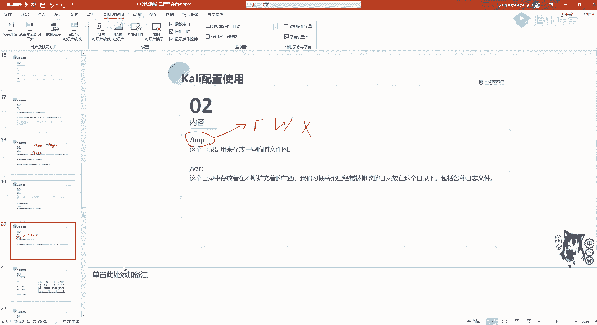

大家可以啊，就打开我们的卡里，大家如果安装的最新版本的卡里，有可能是登不进root的，这里卡里之前的版本是直接root。

然后t o o r就是root的反向即可，登录到我们的超级用户，超级用户之后，大家可以啊。

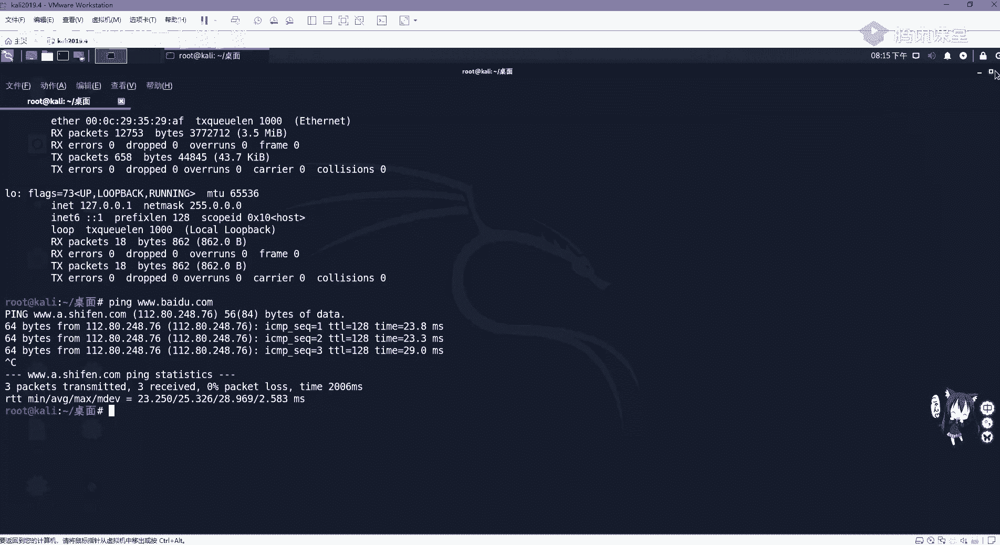

在这里啊，就连到我们的页面进这个卡里的一个啊桌面。

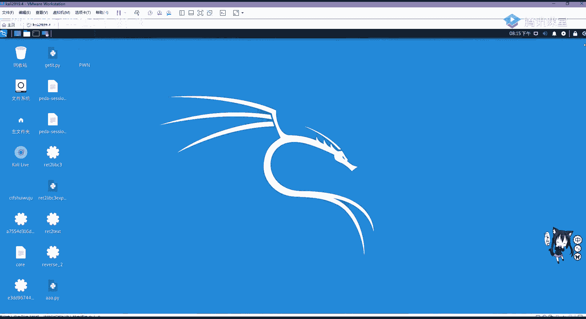

这里大家可以打开终端，也就是啊点击这个黑色的，或者是在这里都写终端模拟器，打开这个就是可以敲我们linux命令的一个地方，命令的一个地方，如果这里是汉化过的，汉化过了，如果大家不知道怎么汉化啊。

可以去百度去搜索，如果不汉化的话，其实也没有问题，因为他这些都是一些基础的英语，或者是你去百度查一查，大家多敲多练就会了，就记住了，首先我们cp切换目录到根目录，我们使用ios看一下这些啊。

目录大家应该非常熟悉的，就是刚刚讲过的b dv home lip 32，或者是其他的一些啊，比如说这里有啊root，大家如果是啊最新版本的卡里，大家会发现你登记去的是自己在安装的时候，创建的这个目录。

而不是root，用户那如何切换到root用户呢，大家如果就是嗯感觉自己登录不是root的话，应该可以发现直接使用我们的速度啊，sudo命令是使用了超级用户执行一条命令。

后面紧跟着我们的password啊，password就pass wd root去修改root用户的一个密码，比如说我修改成1231234啊，12341234啊，这里我就不做修改了，我就不做修改了。

我就不做修改了，然后使用苏，然后root su root即可切换到，然后输入我们的刚刚自己设置的一个root密码，即可切换到超级用户，在超级用户下，我们呃这个linux操作系统最左边这个是一个井号。

井号代表超级用户也可以使用who am i，就是我是谁，查看你当前所处so登录进去，操作性呢是哪一个用户可以看到是root。

在root用户下，我们可以对整个操作系统有拥有最高控制权，甚至可以破坏它里面的核心文件，大家要慎用root用户，但是这里因为是虚拟机，大家要执行一些文件，可能没有权限。

推荐大家登录到root用户进行一个啊学习，因为是虚拟机啊，玩坏了再重新装或者恢复快照即可，这里啊给大家讲一下linux文件的属性，也就是权限，linux操作系统对全新的一个配置，是十分的详细和方便。

不同于我们windo windows操作系统，windows操作系统其实也有一个权限配置，但大家因为它过于复杂，过于繁琐，大家一般不会对它做过多的限制，大家从网上下载一个文件。

会对它进行一个读写权限的设置吗，很显然不会，而我们linux操作系统就嗯，用数字代表了我们这个文件，大家啊使用呃。

比如说我们在这个啊文件里面，我们就cd到我们的home home文件里面，看这home文件里面啥都没有，切换到切换到root目录里面，然后使用ios杠l可以查看这个文件的详细信息。

也就是相当于我们这个列表形式，看有修改日期类型大小，这里也是前面这个dr w s2 ，就代表我们文件或目录的一个权限。

那我们来看这个权限代表什么，也就是这个d代表是否为目录文件，目录文件大家知道，就文件夹就是文件夹，那它为d就为目录文件，如果不为d就为普通文件，第一个确定是否为目录的一个字母过后。

接下来紧接着三个字母就代表我们的数组，数组权限，输入权限，什么是输入，很显然这个文件是属于哪个用户的，我们使用root用户创建一个一点tsd，那这个一点tsd就是属主就为root。

如果我们使用张三用户创建一个二点t s t，那二点t t t s t的数组就是张三用户，数组权限，我们每一个用户，比如说张三李四王五，这三个用户是属于一个啊g u e s t一个啊，就是呃访访问者。

一个访客用户就是把很多用户列为一个组，这个用户所属于的上级组即为属组权限，最后三个字字母，那最后三个字母呢代表其他用户权限，也可以简单理解为所有用户权限，二read w write，read。

读ride，写x执行，而这里为了方便对全新的一个配置，比林克将这三个读写执行分别用数字进行表示，分别是421，大家如果对linux有基础的话，应该已经非常熟悉了，如果这个文件具有可写可读。

可写权限及42+1起等于六，具有可具有读读可读可执行权限，其全称为五，没有文件，有没有文件，只有可写权限啊，肯定肯定是没有的，因为你都不能读取，又怎么去进行进行去写，那所以没有文件是只是二权限的。

那这里我们配置文件权限，可以使用c h m o d加权限的一个配置。

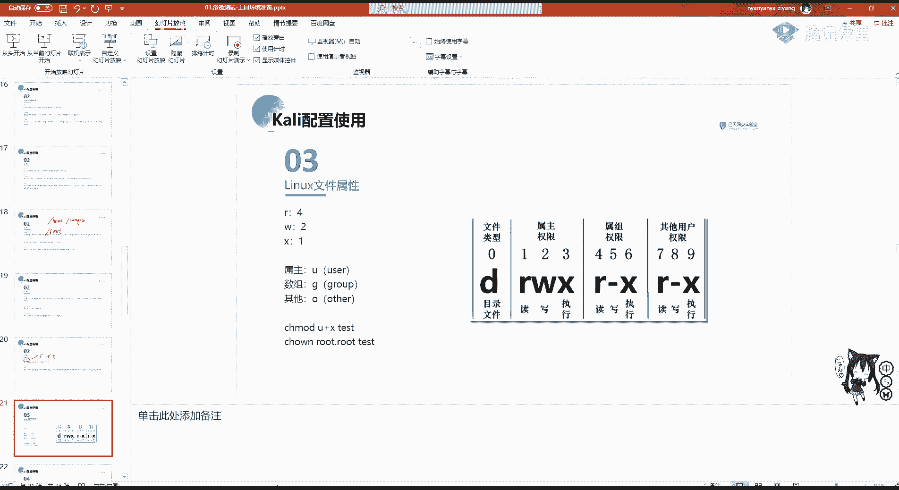

再加上我们的文件名啊，这里比如说哎我新建一个文件，使用t o u c h啊，大家如果记不住的话，没有关系，多敲还要多看，不需要去死记硬背，只需要多敲就行啊，比如说我们创建了一点t s d。

这里ios可以看到我们刚刚创建的一点t t，在哪啊，在这那我们看一下它的一个权限，它是对于我们的root用户具有可读可写权限，那这里我们把它改成777，也就是七七是什么4+2+1。

所有用户可读可写可执行，也就是c h m o d777 ，加上我们的一点t s t在进行ios杠l，可以看到这里我们是啊，root root用户可读科学可执行，root数组可读可写可执行。

其他用户同样也是其权限，那这里大家有没有什么问题，应该都能听懂吧，对权限这个如果大家想配置为可读，那就是直接配置为四啊，c h m d400 啊。

一点t s p即可，改变如何改变这个程序的数组或者是数组呢，文件的属主和属组是使用c h就是change o n，c h o w n，加上用户加用户的书，加用户的组，再加上这个test啊，这加test。

那这里就不给大家做演示了，就是改变这个用户这个文件所属的组，在linux操作系统下，文件目录的管理通常是使用这些命令，首先目录大家要清楚两个概念，分别是绝对路径和相对路径，这里在我们做渗透测试的时候。

都需要用到的纯路径，很显然就是从根目录写起，我们需要找到这个文件，首先从斜杠写起，也就是从根目录，这个代表根目录下面的一个v i r目录，vi m vr目录下面的3w目录。

下面的html纹路目录去cd到，就是切换到这个目录里面，而相对路径则不是有根目录信息，即是相对于当前目录的一个路径，分别使用点点啊，点点是代表父目录，就是上级目录，上级目录。

上级目录上级目录就相当于啊我们windows操作系统，你点一下退回上级目录，啊这是大家要记住，一个是由根目录解体，一个是不是由根目录泄气，对文件的目录管理。

通常这几个命令给大家大家讲一下ios啊，大家应该都非常清楚ios是什么的，ios啊，查看当前目录下的所有文件及目录信息，cd切换目录，我们现在是实实在root目录下，那我们切换到根目录，就切换到根目录。

这就来到了我们根目录里，想进到我们的第一位啊，就进第一位里面，p w m d是显示我们当前处于哪一个目录，这里可以看到我们属于dv目录，然后呃mac d i r m k d i r，很显然创建文件夹啊。

我创建一个ai文件夹，ios可以看到我们创建的i o i文件夹，那我们r m d r r删除，删除我们的一个目录啊，很显然cp啊移动移动这里移动文件到一个问，比如说我现在移动一点t t到根目录怎么办。

cp一点t s t到哪里到我们根目录，ok回车，我们这时候cd到我们的根目录，就是cp是复制copy，可以看到我们根目录里面已经出现了，我们的一点tt，但是原来的这个root里面也就一一点。

t t也是在的，因为它是一个啊复制命令，赋值命令，那我们rm删除把一点t t删除，move移动啊，目移动也就是现在我们这个当前目录下一点tt，删除了我们cd到我们的根目录下去，看到一点tt还在。

那我们把它移动到b把它一定，比如说移动到这个root目录下，怎么办呢，目一点p i t到我们的root目录下啊，这搞错了，在我们root目录下这里，我们看现在这个文件里面一点天机没了，它它在哪呢。

被我们移动到了root目录下，ok在这，这里大家对啊基础的文件目录管理目录命令，就讲这些，大家如果想看更详细的，可以到和天网安实验室或者是啊三角教程，自己去学习啊，一定要多敲啊。

link操作系统基本上是对命令行进行操作，用不惯多敲就就用不惯了，那我们看力的一个网络配置，同配置卡里，一般我们在使用net网卡n i t网卡的时候，是可以去配置我们的ip地址配置的内容啊。

即为我们下面啊。

这里可以到这个，这地方可以看使用我们vi命令，就是啊打开我们的编辑器，可以在这在这里啊配置我们的一个嗯哦。

网络配置文件，这里可以配置啊，address就是ip地址啊，net mask这个子网掩码和getaway，在配置完成之后，我们需要运行命令对服务对网络进行重启啊。

这这里给大家讲一下这个vm w右键啊，右键我们这个虚拟机可以打开设置，这几个网卡有什么不同啊，打开设置之后，我们点到网络适配器，网络摄影器，大家可以看到这有几个网络连接的模式，分别是桥接模式。

采用模式为直接而连接到物理网络，也就是分配一个和我们真实网，真实机器同一个网站的一个网络地址，第二net模式也就是我们最常用的模式，共享主机的ip地址，也就相当于我们主机里面有个虚拟网卡。

相当于一个路由器，对我们虚拟机进行了地址分配，桥接模式和net模式都是可以连接互联网的，仅主机模式就是与主机共享专用网网络，这个就是不常用，当然我们也可以自定义进行自定义网卡啊，自定义我们的网络。

我们测试卡里有没有连接到外网，很简单，首先i f c o n f i g1 computer，去查看我们ip地址，这里可以看到1192168189135，是个内网地址，那我们查看是否能联网。

我们可以拼一下百度啊，这是一个域名啊。

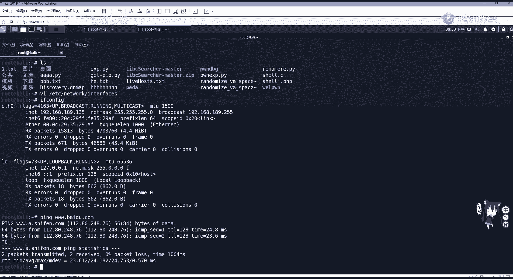

可以看到是可以拼通的，大家可以联网。

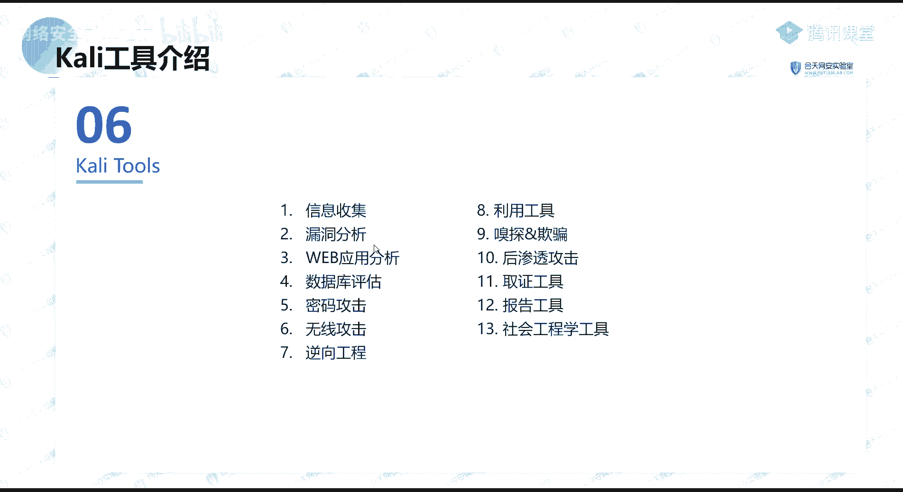

卡利里面的自带工具在哪看呢，在大家可以在这个最左上角点开，可以看到这里有啊这个信息收集漏洞分析，web程序数据库评估，密码攻击，无限攻击，逆向工程，而利用工具包括一些权限为实数字取证和渗透。

测试报告工具进行这些，大家啊可以嗯进行工具啊。

600多种，大家如果想去看如何使用的话，可以到这个下面这个这个链接里面去查看啊，这每个工具比如说我们这个password attacks，这个密码爆破，点进去可以看到我们随便点一个hashcat。

可以看到它的一个使用方法，中文文档，对卡里我们就先讲到这里了，就先讲到这里了，大家如果在安装的时候有什么问题，可以在课后去问我，啊如果这些工具没有可以到我的那个预习，在群里面的那个预习资料也自行下载。

或者是呃询问我们班主任，或者问我去要这个环境，如果大家有工具包的话，应该是有的啊，我们讲一下java和python环境安装，那我们在写渗透测试，利用脚本一般是使用python进行编写，大家应该知道。

python是现在非常火的一个嗯编程语言，因为它集成化非常高，也就是大部分都是利用已经编译好的，已经编译好的模块，我们直接导入导入进来去用就行，就极大地方便了，提高了我们编编程的一个效率。

而java呢java是一个编译语言的高级语言，那我们为什么要安装java，也就是jdk的一个环境，是因为我们在称重的测试过程中，用到的一些工具，它都是必须使用gdp才能够进行运行的。

比如说bp suit，这个非常嗯，呃几乎做每一个web都要用到的一个抓包工具，它就需要我们的jdk环境才能够正常的开启，那首先我们来看windows如何安装jdk，这里我们选用的版本是jdk 8。

因为jdk 8已经是够够用，我们用了啊，jdk的安装windows也是win 10，如何安装，首先我们要去下载我们的jdk，下载我们的jdk，大家如果在市区是计算机大学里面，是计算机专业啊。

有学过java开发的，应该都非常熟悉这个jdk如果如何安装了，这里我就给大家简单讲一下啊，如果如果是你没有不了解gdp是什么的，你也可以听，是能听懂的，非常好安装啊，jdk是什么东西。

java开发集成环境啊，这可以看到啊，这是development这个这个jdk，那下载，我们在这下面会看到这个gdp 8的一个下载呢，我们windows操作系统是32位的，下载x86 轮上线。

现在肯定都没有32位的操作系统了，我们win 10都是64位的，那64位的windows x64 ，这地方我们在下载的时候啊，你会要同意这个地方，然后进行下载，现在oracle下载是需要登录的。

那登录怎么办，我们可以到这下面这个地方，下面这个这个嗯这个这个链接啊。

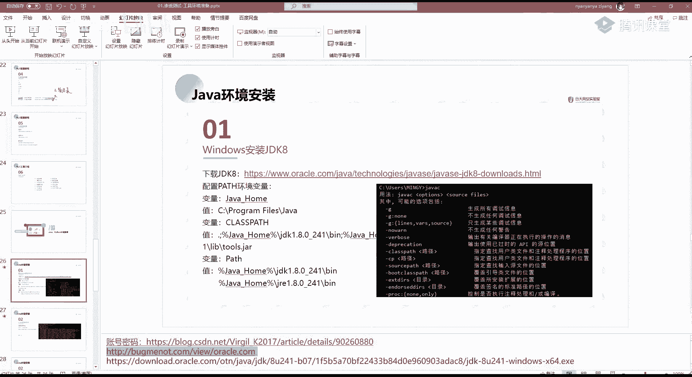

这个链接能不能发到这里。

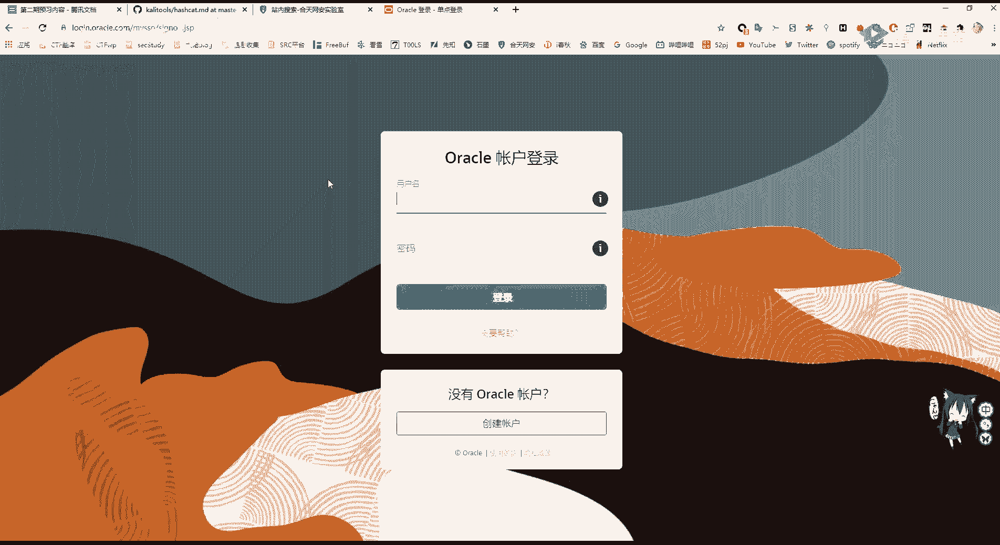

大家还可以去这个网站，这个网站你去找。

那这个上面有很多的这个oracle的用户和密码，你又不用去注册啊，注册很繁琐的，你就直接复制过来一个用户和一个密码，直接啊拿过来用就行。

把这个oracle给下，把这个jdk 8给下载下来，那下载下来之后啊，安装这里就是啊点就行了，我们使用默认的一个目录安装，默认会安装到我们c盘下面的program files，大家还记得吧。

这个相当于我们linux上面的一个一样的一个目录，在这里安装好之后，我们需要配置环境变量，为什么要配置环境变量，我们需要告诉windows操作系统，我安装的java环境它在哪。

不然的话我们这个在开发的过程中啊。

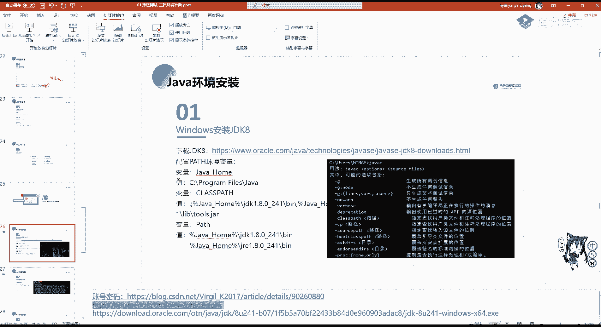

程序它找不到安装的jdk在哪。

这环境变量的配置看看，如果有接触过开发的话，应该都属性在我们电脑里面的属性啊，如果你是win 7或者是更老的操作系统，也是一样的，在windows属性里，此电脑或文件的属性里面有高级系统设置。

高级系统设置里面可以看到环境变量啊，环境变量这里我们就可以进行配置，分别配置啊，java home加home，这里啊我们可以双击它，配置我们java安装的一个地址，这里因为我我是自己改了一个java。

地址为g盘下面的java，但如果默认的话是c盘program files java这个目录，大家可以把它设置一下，然后下面的分别啊对我们的java home进行安装过后，分别对两个环境变量进行配置。

分别是class pass，class path，我们找到它也就这个地方配置为百分号加home，这个也就是我们刚刚指定的这个c program files java，这个地方将它配置好。

然后这个可进行保存进行确定，保存之后配置我们的pass，这path里面配置两个东西，分别是jdk的一个目录啊，jdk的一个目录，大家可以看到这个加home下面的b目录，把它配置好，配置好之后。

大家一定要确定，记住要确定确定再确定，三步确定才会进行配置成功，配置成功之后，我们如何去验证呢，可以来到我们的cmd名cmd下，cmd下。

输入我们的java可以看到它并不是找不到，就是不是报错，而是告诉你java这个命令行的一个使用，输入java c加了一个c b e。

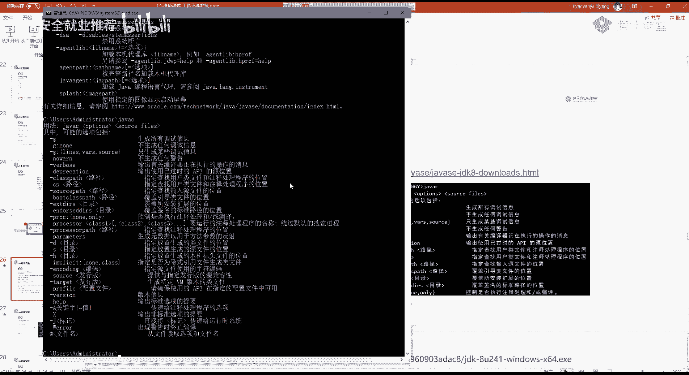

可以看到它就是可以正常回血的，这说明我们jdk 8已经安装好了，那linux操作系统如何安装jdk 8呢，在我们carry里面啊，这jdk已经帮你安装好了，就不用我们再去操心了，那我们在安装啊。

这这这个java 8的时候啊，这个jdk 8的时候可以使用ym，要么相当于我们linux系统的一个包管理器，它可以去，就是相当于我们安卓系统的一个软件商店，我们可以使用yum去搜索安装我们想要的软件。

java很显然也是，那我们搜索之后直接使用yum install即可安装，在这里我就不给大家做演示了，如果大家有安装center os红帽的话，还可以使用yum install加法啊，加上1。

8到k jdk，杠y guy的意思呢，就是默认在我们交互过程中选择yes，相当于我们在windows操作系统中安装软件的时候，它会让你不停的减点确定，那我们杠y。

也就是让linux操作系统自动的帮我们选yes，也就是选确定啊，这里是非常好安装，如果ym不安不想安装，也可以使用源码安装。

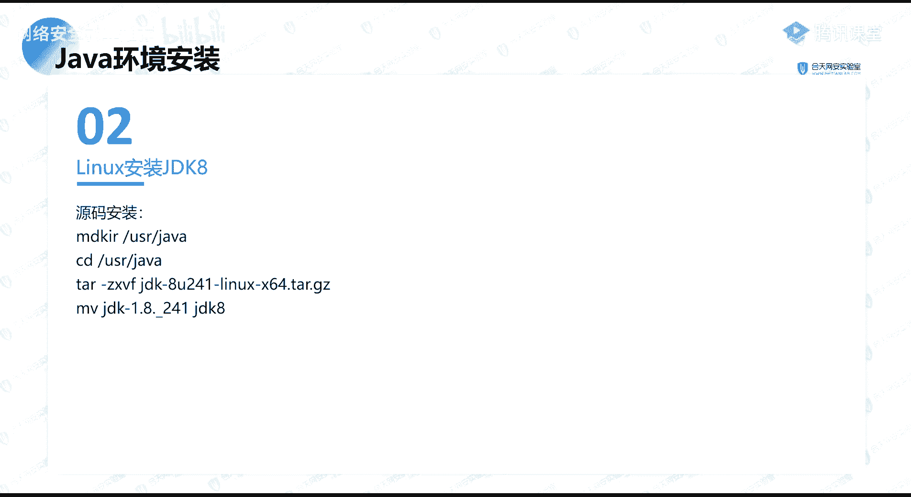

原版安装，就是需要把我们这个r jdk 8给下载下来。

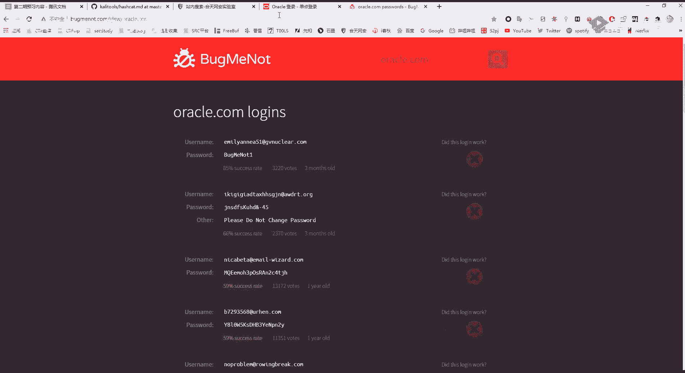

它下载还是在我们这个这个刚刚的这个嗯，网站里面，可以看到他对linux还有个下载啊，linux i i m架构啊，一个mac os也会有个下载一样的安装方法，进行命令的一个编译安装，但编译安装的时候。

大家还是要配置一个啊环境变量，linux安装环境变量，这里环境变量的配置啊，也是啊跟我们windows操作系统差不多，只是使用命令，还是推荐大家使用ym进行安装，或者是直接使用啊。

这个卡里里面已经安装好了，就不用我们再去啊，费费劲就安装了啊，更不要使用这个编译安装，安装python 3啊，为什么要装python 3，因为我们在渗透测试中所用到的一些脚本。

包括我们自己写的这个性能测试脚本，这个攻击的代码一般我们都是选择python 3，因为python特别的好上手，如果你去使用c加加去写一个木马的话，有可能你光去学c加加，你又要花很长的时间。

而且还不一定能写好啊，为什么不用一个更简单更好的利器，python来写的是吧，所以我们就需要安装python，他现在安装啊，我们可以在我们的microsoft store。

也就是这个microsoft store里面直接去安装，这直接去安装即可啊，这个啊你之前装啊，不用了，不用了，这个不能不能进行重复装的，你装加82就行了，加12的话。

我bomb suit需要安装新的版本，这个到时候如果你安装出错的话，可以找那个嗯，班主任那个工具包里面应该会有新的版本，啊这个因为我们这个潘森这个jdk 8，其实够用了，java 12也是没问题的。

当然越高版本它功能越多啊，这里只是啊嗯我们装什么版都行啊，这个python啊，这里推荐就是大家装python 3。7或3。8，这二现在就是已经要停止维护了，大家也不必不必再去纠结这个python 2。

python 3嗯，这个功能就非常强大，也就够用，它效率也比帕森二要高很多，那python 3啊，我们一般不推荐你使用这个microsoft store进行自动安装。

还是使用这个python的一个安装程序吧，到这个python这个我在那个预习资料里面也有，也有写到这个直接套到它官网进行下载，点下载即可，下载之后啊有安装方式，分别是一个自动安装is now。

还有一个自定义安装，自定义安装，可以安装p i p p i p及我们python的包管理，p包管理器，包管理器，那包管理器大家知道python啊，它是调用很多的包，那我们安装包的时候。

一般会使用pp i p进行安装，i d l e python的一个渐变化形式，包括可以选择我们的安装路径等等，这里嗯就是一个啊傻瓜式操作，大家勾选自己想安装的啊。

比如说把这个嗯安装一个python目录安装pip，即把我们的呃python放到我们的开始菜单里面等等，包括安装的一个路径啊，即即可，啊啊linux操作系统如何安装python呢。

卡里已经帮我们装好了python，这里如果大家再去想去安装的话，第一个可以使用ym，也可以使用编译安装电影，安装也十分简单，首先我们需要把这个这个啊python下载下载。

还是到我们python官网上下载下载解压，然后进行安装，但是这里大家要注意，当我们去编译安装python，包括编译安装其他东西的时候，会出现各种各样的报错，为什么报没有报错呢。

有报错大家知道编译是什么编译啊，对我们原程序进行编译，我们需要一个编译库，也就是gcc及内部f f i这些编译库，这些大家需要在一开始的进行安装，或者直接使用y杠y install python，3。

7，点击这个命令，会直接帮我们所需要的这些前置文件，都帮我们自己安装好，所以说ym是一个非常好用的东西，在我们卡里里面是没有亚目的，没有样么，但是有一个跟他十分相似的东西。

叫做i p t get ip t k啊，它是跟我们的呃，这个呃ym是非常相似的，大家可以使用这个加上install进行一个安装，进行安装，啊这里可以看到啊。

也可以使用我们的install安装python 3的p i p，下面给大家讲一下，这个渗透测试的一个基本流程及工具的使用，在渗透测试的基本流程，首先呢就是要确定目标，这个目标是由公司甲方去给你这个目标。

比如说对啊，中国这个湖南移动的某某资产，进行一个渗透测试，漏洞的一个收集，第二信息收集，当我们达到这个目标之后，我们要对这个目标服务器进行一个，广广泛的一个收集信息，包括域名，ip端口等等。

这个在我们在下面的课程会一一的给大家，详细讲解如何进行信息收集，大家要知道在面试的时候，面试官第一个问的最有可能就是信息收集问题，第三漏洞探测，漏洞探测我们分为手动和自动，自动的话会使用一些扫描器。

手动就是凭靠我们的经验进行抓包，进行分析，发现这个东西在漏洞探测结束之后，我们需要进行漏洞的分析和漏洞，利用法律漏洞，利用利用编写漏洞，利用脚本啊获取到这个服务器的一个权限。

或者是拿到这个服务器的一些敏感文件信息，再把这个服务器攻破之后，我们需要进行一个信息整理，是哪一个漏洞，哪一个资产，哪一个rp有了这个漏洞，然后最后形成渗透测试报告进行提交甲方，这个就是我们在工作中。

渗透测试工程师所要做的一个工作流程，在漏洞的探测和漏洞利用中，因为我们可以涉及到这个资产特别的多，我们可能用手动你挖掘，也也不可能挖掘到那么多，就可以利用到我们的自动工具，也就是渗透测试的利器。

这把好刀也帮我们去做这些事情，那这些啊，大家在这个渗透测试的一个工具库里面啊，可以看到这些啊，工具啊，大家如果没有的话，可以找我们的核心班主任进行啊，要这个下载链接，这里面有些信息收集。

包括一些密码的字典，也就是密码的一个爆破漏洞，一些扫描iw vs啊，这些在后面课程都会进行讲解，包括端口的转发，内网的代理抓包爆破啊，包括web shell，也就是我们上传到web服务器的木马一个管理。

然后sl map也就是sql注入，大家如果对o w s p top是web漏洞有了解的话，应该会知道sql注入，sql map即为一个自动化sql注入脚本词汇柱工具，那还有一些ip信息收集啊。

这个这些工具我们在后面的课程中会用到哪，会讲哪，会给大家去嗯，完整的走一遍这个渗透测试的基本流程，那这节课啊大家嗯讲了这些啊，jdk python carly vam word一个安装和使用。

大家有问有没有什么疑问，啊对的，python 2已经停止维护了一些，啊，这里今天讲的这个就是一个对工具的基础安装，如果就是大家有基础的话，听起来就是啊非常简单啊，非常简单了，这里啊可以，如果大家是零。

就是没有对操作系统有所了解，或者嗯不晓得这个linux操作系统，啊，这个jdk和python是需要在windows操作系统进行安装的，jdk也就是java啊，这个java java和python。

要在啊要在物理机安装物理机，就是我们的win 10啊，就是我们的windows是啊，安装，啊卡里还是能用到的，我们渗透里面会用到它里面m sf啊，meta，还有这些都会用到这些。

卡里里面也有一些你学web用到那些bomb suit啊，啊supermap啊，卡里里面也都有啊，而且卡里面自带的一些木马也非常好用，包括一些题全脚本，看里面的东西特别多的。

即使你不去用它的那些600多的工具，你去看python里面自带的一些字典，一些木马，一些脚本，一些提前文件也都是非常有帮助的啊，拍咖喱里面东西是特别的多，啊这个python 2呢现在是已经停止维护了。

嗯之前有一些嗯这些老油条不想开发，就是自己开发的这些程序不支持帕金三的，现在也都分别支持帕金三了，所以大家就直接去学习pac 3即可，还是python 2与psi差距也也不是很大，也不是很大。

那大家还有什么问题吗，就是对于这节课啊，工具的安装，嗯今天嗯主要就是讲一些基础啊，这个实操啊还要在后面，我们先把这个基础，因为很多同学对你看操作系统没有了解，我们要把这些基础的这些知识。

进行一个一系列的讲解，所以大家如果在这个安装，包括jdk，java安装过程中有任何问题或者是报错的话，可以在群里啊，在工作时间可以去啊，在群里直接问这个工具包没有的话，是可以去问我们的核心班主任啊。

要这个下载链接，那今天嗯大家如果没什么问题的话，课程就到这里了，明天嗯我给大家带来这个信息收集的一个讲解，也就是面试，你需要遇到这个面试官的第一道门槛，渗透测试的信息收集，你要收集哪些东西。

要怎么收集啊，明天我会给大家来讲解，这个课程表啊，可以的，这个java python用的老版本都行，只要python 2的话也行啊，你可以安装个三吗，这个老版的东西啊，这个课程表在我们这个这个这个。

这个是这个腾讯课堂里面有啊，这腾讯课堂里面是有的，打开你的那个腾讯课堂那个网站里面就可以看，看到现在下面有个课程的大纲，那今天就到这里谢嗯那那就嗯对的，有的脚本还是二写的嗯你这个二还是有用的。

因为二和三的一个编码是不同的，如果你从二啊直接转到三，你会发现你运行的有的一些编码，它你要做很多编码的一个转换，不停的encode decode就非常复杂，自己的脚本还是二写的，如果二其实二挺方便的。

二挺方便的。

