# 【B站最系统的网络安全教程】北大大佬196小时讲完的网安教程，全程干货无废话！学完即可就业，别在盲目自学了！！！ - P42：第3天：IP、端口信息收集 - 网络安全就业推荐 - BV1Zu411s79i

我给大家应该能听到声音吧，这声音应该还是有这个电脑风扇的噪音哈，给大家体谅一下，我这个电脑风扇噪音比较大，嗯还有同学这个备注没有改成自己的姓名啊，可以在腾讯课堂的个人信息里面修改一下。

方便我们的班主任考核，是这个是和天代不com，他跑不出来也正常，你就跑大战能跑出来和t tab，你用挖矿了能找到不少吧，你配置的配置了p i之后能找到不少，那行那我们开始讲今天的课程。

如果有同学没有来的话，这是可以听录播的，在腾讯课堂是有回放，可以随时看的，大家如果是有小组的，这个同学没有来的话，可以提醒一下他啊，后面可以看录播，我们上一节课主要讲了域名，信息收集和子域名的收集。

这节课呢我们要讲渗透测试信息收集的第二点，也就是ip地址及其端口的信息收集，ip地址信息收集就是非常重要，因为它是代表我们主机名，当甲方给予大家的这个目标是ip的时候，我们可以通过ip进行反查域名。

如果渗透目标为虚拟主机，那么我们通过ip进行反查域名就很有价值，因为一台物理服务器，上面可能运行多个虚拟主机，这些虚拟主机有不同的域名，但通常共用一个ip地址，如果你知道有哪些网站共用这一台服务器。

拥有同一个ip地址，那么就可以通过ip进行反查域名，通过此台服务器上其他的网站漏洞，获取服务器控制权，进而迂回获取渗透目标的权限，这也就是我们经常说到的旁注，这个大家应该用pp study。

应该知道我们在3w目录下可以建多个文件夹，也就是拥有不同的站点，这些站点它是都是具有一个ip地址的，如果我们是使用真实的服务器，在这一台服务器上可以搭建很多个站点，他们每个站点只是域名不同。

而ip是相同的，就像大家有的时候去挖src，挖到sql注入sql注入，你可以看到他这个表就有非常的数据库，包括表非常的多，有可能这不只是这个站的数据库，还有其他旁站的一些数据库，这就代表这些数据库呢。

都是存放在一个服务器上面的，那我们可以通过拿到其他网站的漏洞，从而获取服务器权限，通过ip反查域名，还是使用站长之家，china z这个web接口进行一个查找，这web接口直接到我们公司的。

比如说58205426，就直接查询，就可以查到这个域名和天lab，这就非常简单，第二个，如果我们收到的资产是域名，包括进行子域名收集，涉及到域名，我们需要对ip进行一个服务探测。

端口探测需要看他有没有开启mysql呀，或者redis或其他的sa共享服务等等，那我们就需要知道服务器的ip地址，通过域名查ip很简单，可以拼一下它，p一下，就是请求dns将它转换成我们的ip地址。

或者是使用站长之家的web接口进行查询，这里我查询和tlab，可以看到这个地址是湖南长沙移动联长沙联通，获取地址，58205426，还有下面还有一个定位来看一下，它定的并不是很准确，这个看一下就行。

但是他查到的这个ip的一个ip地址，那这里就遇到了一个问题，现在大部分一些src网站都是开启了cdn服务，那什么是cdn服务呢，cdn及内容分发网络是构建在网络之上的，内容分发网络。

依靠部署在各地的边缘服务器，通过中心平台的负载均衡等等，使用户就近获取所需内容，降低网络云彩，提高访问速率和命中率，这是一个官方的定义，那cdn具体是什么意思呢，比如我现在在湖南。

我需要去访问黑龙江的一台服务器，因为我们湖南里，黑龙江物理位置就是物理距离比较大，而且中间呢可能遇会遇到这种，各个运营商的交换机服务器的不停的切换，我们发送给黑龙江这个服务器的请求包。

包括它返回的响应包就会非常的慢，延迟特别高，甚至有可能会存在一个高丢包率的一个情况，那这时候我们cdn服务就是加黑龙江这个服务器，通过内容分发分别分发给每一个省cdn。

每一个地区cbn服务器的边缘服务器上面，也就是这个做，相当于可以简单理解为做一个备份，这时候我们在湖南省去访问黑龙江的web服务器，他访问的就不是物理位置的黑龙江，而是访问了这台web服务器。

那这里我们访问的速率，这个延迟就大大的降低了，而且丢包率也几乎为零，就会降低网络拥塞，那如果我们使用cdn的时候去查找，一般查找到的就是cbn的一个ip地址，不是网站真实服务器地址，那我们去做一个扫描。

端口扫描，包括渗透的一个扫描就没有多大的用处，那我们要绕过cdn呃，拿到真实的ip地址啊，这里有几种方法，首先我们要判断是是否使用了这个cdn，使用cdn，这里还是使用啊，这个站长之家。

战场之家是非常的好用，这里我们对站长之家，对一个网站进行多地ping，比如说我们ping百度，我们稍微等待一下，可以看到几乎每个每个地区去拼百度，它的延迟都是非常低的，是为什么呢。

因为百度可以看到江苏省聘百度，和深圳市聘百度，他ip地址啊是不一样的啊，有三九有220，这是因为百度呢开启了这个cdn服务，它是一个就近一个访问，那如果没有开启cdn服务的，就比如说公司的和tlab。

那听到的肯定都是一个ip，五八，那这里他各个省去访问，它的速率也是非常快的啊，也是非常快的，因为它这个线路啊是商用线路，bgp，多dp可以帮助我们，判断服务器是否开启了cda。

那我们这里再看如何去绕过cdn呢，首先就是进行国外访问c d n，它的是按流量收费的，并且在中国大陆收费是十分昂贵，如果你对每一个站都开启了cdn，那它的价格如果你这个站的访问量比较大，价格是非常高的。

所以呢这个cdn一般不会对国外用户进行开启，国内的网站，那我们可以利用国外的多地拼进行查找，这里可以，利用这个国外的多dp或者是站长之家，他最后也会拿国外的服务器进行拼，或者是这个。

这个外web卡卡卡卡网都行的，可以在这里设置啊，我们可以只让它全选之后点掉，然后点击海外，用海外的这些机房去拼，就可以看到它是否在外国开启了cdn，如果这些国家聘的都是一个ip地址。

那这个ip地址就是真真实ip地址，这是其中一种方法，但如果他在国外也架设了cdn，那就这个办法就行不通，第二第二种方法查询此域名的ip，还是刚刚说过的，因为cdn的价格非常昂贵，当我们架设子域名。

也就是开启其他网站的时候，一般啊一些旁站小的站呢不会对它进行cdn架设，那我们通过查询子域名的ip，并且去查询他的c段，就是同一个网段中的ip，有可能会拿到它的真实服务器ip地址，这是查询子子域名ip。

大家应该知道吧，就是用子域名收集之后ping一下，或是用刚刚的战场之家进行查询即可，第三种方法查看p p info文件，在这里是有限制的，第一个就是这个服务器上必须有菲律宾info文件。

这个文件大家在假设网站的时候一般会给删掉，所以这个可能性是比较小的，在菲律宾info文件里面，我们可以看到一个server i d d r server address，它会显示我们服务器的真实地址。

如果你是在本地去装pip study，去访问p a p info的话，你看到的是你的内网地址，而在公网服务器上，你去访问去查看server address，发现这里8918473149即为公网地址。

也就是服务器的真实地址，但这个可能性比较小，一般的网站架设管理员都不会把pvp info给你，并且很多网站是sp和jsp，python等等，并没有菲律宾info文件，还有一种方法就是邮件记录。

邮件服务在邮件的原始代码中会显示，邮件服务器发送的地址，如果这个邮件服务器和网站的web服务器，是搭在一个物理机上面的，那就可以找到web服务器的真实ip地址，那这个邮箱的原始内容应该如何查看呢。

那这里就拿这个啊qq邮箱做一个演示啊，其他的邮箱也都大同小异，随便看一个，就比如说这个啊有个漫画网站，那我们去看，在这里我们点击，所以这边的一个箭头会显示这个啊，这个显示原邮件啊。

原邮件邮件原文显示邮件原文之后，在最上面有个received from 168245，106255，那这个就是这个pcu这个网站，它的邮箱服务器的ip地址，如果它是和web服务器在同一个地方的。

那这就可以拿到他的真实ip了，在这里我们来稍微看一下它的一个，这个ip啊，这里，ip肯定是能拼通的，那我们就不看了，那是一个美国的一个ip地址，最后一种方法也是我觉得啊。

就是跟多地拼也非常常用的一个方法，就是查询历史dns记录，查询历史dns记录，我们还是使用这个啊dns这个网站，外国网站进行一个查询，那你去查询隔天lab我都是以公司的这个为例哈。

大家可以去看这里可以看到这些记录，包括他的ip地址，i记录的ip地址，这里我们是看不全的，看不全可以用第二个，第二个大家注册一下就可以看到它的完整记录，那为什么查找历史的dns会去拿到这个ip地址呢。

是因为我们在申请完域名之后，都会对域名和ip进行绑定，也就是进行域名解析，当我们解析完之后啊，第二步有可能才是购买并且架设cdn服务，有可能一开始啊这个网站管理员搭好了。

网站测试好之后才去购买的cdn服务，或者是后期需要cdn的时候再进行购买，那我们一开始的进行的域名解析，就是把域名和某真实的ip进行绑定，那这些呢，这个记录就会放到这个历史dns记录里面。

那我们就可以进行去查询，这里比如说啊这个腾讯云，腾讯里里面这个你去做了这个域名申请之后，你需要去添加记录，这添加记录我们可以看记录类型啊，这是腾讯云，阿里云外网也是一样的，那我们可以添加i。

我们去查找dns记录的时候，也是查找i记录，i记录是什么，用来指定域名的ipv 4地址，将域名指向一个ip地址，那我们肯定是需要这个嘛，需要这个之后他的一个记录值啊，这个主机的一个记录很简单。

就是3w是可以解析为这个域名，或者是进行泛解析，或者是二级域名a b c或是s y z等等，进行二级域名的解析，那么解析好之后，这个域名就会经过呃几个小时之后，就会绑定在我们的这个呃解云解析上面。

就会解解析到我们的i p地址，解析到ip地址之后，有可能才进行一个cd cdn的一个开启，开启cdn的话，这里大家如果假设假设网站的话，应该是知道这个嗯，clothe fire这个网站。

这怎么这梯子挂了呀，那这里就先不讲了，这里我们就是呃在架设之后开启，即第一次进行域名解析，它会保存这个记录，里面呢我们可以去查找他的真实ip地址，绕过cdn的方法嗯，就上面有几点大家要熟悉。

因为有可能一种方法行不通，用另外一种方法，如果他对全球都开启了cdn架构建服务，并且没有进行一个解析的话，那就没有办法绕过了，这个就没有办法，但是一般进行小站的话，是肯定能找到ip地址的。

在找到真实ip之后，我们需要对ip的c段进行主机探测，什么是c段呢，就是同一网段，比如192。168168。1，百点零零至255，他们都是属于一个网段里面的这一个网段，在公网里面。

如果一个公司去申请ip地址的时候，一般都是相邻的网段，就是在同一个网段中的相邻ip地址，那我们去探测c段，就会找到这个公司其他的资产，包括主机，甚至可以使用nmap进行一个探测。

nmap杠s p使用pin进行探测，可以加上域名杠2424就是子网掩码，25525250就是子网掩码，也可以加上我们的ip地址进行主机探测，存活主机探测或者是n map，它的速度是比较慢的。

那我们可以使用第三方工具c web scanner，进行一个查询，那这里我们还是大家一定要学会这个，用github进行安装。

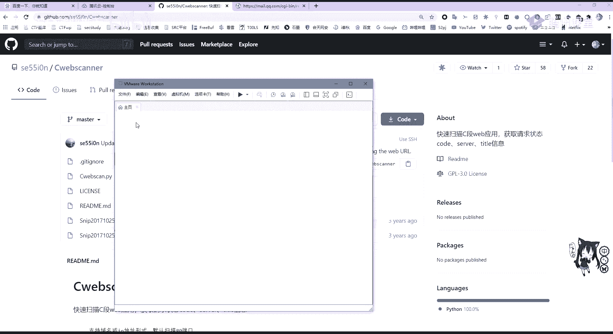

那我先把这个虚拟机打开。

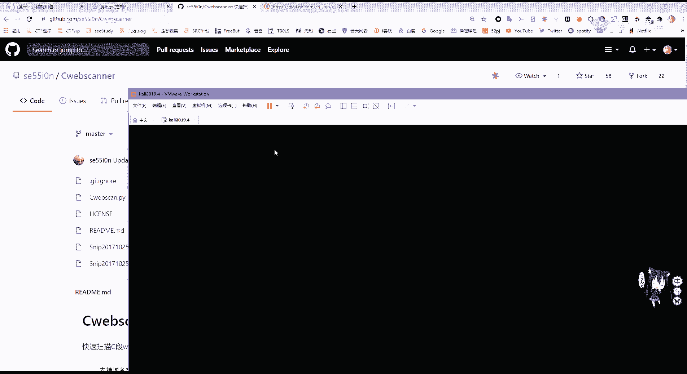

去克隆软件非常简单，直接把它克隆下来即可啊，这里这里好像我是给删掉了，直接git，然后克隆，把这个地址给粘过来，克隆完成之后啊，大家说怎么升级，升级很简单，直接get，然后直接这样就可以升级。

这里可以看到是最新的，不需要一个升级的，不需要升级的。

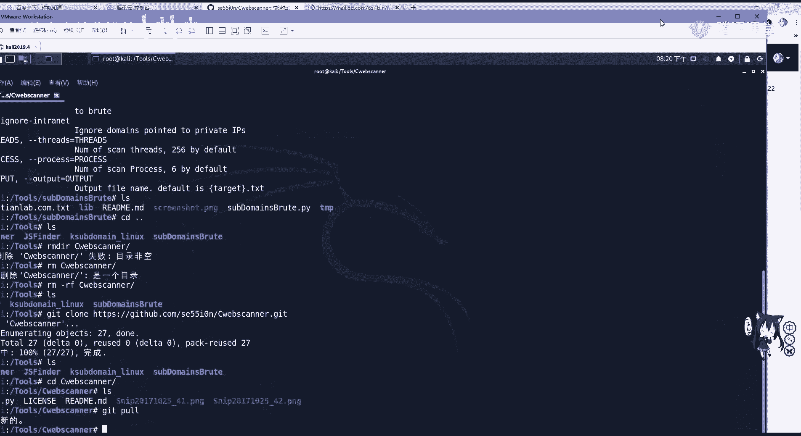

那如何使用，在github的这个raise me这个markdown里面已经写好了，非常简单，python加上c web看点pi，再加上我们的这个嗯域名可以指定端口，因为刚刚讲过web服务不仅是八零。

有可能会自定义为八零，八零或其他端口，或者是http s的443端口。

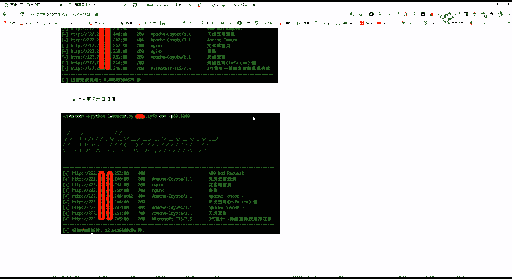

在这里我们来扫描一下，比如就拿这个和天的进行扫描，加上昨天，lab。com加上杠p我们这个8080端口，http端口，443端口，htp s端口进行一个扫描，这里是又翻了，还是排性爱，诶我看一下。

啊是和天籁吧，还要加，还要加上3w进行扫描，就是它默认会扫080端口，所以大家可以看到582054，后面这些加上统一c段的这个网站，它都会给扫出来，这里可以看到有其他的一些网站，这就不打开看了。

就是扫描c段。

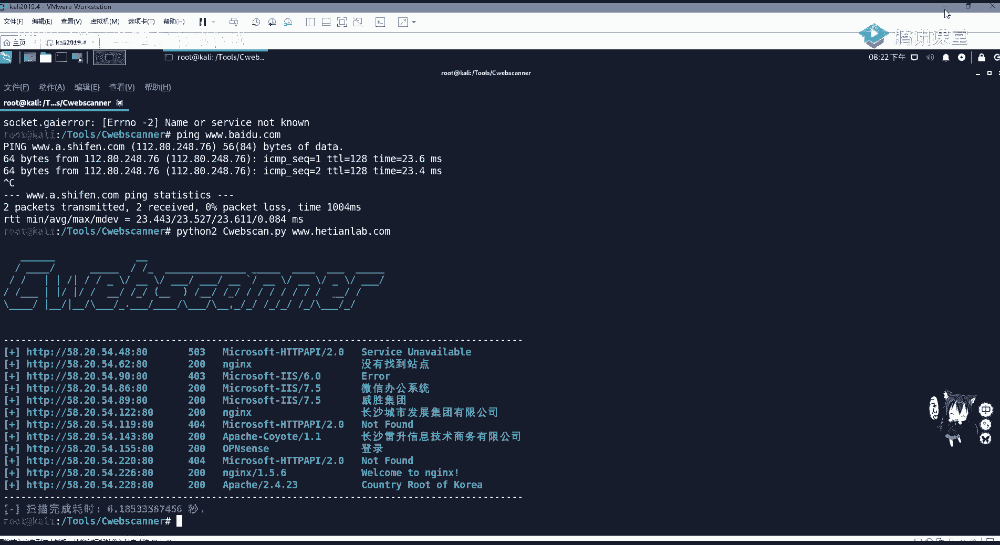

那下面呢我们需要对端口进行收集，端口端口是什么呢，在互联网上，各个主机通过tc p r a p协议，发送和接收数据包，那我们每个数据包它需要知道主机的ip地址，进行网络互联网路由选择。

从而将数据包乘顺利的传给目标主机，那他需要传给哪一个服务呢，这就是通过端口号来一个区别，端口呢是根据提供服务类型的不同，可以分为tcp端口和udp端口，tcp和udp是传输层的两个通信协议。

一种是面向连接的可靠通信协议，以一种是无无连接的不可靠不可靠传输协议，那gcp大家如果学过计算机网络，应该知道它是有一个三次握手的过程，udp是没有的，tcp协议的端口和udp协议的端口是相互独立的。

大家要知道，那端口的类型呢分为三种，是根据端口的大小来进行划分的，一种叫做周知，端口是0~102，三是1000 1024个端口，这些端口呢是系统固定服务的一个端口号，也就是众所周知的端口。

比如八零是3w服务，也就是web服务的一个端口，第二种端口叫做动态端口，一般不固定分配某种服务，49152至65535，这个最大端口，这些大端口是不固定分配某种服务，也就是我们可以进行使用。

第三种叫做注册端口，范围是从1024~49151，适用于分配给用户进程或程序，当我们比如进行一个web服务链接连接的时候，你去访问web服务器的八零端口。

web服务器会发送response响应包返回给客户端，那客户端上面就会有一个端口，去接收这个response，那这个端口就属于注册端口范围，是分配给用户进程程序，端口的作用，我们为什么要收集端口呢。

那把服务器可以比作一个房子，而端口呢比作进入这个房子的门门，那我们作为渗透测试，就是作为一个窃贼，我们需要进入这个房子，那窃贼想在没经过房子主任允许进入房子，就要破门而入，那在破门之前。

那我们肯定要知道这有几扇门，这个门呢是什么东西，门是铁门还是木门，好不好，破门后是什么东西，也就是俗称的踩点，踩点踩得越多，对顺利的渗透就至至关重要，在渗透测试端口中。

我们需要了解周知端口周日端口有哪些端口，具有一个渗透测试的可能存在漏洞，进行一个破门而入呢，通常是具有这些端口，我们来一一看一下重点的一些端口，首先啊这个是ftp文件传输协议，是使用21 20呃。

用于20呢用于传输数据，21用于控制传输信息，这个呃大家如果学过网络的话，应该是啊很清楚ftp文件传输协议它有哪种，有哪些可疑的漏洞点呢，第一个叫做ftp爆破，我们可以使用h i d i r这个软件。

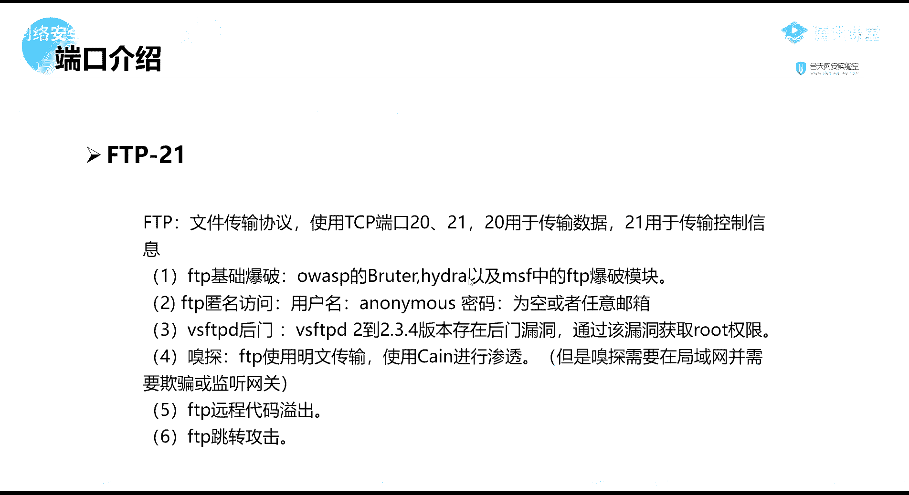

这个程序在这个呃卡里面也是有的，可以看它的一个使用方法，它可以爆破各种的服务啊，可以爆破各种的服务，可以看到有ftp有300，有啊s m t p有s s h等等。

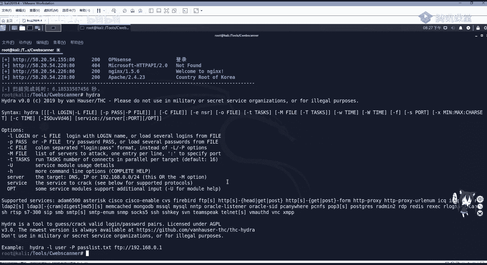

还有v n c，第二种叫做ftp匿名访问，当ftp没有开启一个验证的时候，我们可以使用匿名用户密码为空登录ftp服务器，那可能会泄露敏感信息，第三呢f vs f t p d。

这个是linux操作系统的ftp服务器，那就可能存在后门漏洞，通过其可以提权到root权限，这个大家可以自己去搜索，并且尝试看能不能利用，第四呢就可以进行一个嗅探，因为ftp呢是使用明文传输。

这里就还有后面的远程代码溢出跳转攻击，这些就是啊比较不常用了，大家可以进行了解一下，这里主要是对主要端口进行一个介绍和了解，如果零基础的同学，就是一定要知晓这些端口也可以。

就是之后会把这个ppt发到我们群里，也可以把这些保存一下，进行一个查看和记忆，第二呢s s h就是啊远程绘画接口啊，远程传输协议，安全传输协议，那我们可以利用这个远程登录服务器，同样它也具有弱口令。

还有一个用户枚举端口，s s h大家应该都非常熟悉了，那我们需要连接到我们的卡里里面，就可以使用s s h的客户端进行连接，一个服务器啊，连接服务器这里啊。

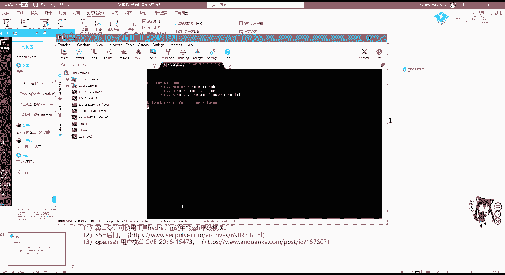

没连上，应该是这个服务是没开。

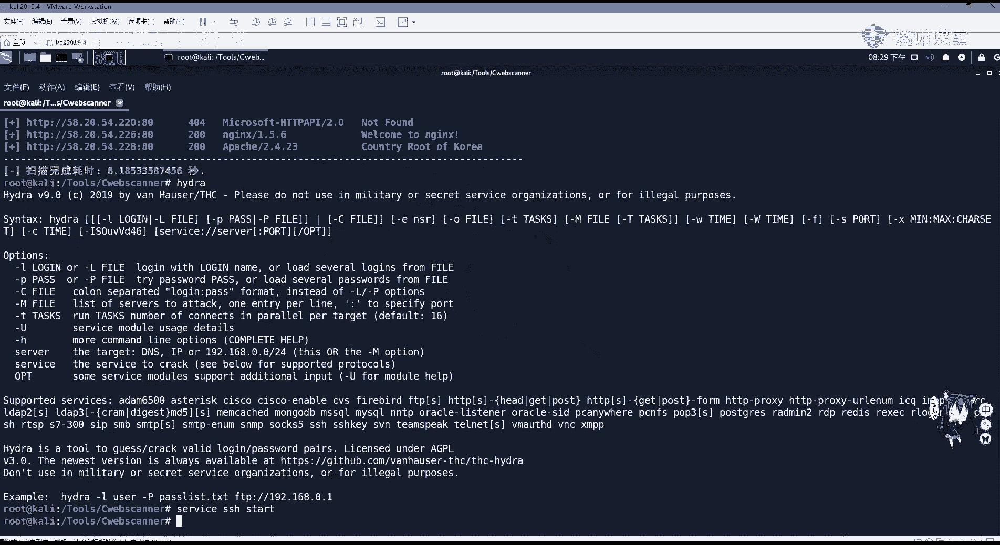

把它开启之后啊，我们就可以连到，就我们这个服务器就可以对它进行一个shell，一个操作。

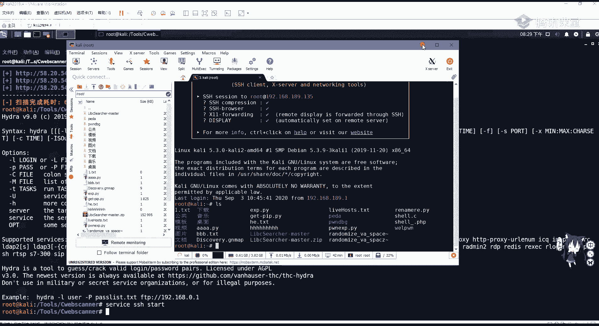

它的端口是22tnt，tnt也是一个比较相似的s s h s s h叫什么，叫安全shell，而tnt呢在我们的windows下是十分脆弱的，他是没有经过任何加密，就在网络中进行传输。

那我们如果对它的流量进行一个拦截，就可以获取截取远程登录的一个密码，s m t p邮件协议啊，邮件协议这个可以利用这个服务发送钓鱼邮件，分别是二五和465，端口3w最常见的超文本传输协议。

http是用于我们web服务器的一个站点啊传输，那我们通常的八零端口是使用中间件的，比如r i s阿帕奇，nginx tom cat等等，我们一般通过web应用程序常见漏洞。

o w s p可以对八零端口进行一个攻击，或者是使用中间件的漏洞，比如阿帕奇的任意文件读写漏洞，下面三把共享文件服务一般是139和445，你用linux叫做3a服务，45端口。

大家应该知道有一个特别出名的漏洞啊，有几个特别出名的漏洞，m s17010 ms 08067，都是萨马普所具有的漏洞，包括今年的这个永恒之黑，都是345端口的漏洞，大家可以去搜索。

利用直接去搜他的脚本去跑，或者是使用mata split进行一个渗透测试，框架利用即可，mysql 3306，mysql数据库，一般我们使用p p进行web服务搭建的时候，会使用mysql数据库。

那mysql呢可能会存在一个绕口令，或者是呃进入口令输入mysql进行一个提前，r d p3389 ，3389是我们windows远程桌面监听端口可以进行，如果3389进行开启之后。

可以对远程桌面进行一个连接，ok这里也没有什么了，就是一个r dp的一个爆破攻击，还有一个死亡蓝屏，m12020 远程桌面漏洞，包括m s m s f，通过web漏洞开启r d b。

或者是调用注册表开启远程桌面，进行远程桌面连连连接，大家都知道，如果我们使用administrator，去连接了这个windows服务器的远程桌面，那我们就对他拥有绝对的控制权了。

所以445端口和3389端口是一个漏洞，非常多的一般也比较常见，redis redis是一个可持久化的日志型数据库，它一般存放在内存里面，这里我们一般是redis入口令未授权访问。

也就是我们可以通过s rf去打到6379端口，redis进行一个未授权访问，web logic，web logic，7701是中间介oracle的web logic。

s s r f及反序和复盘序列化漏洞，这个对影响是非常大的，大家也可以去搜索，利用，在后面的课程，也会给大家去讲s s i f和反序列化漏洞，tom cat，8080，tom ptom。

tom cat是阿帕奇的一个分支，一般用来js p，也就是java web page的一个服务，我们通常对加接写js p的时候进行运行，一般是使用top cat，tom cat作为中间件。

那tom head也具有任意文件上传上传或管理页面，入口令，get shell等漏洞，大家可以去自行搜索，这个都是要去积累，然后去发现这些端口，那我们进行端口扫描，一般是使用nmap。

a map是一个啊不老的神器，一直都很好用，如果你使用它把它使用好了，那它去探测网络是非常快的，并且可以进行一个漏洞的扫描和利用，nmap是一款开放的源代码，网络探测和安全审核工具。

那它的一个参考指代有中文啊，中文参考指代，这个我已经放到我们的预习资料里面了，大家可以去看一下这个参考指南，他会告诉你端口的一个扫描，功能介绍很简单，第一个主机发现刚刚已经说过了。

n map杠s p加上我们的域名或ip地址，进行一个c段的扫描，第二也就是我们今天要讲的探测主机开放端口，去攻击这些脆弱型端口，第三可以检测相应端口的服务版本，比如三大服务它只是特定的版本。

具有ms 08067等等漏洞，那我们可以探测通过mf探测相应的端口，软件版本，第四nmap能够帮我们检测操作系统版本，硬件网卡地址及软件版本，第5n map可以帮我们检测脆弱性漏洞。

那n map有很多脚本可以帮助我们检测漏洞，当我们使用nmap进行端口扫描的时候，回想过来的一个端口信息，就只有啊常见的这三种，后面几种就是大家看一下就行，首先open这很明显是端口开启。

并且意思是数据有到达主机，有程序在端口上监控啊，这里就是端口开启，close很简单，端口关闭，那filter这个是意思是数据没有到达主机返回，结果为空，这里呢一般是被防火墙或者是硬件i d s流控。

给过滤了啊，我们一般会遇到这三种端口状态，它的基础用法非常简单，使用bn mp杠a可以进行一个全面扫描，杠t指定它的一个呃速扫描的速度，这个t可以指定从0~5，越高它越快，t0 代表非常慢的扫描。

可以逃避i d s硬件的一个检测，而t5 呢是极速扫描，这种扫描会降低这个端口检测的准确性，我们一般是使用t4 ，也就是快速扫描，在网络环境很好的情况下，这个扫描是很快的，很方便，在默认情况下。

这个nmap并不会扫描所有的端口，因为扫描所有的端口，它这个数据是非常的大，非常的慢，它默认是扫描周知端口，也就是1~1024，那我们这里可以啊尝试扫描一下。

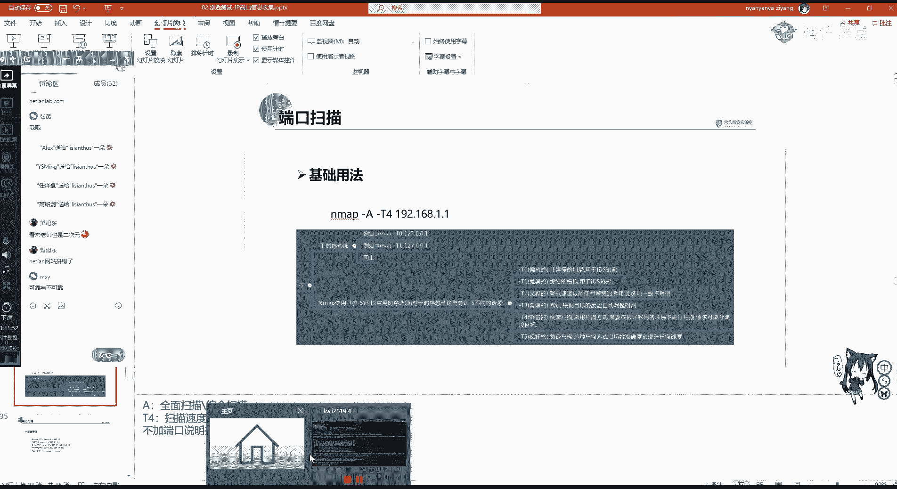

n m n m杠gt 4，那就扫描我们的这个和天lab，nmap的扫描会发发起大量的数据啊。

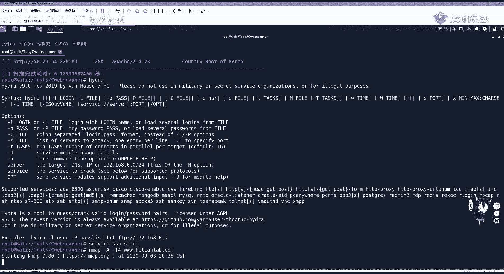

如果对面有buff或者是i d是的，ip是很容易被ban掉的，这嗓子也挺慢，那我们先继续看，那它的基础用法呢，可以对单一主机进行扫描，也可以对子网进行扫描，子网扫描这里也已经说过了。

也就是加上子网掩码进行激光扫描，也可以对多主机进行扫描，也就进行排列，进行主机范围扫描，用com指定扫描，1921681。1至1921681。100，也可以将ip地址写到txt文件里面。

用杠i import l import list进行一个ip地址导入扫描，就是批量扫描，当然这个过程是非常慢的，是非常慢的，刚刚我们看到扫一个都特别慢，看他还没出来，他还没出来，我们再不解。

在扫描的时候对知网进行扫描，也可以使用杠杠exclude进行一个嗯去除，比如这里我们不想去扫描点一这个网，因为它一般是作为我们的网关，我们扫描它没有什么用，也可以把除i p y的子网主机。

写到t i t文档里进行去除，扫描也可以指定扫描主机上面的端口，比如我们不想让它便利1~1024，去指定802123去扫描，这个端口有没有开放，如果是扫描全端口也非常简单，就是使用我们的这个啊杠p啊。

零至65535进行了扫描，当然这个过程是非常慢的，咋还没出来，啊对的，官网有这个叫zen map，这个是一个窗口界面，窗口界面还可以看到拓扑图，那我们来继续来看，通过imap进行探测主机。

我们可以使用啊配合cp cut命令进行一个探测，使用m app map，这个参数非常的多，大家可能一时半会儿记不住，这没有问题，大家只需要记住这几个关键的，比如杠a杠t4 。

然后其他的大家可以照着这样敲，多敲两边多接两个渗透的项目，那你肯定就能记住了，那这里sn啊我们来分别的看一下，首先sn它是等于sp的，也就是进行pin扫描，ping扫描大家知道吧。

就是相当于按i c m p这个协议，杠v可以扫描它的端口，杠t4 刚刚讲过了杠og啊，output output g是以g n map进行一个文件导出。

就是将扫描的结果保存在这个discovery gnmap，这个文件里面，扫描内容是172。26。一点的所有网段，这里也可以给大家去演示一下。

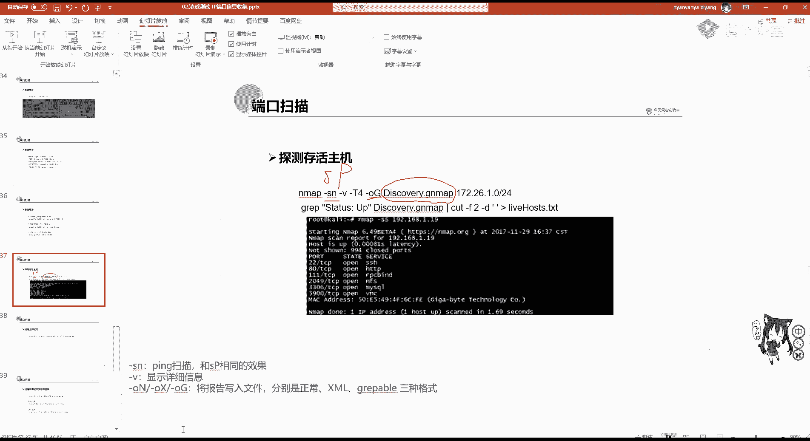

就扫描我们这一卡丽在这个网站就行了，这里我直接给退掉了，这里扫描扫描述就是那些端口吗，这个和天是有i d s的，你会扫到扫到海的filter，那我们这里看imap，首先看一下我们的ip地址啊。

189135，进行一个192。1168。18，9。0224，进行一个扫描，它会扫描，这是可以看到扫描的一个结果，那他是告诉有四个啊，这个是开启的，那我们可以cat一下这个，这是扫描一个结果。

那有up有down down就是关闭up是开启，那我们这样看是不是非常复杂非常复杂。

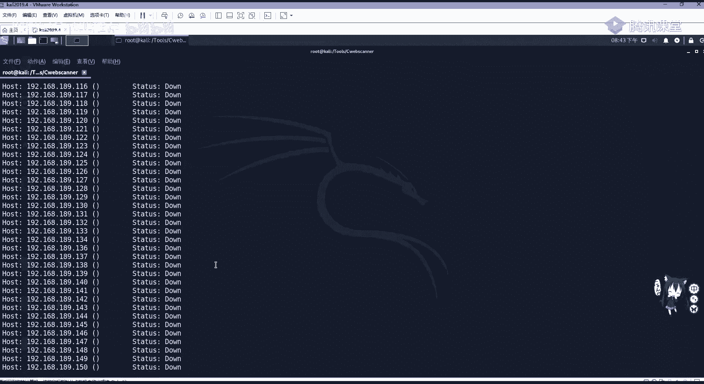

那我们可以使用linux自带的啊。

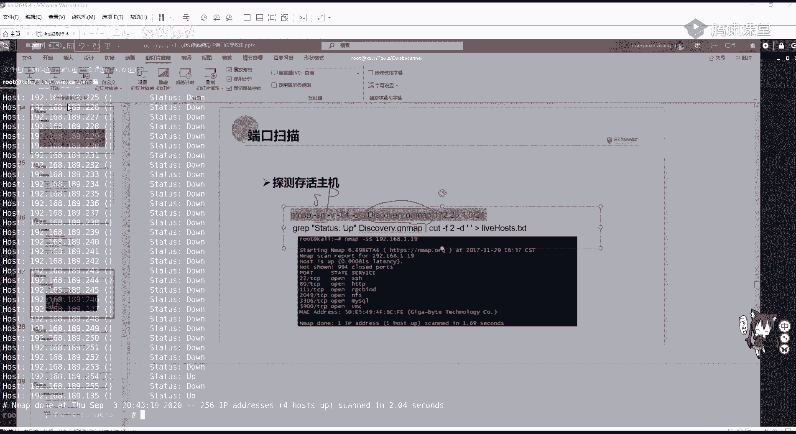

g r e p和cut进行一个查找，查找之后的这个内容放到live host，点t i t这个文档里面，使用g i e p去查找up的这个东西，直接复制过来。

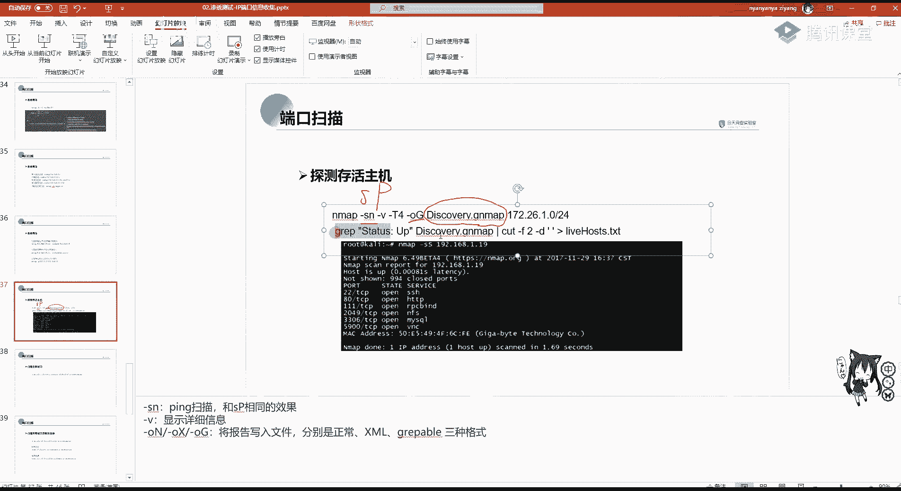

呃它放来之后，我们去查看这个live host，那这些就是开启的，可以看到135，我们本机这是开启的一个存活主机探测。

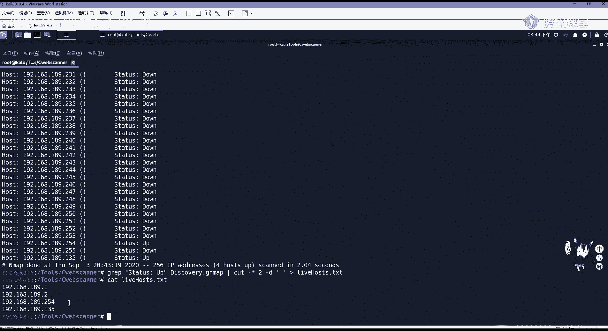

它速度也不慢也不慢啊，非常快的这个，那我们可以对存活的主机，也就是刚刚我们就进行了一个c段探测，进行一个全端口扫描，在全端口扫描的时候，我们一般不推荐使用sp和sn，因为i c m p会接收响应包。

他会发包，并且接受响应，有一个叫tl值，他会接受响应的，那我们一般是使用s y n进行扫描，s y n，大家如果学习tcp ip的时候，应该知道，当我们进行tcp第一次握手的时候。

是由客户端发给服务端s i n这个呃数据，然后进行一个回复sk，那s y n这里呢就是单独s y人扫描，它不会从服务器接收响应，这样的话就可以更好的防止ids对我们访问，进行一个探测。

还有把ip给封锁掉，p n呢就是no ping，不使用ping杠p杠v杠七四杠已经说过了，杠p就是指定端口，我们对全端口进行扫描，杠o是使用output导出，导出什么呢，导出normal，使用默认导出。

导出名称为负tcp，对live house。tnt里面的这些进行一个全端口扫描，那我们来看s i n扫描，在n mp中叫做半开放式扫描，它不会进行一个完整的tcp连接，它的特点呢是执行特别快，效率高。

因为一个tcp连接需要三次握手，而s选项不需要握手，a map发送到通过s y n包发送到远程主机，不会产生任何的绘画，也就是说，目标主机几乎不会把连接的这个日志，记录到系统日志里面。

那这里因为它特别慢，就不给大家演示了，下面还有一些常用的n map语句啊，这里就是这些参数刚刚都已经讲过了，好s y n扫描，no pain output。

以那个n map的gmap的格式进行一个扫描啊，下面sv进行一个版本探测，高o是查找操作系统，就是是探测操作系统，刚s v探测每个服务的版本号，当然你探测的东西越多，它的速度就越慢。

这些是一些常用的命令，同时nmap也可以进行一个漏洞扫描，在我们imap的screams这个目录里面，它是有很多这个扫描工具的，这里有非常多，可以看到有cv一编号可以进行进行扫描。

包括三把一些服务永恒之蓝都可以进行扫描，这里啊比如说进行扫描m s17026 ，他是45端口，也就是桑巴服务的一个漏洞，我们使用45端口杠v显示详细信息，然后杠杠cript指定我们要扫描的。

扫描这个脚本，3a啊，这个ghost也就是这个零八，这个17020进行对192168。一点，这个网段进行全部的扫描，如果有的话，我们就可以利用现有的p o c，或者是mata split进行一个攻击。

获取服务器的shell权限，在这里对a map大家有没有什么问题，它的适用，当大家n map还可以使用python，python，有n map这个包的，也可以使用nmap辅助python脚本的编写。

下面我们来看其他信息收集，其他信息收集一般是对一个历史漏洞设计，也就是啊我们现在拿到一个网站，它是cm连cm s或者是sync p h p阿帕奇亚，我们当探测到这些中间件，或者是网站的架构之后。

我们需要对它进行攻击，那攻击我们不可能是自己写攻击脚本，那我们要拿现有的漏洞，也就是查看历史漏洞信息，这里有几个平台，首先乌云，因为乌云的栅栏是已经早就关闭了，但是乌云镜像它上面还是保存了很多东西的。

这个你去百度搜索或者自己搭建都行啊，这里无人镜像很多路人甲，路人甲，无人大佬，路人甲补天，带头大哥，第二个就是乌云的知识库，这些啊都会发给大家，乌云的一个知识库可以在这扫描啊，比如说你这个想学啊胖啊。

就搜索r o p，这上面就有r o p的一些知识，想学s s r f啊，直接去搜索，下面呢是一个explode db历史漏洞，包括e x p的一个搜索，这是一个国外的平台。

在这里我们想搜索阿帕奇有哪些漏洞，那我们可以在search这里面输阿帕奇进行的搜索，可以看到啊，这是阿帕奇输入这个漏洞，包括其他的一些呃，它有的是有这个e x p的啊。

explode我们可以直接把它下载或者是查看，然后直接拿来用就行，还有c bug也是非常好用的等等，还有其他的啊，这个是指导创意平台的，都差不多，这里可以看啊，有些是有详情的这些啊。

wordpress或者是深信服的1b2 宝塔的未授权访问，这些漏洞可以去查看历史漏洞信息，并且搜索该如何攻击进行攻击，还有信息收集，社会工程学，社会工程学一般啊用在我们这个。

比如现在我需要对一个网站进行渗透，我需要登录到后台，发现这个后台登录页面没有sql注入，也没有逻辑漏洞，也没有任意密码重置，但也没有弱密码，那怎么办呢，我们发现这个这个网站后台登录页面呢。

有一个管理员的邮箱，那我们就可以伪造，相当于伪造一个公司的高管或是其他的客户，对这个网站管理员去发发一个邮件，教育邮件进行一个密码攻击，就像我现在在向qq向你发一个，请告诉我你的qq密码啊，就是这样。

这个钓鱼，那是不是工程学，大家觉得哎这个好像没什么，但是它的危害是特别大的，像电信诈骗一般都是使用社工库进行查找，就比如这个徐玉案，就是呃山东省的这个高考信息招生平台，这个被窃取。

然后通过啊壮阔等把这个库给脱了下来，这这些高考招生信息就泄露到黑客这个受理，这个黑灰产产业的这个受力，他通过个人信息进行骗取，导致这个徐玉玉啊，这个最后死掉了啊，这是一个电信诈骗的社会工程。

学的危害是非常大的，那在真正的互网过程中啊，也是有会遇到这个社工钓鱼邮件的，这个攻击是经常的呃，多钓鱼邮件就告诉你啊，企业邮箱现在要升级了，你要告诉我你的姓名职位，手机号码还有密码。

你看这个姓名职位其实都没有必要，主要是要这个密码啊，主要是要这个密码，同时也有这个钓鱼页面，钓鱼页面啊，这个mata split，还有cba striker都可以生成钓鱼页面，或者是卡里里面自带的。

你可以去搜索生成钓钓鱼页面啊，去掉个人信息是用这种问卷系统，或者是我们可以在呃之前啊，前几年在qq空间可以发现有什么啊同学录啊，或者什么问卷系统啊，其实就是就是对你的个人信息进行一个钓鱼。

或者是伪造一个抽奖啊，抽奖的时候，你需要输入你这个游戏的账号和密码进行抽奖，让你输入他的后台，就抓到了你的这个登录的密码，那你的账号就泄露了，那这节课那就到这里。

主要是讲了ip及端口的信息收集在社会工程学，大家如果有感兴趣的话，可以自己搜索一下，当然现在国内的社工库是肯定都没了啊，这个是不要轻易去搞这个东西，但也没有什么用，你在挖src的时候。

你是不能用社工的作业的话，嗯我想一下大家啊，对用啊，用用nmap或者是是今天讲的这c web，看对我们还是公司的，其他的没有个授权可听lab。com啊，进行一个c段扫描。

扫描ok并扫描是并扫描和天lab，一扫描我们公司这个网站的这个呃开放端口啊，开放端口，这是第一个作业，第二个呢是你搭建一个，搭建一个windows xp之前的的操作系统，之前的操作系统。

或者是啊这个linux d版本的操作系统，比如啊这你可以装一个win server，2003啊，这是尝试啊，如果你觉得啊不会我们后面都会讲都会讲，然后使用nmap，包含包含xp，包含xp。

你可以自己去使用吗，a map啊，使用a map进行一个就是你搭建这个虚拟机之后，对虚拟机啊，对你这个虚拟机，也就是你的靶机进行一个端口扫描，并利用漏洞，获取法计算，啊这是尝试啊尝试而不是常见。

那我也会把这个啊呃放在我们这个文档里面，大家不要去扫其他的站，扫其他站也可以扫s rz啊，但s2 z你也扫不到什么，这个在实际的你去挖src，其实nmb你去扫也扫不出什么东西。

因为这些三八服务别人肯定第一时间修复别人，运维和嗯安全工程师也不是吃白饭的，这些主要是在工作中啊，这个户啊，那你扫描你会发现有很多，特别是在内网中，你一扫那m s080671702011 堆啊。

一堆直接cover strike，能带出来一堆机子，那我们把这个啊，我把这个复制到这个里面，这是ip和端口信息，第一个作业就是用nmap扫描，第二个啊是尝试，你要是做不好的话，没有没有关系。

如果是零基础的话，做这个就是可能要去自己搜索一些知识，大家要常用搜索引擎啊，常用搜索引擎，搭建windows xp或win server，2003，虚拟机在使用nmap进行虚拟。

对虚拟机进行一个端口扫描，并利用漏洞过去把机器啊，这些windows xp和2003都是有很多漏洞的，你可以直接去利用框架，或者是已经写好的脚本去打，可以自己尝试一下，ok那大家现在还有什么疑问吗。

对这节课一个使用，包括就是你如果对面试的时候有什么疑问，都可以问，或者问我们班主任都会有一个知道，那大家如果有什么问题的话，可以在群里或者私聊我进行询问啊，如果环境搭建不好啊。

我会给自己给大家详细讲解啊，或者是我远程连接手把手教，ok，那我们这今天这节课就先到这里了啊，谢谢大家听讲，还记得要交作业，要交作业交到班主任的啊，这个这个后面交作业是有奖学金的啊，还有还有证书。

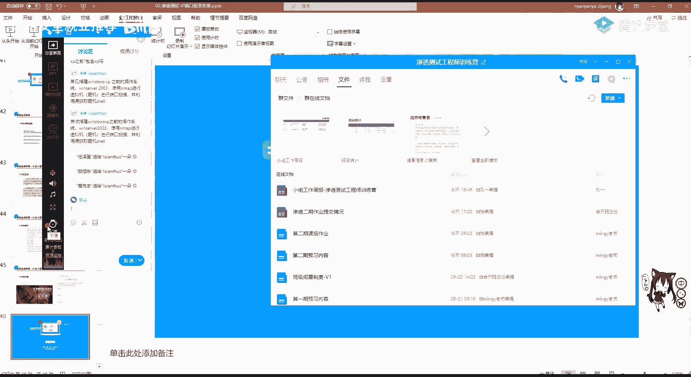