# 【B站最系统的网络安全教程】北大大佬196小时讲完的网安教程，全程干货无废话！学完即可就业，别在盲目自学了！！！ - P43：第4天：网站信息收集 - 网络安全就业推荐 - BV1Zu411s79i

我可以大家能听到声音吧。

我们马上开始今天的课程，嗯今天已经周五了，感谢大家来抽出自己的周末的时间来听课，要等八点钟准时开奖，大家如果有问题的话，可以在群里面问啊，不只是只有我一个老师的，还有其他的嗯，老师。

也可以私聊我进行询问，这是哪里不会的哈，那我们开始今天的课程，今天就是信息收集的最后一讲了，我们在拿到我们渗透目标之后，首先进行域名信息收集，ip信息收集，端口信息设计。

最后呢就是对这个web服务器及网站，进行信息收集，因为我们一般的渗透目标，都是对web站点来进行收集的，像我们大家去玩s r c啊，肯定都是挖这个网站或者是app漏洞，你去挖系统漏洞。

挖c v e这个就是啊很高层面的一个漏洞，挖掘了就是二进制方向，漏洞挖掘就不属于渗透测试的一个嗯过程了，那这里呢我们如何对网站的信息收集，今天我们就来一一的讲解，其实非常简单。

无非就是这三种网站指纹的识别，敏感文件及网站目录的探测网站wolf的识别，wolf呢是web应用防火墙的意思，那我们首先来看网站指纹识别，什么是网站的指纹呢，我们首先要了解一个网站最基本的组成。

就是由服务器，中间件，脚本语言和数据库组成的，那么服务器也就是操作系统，一般呢是有linux操作系统和windows server这两种，中间件为web容器，也就是开启八零端口的web容器，有阿帕奇。

tom cat nginx等等，还有脚本语言js p p s p s p s p。net，还有python的django和flask等等，数据库，mysql sul server。

oracle access等等数据库，这些四个东西组成了我们的web网站，为什么要了解网站的一个指纹呢，很简单，如果我们发现一个漏洞文件读取漏洞，我们需要读取敏感文件，比如etc password。

但是如果是windows系统，根本就不会存在这样一个文件，那我们就需要首先知道它的一个操作系统，操作系统这里判别一般是通过三种方式，第一种p pin之后之前也说过，是以i c m p有一个t t l值。

windows的tp l值一般为128，linux呢则为64啊，一般为128，那我们可以确定当t t l大于100，一般啊，我windows服务器，而小于100的一般为linux服务器。

这里啊可以给大家去看一下，很简单，你就去拼一下就知道了，比如说我现在拼我们的本地这个机子啊。

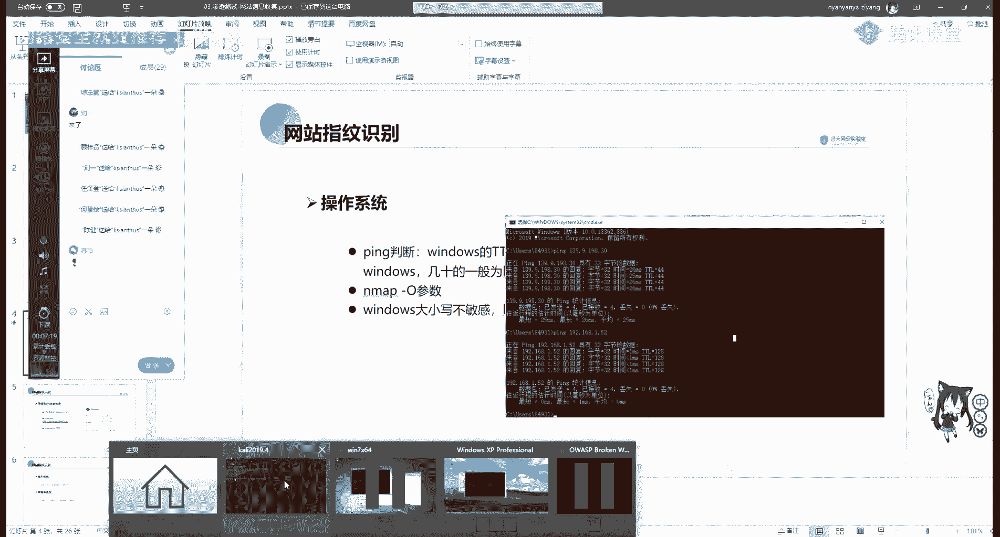

本地就是回环地址，127点点0。1看是不是128128，说明我们win 10是windows nt操作系统，我们去定卡里，这卡里我们来看一下它的一个i p地址，它的ip地址啊。

这个135我们把它给复制下来，进行p，可以看到这里是64，也就是小于100的，那就很明显可以用，一般你不能说确定一般几十的就为linux 4。

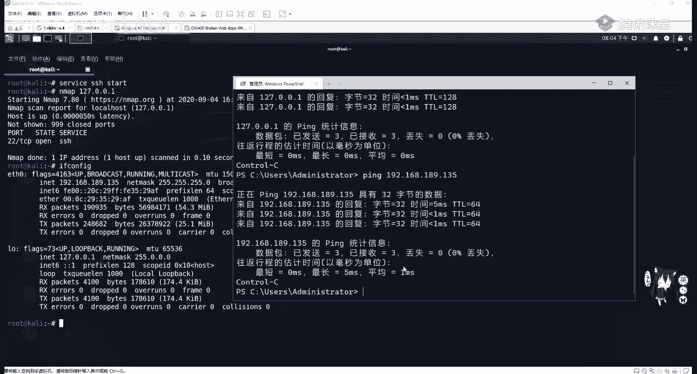

第二个方法，使用我们昨天讲的nmap goo参数进行识别，mf杠o，比如我们现在啊，就是对189网段进行一个便利扫描。

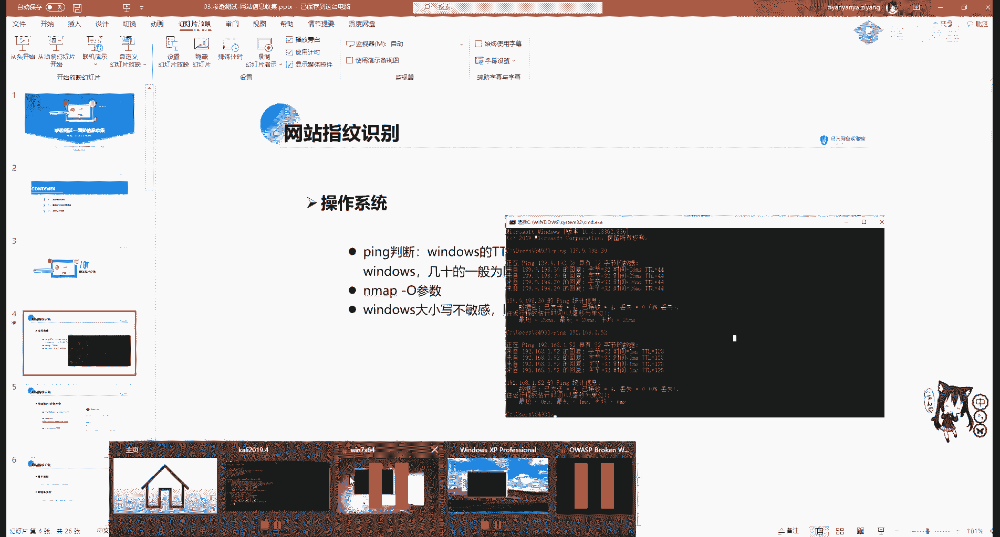

并判断每一个网的一个操作系统，那我们我先把这个一些虚拟机都打开。

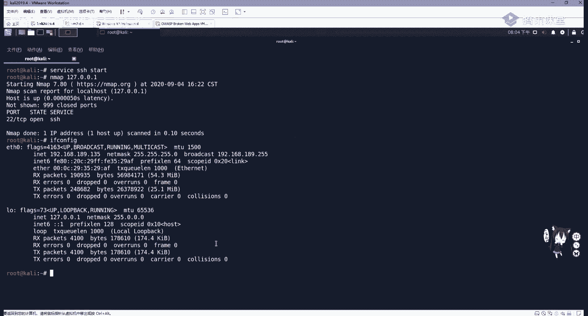

他们都是处于一个网段，用一个net网卡的。

要使用nmap杠o在杠啊可以干pn，也就是不使用ping在杠t4 ，ok在杠a也行，指定我们的192。168。189点，加上我们的杠二次子网掩码，那它去扫描，来看一下。

这些imap的参数大家不一定一定要去死记啊，大家多敲两遍，你差不多就知道了，不知道的时候就翻出nmap中文手册，或者是直接在命令行里面敲n map，它就会显示它的一个用法，ok让他先在这扫吧，既然这扫。

那我们继续看，还有一种叫做windows大小写不敏感。

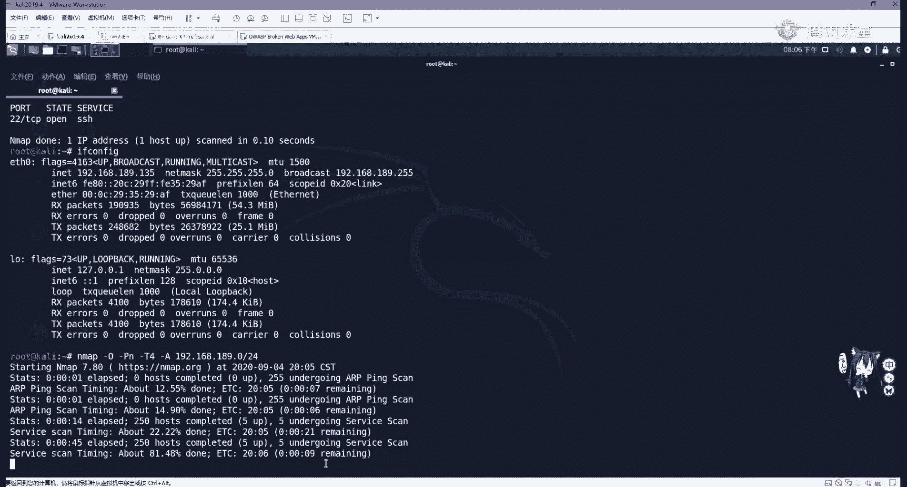

而linux区分大小写，这里我们最直观的地方就是在url地址栏里面，这里我给大家举个例子，比如这个windows xp系统，我们开启了p nb study，里面呢我装它的一个地址是133。

那我们访问一下他，访问一下它里面，我已经装好了dv w i，我们可以把它扔进去，定义之后，我们啊随便点个地方，大家可以看到这上面的u r l地址都是小写的，我们windows服务器是大小写不敏感的。

那我们把这个dv大v i我随便改一个为大写啊，我改成d大v会发现访问的还是这里，那么把index改成个大写，访问的还是这里，这是最明显的区别，windows大小不明暗，那我们再看linux操作系统的。

再看这个linux操作系统。

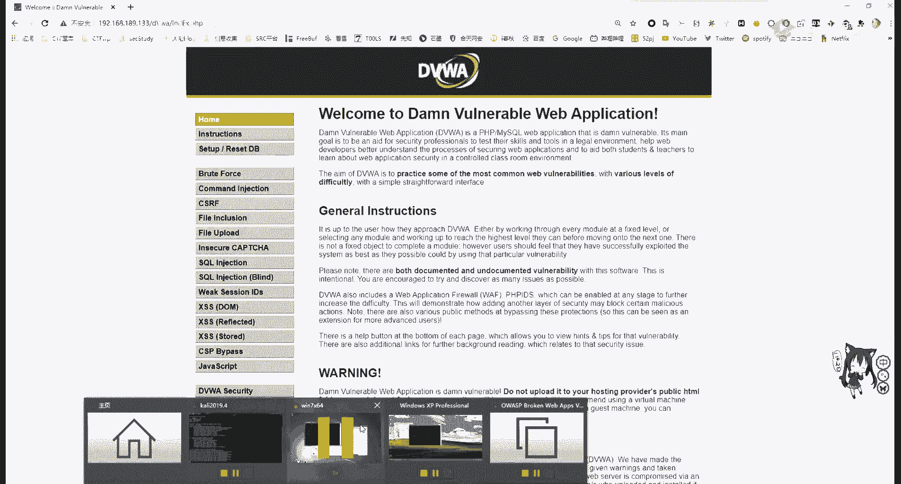

这个服务器地址是139，是o w s p bw i，这个操作系统我们访问它的ip地址，139。

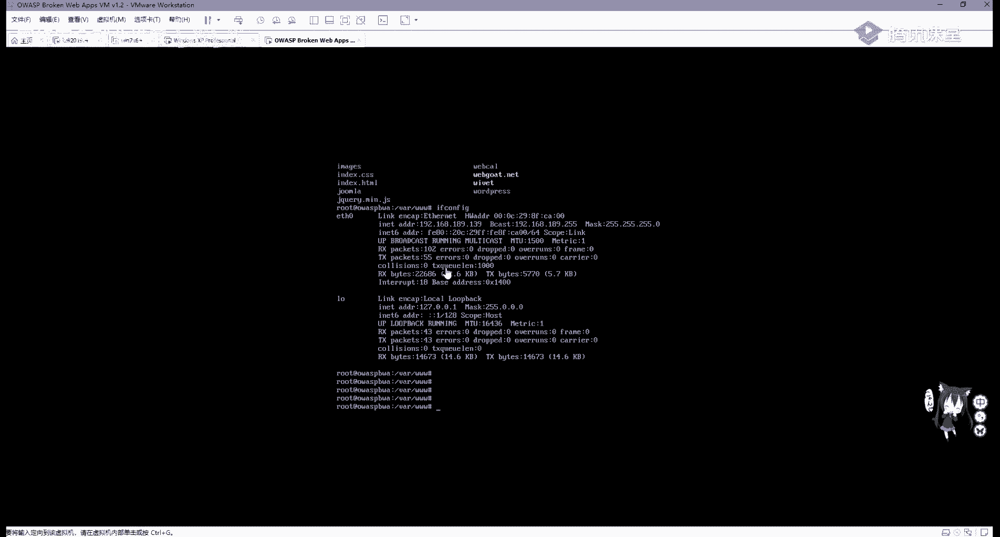

ok我们随便来到这个网站中，比如我们来到这个c i l c这个地方，ok那我们据说大写啊，这不行啊，我们随便改一个，比如说把l改成大写，就会把自动转换成小写，会帮我们自动转换成小写。

让我们访问他的第一个w i，没有的，没有基本单位，行吧，那这里就是如果这里改成大写的话，那肯定是不能访问的，大家可以自己去尝试一下。

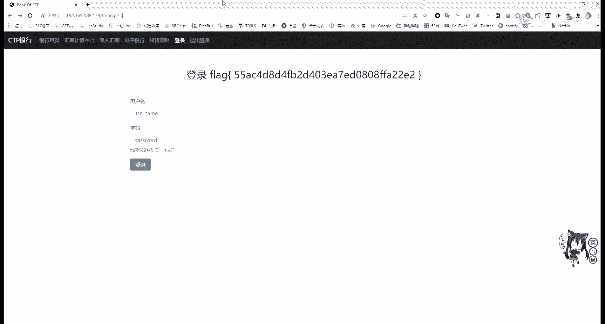

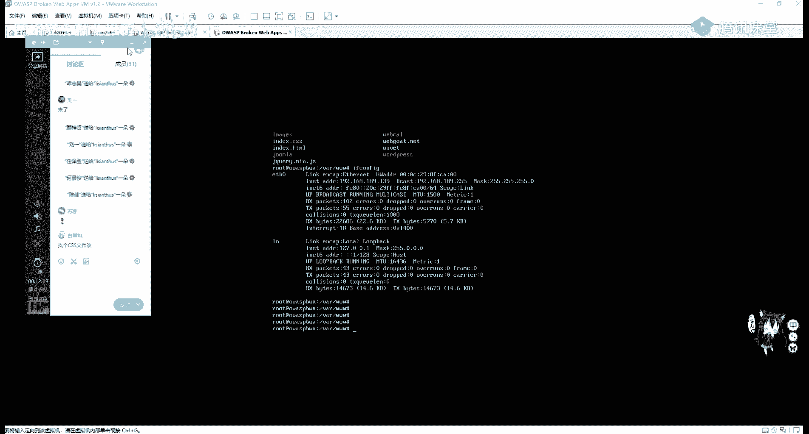

嗯看这这还没下海，快下海。

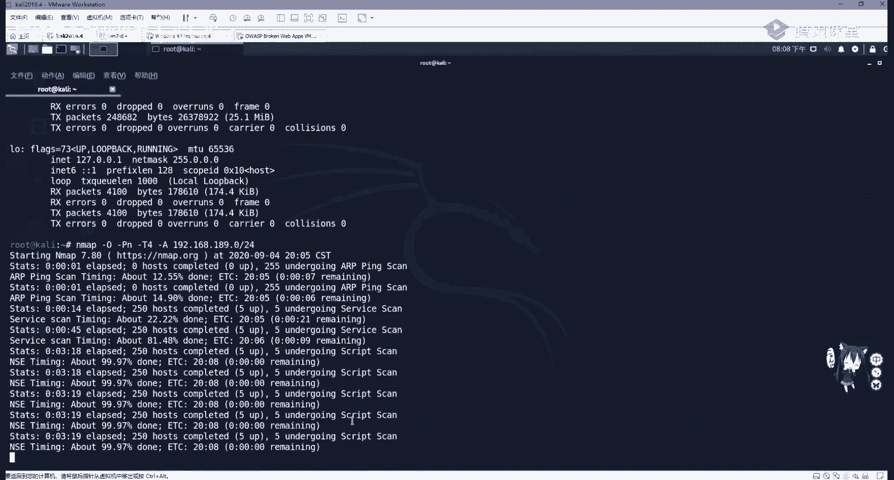

操作系统判断之后，我们还可以对网站的服务，也就是容器编程语言中间件进行一个啊识别，而识别中间件，为什么，因为阿帕奇这些中间件是有很多漏洞的，我们如果能正确的识别它的版本号。

包括一些库文件都是具有一个啊漏洞的，那我是不是就可以直接利用，那我们先查看网站的一个服务或容器类型，第一种方法通过f 12，这里我就拿合天网安作为一个测试，如何去看呢。

在f 12之后会调出我们chrome浏览器的一个呃，调试界面，调试界面我们一般是属于这个叫树状，这个html前端页面还有network，我们选中network网络页面之后，按f5 进行刷新，刷新。

我们可以看在下面看到很多请求啊，我们看到点action，其实这个就是用struts to这个啊，就是写的这个框架，然后第一个选中我们这个域名一样的地方，3w和tlab com。

使用它之后就会出现head pdk，这能不能放，可以放大，我们选中headers之后往下拉，有个叫做response headers，然后下面有个server nginx，可以发现它是这一个中间件。

这是第一种方法，第二种我们还可以利用web接口和web接口，vs web这个接口我就不给大家演示了，就和战甲战甲之家是一样的，第三种方法也就是最方便的，也一般是使用这个浏览器插件。

这个浏览器插件大家可以去这个官网进行下载，大家可以去他的官网也有web接口，可以一个查询的，然后他官网之后啊，这一个look look at，嗯在这里我们可以去查看它的一个输入优化。

l之后它会分析它一个指纹信息，当然它也是有个浏览器插件的，可以在网上商店里面进行搜索，或者你打不开网上商店的话，可以去fire fox或无浏览器进行下载，或者是下载一线版。

然后安装进chrome浏览器即可，那我们打开它之后就非常方便了，只要点击我们浏览器右上角的这个插件，它就会告诉我们这一个啊用了什么插件，包括中间件服务器jquery库。

还有一些bone trap ui框架等等，通过插件也可以帮助我们判断脚本类型，比如p h p j s p s p或python，这里我们判断这个脚本类型，一般是看网站的一个后缀啊。

看后缀名像p a p网站，他一般后面是点p a p j s p的话，就是比如这个框架struts to，我们随便点一个就发现他后面是js p，说明他是java server page里写的。

那我们再进行其他的呃，进行一个点击，可以看到是点do结尾，说明是使用的stress to模块或点action结尾，我们可以通过经验进行一个查看，x s p s p x是啊。

这个i s p和s p到net进行编写的，数据库类型一般my sql，super server，access oracle，可以进行一个指纹探测，在搜狗map也可以帮我们去探测这个指纹信息。

我们需要知道是什么语言，才能针对性的进行文件扫描，文件上传等一些后续渗透操作，比如菲律宾以及上传木马的话，要上传pp吗，常见cms识别cm叫做内容管理系统，是通常用于网站内容的文章管理。

网站的管理员并不是每一个人都会写p p p，比如一个新闻系统或者是一个博客系统wordpress，那他并不要求你会复杂的前端代码，或者是博客的交互代码，我们只需要来到wordpress博客网站后台。

去用markdown或用自带的wordpress编辑器进行编写博客，或者进行一个主题切换，进行网站设置，用户创建权限修改等等功能，那这个系统统称为cms，cms框架是有很多漏洞的。

可以说cm养活了大部分渗透测试工程师，如果没有这些cm s的存在，我们根本就不知道去挖什么漏洞，那常见的c m s有很多，比如之梦discuss p h p c m s等。

我们可以通过在线识别工具进行识别，或是通过网站的banner进行识别，在线识别工具也是通过web接口，我们可以打开去看一下啊，我们在这里输入url地址，它会帮我们识别，但这里识别的不是很准确。

一般我们还是要通过手动手动去查看，比如一个逆向的破解五二破解论坛，这就是如果大家对病毒分析，逆向破解有兴趣的话，应该非常清楚，这个论坛可以看到它最下面左下角的banner，就会告诉大家。

hard by discuss，也就是用discuss论坛进行编写，进行框架进行写的这个网站，discuss到底是什么东西呢，我们可以百度搜一下，可以发现它是一个啊通用社区论坛软件系统。

那它是有很多漏洞的，我们如何去寻找它，应该还记得昨天讲的一个a e explode db，这个网站，或者是其他的一个历史漏洞网站进行查找，我们在这里复制过来，我们的discuss进行搜索。

会发现这上面有很多，6。01。0二点版本的，包括啊circle注入代码，执行任意密码重置啊，都可以打开去看，然后这方旁边就有e x p就是漏洞，利用脚本或者漏洞利用方法，同样我们的织梦。

包括p h p c m s都可以这样去查找，那p n p c m s啊，是一个内容管理系统啊，这这网站怎么崩呢，ok他现在已经更新到v9 了，v9 ，那我们可以看到直接去百度搜p h b c m s。

它就会有一个链接是嗯sql注入漏洞，那我们也可以在这个网站进行一个搜索，可以看到啊，他很多版本一个漏洞，下面呢我们也可以利用其他的online on tools，进行一个呃内容识别。

第二敏感文件及目录探测，在网站管理员进行搭建网站的时候，有可能会遗留部分敏感文件，比如数据库配置文件，备份文件等等，我们可以去搜索敏感文件，去拿到服务器关键信息，通常敏感文件和目录有以下。

github和git svn，这三个分别是我们代码库，代码仓库的一个备份文件，当网站管理员将代码上传到github，并且克隆到本地时，如果没有对github点，git进行一个隐藏或者删除的时候。

就会泄露仓库信息，我们可以利用工具，直接把网站源码给直接down下来，d s store，这个是mac os，也就是苹果操作系统的一个网站，一个文件系统备份系统。

接下来的web i n f和一些备份用文件，其实网站管理员进行一个遗留问题，那我们如何去发现和查找这些泄露文件呢，首先我们来看github泄露，github是一个全球第一的一个代码管理仓库。

我们国内有个比较相似的叫gie，开发人员将代码上传到网站，一般我们在写博客的时候，比如hexo进行写博客的时候，会将博客备份到，也就是上传到我们的代码仓中，在上传的时候没有删除一些重要的信息。

比如邮箱信息，s vn信息，关键的账号和密码，数据库连接信息等，尤其是内部的账号和密码，那我们可以通过在github上搜索，公司的一些特定信息，查看是否有程序员将信息上传到了github上面。

那github大家也可以去啊，没有的同学可以去注册个这个账号啊，这上面工具也都特别多，我们可以在这里搜索，比如搜索和天lab，搜索on githu，ok这里我们并没有看到公司的一些泄露信息。

啊可以看到这个是我们和天晚安的一个月刊，b站泄露，b泄露，就是网站管理员将本地仓库与远程仓库进行，互相备份，克隆的时候所遗留的git文件泄露，我们可以使用gtk进行自动化，对泄露。

将直接把这个远程仓库给客人的北京本地，那它使用也非常简单，我们直接将它克隆下来，然后使用网站的url加点git即可，就会将整个的网站源代码给down下来，它的成因是因为开发人员使用git进行版本控制。

也就是对网站进行部署，本地仓库和远程仓库进行相互备份，如果配置不大，那get文件就会被部署到我们的线上，回环境是以相对路径点git进行存储的，svn svn和git一样，都是一个版本迭代的功能。

那我们也可以使用svn explode，这个工具进行一个泄露，这些因为没有现成的一个网站进行搭建，大家如果在做c d f题目的时候，有可能会遇到s v n，包括git泄露等等。

那我们和天实验室是有相应的这个实验的，一会会告诉大家，大家也可以去搜索一下，下面web i n f，web inf是java jsp web应用的安全目录，如果在页面中直接访问，其中文件。

必须通过web。xml文件对访问的映射才能够访问，那这里还是有一个泄露信息的，比如阿帕奇的任意文件读取，大家都可以进行一个简单的了解，那这些网站信息的收集，在我们渗透测试的一个过程中是非常重要的。

我们达到资产，首先要对这个资产进行批量的扫描和收集，第二就是我们要收集网站的备份文，件的备份文件有可能是ph因货，或者是一个z r i p，现在一个管理员他比较懒。

他把这个网站的源代码都打包成一个t r r包，就放在了3w目录下，那我们可以通过web直接访问这个t r包，直接下载下来，那它的源代码是给泄露出来了，泄露出来之后。

在源代码里面我们需要去查看configure文件，进行查看，网站配置后台密码，数据库密码等等，进行一个数据库的渗透和登录，包括网站泄露源代码之后，我们可以使用代码审计及一些自动化审计脚本。

进行一个代码审计，发现其中的漏洞，也就是进行白和渗透测试，那我们通常搜索网站备份文件，备份目录使用几个工具，分别是7k b sky will pass，爆破这个软件啊，其实啊并不是太好用。

这些软件在我们的可见，小姐姐的工具包里面都有，都有它使用我就不多讲了，这些都是汉语，大家拿过来肯定就会用，后来肯定就会用，这个并不像well shark consuit那么复杂，点get it。

get it是github的一个访问文件，当这个管理员把这个git的这个备份文件上传到，就是上传到线上环境的话，它比如说会在这个http 3 w i i s s。com，它下面就有一个这样的一个文件。

就有一个这样的文件，那我们就有这样一个网站，那我们直接用behk把它给跑一下，就会把整个网站的源代码给跑出来，下面呢我们对敏感文件还有一个目录的探测，我们需要发现敏感文件目录，或者是可以利用的后台目录。

现在我们拿到一个网站，发现他并没有后台页面，那我们如果如何如何去寻找后台呢，有可能就是通过一个目录探测，目录探测工具，一般这三种都挺好用的，一个御剑啊，御剑是个老牌了啊，遇见老牌，它虽然很老。

但是也挺好用的，挺好用的，这也是一个中文的啊，我们可以在这选择，包括di r就是文件夹或者是asp网站，sp到net网站，p2 p网站，jsp网站，还可以设置它的线程和探测，200或300301等等。

403等重定位的纯对位状态吗，现在出的两个比较好用的，就是d i r search和di r map，这两个工具，我们分别可以去github上面把它克隆下来，怎么打不开呀。

ok那我这里因为有同学比较疑惑如何克隆，那我这里再给大家演示一遍。

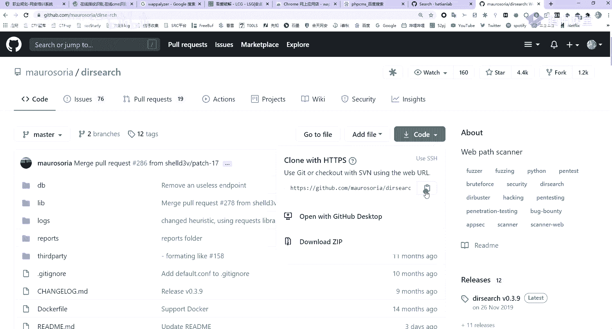

那我就来到我们的卡利里面。

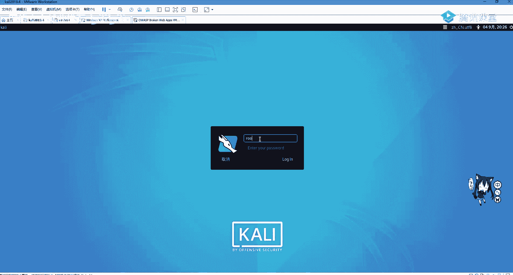

克隆什么意思，就是下载就下载，把那个远程仓库给拿到本地，那克隆很简单，就使用git加克隆，然后加上我们这个点get的这种文件即可，如果大家这个网络环境不是很好的话，他克隆的有可能速度是比较慢的。

大家只需要耐心等待，我们克隆之后，就会在本地生成一个，跟我们远程仓库相同的文件名称，d i r search，那么c d进去啊，c d d i r search cp进去就可以看到这些文件。

看到这些文件之后，我们需要去查看它如何使用，查看如何使用。

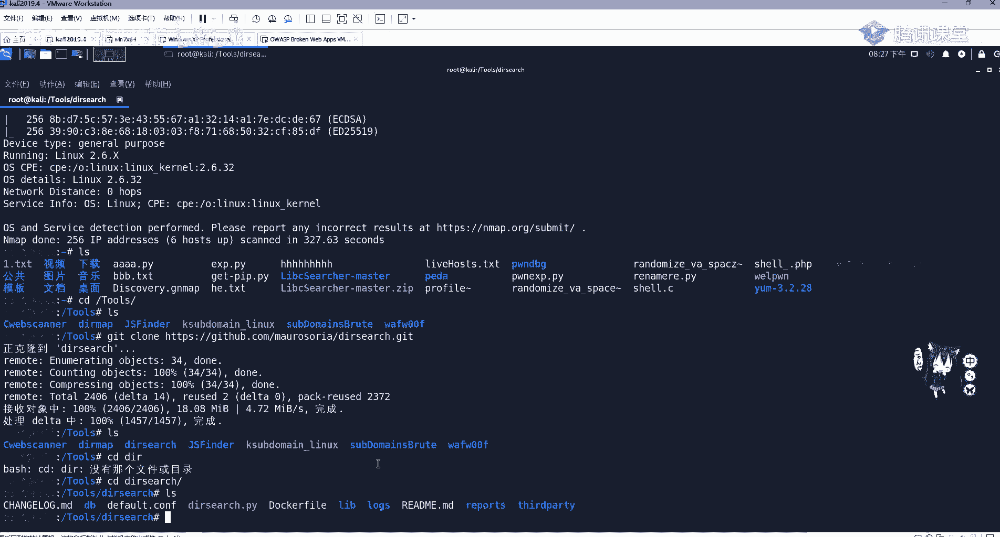

点markdown文件告诉我们应该如何使用，那么我们使用非常简单，使用python python 3杠u加上url地址，再加e加上我们的拓展，额外就是后缀名是菲律宾还是等等，我们可以直接进行一个扫描。

这里下面也对我们这个进行一个例子，比如扫描ht tp s target网站的p p t，s d v i p内容，即可使用这一句这个命令啊，大家要常看这个read me read me，股市啊。

我们在本地都可以的都可以的，只要你装了git就行了，只要你装了git就行了，在windows也行的，在windows也行的，你看我帮你看一下吧，这是windows，我们可以cd到我们的c盘啊。

get都可以的，啊这怎么我复制在这个地方呢，是是一样的，哎那个复制，ok这个你应该知道是啊，这个啊我挂了这个代理啊，这个代理已经失效了，这个克隆不了，其实正常是可以的。

我这是代理问题，代理问题，那我们拿到这个之后，我们现在已经知道如何使用了。

那直接上啊，gr search。d r i设置点py杠u加上我们的，比如就拿我们一个本地的本地的来看了。

本地的来看，因为这个不好拿别的进行一个扫描。

就扫描这个133133，ok我们来去访问一下，晃一下，直接把它复制过来，进行一个粘贴，然后杠e加上什么，我们菲律宾再加。

你想加什么加什么t t，然后比如zip ok进行一个扫描，可以看到发现了一点tt，我想扫描的是很快的，发现d v w m录，后面还有log。p a p发现pvp my admin和p h b info。

p h b info大家应该都非常清楚了啊，ph info特别清楚了，p h呃，my army，它是有一个啊任意文件文件包含漏洞等等，我们可以利用它进行一个期权等等，它是有漏洞的。

而我自己写的smart一些数据都会给我们报出来，那我们也可以报他的一个下级目录，比如说我们现在已经爆出来dv w v i了，那我继续加个dv w v i进行一个爆破，那它速度还是非常快的。

啊这里可以看到read me啊，robots set up这些关键的一个代码，下面呢还有一个工具是dr map，它和dr search比较相似。

那我们来打开看一下它的read me，他说这个功能会强于啊这个dr bdr search。

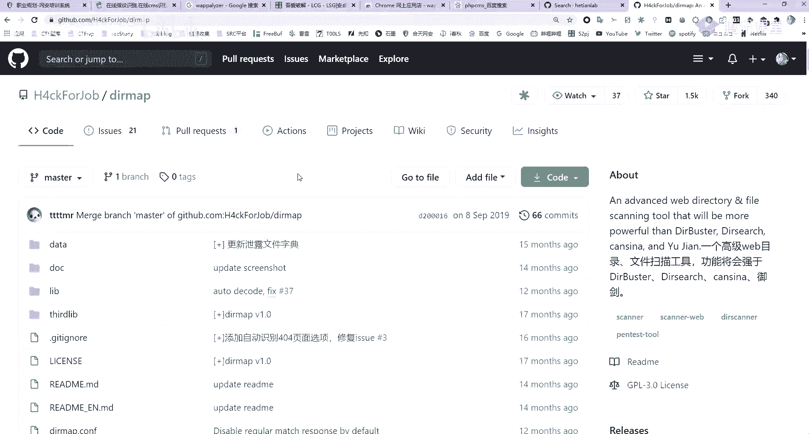

还有遇见，那我们来看一下它怎么样，它是具有一个并发字典。

爆破父子插曲等等，那它的使用方法啊很简单，就是python看dmp，将gui也就是啊input导入，然后使用http u r f u l l杠l cf l cf，在这里我们来啊简单来看一下，就是好。

我们刚刚的那个ip，这里我跑的是我自己搭建的这个网站。

大家可以去跑s r c，s r c你也跑不出什么，但是在真正渗透测试的时候，我们会对这个目标进行跑一遍的，我对目标进行跑一遍，那它安装我就不再讲了，因为就直接克隆过来就行，克隆过来的dr r map。

我们cd到里面可以发现，大家如果在运行的时候会出错，是因为没有模块，python是一个模块化的语言，这个模块在哪呢，在我们的这个requirement这个文件里面。

可以看到这个需要given request l xml这些模块，那我们可以使用p i p加上install，啊这是han 3，可以加p i p3 ，install requ杠二require。

requirements，把这些给一次安装完，因为这里我都是已经already已经安装好了，大家安装好之后就可以直接进行一个运行了，它如何运行，那我们就看这个github的read me啊。

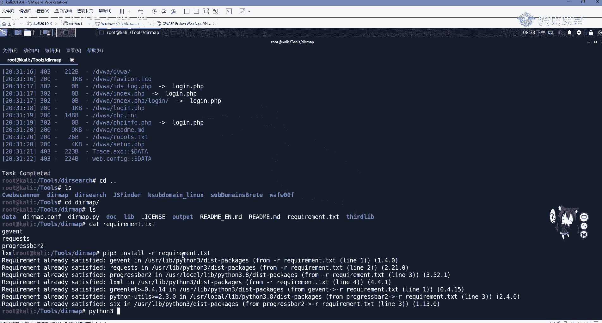

大家不需要进行记忆，不需要进行记忆，然后直接把它copy过来就行了啊。

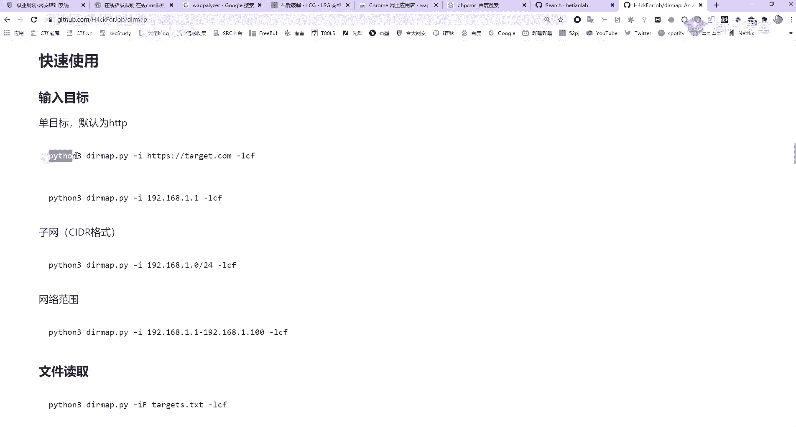

这copy过来，然后将这个url改成我们自己的之前的一个，之前的那一个url地址，那我们把它给copy过来，我们来看它的效果如何，当然这些都是非常快的，就是非常快的，它不像遇见啊，遇见还是比较慢。

因为大家都知道，python 3的效率还是要比gi要高一点，ok他他也找到了不少，他也找到了不少，也找到不少，那我们也可以是他的d v w i，那具体的使用方法啊，大家就是嗯可以自己去试一下。

那有的同学啊就有疑问，我们去爆破这些这些文件，那我们为什么不直接去看一下呢，就不接的，不直接到我们三大目录下去看一下呢，是因为我们这里我扫描的是一个我自己搭建的，比我们能看到源代码。

能看到源代码叫做白盒，而我们真正做渗透的时候，你是看不到源代码的，除非你是利用我刚刚说的，get泄露或是其他备份文件泄露，进行一个源代码泄露，否则你进行的是黑盒测试，也就是进行一个探测，爆破。

进行一个渗透啊，他也找到了不少这些关键的东西，它都都能够找到，都是差不多的，就是速度要快一些。

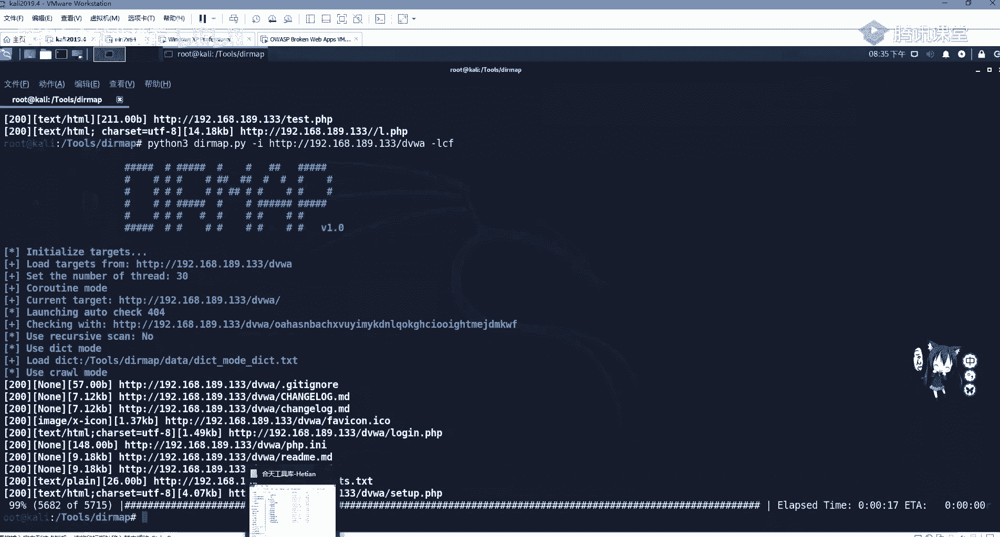

还有一个叫针对漏洞的信息泄露啊，漏漏洞的信息泄露，这里我们用的是spring框架的一个信息漏洞，信息泄露大家可以关注一些论坛，比如先知社区free bu或者一些微信公众号。

这些或者关注我们和天智慧的一个微信公众号，这些都会有这个漏洞的一个讲解，用spring boot这个框架漏洞呢，它是有信息泄露漏洞的，s v n信息泄露，那我们可以利用它去泄露网站的一些敏感信息。

啊这个e vn信息泄露，比如说这里就会泄露这个在挖src的时候，这个还是有的是有的，这个现在还是有的，你可以去找一找，看，这会泄露我们这个oracle的一个信息，包括上面一些包的信息。

有的里面还会有这个啊，username root啊，username root，包括密码信息，邮箱信息都会泄露在这个e vn里面，这个是未授权访问，我们直接拿ui l加e n v进行即可。

那这里我们怎么发现它，那很简单，就是要用目录探测，不然的话，你怎么知道它是有e n v这个目录的呢，那下面最后一个也就是啊wolf的一个识别，现在的一些网站网站管理员，他自己不会做防护。

也不晓得不清楚自己写的代码水平如何，有没有漏洞，那很方便就有waf的出现，那wolf是web安全，web应用防火墙，一般可以分为软waf和硬wave，那硬件画就是看到那个铁盒子啊。

铁盒子那个是一个硬件waf，包括i d s流控等等，那软件的waf呢，一般是通过一个白名单或黑名单代码，进行一个request包的过滤，过responsible响应包的一个过滤。

wolf呢比如有免费的安全狗，或者是知道创宇的wave这些是免费的，或者是现代一些的中间件宝塔，宝塔面板也都是具有buff的，并且阿里云，阿里云盾安骑士都是可以防御一些基础的攻击。

比如sql注入这些基础攻击是都可以防御的，那我们在做渗透测试，如果遇到waf，遇到版本比较老的waf，就可以搜索如何绕过，或者利用一些注释或者是url编码，双重编码等，绕过waf的限制，绕过弯限制。

我们不能够进行盲目去绕，可以经过副词或者是对waf进行识别，精准绕过，那我们如何对wolf呢，wolf就是web web of application fire，web应用防火墙，用于保护网站，防黑客。

防网络攻击，安全防护系统，那大家在五花sr c的时候有可能看到哇，我找到了一个，找到了一个旁站，一看用order by一看，你能看出它的力，然后用sql注入语句一看，咦就提示安全狗云锁啊。

这安全狗云色告诉你，你被你被这个你被识别了，然后你使用sql map进行一跑，2i p就被封锁了啊，安全狗，对于现在网站，你是挂有安全口，其实还是挺好的，不过它的一个缺点就是你如果挂着这个安全口。

他这个这个公司他会不停的给你打电话，让你升级产品，让你升级产品，这个就是比较麻烦，那我们看如何去识别袜子呢，第一个就是我们用手动常见的wave，一种是防溅，防种各类网络攻击。

一般是防o w s p top是攻击，包括但不限于sql注入xc 4 cs rf网站后门等，第二个可以防止自动化攻击，大家知道网站后门终究实行的是什么，网站后门执行的也是一些系统调用命令。

那他这个wap把这些呃，请求包的系统调用命令给干掉，那你这个后面这个一句话木马就没有用了啊，你要做免杀嘛，要照顾up，第二可以防止各类自动化攻击，比如暴力破解，那暴力破解我们一般可以配置防火墙。

ip tables都可以进行配置，但是有的他这个运维啊，网站管理员他不会怎么办呢，我们可以用安全狗，它帮我们这个配置，那暴力破解，比如说能密码登录三次错误就一分钟再登录，你登录十次，那你今天就禁止登录。

比如你对s h或r g b进行包爆破，你登录少于登录五次失败，那我你的ip就被干掉了，还有就是一个防止批量注册，还有一个网站漏洞扫描器，i w v i s才发现这个ip有大量的数据经过。

我这里就把你直接给封锁，第三呢可以阻止其他常见文学，比如爬虫零带攻击，代码分析，嗅探数据篡改，全越权访问敏感信息泄露等等，还可以防止恶意的包含月全扫描等，这里wave还有一个作用是防爬虫。

我们一些知识库啊，包括一些重要的文件，公司的文件一般是不想被恶意爬虫的，那我们可以利用wave，或者是用前端的js进行一个爬虫防护哦，识别识别waf呢，可以通过w f w这个零零这个进行一个识别。

那它用法也是看我们的这个read me啊，很简单，可以看到它的wwf 00 f杠list，去查看它支持的waf的一个版本，非常的多，那我们直接用wolf，加上我们的这个版本号即可，但是大家要注意。

这里是进行了一个编译，安装需要时将克隆下来之后，使用python set up py install进行安装，那我们这里唉来简单看一下，看一下这里我已经克隆好了。

克隆好，那w f w00 f，但是它的识别啊是啊有问题的，它有的识别的时候，你会不会疯掉的，你i b会不会封锁的，那我们这里进行python，然后set up py install之后。

就可以直接在命令行使用我们的这个命令了啊，就可以直接在命令行使用，加上我们的这个u r l地址，u i o地址。

一般大学里面啊会使用一个防护，那我们来看啊，随便挑选一个e d u进行一个，这这搜的都是啥呀，就拿湖南大学下手，ok那我们直接把他的这个url复制过来。

来进行一个粘贴去查成啊，这里他会告诉我是有wave的，当然没有识别出来，那我们可以看一下它能识别哪些wolf gl啊，能识别的是挺多的，云盾云锁360都能识别w t s啊，最好绕的就是这个了是吧。

大家在血赚up的话，肯定第一个接触的就是他，第一个就是接触的，他他是最好让，然后匀速匀速。

我们来看一下它有没有一些航站，那我们还要狂战来试试一下，就试一下是没事的，但你却千万不要对它进行一个。

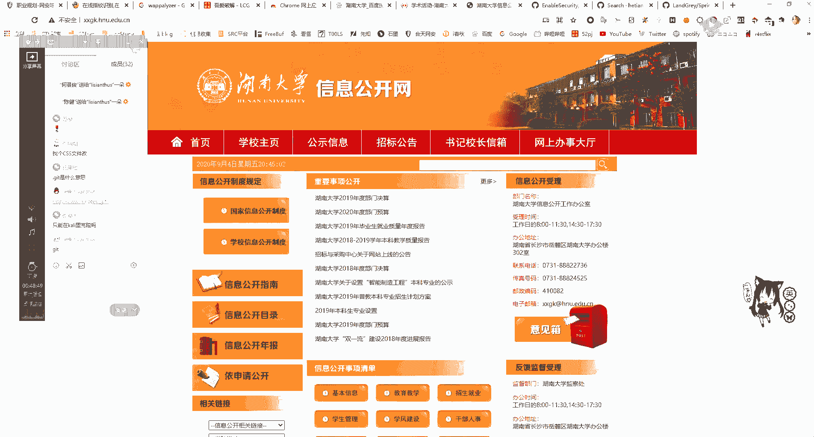

对他的业务进行一个攻击啊，不要对业务进行攻击，你就按e d u s r c的话，大家要记住啊。

就是我觉得你去挖这些啊，s r c特别是现在正处于一个招生这个状态，你去挖它，第一就是一不看，二不删，三不改，要做到这些，你不看不删也不改，你也不要去加东西，不要去给他上传一个木马。

不要去给他上传一个马，这个啊被别人抓到了，你说你是玩e d u s i c，那有点说不通是吧是吧，就是不不看不查不删，两处刮它是没有问题的，那这里我们也可以使用那个n map进行一个扫描。

但n map这个扫描wap就很一般了，我们看到这个工具其实都很一般，对它进行一个扫描，那我们这里来看一下，看一下那个wolf来随便选一个吧，随便选一个就直接用这个用百度吧。

in u r l我们随便选一个吧，试一下它有没有这个啊，算了不在这选了啊，不在这选了，大家应该应该知道了，应该知道这个挂画符了解是什么样子的，那下面呢我们对网站的收集，基本上就到这里就结束了。

那我们收集到这些信息之后，就是寻找有没有脆弱性漏洞，有没有中间件，有没有漏洞，你这个cm有没有漏洞，有buff如何绕buff啊，没有bu绕不过，包括找不到漏洞，那就是继续收集进行c段旁站的扫描。

是找它的边缘资产进行一个渗透，因为我们是生存测试，是最后是需要提交一个报告的，如果你提交报告是什么都没有，那肯定不合适，所以要对资产进行了扩大扫描，那我们在这些这三天讲的这个信息收集里面啊。

可天实验室是有具有相关实验的，大家可以去私信的搜索，并且练习有d s信息收集，那我们今天的这个作业呢，就是啊完成这两个实验，我来看一下一个imap扫描，这是以周末的周末答案时间啊。

可以利用一个晚上就可以做一下，那做一下，ok这是第一个实验啊，这个实验我写在那我们群里了，我写在这个群里，课后作业啊，大家这个账号都有吧，账号什么时候交作业，那你周周一再交吗，周一再交这个周啊。

这会员你可以问小姐姐呀，小姐姐不是给会员吗，啊还还没还没开会员呀，还没开会员呀，啊没事没事，你要是现在不想开的话，也没事啊，开了你可以去学习啊，可以去学习，其实呃实验室虽然很乱，但是东西还是不少的啊。

没事的，你要是不想开的话也没关系，那我就啊对的，这小姐姐双修双修，你可以周一再交吗，你周末交了也是周一才会交到我们的讲师，这个讲师这里，那我这就给大家写一下这个作业了，作业就是一个map网络扫描。

这个是写一下2020，今天是4号，叫网站信息收集，现在大家如果面试的话，在第一关安静已经ok了啊，网站信息收集，别的也收集不到什么了，无非就是一个工具的好坏，你工具很多，不仅仅是我讲的这些工具。

你beat up或网上一搜杂七杂八，这些论坛也会爆出工具，但有的就非常难用了啊，有的非常难用，这个是和天的一个实验，第一个第一个实验是这个叫a map map网络扫描，有人说，就直接把前面的这些顶过来。

一个imap的网络扫描，然后还有我们的第二个实验，这个外国的敏感信息泄露，也就是git泄露，jhg还s v n泄露，这几个大家都练习一下，唉这个怎么怎么一点就是这个样子，现在你可以问一下他吧。

可以问一下他，我们是有两个班主任的吧，可以去问一下啊，卡丽上面工具很多的，有自带车vs有的啊，策划的工具也很多，但是你感觉这就很一般，测不到，这是网站信息扫描，这是什么鬼，然后我再讲一个第三个作业。

第三个作业是一个尝试，你可以去一个比如说呃公益src，这些大家应该知道吧，你不知道的话去扫一下，或者是去那个找一下，或者是对一个政策，对这个漏洞盒子的重测，或者是呃这些公益src或漏洞和的政策啊。

任选一个站，啊进行一个进行一个信息收集，来看看看看能不能进行一个完整的信息收集，来信息社会收集这个熟悉信息收集的流程，啊这是个尝试啊，大家这个课后作业我都写到这里了，大家在这个呃去信息收集的话。

你有可能发现很多好玩的东西，像补天的这个公益src，你能挖到的还是很多的，他有的是占特别小，能扫到东西的，包括咱们刚刚讲的spring boot那个泄漏，它都有可能有，当然有可能也被挖完了。

他没有肯定是被挖完了，这大佬用爱w vs批量扫扫扫都扫完了，那今天就先到这里了，大家还有什么疑问吗，对信息收集，那没有什么疑问的话，呃，给他泄露，不用猜，用我们那个画画画画工具吗，用这些工具你去试吗。

它会有的，他会告诉你有的，如果有的话，你会看到它会爆破出来一个点get，然后你再去使用get hk进行一个爆破，你把这个和天时间做了就就行了，不用猜了，那大家如果有其他问题的话。

可以去在群里询问或者是问我都行，嗯大家应该知道我是哪个吧，就是啊这个我的qq也是这个昵称的，在群里面有我的，那今天课程就先到这里了，祝大家周末愉快。

