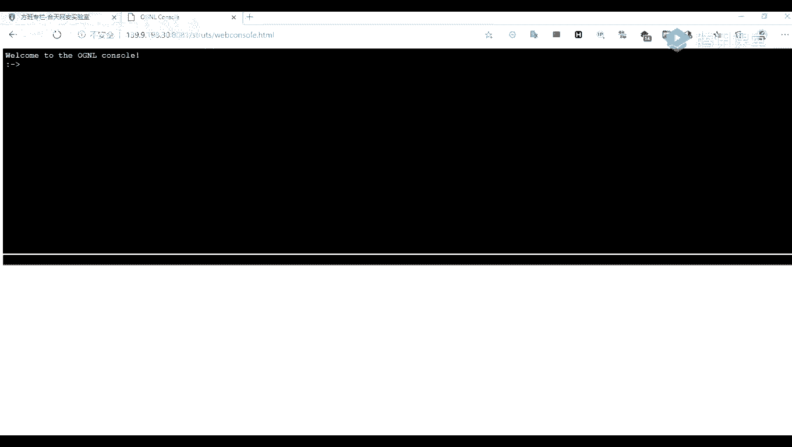

# 【B站最系统的网络安全教程】北大大佬196小时讲完的网安教程，全程干货无废话！学完即可就业，别在盲目自学了！！！ - P45：第7天：Weblogic，Thinkphp,Jboss，Struts2历史漏洞讲解 - 网络安全就业推荐 - BV1Zu411s79i

现在我们可以看到我们查查到了这个八八个表，一个user，他们以及email liquor等等，那我们我们跑出了一个表名称，我们是不是还可以跑它的一个表列，就是它的一个列名。

那你比如说然后呢我们可以在这里。

我们前面跑出来一个表明有杠杠七，杠七呢就是我们跑出来的一个前面的一个表明，比如说比如说我们这里呢好一个u，这里是一个user，是不是这个user就是我们前面跑到的一个表明，那我们在列宁列宁是哪一个呢。

就是holland c o l u m m n s，这个呢就是从它的一个列名，搞内名之后，我们来看一下，这里呢可以跑到它承载了三个类，分别是一个id password，一个以及一个username。

啊对这些呢是自己自己添加的，就是那个呢是我们用来练习的一个网站的，这个你你你在上一个的时候，应该也也有做过这一个吧，对这个是不是给我们做一个练习的，现在我们跑出来这个id还有一个excename。

password之后，password之后呢，我们还可以对它进行跑出，它里面的一个具体的一个数据，那么怎么要到了这一步呢，也就是还要再继续的话，也就是我们所做的一个拖库。

就是前面我们前面这里呢，我们跑出了它的一个枚举，得到了它的一个数据表列，然后呢我们这里呢有还有一部是拖库，拖库这里呢我们在挖src啊，或者是做一个做一个其他的一个漏洞，挖掘的时候。

我们就这个呢就尽量不要去使用，除非说我们是在做一个渗透的项目，就是别人有一有的一个授权要，并且说明这个情况了之后，我们才可以对这个进行一个使用，不然的话，我们这个拖布这个杠杠杠杠p。

这个命令就是我们最好是不要对它进行使用。

因为这个很很容易就，那个被抓进去了，那我们怎么我们前面呢我们跑到了它的一个，跑到它的一个数据表列，然后呢我们刚需刚需呢，后面就是跟我们的一个列列名，比如说我们这里的一个ip id要user name。

你要打好大概的查询，word后面就有一个杠杠杠法，也就是一个拖布，要使用了这个命令之后，他会将这些数据，我们可以看到。

在这里将它会将它的一个数据会保存到我了，我们的一个本地，保存到本地，然后我们可以是保存了。

成了一个csv的一个文件，我们可以看一下在此电脑在c盘里面有，看一下用户，在这个等一下这个a b a a b b在这里，让我们每一个搜索麦，那么这个时候map也要在output这里。

我们可以看到这个dump，这里呢我们可以看看到，我们刚刚是已经将我们的一个数据给拖下来了，原来这这个呢就是我们所跑道的一个数据，当然了，实际上我们正常的话，我们这里呢，这这这个呢是给我们做一个显示用的。

就是展示用的，我们就可以去，比如说我们这里呢是否其他的一个表。

比如说我们这里前面这一步不跑它的一个优势，不跑user给我们，我们可以跑这个user杠wd这一段，哦还有就是你们挖挖漏洞的话，就是你们在上传的时候，最好是上传一个p s p for。

你上传一个p p1 p就可以了，因为你因为你你这个不是做了一个，就是我们在挖挖漏洞的话，并不是我们的一个渗透，就是我们上传一个漏洞去证明它，去证明它存在就可以了，并不是并不需要对它进行一个。

后一步的一个利用。

首先呢我们这节课的一个super map就讲到这里，那我们先休息一下。

你们有什么不懂的吗，有不懂的话就把发在上面啊，我们休息十分钟，然后到九点我们再开始下一节课，哪一个跑调法的，哦我在我前面，不是在预习内容里，啊那个因为我们一个时间的一个原因。

币就先不讲这一个方便我们抽有时间的话，对待会需要换一个教室，后面我有时间的话，也会给你们讲一些其他的一个就是方法，而且你们这个这个sol sol mp和脚本呢，并不是那个刚刚splay那一个参数。

一般都是用来就是做一个wap。

我们是使用所使用的是这一个下参数，就是手动的话我们还是需要进行一个手手动的，因为我们在测试的时候，我们一些参数啊，或者是一些其他的，我们可能并没有做的那么详细，我们可以在手动的时候。

就手动跟这个工具进行结合相结合，比如说我们手动可能tip劳动的时候跑到，我们发现它存在这个漏洞了，存在了这个漏洞的话，我们就可以使用工具进行一个跑，因为因为使用工具是使用工具跑的话，我们直接加速杠杠。

那个杠杠怎么处理不了，加个杠杠bbs就可以了，而不是我如果我们手动的话，我们还得一步一步的拆拆到的一个数据，这个ten temple这个脚本的话，它其实也是，比如说他会可能它可能是它里面。

它内置了许多的一个four bu的一个解法，比如说可以有一些可以绕过空格的，我来看一看它是在哪里的，好比如说在这个tap里面，他已经它内置了许多的一个底板，但默认的这些脚板要到我这里呢。

给你点一下这个吧，ptember吧，让我看一下，比如说我们这里有一个select，我这里呢，这里这个语句已经将一个select进行一个过滤了，比如说我这里，你你懂的话，就直接那个吧，就那个那个，哦不对。

这里不用不用这样，我们对这个是一个数字型，what the fu，斯内，哦我们我们可以看到我们这里呢，我们这里呢输入了一个select对吧，这里呢我们注入了一个select。

但是在这里将我们的这个select，将我们的一个select我们它的一个sql语句在这里呢，将我们的一个select语句给过滤掉了，过滤的过滤掉了，那么我们这里呢就就使用这个小节的一个select。

就不能进行一个诱惑了，但是呢我们可以使用我们的一个脚本，因为我们脚本的话，有一些它内置了许多的一个绕过的一个脚本。

就在我们这里，房间是一个一个，python，pen 27的cfm，等一。

bbs，然后看一下后面，让bbs，然后再加加上我们的一个杠杠。

放小一点吧，刚刚ea，sample，em，e r，然后后面后面跟我们加上一个刚刚temple，就是使用我们的一个脚本，使用它的一个过waf的一个小本，在后面呢就是跟我们的一个脚本名字。

比如说我们这里要过滤过滤了一个select，我们可以找一个关键关键词绕过的一个脚本。

比如说我们使用这个，这个脚本可以做一个关键词的一个绕过，这个呢这个脚本呢，它的一个实际上它的一个用法呢，就是在它的一个关键词，在关键词里面插入它的一个注释符，比如说我们这里一个select对吧。

然后他使用了这个脚本之后，就就会演变成这样子，就会前面演变成一个s1 ，它可能是这样子插入，也要直接杠插入一个注释符，这样子，那他这样子，但这样子呢是不是，但实际上它里面这在我们使用了这个脚本之后。

它就会将我们的这个语句演变成为这个select，演变成为这样子，那么我们就可以对它进行一个绕过，还有他或者哎呀，那就是一个比如说在关键词添加一些百分号，比如说这个脚本，这个脚本大的一个作用呢。

就是在我们的一个关键词里面，一添加一些百分号，比如说这里有个百百分号，在这里也有一个百分号，就这样子添加一个百分号，但实际上就是这样子的一个原理，就是在我们的一个就是看它的一个脚本的不同。

然后插入的一个地方也有不同，插入的一个内容也不同，比如说这个脚本是插入一个注释符，要要第二个呢就是加入一个百分号，我们还可以，就是可能是通过一些双鞋关键词双写，这就是这个这个脚本就是做一个关键。

关键词双写，进行一个要过，我们这里呢也可以试一下。

就使用这一个吧。

应该有有这个标本吧，哦诶没没有没有这一个三内置，我找一个摇的吧，比如说我们使用这一个吧。

我看一下这个行不行啊，现在我们加上一个杠杠的一个参数，大v参数呢，就是显示我们的一个python的一个变化，反转，第一个pon，那我们可以看到它跑跑的一个数据。

我们这里呢我们可以看到它的这个，我们这里呢可以看到它是不是将我们的一个，这个东西就是我们的一个关键词，进行一个随机大小写了，明白了那就好，那我们我们再再休息几分钟吧，唉我去上个厕所啊。

我们这个这边呢先上课，你们遇到另一个教室吧。

啊。

好了，我们开始第二节课的一个内容，就是我们上一节课的那个，刚刚那个temple那个参数，我们在使用那个参数的时候，我们就是需要知道我们的网站，就是对哪一些关键词进行了一个过滤。

然后才可以对它进行一个对应的一个使用。

然后这节课呢我们给大家讲的是我们的一个，我们比较常见的一个漏洞，with a logic的一个应用里面的一些漏洞，还有一个think pad p里面的一个漏洞，为什么点这个呢。

因为我们在实际上的一个声道中啊，我们也会经常会遇到这些漏洞，我们前面呢我们讲的是，我们前面那个三节呢都是讲的一个工具，这节呢开始我们就开始讲这一个漏洞，现在就分别对这两个就是应用点一下。

它存在的一些漏洞，以及它的一个利用方法，我们先来看一下我们这里呢分为四个部分，其实也可以说是两个部分来讲，第一个那就是我们讲一下weblogic，这个apologic是什么。

以及它的一些漏洞的一个利用方法，第二个部分呢就是我们讲一下，我们这的一个think pad p是是什么东西，然后用来干什么的，以及它的一个漏洞产生的一个位置，还有一个它的一个利用方法。

我们先来看一下第一部分，relogic的一个相关介绍，它实际上是美国onica公司出品的一，个epileelication server，这是一个应用服务，就接着说它是一个基于java一的。

一个java的一个中间件，你可以说是一个容器，web容器，如果说你知道那个阿帕奇以他们k的i s，那么你就应该知道，这个weblogic，实际实际上就是把我们开发的一个java应用程序。

运行起来并提供服务的一种程序，这实际上它是一个中间件，或者说是一个web容器，那么嗯那有哪些特征呢，首先呢第一个是端口，端口呢它是一个开放在7001，就是默认开放在t001 端口上面的一个不。

170011端口，你们在前面讲的一个端口信息收集，应该也也提到过这些部分，第二个特征呢就是excel的一个web界面的一个特征，这是一个l404 ，然后放的一个页面，它是这样子的一个页面。

比如说我们在这里呢给大家做一个访问，看一下是多少都搞来的哦，7001我们前前面点了它的一个，它的一个特征就是它的一个7001端口，第二个呢就是它的一个web界面，这个界面呢我们访问这个砖头。

但默认的就是这样子的，一个就是404的一个界面，如果我们在一个渗透或者是一个挖漏洞，就是挖s i d的时候，我们看到这种呢，就是说明它是一个riologic的一个中间件。

那么你们前面就是有同学不知道什么是s i c，s r c呢，就是我们一些厂一些那种大的公司啊，比较大的公司，比如说比如说一些百度，百度啊，阿里啊，360啊等等的一些，一些那种大公司。

他们是一个一个应急安全应急响应中心，也就是一个叫做src，比如说这些aj华为啊，京东啊等等，我们我们的话你们前面就是收集的一个子域名，就是在应该就是在这里面进行一个知道的。

比如比如说一些爱奇艺或者是一些叮叮咚，以及一些什么我的世界等等，那你们这个应该就是收集这些，s rp的一个子域名，现在我们在平常那时候，就是可以在这里面做一个那个挖洞挖漏洞。

所以你们可以把你们所学的一个知识，就是在这在这上面进行做一个练习，比如说现在在这里呢也也有一些礼品，分别是一些京东卡或者是其他的一个东西，啊这这个呢就是它的一个特征是，分别是17001的号。

已经是零四东方的，那么我们为什么要剪这个weblogic呢，首先这个vivlogic的应用非常的广泛，特别是在我们在内网中啊，在内网中我们可以可以，你们如果有一些同学是在公司里面的话。

应该有也有看到过这些apologic的一些应用，它应用的非常的广泛，应用广泛呢，而且它的这个漏洞也非常的多，它的一个历史漏洞非常的多，比如说门这些常见的，比如说一些d v1201 g10271 l。

一边28942618等等，以及它的一个入口令，还有今年今年的aj发生的一些漏洞，这里呢都给大家列列起来，接着呢我们只做一个简单的一个介绍，下面呢我们来讲一下它的一个利用，所以呢我们这个利用方法呢。

我们先来看一下去怎么去获取到它的一个资产，也就是说获取到存在，就是安装了这个vivlog这个中间件的一个地址，领着我们，第一可以通过我们的一个网络空间搜索引擎，比如说炸弹魔法生活之眼等等。

诶这个不都可以，不过呢建议就是挖一些比较小众的，就是那种那种肉，就是sg，因为你那种就是挖那种比较大众的话，都比较多人挖，像这种的话都很多人挖的，可能就比较难进行难挖到，就你们可以将收集到的一个子域名。

然后放到aw vs里面，让他去进行一个扫描，就是要注意一点的的时候注意要注意一点的是，我们要注意注意，不要把他的一个网站给搞崩了，腾讯这里呢可以看到啊，我给你们发这一个吧，在这里呢列了许多的一个fc。

现在你们就先做一个信息收集，然后再进行一个漏洞挖掘，好这里刚讲完这个，比如说我们在这个佛法，这佛法呢实际上它是一个网络空间搜索引擎。

我们这里面大有也有一个，就是我们可以在这里发现一些想要的，我们想要查询的一些东西，比如说我们这里呢就查，我们这个讲了一个weblogic，所以呢我们这里可以查询这个weblogic，点击查询。

因为我们这个不是会员的话，我们能查询到的数量有限，比如说我们这里呢随便走一走一台啊，我们这里走一台看一下，我随便找一台机器，那么它这里呢访问呢也是一个404。

404的一个页面，他端口的话它是开放在5555，这就是他修改了它的一个默认端口。

现在呢我们也可以就是找到这里，来让我们找这个7001，我们找到这个t001 这个端口。

现在我们可以发现我们应该访问的话，都是都是这个7001端口，另外呢就是通过一个谷歌a课，就是利用我们的一个搜索引擎这个语法，我不知道你们有没有讲过，就是in ur l也要加上一个漏洞地址。

比如说我们那个漏洞，他可能是，发生在这样子的一个链接上，我们举个例子啊，比如说他在这里要怎样，比如说它这个ui l它可能是它的一个漏洞，但是这样子发生在这这样子的一个地方。

那么我们是不是就可以在这个另一个谷歌语法，的in u i l，u r a l l，要加上这这样子的一个链接，然后呢它我们注入这样子的一个语法，它就会给我们列出我们从这个ip里面。

然后后面这样子就是它会就会列出，u21 里面存在这样子的一个，一个结果，就类似于这种，还有一个呢就是一个in title，就是再就是它的一个意思呢，就是在我们的一个标题里面。

有一个weblogic的一个标题，包含了这个weblogic这个字段，原来我们前面呢主要是简单的讲了一下，它的一个特征，还有他找如何去寻找它，看到我们这里呢就点一下它的一个利用。

利用呢首先呢我们这里有一个脚本，就是可以对它进行一个变量的扫描的，并且这个标本标本里面已经结合了，就集成了许多的一个p o c uc呢，也就是我们一个漏洞验证的一个脚本。

这是一个检测我们漏洞是否存在的一个脚本，也就也叫做b c，它的使用方法呢是非常简单的，我这里，哦我我这里呢我我下载下来了，你们待会呢也可以，可以是自己去进行一个下载啊。

我就不下载了之后我们打开一个cmd窗口。

我们这里呢我们是使用一个一个python 3，python 3进行一个执行的，这个二的话好像是也是可以的，但是但是最近改成一个删了，现在我们国家的人呢就使用一个python 3，我们下载下载了之后。

我们可以看到，这里呢是它的一个下载下来的一个文件，我们我们在从上面下载东西之后，我们一会就看到这个有这这个脚本，就是这个requirement，requirement，这个脚本就是这个文本。

我们就去那里面呢，就是告诉我们需要去下载的一些模块，这需要去安装的一些模块，你们可以将它理解为就是它的一个依赖，就是需要下载的一个依赖，安装的一个依赖，那么怎么下载呢。

我们只执行一个python 3条杠，m杠m后面加上一个p i p pp，就是通过这个p i p进行一个下载p p store，然后干啥干啥，就是搭了一个文本名称。

加上一个文本叫ie q requirement，requirement，这个加上这个文本要让我们回车，回车就会像我们我们的一个依赖，就是或者说是一个模块进行下载下载，下载完了之后，我们在这个插件等。

tx t这里输入我们的一个地址，就是web logic存在的，使用了这个apologic这个中间件的一个地址，然后我们输入进去，输入进去之后呢，我们执行一个进行一个检测。

然后杠s杠f呢就是跟跟我们的一个文本发给。

那我们也可以看到它，这里呢已经在进行一个扫描了，并且他已经给我们找到了许多许多的一个漏洞，存在的一个漏洞，因为我们这个apologic上面他经常是一个版本，比如说这里呢是一个10。3。6这个版本。

它一个版本里面，就会可能会存在很多的一个漏洞，经常都经常都是，可能是今年在这个10。3。6，发动的这个漏洞，然后明年明年还是在这个10。3。6，发生了另一个漏洞，就是这样子，我们需要等它进行一个扫描。

然后我们可以看到360扫描到了许多东西，比如说今天它扫描到了第一，第一条就是扫描到它承载了一个控制台。

控制台呢也就是它的一个web的一个登录界面，我们输入一个consol就可以进行一个访问了，cn r l e，是这样的，啊大家大家正在一个步骤啊，那这里呢应该是一个控制端的。

一个这个web端的一个把那个管理界面，哦这里进不去。

我我访问一下。

看看能不能，哦它是这样子的一个界面，就是它的一个管理端，我们这管理都断了，因为单单做了一个就是限制，但是我们不能进行一个爆破，不能使用进行一个报告，我们就可以就是对这种，就利用一个手工进行一个尝试。

手工去找可能存在的一个入口令，比如说它的一个默认密码，找它的一个它的一个默认密码就是一个web mobi，口令呢也是一个wiflogi，那默认密码呢是这一个，如果说他没改的话。

那么我们就可以通过他的一个默认密码，进行一个登录，在这里呢是不能登录的，他们的密码并不是一个maplogic。

那么我们还找到了上面的这些漏洞，比如说这个这个28932725等等，那么我们怎么去利用呢，用我们的话我们就善于去利用这个搜索引擎，也就是我们的一个百度，或者说是一个谷歌。

我们这里呢可以通过百度它的一个利用方法。

像这种的，我们都可以找到我们他的一个相关的一个文章，多多找几个看看是怎么去进行一个利用的。

下面呢我这里呢有一个利用，就是2725的一个利用的一个脚本，我就这里呢就不再进行一个字找了。

这边左脚一个利用了一个脚板，这个呢就是它的一个利用的一个摇摆，或者说是一个他的一个e x p，也就是我们的攻击的一个去用来执行命令，或者是上传，上传我们的一个木板，或者是其他的一个这个e x p。

也就是可以说是一个pilot的，因为这个e x p p o c以及这个拍照的，就是有些人就是觉得它是一样的，其实这个呢也也可以这样子进行一个理解，并没有太大的一个区别，我们呢就出现这个第一个调法。

可以啊，那漏这漏洞存在的一个路径是在这个的，就是一个2725的二的一个漏洞，存在的一个路径是这个，看一下能不能，我这里抓猫给抓了，啊这个呢就是它的一个漏洞存在的一个路径，就是说我们能访问到。

就是访问到了这个我们这个2725，我们扫描到这个2725之后。

然后并且我们能访问到这个路径的话，那么它就很可能会存在这个漏洞，哦我刚扫的是一个13909。198。30，这个可以可以看一下这里。

并且我的一个。

这个这个它这个目标也也是一个13909点，198。30这一个，刚刚访问不了的，刚刚我访问不到，是因为我这里抓包将来进行一个拦截了，那那这个这个呢，这里一个利用方法是比较简单的。

我们直接将我们的这个我们先进行一个折包，我们这里呢也抓到了它的一个数据包，这个呢就是它的一个数据包嗯，原来我们可以直接将我们这个2725的，它的一个拍照的，下面的一个2725的一个final的。

直接复制过去就可以了，比如说我们先将这一个地址是换一下吧，在这里是一个13909019，8。3017001这一个，那我们接下来我们也在这里呢，将它做一个这个house进行一个修改，修改了之后。

我们直接将这一部分的一个内容，所有所有的内容都复制到这边来，现在我们我们这里呢我们执行的一个命令是k，是查看这个edc password能执行一下，可以看到我们现在已经执行了一个，这个执行了这一个命令。

edc password去查看它的一个密码文件，我们还可以去执行一些提到的命令，比如说查看它的一个i p，你可以看到我们这里呢，就可以去随意去进行执行命令了，下面呢我们来讲一下这个dp hp 5。

首先呢我们来看一下这个think p h p h p，它是一个快速电源，化解轻量的一个氢，简单的一个精量国产屏，国产的一个p h p开发的一个框架，这个呢我就不全不念了，简单的看一下这一刻吧。

然后呢我们来看一下这个think的菲律宾，它有什么特征，首先呢就是这个它的一个页面，那因为呢我们能很明显的就是看出来，它是一个link菲律宾的一个网站的一个页面，比如说我们这里可以访问一个。

啊比如说我们这里你可以看到这，我们可以很容易的就发现它是一个think bp sp，使用了这个框架的一个网站，还有呢就是搭载一个页面，就说我们可以随便输入一个页面，8089嗯，比如说一个pd pc官号。

等于是随便输入看一下，我们可以看到它的一个错误信息，它的一个错误信息哦，那也也可以看到它的一个，它是一个使用一个定的ppt开发的一个网站，那么大那有哪些应用呢，我们很多一个gm。

就是其实就是基于这个定p p h p，进行二次开发的，所以说如果我们一个dk p p，h p要出现问题的话，就会影响很多，基于这个dk p p开发的一个网站，就是就是可以理解为。

我们前面就是有一个一个主主应用，我们可以理解为是一个主应用，是一个定的pc p，要上面呢有很多一些只应用，如果说我们一个主应用，就是我们的一个think的菲律宾出现了一个问题，就是出现一些漏洞的话。

那些子应用就是基于这个think p h p开发的，一些子应用，也会也会受到一个影响，我们最常见的就是一个kn cms，一个内容管理系统，以及一个think cm f。

你还有一个b u t gm s e1 cm等等，这些gm都是基于我们这个dk psp，进行二次开发的，这个think的bp跟我们前面讲了一个vivlogic，是一样的，但存在着很多的一个漏洞。

就是发生过很多的一个漏洞，我们制定了一个呢就是一个pink pg p，五点几的一个远程代码执行的一个漏洞，这个呢我们在网络上搜一下，你能发现很多的一个介绍，比如说有一个远程代码漏洞。

我看一下这个漏洞能不能找到，我们随便搜一下呢，他也可以去找到很多它的一个相关的一个文章，那么下面呢我们来讲一个，这个一个漏洞的一个利用，首先呢我们分为两个部分，一个是一个五点点二三的。

还有一个就是五点点二，还有一个5。1。29的这两个部分，我们先来看一下五点点二三的，它的一个就是，由于在五点点二三以前的一个版本中，获取这个mac的一个方法中，没有正确的一个处理方法名。

导致攻击者可以调用request任意方法，并且构构造大的一个利用链，从而导致到我们的一个远程代码执行漏洞，那么我们正常的话，我们去怎么去发现这种漏洞呢，就是说发现他已经就是历史是否存在这些漏洞。

这个呢我们就需要利用到我们的一个工具，或者是我们去进行一个自己进行一个测试，我们去测试它是否会存在什么测试呢，我们先来看一下这个版本的一个漏洞，利用，首先呢它是在这个这个ui l里面，就是。

get这个参数里面，我们来访问一下吧，看index s等于c a t t t h就在这一个里面，现在我们怎么去进行一个利用呢，首先呢我们开启一个抓包，我们将这个包给抓下来，这个呢就是我们的一个包。

现在我们将这个包改为一个post一个请求，因为因为我们访问的话，我们这里的访问是一个get请求，我们将它改为一个post一个请求，我们怎么改呢，我们通过一个右键硬件以后。

我们找到这个change request mech的quest man，这个人在这里，骗子就是改变请求方法，这里我们点击一下，就会将这个请求方法进行一个修改了，我们要重新将我们的一个路径。

给重新复制到这里来，那么它的一个post一个参数呢，就是我们这这一串，就是这一串呢就是嗯像我们的一个系统。

执行一个id的一个命令，就是id id呢就是查看我们，有一个系统的一个用户或者一个会员卖都可以。

都可以去执行一些其他的一些命令，比如说if it from it，it compete，这里查看一个ip，诶这里也错误了，看一个视频，其他行不行，在这里读错了呀，我看一下，204，是前面是打手打的一个。

比如我们执行一个，或者是指一些提到的一些系统命令，比如if装备，那直屏你不跟别个不行啊，我现在是不行了，或者是我们执行渠道的一个命令吧，图片啊，我们可以看到也可以进去查看，我们当前的一个用户。

就是一个负mi或mi命令，就我们可以看到在这里呢，并且我们返回了一个3w6 杠date，也就是我们一个阿帕奇启动的一个用户，这个呢就是我们的一个五点点二三的一个，利用的一个方法，变更大。

下面呢我们来看一下另一个，这是我们一个五点点二的一个漏洞，它的一个原因呢，就是由于没有正确处理它的一个控制器，而是在我们的一个网站，没有开启强制路由的一个情况下，就是说它的一个默认情况下。

就可以执行任意的方法，从而去导致远程命令执行漏洞，那就是我们遇到这种这个定个p7 p5 ，就是定个p c p，我们呢可以使用我们的一个脚本，是进行一个检测，进行一个批量的一个检测。

因为我们这个是实际上它存在的一个漏洞，是非常多的，它的一个拍照的也就是有各种的一个变化，我们呢就可以就是利用我们的一个脚本，去去便利这些拍照的是否能被执行，我们这里呢这个脚本这个讲法呢。

就是用专门用来扫描我们一个think的pdp的，那里面呢它内置了几几个给他一个pilot，我们可以看到它这里呢实际上是有一些变化的，所以呢我们遇到这种的话，就将这些都进行一个尝试。

这种呢是就是因为它的一个版本不同，所所所的一个做的一个变化，那我们怎么使用这个脚本呢，来看一下，这甲板，然后呢，我们在cmd里面指定一个python，python，然后我的这一个python 2。7。

9了，我就python 271电k t p1 ，后面就加上我们我们的一个杠u杠一参数，后面再跟上我们的一个url l，就是比如说我们这里呢有一个这个ui呢，就一个8090的。

这张图是这一个是一个8090的，加上我们这一个刚刚我们那的那个8089呢，是一个五点点二三的那一个版本的，然后这个呢是我们的另一个版本，也就是我们，是我们这一个五点点二版本的，能执行一下，然后看看它。

要看到它在这里呢就是检测到了一个漏洞，就是检测到我们这个ui啊存在这个漏洞，并且给出了他的一个利用的一个plo，我们直接将这个final呢进行一个复制，要拿好别杠。

后面呢就是它的一个就是echo echo它的一些内容，比如说echo test，是不是在这里呢，是不是就给我们echo了一个test，一个数据，就是现在就说明它执行了我们的一个代码。

现在我们除了那一个的话，我们还可以就是去寻找这个版本，但实际上这个版本有许多的一个i load，比如说我们找一个这一个，这是一个beat bbo，现在实际上它的这个内容呢是这样子的，就这这样子。

这里呢就是这个ph变弱，那就是它值实行的一个代码，就是给我们打印我们的一个这个服务器信息，这个呢你们都可以在网上去进行一个搜搜索，然后进行一个利用。

那么我们这节课呢就讲到这里了，你们有没有什么那个问题的话，去就私聊我吧，或者是发到群里也可以，我们就讲到这里了。

可以，那我们开始上课，然后在上课之前呢，我们看等一下，然后在上课之前呢，我们先回顾一下，我们，在上课之前呢，我们先回顾一下我们上一节课的内容，上一节课呢我们给大家讲了两个部分的内容。

一个是一个的那个注注入工具，也就是用来考我们一个sql注入的一个工具sql map，另外一个呢就是讲到我们的一个漏洞，也就是我们的一个weblogic漏洞，以及sp sp的一个漏洞。

我们先来看一下我们上一课，上一节课讲的第一个部分，就是我们的一个sql注入的一个程序，也就是一个sl map，然后呢我们是给大家讲了，简单的讲一下我们的一个思考注入，产生的一个原理。

就是简单的讲讲了它的一个原理，也就是它主要的主要是，由于我们那个对我们用户输入的一个数据，没有过滤，或者说是过滤不严，所以导致了我们可以将一些恶意的circle代码，就是参考语言的一个代码给执行。

然后就是带到我们的一个服务端去进行执行，第二个呢我们也点了，在我们的长常用来判断是否存在一个sql注入，的一个方法，就是利用一个单引号进行一个判断，点了我们的一个判断的方法。

第二个呢就是我们讲了他的一个sql map的一个介，绍，就是还有它的一个安装，介绍呢我们这里呢是一个免安装的，然后我们是使用python，因为它是用python写的一个工具。

所以呢我们是需要进行一个python的环境配置，在它执行，而是比较简单的直接执行我们的一个，一个python，然后加上我们的那个直行夹板，就可以使用对我们的这一个工具的使用，刚才我们讲到它的一个应用。

是讲了他的一个检测漏洞的一个方法，包括是单个u i l，以及那个p音量的一个u r l，当然了，我们这个呢是一个get方法的，我后面呢我会找时间给大家，就是点一下这个qq map的一些其他的一些方法。

比如说如果如果去跑那个post一个请求，我们这里呢只是给大家列出了，就是跑一个get请求，也就是直接加上我们的一个u r l，我们还点了它的一个单核u l l，以及一个批量的一个u r l。

还好这里还有我们跑出来的，它存在的这个注入之后，我们就是去对它进行一个利用，就是跑它的一个数据库名，包括说我们的一个美女所有的一个数据库，或者是就是查找当前他所使用的一个数据库。

第二个呢就是我们通过报出来，就是枚举出来的一个数据库，然后再去枚举最大的一个数据表进行枚举，以及我们媒体到它的一个数据表之后，再根据这个数据表去媒体到的一个数据表列，也就是我们的一个媒体大的一个列名。

d第四个呢就是我们根据我们的一个列名，也要去告诉它的一个数据，也就是脱裤，在多部呢就是使用一个杠杠断法的一个命令，这个命令呢我们在就是在一个漏洞挖掘，比如说我们在一个s i c上面。

就是挖最后一个漏洞的时候，我们千万不要使用这个命令，因为我们有有个那个网络安全法吗，就是你获取了一定数量的那个信息，就会就就会就是造成一个违法犯罪，这个包括这个命令呢，一般都是我们就是我们就是授权。

就是别人给你给你授权了，然并且是说明说明可以托付，然后你才可以使用这个命令，并且您做到了一个就是下载到了一个数据，也不能去进行一个传播，可能是你那个项目完了之后，人家人家让你去把它给删除掉了。

那这里呢就是一个turtle map的一个回顾，下面呢我们来看一下一个weblogic，还有就是think ktp的一个漏洞的回顾，我们讲weblogic呢，我们是主要是讲了他的一个特征。

也就是我们常用就是它的一个默认端口，默认端口是它默认是开放在7001端口上面，第二个呢它就是它的一个web界面，web界面呢它是一个404，就是我们访问的时候，是默认的是404的一个端口。

找了一下，比如说我我在这里找一个，啊比如说我们在在这个合法，也就是我们的一个网络空间安全搜索引擎上面，去搜一个vlogic。

现在我们进行访问，这个访问不到。

我看一下能买哪些能防范的。

哦类似于这种，我们默认的话访问呢，就是它是一个404的一个页面。

原来你们可能会有一个疑问，就是它这个端口端口为什么不是t001 ，因为它这里已经修改了，修改成了一个902的一个端口，所以如果说我们一个端口没改的话，就认为是在一个7001端口上面。

或者我这里找一下。

哦比如比如说这种就是没改的。

这类似类似于这种，就是它的一个默认端口是没有修改的，所以它还是在一个7001端口上面，包括这个也是我们可以看到我们访问访问的话，这些都是一个404。

这个呢我们这里也给大家介绍了，他常见的一些漏洞，比如说我们是最近的是就是今年2020年的，就是一个cv 1，它的一个cv一编号是一个20202551，还有一个是2020255。

然后呢对于这种cv cv一编号，我们怎么去找到的一个利用方式呢，我们这里呢可以利用到我们的一个搜索引擎，或者是一个give up，就是利用药水，充分利用我们的一个搜索引擎。

去对我们的一个漏洞进行一个搜索，比如说cv杠2020杠二五哦，哦我们随便找一下药，那在这里呢就会有一些复现的一个文章，那第二个呢我们就是捡到它的一个利用，以及首先呢我们讲了。

就是如何去寻找我们这个weblogic的，一个就是资产，第二个呢就是我们利用它的一个扫描，批量的一个扫描脚本去发现，就是对我们的一个资产，对我们所收集到的一个资产，要进行批量的扫描后。

发现哪哪一些是存在了这个漏洞的，以及它的一个漏洞的验证方法，好这个呢我们定pc p5 呢，我们就简单的介绍一下吧，我们呢这个think ptp 5呢，也是出现过了很多的一个漏洞的。

并且它的一个每一个版本的那个利用方式呢，也有有一点点的不同，这个呢我们需要自己去百度，或者是在我们的一个实验室，我们的一个网安实验室呢，也有这个相关的一个漏洞，好比如说我们找到一个。

就是比如说我们前面所说的，我们那里就是找到一个找一下这个，比如说这里是吧，比如说就是这里我们找到了一个就是漏洞对吧，就是在这里呢扫描到了一个漏洞，那么我们就可以利用，我们别怕上面我们访问一下。

你在上面呢也要有许多的一个，比如说我们cv一杠2020杠255，然后我们就搜索就可以了，你搜索呢我们可以看到，在这里已经有许多的一个相关的一个仓库，或者是说是到了一个对，就是一个我们可以看一下。

并且呢它这里呢它一些小板呢，可能现在都有一个摇摆，有一个详细的一个介绍，也有一些其他的一些，可能是其他的一些利用方法，然后呢我们就可以去使用这些脚本，要去对我们所扫描到的一个漏洞的一个地址。

就是比如说我们前面我们上一节课给大家，给大家给大家演示的一个13909。198，这个是我自己取了一个服务，别说找到这种了，就是找到它存在的一个漏洞，那么我们就可以就是将我们的一个u r l。

然后要用这些脚本去跑一下，有一天呢我们就是我们可以看到它在上面呢，有一些是有一些它的一个利用方法的，就是具体的一个利用方法，我们前面呢我们用脚本跑的话，只是去跑它是否存在。

但是呢我们用脚本跑它是否存在还不够的，我们需要对它进行一个利用，比如说去执行命令啊，或者是就是get shell之类的，就是不过呢，我们一般都是执行一个命令就可以了。

或者是我们在这里造一个c v一杠202杠，2019杠2725，然后我们在所有的一个上面进行一个搜索，看到这里呢我们也可以看到它，这里呢有一些危险的一个python脚本，也是一些执行命令的一个脚本。

并且在这里呢还有一些是上传微博下的，可能我那个环境的话可能是存不了的，但是呢你们可以在我们的一个实验室上面，去搜索这个漏洞，这个这个dvd这个就是我们哪个漏洞，哦然后呢我们这里呢就就过了吧。

我们开始上我们今天今天的一个内容，那你播放一下，我们今天呢也是给大家讲一个漏洞，就是一个常见，就是我们比较常见的一个漏洞，是dust to以及debu这两这两个的漏洞，那么这里呢我们也分为两个部分。

就可以说是一个两个部分，一个第一部分的，一个是一个struct to的一个部分，这个部分呢一般为两两个小部分，一个是它的一个相关介绍，第二个呢就是它的一个识别以及它的一个漏洞，利用。

第二个呢就是一个jboss的一个相关介绍，以及它的一个jboss的一个识别，与它的一个漏洞利用，看到我们我们先来看一下第一部分，just to的一个相关介绍，什么是gest to呢。

但是美国阿帕奇软件基金会，负责的一个开源的一个项目，所以到用于创建企业级java，web应用层应用的一个开源mvc框架，这个mvc框架呢，也就是我们常数常数所做的一个模型，视图以及控制器。

但主要是提供两个版本的一个框架产品，一个是start true的stress stress 11，以及一个start true，就是一个词的二，它本本质上，是相当于一个类。

然后呢他在这个mvc设计模式中，它是作为一个控制器来建立，立模型与视图的一个数据交互，我们简单的来说它这个呢就相当于是一个框架，然后呢我们可以就是对这个框架，就是设计一个网站。

就是我们的一个网部分的一些网站，可以基于这个框架进行一个设计，然后呢他这个structo，他在历史上是爆出过了非常多的一个洞，比如说s2001 s2003 ，s2005 等等，大大大概有十几20个吧。

这个呢cv第一编号呢我没有写上面，然后呢我们最近最近的话是，我看一下，毕竟的话就是我们的一个19年，等一下，最近的话是一个19年产生的一个漏洞，也就是也就是一个s2059 。

它的一个cv编号是cv 120190232，这么牛逼的吗，哪里的呀，那个e d u s i p的吗，好另外一个呢就是一个s2060 ，它的一个是一个cv，120190233。

那么除了我们这边最近的一个漏洞的话，我们就是以前的那些漏洞呢也是会存在的，比如说我们可能是比较嗯，就是比较常见的，就是一个s2045 的一个版本的一个漏洞，以及一个诶我这里没有052的，052057。

我这里都没写上啊，我这里呢就我待会我补充一下吧，所以因为呢他这个这个用的用的比较多，所以它这个漏洞也也发发送的比较多，所以呢我们在日常日常的一个渗透的时候，我们都可以去试一下这些漏洞。

虽然说他可能离得稍微远，就是离得我们稍微远一点，但是呢它也是会存在的，下面呢我们来讲一下它的一个识别方法，以及它的一个漏洞利用，首先呢带着一个框架的一个识别，我们有我们这里呢有两种方法。

第一种呢就是通过它的一个网页后缀，来进行判断，判断的，比如说我们点d o或者是一个点action的一个后缀，那么我们怎么去发现这种呢，就是我们这可能在访问一个网站的时候啊，找一下。

我们在访问网网站的时候，我们可能是有一可能看到那像类似于这种，就是点d o结尾的一个后缀，那么我们就可以说，他这里呢是使用了一个struct to的一个框架，进行一个设计的，就比如说我们这种点d o。

或者还有一种呢就是一个点sn的，可能这里是一个可能呃，这里呢应该也是可以的，就相当于这种我们在访问的时候，就是我们在网浏览网站或者是访问网站的时候，我们在看到这种往后退，那么我们就可以试一下。

就是尝试一下它是否存在这个，stressful的一个漏洞，第二个呢就是我们可以通过判断它的一个，这个是它的一个开发开发模式，就是一个web control这个页面。

这个页面呢是我们的一个struct的官方，为了方便我们的开发人员进行debug，而提供的一个功能，所以呢我们可以嗯由此认识到它，这是一个调试的功能，只有在调试的模式下才能进行使用的，那么怎么去判断呢。

我们这里呢可以看一下，要有，好比如说这里这里呢我们是我们的一个start to单，就是取的一个服务，就是取了一个网站用到我们前面呢，就是可以说是跟可以不用跟这个index index extron。

就是这种转后缀后缀的一个路径，这种就说明它是一个用的是just to的一个框架，第二个呢，就是我们我们的一个web console的一个页面。

就是我们通过访问这个页面，看看它是否存在，如果说它存在的话，那么我们也可以就是确定它是使用了这个，just to的一个框架，同样的我们这个呢这个呢是有条件的，就是需要开启的那个。

dv dv mod这个功能。

就是它开启了一个开发者的一个模式，原来我们就是判断到它使用了一个，structo的一个框架，那么我们就需要对它进行一个漏洞的一个扫描，我这里呢是使用的一个工具，就是直接使用一个工具进行对它进行一个扫描。

这工具呢就是在里面呢也内置了许多的一个，just to的一个版本，就是可以找其他的一个版本的一个漏洞，这个工具的话，我不知道你们那个工具包里有没有啊，要是没有的话，我待会发一下给你们，就是就是这一个。

哦我们运行的话，他可能那个火龙可能会进行一个爆头，这个呢也不一定的，因为我们这种可能一些人就是大意，就是那种配置不大，因为我们很多漏洞都是可能都是由于一些运维，运维或者是一些开发人员。

就是配置不当而导致的，就像我之前看到过，就是有一个是一个正式的一个网站，要要发直接一访问那个网站，然后那个密码都直接记在那里的，并且是一个管理员的密码，所以呢这种的话就得看。

就是别人的一个安全的安全意识，并不是说特别是像那些开发开发的话，安全意识他可能是并没不是，可能是它是一个开发的一个安全意识，它并没有那么强，所以呢有些人就可能是为了图方便对吧，先一些入口令之类的。

他直接为了图方便，直接搞一个入口令一零，你直接随便输入一个账号密码，可能就进去了，而且我们这个呢是只是他的一个，判断的一个方法，啊这个呢就是我们的一个工具，现在我们可以直接将我们的一个ui要输入进去。

现在我们就可以进行一个验证它的一个漏洞，验证之后，在这里呢会，就找找到了我们这个地址存在了这些漏洞，当然了，我们我们呢也可以在我们的一个网上去搜索，这个脚本，比如说这，比如说这这种脚本，是吧嗯对。

啊，我们这里呢就用我们的一个工具进行一个扫描，现在我们这里呢找到了它就是存在的这些漏洞，那么我们就得需要对扫描到的一个漏洞，进行一个利用，因为我们正常的话，就算我们扫描到扫描到的话，那我们肯定还不行。

那我们来得最大性于一个利用才可以，下面呢我们先来看一下这个045，它的一个漏洞介绍，但是由一个安全信息安全，安恒信息安全研究院的一个研究员，发现的一个漏洞大的一个c v1 ，编号是20175638。

并且它的一个音响的版本范围为，2。3。5~2。3。31，以及2。5~2。5。10，现在我们来看一下这个漏洞，会不会对我们的一个服务器造成哪些危害呢，它是在在使用基于这个插件的一个。

文件上传功能词，比如说像我们这里。

这里有一个文件上传的一个功能，第二这个呢就是基于它的一个插件，就基于这个插件的一个文件上传，那么如果说他只用了这个插件来进行，做一个文件上传的功能，就会可能存在这个远程命令执行当中。

天呢导致系统被黑客入侵，然后我们恶意的一个用户可以在上传文件时，通过修改它的一个http请求头的，用了一个content type的的一个字段来触发该漏洞，进而执行它的一个系统命令。

一般来说这种漏洞能执行命令的一个漏洞，危害都都是很大的，那么我们去怎么对它进行一个利用呢，首先呢我们利用了我们先进行内部，是执行一个命令，然后第二步呢是我们进行一个反弹效。

就是将它的一个终端的一个bug去反弹给我们，我们先来讲一下这个执行命令，首先呢我们开启我们的一个boss box switch，我们这里呢开启了我们的一个boss，然后再先关一下，然后开启了之后。

我们这里呢随意上传一个文件，待会待会我发发到田里，然后我们随意上传一个文件，上传什么文件都行啊，我们在这里呢先抓包了，比如说我们这里呢点换成一个一点tp p，hp的一个文件，现在我们开启抓包要进行提交。

提交了之后，我们这里呢是抓到了他的一个包了，抓到了，包括我们前面说过，我们是我们今天这个包发到我们的一个中继器，这里，也就是这个repeat，我们可以发送到这里，然后进行一个修改。

我们一般的话我们就是我们将设置，将包发送到这个app，然后进行修改，就可以随意的修改，让他修改我们的一个content type的一个字段，我们找一下我们的这这个字段。

这个呢就是我们的一个content type的一个字段，要怎么修改呢，也是修改为我们这一部分的一个内容，这部分的内容呢，我们可以在我们的一个网上去搜索到，比如说我们这里吧到一个pv一杠二杠045。

我们可以在网上去搜索，然后上面呢应该都会有一些就是拍照的，你看你也可以呢，就是我们这样220直接在搜索引擎里面搜索，嗯我们可以就是通过这些文章去找他的一个，利用的一个方法。

现在我们将我们这个final的，就是这个china的呢就是执行执行一个命令，但因为这里呢就是它的执行的一个命令，的一个内容，就是执行一个bomi，执行一个户外mi的一个命令。

因为我们将我们这些全部都复制到，我们这个存在菜这个字段里面，然后点击渲的点击线了之后，就是点击发送，发送之后我们这里呢给我们回旋了一个root，也就是回旋了，执行这个会卖后面以后的一个结果。

做了一个户外慢呢，我们还可以去执行一些其他的命令，比如说id，i d的一个命令，就是这边呢就是我们linux上面的一些命令，或者是l l s3 l，就查看我们一个目录，但是呢执行命令。

我们在我们可能是我们执行命令的话，我们在那个挖srt的话是可以的，但是我们在做一个渗透，渗透的时候啊，渗透的时候我们单单执行命令呢，我们还不够，我们因为我们正道不单单是只只有这一台机器。

我们还还是要去拿下更多的一个机器，或者是拿下更跟内网的一个机器，可能这台机器呢可能是它的一个外网机器，我们需要通过这个外网机器，去拿下它的一个内网的机器，所以呢我们这里呢可以就可以将垃圾反弹一个。

需要回来，天呐这这里就是这个文件，这个链接里面的一个文件，就是我刚刚执行命令的那个文件，你们使用的话可以就是下载下来也要使用，也可以自己在网上去搜索，现在我们来讲一下它的一个反弹效。

那为什么要反弹一个这样呢，通常就它本来叫，那就是由这一个控制端去监听，一个ttp的一个端口，或者是一个udp，udp的一个端口，然后在被控端发起请求到该端口上面。

并将其命令行的一个输入输出转到控制端上面，那它有一个前提，那就是需要有一个公网的ip，也因为我们我们这里的i p的话，因为我们正常的话，我们是这个这种内网的一个i p。

比如说像这种i think complete，这里面呢是它的一个内网的一个ip，找一下是哪一个，哦比如说这个它是一个1920168网点，八三网段的一个机器，但是呢如果说我们就是将我们。

我们比如说像我们这一台机器，将它的一个终端就是它的一个输入输入，命令行输入输出去，转到我们控制端，就是转到我们这台机器上面，但是在这台机器上面，它一个192。168。83。29，这是这是一个内网机器。

大家怎么可以去访问就访问到呢，所以呢我们就是要有一个公网的ip，啊对我们就是有一个v p s，或者是你们一个内网的，就是可以这样你们的一个ip可以就是转出去，你们这个呢你们后面的一个课程会讲。

就是怎么给转出去，应该会有这个部分的一个内容，就是利用一个ff rp，一个就一个内网穿透，这个呢你们后面的一个课程会讲到，这个f2 p的，不会啊，就是我们这个有一个v p s的话，还是比较方便的。

如果你们是来自学生的话，并且他还有一些学生机，学生机可能是119，要1年，我我这个呢是一个华为云的一个直升机，是199的199的，但是它嗯他是比正常的一个学生踢大一点。

因为我们很多时候我们就需要用到这个功，就是很多时候都是需要用到我们这个v p s，可能我们让我们的一些请求啊，或者就是发送到我们的一个v p s上面，或者是我们可以在上面去跑一些脚本，当然了。

我们在自己本地的也可以，但是我们本地的话，我们一关机或者一断网就没了就停了，啊我们继续讲我们的一个反弹sha，然后它的一个场景，场景就是就是通常用于被控端，也就是我们这个139090198。30。

这个机器上面可以被控端，因防火墙受限以及获得权限不足，端口被占用等情形，为什么呢，因为我们，正常的话，比如说在这里已经这里，他有已经有了一个8081的一个端口对吧，那么如果说我们还需要一个正正向。

正向的一个连接的话，那么我们端口就会进行一个冲突了，比如说将我们通过用我们自己的一个本机，要去连连他的话，那么他两边的端口是不是进行一个冲突了，不一一边是一个http的一个端口。

一边是我们据一个正向校的一个端端口，但是这两者冲突了，所以呢就不能去连接成功，另外一个呢就是它的一个端口受限，也就是它的一个防火墙做了一个限制，比如说在这里呢只只开了一个8081端口。

八只只派了一个8081端口，然后呢，我们如果是用一个正向效进行一个连接的话，在这里呢也是用它，因为它这里81880813号已经被占用了，就是嗯已经使用了，我们也不能去进行一个正向的一个连接。

所以呢我们这里呢就用到一个反向反向的，反向下就是反向连接，那什么是正向连连接呢，比如说我们封闭了一台机器，就是攻击了一台机器对吧，要打开了该机器的一个端口，让我们攻击者在自己的一个机器去连接，目标机器。

或者就是一个目标ip跟一个目标端口，这个呢就是一个比较常规的一个形式，我们就叫做它的，它为正向连连接，比如说我们的一个远程桌面，远程桌面服务，是不是我们是需要输入它的一个i p，跟他的一个端口对吧。

比如说139。9。198。30，298，像像这种呢就是我们主动向他发起一个连接的，就是一个正向的连接，比如说这种诶做远程桌面服务，还有一个就是我们的一个x的h服务，还有一个就是我们的一个x p服务。

好我们连接的话，我们是不是需要就是是是输入到的一个i p1 。

一个端口。

这个呢也叫就叫做一个正向的连接，还有我们的一个web服务，web服务也也是一个正向连接，就是这种我们去主动访问它的，这个呢就叫做一个正向连连接，那么看一个，哦我们我们这里呢，到这里呢，我们先休息一下吧。

我们待会我们再继续接着讲啊，嗯我们我们还是先先讲完这一个吧，我们先讲完这一部分的一个内容，然后我们后面的一个内容就上一节课讲，然后怎么去进行一个反向反弹，反弹向呢，我们这里我们前面呢。

这里呢是不是已经执行了一个命令了，执行可以执行命令了，就是我们这个ios杠幺这里，现在我们就进行一个反弹跳。

首先呢我们在我们的一个公网ip。