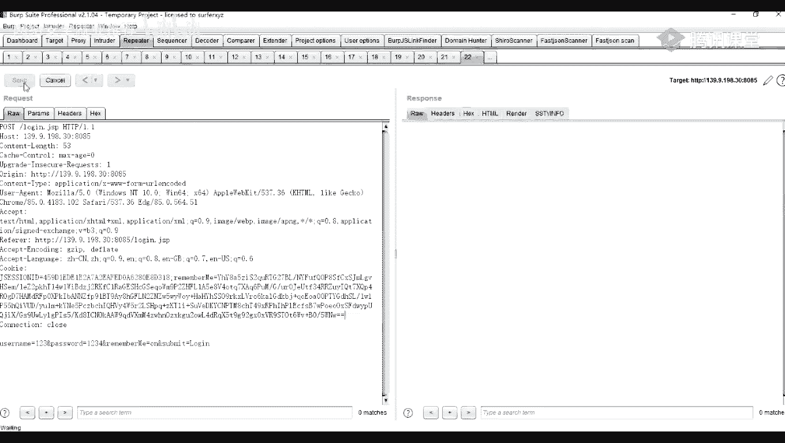

# 【B站最系统的网络安全教程】北大大佬196小时讲完的网安教程，全程干货无废话！学完即可就业，别在盲目自学了！！！ - P46：第9天：Java反序列化之Fastjson，Shiro漏洞 - 网络安全就业推荐 - BV1Zu411s79i

嗯我们我们还是先先讲完这一个吧，我们先讲完这一部分的一个内容，然后我们后面的一个内容就上一节课讲，然后怎么去进行一个反向反弹，反弹效呢，我们这里我们前面呢，这里呢是不是已经执行了一个命令了。

执行可以执行命令了，就是我们这个ios杠幺这里，现在我们就进行一个反弹跳，首先呢我们在我们的一个公网ip，就是一个公网机器上面去，首先监听一个端口。

比如说我这里呢是我们是一nc适用于nc，一个nc的命令，nc呢我们也在做一个net ca，我们linux上面呢是一个nc命令，如果是我们windows上面的话，大家可能就是一个netcp。

是我们下载下载下来，它是一个net cat，现在我们首先呢我们nc接近一个端口，nc要杠l v e t，然后后面加上我们的一个监听的一个端口，1234，我这里呢是鉴定在一个1234端口上面。

然后呢这里呢是这个杠a杠幺是什么意思呢，就是将我们的一个nc，就是指定nc要处于一个镇定的模式，然后如果说他只用了这个杠l的一个命令，这个杠压的一个参数，则意味着nc被当做一个服务端。

神经病接收它的一个连接，这个nt杠l l v l v e t v呢，就是输出交互或者是一个出错的一个信息，比如说我们他会给我们做出一些交互的信息，你杠p杠p就是指指定我们的一个端口。

我证明呢是一个1234，指定一个nc端口就鉴定了之后，这个呢这里呢是我们的就是我们的一个服务端，就是用来被连接的一个机器，就是被连接的一个端，原来在我们这上面去执行。

我们的一个反弹下的一个命令，啊我这里呢复制一下，现在我们首先输入我的一个u，39090698，后面是一个，一个三四，哦这里呢就是我的一个反弹效的一个命令，我这里先关掉。

然后这里呢呃我把它复制为一个文本吧，那这里呢就是指指指到的一个意思。

就是在我们的一个bs上面，也就是在我们的一个终端终端上上面，类似于这种，我们先类似于这种追着一个b，在上面要去执行后面的一些命令。

要杠a杠i参数呢，就是只是产生一个交互式的一个shell，也就是一个bug，然后后面后面这一部分，这个d v d c b指着一个特殊的一个设备文件，我们在在链接上面呢，当一切都是文件。

但是实际上这个文件呢是不存在的，但它只是用它只是在选实现的，用来实现网络请求的一个接口，然后打开这个文件呢，就相当于发出了一个socket调用，并建立一个socket连接，然后读写这个文件。

就相当于在这个socket连接中传出一个数据，后面呢就是跟上我们的一个i p，以及我们就是我们的一个公网ip，这个139是一个公网的ip，我们的一个公网ip，11234就是我们坚定的一个端口。

也就是我们这里坚定的一个端口。

那么我们点击线的，点击发送之后，那这里呢需要等一下，139，啊怎么我把连接了，等一下我换一下什么原因。

好，这里呢我们这里在这边，我们鉴定的一个就是我们的一个服务端，服务端上面已经接着就是监听到它了，到了一个连接，就是我们这一台机器上面发起的一个连接。

这个139。90198。30，因为我们这两台机器是实际上是不一样的，这里是一个8081端口上面的一个机器。

然后呢我这里呢是我们外面的一个机器。

里面，这个呢是我们的一个docker，就是docker里面的机器。

现在我们这里呢，实际上就接收到了它的一个反弹角，也就是说我们已经拿下了这台服务器，比如说我们执行一些id id的一个命令，或者是who am i外卖的一个命令，我们可以看到我们可以随意的执行他的命令。

好这个呢就是我们利用我们的一个s2045 ，是just to 045做的一个反弹效的一个操作。

然后我们这里呢先休息一会儿，休息五分钟，你们有什么问题的话，也可以在那个提问，哦对我们我们这里这边呢先上课吧，然后我们换一个课堂。

我们零五分开始了，那个要是你有那个公网ip的话，是可以拿的，但是你拿得下并不是我服务器上面的价，是我服务器里面的一个docker的一个叫，就是你你拿到了，你可以随意在上面操作。

但是不会不会影响到我的服务器了，我们第一次我们的一个内容，把它换掉，好我们继续我们的一个内容啊，然后我们第二部分就是讲我们的一个debu，首先呢看一下tvt是否是什么呢，它是一个基于j211 的一个。

开放源代码的一个应用服务器，但是用来管理e e j b的一个容器和服务器，但是它的一个核心服务并不包括，支持这样一个车类dsb的一个web容器，一般一般上它是有一个tocat。

或者或者是一个jk绑定使用的，那这个呢，那这个呢历史上也出现过许多的一个漏洞，首先呢第一个是一个访问控制不严，导致的一个漏洞，比如说它的一个dgm x concel。

它的一个未未授权访问get shell，以及他的一些要不那是一个控制台安全验证，要不劳动，这这些呢都是比较老的，但是呢有一个有一个呢是一个，还有一个就是一个人命关手，它的一个入口令，get shell。

也就是我们一个运维管理人员，或者说是一个开发，就对我们的一个网站就是做了一个入口令，他通过我们可以通过入口令，进入我们的一个网站，要怎么进行一个cc，还有呢就是一个反序列化的。

比如说我们对这个17年的一个debt，debt s6。3的一个反序列化漏洞，它的一个基变量是一个201712149，以及到了一个另外一个20177504，的一个漏洞，那么我们怎么去识别，怎么去识别。

这个就是使用了这个jboss的一些网站，首先呢当然这个c force一般的话，当默认呢是开放在一个8080端口上面，它但是使用的是一个h t t p协议，它的一个默认端口呢是在8080端口上面。

并且带了一个访问的一个页面。

默认的一个页面就是这样子的一个页面。

幺三就是这样子的一个页面，并且我们那个魔法刀应该也能搜到。

我看一下，好比如说这个我看看一下它是是不是嗯。

还有另外还有一个就是相当于是在这种页面，因为我们前面那个是一个六六点几版本的，这个呢是一个七版本的，我们也可以，就是很很明显的看到他的一个就是网站。

但是使用的一个day boss，我们再找一下其他的。

比如还有这种，在这里呢我们也可以看到。

它也是一个jboss的一个网站。

它的一个版本版本不同，它的一个页面可能就有所不同，我们可以看到。

在这个呢，也也是开放在它的一个8080端口上面，八零。

还有还有还有这种也是在8080上面的，我们都可以看到，在这里很明显的一个信息就是使用了一个jb，对这个图标，现在我们来看一下就是如何去发现这个漏洞，我们这里呢也可以用到轮到的，一个批量的一个检测的脚本。

我们这个呢我们也是在贴画上面的，原来我们这里呢使用这个脚本器，对我们的一个网站进行扫描看看，现在我们下载下来之后呢，主要有两个文件，另一个是一个target，还有一个skatebot，点py。

只需要将我们的一个目标，这个目标放到我们这里就可以了，因为我们的一个目标，还有一个端口，就一一行一个一行一个放上去，一样一样的放上去，比如说我们这里这样子，然后我们执行一下。

我们这个脚本呢是使用我们的一个python 3，python 3执行的，你们就是之前有一些同学，你们说就是怎么执行完了之后，现在怎么没有反应，那是因为你们可能那个环境可能是一个python。

python 2的，就是可能你们直接输入一个python，它可能就是那直接是相当于这这样子，你们注意一个python，可能是类似是我这样子的一个输出，可能是你们可能是一些是2。7。4。

或者是3年级的一个版本，因为如果说你们输入的话，有我这里呢，因为我配置的话就是将它的一个命名为一个二，就是python，所以呢我这里呢使用的一个python就是一个python 2。

要不我还有一个三版本的，就是一个python 3，怎么我这里给你们点一下吧，就在这里进行一个修改，比如说我这里呢安装了几个python版本对吧，比如说我这里有一个python 33。7的。

现在我这里我们这里呢可以看到，我这里它的这个命名，python这个命名为是一个python python 3的，所以呢我这里10 零的话，我这里呢执行一个python 3的话。

那就是一个python 3。7的，还有呢我这里呢还有一个就是python，比如说我这里有一个python 3。8的对吧，然后呢我这里它的一个命名是python 38。

所以呢我这里输入一个python 38，然后呢他这个环境呢就是一个python 3。8的，如果说你们输入输出就是输入这python或者是python 2，python 3没有输出的话。

那么一个是你们没有安装，第二个呢就是你们那个命名就是没有命，命名成这样子，好呀，那我这里这里是一个，是用一个python 3的一个脚本simple要回车。

回车之后呢，他这里呢就给我们做一个检测，那第一个呢就是检测到，和这个添加了一个控制台，就是说它可能存在一个漏洞，那第二个呢就是它的一个cv，120157501的一个漏洞，也是可能存在的。

第三个呢就是一个是就是一个admcsol，它的一个漏洞在这里呢也是可能存在的，第四就是一个q1201712149 。

现在我们这个呢是一个b量的，那么如果是一个单个的话呢，那怎么去进行一个判断呢，就是我们访问我们的这个ui，就是这个u i l，就在我们的ip后面加上这这一部分的一个内容。

现在我们这一部分后面加上这个的内容，那如果我们访问之后，如果说它的一个状态码就是500，如果说它的一个状态码显示为500呢，那就说明他是很可能会存在这个漏洞的，然后呢我们来看一下它的漏漏洞的一个代数。

但是由于是一个java环境的话的一个错误类型，存在于z box的一个http smoker的一个组件中，的一个过滤器中，就是我们刚刚的访问的这个ui，invocal，那么这个时候欧洲人也会。

就是导致了一个命令执行，也就是可以去对我们的一个服务器就get shell的，那么我们怎么去get下呢，我这里呢是直接使用一个脚本，就是直接使用一个脚本来进行一个反弹下，哦我们脚本子地址地址呢是在这里。

这个呢就是我们的一个脚本的地址，那它使用的也是比较简单的，看一下，然后直接把我进入到我们我的那个目录片。

我们这里呢先进行nc一个端口，这个监听一个端口，我们这里这里呢是前面监听的一个端口，我们先进行退出，我这里卡了，我说怎么防连不上了，啊这没连上，首先呢我们这里也是nc一个端口，要l e d要1234。

我们这里呢是鉴定1234砖头。

那之后呢我们执行我们的脚本，啊这个脚本执行我们的脚板，那么在我们的陆地上打开它它的一个cmd，然后直接papython，我这里是一个python的，要python要j1 。

之后呢加上我们的一个杠杠house杠就是可以杠house，我看一下是house还是杠杠ho，好杠house啊，然后加上我们的我们的一个ip，对我们的一个u r l让我们回车一下嗯，我我这里少了一个。

那个你们之前就是有一些同学就执行完之后，再没有任何的一个显示，就是因为你们那个环境就是没有，比如说你们有些同学是一个python的python 3的，也要执，执行完之后，这里呢是一个python 3的。

执行完之后它并没有任何的一个显示，就说明你没有那个环境，或者是那个环境变量是没有最好，这里呢是一个python 2，然后c e x再加上我们的一个house，加上我们再加上我们的一个url，然后回车。

这里是三的吗，我看一下，我这里使用，我这里不用三吧，回车之后它就会进行一个检测，这个脚本呢还是比较方便的，但我们可以直接输在这里，输入我们的这个ip跟端口，就可以将他的一个buff给反弹回来。

那我们这里呢作为一个yes yes之后呢，它就会攻击我们这这台服务器，就是13909。198。30这台服务器，那我们等等待它进行攻击，哦然后呢我们在这里呢，那请问询问我们就是让我们输入一个ip。

就是一个远远程地址的ip，也就是我们的一个公网，公网的一个ip，63909。198。30，那这个ip呢就是我们就是接收接收下的一个ip，要端口就是1234，也就是我们这里鉴定了一个1234端口。

好，在这里呢就会将他的一个bs给反弹到了这里。

没有成功嘛，再看一次，星星，1234，在这里报错了，但是连接连接不到我们的一个机器，这里看一下，应该，重新执行一下的话啥意思，这号好，然后我们在这里在这里出现一个错误了。

这个站可能是打崩了吧，我看一下，8080。

我这个赞给打崩了。

要是不行的话，我们在这里呢就先跳过，然后139，我们这里等等待一下。

重新监听一个端口，要，l v t1234 。

啊这里对打打不成功啊。

我们这里先跳过吧。

它里面的服务应该有问题，那么我们这里呢就先跳过啊，我们开始下一节课的一个，就是下一部分的一个内容，这个网网站崩了，下面呢我们来讲一下这个first jason的一个漏洞，因为这个漏洞呢。

最近这2年还是比较火的一个漏洞，所以呢我们我们这里呢给大家讲一下，那么我们这里就因为一个时间关系，我们先讲前面的两部分的内容，然后第三部分的一个漏洞的利用内容呢，我们再再下一节课再讲。

我们先来看一下另一部分fast json的一个介绍，但是post jason是什么呢，但是阿里巴巴公司开源的一款，jon的一个解析器，我们最近的话这个漏洞呢还是比较火的。

就是这个bus jason的一个漏洞，然后呢那最早最早的话好像是在17年，17年出现的一个漏洞，原来我们这里比较比较火的话，就是一个1。2。4g也要1。二点，1。2。24l一点2。47吧，这题。

就是一般的话我们可能都是都是听说的，这两个版本的，就是主要听说这两个版本的，就是一个1。2。24，还有1。2。47，它的一个原因就是fast的json再点击，就是我们的一个jason。

就是会在简历的一个过程中，支持使用的一个out太白实例化某一个具体的类，并且调用该类的一个set get方法来访问属性，通过查找代码中的一个相关的方法，就可以构造出一些恶意的一个利用类，然后1。2。

4g的话就是在下一个fast fast jason，在1。2。24版本后，增加了一个反击列化的白名单，而在1。2。4发以前的一个版本中，这里的并不包括1。2。4发，攻击者车。

就可以利用特殊构造的一个json字符串，绕过白名单的一个检测，成功执行任意的命令，那么我们来看一下第二部分，它的一个bujason的一个识别与漏洞的发现。

我们来先来看一下first season的一个识别，也就是我们如何去找到，使用了这个faster阶层的一个网站，首先呢我们前面也讲了它的一个作用呢，这个bujon的一个作用呢。

就是用用于对json格式的一个数据，进行解析和打包，所以呢出现了这个json格式的地方呢，就有可能使用了这个fast fast jason，比如说我们这里呢是之前的一个例子。

这个呢是一个之前一个真实和网站的一个，一个例子，我们在抓包的时候，我们在抓包的时候，我们可以看到它这里呢有一个content type，是一个json格式的，就是这个，这个地方是一个json格式的。

现在我们看到这个地方的话，我们大可以就是猜测，就是他可能是利用了这个json，就是利用了这个bust json，所以呢我们发现了这个的话，我们就可以对它进行一个尝试的一个检测，检测它是否存在漏洞。

并且我们呢你可以看到它的一个格式，它这个post，这个body就是上面这部分的一个内容的一个格式，也也是以一个json格式的一个形式，我们可以来看一下，我这里呢看看能不能找到一些，好比如说我们。

比如说我们在这种这种呢看到一些json格式，看到一些阶层格式的话，我们可以可以猜测，他可能是使用了这个bust json的一个，那一个那个组件，不过呢我们因为是一个看你会找一下这个，啊类类似于这种。

就是我们类似于这种的一个格式啊，比如我们这里呢可以看在这里呢，这个找一个很这，这这不是我们需要载在这个connect time这里，我们如果是看到它是使用的是一个这样子的，一个格式的。

比如说大家可能他使用了这个af z黑色，然后后面呢是一个json格式，j a j s o n，比如说我们看到他这个connect type，这个字段里面是这样子的一个内容。

那么我们就可以让我们的一个plc，进行一个尝试的，就是嗯去打就用这个plc去打，看看能不能进行一个解析，比如说我们这里呢有一个网网站，我，幺三，比如说这里，这里呢我们是使用了我们的一个bust。

jason的一个网站，我们我们正常的话，我这里呢先构造一个包法。

123，这里怎么，我看一下。

20182可以，不会是华为云对我ip给算了，我先访问，我用手机访问一下，你们你们帮我访问一下，看这地址能不能访问，不是可能是刚扫描，可能是刚扫描的时候那个了，我看看能不能解决一下，访问不到是吧。

那我重新起一个吧，等一下，看这里有能不能找那个，8183，我这里重新起一个吧，823，那本意，啊比如说我们这里我重新改一个，68083，然后抓好包，我们在这里list里，这里呢找我们的一个包。

这才是我们的一个包啊，我们我们先叫我先改为一个post的一个请求，然后呢，我们将我们的这个content type，改为了我们的一个json格式，我们正常的话应该是这样子的，就是我们访问我们这个。

如果使用了这个bujson的一个组件的话，我们这个存在type的一个字段，是这样子的一个类型，appalacation your json，然后看一下后面，然后面复制一下。

然后大家再加上他类似类似于这种这种东西，就是一些json格式的一个内容，就是我们在访在访问网站的时候，就是我们抓包的时候，我们可以如果是看到的这一个是它它的一个content，type的一个字段。

是这样子的话，那么我们就可以利用我们我们的一个p o c，去进行打，就是去打一下它有没有存在这个漏洞，原来我们这里呢就是利用了，利用到了我们的一个dnf log，就是将，就是将它的一个请求。

就是可以说去发送到我们的一个dns log上面，是去请求了这个dns s log，我们直接将我们的一个plc，然后复制复制到这里，原来那一个我们在我们的一个dnf log和上面去。

查看它是否能接收到他的一个请求，好对，这世界整合是因为我那里，我们我是说我们的一个正常我们访问的一个网，是抓到的包，如果是是这样子的话，如果是这样子的话。

那这个contact type的一个一个字段是这样子的话，那么我们就可以去试一下，我我们刚刚，我们刚刚在这里，它的一个数据虽然是一个json的一个格式。

但是它的一个他的那个content type并不是，就将他的一个请求，就是解解析到我们的一个dns lock上面，这个呢是我的一个别人的一个dnf的一个平台，dn我看一下，e d w t。

啊这个呢是我的一个点添加我的一个添加，我的一个数据给删除掉，如果如果这个你看到你啊，这个是别人别人的一个，我看一下是是什么牌子，反正也是一个dnf的一个lock的一个网站，就是可以将我们的一个请求。

发送到这种的一个网站，这是一个哪里的，我忘了，待会待会看一下吧，然后呢，我们可以看到，我们这里呢是现在是没有任何的一个数据的，啊我也不是说不能这么利用，就是得看他是不是使用了那个fast jason。

就是使用了那个的组件，如果说你你也可以就是将我们刚刚刚刚那里的，就是在那里，比如说在这里可能是一个xml对吧，你可以你可以你也可以修改一下，是不是613，这样子行不行。

不过呢我们一般的话都是检测它的一个分，type的一个字段，检测它这个字段是否为这样子的一个格式，让我们在跟我们的一个p c去打，这个呢就是我们检测的一个plc，如果说我们在输入我们的一个p o c之后。

在我们的一个dns的一个平台上面，接收到了这个数据，那么我们就可以尝试进行一个利用，这个这个漏洞呢也是可以get shell的，也就是可以反弹的一个它的一个shell回来，好像我们发送一个。

诶别别要埋了吧，8083，有啊，好像他的一个ip可能是被华为云给办了吧，访问都访问不到了，好不行的话，那么我们就就先到这里吧，我们下节课下节课我们在简单的一个利用方法，就是我们这里呢是它的一个就是发现。

以及它的一个检测的一个方法，就是就是它的一个格式，这是它的一个post，它的一个格式是一个jason的，还有它的一个横get type是一个application，要是一个json的。

如果说它指出它这个层叠看法是出现，那这个地方就出现了这这样子的，所以呢他就有可能是使用了这个，bujon的这个组件，然后呢我们就如果使用了的话，我们就可以将我们的一个b c a可用来打一下。

就是如果在我们的一个dnf平台，接收到了这个数据，我们可以看到这里我们的一个内容，这个test dsr 3，后面这个name，这里呢也是这样子给我们返回的，就接收到了一个数据。

那么我们就可以嗯对它进行一个进一步的利用，也就是一个get cell，现在这里呢因为我们的一个网站也打不开了，我们那个后面的话，我们上一节课，上一节课再给大家讲，怎么这么回忆啊。

啊我们这里来看一下有没有一个请求，现在我们这里呢也可以看到，我们这里是接收到了这个dnf的一个解析请求，啊这个呢就是它的一个检测的方法，然后利用方法的话，我们下一节课再讲啊，我们就这节课呢就先到这里。

嗯能听懂吗，不好可以是吧，那我们等两分钟就开始上课了，我先闭一下麦芽，好了，那我们开始上课了，声音能能听到吧，要是没什么问题的话，我们就开始上课了，这节课呢给大家讲的是。

我们就是应该说都是今年还有去年吧，就是这个比还算是比较热门的一个洞，za它的一个系列的一个洞，首先呢我们有一个课程内容呢分为三个部分，第一部分呢我们点一下sl，就是什么是这个衰老。

这个呢就是它的一个识别，就是我们怎么去发现我们哪一些服务器，或者或者说是哪一些网站使用了这个组件呢，第一个还有一个，第一个呢就是它的一个漏洞的发现，就是怎么去发现它使用了这个组件的网站，是否存在漏洞。

第三部分呢就是它的一个漏洞的人利用，所以我们单单是发现它存在高中利用，就是发现它存在漏洞还不够，我们还得对它进行深一步的利用，下面呢我们来看一下第一部分，jo的一个相关的介绍，首先呢嗯它是一个强大的。

而且应用的一个java java的一个安全框架，它提供了验证授权，加密和绘画管理等的一些功能，但是它的这一个框架呢是比较直观的，而且应用同时呢也能提供一些电动的安全性。

那么这个框架当历史上发生过哪一些漏洞呢，首先首先我们来看一下第一个漏洞，就是zero 550，我们就是一般的话就是加了这个漏洞名呢，就像一个衰老550，我们这个是阿帕奇travel这一个框架。

它提供了记住密码的一个功能，也就这个member me，也就也就是我们平常登录网站的时候，就是有一些网站它有一个就是选项，就是可以提供我们去记住那个那一个密码的，那么那一种麻站呢就可能使用了这个框架。

然后用户用户登录成功后，就会分成经过加密并且编码的一串cookie，也就是我们的一个身份验证的一个，就是一串字符串嘛，然后在服务端，你要对这个remember me的一个cookie的一个值。

先进行一个base 64解码，然后使用一个a a a a s的解密，再进行反击类化，就导致了我们这个版序列化的一个，i c e的漏洞，也就是我们这的一个jo 550，第二个部分呢就是衰老g21 。

那这个漏洞也是这个漏洞呢，是去年19年出现的一个漏洞，那么是由于阿帕奇衰老cookie中，也就是我们前面所说的一个cookie，它通过一个ae x128 c b d的一个模式。

加密的一个remember me的字段存在问题，然后我们用户呢就是或者说一个恶意攻击者，就可以通过这个pending oracle加密，生成了一个攻击代码，来告诉恶意的remember me字段。

并重新请求网站，当然就会导致了我们的一个建议代码的执行，那么我们怎么去发现这个logo，就是这个组件或者说是框架，就是拿一些网站去使用了，一个就是我们前面所说的，就是一个记住密码的一个功能。

我们这里呢做一下演示，我们这里呢是举个例子啊，比如说我们这里有一个网站嘛对吧，1391看一下是哪啊，对就这一个，比如说我们有一个网站，就是我们访问网站的时候对吧，然后呢我们进行一个登录，登录的时候。

就是它有一个登录框对吧，一个登录表单，然后然后上面呢它可能会有一个选项，就是让我们去记住，记住它的一个密码，也就是记住密码的话，那么我们下次登录，可能就下次登录，就不会再使用这个密码进行登录了。

就不会不用再输入这个密码，比如说像这种，它有一个remember me的一个功能，就是这种网站呢，就可能很可能是使用了这个方向，第二个就是它的一个返回包那里，就是我们在抓包。

就是我们登录一个网站进行抓包的时候，然后进行一个存放，就是我们让我们抓到的包，放到我们的一个lip那个模块里面，然后呢我们就是发送一下，如果它的一个返回包就是那个set cookie。

set cookie那里，它显示了这个remember me，等于直let me，这里就是有存在的这个字段，那么就说明了，这个网站使用了这个衰老的一个组件，我们这里呢可以给大家看一下。

比如说我们这里一个网站对吧，然后呢我们进行一个抓包，我们先开启这个代理，先开启代理，然后进行优化包，我这里呢已经，我搬到这边来，啊这个就是我的一个要我们重新访问一下，比如说我们随意随意进行一个登录啊。

我们这个直接进行一个登录，登录之后，它这里他在这个包这里，我们可以将我们将抓到的这个包，在这里将我们的一个历史包，然后发送到我们这个lip模块里面，然后呢，我们then现在就是发动发送这个请求之后。

我们在这里在它的返回包这里，我们可以看到有一个set cookie，这里它有一个字段就是零，member me等于零lime，这里如果说它它显示了这个的话，就说明是使用了这个组件，或者说是一个框架。

就是我们这个地方，这个呢是比较容易识别的，然后我们来看一下第二个，就是我们有有时候我们的一个服务器，并不会主动返回我们这个remember me的这个点，这个字段，就是也就也就是说我们有时候。

我们的一个不就是我们的一个包，这里呢可能没有没有返回这一个字段，那么我们也可以在这种这种地方就进行构造，加上一个remember me，m m m m m8 就是我们自己构造一个。

对我们就随便去构造一个前面波比的一个字段，那么然后呢，它我们可以看到我们这里构造了一个零，member me的一个字段，在这里呢就会就会多返回了一条大的一个set cookie。

就比如说我们原来的话就是我们举个例子，我们举这里就是这两行，可能它原来是没有的，然后呢我们去加上这个lemme，在我们cookie字段里加上这个remember me，然后呢他在返回包这里呢。

也会返回这个remember me to lift me，那么我们来看一下它的一个漏洞检测，就是我们前面点了，点了的，是一个如何发现网站是否使用了那一个框架，或者说是那一个组件。

刚才我们发现了使用了那个组件的之后，我们就需要对它进行一步检测，就是检测它是否存在漏洞，我们这里呢有一些现成的工具，并且是一个图形化的一个工具，那怎么怎么检测呢。

我们这里呢也是配合我们的一个dns s log，也就是一个可以帮助我们测试一些无回旋的，一个漏洞是否存在的一个平台，因为这个漏洞呢并没有，像我们之前讲的那些漏洞那样子有回旋，我们这个漏洞是没有回旋的。

也就是我们抓包的话，他并没有将我们的一个结果去给我们，在我们的返回包这里可以显示，所以呢我们就需要使用这个dns s log的一个平台，来帮助我们进行一个测试，啊这个，不在意这个那个那个工具呢。

也是在我们github上面的一个工具，我们我们ppt里面，有待会我把这个ppt发下去的时候，你们自己带带载下来，然后呢我们访问之后，我们在右边，在右边这里呢可以看到有一个人类，这里我们下载这个炸包。

就是chlopj，这里这个是一个包哦，我首先这个链接替换一下吧，下载了之后它是这样子的一个图形界面，我找一下，哦我这里呢有有几个，然后呢我们下载的下载下来之后是这个shut，1。1版本的一个这个炸包。

看到我们双击进行打开，打开之后它是这样子的一个图形界面，然后呢我们这里可以看到它，这里呢是一个比较简单的，就这前面呢就是一个ui l，也就是我们这个识别到的一个组件，比如说我们这里呢这个网站就是这里。

现在我们复制过去，复制了之后，然后呢，我们这里下面我们可以看到他说就使用哪一些，就是进行检测，我们使用一个dnf log，现在我们在dnf log u i l这里呢，我们可以填填写一个dnf log。

我们这里呢可以看一下dnf，我们这里呢就用这个dnf log。cn第一个网站，这个网站呢，我们平常就是可以用来帮助我们测试一些，无回显的漏洞，看到我们get get the mail。

这里我们去获取到的一个子域名，获取到的一个子域名之后，我们建立一个子域名，这里去复制到我们这个dnf u l l这个部分，现在我们进行一步检测，检测之后，如果说它存在漏洞的话。

那么它就会在这这里面就会产生一些结果哦，那这里呢已经选择完成了，还是比较快的，我们来看一下它是否存在结果，然后我们刷新一下，在这里没有结果，第七，这就尴尬了，我们等一下，默认dx，39090698。

能重新刷新一下，这个没有结果啊，来看一下这里，那我两边x a19 ，我们从我们重新获取一个值域名，看看要重新进行一步检测，周39。96085，308085进行检测，你这之后我们再重新刷新一下。

我们可以看到它这里呢，我们这里可以看到它，这里呢已经给我们返回了一些结果，那么说明他这个网站呢，就很可能是存在这个漏洞的，为什么我并没有说他肯定的，因为我们这个工具的话就是检测。

那么也也有可能就是检测不出来，就是或者说是一个误报，因为工具嘛肯定有有部分的一个误报的存在，所以呢在这里呢是有可能是存在这个漏洞的，然后我们就既然我们发现它是存在这个漏洞了，那么我们就可以进行。

对它进行一个进一步的利用，其实我们除了这个方法，就是除了这个这个图形化的一个工具的话，我们也有一些是一个脚本，就是通过一些脚本来进行检测的，脚本的话，我们这里呢也是在吉他上面的一个脚本。

我们可以我们这里的链接呢也复制在那里了，待会发下去，你们也可以下载，再来看一下，然后在这个脚本呢是用一个python 3，就是用python 3来进行运行的，它使用呢也是比较简单的。

就是我们执行我们的一个脚本之后，然后后面跟上我们的一个一个ui，后面跟上我们的一个url之后，在后面呢就跟上我们的一个命令，比如说一些ping命令啊，或者是其他的一些命令。

那么我们使用也可以使用这个脚本来进行检测，这里呢先将那些零关掉，这个这个脚本，然后是tmd，然后python 3的一个环境，这是在用python来写的python 3。

然后我们的一个脚本名字zero zero i s e，然后后面呢就跟上我们的一个网址，就是我们的这个这个网址，8050这个，在在后面呢就跟上我们的一个命令，比如说我们执行一个pin的命令，并命令。

也就是这里呢也是借助我们我们的一个dns s log，听命令，然后呢我们这里像我们的一个dl，我们先将这个重新获取一下，我们重新刷新一下吧，这点是好，我们重新获取它的一个子域名，哦那那刚刚不是被拦截了。

就是他可能有一点有延迟吧，刚刚获取到我们的一个子域名之后，我们在我们执行命令，这里就是听一下我们的这个值域名，如果说如果说它存在的话，那么它这里呢也是可以，就是收取到它的一个结果。

在这里呢又要跑一跑几秒钟吧，然后除了这个dnf log点击，我们网上还有一些就是dnf的一个平台平台，或者是一个c e y一点i o，这个网站呢就比较卡，这个网站是一个比较比较卡的。

然后我们也可以用这个网站，来帮我们进行一个测试，那么在我们的一个域名，就是这一个我们常用的就是这一个域名，就是帮助我们检测的一个域名，这个呢是一个自己的一个专属的，现在我们也可以将我们的这个域名给复制。

然后让他去配这个域名，我们先来看一下前面这个有没有结果，这里呢我们也可以看到，就是我们这个dns s log。cn呢，我们也可以看到它，这里呢也也收取到短暂的一个请求，dns的一个请求。

这个呢就是它的一个脚本，就是使用脚本进行验证，啊我们就继续下一步了，我们，哦然后呢我们前面就是我们讲到它的一个漏洞，漏洞发现以及它的一个漏洞验证，那么下一步呢，我们就需要对它进行一步一个漏洞利用。

高中利用呢，这个呢是也并不是很复杂吧，它这个漏洞呢也是可以就是获取一个下的，也就是通过一个反弹下的一个一个方法，然后我们可以获取到它的一个c，那这一部分是我们的一个员工的一个方法，就是一个手工的方法。

那么我们有没有更简便的一个方法呢，是有的，我们也可以就是去找一个下载一个工具，我这里呢我待会给大家发出来啊，我这里呢也有一个是一个比较简单的，他的也是一个sha。

就是用来帮助我们检测这个框架是否存在漏洞，及利用的一个一个就是工具吧，原来双击双击打开之后，我们可以在我们在给卡上面呢，也可以报一下，我找一下，有一个这种名字啊，黑红，sc in cd浪漫。

找一下是哪一个，应该不是等于，我待会我我给你们发下去吧，找不到是哪一个了，应用题不是这一个好，待会我给你们发一下贴吧，那我们这这个这个工具呢，它可以帮助我们验证两两个漏洞，一个是sl 721的。

一个是sl 550的，这里呢我们是验证它的一个，pl 550的一个漏洞，看到我们这里呢是使用比较简单的，将我们的一个地址，ui ui l复制到我们这个目标地址之后，然后点击下一步。

下一步呢它就会帮助我们进行一个测试，呃也不是也不是回血，结果就是我们那一个漏洞并没有回旋的，并没有一个亏损的劳动，所以呢我们可以执行一个pin的命令。

需要让大家去听我们的这个dnf dns log的一个平台，如果说我们这一个dns log的一个平台，如果就是收到了这个dns的一个请求，那么就说明那个网站就是很可能存在，那一个漏洞的，我们来。

让我们来看一下我们执行的一个结果，就是哪一个来着，然后呢我们点击下一步之后，他就是让我们就是选择使用哪一些，进行一个验证，我这里呢就是用一个c1 y，一点i l注入一个验证，我这里呢配置了一个c y。

我们这里有一个配置的文件，就是这个宽比这里cony这里这个文件，然后上面这个comb properties，这个文件就是第一个文件，那里面呢有，就是记记录了我们的一个dnf log平台的一个token。

我这里给大家看一下，14在哪，这里面这个这第二行这个c e y e mail，这个呢就是我们的一个域名，就是我们这个地址，这个c y这个平台的这个域名，这一串另外一点i o前面这个呃。

然后我们将我们的这一个专属自己的一个，子域名复制到我们的这里，那么后面这个token token呢，就是我们上面这个这个a b i a api token，这个部分就像我们这一部分的一个内容。

将他这个凭证复制到，就是替换成我们这个jy token，这里之后呢，我们我们选择这个使用diy一点i o，进行一个漏洞验证，那么它就会像上一个工具那样子，就是对我们的这个域名进行一个访问。

我们可以看到在这里呢，现在是没有任何的一个记录的，看到我们使用之后，点击下一步，下一步之后呢，它就会进行一个尝试，它的一个验证，然后我们现在这里呢，它它是在执行它的一个拍照的，我们这里呢需要等一下。

那我们刷新刷新一下，这个呢也是稍微慢一点的，并没有像我们之前那样，我们可以看到这里呢也也收到了一条请求，了，一个dnf的一个请求，就收到他的一条记录，那么这也说明我们这个网站，就是这个139。9。

198。30，这个8085，这个网站呢也是很可能会存在这个漏洞的，然后我们等他考完，直到跑完呢，我们呢还有一个后面的一个利用方法，就是我们这里也有一些大的一个记录，我们这里等到好吧。

这个呢因为他要跑跑完的，所以呢时间的话需要等一两分钟吧，哦这里啊这里还没有，如果说他跑完的话，那在这里呢就会并不会显示灰色的了，怎么显示这个字体出来之后就说明他保不了好，这里呢它它已经跑完了。

他这里呢有一个有一个简便操作，有一个简便的操作，我们点上打勾打勾的，那在这里呢有一个获取web调，也有一些其他的一个选项，就是就是一个反弹shell，一个是linux平台的。

还有一个是windows平台的，我们怎么去反弹呢，首先呢我们点选择我们这个哦，待会我给大家说一下，或者是我们就是周末周末找个时间说一下也行，因为那个利用的话是比较比较长的，比较多的一个内容的。

就是在这周末或者是我看一下啊，对就周末吧，现在我们可以看到它这里有一个，反弹笑的一个选项，刚才我们这里呢，就是我们可以看到它给出的一个方法，就是一个ip加上一个端口。

ip就是我们要接收他的一个shell，的一个i p端口呢就是我们监听的一个端口，比如说我这里有一个我这里。

那就使用我的一个服务器吧，我我用另一台吧，等一下，啊我就找到这一台120。27。6，1。239的这台机器，看到我们鉴定一个端口，nc也要杠l p诶，这里怎么掉了，没关系，加l l e p。

然后后面呢加上我们的一个端口，比如说你随意什么都好造型啊，1234，这里呢这个反弹器呢，也是需要我们有一个公网的一个ip的，如果说待会就是待会的话，我可以就是把我的一个服务器给你们，给你们做一下。

就是如果是没有那个服务器的一个同学，那我们建立一个端口，我这里呢就建立一个1234的端口，鉴定完之后，我们在这里输入我们的一个i p，加上它的一个监听的端口，120。276，1。239。

然后加上我们的一个端口，端口是1234，那么我们点击一下执行，点击完之后，我们在坚定的光草这里，我们可以看到它，这里呢已经接收到它的一个反弹效了，所以呢我们这里呢就是对它的一个利用。

那这台呢就是我们家的一个搭建了这个嗯，买买什么呀，对公哦，那个那个，如果是那个有我们那个阿里云，或者是华为云的话，有那个学生机的，就是学生机，你你只要不满24岁的话都可以用，就是99块99块1年吧。

有些是119，就是你只要每每满24岁都可以的，不是学生也行，现在我们可以看到，在这里已经反弹回了一个价了，我们呢就可以对我们的一个服务器，进行一个操作了，任意的一个操作。

啊这里呢就是它的一个就是一个大的，一个简简便的一个利用吧，那么我们还有，我们还有一个就是稍微复杂一点的一个利用，我们这里呢也给大家讲一下，首先呢我们从这个第一页ppt来讲。

首先呢我们也是去nc去去去监听一个端口，那么我们将我们的一个反弹shell的一个语句，这个反弹shell的语句呢，我们前面的课呢也给大家简单的讲过，那么我们将我们这个反弹需要的语句，进行一个编码。

那为什么要编码呢，因为我们的一个这个管道服，一个管道图或者是一个输出输入的一个重定向，只有在一个半水的一个环境下才能使用。

也就是说只能在我们这个比如说我们这些终端，就是在我们这这里面才能进行一个使用，那边管道管道服，或者是一个输入输出的一个重定向，只能在这种环境下使用。

但是呢我们在这里呢就使用的是一个java，java为我们提供的一个命令执行的一个环境，但是这个提供的这个环境呢，并不支持这个管道符，还有它的一个输入输出的一个重定向等等。

因此呢我们这里呢就需要进行一个base，64的一个编码，我们我们呢有一个在线的一个编码的地址。

我们将我们的一个反弹shell的一个语句。

在我们的一个编码地址这里，然后呢我找一下这个，那么这里呢，就输入我们的这个反弹下的一个语句，你等一下bt要bt要杠i，再加上一个dv，别看p c p后面呢就跟上我们的一个ip。

就是我们接收到的一个shell的一个i p，比如说我们这里呢是一个幺，我们那个台服务器是多少来着，120276123920。27。6，1。239，要加上它的一个端口，这里使用一个2234吧。

然后我们我们后面的还有一个内容，后面是一个零，嗯这个呢就是我们常规的一个，反弹下的一个语句，一个命令吧，现在我们将我们的这个batch，就是将它编码后的这一个内容去复制。

复制到我们的这个java程序里面，那么我们就使用我们的一个y s y s offer，这个工具，这个y y s2 的这个工具呢，它是结合了各种的一个java反序列化的一个po。

我们呢就使用这个工具进行执行，那么这个呢我们在网上吸收也可以，待会也可以给大家发下去，就是我们这个但但是这样子的一个工具，那么它里面是集成了许多的一个，反序列化的一个po。

就是java反序列化的一个plot。

那么我们在我们的一个机器上找一下，我们这里呢先将这个刚刚接收到的一个反弹，就给退出来，让它进入到我们的一个工具那里，c好，啊这个这个不在这台机器，在我的一个服务器上面，就用我的一个服务器来吧。

那也不是这一个换一个，好在最后在这个里面，在这里呢有一个y y s o这个点子的一个包，那么我们执行我们的一个命令，那一个是一个语法呢。

是这样子的，就是我们这一个这个这个漏洞，那么后前面呢就是带了一个java上copy，然后后面呢就是我们的一个工具，工具的的一个名称，那么我们这里后面后面就是我们起一个服务。

或者说就是起一个1099端口的一个c mp，带着一个监听模块，这个这个这个呢是它的一个鉴定模块，后面这个1099呢是它的一个端口，然后在后面这个这个这这一部分，就是它的一个拍照。

就是可以理解为它的一个拍照，第二这部分呢就是它的右执行的一个命令，也就是我们将我们前面进行一个编码，编码的一个命令，编码号的一个反弹下的一个命令给复制过去。

等一下就这一个是这样子的一个。

然后呢，我们复制到我们那个y y s o，y s o那个工具上面，要点击回车，回车之后它会起起一个1099的一个端口，写一个1099的端口之后，我们这里连接一下。

现在我们就属于就去生成它的一个cookie，也就是我们那个limme的一个字段的一个字符串，现在我们这里呢有一个sho cocookie的一个py，让我们看一下它的一个内容，那这个内容呢是比较简单的。

也跟我们前面的是差不多的，好我们看完这个脚本的一个内容，那么我们就去执行一下，我们在这里使用的是一个可以使用一个python 2的，一个，拍照的一个python环境，然后衰老上cookie。

然后后面呢这后面呢就是我们的这一个地址，这个13909。198。30，这里呢就是这个13909。198。30，是我们起的这个服务的一个地址啊。

并不是我们，并不是我们这一个跟我们这个是不一样的。

这两者是有一个区别的，如果说你你起的这个服务是在其他的一个地址，那么我们这个呢也后面这一个呢，也是跟我们其他的一个地址啊，这里要要注意139。9。198。30，然后呢。

我们这里呢是去连接这个1390090，198。30，然后后面的它的一个1099的一个端口，再加上它的一个1099，1099之后呢，它就会生成它的一个cookie。

就生成这个dimm的一个字段的一个cookie，这货比的一个内容呢。

实际上就是我们要执行的这个，实际上可以理解为就是这一部分的一个内容，就是反弹效的一个命令。

看到像我们这个cookie的一个字段可以全部复制。

复制之后呢，我们在我们的这个这里，就是在我们抓到的这个包这里啊，就是我们前面前面这个包，这里就是我们登录的时候勾选这个remember me，这里刷到的这个包里，那我们将它进行一个替换。

习惯了之后，因为它是一个反弹效的一个命令，所以呢我们这里呢需要去鉴定一下的一个端口，n c杠l e p。

然后我们是一个多多少来着，是一个234的一个端口。

我是我们是在这台机器上面的一个n c，要杠l v e2234 要让我们回车之后。

它就会在本地去监听他的一个234的端口，确定了之后，我们在这里呢，就将我们的这这一部分的一个copy的一个字段。

给复制过来之后，我们发送一下。

发送一下呢，这里呢我看一下行不行啊。

remember me，零这里已经进行连接，我看一下1099837，我在我在这里再重新试一下，首先呢我们将我们的一个端口。

能重新试一下，我这里呢返回反弹到我们我我的机器上面吧，传到我们的139。9。198。30，然后在我的机器上面是一个1234，我们得得仔细去检查它是有没有错误，就是我们在利用不成功的时候。

right on i，然后d e b d c p139090198。30，我这里呢是没有问题的。

要将其布置，然后我们重新去执行一下，沙拉后腿，好我们重新执行一下，看一下，现在我们再重新去生成它的一个cookie。

看成了cookie之后，我们将它全部进行一个复制。

remember me这个字段，然后呢，我们去监听它的一个端口。

n c上l v t2234 。

先听到的一个抓好178次以上伤害诶，这里还没有还是没有啊，ml，是提了坏了，我检查一下，如果不行的话，那我们就先跳过。

我们将我们的这个字段去复制到我前面，前面成功的那一个，我看一下，我我我我不知道我前面的一个网址。

我看一下，这个还是没有234，好那这里呢我们就先跳过啊，我们我们就先休息，先休息一下，待会我们下节课再继续点啊。

好那个这个脚本的话是，这是用来就是去验证验证漏洞的，但这个命令呢应该是不行的，我我我我把那个工具给发发下去吧，不行的话，我刚刚出问题的话，应该是我哪里命令出错了，我检查一下，那个不过要卖的话应该可以。

但是那个的话很难笑的。

