# 【B站最系统的网络安全教程】北大大佬196小时讲完的网安教程，全程干货无废话！学完即可就业，别在盲目自学了！！！ - P49：第13天：SSH远程登录密码破解、Mysql数据库密码破解 - 网络安全就业推荐 - BV1Zu411s79i

八八的一个端口给我们执行一个info，info之后，我们也是可以执行的，刚刚我们看你们有一些同学啊，就是使用的一些其他的一些cd的一些命令，我们在这里呢，在这里面呢。

并不是属于我们的一个cd的一个命令了，其实我们要设置我们的一个路径，我们是一个concrete the cel t a r d i r，就是我们的一个像设置它的一个路径。

比如说我们这里呢是一个v i斜杠，是3w斜杠，html这样子，然后呢我们设置的一个路径，就是得看我们是不是能访问的，比如说我之前的话，好像这个8080端口好像是不能访问的。

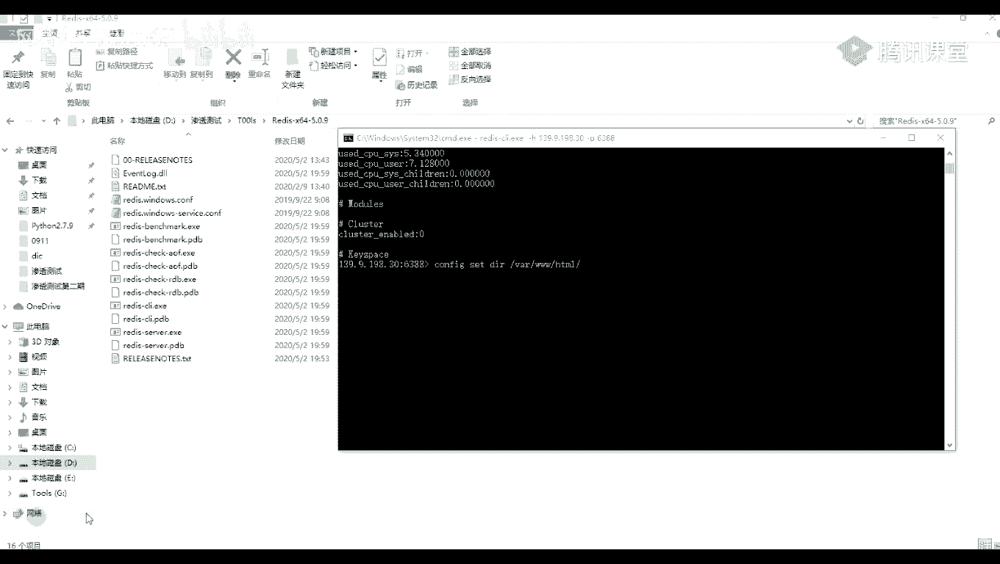

这所以呢你们可能有有一些同学，有些本来呢是别人不能访问的，现在是可以访问的，你们有一些同学可能可能就是设置了之后，就是把用你们的一个菜刀，或者是一个软件连接不上，因为你们的一个路径是不对的。

我们我当时给你们讲的是一个看一下。

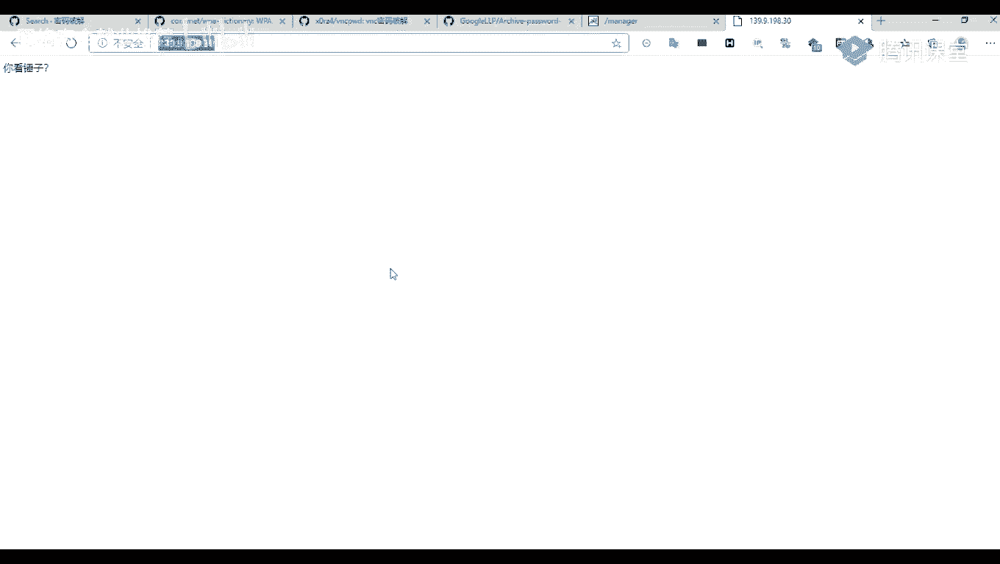

h是h i f的一个路径上，并且这一个这一个路径，然后呢我们设置之后，我要再设置我们我们的一个文件名，设置完文件名之后，我们再设置我们要写写入的一个东西，然后进行一个保存就可以了。

好这节课呢我们就到这里，我们就先上课，然后换到另另一个教室。

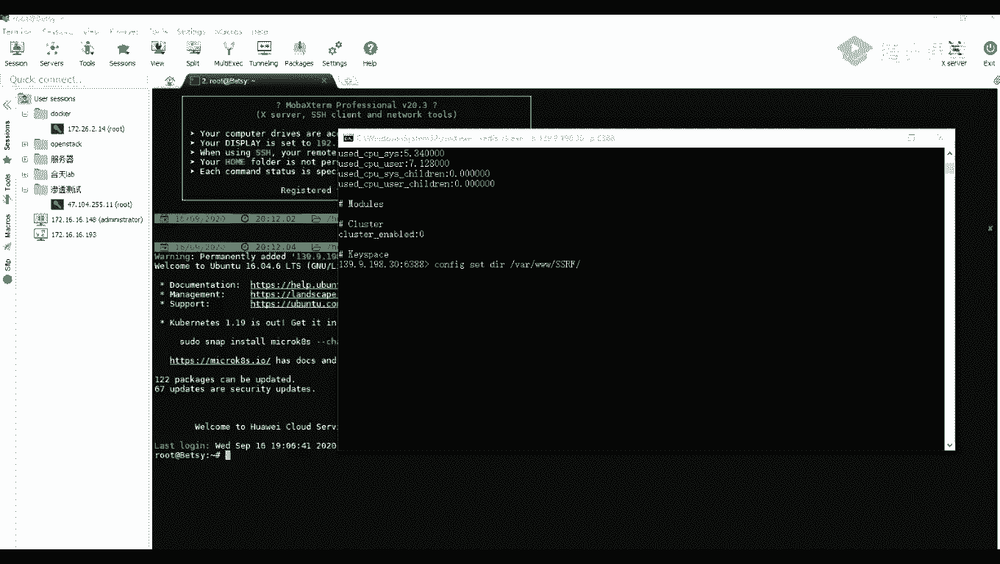

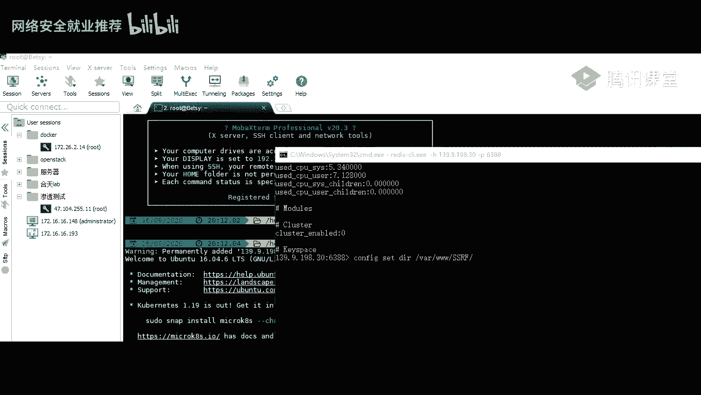

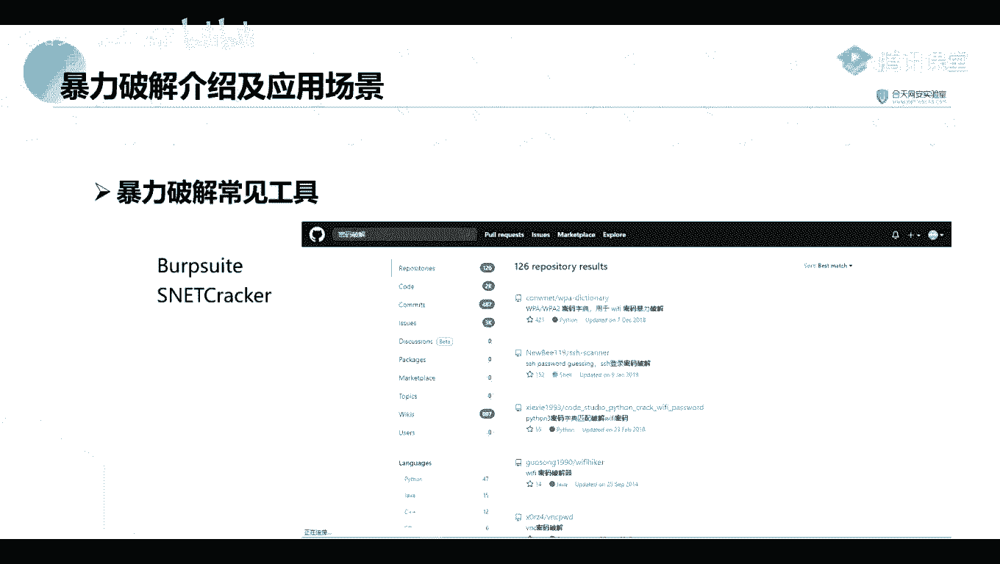

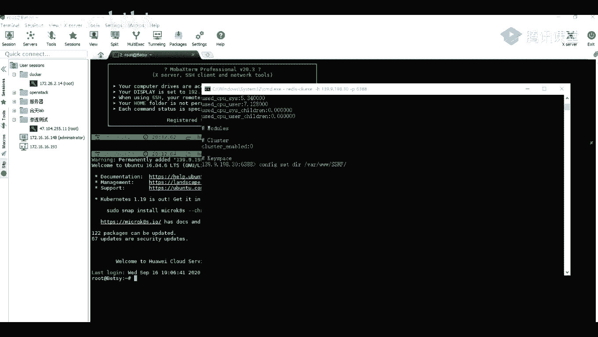

喂能听到吗，我可以是吧，可以的话，我去打杯水，打杯水就上课了，好了，那么我们就开始我们的一个第二节课，的一个内容，这节课的一个内容呢也是讲讲的是一个密码，就是密码破解。

不过呢我们是讲了一个另外的一些工具，就是我们讲一下另外的一些密码破解的工具，首先呢这里呢也是分为两个部分，一个是我们一个暴力破解的一个，工具的一个介绍，第二个呢就是我们暴力破解各种应用。

我们这里还是举了两个例子，一个是一个s n h h的，还有一个就是一个mysql的，我们先来看一个第一，第一部分暴力破解工具的一个介绍，首先呢我们前面给大家讲了我们的一个pop sweet。

以及它的一个netler的一个工具，现在我们捡到另一另一款工具，这款工具呢就是一个文文的一个中文名呢，也也叫叫他做一个九头蛇，它是一款开源的一个暴力破解的工具。

它支持ftp mysql h h等等的一些暴力破解，并且这个工具呢，这讲的就是在我们的一个卡里里面，是已经包含了这个工具了，就是内置了这个工具，现在我们直接开箱即用即可。

首先呢我们来看一下这个工具就是怎么去使用。

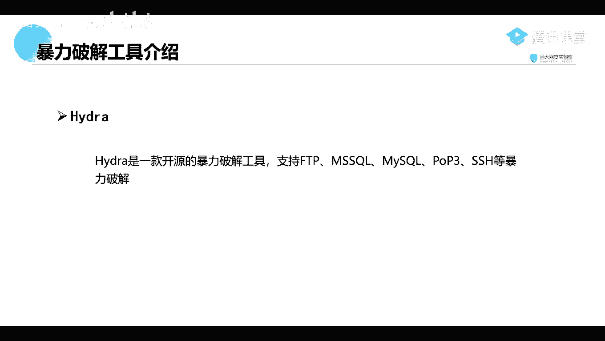

我们先来看一下它的一个参数，那就到了一个参数呢，主要主要有一个一，一个是杠杠l以及杠幺大写小写，还有一个杠t的一个大写小写，以及杠七杠一杠凹等等的一些这个参数，我们呢这里呢就主要是这样讲。

几个常用的一些参数吧，第一个就是一个杠l的一个参数。

杠小节的一个l，这样调节呢就是指它的一个参数的一个意思呢，就是指定一个用户名，大学呢就是指定一个用户名密码的，一个用户名的一个字典，当小写p就是指定我们它的一个密码。

大批呢就是指定它的一个密码字典以及杠七，杠七命令，就是使用一个冒号进行分割，比如说root，然后冒号root，然后杠杠m呢就是指定目标列表文件，也就是做一个批量的时候，就是只用到这个杠m。

然后告f呢就是在它的一个意思呢，就是在找到第一对登录名或者是一个密码，就是正确的时候就进行，就将我们的一个程序给停止掉，我们除了这个九头蛇之外，我们还可以使用我们的一个matt sport。

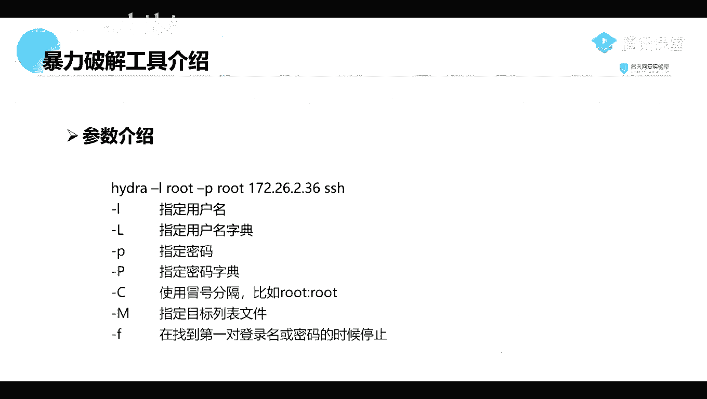

里面的一些内置的一些模块，我们呢也以第二个my meters，crow呢是一款渗透测试的一个框架，里面是非常强大的，然后我们在下一节课就是周五的时候，还有后面的一些课程内容的时候。

都会讲到这个mate 10 pro的，这一个渗透车子的一个框架，我们在渗透测试的时候是离不开这个框架的，就那这个当里当然也是在我们的一个咖喱里面，是已经内置了，那么这里呢我们就讲到就使用它的一个。

它的里面的一个是cana的一个模块，这个十天的里面的一个模块呢，但是专门用来进行扫描的一个模块，比如说可以对我们的一个mysql，mysql的一个1t的，一个mysql的一个用户名密码进行一个扫描。

还有一些oracle等等的一些，我们前面讲到过的一些应用，那你们下面呢我们先来看一下。

使用一个有头蛇去破解它的一个s h的一个密，码，用户名以及密码。

当然比较简单，我们可以就是使用那个h y p i，就是这个九头蛇的这个命令，然后指定我们的一个杠大写的一个l，然后再加上我我们的一个用户名，这个用户名的一个字典，这个字典呢我们可以自己去指定，也可以。

只要我们卡里里面它是一个内置的一个字点，因为我们卡里里面呢其实也内置了一些字典的，我们来看一下。

啊这个呢就是我的一个咖喱。

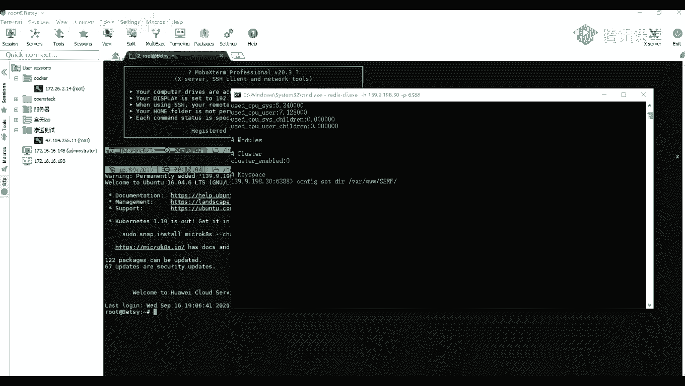

现在我们进行一个先进行一个登录，然后登录之后。

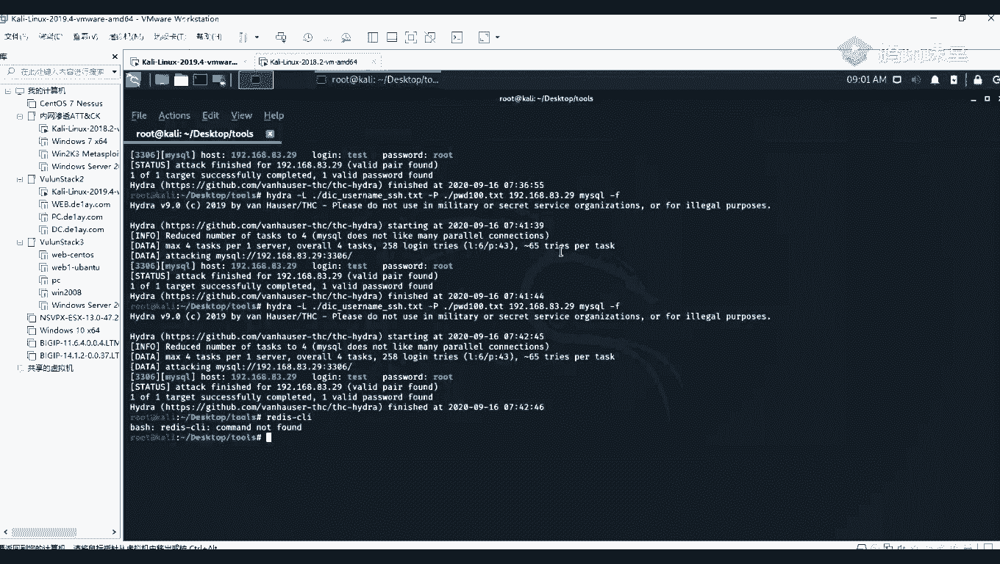

我们在里面它的一个字典的一个路径呢。

我找一下在c d368 ，what the list，那在这里面就是在这个usl刷，然后word list这个文件夹里面，这里里面呢是内置了一些字典。

比如说我们一个metal pro这个框架里面的一些字典，或者是一个map里面的一些字典等等，还有一些就是一个路径的一些字典，我们也可以看一下dd有d i e，然后变嗯，随随便看一个一一个吧。

small我们可以看到这里呢可以看到它，这里呢是一个路径，就是是一个路径的一个字典，都是一些成就，是一个大部分都是一些英文英文名吧，这是一个小的字典，我们还有一些大的一些字典。

比如说p这个特点呢就比较大了，那么我们这个cd我们我我加入的这个cd呢，就是切换路径的一个命令，就是在我们linu linux上面的，是切换路径的一个命令。

我们在windows上呢，实际上也是可以使用这个cd，进行一个切换路径了，我们比如说我们回到上一级，比td depp这个切换路径的一个命令。

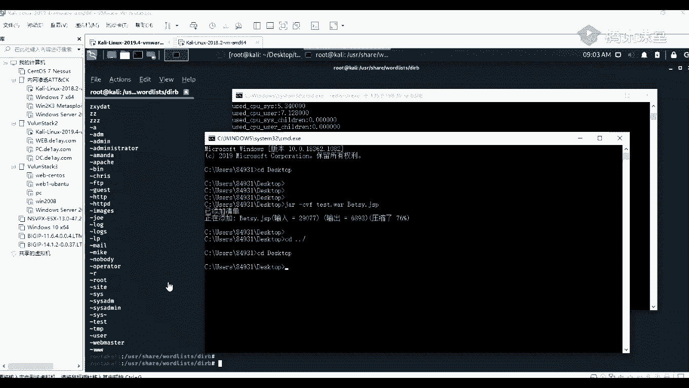

等到我们前面讲到我们的要cat cat，就是查看我们的一个文件内容，跟我们就是查看我们的一个文件内容，比如说我们cat small等等。

首先是跟我们这个type走一个，t y t一啊，我看我们这这个windows上面的一个type的一个命令，是一样的一个意思，也就也都是查看我们的文文本里面的一个内容，而不是vi vi是编辑。

比如说vr l是small，我们可以看到可以进入里面进行一个编辑，我们可以对我们的一个我们vi是一个编辑器，其实我们可以对我们的一个文件进行编辑，我们开的命令呢，还是就是查看那个文件的一个内容。

你用vi进行查看也行。

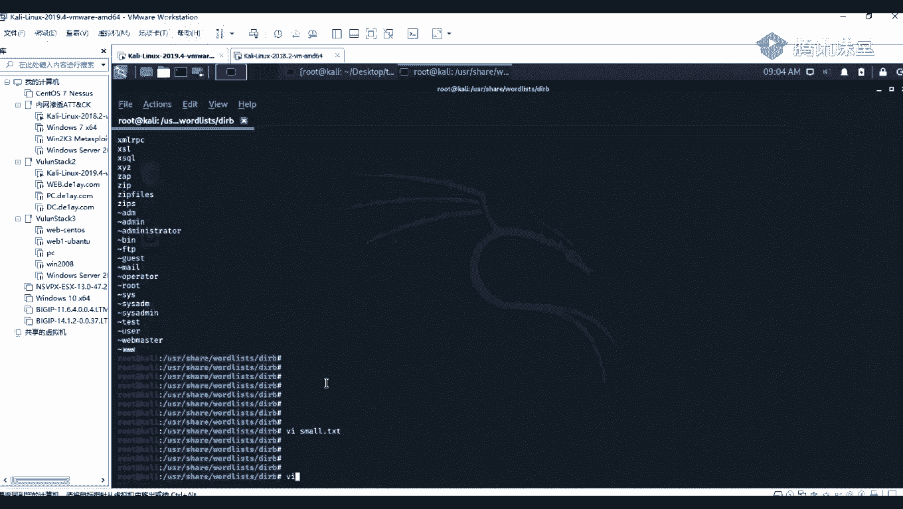

因为这个就相当于这个vi跟我们windows上面的一个。

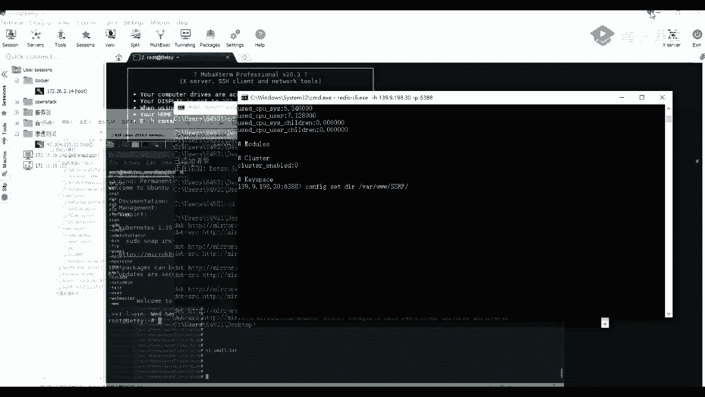

文本编辑器是一样的，就像我相当于是我们这样子去药店，然后去查去打开，打开之后，我们就可以对我们这个文件进行编辑了，对这个意思。

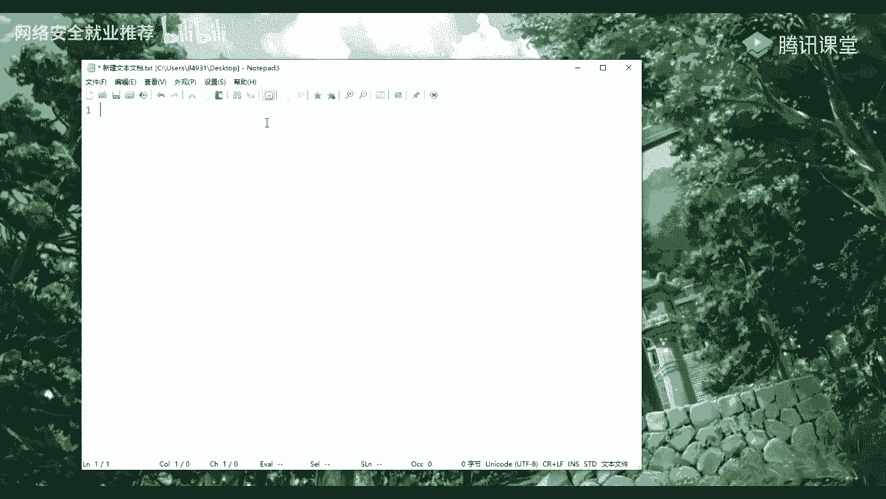

然后我们来看一下，使用我们的一个九头蛇去破解我们的一个用户，就是s和h的一个用户名以及密码。

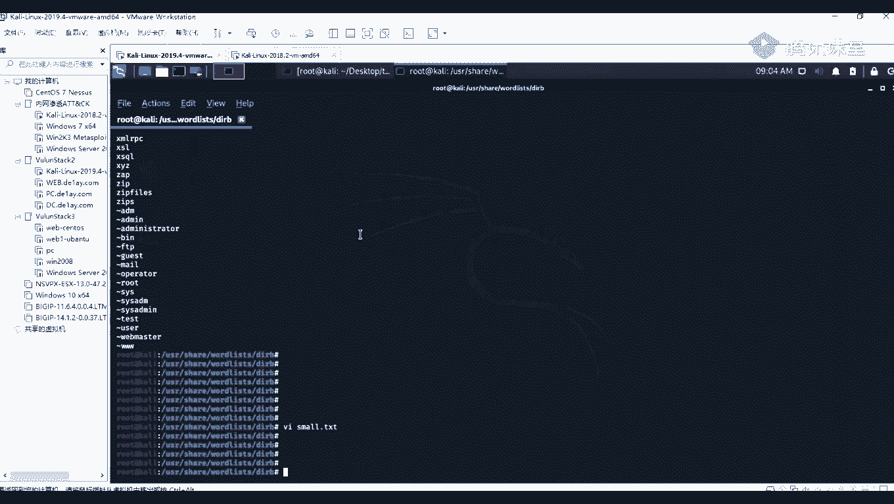

首先呢我这里我这里有另外一台卡里，我举个例子啊。

我这里呢是举个一个例子啊，我们在信息收集的时候，因为我们在信息收集的时候，我们找到一个就是使用我们的一个map，就是查看我们的一个端口的时候，我们才看到这台机器，比如比如说是查看到一个192。16，8。

83。33，这台机器，它开放了这个二二的一个端口，采访了这个二二的一个端口，那那那么我们就可以使用我们的一个工具，就由这个端口进行一个爆破，因为这个这个二的一个端口呢。

它是一个默认是是一个s s s s h的一个端口，现在我们就可以使用它进行一个爆破，天呢我们输输入我们的一个命令，h y d i要杠l，l呢，就是指定我们的一个就是用户名的一个字典。

杠l就是指定了一个用户名字点，如果是一个杠l就是小写的一个l，就是指定我们的一个用户名，我们呢因为我们是需要对我们的一个用户名，以及密码进行破解的，现在我们使用我们的一个杠l大写的一个l。

当然是我们的一个字典的一个路径，因为我这里呢是已经有一个字典了，我我这个pose这个文件夹里面，当然已经有两个字点，一个是username，一个字典，就是用户名的一个字典。

然后还有一个pass word一个字典，现在我这里呢就使用这两个字点进行一个爆破，抗压，主要斜杠root指定我们的一个文件的一个路径，好，我们这边指定我们我们的一个路径。

然后我们再指定我们的一个密码放大t张大，p就是一个密码字典，那么这里呢我们可以输入我们的一个绝对路径，也可以输入我们的一个相对路径，相对路径嘛就是我们可以在我们当前路径上面，是相对于它是在哪一个路径的。

比如说我们这里一个相对论，我们这个pos上面有有有两个字点对吧，我们就可以使用我们的一个相对路径点斜杠，然后我们的一个密码字典p wd，我们绝对路径路径呢，就是我们指的是在我们的一个根根目录上面。

具去一路指定到它所在的一个目录，然后之后呢我们在上p l登上字典之后，我们这是属于我们的一个i p，比如说我们这里呢是一个，我们看一下这个ip是多少来着，我们这个if configure这个命令呢。

就是我们在linux上面查看ip的一个命令。

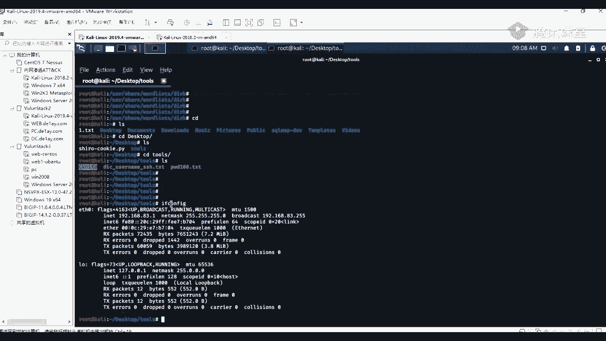

如果是在我们的一个windows上面的话，在windows上面的话就是ip confi。

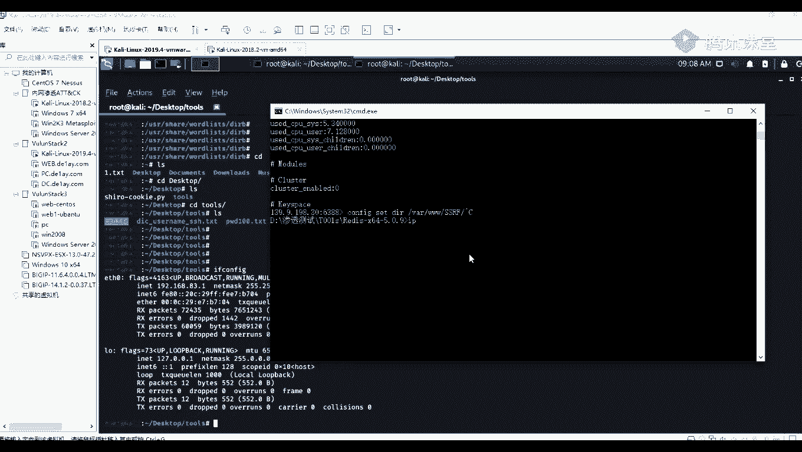

我们linux呢就是一个a方便，我们这里呢有一个192。8168。8，3。1哦，是这边的机器啊，192。168。83。33，要指定我们我们的一个i p，192。168。83。33，是这样子吧。

那指定我们的一个协议，比如说我们这里是包括一个s x h的，也可以指定我们的一个如果是一个mysql的话，就属于我们的一个mysql，我们这里呢是一个h h h的，之后呢我们是可以的。

但是呢我们可以就是加上一个杠f的一个参数，这个杠f呢就是指我们在爆破到一个对，就是一个成功，就是成功爆破到的时候，我们就自动停止掉，看到我们进行一个回车，要回车之后，我们可以看到它这里呢是bob的的。

还是比较快的，在这里已经给我们爆破出来了，他的一个用户名locking，也就是一个root，它还有它的一个密码，password就是一个full e p o r。

那么我们将我们报报道的一个用户名以及密码，进行登录看看，那我们可以看到，现在呢是一个192。168。8，3。1的一个机器呀，那我们使用我们的登录s s h。

然后root at at就是我们前面所爆破到的，所爆破的一个地址，192。168。83。33，192。168。83。33，这样呢我们进行回车回收之后，大家输告诉我们输输入这个密码。

现在我们输入我们的一个密码d o r回车之后，我们可以看到已经成功进行登录了，那我们查看它的一下，他的ip也confeed，可以看到它这里呢就是它的一个i p，192。168。83。33。

就是我们这一台机器里面的一个i p。

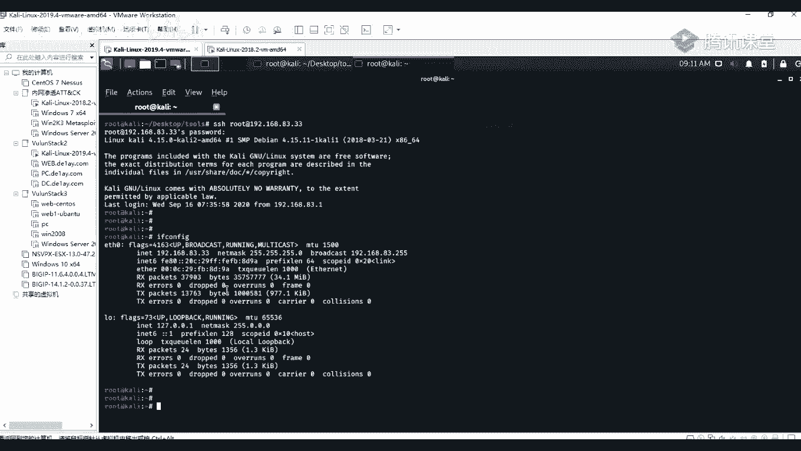

那么我们来看一下，就是另一个包括另一个mysql，我们前面呢是包括了我们的一个使用，我们的一个图形化的一个工具进行，包括我们的一个mysql，下面呢这个呢就是使用我们的一个九头蛇。

去破解我们我们的一个mysql，首先呢我这里来看一下。

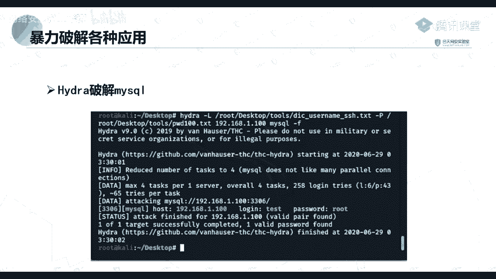

我我我在里面就举个例子，去破解我本地的一个mysql啊，我先看一下我的ip，我这里呢是一个192。16，8。8，3。29，在这里呢是运行了一个mysql的一个服务。

所以我们这里呢就假设举个例子，就是我们也是在近期收集的时候就收集到，我们就是存在我们的一个map，就找到了它的开放的一个端口，这是一个3306的一个端口，那之后呢我们就进行一个爆破，然后hy i。

要杠大写的一个l，但是跟我们前面是一样的，我这里直接用前面的那那条语句吧，1920968减多少来着，83。29，然后我们的指令我们的一个应用是一个mysql的，看到它就会进行一个爆破。

在这里呢爆破呢也是比较快的，在这里直接将他的一个用户名给包括出来的，它的一个用户名呢就是一个test，还有一个密码呢也也是一个是一个root，然后我们进行连接一下，看看这个用户名以及密码是不是正确的。

我找到了一个工具，我这里呢我我就使用我的一个工具，就是mysql的一个连接工具。

mysql on这个工具进行一个连接，然后连接之后，这里呢我看你们看一下它的一个一个字，有，2。168。8，3。29。

然后呢它的一个端口呢就是3306，然后用户用户名呢就是我们的一个test哈。

密码密码呢密码呢就是一个root，我们看一下能不能连接成功啊，啊然后呢我们进行一个连接，连接之后呢，我们可以看到，也也是可以成功进入到了它的一个数据库里面，然后我们就可以配到了一个数据库。

进行一个操作或者是一个管理，比如说查看对照一个的一个数据库，进行一个增删改查等等。

这个呢就是它的一个，使用它的一个九头蛇去破简单的一个s s h，以及mysql，前面的我们也讲到，我们还有一个matter block，的一个渗透测试的一个框框架，它里面的一个，扫描的一个模块。

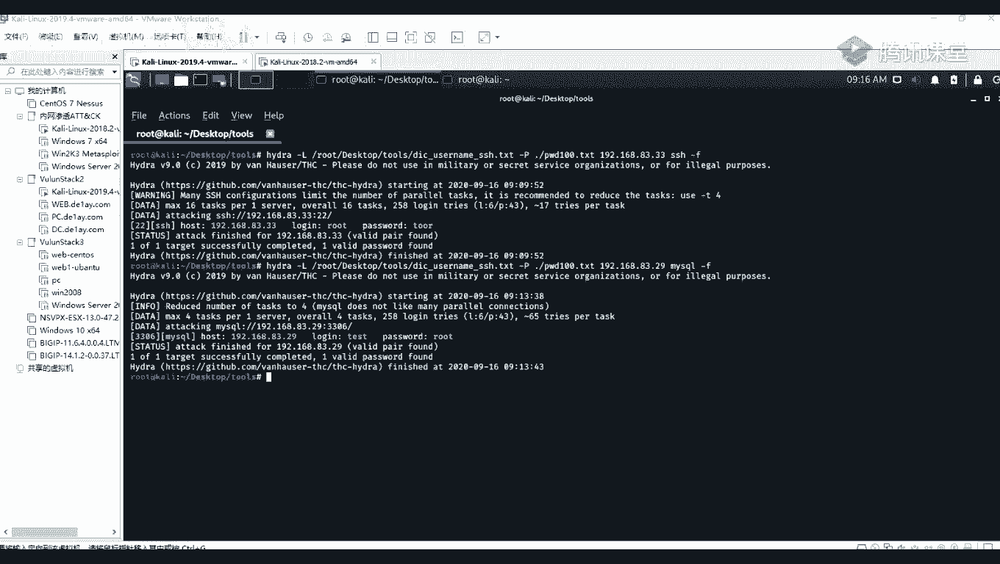

第二那里面呢是已经内已经内置了许多，是一个模块了，我们正常就使用我们的这一个logo，我们的一个s s h log login，这个模块进行一个破解，然后呢我们第一步呢就是使用我们的这个模块。

然后第二步这个jr host，这个那就是指定我们的个远程的一个地址，比如说我们在信息收集到我们的了，这个172。2，6。2。36，它开放了一个二的一个端口，那么我们就可以我们这里的这个r a host。

这里呢就指定了那一个ip，然后上面呢这两步呢，就是分别分别指定它的一个用户名，以及它的一个密码，密码的一个字典，然后我们我们这里试一下。

首先呢我们提供我们我们的一个mate pro，只有直接截屏sf console，m m m s m s h f分手，这个命令就是开启我们的，我们找到一个n方程式，那么它就会进入到我们的这个框架里面。

具体呢大家启动的话需要等待一会呀，无法连接，好像我看一下，好像数据库没有开学，我看一下，好这个呢它的一个数据库没有开启，我们先将它的一个数据库给开启，全平台加e p t i n i t。

看到我们的一个数据库是一个找一下是哪一个，然后，post glass circle这个数据库，它使用的是这一个数据库，就让我们开启它，那我们重新，下我们重新登进入一下，我看一下这里啊。

还是没没有连接上啊，我们来看一下这个是否开启了，三二开启了呀，我们这里呢先初始化一下吧，让我们注意我们的一个msl db，进行一个初始化，要站在这个mp这个命令进行一个初始化，现在我们再重新进入看看。

第一个呢在你们后续后面的一个课呢，会讲到这个这个工具的使用，这个框架的使用方法，好那我们可以看到我们初始化之后，我们已经已经进入到了，看到我们这里呢我们可以使用我们的一个社区，就是一个搜索的一个命令。

搜索的一个命令去搜索，或者一些locking的一个模，就是包含了这个log locking的这个模块，这个这个名字的一个模块。

那我们这里面可以搜索到很多，它包含了这个logo的这个模块，那么我们找到我们这里呢需要的一个，我们这里呢所需要的一个模块，比如说我们这里呢有一个s s h的，一个login的这个模块，这里。

这个呢就是我们所需要进行一个使用的，那么我们就使用我们的这个模块，ok，现在我们我们使用一个use use的一个命令，就是使用我们的一个模块，然后进行将我们的一个模块给输入进去。

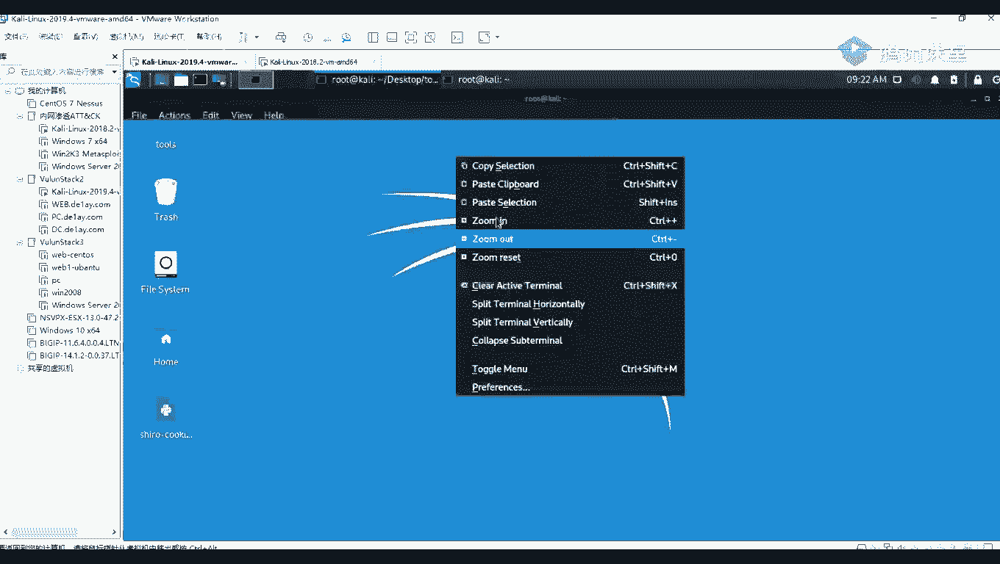

再来然后回车回车之后它已经设置好了，然后再设置我们的一个远程的一个地址，就是set rh o s t，我们这里的设置，我们的一个远程的一个地址，然后我们这里呢是一个地址，是一个多少来着，这个192。

168。8，3。33，这个地址呢，这就是我们信息收集到它开放的这个二端口，的一个地址，行了回车回车之后，我们再设置我们我们的一个用户名的一个字典，set set，u s e r。

f i l e加上我们的一个路径，root，我们要再加上我们那个cos p i t，同样的，我们也可以使用我们一个option的这个命令，查看我们所需要设置的一个东西。

比如说这里呢当设置了它的一个yes，这里呢就是说明我们是必须要设置的一个东西，那我们再设置我们我们的一个密码，密码的一个字典，别杠root，next top，设置完之后。

我们再查看一下我们是不是设置好了，我们在这里呢已经设置好了，我们可以看到这里这个require，require这个选项，上面这个下面它这里有几个页，然后呢，我们这里呢就是要说都需要进行一个设置。

比如说我们这里呢有一这个的快乐，就是所需要设置的一个东西，那这个q a setting是我们当前所设置的一个东西，比如说我们我们的一个pass pass bell。

就是我们已经设置了这个路径的一个p w t，100的一个tp sp的一个文件，以及我们的一个远程的地址a host，这是我们的一个要爆破的一个地址，后面这个apple就是远程的一个端口端口。

这个呢是默认的，默认是二的一个端口，那么我们执行一下run的一个命令，乱的这个命令呢就是执行的意思，那我们需要等待它就可以了，83。33，我们等他跑完啊，原来我们可以看到它这里呢。

已经跑到了它的一个用户名以及密码，就是我们前面使用九头蛇，跑到的一个用户名密码，然后跑到了之后，就是这个metal pro的这个，在探测这个s s的一个入口令的时候，如果是发现了存在。

就会返回答的一个linux的一个叫，其实就会返返回到一个linux的一个ce，但是呢注意我们返回的一个shell，并不是我们的这个框架里面所内置的一个，meta flor的一个shell。

所以呢我们这里来使用我们的一个season s e s s，s s杠i o n s也要杠u，然后它这个section的一个id呢是一，然后我们就为所有一个一season杠u，然后加上一个id是一。

诶没有进去了，sk我看一下，我们需要先出来，就是先出来之后我们再输入啊，s e s s i o n s比较杠u加上我们的一个一，之后呢，嗯嗯那就得到了他的一个mc fla的一个shell。

你在这里有一个错误看一下哦，1400，我看一下，换一个s1 h ln，有两个，原来我们d a，看到我们升级了之后，升级了之后，它就会找到我们的一个metal politter的一个shell之后。

等到我们注意我们的session的i，你要加上我们的一个id，就是比如说我这里呢是一个，我们又进入到这个white politter这个下车，我们就它的一个id之后。

所以呢我们就输入我们我们的一个jon，pence杠i，然后加上一个二，那么我们这里站着，他就得到了它的一个make a potter的一个shell，这样呢我们就可以对它进行进一步的深入利用。

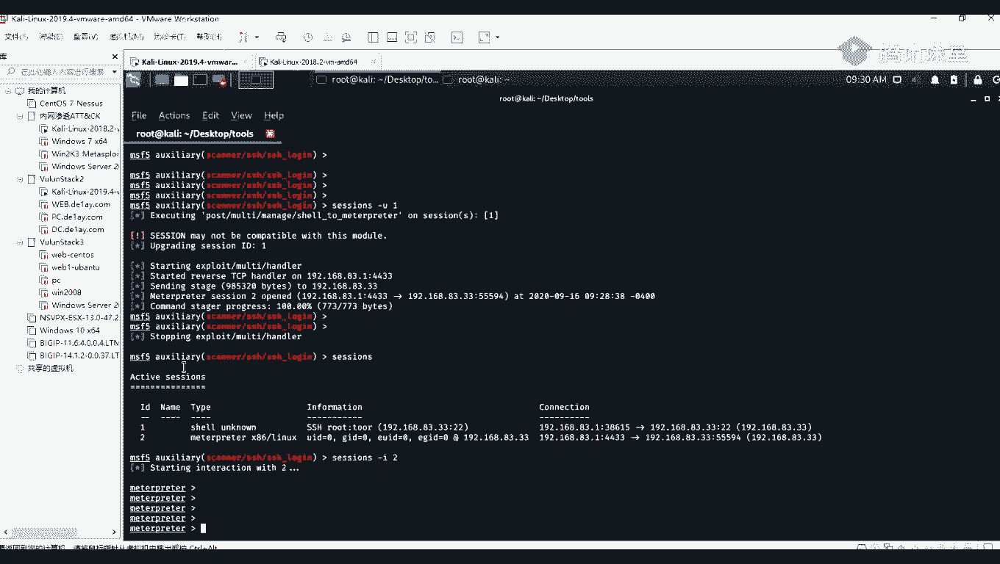

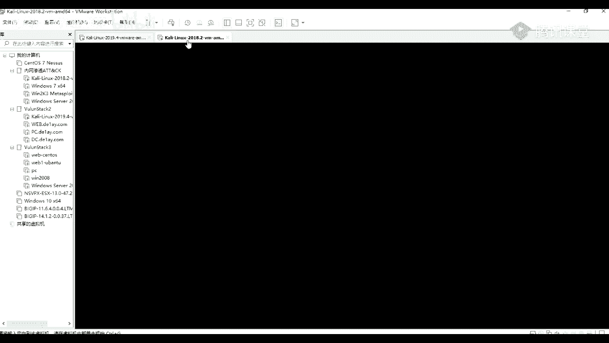

然后呢关于这一部分的一个后续，后续的一个内容，以及深入的一个利用，你们后面的一个课程内容呢会讲到我这里呢，就讲到它如何对它进行进行一个破解。

并且去得到它的一个master blaster的一个shell，那这节课呢我们就讲到这里啊，下面我待会待会，我会把我在群里那个在线作业了，我会在上面写上，啊会会有关，后后面的话是另一个螺丝给你们上吧。

门电不到电不到我了，不过要是你们有问题的话，你们还是就是在后面的课也可以就是去问我的，因为我们今天呢主要是就是讲，主要主要的一个内容呢，主要是都是讲一个我们的一个爆破。

就是使用我们的一个pop sweet的一个爆破，的一个使用的方法，还有呢就是我们的一些常用的一些爆破的工具，就是介绍一下这些爆破，要怎么去对我们的一个应用进行一个爆破。

并且还有这个使用我们的一个mac pro的一个框架，对我们的一个应用进行爆破，因为这个框架呢你们后续都会讲到这个的，现在我这里就先给你们点一下，使用这个框架进行爆破。

啊然后这个boss jason的一个利用我，我在这周末我看一下是不是周六还是周日，这周末我就是给你们讲一下，然后后面呢还会还会再讲一个提到的一个内容，就是我们在y s i c的时候。

就是可能会经常遇到的一些一个漏洞，就是给你们讲一下它的一个就是发现，以及它的一个利用方法，那个呢是比较常见的。

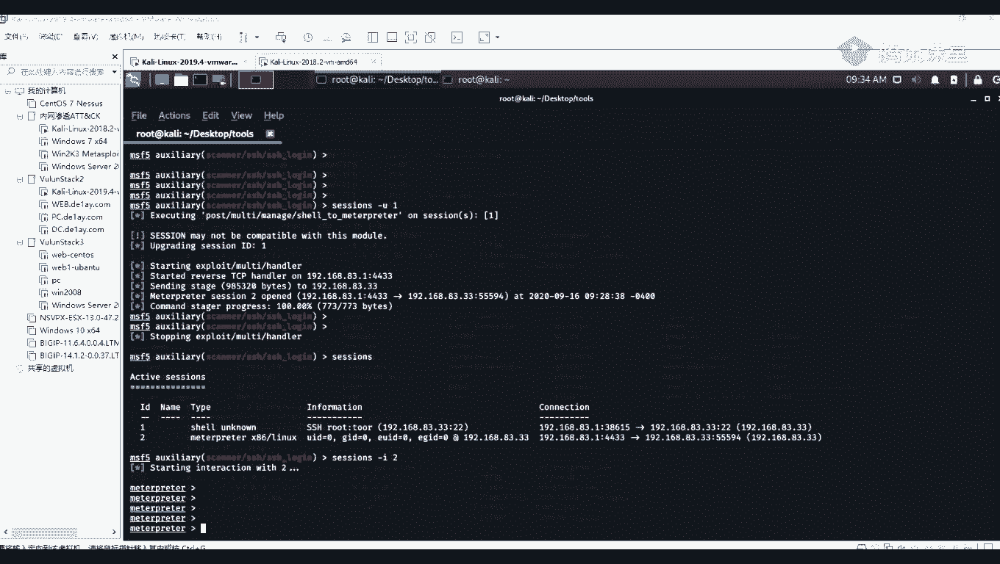

其实这个redis的一个密钥呢，是我前面那个tp t呢也是在上面是写了的，因为你们是一个我不知道是那个什么原因，就是连接不上了，对的我当时我就没有点啊，我看一下就是看看什么时候我搞好了。

但就是连接上了之后。

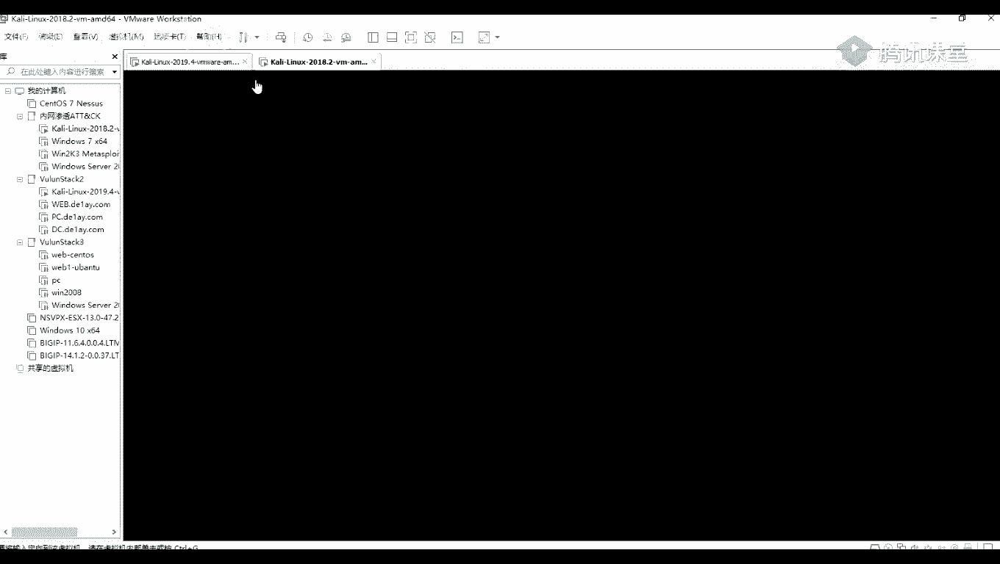

我也给你们一并讲一下，就是我们一些没讲到的一些内容，还有一些其他我们一些其他的一个漏洞的。

