# 【B站最系统的网络安全教程】北大大佬196小时讲完的网安教程，全程干货无废话！学完即可就业，别在盲目自学了！！！ - P56：第20天：WindowsHASH简介及系统用户密码凭证 - 网络安全就业推荐 - BV1Zu411s79i

今天的课程是内容，之前的话先大概的就是大概的回顾一下，我们上节课的一个内容好吧，因为中间的话隔了一天，大家可能都忘记了是吧，嗯然后呃大家跟我一起来走一下，就是上节课的一个内容。

我们上节课主要就是呃windows的一个主机，信息收集对吧，然后主要的就是这四块内容，就是对内网的一个环境分析，主要的话就是给大家介绍了啊，我们如何去判断我们所得到的这样子的。

一个内网机器所处的一个环境，然后的话根据这些环，根据你的一个主机所处于的一个环境的话，我们有不同的这样子的一些啊路径以及方法，来去进行相应的一个啊信息收集是吧，然后第二个的话就是工作组的一个信息收集。

以及域内的一个信息收集好，然后在这边的话有给大家就是大概的介绍了，就是工作组以及玉的一个基本的一个概念，以及在工作组当中，我们常用的一些信息收集的一个方法，以及在域内的话。

我们通过什么样子的一些方法来去进行一个，信息收集，以及第四个内网，除了探测的话，我这块内容的话，因为时间关系的话，后面没有给大家介绍，然后大家对这一块内容有没有什么疑问，就是呃在后面的话。

我后面课程内容稍微少一点的时间的话，如果大家有疑问的话，我再给大家具体的介绍一下吧，呃呃为了课程的一个安排，就是课程内容的一个安排的话，就呃不会可能中间不会就是再重复的去讲一下，这一个了。

那样的话如果大家有问题的话，我后面的话可以就是抽个时间给大家介绍一下，站队这一块有有问题吗，就是大家多给我一点反馈啊，就多给我一点反馈，就是我在这边呃，问大家的话好吧，就呃有问题的话就说有吗。

没有的话就就没有吧是吧，但是你还是要你让我知道对吧，那我知道你没有，是大家都没有去看吗，还是怎么的，没没有一个人回我，这有点尴尬，白天在嗯不是有给了大家就一天半的时间嘛，对吧。

就是算起来的话是中间有一天半的一个时间，好啊，既然没那个的话，那么我后面的话再安排个时间给大家介绍吧，好吧就嗯，然后这边的话就是一个基础的一个回顾，然后具体的一个内容的话，这些我看交了作业的话。

大家呃交了作业的有大概六七位同学啊，你就交了作业的话，应该是都有过一遍对吧，就对这些啊，比较基础的一些信息收集的一个方法啊，然后呃，然后的话呃就是大家我看了的话，我们现在这一期的话是有20多位同学。

就交作业的话，只有几位啊，就我不知道大家对这一个作业，就是有没有去做啊，就呃大家的一个作业，还是就是说中间有一天半的一个时间的话，呃这段时间你可能白天有事对吧，但是晚上的话还是就是抓紧一点时间。

把这个东西就是自己呃把这边的一个作业啊，还有就是ppt上面的一个内容，你自己都在自己去过一遍好吧，因为呃说实话这个东西的话，这个东西是大家一定要就是要认真的去对待，因为我现在的话是从班主任那边的话。

只收到了几份作业，就是呃大家在学学，包括我们这个课程对吧，花了花了几千块钱学这个东西的话，这个东西不是说我在这边讲，你在你在底下听，你就能够学会的，这东西是一定要你我在这边讲，我讲了之后对吧。

你要自己去做，你做了之后，你才能够是说把这些东西，是把把它变成你自己这个东西对吧，而且大家就是来报这个班的话，就是报参加这个培训的话，就是你可能是要转岗对吧，或者说找工作等等这些东西，这些东西的话。

你要去达到你的这样子的一个目的对吧，大家抱着这样的目的来，那么你就不要说呃，就是要重视起来好吧，然后的话呃就是这里的一个预环境啊，因为我这边的话这个这里写错了呀，这个给大家说一声抱歉。

就这边的话我写成了个三，就是实际的话啊，就是我这边在用的这个的话是二，当然的话你下了山的话也没关系啊，因为你后面的话你自己可以去做，就后面的话也会有用到吗，就是呃。

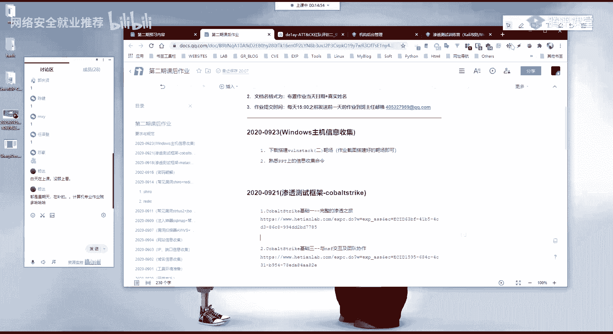

好哦，这边的话就是课前的一些呃东西啊，然后的话呃今天有同学问我，有同学在群里问问题的话，就是说你的这个预环境怎么去登，怎么去登录，我觉得这个，这边的话大概的给大家演示一下。

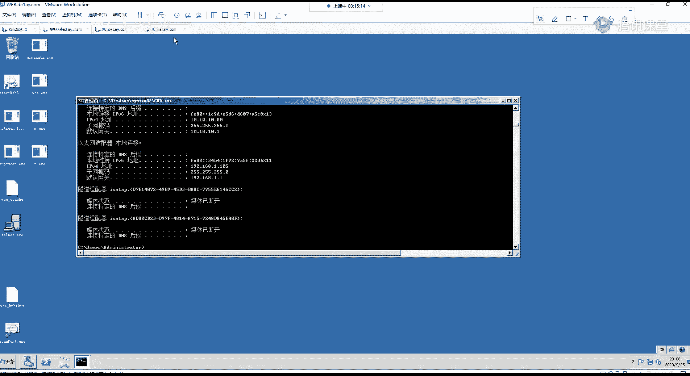

好吧。

就说我们平常我们去登录我们的一个机器对吧，登录你的这样子的一个啊windows的一个机器，就我我们一般都是输入一个用户名对吧，啊这个，输入一个用户名，然后的话输入对应的密码对吧，啊密码是。

这个的话就是说登录到了他本地的。

就是说他本地的一个账户，而不是说我们的一个呃御用户。

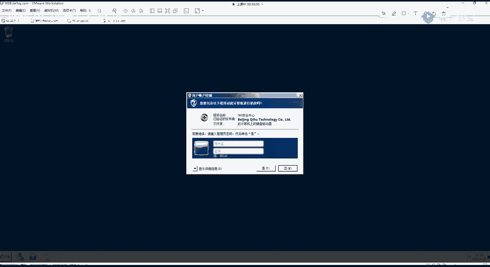

这边的话，就是登录到了他的一个本地的一个账户，我们可以看一下当前我的一个用户的话，就是delay嘛对吧，然后的话呃登如果说你要登录到域中，就是说我刚刚这边登录的话，它其实是你登录到了这样子的一个。

delay的一个用户，就是说它本地，它本机的话是有这样子的一个用户对吧，嗯啊这个也是登录的用户，呃我们要去登录我们本地的一个账户的话，就是呃因为我们我们登录域域内的话。

我们前面这边的话是需要去写一个域名的，就是说你要登录哪个域的话，你就写域名，然后的话后面的话接你的一个用户名，k其实在这边也能看得到，就登录到哪一个域对吧，登录到哪哪里，然后如果说你是登录到本地的话。

就是顶顶斜杠顶的话，就是代表你登录到当前的一个本地的一个账户，然后在这的话可以看到它是登录到web这边的，一个web的话，其实就是这个机器的计算机名，然后前面的话就是delay的话，就是它的一个域名嘛。

就是说登录到域中，这边登录到web的话，就是登录到他的一个本地的一个计算机，然后当要注意的话，就说这边你登录的本地计算机的话，你的一个用户名，是你的一个本地计算机的一个用户名，我这边他的一个密码。

其实我也不是，我也不是我也，我这边也不知道，他这个靶机的话，它的一个就是说他说的是所有的一个用户的话，都是那个那个，就1q w a r t w sx嘛对吧，就这样子的一个用户。

然后在这边的话可以看到这边登录，那有两个用户，其他都是呃登录到了这个delay的这个域当中，因为我们是在这个delay的域域当中的。

这边的话就登录进来了。

其实我，呃呃有没有什么，这边的话应该没有什么问题吧，就其实呃你登录的一个方式，像这种的话，你直接百度1下嘛，好吧，网上有的比较基础的一个东西，好然后呃其他的不多说了啊，正式开始我们今天的一个课程内容啊。

我们今天的话主要给大家介绍一下，windows的一个密码凭证获取，然后呃主要的话我这边分为了三块内容，第一块的话就是给大家介绍一下windows的哈希，就说什么是呃windows下面的一个哈希。

第二个的话就是系统用户密码的一个凭证获取，第三个的话就是阿泽，我这边阿泽的话就包括了呃其他的一些方法，就是说不仅仅是你系统用户的一个密码，以及包括了你系统当中的一些啊软件，以及相应的一些。

像比如说我们的一个rdp的这种连接，你的这种连接的话有保存的这种频率，我们尝试去获取这种rdp的，连接着它的一个密码，好呃，首先第一部分就是windows的一个哈希简介。

那么什么是windows的哈希呢，就是说呃windows哈希的话，我们简单理解就是windows加密过的一个密码口令，我们可以称之为一个哈希，好啊，这个哈希的话。

在这边我们知道它是就是我们的一个密码口令，比如说我们是一个admin这样子密码口令，那么他经过加密之后，他有这样子的一个加密的一个算法，加密的一个函数，把它加密之后的话，我们就会生成有这样的一个哈希值。

那么在这边的话，我们需要知道它有windows下面的话，有什么样子的一个加密方法呢，呃windows系统下面的话会使用两种方法，对用户的一个密码进行一个哈希处理，它们分别是啊learn manager。

就简称的话是lm，然后的话呃net learn manage manager的话就是nt m，就我们一般的话都说它的一个检测就是lm哈，希，还有n t m的一个哈希，就是呃比较呃比较方便说嘛。

然后我这边的话还要知道的话，就是说我们看一下，这边看一下这边第二页ppt的这个图，就是说我们在windows下面的话，它有两种这样子的，一个m哈希的一个加密的一个方法对吧，然后的话在这边要注意的话。

就是说lm哈希的一个密码，它最大长度为14，然后的话，如果说你的一个就是说你的一个密码口令，它的一个长度超过了14的话，那么lm他是无法去对它进行一个加密的，他是呃如果超过了14位的话。

他就会使用我们的一个ntm的一个哈希，以及的话就是说lm哈希的话，它是有就是存在缺陷的，所以的话在新版的这样子的一些系统上面的话，它默认的都是使用的一个nt m的一个哈希值，所以说在后面的一个内容的话。

我们不会过多的对这个lm哈希做过多的介绍，主要的话关注这个nt m的一个哈希，然后呃大家要知道，但是大家一定要知道这样子的一个l m，l m的一个哈希啊，因为我们在后面的话会也会去用到。

就是说有一些工具以及命令的话，你需要这样子的一个m哈希，及nt m哈希的一个格式，好呃然后的话还有大家要知道的话，就是说n t m哈希的话，他已经有了这样子的n t m vr的一个版本。

就是说他有两个这样子的一个版本，它每一个他的版本的话，它的一个加密的一个方法的话，他是有区别的，以及ucas的一个验证体系，关于cb的一个协议的话，其实上节课也有提。

然后我在后面的一个内容会给大家展开的介绍，前面这边的话我们主要的话就是关注，关注我们的这样的一个windows下面的一个，nt m的一个哈希，然后以及我们的windows系统下面的一个密码哈希。

它默认情况下是由两部分组成的，就是说我们的第一部分的话是lm的一个哈希，第二部分是nt m的一个哈希，它中间的话是由一个冒号，就是说这个这个冒号做一个分隔，好，我们可以具体来看一下它的一个。

哈希的一个密码格式，密码格式的话就是像我这边好这边所写的，首先第一个的话就是说你的一个用户名称，然后的话冒号，注意冒号的话它是一个风格，就是分隔两个部分的一个符号，然后按d的话。

rd这边的话就是它的一个，说到这个id的话，我们先看一下，这边我这边贴了一个图，首先我这边的一个用户名称是administrate对吧，他的r d的话就是500，然后大家要注意的话，这边的一个id的话。

它其实是唯一的，就是说好等会的话再展开介绍，然后后面的话就是接我们的一个，lm的一个哈希值，然后哈希值后面的话以冒号分隔，号分隔之后的话，后面就是nt l m的一个哈希值。

就是说我们这里的这一部分是lm的一个哈希，后面的这一部分呢，就是我们那个nt m的一个哈希，然后后面的多个冒号的话，我们不用管它这部分的话，然后呃还有在这边还有其他的一些用户。

像比如说我这边的一个win 7用户，他的id的话就是1000对吧，还有还有特殊的用户个体用户对吧，他那个id值的话它是不一样的，好这边的一个id我们如何去知道它是什么呢。

就是说啊比如说我就在我当前的这样子，一个windows的一个机器对吧，我外卖是我的一个，我外卖干不干货的话。

我们上节课有讲，就是啊有这样的一个命令对吧，我们通过这个命令能够查看到当前用户，他的一些啊，比如说他的一些主信息，用户信息以及它的一些特特权信息，然后在这边的话，我们可以看到当前我的一个用户。

是这个m n g的一个用户对吧，就这一个用户，然后在这边的话有一个sid的一个值，这个s d值的话它是一个唯一的，就是说你的一个windows系统上面的话，它每一个用户它都有一个唯一的这样子的。

一个sid值，然后这边的一个sid值的话，我们注意后面的这一部分，有一个这样子的一串对吧，1011001，这一串的话，就是我们的一个用户的这边的一个i d，以及我，看一下，稍等一下。

而这边的话我通过这个w mi这个命令，就是这一这里有一个user count，这个要在count的话，我们通过这个命令的话能够查看到，就是说你当前的系统下面，它的所有用户的一个账户的一个信息。

好在这边的话，然后在这边的话呃，我们可以看到，在这边我可以看到在这边能扣，有这样子的五个用户对吧，这五个用户的话，他每一个用户这边它是它的一个用户名对吧，用户名，然后这边的话是他的一个sd的一个值。

这边的一个s d值的话，其实我们可以看到前面的这一部分的话，它都是啊一样的对吧，前面的这一部分都是一样的对吧，就每一个用户，他的s i d前面的这一段都是一样的，然后它的一个不同的话。

就在于我们后面的这一个这一串，这一串的话就是我们这边的一个i d，然后他的一个唯一的话就它的一个不同的地方，其实就是在于这个id的一个值。

就呃大家可以自己查看一下自己的一个，大家可以查看一下自己电脑上面的这样子的，一个用户的一个信息就能够知道，所以的话在这边的话，我们就能够去理解这样子的，windows下面它的一个哈希的一个密码格式。

它是怎样是怎样去组成的对吧，这个的话能理解吧，应该没有什么问题啊，呃你们是都是啊还在上学对吧，就是上学要上课是吧，呃那那你们的话更加要就是要更加要呃，多花点时间对吧，因为你白天的话要上课的话。

你我在我们在编的一个课程内容的话，可能你就是做的会比较少，那么那么你课余的这些时间，还有周末的时间的话，还是要抓紧抓紧一点，就是好的，能理解，那么我们继续，然后下面的话我们给大家介绍一下。

就是说windows的一个认证基础，在这边的话呃，其实本来的话应该是在后面会给大家去讲啊，就是windows认证的一个基础，以及就是说windows认证的三个部分，就有这样子的三种认证方法。

首先第一个就是本地论证，就本地论证的话，它是用户直接操作计算机去登录账户，就说我们这边的一个本地认证，其实就是，我们平常我们登录我们自己的一个电脑对吧，我们我们登录我们自己的一个电脑，这边登录电脑。

我们使用我们的一个用户名，然后的话输入我们的一个密码，就登录到了我当前的这样子的一个系统对吧，这个的话就是一个本地论证，好啊，网络认证的话就是远程的去连接到工作组中的，每个设备，就说我去远程的。

比如说我用ftp，还有我用啊这样子的一个文件共享对吧，反正文件共享这种，我要去连接到我这一这一个workgroup，这个工作组当中，或者说某个工作组当中的其他的一个设备。

那么这边的话它的一个认证方式的话，就是网络认证好啊，预认证的话就是登录到玉环境中的某个设备，在这边的话呃，后面啊，在这边的话，本地认证以及网络认证，这个的话，呃我不知道大家有没有去看。

就是说我这边给的一个预习内容啊，这边给的预习内容的话，其实大家看了这几个文章的话，应该也能够有一个基本的一个理解以及印象，对吧对啊，这里的这里有这样子的一个nt m哈希语句，net n t m哈希。

这边的n t m哈希的话，就是我们本地的这样子一个认证的话，它是使用的这样子的一个哈希对吧，然后这个net n t m哈希的话，就说我们这边的一个网络认证方式的话，它是通过这样子的一个。

啊这篇文章的话我就不打开了，大家预习的时候有去看嘛对吧，以及还有就是呃n t m的一个啊，详细的一个介绍，以及这一篇文章的话有，以及这篇文章的话，就是你看了这篇文章的话，应该就能够去理解。

就是说这边的一个艾玛哈希以及n t m哈希，他在这边的话也介绍了，就是说他的一个加密的一个方法，就如果大家对这种加密的方法就是感兴趣的话，可以去研究一下，当然的话在这边的话。

我不会去对这些做过多的一个讲解，然后的话呃我们这边的话，我们主要的着重的就是给大家介绍一下，windows的一个本地认证啊，问的是本地认证的话呃，大家看一下，这边就我这边的话。

把它分成了这样子的四个步骤，就是四个就是中间的四个过程，首先第一步就是用户输入密码对吧，我们登录一个登录一个系统，我这边登录这个系统对吧，我先输入密码对吧，我随便输入一个密码，然后的话呃。

输入用户名以及密码是吧，我这边随便输入，然后输入之后的话，就是说系统它在接收到你这边，输入一个密码之后，他会做什么呢，他会将我们用户输入的密码，它会计算成一个n t m的一个哈希，好。

在这边的话要注意的话，就是说你新版本的系统啊，他都是用的一个nt m的一个哈希嘛对吧，然后的话，如果说你是一些老版本的一些系统的话，你的一个密码长度没有到14位的话，他可能是用的一个lm的一个哈希的。

一个加密算法，这边的话应该能理解是吧，然后他把我们的一个密码计算成这个nt m哈希，之后，它会与我们的一个sam sam数据库，这个sam数据库呢，它是存储在我们的一个windows的一个本地。

本地系统上面的，它的一个位置的话就是在这一个路径下面，就是在这个路径下面，然后呃这个路径下面的话，有这样子的一个sam文件，这个文件的话，它就是存储着我们这个windows系统上面的。

所有的一个用户名的，一个啊这样子的一个哈希值，然后呃当我们要去登录这个系统之后，输入密码，它会把我们那个密码加密成n tm那个哈希，然后的话在与我们这边的一个sam数据库里面。

所保存的这个用户所对应的一个ntm哈希值，去进行一个比对，不过说你比对成功了，也就是匹配，那么就能够去成功的登录这个系统，如果不匹配的话，他就会去登录它，就是登录失败对吧，然后像比如说我这边我登录啊。

我这边登录之后的话，它会有它就会有这样子的一个过程，他会把我们的一个输入的密码，我这边要输入admin对吧，它会把我们的这样子的一个admin的密码，加密成n t m的一个哈希值。

然后的话再去进行一个比对，然后这边的一个呃ngm哈希的话，大家可以用这样子的一个python的一个模块，就这你你首先需要去安装这样子一个pass lab，这样子的一个库。

然后的话可以调用它这一个库当中的，这样的nt哈希这样子的一个嗯这个方法，然后的话把可以去把我们这边给定的一个啊，字符给它加密成，我们的一个n t m哈希的一个格式，好像在这边的话。

我们呃admin的一个哈希值的话，n t m哈希的话就是这这一串啊，我这边把代码发给发出来吧，然后我们这边看一下，我就不敲了，我直接复制了。

然后这边的话就得到了我这边admin这个字符。

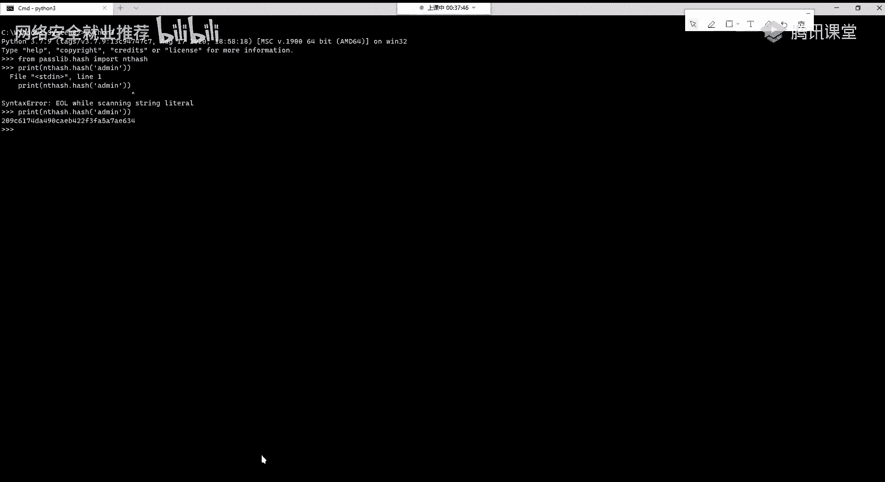

它的一个ntm哈希，然后像这种n t m哈希的话，其实像这种比较简单nt m哈希，我们可以去进行一个解密，就是这边的话待会会讲啊，我这边先让大家看一下效果吧，啊就这个cmd 5这个网站的话。

大家应该都知道对吧，我它里面可以解密很多的这样子的，一个一个加密的这样子的一个啊串，然后的话在这边其实他也有nt m的，nt m的一个解密啊，我这边的话直接查询应该是能查出来，是可以直接很快的就查出来。

像这种比较简单的这种密码的话，它的哈希值的话，我们它可以很快的去查出来，然后可以看到在这边它的一个类型的话，是自动的识别，为了一个n t m对吧，就是说它是用n t m和n t m的一个方法。

加密的这样子的一个值，然后解密的一个结果是它的命，所以说呃我们等会的话会给大家讲讲。

就是说我们如何去获取到系统当中的，这样子的哈希值，然的话我们通过这个哈希值的话，就能够去解密成我们的这样子的铭文的密码，然后的话会给大家介绍多种解密的一个方法啊，不是多种获取这个哈希值的一个方法。

然后的话呃，ngm哈希它是一种单向的一个哈希算法，就是我们的一个用windows，它会将用户的一个密码计算成这个哈希值，之后的话存储在电脑当中，就说你的一个你在创建用户，就比如说你创建一个用户。

你创建用户之后的话，你需要输入密码对吧，那么你创建用户之后的话，这个密码的话，他就会把它计算成n t m那个哈希值，存储到这样子的一个sam数据库啊，关于这个sam数据库的话。

大家可以去看去这个目录下面去看，当然的话你这边直接的话是打不开啊，直接的话是你打开的话是一个乱码，就是你看不到里面的呃实际的一个内容，因为它是一个加密的嘛，嗯怎么不，而且在这边的话要要注意。

就是说这个的话你是需要一个管理员的权限，你才能够去访问的，所以说在后面的话，我们我们要去获取到这样子的一个，就是说从这样子的一个sam，数据库当中去获取它的哈希的话，你是需要一个管理员的权限。

好在这里的话有这样子的一个sam的一个文件，这个文件的话。

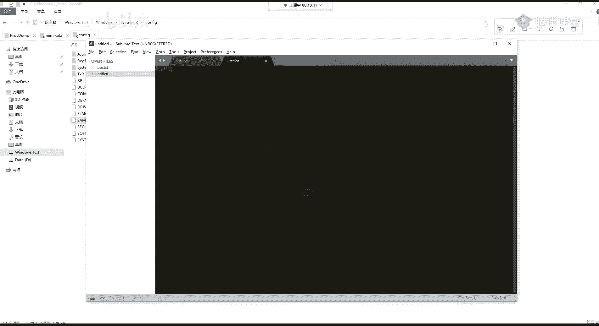

这个文件的话，你这边打开了，打的话是打不开的，就说你看不到它里面的一个内容，嗯后面的话会介绍我们如何去获取他的，这样子的一个哈希值，然后呃还有的话就是我们本地认证，本地认证的话。

他中间的话有这样子的一个特殊的一个进程，这个进程也是待会会去涉及到的，在这边的话给大家介绍一下，就是说我们再去进行本地认证的时候，他windows系统下面有这样子的一个进程。

叫l s a s s等于x一这样子的一个进程，这个进程的一个作用的话，就是用来处理我们用户输入那个密码，就是说我们的输入的这样子的一个铭文，那个密码对吧。

在windows系统上面它需要把它进行一个加密是吧，那么这个铭文的密码的话，它会在这样子的一个进程当中保存，然后的话在这个进程当中的话，再把我们呃输入的这样子的一个，铭文的一个密码。

它把它加密成我们的一个ntm的一个哈希对吧，然后的话再去进行一个比对，但是在这边的话就是说有一个问题，就是说我们这边的一个密码的话，我们输入一个密码，它会在这个进程当中做一个铭文的一个保存。

那么我们可以通过相应的一些方法来去，从这个进程当中获取到它的，一个铭文的一个密码，然而在后面的话会有讲到，就是说使用这个mini cards来获取名为密码，就这边他获取铭文密码的话，获取明文密码的话。

它其实就是在这个进程当中去进行一个读取的，呃第一部分内容的话，大家能理解吧，应该没有什么问题吧，就大家有没有什么疑问，能理解我这边讲的吗，就说能能接受我这样子的一个啊介绍吗，能能接受能理解的。

在讨论区扣个一，就有问题的话呃扣二，ok应该都没什么问题，那么我们继续好第二部分，第二部分的话就是我们今天的一个主要内容，就是系统用户的一个密码凭证获取，在这一部分内容的话。

我我会给大家介绍这样子的十种方法，来去进行一个啊，我们的一个密码凭证的一个获取，在这边的话会就说会涉及到我们前面所介绍的，一个哈希，就是说通过相应的一些方法来去，获取它的一个哈希。

首先第一个的话就是呃mini cards，mini mini cards的话，它是一个就是说呃，相当有名的这样子的一个啊工具，这个工具的话它的功能很强大，然后的话也是我们经常会使用到的。

所以说它能够去读取啊系统的一个密码，以及能够去解密，解密我们的特定的这样子的一些加密的，这样子的一些密码，第二个的话就是呃pasha的一个一些脚本，就是说我们通过pasha的一个方式来去加载啊。

获取哈希的这样的一个脚本，嗯啊以及还有下面这一个的话，我就不一的去说了，这边的话啊，等会的话会一的介绍好，首先的话我们先来看一下，第一个就是mini cars命令，cut的话呃。

大家可以去这个网址去下载，然后呃在工具包里面的话，其实也有也有给，就去这个网站去下载，就在github上面，先啊最近的话他应该有更新啊，就七天之前的话有更新了，然后呃他在这边的话呃，集成了。

就是说最近爆出来的一个月内提前的一个漏洞，就是这个zero logo，这个的话在后面的话啊，应该会给大家去介绍，就是说我们可以直接用这这样的一个mini cut，来去进行这个啊域内提取的。

这样子的一个啊漏洞，就说这个漏洞的话，我们可以利用他的这样子的一个协议，利用它里面的一个协议来取协议的一个漏洞，来去把我们的预控的它的一个用户密码，把它置为空，然后的话我们就能够去啊。

去得到预控的一个权限，就就是一个提前的一个啊漏洞对，因为我们知道我们得到了预控的话，那么它就能够对这个域当中的所有主机，都有一个完全的一个控制嘛啊，然后的话我下面的话介绍一下。

就是说mini cut的一些用法啊，这边的话就是一个使用的一个，就是本地非交互式的一个凭证获取，这也是我们经常会用到的，就是说我们的一个mini cars的一个工具的话呃，在哪。

就你下载下来之后的话是这样子的，然后的话在这边的话有这样子的一个程序对吧，二的话你直接输入密新cut，然后的话他就会去进入到这样子的，交互式的一个界面。

然后的话就去输入相应的一些命令对吧，当然他这样子的话就是适用于。

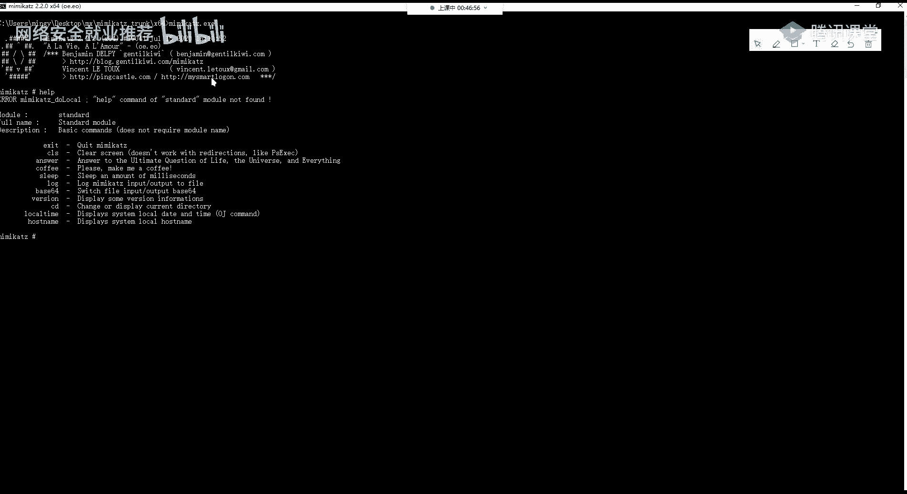

就是说就我们实际的话，我们实际去执行的话，就是说啊，你不可能你直接直接有这样子的一个交互式的，这样子的一个命令行的，除非你直接得到了他一个，比如说你远程桌面登录上去，然后的话把它传上去。

然后去执行对就去这样子的一个交互式，就一般的话都是常用的，用非交互式就直接获取，通过这样子的一个非交互式，通过一条命令，通过执行这样子一条命令，来去获取我们这边的一个呃密码哈，希。

然后这边的话我们看一下呃，大概的介绍一下，关于它的一个具体的一个使用的话，大家看我给的那个预习的内容，里面有关于这个mini卡的一个详细的使用对吧，好在这边话我们大概来看一下。

就是我这边给的这两个mini，首先这边的话啊mini cut，然后在这边的话每一个语句的话，它是用的一个双引号去做一个分隔，然后注意要有有空格的，是有空格来用双引号去包裹每一个命令。

这边的logo ie。text的话，就是说这个logo的话就是记录嘛，就是说他会啊，把我们在后面执行的这样子的一个，结果的一个内容，它会写入到我们这边的一个文件当中，就这个呃指定的这个名字，i e s。

tt好呃，这个第二个面的话就是进行一个提前，就是说我们要去把我要去，就说我们这边执行命令cut的话，我们首先需要去执行这个命令，这个命的话就是啊，把我们的一个就是进入到我们的一个debug。

调试的一个模式，你要去，你要能够去进入这个debug的一个模式的话，你首先你需要有一个就是管理员的权限，你才能够去进入，也就是说你要去获取这样的一个，用mini cai去获取密码的话。

你需要有管理员的权限，呃然后的话就是这个token avat，这个我有点忘了呀，这个是啊获取系统的一个token，来去进行一个提前，在哪，我这边还用交互式的一个方式给大家演示一下。

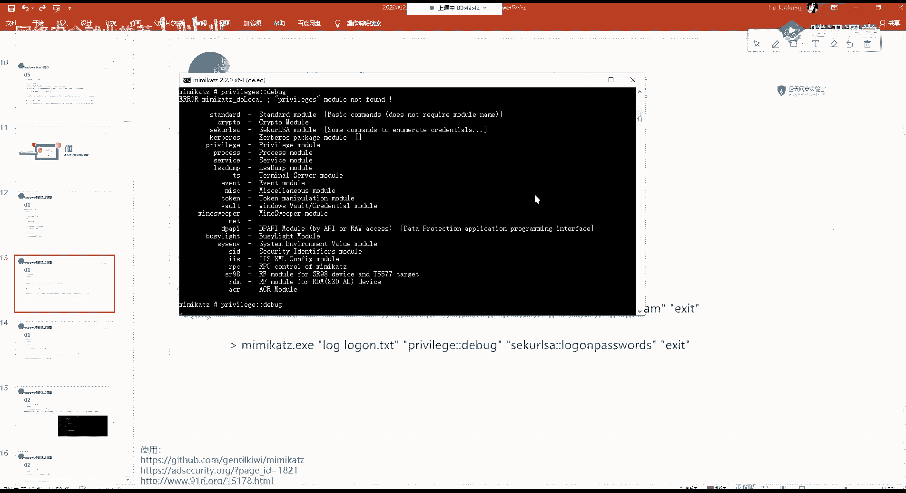

可以看到这边它返回了一个200。

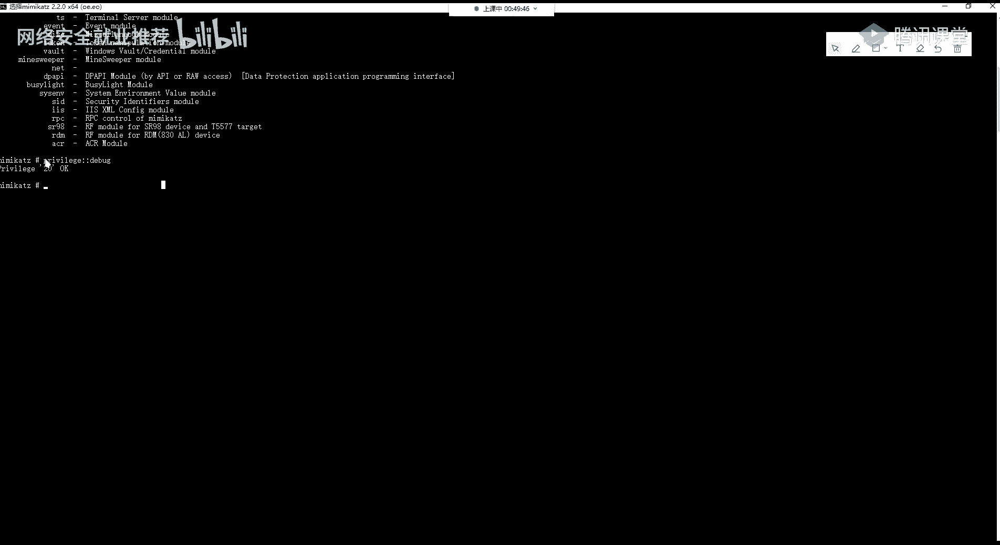

就说明我们已经进入了这个debug，的一个调试模式，也就是进行了相应的一个提权，然后的话呃。

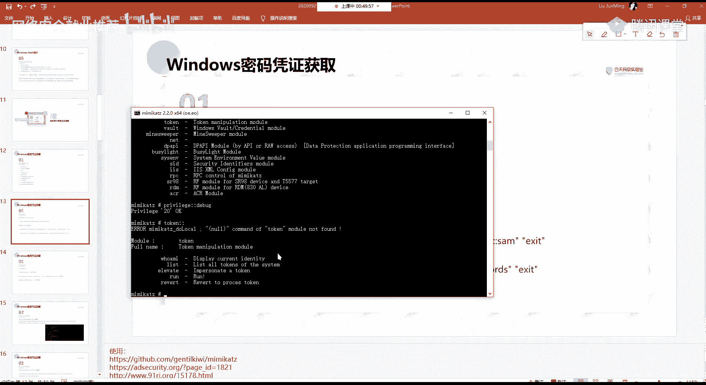

这个token的话啊，token的话，这边的话它是我们可以用这个token，嗯就我们可以通过利用它的这个功能，就是token list来去列出，当前就是说当前系统上面的话，我们可以去用哪哪一些脱口。

就关于这个token的话，在后面会给大家介绍，这边大家只需要知道有这个token就可以了，然后的话啊我们可以就是说这个用windows系统下面，它所保存的这个token来去进行相应的一个提全。

在后面的话也会介绍介呃，介绍的就是啊token的一个呃偷取获取，以及token的一个注入，提前好，这边我们就是token alert的话，就是用它系统自带的这样子的一些token，来去进行一个提前。

就impression，这个是什么意思，啊模仿就是就是他会去模拟啊。

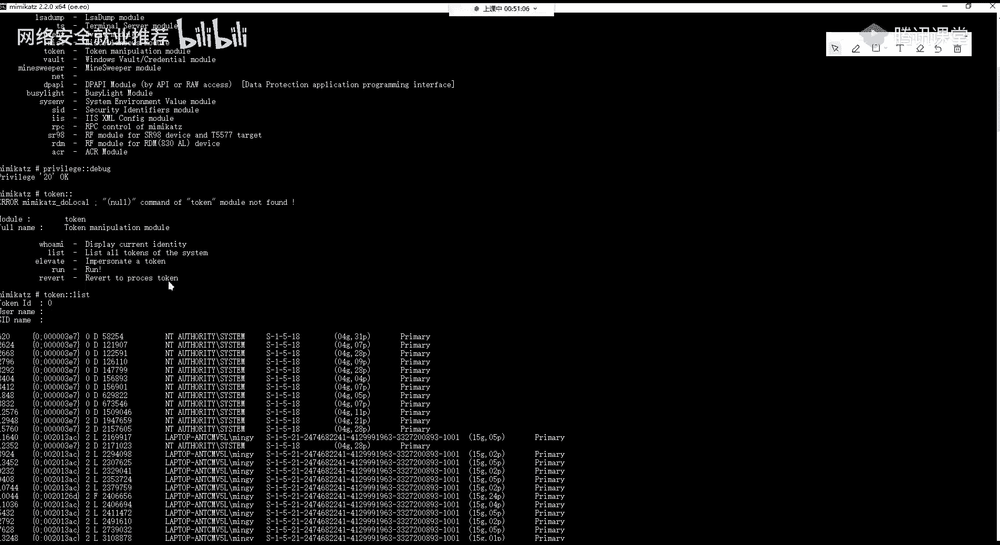

系统当中所存在的这样子一个token来去进行，来去得到相应的一个权限，然后的话呃这个l r s steam sam的话，他就是会去我们的一个sam数据库当中。

去获取到我们的这样子的一个哈希值，这边的话嗯。

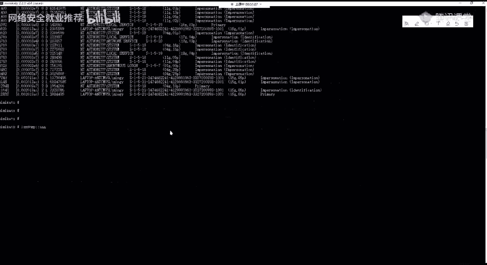

在这边。

我在这边。

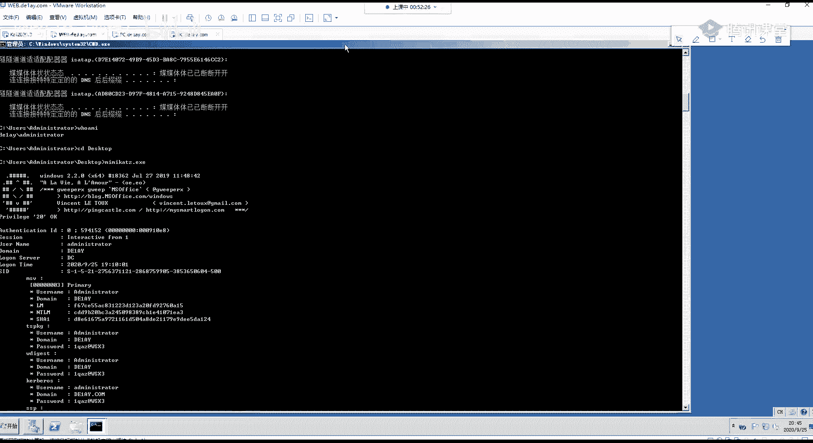

复制不进去，啊已经46了，我们先休息五分钟吧，好的话呃，我们先休息五分钟，然后我这边的话先把课断一下，然后50的时候我再上来好吧。

好啊，我们休息了一会儿啊，刚刚的话是我没有开麦啊，就是刚刚我没有开麦，呃呃呃休息了几分钟，我们继续我们的第二个课时，就是接下来的一个内容，好刚刚的话我们讲到用这个mini cds对吧，然后在这边的话嗯。

但刚刚大家应该也有看我操作吧对吧，就呃首先你用命令cut你进入这个交互模式，然后你首先需要用这个privilege debug，进入debug的一个模式进行一个提前，然后在这边的话用这个token。

token errot来去进行，来去进行一个啊token的一个模拟，然后这边token的模拟的话，其实我当前的是一个对面的一个权限，好的话，我这边通过token能够模拟的话，能够去把我当前的一个权限。

把它给提到我们的一个system的权限，然后的话我再用这个ios dump来去dump，我们的一个sub sam数据库当中的一个呃内容，然后这边的话就是我这边，dp下来的一个内容啊。

就是可以看到在这里的话呃，有这样子的一个user user administrate，然后它的一个n t m的哈，希值的话就是这一串对吧，以及还有这一个啊，d d e a y这样子的一个用户。

这个用户的话我们可以看到他这边啊，有而ntm的哈希，然后的话还有m的一个哈希，在这话我们都能够看到，诶这怎么关掉了呀。

哎呀，这环境有点卡呀，咋这么卡呢。

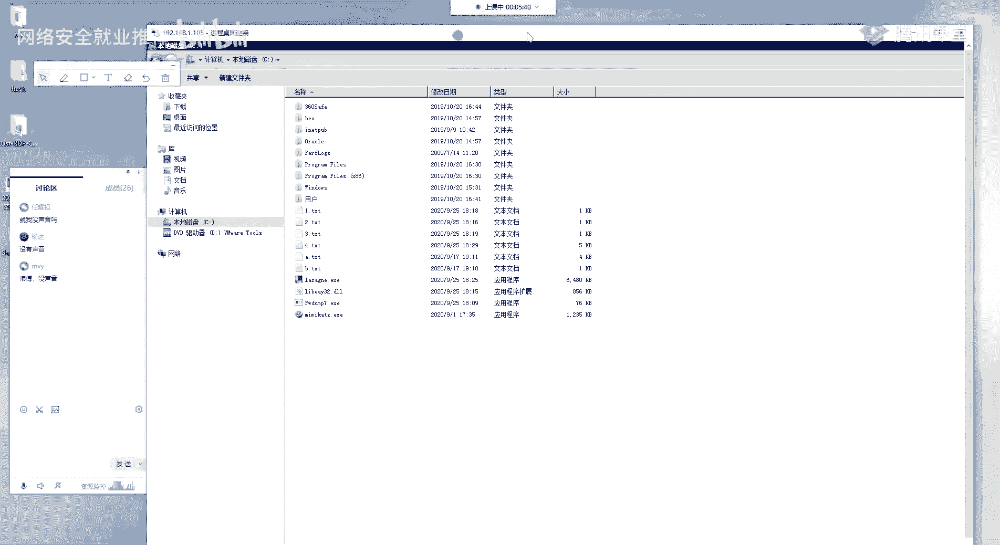

有点卡啊，好这边的话我们获取到了我这边admin这个用户，他的一个哈希值对吧，那么我们得到这个哈希值的话，我们可以尝试去对它做一个解密，我去怎么没粘贴过来了，唉这环境有点问题啊，疯了。

啊演示的话就这样就这样好吧。

大家应该能能理解，就我这边得到了他的一个哈希值的话，就其实就跟我们前面一样对吧，我得到了那个admin用户的一个哈希值，那么我可以尝试去进行一个解密，就是用这种在线的一个解密网站去进行解密。

当然的话这种解密的话，你不一定能够去解出来的，就是说啊如果说呃这这边的话就是后话了，就是说这些哈希值虽然我获取到了，按说这个哈希值的话，我去进行一个解密的话，解密不出来是吧，所以说他的一个密码的话。

它是很复杂的，他得到这一个哈希值的话，解密不出来，那么解不出来的话，我们后续有相应的一个方法，能够去用，利用这个哈希值来去进行一个横向的一个移动，横向的一个渗透，这边的话我给大家提一下。

后面的话会具体的去介绍，然而这是一个，然后还有下面的这个话也是同理啊，下面这个的话就是呃，我们能够去尝试获取到它的一个铭文，的一个密码，就用这个啊。

logan pass password能够去得到它一个名额密码，其实在这边的话，这里就在这里的话。

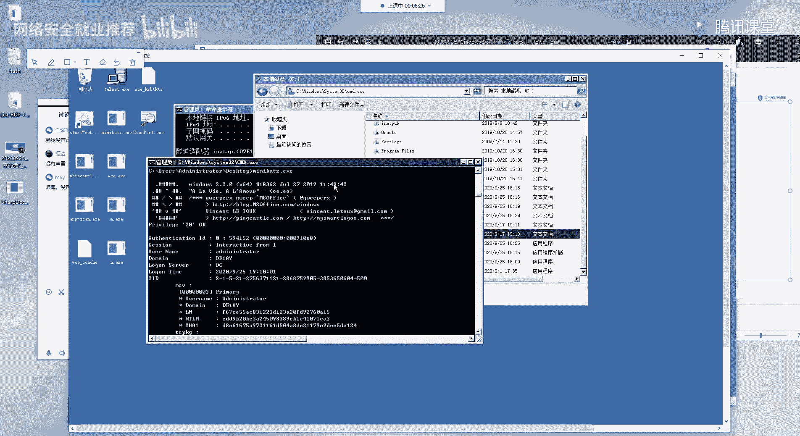

我这边执行了这样子的一个mini cut，这个mini cat的话，它是啊就是啊你直接执行的话。

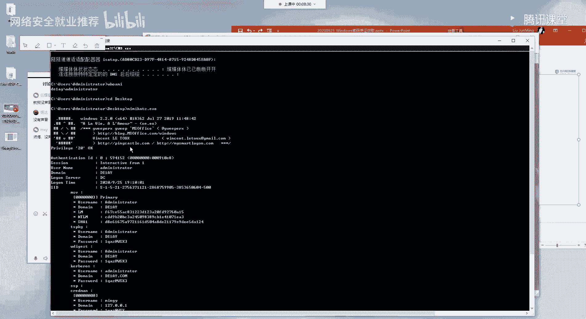

他就会去获取我们的这样一个明文密码，它其实实际的操作步骤也是使用的。

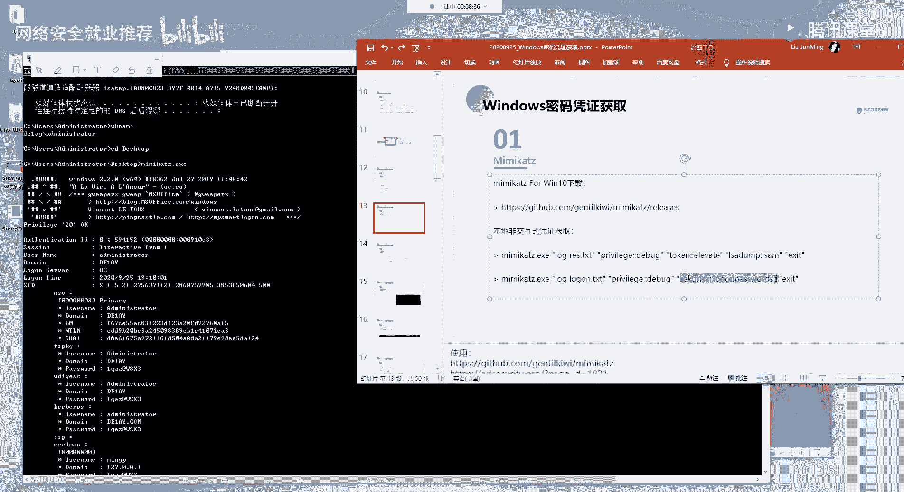

这样子的一个方法，然后在这边的话我们可以看一下它的一个效果，就在这里我执行之后的话，他也同样的会去进行一个提前对吧，然后的话获取我们当前系统上面的，所有的这样子的一些用户，他的一些铭文的一个密码。

以及它的一个哈希值，而在这边的话我们可以看看到，就是首先这边user name这个administrative这个用户，然后的话，嗯嗯然后的话它是所在的一个玉的话，是这一个这一个域，好我在下面这边的话。

它就列出来了相应的这样子的一些呃账后，他的一个哈希值，以及它的一个明文密码，然后在这边其实我们可以看到啊，这个admin的一个用户，他是这个啊这个d delay这个域的，它那个名额面码是这个对吧。

我们可以直接获取到，以及啊还有这里这这边的话就是这个rages，这里的话就是，就其实我们上一节课有留给大家，就是朋友给大家演示，就是存储在本地的这样子的，一个存储在本地的这样子的一个平局。

就说这里的一个平局我们可以看到，就目标的话它是这一个117点对吧，然后他的一个密码的话是这个，是这样子这样子的一个啊平均，然后还有下面的话，还有其他的，像这样子的一个m msl的这样的一个用户。

它的一个啊哈希对吧，以及它的一个铭文的一个密码等等，这些啊，底下这些的话都是类似的，它会列举出当前系统，下面这些用户能够去枚举出来的，这样子的一个哈希值，以及它的一个密码。

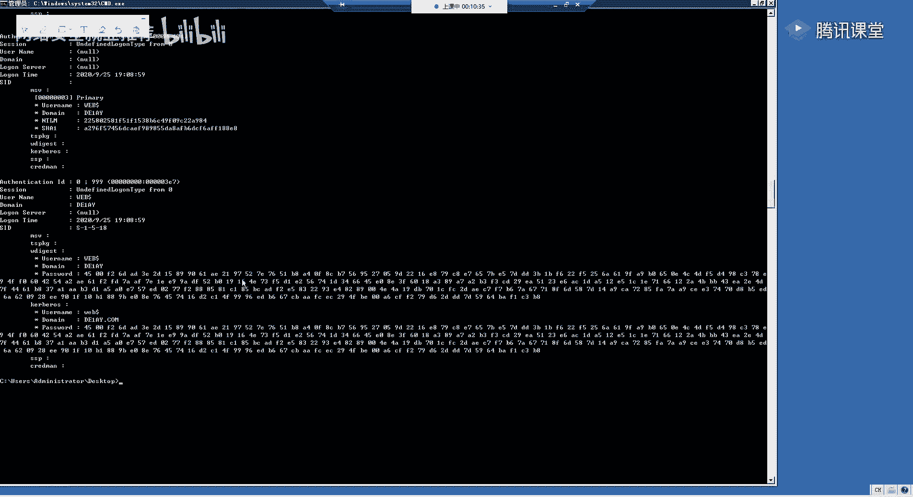

可以看到在这边的话他都已经获取下来了，这样的话就是mini cut它的一个使用，那么我们在这边我们得到它一个名为密码，那么我们就可以去登录到这样子的一个系统，然后的话得到这个系统对应的。

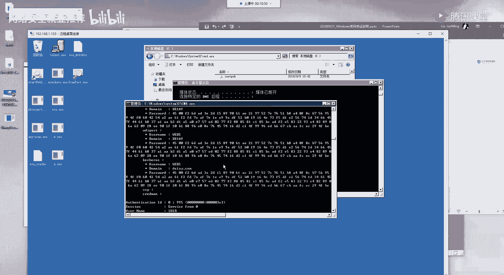

这个用户的一个权限对吧，这个应该能理解，然而下面的话就是呃，这边的话其实就是给大家提一下，就是我们现在的话一般的话都是用的新版本的，就是啊二点零二点多的一个版本，就老版本的话。

我们以前的话是用的这个一点多的一个版本，就是他的一个命令的话，他是跟现在是不一样的，前面这里的话就是提升权限是一样的，然后在后面这边的话，我们就说它是有这样子的一个dl文件。

我们需要去把这样子的一个dio文件，注入到这个进程当中，我们才能够获取到这个进程当中，所存储的一个密码，然后二点多的话就是啊，按我刚刚的一个介绍来去进行一个操作。

这边的话其实就是让大家就是啊就是告诉大家，就是如果你比如说你看别人文章对吧，你看到他使用的一个命令，跟我现在用的一个命令不一样，那么你这个时候你不要奇怪对吧，那么他可能是用的一点多的一个版本。

就是比较老的一个比较老的一些文章了是吧，然而第二个的话就是power shell，脚本来去进行一个加载，就说mini cut的话，它有一个power shell的一个啊抛弃了脚本的一个就啊。

就是有一个用pasha的这样子一个脚本的一个啊，写的一个mini cards的一个脚本啊，就是他的一个脚本功能的话，就是实现实现这样子的mini cut的一个功能，就是来去获取系统当中的一个明文密码。

好我在这边的话呃，大家对pasha有了解吗，好上节课的话其实也有提到这样子的一个posh，大家了解剖学吗，就是呃知道知道它的一个基本的一个使用没有，我没有什么意思。

就知道pasha如何去进行一个基本的一个使用，来去进行这样子的，像比如说去加载这样的一个脚本执行，对本地的去加载以及远程的一个加载，不了解啊，不了解的话，我这边大概的说一下，然后嗯。

如果呃就是其实后面的话也会涉及到这一个，涉及到这涉及到这样子的一些内容啊，我看，一点点，而pasha的话比cmd比cmd要强大，但是呃pasha它是windows下面的一个自带的一个呃。

应该说是一个工具。

一个模块的一个一个工具模块呃，你百度1下吧。

可能我这样子描述不是很准确，它是呃个命令行的一个外壳程序脚本环境，这个呃抛弃下面的话，它有自带的很多的这样子的一些功能以及脚本，我们可以直接去进行一个使用，来去好操作我们的一个系统。

去获取相应的一个信息，以及能够去执行相应的一个命令，啊啊，如果大家对pasha不是很了解的话，我后面的话看抽一个时间，像比如说周末什么时间，给大家介绍一下pasha的一个使用吧。

然后后面后面的话因为也会经常去使用到，好吧，如果当然的话，你可以自己去，你可以自己去了解一下，就自己去百度相应的一个资料，去了解它一个实用好吧，然后这边的话大概的介绍一下，我这边的一个语句，它的一个作。

它的一个作用就是嗯可能我现在讲的话，大家不是很理解，但是没关系啊，你先有一个大概的一个印象，然后的话你后面你自己去，或者说我后面讲的话再去细讲好吧，然后这边punshi e x i e x。

这一个的话就是一个嗯。

啊我先进pasha，然后你输入一个help的话，能够去查看到查看到相关的相关的一些命令，以及一些参数对吧，然后在这边的话，我们可以通过这个get help来去获取到相应的，这样子的一个命令。

它的一个详细的一个信息，就包括名称以及它的一个语法，还有别名，以及它这个呃它的一个具体的一个使用，具体的一个使用，然后在这边的话，这个ie x的话。

它其实这个in walker expression的它的一个别名，这里它的一个意思的话，它是我们可以去执行相应的一个命令。

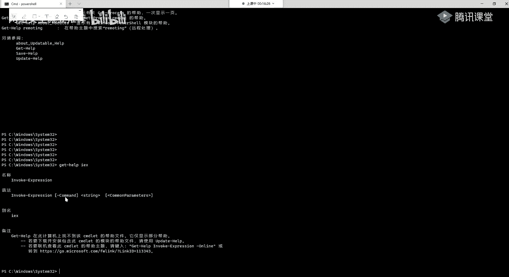

就是说把我们的在这边，把我们这边用download strike去下载的这样子的一个，psh的一个脚本，把它加载到内存当中去进行一个执行，这个的话就是这个ie x的一个作用，然后这个ie x要注意的话。

它是这一个invoke explosion，它的一个别名，就是我们可以通过这样子的一个，简写的一个方式好下面这边的话new object，net web client。

这里的话就是这个new object的话，就是创建这样的一个对象，这个对象的话就是这个net web client，这个是啊c啊，就是donnet，因为我们的一个posher的话，它其实是一个。

啊利用的是这个donnet framework，这个框架的一个强大功能，就在这边的话，我们创建了这样子的一个web client，也就是啊web的一个客户端的这样子的一个对象。

这个对象的话他有这样子的一个方法，就这个download strike的这个方法，这个方法的一个作用的话，就是去下载我们这边给定的这个，链接的一个内容，好这边的一个内容的话。

就是我们的一个远程的一个脚本，我这边脚本的话是放在我的这个vps，服务器上面的，然后的话当然的话你也可以，就是说就我这边的话有给这样的一个脚本，就是比如说这个脚本，这个脚本的话，你可以，就他就他，我去。

我觉得，啊就是这一个脚本啊，诶怎么防不到呢，呃要翻墙了啊，要要要翻墙才能够防得到，然后这边的话就是他的一个脚本的内容，当然你你可以直接就是说用这样子的一个链接，对吧。

这个链接的话就是你可以直接把它夸到这边来，来去进行一个直接下载这个链接，但是的话这一个啊，一般的话就不推荐大家去用这样的方法，因为我们从这边的话也能看到它是挂，它是放在我们那个github上面。

那github的话你去直接去访问的话，你是需要去翻墙的，比如说你在国内的话，用这样子的一个方法的话，你去进行一个远程的去加载这个脚本的话，他会有报错，就是你连接不上这样子的一个github。

它的一个域名是吧，你反问不到他，所以他一般的我们的一个操作，他就是把这个脚本把它给就是下载下来，下载到放到我们自己的这样子的一个啊，服务器上面，我说的话放在了这边，就是已经就放了几个脚本。

这边的话有这个emok mini cards这个脚本，然后呃我通过就是python，来提一个简单的一个hp的一个服务，然而默认的话，它是开放在80087的一个端口。

你也可以去指定其他的一个端口也是可以的，然后在这边的话呃，在这边的话，前面这边的话就是去利用这个ie x，把我们这边下载一个脚本加载到内存当中，然后去执行，而且这边的话是一个远程的一个啊。

远程的一个家长好用分号去进行一个分隔，就分隔前面的一个命令及后面的一个命令，在在这边的话，就是说我们前面已经加载了这个脚本之后，我们可以用这样子的一个啊，用调用它的这样子的一个呃命令来去执行。

然后这边执行了一个啊，执行的一个达到一个效果的话，就是像这边我这边的一个截图啊，截图所示，就是说其实跟我们前面呃，直接用mini cards来去获取它的一个明文密码，它其实是类似的，我们可以看到在这边。

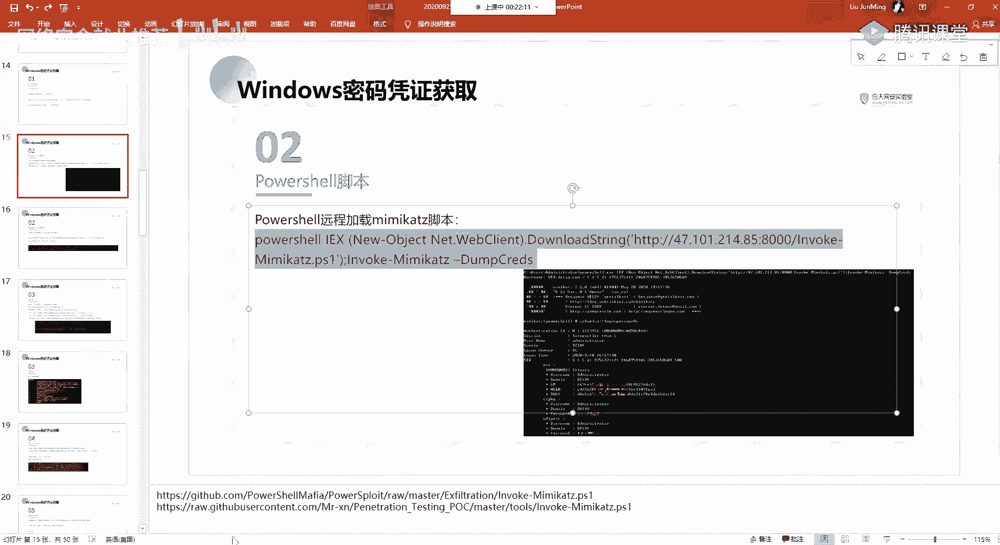

然后呃看一下实际的一个效果吧。

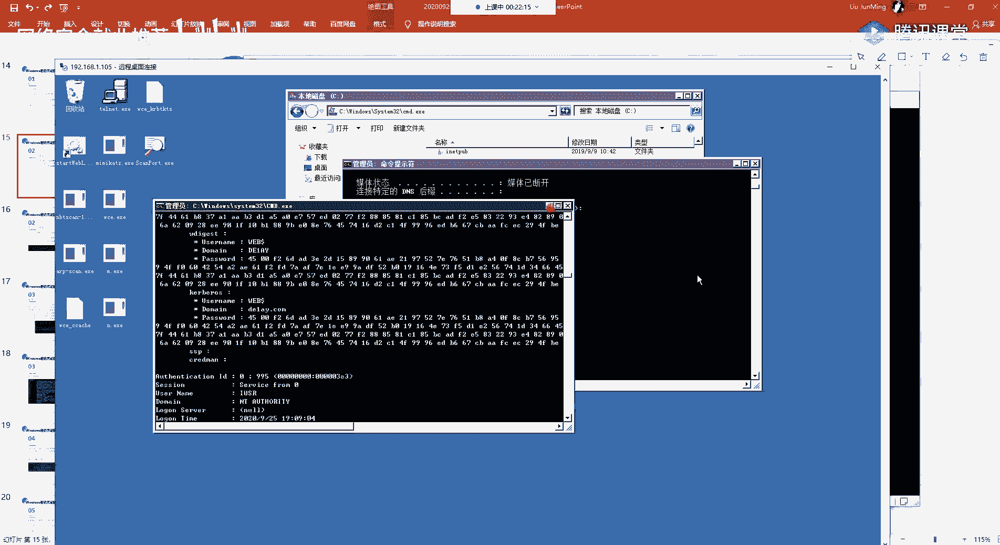

然而在这边的话，我们其实可以看到他会来这边去加载。

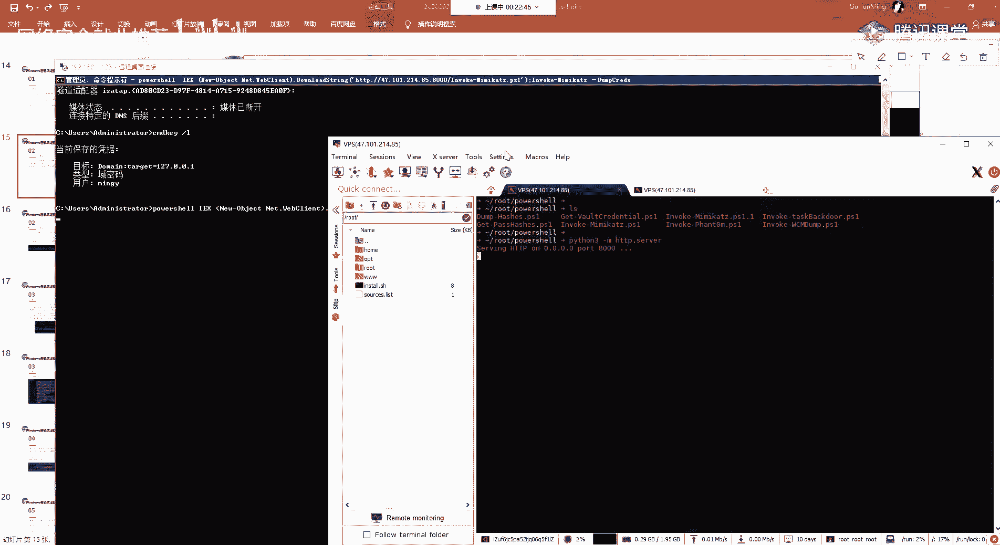

你怎么没反应。

呃这边的话应该是网络的一个问题啊，下的有点慢，可以看到在这里的话，他已经发起了这样的一个请求。

就是来请求了我这边的这个脚本对吧，然后他在在这边的话，它加载到内存当中，加载加载之后的话，他会去执行执行我这边的一个invocal mini cut，的一个命令，这边的话需要等待一下，还需要一点时间。

我们。

啊我先让他跑在我们继续后面的一个内容，搜索参搜索是插件，就是这个youtube吗，你可以你可以你去下载一下玩一下吧，它里面有比较多的一些插件啊，我是习惯用这个，就是里面它的一个功能的话还是挺多的。

开启过一个htp服务，就能用这个命令吗，怎么说呢，你你没你没，你可能没明白我这里的一个意思啊，就是说我这边的话，我是下载好了这样子的一个脚本，这个脚本的话它的一个功能的话。

就是实现的mini卡的一个功能。

然后的话我把它放到了我这边的一个，e p s的一个服务器上面啊，因为在这边的话，我是通过就是说通过这样子的一个啊，其实你这边的一个对象的话，其实你就可以把它理解成就是一个呃下载。

就是说想跟我们在浏览器上面去下载，其实是同理的，然后它它会去下载我们这边的这样一个脚本，然后这边的一个脚本，就你对htp的一个请求应该能理解吧是吧，这个的话就是一个一个链接嘛。

然后的话它通过发起一个htp的一个请求，请求我这边的一个啊请求我这边的一个链接嘛，请求我这边这个链接的一个内容嘛，也就是我这边的一个脚本内容嘛，然后的话通过这个ie x把它加载到内存当中去，执行，好。

在后面这边的话是接我们具体的一个命令，然后这边的一个具体的一个命令的话，就是说啊基本的这种pasha的一个脚本，大家还是要能会看哦，就是其实在这边的话，他有这样子的funk选择一个声明。

就是他是声明了这样子的一个invoke meeting cards，就其实我们这边执行的一个，就是调用的这样的一个命令的话，就是这个invoke mini cut，然后在这边的话有相应的一些注释。

就使用的话就是这个这个命令其实是对事例。

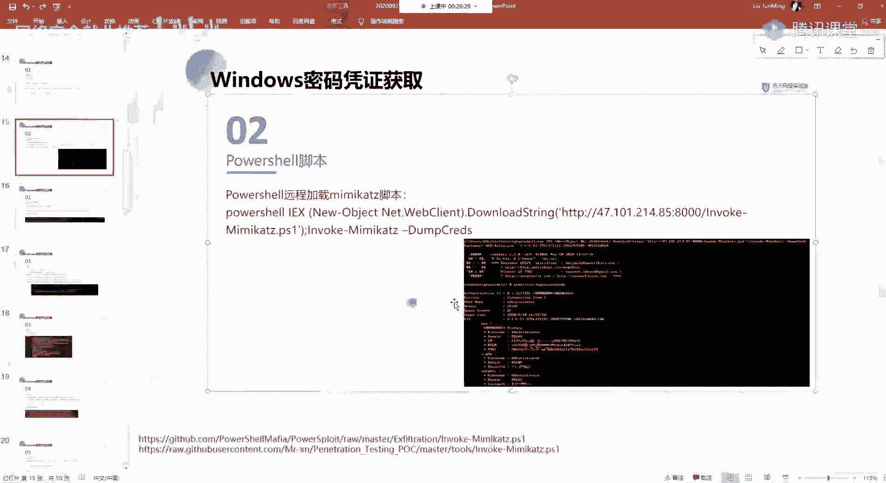

看起来应该可以了，啊可以看到在这边的话已经跑出来了呀，就是啊因为在这边的话他有这样子的一个过程，这过这个过程的话，就是去下载这样子的一个脚本，下载脚本的话，他会要加载到内存当中去执行它。

有的话呃你可能网购啊什么的啊，机器什么的，这样子的一些，导致他人这边执行的一个命令的话，可能会就是返回那个结果会比较慢，然后其实在这边他可以看到在这边执行那个啊，结果的执行的一个命令的话。

其实就是一个securate as logan password，就我们刚刚讲的这个通过这个命令来去得到。

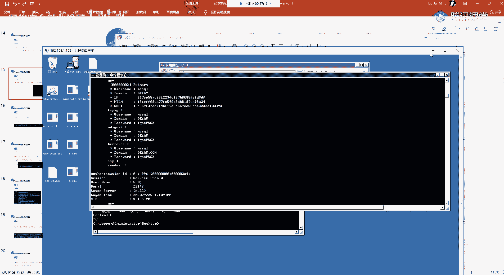

它的一个铭文的一个密码，啊，这边的话是通过posher脚本来去加载，这样的一个命令cut的一个脚本，然后第二还有的话就是通过抛下加载这样子，那个pass hashes这样子的一个脚本。

这个脚本的话就啊简单直接了很多，就是说呃我们可以看一下，这边我这边执行的一个结果，这边执行之后的话，可以看到他没有多余的一些内容，他直接就把他的一个就是啊哈希，就n t m哈希的一个格式对吧。

他按照n t m哈希的格式，把它把当前这个系统下面的用户，它的一个lm哈希。

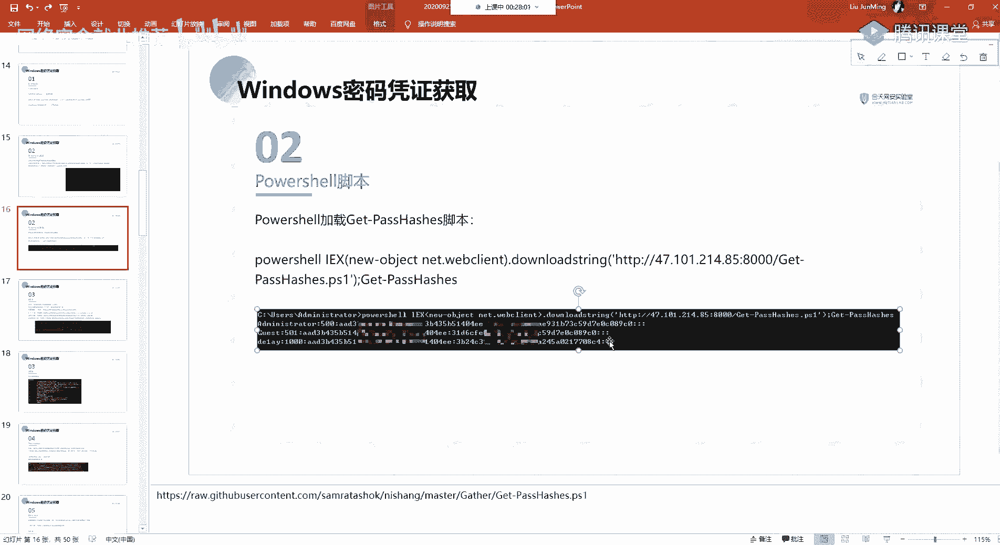

还有n t m哈希的一个值都给列出来了，这个。

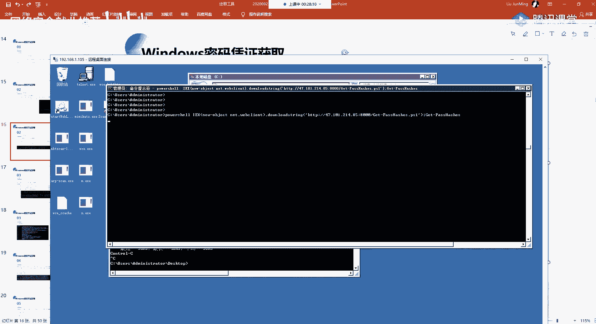

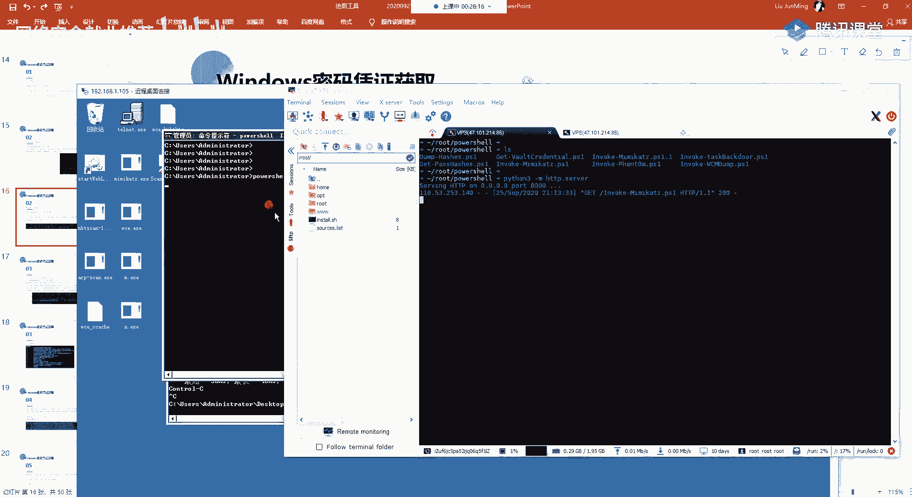

这边同样先让他跑对吧，好，我们看下面，然后第三个的话就是wc 1，wc的话，它是跟前面mini cut齐名的一款哈希管理工具，这个工具的话它这个功能也是比较多的，然而它的一个作用的话，同样就是呃。

它是这样子的一个e x一的一个程序，我们执行之后的话，它就能够直接返回呃，返回用户的一个哈希值，这个号我就不演示了，就看截图好吧，然而这边也给了就是这一个工具，它的一个详细的一个使用，也不多说了。

大家可以自己去啊，关于这些工具命令的话，大家自己去研究一下，自己自己去自己去执行一下，就你就能够知道了，然后第四个就是一个pw的d d p7 ，这个工具的话，同样的呃。

可以读取当前系统的各个用户的一个密码哈，希然后这边啊他是这样子一个ex的一个程序，我们直接执行之后的话，执行之后的话，它会自动的去关闭，就是他会以执行之后的话，它会直接会关闭。

也就是它不会留一个窗口这样子的一个东西，所以的话你需要把它执行之后的一个结果，把它给输出到一个文件当中来去进行一个查看，得到了一个结果，就是像这样子的一个哈希的一个格式。

以及第五个的话就是这个o p h crack，这个的话就是呃，如果我们用网站无法去破解这样子的哈，希值的话，我们可以用这样子的一个工具来去进行，配合彩虹表来去进来确定一个破解，关于这个彩虹表。

这个的话大家看那个预习资料吧，呃都是就是理解它是一个什么东西就可以了，而其实际的话实际的话你实际碰到这样子的哈，希的话，你可能也不会说去啊跑这样子的一个跑战，我是会觉得很麻烦，就是因为你跑这个东西的话。

你的一个时间成本的话是比较高的，而且不一定能够跑出来，我就是诶，好我这边呃，大家去看看一下第一期的那个运行的了吧，我这边应该是忘记贴上来了，这个，就是呃彩虹表的话，它是就是根据我们这边呃。

根据一些给定的这样子的一个哈希，它是有这样子的一个，就是有一个比较复杂的这种这样子的一个算法，能够去啊，根据给定这样的哈希来去得到它的一个铭文啊，就这个东西的话比较比较复杂。

你就大概知道有这一个东西就ok了，好吧好呃，第六个他就是用这个props jump加mini cds好，这里的一个prox好，这种方法的话是我们啊比较常用的，就是这个proxdm dump这个工具的话。

它是微软，它是这样子的一个工具箱里面，它自带的就是这个s y s internet这个工具箱，这个工具的话它是啊在这个工具箱里面的话，它的这些工具它是有微软的一个签名认证的。

也就是它是微软出品的这样的一些工具，这工具的话就是说能够比较好的去进行，就说杀软的话，对这些工具的话呃就是能够去绕过杀软吗，他不会去查杀它，好的话，我们可以用这样子的一个工具，去把我们的一个呃。

从我们的这样子一个l s i s这个进程当中，去导出我们想要的这样子的一个呃，一个哈希值以及铭文的一个密码，然后的话我们导出来之后的话，就是从这个进程当中导出这样子的呃，它的一个内容，它保存了一个内容。

然后的话我们使用mini cards来去进行，一个还原即可，这边呢是它的一个使用的一个方法啊，就是说我们的这样子的一个命令，这种方法的话是比较常用的，就我们的mini cards杀软。

对mini cat这个工具的一个查杀的话是啊，就是已经比很严格了呀，就是说mini cut的话，你想要直接去进行一个执行的话，你需要去做一个免杀，就是对它进行一个秒杀，你要对他免杀的话。

你就需要去研究啊，去你要去知道他的一个代码它是怎么去写的，然后的话去，你要去研究它的一个敏杀的一个方法，你怎么乱码，怎么回事啊，好这边的话有这样子的一篇文章，这里的话就是呃。

他总结了mini cars的一个敏商的一个方法，大家对这个感兴趣的话，你可以去研究一下，它里面有很多这样子的一个，mini cs的一个秒杀的一个方法，他都总结出来了，呃呃第七个的话就是注册表导出哈。

希就是说从注册表当中去导出，我们那个哈希值就是在windows系统上面的话啊，我们的一个密码，我们与密码相关的这样子的一些东西的话啊，大多呃以及这些工具啊。

就有一些工具他去获取这样子的一些windows系统啊，包括软件以及这样子的一个这样子的一些哈，希值的时候大多是从呃就是说注册表当中，以及它的一个，还有什么，呃，我去突然突然忘了要说什么呢。

就是从注册表当中，还有就是呃一些就是软件的，它的一些特定的，像保存这种密码文件的这样一些路径当中，去获取到它的一个密码信息，所以的话在这边的话，其实我们呃在注册表当中的话。

它同样的有存放这样子的一个呃系系统，用户系统当中，用户的这样子的一个密码的一个哈希，然后的话我们只需要去用这样的一个i e g cl，这样的一个命令，就是说从这样子的一个注册表象当中。

去导出它的一个内容，导出内容的话保存成这样子的一个文件，然后的话我们就可以用mini cui h啊，获取这文件当中它的一个密码的一个哈希，以及还有通过这样子的一个secret dump。

这样子的一个工具也能够去获取到。

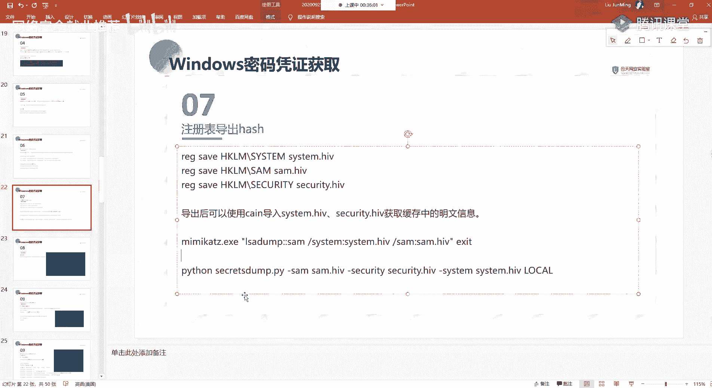

呃这边。

啊这前面的这些啊，我先讲完吧，我先讲完，然后第八个的话就是这个leon呃，l y g a g n e的这样的一个工具，这个工具的话它是一个呃，也是经常使用到的这样的一个工具。

这个工具的话它功能的话很强大，就是他这一个工具它里面已经写好了，就是说呃，我们可以用这个工具来去获取相应的一个密码，然后在这边我们可以看到，在这边他有这样子的一些选项。

它能够去获取到相应的这样子的一些啊b嘛，像比如比如说proverse就是浏览浏览器，还有啊database就是数据库啊，还有一些游戏啊，地址还有没有邮箱对吧，还有那些s v n啊等等这一些项目。

还有wifi，还有windows系统的这样子的一些密码，就是说我们可以指定相应的这样子的一些模块，来去获取到相应的一个密码的一个信息。

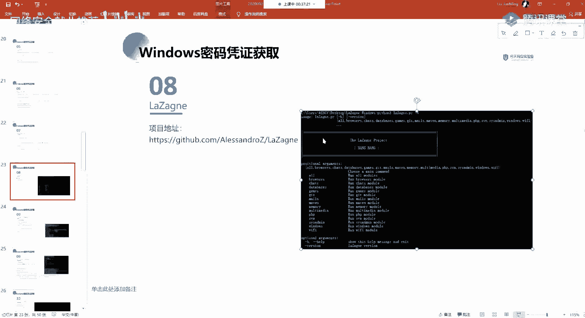

然后这个工具的话也是比较有名的，就是一些app的一个组织，也也也有去使用这样子的一个工具呃。

这边的话我们来看一下，我这边的话有这样子的一个ex一个程序，我们可以来执行一下。

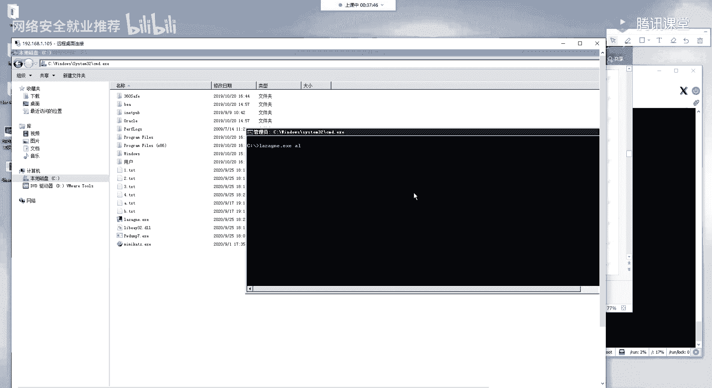

我这边的话直接word就是啊，获取他所有的，就是调用它所有这边提供的一个模块，来去获取当前系统下面所有的，他这边能获取到的，这样子的一些密码的一个信息啊。

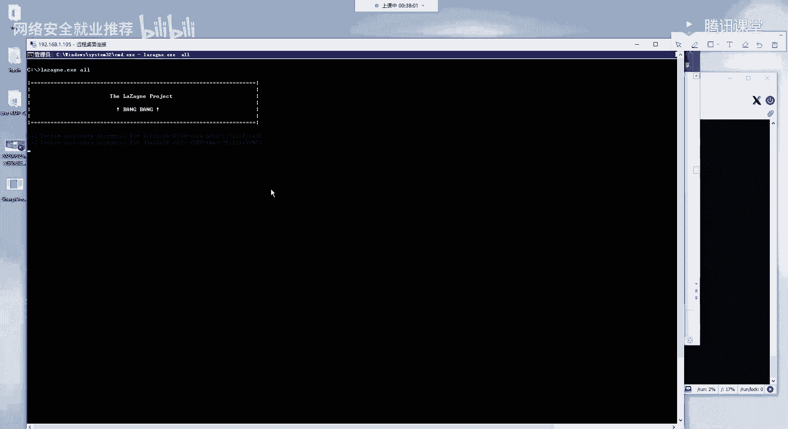

呃这边的话先让他跑着吧，因为它需要一定的一个时间，好呃第九个的话就是呃前面讲到的，前面应该也有讲对吧，就讲msf的时候有给大家介绍，就是说我们得到一个matt pat的一个筛选，之后的话。

我们可以用metapeter里面的这样子的一个，一些模块来去进行一个密码哈希的一个获取，就hash dump，然后呃在msf里面的话，有这样子的两个模块，就是呃这一个这个hash dump。

以及这个small hash dump这两个模块，而我们只只需要执行这两个模块的话，就能够去进行一个密码的一个哈希哈，希值的一个获取，具体的一个效果的话，我们看我看一下，看一下我这边的一个截图啊。

就我们得到一个metp的一个需要之后的话，然后要注意的话，就是说你这边要去进一个哈希的获取的话，你需要有一个管理管理员的权限对吧，然后有管理员的权限的话，我们就可以把它提前到我们的一个system用啊。

get system的一个命令去进行一个提前对，好的话，我们在这边的话，我们可以直接执行这个hash jump，来去获取当前系统下面所有的一个哈希值，以及我们啊msf里面的话。

就是matt peter这一个啊组件的话，它里面有集成了这样子一个mini cut的一个呃，这样子的一个模块，就是说我们可以通过load mini cards来去加载。

这样子一个mini cards的一个模块，来去使用它的一个功能嗯，我们知道mini cut的话，他能够去获取到它系统的铭文的密码对吧，然后的话在这边我们可以通过m s v i。

还有cbs等等的这样子一些命令，来去获取到系统当中，它所存放在这样的一些明文密码，在这边的话可以看到呃，这边直接获取到了他的一个名额啊，administry，还有user 2的这样的一个用户。

以及还有其他的好，以及我们可以用mini car command，去执行指定的一个命令，比如说这个sam sam dump hashes，就是获取我们的一个哈希对吧。

以及我们这边的一个呃search password，这边，他同样的能够去获取到它的一个名为密码啊，关于这个命令cut的一个使用的话，我这边呃就不做过多的一个介绍，前面应该也有讲了。

然后主要的话就是在你的它的一些命令，我这边的话啊也有相应的一个注释解释啊，第十个话就是cop struct获取哈希啊，这边的话就是cs或选项c的话，比m s f的话我简单直接一点。

就呃我们得到了这样子的一个shell绘画之后的话，因为我这边的话，正好有一个，就这边前面的话已经，对吧，首先呃用sleep来去调整一下，它的一个就是睡休眠的一个时间，因为我这边我只是本地演示的话。

我一般的话就直接把它给调为零下，就是你就是你直接执行执行命令之后的话，他就会去立马的把这一个请求，发送到我们的这样的back，然后的话执行之后的话，返回结果给我们就是比较快嘛。

然后实际的话可能就是啊不建议大家调为零，就调为零的话，就领着这样子的一些请求的话，比较频繁的话，很容易被发现。

然后的话呃，我们想要去获取它那个哈希值值的话，我们只需要就是执行执行我们的一个hash d，就直接在b这边直行哈，希stp的话就能够去直接获取到他的个哈希。

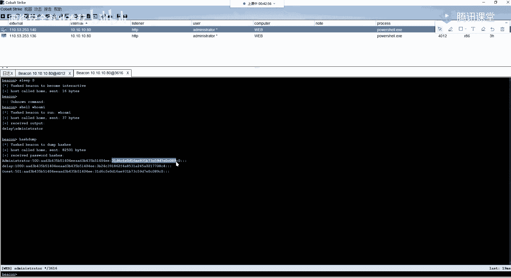

就这里，然后这一串，阿西的话应该可以解密啊，这边设的比较简单的，空。

空运吗。

18。

好这边的话解出来了呀，可以看到就这种比较简单的话，直接用这种在线网站去建一个简易即可就，然后呃还有的话就是在cs当中的话，它同样都可以去使用mini cars的一些功能啊。

就是它里面也有集成了mini cars的一个模块功能。

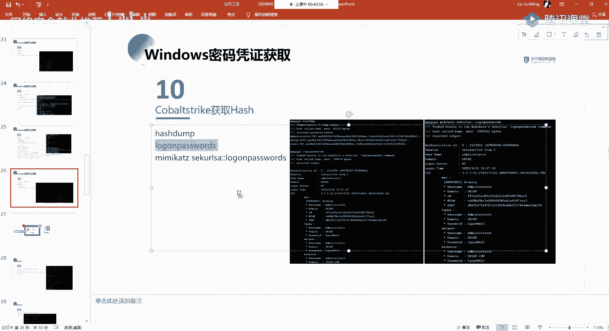

然后我们可以直接执行这个login password，来去获取到，因为在这边的话只是获取到了他的一个哈希值，对吧，好，我们在这边的话，我们可以通过login password直接执行它。

来获取到当前系统下面的，就是说能够获取到的一个铭文的一个密码，你看到在这边的话已经返回了一个结果，就这边执行的一个结果的话，跟我们前面用mini cut得到了一个结果的话是类似。

是一样的一样的啊，这边的话我就不一一介绍，然后的话我们可以用mini cards里面的一个，就是它模块啊，就是用命令cast的一个命令，因为我们呃mini cut的话。

不仅仅是只有这样子的一个logan password，获取它一个名为密码的一个功能对吧，它还有其他的一些功能，然后的话我们想要去执行，想要去使用其他的一些功能的话，那么我们可以使用这边使用它，这边。

写错了，啊没有没有参数啊，嗯这边它是呃没有加参数，好在这边的话我们可以看到呃，加个外号的话，就是输出他一个帮助信息嘛。

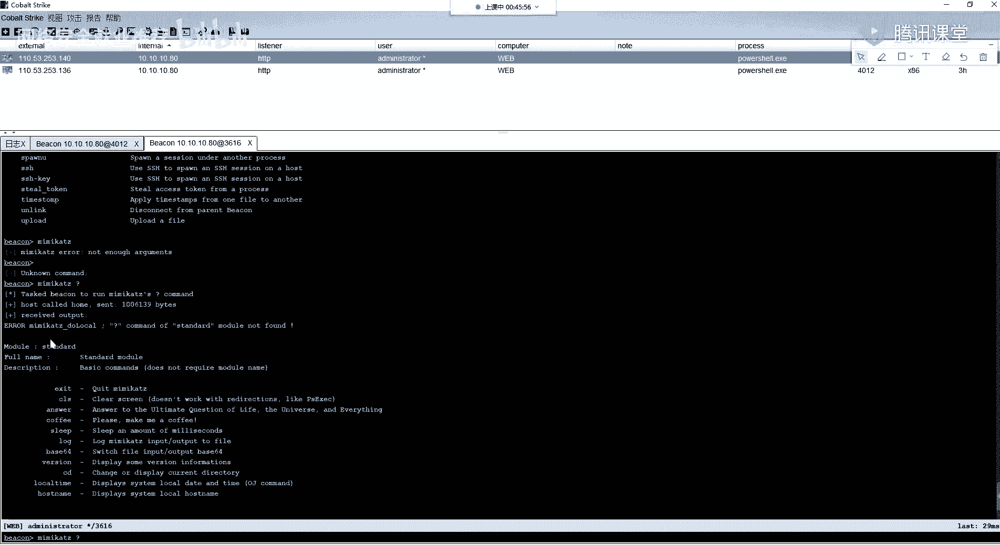

然后其实就跟我们前面去进行一个啊，用mini cut是一样的呀，然后在这的话我们可以直接mini cut。

接我们这边的一个就是用这个seka，login password，其实这边的一个logo password，就我前面执行的这个login password，它的功能跟这边的话它是一样的。

只是的话我们在这边明天看啊，不这边cs里面的话，它已经有，他已经就是写好了这样子的一个功能，就我直接执行logo，他说的话就能够获取，就能够去呃，相当于在这边执行这一串命令的一个功能，可以看到啊。

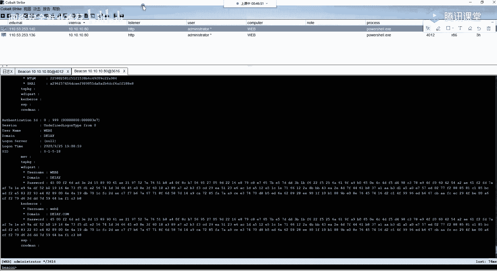

跟上面的一个结果的话是一样的，呃然后的话呃，前面的这几个工具需要给大家演示一下吗，就是说怎么去进行一个使用，就是说啊因为我们自己的一个机器的话，你去访问的话。

你去访问的话是没有说不像在github上面那样呃，有这种就是不能访问的一个情况吧，只要你在你自己的机器上面开一个web服务，开一个简单的web服务，然后的话通过web的一个方式去访问。

而前面的这样子的一些工具，需要我去做一个演示吗，应该不用吧，就是呃到时候把ppt发给大家，然后大家自己在法律上面去操作吧，这些工具的话我这边也要给链接对吧，就怎么去下载，在哪里下载啊，如果不知道的话。

如果找不到的话，呃找不到的话，你再找我吧，呃呃工具库里面应该其实有的呃，就是如果工具库里面没有的话，是因为那个工具库的话，是我这边就是整个第一吧，就是比较就内容的话不是很全，就只有一小部分。

应该是就是发就是名就是直接发出去的吗，就是呃所有人就是来去了解这样子的，一些东西的话，都发给他了，所以的话不是很详细啊，就是有很多的一些东西都没有加进去，然后后面的话如果大家有需要的话。

我这边可以去整一个，就是啊，我们包括我们深度测试相关内容里面，所需使用到的一些脚本啊，工具什么的，我都可以把它整成一个工具库，到时可以发给大家，就不需要去不需要去自己去github上面去找是吧。

因为呃如果大家没有不能翻墙的话，你去github上面去下这些东西的话，可能会比较痛苦，然而在这边的话。

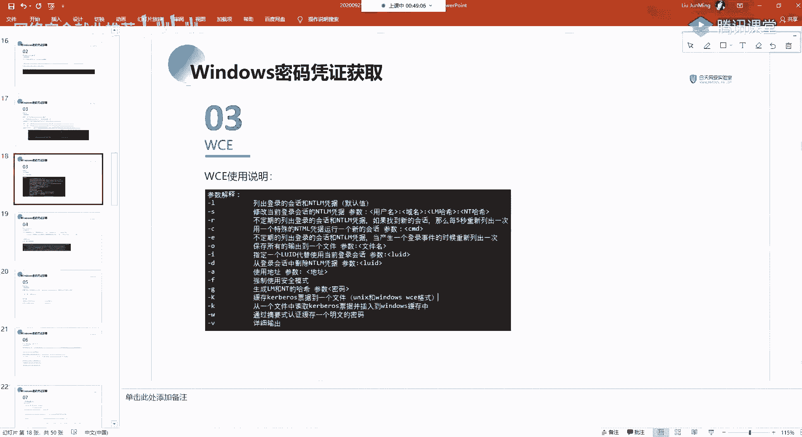

这边的话应该没什么问题啊，好在这边的话就是呃提一下吧，就大概的提一下，就可能大家呃使用这样子的一个cs，就我啊我是习惯的去使用这一个cs，就是msi msf 5的话啊，msf的话就相比cs的话，可能。

它的功能的话其实要多要多很多，但是使用起来的话，cs的话要稍微方便一点，就确实要方便一些，然后msf的话就是呃操作的话，就是比如说你突然网断了对吧，你网断了的话，你前面的那个东西全断了，就挺挺那个的。

然后呃在这边的话，就是说我这边是以命以这个cs为例，就在msf的话。

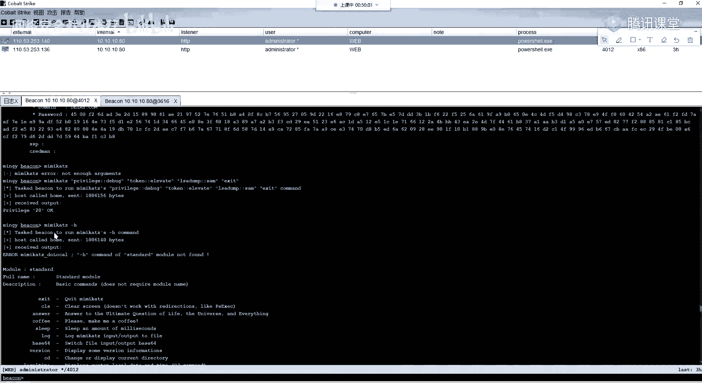

其实也是同理，就连msf的话，你直接得到了一个筛选的话，或者说你直接得到了一个需要的话对吧，你可以直接比如说你matt pat里面，你直接执行一个直接执行shell对吧，你直接直接直接下。

你直接执行shell的话，就能够去得到一个cmd的一个命令行了对吧，以及你在直接在啊，你直接在，mad por下面，你直接在metaverter下面，也能够去执行相应的一个命令是吧，然后我在这边的话。

就是说就是可能大家之前的话没有这样子的。

一个用这些工具来去执行命令的一个概念。

所以这边的话大概的介绍一下，就是说比如说我前面这边我有讲对吧，我也讲这样子的一些工具获取哈，希的一个工具对吧，那么我这边我弹弹那个shell谈到cs或者msf上面。

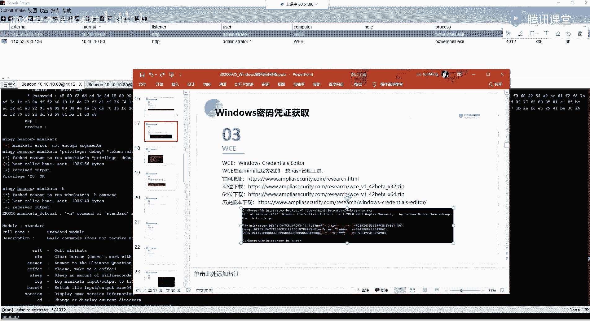

那么我这些工具我要怎么去进行一个使用啊，像比如说我这边一个w w c这个工具对吧。

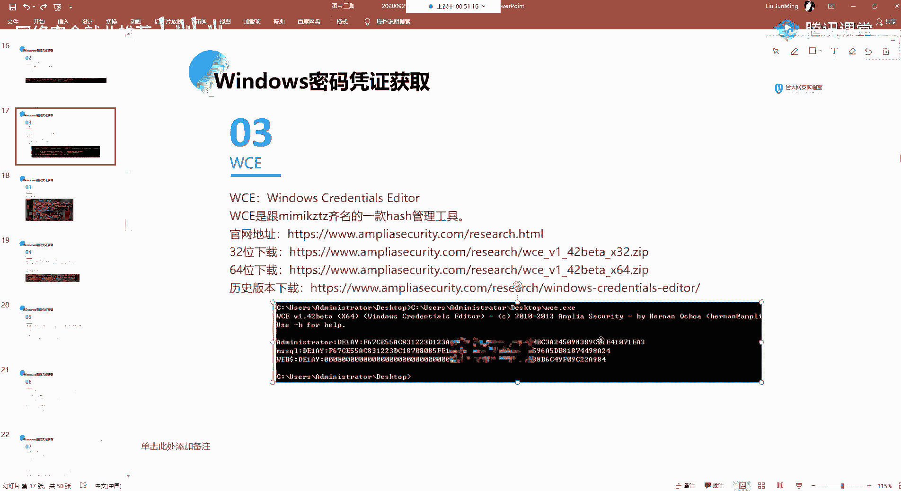

我这个是一个e的可执行程序。

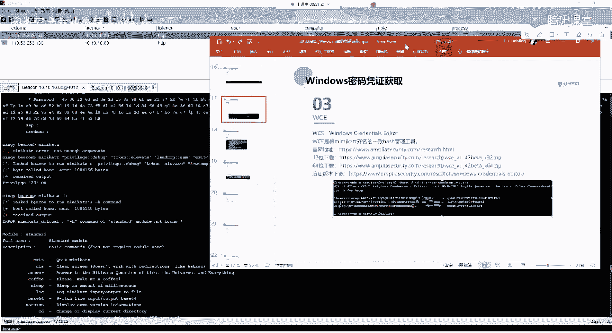

那么我要执行的话，我需要上传到我的这样子的一个这个，靶机上面对吧，我需要把它上传上去，然后上传上去的话，在cs里面的话，我们可以通过upload这样子的一个命令，就通过appro。

其实在msf里面也是一样的对吧，通过upload这个命令，你就能够去上传，去上去选择你要去上传的一个这个程序对吧，然后的话上传到这个目标机器上面，然后呃这是一种，然后还有的话就是cs里面的话。

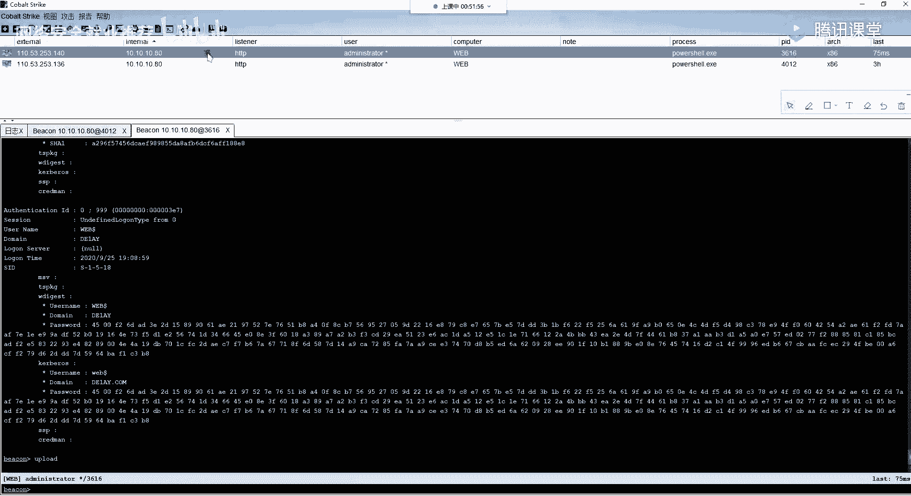

它有这样的一个文件管理器对吧，文件管理在这边的话，我们直接可以进行一个文件的一个操作对吧，然后的话我就我就可以，直接把我的这样的一个程序上传上去是吧，通过upload上传上去，上传到指定的一个目录下面。

然后再换，然后的话你要去执行的话，像比如说啊在这边，我以这个pw d dump 7为例，对吧，我这边前面啊在介绍这个的时候对吧。

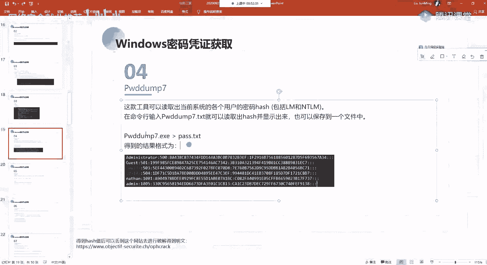

p w m d d7 ，我要去执行它。

然后的话得到它的一个哈希的一个结果，那么我在这边的话，其实就是通过这样子的一个方法了，我直接需要执行这这样子的一个程序。

亮牌70x1 。

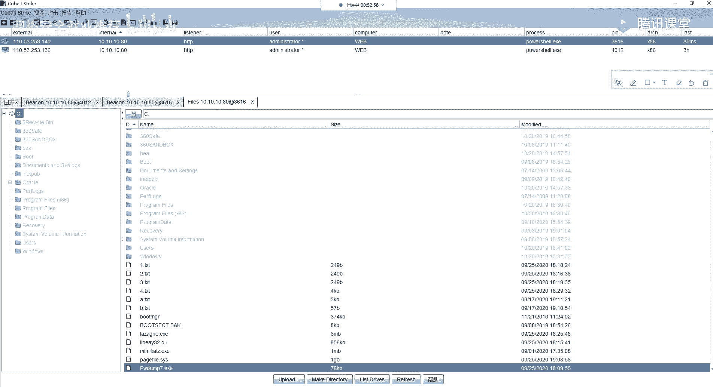

没写错，好的话，我这边要去执行，执行之后的话，我的一个结果需要导，需要就是输出到一个文件当中，我才能够去查看的对吧，比如说我输入到六点text这样子的一个文件当中。

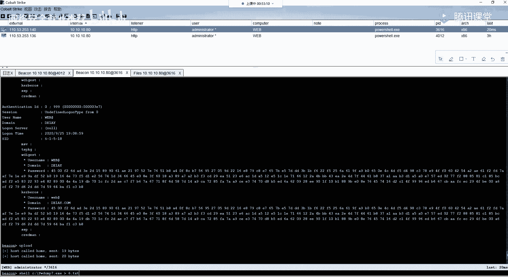

然后这边执行执行之后的话。

它会在呃，我们从把机上面这边来看的话来看吧。

比较直观一点对吧，然后在这的话我们看一下，有点卡，怎么回事。

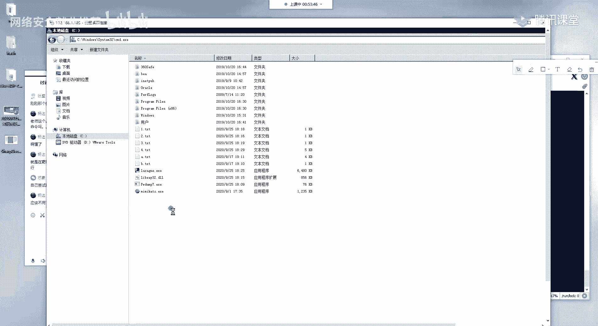

这边的话你执行的话，你执行之后的话，他会有这样子的一个，就是说呃需要去等待一些时间，因为你执行执行的话，他需要时间的，以及你在这边执行，你在cs上面你执行，就是说你这边输入命令之后的话。

它会呃把我们这边要执行的一个命令，的一个请求，发送到我们啊这个靶机上面的这个bacon对吧，然后的话在ban上面执行之后，它才会返回结果返回给我们，然后在这边的话，其实我们从这边的一个呃标识也能够知道。

就是说他这边的话是啊，发送了这样子的，53字节的这样子的一个请求。

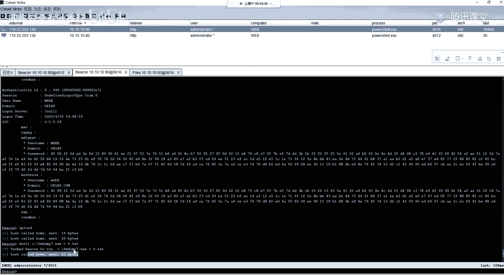

就是说我们这边的一个命令是吧，要过一会才有结果。

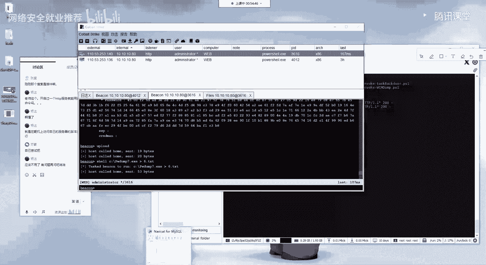

唉怎么怎么突然这么卡呢。

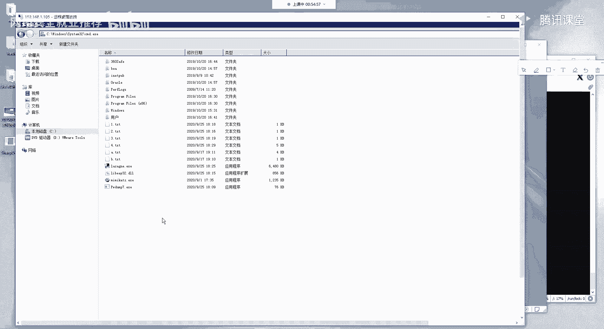

好我这边的话就是在输出这个text的时候没有加，没有加c盘的一个路径，就是应该是在直接在当前的一个路径下面，六点开始。

应该是有的吧，呃其实在这边的话已经有了这一个六点text的。

但是没有内容，那这边的话我应该还在执行，可以看到啊。

在一。

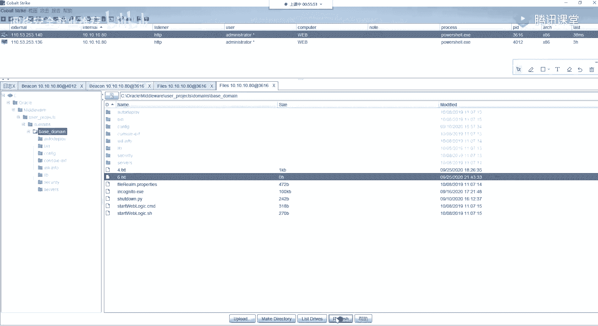

还没写进去吗。

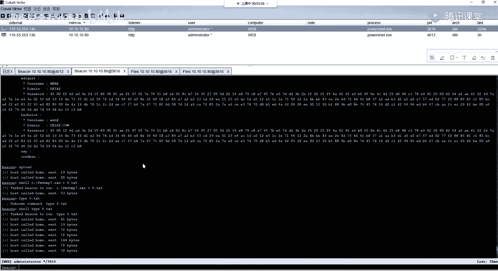


重新写一下。


他怎么突然这么卡呢，不难受啊，啊我们以这个为例吧，就以这个wc一为例吧，因为这边的话wc的话你直接执行之后的话，他就可以去返回结果的，然后我这边的话执行的话就直接shell，然后的话接我这边上传上。

上上传上去的一个这个程序的一个路径对吧，然后的话他就会去执行，执行之后的话，在这边就能返回结果，就这样子的一个方式，然后上面这一个是这个的话哦，就说我们这我们直接执行之后的话。

他不会把结果直接返回给我们对吧，那么我们可以通过，就是说把我们执行做的一个结果。


从电线到一个文件当中，然后的话通过type这个命令来进行一个查看，这边不知道为什么没写进去卡了，不需要带，本来的话就是你这边执行之后的话，它会有这样子的一个回血。


不行，还没写进去。


然后可以看到这边的话已经有了。


你说，这边在cs上面执行的话是有点慢了呀。


就是呃正常的话是这边执行之后的话，它也会有这样子的一个回血，就是像在这边执行之后的话，有这样子的一个。


然后的话它会有这样子的一个output，就是在这边它会显示，然后你看到了这个，他就说明我这边执行的话已经执行完成了对吧，就像在这边有这样子的一个output。


然后的话我们直接type这个文件的话，就能够去查看到它的一个内容。


这边的话就是呃，介绍一下我们如何通过这样子的一些，就是在cs以及m上面，如何去使用这样子的一些工具，就可能大家没有这方面的一个建议的话，就是你不知道这样子的一些思路，以及同样的同理的这些也是一样的嘛。

对吧，你直接通过这样子的就把这个程序上传上去，然后执行获取到他的这样子的一个文件，然后然后的话下载下来，下载到本地，然后我在本地再用mini cut来去进行一个解密，就能够去得到它的。

去还原它的一个密码注册表，同理啊，就我这边的话，同样的可以去执行这样的一个命令，得到这样子的一个文件，对，呃呃关于这第二部分的一个系统，密码的一个凭证获取的话，大家有没有什么疑问，就有没有什么问题啊。

应该都能理解吧，啊有大家还在吗，是不是都睡着了呀，还在听吗，呃在听的话就呃给我点反馈嘛是吧，就是你这不跟我交流的话，你这不跟我交流，我不知道，就是大家有没有就是说有没有什么问题，或者说能不能听懂。

以及我这样子去给大家讲，大家能不能去接受对吧，在，听起来没问题，实践的话，实践的话，那么你肯定就是要你自己去多去操作了呀，就是多多自己动手去操作，然后碰到问题，碰到问题直接问。

就其实就大家去学学这些东西的时候，学习的时候，其实你问的问题越多，你学的会越多，当然的话当然呃就是在这边正好就说一点，就是你问你问我们问题可以对我们知道的话，我们肯定会给你回答，就是肯定会回回应你哦。

说到这个我我突然想起来，昨天晚上有位同学问我问题，我今天忘记我，我今天忘记看了呀，呃这位同学诶，呃我等会我等会再去回你吧，我突然想起来这位同学，他问了我昨天晚上，我今天早上看的时候。

他晚上一点钟问我的问题，然后我那会没看到嘛是吧，所以就没回他，然后后面后面看到了也忘记回了，就是在这边的话，正好就是好说一点，就是你问我们问题可以，但是就是注意一下时间，哈哈好吧，就是注意一下时间。

就是我们不是说24小时都在线的啊，我们不是说24小时都在线的，就是你问问问题这种，你碰到问题，你问的话，你在群里问，或者你私聊我可以，然后的话就是尽量都在白天，就是白天白天的一个时间对吧，就你下班。

就我们这边下班之后的话，也就是也不会说一直盯着这样子的一个啊，盯着你们的一个消息对吧，啊就这个人是你是吧，应该不是吧，明星金星好啊，也，啊行行吧，就是你问的话，你还是就是白天问嘛。

就而且有时候的话我虽然看到了，但是可能我自己这边有事的话就忘了，然后大家就是尽量多提问嘛对吧，因为呃其实你实际的话，这些东西你可能很多东西的话，你可能直接问别人的话是比较好的一个选择。

当然首先的话你首先你需要，首先是要自己去进行一个找，去尝试寻找这种解决问题的一个方法对吧，然后的话你如果实在解决不了，你可以来问我们，如果我们知道的话，我们肯定会尽力的去回答你们啊。

对就是这个的话就是就这样子的一个怎么说呢，就我们其实也是一个服务业对吧，就是为你们服务的，然而其他的一个情况也不多说了，然后呃就是稍微给大家唠一下嗑，然后我们继续我们后面的一个内容。

后面的话还有一部分内容，也就是第三部分的一个r的，呃首先的话第一个就是pasha的一个脚本，获取r t p的一个连接记录，就这里的话啊，这里的一部分的话就是好给大家介绍一下，通过一些方法来去获取。

我们本地的这个rdp的一个连接，它的一个密码，首先第一个的话就是呃在这边的话，我们首先介绍一下，就是这一个脚本，这里的一个pasha的一个脚本，这个脚本的话它是啊这个sg study student。

他写的一个脚本，这个脚本就是来获取你windows系统下面的这样子的，一个i dp的一个零件，就呃具体的话我们来看一下这一个图啊，就是在这边的话，我们可以看到在这边它列出来了，就我当前的一个用户呢。

是一个m n g y的一个用户对吧，然后在这边他列出来了，就是我有这样子的一些零件，我们可以看到就是啊我有连接了这个，比如说172。26。2，2。35这样子的一个呃机器。

这个机器的话我使用的一个用户是这样子的，一个main的一个用户去建一个尝试连接的对吧，还有其他的这样子的一个机器，好在这边的话它就列出来了，我r d p的一个连接记录，那么从这个r d p的连接记录。

我们也能够去知道，就其实啊上一节课就有讲对吧，就是说啊做这样的一些信息收集，就是说在这边，我通过他的一个i dp的一个连接，我能够去知道当前的这个机器，它能够去连接，也就是说他能够去访问到哪些网段的。

这样子的一个ip对吧，以及它啊能够以及它有趣有趣，用i d p的一个方式，去连接这样子的一个机器对吧，那么我们知道了，我们知道了他的这样子一个密码，那么我们就能够去进行一个呃连接这一个机器。

也就是一个横向的一个渗透。

横向的一个移动对吧，然后呃。


嗯这里的话哦这两个图的话是一样的，诶我这边。


这这边的话这是一样的，就一样的意思啊，然后在这边同样的就获取到了他的一个记录啊，然后在这边可能大家对这个会有疑问，就是在这边我是用的这样的一个方法，pasha杠ex e c by pass。

然后的话来去加载执行的这样子的一个脚本，这里的一个方法的话，就是说我们再去加载我们本地的这样子的一个，power shell的一个脚本，而抛弃他呃，就是，就是抛弃了pasha。

他有提供了这样子的一个就是怎么说呢，就是扩展或者说呃接口这样子的一个东西对，然后的话我们可以通过他的这样子的一个p s，posher的这样子的一个啊语言怎么说呢，就是p好ps ps一的这样子一个脚本语。

脚本语言，就它有它自己的一个这样子的一个规则，然后的话我们通过编写它的这样子的一个，脚本语言来去调用系windows系统上面的，它所提供的这样子的一些啊接口啊，一些扩展啊，来去达到相应的一个目的。

就比如说我去呃执行，比如说我去获取我系统的一个信息，pc里面的话，它有自带的这样子的一个脚本，就是呃应该是什么，就比如说你要去执行一个system info。

这样子的一个获取到system info的一个信息，我们在potion里面的话，我们可以直接去啊，有这样子的一个方法，来去获取到对应的一个信息，然后关于pc的脚本的话，在这边的话你就。

建议大家去学习一下，然后在这边的话，在这里的话，我在课上的话，因为一时半会也讲不清啊，好吧，一时半会也讲不清这个东西，你就呃理解它是哦，我们看一下吧，呃呃这些这些东西就你让我讲讲解释这种概念。

说实话说实话我也不是说很很那个，因为谁没事会去，谁没事研究这种东西是吧，然后我们看一下，就是这这这里的话就是一个抛弃的一个脚本。

然后可以看到在这边的话就是pasha的话，它这个脚本的话，它有相应的一个格式的，就是像比如说在这边的话，就是它的一个注释，然后他的这个脚本啊，可以看到在这边get a vm i object。

就这个的话，这个的话其实就是啊我们就在power shell里面的话，它跟我们的这个w mc它是一样的，一样的一个功能，比如说我们get help。


没关系，看看有吧没有。


就这一个，呃我记得应该是啊，就是这个gew mi，就是在这一个功能的话，它跟我们直接执行w m i c，它的一个功能是一样的。


但是的话在这边它是用posher的一个方式。


可以看到在这边执行的话，他在这边呃，应该也可以那个吧。

呃我我有点忘了呀。


就是呃它是实现了一个w mc的，这样子的一个功能，然后的话呃还有后面的这一些的话，具体这一个的话就是嗯，这个东西好，在这边的话我先不讲吧，我先不讲吧，然后后面的话，后面的话我抽时间就是给大家讲一下。

抛弃吧，就是基本的一个语法，当然的话具体的这样子的一个写法的话。

肯定意思不好写，讲，讲不了。

now，因为我我我都不知道我从哪里讲。


你们能够去就是能够去理解，就你需要你首先现在的话，你先对它有一个基本的一个概念就行了，i dp连接，而idp连接的话就是就这一个就远程桌面连接，就remote desktop。

i dp的话它是一个就是协议嘛，就是我们这一个远程桌面的一个协议，remote desktop project，这样的话就是远程就是r d p啊，就啊可能习惯呢就是说说这些，呃呃言归正传。

扯远了，又，好在这的话我们想要去啊，我们想要去执行它，我这边下载到本地的这样的一个，pasha的一个脚本，我们实现了一个方法，那就是这样子花絮，然后的话呃，执行的一个这样的一个方啊。

执行这个脚本的一个方法，就是像这样子，就是杠f来去指定，我们要去加载的这样子一个脚本，然后在这边的话你会碰到有一个问题啊，比如说碰到这样的报错，碰到这个报错大家不要啊，不要急，就是说在这边的话。

posher的话，它有这样子的一个就是运行的一个规则，就是有一个策略，他呃有几个有有有三个策略吧，就是三个还是四个，我忘了，就是呃他原因他你默认的话，你在word上面你去执行抛弃的一个脚本的话。

他不会去原形，你去执行，就你默认的一个规则的话，它是禁止你在系统上面去运行这样的一个，抛弃的一个脚本的，就是为了安全性的考虑，然后还有的话就是还有大家可以去，就是可以去更改它的这样子的一个规则。

像比如说更改车位，就是能够去就是没有限制，没有任何限制，就是你可以远程的去加载，也可以再加载本地了，然后还有的话还有一种策略的话，就是呃不允许远程的，就远程去加载这样子的一个抛弃的一个脚本。

然后在这边的话，我们可以去通过这样子的一个方法，by pass就是杠x1 c，by pass，就是呃，来去绕过它的这样子的一个运行策略的一个限，制，好的话，我们可以来去执行，这样子一个脚本对吧。

可以看到他在这边他就已经没没报错了，本来的话它是禁止运行的嘛，我们通过这样子的一个方法的话，能够去绕过它，然后在这边的话就列出了我当前系统下面的，这样子一个udp的一个连接记录。

主要的话就在这边对吧，可以看到，而不是udp，是rdp的，就远程桌面连接的一个记录，然后我们得到这个记录之后的话，我们能够去干嘛呢，对吧，我们可以去获取到它的一个连接记录，的一个就是这种rdp连接。

就远程桌面连接它的一个密码，它的一个密码的话，它其实有是进行了一个加密的，那么我们需要对它的一个连接密码做一个解密，在这边的话我们解密的话，我们使用到的一个工具的话，就是这个mini cat。

呃然后的话我在这边的话，我们一起来看一下，就是其实在这边我们想要去查看，您在本地连接过的一个目标机器的话，我们也可以通过注册表的一个方式，就通过查询他的这样子的一个注册表，来获取到呃。

连接的一个旧它的一个注册表的一个值的话，就是在这表，我们来看一下效果，可以看到这句话就列出来了啊，所有的这样子的一些记录，就比如说这个主机，我使用的一个admin的一个用户，去进行一个登录的对吧。

还有其他的一些主机，然后的话呃，第二步的话，就是要查看你当前用户下面的这个目录，它是否有这样的一个i dp的一个密码文件，也就是这个目录。


看一下这个目录，如果有的话，它就会显示这样子的一些，显示这样子的一个呃文件啊。

它会显示这样子的一个文件，然后的话呃在这边的话我要提一点，就是说大家可能不知道，就是说我这边的这一个密码文件，它是怎么来的是吧，就是说你可能你会你会你你去看看你自己的话。

你会发现你没有这样子的一个密码文件是吧，那么为什么为什么你的会没有呢，就说你可能你没有去用这个r d p，就是说呃很多时候的话，就管理员他为了方便对吧，或者说你自己也为了方便，你要去连接某一个机器的吧。

比如说你去连接这个机器，你连接这个机器的话，你就说你每次都要去填写这样子的一个用户名，以及密码对吧，就主计算机的话肯定是要填的对吧，然后的话你每次去连接同一个计算机的话，他都要填这样子一个密码是吧。

那么我要我下次要去连的话，我还要去填，那么这样的话肯定就是如果密码多了对吧，那么你可能记不住或者搞混，所以的话在这边我们可以去勾选这个，就保存我的一个平局，就允许保存我的一个平局。

那么我再去连接这个的时候，就我连接之后的话，如果他之前的话有保存，我这边的话，是不是这个机器了，然后这个，这个机器啊，我这边去连接的话，他在这边的话，他会要输入我们的一个密码是吧。

然后连接。


然后在这边的话，我们下次还要去连接这个机器的时候对吧，那么我们只需要去啊，填写我们这边的一个主机名啊，计算机名，然后的话他在这边的话可以看到，在这边的话它已经保存了我们的一个平局。

就是说我们输入了这个计算机名，它会保存，它已经保存了我们的这样子的一个凭据，这个平局的话，就是登录这个机器的一个密码凭证，然后我们下次再去连连接的时候，我们就可以不用再输这样子的一个用户名，密码是吧。

然后去进行一个连接。

对吧。

我在这边的话，我就没有没有再输这样的一个密码，然后的话在这边我们这边保存的一个平局，那么它在哪里呢，对吧，因为我们这边这个平局我们下次再去年的时候，他不需要我们输，那么他肯定是保存在我们本地的某一个。

某一个文件当中，对某一个地方，然后它保存的一个地方就是在这一个目录下面，就是也就是在这边显示的这样子的一个文件，就密码文件，然后呃查看保存在本地的一个远程主机信息，这里的话呃上节课的话也介绍了呀对吧。

这边的话我就不多说了，就我们在这边的话也能够去查看到，我们远程连接的一些信息，一些主机信息，然后的话我们本地我们要去，我们获取到他的这样子一个密码文件，那么我们怎么去对它做一个解密呢。

解密的话我们在这边需要用到这个mini cards，这边mini cards的话需要用到，就是说这边的这个dpapi这个credit，它的这样子的一个功能，这个模块。

然后我们需要去指定我们这边想要去解密的，这样子的一个文件这个啊路径，然后我们在这边要去指定路径的话，记住是用这个干斜杠硬斜杠音的话，你可以理解成就是说我这边的一个呃，要去解密的一个东西的话。

它是在这样子的一个文件当中对吧，就是in在这一个文件当中，就是接我们的一个文件的一个路径，然的话在这边我们执行之后的话，它会有这样子的一个值，就我们需要得到的其实就是这个值。

gd的一个master key这个值，然后我们得到了这个值之后，我们需要通过这个值来去找到它对应的，一个master key，也就是这个我们要去怎么去得到它一个master key呢。

就是通过这个secredp a p i，就是通过mini cards，通过mini cut这个命令来去得到它一个master key，然后的话这个master key的话，如果说你有多个这样子的一个啊。

用户以及连接的话，那么他在这边的话，它不会仅仅是只有一个，它会有多个，然后的话那么我们怎么知道，就是说我们的这个master key它是我们想要的呢对吧，我们想要的解密的这个文件呢。

就是说通过这个g u i d，master key来去进行一个确认，就是说我们可以看到在这边有一个g u i d，对吧，是这个我们前面这边获取到的这个文件，从这个文件当中获取到的。

那么我们这个gd所对应的一个master key，也就是我们需要我们需要去用到的，也就是我们要去进行一个解密的，这样子的一个值，而我们要解密的话，就是通过这一个啊，同样的也是通过这个dp api。

这个credas来去解密它，解密的话，我们需要通过这样子的一个，就是把我们那个master key把它给加加进来，就加进来，然后执行执行之后的话，就能够去解密到它的一个呃数据来。

去拿到他的铭文那个i d p的一个零件密码，在这边的话呃可能这边拉大一点，看得清楚一点对啊，就是呃通过mini cut，首先指定我这边解密的一个文件。

然后的话指定我这边前面通过g d master key，得到了这个master key对吧，得到之后的话，我这边执行之后的话，它会返回相应的一个信息，返回了相应的信息的话，再注意在这边在这边的话。

它就会返回我们的这样子的一个密码，可以看到在这边我们那个tag name，也就是这个我们去连接的这个172。2，6。2。43的这个主机对吧，它的所使用到的，就我们在本地区连接，所使用到的一个用户名的话。

是这个admin administrator对吧，以及它的一个密码的话是root，因为在这边的话我是使用的一个root去登录的，所以的话得到了他的一个明文密码是root。

那么我们现在的话就已经得到了这个登录，这一个呃机器的一个admin，管理用户的一个铭文的一个密码对吧，那么我们就能够去直接的去登录这个机器对吧，就是横向的移动得到了这个机器的一个啊权限。

以上的话就是呃通过获取本地的这种r d p的。

这个连接的一个密码，然后对它进行一个解密，来去进行一个啊横向的一个移动吧是吧，因为呃在windows机器上面的话，用这样子的一个远程桌面连接的话。


是很普遍的一个操作是吧，然后第二个的话就是这个p p t p口令获取，这个的话p p t p的话，大家可能接触的不是很多啊，就是这个点对点的一个隧道协议，就我们可以我们在windows系统上面的话。

我们可以就通过拨入这个sp来去访问，企业的一个内容，就是通过这个p p t p的一个协议呃，在这边的话我们，一篇。


就是这呃，就是这两，就是我们这边的一个vpn好，我们在这边我们可以去添加我们的这样子的，来来去连接到我们指定的这样子的一个啊，然而在这边的话我们就是配置好之后，就注意的话，那个类型的话。

是这种顶对顶的一个隧道协议的话，就像我这边的一个截图这边对吧，然后的话你连接连接之后的话，你就说如果说你得到这个机器，它还存在这样子的一个连接的一个信息，那么我们可以获取到它的零件的一个密码。

那么我们获取到它的一个连接的密码的话，那么我们就可以在他的这个机器上面来去，通过这个p p t p的一个啊隧道，来去连接到我们指定的这个服务器，对吧好，首先我们去获取它的话，获取他的个密码的话。

第一步我们需要获取它的一个配置信息，它这个配置信息的话，它在这样子的一个路径下面，就这一个路径，咋的了，呃在这边的话你找不到的话，是因为呃我这边的话没有创这一个，就没有添加这样子的一个vpi。

因为我这边的话没有，当然的话，我这边随便创一个吧，啊我这边不是了吧，你们啊你们自己如果想要去获取的话，你这这边的话你随便去进行一个写过，就你不需要有这个，你不需要有这样的一个app。

也就随便输入这样一个信息以及用户名密码，然后的话你可以去尝试去获取它的一个，你这边输入一个密码是好，在这边画你配置完配置完之后的话，它会在这个目录下面，它会有这样子的一个文件，就这个文件的话。

它就是存储在这个连接的一个配置信息，当然的话这里的一个配置文件里面的话，它是不包含用户名以及口令的对吧，那如果有的话，那么我们直接在这个文件当中就能够获取到吗，有一般，而且像这种的话。

也不会说是一个铭文的一个存储，然后的话在这边的话，我们可以通过mini cards来去获取到它的一个，p p t p的一个密码，然后获取的一个方法的话也比较简单，就是呃通过这样子的一个方法。

就用这个ios a dump secrets来区建一个获取，就啊具体的一个步骤的话，看这边吧，我就不演示了，然后我在这的话执行之后的话，他就会去获取我们的这边的一个secret。

然后主要的话就是看这边在这边的话。


我们就得到了我这边的一个铭文的一个密码，就我的一个用户名的话是i的m1 ，密码的话是i的in 1 t v p，也就是我在这边输入的这个，而我们得到了他的这样一个密码。

我们可以通过就是说通过这样子的一个命令，来进行一个连接，就是连接这个v p，进入到了另外的一个网网络对吧，那么等于就是说呃，进入到了另外的一个可以说是内网，或者说是另外的一个网段。

就通过这样子的一个方式来去进行一个连接，就i s dl，然后关闭的话就是通过这样的一个命令，这边的话我不一一的演示了，然而第三部分的话呃，现因为时间也不晚了，我这边的话我就抓紧一点时间。

第三部分的话就是mysql的一个数据库密码的破解，就呃因为mysql数据库的话也是我们常用的对吧，然后的话，如果我们一旦获取了我们网站的一定的，一个权限之后的话，我们可以获取到这个机器上面。

它所运行的这个mysql，它保存的一个用户的一个数据，好的话，这个用户数据的话，我们可以通过解密来去获取到它的一个数据库，的一个呃用户名密码，然后的话我就mysql的一个数据库，用户名密码的话。

它跟其他的一个数据库，它其实是一样的，就是它在系统的一个代码当中，它是以一个铭文出现的，然后的话我们获取到它的一个读取权限，其实可以直接从数据库当中去进一个读取，呃呃关于这个的话大家自己看一下吧。

我就不一一说了呀，好呃，主要的话就介绍一下，就是mysql的一个数据库的一个文件类型，就说mysql数据库的话，它总共有这样子的三种文件，我们重点要去关注的话，就是这个就是说与用户相关的这三个文件。

就是优着点fm，还有m y d m y i，然后的话我们mysql数据库用户密码的话，它都保存在这样子的一个user点，m y d的一个文件中，就包括root用户，还有其他用户的一个密码。

所以说在这边的话，这个悠着点m y d是我们需要重点关注的对吧，那我们目的是要获取到啊，去寻找它的一个数据库的这种用户名密码是吧，说到密码的话，我们需要去了解一下。

就是mysql的它的一个加密的一个方式，这边的话主要就是了就是了解就了解一下啊，我们mysql的话它在4。1还有4。1版本之前，以及之后的话，它的一个加密方法它是不一样的，就现在一般的话我们都是4。

1嘛，所以的话我们的一个加密的方法，那就是这个mysql的s h a一的一个加密方法，然后的话我我们其实mysql数据库当中的话，它自带有这样子的两个函数，我们可以通过这两个函数来去进行一个查询来。

就是比如说以我这边的一个例子，我通过这个password这个函数，这个password函数的话，就是在新版的就是4。1版本之后的话，我们可以用这个password这个函数来去生成。

来去啊呃查询到这边指定的这个root，它的一个就是它加密之后的一个数据，也就是这边这边的这个数据，然后也就是说，如果说我们呃我们都获得的这一个，在mysql啊这个文件当中。

获取到的这这样子的一个加密之后的一个数据，是这一串的话，那么我们就能够去知道它的一个铭文，的一个密码是这个root是，所以的话呃，在这边我们怎么去获取到它的这样子的一个，这一串值呢，呃。

然后前面我们有介绍，就是说在这个悠着点mod文件，它是保存的root用户和其他用户的密码对吧，那么我们在这边我们如果得到了这个机器，它的一个就是它的一个权限，我们可以直接获取到。

就说在他的一个my mysql数据库的一个data文件夹，下面，就保存了这样子的一个文件的一个啊路径下面，找到这个文件，然后的话我们可以把它拖下来，就下载我们本地，然后的话我们可以通过用win hex。

或者说用啊，能够使用二进制的一个模式查看的，这样的一个编辑器来打开这个文件，就能够去找到它的一个加密之后的，这样的一个值，就像在这边的这一串加密了一个密码的哈希值，然后这一串密码哈希值的话。

就是我们需要去进行一个解密的，然后解密这样子的一个哈希值的话，我这边的话介绍这样几种方法，首先第一种的话就是在线的一个网站破解，就在线网站破解的话是我们用的最多的是吧，就，那比如说我这边呢这一串对吧。

可以看到在这边的话，我这边直接查询之后的话，得到它的一个结果就是root，然后它的一个ji的一个类型是mysql 5，就是呃一种啊，然后然后的话如果说你在线破解不了的话。

我们可以选择就是用这个hash cat hk t的话，它是一个密码破解的一个工具，它里面支持很多的这样子的一个，密码破解的一个呃一个方法，然后在这边的话我们呃就大概的介绍一下。

就呃在这边使用这个哈希cut hashcat的话，我们要去解密我们的一个mysql的一个这样子的，一个加密的哈希值，我们需要这样子的呃两个参数就可以了，首先第一个参数就是这个杠m杠m参数的话。

先pass cat。

就是这一个，我们可以通过hash cat干h，来查看到它的一个帮助信息，然后在这边的话。


你会发现会有很多的这样子的一些信息方式，跟你讲，就是他支持的这样子的一个呃功能相当多。


就是它能够去解密的这样子的一些呃，这样子的一些就是它的一些加密的，这样子的一些呃算法呀，还有指定的一些呃，像比如说python的一个pass hash lib，这样子的一个方法，它的一个加密方法。

它能够去进行一个解密，是还有其他的一些指定的一些功能，像比如说pdf的这样子的一个指定版本，它的一个加密，它能够去进行一个解密，还有其他的一些等等的这样子的一些功能。


然后在这边的话我们可以看到，就是我们这边的一个杠m对这个参数的话。

其实就是指定的这个哈希mod，也就是我们要去解密的一个这样子的一个哈希，它是什么样子的一个类型。


然后我们这边的话是一个300，其实，在这边的话我们找到就是300所对应的这一个，我，这里就是300所对应的，它的一个就是解密的一个类型的话，就是这个mysql 4。1。

还有mysql mysql 5对吧。

好的话，我们在这边的话，我们要去解密的话，其实就是这样子的一个啊，他这个mysql版本所对应的一个加减，加密的一个类型对吧，然后在这边的话嗯，然后在这的话我们需要杠m指定这个300，以及杠a指定三的话。

这边杠a的话就是指定你要去呃，解密的一个模式，就这边指定三的话。


就是一个爆破的一个模式去进行一个解密，就是用他自己的，它其实有内置的这样子的一个解密的一个方法，看来，这边内容有点多啊，看一下这个就是attack mode，就是攻击的一个方法。

然后这边的一个攻击方法的话。


就啊就你就使用它默认的一个三就可以了，他是用一个啊，他有自己的一个就是爆破的一个方法，来去进行一个解密，然后在这边的话看一下效果吧，就这个的话因为比较简单，应该可以直接就跑出来。

好诶，有个参数。


这边怎么没出呢，呃这边的话是因为就是你哈希克的话，他在这边他去跑的话，他会是刚刚发生的那，你去跑的话，它默认会他是会用那个gpu啊，我记得是是这个，我有点忘了，而这里的话先先这样。

我等会去看一下，我在这边我忘了。

就他在这边的话，这个报错的话是可以忽略掉的，就是说呃你用哈希克的话。

那你去跑这个的话，他需要资源挺多的，然后的话它是其实就是一个爆破嘛，然后他这边它默认的话呃，它是会用那个就是gpu的一个方式去跑，然后的话如果你的一个gpu呃，是不支持还是怎么的。

我可以用一个参数去把它就是不用gpu去跑。


然后的话就不会有这个报错，然后这边我忘了这个参数了，好这边参数太多了，我觉得一个一个找的话太麻烦了，然后我们在这边的话看一下，就看这个截图它的结果吧，就正常的话你跑的话跑出来之后的话，会是像这样子。

就在这边的话，他跑完之后的话，他会在这边有这样子的一个结果，就是这个哈希所对应的一个铭文的一个密码，就是root，然后还有就是用这个ja rap，也就是呃这个j o h n，是看你里面自带的一个工具。

也是一个常用的一个密码爆破工具，我们用这样子的一个工具去进行，去进行一个爆破，也是可以得到的，然后还有呃，就是系统当中所常用的一些软件密码呃，这边的话大家自己课后去尝试吧，好吧。

我这边的话其实截图啊也给出来了，然后主要的话就是用到了他的这个shen，这个工具，这个工具的话很好用的一个工具，就是能够去获取你系统当中，像比如说mv cat这种，还有插manager啊。

就是插叙还tm vr等等的这些常用的这种软件，它里面的一个密码能够去获取出来啊，其实我前面要说的话就是这一句话，就是在windows系统上保存这个密码，就无非就是存在这两个位置，就是注册表，还有文件啊。

就你在注册表当中从注册表当中获取，然后的话还有就是呃从这样子的一些，它的这样子的一些路径，像比如说这个插叙就差需要的话，你安装插需要之后的话，它会有这样子的一个session时的一个文件嗯。

然后的话你的这样子的一些，存储在一个密码的话，他会在这个selection文件当中，也就是呃它会存储在这个路径下面，然后的话我们可以用这个工具来去获取，它的一个筛选里面的一个加密的。

这样子的一个铭文的一个密码，你家还有team view，team v的话，在这边我们可以看，就在这边我们可以看到，在这边它是这样子的一个就id，还有密码对吧，然后以及在这边的话。

我们可以在这边可以看到它直接获取到了，你tm vr上面所有的这样子的一些信息，就包括你的一个id以及密码，还有你想要去连接的这样子的一个id，以及你的一个姓名啊等等的这样子的一些信息，都能够获取的好啊。

以上的话就是我们本节课的一个，所有的一个内容啊，呃我发现内容还是有点多啊，啊我看一下，还有11位同学在呃，大家对今天的一个内容的话有没有什么疑问呢，啊因为后面的话就是后面这些的话。

后面这些的话我没有111的去进行一个操作，因为每一个操作的话，可能得花一两个小时才能搞完啊，然后因为我这边pp的话已经很详细了呀，就是包括步骤啊以及截图对吧，所以的话这些操作步骤的话我就稍微省略了呀。

就挑了一些重点的一些东西的话给大家演示啊，然后剩下的这些东西我们要去演示的话，就留给大家自己课后去进行一个操作啊，反正pp的话也会也会给大家，相关的一些东西的话，都在ppt上面，以及还有预习内容呃。

讲的太详细了，就是嗯讲的太详细，是你觉得好还是不好，好对吧，嗯好的话，那就行，虽然讲的确实有点累啊，说实话可能你们听着也累，但是但是我但是其实讲课的人才是最累的，你们只要听就好了，这样的话呃。

其主要目的还是就是让大家能够去，就是把我这边的一些内容都能够理解，就讲详细的话，其实我也可以就是说就是稍微的过一下，但是可能很多东西的话我不讲的话，因为我不清楚，大家就是说对这些东西有没有接触过。

就我觉得应该，就是大部分同学都都没有接触过吧，所以说很多很多的一些东西，你可能都没有一个什么概念，都没有这样子的一个概念，有的话我就为了让大家能够听懂的话，就是可能我这边就尽力吧，就尽力能够讲讲细一点。

就是然后我觉得就是大家可能会有疑问，或者是说呃可能需要去给大家解释，那些东西都给大家有做解释好吧，好啊，给大家一分钟的时间就提问吧，如果没有问题的话，就下课了，然后我今天又今天又又又又加班了。

又加班了一节课，呃没三个小时，呃，没有吧，没有三个小时吧，辛苦的话辛苦的话也说不上嘛啊，都是为人民服务，哎都是为你们服务，好啊，没问题的话，给我送朵花吧好吧，有问题的话直接提，然后我就没问题的话。

我就下了，然后大家也早点休息，就是呃就是大家自己在课后的一个时间，多去操作一下好吧，因为这东西你不自己去操作的话，你看我假，或者说你就看我ppt，你可能觉得哎就就就这一条命令对吧，这一条命令就出来了。

但是呃你可能你看的话，你没有你自己操作那么体会那么深是吧，而且容易忘记，好的都没有问题啊，我们一般我们一般如果不讲课的话，一般下下班就可能啊不会很关注群里啊什么的，当然的话你要发了的话。


看到的话还是会回的，啊毕竟下班时间的话，像其实我们晚上在这讲课，其实也算加班了吧是吧，就加班给你们讲，你白天一样的，也要上班聊，一般呃就你就789点这种，这种时候你问的话，看到了会回你是吧。

要是再晚一点，说不定就可能看到了也不会回，然后因为可能电脑什么的也关了对吧，躺床上了，这个时候就可能也有可能就是已经睡着了对吧，这个时候就互相都啊体谅一下好吧，当然的话尽量的话看到了会回你了。

好都没有没有没有问题的话，我就不多说了呀。