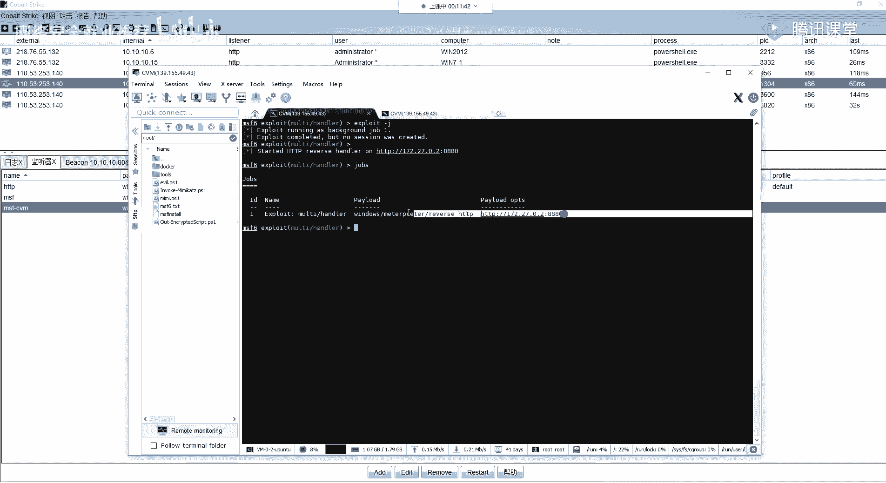

# 【B站最系统的网络安全教程】北大大佬196小时讲完的网安教程，全程干货无废话！学完即可就业，别在盲目自学了！！！ - P57：第22天：域内密码凭证获取及解密 - 网络安全就业推荐 - BV1Zu411s79i

好的呀好。

正式开始我们今天的一个课程内容，好在讲我们今天的课程内容之前的话呃，就是呃在周日周日的时候就是有同学，而且之前的话也有挺多同学问，这一个就是说你的一个cs上面的一个cs，上面的一个shell。

如何转到我们的一个msf上面对吧。

然后在这边的话我就给大家呃，再重新就是演示一遍好吧，大家有问题的直接问。

首先的话呃就是我这边的话，在cs我这边随便拿一个需要啊啊，就拿这个吧。

这个，我这边以这一个需要为例对吧，你要去反弹到你的一个msf上面的话，你首先你需要去创建一个啊监听器。

以及你所需要在好msf上面去配置一个，我这边的话是在我这个公网的一个ms上面，就是啊，我这一个机器上面搭了这样子的一个msf。

好，和你要在ms上msf上面的一个配置的话，就是在这边啊，大家可以看一下我这边的一个配置的一个选项，因为我这个的话是阿里云的一个机器，哦不哦，不是腾讯员的一个机器，然后在这边的话。

因为它是一个v p s，所以的话他没有一个独立的一个公网ip，就是说不是说你的一个主机的话是独立的一个，就是独享的一个ip，就是一个公网的ip，所以的话而这种vp 8 vp的话。

一般都是你一个公网ip的话，它会对应的你的这里有一个内网的一个ip，就是说他是有做这样子的一个映射，就是从官网那个ip的话，可以映射到你的这个主机上面，也就是说啊，你在这个主机上面。

以这个ip今天的这样子的一个端口，你通过这个官网的一个ip的话，也能够去访问到他这边今天的一个端口，也就是我们在这边设置的payload的，这边的一个a host的话，就设置为你这边本地的。

这里的一个内网的这个ip就e t h0 的这个ip，然后你这边的一个端口，以及这边的一个payload的话，是根据你这边cs上面的这边去做一个配置。

然后你这边cs的话，你首先需要去添加一个监听器，监听器的话添加在这边的话呃，所以这以我这边已有的这个为例啊，我这边的话呃名字的话你随意，然后选择的一个payload的话为foreign htp。

也就是呃就是外部的这样子的一个监听器，就是这个，然后的话呃你你需要去配置的话，主要的话就这两块，就在你的一个hdp的一个host stage，以及hdp的一个port port stage。

然后这边的话填的就是你的一个呃，msf服务器的一个公网的ip，以及你要去今天的一个端口，也就是对应的对应的我们这边msf的这里，这里的话应该能理解，然后的话我这边监听器设置好了。

那么我要把我这边的一个shell反弹到我，也就是说转到我这边的一个msf，我这边的话已经没有精听，我这边exploit dj的话，就是把它放到后台，然后这边的话已经有了一个jobs。

他今天在本地的一个8080的一个端口，我们可以看一下它的一个金锭，8880的一个端口对吧，这边的话已经今天了，然后的话这边今天的话就是说等于，就是说你这边今天就等待着啊。

shell的一个连接对吧，然后的话我们想要把这边的一个shell。

其实就是说让他的这边的一个机器来去连接，我这边msf的一个shell来去建立一个连接。

然后的话具体的一个操作步骤，就是你右键这边有一个sbon bon绘画，就增加一个绘画，然后的话选择你的这边的一个监听器，就是你这边配置的一个监听器。

我们chos选择之后的话，其实他这边的话就是一个这样子的一个命令，s p a w n，就你实际你可以直接在这里这里的一个bin，这边去输入，spk啊，不spin，然后的话接你这边的今天气的一个名字。

就就会去啊，把我把我们这边cs的一个绘画。

他会主动的去连接我们这边呃，msf上面的一个今天的这边的一个呃端口，这边的一个监听器，然后在这边的话可以看到，已经返回了这样子的筛选二对吧，就是这一个，对吧，没有问题。

然后的话你就能够在msf在这边去操作，这边的一个呃，反弹到cs上面的这个shell的这个机器呃，大家对这个有什么问题吗。

而jobs的话就是啊你这边的一个job dps的话，就是一个工作嘛，对吧啊，或一个任务，这个jobs的话就是说我们这边的一个模块，我们这边的一个，比如说我这边的一个hina的一个监听模块。

你执行之后的话，它就会有一个这样子在后台的一个jobs，然后这边的话是没有配置那个，没有配置这个，这个exist on shell，这边的话它默认的话是为h，也就是说这个这个选项的意思的话。

就是说啊我这边起的这个job，它会在后台去监听这样子的一个呃，今天这样子的，一个808880的一个端口对吧，然后的话他在这边呃，我们的一个机器，或者说我们的一个码来连接到了我们这边。

进行了一个端口之后的话，他在这边的一个job它就会退掉，也就是会exist，如果说你不想要让他，就是说你想要让多个就是能够去一直的去接收，以及让它一直处于一个今天的状态的话，你需要设置这个为force。

然后的话pit杠j就是把它放到后台，然后在这边的话它就会有一个jobs对吧，这个jobs的话就是你这边的一个模块，比如说这边的一个今天模块，它是啊一个今天的一个工作，他会在后台有这样子的一个任务。

然后session的话就是绘画绘画绘画是什么呢，就是说我们这边的msf的，这里的一个啊机器对吧，就是说呃我们的一个stage，也就是我们的一个好，就比如说我们生成了一个ex一的一个码吧。

我们生成了一个ex的一个码的话，它在目标机上面执行，执行之后的话，他就会去来连接我们这边的一个啊，msf的这边的一个今天的这个job对吧，也就是这里这里指定的这个端口，然后它连接之后的话。

它会有一个通信，它会建立一个连接，建立连接之后的话，就是建立这样子的一个筛选绘画，然后的话我们就能够而通过这个筛选规划，来去进行一个命令控制，就是说像我们通过这个筛选，也就是这个绘画。

他们建立了一个连接来去啊。

操作我们这边啊，我们的一个目标的一个机器能理解吗，他们两个是不一样的一个东西啊，就筛选的话就是你反弹的一个绘画，就我们的一个stage，与我们的这边的一个msf的一个呃呃。

服务端所建立的一个呃通信的一个绘画，呃呃关于这个cs的一个需要转msf的话，大家有有问题吗，就是啊之前，提问的提问的那位同学，没有哦，就就就你是吧，就是你是吧，然后你这边呢，这一个就是说你的一个cs的。

cs的一个需要转到msf的话，它跟权限是没关系的，就是说你这边转的，其实就是把你的一个需要转到了，我们那个cs对吧，然后你这边cs你得到的是什么权限，那么你转到这边msf上面的话。

它同样的都是它同样的也是什么权限，应该懂了吧，啊懂了的扣一，有问题的扣二，嗯好的应该都应该都明白了。

好那么呃正式开始我们今天的一个课程内容啊，我们今天的话主要给大家讲解，域内的一个密码凭证获取，呃本节课的话主要有这三部分的一个内容，第一部分的话就是啊，应该是说浅具体来说的话就只有两部分啊。

就前面的一二部分的话，就是说啊，给大家介绍我们如何去获取域内的这样子的，一个呃所有的这样子的一些密码凭证，以及它的一个哈，希前面的一二部分都是啊，获取域内的一个密码凭证的一些方法。

然后第三个的话也就是第二部分的话，就是我们如何去解密，我们获取的这样子的一个n t d s点，d i t的这个文件里面的一个啊，域内的就存储在域内的一个用户的一个密码哈，希。

首先第一部分啊这个random shelter copy，也就是啊usc，然后再讲这个的话，我们先来啊提前了解一下，就是说活动目录，活动目录数据库啊，什么是活动目录数据库呢，就这一个nt d s。

d i t的这样子的一个文件，这个文件的话就叫啊活动目录数据库，也叫就ad database嘛，就a d的话就是我们的一个active directory，也就是我们之前讲的那个啊活活动目录。

然后这个数据库的话它包括有光御用户组，还有组成员身份等等的这样子的一些信息，以及包括域中所有用户的一个密码的哈希值，它都包括在这样子的一个文件当中，然后我们知道就我们前面再给大家讲玉的时候。

以及讲工作组的一个区别的时候对吧，有给大家介绍，就是说在工作组当中的话，我们的一个主机的一个密码的一个信息，它是存储在我们的一个sam文件当中对吧，就是说在我们的一个啊就是system root。

在我们的一个就是呃系统那个安装目录下面的，一个config下面有一个sam文件，这个文件的话它就是存储着我们的啊工作组，也就是我们本地计算机的这样子的一个，用户的一个哈希密码哈希对吧，然后我们也要讲。

就是说我们通过mini cards来去获取，来去获取我们的一个密码的哈希值的话，它就是通过在我们的这个sam文件当中去读取，去解密它的一个呃哈希值，然后在这边域的话呃也有介绍，就是说在运运在域内的话。

我们所有用户的一个，就是说在域内当中的所有主机它的一个啊密码，用户密码，它都是存放在我们的一个，存放在我们的一个预控上面的，然后在这个预控上面的话，它就有这样子的一个文件。

也就是存储着我们所有狱中用户的一个密码哈，希，然后的话呃为了保护我们的一个密码哈希值，我们就是说windows系统的话，它会使用存储在这样子的一个system注册表，配置单元当中的一个密钥对。

来去对这一个哈希值进行一个加密，也就是说存储在这样子的一个sam文件，以及这个nt d s in d i t的这样子的一个文件，当中的一个哈希值，它是会使用这样子的一个system注册表当中的。

一个密钥来去进行一个加密的，因此的话我们我要去破解我们的一个sam文件，以及我们这里讲到的这个nt d s d t文件的话，都需要拥有这样的一个system文件，这个system文件的话。

它是跟我们的一个sam文件，它是存放在同样的一个目录下面的，我们来看一下吧。

所以这个机器，哦它所sam文件上所存放的一个目录的话，就是在我们的一个系统的一个安装目录，也就是在我们的一个windows目录，就是一般的一般的一个windows系统的话，它都是会装在c盘对吧。

然后的话它的一个system root的这样子的一个啊，路径的话就是这个c windows，然后在这个windows上面的话，有这样子的一个config的一个文件夹。

啊不是是有一个system system 32呀，不好意思，我这边roll了，就是啊windows目录下面，system 32目录下面有一个config，这样子的一个文件夹。

这个文件夹下面的话就有这样子的一些文件，有一个sam文件以及system文件，这两个文件也就是我们所需要的，首先这个sam文件的话，就存储我们的一个本地的这样子的一个啊，用户名，用户密码的一个哈希对吧。

然后这个system文件的话就是我们所需要的一个，要去解密这个sam文件里面的，一个啊密钥的这样子的一个啊文件，呃具体的一个文件的一个位置，就是这三个文件，我们啊经常会去用到的这三个文件的一个位置。

然后在这边啊说一下，就是这个system root，这个的话就是我们的一个系统的一个，安装目录像，比如说，比如说我本机对吧，我本机的话，我想要去查看我的一个系统的安装目录。

我们可以通过这里apple这个呃，两个百分号，包括包裹的这个system root，然后eq一下输出的话，它就会输出这样子的一个目录，这个目录的话，就是我的一个系统的一个安装目录。

也就是c windows，然后呃还有这一个文件，我们来也来看一下吧，windows下面有一个nt d。

啊这个的话要在域控上面去看啊，这个的话要去预控上面去看，因为呃因为这个n t d d s的话，这一个是他是一个活动目录数据库对吧，所以说它只存在于啊有d的这样子的一个。

也就是在我们的一个预控上面它才存在对吧，因为我们的一个用户密码信息的话，它都是存放在我们的一个预控上面的，还是在c盘windows下面的话有一个，有一个这样子的一个文件夹，nt d这个文件夹下面的话。

就有这样子的一个文件，nt d s等，g i t这个文件的话，就是里面它存放着我们的啊所有的一个密码哈。

希就域域内当中的所有用户的一个密码哈，希它都存放在这个文件当中，然后呃这边的话大概了解一下，就是adds的一个数据存储啊，我这边的话列了这三点，就是呃它是由这样子的一个文件构成。

就是我们的一个密码信息的话，它都存放在这个文件当中，然后它是默认存储在预控制器上的，这样子的一个文件夹当中，然后以及它只能够通过域控制器的一个，进程和协议来去访问，也就是说你只有是预控。

你才能够去访问这样子的一个文件，然后呃由于windows的话，它会阻止对这些文件的一个就标准的一个读取，还有复制的一个操作，所以的话我们必须去使用一些特殊的一个技术，来去获取到这样子的一个文件。

这这句话怎么理解呢，就说大家可能会想对吧，我这边的话，我这边的话已经，就比如说我得到了这个预控的一个权限对吧，我想要得到所有域域内，所有域域内用户的一个密码哈，希，那么我就需要获取到这个文件。

来去进行一个解密对吧，那么我去解密的话，我不是直接就能够去得到这个文件吗对吧，但是问题的话就是呃，在这边的话我们可以看一下，比如说我得到了它一个权限，我想要得到这个文件。

然后我去进行一个比如说我把它复制，我把它复制出来是吧，比如说我要去进行一个移动，就说他这边的话它是不允许的，他会有这样子的一个，就是说这个文件的话已经被打开，也就是被占用了。

然后的话windows系统的话，对于这种文件，它是你是不允许去进行一个呃复制读取的，以及你要去查看的话，也是看看不了的，所以的话我们怎么去获取到这样子的一个文件。

里面的一个密码哈，希呢也就是我们本节课要给大家介绍的，这样子的一些方法，好呃，第一个第一个的话，第一个方法的话呃不是啊，就是说第一类，第一类的一个方法就是用这个relam需要的copy service。

这个的话它是一个就是windows系统上面的，一个服务框架，它这个框架的话就是一个呃卷眼的，一个卷眼复制的一个服务，就为了我的话就是卷嘛，就是这个卷需要的话就是演嘛，copy的话就是复制嘛。

卷眼复制service的话就是服务，啊这这一个的话就是利用的这一个服务，然后呃我们大概来了解一下这个服务，它是它是一个什么东西，以及它有什么作用啊，这个服务的话呢是用于一个数据备份的。

以及它是呃支持就是windows server，2003以上的一个操作系统，然后的话呃它是系统默认，它会在特定的一个条件下，它会自动的去创建我们的一个数据备份，然后使用的话就是这样子的一个服务。

以及呃这个服务的话呃，它是会就是默认它是开启的，就是如果禁用了的话，它会影响很多的一些影响系统的一个正常使用，好啊，下面的话就是介绍一些方法，这些方法的话其实就是呃它自带的一些工具。

以及啊一些外部的一些工具，我们就这些工具它所利用的一个原理的话，它其实就是利用的这个b s，b s s的这样子的一个服务好，首先第一个就是这个nt d s u t i l，这样子的一个程序。

这个程序的话它是一个呃，就是我们的一个d就是活动目录，提供管理设施的一个命令行工具，就预环境的话它是默认安装的，就是说它是一个管理我们的一个ad的，一个命令行的一个工具，以及它支持的一些系统。

就是啊2003以上的嘛都都都能够支持好哦，下面的话就具体来看一下，我们如何去使用这样子的一个工具，来去进行一个呃获取这样子的一个呃，我们想要的这个nt d啊，就是这个活动目的一个数据库，也就是这个文件。

呃首先第一个就是啊交互式的啊，其实这个交互式的话，其实就是要就是让大家理解，我们使用这个命令行的话，它的一个步骤就一般通常的话呃，一般通常的话会使用后面的这种非交互设对吧，就我们比如说我们在cs上面。

我们得到我们能够去执行命令，那么我们执行的话啊，不可能是说有这样子的一个交互式的一个环境，我们都是通过就一条命令执行之后的话，返回结果对吧，然而交互式的话我们来看一下，就是它的一个流程。

就我们如何确定一个利用，而这边的话看一下这边的一个截图啊，其实它的一个使用的话比较简单，就我们直接啊执行在我们的一个cmd上面执行，执行之后的话呃，输入这样子的一个s n a p shot。

这个n c s n a p shot的话，就是一个快照的一个意思，然后的话呃执行这个active instant instance n t d s，也就是启动一个这样子的一个，n t d s的一个实例。

就设置就是设置我们的一个呃活动实力的话，为这一个nt d s啊啊输入一个create，也就是创建对吧，然后创建一个快照，创建快照之后的话，他这边它会返回这样子的一个啊g d，也就是这个这个id值。

这个id值的话，我们这个id值的话，它就是一个我们这边创建的一个快照的一个id，然后这边的一个快照的一个id的话，我们通过这样子的一个mt的一个命令，来去进行一个挂载，就这一个mt的话。

如果大家啊就是呃使用linux的话，应该比较熟悉对吧，我们经常会使用到这样子的一个命令，我们要在linux上面，比如说要插个u盘对吧，要去挂一挂一块硬盘，都会去使用到这样子的一个mm命令。

来去进行一个呃磁盘的一个挂载对吧，然后呃我们挂载之后的话，它就会呃返回到返回给我们这样子的一个路径，这个路径的话就是我们这边的一个生成的这个，快照的一个啊可访问的这样的一个路径，就说我们在这边挂载的话。

它会挂载到挂载到我们的一个文件管理器当中，也就是在我们的一个呃c盘下面，然后的话快走快走的话就是退出，以及啊我们就说，这边关于这个ammont以及delay的话。

我们先来就是看一下我这边的一个操作，然而大家有环境的也可以，就是跟着我来去进一个操作，然后呃，所以的话呃，直接在cmd上面执行这样子的一个命令行，直接执行之后的话，我们输入一个s n a p shot。

也就是创建一个快照，创建快照的话，我们，需要去启动我们的一个实例，v a t，然后的话设置好之后的话，我们create来去进行一个快快照的一个创建，创建好之后的话，它会返回这样子的一个gd的一个值。

然后的话我们需要去挂载好，在挂载之前的话，我们先来看一下，就是c盘，c盘目录的话是这样子的一些文件对吧，好，我们来去进行一个挂载，挂载之后的话可以看到他在这边，他是就是说快照已经就是挂载到了。

这样子的一个路径下面，然后这个时候的话我们可以来看一下，在我们的一个c盘下面的话，就多了这样子的一个文件夹，这个的话其实是一个文件夹，对他是挂载到了我们这边的一个c盘下面，然后我们双击的话可以打开。

然后其实你打开之后的话，你会发现啊，你会发现你打开之后的话，它这里面的一个文件，跟我们c盘下面的一个文件内容，它是完全一样的，就是说就是说它的这样子的一个功能的话，它就是把我们的一个c盘他打了一个快照。

就像我们u m呃，也不算，就是做了一个备份一样的对吧，就是把这个东西把它给啊，备份到了这一个目录下面，然后我们在这边的话呃，已经装载装载好了对吧，装载好了之后的话，我们在这一个文件夹下面的话。

我们就可以去找到，有这样子的一个windows的一个目录对吧，以及我们的一个，system 32的一个目录对吧，以及config，然后在这个目录下面的话，就是由我们所需要的这样子的一个文件对吧。

就比如说sam文件以及system文件，这个时候的话我们就可以去做一个复制对吧，以及我们的一个nt d，刚刚的话刚刚我也去做一个复制，以及移动的话是不允许的对吧，然后现在的话我们直接拖直接复制。

复制之后的话，可以看到这边呢我们所需要的三个文件，就存放着我们的啊，域内的所有用户，以及本地的这样子的一个用户的密码哈，希的文件我们都获取到了，这样的话打不开啊对吧，然而在我们命令行上面去操作的话。

就是说我们这边的话，已经创建了这样子的一个快照对吧，然后这个时候的话，我们就可以直接通过cmd的一个，就是copy的一个面对吧，通过copy啊copy的一个路径的话，就是我们这边的这个。

这个路径下面的一个windows，哒哒哒，这个路径下面的一个windows目录，下面的一个nt d s是吧，然后我们要复制的一个文件是nt d s，等于d i t这样子的一个文件，然后我们把它复制到。

比如说复制到c盘下面啊，一个nt d s，点击it看一下这里面，我这里人变的删了，现在的话已经没有了，那我们copy一下对吧，然后现在的话就能够去进行一个正常的一个复，制体积移动对吧。

也就是获取到了我们的这样子的一个文件。

而这里的话就是通过这个npd那这个工具啊，这个命令行的一个工具，然后通过交互式的一个方式来去，得到这样子的一个东西啊，然后我们这边copy完之后对吧，copy完之后的话。

这个我们可以通过这样子的一个方式去进行。

一个卸载，就通过among，来去卸载我们的这里的一个快照，卸载完之后的话，我们再去做行进行一个删除，delete这个快照，然后的话我们就可以退出，然后我们做了这样子的一些操作之后的话。

我们可以看到刚刚的这一个，就是挂载的这一个快照的话就已经消失了，但是我们顺利的得到了这样子的啊。

这个活动目录的一个数据库文件，就是呃交互式的，这个的话就是让大家就是理解他的这样子的，一个过程以及步骤，而下面的话就是我们实际去用到的，就是通过这样子的一个非交互的一个方式，呃。

就是他说啊说是说是非交互，但是其实就是啊，通过把我们的这样子的一个命令，就是一行一行的去进行一个啊执行嘛对吧，首先第一个的话就是第一个的一个步骤，就是查询当前系统的一个快照。

也就是说呃这里的一个命令的话，就是查询你当前系统啊，看是否有没有去创建一个快照，就这一个命令，它的一个实际的一个意义是什么呢，就是说如果你的一个系统当中，正好就是说啊已经有了创建好的一个拍照对吧。

那么这个快照的话我们可以把它挂载到本地，就挂载挂载，通过挂载挂载之后的话，我们就能够去进行一个访问，里面的一个文件是吧，那么这个时候如果说是管理员，或者说啊嗯这个系统的一个管理者，他创建了这个快照。

它是有就说以前的就包含了系统，这个系统里面，以前的一些文件等等的一些东西对吧，那么我们可以从这里的一些快照当中去，获取到它系统以前的这样子的一些内容，就呃可能会有啊天相关的一些。

就是以前的一些敏感的信息等等的，一些有价值的一些数据对吧，然而是具体的一个命令的话，就是通过这样子的就直接n t d s s a p shot，然后list or，然后快快的话就是退出嗯。

对它执行的一个结构的话，就是这样子，就其实就是呃我们把前面执行的一个命令，把它放到一行去进行一个执行就就就可以了，它就会返回相应的一个输出嘛对吧，以及啊。

还有可以通过这个list mt的来去进行一个列出，然后可以看可以看到在这边我截图，这边的话有创建了这样子的两个快照对吧，以及有创建的一个时间，它都呃有有列出来，然后呃第二个的话创建快照的一个面的话。

就是就其实就是我们前面的这边的一个步骤嘛，对吧，就我直接执行之后的话来去进行一个啊，把前面的一个命令把它放到一行好create，来去创建一个快照，创建快照的话啊，这边的命令执行之后的话。

它就会返回我们所需要的这样子的一个快照的，一个g u i d对吧，好的话，我们就可以来去进行一个mt的一个挂载，就mt挂载这样子的一个g u i d挂载之后的话，我们就能够去啊copy里面的啊。

就是copy这边的一个挂载的一个目录，下面的一个文件来去啊，复制里面的一个文件，好我们复制完之后的话，我们就做一个卸载，就使用这个ammont，然后卸载之后的话，注意把这个快照给删除掉啊，就不留下。

不不不留下这样子的一些记录，然而这边的话就是第一种的一个方法，然后后面的话下面的话还有第二种，第二种的话，这个话就比较比前面的话要啊简单很多，就前面的话呃前面的一个步骤的话比较多啊。

然后这个的话只需要这样子的一条命令，就只有这几个步骤，就能够把所有的一个呃东西都给啊，都给做好，我们来看一下呃，前面的两条命的话都是一样的啊，不同的一个地方就是在这里我们输入这个ifm。

然后输入之后的话，我们输入这个create for create fl，然后的话接我们好的一个就是指定的一个路径，我这边的话呃具体来看这个截图吧，就我这边的话create for呃，指定的一个路径的话。

就是c下面的一个m i n g y，这样子的一个文件夹对吧，然后我们在这边指定之后的话，他就会去创建快照，创建快照的话，它会自动的去做一个挂载，就是它创建好快照之后，它会呃返回这样子的一个gd对吧。

然后的话它会自动的挂载到这样子的一个路径，下面，挂载之后的话，它会呃去进行一个快照的一个转载，以及它会把我们这边的一个，就是数据库的这样子的一个文件，它会把它给就是放到。

就复制到我们这边的一个紫电的这个呃文件夹，下面，我们可以看到他在这边的话有复制，就是呃system以及security，以及我们的一个这边的一个nt d0 ，dit的这样子的一个文件，好的话。

它会自动的放到这样子的一个文件夹下面。

那我们可以来看一下我这边呃，这个的话就是其实这个的话，就是我之前执行的呀，可以看到在这边的话他就有这样子的一个文件，他把这样子的一个n t d s，还有我们注册表当中的，我们所需要的一个system。

就是你这一个文件也给它获取下来了，嗯你演示一下吧，这边的话先把这个删掉，呃因为这里不能复制啊，我手敲一遍吧，这是天，一天丢了，然后呃注意就是，就你一条命的话，你，写错了吗，我看一下，好少了一个i f。

嗯没写错啊，只要你听，还没，这里写错了没有，这个没有这一个s n a p啊，就直接啊直接进入这个i fm，不是进入s a p的一个快照，然后在这的话执行之后的话。

它就会有这样子的一个自动的一个呃生成快照，然后的话自动挂载，然后的话读取里面的一个文件，读取之后的话，它会保存到你指定的一个目录下面，也就也就是在这边m n g y对吧。

然后这边的话就是我们想要的一个文件。

而大家对这里的大家对这一块内容有有疑问吗，应该没有什么问题啊，应该没有问题吧，那个sum怎么了，你说哦那个sam文件没那个吗，而我们这边的话，我们这边的话只需要这一个nt d s。

点d i t就可以了呀，就是这里的这个文件的话，就是已经包括了域内的所有用户的一个呃，一个那个密码的一个哈希嘛对吧，然后的话那个sam文件的话，就是说是你的一个本地的一个工作组对吧，就你工作组的话。

其实就用不到这样子的一个工具啊，而且也没有这样子的一个工具啊，这样子的一个命令，就其实我们只需要这一个nt d等于dit，以及那个system那个文件就能够去做做一个解密了，能理解吗。

因为这个文件里面就存放着所有的一个密码的，一个哈希值了，好啊，下面的话就是这个vs vs si的命，这个vs s r的min的话，它啊同样的是这样子的一个，就是我们前面所说的。

这个卷影复制服务的一个管理工具，然后它也是预环境一个默认安装的，好我们一起来大概了解一下，就是说关于这个工具它的一个功能吧，呃这边的话大家看一下吧，就其实我在预习内容的话已经也贴了对吧。

就如果大家有去预习的话，应该能去大概的理解，就这里的话，它就是我们前面所说的所说的这个啊，relisha copy server servers的这个服务的一个管理工具嘛。

那么它同样的也是利用了这个vs的一个服务，来去进行一个啊卷影副本的一个呃创建，以及啊以及删除，然后它同样的也是通过这样子的一个工具来去，就是呃创建快照，但是的话呃它的一个区别的话。

就是这边的一个创建快照的一个命令，它是不一样的啊，然后我们具体的一个使用步骤的话，就是呃同样的我们可以通过这样子的一个list，shoulders来去啊，列出当前的一个就是啊。

当前系统下面所已经所创建的，就已经创建好的这样子的一些快照，然后的话如果没有的话，我们可以通过这样子的一个命令，就是create shader，干干负等于c这里的一个干货，等于c的话。

就是说我们这边创建的一个快照的话，它会呃放到就是啊，就是给我们指定的这个c盘来去，进行一个快照的一个创建，就是指定我们的一个c盘，因为我们的一个c盘的话，就是我们的一个windows的一个系统盘嘛是吧。

然后当然的话，如果说你的一个系统盘的一个磁盘名，不是c的话，那么你就啊就是你要找到你的那个系统盘，那个磁盘名来去进行一个啊对应的一个修改，好吧好啊，具体的话我们看一下具体的一个效果。

我们看一下这个截图啊，就是呃在这边的话执行这个命令之后的话，它就会对这个c盘做一个卷影副本，就生成一个快照，然后的话会返回这样子的一个id，以及我们副本的一个卷名，然后这个卷名的话就是我们等会要用到的。

就是说这边的一个就是呃这个副本卷名的话，其实就是呃我们可以去进行一个访问的，就相当于就是说在这在前面这边对吧，我们呃生成了一个快照，生成快照之后的话，我们需要去把它挂载挂载到一个目录下面对吧。

然后的话我们才能够去进行一个访问，在系统里面，然后在这边的话它生成的这个卷影副本名的话，就是这样子的一个路径，这个路径的话，我们可以通过命令去进行一个访问，就我们可以通过啊copy。

通过copy命令来去获取到这样子的一个，就指定的这个目录，下面的这个我们所需要的这个文件，然后的话啊copy到指定的一个目录下面，怎么好的话，我同样的就是我们创建好之后的话，我们需要做一个删除啊。

就是删除这样子的一个创建的一个shaders，这样子的一个卷影副本，49好呃。

已经49了。

然后呃我们休息五分钟吧，休息五分钟，然后我们再继续，even when you are，just keep getting worse and words，你这个问题我刚刚不是解释了吗。

你应该不是刚刚过来吧，我刚刚不是有给你解释吗，就是说我们对吧，我们已经拿到了入库的一个权限是吧，我们是不是能够直接去得到这个文件呢，你可以看一下吗，请把这个文件删了，对吧。

呃这个文件的话是在一个这一个目录下面对吧，我直接把它拖出来，你会发现，就是说你是无法对这个文件做一个操作的，以及你可以通过命令行的一个形式对吧，你可以自己试一下嘛，就我同样的也用这样子的一个方式。

用copy这个命令来去copy这个nt d s，点击it的这个文件对吧，我把它放到c盘下面的这个m n g y，这个目录下面对吧，然后你会发现有这样子的一个错，就是说这个文件它是正在使用的。

因为这里的一个你的一个系统，你的一个你的一个就是你的这个系统启动，启动之后的话，你的这个服务，也就是你的这个活动目录数据库的话，它就会被被使用，知道吧，那么你的这个文件的话。

就是说你无法直接的去访问到的，也就是说无法对这个文件去进行一个操作，就我刚刚我在讲操作的之前的话，我就已经给给给大家解释了呀，应该是后面才过来的吧，你可以自己试一下嘛对吧。

所以说我们才需要去用到这样子的一个方，这样子的一些方法来去获取到这个文件，好啊，我们继续，然后这个的话应该不用我去操作了，其实就啊照着就是我的一个ppt弄就可以了，就这几条命令也是比较简单的。

就跟它的一个原理的话，其实都是比较类似的，都是通过创建这样子的一个快照，通过那个绝影服务的一个功能来去进行的，一个利用好呃，第五个的话就这一个vcr的，这个vcr的话，它是一个指令行工具。

就是它允许任何人去创建，我们的这样子的卷音拷贝，但是的话它系统默认它呢它是不支持的，就我们需要在这样子的一个sdk中，就是windows的这个呃开发者套件当中，来去进行一个获取，获取这个工具，不好意思。

喉咙堵了一下，好啊，我们需要在这样子的一个sdk当中，去获取这个工具，好呃，这边的话其实没有。

啥玩意儿。

呃这边的话我这边的话已经有准备了，就是针对就是不同的一个系统的话，就是能够去使用的这样子的一个工具，就包括win 10的，还有零八呀，零三的，还有xp的等等，都这样子的一些一些系统的这样子的一个工具。

然后我们可以利用这样子的一个工具来进行，一个卷影父辈的卷影的一个拷贝，然后他具体的一个使用的话，就是呃，主要的话在这边就是通过这样子的一个命令，来去创建一个快照，然而他这边的话创建快照的话。

我们主要的话要去呃就是获取的一个内容的话，就是在这边我标的这里的啊三个镜头，以及这三个红框，也就是我们需要去获得这三三个内容，首先第一个号就是这个快照的一个id，以及啊这个快照的一个set id。

以及这个s n a p short id，还有这一个啊short copy device name，也就是我们的这里的一个，就是群里复制了一个名字，然后其实这里的一个名字的话。

你会发现跟前面这边的这个工具，它得到了这个，而name它其实是一样的，就是它的一个形式都是一样的，好我们执行之后的话，得到相应的这样子的一些内容，然后的话我们同就同同样的，通过这样子的一个copy命令。

就是copy我们这边的这个，就这一个小的copy的一个device name，也就是这里的这一个好的话，copy指定目录下面的这样子的一个文件是吧，好呃前面的这里的这前面的这两个的话。

主要就是在后面这边，我们去删除我们的一个快照的时候，说要需要到要需要用到这样子的嗯，需要用到这样子的两个id，我们可以通过这两种方式来去，就是指定对应的一个id，来去进行一个快照的一个删除。

这是一个好呃，具体的一个操作的话，我这边就不演示了，呃，呃第六个的话就是呃一些扩展，这边的一个扩展的话，主要就是呃大家需要去了解的，就是，我们在去调用这样子的一个，vs的一个服务的时候。

它会产生相应的一个日志文件，所以它是在这样子的一个system系统下面的，它会有产生有这样子的一个event id的，这样子的一个日志文件，然后我们然后执行这样子的一个啊命令的话。

就我们前面通过这样子的一个方式来去创建，快照的话，它会额外的产生这样子的一个事件，id为98的一个日志文件，然后这边的话为什么要提这提这个呢，就是说我们在域控上面去啊，其实这里的话是在后面去讲。

这种痕迹清除的时候，就相应的这样子的清除，我们的这样子的操作日志的时候会给大家讲了，但是这边的话因为我正好呃用到这个，所以的话在这边就是扩展介绍一下，就是说它会产生这样子的一个日志文件。

那么我们在事后对吧，我们得到了这样子的一个文件之后，我们亲我们需要去清理，我们的这样子的一些操作的一个日子，那么我们再去使用这样一个方法的时候，要注意这样子的日志，我们需要去做相应的一个清除，啊。

以及第二个的话就是这边的，就访问快照当中的一个文件，就说我们在前面通过这个vs v s s i的min的时，候去创建了这样子的快照，我们无法就是我们是无法直接去访问到的是吧，就我们无法在那个文件管理。

文件资源管理器里面，直接去访问到这样子的一个文件啊，这样子的一个啊路径的，所以的话我们可以通过这样子的一个方法，就是通过这一个创建符号链接，来去访问这样子的一个文件，具体的一个步骤的话就是在这边啊。

呃首先的话我们在这边创建之后的话，创建了这样子的一个快照对吧，创建好之后的话，它就有这样子的一个卷影副本名嘛，然后这个名的话，我们就啊我们无法直接的去访问到的。

所以的话我们可以通过这个mmk link来去，就是windows下面的一个创建这样子的一个链接来去，把它链接到我们指定的一个目录下面，也就是把我们这边的一个卷影副本的一个目录，把它链接到我们啊c盘下面。

比如说c盘的一个test usc，这样子的一个目录下面对吧，好我们链接之后的话，我们直接去访问这个c test这个文件，我们就能够去访问到这个卷影副本里面的一个，文件内容，然后的话我们通过rd来去删除。

这样子的一个符号链接，然后这边的话就是一些拓展的一个一些点，就是也是需要大家去了解的一个点，呃呃第二个的话就是这一个啊，nya copy，这个的话就是最主要的就是介绍一下，这个工具的使用。

有这个的话它是一个pasha的一个脚本，就这个脚本的话，我们可以直接通过它来去进行一个啊，获取我们想要的这样子的三个文件，然后的话他没有去调用我们这边的一个vs，vs s2 的一个服务。

所以的话它没有产生这样子的一个日志文件，也是要注意的，然后具体的一个使用的话，就是如果说你是直接在啊，你直接把他的一个脚本，就是放到放到我们的这样子的一个呃，就上传到我们的一个目标系统上面的话。

我们通过这样子的一个方法，就是在power shell当中，我们首先import model就是导入这样子的一个文件，就这边的一个import mod的话就是导入模块，就是把我们这里的一个pc里面的。

这样子的一些功能，把它导入到我们的一个呃抛需要当中，然后的话我们就能够去直接的去调用，这里的一个psh脚脚本当中，所声明的这样子的一些函数，以及它的一个方法，主要的话就是用到这个invoker。

那就copy，然后的话它的一个使用方法的话，就是干pass指定我们要去啊，要去获取的这样子的一个文件名啊，文件路径在这边的话，主要的话就是这三个文件路径嘛，就是sam还有system。

还有nt这个n t d s等于d i t对吧，然后呃杠local destination的话，就是本地就指指定我们这边copy的这样子的一个，文文件的一个路径，把它放到哪一个地方。

以及以什么样子的一个名字啊，这是一个，然后第二个的话就是呃我们其实常用的话。

就是在这边的话。

我们一般对吧，一般的话我们得到了一个需要的话，就比如说在cs上面得到了这样的一个选，那么在cs上面的话，我们怎么去进行相应的这样子的一个，就是说去调用这样子的一个power shell的一个脚本呢。

啊其实cs里面的话它有集成，它有自带的这样子的一个功能啊。

就大家可以通过help补来去查看它的呃，一些功能是吧，然后的话你就能够去发现有这样子的，pasha的一个命令，然后的话是这里power share以及power share import。

这边的一个posher的话，其实就是啊在power share power shell下面去执行命令吗，然后这里的一个pimport的话，就是呃导入pc的一个脚本。

也就是说我们可以通过这边cs当中，它内置的这样子的一个portion import，来把我们本地的这样子的一个呃，脚本做做一个导入，导入之后的话，我们就能够在直接在cs当中。

我们通过power shell这样子的一个命令，来去执行这边的一个脚本的这样子的一个方法，来去进行相应的一个操作哦，这边的话给大家演示一下，好吧，我这边的话呃文件路径的话是在这里，然后呃。

我们通过趴下啊，我看一下这个不是预判。

他找个预判。

啊这一个吧，这个是我另外一个环境的一个预判嗯，100。

这个话我们可以通过pasha，就import来去导入我们本地的，我这边本地的话就是呃这个呃脚本，抛弃脚本的一个路径的话，就是这个嘛，然后我们回车执行之后的话，他就会把我们这一个脚本导入进去。

导入进去之后的话，我们可以通过power sh这个命令来去执行，这个脚本的一个方法，我们以这一个文件啊啊直接以这个吧。

14480，这边的话我先把这个文件删掉，没想到在这边的话，已经没有这个nt d s的一个文件了，是吧，好我们在这边的话，我们执行执行之后的话呃，在这边他执行这个脚本的话。

可能需要等的就是要需要需要一定的一个时间，哦搞错了，我这边呢这个预控的话不是这个机器啊，是我另外的一个环境啊。

所以的话我在这边执行的话呃。

在这个这边的一个机器里面是看不到的。

呃是在我这边的一个机器啊，我先把这个，n t d s给删掉，这个应该其实是刚刚生成的啊，我们在执行再来执行一遍，可以看到对吧，在这边的话就已经生成了，这重新生成了一个新的一个nt d s0 。

d i t的一个文件，就同理同理，其他的这样子的一个文件的话，我们也可以通过这个脚本来去进行一个导出。

就是啊使用的一个命令的话，就是通过这样子的一个命令。

其实在这边的话主要就是介绍这个抛弃的，就直接在cs当中，我们可以直接去加载我们的一个，posher的一个脚本，然后的话在ccs当中，通过poshell的一个命令来进行一个执行，然后同理。

其实我们也可以因为在这边的话，我们前面在这的话，是我们把这个脚本把它给删传到本地对吧，然后的话在本地去进行一个执行加载好呃，在这的话我们第二种的话，就是通过这样子的一个呃，cs。

就cs里面他的这样子的一个加载，power shell的一个方法来去进行一个执行啊，其实我们也可以通过就是远程加载的一个方法，远程加载的话，就是比如说我们可以直接通过这样子的一。

个命令来去调用我远程的一个脚本嗯。

就是这个，然后这边的话要去呃。

我们先来看一下效果吧，然后我再给大家大概解释一下。

它的一个就我这边的一个脚本，它的一个意思。

这边的话直接带这个吧，就我这边的话，已经有一个执行了的。

我记不清楚。

这边的话我在这里执行这个脚本，啊我这边的话没有起伏啊，然后呃其实如果大家就是在用pc脚本的时候，碰到这样子的一个报错，你要知道他是为什么，就比如说在这边他报了这样子一个报错。

是don't load strike，它无法就无法连接到远程服务器嘛对吧。

那么这个时候你就要去确定，你要去确定你的这个链接，它是就是你这边的一个脚本的一个路径，这个链接它是否能够去访问到。

然而因为我这边的话是放在我的这个vps上面的，我这边的话没有起这个服务啊，我这边的话是把脚本放在了呃这里啊对吧，然后这边的话通过python起一个htb的一个server，写好之后的话，我们再去执行。

然后在这的话我们可以看到，我们这边执行之后的话，发现有了有这个ip对吧，来请求了我们这边的一个脚本，不同的，这个要等他执行完，可以看到这边的话执行完之后的话，就呃在这边指定了一个c盘的一个目录。

下面的话就生成了这样子的一个文件是吧，然后在这的话我们回过头来看一下这个脚本。

它的一个呃，就这个脚本它是怎么实现的，它的一个作用，然后其实在这里的话呃，就前面这里的话，其实我们前面已经有介绍，就是啊pasha的一个基本的一个使用。

就是通过这样子的一个net web client的一个对象，它的一个dnload stre的一个方法来去下载，来去加载，我们这边远程vps上面的这个抛弃的一个脚本，把它加载到，把它加载到内存当中。

然后加载到内存当中的话，我们直接用这样子的一个方法来去啊，用这个in welcome啊，need your copy的一个方法来去，把我们这边的这个sam文件，把它给。

就是copy到我们的一个指定的一个目录下面，然后同理的话，同理其他的一个文件也是一样的，然后在这的话只需要改一下你的一个路径名，就ok了，还有其他的这边的话我就不一的演示了。

这边的话就是通过远程加载的一个方法，就其实这边实际的话就是呃，就是三种不同的一个方法，这样的话使用的话都是就是它是一个加载的，一个不同嘛啊，使用的话都是同样的这样子的一个脚本。

大家呃对上面的一个内容有什么问题没有，大家有没有什么疑问，应该能理解吧，能理解的扣一，有问题的扣二，ok啊就两位同学们好，好的应该都能理解啊，那么我们继续好，下面的话就是啊第三部分。

第三部分的话就是解密n t d等于d i t，就其实前面的话我们是介绍了啊，我们如何在预控当中，我们如何去获取这样子的一个保存着，所有预用户，以及就是在这个域下面，所有的这样子的一些用户啊。

它的主啊等等的这样子的一些啊，密码的一个哈希对吧，就这样子的一个呃，数据活动目录的一个数据库文件对吧，好我们获取到了这个文件之后的话，我们如何去进行一个，就是说如何去把它里面的一，个哈希值给获取出来呢。

因为里面那个哈希值的话，才是我们所需要用到的是吧，然后在这的话我给大家介绍四种方法，首先第一种的话就是使用这一个，夸克p w d的一个工具，这个工具的话。

它是一个就是呃一个windows用户凭据提取工具，有它可以抓取平台下面的，就windows平台下面多种的一个用户数据，然后在这边的话，我们主要的话使用它来去做一个，就是说把我们的把我们获取到的。

这个nt d。d i t的一个文件内容，里面的一个哈希值给获取出来，然后它具体的一个使用方法的话，就是这边啊，它具体的一个使用方法的话呃，主要的话就是这三个参数啊，希干dm就是说这里的这个参数的话。

因为它还有其他的一些参数，就是它能够它不仅仅是能够去导出预玉当中的，一个哈希他还有就是啊我们平常的工作组啊，这样子的一些哈希它也可以去进一个啊获取，然后刚刚output的话。

就是输出到我们指定的一个文件，当然的话你也可以直接向这边输出，在我们的一个命令行当中对吧，这个这边他就输出到文件当中，然后刚刚nt d s杠file的话，就指定我们的这个nt d。d i t的一个文件。

然后呃具体的一个效果的话就是像这样子，就像我们这边的一个图图两个图，然后这边的话就是我们获取到的，它的一个哈希值。

具体来我们以前面这边获取到的一个。

给大家演示一下，啊就以这一个吧，这个的话是我们刚刚通过那个negligcopy，那个脚本获取到的这个这个预控当中的，一个nt d。d i t的一个文件对吧，我这边的话我把它给抠出来，把它给下载到本地。

然后呃在这边的话，我们在使用这一个工具。

a空调了，用卡阿虚高了，你这个话就不输出了，直接指定这个。

而在这边的话稍微等一下，就是呃你直接导出的这个文件的话，你需要首先要执行这里的这个命令，然后它的一个作用就是修复布置出来的这个，数据库文件，然后执行之后的话，再用这个工具来去进行一个导出。

这边的话稍微慢，稍微有点慢，然后其实在这边的话，你可以看到它也会生成这样子的一些文件，就是在这边正在做相应的一个修复，修复的命令的话呃对是自带的，就这个e烟，啊这边的话先让他跑的吧。

我们先继续后面的一个内容，然而第二个的话就是用这个secret dem，这个也是啊比较常用的，就是它是这个impacket套件当中的一个脚本，然后它的一个缺点就是速度有点慢，就是速度有点慢。

然后其实啊用这个的话是最快的一个方法，就是你修复完成之后的话，直接用这个直接执行的话啊，直接就会就可以直接出来了，然后呃关于这个secret secret dump的话，呃，大家看预习资料就是有给了。

就是这个脚本的一个地址，以及就是关于这些脚本所对应的。

这样子的一些示例，它的一个已经编译好的一个e一的一个程序，就是他原先的一个脚本的话，它是python的这样子的相关的一些脚本，就是python的这样子一些脚本，所以的话你需要有python的一个环境。

然后的话呃在这边的话，这个项目的话是就是这个作者他已经编译好的，这样子的一些ex的一个程序，我们可以直接使用这些ex e的程序，去进行一个啊使用，然而具体的使用方法的话就是这里啊。

这边的话我就呃就带大家看一下吧，我就不一一的操作了，然后呃在这边的话我们看一下它的一个命令，而这边命令的话我看看一下，就是在这边他指定的这样子的一些文件，那第一个的话就是我们就是解密这种sam。

解密这种sam文件的话，我们就是干sam指定我们的一个sam文件，然后还有我们这边的一个security，就sl一些话，其实我们刚刚再去获取到的时候，也有获取到这样的一个文件对吧。

然后刚刚system就指定我们的那个system的一个文件，然后下面这个它就呃，就是解密我们的这个nt d s的这个文件，我们使用这样子的一个就是干system，指定我们的一个system文件。

然后的话指定我们的一个nt d s的一个文件，这里的两条命的话，就是分别去啊解密我们的sam文件，还有我们那个nt d s的这里的一个文件，里面的一个哈，希好。

我们在这里的话主要看我们这边的一个nt d，这边的话是执行之后的一个结果，执行之后的话可以看到，在这边的话就已经把呃，这个文件当中所包含的这样子的一些密码哈，希都给念出来了啊，这个图应该看得到吧。

对吧以及还有呃，还有下面其实主要的就是这里啊，这里的话就是我们的一个哈希尔，以及还有下面这里的话就是呃cbb，就是我们那个cbs的一个key啊，就是它同样的也是存放在我们的这个文件当中。

这个的话我们不需要去过多理解，过多了解，我们主主要的话就关注这边的一个哈希值，因为这里的话就是我们实际能够利用到的，这是第二个，第三个的话就是这个啊nt d s的一个order啊，这个的话这个工具的话。

就是他可以十分高效的破解，我们这边的一个nt d s文件，然后的话将它里面的信息全部提取出来，呃这边的一个执行的一个命令的话，就是其实跟前面的话也没多大区别，是，然后呃。

同样的需要去指定我们这边的system的一个文件，然后的话呃，指定我们的一个nt d s的一个文件是吧，然后呃这边的一个，这边的话呃杠批，还有这边那个杠杠user干csv的话。

就是我们这边指定的一个导出的一个，就是内容的一个格式，就我们这边gp的话，就是导出到了这样子的一个test文件，这样的话你也可以通过这个刚刚有的csv，就是导导出到这样子的一个cs的一个。

csv的一个文件当中，就我们可以通过excel打开，就他就是按照格式做了一个排列对吧，没看到在这块就是我们的一个域名，还有我们的一个用户名，以及后面的话，还有他的一个就是它的一个password是吧。

还有他最后登录的一个时间，以及还有哈希值这边的话没有截出来，就是这一个啊啊以及第四个的话就是呃mini cut，mini cut的话可以说是我们就是最常用的一个，就是去获取这样子的一些密码哈。

希以及我们那个铭文的一个工具，然后同理同样的mini cut的话，它有这样子的一个功能，就是这个dc s y n c的一个功能，就它可以利用我们的这边的一个dd，我们的一个目录复制服务。

就用他的这个服务，从我们这边的一个nt d s的一个文件当中，去提取我们的密码哈希值，然后在这边的话，其实呃在这里的话，其实就是说我们实际使用的话，因为通常的话，我们通常的话使用的cs的话比较多。

所以的话我这边的话以cs给大家做一个演示，就在cs当中的话呃，它同样的有集成了mini cars的这样子的一个啊，功能，就我们可以直接在cs当中去调用，mini cut的这样这一个工具。

以及它对应的一些功能啊，主要的话我们先来看一下第一个，第一个号就是通过这个d c s y n c来获取，我这边的话是这个m n g y，就我另外一个另外一个环境。

就是我自己搭的一个环境和他的一个域名的话，就是这个m n g y的一个域，然后获取这个域当中所有用户的一个哈，希它的一个面的话就是这样这样子，主要的话就是用到用到这里的一个。

dc s y n c的这个呃功能，然后指定我们的一个域名，然后杠的话就是导出所有的，然后杠csv的话就是呃，像这样子的一个形式去把它给列出来，对面的话我们来看一下具体的一个效果。

然后呃在这边的话，我们可以通过help来去查看到这样子的一个mini cut，它的一个功能，然后关于它的一个使用，如果你不知道，你可以，你可以在这边输入mini cut，然后，呃杠h。

然后在这边的话它就会输出啊，它的一个使用的一个帮助，就其实在这边的话，跟我们在windows系统上面直接执行mini cut，0x一的一个啊，就是它的一个帮助信息其实是一样的，然后在这边的话呃。

我这边的话我就直接复制了，就不敲了。

啊呃其实在这里的话，其实这一个就是说这这里使用命令cars。

在cs当中使用mini cars，跟前面去进行一个哈希的这样子的一个解密，其实是不一样的对吧，你会发现我们前面这边的话是通过，就是说通过前面我们的一个一些方法对吧，迷信的。

就是说把我们这边的一个nt d的一个文件，通过离线的一个方式把它给复制出来，然后的话我们再用其他的相应的这样子的一些，解密工具去进行一个解密是吧，然后在这边mini cut的话，我们在cs当中的话。

它其实是利用的这一个，它系统里面的这自带的这个目录复制服务，把它里面的这样子的一个文件给h，还是给提取出来，就就可以把它理解成是一个在线的一个提取，在线的一个解密，前面的这一些的话，就是通过离线。

就离线的一个方法去进行了一个解密，好在这里的话，我们可以看到，这里的话就是我们得到的一个结果是吧，前面这里的这个这一串的话，就是我们的一个i d的一个值嘛对吧，然后中间这里的话就是我们的一个用户名。

后面的话就是我们的一个哈希值，然后还有的话就是获取单个用户的一个，详细信息，就是说我们可以我们前面第一个命令的话，在这边的话，它是获取所有用户都这样子的一个密码哈，希对吧。

然后的话还有其他的一些就是详细的一个信息，我们没有获取到，好在这边的话，我们可以就是你想要单独的对某一个用户，去获取它的一个详细的一个信息，那么我们可以通过这样子的一个命令。

就是其实就是在这边加一个这样子的一个参数，干user这样子的一个参数，来去指定我们的一个用户好，我在这边的话呃，我在这边举例的话，就是举的是这个k r b t gt的这样子的，一个用户。

就这一个用户的话是一个比较特殊的一个用户，就这一个呃，其实我们在第一节课讲，就是工作组跟玉的时候，也有提到这样这样子的一个用户对吧，这个用户的话，它是而在预控上面比较特殊的一个用户。

然后这个用户它是无法去进行一个登录的，它的一个这个用户它的一个作用的话，它是啊，就是我们再去就是说在域域，主机与域控制器当中啊，去进行一个通信的时候，他在其中的话扮演着一个呃，比较重要的一个角色。

他的这个角色的话就是它的这一个用户，它的一个哈希值，是会参与到我们的这样子的一个啊，就是它的一个cp协议认证的一个过程，就我们会去使用到这样子的一个用户，它的一个哈希值去进行一个啊。

数据包的一个加密以及解密，好当然我这边的话，我在后面给大家讲科普的一个协议的时候，在具体的一个数啊，对啊，这个cp协议的话，他是就呃比较复杂的一个东西啊，可能我当时讲的话。

可能大家也不一定一时半会能接受得了嗯，但是的话呃这个呃是我们在后面就这一条语句，我们在后面去进行一个域内的一个权限维持，也就是大家可能经常听说的，一个白银票据以及黄金票据的时候。

就在进行一个环境票据的一个啊，呃一个攻击的时候，会去用到这样子的一个这一条命令，就是我们需要去获取到这样子的一个cp啊，kr b t gt的这个呃特殊的用户，它的一个密码的一个哈希。

我们获取到他的一个哈希之后的话，我们就能够去伪造我们的一个黄金票据，嗯然后我在这边的话，我们可以看一下它的一个效果，就是我们具体来看一下。

呃然后呃在这边的话，顺便提一下，就是我现在在这，我现在这里的话是在这样子的一个啊，就是预预预控的这个机器，就是我这边自己搭的这个预控的机器，上面执行的，所以的话肯定是能够去进行这样的一个操作的。

然后的话如果说你是获取到的，就是说比如说是一个普通的，就是一个普通的一个本地的一个这样子的一个，管理员的一个啊用户啊，它不是一个域内的一个用户的话，那么你是无法去获取到这样子的一个啊。

这个kr b t gt的一个啊哈希值的，就是说你想要去获取到这样子的一个哈，希值的话，你首先你需要去获取到一个，域内用户的一个啊权限，然后的话你需要以这个域内用户的一个权限。

你才能够去获取到这样子的一个，你才能够去预控上面去获取到这个啊，你这个用户去进行一个就是信息的一个交互，来获取它的一个哈希值，这边的话呃给大家提一下，好啊，我们来看一下，就说我们在这边的话。

我们执行之后的话，已经得到了他的一个详细的一个信息对吧，就已经很详细的一个信息，好我们主要的话看一下，就是在这边的话，它的一个用户名是这个对吧，然后的话在这边他的一个哈希值。

n t m那个哈希值就这一串，然后呃还有的话就是要注意，就是呃就是这边的一个这个k r b t gt，这个用户它的一个哈希值，一般的话他是不会去进行一个啊修改的，就是说你在预控上面的话。

它一般不会去说是去修改的，所以的话他我们可以，就是如果你得到它的一个哈希值的话，你可以持续的用这个哈希值去进行一个获取，预控的一个权限，也就是我们在后面会讲的，就是域内的一个权限维持嘛。

你可以通过获取的这个哈希值，来去进行一个权限维持，然后的话如果说就说这里的这个kb t gt的一个，就是它的一个哈希值改变了，就是说管理员他更新了他的这个哈希值，那么你通过原先那个哈希值。

那么肯定是无法去再去进行一个呃，得到预控的这样子的一个权限，当然的话一般的话这个它的一个用户哈希的话，他不会去有做改变。

然后第三个话就是查看所有用户的这样子的，一个所有的一个详细信息啊。

就通过这样子的一个力量，我们就能够去获取到啊，域内的所有都这样子的一个，用户的一个详细信息，可以看到啊，在这边的话就包括了，就是我们前面所获取到的这样子，这里的这所有的这些用户，以及它详细的一个信息。

我们可以看到有这个admistreat这个用户，他的一个哈希对吧，以及还有其他的像k r b t gt的这个用户，以及还有其他的这样子的win 7杠一的这个用户，他把所有的一个用户。

它的一个详细信息都获取出来了。

好啊，以上的话就是我们所有的一个内容。

而在这边的话。

再来看一下前面的这怎么卡住了呀。

卡成这北方，怎么动呢。

啊这里的话呢用第二种方法是。

给大家演示一下吧。

哦还有一个system的文件名来获取。

不要再跑一点。

然而在这边的话，我们通过这个就是impact这个套件当中的，这个secret junk，这个啊工具啊，可以看到，在这的话已经成功的把他的这个里面的一个哈。

希值给获取下来了啊，这一个怎么，他就一直卡在那不动。

应该是没修复完成了，啊写不出来，还有的话就是这个nt d s order，我们看一下，先把这个删掉吧，看一下效果吧。

你看他在这边执行之后的话呃，他这个的话很快哦。

然后执行之后的话，他把结果它会输出了。

输出到一个text文件当中是吧，就啊包括域名用户名，以及它的一个哈希值对吧，本的东西都输出来了。

以及它可以输出到csv的文件当中，啊这个这个工具的话大家自己课后去跑一下吧，好吧，我这边的话我就不跑了，这个的话应该是应该是可以跑啊，不是说应该说是完全可以跑出来的，然后中间的话可能是他那个。

不知道怎么就卡在那，然后这边应该是没有修复完成，所以的话他就用那个烤烤不出来啊，呃以上的话就是我们本节课的所有的一个内容，大家有没有什么疑问，或者说呃还有前面两节课大家有没有什么疑问。

就是呃你自己操作之后对吧，你做过之后的话有有什么问题没有，大家都可以提好吧，给大家两分钟的一个时间呃，提问吧，包括本节课的一个内容，以及上上上节课大家有没有什么问题，怎么怎么都没人回我呢。

感觉就是跟着ppt敲对啊，你就跟着我ppt敲就行了嘛，你跟你跟着我ppt敲的话，你你应该能想不到了，听得好晕啊，呃好晕是指哪里呢，就能具体一点吗，就是说你啊理解不了这些内容吗，获取哈希之后怎么利用。

怎么利用的话呃，在后面会给你讲啊，会讲啊，就是在横向移动的时候，在具体横向移动的时候会啊有专门的一个内容，就是啊针对横向移动的，就我们获取到哈希值哈希之后的话，我们可以就是说获取到哈希的话。

第一种方法就是进行一个解密嘛对吧，我们可以直接对我们这里获取到的哈，希值做一个解密，如果能解密出来的话，那么我们就直接可以得到它相应的权限对吧，就是我们知道账号密码。

那么我们肯定可以得到它相应的一个用户的，一个权限嘛，如果你解密不出来的话，我们还有相应的其他一个方法，我们可以利用获取到的一个哈希值去，比如说去进行一个p t h，也就是一个哈希传递的一个攻击。

来确定一个横向的一个移动，呃，放心吧，后面会讲的，后面会讲的，后面内容还是会很多的，实战环境中预管理会发现吗，呃就是说我们的这样子的一些操作的话，都是比如说你在cs里面操作对吧，你没有说。

就说你的这一期操作他也是看不到的呀，当然的话，如果说你有相应的这样子的一些监测工具的话，检测工具的话，那么你的这样子那些操作的话，很很有可能会被检测到，这个的话不可避免的，然后的话我。

然后还有还有其他问题吗，呃前面这里的话呃，可能就是因为这一期的话是加了玉的一个内容，就是预渗透的一个内容，而且然后的话就是御神偷的话，关于玉的这个东西的话，就是可能大家接触的比较少啊，就接触的比较少。

然后对他的相关的一些概念的话，可能不是很理解，这点的话大家就呃没关系啊，不用急好吧，后面的话后面的话你会后面的话，后面还有很多的一些内容呢，就是我尽量会让大家就是串起来好吧。

就是能够把这些相关的一些内容给串起来，就我们呃看看一下课表吧。

我这边的一个课程课表的一个规划的话，其实。

我们现在的话是讲的，就是内网信息的一个收集嘛，其实啊今天的这个内容的话，就是域内密码的一个获取的话，这里这里一部分的话，应该算是在后面的这里的一个，比如说嗯横向移动的时候，横向移动的时候才会说去啊。

那个但是的话啊，就是密码信息的相关的一些东西的话，呃，前面的话给大家介绍完，因为后面的话也同样的有其他的一个东西，就是说前面这里的一个一些密码哈，希的一个获取的话，是为后面我们这边呃横向移动对吧。

我们通过相应的一些方法去进行一个横向移动，去利用我们前面获取到的一个哈希值，以及还有就是呃日常就是一般的话，就像工作组的一个横向移动的话，呃，就是域内跟工作组的话。

它相应的一个使用的话其实没太大的一个区别，然后主要的话就是，就是说你在工作组以及域内的话，你的就是呃主机资金的一个关系，以及你主机资金的这种通信的一个啊协议，就说去进行一个资源的一个访问。

去进行一个主机之间的一个访问的话，它以及密码的一个印证等等的，相关的一些协议的话，它是不一样的，然后的话这里的话再讲，那个就是在讲横向移动呢，这边的话会给大家讲。

就是讲啊我们的这样子的一个好。

域内的一个就是域内通信的一个协议，这个cas协议，啊对就是一般的话你就是你小公司的话，也不会说有约啊，一般的话啊，你大公司的话都是有这样子的一个东西啊，mini cars的话。

mini cars的话有就是说mini cars，你要直接去使用的话，现在的一般的一个杀卵，他都能够去把他给杀掉，所以的话你需要去做相应的一个敏杀，然后的话也不，然后的话。

还有就是你不不一定是说你直接把mini cos传上去，啊对吧，你要去获取它的哈希值，你可以有其他的一个方法，就是上节课不是讲了吗，就是哦哦对了，就是在玉玉当中去获取，本地的这样子的一个密码哈。

希的话其实跟在工作组当中去获取，其实也是类似的啊，就是说域内的一个主机，而不是说预控，就是说域内的这些主机，它其实也是我们去获取它的一个哈希对吧，也跟前面我们在工作组当中去进行一个。

本地的一个密码获取的话，它其实也是一样的，类似的，这个这个肯定的，你这你这瞎操作的话肯定是肯定的呀，但是就是说你做不到说能做不到，说能做到绝对的一个隐蔽，就是我们现在这样子这样子去操作的话，你去管理员。

你不去说，你不去仔细的去那个的话，因为我们这边也不是说，直接去登录到它的一个主机对吧，当然的话就是说你管理员，你去是比较难去发现这样子的，你的这样子的一些操作了，当然的话。

你因为你去在它的一个系统当中去进行，相应的操作的话对吧。

会有相应的一些日志以及你的一个流量的话，有相应的一个特征，就是说你的一个新你的一个内网当中的话，有这样子的一些流流量监测的一些设备的话，以及你的主机上面有主机监控的，这样子的一些呃，一些就是客户端的话。

那么我们的这样子的一些操作的话，肯定也是会被被被监控被发现的，是我们只能是说能尽量的去隐蔽一点。

啊已经十点钟了呀，应该应该没有什么问题啊，然后呃就是就前面有位同学说听得好晕，我其实呃怎么说呢，就说你先不要急好吧，就你听的有点晕的话，你可能是你刚接触这一块对吧，你刚接触这一块。

你可能不太就不太能理解这些东西，但是呃在后面的一些内容，你后面你啊接触后面的一些内容，以及你多去就是你一时半会你听不明白，就是我在课，我在课上的话会去讲对吧，就是我中间我突然想起来就是有相应的一些点。

我会讲，有可能你ppt上面没有，然后这个时候你，然后你这个时候你多看一下我的一个视频嘛，对吧，反正又有回报，怎么拿下预控啊，会的，就其实我们现在我们现在对吧，我们这边已经拿到了他的，我们通过啊。

当然我们通过拿下就是域内的一个主机对吧。

拿下域内的一个主机，通过相应的一些漏洞拿下域内的一个主机，然后的话我们通过域内的主机的一个就是说啊，密码哈，希对吧，来去进行一个拿下预控的一个权限。

就是我们预渗透的话，一个最最终的一个目标就是拿下预控嘛，这个肯定会讲的，我第一节课不就说了吗，就是呃最终的一个目标就是拿下预控嘛，呃作业的话，其实作业的话，这里的话作业的话没有什么太多啊。

就是你先把我ppt的这些内容，你都自己做一遍好吧，然后的话你不理解的哪一个点，哪些地方你可以问我拿下预控的话，那么你就是说你拿下预控的一个权限的话，那么你这整一个域内，就说比如说我这边拿下了这。

我这边的这个预控对吧，然后的话我当前的一个预的话是，我当前的一个月的话是mg y。com，这样子的一个域，那么在这一个域内下面的主机，这些主机我都可以去进行一个控制，这什么意思呢。

就是说我预控的一个权限的话，我可以随意的登录，随意的去啊，访问域内的所有的一个主机，应该没有问题啊，没有问题的话，那么我们下课大家早点休息好，作业的话就是把我ppt上面的一个内容，自己自己动手做一遍。

一定要自己动手做一遍好吧。

