# 【B站最系统的网络安全教程】北大大佬196小时讲完的网安教程，全程干货无废话！学完即可就业，别在盲目自学了！！！ - P60：第26天：Linux系统下的文件传输 - 网络安全就业推荐 - BV1Zu411s79i

就是执行完之后的话，我们需要去执行这样子的一个命令，来去把这个缓存给清除的，就是清除掉这个缓存的一个目的，就是为了就是隐藏我们的这样子的一个，就是说使用了什么样子的一个木马。

使用了什么样子的一些一个方法，来去进行一个攻击对吧，就我们需要把我们这边的，因为这边的一个缓存框，它记录了我们的，就是说所使用的一个木马的一个内容对吧，那么管理员或者说呃。

就是我们的一个渗透测试之后的话，呃，房管理员他去做一个溯源啊，等等的这样子的一些操作的时候，他可以在这样子的一个目录当中去查找，我们所使用到的这样子的一个木马是吧。

来去对它进行一个分析，然后在这边的话，我们可以通过这样子的一个命令。

去把这样折和缓存给清除掉，比如清除的一个命令的话很简单，就是在这一个命令后面的话加一个dl 1 t1 ，也就是delete，delete的话就是删除的一个意思，也就是可以看到我这边执行之后对吧。

它的原本这个目录下面，它有这样子的一个缓存的，但现在的话已经没有了，就是已经做了一个清除，做了一个痕迹的一个清楚，这是第三个，后面那段话，我们等会再那个我们先休息五分钟吧，先休息五分钟。

啊五分钟之后的话，我们在呃，我们在。

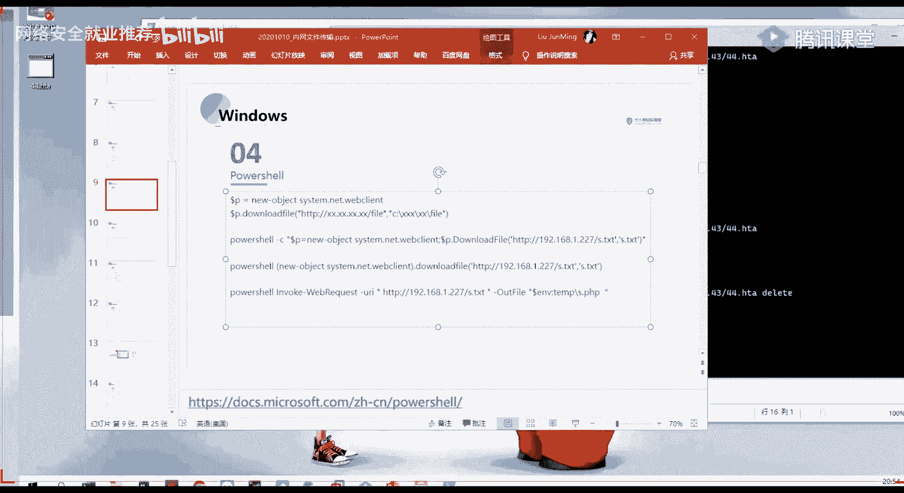

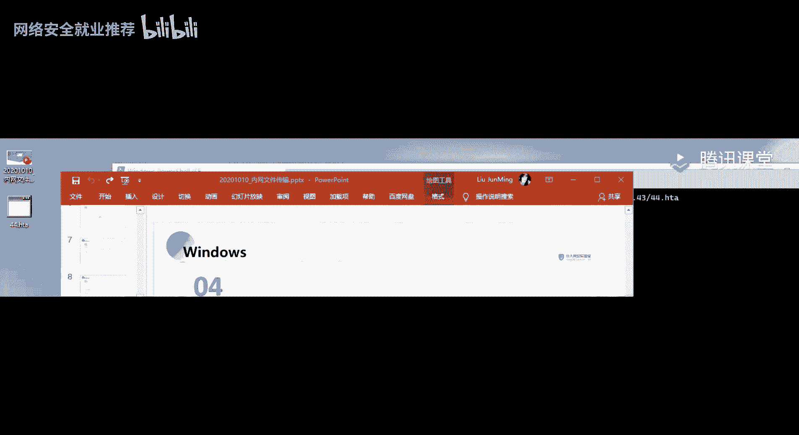

好我们继续啊，呃前面的这三个的话，大家应该没有什么问题吧，应该能理解吧，其实就是就是利用的就是windows系统下面，它自带的，就是原本就有的这样子的一些，命令行的一个工具。

这样子的一些命令行工具来去进行一个，进行一个利用，利用它来去进行一个呃，我们去下载，我们已经生成好的这样子的一个木马，或者说啊工具文件等等的这样的一些内容，应该没有什么问题啊，没问题啊，那么我们继续。

下面的话，我们，一起来了解一下，就是power shell，就我们其实前面在讲信息收集的时候，就已经有介绍了对吧，就是windows下面的话有这样子的一个poshell的，这样子的一个命令行工具。

然后这个posher的话它的一个作用的话呃，它的一个作用，它的一个功能的话是很强大的，好在这边的话，我们可以利用它来去进行一个文件的一个下载，以及执行，以及进行一个呃文件的一个执行，然后在这边的话。

我们首先来看一下这这一部分，这部分的话是为了，就是让大家能够更好的理解我们呃。

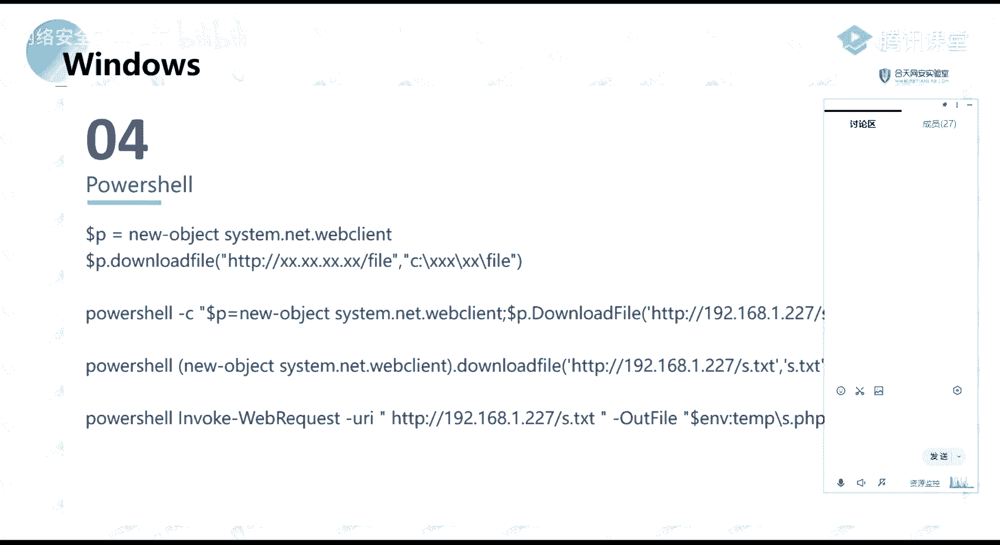

这边，我们在sam d当中直接输入这样子的一个power shell，对吧，输入之后的话它会进入到这样子的一个命令啊，对吧好，这里的一个pcie的一个命令行，跟我们原本的一个项目的一个命令行的一个区。

别，其实就是他在前面有这样的一个加了一个p，对好，我们在这边的话，我们已经进入了pasha，那么我们首先来看一下第一个啊。

这边就这样，我先来看一下第一个第一个这个语句啊，我这边的话是把一个，就是说把这个文件下载的一个功能啊，把它分成了两块，就两个部分就便于大家的一个理解，首先第一部分的话就是通过呃。

new object创建了这样子的一个对象，然后的话把这里创建了一个对象的话，把它给付给了这样一个变量p对吧，就多了，符号的话就是表示变量的一个意思。

然后这边的一个new object的话就是创建一个对象，这个对象的话是这个see some。net顶web client，这个这边这边的话大家记住啊，就是说就你去碰到这个。

或者说你要去写这样子的一个发泄的一个，脚本的时候对吧，你就直接能够去直接直接上手写了是吧，然后这边的大家可能会有疑问的一个点的话，就这一个new object的这一部分对吧，你不知道它什么意思。

就不知道是什么意思的话，我们可以来看一下，呃预习内容，就运行内容这边的话呃，我又给了这样子的几个链接对吧，首先第一的话就是project的一个官方文档，就大家想要去学习抛弃的一个使用的话。

大家可以去在这边的一个pasha的一个，官方网站上面，官方文档上面进行一个学习是吧，就包括它的一个就是它是一个什么东西对吧，它是一个它是一个它能够去干什么，它有什么作用，以及我们能够去用它。

我们怎么去利用它来去写脚本，去进行一个开发对吧，然而第二个的话就是，这样子的一个porsha常用的一个donnet，还有com对象，这里的话就是我们呃这一篇文章，大家可以去看一下，这这里的话就是我们。

所要去讲到的这一部分，就是这里的一个创建的这个，system in dnet的这个对象，然后其实在这边的话呃，前面这部分大家自己去看好吧，我这个号我就不一一说了，我们主要的话看这个主要的话看后面这边的。

就说hoshare常用的这样子的一个点com的一个对象，以及还有常用的一个点net的一个对象，然而在这边的话，就是说我们所使用到的其实是这个，就是说我们通过pasha去呃。

创建的是这个顶net的一个对象对吧，我们可以看其实，在这边对吧，它是一个system dnet，然后点web client，那么我们找到这一个system点，net up client。

也就是这个那么创建的这个对象，它的一个作用是什么呢，就是说它我们创建的这个对象，它提供了常用的一个方法来发送和和接收，我们ui标识的资源的数据，就是说我们可以通过这这个对象来去进行一个，就是发送请求。

还有接收，就是说资源的一个就是说u r l，u r i的一个资源数据，就是说好能够去下载我们指定的这个呃，资源的一个数据，然后的话我们回过头来看一下，在这边在这边的话呃。

在这边的话第二句的话主要就是这个download fire，nload fire的话，在这边你可以把它理解成，就是说这个对象的一个方法，就是说我们创建了这个对象之后的话，我们可以调用这个对象。

它所提供的这样子的一个方法，然后这边的一个方法的话就是download file，从字面意思上看的话，我们就知道它是一个就是说下载文件对吧，就下载文件的话，我们知道就是说其实就是跟我们这边对吧。

它提供了呃，一个方法来去接收我们指定的一个url资源，的一个数据对吧，就是其实就是这个download file，就是来去接受我们我们这边所指定的这个啊url，有一个资源，然后的话把它给。

就是下载到我们指定的一个路径下面。

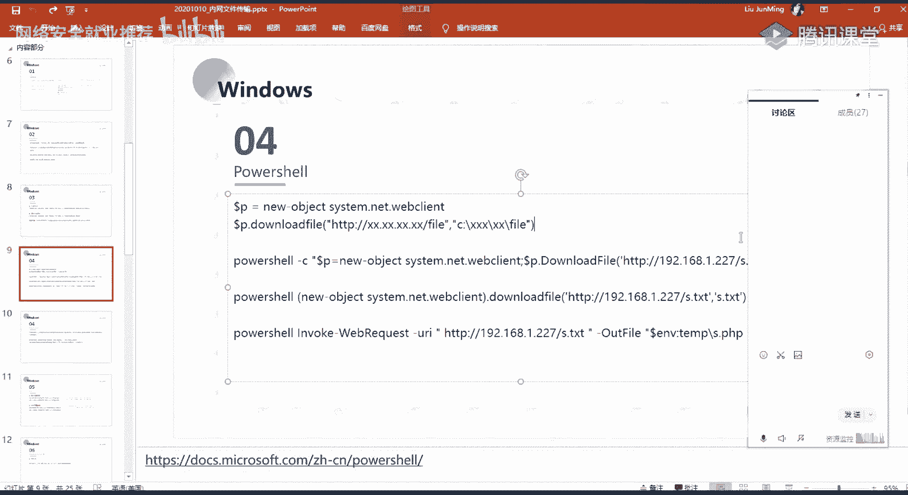

然后我们同样的以这一个就是说。

呃。

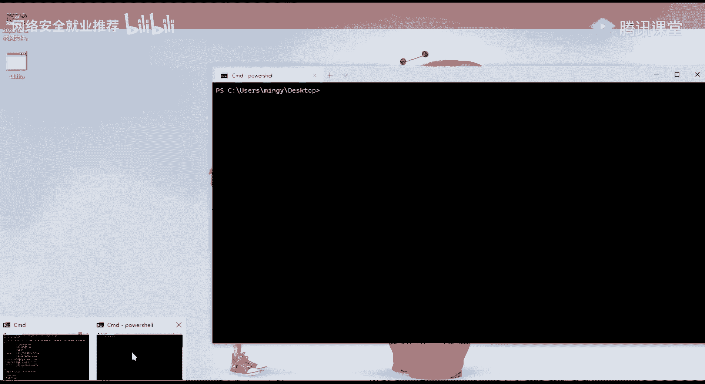

同样的以这个，同样的，以我们前面所下载到的这个四四dh，ta的这个文件为例是吧，然后的话呃，我们来去通过这样子的一个方法。

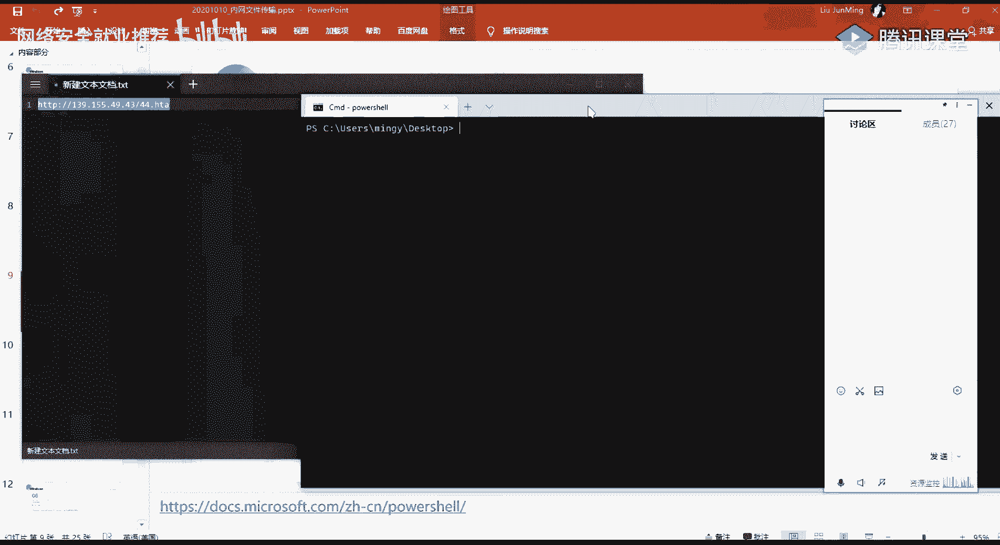

来去进行一个下载，首先的话我们要去执行。

要去执行这个命令的话，我们首先需要去进入一个power是吧，然后我直接粘贴了，我直接粘贴进去，然后的话，指定我们下载的一个资源的一个url，然后的话指令我们要去就是把它下载到哪里。

我这边的话直接就下载到当前的一个目录，下面啊，我就就44连续电。

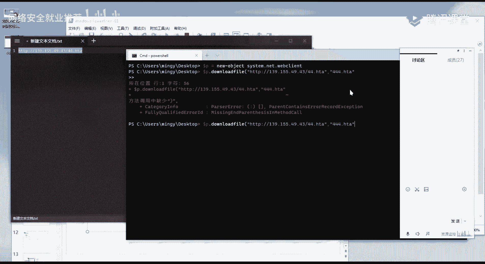

然后可以看到我这边执行之后的话。

在这边我当前的一个目录下面的话，就生成了这样子的一个文件，就说明我通过这样子的一个方法，成功的下载到了我这边，vp s上面的这个440hta的一个文件对吧。

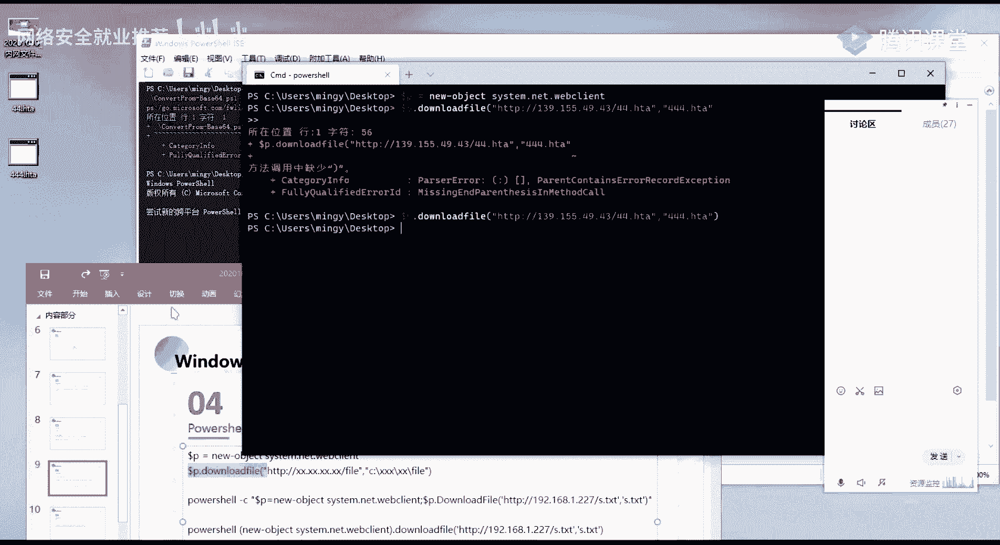

这是一个，然后下面的话我们通过这样子的一个方法，就其实下面的这一句话，其实就是跟上面的这个其实是类似的吧，只是的话我们我们可以通过这边的一个操作。

我们知道我们首先需要去进入这个power shell对吧，然后的话我们这边有两条命令，我们需要输入两次，输入两次的话去进行一个执行对吧，那么实际的一个情况的话。

我们可能就是说我们比如说我们通过呃cs对吧，我们通过cs的话，我们执行的通过抛弃去执行命令的话，我们执行之后的话，他立马会返回结果对吧，那么我们执行之后的那个环境的话。

它不是在同样的一个power shell下面的，我们要去执行，要去进行这样子的这种变量的一个操作的话，我们需要在同一个就是说他需要的这样子一个，命令行下面的，因为我们这边负的这个变量的话。

它会在就是说在当前的这个poshare下面，它是能够去找到找得到的，最早找得到这个变量的对吧，如果说在另外的我在另外去创一个posher的话，他是不知道这个呃，找不到这个变量所对应的这个值的对吧。

所以的话我们就是说在同一个框下面的话，去执行多个命令的话，可能就是不会很方便啊，所以的话我们可以通过这样子的一个方法，来去进行一个，就是把它合并成一句好学的一个语句，来进行一个执行。

来达到上面的这样子的一个目的，然后我们来看一下，就是说这边的这个语句，它的意思，这个语句它的一个主要的一个呃，点的话就是这个gc的这个参数，这个赣c的这个参数的话就是抛share的一个呃。

比较常用的一个参数，我们可以通过power，但问号来查看，就是说party下面的话我们可以建立一些参数，可以看到在这边的话它有这样子的一些参数，然后的话呃我这边的话我不会一一的去讲，就是。

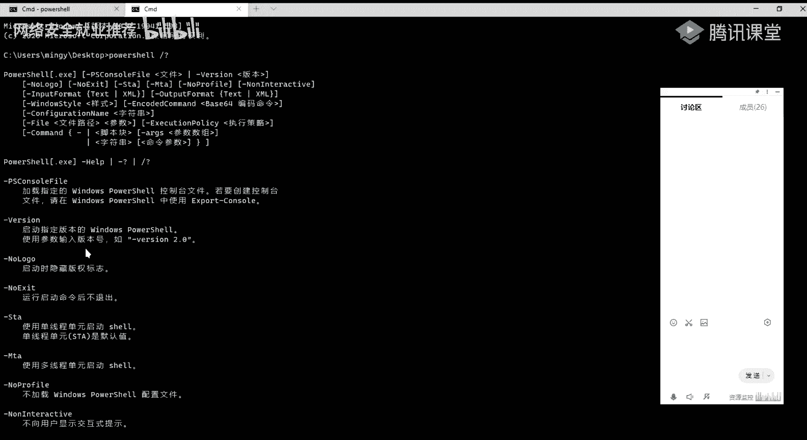

关于更多的这样子这些东西的话，他你自己去查看好吧，而且就是都是中文的对吧，有没有对每一个参数的一个描述，这个的话应该很容易理解的好，在这的话我们主要的话就是看这个杠c这边呢，这个杠c的这个参数的话。

它其实是指定的，就是说是这个干command的。

就是说我们可以通过gc来去，就是表示我们的一个参数的话，就是这个呃干command。

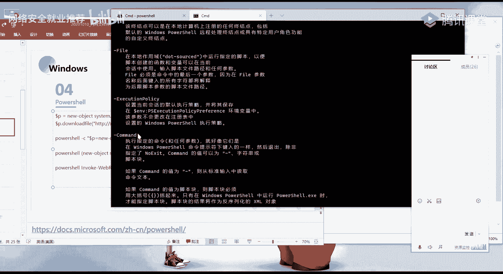

从他的一个字面意思的话，就是执行我们指定的一个命令嘛对吧，command就是命令的一个意思嘛，然后我们通过杠c参数后面的话，我们指定可以指定相应的一个命令以及参数，来去进行一个执行。

然后在这边的话我们所要执行的话，其实就是这个就是这一部分对吧，这一部分的话，其实就是我们这边上面的这一部分的一个内容，我们通只是通过分号做了一个分隔对吧，然后的话把它放到了一行命令当中。

直接去进行一个执行，然而在这边的话它所下载的一个呃文件的话，是这个当话关于下载这个文件的话，我们可以就是你自己想要去下载什么，你就更改成什么样子的一个文件对吧，然而下面第三个的话就是使用pasha的。

另外的这样子的一个就是写法，就是它它的一个作用的话，它其实跟上面的两个的一个作用的话，它其实是一样的，只是呃他的一个写法以及表示的话，会稍微有一点区别对吧，就是大家在碰到。

比如说碰到别人去写的这样子的一个，抛shi的一个脚本是吧，它是通过啊这样子的一个形式去写的，你不要觉得奇怪对吧，其实它的一个作用的话，它它的一个作用，其实跟上面这个这个都是一样的啊。

只是我们可以看一下它的一个内容的话，其实就是通过new object来创建了这样子的一个对象，对吧，创建了这个donnet的一个对象，然后的话调用了他的这样子的一个doload，fy的一个方法。

来去下载我们这边指定的一个资源对吧，下载到本地，这一个保存成一个s。text的一个文件，对这个话，应该这里的这一句话，是能能够比上面就是能更加直观的去理解对吧，而且其实这样子的一个写法的话。

就是就更加就更加方便嘛，可以看到就是已经就比上面的话还要短对吧，然后下面的话就是另外的一种方法，我们上面的话是通过创建了这样子的一个啊，c donut的一个web client的一个对象对吧。

然后的话通过调用这个对象的，这个dnf的一个方法来进行一个文件的下载啊，而且是pasha，下面的话有这样子的一个呃呃方法，或者说呃函数的方法吧，就是这个invoker干web request。

这个然后呃这一个invoke web request的话。

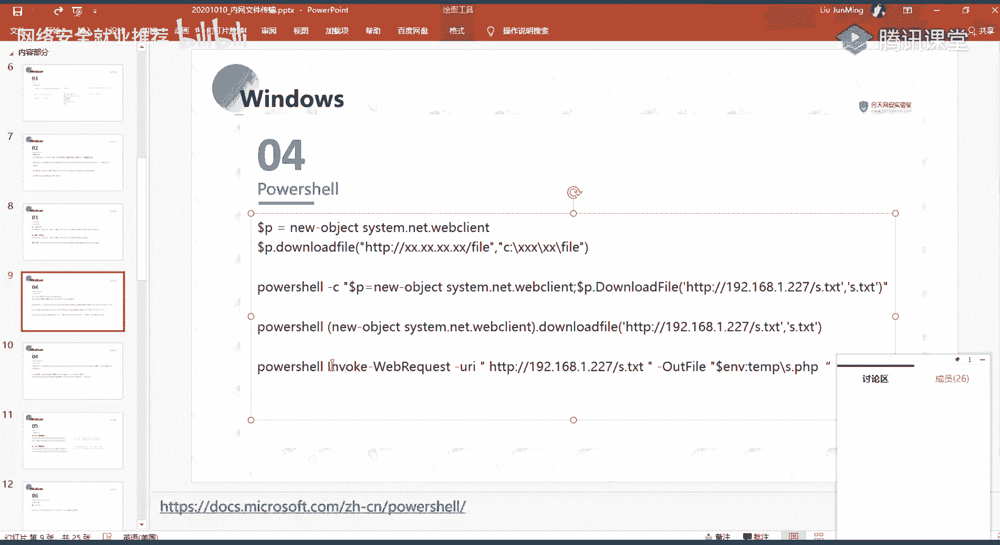

它的一个作用，我们可以通过就说，我们首先的话进入到procel当中，然后的话我们因为大家现在他不知道，他什么意思对吧，那么我们怎么去知道，就是说比如说你看到别人写的这样子的，一个语句对吧。

你想要知道它使用的这里的这个好方法，它是什么意思是吧，那么我们可以通过在pci中输入一个help，然后接我们这边的一个invoke，web request的这个方法来去查看。

就是说这个方法它的一个详细的一个呃，详细的一个使用，然后可以看到在这边它的一个语法的话，就是invocal web request，然后的话加这样子的一个干u r i的，这样子的一个参数对吧。

然后后面的话接我们的一个u r i，也就是我们的一个呃资源的一个例子，然后的话后面接我们那个common parame。

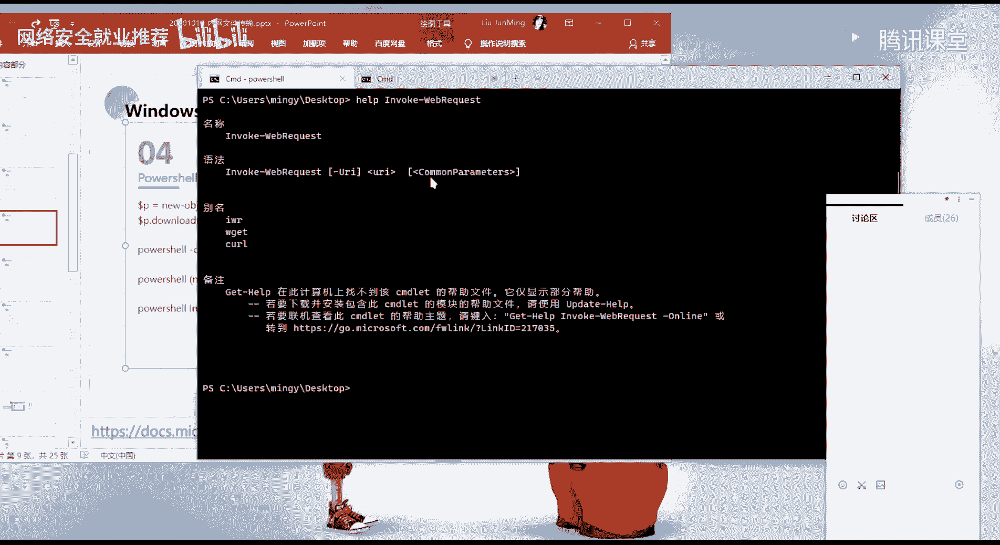

这边的一个core common paradise的话，其实就是我们要存储，就是说把我们这边的这样子的一个文件，把它输出到哪里，就具体的话我们看一下这这样子的一个例子，就在这边的话。

我们使用的是这个干out out file的，这样子的一个参数，这样子的一个参数，然后的话把我们前面所请求到的这个资源，然后把它保存到我们本地的这样子的一个，路径下面对，然后我们可以看一下它的一个效果。

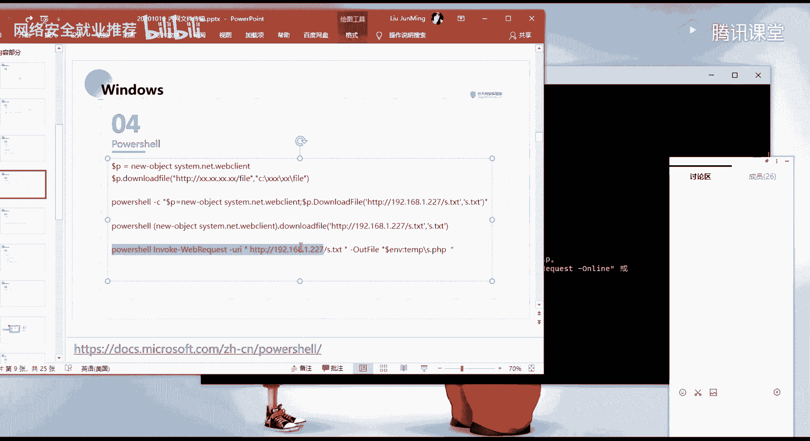

我这边的话同样的，以就是下载那个14点hta那个文件为例。

我这话直接粘贴了呃，还有的话在这边大家要注意啊，就是之前的话有挺多同学就是问我。

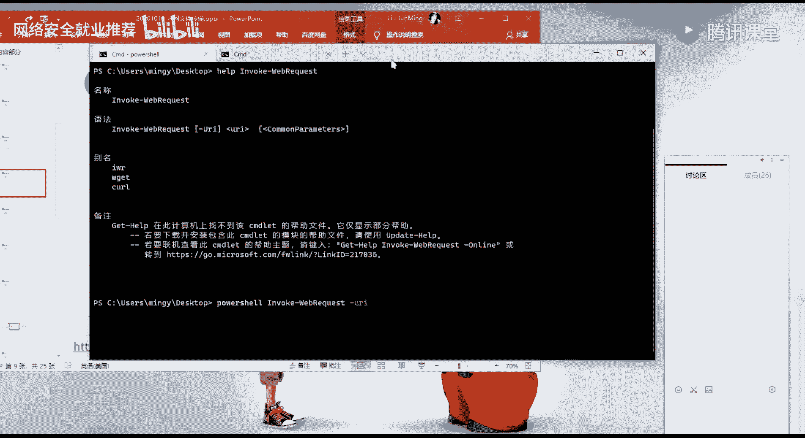

就是就是截图发我这样子的一个问题啊，就是为什么会报错，就是其实大家你去认真的去看，我的一个命令的话对吧，你会发现就是说我就是这种power shell的一个面的话。

都会加这样的power shell对吧，就前面有这样子的一个抛弃。

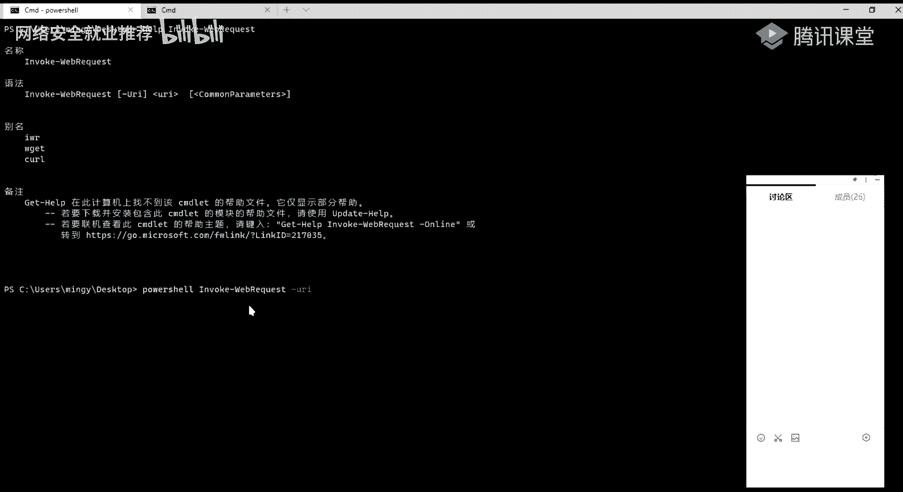

就是说加这个poshell的话，其实我们这边的一个执行的话，就我们得到的这样子的一个shell，我们原本得到了一个需要的。

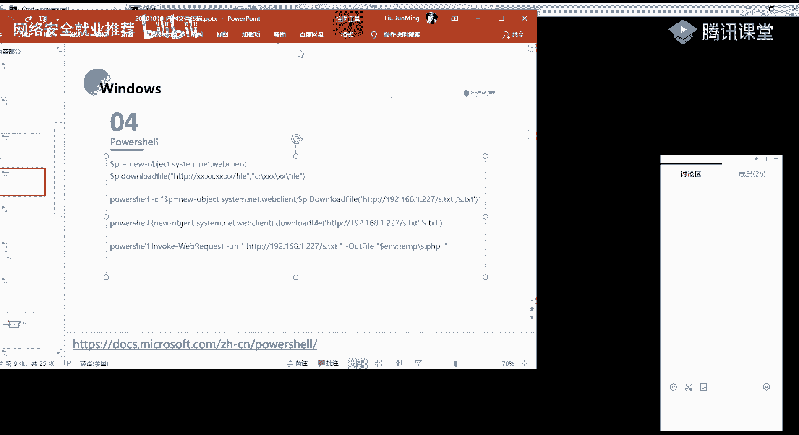

相比如说一个cmd好吧，好像比如说我们在windows系统上面。

我们得到了一个需要，其实是一个在cmd的这样子的一个环境下面，对吧，我们反弹的一个shell，那么我们要在cmd环境下面去调用这个，poshell的话，要用posture来去执行相应的一个命令的话。

那么我们需要去加这样的一个poti来去，就是说高速cmd，我们要去使用这个posure，来去执行后面的这样子的一些命令对吧。

但是的话如果你已经进入了power，那么你加这个posure牛，他就是一就是重复的对吧，然后的话你在抛弃下面，你去使用这个potier来去进行一个命令，那个加载的话，它会有一个他会报错的。

所以的话我们一般的话。

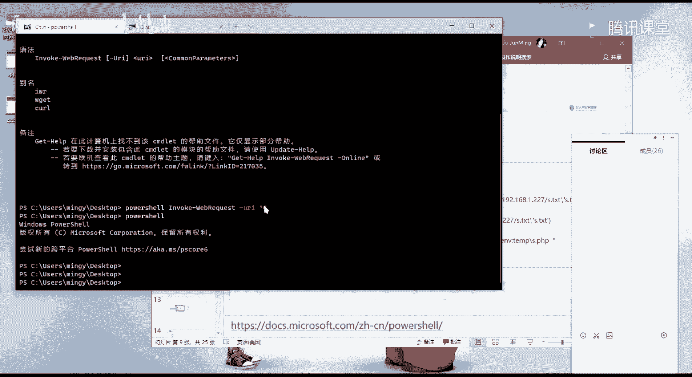

就是你在cd当中去进行一个这样子的一个执行。

当然的话如果说你比如说呃像msf当中的话，像msf当中的话，就是说你可以去反弹，反弹回一个power shell的一个share，就是说呃，一般的话我们就是指定的一个payload对吧。

指定的一个payload就是反弹的一个shell的话，它是一个像比如说matt pat的，还有的话就是像那个shell对吧，这样子的一个shell，还有其实我们如果说windows系统下面的话。

我们其实也可以反弹回一个power shell的一个系列，就是说我们反弹的一个share的话，就是直接是在posher的一个环境下面的，然后的话我们可以在这个shell下面去执行。

posher的一个脚本以及命令，这个的话大家可能呃没有去注意啊，就是你可以去查看那个啊，payload，就是windows下面的payload的话。

是有power shell的这样子的一个payload的，以及它的所对应的一个呃模块，好然后在这边的话我们使用这个invoker web request，然后的话干ui指定我们要去下载的一个资源。

否则的话同样的以这个为例，然后的话下载到我们指定的一个目录下面，而在这边的话我们看一下。

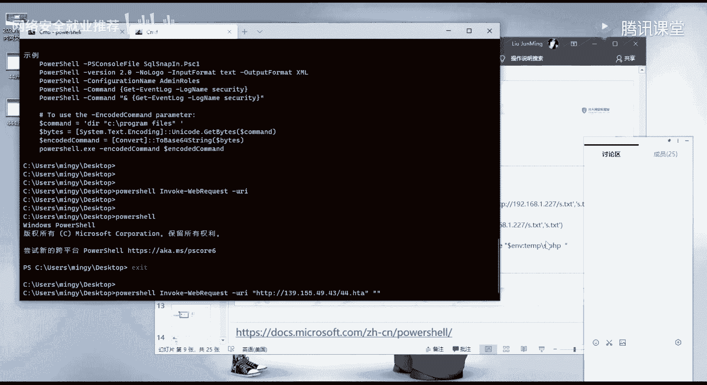

这边我这边的话是写的是dollar mv，然后的话tank，然后的话，后面的话接我们的一个保存的一个文件，对吧好，其实在这边的这个多了，yv的话，它其实就是说在power shell当中的话。

它表示的一个意思，其实就是我们的一个，我们前面所讲到的那个system root。

就是在cmd下面对吧，我们可以通过apple呃，百分号，百分号啊，system用来输出，就是说你当前系统下面的一个，就是系统的一个安装目录对吧，就是这个c windows。

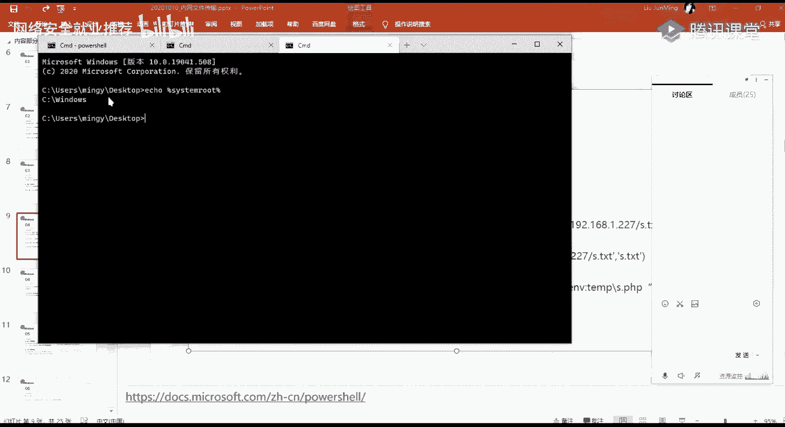

然后在power 当中的话，我们可以通过这个多了mv来表示。

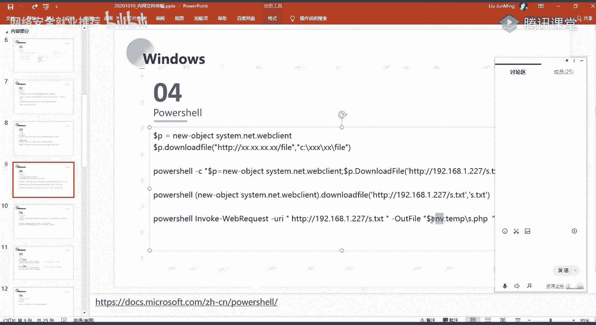

就是说我们当前的一个系统所安装的一个目录，其实就是一个c windows吗，就一般的默认的话，他都是在这样子的一个c盘目录下面对吧。

啊其实在这边的话，它就是在c盘的windows下面的一个tap目录下面，就是保存到了这个目录下面去。

那其实我们也可以就是自己去指定，比如说我这边的话就保存到d盘的一个呃，d盘目录下面，然后的话呃44点hp，不能接受，实际上，可以吗，第一盘。

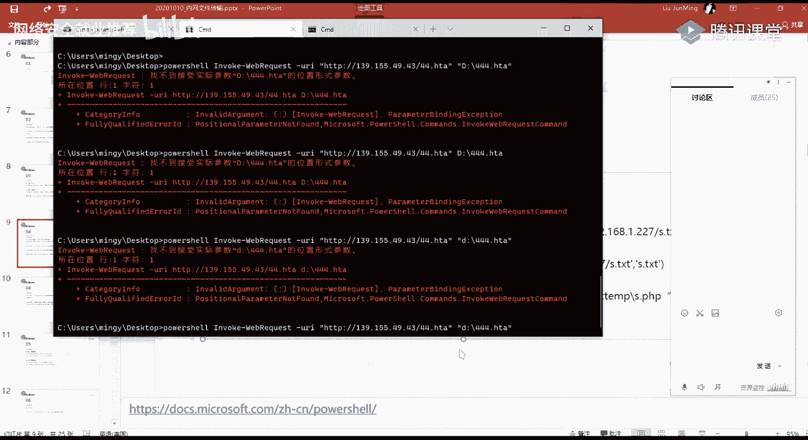

诶不能吗，你，好这边，这边少了一个参数，我忘了，就是干out fire，需要加这样子的一个参数，然后的话再去指定，我要去保存的这样子的一个路径对吧，我说怎么一直报错。

少了这样子的一个gt file的一个参数，就是指定我们保存的一个路径，然后在这的话我们再去这个目录下面去查看，就是d盘下面，我们可以查看是否有这样的一个文件，14，对吧可以看到呃。

我们这边的一个变化已经成功的执行，就下载了这样子的一个40点hta的一个文件。

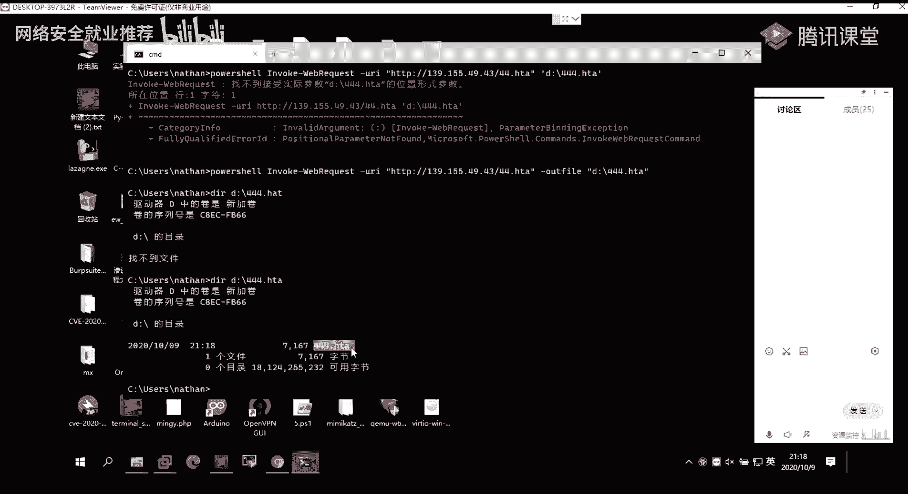

对吧。

好呃，其实我们也可以通过这样子的一个方法。

就是加这个dollar mv，就是保存到我们的一个windows下面的一个，tt目录下面，然后我们di市场下面的一个windows，对吧，可以看到已经就是存在了，这样子的一个文件是吧。

就是我们刚刚通过这样子的一个命令。

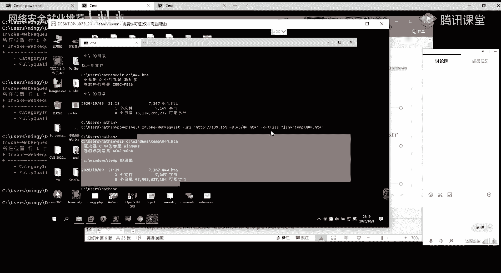

下载的这样子的一个hta的一个木马文件。

啊，呃以上的话就是top share的一个使用pasha的一个方，法来去进行一个文件的一个下载，以及木马的一个下载，其实我们这边的一个文件的下载的话，大家可以就是灵活的就灵活。

不要说局限于就只是一个文件对吧，就比如说你需要某一个工具对吧，或者说你你可以去下载任何，就是说这种文件的一个形式，你想要去把这个文件下载到啊，我们那个目标机器上面去对吧。

我们可以使用这样子的一个方法好啊，还有他在这边要提一下，就是这个invocal web request。

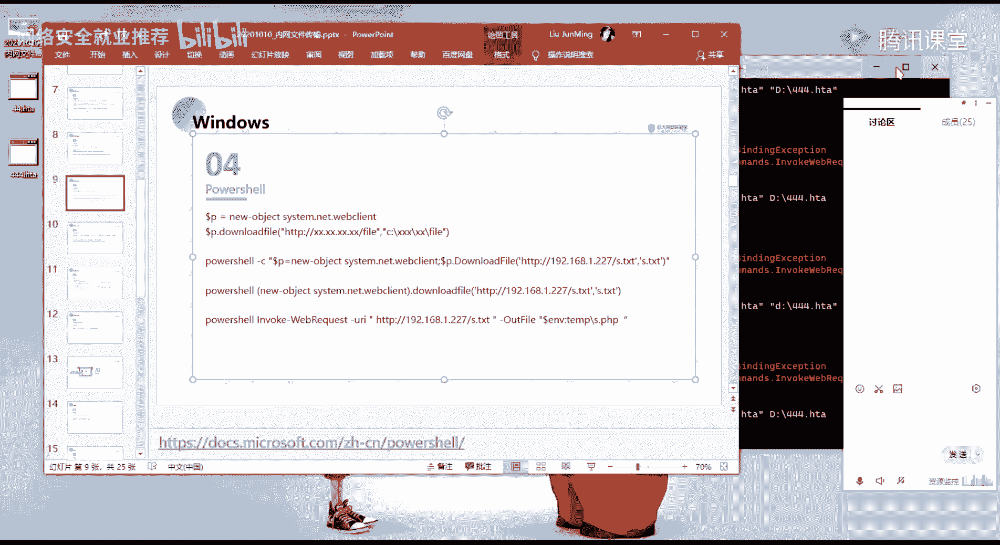

就其实我们刚刚的话，在这边我们通过help查看它的一个啊，使用方法的时候，在这边有一个别名对吧，就是iw r，还有we get cl，这这三个的话其实都是这一个的一个别名。

就别名是什么意思呢，就是说我们可以使用这样子的一个方法，来去调用它对吧，其实使就是使用这个就等价于就是使用的这个。

那么我们可以通过这样子的一个方法就是tosh，比如说干和i w r，然后的话按u i指定我们这边，4445，然后我们执行对吧，然后可以看到在这个d盘的一个目录下面，我们可以查找到这样子的一个。

刚刚下载的这个ht的一个文件对吧，就使用的是这个iw r，然后的话其实我们也可以通过使用we get，就pash加we get，就像we get，还有cl cl l。

这种的话是在linux下面的话一个命令命令嘛对吧，其实我们等会也会讲，然后在这边的话，它是作为就是在windows下面这个invoke web request，的一个别名，就其实如果你不记住。

记不住这这么长一串的话，你可以记就是we get，还有cl或者是i w r这样子的一个呃，这样子的一个方式，可以看一下44 五六。

都是可以的，cl也是可以的，我这边的话就不演示了，好哦，下面的话就是一个就是实际的一个例子，就是说通过power shell来去加载，我们远程的这样子的一个posh的脚本来反弹shell。

其实这里的话呃，其实我们后面再讲反弹shell的时候也会讲，你会讲这个就是利用posher的一个方法，来去加载我们的一个pshit脚本来反弹shell，以及来去执行，相应的就是说呃来去加载。

使用pcie脚本所写的一些工具，像比如说mini cut，mini cut的话，也同样的有抛shi的一个加载的一些脚本，是吧啊，其实前面我们已经有讲了，然后在这边的话，我们以这样子的一个实际的一个例子。

就是，来就是给大家演示一下，我这边刚通过msf vlog来去生成的，这样子的一个就是hoshi的一个脚本，这个脚本的话它是一个反弹shell的一个脚本，然后的话我把这个脚本的话。

就是我是在，这个机器上面，四这个的话是我已经提前生成的，有这样子的一个需要点p s，p s一的这样子一个抛弃的一个脚本，然后的话呃，首先的话我先在msf这边做一个精听。

就是今天我们等会我们在这边执行。

这一个通过pasha的一个方法去执行的话，他就会去加的我们这边防的shell的一个脚本，然后话反弹到我们这边那个msf。

所以呢在这边的话，我先今天建立一个今天器呃，这边的一个端口的话是8888899，没错，好已经尽力了，这个样子这样子的一个监听器。

然后的话，我们通过这样子的一个花絮的一个脚本。

来去加载我们远程的，在这个呃vp s上面的，这个pasha的一个长线的一个脚本，然后大家在复制的时候就复制我ppt的时候，一定要注意，就是一定要注意，就是你我建议大家就先在自己的这样子的一个。

编辑器当中对吧，你粘贴过来，因为你在编辑器当中的话，其实你就能够比较明显的去查看，就是这些标点符号，其实主要就是标点符号，就括号等等，这种一定要使用英文的一个形式，你使用中文的话就会报错对吧。

就其实很多时候，很多时候的这种命令的一个执行的一个报错，其实就是大家呃不够细心，就是你去细心的去检查，你的这样子的一些命令的话。

你会发现其实就是这种报错的话，其实很很很简单是吧啊，我这边的话在嗯，这一个机器上面吧，执行我的这样的一个跨线的一个甲板。

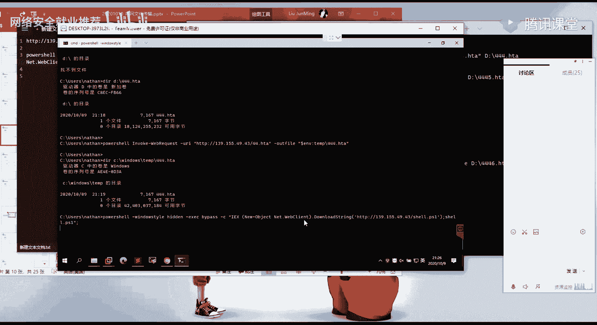

然后我在这边执行之后的话，可以看到在这里的话已经反弹回来一个shell，对吧，反正在一个shell的话。

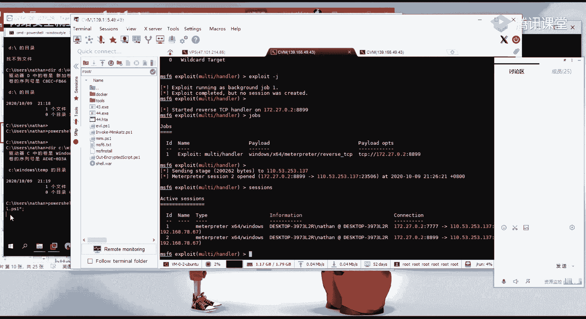

就是我这边所执行的，然后呃在这边他没断掉的话，是因为，我打开一个cmd吧，因为呃这边的话是一个就是这个windows terminal。

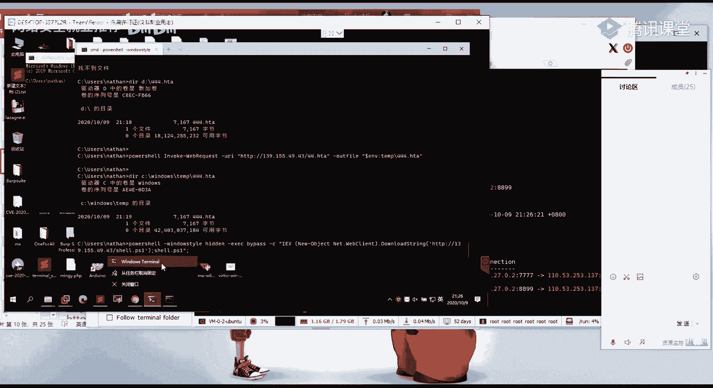

稍微稍微有点不一样。

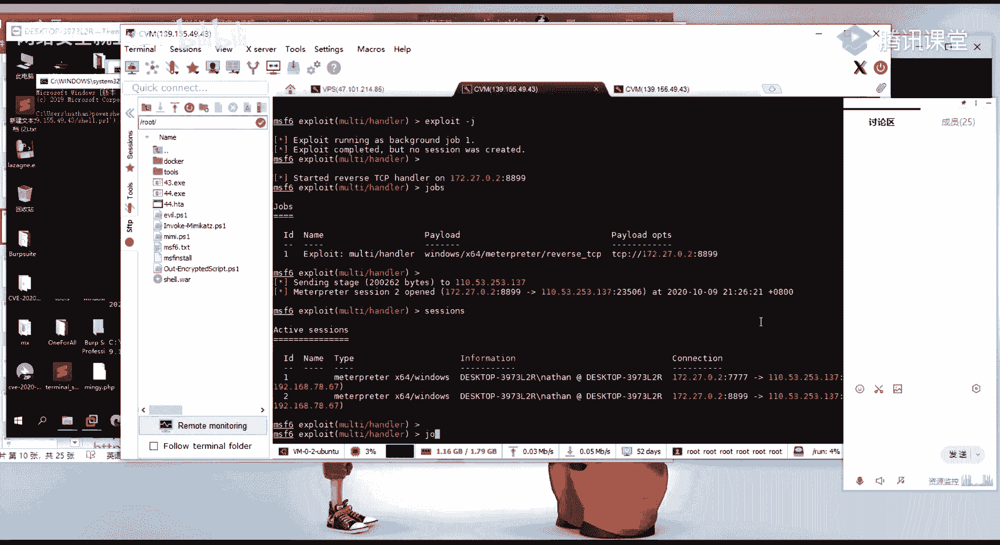

我这句话我再弹一个回来，我这边执行嗯，可以看到我在这边执行之后的话，它会就是刚刚所经历的那个cmd。

那个cmd的一个窗口，它自动的关闭了对吧，然后的话反弹回来，shi返回返回了一个筛选三对吧，对啊。

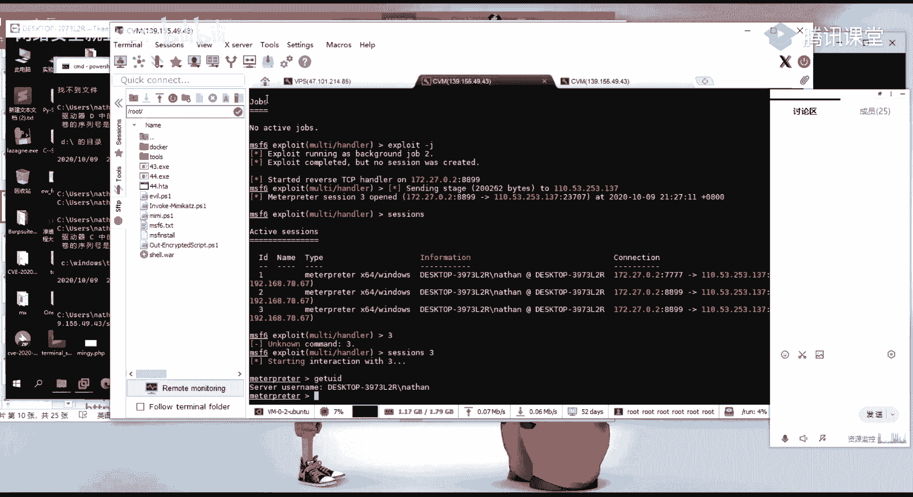

其实在这边的话我们再回过头来去查看一下，就为什么它能够去达到这样的一个效果，就其实主要的话就是我们刚刚我们这边的，这样子的一个参数啊，就这个干windows style啊，hide我们刚刚的一个效果。

效果的话就是我执行这个pasha的一个脚本，我在这个cmd窗口下面执行之后的话，它的一个窗口立马就关闭了对吧，然后它的一个呃达到这个效果的一个参数啊，其实就是这个这个这个参数，它的一个意思的话。

就是啊我们这边执行执行之后的话，它会去把我们的这个窗口给关闭掉，然后这个的话在这边的话，关于这个参数，它还有呃。

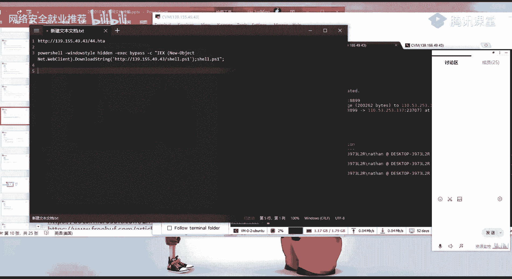

它还有其他的几种表示，我们可以在power shell当中来去查看，就是这个干windows style这个参数，它的一个意思的话，就是将我们的一个窗口样式设置为，就是noro的话。

就是正常就是正常的话，就是我们就是这样子的一个窗口对吧，然后minute，minute的话就是命令的话就是缩小嘛对吧，就是最小化maxi max的话就是最大化嘛，hide的话就是隐藏。

也就是说把我把我们这边的一个这个窗口，执行的这个窗口给隐藏掉。

然后我们这边所使用到的话，其实就是这个，然后其实在这边的话。

其实在这边的话不需要去写这么长啊，就是在抛弃当中的话，我们可以就是通常的话你看那些脚本的话，通常他都他们都是这样子写，就干w加hide，就不需要写后面的这一个这么长一串，我们直接通过gw。

然后的话还等来去进行一个指令就可以了，以及呃这边的杠e x e c by pass的话，就是呃指定我们执行的一个策略，而这个执行策略的话，前面有讲吧，应该我记得是有讲吧，呃我前面有讲吗，就是有讲的。

我有点忘了，前面在讲话学的时候有讲这个嘛，就是执行策略，知道的说一下，就大家知道这个嘛，嗯怎么没，嗯大家还在吗，在的扣个一不知道就知道的，扣个一。

我前面没讲吗，呃好吧，那那我在这我这边的话再讲一下吧，就在这边的话，刚刚e x e c by pass。

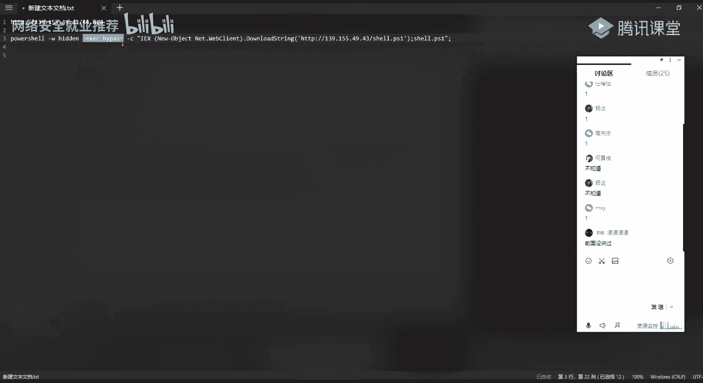

就是指定我们的一个执行策略啊，其实我刚刚在这里的话，其实也有做这样的一个操作对吧，呃在哪呢，这，输出。

啊这两，我在这边的话，其实也有去执行这样子的一个操作对吧，然后在这边的话我们可以看一下，就我这边去进行一个加载，我这边所写的这个抛弃的一个脚本是吧，然后在这边去进行一个加载的时候的话。

他有这样子的一个报错，他说无法去加载这样子的一个文件，因为在此系统上禁止运行脚本，这什么意思呢，就是说windows系统下面的话，它就是有这样子的一个，就是在pc上面有这样子的一个执行策略。

就默认的话它是禁止你去呃，去加载这种其他的一个脚本的，那么我们在这边我们要去加的，我们自己的这样子的一个，这种所写的一个脚本的话。

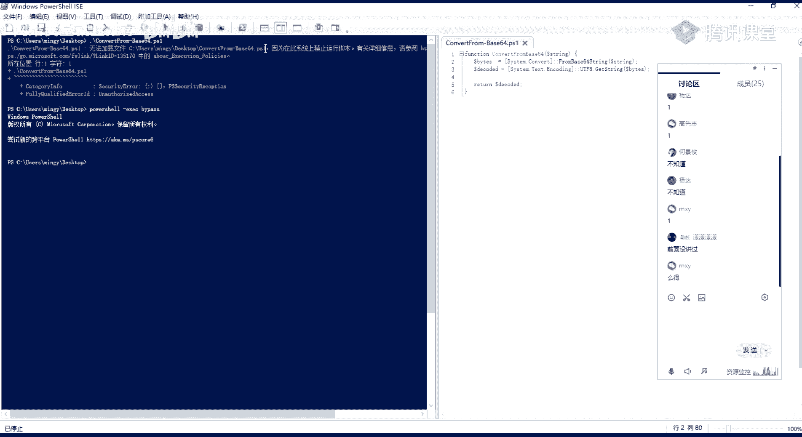

我们就需要去更改我们的一个执行的一个策略，然后这一个执行策略的话呃，我们可以在。

这，就是这个execute呃，police，这个的话就是设置当前绘画的一个，默认的一个执行策略，然后呃嗯，看一下好。

预习资料里面，我忘记了那个就是查看执行策略的那个，命令，基层面，就是这个在这边，怎么去查看那个车。

然后百度1下吧。

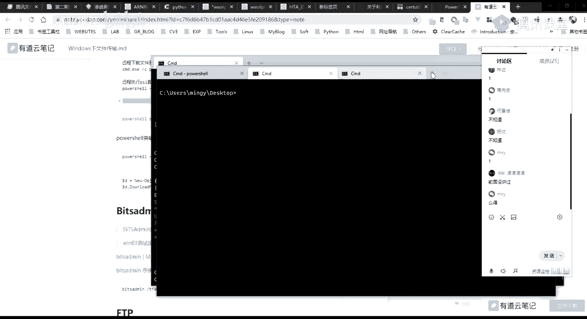

好直接啊，这个。

我们可以通过这样一个命令来去获取到，当前的这样子的一个执行测量，就是个r e string。

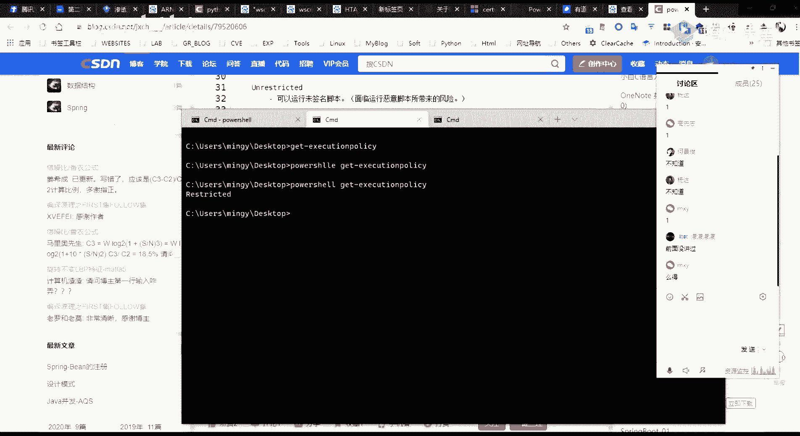

然后我们再结合这一篇文章，在这边的话，i street的话它是默认的一个策略，就是这个策略的话它是允许单个命令执行，但不能去运行脚本，也就是说我们可以通过project去执行命令。

但是我们无法去加载我们的一个project的一个脚本，它还阻止所有脚本的一个运行，然后还有其他的这种像one side就是可以运行脚本，就包括本地啊，还有远程的这样子的一些脚本。

它都是可以去进行一个运行的，然后remote sign的话，它是可以去运行，就是呃就是从远程的，就是从我们通过url地址，从infinnet上面去下载这种脚本，它可以去进行一个呃运行。

但是的话在这边的话呃，在这边的话，它是就是说需要去有相应的一个签名啊，其实实际的话就是说我们自己去写的这样的，一个交通上是没有这种签名的是吧，所以的话他是就不允许去进行一个，远程的这样子的一个加载。

但是他可以去加载我们本地的，就我们本地所编写的这样子的一个脚本，然后还有就是呃bypass，最主要的就是这个bypass就是我们经常使用的，就是不阻止任何执行下，也不会去显示警告，还有提示。

就我们可以通过指定我们执行策略，为这个by pass而去绕过前面的这样子的一些策略，就是像比如说我们要去加载我们自己的一个，远程的一个脚本对吧，我们可以就指定这个啊好执行策略为by pass。

然后指定执行策略的话。

我们可以就是通过这样子的一个方式啊，就是干ex e c，当然的话啊你也会看到有这样子的一个形式，就是干1p，就其实就是其实就是和执行策略的一个，首字母的缩写嘛，就是execution。

然后police对吧，就是干一批来去指定这样的一个执行策略，好，杠c的话，就是指定我们后面要去执行的，这样子一个脚本是吧，这边的执行的一个脚本的话，呃，其实跟前面的话是这一部分的话。

跟前面都是一样的对吧，主要的话就是这里呃不一样啊，这这个的话doload strike的话，这个的话前面有讲对吧，前面已经有讲过了，就是在讲那个就是信息收集的时候，用抛弃去加载的时候对吧。

大家一定要注意的话，就是这边的话是doload drive，然后前面我们这边的话是download file是吧，它这两个的话它是不一样的，这边的话东乐的fire的话。

那是就是下载就下载我们远程的一个文件，到我们的一个本地对吧，它是有文件，就是它是有文件的一个落地的，也就是说它是需要有这样子的两个参数，什么意思呢，就是说它是下需要需要需下载到本地嘛是吧。

然后他这边的一个dnload stry的话，他是直接把我们这边的一个脚本，把它加载到内存当中来去进行一个执行，就是说它是直接加载到内存当中，也就是说没有这样子的一个文件，就保存到本地的是吧。

然后主要的就是这个ie x，这个ie x的话就是就是啊这个invoke，invoke a expression，就是把字符串当做命令来去进行一个执行，其实就是执行我们这边的一个命令。

就是执行我们这边通过加载着远程的，就把我们这边远程的这个抛shi的一个脚本，把它加载到内存当中之后的话去进行一个执行，然后呃我们通常的话会使使所使用的话，就是书写的话就是这样子那个ie x。

然后他其实就是在问题里面的话，大小写其实呃不是很敏感对吧，就我们也可以通过ie x，就是小写的这样的一个形式是吧啊，呃还有就是windows style就通过这样子一个方法，还有就是这种非交互啊。

还有呃主最常用的话就是这个干员noop，就是抛弃控制台，不加载当前用户的一个配置文件，就呃其实我们前面的，比如说我这边的这个就用msf，生成了这样这样子一个party脚本对吧。

在这边其实它的一个使用的话就是这样子对吧，就是干n o p指定指定这个杠n o p这个参数，然后按w开的就指定我们这边执行之后的话，这边的一个窗口它就关闭了，然后杠一的话它其实是呃就是做一个兵马。

关于这里的话。

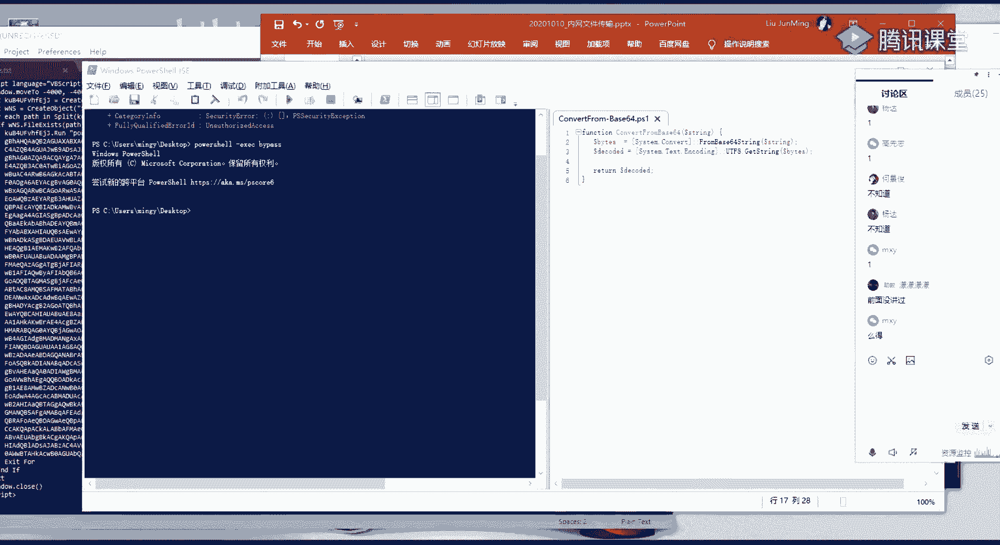

同样的我们，通过发现，来去查看一下。

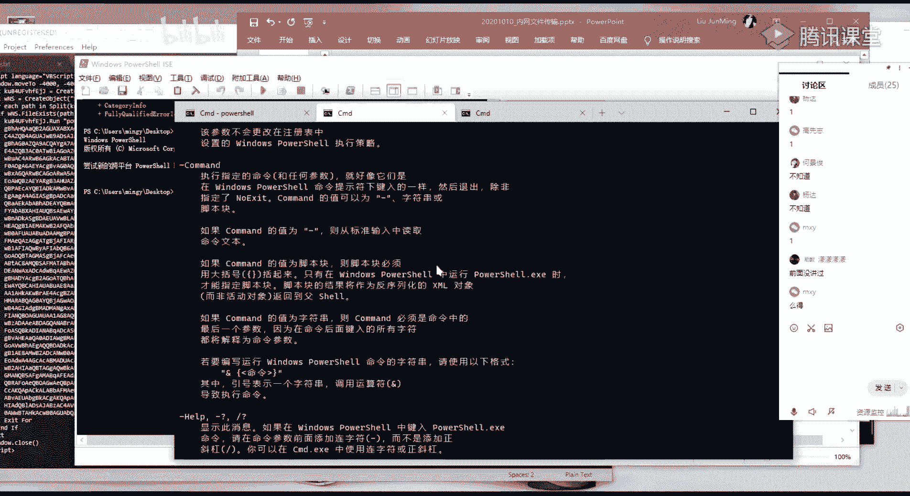

就这边的一个杠，而杠一的话它其实是这个encoder command，就是它是指令呢。

它其实是呃跟我们这边的这个参数。

它其实是同理的，就是这里的这个概念，它的一个作用的话，就是接收base 64的一个编码的一个字符串，也就是说我们可以通过干一参数。

后面，指定我们basse 64加密之后的一个字符串，它能够去对我们这边的一个base，64的一个字符串做一个解析，然后的话呃执行，这些的话都是呃。

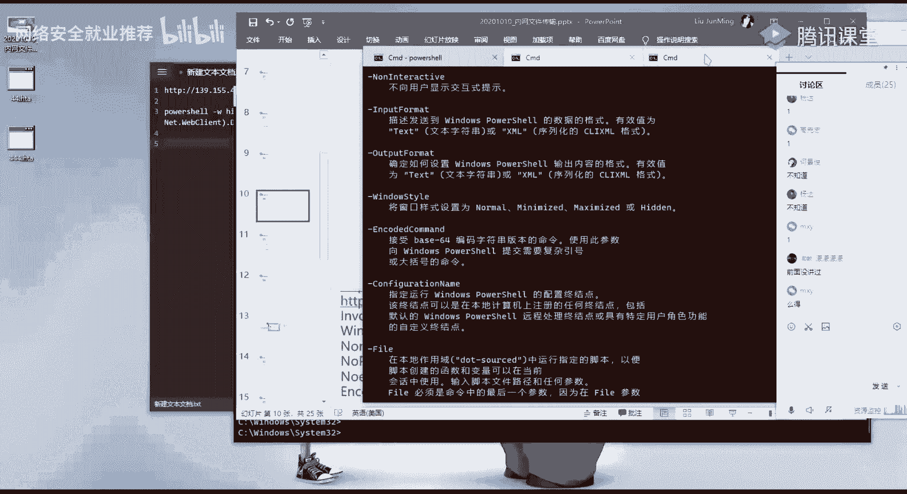

我们常见的这样子的一些参数啊，呃关于power share的这一部分的话，就啊这些呃大家能理解吗，就有没有什么问题，啊其实这些的话，我其实这些的话，大家就是你去啊看别人写的这些，或者说啊像这种msf。

msf它生成的这样子的一些脚本啊，这些payload啊，不这些木马对吧，你可以去就大概的去研究一下对吧，你不要不要求你说，你就是怎么不要求你说你知道怎么去写对吧，但是要求你去能够看懂对吧。

你要能够看懂他的这个脚本，它是干什么的，它有什么作用是吧，不要求你说你要去写这些，因为这个话你直接去直接就能够去生成嘛对吧，就方便我们直接去使用，但是的话你要去理解它的意思，不然呢就不要说你就知道用。

你，就是说有现成的这样的这个东西给你用，但是你不知道它的一个意思啊，配合，其实这些的话呃，你去百度1下，就是像这样子的一些关键字啊，你都能够去大概的理解它的一个意思啊，同理的话。

pasha的这样子的一些这样子的一些表示，就是我们其实通过就是这一些幸存的一个脚本，对吧，它的写法我们也能够去学习到对吧，呃那这里，是通过他的这样子的一个写法，我们也能够去学习了啊，都是就是常用的。

是都是这样子去写的，呃，有疑问了，没人回呀，都没有没人回我的提问，有有问题的扣一，没问题的扣二，或者说或者呃就是自己课后去做了才知道的，扣三，好我这一个选项一说大多都是选那个好，那行吧。

那我大家自己课后去再去做吧，好吧，关于这个的话，我这边的话就不多说了，呃，同样的大家自己去试吧，我就大概的说一下它的一个呃用法。

我们在windows系统上面的话，它同样的也有也有这样的一个命令，他就有这样的一个命令，它的一个作用其实就是相当于我们的一个，就是文件的一个复制嘛。

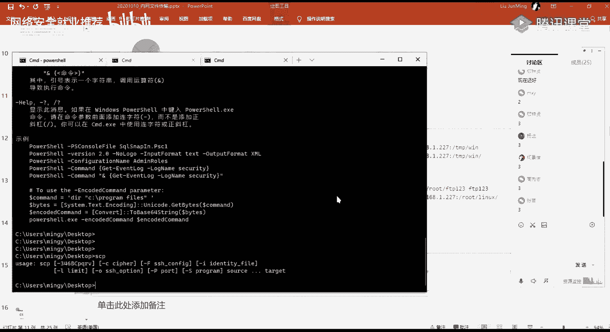

然后在这边的话，远程的一个文件的一个复制，像比如说第一个，第一个的话就是我们把我们本地的这样子的，一个vbs的一个文件，把它给复制到远程的这个啊，linux系统上面的一个指定目录，下面，文件的一个下载。

就主要的话也是用的，下载远程的这样子的一个，linux系统上面的指定的一个文件对吧，然后的话把它下载到我们本地，就是我们在windows系统上面的话，然后的话来去呃。

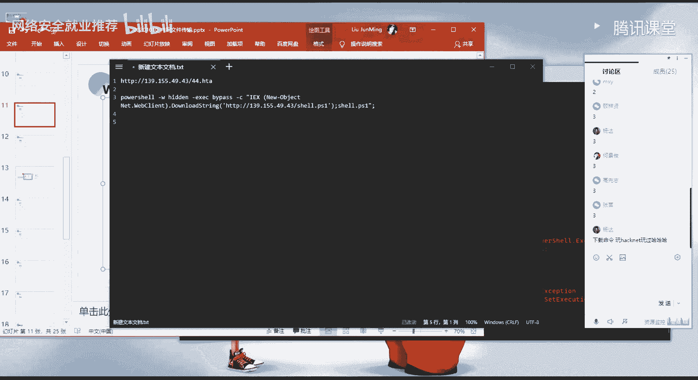

请求我们这边远程的，我自己的一个v p s的一个服务器对吧，然后的话我这边的一个文件在这个目录下面，就存放我自己的一个呃文件，就想要去上传到目标机器上面的一个文件，放到这个目录下面。

把把在远程服务器上面的这个文件，把它给复制到本地，然后这边的一个干拉的话，就是就是递归的去进行一个复制，也就是说它可以就是指定一个目录，然后他把这个目录下面，所有的文件都统一的复制到指定的一个目录。

下面，好第六个话就是windows的一个文件共享，文件共享的话，其实前面的话在讲那个啊，信息收集的一个命令的时候已经有讲了对吧，就说我们可以通过next year来去进行一个呃。

把我们的一个把远程机器上面的一个指定的，一个目录挂载到本地对吧，然后的话我们就能够去对这一个目录去进行，一个呃文件的一个操作对吧，我这边的话以这个为例。

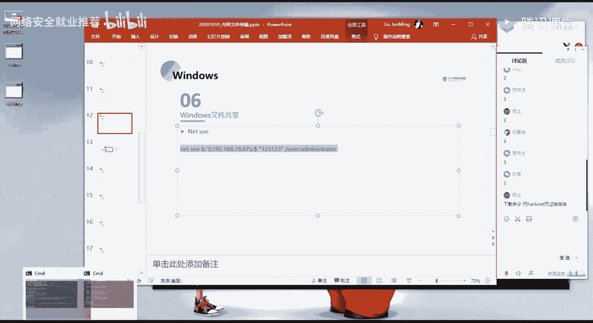

呃在这边，我通过就是，78。67，我通过我这边的一个本地的一个机器来去连接，我这边的这一个远程的啊，就是另外的这个机器啊。

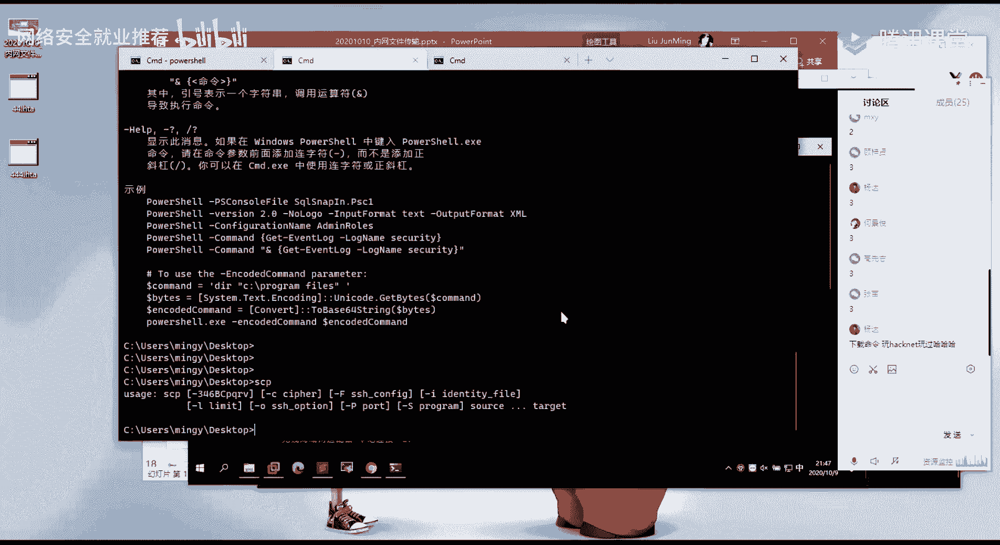

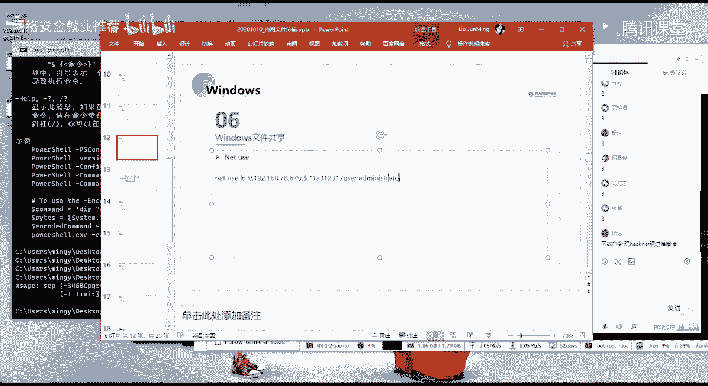

我这边直接复制了，然而这边的话我直接复制粘贴。

这边的一个命令的话，命令的意思的话，就是把我这边远程的这个，78。67的一个c盘，然后他把单把它映射到我本地的一个k po对啊，然后我在这边我映射成功之后的话，我后面贴钥匙可以查看到。

这边的话已经就是经历了这样子一个连接，然后的话我们可以通过dir黑盘，来查看，来查看到远程的这个c盘的一个目录对吧，然后我们可以通过就是copy的一个面具进，进行一个呃写入。

去进一个文件的一个呃下载是吧。

以及我们也可以在这个文件当中去进行一个，写入啊。

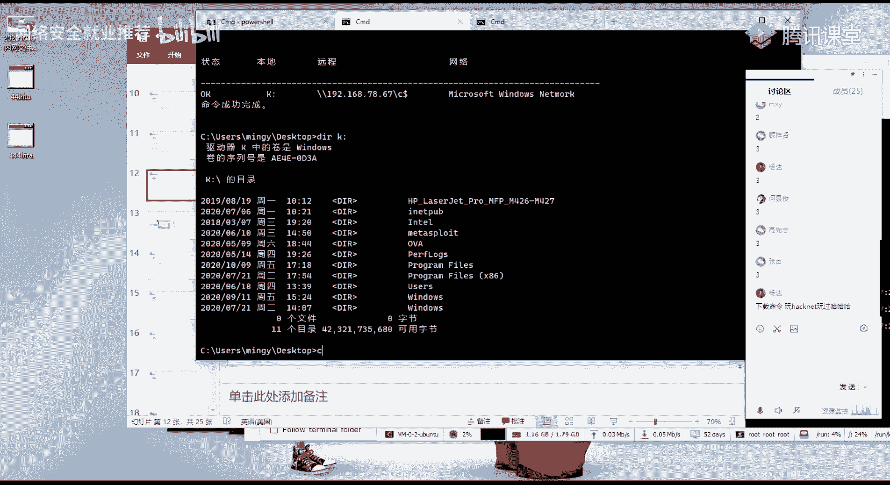

其实在这边的话，我们在就是在文件管理器当中对吧，我们可以看到有这样子的一个呃，这样子的一个磁盘，就是这个k名字为k的这个磁盘，然后这里的一个内容的话，其实就是呃这个远程的机器上面的一个内容。

我们可以看一下用户对吧，就是这个，对吧，那么我们就我们就同样的，可以去进行一个文件的一个传输，以及文件的一个下载以及写入，这个的话是一个windows的一个文件共享，但是这个文件共享的话。

就前期的话是你需要呃，知道你需要知道，就是目标机器的这样子的一个shell好吧，不是目标机器的一个账号密码是吧，以及就是说呃前面我前面我有讲嘛，应该没讲，就说我可以通过。

就是说我得到了一个机器的一个shell对吧，我得到了这个机器的一个shell，然后的话我想要通过这个shell，呃怎么怎么跟大家说呢，而这里的话后面在后面应该会讲，会给大家讲，我这边的话先不说了。

就说我可以通过，就如果我不知道他的一个账号密码，但是的话我通过了，我比如说我在cs上面，我已经得到了一个呃内网机器的一个shell对吧，然后的话我通过他的一个密码哈，希什么的，我得到了他的一个密码哈。

希然后的话我就可以通过呃去生成一个令牌，以及去进行一个token的一个窃取，来获取到对应的就是说啊对应的一个权限，然后这个权限的话就是能够去访问到，就是说这个用户他有权限去访问到这个，远程的这个机器。

那么我可以通过token的一个注入，token的一个窃取，来去进行一个得到这个用户的一个权限，来通过net柚子映射呃，访问到这个原本是访问，原本是没有权限去访问到的这样的一个机器，这边的话提一下。

可能这样说大家会比较晕，后面的话会给大家讲，就是讲那个呃token的一个注入，和token的一个窃取，就令牌的一个窃取以及生成，而以上的话就是windows下面的一个一些文件，查内网文件传输的一个方法。

其实，其实windows下面的话，主要的话就是用的它的一个系统当中所自带，就有的这样子的一些命令行的一个工具对吧，我们其实可以知道，就是说这样子的一些命令行工具的话，我们就直接能够去进行一个使用。

而不是说我们还需要去额外的去进行，一个文件的一个上传对吧，因为我们原本就是需要去通过这样子的一，些方法来去进行一个文件的一个上传对吧，以及文件的一个下载，然后第二个的话就是linux下面的一些文件。

下载的一个命令啊，linux的话相比windows的话就简单得多了，就这一写，首先第一个就是we get，we get这个面的话应该不需要我做过多的一个，下载命令往hk net玩过，你说的是哪一个。

linux这么少是什么意思啊，就你是说我这边列的就少了，就其实常用的就就这几个嘛，如果还有其他的话，像这些的话，其实你在练习室里面的话都是常用的呀对吧，像we get cl都是去进行一个文件的下载吗。

还有的话你可以通过就是nc nc还有sf tp，呃然后在这边的话，we get在这边的话应该我不用多说吧，是我这边的话我就就呃略过吧好吧，就其实主要就是这个gao的一个参数。

就我直接通过we get来指定我的，就是要去进行一个下载的一个呃链接对吧，我就能够去下载到这个资源，然后的话我想要去把我这边下载那个文件，就是保存到指定的一个文件名当中是吧。

就使用这个干大写的o的一个参数，详细的一个使命令的一个使用的话，大家看预习内容好吧，我都把就是这些东西命令的一个使用，所涉及到的一些内容都放到了预习内容当中，因为这一些的话就是没有。

没有很多的一个可讲的对吧，自己自己看一下，就自己看一下，以及自己试一下就会了啊，c o l也是同样的，就cl的话这个工具的话也是我们常用的，是它的功能的话其实也有很多，就是他那个重要的话。

就是用来请求web服务器的一个命令，命令行的一个工具嘛，就是我们通过命令行的一个方式，使用cr来去进行一个web服务器的一个请求，就是我们可以通过cl来，比如说常见的这种get请求post的请求对吧。

我们都是可以用这个命令，用这个cr的命令来进行一个属性的，然而在这边，我这边的话就列举了这样子的两个，就是我们通过cl来去呃，下载我们指定的一个啊资源啊，我这边的话我就不多说了，然后第三块就是nc。

就是nc的话呃，关于nc大家了解多少呢，就是呃有了解吗，应该应该都有用过吧是吧，nc这个工具就是net cat，他是网络工具中的一个瑞士军刀，就它是通过tcp。

还有u t p的这种协议在网络当中去读取数据，就我们经常的话会用sc区，进行一个端口的一个监听，以及呃反弹shell对吧，然后其实它不仅仅有这些功能，它还有就是说我们可以通过c来去进行一个。

像比如说端口扫描，就我们可以通过mc来去进行一个，端口的一个探测，然后的话趋近于零件，就呃这里的一个就正向连接，反向连接的话，在法兰西有的时候会给大家具体的讲，在这边的话啊，我就不多讲了。

然后主要的话就是这边传送文件，就我们可以通过mc来去进行，一个文件的一个传递，具体的一个使用的话呃，我这边的话写的很清楚了，就是关于这个呃它的一个使用，我这边的话呃还需要我讲吗，应该不需要吧。

我们看一下这边的一个例子吧，就是呃我这边的话通过cat file，然后nc gl 1234，就这边的这个意思的话，就是我cat file就是呃查看这个fire的一个文件嘛，对吧，我们cat的话。

cat这个文件的一个内容的话，我操作总感觉说的话不是很好很好很好说啊。

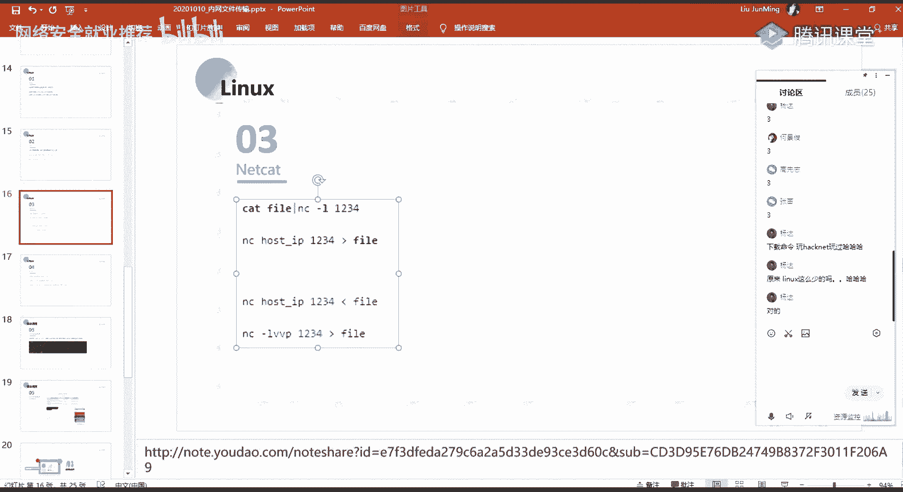

我们知道linux下面的话，我们可以通过cat命令，有点卡，在历史下面的话，我们可以通过cat里面去查看，来去查看这个文件的一个内容对吧，我说，对吧去，嗯就这一个14点hpv吧是吧。

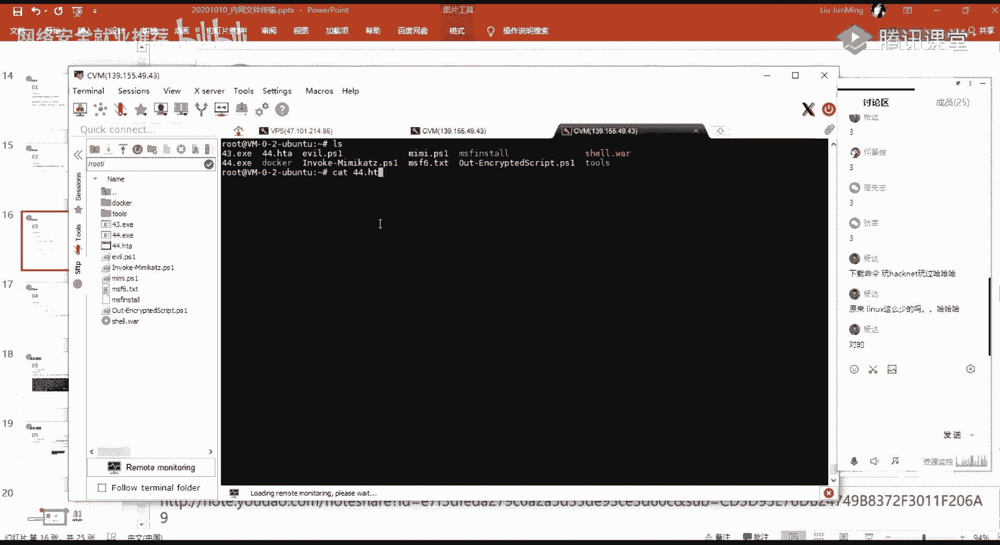

我通过cp的话，他会能够去查看这个内容，然后这个内容的话，他其实输出在我们这边的一个控制台当中的，对吧，好的话，我们这边通过这个管道符，这管道符的一个意思的话，就是把前面的一个命令的一个执行的一个输出。

作为输入对吧，然后其实这边的一个输出啊，就是这一部分，然后这边的这一部分作为一个输入的话，就是把它输入到了这边，我们通过nc的话会监听一个端口对吧，然后这里的这一句的一个意思的话。

就是呃把我们这边这个fire的一个文件，把它给就是呃传递到我这边，今天的这个1234的这个端口，然后的话我们在远程的这个机器上面，我可以通过mc来去连接这个端口，我这边建立一个连接之后的话。

那么我就可以去获取到这边，file的这个文件的内容，然后的话把这个文件内容，把它给重定向到我本地的某一个文件当中，下面的话也是同理啊，就是呃方向不一样的啊，就是呃从目标机上面到我的一个攻击机吧。

就原理的话呃都是这样，主要他就是这个管道符及重定向符的一个意思，然后第四个的话就是s f t p，s f t p的话，也是我们就是在用上面去进行一个，文件的传输的话。

就常用的是就前面有的同学说的那个叉叉，需要插tp对吧，这种的话其实都是像，比如说这都是使用的这个sf tp的这样子的，一个，就是这个现在比如说我这边使用的这个工具，你看到了吧，这sf tb嘛是吧。

就sf tp的话呢，它是就是它同样它使用的一个端口的话，其实就是s h的一个端口，因为它所使用的是呃就是跟ssh是一样的，就是你s c取得一个端口是22号，那么你sf tp你去连接的话。

你去进行一个文件传输，连接的话也是使用的22号的一个端口，然后呃在这边的话列举了这样子的三条命令，就是通过sf tp去连接到我这边的一个，远程的一个机器上面，以及通过干大写的p指定端口。

以及通过干小写的i指定我们的一个私钥，就是说去进行一个免密的一个登录，然而第五个的话就是一个电传输数据，这边的话就是给大家介绍一个小技巧吧，就是linux下面的一个数据传输的一个技巧。

就是我们可以通过dns来去传输，我们的一个文件的一个内容，具体的一个方法就是这样子，我通过cat test啊，我首先在，而使用的话就是使用一个dns log。

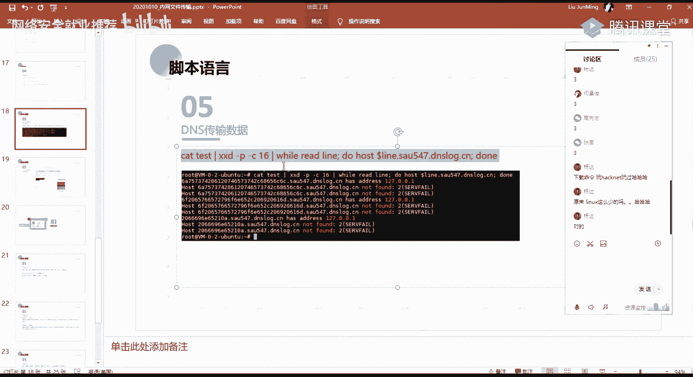

我们先来看一下效果吧，然后再给大家解释一下这个命令的一个意思。

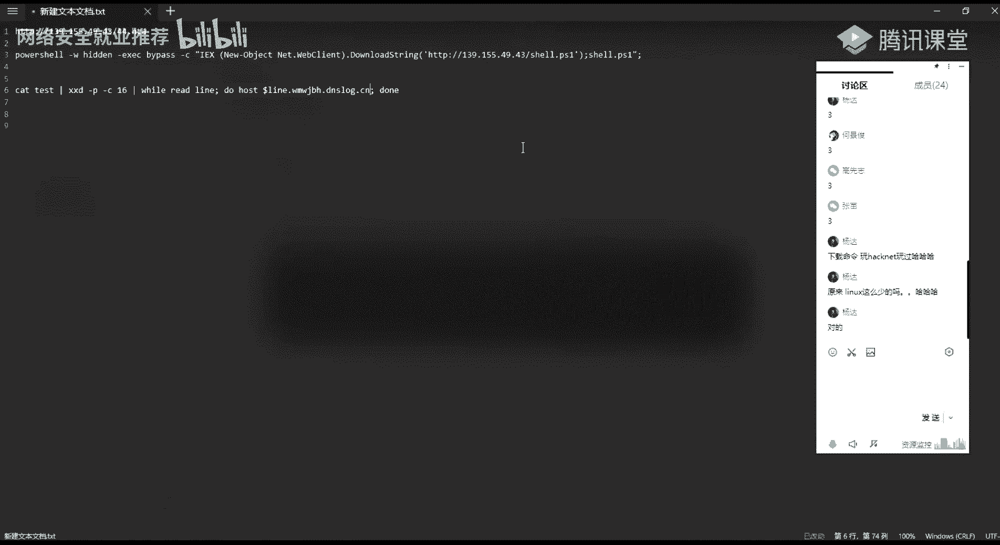

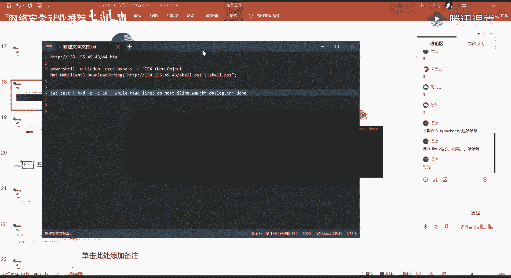

然后我这边的话，我在我的这个机器上面，随便找找一个，呃就这个，啊我随便写一个，我就写这样子的一个内容是吧，然后我就通过这样子的一个命令，谢谢执行之后的话，它会有这样子的啊，一个请求。

然后他会有这样的一个请求，然后我们在这一个dns logo上面的话。

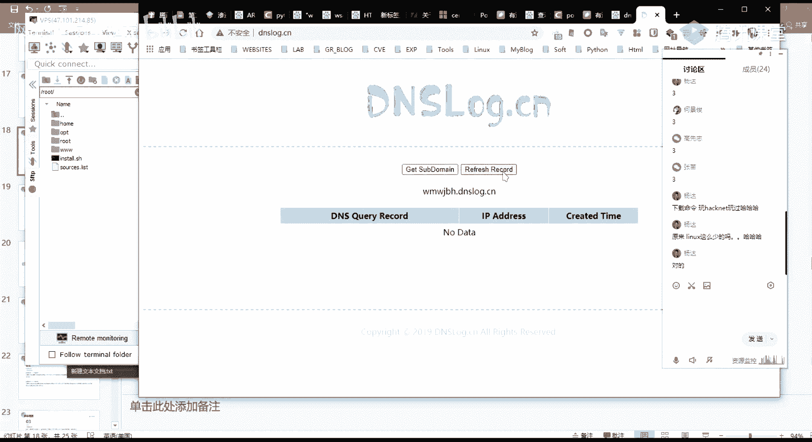

能够去接收到这样子的他的一个dns的一个请求。

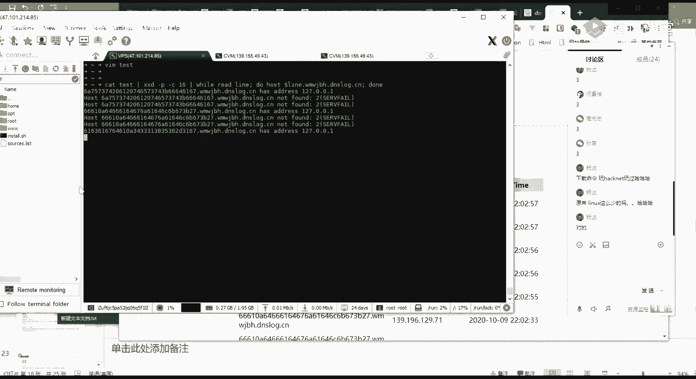

怎么要等一下美团。

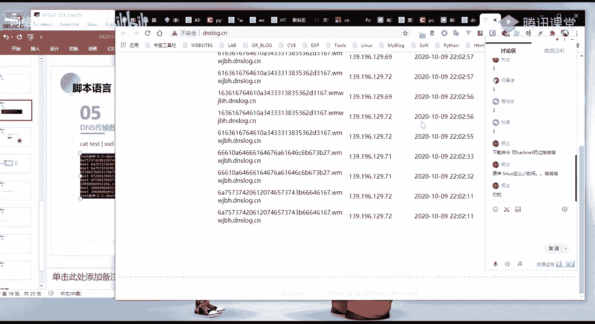

你什么都没拿了。

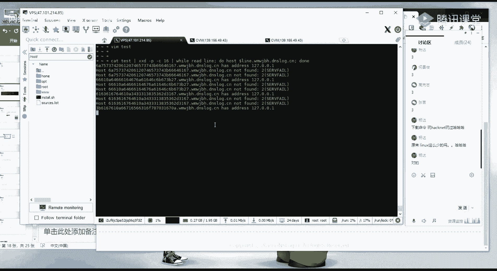

我这边直接停了吧，应该就这些吧，好呃这边在这边，我这边执行命令之后的话，我们在这个电logo这个平台上面的话，就有接收到有这样的一些数据对吧，然后其实这里的这一部分内容的话，其实就是我们所需要的。

然后这边的这一部分内容，其实它是做了一个就是hex的一个加密，然后我们可以通过呃像在bp当中的话，我们可以通过这样子的一，个方法去把它解密出来，然后我们只需要把这边的这一个数据。

把它做一个hex的一个简历，我看一下，打开的音，啊我把这一部分的一个内容做一个解密，解密之后的话，就是得到的是这样子的一个东西对吧。

然后这一部分的东西的话，其实我们test这个test的文件我们可以看到，其实这一部分的内容的话，其实呃，根号a g a，就是这一部分对吧，就这一部分，然后为什么是截取的这部分等会会输对吧。

我们可以看到就是这一部分是，然后呃因为这里的话是最后的这个请求。

我们前面的这一个的话就是，对吧，前面的这一部分的话就是从这边开始，就是这一部分的一个内容对吧，那同理还有其他的这一些的话，我就不一的复制了，就这边的前面这部分内容的话。

其实就是我们这边文件的这一个内容是好。

我们回过头来再去看一下这个命令，他是干了什么，他为什么可以就是达到这样的一个效果，然后同样的这边的话，我们就是用这一个管道服对吧，把我们这边ttest所输出的一个内容，把它作为这边的一个输入。

这边的话就是使用的是这个叉叉，b叉叉d的话，它是一个就是linux里面的一个命令。

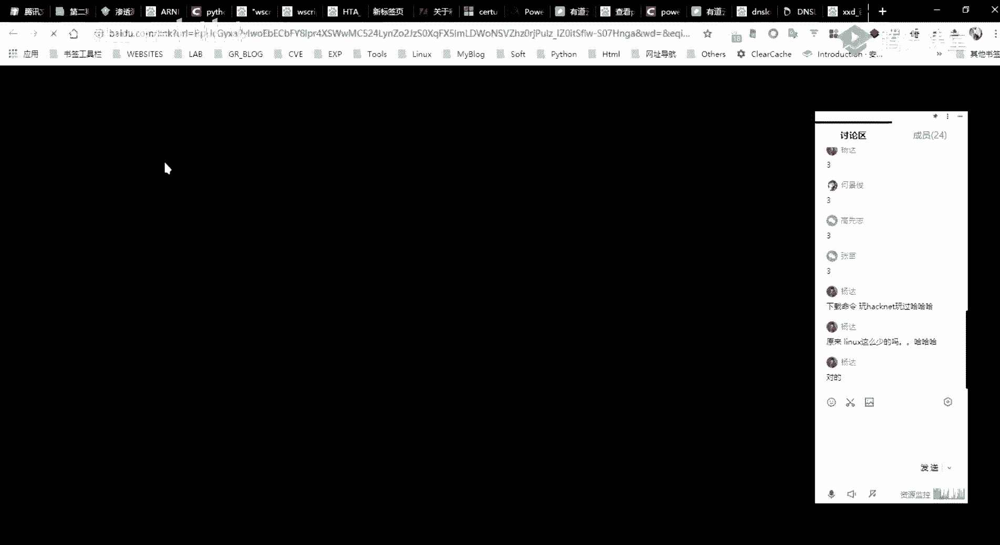

叉叉d的话它是一个二进制的一个查看命令，它默认将文件显示为16进制的一个字符串，也就是说我们可以通过这个叉叉d的这个命令，把我们这边test的一个文件内容，把它转化成为16进制。

也就是我们的这边的一个hex的一个数据对吧，然后他这边的这两个参数的话，我们主要看作一个杠c，杠c的话就是呃指定我们这边的一个长度呃，看一下，怎么没有，杠c就杠c的话就是指定我们这边的一个就是。

说要去呃转换的一个数据啊，就是把它转化成多长的一个长度好，因为我们这边的话，我们这边呃。

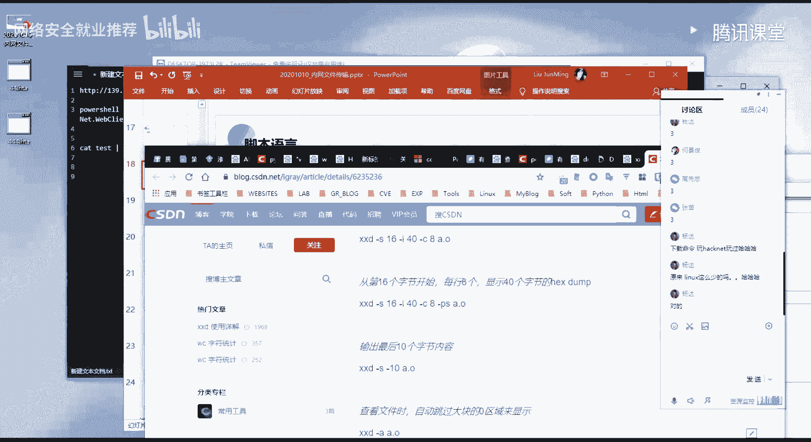

这个我们这边所输入的这个数据对吧，它每一行的话它它不仅仅有，就是它有我们不知道他有多少的一个数据对吧，所以的话我们每隔16行，就是每隔16个字符，就把它作为把它进行一个呃，换行。

就是把它作为一行的一个数据进行一个输出。

而不是进行一个输出，作为一个就是进行一个兵马，就把那兵马成为一个16进制对吧，用叉叉d就是每隔16位把它编码成一个呃，16进制的一串数据，其实就是我们这边的这一串，像这样子的一串数据啊。

这个的话这一串的话就是呃，每16位所编码的一个hex的一个值，然后的话它编码之后的话，我们再用这个while循环，就是这段话是一个需要的一个脚本的一个写法，就是一个y一个循环的一个写法。

就是呃通过read去读取每一行，因为我们前面的话是每每16个字符，把它做进行了一个编码的话的话，作为一行对吧，那么它读取这一行之后的话，他会做做一个这样的一个事情，就do的话就是做了，就他读到一行的话。

他就会去进行一个呃请求，他会啊去请求我们这边的这个域名，然后这边的这个域名的话，其实就是这里的一套内容，就是我们这边把我们前面读取到了一个，16进制的一个数据，把它给到了这个lion。

这个呃这个值这个变量对吧，到这边的话就是作为了一个变量，然后的话去进行一个请求，然后请求之后的话，他会请求到我们这边的一个dx的一个，logo的一个平台，然后的话把我们这边的一个文件的一个数据。

把它给带出来啊，我们在这个话就能够去接收到它的一个数据嘛，这个话呃就是一个小技巧吧，就在linux下面的一个就文件的一个获取，文件读取的一个小技巧，呃第三部分的话就是脚本语言，脚本语言的话。

我这边的话就只介绍了这几个，就是呃脚本语言的话，首先第一个的话就是菲律宾，菲律宾的话一个写法呢就像这样子，其实主要的就是这两个函数。

就是这个file put content以及file get content，这两个函数它的一个作用啊，我这边的话也写了，就是首先这个file put content的话，就是加一个字符串写入文件。

然后file get context的话，就是将整个文件读入一个字符串，然后我们使用这两个函数，就能够去达到一个这样子的一个，就是读取就获取远程远程文件的一个内容，然后的话把它保存到本地好我们来看一下。

就详细来看一下这段话，主要是用这个far get contains，来获取到远程的这个url的这个资源，然后的话把它读入一个字符串是吧，就获取这一个远程文件的一个内容，把它写入到一个字符串当中。

然后的话我们再把这个通过five hundred contense，将这个字符串写入到这个文件当中进行，就通过这样子的一个方法啊，进行了一个文件，就远程文件的一个呃下载，然后关于这个还有就是菲律宾杠啊。

这个杠杆的一个参数的话。

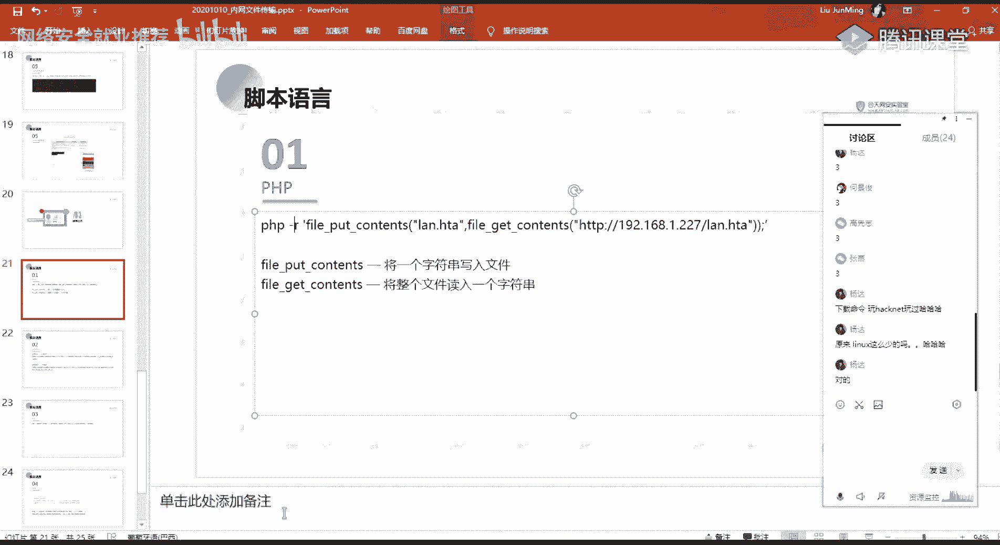

其实大家可以，如果你在一个系统上面，有菲律宾的一个环境的话，我们可以通过菲律宾再起来查看。

我去，我这个没装。

我们通过p h p杠h来查看它的一个参数，然后主要的就是这个杠啊，这个参数这个干扰参数的话，我们可以看一下它的意思就是run ph b cord。

without using script targets，就是我们可以就是没有这样子的一个呃，就是我们知道p h p的话，它是需要包就p h p的一个代码，它需要包裹在这样子的啊，就是经括号当中对吧。

然后经括号问号这样子的一个就是呃，标记好的话，我们使用这个干拉上数的话，可以就是执行这样子的一个ph p的一个代码，然后的话可以不使用这样子的一个标记，就其实在这边的话。

其实到这边的话，其实我们这边的话就是一个pp的一个代码嘛，对吧，然后的话我们像正常的这样子的话，我们需要把它保存成ptp文件的话，我们需要加这样子的一个就是这样子的，需要加这样子的一个标记对吧，来表示。

我们我这边的话是一个菲律宾的一个代码对，然后我们在这边的话，我们在对方使用这个gala参数的话，我们可以直接就是执行这样子的一个，ph的一个代码，同理python就python的话。

他的一个执行就是python的一个代码，就是杠c的一个参数，然后呃在这边的话就是我这边写练了两个，就是python语及python 3，下面的一个远程文件的这样子的，一个读取远程文件的一个呃，下载写入。

其实主要就是用利用到这样子的一个ur，lib to的一个ur open，就学过python的话应该都用过对吧，然后再开始上它就是用的这个ui lib的一个request，这个的话应该python的话。

其实因为python的话比较简单对吧，这个的话应该都能理解吧，不是而且现在python这么火，应该就在座的各位应该都有，就是有了解过吧对吧，至少也知道就是能够看得懂吧对吧，像这种常用的这种库这种啊。

you live to的这种请求这种库是吧，request的这种请求库应该都是呃知道的吧，好第三个号就是p呃，peer，还有这个绿by的话，这边的话呃我这边的话我就不讲了。

就你知道知道这两个东西可以去进行一个，这样子的一个，通过这样的方式来去进行一个，远程文件下载就ok了，呃呃其实我也没有去，没有去特意去学过这样子的，就pr跟rebi也是两个，就是一个脚本语言。

它都是脚本语言，呃像呃rebuy的话，就是我们那个msf对吧，我们那个msf，它其实就是使用的rebi这个脚本语，去进行一个冰写的，然后的话呃，就是为什么要去讲这些这样子的一个，就是就前面的话是讲了。

windows以及linx系统下面的一些呃文件的一个上传，下载的一个命令对吧，就这些命令的话，其实是系统当中它自带就有的是吧，那么如果说没有这样子的一些命令是吧，而且这些命令我们就说就有一些环境下面。

他没有我们无法去用这样子的一些命令，那么我们可以尝试去考虑，就是使用这样子的一些脚本语言，就是说如果说我们的这样子的一个环境，像我们的一个web服务器，它是使用的像这种l n n m p的这种架构对吧。

那么他会有这样子的，菲律宾的一个脚本环境是吧，那么我们得到了它的一个shell，我们就可以尝试使用ph p的这样子的一个脚本，就psp使用它系统就自带有的这样的一个，psp的一个环境。

而去进行一个啊文件木马的一个下载，同理的话python还有p2 v8 也是一样的对吧，就是说在存在有这样子的一些脚本环境的情况，下面的话，我们可以首先想到使用这样子的一些方法。

来去进行一个文件的一个传输啊。

以上的话就是呃本节课的所有的一个内容。

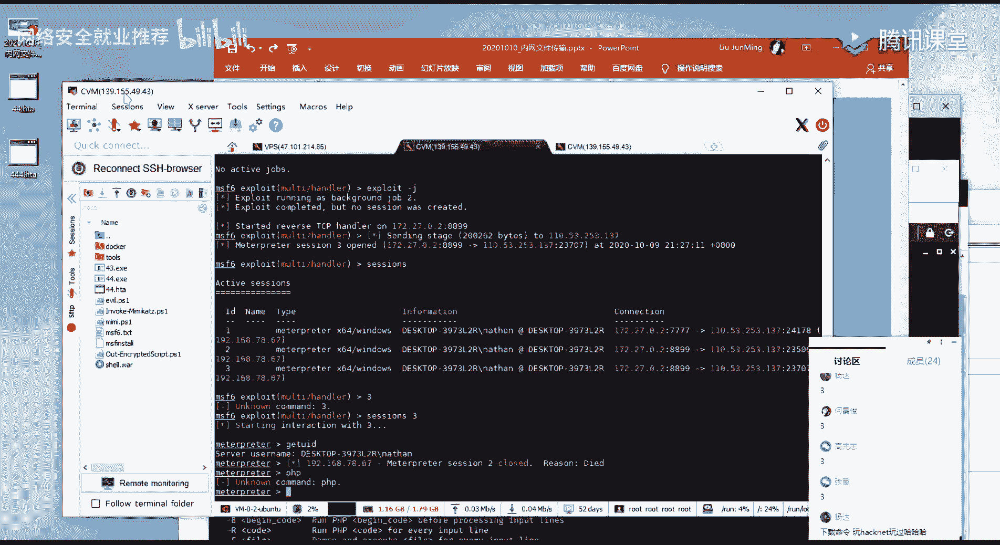

大家呃有什么疑问没，给我送花是没有疑问是吧，呃没有疑问的，给我送朵花吧，然后的话呃有疑问的直接在讨论区说吧，啊应该应该都是没有什么问题了啊，所以至少现在是没有什么问题了，然后呃大家课后的话。

就课后作业的话就还是一样的，就是自己大家自己去把这样子的，把我ppt里面的一个内容自己去进行一个操作，自己去进行一个尝试好吧，然后作业的话，呃作业的话就是我看了就是大家的一个作用啊。

其实呃交了的话都写的应该都是挺好的，就是呃，就是啊交了个作业的话都是写的挺好的啊，就是我们我这边的一个座位的话，就渗透测试相关的，就是至少现在的这些作业的话，都是呃需要大家自己去课后去动手做的，诶。

你在课上的话，你在课上听听我讲的话，像这些东西的话，你自己不去做的话，是是一时半会你是就是理解不了的，是你只有你自己去做了，你才有深刻的一个，就是才能够去理解他的一些啊意思对吧。

才能够去加深自己的一个印象啊，其实你们的这些作业的话，其实就是一个笔记嘛是吧，哎呦，就就这么点嘛，这这位同学，不止这么点吧，你你这应该是还没写完吧，我pp上的内容应该是不止这么一点的。

大家作业的话我其实也都有看，然后的话我如果有就是大家有什么问题什么的，就是我今天的话不是有有说吗，就是有一位同学的话，他的那个作业，他那个作业的话就是在作业里面都是有报错的。

但是的话他直接写写上去也没有管，就是说这个报错他是为什么，因为你这包说的话，你是直接用的，我ppt里面的一个那个v p s的一个i p，因为我vp的一个ip的话，以及那个端口。

我是那个呃用python开了一个app的一个server是吧，所以的话下载的那个脚本，我都是放在就是放在那个目录下面的。

但是我课后中的话就关掉了的，所以你使用我的那个ip也是访问不到的，所以的话会有那个报错，但是这位同学，你那个你这明显就是报错了，然后的话你你看你那个截图，你还照样能贴到作业里面。

我不知道是就是你是为了贴到作业让我看，还是就是说你不想去管这个，就我建议的话，你你碰到的这种错误的话，你自己心去解决一下，然后的话你要去找到，就是说为什么会有这样子的一个报错的，一个原因啊。

你不是说把它就是记录下来，把它呃写到作业里面的话就ok了，因为其实作业的话我虽然会看，但是我因为也有这么多嘛，我不可能看的很很很很仔细啊，也有可能logo，所以说最好的话就是你自己去把这个错误。

你自己先去解决一下，然后的话如果你解决不了，你再问我问问题的话，大家最好在群里问好吧，然后的话呃就是太晚的，就是已经很已经比较晚了的话，大家问我的问题的话，我可能就是呃看不到。

然后的话有可能就是比较晚的话，我不会回哦，好吧，就建议的话，就是就是最好的话是白天下午的时候，来去问问题，好吧，呃呃大家没有什么问题的话，呃也不跟大家大家多扯呀，现在时间也不早了，那么我们下课吧。

