# 【B站最系统的网络安全教程】北大大佬196小时讲完的网安教程，全程干货无废话！学完即可就业，别在盲目自学了！！！ - P64：第32天：CobaltStrike Socks代理 - 网络安全就业推荐 - BV1Zu411s79i

好好休息的时光总是短暂的，我们正式开始我们今天的一个好吧，继续我们今天的一个内容，然后呃上节课的话有说到，就是呃我们如何去再没有，就是说在8年端口没有过多的一个信息供，我们去进行一个测试的时候。

我们如何去进行这样子的一个啊，如何去对它做一个测试啊，这位同学啊，就张三同学的话说的挺对的，就是我们首先想的就是去对他做的一个，目录的一个爆破对吧，因为我们的我们知道我们的一个web服务的话。

它的一个它的一个这种就是目录的一个结构，它其实它是呃它是有相应的一个结构的，目录结构的对吧，然后的话如果我们其实当前访问的是一个空的，这样子一个页面，其实它的一个文件的话是这样子的一个呃。

是那个什么index的点，htm是访问的是这样子的一个页面，那么在当前的这个目录下面对吧，在这个web根目录下面的话，它是不是还有其他的一个页面，以及它是否还有其他的这样子的一些目录是吧。

然后这些目录下面的话，它是否还有其他的这样子的一些页面是吧，那么我们就可以通过这样子的一个目录的一个，爆破去进行一个这样子的一个呃尝试好。

其实在这边的话，在这边我们m s啊，我们的一个map的话，在这边有探测到这样子的一个public。

这样子的一个这样子的一个目录啊，啊其实我们在这边就可以去进行一个访问，尝试访问对吧，然后这个的话访问之后的话就得到了，它是在这边有这样子的一个页面，这个页面的话其实就是访问的一个index的电。

可以p的这样子一个页面啊，像这种的话，大家一定就是说你可能你访问目录，访问目录对吧，后面没有其他的这样这样子的一个东西，就是好像我们的一个这样子的一个web服务，它有这样子的一个默认的一个页面。

像我们的一个index dht m对吧，以及在这边是一个kp的菲律宾的这样子的，p h p的这样子的一个语言的话对吧，那么他会有这样子的一个默认的一个index，pp的这样子一个页面。

然后我们访问这个页面的话，就得到了这样子的一个信息，在这边它是一个新的，p p b5 的这样子的一个框架是吧。

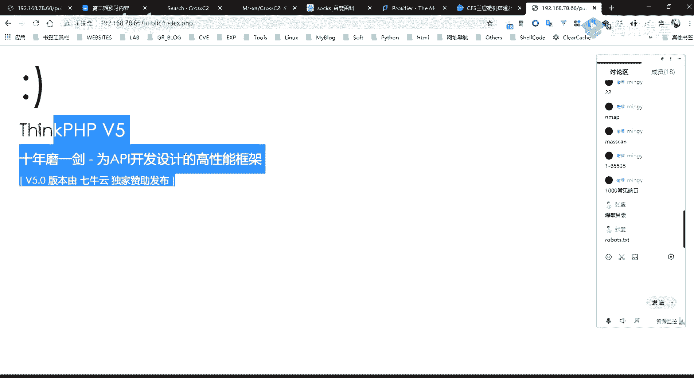

好我们再回过头来看一下ppt呃，在这边的话我们通过map对吧，对他对我们这边给定的是一个ip，做了一个基本的一个信息收集，就是探测到一个端口的一个存活啊，以及它所对应的一个符，那么我们下一步要做的话。

就是针对这样子的一些端口对吧，我们去对它进行一个分析的一个利用，然后像比如我们前面探测到21，22号的这种端口是吧，刚刚的这样子的一个这样子的一个表对吧，我们可以看到就21 22端口就常见了。

这样子的一个入侵方式就对，就包括，然后还有当然的话还有就是对应的，像比如说s2 端口的话，像这种opp，s s h的一个这样子的一个漏洞对吧，就是这样子的对应端口，它所特定的这种服务的一个漏洞。

我们可以去进行一个尝试，然后一般的话就是说我们会去对这样子的一，个端口，做这样子的一些弱弱口令的一个包裹对吧，像我们的一个ftp以及s c h的话，如果说我们它存在一个绕口令的话。

我们可以直接去进行一个登录，然后的话能够去得到啊对应的这样子的一些呃，权限，以及啊对应的一些文件对吧，然后在这边的话呃，我就大概的就是提一下，就是这样我们可以通过hydra呃。

就是hydra就呃这个是九头蛇吧，啊英文是加九和十是这样子的一个工具，这个工具的话它是一个密码爆破的，一个就是密码爆破爆破的一个工具，好我们可以使用这样子的一个工具，对这样子的一个对这个ip。

它所对应的一个所开放的一个服务啊，去进行这样子的一个弱口令的一个爆破，然后呃对应的3306的一个端口的话，呃如果说就是3306端口的话，我们知道它所对应的是一个数据库的一个服务，对吧。

然这样子的一个数据库服务的话，如果说它是允许我们的一个远程连接的话，那么我们可以尝试去进行一个远程的一个登录，也就是对这样子的一个3306的一个端口，去做一个啊，就是啊若可变成一个包括对吧。

当然前提是呃要允许一个远程的一个段落，然后的话如果一般的话，他是不会去允许你这样子的一个就是呃，3306端口的一个远程连接的啊，然后如果说你发现就是呃管理员对吧，它是通过这样子的一个远程的一个方式。

去管理它的一个数据库的话，那么你可以去尝试对他做一些包括啊，然后的话直接能够去得到它的一个，数据库的一个权限，然后呃这边还有888的一个端口，这个端口的话是呃他的这个靶场的话。

他这个靶机的话它是搭建的这样子的一个，他是用这样子的一个宝宝塔面板搭建的，所以的话它宝塔的话它有这样子的一个呃，默认的一个端口就是8888的一个端口，这样的话宝塔面板的话你要去访问的话。

你需要他会有这样子的一个，就是，他会去生成一个随机的这样子的一个呃目录，就是说你需要知道那个那个目录，你才能够去访问到对应的一个登录的一个页面，像比如在这边的话呃。

像比如在这边的话呃，大家可以就是在这边能够去看得到他，在这边他在宝鸡这边有写啊，就是这边后台的一个登录地址一密码，然后呃有他会有这样子的，就是你宝塔压装置的话，它会生成一个这样子的一个。

随机的一个字符串是吧，还有这样的一个目录，然后你需要去访问这样子的一个端口，以及它的这样子的一个目录，你才能够去访问到他的一个后台的一个，登录的一个地址，也就是说如果你不知道这个的话。

那么你您去对它做一个密码的一个爆破，都没法去做，也就是你访问不到他们是。

然后还有的话就是八零端口，八零端口的话，其实也是我们正常会去经常碰到的，也是我们经常能够去进行一个漏洞利用的，这样子的一个端口为8年端口的话，它运行着我们的一个web服务对吧，然后web服务的话。

它存在漏洞的一个可能性的话是比较大的是吧，然后我们在这边的话，也是主要的是通过这样的一个8年端口，作为我们的一个突破口，好我在八音端口我们前面访问对吧，通过访问以及通过录的一个包括。

来发现了这样子的一个页面，这个页面的话，它提示是我们的一个生产批k pv 5是吧，以及它的一个版本在这边也列出来了，那么针对这样子的一个一些信息的话，我们可以根据这些信息来去进行相应的一个。

就是说这种cm的这样子一个漏洞的一个紧锁，也就是通过百度啊，谷歌对吧等等的一个方法来去呃，紧锁这样子的一些紧锁，这个cm它所存在的这样的一个历史的一个logo啊。

然后在这边的话就是呃我们看到剩下b5 的话，就自然而然会去想到，就是之前报的这样子的一个远程命令，之前的一个漏洞，然后这个漏洞的话，它是我们可以去通过命令执行来去写入一句话，来去get share。

然而在这边的话，我们可以通过这样子的，通过这样子的一个pc来进行一个印证，再比如呃在这边的话，我们可以看到我们用的这边的第一个plc的话，我们这边用的第一个pc的话是这个对吧，然后在这边访问之后的话。

他他只选了一个pp for的一个信息，就输出了当前的啊，服务器它的一个kp for的一个信息是吧，然后在这的话我们就能够基本的判断，它是存在这样子的一个，远程命令执行的一个漏洞。

因为他在这边他执行了我们啊，在这边所写的一个pp infd，这样子的一个pp代码对啊，呃关于这个漏洞的话，大家可以自己自行的去检索，就是它的一个漏洞形成的一个原理，在这边的话啊。

我主要的话就是就是给大家介绍一下这边的呃，它的一个命令执行的一个构造，好在这边命令执行的一个构造的话，我们是通过这样子的一个function啊。

我们这边的一个function的话是这个就是一个call you，the function error，这个call you的方ction error，error，error的话大家可以去查一下。

就是而关于这个函数的话，我们可以就是说可以看到他在这边，像比如说一句话是吧，就是说这个函数的话，我们可以用它来去写一句话，也就是说这个函数它能够去执行啊，能够去进行相应的一个命令的一个执行。

然后这边的话呃，其实大家可以去看一下这个函数，它的一个具体的一个使用，就是它会把一个数组作为一个参数，来去调用一个回调函数，然后的话去进行一个执行，然后执行之后的一个返回的结果的话。

就是呃就是在这边我们调用了这个回调函数，它所返回的一个结果，然后在这边我们具体来看的话就是，具体看这边在这边的话，我们使用这样子的一个函数对吧，然后在这边有这样子的一个，virus的一个数组是吧。

然后virus数组的第一个就是第一个参数对吧，第一个参数的话，它的一个值的话就是这个ph平复，第二个参数的话为一，然而在这边的话，就是等于就是说它会把就说这边的这个函数。

它会把数组当中的这样的一个参数作，作为一个呃，就是去进行一个执行，然后的话在这边他去进行一个执行的话，那么他就会去解析这边的一个k t n for，我们知道我们在呃kp当中的话。

去解析这样的一个pp for的话，它就会输出对应的这样子的一个信息，对吧，呃然后的话就是第二个，第二个的话我们，同样都来尝试一下，第二个的一个plc的话，就是这样子我们执行执行之后的话。

可以看到在这边他返回的一个结果是这样的，一个3w了，然后这边的一个3w的一个结果，它是怎么来的呢，也就是在这边我们执行的这样子的一个冠脉，也就是说我们这边通过它的一个命令执行，执行了一个贩卖一个面。

也就是这边它的一个当前的一个权限的话，就是这样子一个3w的那个权限，那么他在这边他说他执行的话，他是执行着什么呢，他是怎么去进行一个执行呢，同样的它也是通过这样子的一个啊。

call you the function error，这样这样的一个函数，他会去把这边的一个system，就是说他把这一个数组当中的第一个参数，它作为一个回调函数，也就是system。

然后的话他会去呃，执行我们这边的这样子的冠脉，就是相当于就是执行的是这样子的一个system，关麦，然后的话就输出了我们这边的一个结果，这是第二个p o c，然后第三个的话就是我们可以用它来去进行。

一个publisher的一个写入，这边的一个写个web，需要的话，主要的话就是使用的是这样子的一个fire，put contains，这个发布跟tx的话就是呃前面前面应该有讲。

就fire content的话，它是把我们的一个就是把我们的一个字符串，就是存保存到一个文件当中对吧，就是加一个字符串写入文件当中，就使用这个发put contains。

然后在这边它同样的也是使用这一个函数，去进行一个呃构造，然后所执行的一个代码的话，就是这个five foot content，然后执行的呃，利用这个find food contains这个方法。

把我们这边的这个代码，把它写入到了这个需要点psp当中，啊其实在这边的话就是我们的一个一句话嘛，呃我这边的话呢血月三吧，在这边执行执行之后的话，他返回了这样子的一个25吧，好返回了这一个东西。

那就说明我们这边的话它是没有错误的，它是有正确的去执行我们的这样子的一个命令，那么我们在这的话就已经在当前目录下面，已经写入了这样子的一个，需要点123点k p的一个文件对吧，我们直接去访问没有报错。

那么说明就对了，就说明存在这样的一个文件，而且他已经做了一个解析对吧，然后我们在这边的话，我们就可以通过这样子的一个文件去进行，一个命令的一个执行各项，我们去进行一个执行对吧，以及去执行下面的一个命令。

小时执行快卖对吧，3w以及执行，id对啊，能够去进行一个命令的一个执行，然后在这边的话我们就能够去进行一个，用我们的一个需要的一个管理工具来去，得到这边的一个需要，嗯我这边的话是是擦掉，呃我这边的话。

这是我之前的，我就就用这个吧，然后在这的话我们就已经得到了他的一个shell啊，其实在这边其实可以看到，这边写入的一个文件的话，就是这个share 1230 p h p对吧，然后我们在这边的话。

就能够去对它进行一个操作，就是啊，就是这一个八零的一个端口的一个渗透测试，这边的话就我们就已经基本上已经测试完了，对吧，就是对这边的这个这些常见的这样子的，一些端口对吧。

我们扫出来的这样子的一些端口的一个测试，当然的话在这边我只前面这边的话，我只给大家提供了一些思路对吧，然后呃，主要的话就是我们这边的一个8年的一个端口，就是它的这个web服务作为一个突破口。

然后的话我们通过这个突破口来去进行一个得，到，这个就是外网的这个啊服务器的一个shell是吧。

也就是这个，然后那么我们现在的话得到了这个shell，就其实我们现在的话就已经进入了这个服务器，对吧，得到了这个服务器的一个权限，那么得到这个服务器的一个权限的话，我们下一步要干什么呢，大家回想一下。

就是我们前面的话就已经呃，前面的前面的内容的话，其实就是这样子的一个步骤，是我们下一步会去干嘛，就是说我们这边已经得到这个机器的一，个系是吧，那么我们下一步，有同学回答一下吗。

下一步的话同样的也是进行一个信息收集嘛，对吧，就是说你这边你得到了这个机器的一个线是吧，啊，其实跟我们前面在讲那个讲内网渗透好不好，其实不也是一样的一个道理是吧。

我们要去对内网进行一个收集的一个群体的话，就是说我们已经得到了一个啊，能够去访问内网的一个希尔的，那么我们在这边得到这个shell之后的话。

我们同样的需要去对它做一个信息收集嘛，因为你去做这样子的一个测试的话，你信息收集领不了的，就是第一步，因为你只你只有知道了对应的一些信息，你才能够去说能够去进行对应的一个操作。

才能够去进行一个测试。

好在这边的话我们呃具体的一个组，其实主要的呃其实准确的来说，他就是主机的一个信息收集啊，就说对我们这边得到这个主机对吧，去进行一个相应的一个信息收集，然后我们这边的一个主机的话。

它是一个linux的一个主机。

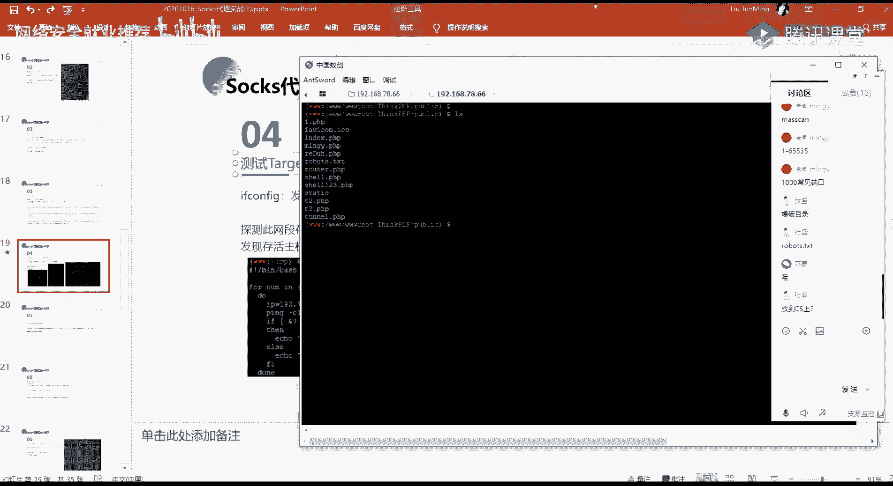

其实就是回到了我们前面讲的一个linux，主机的一个信息收集对吧，就对它的一个网络，像比如说查看它的一个呃网卡对吧，它它有哪些网段，也就是使用if config，然后其实我们在这边使用if通费。

空fig之后的话，可以发现的话，在这边他有两个网卡，就有这样子的一个e33 以及e37 的，这样子的两个网卡对吧，然后这边山上的这个网卡的话，就是我们的一个呃外网的一个ip嘛对吧。

我们就是通过这个ip进来的，然后这边的一个es 37的话，我们发现它有这样子的一个呃内网的一个ip，那么就说发现了有这样的一个内网ip，之后的话呢。

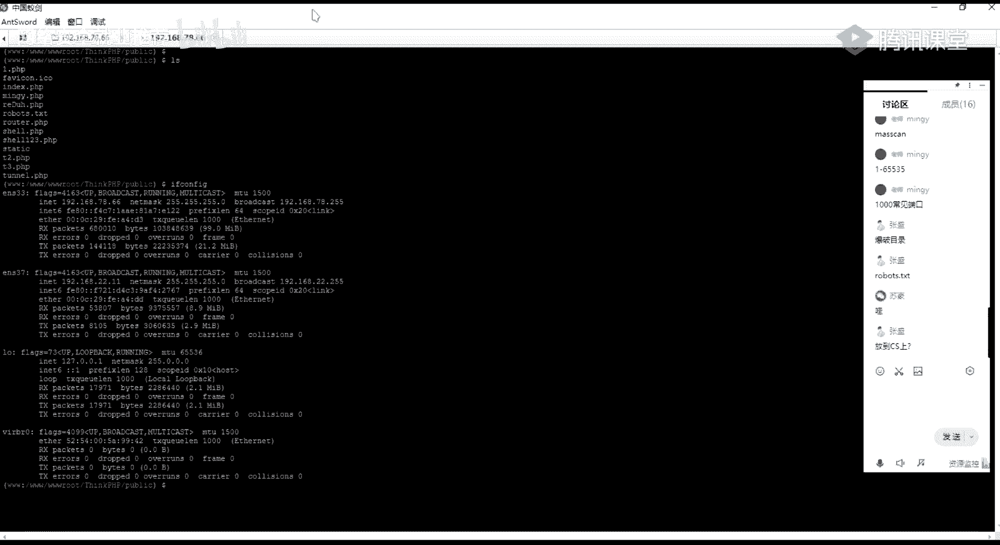

就是说他给了我们什么信息呢，也就是说当前的这个机器的话，它是可以去访问在这里的这个内网ip的，这个22网段的对吧，因为他在这边的话，它是呃有这样子的一个能够有这样子的一个，二二网段的这样的一个网卡。

我们可以通过这个网卡来去访问，二二网段下面的所有的一个主机是吧，而且这个ip的话它是一个内网的ip，也就是说这个主机它是能够去访问到，这个二网段的这个内网的，那么下一步的话。

其实就是进行一个呃内网的一个信息收集对吧，当然的话呃主机信息收集的话，我没有去说更多啊对吧，就是因为前面的已经讲了对吧，然后我们这边的话主要就是走走思路好吧，我这边对吧。

收集网络还有相应的一些进程啊对吧，以及去去进行相应的算，比如说我当前是一个三大本的一个权限是吧，后面也会讲就是去进行一个提权，是提前的话，那么你需要同样的，也需要去进行一个信息收集是吧，因为你要去确定。

就是说我们对这个机器它是否能不能去提权，以及能够通过什么样子的一些，方法去进行提取啊，还有其他的项目查看它的一个连接啊对吧，比如说，要查看他的第一个零件还有哪一些连接。

以及ip的一个就是有这样子的一个连接，以及它是它的这个连接，它是从哪一个api，从哪一个呃ip连接过来的，是我们可以去进行相应的一个信息的一个收集，然后下一步的话就是一个内网的一个信息收集。

就我们已经发现了，有存在这样的一个内网的一个网段对吧，那么我们就可以把我们这边得到，这个需要的一个机器，作为一个内通往这个二网络，内网的这个跳板机是吧，我们可以通过这个机器来去访问，这个内网了是吧。

那么我们首先第一步的话，就需要去探测这个二这个网段，它所存活的一个主机，它有哪一些存活的一个主机，因为我们需要去知道这啊，我们知道一个网站对吧，一个网段的话，它有很多的这样子的一些主机。

那么这些主机的话就是说呃，一般是1~254嘛对吧，1~254，那么这些主机我们需要去知道哪一些主机，它是开放的，就开放是什么意思呢，也就是说在这个网站下面有哪一些主机，它是呃开启的，也就是哪些主机。

哪些计算呃，哪一些电脑是吧，哪些服务器它是呃开启的，因为我们的一个啊定了我们的一个计算计算机，我们的一个服务器，你开启之后的话，它就会去有它会有分配这样的ip对吧，因为你只有你只有分配的ip。

你才能够去进行一个访问对吧，那么在这的话，我们就需要去对这个网站去做一个存活，主机的一个探测。

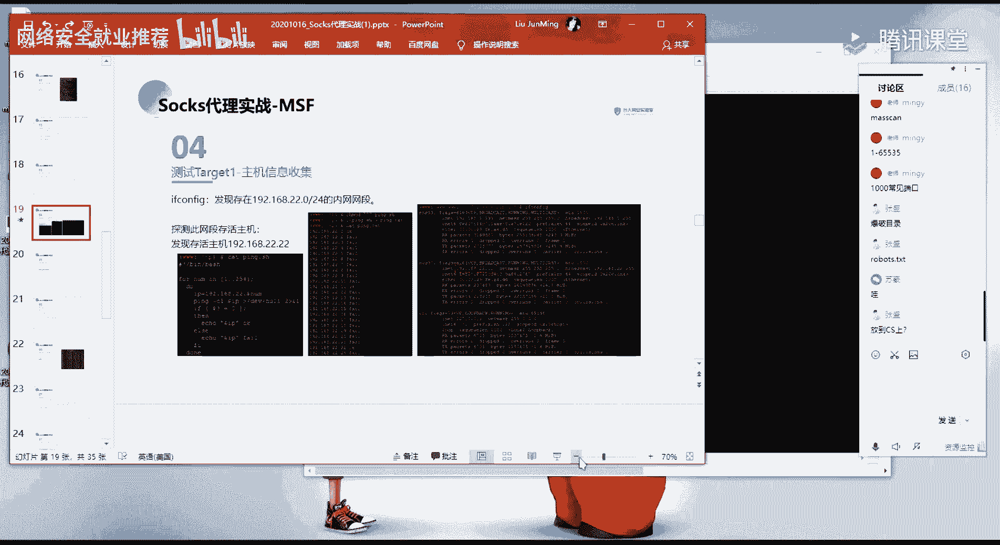

在这边的话我们使用的是呃，就是通过，这样子的一个方法，就是通过写了这样的一个希尔脚本，就是通过ping的一个方式，就而在内网当中的话，在内网当中的话，去用ping的一个方式。

去进行一个这样子的一个主机存活的话，是比较快的一个方法，当然的话就是说如果说它的一个主机，它是竞聘以及在内网当中，它是就是说你的一个pin的一个流量也是被禁的，那么就呃可能就不能去使用这样的一个方法。

然后我们在这边的话。

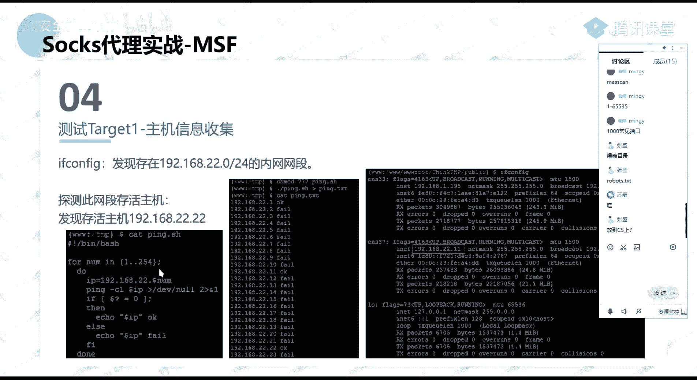

就通过这里的一个脚本，就其实这个脚本的话也比较简单。

对吧，嗯然后其实像内网主机的一个存活探测的话，呃前面不是已经有讲嘛对吧，后面的话有列举了很多的这样子的一个，电网存活组织探测的一个方法是，然而在这个话我们就使用这样子的一个，最简单的一个方法。

就是通过pin的一个方法，然后这边的话是写了一个小的一个脚本，这个脚本的话其实就是用了一个for循环，然后的话呃去定义这个网段的，从1~254的这样子的一个i p对吧，然后的话就通过pin的一个方法。

然后每一个ip的话就k一次，干11指定k的一个次数啊，其实在这边你会发现有同样的有这样子的一个，就是这样子的一个东西对吧，现在的话大家应该能理解了吧，啊就是呃干dv now的话。

就是把它在这样子的一个呃输出对吧，它会把它置为空好，二杠n一的话就是把我们的一个标准的，就是把我们的一个错误的一个啊输出，它会把它就是重定向到我们的一个标准的，一个输出。

然后下面的话就是做了一个基本的判断，就是判断它是否就如果你拼通了对吧，你拼通的话，那么它就会呃有相应的一个数据对吧。

就他你ping你ping的话不是会有那个比如说。

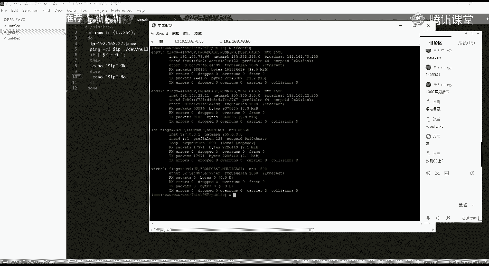

你听听一个那个，诶，怎么防不了，像我们在这边的话，我们ping的话，像我们骗这个78。66对吧，我们拼拼通了之后的话，它就会有这样子的一个数据返回对吧。

然后的话呃如果有的话就输出这个ok吗，没有的话就弄嘛对吧。

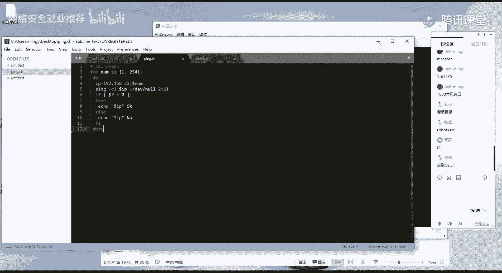

然后呃在这边的话。

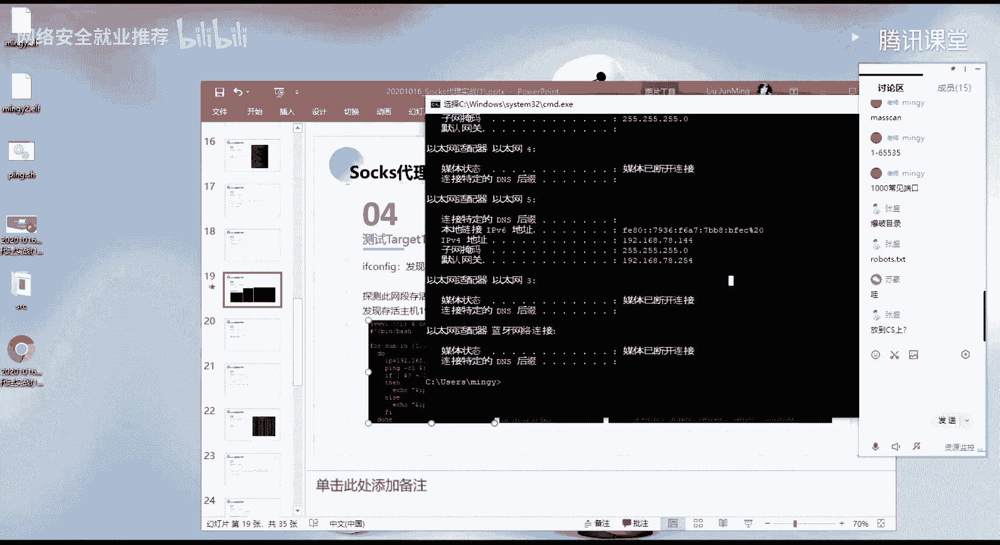

我们可以通过，就是说通过我们这边得到这个需要对吧。

我们这边的话能够去进行相应的一个，文件的一个操作，然后然后的话我们就可以向我们的一个这个，机器上面去好上传，下载我们所想要的一个文件啊，然后在这里的话，我已经上传了这样子的一个需要的一个脚本。

然后在大家去进行一个上传，这个需要脚本的时候，你可能就是会有碰到这样子的一个问题啊，就是因为当前的话是一个linux的一个系统是吧，然后啊我先先执行吧。

然后存在这样的一个p。s h的一个脚本是吧，然后我这边的话king点，来去执行这个新的脚本，然后把他的输出从面相到这个ip，点ip一点text这个文件当中。

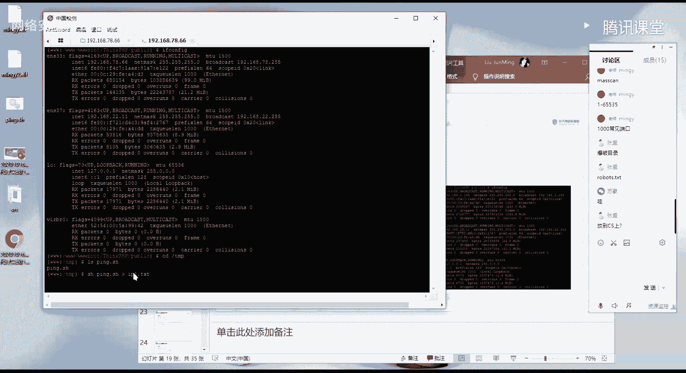

然后在这边的话执行的话，它会就是说在引进当中，你去执行这样一个命令的话，它会自动的去把这个东西把它放到后台去啊，好我们可以通过cat来去查看这个ip一点tt，这个文件对吧，然后其实如果你刚开始看。

你会发现它只有这么一点对吧，它其实是这个脚本，他还没跑完了，你每次看的话它都会增加一个对吧，然后在这边的话会有这样的一个问题，就是在windows当中，因为我们的话通常就大部分同学。

应该都也都是使用的一个windows的一个系统是吧，然后在windows系统当中去写这样子的一个。

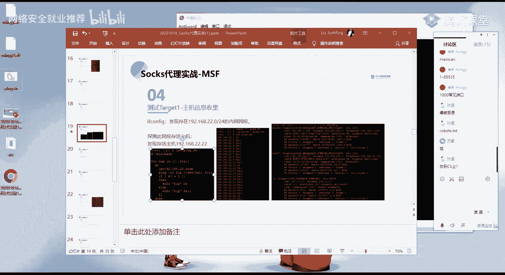

这种脚本的话，一定要注意。

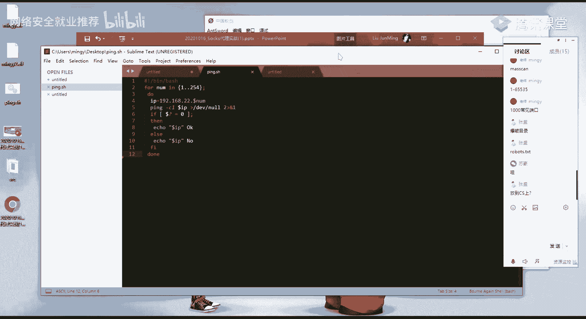

就是嗯你的那个就是说，你要去传到这样的一个linux系统上面的话，因为我们那个windows使得像这种编辑器，它会呃他会去啊，像我们的一个note pad对吧，当然这种他会在这一个文件当中去添加一些。

多余的一个信息，多余的一些东西以及啊，因为windows经历史的一个编码的一个不同了，然后你在windows上面，你通过这样的一个编辑器去写的。

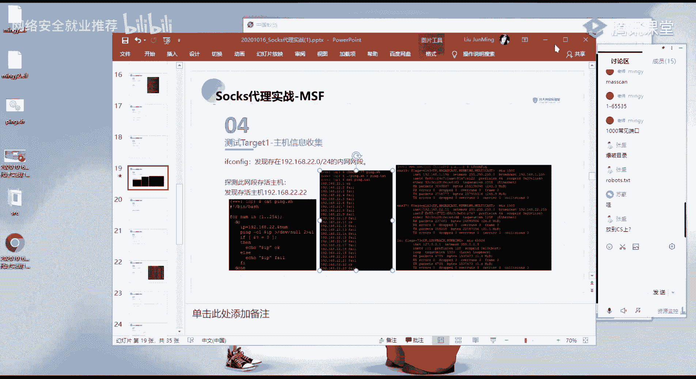

这样子的一个脚本的话，你去执行的话会报错，就可能会报错，好啊，一般的话就建议大家在linux系统上面去去写，这样子的一个脚本，然后的话上传到这个啊目标机上面去，然后上传上去之后的话。

我们执行执行之后的话，就能够去得到这样子的一个结果，就我们其实可以在这里看到，有存活的一个主机对吧，像2。1好，2。2，然后在这边2。1的话，其实就是我们当前的这个机器的一个ip。

那么我们就这边能够得知呃，当前这个网站的话有这样子的一个主机存活，就是这个2。2的这个主机它是存活的，那么我们下一步的话就是啊，需要去对这个主机做一个测试，对，因为我们知道它是存活的，那么同样的。

我们首先第一步的话，就是需要去对它做一个信息的一个收集嘛是吧，然后知道他那个ip，我们对他做一个信息收集的话，就是使用msf啊，不是是使用啊，使用啊mp啊，还有等等的一些端口扫描的一些工具对吧。

然后在这边的话，我们想要去呃访问这一个二顶二这个机器的话，在这边会存在一个问题，就是说我们当前的话，是我们当前去访问这个二点啊啊这一个网段，这个机器的话对吧，我们是需要在这个机器上面去进行一个访问的。

也就是这个啊这个78066。

这个外网的这个服务器对吧，这个跳板机上面才能够去访问的，那么我想要去就是说去进行相应的一个啊，相应的一个像比如说我想要去使用的map，去扫描这个二，这个2。2这个机器它所开放的端口是吧。

那么我们就需要呃有这样子的一个mp的。

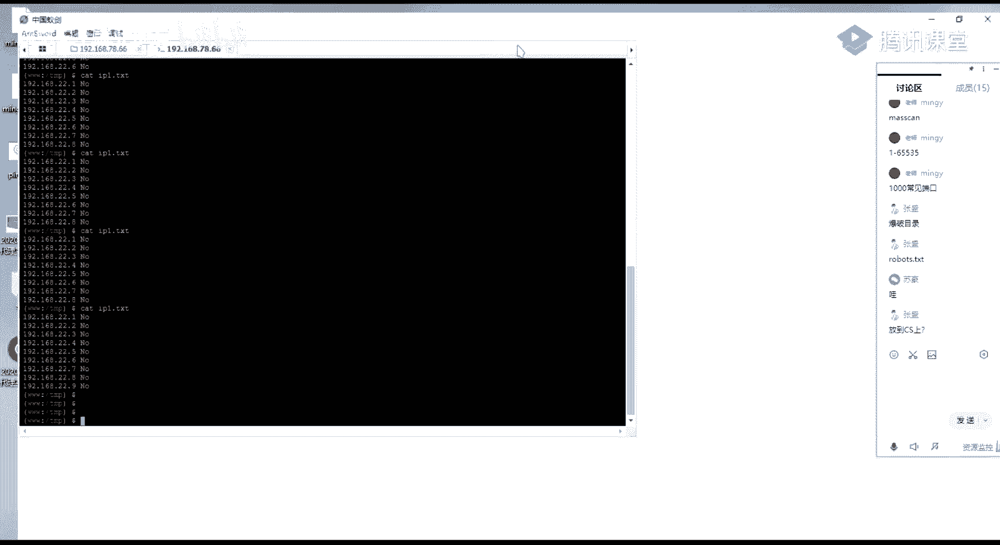

这样子的一个工具啊，那么在这边当前的这个计算机，这个机器的话是啊，我们拿下了这个机器对吧，那么这个机器的话他可能没有mp了，是吧，他没有这样子的一个mp的一个工具，你可能会说你要去去进行一个安装对吧。

然后你要去安装的话，那么你你除非你直接得到了他的root权限，因为你安装这种程序的话，你是需要去进有一个root权限，你才能够去进行安装的对吧，所以的话在这边呃会有这样子的一个问题对吧。

我们想要去进一步做进一步的一个操作的话，我们会因为这样子的。

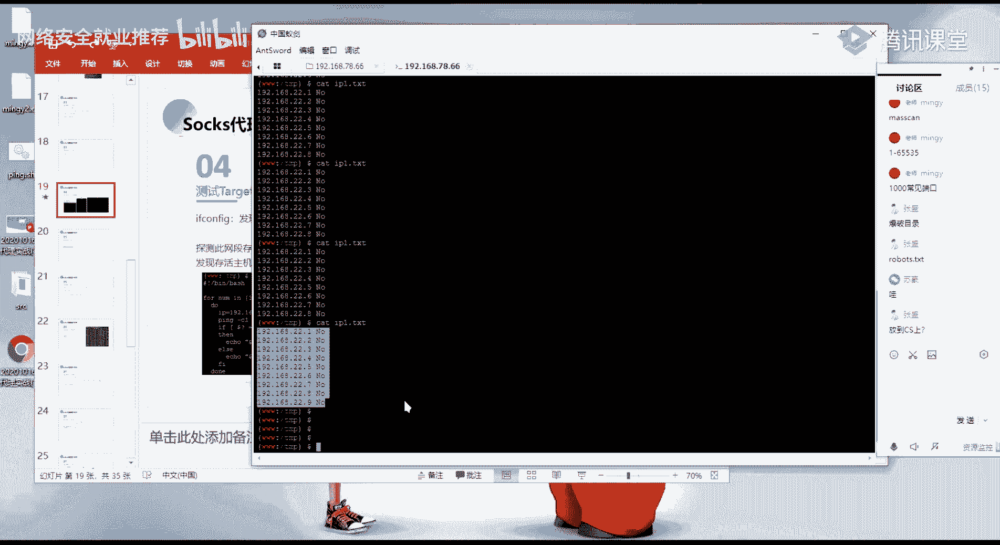

我们这边得到了这一个希尔的话，它的一个操作以及功能的话。

它是有限的是吧，所以的话我们会想到说，把我们这边的一个需要去做一个反弹，也就是把我们这边的一个shell反弹到，比如说我们的一个在这边，这位同学所说的一个cs以及msf上面对吧。

然后的话我们在使用这样子的一些啊框架，因为这些框架的话，它里面集成了很多这样子，这样子的一些功能对吧，我们可以用它的这样子的一些功能，来去进行一个啊更好的一个操作以及测试，呃以及的话就是说我们在这边。

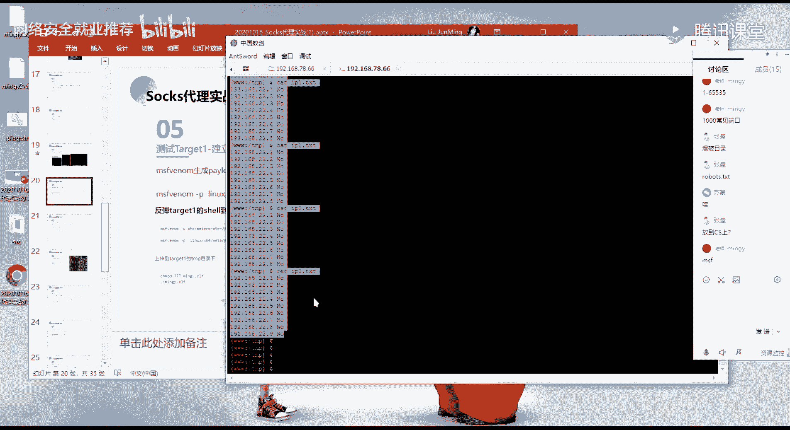

我们先反抗希尔吧，然后我这边的话，法兰西尔的话是采用的是这样子的一个方法，就是呃我通过生成一个这样子的一个呃，通过msf vlog生成这样子的一个呃，可执行的一个文件。

就linux下面的一个ef的一个可执行文件。

然后的话把它上传到我们的这边的，一个目标区上面去。

然而在这边的话呃生成的一个步骤的话。

我这边我就不演示了，我这边已经呃已经有提前生成好了，就是生成了一个a关掉了嗯，没了呀，就是呃通过这样子的一个命令去进行一个生成。

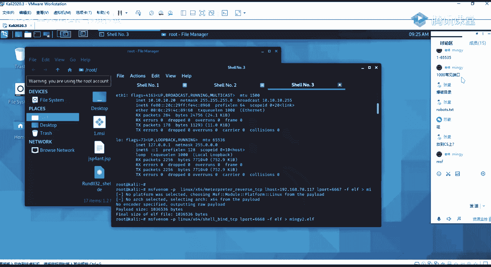

然后的话大家要注意啊，就是说我当前的话我这边得到了这个机器人，它是一个linux的一个机器，所以的话你要去生成的对应的一个可执行文件，就不再是我们前面经常说到的一个ex一了啊，我们的一个ex一的话。

它是windows下面的一个可执行程序，一直是windows下，对吧，然后在这边的话，我们需要去成这样子的一个e l f的一个格式，就是我们的在linux下的，搞这些程序，然而要指定的就是这个杠f。

要指定的一个格式的话，就是这个e l f啊，呃关于这边的一个lpl pot的一个配置的话，应该不用我多说了吧。

然后生成了这样子的一个m i g点，m i g y。e f的一个文件是吧。

然后我们可以通过这个shell，把它上传到我们的一个啊，某某一个目录下面去对吧，然后通常的话我们在linux上面去上传，我们的这种可执行文件，以及我们想要去执行相应的一个文件的话。

我们通常的话会把它上传到这个tp路下面，就是说这个tp目录的话，它是一个比较也是一个比较特殊的一个目录。

就呃这个tp目录的话，我们的一个linux的一个程序的话，好在我们的linux系统上面的话，我们可以去查看一下，我们可以来查看一下这个tp目录，它的一个权限，我们可以看到这个tp目录它的一个权限。

它默认的话就是一个啊777的一个权限对吧，rw x rw，这个t是什么权限来着。

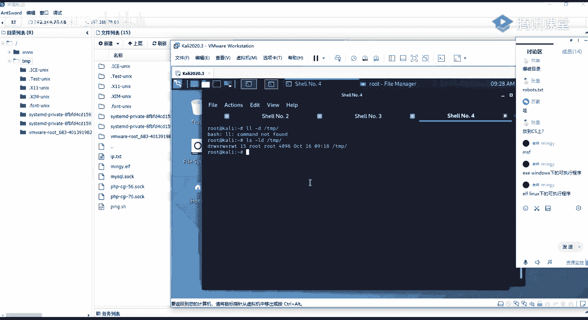

是那个张志伟吗，是那个脏字的呀，看下，呃这个s t k这个标志啊，这边的话，就是这个这一位啊，就是可以理解为就是为房山除味，也就是说这个的话这个，诶不能被删除吗，啊也就是呃在这边对吧。

我们给了这样子的一个rw t的。

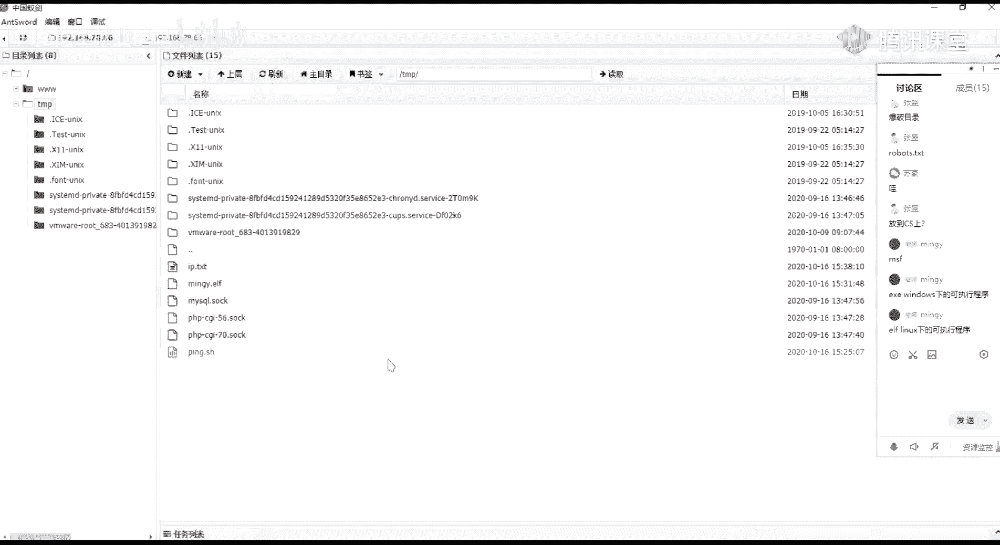

这样子的一个权限对吧，就这边的一个普通用户啊，就普通用户的话，他有了这样子的一个t的一个权限是吧，然后在这个目录里面的话，就是我们不能够去对它的一个这种呃。

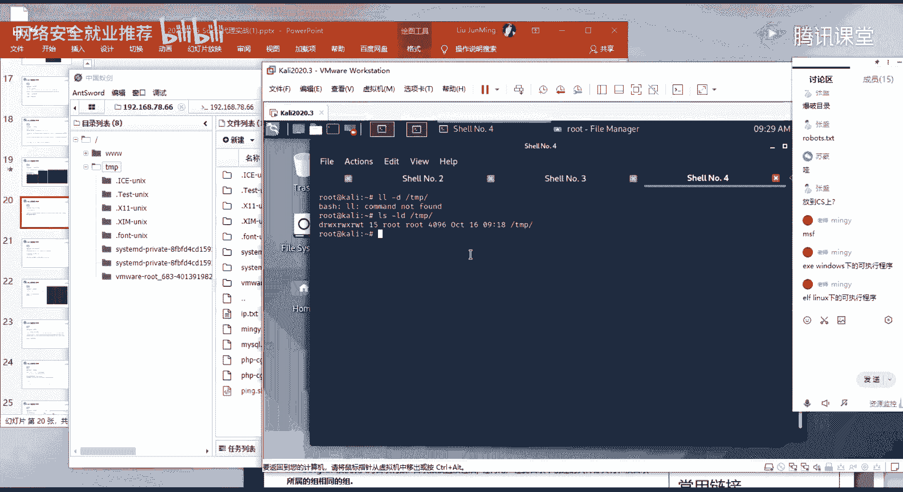

就是防止它被删除，大家看这里嘛，就这个目录下面的这样子的一个文件，就能够去添加文件，但是不能够去删除文件，然后我们可以cd到这一个片头，这边按照note权限，那我们在这边的话呃。

通过在这个目录下面去上传我们自己的，我们这边生成的这个可执行程序，也是这个m n g y点压f这个文件是好，我们上传上去，上传上去之后的话，我们再通过这个shell来进行一个执行。

然后在这边的话执行的话，大家要注意的话，大家一定要注意啊，就是你这边你去上传这个文件的话，因为我们这个文件，它是一个可执行的一个程序对吧，所以的话你上传之后的话，它的一个默认权限它是没有执行权限的。

然后的话我们需要去进行对它做一个添加，当然的话我这边是已经有了，就我已经添加了，就是我们需要通过chmod对吧，给他一个就是给他一个x的一个权限，然后的话我们再去通过这样子的一个通过。

去进行一个执行m d y。1r f，当然话我这边已经有执行过了，我们可以通过，这样子的一个命令来查看，我这边的话呃，这里啊我这边的话已经有执行过了。

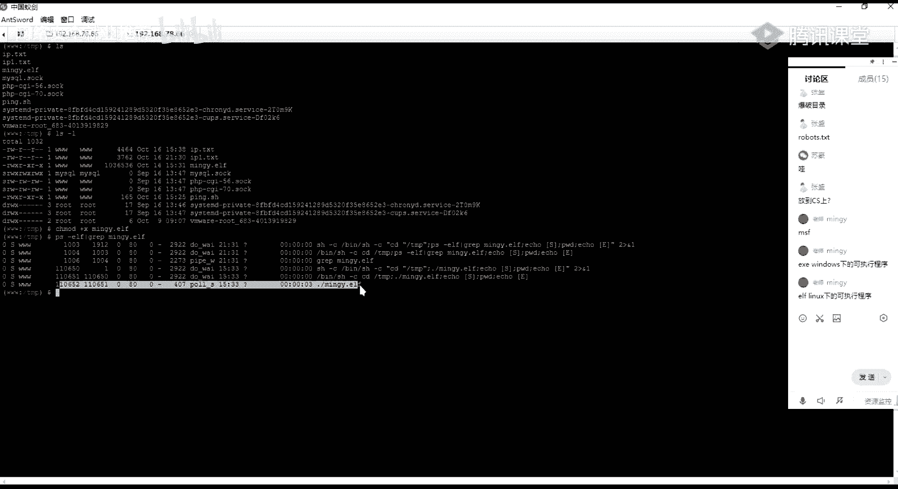

就这边的话执行执行了，我这边把它断掉了，断掉了，重新执行一下，202065。

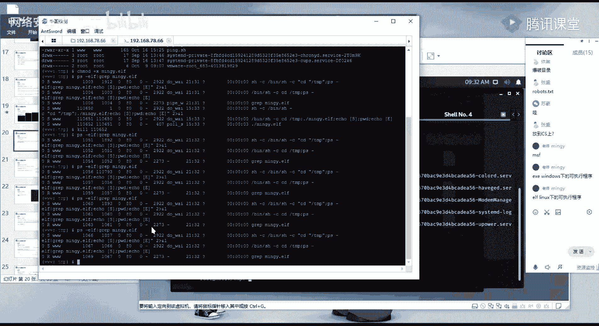

现在的话已经断掉了，断掉了啊，我们在这边，我们需要在我们那个呃机器上面，去做这样子的一个，青青对啊，因为我们需要执行之后的话，能够去反他一个小小图给到我们的一个msf，然后在这边的话呃，我们只用。

这个march handle，这个监听器，这边的话是一个6667的一个，端口，啊呃我的一个ip的话，是这个，我们需要首先需要去设置一个payload，设置完配note之后的话。

我们我这边的话已经设置好了，这个的话是我之前已经设置的，就是你需要去设置你的host叫pd嘛，跟这边去对应r的话，我们需要去建立一个job，我这边的话把它放到后台，然后执行一个job，对啊，就是这个啊。

我们这边今天今天之后的话，我们就通过这边的这个需要。

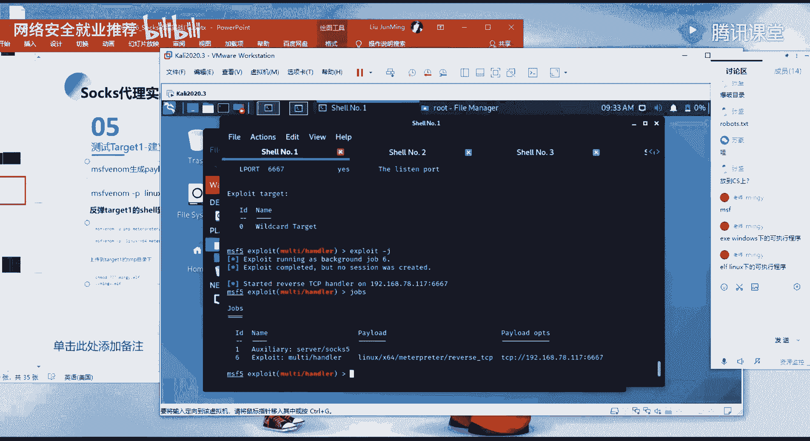

当前的话已经没有了，我这边的话执行这一个，我们的一个木马文件是吧。

好我这边执行之后的话，在这边的话，你就能够去得到这样子的一个macraft的一个session，就是一个筛选五对啊，我们可以看一下，对吧，也就是呃，我们通过生成这样子的一个payload。

生成这样子的一个linux下面的一个可执行程序，然后的话把我们的一个这个跳板机的这个shell，把它给呃转到我们的一个msf机器上面去对吧，然后转到msf机器上面去之后的话。

我们就需要去建立一个socf，好在这边我们为什么要去建立一个硕士代理呢。

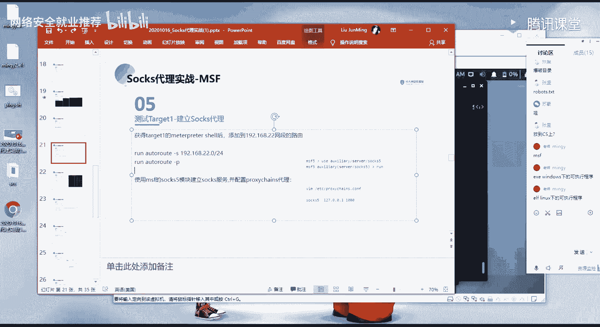

在这的话我们来看一下是吧。

当前的话，我这边的话是得到了这一个七八点券的这个，外网机器的一个p对吧，然后我我们通过前面的一些操作对吧，我们知道我这个机器的话，它是能够去访问二二的这个网络的一个ip是吧。

那么我们要去访问这个这个网站的一个ip的话，我们只能是通过这个机器去进行一个访问是吧，但是我们在这边的话，就是说我们想要从，比如说我们想要从我当前的这个windows机器上面，要能够去访问这个二网段。

那么我们该怎么去做呢，就是说比如说我想要在我windows 7上面用emp对吧，或者说用啊其他的一些工具来去呃。

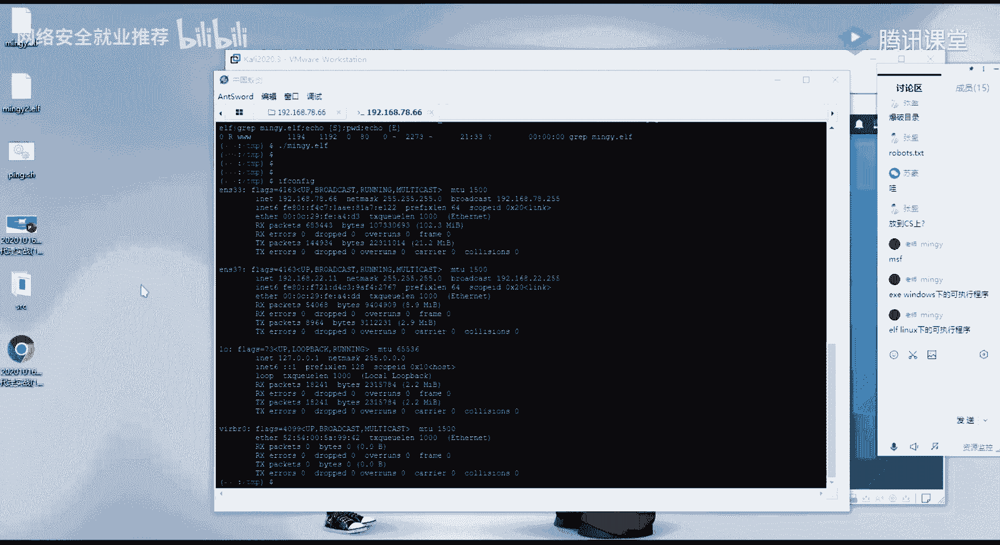

或者说用浏览器对吧，来去访问这个二网站下面的某一个web服务对吧。

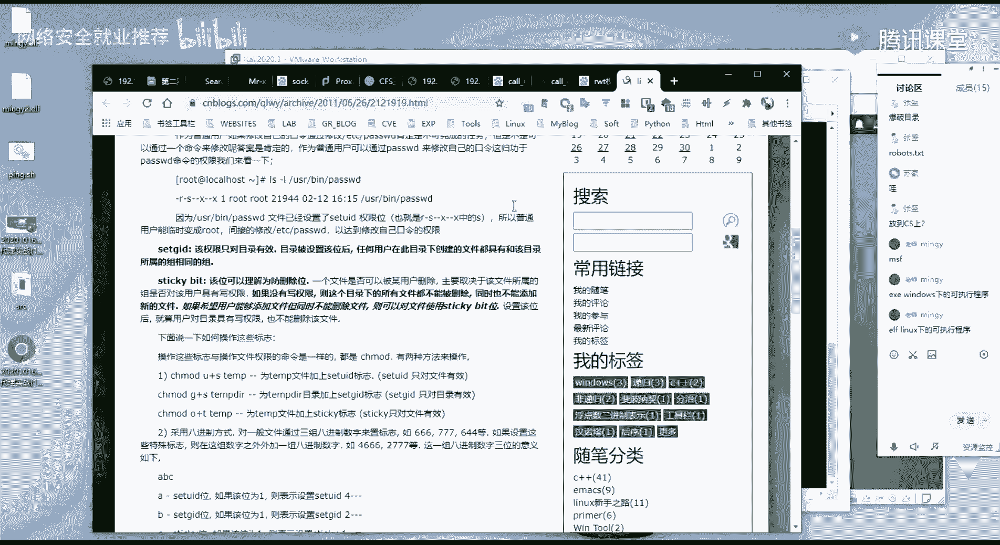

那么我们需要去怎么做呢，也就是用到我们今天这边所要去，我给大家介绍的这样子的一个shock sp，就我们需要去建立这样一个soc代，然后的话具体的一个操作的话就是这样子。

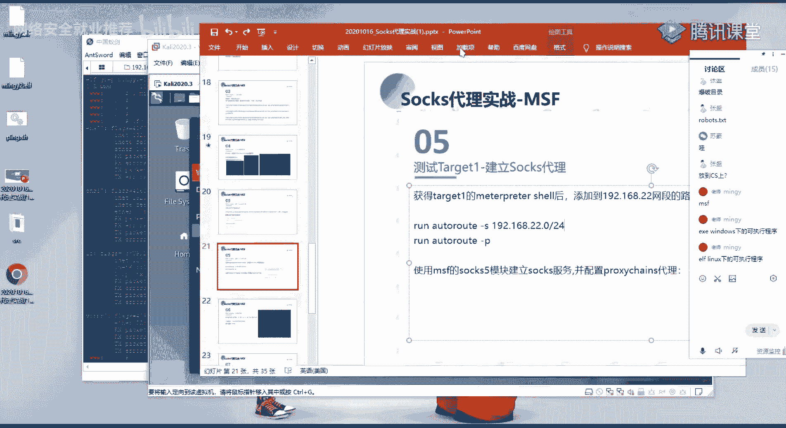

首先我们这边已经得到了这个matt pat的一个share，对吧，然后我们需要去添加一个路由，添加路由的话，我们需要使用到这个run out to rot这个命令，注意的话，大家注意。

是在这个metal creator下面去进行一个执行，然后盖s指定，我们想要去添加路由的这样一个网段，因为我们当前的话，我们是想要去访问这个二这个网站是吧，所以的话我们需要去添加一个路由。

去到这个二这个网站的一个机器，干p的话我们能够去查看。

就是说这边建立的这样子的一个路由好，我在这边的话，大家可能会有疑问，就说我为什么要去建立这样的一个路由呢，大呃有有没有同学知道，就是说我这边我要去呃，就比如说我这边的这个msf的这个机器对吧。

我这边的这个msf机器的话，我是无法去访问到呃，我除非是在这个matter por这个share下面，才能够去访问到这个啊这个网站的机器对吧，那么我在当前的这个呃，当前的这个机器下面的话。

我是无法去直接访问到这个，比如说这一个2。2这个机器的对吧，这costa racle也就是访问不到是吧，然后的话，然后的话我们在这边的话是在这个matt per下面，是能够去访问到这个网站的是吧。

那么我们啊这个怎么跟大家说呢，就是大家知道啊，大家学学过网络吧对吧，大家学过网络吗，应该知道就是说我们就比如说我们的一个啊，我们的这一个公司的一个网络对吧，我们公司的一个网络的话。

我们通常会去或者说你家里的一个网络对吧，你想要去通过你的一个啊，你想要让你的一个手机，你的一个电脑能够去访问到外网对吧，我们通常会需要有一台路由器对吧，就是需要一个root，需要一个路由器。

然后这个路由器的话是，它是我们可以通过这个路由器来去访问外网，对吧，然后路由器的一个功能的话，大家知道吗，就是说路由器当中它会有这样子的一个路由表，就是有一个路由表。

然后这个路由表的话就记录的就是我们的一个，i p，然后的话我们呃就是不同网段，嗯就说我们不同的一个网站，比如说我的一个一一的一个网站，我要去访问一个二二的一个网站对吧，那么这个网关的话。

我们呃因为它是在不同的一个网站对吧，然后的话他要想实现这两个网站之间的，一个访问的话，我们需要有这样的一个路由，就是要告诉这个一网段的这个机器，如何去访问到二这个网站对吧。

然后在路由器当中的话就会有这样子的一个表，就是告诉当我们的一个e这个网站去访问，去访问2。2这个网站的一些机器的话，那么他就会去路由表单中去找到，如何去访问到这个二网段呢。

如去找到这个二网段的这个ip对吧，对ip road，然后的话就是就是找到吓一跳嘛对吧，然后的话我们在这边其实也是一样的对吧，我当前的话是这个，我当前这个msf的这个机械的话，是这个这个网站对吧。

然后这个网站的话它是能够去访问这里的，这个呃。

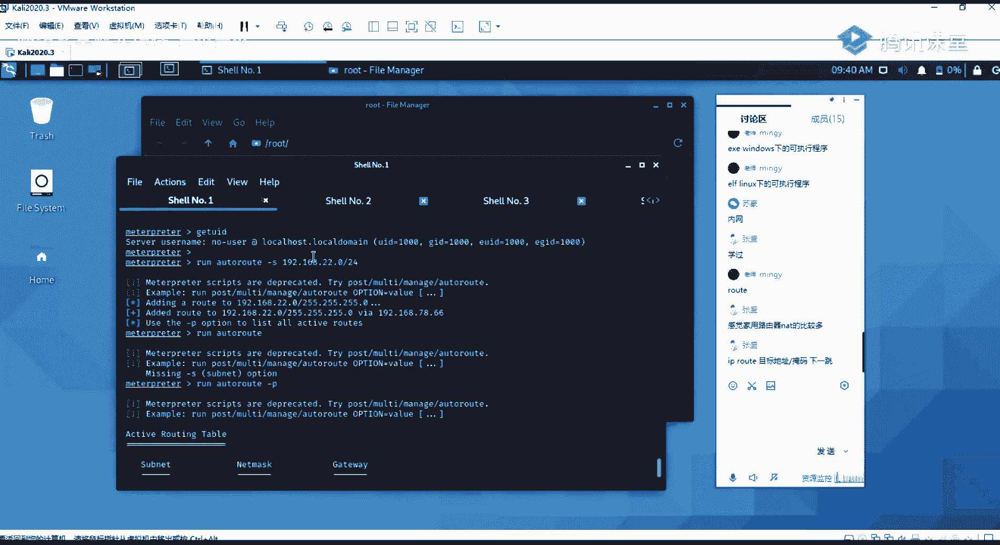

就我们这边得到这个shell的这个ip对吧，但是他是无法直接访问到这个二这个网站的。

然后在这边我们这这边得到这个matter，presession的话，它是能够去访问到这个，也就是能够去访问到这个二网段的是吧，那么我们是否能够去做一个这样子的，就是说通过这个magic的这一个筛选。

把我们把我们从这边的这个网站的一个流量，把它给就是说啊不是就是说我从这边对吧，我从这边我去骗这个192。168。2。2，这个机器对吧，我这边我去骗的话对吧，我是否就是我如果要去实现这样子的一个七八。

这个网段去访问这个二这个网站的话，我们需要去告诉这边，高中这边如何去找到这个二这个ip对吧，然后在这边的话，我们可以通过这个筛选五这个建立的这个绘画，也就是也就是我们在这边通过添加这样子的一，个路由。

然后的话通过这个筛选五的这个绘画，来去访问这个二这个网站。

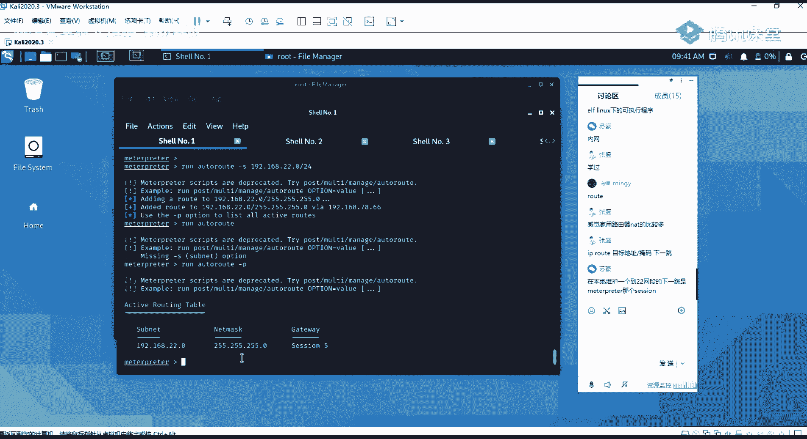

然而在这边添加完路由之后的话，我们还需要去做这样子的一个配置，啊对对，就是就是这个意思。

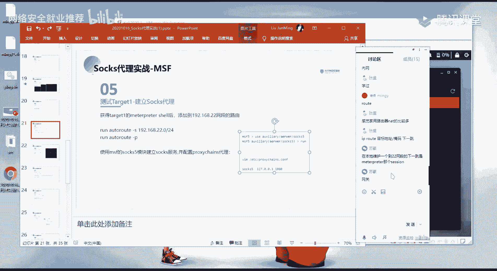

其实啊在这边的话就是这个search 5的话就是网关，就我们可以看在这边看到，就涉嫌我的话就是网关，也就是说我们在这边对吧，我们在这边七八的话要去访问这个二的话，我们可以通过这边的这个筛选五。

这个网关来去找到这边的一个二的这个呃，呃这个网站下面对应的这个ip对吧。

然而在这边添加完路由之后的话，我们还需要去建立这样的一个sx的一个服务，因为我们在这边的话，我们在这边的话是通过msf对吧，通过msf进来这个筛选五才能回去，而访问到这边22，那么我们当前在这边。

在这边的话是访问不到这个筛选五的对吧，所以的话，我们在这边需要去建立这样的一个通道，这个通道的话就是通过这样子的一个方法。

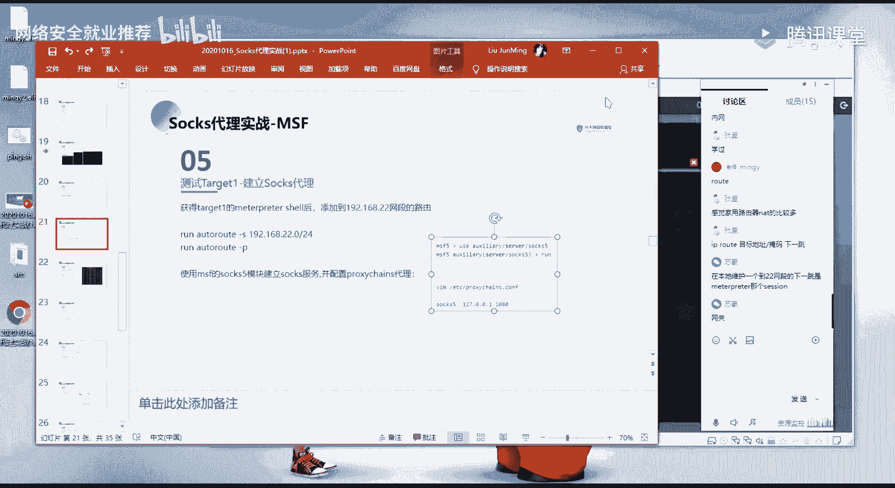

去进行一个建立，呃我们需要去使用这样子的一个模块，就是我直接，使用这样子的一个，就这个socks 5的这样子的一个模块，然后的话我们去乱一下呃，这个好像已经有了，就这个，然后我们run执行之后的话。

他在这边他就会有这样的一个jobs，这个jobs的话就说明这个socks 5的一个服务的话，已经启动了，然后他的一个socks的一个服务的话，它是在这样子的一个啊，今天在1080的一个端口。

我们其实可以在这边来去查看它的一个，今天的一个状态对吧，这个端口的话已经处于一个今天的一个状态，然后在这边我们的一个socks代理服务啊，sos的一个代理服务已经建立好之后的话，我们。

就可以通过这样子的一个socks的一个通道，来去访问这边的一个二的这个网站，这边这边呢是一个二的一个网站。

我们可以来尝试一下，因为我当前的话这个机器的话是一个呃，然后加点268。78。117对吧，然后我当前当前的这个ip的话，其实跟他是一个网段的78。14。

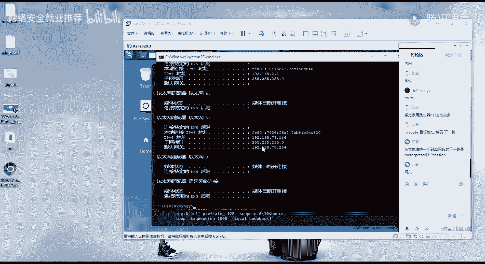

所以的话呃我在这边，我要去访问这个二网站的话，其实就说嗯先在这边先访问吧，我在这边，我在这边，通过这边的一个socks的一个通道，来去访问这个网站，我这边来测试一下，我们要去使用到的话。

就是这个boss ch，通过这个pose trance这种工具，然后的话我通过cl l来去尝试去访问一下这个，68。2。2，啊为了做一个对比啊，就我在这边，我在这边先不通过那个代理通道对吧。

我这边直接去需要去访问这个ip的一个，8年的一个端口，你会发现他这边的话，很是说无法去连接到这个八零端口，然后还有这边就是有一个no road to host，也就是说他在这边。

他是没有路由器访问到这个呃这个ip的，也就是说在当前的这个主机，它是啊，不知道就是找不到，如何去到这个二这个网站的一个ip的，而我们在这边的话，就通过这边的一个sos的一个通道。

我这边可以看到直接确定一个访问，就通过这个process chains来cl这一个这个ip对吧，原版的话它是无法去访问的，我现在通过这个收通道的话，能够去直接的去访问到，他的一个8年端口的一个页面对吧。

这边是它的一个web服务的一个页面，好在这边的话，其实我们通过这个代理通道去访问这个ip的话，它的一个流量的一个走向，大家知道吧，就是说它是如何去进行一个走的，他为什么能够去啊访问到这边。

就是说通过这个代理的一个通道，然后其实这边的话就是我们刚刚的这边的，这两个步骤所达到的一个效果，就是通过这边等一个配置。

我这边的话大概再给大家来捋一下，就是说我这边去访问对吧，我这边访问的话，我通过这边的一个代理通道，然后我这边的一个代理通道的话，是这边的一个，我本地在本地的一个1080的一个端口，是吧啊。

也就是说我这边的一个htp的一个请求，他会通过这边的一个1080的一个端口，也就是我这边经营的一个sce通道，把它给传递到了这边，因为我这边的话是我这边的一个双通道的话，是而是在这边的一个msf对吧。

我这边建立了这一个sp通道的话，呃就是说我这边的这一个流量，它会通过我们的一个msf，然后的话转到这边，因为我们这边的是，我们在这边的一个msf当中的话，已经添加了这样的一个路由对吧。

就是说他把他去请求这个二这个网段啊，2。2这个ip，他的这个请求它会通过这边的一个通道，也就是108年那个端口，它会转到这边，msf转到这边msf之后的话，他会去寻找这个如何去访问这个啊。

这个网站的这个ip对吧，然后在这边的话我们添加了这样子一个路由，也就是我们通过这个筛选五，因为我们的这个四选五的这个绘画的话，它是能够去访问到这个二这个网站的是吧。

以及我们在这边添加了这样子的一个路由来去，呃，就是说当他请求到这个二这个ip的时候，他会去通过这边的这个网关来去找到，这边的这个ip，以及它对应的一个服务，也就是呃实现了通过这边的一个收拾的一个。

代理通道来去访问，原本我们访问不到的这样子的一个网段。

以及我们在这边的话，其实因为我这边的话跟这边是同一个网段，所以的话我可以通过这样子的一个方法，就是我这边设置一个这样子的一个代码，呃就这个78。117，然后代理端口号是1080。

然后选择一个协议的话是sox 5的一个协议，然后我这边的话选择这个是呃，我另外再开个浏览器，我这边的话是没有走到你的对吧，我直接去访问的话，是肯定访问不到的。

对访问不到这个ip的，然后我在这边的话，通过这一个代理，然后的话可以看到这段话，就直接能够去访问到这边的这个二点ip，2。2这个ip的这样子的一个web服务对吧，所以的话这边的话是走的这一个代理。

其实就是走的我们这边的这一个。

这边msf所经历的这样子的一个，sos的一个代理服务器啊。

这边的话大家能理解吗，啊对吓一跳嗯，就是你也可以这样理解吧，就是吓一跳嘛，就是其实就是添加路由的话，就是就是群就是告诉你的这个呃，告诉你要请求的这个ip往哪里走了，就是对吧，下一项的话就是呃就是告诉你。

你的下一套的话是这个2。2嘛对吧，也就是呃那个筛选五嘛，就是它是通过那个网关，也就是我们的那个session，来去找到那个2。2那个网站是吧，所以的话我们需要去，我们如果说要去通过那个三选五。

来去访问到这个这个网站的话，那么我们需要去添加一个路由，也就是告诉呃msf，你要你要去访问他这个网站的话，你就需要去呃，通过这个筛选产能过去访问码，啊这边的话就是通过msf。

经历了这样子的一个socks的一个概念，然后的话我们通过这个socks代理来去访问到了，这边的一个内网的这个网站对吧，其实这边的话就已经实现了这样子的，一个内网的一个穿透，我们在这边。

我们在这边的话就能够去通过啊，这样子一个代理服务器，去访问那个内网的一个网站，好我们已经能够去访问到这个网站的话，那么我们就需要去做下一步，就对它做一个清晰的一个收集，就这边的话。

其实又回到了我们前面的相应的一个操作，就对它做一个信息收集，我们可以使用map给他做一个端口的一个扫描呃，在这边的话你做端口扫描的话，像你在看里面的话。

你可以直接通过这样子的一个cos chance对吧，来去做一个扫描，对面直接粘贴吧，然后呃在这边的话，我我就不扫，我不扫了呀，那停了，然后这边的话我们看一下，看前面主要的话在这边的话呃。

命令他应该不用我说了，就是通过tcp的一个方式进行一个扫描，然后一定要注意呃，大家一定要注意，就是在去进行一个socks代理的时候，一定要注意，就是像imap这种工具对吧。

你需要去给它加一个干p干pn是什么意思呢，也就是禁止去进行一个king的一个扫描，就是因为我们前面已经说了是吧，就我们的一个pin的一个扫描的话，它是无法去通过我们的一个好socks的一个，代理通道的。

也就是他无法去代理这样子的一个ping的这种，s m p的这样子的一个流量，所以的话如果说你不去禁止掉的话，他会有这样子的一个pin的一个扫描的话，它会就是它会有错误对吧。

以及我们的这样的一个流量也过不去，就影响我们的这样子的一个扫描，然后呃这边的话就是cp站对吧，呃就我们前面所说的这种我就不多说了，然后呃这句话我们主要看一下，就是这边它的一个扫描的一个结果。

首先像比如说在这边的话，呃大家看到这这种的话，就首先第一个在这的话，它是走的这样子的一个代理通道对吧，他这边的话应该比较形象，通过这边的我们本地这个1080的这个端口。

就把我们的这边的这种请求的一个流量对吧，把它发送到这个端口上面，也就是呃通过了那个sos的一个通道对吧，然后他把它传到了我们这边的这一个呃，ip的这一个指定的一个端口对吧。

其实这边的话就是把我们mf的这种探测端口，的一个流量，通过这边的一个sos的一个通道，把它给转到了这边指定的这个，ip的一个端口上面去，然后的话对它去做一个探测，但是的话这种time out的话。

就说明这边的这个端口的话，探测的话它是超时的，也就是说它可能是没有存在，也有可能是呃呃就是你没有找到对吧，然后的话就没有探测到，然后的话像这种，比如说像这边888，8888这样子的一个端口。

这边ok的话就表示呃，就比如说这边的一个端口的话，它是存活的，也就是呃探测到还有22，以及还有其他八零对吧，这种21的这种端口，而我们通过这样的一个方法的话，就能够去探测到这边的一个这个，内网主机的2。

2，这个主机的一个存活的一个端口，开放的一个端口对吧，那么就同样的又回到了我们前面对吧，就是针对这样子的一些端口，做一个漏洞的一个分析利用是吧，然后同样的这边的话。

同样的是使用的这个八零端口作为一个突破口，就是他这边有一个这样的一个cm，就在内网这一个二这个主机上面的话，有这样的一个cm是吧，然后这个sm的话就通过啊找历史漏洞啊，以及分析啊，对吧啊。

它是存在这样的一个sql注入漏洞，然后通过他的这个sql注入漏洞的话，我们可以通过circle map直接跑出他的账号密码，关于怎么去跑circmp的话，呃大家能就关于cmap的一个使用和前面有讲嘛。

前面该有讲吧对吧，应该不用我多说吧，就我们通过sl map直接去进行一个啊，跑出他的账号密码，然后在这边要去注意的话，就是说因为我们的这样子的一个呃，我们要去跑的这个ip，它是一个内网的ip啊。

所以的话我们这种好circle map这种工具，我们同样的需要通过这个prop trains，做一个代理，其实就是说它的一个原理，就就包括前面map以及这边的一个cycle map对吧。

他的这种扫描的话，它的原理其实就是我这边通过circle map去请求，这边的这一个，去发送这样子的相应的一个请求包对吧，像这个ip发送请求包，然后这个呃像这个ip指定的这个页面，发送一个请求包的话。

它会把我们的这样子的一个请求的一个流量，通过这个搜索的代码通道对吧，然后的话转到我们这边，内网的这个ip的一个页面上面去，其实就是呃就加这个圈，然后的话把我们的这个流量代理到我们这个，sce通道。

然后的话去才能够去访问到嘛，然后跑出来的话得到它的一个账号密码，然后这边的这个c m s的话，我们其实可以通过就是呃直接去谷歌，百度去找他的一个管理后台嘛对吧，就默认了这种管理后台。

然后我们通过他的这个后台的一个地址，其实我们在这边的话就已经能够去访问到，比如说我在这边对吧，我这边的话就已经访问到了，我这边的话访问他的一个后台地址，然后呃账号密码的话，我们通过前面的一个。

sql map就是通过sql注入进行一个就是把它跑出来，跑出来之后的话进行一个登录，什么，pg y字形，然后这句话我们就已经登录到了，它的一个就是后台对吧，然后这边的话他有这样子的一个漏洞。

就是其实有挺多的这种cvs，它都有这样子的一个就是模板啊，就是可以去我们可以在后台，后台去编辑它的一个模板，也就是能够去编辑它的这样子的一些啊页面，像比如说在这边的话，我们可以通过去编辑它的一个首页。

也就是这个，然后并且它的一个首页的话，因为这边的话它是一个ph p的这样子的，一个代码对吧，我们可以在这他的这样子的一个首页当中，去添加我们的一个一句话对吧，我这句话是添加了这样子的一句话呃。

就是apple test，然后ever这样子的一个嗯一句话嘛是吧啊，我这边的话加了这样子的一个ex test，其实就是为了判断，就是为了判断我这边是否已经，就是是否写成功了吗。

以及他的这样的一个片区的代码，它是否解析了，因为我们这边的话是添加在了这样子的一个。

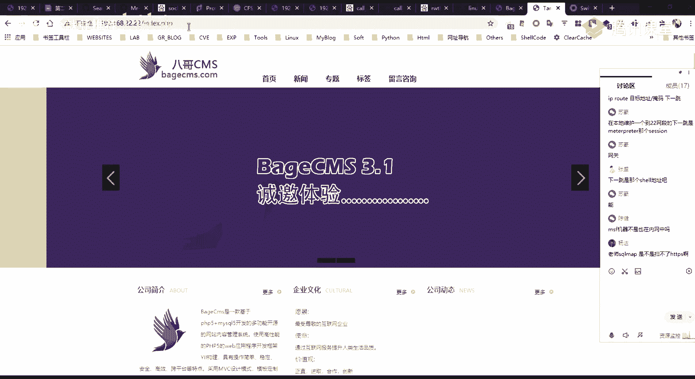

首页对吧，就我们在首页的这边的话，你可能看不到，所以我们可以通过右键查看网页源代码，然后去找到这个test是吧，直接去检索嘛，然后大家可以其实可以在这边能够看到，这边的话有这样的一个test是吧。

就说明他输出了这样的一个test，也就是我们的那个菲律宾脚本化，被正确的解析了，那么我们这个这里的话就能够呃，去通过我们这边写入的一个一句话，去得到它的一个小，然后呃得到shell的话，我们在这边的话。

我们就可以通过我们的这样子的一个管理工具，就需要管理工具去建一个零件对吧，而我们在这边要去连接的话，呃，大家觉得就能不能直接直接都连接上去呢。

就我这边的话呃已经添加进去了是吧。

打你了呃，我这边的话添加了这样子的一个。

就是我们刚刚所得到这样子的一个呃。

需要的一个地址对吧，然后呃大家觉得就是能不能直接的通过，就我在我本地去直接去进行一个呃登录的，去得到的一个小的呃sql map的话，它是可以可以扫hp的，是要加一个参数，就是你要强制你要强制他的。

因为你去扫芯片和s的话，他会就有一个这样子的一个重定向，你要强制他呃，是杠杠s s l干什么来着，就是，你要呃强制让他去请求这样子的一个htp嗯，这个的话你可以去，百度1下，你百度1下有那个选项。

我忘了，刚刚s s什么什么来着，你这肯定就是说你是说我这边写的这个对吧，我这边写的话是一个p h p的对吧，因为为什么我要写p h p呢，因为他的这个呃他的这个他的这个网站。

它是用菲律宾的一个脚本语言写的，那为什么就是说他这边好，就我们从哪里知道呢对吧，我们可以通过这边p p知道，以及通过它的后缀嘛能够知道是吧，那么他这他是用这种ph p在脚本里面写的。

那么我们为什么要去写这样的一个，pp的一个脚本是吧，因为它能够去解析执行呢，我这样说应该能理解吧是吧，因为我们以及同样的其他的也是一样的嘛对吧，就如果说你这边是一个jsp的这样子的。

一个jsp的这样子的一个啊脚本写的对吧，那么你要写的这样子的一个马的话，那么你肯定是要写一个jsp的码是吧，因为你只有因为在这个jsp的这样子的，一个脚本的话，你需要写一个jsp的脚本。

你才能够去进行一个解析，因为你只有解析了你的，你的这样子的一个一句话嘛，你才能够去得到需要嘛，我这样说应该能理解，就是你服务器它是什么样子的一个语音环境，或者说它是能够去解析什么样子的一个脚本。

你就用什么样子的一个那个呃马，那我们归根到底，最后的一个目的，就是要让他能够去解析我们的那个码吧是吧，我们才能够去通过那个马来得到需要嘛，呃我们这边的话，在这边的话。

我们得到了他的一个web share对吧，我们其实可以测试一下嗯，嗯这个面不好吃的时候，我们在这边就通过这样的一个需要管理工具，去进行一个连接，然后在这边的话要注意的一点。

就是我们在当前的这个机器上面对吧，我们是无法去直接去访问到这个2。2这个网，这个ip的对吧，因为我们在这边能够去访问到这个ip的话，是因为我这边走的，我的这个流量，它是走的这个收拾的一个通道对吧。

他才能够去访问的，而我们在这边的话，同理，我们在这边要去访问这个2。2这个ip的话，我们需要去尽力去设置这样的一个代理，也就是呃像已经这边的话，有这样的一个代理设置吗，在这边手动设置一个代理。

指定你的一个代理服务器ip及端口，这边的话带你服务器ip的ip的话，就是。

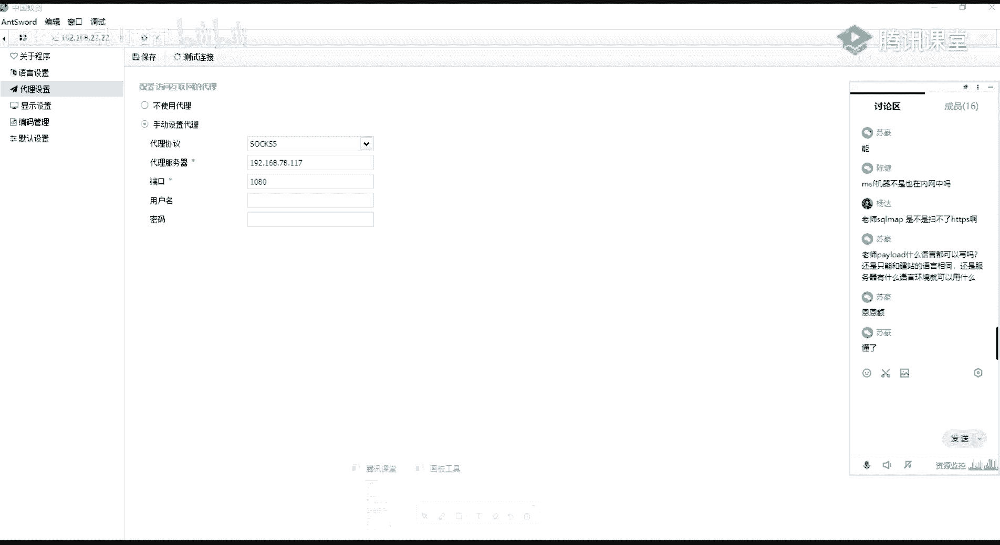

就是找回来，就是我这边msf这边的一个ip，嗯这里的这个ip对吧，因为我的一个socity，我的这边那个msf的一个啊，socks的一个单元的话，它是今天在我这边的这一个啊。

机器上面的一个1080的一个端口，所以的话你需要去指定这边的一个代理服务器，ip及端口，注意代理的一个协议选择socks 5。

如果说你是sx 4的话，你就选socks 4，然后我这边配置好这样子的一个代理之后的话，就我就能够去进行一个。

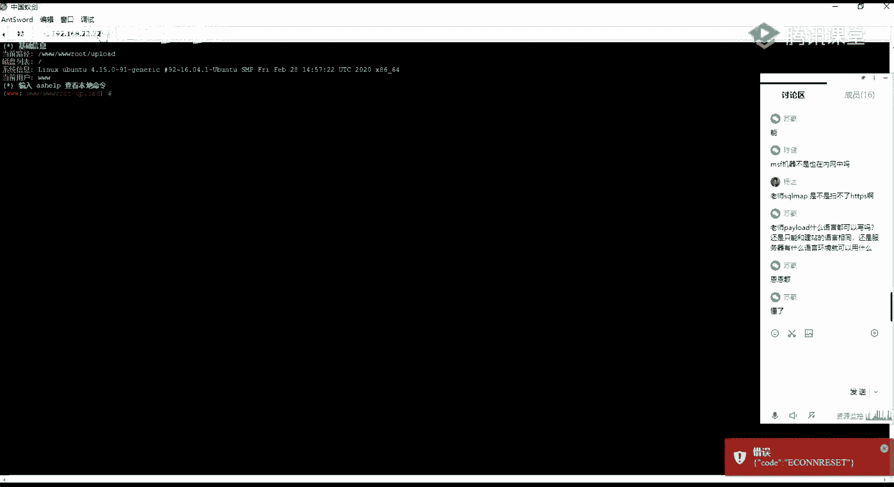

哎这边有点问题，呃这边访问的话。

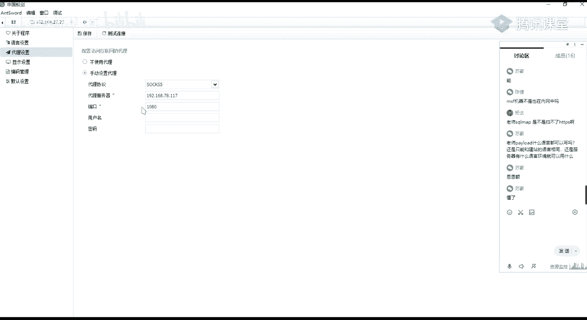

p2。067。

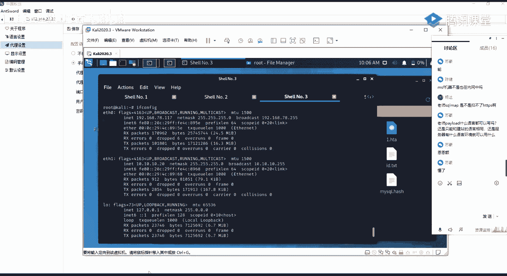

呃这边访问的话出错了，出错了的话，碰到这种情况不要慌，碰到这种情况的话，就果断换把刀吧，这边的话呃，我通常的话是用就会用像啊已经啊冰c啊，这种都是可以的，然后这边的话因为简单的话我就用这个c刀了。

就是这个用这样子的一个c的，然后这边用这一个c的话，同样的我们需要去我这边的话已经添加了，同样的需要去做一个设置，这边设置的话就是你需要去设置你的一个代理，这个服务器以及ip啊。

当你服务器的ip以及端口，然后设置之后的话，我们再去建一个访问对吧，是没有问题的，就如果说你要问我这个工具为什么连不上，我也不知道，就反正很多时候都会碰到这种寻求问题。

所以我一般都是就是不会说只是只用一个，我会结合着其他的这种工具去使用那种工具的，工具的问题，反正我是搞不懂了，也就没必要去搞懂他为什么出这种问题，反正能用就可以了，然后这边的话。

我们就连接到了这边的这个机器上面对吧，连接到了这边内网的这个2。2，这个ip的这个啊shell，那我们可以通过配置这样的一个sos代码，来去迎接我们的，就是在内网当中的这样子的一个小。

然而在这边得到了这个内网的这个2。2，这个机器的一个shell之后的话，我们就还是又回到了我们前面的，是我们得到它一个shell，我们就需要就可以去对它做一个主机的一个，信息收集，去收集在当前这个主机。

它我们所需要的这样的一些信息是吧，然后在这边的话，我们同样的通过前面这样的一个方法对吧，对这一个三三啊，对这一个网段啊，不是对这个商场，是我们比如说我们同样的去查看他有没有网卡，对吧。

我们通过econfig才看到它，同样的有两个网卡是吧，一个二的一个网站，一个网卡以及一个三三网站的一个网卡，那么在这边的话，我们就知道我们这个机器，它是能够去访问三三网络的一个机器的对吧，好。

我们同样的可以就是通过前面的那个脚本，来去对这个三叉网络的一个ip的一个存活，做一个探测，来去找到这个网站下面有哪一些主机存活对吧，然后等他找到这些存活的一个主机，那么就分别的去对这些主机去做一个啊。

端口的一个探测是吧，就其实步骤的话都是这样子的呀对吧，就如果说你因为我这边把这话是只有一个主机，对吧，就每一个玩的话只有一个主机，如果你有多个网段呃，每个网站下面都有多个主题话。

那么其实都是重复这样的一个操作，对就你对对这个ip探测它是否存活存活的话，那么你要对这个ip做一个测试的话，你就需要从它对应的开放的端口，所对应的一个服务，去做一个去寻找它的一个突破口对吧，来去寻找。

能够去被我们去进行一个漏洞应用的一些点，然而在这边找到了这一个，33。33的这个ip还是存活的，就发现了这一个存活的一个主机啊，那么我们呃发现了这个主题的一个存活，我们想要去对这个主题做。

去做相应的一个呃端口的一个探测对吧，那么我们如何去进行一个操作，因为我们在这边当前的这一个msf对吧。

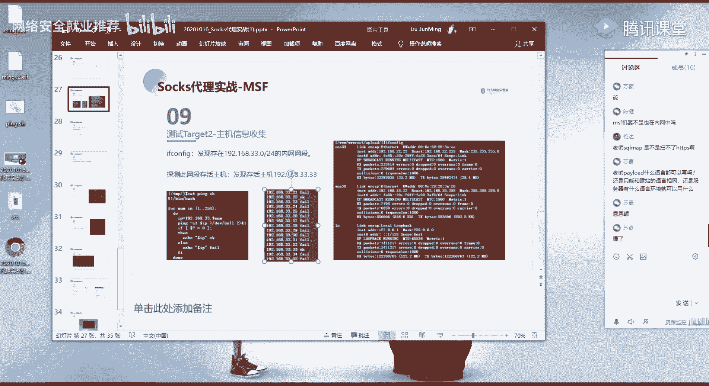

我们想要去做一个端口探测的话，我们可能就通常会去通过map对吧，去扫去扫描那个端口，那么我们当前的这个msf，我们是无法直接的去访问到，三三这个网站的是吧，而不是msl是当前的这个看你机器的。

然后我们当我们之前的话是要去访问那个二，这个网站是通过我们的一个代码对吧，就是通过boss chains，设置的这个代理，以及在这边所启用的这样子的一个，代理服务器对吧。

然后的话以及在这边通过筛选五添加这个路由，才能够去访问到这个网站是，然后我们现在的话是三三网站，然后三三这个网站它我们是如何去访问到的呢。

啊，我们是通过这边我们得到这个2。2，这个机器才能够去访问到的对吧，比如说我这边我在这边我通过c2 ，啊这边的话应该访问不到啊，因为他是好可以访问到，他这边的话呃，因为这边的话它是一个i i s啊。

不是他是一个那个那个windows的一个机器，啊不是啊不是啊呀哦，因为这边搞错了呀，因为我当前的这个啊ip对吧，是3302，其实我在我访问这个3302的话，其实就是访问的单品的这个ip啊。

我要反问他是这个，33。33这个机器，当然的话这边的话是访问不到的，因为他没有web符号，它是一个呃那个那个windows的一个机器，而我在这边的话，我是无法去直接访问到的。

但是我比如说啊我是可以直接访问到的，33。33对了，我通过king的话是能够king通的，因为我们前面的话是就是通过p的方式，发现了一个存活嘛对吧，也就是说我要去访问到这个33。33，这个网站的话。

我需要通过这个2。2这个机器是吧，然后当前的话我已经拿下了这个2。2的机器。

的一个shell的，那么我们需要通过审。

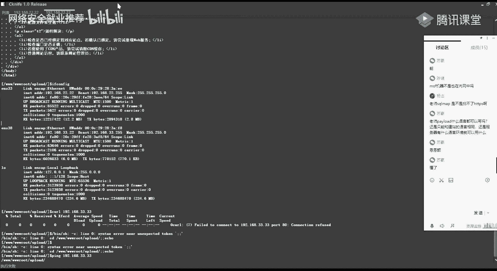

我们怎么去啊，呃怎么说呢，我们怎么去把这样子的一个机器把它给啊，反弹到我们那个msf上面去对吧，因为我们同样的，我们想要去通过这个二这个2。2这个机器，去访问这个三三点网站的话对吧。

我们想要去做更多的操作的话，我们最好的一个办法的话，就是他就是说最理想的一个办法的话，就是啊，把我们那个需要把它给弹到我们那个msf，上面去对吧，因为我们在这的话，已经通过msf得到了这个2。

2这个机器啊，不是这个啊，那个外外网的那个跳板机的那个机器，的一个shell是吧，因为我们这边的话是通过那这个c选五。

通过我们得到这个需要，才能够去访问二二的这个ip的是吧，然后在这边的话，我们可以通过这样子的一个方法，就是我们，呃在我说之前的话，先问提问一下大家，就是大家觉得我要怎么去。

才能够去得到这样子的一个这边的2。2，这个机器的一个msf的一个项，啊有谁有谁知道吗，有谁能回答一下，或者是说思路，再筛选53+2带点回来，呃，用什么样子的一个方式呢。

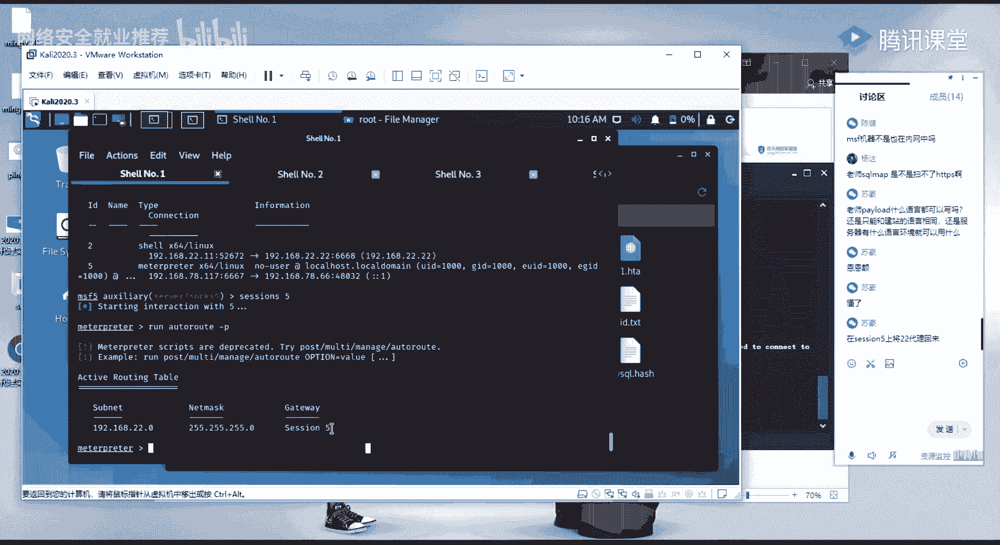

啊其实大家应该看了我的ppt了，应该应该能知道吧，好啊，那么我直接说吧。

就是说我们先来捋一下对吧，就我当前的话已经得到了这个啊，通过这边的这个筛选五对吧，也就是通过这边筛选五，今天这个样子的一个socks的一个通道，然后的话得到了这边内网的这个2。2。

这个机器的一个shell是吧，那么我们得到这个需要之后，我们如何去把这边的这个shell，把它给，就是把它给反弹到我们这边的一个msf上面去，我们当前的话是能够去访问到。

就是说能够通过这边的一个session，我去访问这个2。2这个机器的对吧，那么我们在这边反弹了。

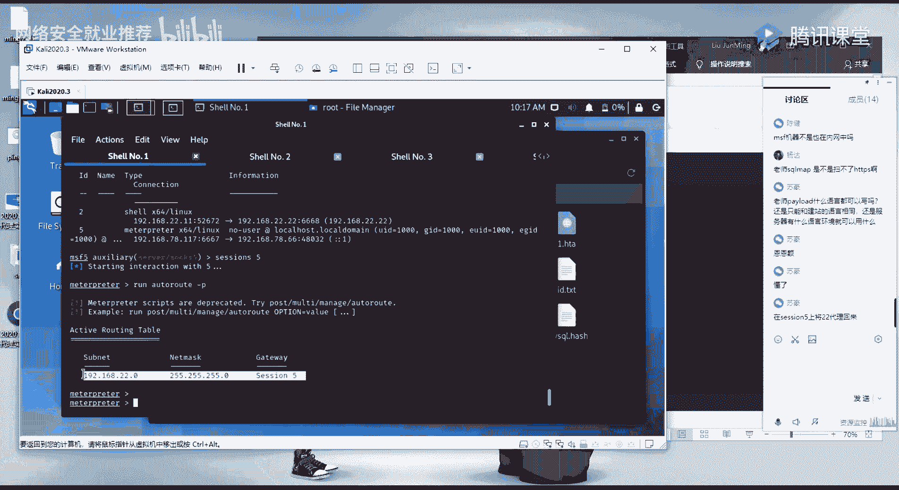

这个需要的话，这个这个色情五是怎么反弹过来的呢，我们的这边的一个三星5的话是通过这边对吧，通过我们在这边生成了这样子的一个反弹的，反正shell的这样子的一个暂定，上面的一个可执行程序对吧。

我们通过我们前面得到这个shell，来去执行这边反弹的一个啊shell，然后执行之后的话，就把它反弹到了我们的一个msf上面去对吧，然后注意到他这边是反弹下，就我这边为什么要去使用反弹线呢，以及呃。

啊啊没有说呃，其实在这边的话用不用反弹shell都可以啊，就是我用反弹shell以及正向修好都是可以的吧，因为我这边的这个机器的话是呃，呃我这边的这个机器的话，因为是呃能够跟我这边的这个msf。

都是能够互相互相访问的对吧，所以的话我通过正向下以及反向下，都是可以的对吧，然后在这边的话，就是说我在这边通过前面的这个进阶的一个绘，画，得到了这边的这个内网的这个2。2。

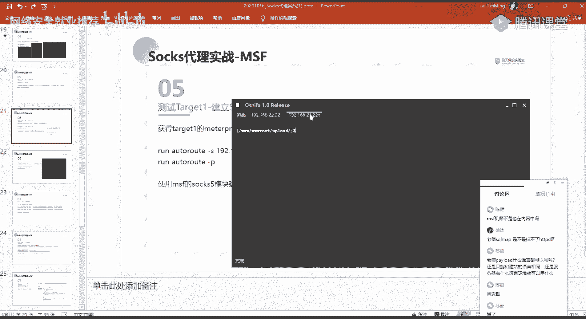

这个机器的一个shell，得到它的一个shell，我在这边是就是说我在这一个内网的这个网站，它是无法去直接访问到我们的一个外网的。

就是啊他在这边他的一个内网的话，它是无法去啊，他是啊无法出网的啊，其实前面已经有讲了，就是你要去判断你的这个机器，它所处的一个位置是吧，就是它的一个网络环境，以及去判断它是否能够去出网是吧。

然后在这边当前的这个机器的话是啊，出不了网的，就是它只是在内网的一个机器，然后我这边他不能够去出版，那么我们就无法去使用反弹器是吧，在这边的这个内网的这个机器，它无法去访问到我们在外网的这样子的一个。

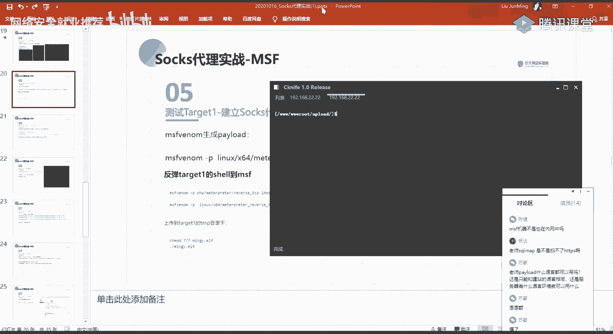

m sf的这一个呃ip对吧，所以的话我们就无法去反而下，所以的话我们尝试去使用这样子的一个正向性，这其实在内网的这样子的一个，用msf去这样子的一个得到shell的话，你呃通常的话都是。

就是说你要去有多个这样子的一个，网段的话对吧，多层网络的话，我们通常的话会去，通常的话都是使用的一个正向系啊，因为你要去反向下压的话，你的一个你的药，你就要你就是要要求你的这个内网的一个机器。

能够去访问外网是吧，但一般的情况下他可能是无法出网，所以的话我们就通过我们这边建立的这样子的，一个通过这个跳板机所得到的这样子的一个啊，筛选绘画来去访问，来去访问这个内网的这个二点网站对吧。

所以的话我们的一个操作的话，就是呃，首先通过m s f v dom来去生成这样子的一个，正向的一个项，就这边的生成的一个正向的一个这个码的话，就是说他在这边执行之后的话，他会在本地去今天这样子的一个。

6668的一个端口，然后的话来等待我们这边的一个连接是吧，因为我们在这边的话，它是我们是可以通过这边的一个筛选，去访问这个机器的对吧，去访问这个机器的这边今天的一个端口的，那么我们能够去访问到的话。

他只需要在这边今天这个端口，然后等待我们的一个请求的一个连接来去进行，来去进行临界，那么我们在这边的话，就能够去得到这边机器的一个呃筛选绘画，然后具体步骤的话就是这边啊，我这边就不一一操作了。

我已经在这边的话，已经就是啊已经上传上去了，就是这边的这个m3 m i g2。12f，当前话应该是，1198，呃这边的话没有，呃这边的话因为我前面的话已经执行过了。

所以的话这边他端口的话是处于一个今天状态，我这边的话把这个停掉，好当前的话没有了是吧，然后我这边的话因再通过这边得了希尔对吧，就是把它上传到我们的一个探索录下面，然后给它执行权限。

然后我这边的话就直接执行了，因为我前面的一个操作我已经操作了，我就不再营业的操作了，然后在这边去执行这个df文件，执行之后的话，在这边其实我们可以看看到，然后这边的话可以看到。

虽然他在这边显示执行失败了，但是没有就不影响他这边这边的这个呃，可执行程序已经执行了，就我这边执行之后的话，它的一个效果的话。

就是他会在本地进行一个6600发了一个端口，然后的话它监听了这个端口之后的话，我们怎么去进行一个连接呢，对吧，我们去进行一个连接的话，我们只需要去使用这样子的一个，使用我们的一个监听器的一个模块。

设置我们的一个payload为，设置为一个半的tcp的一个零件，也就是半的话就是正向的一个零件，然后我们设置这边的一个output，那我们在这边他在这边去今天的一个端口的话，是这样子的。

一个6668的一个端口对吧，也就是我们这边当前的这个呃，msf的一个流量的话，是要发送就是我们的一个请求的话，是要发送到这边的一个6668的一个包，对啊啊啊啊。

host的话就是我们要去发送请求的一个i p，也就是我们这边的一个2。2的这个机器对吧，那我们在这边的话，我们exploit ng执行执行之后的话，在这边的话可以看到。

就立马就得到了这样子的一个筛选六是吧，我们可以看一下设置筛选16，然后筛选六的话，在这边的话就进入到了他的一个筛选，在这边进入到进入到它的一个是来选的话呃，就你会发现有这样子的一个情况。

这个情况的话其实就是我们前面，我前面其实也要给大家提对吧，就是我在这边，就是你在这边你去使用的这样一个payload，比如说你使用的是这样子的一个shell的，这种ky的话。

你最后得到了这样子的一个筛选的话，它其实是像这样子的一个，这其实它会卡在这边是吧，你跳回车它也没反应啊，但是的话其实你当前的话已经进入到了，他的一个呃shell了，您可以执行命令，比如说ios对吧。

当前的根目录的话是在那个探头录走外卖啊，能够去执行这样子的一个命令啊，在这边的话我们要去退出来的话，你可能会直接ctrl c对吧，你ctrl c的话，你退的话，你就会把这样子的一个筛选给终止掉。

所以的话呃我们其实可以在这边去执行background，就在这边输入一个background，这注意的话在这边是不能够去table补全的，也需要手打。

然后的话在这边他会说bound section 6对吧，你敲个yes，然后在在这边的话会画的话，就哦在这边对吧，在我们那个后台啊，其实在这边你可能会就是呃像这样的一个需要，你用不习惯对吧。

你想要你想要去使用这样子的，west prior的一个需要，那么我们可以通过这样子的一个方法，就通过筛选杠u，然后指定这样子的一个session，来，把这样子的一个，就是通过这样这边的这个模块啊。

就通过这个shell to meet create的这个模块，把我们当前的这样子的一个，就是shell的这样子的一个shell，把它给就是进行一个升级。

升级成我们这边的一个matt pat的一个session，然后我们可以可以看到在这边执行之后的话，它返回了一个筛选，七对吧，是一个match past的一个筛选，然后我们筛选时查看在这边有一个筛选器。

我们可以进入这个筛选器。

然后的话，对吧，就得到了这样的一个max的一个项，然后现在的话我们就呃已经得到了这边的这个，202这个机器的一个需要对吧，把它反弹到了我们的一个msf上面对吧，我们为什么要去反弹到，就是把它给呃。

反正把它给就是转到我们的一个msf呢，因为我们想要去做下一步的一个操作，就是去对这边的一个33。33的这个机器。

去做一个操作的话，我们就需要这边的这个筛选，需要这边的一个筛选七对吧，因为我们在这边要去访问到这个三三，这个网站号，我们只能通过这边的这个筛选器，也就是这边的这个啊，这边的这个2。2这个机器对吧。

所以的话我们在这边同，我们在这边要想让我这边msf啊，去访问到这边的一个三三这个网站的话，我们从我们需要去添加一个路由，这边路由的话，指定指定是添加到我们的一个，33033的这个网站。

然后大家要注意的就是你添加路由的话，就是说你要你想要说你想要让哪一个筛选，就是你要，大家脑子里面一定要这样子的一个。

就是呃一个概念，或者说有这样的一个思路，就是说我要通过哪一个，我要通过哪一个shell，通过哪一个筛选才来去访问这边的啊。

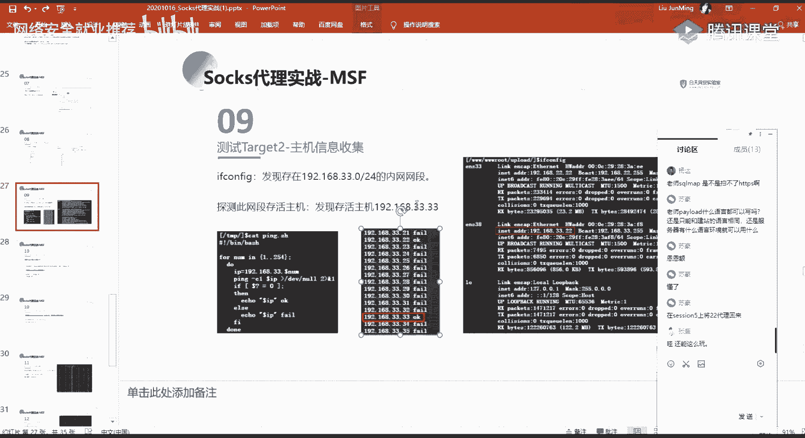

这个ip对吧，然后我这边还是要通过这个筛选器，所以的话我需要在这个session 7，下面去添加一个路由，然后这边的话，这边添加了一个路由的话，我们可以看到就是通过这个筛选七，添加到了这样啊。

添加了一个就到这一个二，哎不好意思，喉咙有点卡，哎讲的有点累了，就通过这边的这一个筛选七对吧，这个网关来去访问这边山上的这个网站啊，然后呃我们在这边的话。

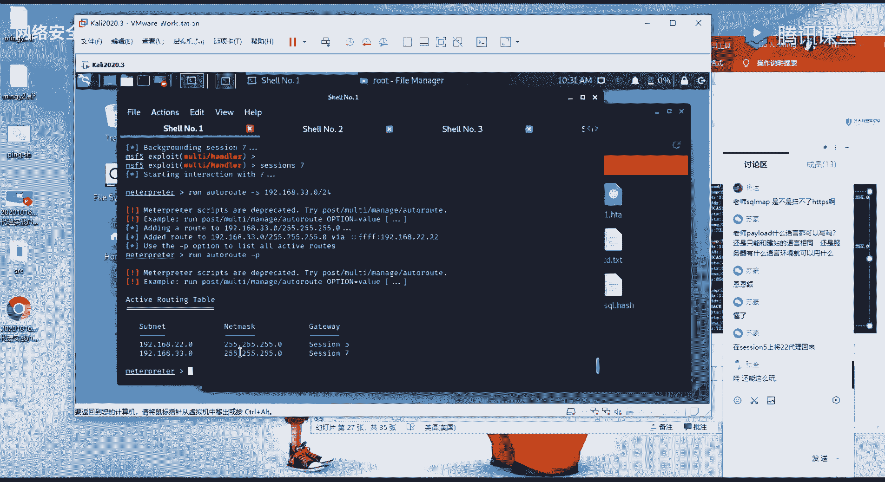

我们在这边的话添加了这样子的一个路由之后，对吧，我们就可以去尝试看是否能够通过这边的这边。

我们前面已经静静的这样，人所指的一个代理通道是吧，就其实这边建议的这样子的一个说辞，带有通道的话，就我们呃只要把我们的一个，就是把我们的一个代理，设置成我们这边的一个呃ip。

以及这边代理的一个1080的一个端口的话，那么它的这种流量，它都会转到我们这边的一个msf去，然后他转到这边msf的话，它会自动的去查找，比如说我这边要去访问这边三三的。

就是比如说我发起这样一个gp的一个请求，是访问这边的一个192。168。3，3。33的这个机器对吧，那么我发起这个请求，我通过这边的一个收拾代理通道之后的话，他会在这边去找到，找到哪找到哪里呢对吧。

找到哪一个，他能够去访问到这个33033的这个网站，那么它自然的话就会找到这边嘛对吧，就通过这边的这个筛选器，就能够去访问到这边的一个三三的网段了，所以的话他的流量它会通过这个筛选器。

然后的话呃把它给传到，或者说转到这边的一个33。33的，这个8年的一个端口上面去，好，我们在这里的话可以去可以来测试一下呃，当然的话在这边的话，这边的话因为它是一个windows的一个机器。

就我们当前我们现在能够去访问到这个对吧。

我们同样的第一步的话，就是需要去做一个信息收集嘛是吧，所以我们可以通过这边的extrance，来扫以下这边的一个三三这个网站，我这边的话我不扫完了，直接断掉对吧，然后当你发现在这边有这种ok的话。

那说明我们这边的一个代理通道的话，是没有问题的对吧，我们可以通过我们这边的这里的一个，socks的一个代理来去访问到，原本无法访问到，就这样子的一个33。33这个ip对吧。

以及能够去探测到它存活的这样子的一些端口，3389139，就我们通过这些存款的一个端口，也能够去判断它就是说它的一个呃主机，它是一个windows的一个系统对吧。

像这种3389就是我们的一个i d p嘛对吧，然后我们这边探测到它的这样的一些存货，端口的话，就又回到了前面的一个失误对吧，去对它对应的一个端口做一个漏洞的一个分析，利用了是吧，然后在这边的话。

我们发现它有这样的一个，45的一个端口存货，想到45的话，我们就不得不试一下，我们的一个就是永恒自然吧，m21 173020的这个漏洞，然后的话正好这边的话，正好这边的话能够通过这个漏洞去得到呃。

去反他一个shell，然后在这边的话，呃我们可以看一下，这边我们通过这边的一个m3 m4 ，17020的这个p s x一的这个模块，然后执行之后的话，直接得到了这边的一个shell。

只因为我们知道直接通过m41 切开，02年的话，他得到了一个shell的话，它是一个呃啊这样子的一个system的一个权限，也就是它的一个最高的一个权限，然后呃这边的话，这边跟这边是一样的。

然后呃我，我们来操作一下。

看一下，看是否能通过这样的一个方法来应用成功。

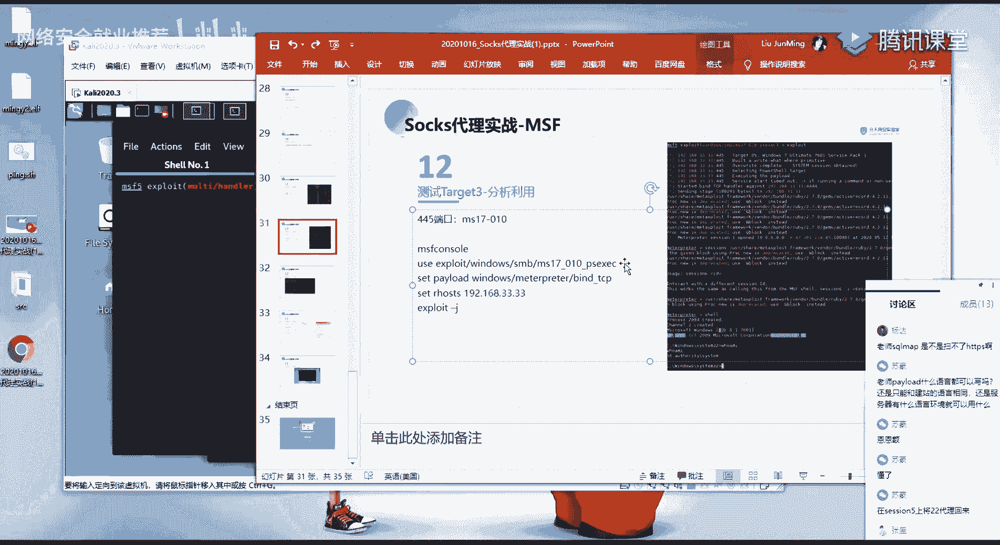

这个话只使用这一个模块，然后设置keynote。

我这边我就不敲了。

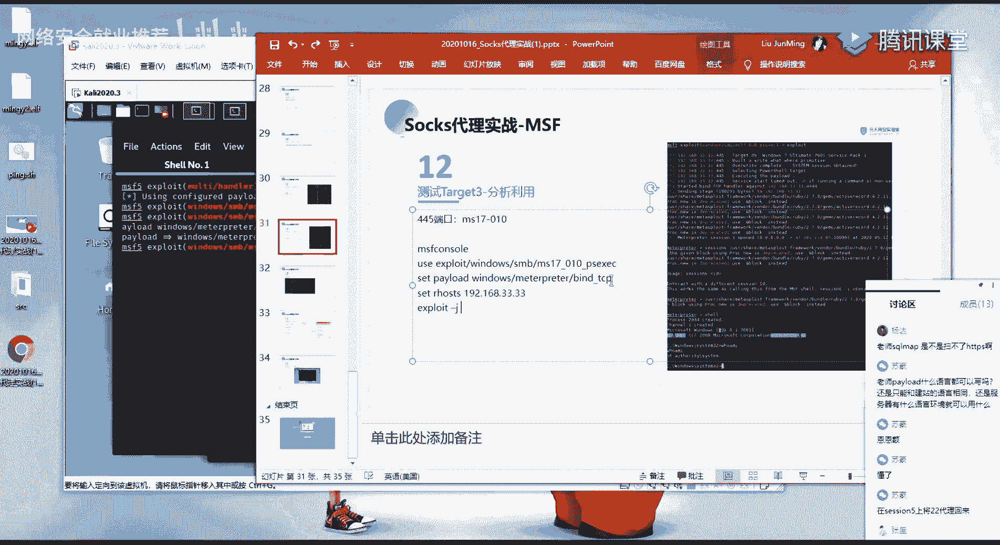

啥玩意不怎么清，啊这边他是已经设成功的，设置我们的一个ip对吧，我这边的话已经设好了，然后端口的话就默认了，默认44是吧，exploit根据去执行，执行之后的话，他在这边的话，他就会去啊去发送这边呃。

去向我们这边的这一个33。33的这个ip，去发送呃，这边的一个请求对吧，发生了这一个请求的话，它要传递这样子的一个一个数据，就是利用去利用这边msf，17020的这样子的一些pdd是吧。

传过去传过去之后的话，在这边可以看到已经反弹了一个筛选八，然后我们可以切换到这个视频吧，查看一下它的一个权限对吧，指的是一个c怎么一个权限，我不知道，及天下对吧，能够去。

直接能够去进入到它的一个主机的一个啊，sam d的选，然而像这种乱码的话，我们可以通过c h c p65001 ，就是更改我们的一个代码一样，其实在这边的话，其实就是他的一个编码的一个问题啊。

然后我们再通关者去执行的话就没有问题了，c hcp 65001。

然后呃在这边的话就是，我们通过我们前面得到了这样子的一个啊，share对吧，然后他把他的一个shell。

反射到我们那个msf。

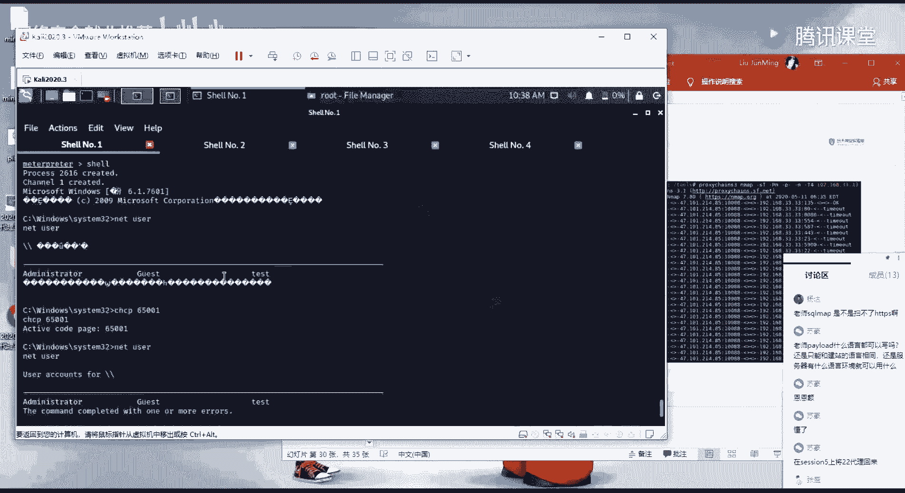

然后的话再利用啊，我们的一个代理通道，来去探测这边的一个33。33网段的，一个存活的一个端口对吧，然后的话在对它的一个端口做了一个neo，这句话利用的是m21 一七，2020的一个漏洞。

利用完成之后的话，就是得到了他的一个system的一个权限对吧，然后以及还有其他的一些端口，像比如说在这边3389的一个端口，就是我们啊。

因为我们前面这边的话，已经得到了他这个需要嘛对吧，我们其实可以在进入。

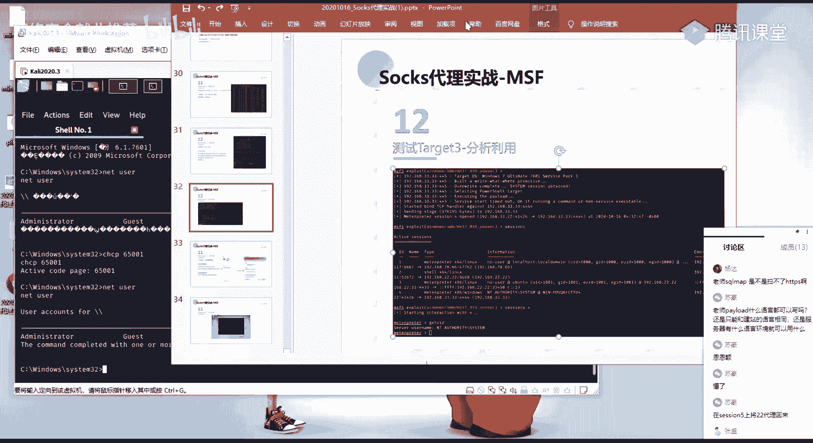

我们可以通过这边得到这个shell，来去添加一个管理员的一个用户对吧，然后的话我们就可以通过它这边开放的一个，3389的一个端口，去进行一个远程桌面的一个连接，然后添加的一个呃。

添加管理用户的一个命令的话，就是这样子，我这边的话我就不多说了，然后我这边已经添加成功了，好添加成功之后的话，我要去进行一个远程桌面的一个连接对吧，那么远程桌面连接的话呃，我们怎么去进行一个连接呢。

首先第一种的话，其实呃我们的一个msf当中，其实已经有这样子的一个，and that's the top，有这样子的一个力量，第一，怎么用来着，放油看p酱油，然后其实在这边啊linux里面的话有啊。

我看你看你机器里面的话，有这样子的一个自带的一个r d p r detop，这样子的一个命令，然后在这个dex top命令的话，我们可以通过这样的一个方法，来去进行一个连接，然后同样的要注意。

就是我们要我们的一个连接的话，要走这样子的一个锁死的一个通道，所以要加这个pros trans，然后连接之后的话，在这边，因为我这边的话是已经连接了，所以的话呃我这边再去连接，就是连接的话。

他这边需要去进行一个就是呃断开啊，就是要断开其他用户的一个连接，会把它挤下来嘛是吧。

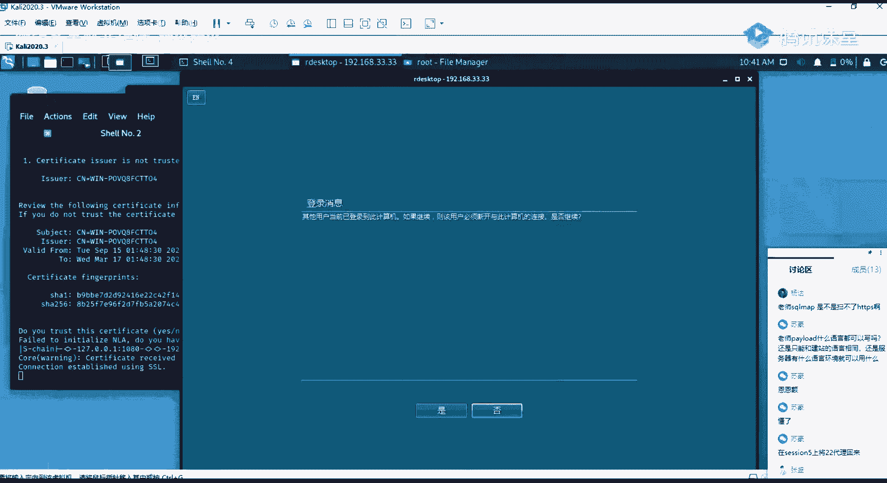

因为我这边这边这边的话是已经连接了嘛对吧。

我这边就否了。

然后还有一种的话，就是就大家可能就是在windows上面用的熟练一些，对吧，那么在这里的话，我们可以通过，我们可以通过这样子的一个，全局代理的一个工具啊。

就我们知道在我们的一个windows机器上面对吧，有这样子的一个，诶，诶远程桌面的那个是啥，命令是啥来着，突然忘了是啊，谁记得吗，是那个什么m e t，而且突然脑袋就卡壳了，上一tx t1 ，好m哦。

m m s t s c啊，我就突然脑袋就卡壳了，m s t s c，就是这个，然后的话呃我们在这边的话，我们可以通过这样子的一个呃在windows上面的话，我们通常会通过这样子的一个。

远程桌面的一个工具去进行一个连接，对吧啊对就是就这个我就突然脑袋就卡了一下，然后的话呃在这边的话，我们可以通过这样子的一个全局代理工具啊，我们在这边可以去设置我们的一个代理服务器。

我在这边的话就使用的是这个是吧，就这一个代理服务器设置好之后的话，在这边我们需要就是设置代理服务器，是这个process service，然后去自己去做一个编辑对吧，选择就是你的服务器端口。

以及你的一个搜索这个版本，还有的话如果你有做这样的一个身份验证的话，在这边就是启用它，然后挺简单的一个账号密码是吧，好ok ok，然后选择这个这里这里的有个los lo，实上就是规则，在这边规则的话。

其实就是设置，我们走这一个代理的这样子的一个呃程序，像比如说在这边的话，我设置的话就是这个mtc这个对吧，就是选择这个程序，选择这个程序的话，你可以通过在这边去寻找吧，像这种linux系统。

淘宝windows系统下面的这种啊自带程序化，它这个系统32目录下面，你可以去直接去是吧，直接去找到它，然后它把它添加进去，进来进去之后的话，在这边我们主要的话就是要设置这个action。

action的话就是我们的一个动作，也就是我们呃在这边的话可以选三个对吧，doppler的指令也就是他不走代理对吧，然后break的话就是锁住嘛，就是镜子就是不让这个程序去和访问。

然后在这边process socks 5的话，就是呃让这边的这个程序它的一个流量轴，我们这边的一个sos的一个代理对吧，其实这边的话就是我们想要的，然后我们把它添加进去，添加进去之后的话。

我们在这边就去啊连接我们的那一个用户对吧，然后可以看到在这边你连接之后的话，他在这边就有这样子的一个啊，它会显示在这里，以及在这边有这样子的一个啊，呃流量的一个请求对吧。

就是这个程序他去请求了这边的一个，这边ip的一个3389，它是通过我这边的一个代理对吧，然后我这边出现一个登录对吧。

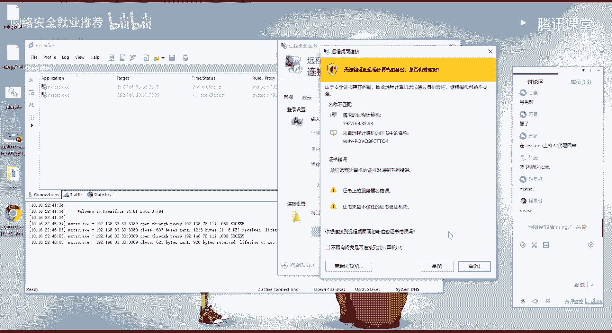

然后就能够去正正常的去登录到这边的一个三，3。33的这个ip，我这边看一下，这边的话呃，因为它是一个新用户，就是它是一个我添加了一个新用，所以他这边加载的话，因为他需要去加载系统的一个配置。

所以的话比较慢啊，这边的话。

不等了吧，这边的话就不等了，就是说我们可以通过这样的一个方法，能够去正正常的去连接到我们这边，内网的这个啊windows机器的一个远程桌面是吧，也就是呃最后的一个效果的话，就是像这样子，其实就是，好啊。

以上的话就是我们本节课的一个内容，然后大家有没有什么疑问，呃我猜应该没有什么疑问吧，就是有疑问应该是等大家呃自己课后去做一遍，再那个吧好吧。

然后呃这节课的一个课后作业的话，就是就是大家把这边已经对吧，可以连连接上来了，我这边的话不那个了，我直接断了，呃这节课的一个作业的话，就是大家，自己去嗯，男真的就大家把自己这边搭建的这个靶场是吧。

应该有去搭建吧，我在预期内容里面其实也要写对吧，大大家自己如果没有搭建的话，自己去搭建一下，自己搭建这样子一个靶场，搭建好之后的话，然后的话再按照我这边ppt上面的一个内容。

自己去走一遍，然后有问题再再来问我好吧，然后呃现在的话已经比较晚了呀。

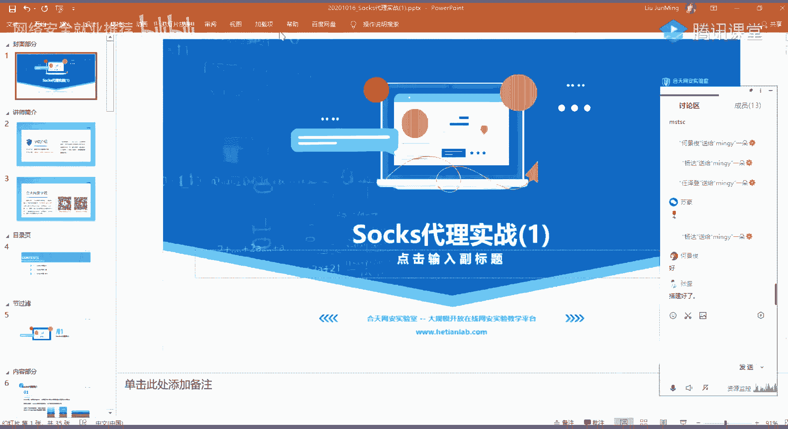

就是呃呃你搭建好了的话，你自己去试一下，好吧啊，呃，大家没有什么问题了吧，应该没什么问题吧，能主要的话最好还是问一句，就是能听懂吧，听是能听懂吧对吧，嗯不管说你能不能先操作对吧。

我这边讲的话应该是能听懂的吧对吧，今天很详细啊，以前的不详细嘛，我觉得以前的应该也讲的是挺详细的，因为呃其他同学呢，呃对内网的操作都是以跳板服务器。

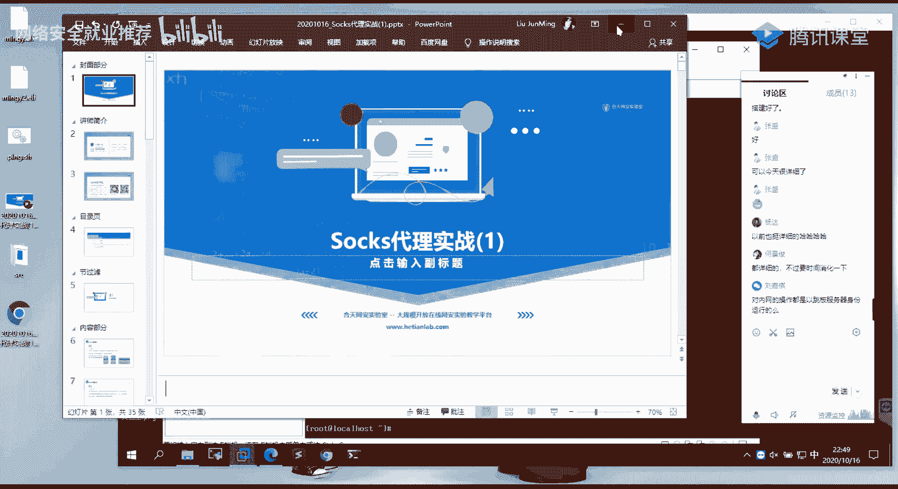

呃，你这个以前不是说以他的一个身份啊，而是说我们在这边对吧，我们在这边的话，我们想要去进入到它的一个内网，其实是通过我们这边拿下了这台呃，外网的这个机器对吧，这样的话如果说你本来就已经在内网的话。

那么那么就其实没有说有这种呃，跳板机的一个说法，当然的话就是说这个跳板机其实是说，就像比如说你当前的话，你是在二二这个网站对吧，然后的话你你拿下了这边二，拿下了这边的这个2。2，这个机器的一个ip对吧。

然后你再通过这边的这个机器呃，来去拿下了三三网络这个机器，那么这边的这个2。2这个机器，其实也是一个跳板机嘛对吧，因为你是通过这边的这个啊机器来拿下了，这边这边的一个三三网站，下面的一个机器嘛是吧。

同理的话，在这边我们就说我们要直接，我们是无法直接的去访问到内网的对吧，我们有一有前提条件的，就是说你需要有这样子的一个机器，这个机器的话呃，他是在外网，然后的话他这个机器它是能够去有一个网卡。

不能够去访问到内网的网段的对吧，然后的话我们才能够说，以这一个机器做一个跳板机，来去进行一个内网的一个渗透是吧。

就同理的话，我们最后的对吧，我们最后的这边的话，我们最后这边通过前面的像三，我们最后这边拿下33。33这个机器的话，是通过前面这边2。2这个机器的一个shell对吧，然后的话我们其实这个2。2这个机器。

你也可以是作为一个，也可以是把它当成一个跳板嘛对吧，因为像这种这种话不是一个横向渗透，是一个就纵向的一个渗透吧对吧，它是多个网段的这样子的一个渗透，然后的话你通过中间的这个机器。

拿下了另外网站的一个机器能理解吧，这位同学还有问题吗，理解了吗，呃大家都没问题了，好啊，那就下课吧好吧，今天讲的有点晚了，现在还听课的也没几位同学了哦。

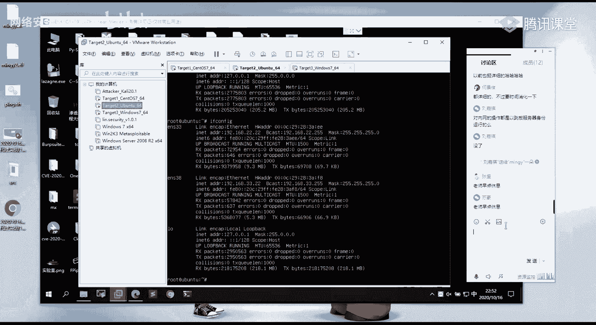