# 【B站最系统的网络安全教程】北大大佬196小时讲完的网安教程，全程干货无废话！学完即可就业，别在盲目自学了！！！ - P65：第34天：EW创建 Socks代理实战 - 网络安全就业推荐 - BV1Zu411s79i

通过这边的这个网卡把它给发送到这个2。2，这个机器的那个啊半联端口对吧，应该是外网服务嘛，它会发生过去，发送过去之后的话，他就会呃就是进行相应的一个请求嘛对吧，然后的话就能够去得到我们这边的这样子的。

一个呃内容对吧。

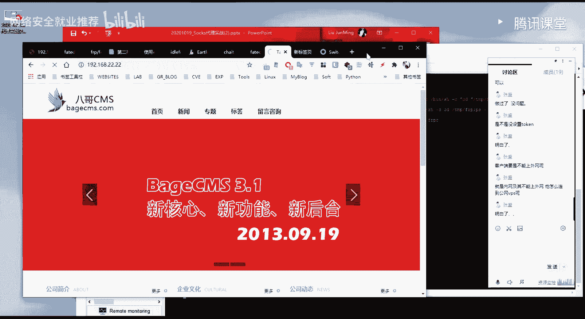

然后呢同理，其实呃二层的一个代理通的话，它就中间只是多了这样子一个流量的一个转发。

因为我们，08：50，我这边切一下诶，这边第第一节课的话已经到时间了，我这边下下课，然后的话等会。

好我们继续啊，刚才的话讲到了就是一层代理的时候，它的一个流量的一个走向对吧，其实二层的一个单元的话也是一样的一个道理，就只是在这边的话。

它中间多了有这样子的一个流量的一个转发，我们可以结合一下这边呢它的一个配置文件，来去理解吧，首先的话在这边是我的一个外网的一个web服务，对吧，它会这边的一个客户端的话。

他会去迎接我们这个v p s上面的，这个7000的一个端口对吧，然后的话建立一个代理通道，好建议代理通道之后的话，我这边的话我就能够去访问到这边的呃。

这这边的这个机器对吧，这边的这个机器就能够去访问到了，然后的话我们还要去访问，就是说三三哦，就是说去访问2。2啊，不是访问三三这个机器的话对吧，我们是要通过这个二，这个机器才能够去访问到的对吧。

然后这个二这个机器跟这边的这个机器，它是能够互相访问的是吧，那么在这个时候的话，我们就需要有这样子的一个通道，就是尽力就是尽力这边的一个2。2啊，我我以这边这一个ip啊，就是这边它同一个网段嘛，因为2。

2这个机器对吧，与这边的2。1的这个机器，要有这样子的一个通道对吧，因为我们的一个请求的话。

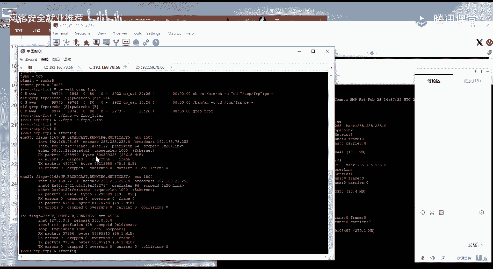

我们要能够去发送到这边的这个呃，三三这个网站，那么我在这边其实就是相当于就是说在这边呃，2。1跟2。2之间，我们还需要有一个这样子的一个代理通道，因为我只有把这边把我的一个请求。

或者说把我这边的一个内网的这个网站，把它带你出去，我才能够说能够去访问到，或者说以流量的一个形式的话，就是我这边的这里。

我的一个请求发送到了这边的这个机器对吧，然后的话我想要呃把它发送到我这边山上，这个网站的话，我中间需要有这样的一个代理通道，把我的一个流量把它给带你到这边来对吧。

所以的话我们在这边的话，就需要有这样的一个操作，就是我通过这边的这一个呃a。

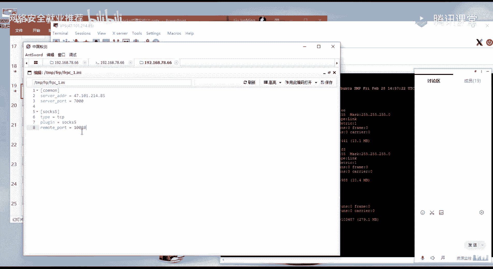

不算。

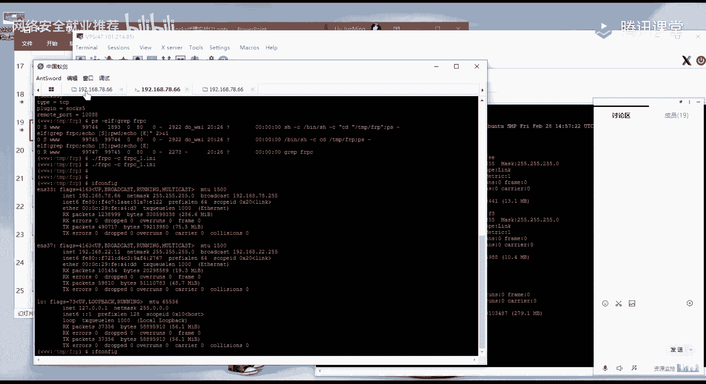

我通过这边呃，就是这边的这个2。1的这个机器对吧，我再去建立这样的一个f r p s，通过f r p s来去建立这样子的一个，去监听一个端口对吧，作为一个f ip的一个socks的一个服务端。

然后在这边2。2这个机器的话，我在运行我这边的一个f i p c对吧，运行我这边的一个fpc客户端，然后的话与我这边的这个2。1的这个机器，建立一个连接，来去建立一个收拾的一个通道对吧。

那么建立这一个说是通道的话，我们要去要把我们那个请求，要能够去代理到这个通道的话，在这边的话我们就需要有一个端口对吧，其实啊就是这个10089的一个端口，然后这个20089端口的话。

他就会在这边进进入今天嘛对吧。

在这边的这个2。1的这个机器，今天这样子一个1089的一个端口。

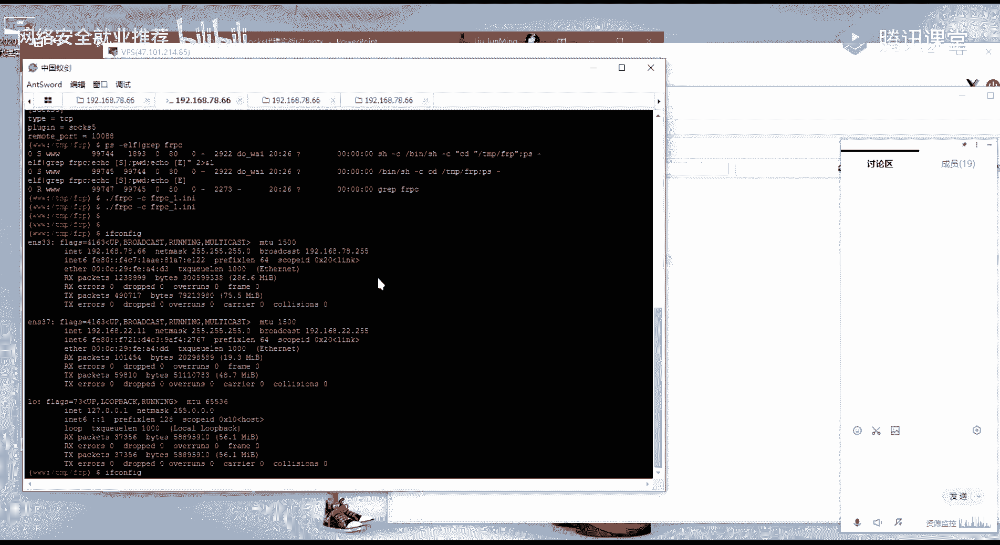

然后我们最后的话还有这边，就是说我通过这边建立了一个连接，我的一个请求到了这边对吧，那么我要去把我的一个请求，再把它转发到我这边的，这个10089的一个端，说的话我需要有这样的一个配置。

然后呃在这边的话就是说我要去建议这，我要去进入这边呃，2011的这个机器，跟我u p s进行了一个代理通的话，我需要通过这一个109年的一个端口对吧，那么我的一个实际的一个流量流量请求。

比如说我这边的一个web服务对吧，33。33去访问这个33033，就是假如word，那么我的这一个web请求，我请求之后的话，我这边的一个代理代理通道的话，我是要去就是通过我这边的一个九零这个对吧。

然后的话来去进入这边的一个代理通道。

把我这个请求代理代理代理进去，带你到这边的这个机器对吧。

然后的话带你到这个机器是上面的话，我这边是访问的是三三对吧，那么我三三的话是在这边，所以的话我需要把我这边的一个请求，再把它转发到这边的一个呃，这边的2。1与这边202这个机器之间，建立的一个代理通道。

也就是通过这边的这个10089的一个端口，其实就是把这边从20090端口过来的请求，把它给转到这边的一个端口，也就进入到了这边的呃，这边这两个机器之间建立了一个代理通道对吧。

然后的话这边的一个请求的话就带你到了这边，那么它就能够通过这边的一个网卡来去访问到，33。33的一个八零端口是吧，呃这里能大家能理解吗，大家呃能跟得上我的思路吗，应该可以吧，就呃就张三没问题吧。

其他同学呢，就大家觉得我就是呃可能讲的快了，或者说哪里没讲，没讲明白什么的，都可以提出来，可以是吧，ok那那么我们具体的来操作一下。

我们具体的来实现一下。

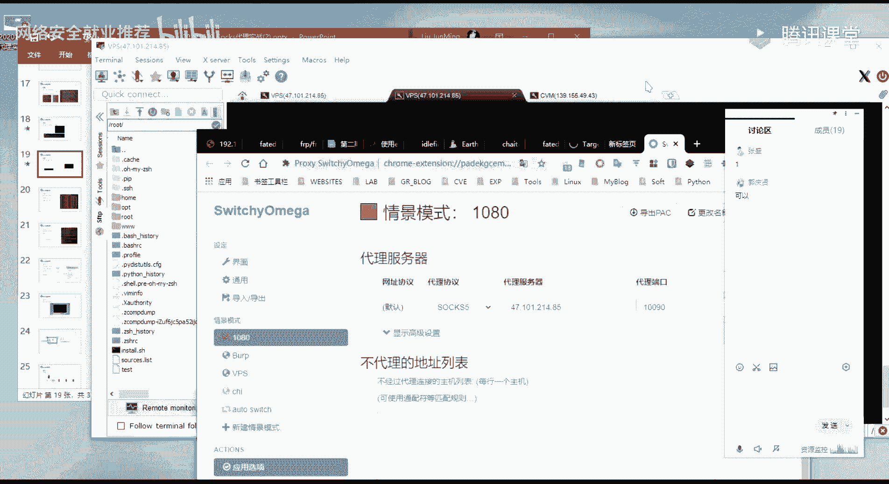

就其实呃他的一个远，它的一个具体的操作，我刚刚其实已经也讲了对吧，以及为什么要去这样子的一个操作，而在这边的话，首先的话我们需要在fi呃，我们那个u p s上面对吧，这边是去，我直接关了吧，我直接断了。

我重新来吧，然后呢，就怕大家可能不是很理解，是首先的话呃，我在我的一个u p s上面对吧，我要去今天一个端口，来等待我们的一个客户端的一个零件，我这边的话就是fp c一点，对吧。

然后我这边的话就今天的一个7000的一个端口。

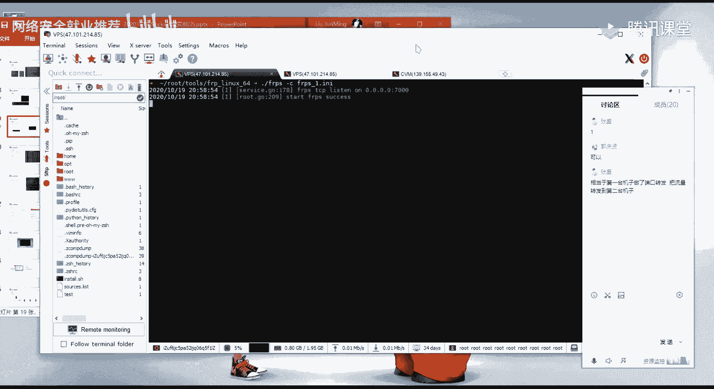

今天这个端口之后的话，我再通过。

我这边得到的，通过这边得到的这个外网的这个外服的一个shell。

对吧，上传我这边的一个f点，把pc的一个客户端是吧，我这边的话上传在这边，然后的话给他一个执行权限，然后我呃我先看一下有没有还有没有，放屁，我这边的话把这些都删了，可以看到我这边有自行开发p s。

这是我之前测试的，我这边把它给跳掉，你还有钱，啊现在的话已经没有了对吧，然后的话我在这边我要去与我这边的，这里的一个通道去建立一个临界呃，刚开始的第一种的话就是通过通过这样子的啊，通过这边啊。

通过这里对吧，我通过f r t c去指定这边的一个通道，区间的一个零件是吧，那么下面的话我想要去把我的一个能量，就是我这边的话，直接就用这边的一个配置文件是吧，那其实在这里的话。

其实同样的也能够去做一个，与他那个去建立一个代理对吧，然后的话通过10088的一个端口好，我这边的话要去进行一个20段的话，我指定这边的这个是一吧，1。22。

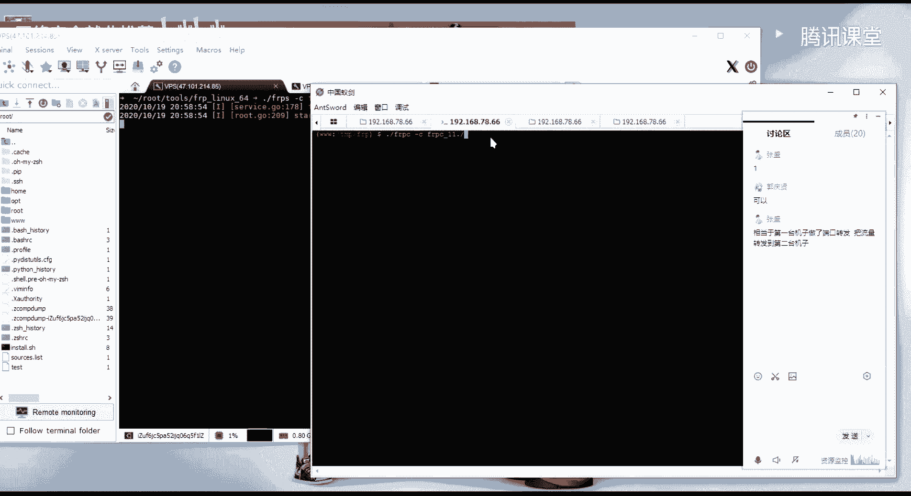

来去这边去进行一个零件对吧，然后可以看到在这边呃，有两个prox已经就是建立成功了对吧。

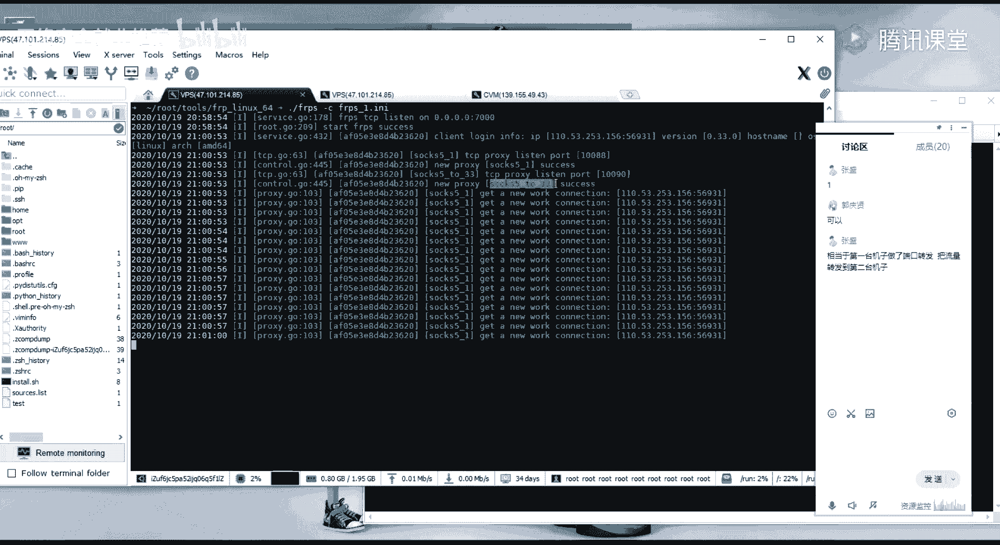

然后建立建立成功之后的话，我在这边的话对吧，我在这边的话就有了，我们可以看一下，我在这边的话就与这边去建立了一个连接对吧。

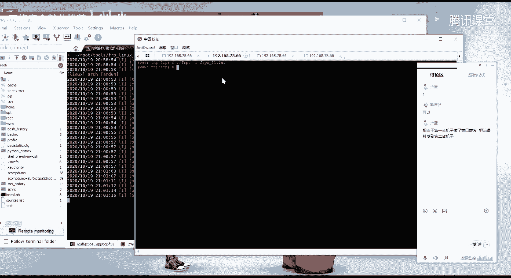

然后的话我在这边的话就有他会去，今天这个端口不，这里的这个代理端口，那么我现在的话就能够去通过这个代理端口。

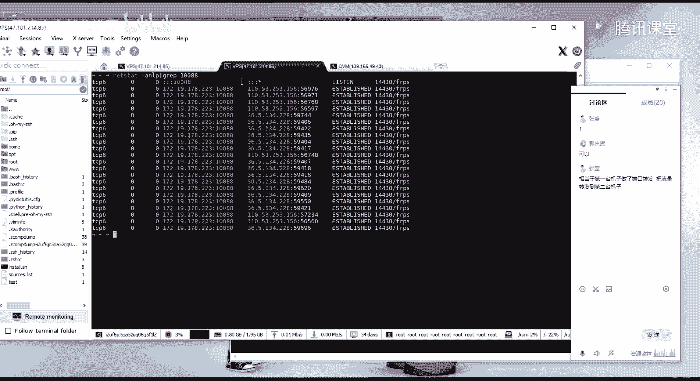

来去访问2。2那个网段对，然后因为前面的话我们已经得到了这个，请通过前面的那个对吧，已经得到了他的一个sh对，那么我现在的话只需要再通过这边的一个代理，通过原来的一个代理对吧。

然后的话得到这边的一个选嗯。

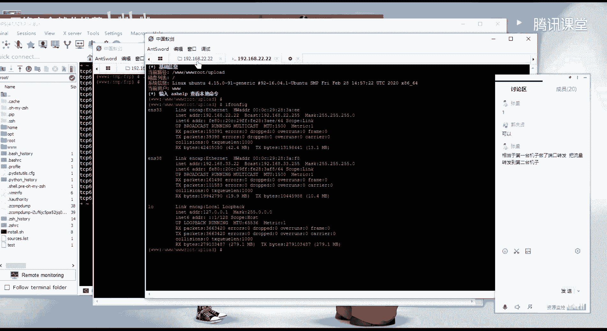

请回，啊是没有问题的，因为我们在这块，其实同样的静静的这样的一个代理吧，然后我通过这边的一个11088，我同样的能够去访问这个这个网段啊。

然后下下面的话，我要把我的一个流量把它给转到，比如说把它给转到这个三三这个网站。

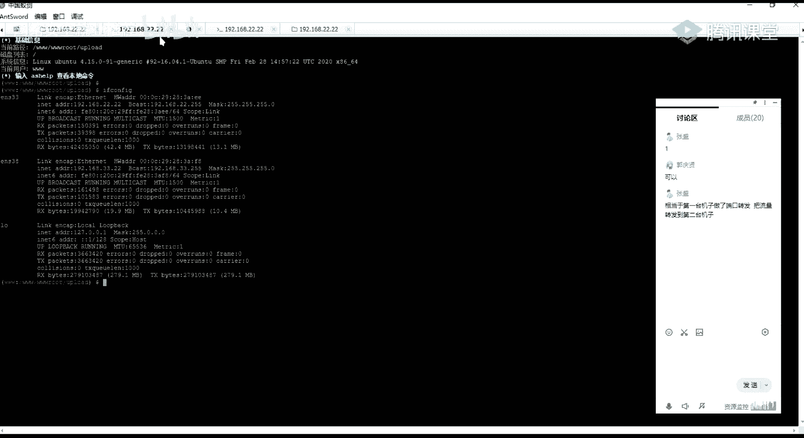

我们就需要去做这样子的一个操作。

首先的话第一个就是在我这边的嗯，这边这边的这个tag的一上面，我需要通过，f i t s来去，今天一个端口来去等待这边的，我这边二的这个呃，f p在客户端来去进行一个连接，对吧啊，这边的话是rpc。

应该是吧，就这个f p s是吧。

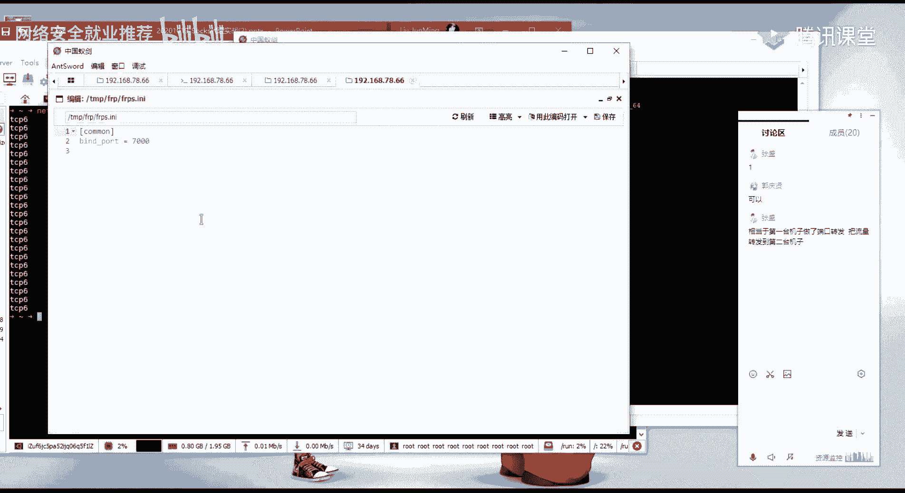

到这里，然后在这里的话，我们可以来看一下是否可以执行，成了执行成功的，左边m p s对吧，可以看到这句话已经执行成功了，然后他在这边本地的话，就进行了这样子的一个端口，这个端口的话就是七把好，我七星。

七七那个端口对吧，已经处于一个精心的状态，好我们在这边的话，再通过侧边来去建立一个，你建立一个sos的一个连接，执行这边的一个fp r f r p c，执行之后的话我们的一个配置文件对吧。

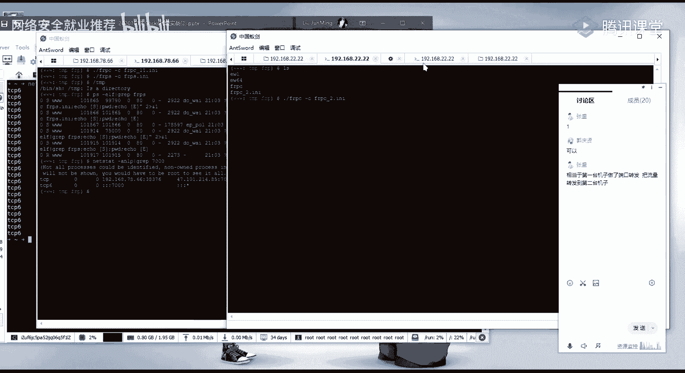

我们可以看一下我们的一个配置文件的话，它会是在呃我们那个f r p s上面，他会去今天一个这样的一个。

10089的一个端口，那么我们去判断它是否建立连接的话，我们就可以去查看一下它和这个端口，它是否有一个今天的一个状态，0089对吧，可以看到已经处于一个精神状态。

那么现在我们经历了这样的一个连接之后对吧，经历了这样的一个连接之后的话。

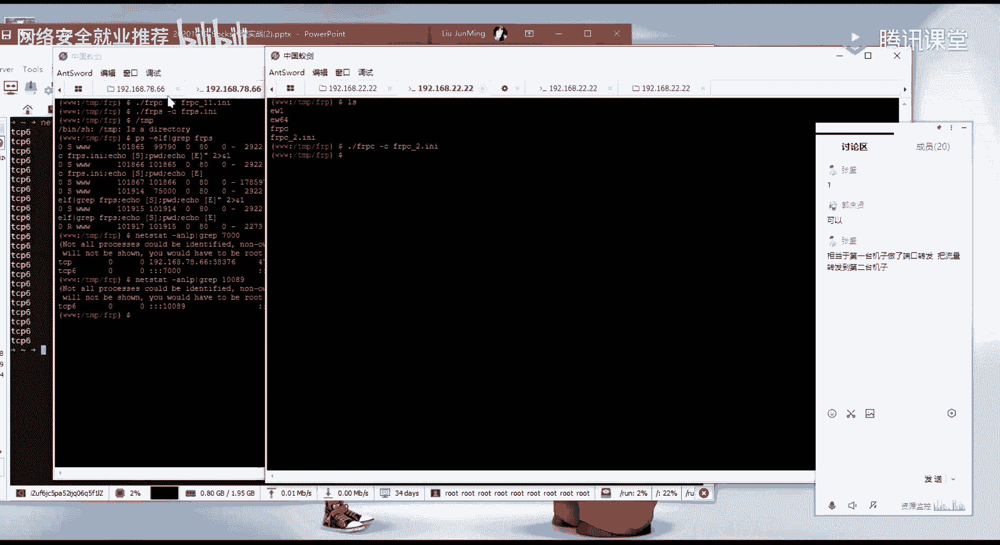

我们再通过呃。

比如说呃这个还是比这个机器为例。

我们需要去更改一下我那个配置，因为我们这边的一个代理端口的话，已经定了是吧，现在的话是阳明经，然后我们通过prox chains同样的来去扫描一下，这个192。268。3，3。33，这个主机。

没经验成功，等一下按键。

啊我这边还要发pc端，掉了又，这个用通过这样子这个方法它有缺点，就是比较容易断，我这边的话呃。

其实从这边应该也能看到对吧。

这就是我这边的一个啊sos的一个代理的话，已经就是被关闭了。

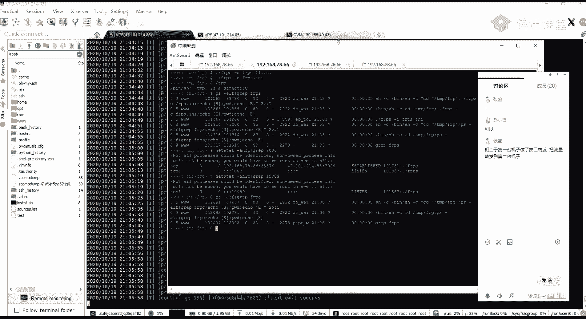

所以的话我这边就是找这找找这个问题的话，就是我这边的一个fpc对吧，没有跟我v p上面的一个发p，去鉴定了一个连接啊，这个是一点，又要从头来一遍，信号应该是没问题的。

这里的话也已经进入了临界对吧，然后的话我们在我另外的一个服务器上面。

还去进行一个对吧，通过map来去对它做一个扫描，可以看到这段话，ok他ok就是3389端口开放了对吧，还有445，135等等这些端口，139它是一个开放的一个状态，那么说明的话我这边的一个通告的话。

就是已经进入尽力尽力成功了对吧。

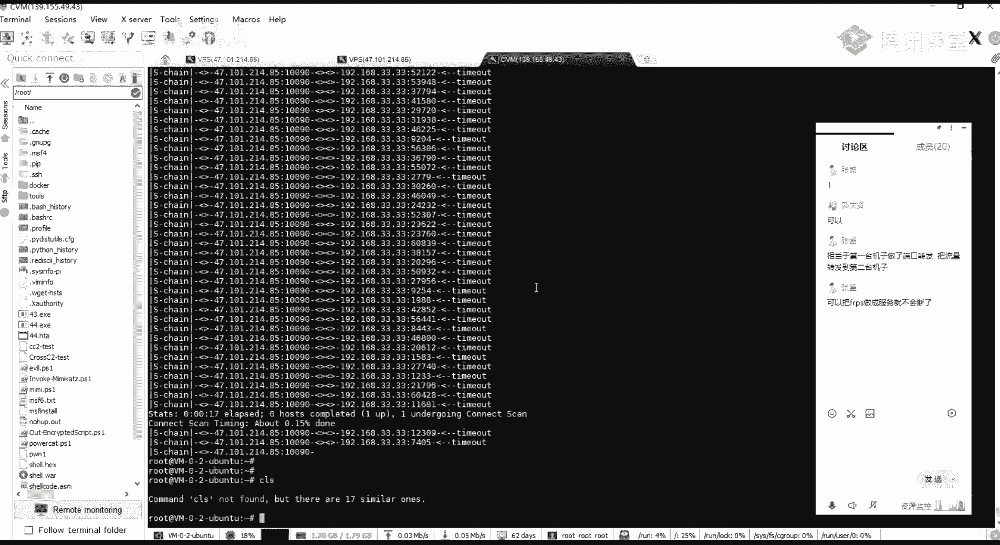

是没有问题的，然后以及对吧，我这边可以通过，可以通过全局代理对吧，因为我前面的话已经就是我后面后，后续的一个操作，就对windows的一个机器吧对吧，就windows那个机器的话呃。

我们可以就在msf当中去设置，那样子的一个概念，就是设置全局代理，让我们msf的一个流量走，我这边的这样子的一个代理通道，就是呃这个47。102。214。85，然后这个20090这个ip这个端口是吧。

前面在讲msf的啊，不再讲m s f跟cs啊，灵动的时候不是啊，cs上面的话它会有这样子的一个啊，就是生成一个这样的一个命令，就是seer啊，sc机，pro keys是吧，so i对。

然后的话接我们的一个i p，以及端口是吧，然后其实在msf在msf当中的话，我们同样的可以就是通过这样子一个方法，这个方这里的话就是设置的计划，就是设置一个全局吧，就设置一个全局代理。

就是在msf当中所有的这样的一个流量，就是呃比如说我msi msf去打m1730209 ，它有相应的请求以及发送相应的一个po的，那我这边设置这个代理之后的话，我要去打这个192。16，8。33。

33这个机器对吧，那么我再去设置那个po的时候，我可以去设置这样的一个代表，然后的话设置这个ip，然后只直接explore就可以了，然后他的这样子的，他打在打这个ip的这个流量的话。

它会通过这边的一个代理通道，它会把它发送到这边的，我这边的一个靶机的这个对吧，这个靶机的45的一个端口是吧。

然后的话呢去进行一个漏洞的一个new，然后这边的话我就大家自己做一个课后作业，大家自己去尝试好吧，然后呃，其实大家现在可以就通过我这边的这个代理，就是在我这边的这一个，10090对吧。

以及还有10088嘛，通过这样的一个代理，你可以去访尝试访问，这还有个10088对吧，1688的话，你可以去访问那个192。168。2。2，这个ip嘛对吧，你你在你自己本机上面连浏览器里面。

你设置这样子的一个代理的话，你也同样的能够去访问到我这边的这个。

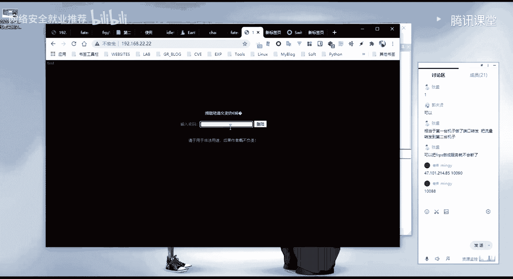

这是。

这是谁给我改了，这么快吗，是不是谁谁把我给改了。

把我的，是你们你们有谁改了吗，看一下，你放个放个答案吧。

没有，啊不是这个机枪，这个，诶没有啊。

那怎么了。

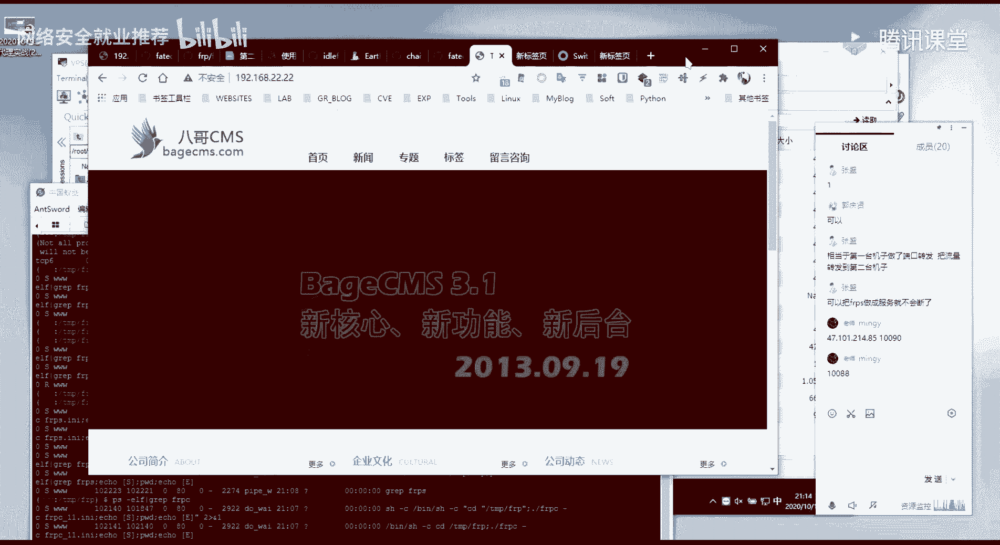

你们你们是不是你们谁改的呀是吧，是你们谁改了，改了那个英带x的那个页面吧，把他首页给改了。

你们现在也可以通过这样子的一个方法去访问，到，就通过我这边的一个代理呃。

呃然后的话我们继续看p p t的一个内容，就是呃后面的一个操作的话，就是也是一样的嘛对吧，同样的就是信息收集嘛，对这一个ip ip，然后的话以及这边的一个45端口的，一个是利用对吧，就通过啊。

我们那个mi mi 11一七杠010是吧，然后这边的一个他的一个应用的话，就是通过这样子，就我们就是这边sc pros props，当然的话你就是说这边呃，我这边的话是只在这一个模块下面。

就是说我这边set这个单元的话，是只只针对这个模块它的一个请求，流量的话，它会走我这边的一个收拾的一个通道，然后的话如果说你设的是你设的是sg，你设的是设计机的话，那么就是说msf下面所有的这种模块。

或者说你的这样子的，你的这样子的一个请求，他都会通过这边的一个说辞的一个代理通道，就是这边的话是一个全局，这边的话就是一个针对这个，当前的一个模块是吧，然后设置代理的话是这样子，sox 15。

这样我们的一个ip以及端口啊，然后呃我们可以看一下这边我这边的一个截图，我这边就不操作了，就最后的话呃它的一个效果的话，就像这样子，然后得到了他的一个选，以及呃33890接的话，我这边好像也不连接了。

跟上节课的话一样的对吧，我只要带你冲到，我尽力尽力正确的话，那么请这一些操作它都是会没有问题的，然后以上的话就是f r p的这样子的，一个代理工具的使用，大家能理解吗，啊对刚刚的话是20090呃。

还还有啊对，这边我还是要说明一下，就是我ppt里面的话，因为我ppt有些是用的上一期的对吧，所以的话呃这样子的，像这种ip以及它的一个配置，然后我有我这里我这边的话也有就是有改对吧。

就是可能没有是可能没有统一对吧，他没有去统一这样子的一个i p以及这种端口，所以大家再去看我ppt的时候，你不要去照着那个照着我这边去写的对吧，你看你看这上上面跟下面不一样是吧。

你就哎你就你就不知道它是什么了对吧，你不要被我这边的一个ip以及端口给误导了，好吧，因为呃有同学就是有同学，就因为这个那个当然他那个是确实是，我就是改了上面那部分，我下面那部分的话就改这个呃我的问题吧。

就是这边也提一下，就是大家不要被这个ip端口误导，就你这边实际的一个ip端口，跟按你实际的一个情况来定，做成服务呃，你可以这样的，但是就没没太大必要了是吧，反正你就就用一会，用一会就关了。

啊应该没有问题吧，大家有问题吗，没问题的话，那么我们继续呃，下面的话就是我们的第二部分，也就是呃ew ew这个工具的话，就比较老的一个工具也是这样的话呃，它的一个功能的话就是也是很强大的一个工具。

而同样的我们的一个场景的话呃，跟前面的一个场景是一样的哦，首先的话我们先来大概的了解一下，就是1w5 它的一个基本的一个使用吧，就这边的话，我这边这张图的话，就有它的一个基本的一个选项。

其实这边的这个选项的话，关于这个工具大家可以去看它的官网啊，没有不是。

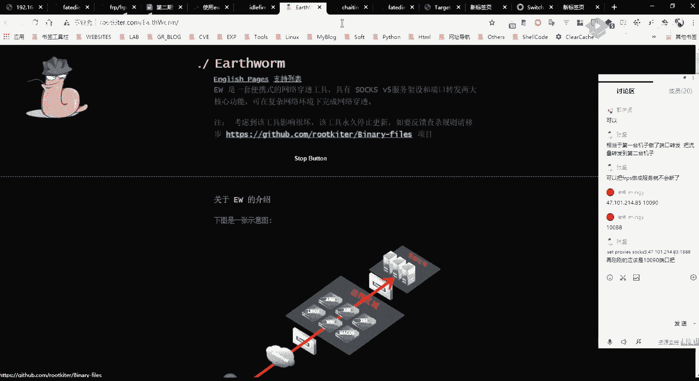

等一个，这边，所以去这边去看，这边的话是1w的这个工具的一个下载，也可以在这块上面这边去下载了，把这些东西，这个的话就是它的一个可执行文件嘛，然后在这边的话有一个read me read main。

这边的话其实就已经详细介绍这个工具的使用，就这边的话它呃有逆子啊，有图对吧，以及文字就这边的话很详细了呀，以及它的一个参数，它的一个具体的一个使用，就这个这个的话是作者啊写的作者提供的。

所以这边的这个工具的话呃，我不会去讲的很细，你只需要知道大概用就好了，然后的话你想要去去了解更多的话，大家自己去尝试好不好啊，呃这边选项的话我也不多说啊，就是大概的看一下吧，呃就我们在后面会有去用到的。

像我们首先第一个就是杠s，干s的话就是呃其实在这边也都会用到它，主要的他其实也就这几个选项，就是干基干f干一干d干干s，要杠的话就是设置我们的一个就是状态，或者说设置我们要去使用的一个模式。

然后在这边的话它有这样子的，1234566个模式，这六种模式的话，它分别对应的一个艺术，可以看一下这表，首先第一个的话就是这个啊指定这一个s soft，指定这个话它表示的是一个正向的一个代理。

然后r c socks反向代理流量转发，然后r c socks啊，不rs socks它也是呃反向代理，然后的话它的它可以反弹我们的一个soc，然后还有就是lcx listen啊，train。

还有slave，然后大家如果有就是有用过lcx这个工具的话，对这你的命令的话应该应该不陌生对吧，他的这个工具的话，它有接近这边的一个呃l cx的这样子的一个呃，方法，好杠l的话就是打开一个端口。

就是其实就是今天一个端口嘛是吧，然后干d的话，就是指定我们反射的一个主机地址，这边的一个反射主机的话，其实就是我们要去，如果说我们要反弹一个socks到我们的一个呃。

我们的一个socks的一个服务端对吧，那么那么在这的话我们就需要去设去设置对吧，去设置我们的要反弹的，这要反抗这个socks 5的这样子的，一个主机的一个地址，以及它的一个端口对吧。

嗯其实就是跟我们前面f2 p对吧，sery dreams so cod对吧，我们在这边的话，如果我们用这个r c r s宋词对吧，来去反他一个双子，然后的话它其实就是会去连接这边的一个反射。

主机的一个地址及端口，来去建立一个所属的通道，然后gf的话就是呃设置连接主机的一个例子，就是我们主动的去进行一个连接啊，以及连接的一个端口，然后具体的话我们和以实力，以实际的一个例子来来展示呃。

在这边的话，我这边ppt其实已经写的很详细了呀，然后的话还有的话就是预习内容，这边的话给了两个文档。

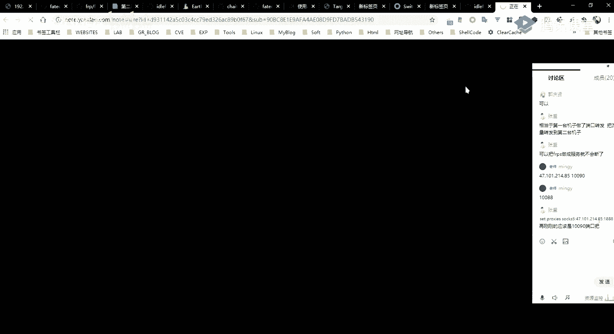

给一个就，就这个首先呃这个1w这个工具，它的一个详细的一个使用，以及这边的一个截图的话，就是呃以这边的这，你这边的这个靶机作为一个实际的一个例子，大家可以去看一下这篇，这个我这边写的这个笔记吧。

然后首先的话就是这个正向的一个socks，的一个服务器啊，用ew来去创建，我们在这边的话，就只需要使用这个杠s指定这个soc，啊我们前面有介绍对吧，这个socks的话就是正向代理嘛对吧。

我们就是杠s指定啊一个正向单元的一个模式，然后杠l的话就是今天一个端口是吧，然后这边的一个今天的一个端口的话，其实就是我们的一个代理的一个端口，然后我们要去呃，去访问这边它的一个呃代理的。

这样子的一个网络的话，我们就可以通过这里的一个端口，来去进行一个访问，啊我这边的话实际来看一下吧，把电话关了呀，直接断了，然而1w的话，就是这边这个工具呃，直接直接执行的话，有详细的一个帮助信息啊，啊。

然后我这边的话要去建立一个正向的一个代理，比如说我要做的一个代理的话，就是这个嗯打，不是说，1888的一个端口是吧，然后我这边去建立的这个的话，那么我单纯啊，在这的话它有进行一个1888的一个端口。

这样子的一个代理端口，那么我而这一个正向的一个代理，它是什么样子的一个效果呢，就是。

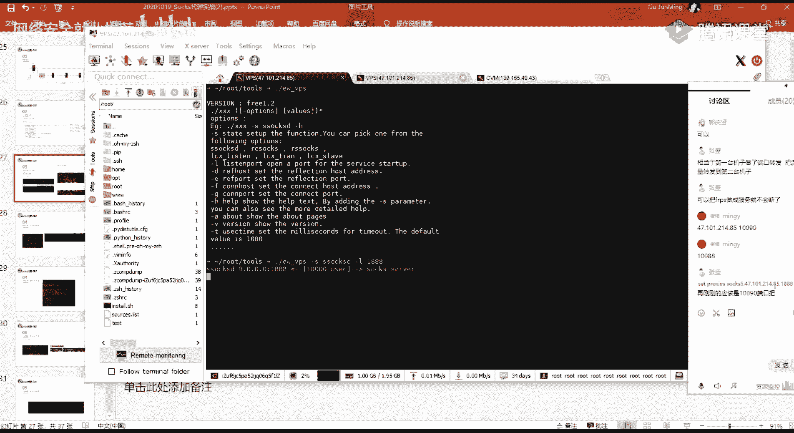

比如我在这里，我在这边的这个linux上，首先的话我通过这个process trance是吧，因为我要去找他的这样子的一个代理是吧，好嗯嗯对，就是这样，就是1888自己再装。

好我现在的话通过这个protech来去访问，我这边访问的话就访问这个比呃，这边的话因为他没有开八零的一个端口。

所以他time out，我这边的话就在这个机器上面，我通过开展对吧，来开一个htp的一个server，然后这边的话是今天在8000的一个端口对吧。

那么我现在在这个话，我来去访问这边的大清的一个端口对吧，你会发现我这边的话，我通过这边的一个代理的一个端口对吧，能够去直接通过访问它的一个127点点一，还去访问他本地的一个端口是吧。

因为其实我们这边的一个经历了一个代理，充当的话，等于就是呃，把我那个请求已经带领到了，他的这边的一个网段了，或者说你也可以把它理解成，就是我把他的一个这边的这个网站，把它给带领到了我这边对吧。

我们可以通过这边的一个通道来去访问对吧，然后其实呃在浏览器当中的话。

2027哎呀防御，嗯好像不能打是吧，高中。

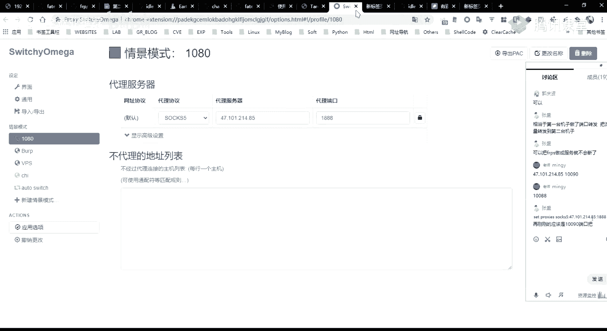

啊不能这样啊，直接通过这样子的一个方法，直接这样子来请求，其实这边的一个实际的一个内容的话。

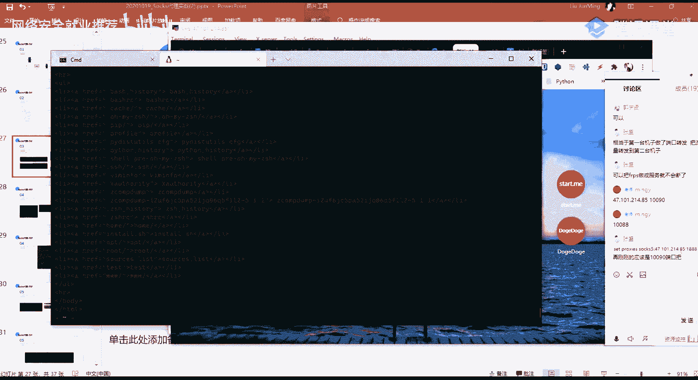

就是呃就是访问的是我这边的一个，这这个嘛对吧，就是这里的这些东西嘛，其实这边的话它的一个内容的话，其实就是这边的一个代码是吧，他这个网页代码。

这边的话就是一个正向带点啊，就是我直接通过这个soccer，然后把我当前的这边的一个网络，把它给代理出去，然后的话我再通过这边的一个代理，我主动的来去访问到他的一个，当前的这个网站是吧。

就是当然的话他有前提，就是你你是能够去，能够去直接去访问到这边的一个代理对吧。

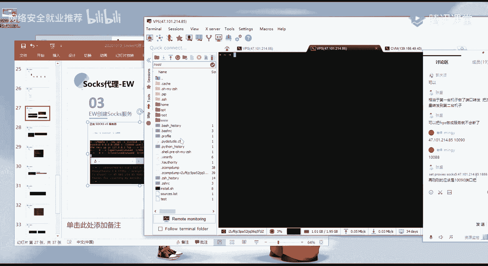

好啊，现在就是反弹的一个sos的一个服务器啊，反弹sos服务器的话，我们这边的话主要用到的是这里的两个模式，就是r c socks就反向代理嘛，一gr s socks它同样的是一个反向代对吧。

然后它的一个作用一个是流量转化，一个是反弹的一个socks，然后我这边的话我要把我的一个目标机器，把把我的一个目标机器啊，通过反向的反向代理的一个方式，把它给代理出来。

是那么呃我们的一个具体的一个操作的话。

就是像这样子。

怎么还有连接呢。

换一个端口，我这边的话呃，这边的这一个，这边的这个话是在我的一个呃v p s上面对吧，在我的一个v p s上面去执行的，然后这边的这个数这呃，这边的这一个啊命令的话它是什么意思呢。

首先的话干s他指定我这边的一个模式，是这个反向大对吧，然后它是一个流量转发的一个作用，这边的一个流量转发它呃具体是怎样子呢，就是我这边干l今天呢是在本地，它是今天这样子。

那个1888的这样的一个端口对吧，这个端口的话其实就是我们啊代理的一个端口，就我们通过这边的这个端口来去进入，这边的一个代理通道，他他会在这边他会有这样的一个操作。

就是我去比如说我一个hp的一个请求对吧，我去我把我的一个请求发送到这个端口上，它会把它这边的一个请求的一个流量，它会通过这边的一个7788的一个端口，所建立的一个零件，在这里建立了一个连接，怎么理解呢。

我们先，看一下，我这边找一个我这边内网的这个机器人。

这个。

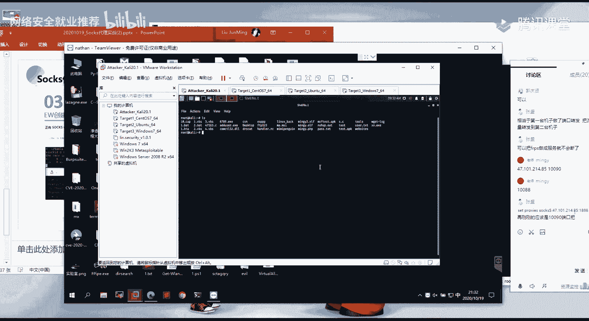

因为我这边的这个看着机器了。

7788，然而在我这边的这一个，就是我要去带你的这样子的一个机器啊，就是我要把我的一个目的话，就是我要把这边我在内网的这边的，这个看你机器，它把它带你到我的这边的一个公网对，然后我在这边的话。

我所要去执行一个命令，就是这边就是在我的一个目标一上面执行，可以看到就是我这边执行之后的话，他会在这边有这样子的一个就是rs socks，sevd soco，看到这个话就说明我这边的一个零件的话。

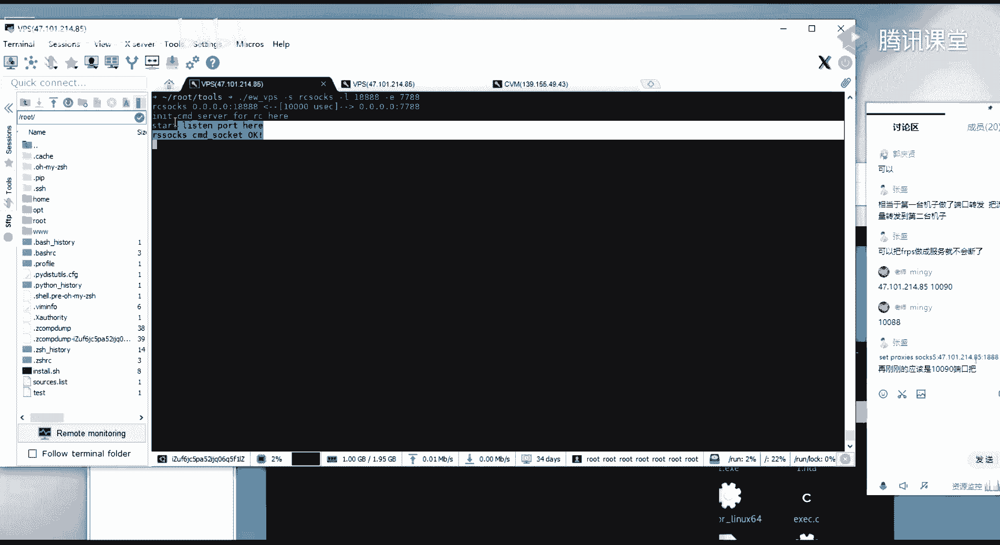

这个这边的一个说辞的一个零件的话，就已经尽力了，然后呃他的这样子的一个这边的这一个命令，它一个意思就是我这边指定我这边的一个呃，反向代理的一个模式，然后的话他会去反弹一个socks，反弹的一个说辞的话。

它会反弹到哪里呢，就是他会去在这边我这边的这边的呃，我这边这边要怎么说呢，扣扣我的这边的一个目标机，就是我要攻击的这个机器，我要带你的这个机器是吧，它会主动的去连接我这边的这个vps ip。

以及这边的一个端口，在这边的话，其实就是难去连接我这边的这一个端口，好，这边的一个目标机与我的一个攻击机之间的话，他就会去建立这样子的一个连接是吧，就是他这边他会主动来去连接，我这边的一个778对吧。

然后进行连接，进行连接之后的话，我实际的一个流量的话，就是我通过这个1888的这个端口，把它给转到，就通过这边的建立的一个连接，把它给转到我这边是吧，好呃同样的，我这边，呃没开这个图。

我同样的就是开一个吧，我同样的在当前目录开个这样子的，一个八八千的一个solo hb的一个solo，然后我在这边的话，我就能够去访问，访问的话就是通过我通过这边的一个，呃，没，啥玩意儿，三个。

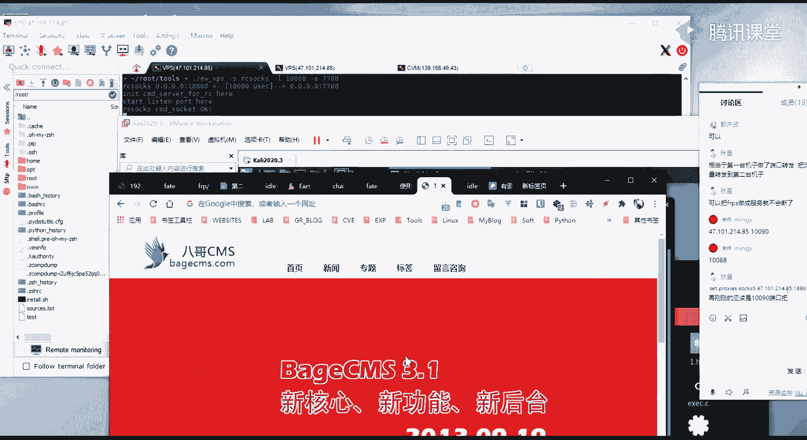

我还是用用这边吧，改一下吧，这边的话是两把打发。

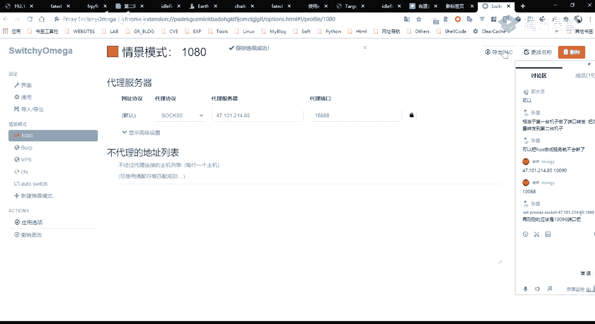

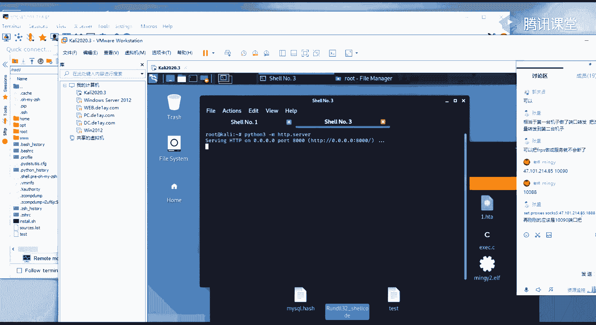

好的我在这边这个机器上面，现在好演示，然后的话我同样的1070，c l o来去请求这边的，我本地的8000的一个端口对吧，然后其实这边我的一个cl去请求的话，请求这边的这个ip的一个8000的一个端口。

它其实通过这个代理它发送到这边，它发送到了我这边的这个这里对吧。

你们可以看到它其实请求到了我这边，等于就是我已经把我这边的这边的一个网络网。

站，已经把它给代理到这边，r的话，只要通过这里的一个通道。

我就能够去访问他的个资源，然后呃在这话就是同样的是那个就是，hp的一个那个文件列出来的嘛。

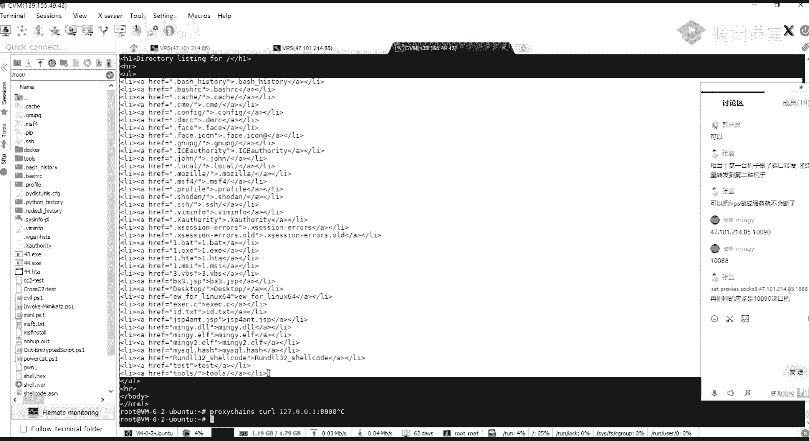

对吧，这样子的，这边的我的一个一些文件的一个名字。

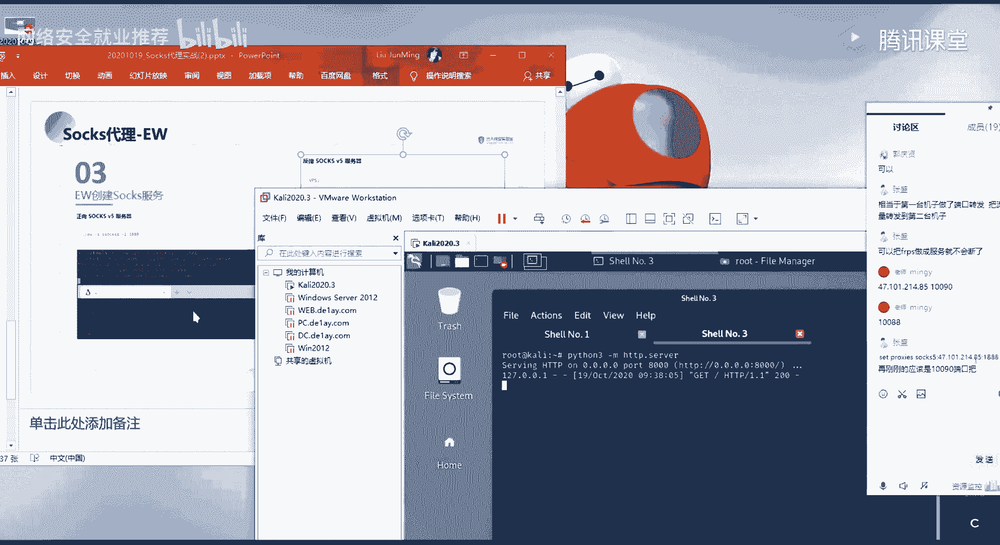

呃这边呢就是一个反向的一个socks的一个代表，好啊，到我了，到我们就是结合到我们实际的一个，这边的这个靶场，对吧啊，这边的话这个1w的话，就前面的一个背部分的一个内容的话就省略了。

我直接从就是创建sos代理这边开始对，好呃，首先的话在这边呃。

我们的这样子的一个步骤是这样子呃，其实在这里的话，其实就是同样的，就是用的这边的一个反弹，sx代理的一个方法对吧，可以看到其实命令都是一样的对吧，然而同理的话，因为我们前面的话就是通过这样的方法。

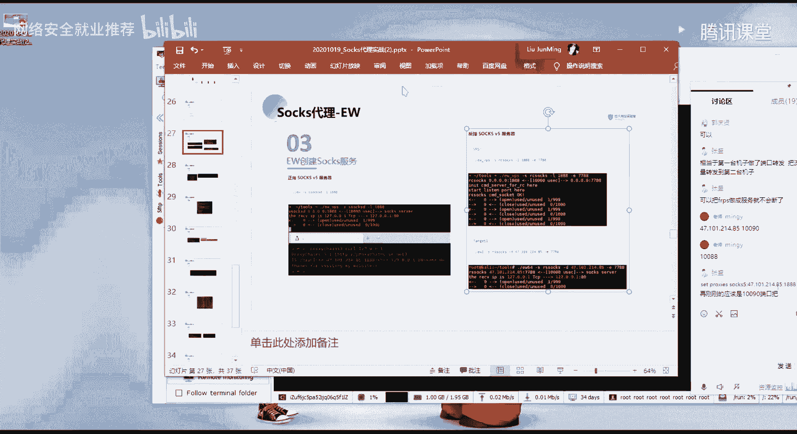

经历了这样的一个代理，把我这边的一个卡里，机器这边的一个和网段网络把它给带你出去了，或者说把我的一个流量带，带你到了这边的一个内网的这个网站是吧，那么我想要去访问到内网的这边，我这边把鸡的这个。

这这一个2。2的这个网站对吧，那么首先我在bp上面。

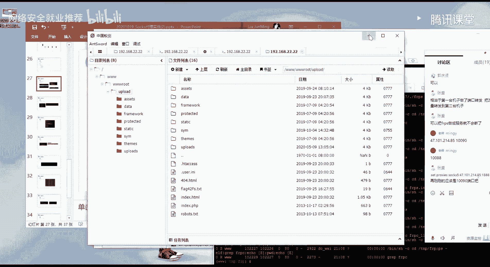

我需要去啊起一个这样子的一个流量转发，呃，其实呃对，刚刚没有说没有提到这边这边的话好，除了，除了那个是流量转发吧，你卡了，就是这一点就是r c sans对吧，这个其实它的一个作用就是流量转发对吧。

好把我就是来自这一个端口的一个请求的，一定要转到这边进行的一个连接好，我在这边的话，我们同样的通过这样子的一个方法呃，看一下端口，端口没有出嗯，还是这个吧，就就要yy的这个端口。

然后我这边的一个目标机器上面的话，我就需要去主动的去连接我这边的一个。

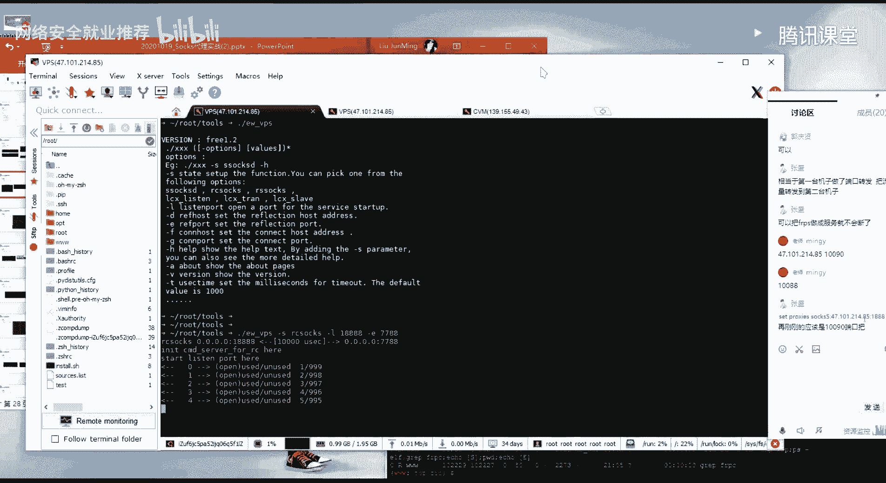

好啊，我需要在我的这边呢，他可能1g上面去执行这样子的一个连接，这边的这个命令的话，就是反弹这边的一个松弛，反弹到了这边对吧，可以看到他已经ok了，那说明的话这边已经进入这样的一个代理通道。

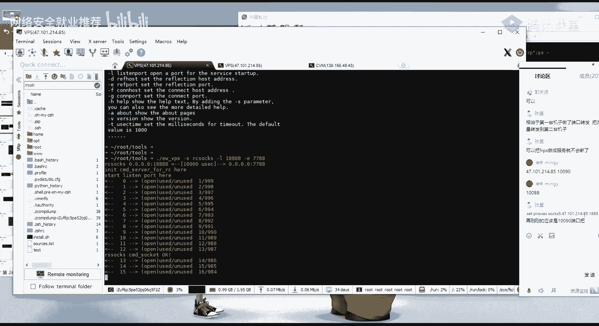

那么我们现在的话我们就可以尝试去，这个啊就是这个没问题，然后我这边先不走这个对吧，我直接去连接它，好，问不到的，然后我这边的话，切切，这个的话可以看到是没有没有任何问题啊对吧，是吧。

是能够直接去访问到这个网状的，那么它其实就是把我这边的一个访问啊，这个网站的一个流量的话，通过这边的一个流量转发，转到了我这边这边的这一个机器。

然后的话它会通过我这边的一个网卡吗，找到那个2。2，这个主机的一个八零的一个端口吧是吧，这边的话就是啊建立了一个一层的一个手指。

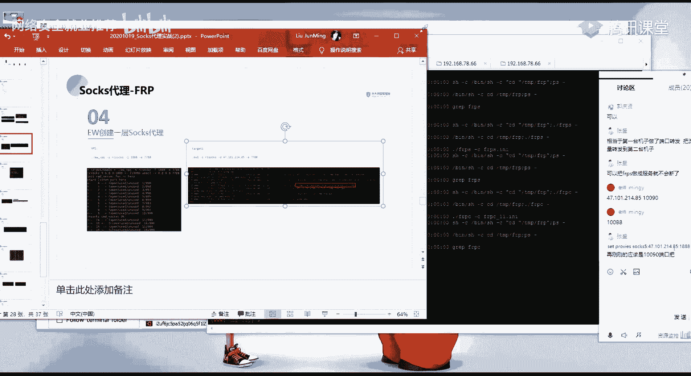

代表这个跟前面的话呃嗯应该也是类似的是吧，就是这种流量的一个走向对吧，都是通过啊有一个这样子的一个代理端口，然后的话把我们的流量就是通过一个啊，sos通道是吧，然后的话把它给转到我们的一个呃。

sos的一个就转到我们的一个内容，然后呃，这边的话就是我通过这样子的一个方法，去进行一个验证了啊，然后呃创建二层的一个手指代理的话，好吧不好意思，喉咙有点堵住了，啊关于思好了堵住了嗯。

然后我们继续啊啊喝了喝了水，就是有一有一有一点小糖，就是呃然后的话二层的一个双子代言的话，其实也是类似的，然后主要的话就是它的这个工具，它去进行一个这样子的一个流量的一个呃。

转发的时候就是它的一个命令使用的话，它是不一样的啊，其实在这边的话，重点的话就是这边在tg的一上面是吧，其实我们前面用f i p对吧，nf 2 p我们的这样子的一个配置，其实最多的其实就是这个啊。

外网的这个web机器对啊，就是这边因为我们需要在这个机器上面，做这样子的一个流量的一个转发对吧，因为呃，因为这一个机器的话是，我们就其实就是我们从外网访问到通向内网的，这样子的一个机器。

也就是一个跳板机对吧，然后的话我们需要把啊我们从外网来的流量，通过这个通道来代理到它的一个内容当中，所以的话我们需要做一个流量转化，在ew这边的话，它使用的一个方法的话。

就是用的这一个呃l c x slave，我们可以看一下前面这边就做这个模式，这slave的话就是一个端口绑定，其实它的一个这边的一个作用的话，就是把这边两个端口的一个流量做了一个转发。

就是在这边他会把呃，就是把我们这边2。2这一个机器，这个话是我们内网的这个机器嘛对吧，2。2这个网站的这边的一个999端口，的一个流量，把它给啊啊不对是啊，说反了，是从这边就是从这边降低降低去连接。

我们这边的，建立了这边的这一个端口对吧，888呃，没没错，对上了，就是他在这边他会去建立这样的一个通道对吧，然后的话我们的一个流量，通过10088这个端口进入到这个通道，然后他在这边的话。

他会把这边的一个能量转发到我这边的一个，2。2的这个9999的这个机器，然后的话这个999啊不是999这个机器啊，是啊，这个端口说错了，不好意思，就转发到这个2。2这个啊，机器的9999的这个端口对吧。

然后这边的这个端口的话，其实就是在这边它有这样子的一个啊soft，这边的这个说辞的话，其实就是呃建立了一个正向的一个那个代理嘛，对吧，soc然后他在本地他会去啊，今天一个999的一个端口。

然后的话我这边的这一个流量对吧，我从10088的一个流量，通过这边建立的一个啊，通过888这个端口所经历的一个通道，建立了一个代理通道，然后他把它转到了这边的一个999对吧。

其实就相当于就是我们前面的这边的一个，正向代理嘛对吧，就它同样的是把我们的一个流量就呃，通过这边转到了它的一个呃那个网网段嘛对吧，然后最后的话最后的话就是等于，就是我们要去访问，就是比如说我们。

因为我们这边是二层的一个代理对吧，我们前面这边一层的代理的话就已经实现了，能够去访问2。2这个网站，我们这边二层带的话，实现的是要去访问三三的三三的这个网站啊，那么我们这边的一个流量转发到了这边的一个。

呃，2。2这个机器的一个99的一个端口对吧，那么其实就是相当于我的一个请求的话，我同样的能够在这边呃，在这边的这个2。2这个机器上面，把它通过那个啊网卡给转到呃，我这边的一个三三的那个网站去。

然后最后的话，我们他会去经历这样子的一个零件，啊不是就是建立这样的一个通道，这样子的一个流量的一个走向，然后呃在这边的话，就是我们就可以通过这样子的一个通道来去呃，探测这边的一个三三的网络是吧。

其实就是我们的一个流量就能够去访问到去啊，能够去把我们的一个流量，就是传到这边的一个33。33的这个网站上，3。33这个机器上面，好啊我们来具体的来操作一下吧。

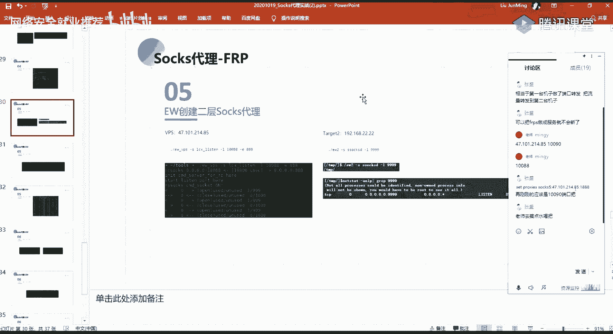

同样的拿我们这边的这个机器啊。

那个这边放了吧，又重新又从头来吧，好吧，又从头来，首先的话在我们的一个v p s上面对吧，我需要今天这样的一个端口，代理端口以及等待啊，我们的一个呃就是我们的一个目标机器，来主动的来。

去迎接我们这边的一个778的一个动作，因为我们是反向的对吧，大家就是其实这边的一个反弹，以及反向那种socks，跟我们前面就是正向反向的一个需要，其实它的一个原理啊，不是说原理就是它的这样子的。

一个是类似的对吧，就是正向的话就是我们主动的去请求去请求啊，这边的一个socks的一个服务对吧，好反向的话就是说因为我们无法直接去访问到，那么我们就只能够通过反向是吧。

就只能够通过它这边能够来访问到我们。

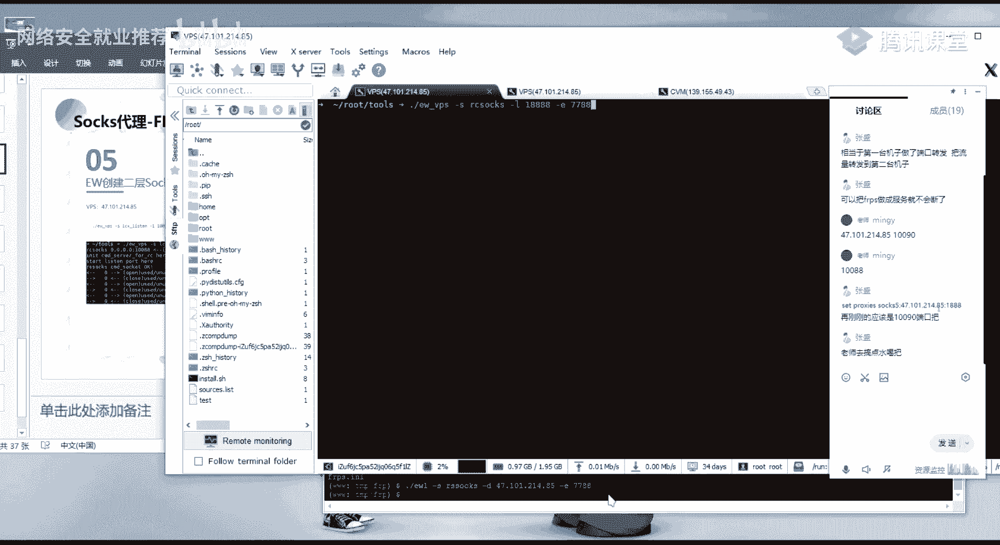

然后的话来去建立一个连接。

所以的话这就叫反向了，然后同样的我这边呃，执行这样的一个命令对吧，然后的话在tt 2上面，因为我们其实在这边建议这一个的话，我们就已经能够去法能够去设置代理对吧，来去访问，这边我拿到了2。

2这个机器的一个小啊，也就是这边，当然的话呃这边的话带你要改一下，是1888，改的是，我这边断掉了。

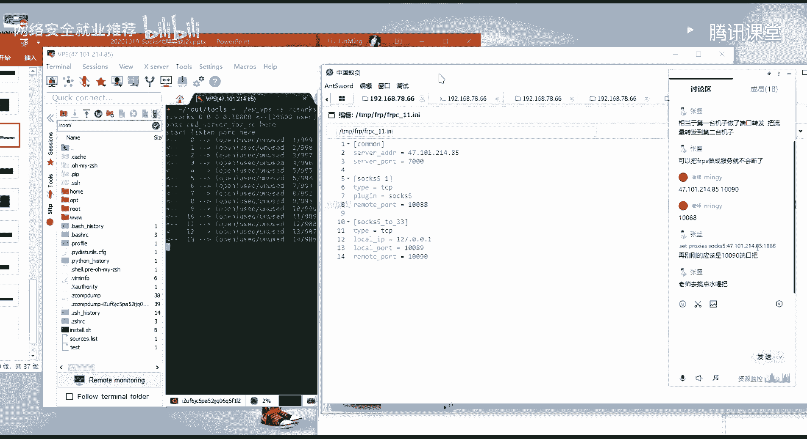

啊我先执行这边吧。

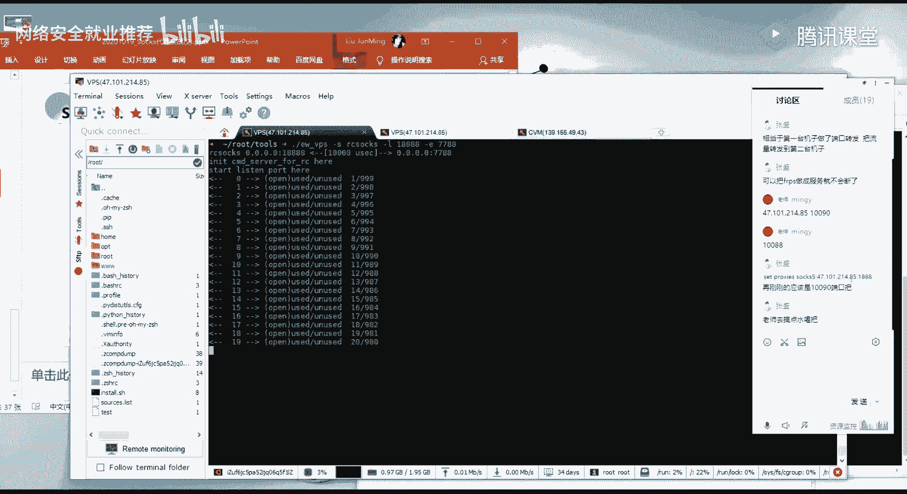

我现在这个tag一上面来去比我这边的一个，20227点。

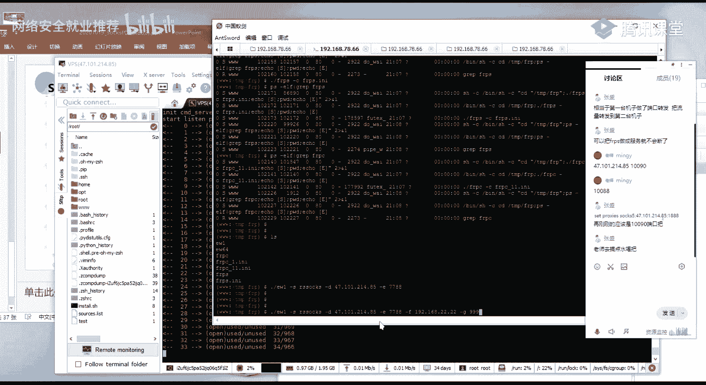

然后在这的话可以看到呃，建立了这样子一个连接对吧。

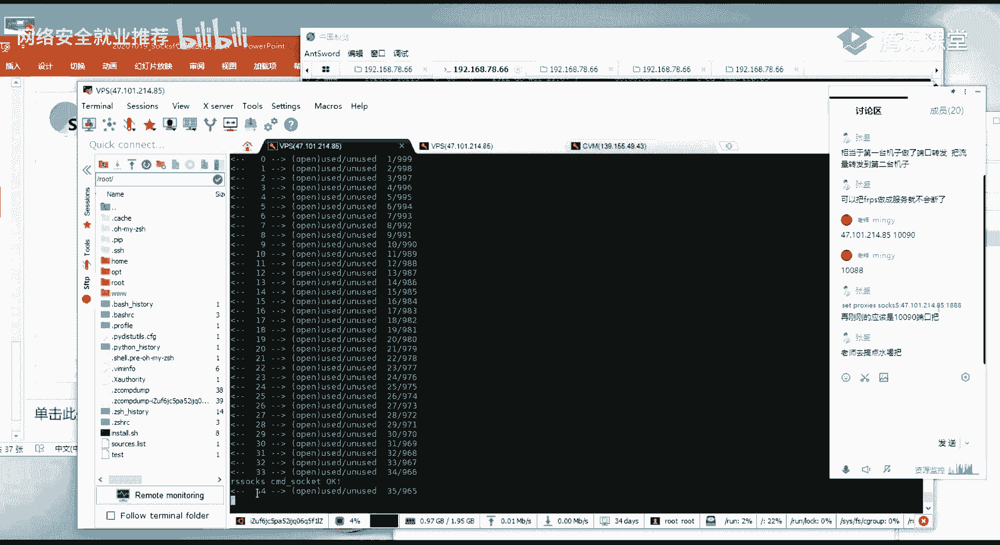

已经建立了建立连接了，然后我这边的话就能够去，通过这边的一个代理对吧，建立了一个代理来去访问，这边的二这一个网段啊。

也就能够得到这边的机器的一个选，然后在这边的话。

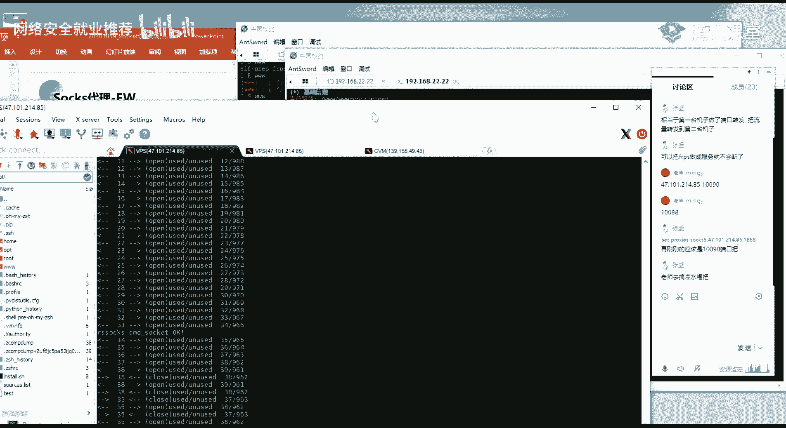

我们下面要去访问的话，是要去把我们的一个流量，把它带你到这边去访问这个三三的这个网站。

所以的话我们在这边需要去做一个，流量的一个转发，然后在这边的话。

其实我这边这个命令的话，就已经做了这样一个流量转发，就是把这边的一个流量转到我这边的这一个呃，2。2这个机器的999的一个端口对吧，那么我在这边的话，我就只需要去改，就是他这边。

我这边流量通过这个链接发送到这边，它就会主动的来，就是发送到这边来对吧，那么我这边的话我只需要通过，没有没写错吧，好ss s s o c k s b soft，然后的话只需要去在我这边去监听这样子的。

一个99的一个端口嗯，嗯这边我之前已经有执行了呀，你看他是1w64 啊，我这边的话是用1w一的，我这边把这个p掉，2887，我去这个拼音怎么还在拼啊，啊呃其实在这边呃，正好看到这个就说一下。

就是你你你会发现我这边有这样子的一个命令，对吧，pin这个因为在linux里面的话，你的一个pin的话，如果你不用那个pk，11去指定你去拼多少次的话，一般的话一次两次三次就可以了嘛是吧。

像windows面默认的话，它是四次，四次之后的话，它就会停止掉，如果你不这样的话，如果你直接ping ping的话，他就会他会一直拼了，就是它不会停的，你除非你按ctrl c或者把他的一个镜子给剃掉。

然后在这边引进引进里面的话，你去执行这种命令，它会自动的去把它给放到后台去，就是他会把它放到后台，作为一个进程这样子的啊，然后你会发现我前面骗了的话，他其实一直有在骗啊，只是在前端它没有显示出来。

所以的话呃在这边因为ctrl c q ctrl c停止不了嘛，对吧，你就可以通过key把这个进程给啊，kel掉就可以了，这边的话呃正好碰到了，就说一下啊，好了吗好了，告诉你。

然后执行之后的话呃，我们那个连接的话应该就是已经建立成功了，然后在这边的话，我就呃你这个，你这一个吧，就是做一个rtp的一个远程连接对吧，然后在这边的话，我的一个service是这个呃。

我的一个端口的话是18888。

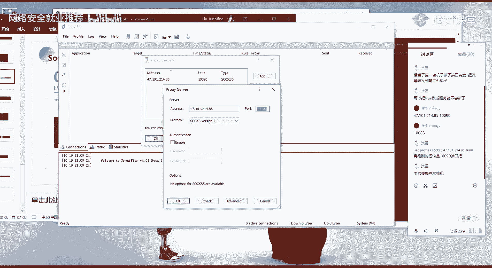

和1888，ok保存之后的话，我再用远程桌面来去做一个连接，能解除错误，连接出错的话。

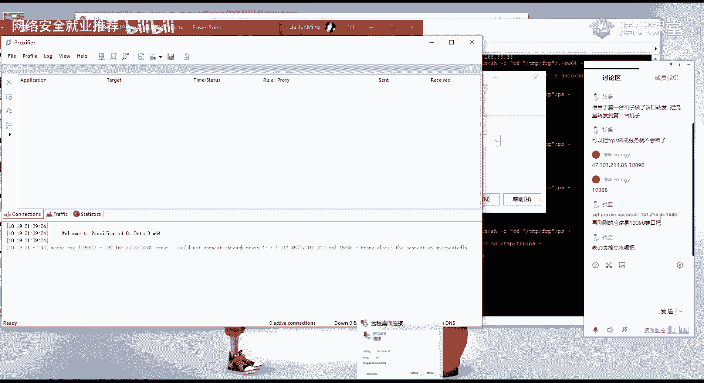

那检查就是检查你的这边的，是否被停掉了，就是他是否还在好，但是。

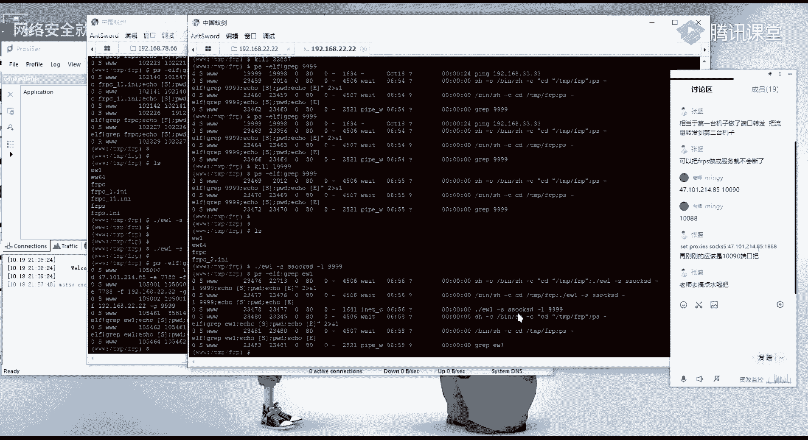

没写错啊，啊我这边搞错了，在这边的话呃，是用的lcx的，listen的，就是这个就是反向代理流量转发呃，按理说这个阿斯sos应该可以啊。

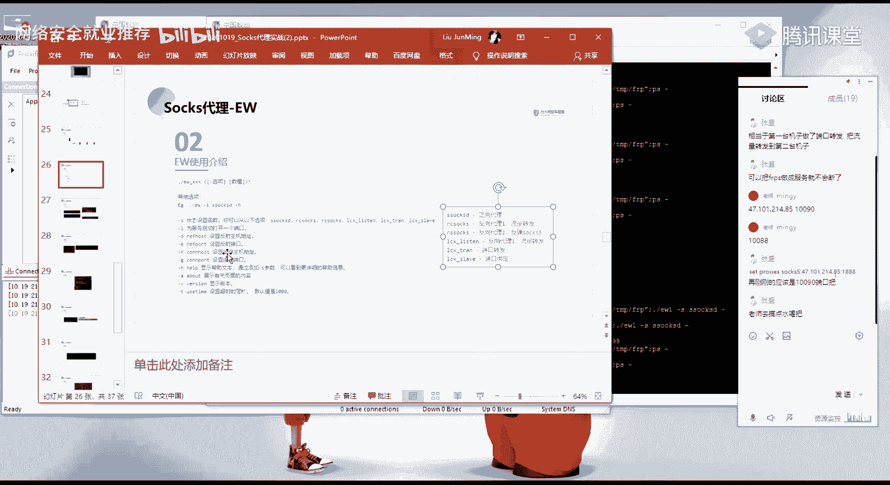

不行啊。

我这边也是零点，我这边重新来啊，八八十九个。

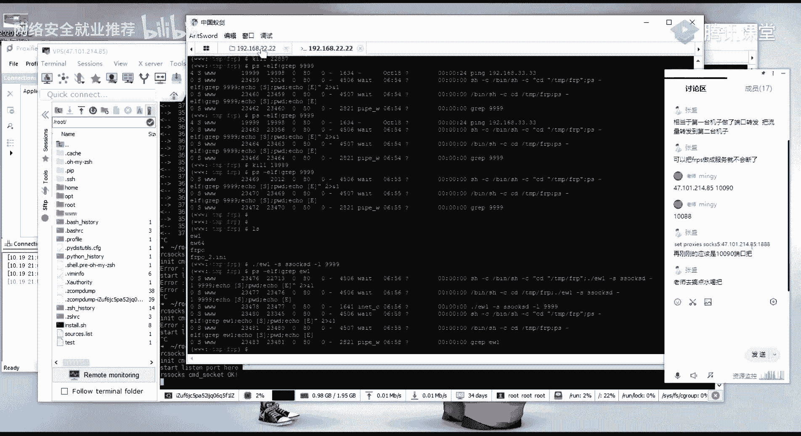

等你大约端口号是改了2999呃。

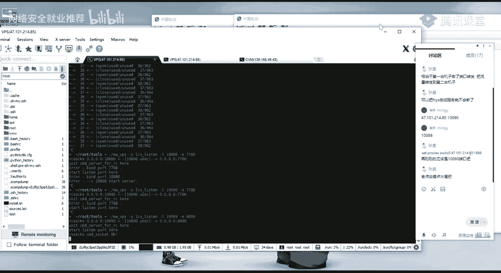

就是大家在碰到这种问题的时候，就是其实你细心一下，你细心细心一点检查一下这种，那我我平常我平常有时候也是，就是你这边改了之后，然后你这边下一步就又忘了，好像这种问题的话，一般的话你细心去检查一下。

你从头从头就是找一下这种哪里就是改了是吧，或者哪里配置，你拿你单词写错了对吧，像这种信息话都是很好解决的，一般的话失误对的话，是其他的这种操作是都是会员有什么问题了啊，这边的话前面那段没kd x x。

所以的话呃它会有这样的报错，这个冲突嘛，因为你们那个端口被占用，你需要先把前面的这个给削掉掉，然后再去再去执行，啊现在执行完之后的话，我们再来连接，啊这边带你服务器又没改了，就嗯碰到种问题。

其实你就是学会看报错，是真的，就是你你就其实我看大家就是问的那种问题，就是你截图的时候截的那种问题，其实那个你解决的办法都已经写在报错里面了，对吧，其实你很快就能够去找到原因，因为你像这种东西。

你来问我的话，因为我不知道你整体的这个配置对吧，我不知道你整体你是怎么去配置的，所以其实很多时候我也可能会说不上来，嗯怎么这么慢呢。

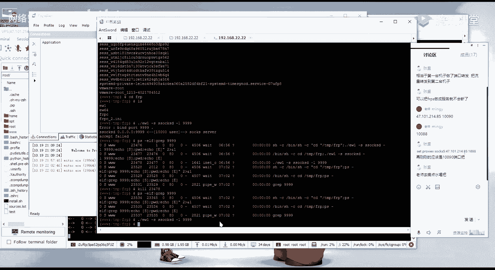

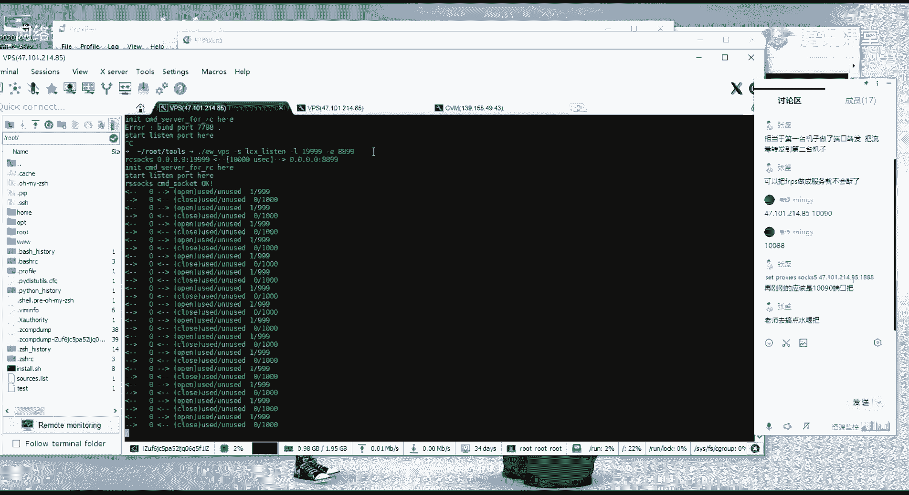

看一下没错呀。

啊嗯这里错了，我的我的快不行了，我再再再再来一遍吧，这边的话因为我这边断掉了，所以他那边打过大了，正常的，我这边写错了呀，照着我p，大家照着我ppt上的来吧，我，这边写错了，可以看到，心脏重量，可以了。

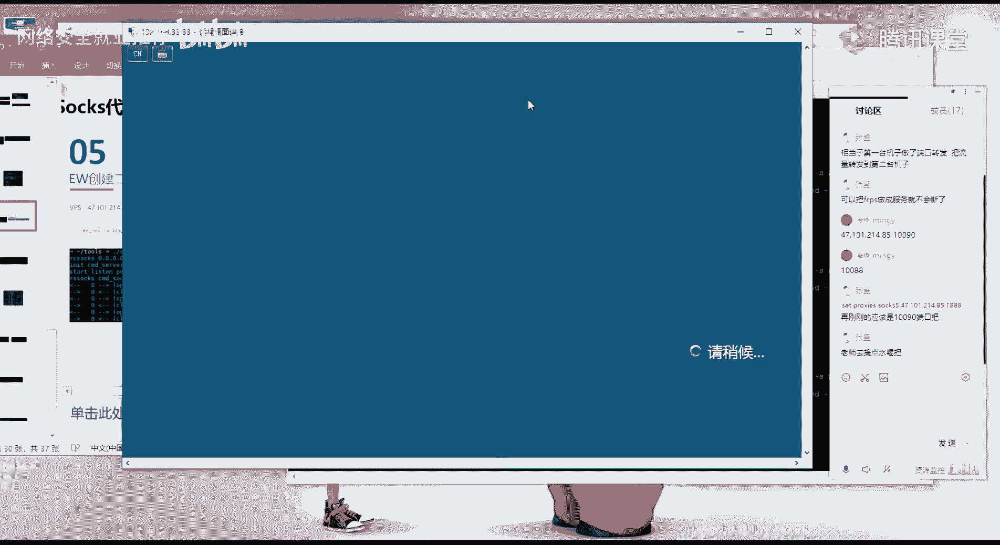

嗯大家大家弄的时候也细心一点，我这边的话出现了就是写错了，大家大家照着我的pp来吧好吧，然后耽误了大家一点时间好，在这边的话我们建立成功之后的话，实际的效果就像这样子对吧，我这边的话我就可以呃，可以啊。

直接远程的登录这边的啊，这个33。33的这个机器对吧，然后这个x2 层的一个数字代表，然而还有的话，其实也可以去做这样的一个三层的一个所代表，这边的话呃这边的话大家自己课后去尝试吧，我这边的话就不说了。

然后因为他的一个操作以及原因的话，都是一样的，我这边的话已经写的很详细了啊，然后这边的话主要的话就是介绍一下它的一个，就是这边这边它的一个流量，就是你知道他那个流量走向的话。

然后你知道大概它的这些选项怎么去用的话，你就能够理解这样子的一个命令，我这里的话商城的一个数13点的话，因为我们其实前面对吧，我们通过msf对吧，呃通过17020能够去拿到这边tt 3的个小。

我们拿到他这个需要之后的话，如果他还有还有还有另外的一层之网呢对吧，就是有三层是吧，不应该是四层的啊，就是233对吧，三层吧，三层直网，那么我们这边拿下，拿下这个windows这个机器的一个小时后对吧。

如果他还有一个内网的内内网那个网站了对吧，那我们同样的还是去做这样子的一个代理嘛，对吧，只是的话它中间的话就是要去多做这样子的，一个流量的一个转发，其实说到底归根结底的话就是流量的一个转发。

你只要能够去把流量通过中间，我们这边通过能够去建立这样子的一个零件，然后的话做这样子的一个流量转发，就能够去实现这样子的一个内网的，就多层网络的这样子的一个穿透，当然的话你前提是你要能够去一个一个的去。

能够去得到这样的一个shell，然后命令这边的话我们看最后这一张ppt啊，就是啊，这边的话就是它的一个流量的一个走向的话，其实就是从我这边的首次5v5 ，就是我的这边的一个手持的一个代理嘛对吧。

然后我把我的一个请求，就是通过这边的一个端口，然后的话传到了这边的这个呃通道对吧，与这边e p s经理的一个通道，传到这边之后的话，它会通过这边的一个slave，做一个端口的一个呃呃。

转发端口流量的一个转发，把它给转到这边的2。2的，这个7778的这个端口是吧，然后在这边7778这个端口的话，他还要做这样子的一个转发，因为我们最后要去就是我们前面的。

其实tag的tag我们都已经得到了对吧，我们最后它的三也能也得到了他的小，但是如果他还有一层，比如说44。44的这样子的一个主机对吧，那么我们最后其实就是要去探测这个，14。44的这个主机。

那么我们这个流量我们就需要在tcl上面，同样的还要做一个转发，转到他的三上面，然后在这边的话它给三的话呃，我们就使用这个windows的下面的一个ex，因为它是windows的主机是吧。

好然后的话再通在这边去进行一个连接连接，这边连接这边的一个那个，其实这边的话跟我们f2 p也是类似的嘛对吧，我们中间两个主机之间要去进行这样子的一个，呃流量的一个转发的话，你需要有这样的一个通道啊。

就其实就是这边所建立的一个连接的一个通道，因为你只有建立连接之后，你才能去有这样子的一个数据的一个传递嘛，是吧，然后在这边的话，我们就带你到了这边三三这个主题上面了，呃这边他有三块，就是33。33。

如果他还有这一个四四的话，那么我们在这边的话，我们就通过这边的这里的一个代理通道，我们就能够去探测这边失事的这个主机，因为我们现在它已经探测到呃，已经把我们那个搜索带你通道。

已经带你到了这边tt 3对吧，那么这边它的三的话，它是能够去访问这边四四的这个网站的，所以的话我们通过这边的一个代理通道，我们就能够去向这一个44。44这个主机，发送我们的一个请求。

以及最后的一个数据的一个流向的话，就是像这样子呃，这个的话应该很好理解吧，是吧啊，以上的话就是我们本节课的所有内容啊，大家应该啊，大家有有没有什么问题。

有疑问吗，以及能理解吗，没有是没有疑问对吧啊，没有疑问的，给我送个花吧好吧，然后的话就我们本期课件的话就到这边了，如果呃其他同学还有疑问的话，大家呃自己就是在课后认真的去看一下，我这边的一个录播，好吧。

我在录播上面的话应该是讲的很详细了是吧，就包括命令，以及呃你的这样子的一个数据的一个请求，流量的一个走向对吧，以及我为什么要通过这样子去经历，这样子的一个连接对吧，去做这样子的一个流量转发啊。

呃只有这个其他同学呢，就这就这六位五位同学吗，而其他同学如果还有疑问的话，我在群里问或者是私下问吧好吧，就其实其实呃你可以去多多去问一下，就是这些他们没有问题的，这些同学嘛，就是大家其实互相交流就可以。

就就挺好的，就特意把大家就是放到一个群里的话，其实就是让大家能够去多交流嘛对吧，因为其实你要是就是毕竟我只有一个人了是吧，我不可能就是所有的问题都能够照顾到，或者说照顾到所有人，就其实大家互相交流的话。

你可能感觉还会更好一些，好吧，没有其他问题，那么也不多说了好吧。

