# 【B站最系统的网络安全教程】北大大佬196小时讲完的网安教程，全程干货无废话！学完即可就业，别在盲目自学了！！！ - P67：第36天：Dnscat2、icmpsh搭建隧道 - 网络安全就业推荐 - BV1Zu411s79i

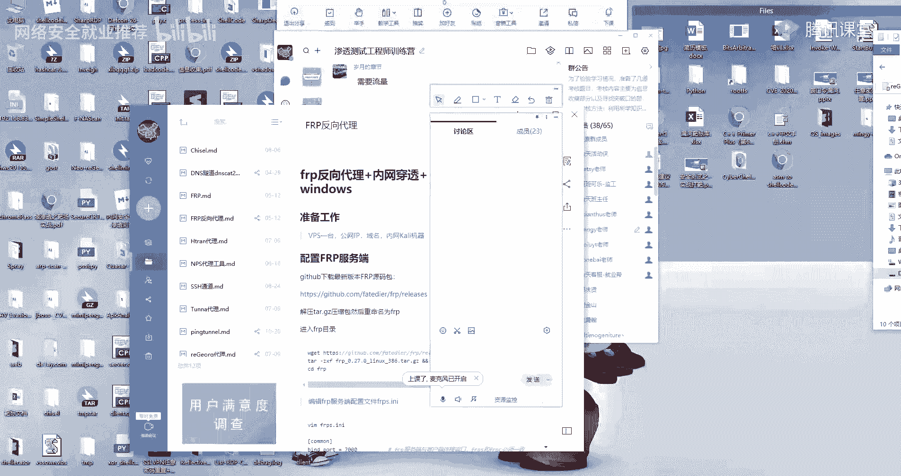

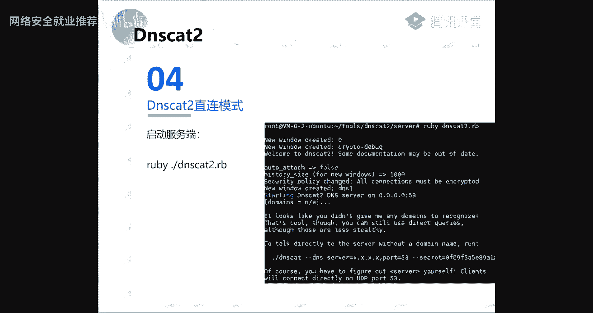

哎，呃大家好，我们继续啊，好前面的话给大家介绍的就是它的一个安装，以及它的一个就是它的一个安装步骤，然后下面的话我们分别来介绍一下，就是它的一个使用，也就是呃在它的两种模式下面，我们如何去进行一个使用。

对我们如何去呃进行一个dk的一个直连模式，以及后面的这样的一个中继模式，呃，直连模式的话，我们直接执行这样子的一个脚本，就是rebudx cat 2，执行之后的话呃，返回这样子的一个信息。

给我们主要的一个信息的话，就是在这边他有这样子的一个啊，这边有一个尴尬secret，这边的一个secret后面的话有这样子的一串字符，在这里的话是一串随机字符，这边的一个字符的话。

也就是我们客户端要去迎接，我们这边的一个服务端的时候，所需要的这样子的一个啊一个妙，然后的话这边执行之后的话，它会在本地，它会在我们的一个服务端，它会去监听一个53的一个端口。

因为我们的一个dx的一个呃，我们的一个dx的一个协议的话，它默认的话它是一个53的一个端口，而且是要注意是udp的53端口，那这样的话呃。

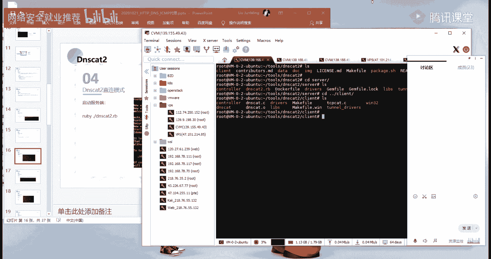

我们来看一下，实际看一下效果，首先的话我们进入到这个sel的目录对吧，然后我们执行reb，然后执行这个脚本，执行之后的话，它会再生成返回这样子的一个信息对吧，给我们，然后的话它会在当前的一个服务端。

它会今天一个53的一个端，对啊，也就是这个可以看到它是一个reb去精听的，然后在这边你去执行的话。

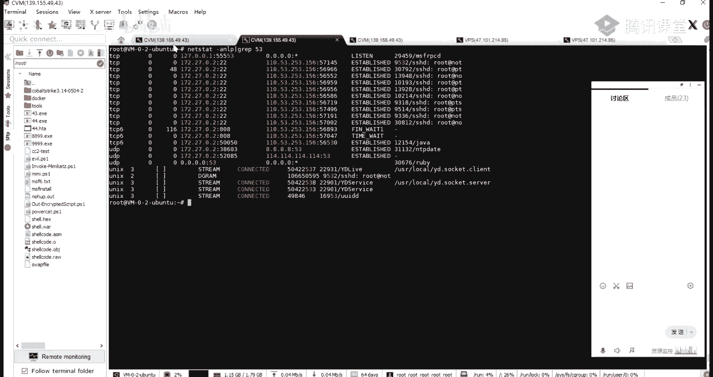

可能会碰到这样子的一个问题啊，也就是我这边运行内的话有给的这个链接，就我今天再去弄的时候的话。

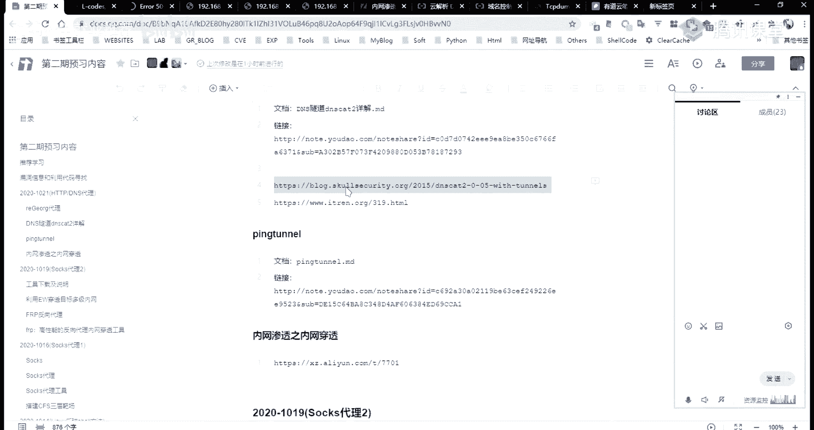

是碰到这个问题啊，好了，通过他的这边的一个方法，看到50这一。

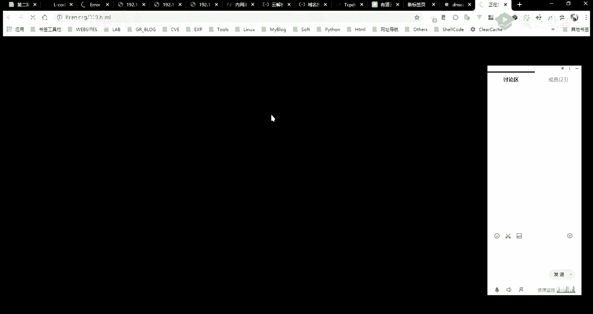

通过他的这个方法做进行了解决，就是你执行的时候它会报错，报错这个53端口的话可以占用了，然后你通过去查看它那个端口占用的服务的话，是这个system d。v resolve这个服，啊不好意思，不好意思。

刚刚有个电话打进来了，好在这里的话，我们就是可以通过他的这边的一个方法，做一个解决啊，就是更改它的配置文件，然后就能够去解决它的一个这个服务的话，他占53端口的一个方法，因为我们在这边的话。

那我们在这边的话，要去使用到这个udp的53的一个端口啊，如果他处于一个占用的一个状态的话，那么我们执行的话就是起不来的，我这边的话，然后在在这边执行之后的话，他就有这样子的一个内容给我们对吧。

然后这边他给到给到我们的一个信息，就是这个secret，然后我们把它脱下来，把它，把它放到这边来，好我们这边服务端启动了，我们需要去启动我们的一个客户端，启动客户端的话就是这样子。

因为我们前面的话已经编译对吧，通过编译的话已经生成了这样子的一个编辑框。

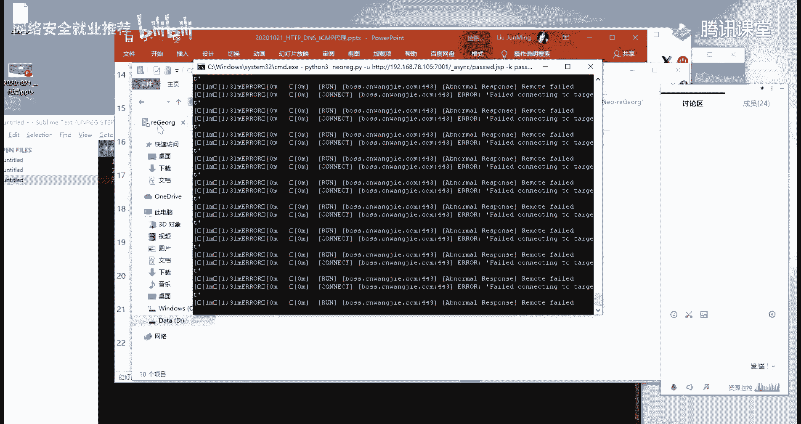

已经有生成了这样子的一个，二进制的一个可执行文件，就可执行文件的话。

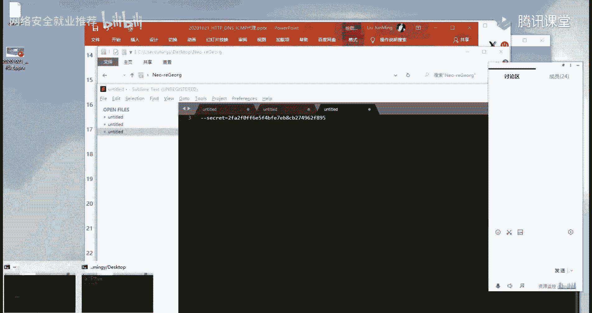

我们把它给算，传到我们的一个目标机器上面去对吧，我这边的话是在我在我自己的一个windows的一个linux，子系统下面来去进行的一个执行，然后执行的一个方法的话就是dx开头。

然后的话接我们的一个干干d s的一个选项。

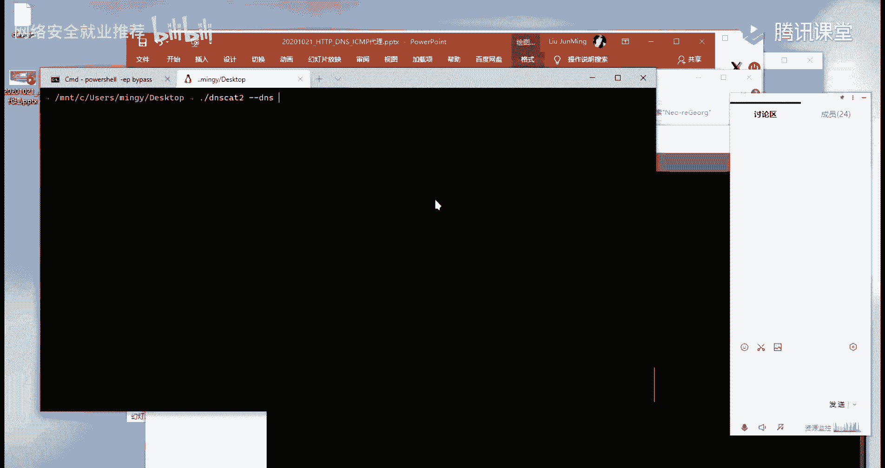

然后关于他的一个选项的话，我这边呃不不多说了，我不会就是做太多的一个介绍好吧，然后我在这边的话，我们需要去指定我们的一个server，也就是我们的一个dx的一个。

而dns cat这个服务所所在的一个服务端，就server的话啊，喂就是我刚刚的那个a p s的一个i p，然后还有的话port端口，端口的话，就是我们的一个53的一个端口是吧。

然后加我们的一个secret，这边的一个secret话就是服务端，服务端它诶。

这边服务端执行之后的话，所生成的这一个secret的一个啊字符串是吧，然后我们在这边的话，时间不是八小时，就是这样。

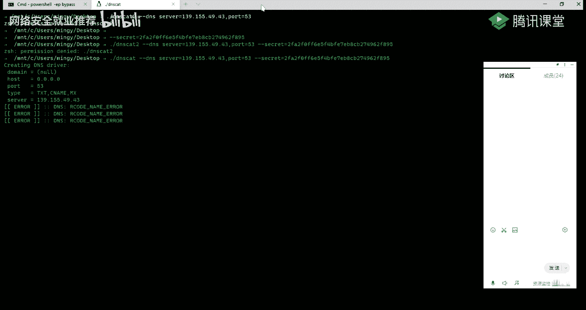

我通过我的另一个服务器。

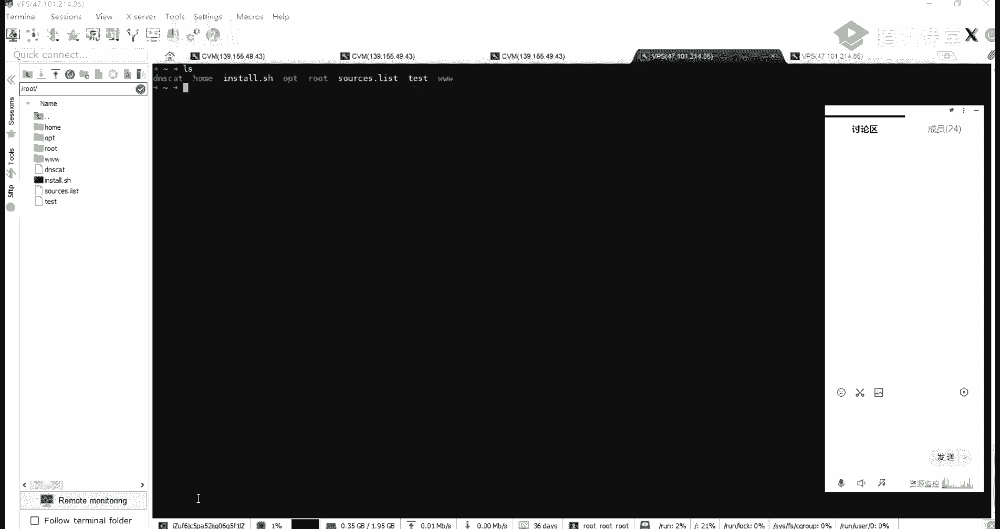

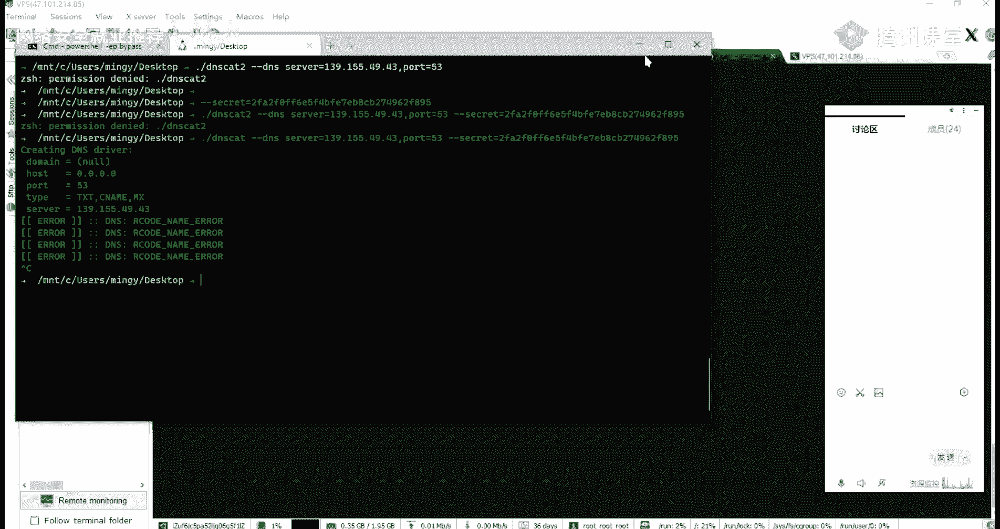

呃呃执行之后的话，他会有这样子的一个结果，就是显示这个session is establish，这个的话就表示我们的这样子的一个绘画，它已经定义了，也就是我这边的话啊，已经这边的一个客户端已经连接上了。

我们这边的一个服务端，好连接上之后的话，他在这边有这样子的一个new windows created 1，这边是什么意思呢，就是他这边的话它就是创建了这样的一个window，也就是一个啊绘画好。

我们可以通过输入这个windows windows，或者是window来去查看啊，然后这电话可以看到有这样子的一个一，这个一的话就是我们的一个命令控制通道，就是这个主机了，然后这一个主机的话。

其实就是我这边的这个主机啊，也就是我这边的这个组件啊，然后这边他得到了他的这样子的一个呃绘画，我们可以通过这样的一个方法来去进入，这边的一个命令控制来去啊，来去操作我们这边的这个呃客户端呃。

具体的一个步骤的话就是筛选，筛选杠i接我们这边的这个id，就这个值为一，然后执行执行之后的话，就会进入到这样子的一个command的一个控制台，这个控制台的话呃，是在这个一啊。

这个一的这个windows这个窗口下面的是吧，然后我们可以通过看来去查看，有这样子的一些命令，像比如说upload就是上传文件嘛对吧，还有呃下动关机shell的话，就是进入我们的这样子的一个shell。

然后还有其他的一些面向e x e c的话，就执行目标器上面的一个程序啊。

关于这些东西的话，在我这边的这一个，就是那个笔记上面的话有啊好啊。

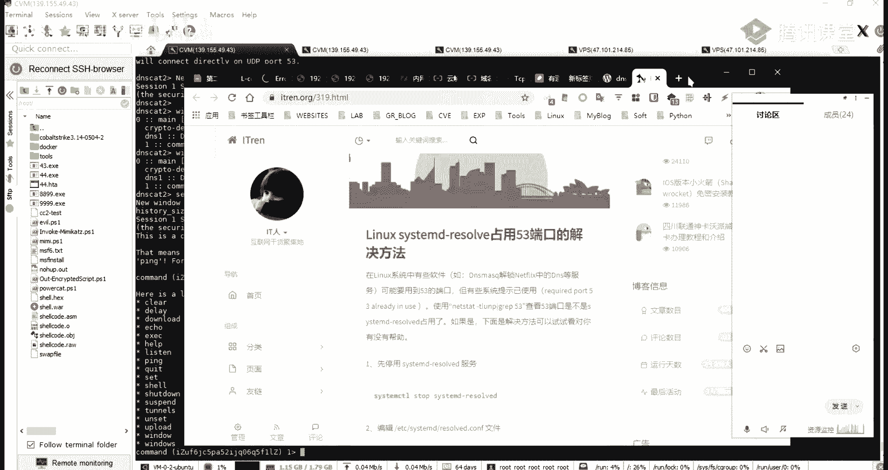

我这边的话主要就是让大家看一下效果，我直接执行shell，也就是得到一个这样子的一个shell会话，我们能够去执行命令，然后在这的话它会又创建一个windows windows，就是一个二好。

我们可以通过session，刚才来进入到这个，进入到二之后的话，就得到了这样子的一个s h的一个shell，然后我们在这块就可以去执行命令，比如说l s的，也就是我当前呃，当前的话是在。

当前的话是在root目录下面，我root目录下面的话就是这些东西吗，我可以看一下对吧，就这些东西，然后关麦我当前的话是一个root的一个用户，然后的话我们就能够去进行一个命令的控制。

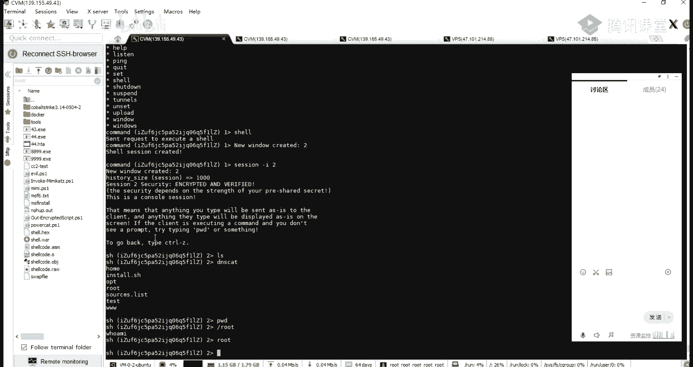

这边的话是一个dcat的一个指令模式，然后直连模式的话，它的一个就是它是直接通过这边的一个，i p对吧，也就是我们在呃这边我们通过这个dns cat所啊，创建了一个呃电的这一个呃服务是吧。

其实呃一个服务端，然后的话客户端的话，他来去迎接我这边ip的这个53的一个端口，就能够去建立一个临界进行连接之后的话，我们就能够去得到它的一个绘画，来去进行一个命令控制呃。

呃具体的一个效果的话就是像这样子啊，我们可以通过这样的一个方法，来去得到它的一个shell，啊上面的话就是这个直连模式啊，下面的话就是dk的一个中继模式，中介模式的话，我们需要去啊做一些准备。

首先第一个的话就是，我们需要有一台公网的一个服务器，这台服务器的话是作为一个我们的一个cnc，也就是我们的一个命令控制的一个服务器，其实就是呃像我就是我这一台嘛对吧，我这边还是。

推掉了就是啊我这句话就以这一台为例，作为我的一个啊命令控制的一个服务器，然后第二个呢就是一台靶机，就靶机的话，靶机的话呃，内网公网的都可以嘛，然后第三个就是一个可配自己写的一个域名。

其实主要的话就是这个就我们需要有一个，可以自己去进行一个解析的一个域名，就是你要去做做这个dns cat，这个中继模式的话，你需要有一个域名，你要去做一个配置，然后我们怎么去进行一个配置呢，我这边呃。

下面的话我们来一起来看一下，这配置dns域名的解析，呃，我这边的话是呃我用的公司的一个域名。

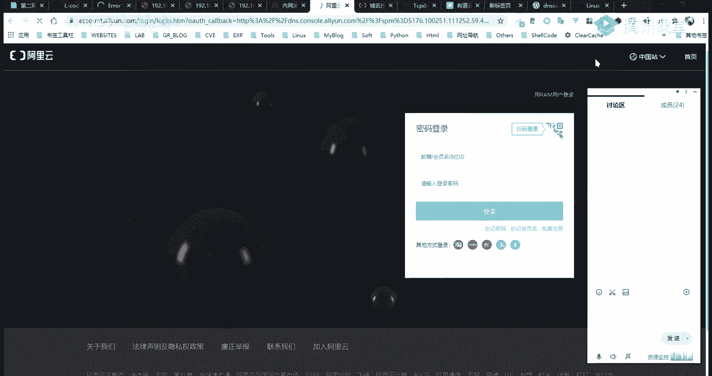

我这边是用的公司的这个疫苗，然后的话我在这边拍的，做了这样子的那个呃解析的配置啊，好和具体的一个配置的话，首先第一步的话就是我们需要去创建一个ag，ig的话，就是将我们自己的一个域名的一个解析服务器。

指向我们的我们的这个就是云服务器的一个ip，我们这边的一个云服务器的话，就是我们自己的这一个要去做一个，命令控制的一个服务器，也是我们的一个dcat服务所在的，这样子的一个服务器，好在这边的话。

我们将自己的这个就是域名解析服务器，这个n s。s点核心点cn的这个好域名，把它给指向了我这边的这一个ip，也就是我这边的这个机器人，然后的话呃第二个的话就是创建一个ns记录。

记录的话就是将我们的一个子域名，就是指定我们这边要去解析这一个子域，子域名的时候，它的一个dx的一个服务器的话，视为这个就是将我们的个解析这个域名的啊，并且批这个域名的时候。

就是再去进行一个dns解析的时候，他会呃给就是告诉他是呃我们的一个呃，电这个服务器的话是这个n s点核心点c，然后我们这边n s等核心点cn，这个域名解析服务器的话，又指向了我这边的这个啊。

云服务器的一个i p是吧，然后我这边配置好之后的话，配置好之后的话，我们如何去做一个这样子的一个启动呢，首先的话我们需要去启动我们的一个服务端，启动服务的话跟前面不一样的话。

就是我们在这边要指定我们的一个电的，一个就是域名服务，就这个啊，其实在后面我们去啊进行，就是它的一个域名解析去经历绘画之后的话，它的一个啊解析的一个域名的一个请求，dns请求的话，他都会是记录的。

是这边我这边呢这个d的一个啊这个玉米，然后的话呃杠杠secret的话就是指定我们要去做的，要去用的这样子的一个密钥嘛，我这边话就随便啊用了一个，然后执行之后的话，就是呃返回这样子的一些信息。

它同样都是在本地区，今天的一个53的一个端口，而我们的一个客户端是怎么启动呢，客户端的话就是呃指定我们这边的一个，dns的一个这一个域名，然后的话启动，启动之后的话就能够去得到这样子的一个绘画，好。

其实在这边它它的一个过程的话，就是像这样子，就是他我们的客户端它会去解析这个域名对吧，他要去找这个域名，它是怎么去解析，那么因为我们在配置这一个域名的时候，在这边做一个域名解析的时候。

配置了他的一个啊他的一个电解析服务器的话，为这个也就是他在去做一个域名解析的时候，他会去找到这个服务器，然后在这边的话它的一个这个服务器，它所指向的一个呃ip，就是它有这样子的一个i记录对吧。

也就是我们再去找这个服务器的时候，他会找到这个ip，然后找到这个ip之后的话，这个ip又是我们的这个呃v p s，或者说是我们那个cc服务器的这样子的，一个i p，然后他再去把我们的一个dns请求。

它会发到我们这边的这个ip的一个，53的一个端口，然后其实就是呃通过这样子的一个解析的，一个方式，把我们的这样子的一个数据再去解析这个域名，解析这个域名的时候，把它给发送到了我们服务器的。

图书上的一个端口，然后的话来去建立的这样子的一个零件。

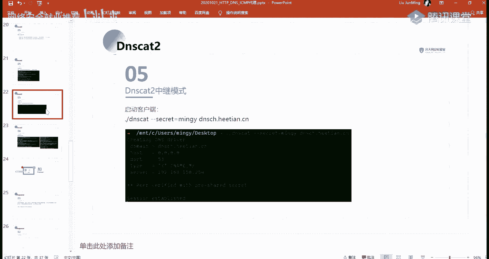

然后具体的一个效果的话就是这样子啊，我们实际来看一下吧，首先的话呃我这边直接复制。

前面的打掉了，然后我这边执行之后的话，就是这样子是吧。

就服务端的话已经启动了，然后我们下面的话启动我们的一个客户端。

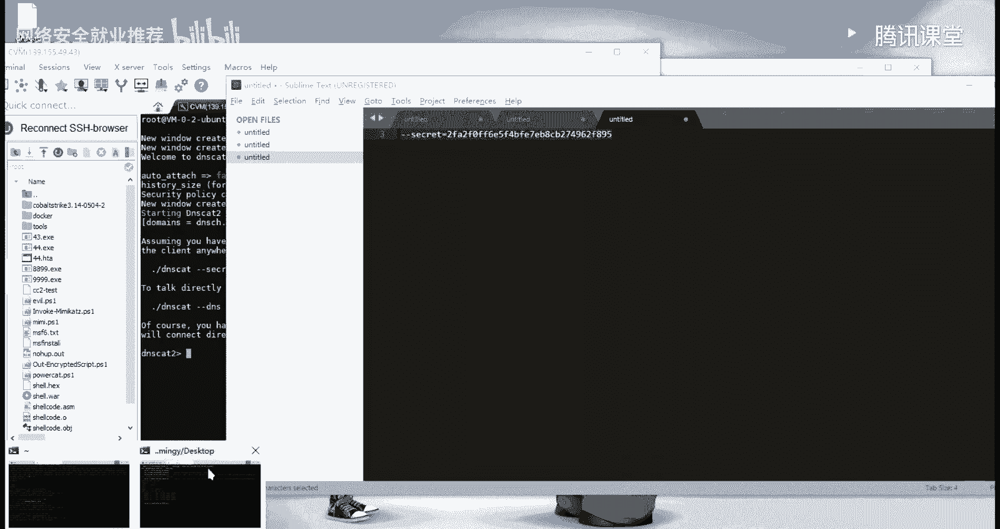

客户端的话我就在我本地的这个机器，就这样子，然后可以看到在这边执行之后的话，他就呃他就呃已经晋级成功了对吧，我们的一个筛选的话已经已经启动了。

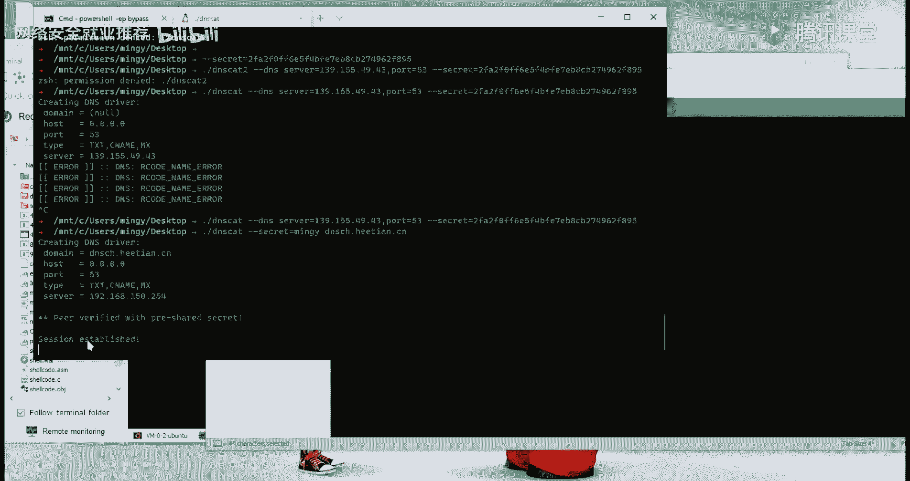

那我们在这边服务端的话，可以看到在这边的话就得到了这样子的一个啊，windows windows这样子的一个控制台窗口对吧，然后就是同样的一个操作，我们可以进入到这样子的一个控制台对吧。

然后执行shell shell之后的话，它就会得到一个命令控制对啊。

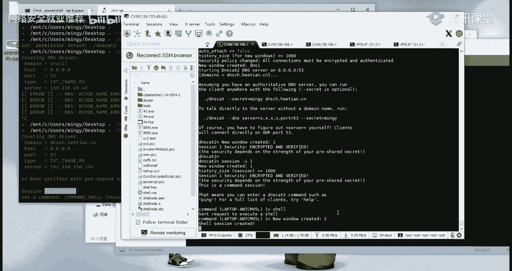

其实在这边他有这样子的一个，他有这样子的一个信息，就是我们这边的一个服务端发，就是执行这个需要之后的话，他会在这些客户端，它会呃有一个这样子的一个，就是得到这样子的一个命令控制的这个需要嘛，是吧。

有这样的一个请求发送到了客户端，然后的话它就会启动一个这样子的一个，b s h的一个系对吧，以及它的一个需要的一个id是这个610。

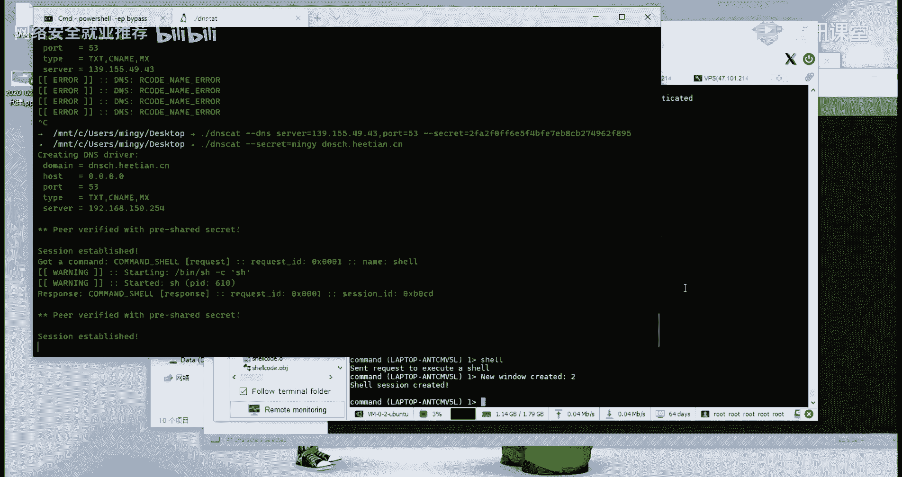

也就是到我们的一个服务端，它就是这个二对吧，然后我们可以通过筛选gi，指定这一个，来去进入到它的一个啊s h的一个线，我当前的目录还是各一个是吧，这边的话这东西有点多啊。

也就是我们通过这样的一个方法，它已经呃成功地建立了这样子的一个呃，命令控制的一个通道，然后所采用的一个方式的话，就是这个dx cat 2的一个中继模式，然后呃其实大家再去做这个的话，其实主要的一个地方。

那就是这边的一个域名解析，你首先你要有一个自己的一个玉米，就你需要自己去买一个域名，然后呃其实我自己有域名，但是要备案了，然后我一直没背啊，所以我这边他是直接用的公式的。

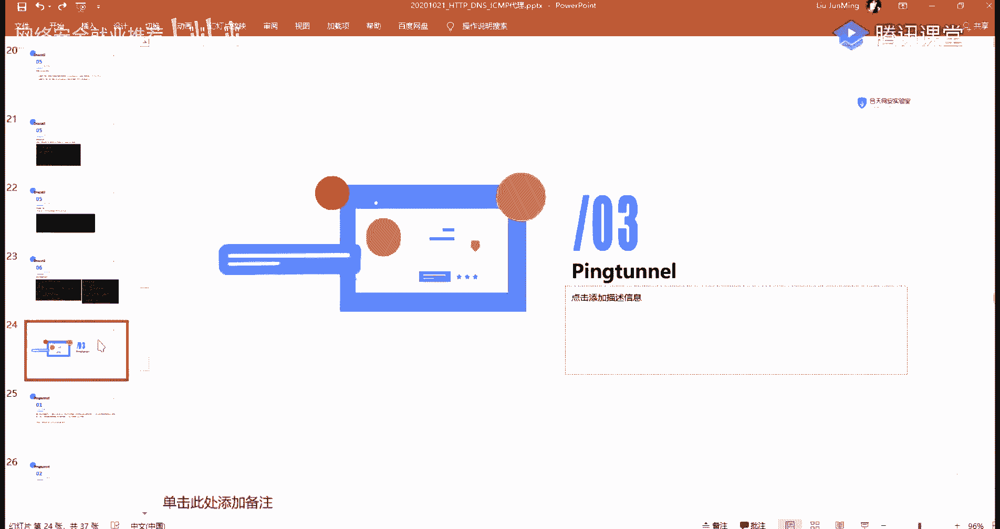

呃呃其实大家可以，就是如果大家自己在本地有的话。

在本地有下，有自己编译的这样子的一个dns cat的话啊，你可以就是执行这边的这个命令。

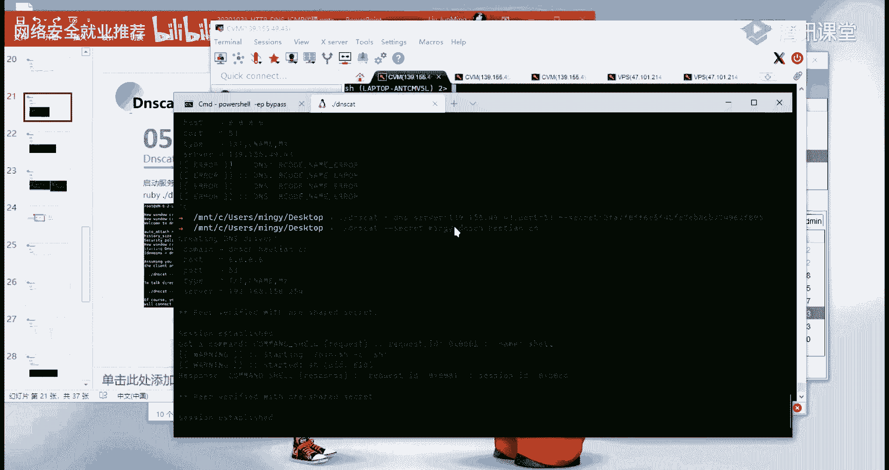

我这边的话就能够得到你的一个小，就有谁想试一下嘛。

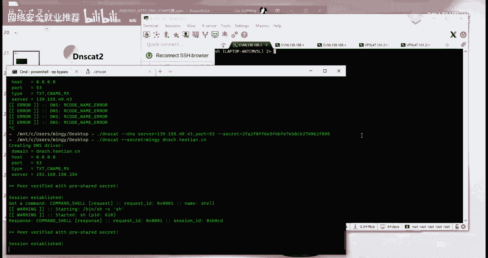

有谁想试一下吗，就执行执行这一个就可以了，呃以上的内容的话。

大家能能听懂吗，有没有什么疑问，就关于这个电pet啊，就是通过这个电的一个呃方式，然后其实在这边我们有静电连接对吧。

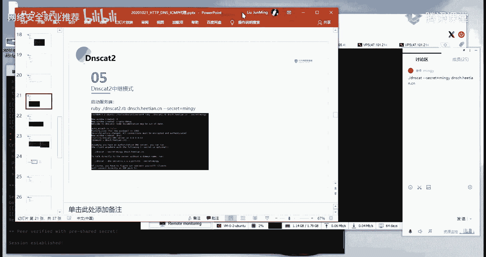

我们可以来查看一下它的一个流量，就是查看它的一个dns请求的一个流量，我们这边的话可以通过tcp tcp dp，在linux下面的话呃，就是，mini是什么来着，然后其实可以看到对吧，就我们在这边啊。

我这边的话就是通过dd cp dp来抓取。

就是呃访问端口，就是访问目标端口是我这边53的，就是我本地53端口的这样子的一个请求啊，好在这的话就能够去看到对吧，这边先停掉，然后在这边可以看到有这样子的一些景区，是有限ttext新name。

还有mx对吧，这样子的一个请求，然后呃其实dns cat的话，它的这样子的一个，他再去选择这样子的一个，电解析的一个类型的时候，它是会像这样子，就是呃通过在这边他是这一些模式，它都会好不好。

这些类型他都会去就是随机的去那个像c内玩，text fx等等这一些类型，它会去交叉的去去进行一个使用，然后在这边他去请求的一个数据啊，我们可以看到就是这边吧，这边的话就是其实就是我们所传递的这样子的。

一个数据，它在这边，然后它传递给了一个域名的话，就是我们所设置的这样子的一个dx的一个域名，我们自己的一个域名对吧，呃呃其实大家也可以去试一下，就是那个直连模式，直连模式的话就是呃电cat。

它是会有这样子的一个关键的一个字，我这句话我就不尝试了，大家可以自己通过这样的方法来去呃，查看它的一个流量，呃大家有疑问吗，应该没有疑问吧，啊有没疑问的，扣个扣个一，有疑问的扣二，就两个同学吗。

其他同学呢能能理解吗，一时不知从哪问起呃，那那那你是没理解完，还是说又是呃要等自己操作，就是没理解呃，哪里没理解呢，我可以再给你呃，大概的说一下，好啊，你看录播也行吧，那那你看录播吧，然后有问题再问吧。

好那么我们继续啊，我们继续后面的一个内容，第三部分的内容，第三部分他就是这个好ptnt，也就是通过sm p c导来做来去，和反弹线来去建立我们的一个线呃，在这边的话嗯，先大概的了解一下。

就是s m p隧道的它的一个作用，就其实呃前面我们介绍的这些，其实它都是有它相应的一个作用的对吧，首先第一个向我们的这个htp的一个隧道，hp隧道的话就是我们得到了它的一个服务对吧。

它是像这种web服务，以及他的得到了这个机器的一个稀有，它是只有像这种htp的一个流量，或者说它只能从八零端口而去呃，访问外网对吧，也就是资源学htp的这种流量的话，那么我们要去呃。

比如说我们生成一个码，我们传上去，然后我们执行的话是像这种tcp的这种流量对吧，那么它是无法去呃，连接到我们的一个呃服务端的，那么在这里在这边的话，我们就选择通过这样子的一个htp的，这样子的一个隧道。

因为我们通过的是他，我们使用的话是这样子的一个脚本，这个脚本的话在他的一个服务端上面执行对吧，然后他解释之前的话，它就能够呃，跟我们这边的一个呃脚本的这个客户端，建立一个连接啊，建立连接之后的话。

来得到这样子的一个socks的一个代理通道，然后其实这边的一个代言通的话，其实是通过这样这边的一个htp的一个协议，而去进行的一个通信啊，这个的话就是这个hp带你学到的一个作用。

然后呃电视cat 2的话就是呃，因为我们通过前面的一些操作对吧，能够去知道，它其实是通过我们那个电的一个解析来去进行，的一个数据的一个传递对吧，那么在我们的一个实际的这种环境当中对吧，他可能就是。

他可能就是它不允许像这种我们的一个呃，tcp对吧，tcp u d p的这种啊协议的这样子的一个请求，数据的一个传递啊，那么我们想要去得到他的这样子的一个shell是吧，得到这个机器的一个需要以及把握。

能够去建立这样子的一个命令控制的话，那么我们可以通过这样子的一个点，s的一个它的一个解析协议，因为在呃在防火墙或者说在内网当中的话，你要去进行一个域名的解析的话，那么d的一个协议的话。

他肯定是能够去被允许去啊进出的对吧，因为你要去你要你要去访问域名，那么你就需要域名解析，那么你要域名解析的话，那么你就需要有53端口是，然后我们在这在这边的话，我们就可以通过他的一个点的一个域名解析。

来去建立这样子的一个隧道，来进行一个命令控制，然后的话到这边，第三个的话就是呃我们通过某种方法对吧，得到了一个机器的一个shell，但是这个需要的话，我们就不适合去进行一个命令的一个控制对吧。

然后的话它的这个环境的话，又它不允许像t c p u d p，还有像d s h e p等等这种协议，它不能够出网，那么他只有就是只有只能够通过s m p协议，去进行一个出网的话。

那么我们可以通过这样子的一个呃方法，就是来去建立一个s m p的一个隧道，然而在这块主要就是通过介绍这个工具啊，这个pta的一个工具来给大家介绍，然后这个工具它那个一些参数的一个使用的话。

我这边也不多说，大家自己呃自己去了解好吧，我这边的话其实呃都是中英文对照对吧，啊不是啊，就是都是中文的对吧，中文大家都能看得懂吗，就是以及参数它对应的一个意思，呃呃首先第一个的话。

我这边的话就是有列举了这样子的三个例子啊，呃三，呃下面的话我会以这样子的三个例子啊，就是给大家呃说明讲解，这样子的一个呃p sp隧道的一个应用，首先第一个号就是一个sm p隧道，去转发tcp来上线。

就是把我们的一个tcp的一个流量，通过这边的一个sp的隧道，然后的话做一个转发来去得到它的一个呃shell，来去进行一个命令控制，然后具体的一个使用的方法的话，就是，首先第一步，我们的一个ups。

需要去启动一个sp隧道的一个服务端。

也就是用到我们这边的这个pta的一个工具，我这边的话，呃在在哪呢，就是这个就是这个pta这个，然后我们首先的话需要去通过这个pt。

还去启动一个sm p隧道的一个服务端，然后启动的一个方法就是像这样子，gupta呃，其实他的你直接直接干pta。

他在这边它有中文英文的一个对照，就是选项的一个意思，而我们这边的话使用的一个方法就是get type，还去指定我们这边的一个类型。

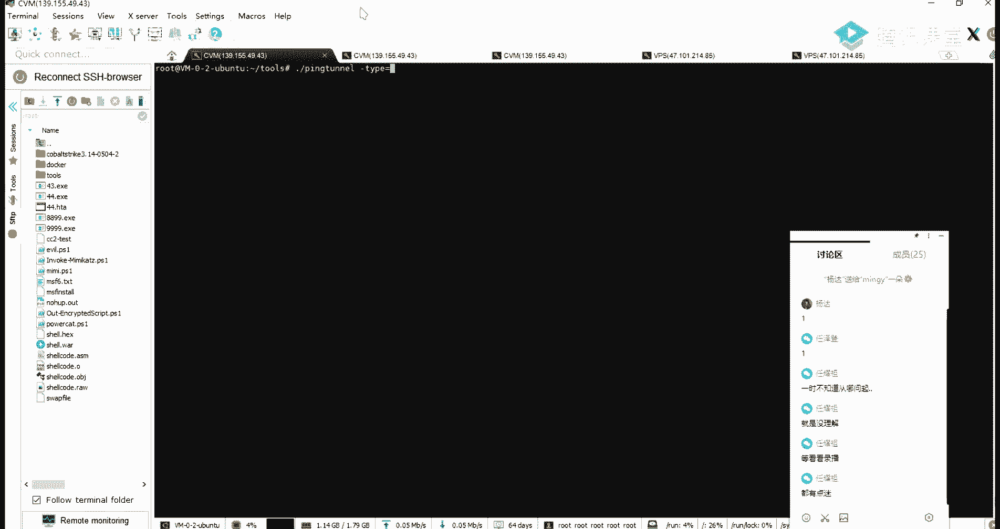

a型的话。

我这边的话就是server，因为我是启动一个服务端吧对吧，然后如果说你是客户端的话。

那么你干type指定的一个类型的就是服务端好，不就是客户端，所以的话在这边其实看参数的话，你会发现就是有服务服务舱，服务器的一个参数对吧，还有客户端的一个参数就是你啊，如果你指定的一个类型就干type。

你指定是服务端，那么你可以使用这样子的一些参数，能够去有这样子的一些功能对吧，那么如果是你是在客户端，你要去连接服务端，那么你可以使用这样子的一些参数。

好我在这边启动之后的话，就是这样子的一个效果。

看可执行啊，执行之后的话就像这样子，当的话在这边的话，因为呃我们可以看到。

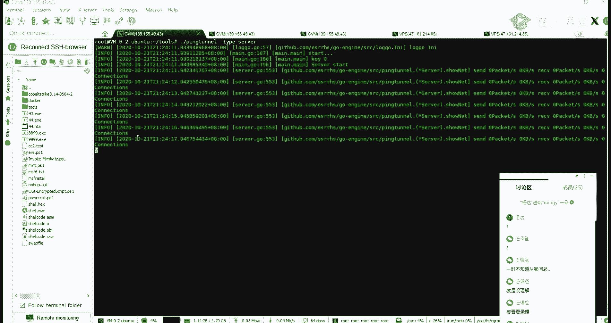

就是他这边有这样子的一些日志对吧，他在这边可以看到它是没有数据的，一个传过来的对吧，就是零，然后呃这个时候我们来骗一下吧，我这边来拼一下这个ip，就是这，我这边平凉，屁股疼，我是惊掉了，好先看后面的吧。

就是等会的话会有数据啊，这边的话暂时没有好，这边服务端启动了对吧，然后我们在把这上面启动我们的一个客户端，启动客户端的话就是呃，我这边的话是那个机器是哪，呃这边我把它，客户端的一个启动面的话。

就是像这样的，我这边我就不嗯不敲了，我直接复制粘贴啊，就像这样子。

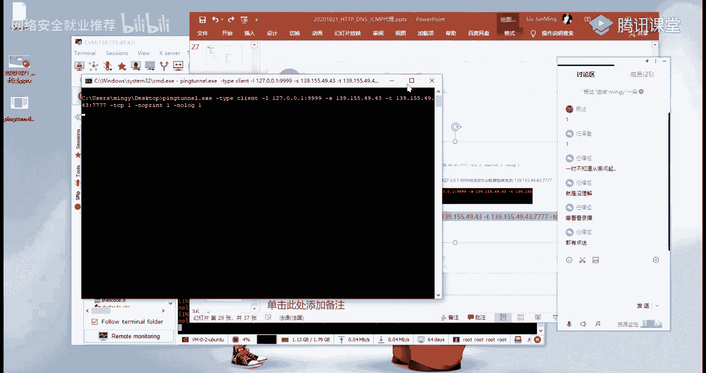

这边执行之后的话呃，执行之后的话，他会来去连接我们这边的一个服务端，我们可以在服务端这边来看一下，然后你现在看的话，你就会发现他会一直有这样子的一个数据，就是ping from从我这边的这个ip。

这个的话就是我当前的一个公网的一个ip，然后他来就是来骗了我这边对吧，其实就是连接到我这边的一个，服务端和服务端嘛对吧，然后其实前面的话，它是没有这样子的一些数据的对吧，因为没有没有进行连接。

然后现在建立连接的话，可以看到它就是隔一个的话，它就会有这样子的一个就是ping啊，有这样子的一个ping的一个请求啊，呃呃其实在这边的话，就是大家如果不想看到这样子的这些日志的话。

就我们可以通过这样子的一个方法，就是像在这边啊客户端对吧，我们可以通过加这样子的两个参数，就gal print及gal log，然后我们在这里就看不到它的相关的，这种就是连接的请求的一个日志是。

然而我们具体的来看一下这条命令，它的意思啊。

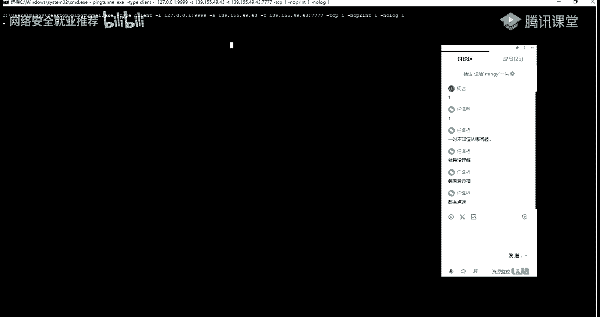

其实我这边pd的话已经有详细的写了，就是我们这边的一个客户端，它会去监听我们这边的一个啊这边的客户端，它会去监听本地的这样子的，一个九九千999的一个端口对吧，然后他今天这个端口之后的话。

他会我们这边杠s的话，就指定我们的一个pin server，也就是啊，这个而片仓的隧道的这一个服务端的ip，也就是呃我这边的这个ip，对吧，就这边我服务到了一个ip，然后他会去进行一个连接。

然后它连接之后连接之后的话，gt的话，就是它会将我们这边所收到的这样子的一个，从这个九九千999这个端口，所接收到的这样子的一个tcp的一个数据包，这边干tcp的一个数据包。

把它给转到了我这边的这一个啊，服务端的一个7777的一个端口。

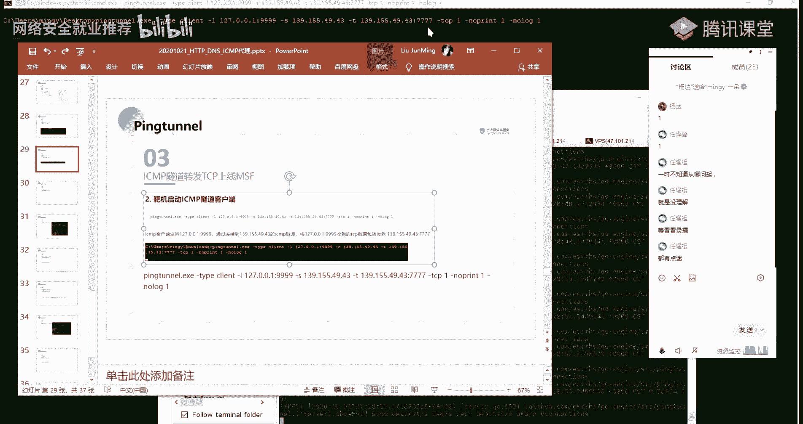

然而这边干tcp的这个选项的话。

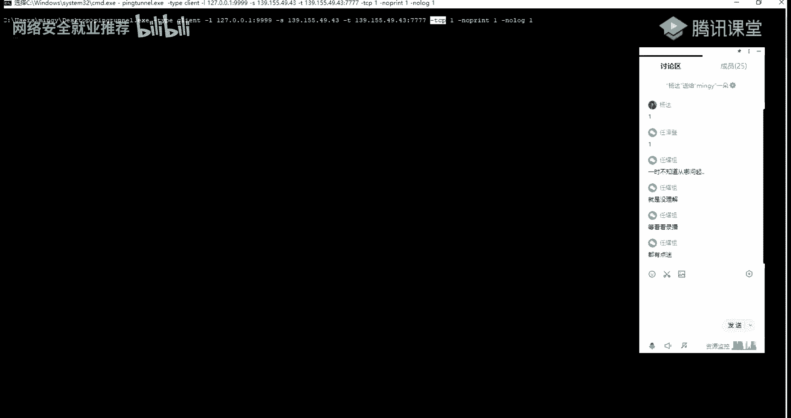

看p p t吧，这边有有说对吧，就干tcp就是设置是否转化，tcp就默认为零的话，就是它是关闭的。

然后的话你要去启用它转换tcp的话，那么你要干psp指定为一，同理还有其他的这些参数都是这样子的，就默认的话它是都是关闭的，然后你要启用的话，就是这个选项后面接一个一就是启用。

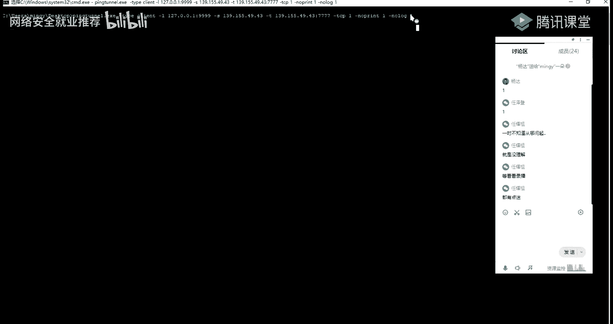

那么在这边我们建立连接之后对吧。

我们要如何去得到需要，得到需要的话呃，在对话我们通过msf的一个方法，就首先的话我们msf新生成一个法克，需要的一个payload，然后这个payload的话，它生成的话跟我们前面生成它是有区别的。

要注意啊，能看到它的一个不同的一个地方，那就是我们这边指定的一个our host，也就是我们这边生成的这个payload，这个ex的这个程序对吧，他去连接了一个ip及端口，它是我本地的这样子的一个ip。

以及这边的一个九九千999的一个端口，那么这边它生成的这个exe程序对吧，它有什么用呢，也就是因为在这边的话，他是去反弹一个shell对吧，而我们这边生成了一个payload。

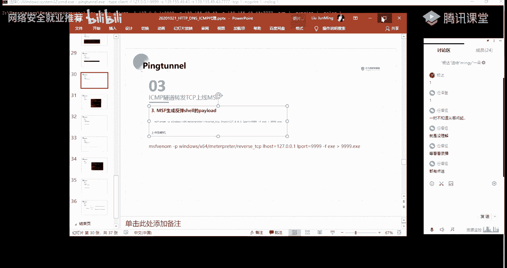

就是指定那个payo的是一个tcp的好，我们在这边生成了这样子的一个pad。

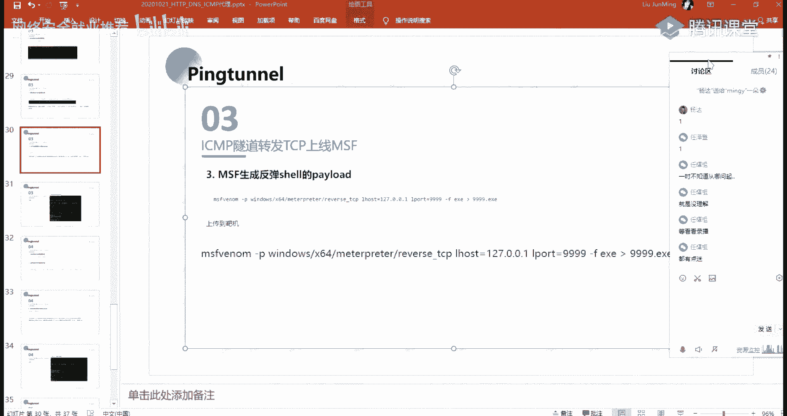

它执行它在这边目标机器上面。

它执行之后对吧，执行之后的话，它其实是一个tcp的一个前奏，而我们这边的这个环境的话，如果说你要去。

如果说你这边你要去连接的一个ip的话，是我外网的一个mc服务器的一个ip，以及端口的话，那么它是一个tcp的一个请求连接，然后我当前的这个环境的话，它是不允许tc p，u d p的这种协议的一个传输的。

那么所以的话我这边执行就转，就是在目标机上面执行之后，也不会有，也不会跟我们的一个服务端去建立连接，因为它的一个请求它根本就是发送不出去，所以在这边的话我们生成这一个的话。

它其实是像就是我们的一个tcp的一个请求，它是其实是发送到了我们这边的一个。

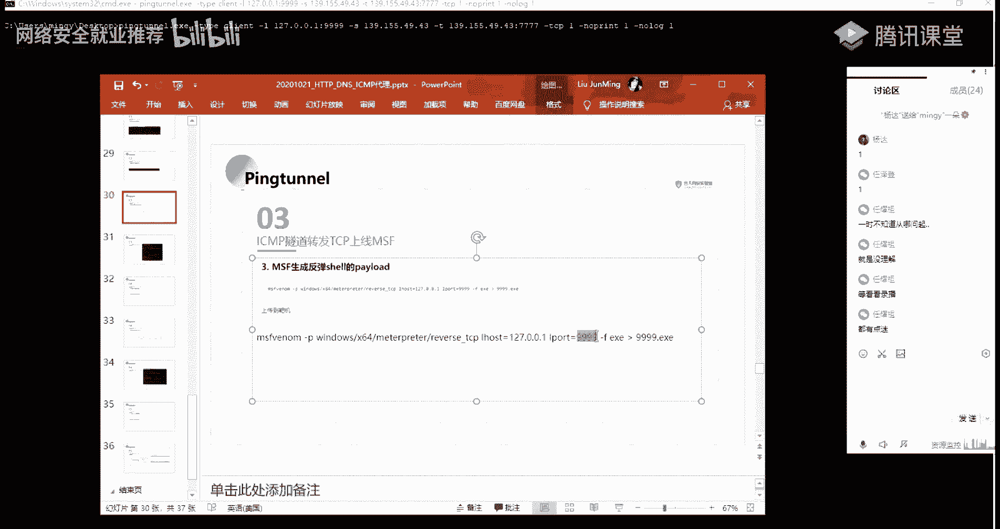

九九千999的一个端口，那么这边这个9999端口的话，其实就是我们这边的一个i s m p隧道的，这个所今天的这个端口。

那么最后的一个结果的话，就是我这边执行执行这个程序，执行之后的话它的一个tcp的一个请求啊，他会去连接这边的一个。

9999的一个端口，然后这边的一个呃，因为我们在这边，他通过这个平仓的，建立了这样的s m p的一个隧道，然后他会把这边来自9999，这个端口的一个tcp的连接请求，它会转到这边的。

对你的这个ip以及它的一个端口，然后这边的一个i p接端口的话，其实就是我们要去啊，就是我们的一个msf服务端所在的一个端口，也就是等待客户端来去连接的，这样子的一个ip以及端口。

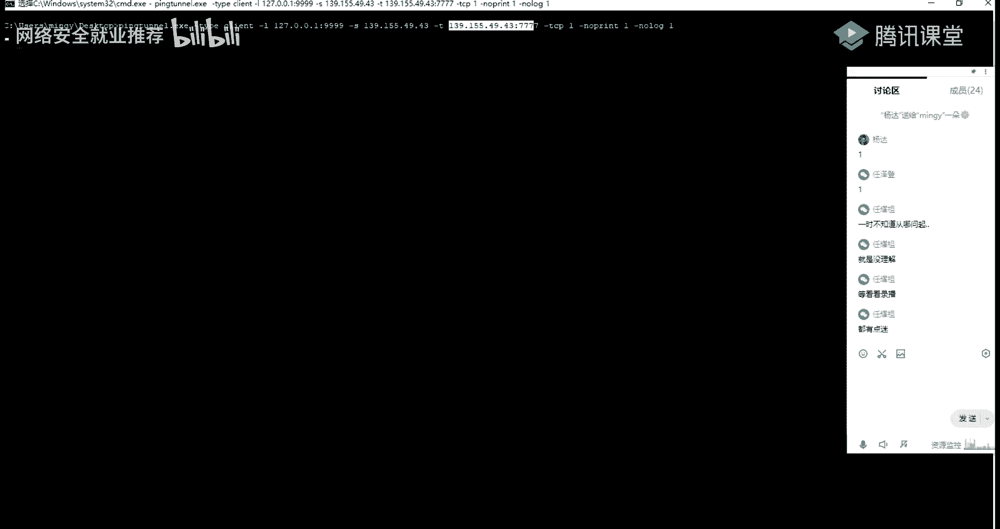

那么我们呃具体的来看一下直接的一个操作。

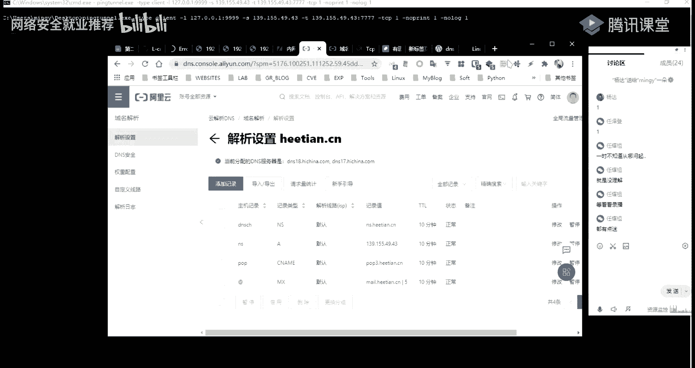

我这边的话，我这边重新来一下，就是不要这些日子了，他一直在刷，有点多了。

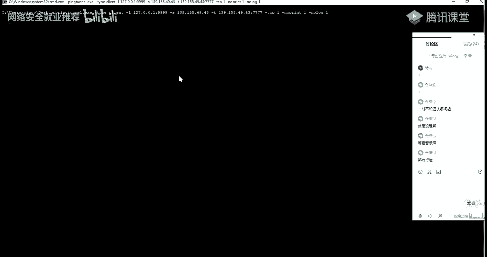

呃呃现在的话就没有这些这些日子了对吧，没有这些日子已经信相关的一些信息了，然后我在这边的话呃。

我在这边的话呃，我这边呢这一个服务器的话，有一个msf的一个框架，啊呃我们要去。

首先的话第一步的话，我们需要去生成这样子的一个payload。

这边我直接复制啊，敲了。

看了这个嗯，我这边已经有了，我看一下，我这不生成了吧，哦本地应该是有的，那这里就这一个9999，然后我们生成了这个，生成了这样子的一个po的对吧，我们上传到我们的一个目标机器上面去。

然后的话执行执行的话，我们这边执行之后对吧，执行之后的话嗯好我这边msf我们看看今天，啊我这边是开放的40，这是我们的一个payload，然后的话这是我们的一个host。

以及端口是我们的这样output，我们这边的一个端口的话，其实是呃这边啊就是我们这边客户端嗯。

这边客户端对吧，他会把我们那个pcb那个请求，他会转到我们这边的一个v p s的。

这个ip的这个端口，所以的话我们只需要去精听，这个777的一个端口。

那么我们就能够去啊，接收到来自客户端的这样的一个。

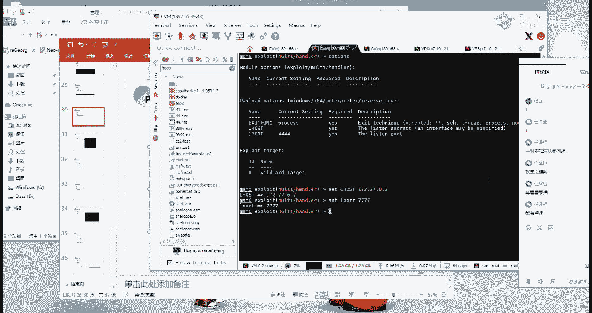

tcp的一段连接请求。

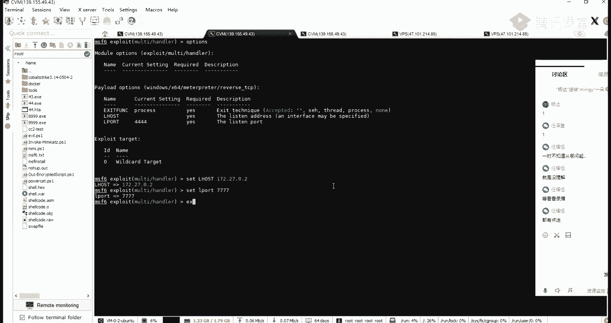

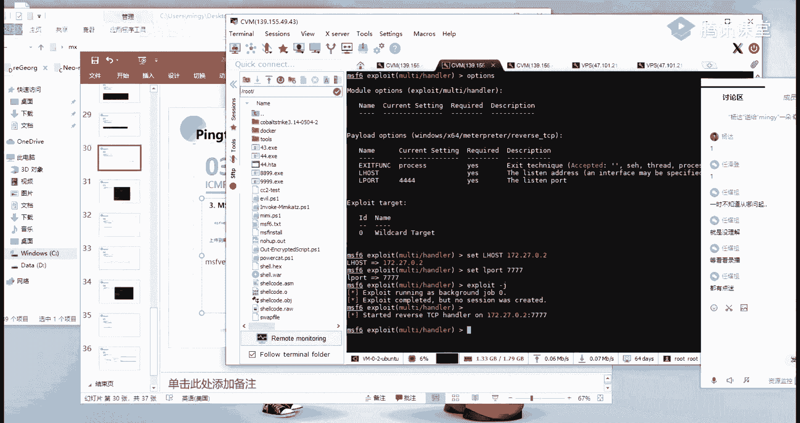

然后可以看到对吧，在这的话就直接都建立了这样的一个筛选一。

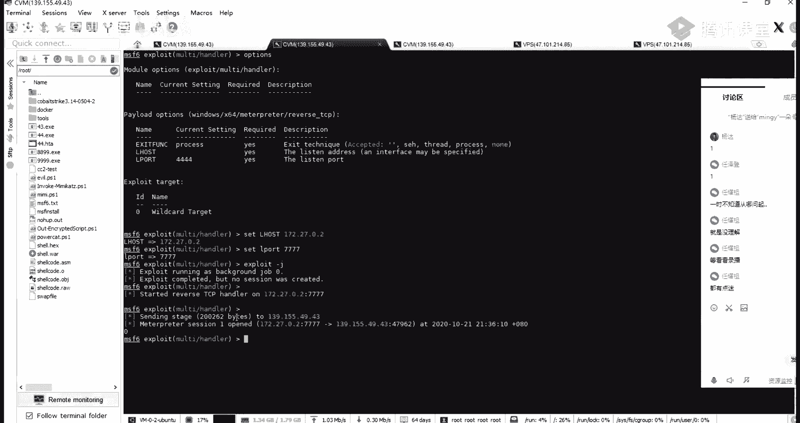

啊对吧，我们可以看到呃，因为我当其中是已经呃执行了，执行了之后的话，它的一个连接的一个请求，它会发到这个端口，发到这边的一个9999的一个端口，然后他通过这边的一个ping。

通过我这边的一个pin server，然后他会把这样子的一个临界的一个请求，他会发到这边来，发到这边来的话，他会做一个转发，然后转发到这边的这个ip。

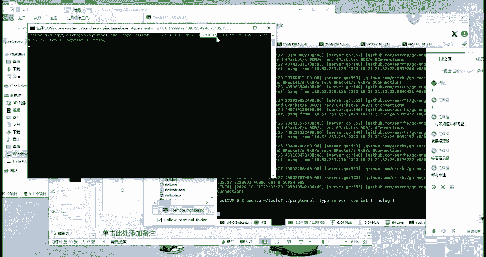

对这个ip的话，其实你可以就是因为我当前的话是这个pin server，跟我这个m4 s的服务器都在同一个，这都是同一个服务器嘛，所以的话都是同样的对。

然后这句话就是转到了这个端口，然后的话这个端口的话。

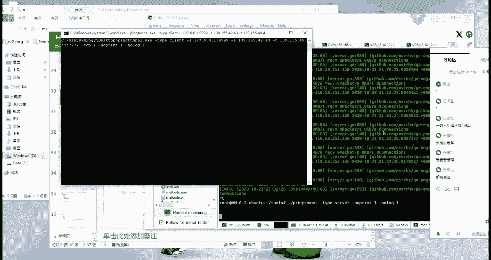

就是我们msf所今天的一个端口，然后的话就得到了他的一个筛选，就这个三选一，我们进来看一下是吧，是我当前的一个主机，这边的话resist停掉。

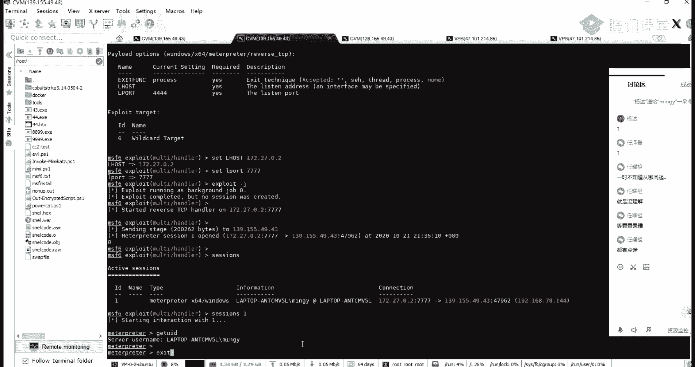

这个的话就是呃，第一个就是通过i s n p c导，来去转发我们的一个tcp的一个，这种请求的一个零件，然后的话上线了msf，然后结果的话最后的结果的话就像这样子，然后第二个就是s m p的一个隧道。

来去转发我们的个socks来去上线，然而我们知道说不是，他其实呃也是通过tcp的一个那个，请求的一个协议对吧，然后的话在这边的话呃，他的这一个利用的一个方法的话，就是主要的话就是在这边的话。

它会有一个不同的一个地方，就是我们在这边去生成这个payload的时候，跟我们前面去生成po的话有很大的不一样，因为我们这边要去实现的一个目的，是通过socks的一个方式来去转发。

我们的一个socks的一个这样子的一个呃，就是通过socks代理的一个方式，来去转发我们这边的一个请求，呃然后首先第一步的话都是一样的，就是启动我们那个服务端，然后启动之后的话。

我们的一个靶机要启动我们的一个客户端，这边的启动客户端的话呃，跟前面的话它的一个不同的地方，就是这边多了这个杠socks的一个参数，这边的这个干socks的一个参数啊。

就是启用我们的一个socks的这样子的一个呃，看一下，开启我们的一个sos 5的一个转换，好我们在这边嗯，我们在这边执行之后对吧，执行之后的话，它做了什么呢，就是我们这边的一个客户端。

它会监听我们本地的一个九，9999的一个端口，然后这个端口的话，它其实就是启动了一个socks 5的一个服务，然后这个socks 5的一个服务的话，它会等待就是我们的一个呃我们的一个payload。

也就是我们在这边所生成的这个，payload的一个零件，然后在这边的话就是呃，如果这边这边的一个payload，它连接到了我们这边的一个cp，socks的一个服务端之后对吧，连接之后的话。

它会把他的这样子的一个请求，它会通过这边的一个sp的一个隧道来转发到，就是转发我们这边的一个sos，这个代理的一个请求到目的地址，这边目的地址的话就是这个我这边的一个呃。

msf 4 msf服务端的呃8899的一个端口，然后这边的一个889有端口的话，其实就是我这边，我这边m3 f所生成的这个payload的话，他去进行的一个连接的话，它的一个呃ip以及端口。

就是我们这边所设置设置的好呃，我们来具体的来看一下，首先的话我们把机启动我们的一个客户端啊，我这边咱们复制一下，把机子形成一个命令的话，就是这样这一个啊，不是不是这个，这个这个嗯788，8995，岗位。

啊呃因为我这边的话。

这边的一个服务端的话已经起来了对吧，然后我这边的一个客户端的话是在这里是。

然后我执行启动我的一个客户端。

启动之后的话，他会在本地区进行这一个端口对吧，然后他不仅今天的一个端口，而且它开启了一个收拾的一个服务端，就是它是在这个端口。

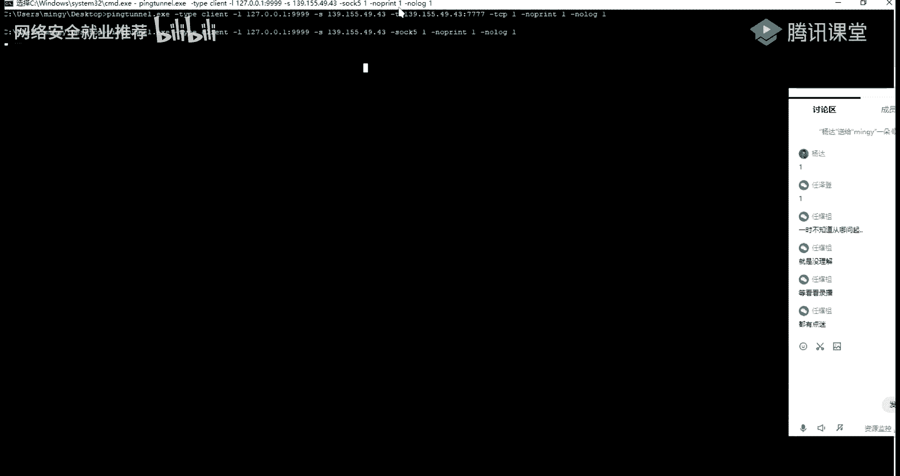

然后这边开启之后的话，我这边通过msf生成了这样子的一个po的好，在这边的话，我们来看一下这边的一个生成pro的一个命令，就是首先的话就是指定这个payload嘛，就是跟前面是一样的对吧，好。

我们那个a host要注意的是，指定不是像我们前面指定本地，而是指定我们这边的这个呃，这边的这一个msf服务端，就是这边msf服务所进行的z所进行的，这样子的一个端口。

那么这样子的ip以及它对应的一个端口，然后的话在这边的话有多了这样子的三个参数，就这一个hp prox type以及还有host，还有p，其实从字面意思的话，我们也能够知道，就是在生成这个po的时候。

它指定了这样子的一个呃socks的一个代理类型，然后它的一个连接的一个i p，就是它生成了这个pad，它会去零通过socks，socks的一个通道去连接这边的一个ip及端口。

然后这边的一个ip端口的话，其实就是我们这边通过这个ptas，说今天的这个socks服务端。

所在所在的一个端口对吧，然后在这边客户端他执行之后的话，它就会与我这边的一个socks的一个服务端，进行连接，然后的话我的一个请求的话，他就会去呃通过这边的一个连接。

它会通过我们这边的一个s n p的一个隧道，把它给转到我们这边的一个ip，以及对应的一个端口上面去，我这边的话我就不重新去那个了，我这边已经呃也生成了这样子的一个，我就不再重新去生成了。

然后我这边只在他们的cf上面做一个监听，就是设置我们的一个app的话是8899是吧，行今天这一个方法就选择一个端口，然后今天之后的话，我再进行执行执行这一个8899，然后我们看这里。

你看到我这边执行之后的话。

他密码的话就得到这样的一个选，对吧，就是一个筛选二，这是第二个。

就其实它的一个呃，它的一个与使用的这样子的一个方法，跟前面的第一个其实是类似的对吧，你会发现，然后指示的话，它的一个在这边的话跟前面的不同的地方的话，就是呃他转发的是我们的一个socks的一个。

这样子的一个请求啊，不说的这样子的一个概念，然后第三个的话就是这个sp隧道转发，转发gcp上线cs，就其实cs跟msf的话都是类似的吧对吧，然后呃具体的一个的话我这边就是念出来的话。

就是给大家作为一个例子嘛，就是大家再去碰到这个对吧，你想要转到cs就转cs了，你想就你哪个用的顺手的话，你就呃转哪个吧，然后呃在这边的话，它的一个步骤的话跟前面其实类似啊，就是启动服务端。

然后的话把机启动客户端，启动客户端的话，在这边的话呃它的一个配置的话也是类似的，那命令的话是一样的，同样的开启tcp tcp的一个转发，不同的话就是在cs客户端上面的一个配置，和服务端的一个配置。

我们首先需要去创建这样的一个listen，就是一个监听器创建的，这个监听器的话就是呃它的一个配置的话，就是像这样子，就是我们那个hd p s的一个host，注意的话是选择我们的一个本地，以及这边的一个。

都是我们的一个压七点点0。1啊，然后还有的话就是这边的啊hp的一个port，以及我们的就是ci的一个port以及班的一个port，而关于这两个的话，在这边有解释，就是host，还有put的话。

就ci的一个port话，就是我们sm p隧道这个客户端，所今天的一个ip及端口，也就是我们的一个ci的一个连接的话，它会它会就是连接到我们这边的，一个8899的一个端口对吧，然后的话呃。

这个port这个伴的话，就是为转发的一个目的地址的一个端口，然后在这边他建立的，它与我们这边，它连接到我这边的一个8899的一个端口，说话，我们做一个转发，把它转发到我的一个777的一个端口。

然后这边的一个机器的一个端口的话，其实就是我这边的一个呃，继电器的一个，那个就是接受希尔的这样子的一个端口，因为我们在这边呃，没问题啊，然后的话我们需要去生成这样子的一个，反向配漏的，然后这边拍照的话。

就是你linux不windows上面的话，就生成这样的一个e x一嘛对吧，然后我这边64的话，就勾选这个64的一个po的，然后生成之后的话，我们执行执行之后的话就能够去得到这个选好。

这边的话看一下我这边生成的是在哪，从哪去，现在是我忘了，现在呢呃这边这边还需要我去操作吗，那要不大家自己课后去操作吧，好吧，就作为一个课后作业，因为我这边的话呃，包括截图啊。

已经命令的话都已经给给出来哦，对都已经都已经详细的给出来了对吧，应该没有什么问题啊，大家啊，以上的话就是我们本节课的所有内容啊，大家有没有什么问题啊，没有问题的话，那么我们本节课的话就到这边就结束了。

呃有问题的啊，没问题的扣一，有问题的扣二，然后呃自己课后去做的扣三，ok啊，那应该都是就暂时性没没有什么问题啊，然后的话大家自己课后去尝试吧，然后课后作业的话，就是把我ppt上面的这些内容的话。

都自己动手去操作一下好吧，因为这些东西的话都是需要你自己去操作的，然后还有就是关于这个d dns cat，这个如果你没有域名的话，你可能你做不了对吧，就这一个的话就呃这个的话，如果你没有域名的话。

你可能做不了的话，就呃就不硬性要求里面那个吧，当然的话如果你想做的话，那么你可以自己去买一个域名，然后的话呃就是你在国内域名的话都要备案的，就比较麻烦吧，就好吧好啊，那么本期看视频的话就到这边就结束了。

大家早点休息好不好，有问题的话呃明天问我吧。

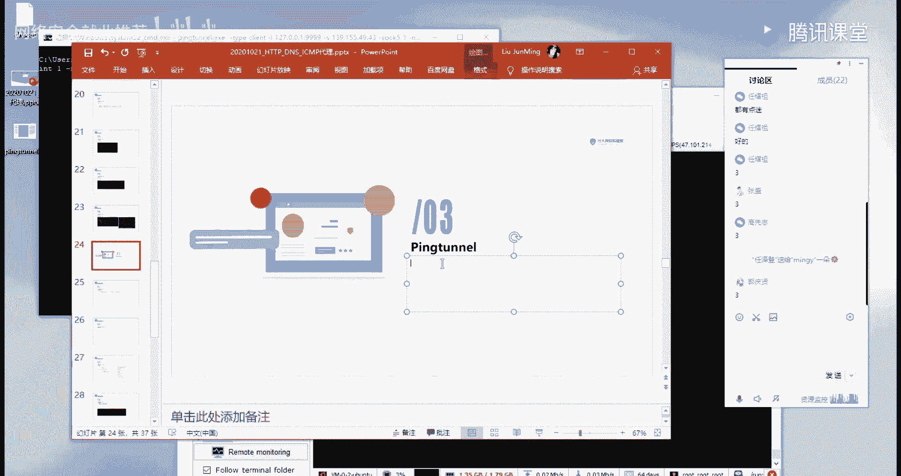

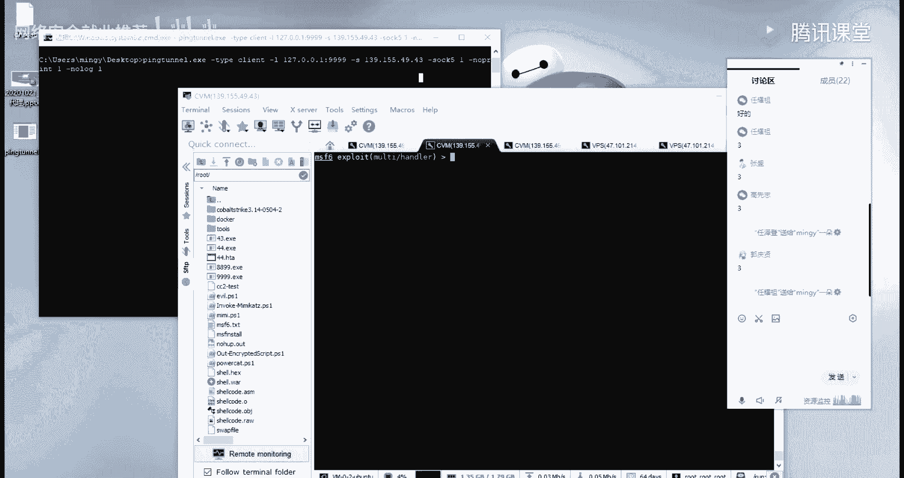