# 【B站最系统的网络安全教程】北大大佬196小时讲完的网安教程，全程干货无废话！学完即可就业，别在盲目自学了！！！ - P6：第4天：HTML前端基础 - 网络安全就业推荐 - BV1Zu411s79i

从今天开始的话，我们就正式的进入了一个漏洞篇的讲解，前期的话大家可能会学习安装环境啊等等，然后从今天开始的话，可能就会对ova ovp，top ten的一些漏洞进行一些讲解，那首先我们这节课的话。

讲的是跨站脚本攻击漏洞的前端基础篇，那为什么首先要讲一个前端基础呢，其实是因为我们这个跨站脚本攻击漏洞，它主要发生的地方就是在我们前端，然后可以给，大家画一个图，我们知道我们一次请求。

就是从我们浏览器发送到我们的服务端的话，我们平时日常去访问请求一个网址什么的，都是通过浏览器在他的那个地址栏输入一个url，然后发送请求到我们的服务服务端嘛，内在浏览器这段的话。

我们可以看到我们首先来打开一个网页看一下，比如说就打开我们的和田，这是我们的一个主页面，那我们这边右键查看源代码，就是查看这一个网页，它的一个前端的代码就是在这边，这个就是它的前端一个代码。

可以看到它最开始的这个标签是html内，在这的话它前就是我们浏览器前端这一边的话，它涉及到的语言就可能会有html，然后一些java screamed。

那这个javascript的话其实在刚才这个网页这儿也有，我们拉到最下面，在这儿他是以这个script标签然后包裹起来的，一个一段，这这两个我们今天会来介绍，那我们这个是我们前端的一些语言。

然后给我们呈现一个界面，给我们就是前端的，我们我们自己用户看得到的一个界面，内，在我们服务端的话，就可能会有其他的一些语言，进行它的一个逻辑处理，因为他要处理我们用户的请求嘛。

所以他可能就会有其他的一些语言，就比如说p h p或者是sp或者是java，还有等等一些语言，点net等等那些语言，那在这的话可能他还会数据库进行一些交互，数据存储啊，数据持久化的时候。

就是我们要把数据持久的存储在，我们这个应用中，不随它的关闭而关闭嘛，所以我们就这时候就就可能会需要用到，我们的这个数据库，那在这数据库的话，可能如果大家之前有一点基础的话，就可能会知道这个的话。

可能就有可能牵扯到我们的那个，sql注入的那个漏洞，那我们服务端就有时候，就可能会把数据存储到我们的数据库，与它进行一个交互，然后我们前浏览器发送一个请求，然后就到服务器，然后服务器响应回来。

就是这样的一个过程，那我们今天要讲的，这个的话它主要就是发生在我们这个，跨站脚本攻击漏洞，它主要就是发生在前端的一个漏洞，所以说我们一开始的这一节课的话，就需要给大家介绍一个前端的基础。

那到这的话大家能听得懂吗，听得懂的话就打一，听不懂的话就打二，行那接下来我们就进入今天的一个正片，就是讲我们的一个前端基础篇，嗯这个的话就是我们今天要讲的一个内容。

第一块大的内容的话就是html的一个概述，第二个部分的话就是javascript概述，大家刚才看我打开的我们的和田，这个这些里面不是有很多的这种这种东西嘛，大家可能暂时还看不懂。

所以说我们接下来就要去进行一个学习，那首先的话是先来看一下我们的html的一个概述，嗯可能大家会问一个问题，就是什么是html，嗯右边的话给了一个解释，这是百度百科里面的一个解释，大家可能看不懂啊。

就是html是一种超文本标记语言，英文名字是这个，然后超文本标记语言是一种规范，也是一种标准，它通过标记符号，标记符号来标记要显示的网页中的各个部分，简单来说它就是一种语言。

然后来它是通过标记符号来显示，网页中的各个部分的，大家暂时看不懂，没关系，接下来我们会具体的介绍，那html的，它的一个特点就是嗯它的文件是一个文本文件。

但是它的后缀是点html或者是点x t html，我们平常在我们的电脑中看到的后缀，就是可能是点txt等等，内在这的话我们html文件它的一个后缀名就是点，html，或者是这个后面。

它这个文本文件是可以由浏览器来直接执行的，我们接着往下走，我们具体来看一下这个html文本文件，它里面到底是什么东西，那首先来看一下它的一个基础骨架，首先在，第二行到第十行。

这就是用html以及这个反斜杠html，然后它是限定了文档的开始和结束，在最开始这一个的话它是一个文档的声明，声明，我们的web浏览器页面就是我们这一个这个文件，它是使用html的。

然后在我们接下来往下的话，就是这个html这个标签里面的话，它又分为两个部分，第一个部分就是文档的头部，他用这个head标签来括起来，第二个部分的话就是body的部分，就是文档的一个主体。

那在这的话它就在这个head里面，就是声明了本个这个网页，它的chaat就是编码编码，使用ut f杠八的一个字符编码，然后他的title是这个title，我们接下来来看一下具体的每一个部分。

第一个部分的话就是头部分，就是head的部分，我们刚才不是说html分为文档，分为两个部分嘛，一个就是头部分，一个是body的部分，我们首先来看一下这个头的一个部分，那在这的话它里面主要是有这两个标签。

一个是title，比如说我在这里的话写的是title和天网安实验室，国内大型这个在线实验室，它就会在网页的标题栏显示，可以看到就是在这个地方显示的一个内容，第二个的话就是这个标签。

这个标签是html的元信息标签，它是搜索引擎抓取网页时，可能会进行分析的一个嗯标签，可以在这的话它是有这个属性，这个content这个属性，还有这个http gun这个属性以及lamb这个属性的。

其中这个content它是定义了这两个属性的，相关的语言信息，我们可以看一下下面这些例子，比如说这个这一行的话，就是表示他会这个htp杠，这个会将我们这一个字段，附加到我们的hp头部里面。

我们h v头部的话，它就会加上这个content language，就等于z n c杠c n大家对htp头部有什么嗯，这个大家其实可以先不用看，因为这个其实不常用到这个的话，大家我们一笔带过就行。

接下来的话到我到重点介绍的地方的话，我会给大家进行一个讲解，那第二个的话，刚才这一个标签，主要其实我们经常会用来干什么的，经常用来就是在我们这个基础骨架这去设置，我们的一个字符编码，使我们的文档。

我们文档中可能会出现一些中文，这样的话我们设置ut f gf 8的话，就不会造成一个乱码，这是举的这些例子，其实不会怎么用到，我们接下来往下走吧，就是看body的部分，body的部分的话。

第一个就是一个标签，p它是一个表示一个段落的标签，中间可以加一些文本，第二个的话就是一个超链接的标签，比如说我们我们可能有一个百度1下，可能你会在一个网网页里面看到一个百度1下。

然后它下面可能会有一个下划线等等那些东西，他其实是就是在html里面就是这样写的，然后他的h r e f属性的话，就表示他要去访问的一个链接，这个target的话就是表明我在一个新的新的标签页，打开。

第三个的话就是image图片标签，大家可能会觉得这些知识点有点碎，大家就是眼熟就好，给大家过一遍，这个是一个image标签，就表示一个图片，图片的话，它的地址就是用这个src。

等于这个后面就是图片的地址，然后alt的话就是提示，如果图片加载失败的话，它就会提示这个，然后有两个布局标签，第一个的话就是div会计的标签，然后s p a n就是一个行级的标签，这些大家了解一下就好。

第五个的话就是三种列表的方式，第一种是无序，第二种是有序，第三种是自定义，首先我们看一下无序，比如说我们有一个coffee或者和一个milk，它就是在网页中显示的话就是这样子的。

它在代码中就是在我们的html代码中，body部分它就是这样写的，有序的话，这就有一个序号码一二，这个他就是用lol把这个标签包起来，自定义标签就是这个样子的dl，然后里面是dt dt，下面有一个滴滴。

我们可以看到我们每一个标签都是要有这一个，就是这个斜杠dl把它包起来，把这一整个包起来，每一个都是你看这个dt，基本上大部分的标签都是需要这种闭合，只有少部分不需要，第六个的话就给大家看一下。

就是这个表格表格的话，它在这它的一个标签就是这个table，然后里面有一行的话，tr tr标签就表示一行，然后td的话就表示有一个单元格，你可以看下面这个代码，这就是table。

然后播的话就是表示它的边框为一，所以它这就是有一个边框t r，然后就是表示一行嘛，一行里面有两个单元格，td表示两个单元，这有两个td表示有两个单元格，第一个单元格里面的内容是这样子的。

第二个单元格里面的内容是这样子的，七个的话就是form表单里面和里面的一些小部件。

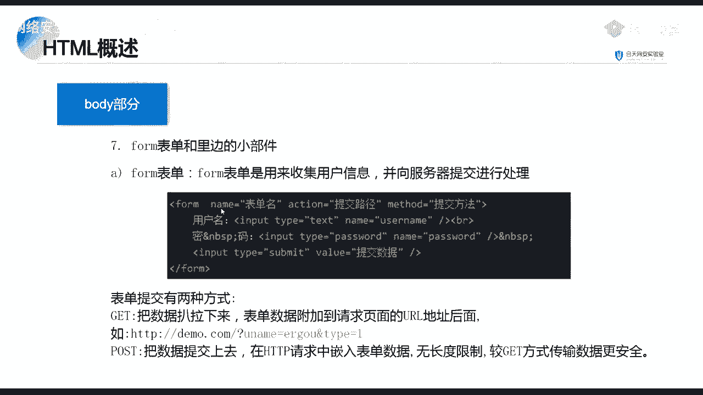

这个我来给大家写一下，就是可能我这么讲，大家也没有什么感觉，所以我们一起来写一下，我这好像已经，我们重新来写一下，嗯可以看到明明的话就是点html结尾的，然后我们来写一个。

这个title的话我们就直接一个demo，我们主要演示一下这一个标签，这个form表单。

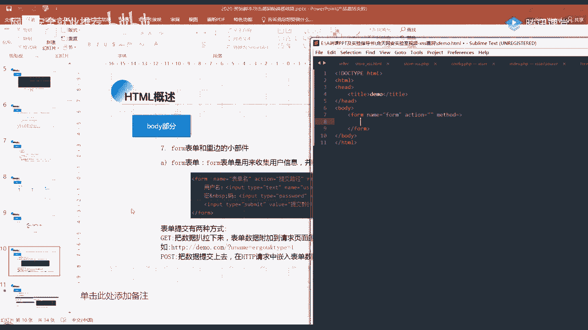

先不写吧，先还是跟大家讲一下，就是这个form表单它是用来干什么的，然后我们接着再来给大家讲，不然我一通写，可能大家并不知道我在干什么，lphone表单的话，它是用来收集用户的信息。

并向服务器提交进行处理，比如说我们我们一个经典的就是一个登录，可能就是一个form表单，那我们要我们就是有时候机器登录的时候，不是要输入我们的用户名，然后输入我们的密码吗，那它在前端的一个代码的话。

就可能是这样子写的，我下面在这儿有说表单提交有两种方式，一种是get提交的方法，就是在这个method的，这就是这儿有一个提交的方法，一种是get，一种是post。

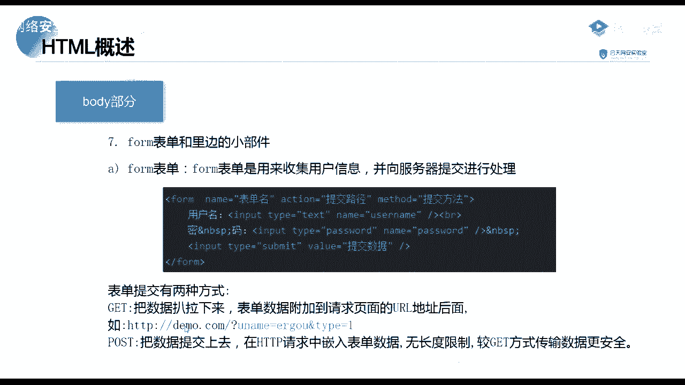

我们来看一下第一种get的话，它是把数据扒拉下来，然后表单数据会附加到请求页面的url地址后面，就比如说是这个样子的，这个前面是我们的一个请求的一个嗯网址，然后后面加上我们的一个参数。

直接把我们这个呃表单里面的，这个lab附加到这个后面，就是附加到url后面内，在poster里面的话，它是在htp请求里面去嵌入我们的表达数据的，所以我们接下来来看一下，你在这儿我们先用get。

然后这个form表单里面的话就有两行，一个是我们要提交两个信息，一个是用户名，一个是密码，嗯这些代码大家其实可以不用记啊，只要到时候看我演示就行。

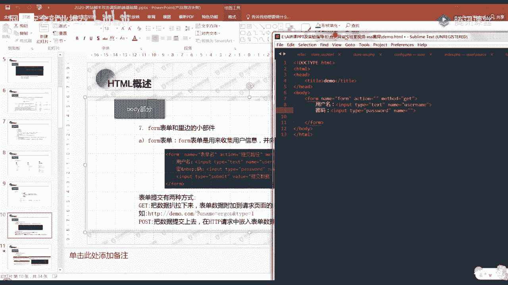

然后知道它到底是个什么东西就行。

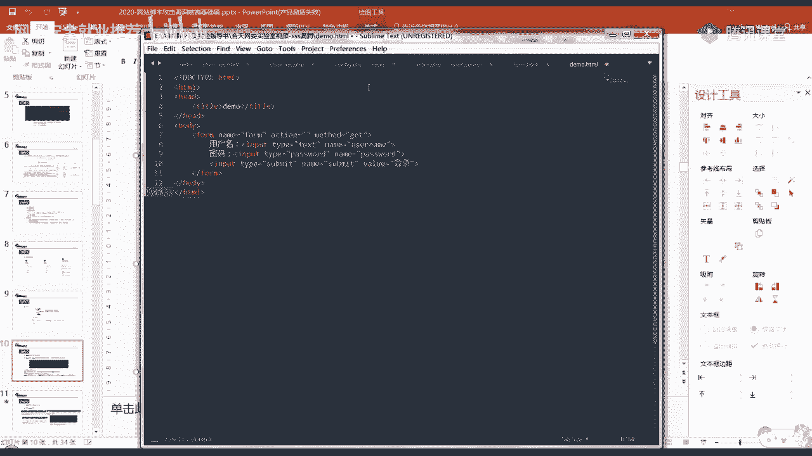

然后我们把它用浏览器进行打开，可以看到在这儿是不是就有了两个，一个就是我们的用户名，一个是密码，我们可以输入看一下，然后点登录。

可以看到我们这儿是并没有写他的这个action，这个action就是我们要进行一个怎么样的处理，就是在这边填入，填入我们要去往的那个菲律宾文件。

就是可能去往我们后台处理的一个菲律宾文件。

或者是怎么样的，因为我们这儿没有。

就是这里写的是空，所以它就没有进行一个跳转，但是我们可以看一下，他在这的话就直接将我们的这个用户名，alarm password等于123，123就附加到了我们这个uri l这里。

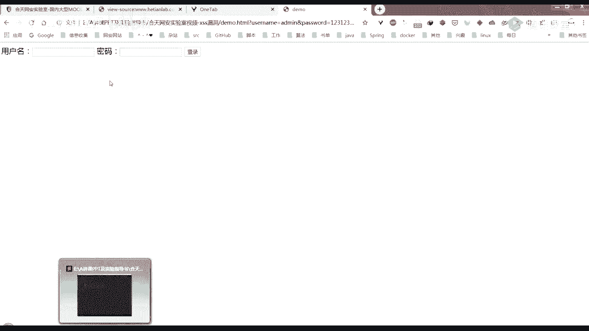

那如果这个就是一个表单，然后如果我们把它改为post。

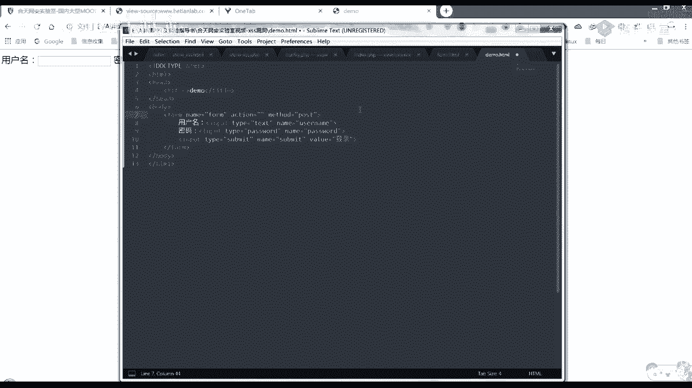

我们可以看一下它的提交方式，就是数据数据的提交方式会有什么，不一样的地方，你在这的话，我要开一个代理，哦我要放到，嗯不用开代理，直接在，我们直接用f 12看一下就行，我们n就是在浏览器里面按f 12。

然后，直接输入，登录，可以看到在他的这个黑的里面，他在这的话我们可以看到在它的url l数据，就是这个地址栏，这就没有了，而是在哪个地方呢，而是在这个form date，在这这样可能看的不。

可能看的不详细，就是看的不是那么明显，嗯这个是我之前就是自己过一遍的时候，写了一个代码，我们直接因为这个在我们的这个散打名目录下，大家之前有学菲律宾四study，然后如果我们是想要用这种网页的形式。

去去进行一个访问，就是这种嗯，能通过域名进行一个访问的话，我们就需要把它放到我们这个3w目录下嘛，进行一个ipad线等等的一些嗯处理，那我们，来看一下这个form。ht。

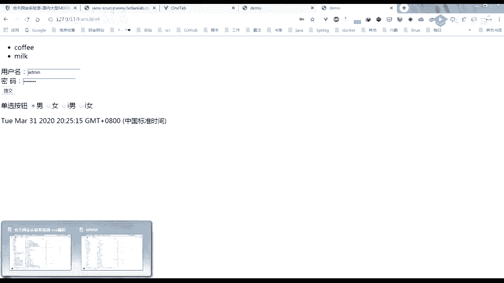

嗯我把一些不相关的东西都注释掉，嗯这个其实就是我们前面讲的那个，因为我自己在前面自己进行演示了一下，就是，先把这些东西都注释掉啊，这个就是我们的那个这种它变成灰色的话，就是注释掉了，就是不起作用了。

然后这种有颜色有高亮，就是这种有颜色的才是起作用的一些代码。

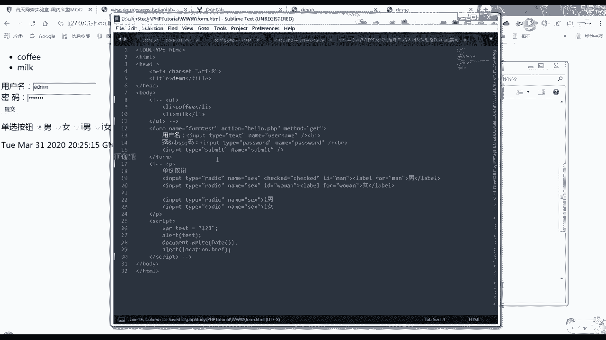

我们刷新一下，嗯可以看到这儿的话，就因为我前面输入了，所以他有这个提示给我，就是这个了对吧，然后我们在这的话拦截一个数据包，我们就是用bp bp，你们之前也学了bp，然后拦截一下这个数据包，来看一下。

嗯这边的话就拦截到了这个，我们重新刷新一下，嗯在这的话就拦截到了这个数据包对吧，它的host是192。16，8。3，1。137，这是我这台电脑的一个ip地址，然后他的嗯那个目录是这个form。html。

原先放心，其他的一些这种别的别的包我们就不拦截了，然后我在这输入。

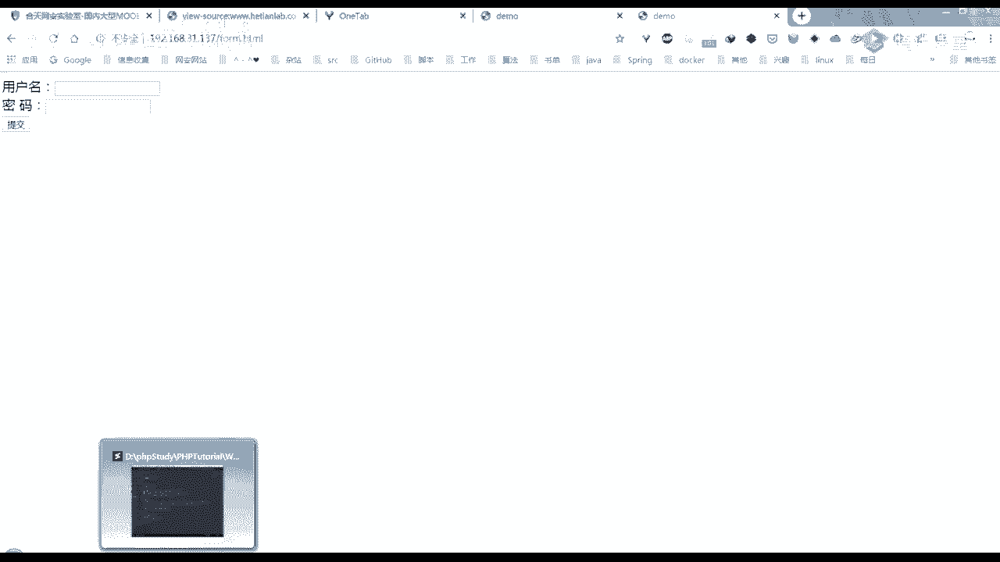

我看一下，我们先看一下，在这的话它的这个是to get，我们把它改成post。

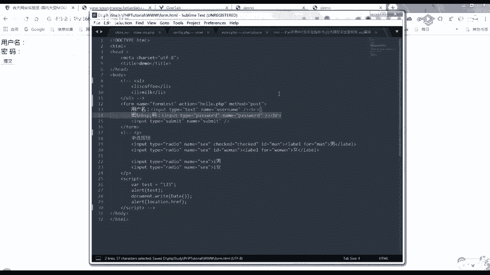

我们主要就是看一下这个post包它是怎么，嗯我现在把一些就是其他的一些包，我就不拦截了，嗯我们这儿输入一个admin，随便输，这输的密码是123123，然后点提交，在这的话他并没有完成。

这还没有这一直转吗。

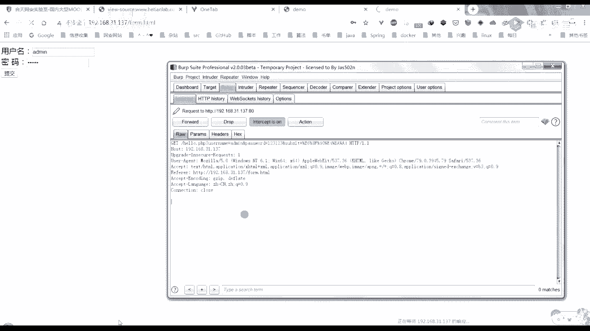

什么什么情况。

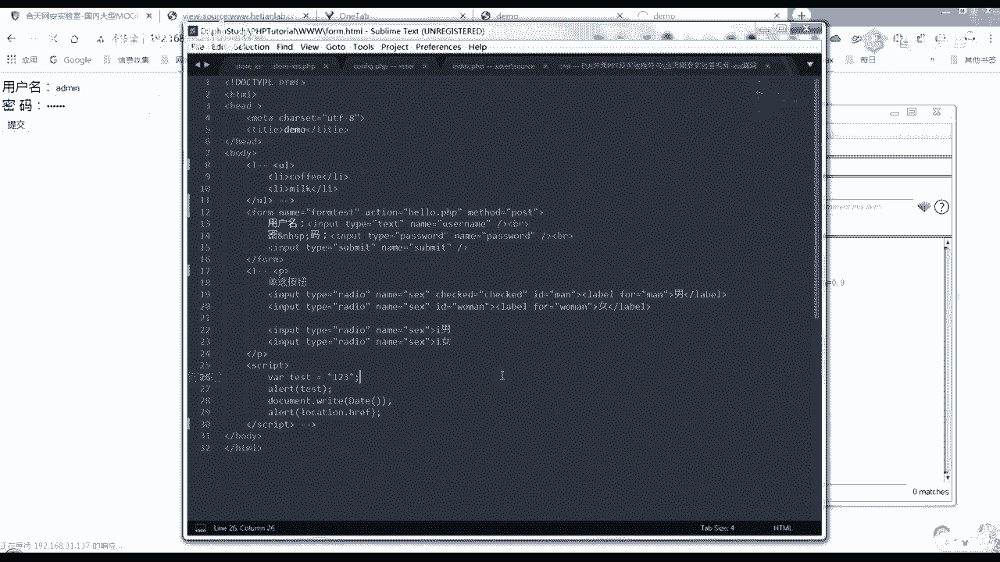

这是它出现在这个地方。

我把这个改一下，他跳转到我还写了一个hello，点p h p。

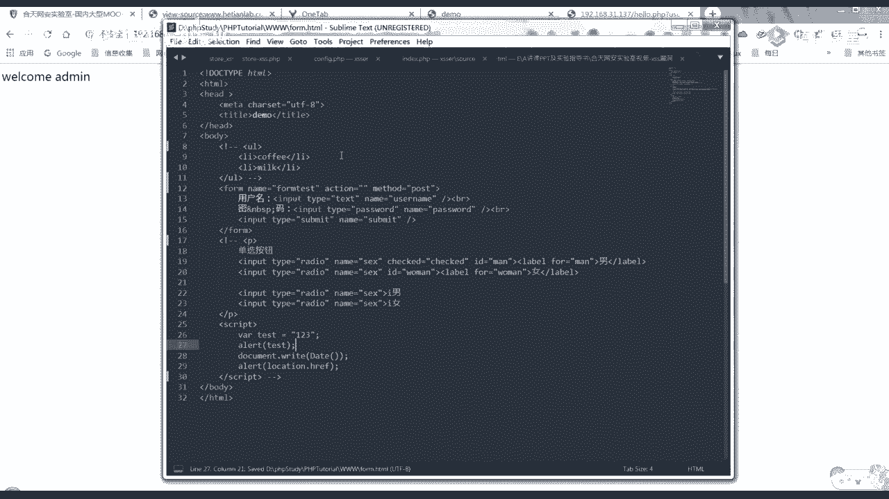

123123，然后我这儿进行一个来提交嗯，刚才可能是我没有刷新，直接回退的，就还是之前的那个get方式，可以看到这个是一个post方式，然后他的这个提交的数据，就不在我们这个这个后面了，这个form。

html后面了，就是加一个问号，uslam等于什么什么password等于什么什么，就不是这样的一种形式，而是它是放在我们的这个请求主体中，这是请求头嘛，这个是请求头，它是放在了我们这个请求主体中。

这个就是一个一个hz屏求请求的一个数据包。

到这的话大家能听得懂吗，前面的一些，一些标签大家可以自己去尝试实践一下，嗯这个form表单，这大家有听懂吗，基本上都能听懂，这这些这些标签我也可以给大家就是写一下，这样的话就是刚才那个就是无序的那种。

标签如果我们要有一个链接的话，就是一个a标签，我们回车之后，这有一个h r e f，就表示的是他的一个我们点击的话，他要去访问的一个资源是哪里，比如说我们这就直接是百度点com。

其他的一些就是image，图片的话就随便打一个一点jpg嘛，这个肯定是不存在这个路径的嗯，就是，然后不存在的话题是一个图片加载失败，我们保存之后来到这边刷新一下哦，我先把这个代理给关掉。

嗯这样的话就因为我这个一点jpg这个路径，它无法访问到这个路径嘛，就是没有根本就没有这个一点jpg，所以它就会加载失败，这个百度的话，我们点一下就可以看到，我们跳转到百度点com过来了，对吧。

其他的一些一些标签，比如说div这种p标签，大家都可以自己去实践实践一下，嗯比如说一个表格，我们刚才这个form表单，这不是很不齐吗，就是用户名，然后他的这个框框就在这儿，密码它有框框。

就在这也没有对齐，这个时候我们其实就可以在这个form表单里面，把我们的用户名和密码嵌入到我们这个table里面，大家可以去尝试一下，那样的话就可能会对齐，因为它每一个单元格的话会是就是一样的嘛。

就是一样长的嘛，嗯这个大家可以去尝试一下，那我们接着讲，刚就是在我们的form表单中，它的四种input标签，其实我刚才写的时候，不知道大家有没有注意，也有写到第一种，就是这个根据这个type来的。

就是这个text，它就是一个文本的一个文本的框，然后如果是一个密码框的话，这个tab这我们就把它设为password，你可以看到它在这里输入的话，它就变成这种点点了，就不是我是一个密码框。

把这个value的值显示出来，还有一个的话就是单选单选按钮，就是这个radio根据这个来的嗯，这里写了两个，一个是男，一个是女的，一个单选，有了单选就可能有复选。

那这个复选的话就是这个tech box这个，还可能是有一个下拉的列表，那下拉的列表的话，它就是使用这个select，然后这里面有一个option是选项，可能是广州深圳佛山，然后在这的话它默认选择。

这有一个默认的选择，这有一个selected等于selected的话，他在这个所在地站，它默认的就是这个深圳，然后下拉框里面有广州深圳佛山，接下来这个的话可能就是一个提交表单。

刚才也有就是涉及到他的这个type的话，就是submit，就是提交我们点这个提交之后，它就会根据我们那个表单里面那个action，去响应到一个具体的文件，或者是当前这个页面进行处理。

再一个的话就是一个重置按钮，它的type就是等于reset，一个重置，然后是一个texture error，它就是一个多行的一个文本框，因为我们刚才那种input或者是其他的一些，都只有一行嘛。

这个text error的话，就可能是一个比较大的一个文本文本框，这个label的话它主要就是跟input配合使用的。

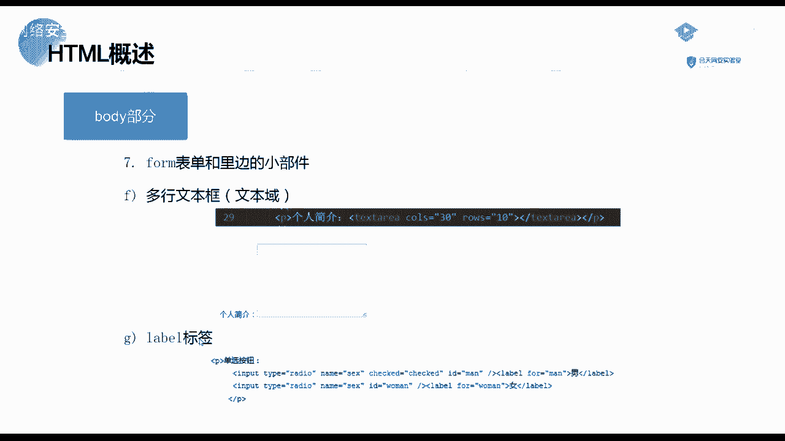

我们可以这个label可以给大家演示一下，我其实在这之前也有写，把前面这些都注释掉吧，嗯这个是我之前写了一个代码。

那我们保存一下，然后刷新来来看一下它的一个效果，这是有四个嗯单选框。

这是一个，这是第二个。

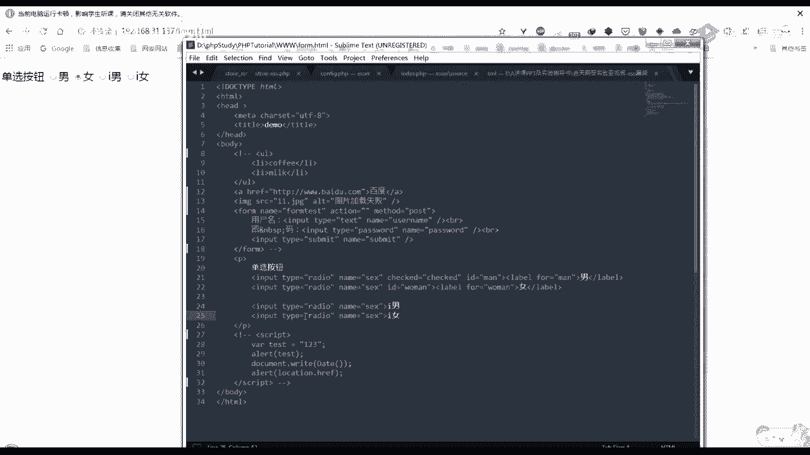

对吧。

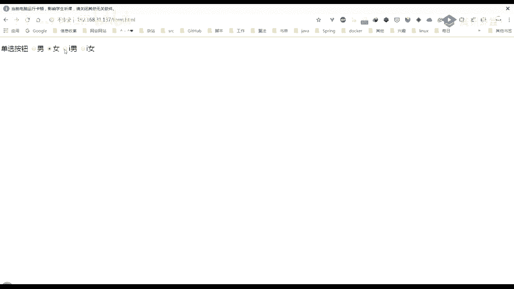

然后这个后面也是，它的代码中的话，它主要这两个主要有什么不同，这一组主要是这一组和这一组有什么不同呢，它其实就是在这个后面加了这个label。

这个是干什么用的呢，主要就是我我们可以看到，如果我点这个这个后面这个女的话，比如说我点这个后面这个i男，这他是不能进行一个选择的，但是如果我在这点这个女的话。

他就会把这个单选框给选中，所以他其实就是为了和前面的这个绑定在一起。

它出现是就是有一种用户友好吧，比如说我要选男，我不一定要点到这个格子里面，就是这个单选框框里面，我直接点蓝典女，他就可以选，但是你看这个他就不可以选，他只能点这个才能进行一个选择嗯。

嗯接下来的话我们会介绍一个html的一个特殊符，号，内在html中有些字符它是有特殊含义的，不能在浏览器中直接显示出来，比如说这一个p标签就是一个文本标签吗，我是h一标签o我们可以来看一下。

我们其实主要是显示这一行嘛，这一串文本嘛对吧，我们可以来，把这些都注释掉，然后我是，h一标签哦。

然后保存一下，我们想要它显示出来嗯，他怎么成这个样子了，我们查看一下他的，源代码，嗯这个注释也在这的话，它其实又是这样的呀，h1 ，而且这个标签哦比这个卧室要大了好几号。

对不对。

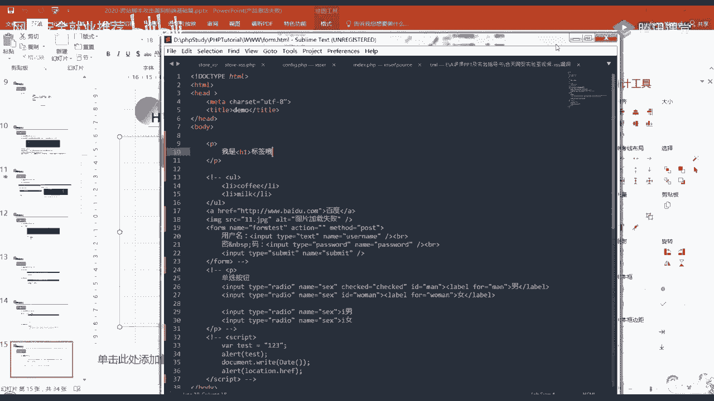

那在这的话，其实是因为他把这个左右尖括号h一解析，为了我们html中的一个标签，一个这个是一个，就是它是一级标题的一种标签，还有h2 h3 等等，它的字体就会变粗变大，就是一级标题，二级标题，三级标题。

所以它就会解析为了这个h一这个标签，它就不能进行一个正常的显示，那如果说我们现在就是要把这个左右尖括号，h一这个东西显示出来，应该怎么办呢，其实就会用到我们这个实体字符，这这个地方。

其实就跟我们后面这个xss防御的时候，就会有一点关系，xs s防御的时候，我们就是把我们用户插入的这种标签，他的这种特殊符号就是这种，比如说左右尖括号，把它编码为我们的实体字符，我们来试一下。

它还会不会就是使这个标签o这个字字体变大，它主要是使用这个实体字符，那左肩括号它的实体字符就是连接符号lt，加上一个分号，然后又减括号，它的实体字符是连接符号，然后保存。

可以看到这样的话它就进行一个正常的显示了，源代码里面它也是这个样子的，这样的话就可以跟这个就可以安全地显示，我们这个文本，而不是让我们的浏览器把它解析为一个html标签，我这么说，大家能听懂吗。

其实我们现在已经8。44了，但是我还没有讲完一半，嗯行，那关于这个实体字符的话，它的表示方式就有两种，第一种的话就是这种符符号，连接符号加上这一串封号，还有一种是这种加我们的数字，前面还加了一个井号嗯。

具体的一个特殊符号，它的实体表这列举出了一些比较常用的，比如说我们刚才的左尖括号，右尖括号它对应的实体名称就是这个样子的，那我们其实也可以用实体编号来进行一个代替，就是把我们刚才的那个连接符号lt封号。

改为这两个其实也是可以的，然后还有其他的一些就是在这儿给大家展示，那其他的一些大家可以去这个网址上去看一下，我们接下来往下，往下走的话就终于来到了我们的这个javascript概述。

它是一种可以在浏览器中运行的脚本语言，它主要用来实现在浏览器端的动作，比如说和我们的用户进行一个交互，之前我们的那个html文档的话，他他只只是我们写什么写一个标签进去，他就写回写给我们什么对吧。

就是比如说我们写一个文本框，写一个表单，它就回想一个就是在页面里面显示一个文本框，显示一个表单给我们，但如果需要进行一个用户交互，或者是数据处理的话，应该怎么办呢。

这个时候就可能会需要用到我们的这个javascript，这个这个文本语言，脚本语言，那他也叫javascript和java有什么关系吗，其实并没有什么关系，那这简单提一下，就是java它需要编译它。

而且它运行是在我们的java虚拟机中，进行一个运行的，那我们javascript的话，它是一种解释解释型的语言，源代码就在html中，而且它就是可以在浏览器中进行一个运行的，脚本语言。

我们接下来来具体的看一下在html中，javascript的存在有几种方式，第一种就是在我们的ascript标签里面，我们最开始给大家看那个和天，打开右键查看它的源代码的时候。

最底部是不是也是通过swim标签，插入了一个js代码，就是只不过他这，嗯不知道就是这个在最底下的时候，他是不是对吧，只不过他是使用了一个s r c，就表示他是引用的一个外部的一个js代码。

它就没有写在这个cript标签里面，这个中间它是引用了外部的一个js代码，那我们接下来还能再看一下，第一种的话就是直接在我们的html文档中，加入squam标签。

在ascript的标签里面写上我们的javascript代码，比如说在这我们也来实践一下，我这个好像，还是不如18就直接，写在这里面吧，这个tap也是可以不要用的，这个tap你可写可不写。

vr第一个变量，这个变量名是test，然后它的值是1234，然后alert alert，这是一个函数，把我们的test传入进去，可以看到它会有一个怎样的一个效果呢，你们刷新一下。

可以看到在这的话我们之前并没有这种弹框嘛，他在这里的话，就弹出了一个1234的一个警告框，对吧，这个alert就是英文，如果大家好一点的话，可能就会知道他就是弹出一个警告框，警告的意思吗。

然后把我们的这个test传入进来，所以它在我们打开这个网址的话，它就有一个就是警告框弹出给我们，就是alert警告嗯。

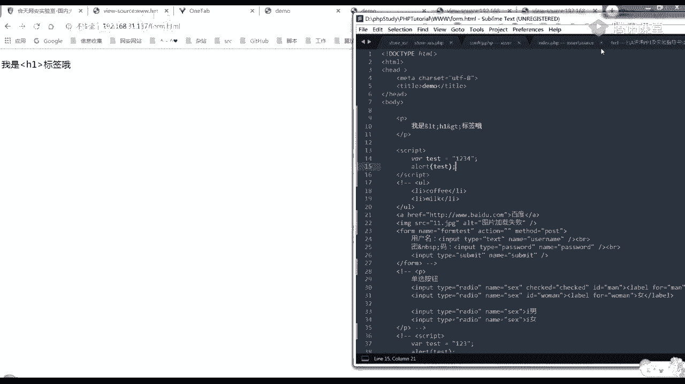

1234它的内容就是1234，因为我们这儿输入的是1234嘛，我们接下来往下，这是第一种方式，就是直接写，把我们的javascript代码写在ascript标签里面。

第二种方式的话就是我们刚才的那个和田底部，那个他就是写在我们的这个s r c里面，src属性，然后指定的一个外部文件，这个是他的这个js代码，它是一个jascript代码的话。

它后缀就是点js写入到这个，是他的那个js代码的一个地址，可以看到在右边的话，这有一个test。js，这里面写的就是我们刚才写的那个代码，然后我们去进行一个加载的话，它也是由一个警告框弹出给我们。

只要你拽的路径是对的，就是它能够访问到这个test djs就行，第三种方式就是在html的树事件处理器中，比如说unclick almost over，那在这的话这有一个input标签。

然后它的呃它不是一个button，就是一个按钮，它的value就是这个按按钮上显示的内容，就是点击弹出对话框，这个on click on click click就是点击吗，on most over。

most over，就是你鼠标放上去，它就会触发一个什么视线呢，这样的话也是就是弹出一个，这不应该是test，这应该是a啊，a la吗，它不能是test吗，对吧，这应该写错了，就我们点击这个按钮的话。

它就会弹出一个嗯，如果这填的是a的话，就有一个test的警告框弹出给我们，这个是第三种，就是添加到我们的事件处理器中，你一旦这个事件被触发，那在这的话，这里就是一个点击事件吗，如果我点击了它。

就会触发这一段almost over，这个的话打个比方，就是把我的鼠标移到上面去，它就会触发这个almost over里面，定义的这个js代码，我们接下来来看，因为之前我们说它是可以和嗯用户进行交互。

而且他是直接可以在我们浏览器中运行，直接嵌入到我们的html代码中，那我们如何通过javascript去操作我们的html标签，这个时候我们就可以通过这个doom doom，它是一个文档对象模型。

它是访问和操作tm文档的标准方法，我们可以通过利用javascript来访问操作html，这个是一个动数，那在这的话其实就是有一个嗯根元素，根元素，就是刚才我们写的那个最开始的那个html吗。

然后里面有head的元素，然后有一个body，然后head里面它又有一个title title，它的文本就是文档标题，然后在这边这个保底的话，它里面有两个元素，第一个的话就是这个a标签，就是这个链接嘛。

我它的文本就是我的链接，然后有一个属性就是我要啊，点击我的链接跳转到哪一个网页上面去，然后还有一个h一这个元素，这个这个就是一个简单的一个动数，我们可以通过这个动数来访问。

比如说我们要获取到这个title的话，我们就可以通过这个度数来进行一个获取，具体是怎么来进行一个获取的呢，就是我们javascript如何去操作呢，这样的话，首先第一步我们有一个问题。

就是我们如何获取到它的一个html元素的内容，比如说我们要在这边的话，有一个有一个html代码，在html代码里面有一个body里面有一个，有一个squint标签，然后它的就是使用一个document。

document，就是表示的那个整个文档，刚才我们那个动数，他最开始的根不就是这个文档吗，然后再是根元素对吧，所以在这的话我们去访问的时候，就是x等于document。

点通过get element by id，就是通过获取元素的id，这个id值到底是多少呢，就要看你，比如说我这要获取这个p标签这个元素，然后它的id等于lab。

我们就可以通过get element by id，然后传入他的id这个这个值，这个p标签对应的id值，然后传入进来，这个x的话就会获取到这个p标签，这样的话就能获取一个标签。

但如果我们想获取这个标签的一个内容的话，是不是这样还不够，因为这样的话，我们只是还只是暂时获取到了这个p标签，那接下来我们获取到它的内容应该怎么做呢，就可以通过一个inner html。

来获取到最新的一个内容，这样的话我直接弹出了一个警告框，id为lamb的内容，是加上这个加就是字符串拼接x。inner html，这个x已经是这个p标签了吗，然后点inner html。

就是获取到这个标签里面对应的一个内容，然后我们去运行的话，就会有这样的一个弹窗显示给我们，就是id为lab的内容是javascript基础，这个是一个第一个简单的一个通过javascript来操作。

我们嗯dom树操，操作我们html标签里面的标签的一个简单的例子，我们接下来看第二个，比如说假如我们想要修改我们的html元素的内容，应该怎么做呢，首先是不是也要先获取到这个标签，也要获取到那个标。

我需要修改的那个标签先对吧，那第一步同样也是document，点get element by id，第二步的话，他同他同样是使用这个inner html直接赋值javascript的，真好玩。

就会你就会有一个，加载之后我们页面加载之后，你就不会有这个javascript的基础了，等到这个脚本执行的时候，他就把它的内容变成了javascript，真好玩。

我们最开始是一个java scream的基础嘛。

这个大家需要演示一下吗，嗯我给大家演示一下吧，这个p标签这儿的话我们就要设一个id了，因为我们需要通过这个id来获取到这个元素，这个是p我们就直接写pad吧。

然后在这的话我们在这个squatter里面写，写上我们那个操作的一个代码，那我们是不是首先是通过document。get element，by d，然后写入这个，如果我们要获取这个p标签的话。

我们就填入一个，pad，然后把这一个标签赋值给我们的x，这时候这个x就获取到这个p标签了，那接下来我们让p。inner，直接把它修改为我们刚才这个样子的话，直接用这样是不是获取到它的值。

我们先这样来试一下。

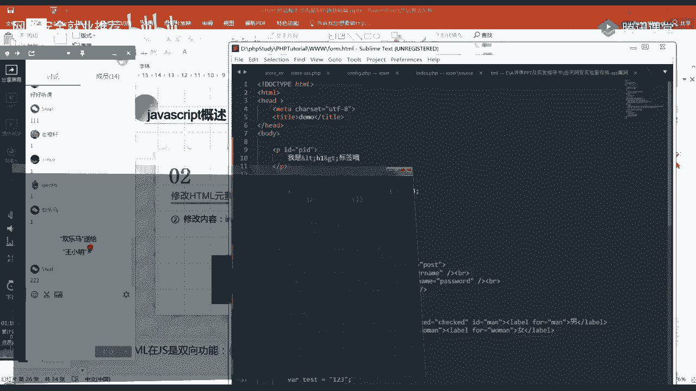

这是我们的h h一标签。

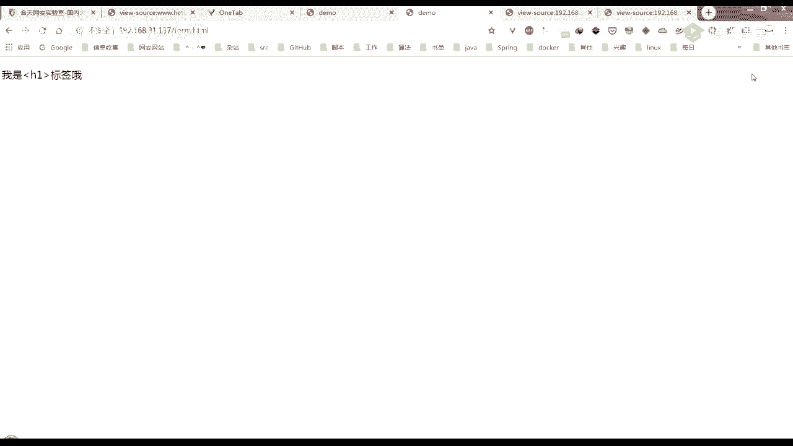

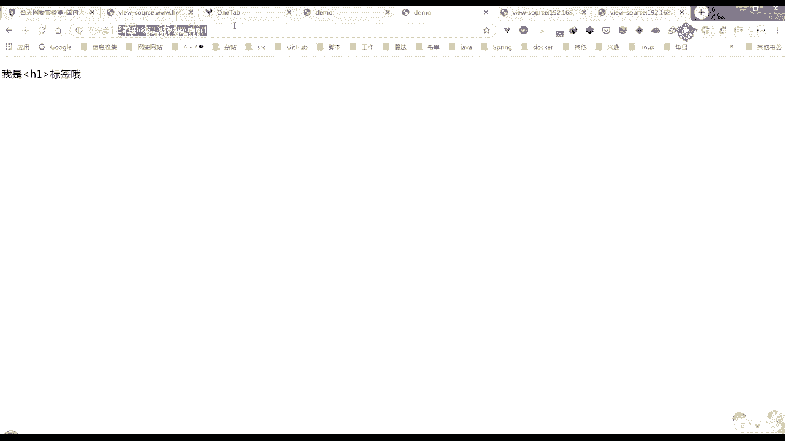

我看的是，我看一下，他这不用。

他这不用加这个括号，直接是这样，好吧，嗯还是没有，没毛病啊，好，哦哦我这写错了，我写成p了，这是x，嗯这样就有一个就是它的内容显示给我们，嗯不好意思，刚才写写错了，这写成了p。

这是x我们会学到的是这个x吗，对对对，不好意思不好意思，嗯接接下来如果要把它的值修改的话，我们直接使用这个x。in the html，然后这儿的话我直接写写一个这个吧，这样的话我们再去进行一个刷新的话。

它就会在这边更改为javascript对吧，这样就是两个例子，就是通过javascript来操作我们的doom文档，来改变我们的网页内容，接下来还有一个就是创建一个动态的效，果。

是通过我们的document。right，写入到我们这个html页面中，在这的话我是写入了一个date对象，可以看到就是这个控制台，这直接有一个document。right，就是写入写入的东西是什么呢。

这就是一个date对象，就是写入的是当前时间，第二个的话我就写入了一个iframe，就是一个，嗯iframe框架它的sirc，它里面的一个内容就是我们和田lab的一个内容，我们也可以进行一个。

操作看一下，这个就先注释掉吧，嗯直接使用document点，嗯回去看一下啊，在这个后面的话，就会显示我们的一个当前的时间，下面这个也是一样的，大家自己去尝试，第四个的话是添加一个页面的交互效果。

利用事件的属性，比如说on click，我们可以看先看到右边这个代码，那在这的话有一个click here的一个hr标签，然后如果我们点击这个，就会触发这个onclick事件嘛，他就会去调用。

这个change text这个函数，那这个函数在哪定义呢，啊在我们的这个script标签里面，定义了这儿有个函数，函数名称是这个change text，然后传入的是这个this，就是当前这个对象。

那在这的话传入的就是这个hr，然后这就是将我们传入这个值，就赋值为这个id，然后将我们id点的它的文本就变为了，欢迎参加web安全工程师的学习，在这边这是它的一个效果，就是我们点击这个之后。

他就会把这一这个hr标签里面的内容改为，欢迎参加web安全工程师的学习，这个大家需要演示吗，嗯需要的话就打一，不需要的话就打二，没人没人听讲吗，哦哦二行，这是一个常用事件的列表。

就不只是on click嗯，most over呀，还有其他一些，比如说on focus啊，unbelieve on change，on key down，on kraise。

on key up unload等等这一些事件，这个是右边是这个事件，就是他是什么时候被触发，它是比如说这个on focus的话，就是元素汇聚到焦点的时候，他就会触发。

然后on below的话就是元素失去焦点，元素这元素的话就是标签那个标签会取到焦点，标签会取到失去焦点等等，它的内容被改变的时候，它就会触发这个on change。

这些事件大家也可以去就是自己写一个html文档，然后进行就是用那些事件来写一个javascript代码，来进行实操一下，那第二个的话就上上面讲的是一个doom嘛，下面这个话是一个boom。

boom的话它是一个浏览器对象模型，它是使javascript有能力与浏览器进行对话，一是让浏览器弹出警告，那在这的话可能有我们前面已经用到了，这个警告的一个弹框，就是这个l这边就是它的一个我在底底部。

这个console就是这个控制台，这写了一个alert 1，这就弹出了一个一的一个警告，然后是一个confirm confirm的话就是一个确认的弹簧，这个confirm confirm里面的一个内容。

就会显示到一个这个里面，这有一个确认和取消，我们前面这个这就没有一个什么，就只有一个确认嘛，就是嗯我警告你什么什么，你点一下去嗯，第二个是一个conform，第三个的话就是prompton。

就是一个提示嗯，这三种的话都是可以来进行，使我们的浏览器弹出一个对话框，这种的话通常是用来证明我们xss漏洞的存在，因为你可以弹出一个警告框的话，我就可以做别的一些事情了对吧。

因为我们这个olent confir prompt，都是属于我们这个javascript的代码，而不是属于html里面的代码，不是属于你原本那个网页里面的一个代码。

所以说如果我能让这个网页弹出一个警告框，或者是一个其他的一个弹窗的话，说明我能在你这个网页里面执行，我自己的一个js代码，这样的话就可能用来证明这个漏洞的一个存在，第二个的话获取一个cookie信息。

我们可以使用document。cookie，就可以获取到我们的这个cookie值，可以看到在这个下面就是document。cookie，他们回信给我们，这个就是当前页面的一个cookie值。

然后alert document在点cookie的话，它就会显示一个警告框，把我们这个当前页面的一个cookie值弹出来，就是显示给我们这个cookie信息，之前老师有给大家说过吗，如果说过的话。

大家打个一，如果没有说过的话，打个二，嗯说过的话那就不讲了，cookie，qq信息的话就是它保存在我们的浏览器里面嘛，如果我们下一次登录有这个cookie的话，我们就不需要去输入它的用户名啊。

密码等等这些，带上我们的这个cookie，就可以进行一个无密码登录对吧，嗯第三个的话是获取一个浏览器的信息，比如说获取到它的一个屏幕信息，就是这个squam这个前面这个windows点。

这个是可加可不加的，它就是会获取到我们的这个屏幕的一些信息，然后获取到我们控制页面的一个信息，比如说获取的location的话，就是获取我们当前页面，它的一个这个h r e f啊。

然后其他的一些orange啊，然后他的pro protol协议啊，然后他的host这个hr ef的话，就是我们那个地址栏的一个内容吧，url嘛对吧，就是可以通过这些来获取到我们嗯。

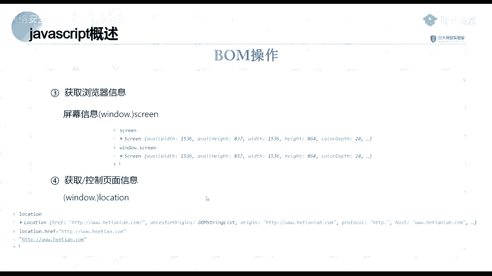

浏览器或者是页面的一些信息。

那我们这个boom的话，它就有两，总结起来就是获取和操作浏览器的一个行为，第二个的话，它其实是浏览器和编程语言之间的接口，就可以通过alert prompt等等这些来进行交互。

嗯今天这节课的话就嗯大概讲到这儿，感谢大家今天晚上的聆听，大家有什么问题吗，我这节课是不是讲讲课速度快了或者慢了，如果你们觉得我慢了的话，打个一，如果觉得不慢的话，打个二，打个20不慢还是慢来着。

二二是不慢是吗，还是慢，我之前不慢是吧，这种这种速度你们能接受，行，那今天有大家有没有听懂的地方吗，有什么问题吗，嗯我们到20就是9。20的时候结束，在这个四分钟里面，大家可以嗯给我提一些问题。

或者是有什么想问的，或者是给我提意见也可以，最后那个可以演示一下吗，可以啊，比如说我在这儿，你看我这输入这个s的话，他这里就有一个显示给我们squam，然后这个的话就是它的一个。

一个屏幕信息除了这个的话，还有其他的一些，它默认是，它默认是属于这个windows对象下面的，但是所有东西都是，都是windows下面的，所以你这个windows点可加可不加。

然后这个location的话可以看到，当前的话就是我们这个和田live，嗯它里面的一些信息就是这样子的，holipa passlam search hush，因为我们这search也没有。

然后passlam默认这个后面就会加一个斜杠嘛对吧，然后表示根目录，然后pd的话也是默认的，host lab的话就是我们和天lab。com poster也是这个，然后嗯他的协议就是hdp协议嗯。

而且你这个也可以和刚才的那个结合起来，一起使用，location，点h r e f对吧，这就有一个提示框给我们，嗯大家还有什么问题吗，今天讲的这些内容可能会有点碎。

就是刚开始讲那个html讲了比较多的标签什么的，大家可能就是听着也无聊，然后其实就可以去实践一下吧，自己去写一个体验一下，你自己写一个里面啥都有嗯的一个html文档，然后看怎么去修改它的内容啊。

怎么增加一个用户交互啊等等，自己去就是去熟悉一下它里面的一些标签，我这没有写全，也没有写全嗯，获取id元素那里是因为参数是id，如果是其他参数更改，就一样可以设吗，参数是什么参数，获取。

你这获取元素其实也不一定要通过by id啊，你还可以通过，你可以我可以看一下，就是document。get，element，你看到没有，其实我们可以通过by id by class lab。

by lamb，by tag lab等等这些来，进行一个获取，但是我们可能最常用的话就是这个by id，通过他的这个id值，在这里的话这个p标签它的id是lab，所以我在这通过这个lab。

因为id是唯一的，所以我可以通过这个la来进行一个获取，就是会就是我们会去查找整个文档里面，id为lam的一个标签是什么，然后传给我们的x，在这的话就是将我们的这个p标签，传给我们的x，获取html。

我内容那里，对就是就是这里嘛对吧，你这如果写id写成别的，你在这的话也要把这个把id里面的参数给改了，因为它是通过你你这设的这个id值，去页面里面找的吗，去找哪一个标签是这个id值的嗯。

大家还有什么还有什么问题吗，如果大家对我有什么意见或者是建议，可以去和班主任进行交流，然后班主任的话会反馈给我，嗯现在22了，还给大家三分钟吧，就到25的时候，我们就下播。

今天讲的基本上都是前端的一个基础，和xss的话可能就暂时还没有什么关系，但是有关系的话，就是在这个地方这个实体字符，这跟我们xss防御的时候有点关系，当然这些都是基础，你学了这些的话。

可能对后期嗯写就是更好进行的掌握，对这个漏洞更好的掌握，大家还有什么问题吗，没有，也有蛮多人在听，那没有的话，那今天这节课就到这里吗，就下课好吧，大家明天见，大家可以去预习一下，哦对了那个。

到时候给大家发一个网址，然后大家可以去进到那里面写，写一下那个嗯xss的一个内容，然后如果写不出来也没关系，就是进行大家可以去预习一下xss吧，那今天的课就到这嗯，感谢大家，大家再见。

