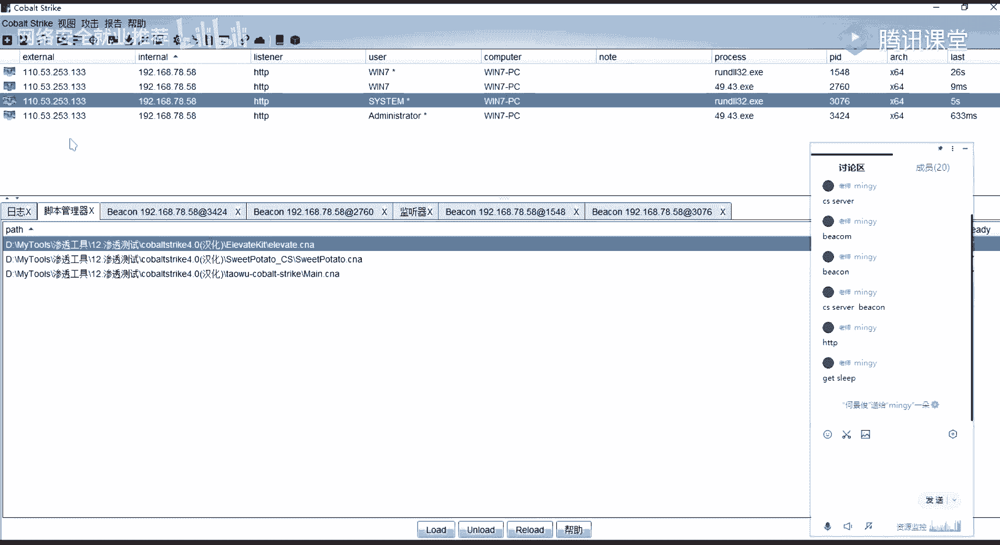
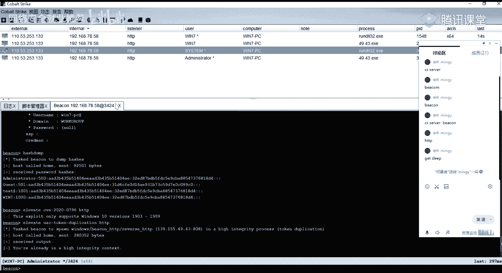

# 【B站最系统的网络安全教程】北大大佬196小时讲完的网安教程，全程干货无废话！学完即可就业，别在盲目自学了！！！ - P71：第40天：权限提升-CobaltStrike提权模块 - 网络安全就业推荐 - BV1Zu411s79i

然后在这边的话我们可以看到，如果说他是没有这样子的一个引号包裹的话，那么他再去处理这样子的一个，就说他在启动服务的时候，我们上节课的话有讲究吧，启动服务的时候，他们去检索这样子的一个啊服务所对应的。

这样子的一个been in pass是吧，就是你的这样子的一个可执行程序的一个路径，然后他对这种，他对这个可执行程序路径当中的一个空格，前面的这样子的一个字符串所对应的一个呃，可执行程序。

它会去进行一个加载对吧，然后的话他会一个一个的去查找，一一层一层目录的去查找，直到找到最终的这样子的一个service，然后在这边的话，那么我们可以去进行对他的这样子的一个啊。

漏洞取景一个neo neo的一个方法的话，就是我们去查找到这一个路径当中的，某一个目录，然后这个目录的话，我们需要有对它的一个写的一个权限，如果有一个写的可以权限的话，那么我们就可以去尝试对吧。

在这边attempting尝试去写入一个这样子啊，15872的字节的这样子的一个程序，然后把它写入到了这边的一个windows product这个目录下，面对吧，然后生成了这个程序名的话。

就是一个common的ax一样，就是这个，好生成的这个common。1x一的话，它会放到这个目录下面对吧，然后放到这个目录下面之后的话，在这边的话有这样子的一个就是错误，这个不错误的话。

其实就是我们前上节课有讲的，就是我们再去进行一个啊，启动它的这个服务的时候对吧，因为它的这个漏洞话，要等他的服务重新启动的时候，他再去加载这个可执行程序路径的时候，他才会去啊进行一个查找。

到我们这边所写悟到的这样子的，一个木马的一个程序对吧，然后的话加载它还访谈一个笑，那么在这边的话我们是一个普通用户，所以的话我们没有权限去启动它的，这样一个服务，所以在这边的话。

我们需要去等待它的一个服务区进行一个启动，所以的话在这边的话，它会是处于一个等待的一个状态，但是他这边的话没有筛选，然后呃其实我们可以通过，就是说大家自己演示的话。

就呃就模拟它的这样的一个服务的一个启动，就是你去启动它那个服务的话，那么他在这边的话是能够去得到一个筛选的，好呃，这边的话啊，因为黄键黄键的一个问题就是我，就我另外一个机器上面的话有环境。

但是现在的话就是重新搞的话来不及了，然后呃在这边的话我就不不不演示了，如果呃如果大家有有需求，有要就要求要看这个演示的话，我后面就是我用我另外的那个环境，我啊可以录个屏，就录个视频。

就是具体的一个步骤以及实际的一个效果，给大家好吧，然后这边的话我就不演示了，呃大概的看一下这边。

我们在这话同样都是筛选，是这个筛选20，你说的话会失败的，他会去查找这样子的一个可利用的一个服务，然后利用我们上节课所讲到这样的一个logo，你看到这句话，他没有找到对应的这样子的一个。

然而还有的话就在这边要注意的一个点，就是呃，我们这边的话再去设置这样子的一个，handle的时候，我们去设置这样子的一个，就是说auto run script的这样子的一个脚本。

就我们在这边。

其实我们在这里，我们在这里我们执行对吧，我们利用成功之后的话，他这边是没有得到这样的一个session对吧，然后因为因为在这边的话。

我们要等待下一个服务的一个启动对吧，但是在这边的话，你exploit之后的话，in sport之后的话，他没有执行成功的话，那么我这边的话他是无法去直。

无法就直接得到一个筛选分化，所以的话我们需要等待它的一个服务启动，等待服务启动的话，那我们就需要去用去创建一个监听器是吧，我们可以去创建一个监听器，把它挂载到，就是放到后台作为一个jobs，然后我们。

在这边的话我们设置这样的一个kload，跟前面对应的对应的一个kload是吧，然后的话我们想要的去就是。

啊这边在这边要注意的，就是说我们上节课其实有讲呃，我们在这边的话，我们得到我们生成了这样子的一个common 0 x啊，这个的话它不是一个服务的这样子的一个，可执行程序的。

那么他去执行它执行加载之后的话，它会以一个session的一个权限，去加载这样子的一个程序，然后把它作为一个服务，那么它不是一个服务的一个可执行程序的话，它会与那个服务的一个控制器去做一个通。

信的话是无法去通信的，所以的话他会把那个控制器，它会把这个进程终止掉，那么我们在这边去加载，对吧，加载呃正确的服务之前的话，他会去加载这一个com的x1 ，那么它加载之后的话。

我们在这边就能够去得到这样的一个筛选，然后得到这个筛选的话，它会过一会它就会断掉，那么我们在得到这个筛选之后的话，立马去执行一个这样子的一个migrate，mirt的话，这个话就是一个进程迁移啊。

就是把我当前得到这个筛选的，一个绘画的一个进程，把它迁移到另外的一个进程，就说我当前得到这个筛选号的一个进程，它是基于我基于我这边的这个common d ex一的这个，可执行程序的对吧。

那么我这边的一个程序断掉了，那么我这个进程也就断掉了是吧，那么当时的话我们可以通过，就是说我当前这边的话，已经得到了这样子的一个它的一个权限对吧，那么我得到这个权限之后的话，我在他还没终止我之前的话。

我做一个进程的一个迁移，把它迁移到我的一个，就是说其他的这样子的一个进程，然后只要那一个进程，就是说系统的一个正常的一个进程，它不断掉的话，那么我的我这边的一个绘画的话，它就不会断掉是吧。

就是这一个我们可以在这边啊。

通过直接输入a d v，然后table就aviation，也就是高级的一个配置，在这边的话有这样子的一些选项，然后呃上节课的话有讲这一个一个exist on session，on session对吧。

这个的话就是呃就是把它设置为false，设置为默认的话，它是去就是去的一个项目的话，就是我这边的执行exploit之后对吧，excel执行之后它会有一个jobs，然后这个旧版的话它会在后台。

然后的话我我的一个payload，我的一个payload来回你我这边的这个监听器之后，他得到得到一个session对吧，得到一个筛选之后的话，他这边的一个job它就会exist。

就是从字面意思我们也知道，就是它可以退出，也就是就exist on session，就是在尽力筛选绘画之后的话，我的那个今天的一个job它就会exist掉。

就所以的话就呃就是通常的话我们把它设为force，也就是只要那个分话，他只要执行执行的话，他就建立一个筛选对吧，然后我的那个job，让他一直处于一个今天的一个状态，他只要执行了我的那个pyload。

我就能够去得到一个筛选，然后还有就是这个auto run script，auto run script的话，这个就是呃设置一个就是自动啊，就是在我们得到绘画之后，等到绘画之后的话。

他立马会去执行这样子的一个脚本，然后这边的一个脚本的话，它会自动的去执行，这边我所设置的一个命令，就是这个migrate gf，就是啊自动的去迁移我的一个进程到呃，其他的一个进程当中。

呃呃第三个就是这个server commissions模块，这个模块的话跟前面对应的，就就是那个就是不安全的服务的。

呃那个什么来着。

而刚刚的话就是刚刚这个话，其实就是那个可信的服务键，就是它是利用他的这个缺陷啊，呃第二个的话就是这个不安全的一个服务权限，就是利用它的一个服务权限的一个呃就是漏洞，好在这边的话我们可以直接通过msf。

它的这样子的一个模块去进行一个利用，就九点钟啊，我这边的话下一下，呃我这边的话忘记了，忘记中间下课了，就是没没给大家休息的一个时间了，下次的话呃大家提醒我提醒我一下好吧，就是到那个到九点就是8。50嘛。

8。50的时候就是呃中间休息五分钟吧好吧，因为我这边的话我讲的话我不会去看实讲，我讲着讲着我就就就没有注意时间的话就忘了，好吧就是啊，大家有注意的话，在讨论区这边就是提醒我一下吧，然而这边的话是第三个。

这个的话呃，其实就是这个模块的一个使用，这边的话就不演示了，啊呃效果的话就像这样子好，其实在这边的话我们看他的个截图啊，就其实呃大家再去用这个模块的时候啊，用这些模块的时候，他其实有这样的一个过程对吧。

这个过程的话，它其实就已经就是把它这个脚本的一个，就是利用的一个过程有写出来，当然的话具体的一个实现的话，他没有那个嘛，好其实在这边的话我们可以看一下，它会有这样子的一个过程。

就是他会首先会新建一个这样子的一个服务，然后的话它会把我们的一个stage，也是一个pyload对吧，把它发送到我们的目标目标梯上面去，然后这边的一个study的话，他会去查找。

就是wc commission，就是在存在，就是说在目标机上面存在的服务，它有这样子的一个就是哈哈哈，这个呃就是落全性，就他一个权限，他没有做好的，没做好控制的这样子的一些服务是吧，现在这话有找到。

像呃我们我们的这边的一个三点rp，还有ac u n1 ，就这个大名院士的这个，它是可以去进行一个写入的，然后呃在这边的话，我们找到这个就这个这一个aw 0，vs的这个符啊是吧。

然后的话他把他把就是说他的这个服务程序的，一个路径做了一个备份，然后他把它替换成了，就是把我们这边的一个这边生成的，这个这边生成了这个stage，把它作为了一个替换，替换之后的话去进行一个执行。

然后执行之后的话，就能够去得到这样的一个筛选，好呃，第四的话就是这个always install rivity，这个的话同样的就是对应的我们上节课的，上节课的那一个就是啊那个的内容。

就是这个always in store at，就这个这个漏洞的话，就是说它在它的一个配置，它的一个策略配置的一个问题啊，就如果它的一个充电配置，它配配置了这样子的一个insity的话，那么他任意用户。

他们都能够与一个system的一个权限，去安装这样的msi，那么我们只需要去生成一个msi，然后上传到路由器上面去执行，执行它的一个安装，那么它就能够去以一个session的一个权限。

去执行我们的一个payload，对吧呃在这边的话你试一下，然后这边环境出了问题，我不确定能不能成啊，就是啊之前那个环境的话是肯定没有问题的，是能够直接的去打成功的嗯。

看一下前面，呃本来前面我前面我是有那个操作记录的，这边他被我清掉了，这边的话想直接尝试一下吧。

嗯这边的话。

你这一个这个应该是可以乘的。

而且这个靶机文件，我这边的话得到了这个宝鸡的一个呃，n a t h n a的这个用户的，一个普通用户的这个筛选对吧，对啊，我在这边的话，我使用这个always restore，27。

指定这个27的这个筛选是，然后我这边的话point，好我expit执行之后的话，执行之后的话可以看到得到了这样子一个筛选，28对吧，可以get这个id，可以看一下，大家的话直接得到它的一个是什么权限。

然后其实在这边的话，它就是上传了这样子的这uploading，这样子一个msi啊，就是把它就是它这个msf所生成的这个msi，把它上传到了这边，给个tk公路对吧，然后的话去进行一个执行执行。

这个msi执行之后的话，把我们的这样子一个啊stage，把它给传到了目标器上面去执行执加载，执行之后的话，我们这边就得到了这样的一个session，而且这个筛选的它是一个c死的一个筛选。

因为呃我这边的这个机器的话，它是开的，他是开了那一个就是策略嘛对吧，开启了那个always in store avt的的一个策略，所以的话我这边可以直接去进行一个，进行一个提取。

这是，这是第四个，然后呃第五个的话，在这边的话我给了一个链接啊，就是关于更多的这样子的一个内核的，就windows内核漏洞利用的一个提前，而在这边的话就是说在msf当中，其实有很多都这样子的一些。

就是他已经有内置的这样子的一些齐全，漏洞的一个模块，就我们可以去直接去进行一个六，然后呃大家可以看一下这篇文章，在这边的话有提到有这么多啊，就是以及就是在msf当中所对应的一个模块，我们要进行一个使用。

其他这个使用的话，是使用的话其实是最简单的对吧，他有给现成的模块，我们只要柚子弹，然后的话设置我们的一个今天的一个目标，然后的话设置一个筛选，然后直接exploit就能够去进行一个啊new是吧。

啊呃更多的这个的话大家自己看一下这篇吧，这篇文章吧，我这边的话就不会去多讲了，以及这样子的一个就是让土豆这个对吧，这个的话上节课有有甲，呃上面它就是msf相关的这样子的一些，期权的一个一些技巧。

呃下面的话就是给大家介绍一下，cs的一些提前的一个模块，呃cs的话，cs的话其实大家大家了解吗，就是呃它cs它的一个发展，它其实是呃基于msf的，就说g msf的那个mtg就m体积的话。

它是一个就是msf这个框架，它的一个图形化的一个啊图形化的一个界面，然后的话在后面的话，就是慢慢的发展成了这样的一个cs，然后的话呃就是独立独立出来，就独立于m35 的这样子的一个框架。

然后其实再去使用的时候的话，其实cs啊，就是如果你两个工具你都是比较熟的话，然后的话你再去你去使用了，你去使有使用过这两个框架的话，那么就其实cs的话呃，挺多时候的话会比msf要好用一些。

当然的话就是呃msf的话它的一个优点的话，就是它里面的一个模块，以及它的一个就是它的框架里面的一个模块，它是很多的对吧，而且的话就是实时的有更新，就是最新的一些漏洞的话，一些模块的话也有。

也有人就是想把它写成msf，能够去直接去使用的这样子的一些模块，然后cs的话就呃相比m3 火的话，就是呃可能会更加灵活一点，就是呃在cs当中的话，它的一个最大的一个。

就是它的一个比较好的一个呃。

或者说它的一个优点，以及比较好的一个很好的一个地方，就是它能够去加载我们自己去写的，这样子的一个脚本，然后的话它有这样的一个脚本管理器，然后我们自己的或者说别人已经写好了，写好了的这种脚本。

我们可以把它给加载进去，然后的话扩展我们的一个cs啊，在这边的话就是呃，当然的话msf你也可以自己去，就是说去写对应的这样子的一些呃脚本对吧，这样子的一些模块，然后的话你同样的也可以加载到里面去了。

因为他也有提供对应的这样子的一个，就是api是吧，然而在这边的话讲到cs的一些集群模块的话，首先第一个就是一个avieavt，这个的话它是cs里面自带的这样子的一个功能。

就是我们在这边的话嗯。

我这边的话先给一个绘画，好样的，以这个打击为例。

我这边的话得到了这样子一个win 7，这个普通用户的一个pk对吧，呃这边的话要等等待一分钟啊，就是呃cs的话，它默认的是就是默认的这样子的一个sleep，他是一分钟，就是这边的这个sleep。

大家知道是，就是说为什么，就是他为什么要就是设置这样子的一个，就是等待，然后它是呃它的一个背后的一个东西，大家有了解吗，就cs的这样子的一个，就比如说我这边sleep sleep 0。

就默认的话它是sleep news嘛，就是它的一个等待睡眠的时间是。

然后这边的话1~60的话他就会去呃，就寝室这样子的，就是说我们那个目标机器已经就是回应了，我们对吧，然后我这边的话是发送了这样子的一个，就是我这边sleep 0的话，它是有发送了这样子的，一个16。

16个自己对吧，然后我这边执行一个比如说什么，就是它的一个等待睡眠的一个时间是，然后这边的话1~60的话他就会去呃就寝，是这样子的，就是说我们那个目标机器已经就是回应了，我们对吧。

然后我这边的话是发送了这样子的一个，就是我这边sleep 0的话，它是有发送了这样子的一个，使用的时间和自己对吧，然后我这边执行一个比如说需要关麦，我这边执行之后的话，执行之后的话。

可以看到我这边执行这个命令之后的话，他就立马就发了这样子的，37个字节的一个请求包对吧，发送到了一个目标，我们的一个host其实就是发送到了我们的一个back，然后的话执行执行我们这边的一个命令。

之后的话，呃，我们接收到了他的一个啊输出，然后的话这边的话就是我们的一个结果，然后其实cs的话，它它的一个我这边的话大概说一下吧，就是关于更多的cs的这种，它的一个通信的一个机制，以以及基本的一个呃。

基本的这样子的一个就是cc的一个通道对吧，它其实是这样子的。

就是我们这边的话是我这边是一个呃。

控制台对吧，然后我这边的这个控制台的话，我们可以控制，就是说我这边的一个客户端，连接到了这个服务端，连接到这个服务端，也就是这个tteam seven，这样我连接到这个team seven。

这个team seven的话其实就是cs的一个就是一个cs cf，就是cs的一个服务端啊，我们这边的话这边的话是我的一个客户端，客户端的话我可以去连接到这个服务端，然后的话去管理下面的啊。

操作下面的这样子的一些bend对吧，然后在这边的话这个bin的话，这个bin的话b a c o n这个ban的话，其实就是我们所生成的那样子的一个呃，那个studio那个是stage的话，它呃。

我们通过前面就其实这边是得到了一个绘画嘛，对吧，得到这个绘画的话，其实就是把我们那个stage就是发送到了我，我的一个目标机器上面执行执行之后的话，我这边建立了这样一个绘画对吧。

然后在这边建立了这个掰肯之后。

我们要去执行命令对吧，执行命令的话，我们这边的这样子的一个今天气啊，这边的一个监听器啊，就通常的话在cs上的话，会去使用这样的user htp或者是htp s，然后其实在这边的话。

就是说我们比如说我这边使用的是htp。

那么我的这边的一个cs的一个server，我的一个cs sa与我的一个bacon，资金去进行一个通信的话，它是通过htp的一个方式，就是通过htp的一个方式去进去，去进行一个通信。

然后hp htb的一个方式的话，cs它会默认的话，它首先它会是通过get的一个方式，就是，我们这边的一个尽力了，尽力了之后对吧，我的一个啊bacon，我的一个back on。

它会隔这样子的一个sleep的一个时间，和这样子的一个sleep的一个时间，来去发送这样的一个get请求，来像我这边的一个service来去呃，发生一个get请求，来获取我服务端所发送的一个命令。

像比如说我这边执行一个外卖对吧，那么它在我这边sleep是零，那么它我这边执行一个关麦之后的话，其实那个back on的话，他立马他就会他他因为他是零秒的一个时间嘛，他会一直去发这样子的一个get请求。

来去请求我的一个sever端的一个呃命令对吧，然后的话我就说话我这边直接输入关麦，他就能够直接的去得了，去get到我这边的一个命令，get到这个命令之后的话。

他会在呃back on的目标金上面去执行对吧，执行之后的话就返回结果，返回的这个结果的话，他就会就是呃发送到我这边的一个服务端了，对吧，就是这样子的一个过程，然后呃如果你就是如果你设置sleep为零。

那么它的这个请求的话，它是会一直一直的去来请求，我们这边的一个服务端对吧，所以的话一般都不建议大家去设置设置这么短。

就是你设置长一点。

你设置长一点的话，就是它会隔隔多少秒对吧，隔多长的一个时间再去发送一个请求，来执行我们这边的一个命令对吧，就是啊就cs的一个基本的这样子的一个请求啊，通信啊，这其实我们在前面其实不是有讲嘛。

就是讲这样子的一个监听器对吧。

讲听精听器，其实这边的这边的话就是我们的一个payload嘛，其实就是一个back on对吧，然后像h p h p s的话，就是他的这样子的一个通信的一个方式对吧，它是呃h p r。

它是以h tp的一个流量的一个形式，d n s它就是d s吗，dx解析对吧，tc方就是t cp的，呃这边的话，扯的就是有点扯远了，就是啊正好讲到了，这边的话就给大家介绍一下吧。

然后更多的一些的话大家自己去呃，那个去去怎么说呢，自己去研究吧好吧，然后cs的话，这个工具的话是就是很多人都在用嘛对吧，为什么很多人都在用，因为它确实好用嗯，就是也方便，呃我们言归正传。

讲到我们的一个接线的，这个cs的一些提前的一个模块，而在这边的话我们得到了这样子的一个back on。

对吧，得到这个这个back，然后我们可以右键右键，在这边的话它有这样子的一些呃，这样子的一些选项对吧，像呃执行执行的这些的话，呃我们前面的话讲了这样子一个run mini as对吧。

arminius就是我们去用用它cs当中呢，它自带这样子的一个mini卡子的一个模块，然后的话来去获取它的一个名额的一个，密码对吧，然后还有就是呃，还有就是这个转储哈希对吧，哈希dm也是同样的。

就是能够去得到它的这样子的一些呃，它的一个哈希值是吧，前面的话有介绍这个，然后后面这些话在我后面的话会有介绍，像比如说呃黄金票据制作令牌的一些对吧，制作令牌的话，其实那个token那边的话。

就讲那个token注入的时候，其实窃取的时候其实也那个，然后以及在后面那个横向移动权限维持的话，会有会讲到这些，然后在这边直行的话，有这样子的，就主要从ig下面有一个期权，然后这边的话是一个中文的。

就是英文的话就是这个average要e v a t，就嗯漏洞提权的这样子的一个模块，然后我们打开之后的话，在这边选择这样子的一个监听器，就我这我就选这个对吧，然后在这边的话就有这样子的一些呃。

有这样子的一些exploit对，就我们能够去利用的这样子的一些模块是吧，然后其实呃实际的话cs当中，他给的话就给了是三个还是几个吧，然后在这边的话。

就是可以通过这边的一个脚本去进行一个加载，就是啊这个average kit这样子的一个脚本，然后所以的话，加载加载之后的话，在这边的话，你就能够去看到有更多的这样子的一些期权的，那比如说0796对吧。

来放一下，然后这边的话0796的话是比较新的，这样的一个提前的一个logo，然后这个0796的话它是有限制的，就是可以看到，因为它只支持win 10的，19031909的这样的一个系统。

因为我这边还有一个win 7的，所以的话它利用不了，呃在这边的话，我们以这个为例，我这边的话以这一个呃，你这个usa token duplicate这个文件，我这边的话执行这一个。

首先这个齐全的一个模块，好我这边的话已经那个了，我这边是administer的呀，等一下，因为我当前的话是已经直接是一个，admin的一个用法，所以的话它显示就是要already in high。

就是你已经得到了这样子的一个高高权限的。

这样子的一个那个，因为我单纯是admin啊。

我这边的话是，因为我是直接在admin的一个那个下面去执行的，我这边的话呃，切换一下用户。

切到这个普通用户。

然后的话我再去，找到一个back on。

就是这个这个user win 7的这个普通用户对吧，然后我这边因为是在本店做测试的，所以我16比零啊，就是为了快一点买的，这边的话要等待一分钟的一个时间，就其实呃大家就刚进入一个back on对吧。

刚你进入这个back on，进入之后的话，你执行sleep 0，其实在这边的话，你可以通过在这边这个last这边，能够看到他的这样子的一个时间对吧，就50 51秒。

也就是说它它最后通信的一个时间是55秒，之前，56秒，57秒是吧，58秒59，然后到60~60的话，他这边的话就立马去，因为他的一个get请求过来了对吧，把我这边的一个命令就是啊过去过去了。

然后他执行了，然后现在的话我们就可以执行命令是吧，需要换麦和大，前方是一个普通的一个用户啊，我再去尝试用这边的一个模块去进一个提取，然后呃在这边的话可以看我在这边，在这边的话，我们执行这个模块。

我们可以看一下它的一个命令，就其实这边执行一个命令的话，就是avator，然后执行了他的这样子的一个，它已经内置了已经写好的这样子的一个呃模块，对吧，这样子的一个脚本执行之后的话，在这边有一个htp。

这个http的话，其实就是我们的那个呃精听器的一个名字，就是。

嗯这个就这边这一个今天期的这个name。

也就是我这边执行这个模块之后的话，呃，他如果能够去反弹一个需要的话，那么我这边的话，就它会反弹到我这个htp的一个监听器对吧，然后在这边的话我们可以看到success的话，就是执行成功了，执行成功的话。

我这边的话就得到了这样子的一个进程，这边的一个进程的话，其实就是这个，就是我们通过这个模块对吧，这个功能进行一个提前，提前之后的话得到了一个新的一个绘画，好这个绘画的话，其实我们可以看一下。

我们可以看一下这边的这个绘画，跟相应的这个的命的这个绘画，你会发现它其实是一样的对吧，就是怎么看的这一这些对吧，你看到有这样子的一个红框，以及你的优子后面有一个新的话，那说明你的这个权限的话。

其实是一个管理员的权限，然后在这的话，其实我们就已经得到了这样子的一个管理的，一个权限的这样子的一个b，然后在这边的话，这个back on的话我们想要去把它做一个。

就是把它进行一个把它提到一个system的权限，在这里的话，我们再去进行一个提取呃，这句话我们使用这个，执行，呃这边的话因为这边的话因为是一个新back，所以的话呃干净的话。

它是有60秒的这样子的一个睡眠时间嘛对吧，所以的话要等待一下，等待时间的话就大家有没有什么问题啊，就是问一下就呃关于前面的一个内容，大家有没有什么疑问，然后可以看到我这边的话执行之后对吧，执行之后的话。

这边日志这边的话就呃初始化这样的一个bin，就是来自这边的一个系统的一个权限，就这一个提起来的，然后再在这边的话就得到了这样子的一个system的，这样子的一个beat是吧，好我们就可以进啊，又要等了。

好，这边的话嗯，我们就直接得到这样的一个system的一个back on对吧，就通过这样子的一个方法好，就通过这样子的一个cs当中，它内置的这样子的一个提取模块，从一个普通的一个win 7的这个用户。

把它给提到了一个system的权限是呃。

其实这边的话就是。

就是这个average这个齐全模块的一个使用，然后呃然后的话就是这个alekit，这个就是插件，这个脚本大家可以在这边去进行一个下载，然后呃加载插件的话，这边提一下。

前面应该没有讲的，就是这些脚本对吧。

怎么去加载对吧，我们在这边的话，我们可以在这边脚本管理器嘛。

就这边construct脚本管理器对吧。

这个好，我们load load之后的话，在这边的话就，到了我们本地嘛，我们选择我们的那个也是在，底盘，在运行，就这一个对吧，这个average kit，这个的话其实就是你这边你啊下载之后的。

下载之后的这一个这个内容对吧，就是在这在这个文件夹当中，然后的话我们要去加载的话，其实就是这个cnn的这个文件，就这个后缀文件为点ca的这个文件，把我们打开，打开之后的话呃。

因为我这边的话是已经有加载了是吧，就是这边已经有了，所以重复了，这边的话就加载失败了，然后呃你们自己加载的话，能不能自己去尝试一下，加载的话是没有问题的，呃呃第二个的话就是这个自用的一个提取。

一下面的一个提前的话用到了这个，就是用到了k8 大佬，他的这样子的一个提前的这个，ex一的一个程序啊，就是这个cv 2019的，10803的这样子的一个提前的一个，提前了一个e x p。

也就是这个利用的是这个win 32 k这个漏洞，这边的话是他一个cv编号，大家可以去了解一下，然后它的一个影响的一个版本，我们可以看一下，它影响了一个版本的话，有这么多，有win 10到win 7。

win 8，2000 082012就是server的吧，20162019对吧，它的一个影响的范围是很广的，所以的话这个这个提前的这一个工具的话，是啊这个齐全的这个漏洞的话还是比较好用的，一个。

然后在这边的话我给大家就是演示一下，我们如何去利用他的这样子的一个提前的，这样子的一个e x p，因为他在这边的话，我这边的话直接用他的这个ex一个程序，然后他的这个ex一的一个程序的话，我们来照看呃。

这边来看一下。

给大家介绍一下它的一个基本的一个使用，我这句话我直接把它复制进来了啊。

其实呃实际使用的话对吧，我这边cs我已经找到了他的一个back on是吧。

我这边的话还是以这个3424。

你这个啊不是那个以这个普通用户的为例啊。

是吧，然后这句话我直接可以呃，进它的一个文件管理器嘛。

然后上传到它的一个目上传上去对吧，上传上去之后的话，它的一个使用他使用的一个方法的话。

是这样子的，我们可以因为我这边的话，我直接在板子上面去操作，还有一个执行的一个，他的这个脚本，它的一个使用的话，是在后面接一个cmd的一个选项，然后的话在后面接我们的一个命令。

像比如说我的一个执行换换呃，在执行之前的话，我先执行一下动脉对吧，执行之后的话，我担心的是一个win 7的一个用户表，我执行执行后，外卖的话是一个win 7的啊，我在对话。

通过他的这样子的一个提前的一个e x p啊，然后我去执行一个cmi，好酷mi，然后在这边执行之后的话，你会发现啊他他的这个提取脚本对吧，我这边执行之后，在这边返回的一个结果。

你会发现是一个nt system的一个选项，看到是吧，所以的话我通过这个脚本我执行命令的话，就通过他的这个集权的e x p执行命令，我在这边执行的一个权限是一个system的权限，那么我在这边的话。

想要去访谈一个session的一个shell，然后，我们可以怎么去操作呢，就其实我知道我通过这个脚本，我就能够去呃得到一个system的权限对吧，那么我们想要反弹一个system的一个权限。

的一个back是吧，我们可以尝试就是呃我在这边的话。

我是通过这样的一个方法，就是我生成一个可执行程序对吧，生成一个可执行程序，然后的话我再用我这边上传上去的这个脚本。

这个提前的一个漏洞啊，不提前的一个工具提前了一个e x p。

然后的话去执行我这边的这个啊，上传上去的这个反弹需要的一个啊木马对吧，然后这边执行之后的话，因为我是一个session的一个学期去执行的，那么我这边所得到的这样子的一个呃绘画。

得到这样这样子的一个band哈。

那么自然而然的也就是一个system的一个绘画，对。

那来看一下我这边的话在cs上面去操作，我当前的话是这个呃，当前的是一个普通普通用户，对啊一个普通用户的一个权限，然后我这边的话看一下我这边的话，当前在的一个目录的话是这个desk top。

就其实就是我这边这个po的所在的一个木板，然后我上传上去的话也是在这个，目前的话我在这边我可以通过啊，在这边介绍一下这个execute，这个前面已经有介绍了，就这一个excute s x cute。

这个命令的话就是呃我们可以用它来去执行。

去执行目标机器上面的呃文件，以及能够去执行目标机器，在目标机上面去执行命令。

我没写错吧，零二，啊我这边的话我直接呃，比如说我在这边直接执行这一个。

刚过来我把反弹到那个cs上面的这个call过来。

好我们可以来以这个为例啊，执行这个49。43，首先这个对吧好，你可以看到我这边我execute执行之后的话。

在这边立马就得到了这样的一个绘画对吧，但是在这边的话要注意就是2700，得到的是，这个就这个这个back跑步算这个，这个普通用户的一个bug，然后我们在这边，因为我当前的话是一个普通用户对吧。

所以的话我执行这个，你当前的一个普通用户权限，执行这个反弹的一个配套的话，所以的话我得到就是一个普通用户的一个啊，一个win 7这样子的一个bin对吧，那么如果我能够以一个system的权限去执行。

我这一个法拉西的一个呃，木马这个文这个程序的话，那么我自然而然的就能够去得到一个season，season的一个权限是吧，所以的话我在这边的话呃，可以通过这样子的一个方法，就是执行这一个c n，加个零。

我通过这一个，通过这样子的一个e x p对吧，然后这个e x p的话执行的一个方，执行性的方法就是这样子一好接，我们要去执行一个命令是吧，然后我在这边的话，就通过这个start start的话。

就是在cmd当中呃，在windows下面的话，我们可以通过start来去执行我们想要的一个文件，就执行和命令程序。

比如我在这边，我就比如说我在限制第一当中对吧，我started，start这个19。43，我这边失败了之后的话，我在这边又能去搜到一个。

没有。

太多了吧，那算我只剩下一个，对吧，我可是大的来去执行，当然的话他这边一闪而过了，就是那个宽度来去执行，他是这边怎么没成。

然后我在这边的话，就通过这这边的这个提前的这个1x p对吧，然后的话执行这样的一个面积就是四九点，首先是一个46。43的这个1x1 ，诶考试，我的八字是这个呀，在这边，这个是啥，我这个是art。

啊我这边执行之后的话，立马就得到了一个又又得到了一个新的对吧，是通过这个视觉点四杀来的，然后在这边的话嗯，我们再把这个断了吧，我们在在这边通过这样的一个方法，来去进行一个执行，执行之后的话。

在这边我们可以看。

怎么弹回来的。

好有有了呀，他这个应该是有点慢了，可以看到我在这边的话执行之后对吧，执行之后的话，这边反弹了一个system的。

就是这个对吧，是通过这个进程，也就是我通过这个49。43的，这个程序的话，得到了一个system的权限。

因为我在这边的话是一个system的权限，去执行这一个程序的，所以的话创建这个进程的话，所对应的这个权限的话就是这个system对吧，然后我当前的话就是呃这个back的话。

就是一个system的权限。

就是呃这个就自用的这种提前的一个一差一啊，我们可以通过这样的一个方法去进行一个使用，然后就是关于这里，因为我们可以去执行命令嘛对吧，然后这边的话你可以自己去拓展了是吧，就是你法兰西尔的这样子的一些呃。

这样子的一些方法，我们可以一个c怎么一个权限去执行，然后第三的话就是这个power shell抛shi的话，这个前面前面应该有介绍的吧，就这个pasha这个导入这样子的一个，pasha的一个模块。

就是呃在cs当中，嗯这个前面前面有讲过吧，有的对吧，那呃这在那这里的话，我就呃就大概说一下吧，就不不去给大家演示了，前面放一个奖也有操作是吧，好在这边的话就是在cs当中用这个poshinput。

来去进行一个加载，我们的一个抛弃的一个脚本，然后在这边的话就是通过这个power up，这个power up的这个脚本，这个power up这个脚本它是就是power share，下面的一个比较有名的。

这样子的一个提前的一个脚本，就是执行之后的话，他会去对我们的一个目标，去做相应的一个信息的一个收集，他要去尝试啊，这样子的一些去尝试，一些提前的一个漏洞的一个解锁。

就是这个这个的话是它的一个脚本，好在在这边的话，用这个脚本的话，我们首先通过ption或者把它加载加载进去，下载进去之后的话，在这边看有这样子的一个方法，就我们直接in work这个。

就这个我们可以用这个方法，就是这个invoor tracks，我们使用它的话，它会去做这样子的，就是他会去加载它所有的这样子的一些，能够去探测提权的这样子的一个去检索，提取漏洞的这样子的一个脚本。

然后的话它会对目标系统下面去做一个。

比较全面的这样子的一个提前的一个。

漏洞的一个检索啊，这边的话同样的还是操作一下吧。

我去呃，通过potion bot，加载我这边本地的这个up的这个脚本啊，然后加载进去之后的话。

我直接通过posh。

通过剖析来去执行他的这样子的一个。

他的这个方法。

然后执行之后的话呃，他会去加载很多的这样子的一些信息啊，这边的话先让他跑着吧，来看一下，大概看一下，就是你看他会去检查，就是你的这样子的一些文件对吧，然后的话还去检查。

就是可以看到always in store evolut对吧，就是这个的话其实就是我们前面的那个，就是以一个system的权限去安装，msi的这样子的一个策略嘛，对吧哈哈哈，然后还有还有这个对吧。

这个unquality service pace，就是我们讲的那个windows下面的那个啊，服务漏洞对吧。

他都会去做这样的一个检索，就是这个脚本。

就是这个啊呃啊这边的话是呃，这边列举的一个像比如说这个就是check service，就是可以可以执行的这样子的一个权限是吧，然后在这的话，它返回了这样子的一些信息给我们，然后在这边的话。

其实我们可以看到，就是我们前面所运用到的这样子的，一个漏洞对吧，它的一个路径就在这边显示出来了对吧，我们可以去做一个更改，它显示了这个这个服务它对应的一个路径，然后的话mod modify able。

也就是说这个目录的话，是我们能够去进行一个改，就是更改的也就是有血的一个权限的是吧，然后再对话，他有相应的一些信息是吧，然后还有其他的这样子的，这个的话大家自己执行的话，自己去查看对吧。

因为他这边的话他有很多这些东西啊，就是要跑完的话需要一些时间好，以及我们本节课最后的一个呢，就是这个sweet popotato，这个的话就是呃跟前面的，就是就是前面讲的那个土豆家族的一个对吧。

然后他这个的话就是把它写成了一个，cs的一个脚本，然后我们在cs当中能够去加载它，然后其实在这边的那个套件当中其实也有啊，然后这个的一个使用的话，就是其实跟前面都是一样的，就是呃加载之后的话。

他会在那个提前的这个模块当中能够去选择它，对吧，然后的话借我们的一个今天的一个名字，今天起的一个名字，然后的话如果能够存在提前的这个漏洞化，执行之后的话，我们就能够去得到一个system的一个。

呃以上的话就是我们本节课的所有内容，大家有没有什么疑问。

呃，本这个的话主要的话就是呃就是怎么说呢。

就其实主要的话就是这两个框架，就是说我们再去提前到这一步的时候对吧，我们在使用这两个框架的时候，我们有什么样子的一些方法对吧，以及相应的一些技巧以及脚本是吧，嗯嗯好，其实大家这些的话应该没有什么问题。

反正就大家看我的好，有问题吗，有问题的话，你说就我觉得话这个的话大家看我的操作的话，可能没有什么概念，然后自己去做一遍的话，应该是没有什么问题了，就是一些和操作嘛，就是呃给你这样子的一些东西啊。

那你实际的在这两个框架当中，你去进行一个应用，关于知识点的方面的话，这节课的话没有涉及很多啊，这位同学有有问题，有什么问题你直接说吧，好吧，然后呃给大家两分钟的时间吧，好吧，现在时间也不早了。

呃有问题的扣一，没问题的扣二，然后自己下课做的扣三，回答之前的问题是哪个，呃ok我还以为你是说有问题啊，啊那应该都是没什么问题了吧，这节课的话其实东西不是很多啊，同样的就是课后作业的话。

就是大家把我这边的这些内容的话，自己操作一下吧，好吧，好啊，没有其他问题的话，那么我们本节课的话就到这边就结束了，呃大家早点休息好吧。

