# 【B站最系统的网络安全教程】北大大佬196小时讲完的网安教程，全程干货无废话！学完即可就业，别在盲目自学了！！！ - P73：第42天：权限提升-Linux环境变量提权 - 网络安全就业推荐 - BV1Zu411s79i

然后这边的一个url，这个url的话，其实就是我们的一个这这边的一个exploit db。

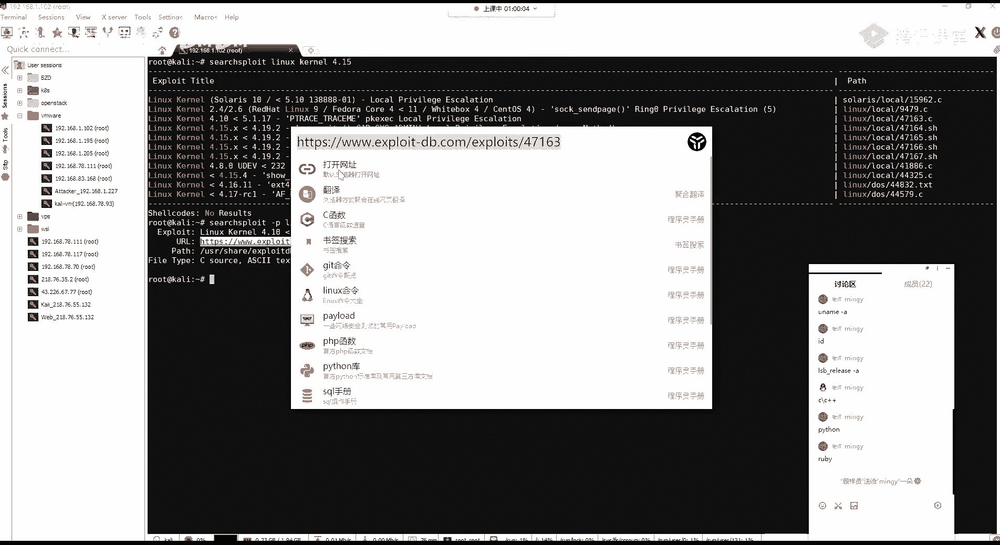

上面的这样的一个链接，然后他的这样子一个e x p的话，其实就是这边的这个就47163对吧，就这样这样子的一个，c程序的这样子一个e x p这个一查票啊，就是针对这样这一个内核版本的。

这样的一个提取的一个漏洞。

然后还有的话就是呃完整的一个路径对吧，这个路径的话其实就是呃我们这个脚本，它所对应的在我们卡里尼卡尼机器上面的，这样子的一个所存放的一个路径，我们可以在这个目录上面去查找到对，然后我们可以把它抠出来。

就是把它copy出来嘛，然后的话把它丢到目标机上面去执行吧，然后在这边的话也有，就是可以通过你可能call的话就是通过cp对吧。

然后cch pit的话，这边有这样子的一个参数可以，就干m当然我参数的话，他可以把一个e x p。

拷贝到当前的一个公众木马是吧，就我们不需要加这么长的这样子的一个东西，我们可以直接satisfigun，然后接这边的一个，4763点c对吧，然后这边的话就拷贝到了，诶，哦不对呀，不是啊，是这里啊。

47163。41刚刚复制错了，这个这个的话是我们的这个程序的一个路径嘛，对吧，然后我这边执行的话，他就可以把它复制到我当前的一个目录啊，我当前的目录的话，就有了这样子的一个47263点c。

这样子的一个呃c c c程序的，这样子的一个代码对吧，然后这句话我就可以对它做一个b e，然后在这边的话就多了一个这样子的一个，e x p对吧，这样子的一个程序，这个程序的话我们可以直接去进行一个直线。

当然的话我当前的这个机器的话是啊，应该是不存在这样的一个漏洞的是吧，我这边执行的话，他这边的话是，而且我当前的是一个root用户，执行的话，这边他应该是没有就没有成功对吧。

我当前这个企划是没有没有对应的，这样子的一个提前漏洞的，但是啊我这边的话执行的话，就是为了验证我这边的这个脚本，它其实是能够去执行的对吧。

就我这边的话是编译的话是没有出错的，然后在这的话哦，我这边的话就是需要去把它放到这边来，去进行一个执行对吧，呃我这边的话，我这边的话其实已经就是弄过来了呀，就是这个嘛对吧，我可以看一下，就是这一个呃。

4。10~5。1。17的这样子的一个脚本，471323点c对吧，就是跟这边的话是一样的对吧，内容是一样的。

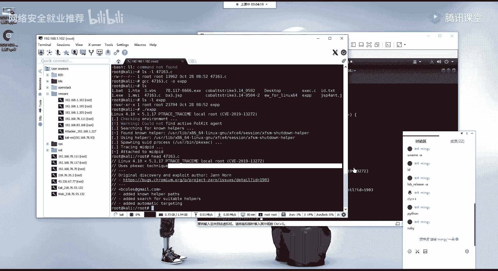

然后我这边的话在这边通过gcc做一个编译，呃我这边兵役之后的话，就有了这样子的一个e x p p p的，这样子的一个程序对吧，然后我这边的话我就可以去进行一个执行。

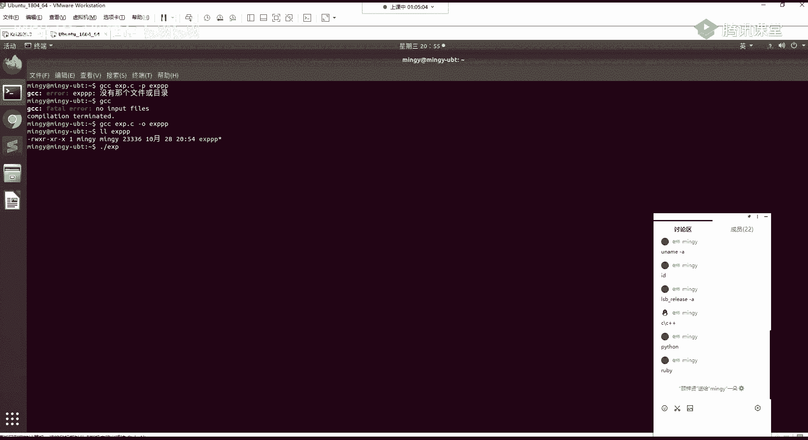

你去尝试直接，然后在这边的话可以看到，就我这边执行之后的话。

他立马的话，它有这样子的一个应用的一个过程对吧，然后利用过程完之后的话，他这边我当前其实是一个m n g y的这样子的，一个普通用户，然后呃我通过这样子的一个，提权漏洞的一个脚本啊，我可以看到。

我当前的话是得到了一个root的一个用户，这样可以开，就说，对啊，是一个完整的一个root用户的一个权限，我这边的话退一下，我当前的话是一个普通用户。

这边的话就是这一个。

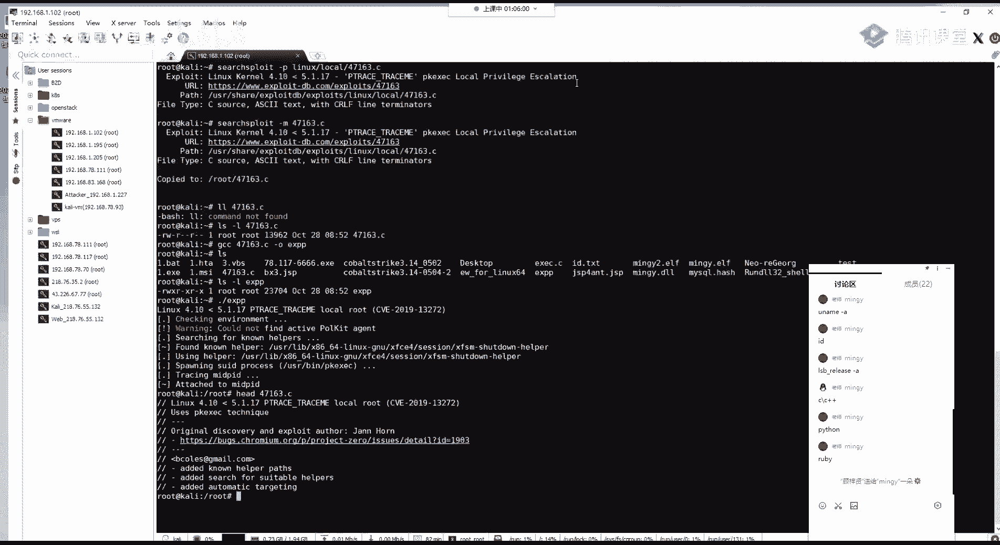

呃其实这边的这个题选中的话，就是呃呆就是我这边要讲的这一个，然后在这边的话我通过这样子的一个search point对吧，去查找对应的，我通过这样子的一个内核的一个版，本的一个信息。

来去检索对应的这样子的一个提取漏洞。

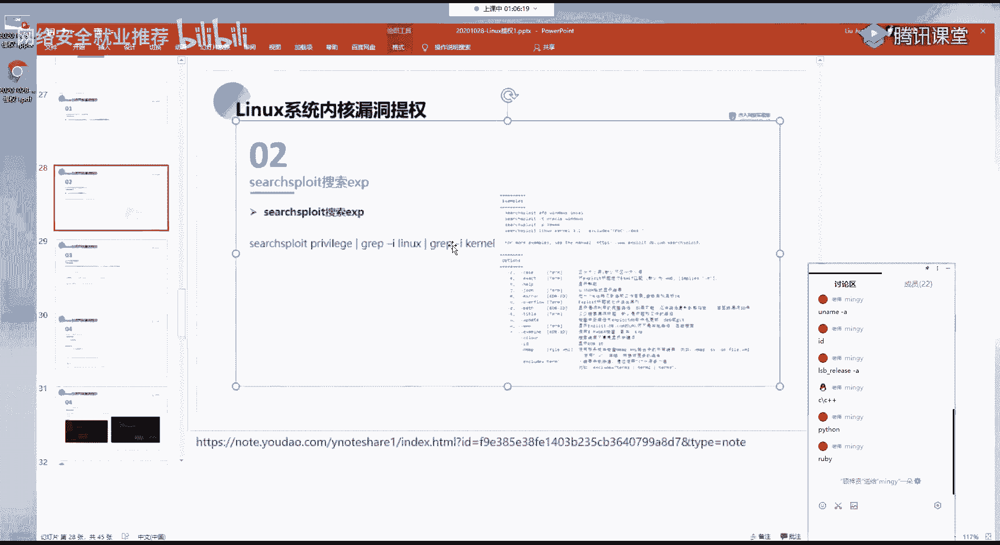

当然的话，因为我这边的话是，我这个机器是正好是存在。

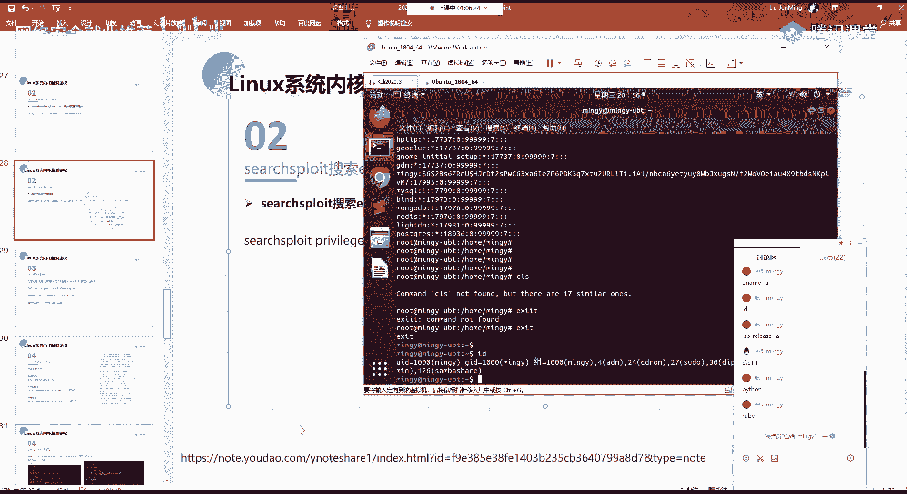

这样子的一个提取漏洞的，所以的话你通过这样子的一个检索，能够正好去找到，能够去进行一个利用的一个e x p对吧，但是的话就提权的话，真的提权这个东西的话是比较靠运气的，然后呃像这种东西的话。

你可能就是你通过这样子的一些信息的一个，检索对吧，你可能就觉得他可能存在这样的一个提取漏洞，但是它不一定存在，而且的话也不一定能够去进行一个呃利用，这个话是需要大家去知道的，呃这边的话就是。

通过这样子的一个例子啊，给大家介绍了，就是说实际的演示了这样子的一个工具的使用，啊对吧，我们通过这个工具来能够去比较方便的去检索，我们想要的一个e x p是吧，尤其的话再看里面的话。

他已经呃已经内置了这样子的一个呃数据库，而第三个的话就是这样子的，一个粘流的一个提权漏洞，呃这边的话我先下一下课好吧，已经，怎么没有怎么没有同学提醒一下我呢，我这讲着讲着又忘了，大家都不想休息的嘛。

呃那我们继续吧，中间的话就不休息了，因为时间也过了，就呃大家下次有下次的话，同学看到了就提醒一下我好吧，那我这边的话，我讲的话我可能不会去注意时间，就是，最中间的话给大家留点那个休闲的一个时间嘛，对吧。

呃第三的话就是这样子的一个粘流提权漏洞，呃，粘流的话就是说在讲提前，讲定义是下面的一个提前的话，就是不得不去说一下这样子的一个提醒漏洞，因为这个漏洞的话是呃是就是它的一个影响。

它的一个就是漏洞的一个危害的话是相当大的，那样的话在现在的话就是说在现在的话，它的一个这样子的一个漏洞上，存在的一个概率还是比较小的呀，就在这个漏洞刚爆出来的那个那个时间段的话。

是它的一个危害的话是相当大的，它的一个影响的话，所以的话它的一个就是战略提前漏洞，它的一个就是是很出名的一个提取，提取的一个漏洞，就它的一个作用的话，就是我们那个低权限用户能够去利用这个漏洞。

来在群版本的一个linux系统上面去实现本地提权，当然的话这边那个全版本是注意的话，是在当时那个时，那就是当时这个漏洞爆出来的那个时间啊，美军也就是说在当时那个当时那会，就是这个漏洞爆出来的话。

我们可以直接利用这个漏洞，在所有的这样子的一个linux系统下面，因为它是在全版本啊，所以是在当时那会的一个linux系统上面，所有的linux系统上面去用这样子的一个漏洞，去达到一个提取的一个目的。

所以说它的一个影响的话，是影响了当时全版本的一个linux系统，它的一个影响力的话是相当大的，而且这个漏洞的话是一个很严重的一个漏洞了，是吧，我们从从这边的一个意识也能够去知道。

然后他的他是能够去做一个本地的一个提权，然后这边的话是它的一个plc呃，关于这个漏洞的话，我这边呃就不给大家演示了，因为这个漏洞的话其实也算是比较老了，就可能存在的一个概率的话是不是很大。

当然的话也不一定对吧，以及的话这边的话大家去做一个，去做一下这边实验室的这个实验。

这个的话就是关于这个暂留漏洞的，jinx，全版本的一个通常提前漏洞的一个复兴，以及分析，大家可以去做一下这个实验，在这里的话就是呃介绍了这一个漏洞，我们如何去建一个利润，对吧。

然后的话在这边的话有关于这个漏洞，它的一个详细的一个就是涉及到的一个技术，然后对他的对他的做的这样子的一个呃介绍，就研究的一个介绍对吧，就很详细了，这边我这边的话，我就我就不再给大家去再读一遍了好吧。

这边的话就大家自己去看，因为我要去讲的话，其实也是跟这边就是没什么太大的区别，像这种的话，你需要你知道怎么去用就ok了，呃，呃第四个的话就是这个呃，刚刚给大家介绍的这样子的一个cv，2019的。

一个13272的这样的一个提权漏洞啊，这个题全漏洞的话是一个本地提权的一个漏洞，然后它的一个漏洞范围的话是影响呃，它的一个内核版本是4。1~5。1的，这样的一个范围啊。

呃它所影响的一个范围还是比较广的呀，就是它影响的这样子的一个系统，像乌班图啊，还有卡里db对吧，然后这边的话是他的一个e x p，其实就是我刚刚对吧，去通过那样子的一个检索。

通过cg point检索到的啊，通过内核的一个版本，然后的话检索到了，在exy db上面检索到对应的这样的一个，e x p对吧，这句话就是它的一个链接，啊呃这边的话就是这个e x p的话，我们下载下来。

我们下载下来之后的话，我们直接gcc去做一个编译，编译之后的话，直接执行的话，就能够去得到一个啊root的一个权限，就像这样，这边的话是在我的那个乌班图的一个系统。

而这个漏洞是去年去年还是前年一九去年吧，去年年底年底出的这样一个漏洞，然后这边的话是我当时就是复兴的这样子的，一个截图，啊，啊这边的话这个乌班图的话，就是我这边的这个机器嘛，就这个机器18。

04的这样的一个机器，然后这边的话是一个呃看你机器啊，就是这个卡，它同样的影响这样子的一个看你的一个机器，它的一个在这边的话是它的一个内核版本，是4。19，这样子的一个看机器。

机器的话我们也可以去做一个提前，这是它的一个效果，而看机器的话，这边的话我就不演示了，因为现在最新的话，现在最新的看你的话是没有这样的一个漏洞，它的一个内核版本它不属于这个范围了，这个是呃2018的。

2018的，如果大家现在有，就手上有这样子的一个2018的，这样子的一个三还是几的，这样子的一个看你机器的话，你可以去尝试一下，能够去进行一个提群，然后呃第五个的话就是这个cv 209的，7304。

这个漏洞的话就是一个linux的一个包管理器，这个s n a p的一个本地齐全的一个漏洞，提提这个漏洞的话是就是在这边。

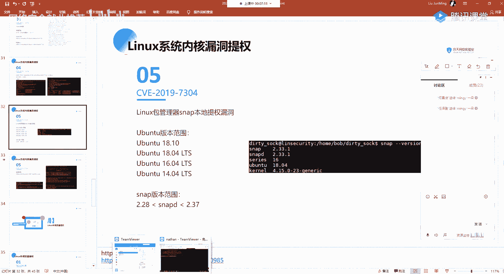

这边就是呃在这边的话有这样子的一个靶场，就是，呃这个就这样子的一个靶机啊，这个靶机的话，这个靶机的话是一个就是linux，就它里面的话有啊，很多的这样子的一些就是啊，配置它的一个权限配置啊。

以及对应的这样子的一些服务的一个漏洞，我们可以去利用它去进行一个提纯，然后在这边的话他在这个板件里面的话，正好有这样子的一个3a p啊。

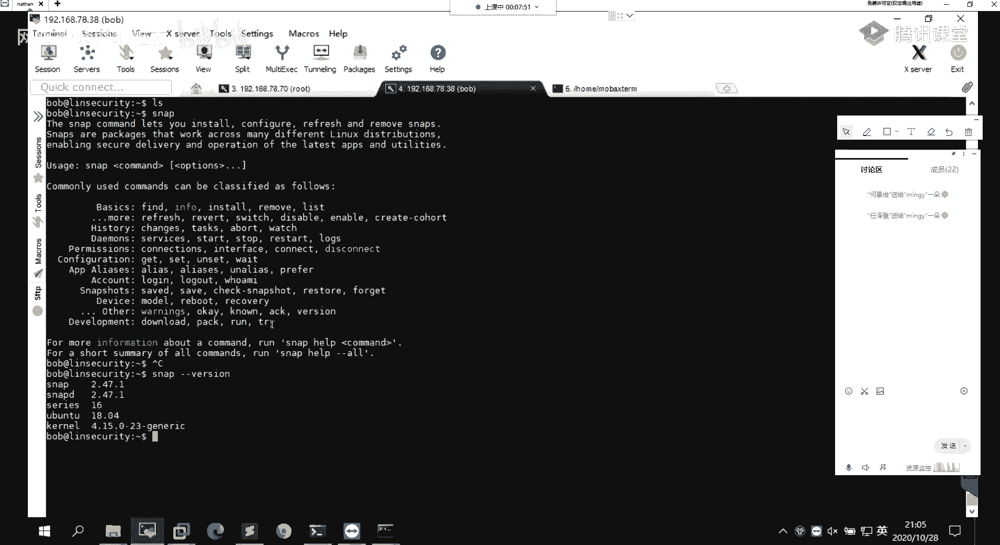

就正好有这样子一个sp的一个服务啊，其实这关于这一个服务它的一个信息对吧，我们怎么来，我们前面的话，就是通过前面的这样子的一个脚本嘛对吧，同样的他会去就是获取到系统上面所运行的，这样子的一些服务。

它的一个信息嘛对吧，然后我们针对这个服务它的一个版本是吧，去检索对应，可能存在着这样子的一些提升的一个漏洞。

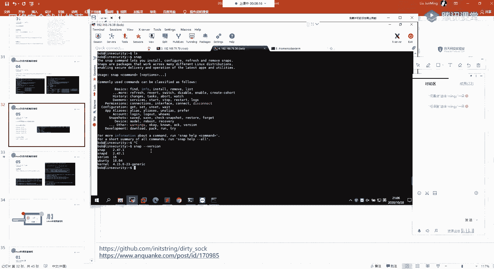

然后在这边的话呃，在这边的话，如果大家有去下载这个呃，下载这个靶场去玩的话，在这边会有一个问题啊，就是用这个s n a p的这个题型的话，呃你在这边的话大家可以看啊，我这边的话是2。47。1对吧。

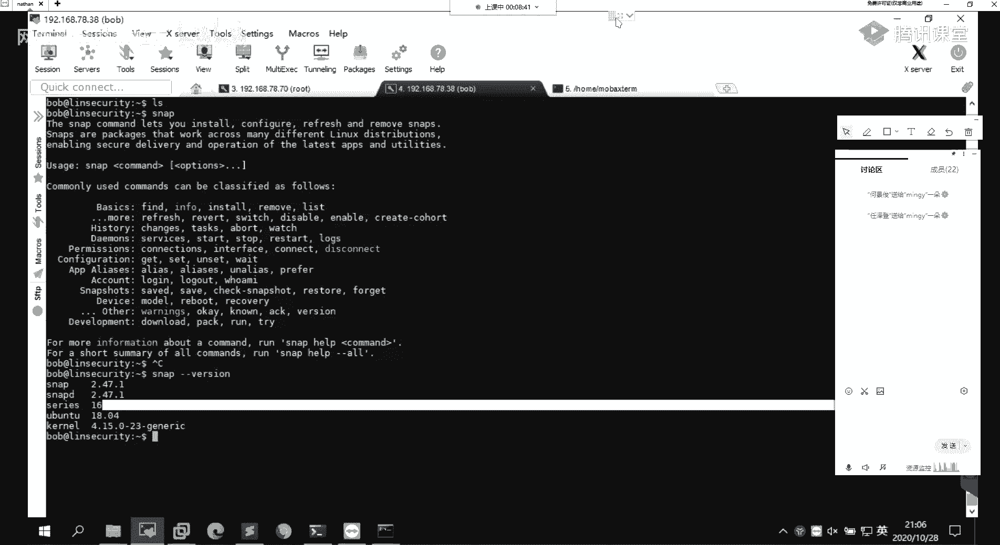

然后在这边的话，其实实际的话你刚进你刚启动这个靶场的话，它是一个2。33。1的这样的一个版本，就是这个漏洞，它的一个影响范围的话是碎了，2。28~2。37的这样子的一个范围。

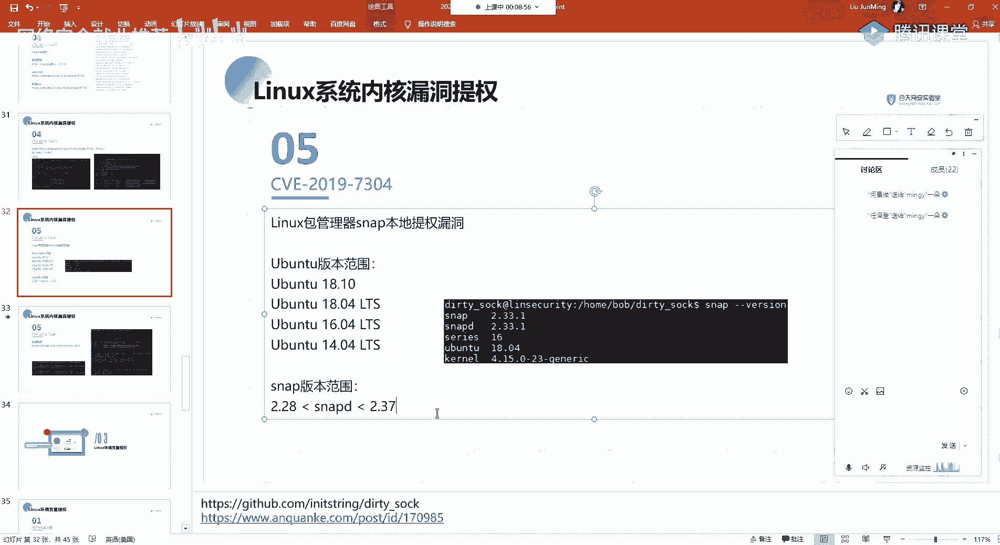

然后他在这边的话，他会有这样子的一个问题，就是我这边的话，我这个机器提起来，然后的话我这边能够去领网的话对吧，它会去自动的去更新这一个s n a p，就是他们，所以的话在这边的话。

我这边的话已经放了一会儿，然后我这边也可以去领网，所以的话他这边的话，它自动的把这一个就是它的一个版本，做了一个升级，把它升级到了2。47的一个版本。

所以的话他这边的话是不存在的，就不存在了这样的一个漏洞。

然后大家就是记得打个快照，就你启动之后的话。

然后呃这边的话才是他真正的一个版本，就是就是他初始的一个版本是2。33。1。

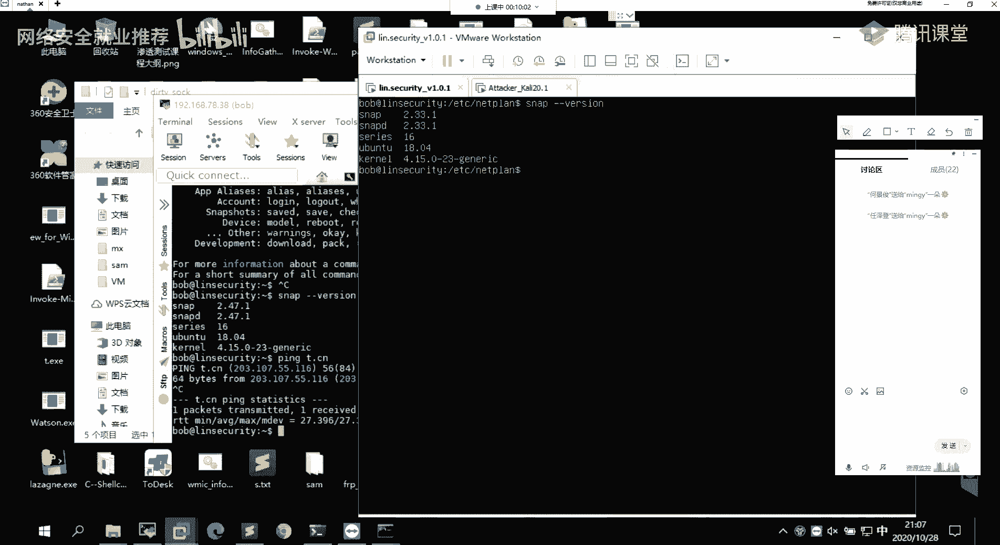

然后的话这个版本的话，正好是处于这个提权漏洞的一个范围的。

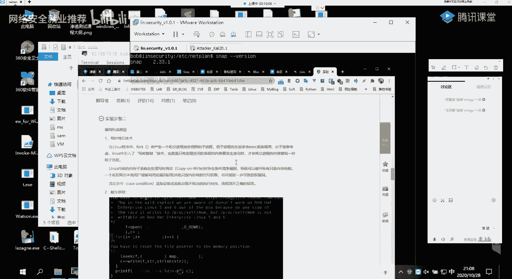

以及在这边的话啊，就是。

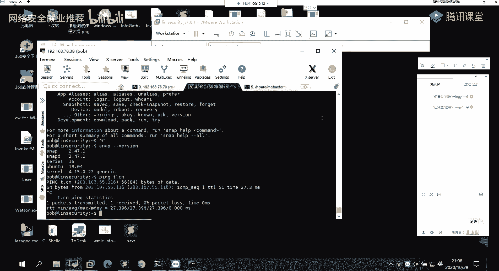

就是在这边我们去利用这个。

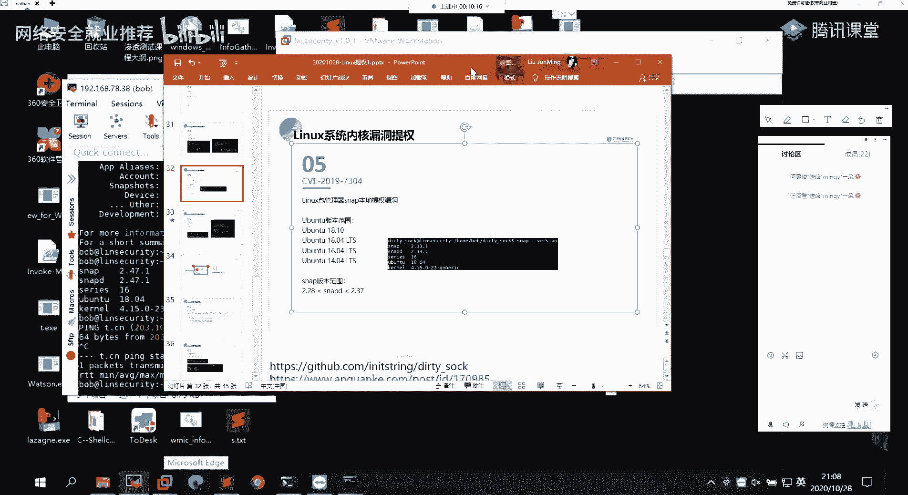

提前去利用这个漏洞的话，这边有这样的一个脚本对吧，你执行这个脚本之后的话，他就会去触发它的一个更新，就是你执行这个脚本之后的话，他就会去去更新，去更新这个snp，然后的话嗯就是你利用之后的话。

你的这个s n a p的话，它就更新到了一个新版本，也就是说你利用之后的话，他你还你想要去再去利用的话，那么是利用不成功了，也会因为他那个版本的话做了一个更新啊，这里的话是呃给大家提一下。

大家可能如果自己去做的话，碰到相应的一个问题，然后这边的话呃，它影响乌班图，141618的这样子的一个版本，然后这一个靶机的话，正好是一个18004的一个靶机。

在这边的话，在这边的话，我们先看一下效果吧，就是我这边看一下我这边的一个截图，然后的话我给大家，就是大家看一下这边的这个github。

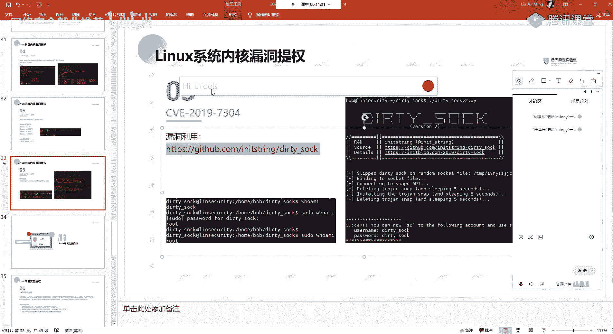

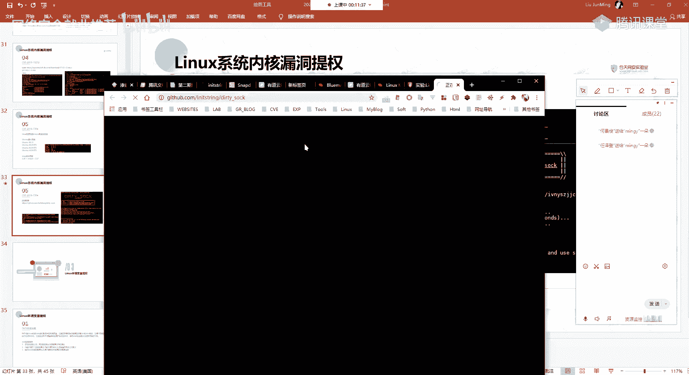

然后这边的话是啊，这个漏洞作者，他给出来的这样子的一个e x p是吧，然后在这边的话他给了两种方法，就是两种利用这样子的一个漏洞的一个方法，然后呃方法一的话，它是就是它需要有这样子的一个。

就是一个s h的一个私钥，然后我们可以通过这边的这个这样子的一个，你去创建这样的一个账号，然后的话你去创建一个这样子的一个私钥，然后他会有这样的一个邮箱，然后你可以通过这样子的一个脚本来去指定。

我们的这边的一个生成的这个实验，然后的话就能够去得到一个线，然后第二种方法就是通过他的这样子的，一个脚本，通过这个脚本执行之后的话，他会去创建这样子的一个dirty。

干shock的这样子一个账号密码也是代替shock，然后的话这个账号的话，它其实就是一个有root权限的这样的一个账号，然后我们可以通过这个账号登录这个账号，来去得到一个root的权限。

也就是达到一个提前的一个目的呃，这边的话我。

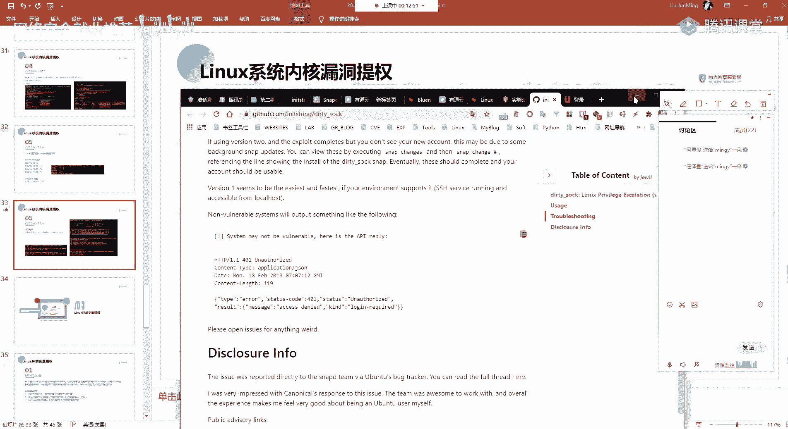

演示一下第二种吧，就第一种的话，因为稍微有点复杂。

就操作的一个步骤的话比较多，那个的话留给大家自己课后去进行一个尝试。

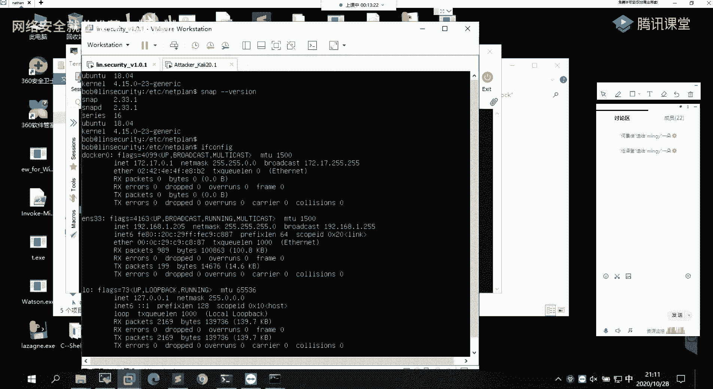

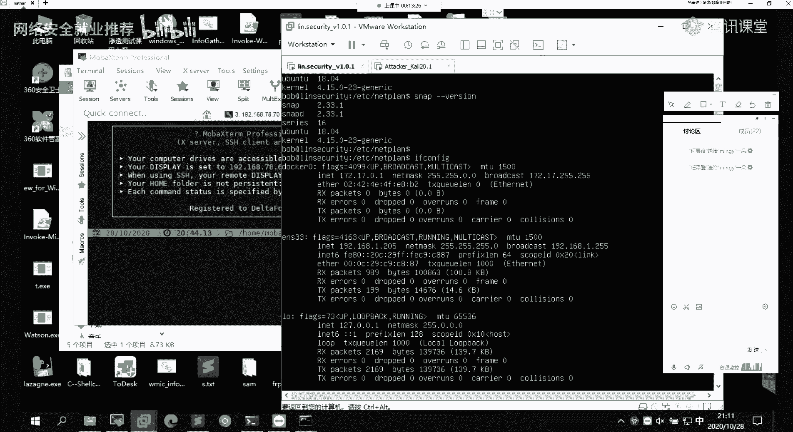

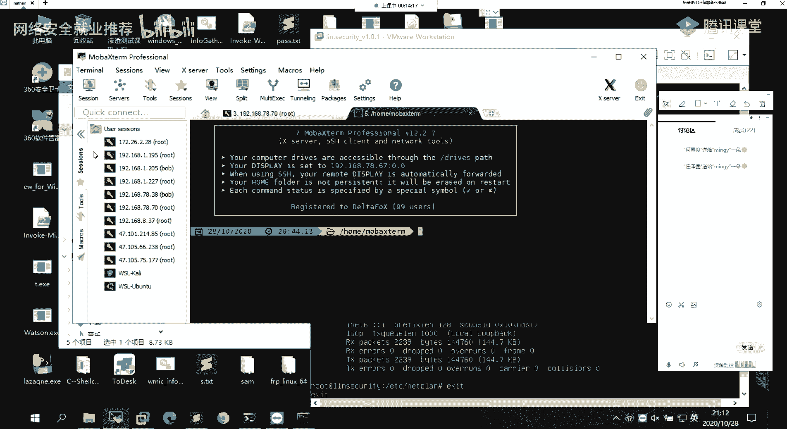

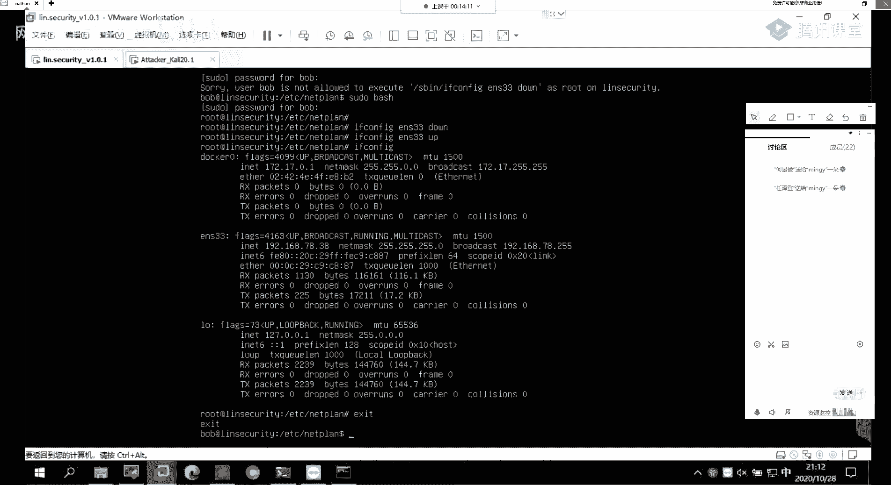

然后呃这边的话是这个82，是给了你一个普通用户的一个权限啊，然后的话你基于这个普通用户的一个权限，你在这个靶机上面尝试去进行一个提前，在这边的话，我们就是通过前面的一个信息收阶段，发现有这样子的一个啊。

可以去利用了这样的一个漏洞是吧，我们找到这样子的一个e x p，找到这个e x p之后的话。

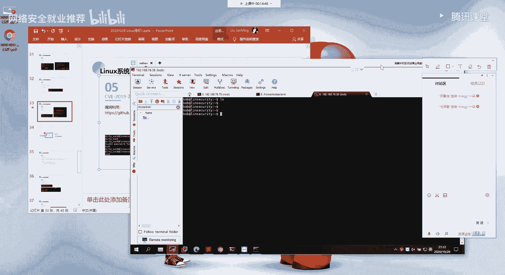

我们只需要去把这个e x p上传上去嘛，上传上去，这样的话已经，下载好了，拖过来拖过来之后的话，你去执行，执行之后的话，可以看到这边的话就是success对吧。

就是然后的话有了这样子的一个dt socks，我们可以t一下persword，然后我们在这边的话可以看看到，有了这样的一个用户对吧，然后这个用户的话，其实我们su，m p n一全是全是。

好这里的话我们可以登录进去对吧，登录进去之后的话，我们可以直接下外卖id id，这边的话可以看一下，你输了id之后的话，在这边他是这样子的一个，他还是一个普通的一个。

那个当时在电话有了一个这样子的一个收do，然后我们在这边的话，我们就可以通过so do来去执行一个，对吧，来去执行命令，然后我这边收do com的话，我当前的话就是root。

因为我是通过so do的一个呃方式呃，大家知道收队吧，就收队的话就是啊，我们可以通过so do来去得到一个啊，就是来去暂时的去得到一个note的一个权限，就如果你的这个用户的话。

你允许去通过so do来去执行命令的话，那么你就可以通过so do来去啊执行啊，以note用户的一个权限去执行相应的一个命令，先比如说我这边搜do com对吧，就是一个note。

然后我这边比如说我要去catch一下这个，下载文件对吧，可以看到我当前的话是没有权限去那个，但是我这边的话我可以通通过sodo，来去执行这样子的一个cat，对啊，当前的话就能够去读取这样一个需要的文件。

然后这个需要的文件是只有root用户，它才有去权限去进行一个读取的，这边的话我们的一个提前的话就已经成功了，这边版本还没变。

这是这这个提前漏洞的一个效果，呃大家关于以上两部分的话，有没有什么疑问，有没有什么问题，应该没有什么问题吧，都是呃比较简单的，比较简单的一些东西，有问题的扣一，没问题的扣二。

而第三部分呢就是linux的一个环境变量提取，在我们前面的话有大概的有介绍一下是吧，然后在讲这个之前的话，我们先来看一下就是什么是环境变量，也就是一个linux下面的一个path环境变量。

这个pass的话是linux，还有这种类unix操作系统中的一个环境变量，它呃指定存储可执行程序的这种所有，并还有s b的一个目录，然后当用户再去终端上去执行，任何这种命令的时候。

他会通过这样的一个pass变量来去响应，用户执行一个命令，好像需要发送请求来搜索可执行文件啊，其实这一句话就是我刚刚给大家介绍的，这样子的一个pass环境变量的一个作用对吧，这这一个的话大家能理解吧。

就是呃我们通过大家可以在linux系统下面去执行。

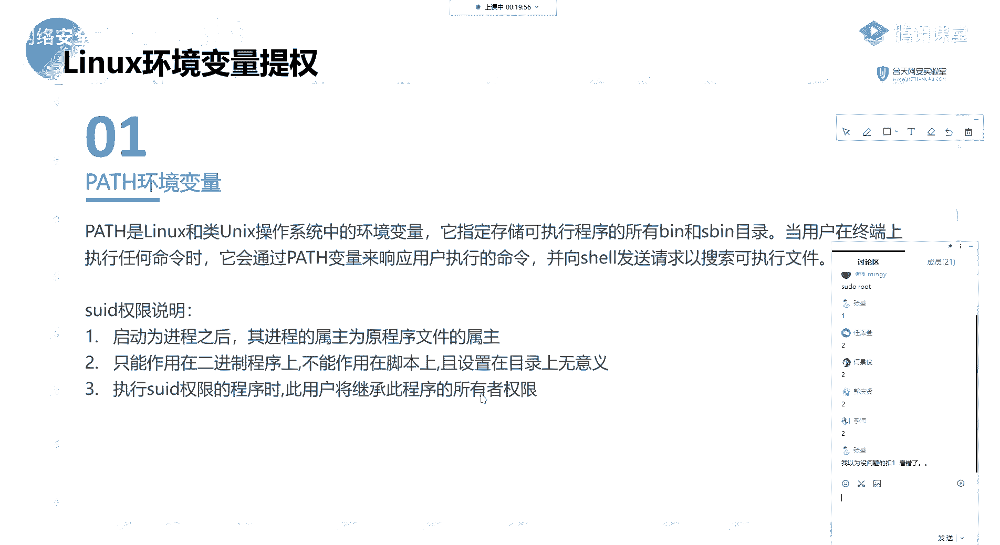

这样子的一个呃echo，然后加一个呃dollar符，加一个p a t h pass，然后你就能够去输出这样子的一个pass，的一个环境变量，输出这一个变量，然后在这的话就是它的一个记录的一个值。

而其实这边记录的一个值的话，我们可以看一下，就是它是一个冒号作业的一个分隔，然后每一个冒号的话，它是一个这样子的一个目录对吧，像user local bin，像这里的话呃，前面的话讲linux的时候。

相关的奖励是相关的一些啊，目录结构的时候有介绍对吧，像s bin的话，就是你的一个就是呃像这种root用户，他就有权限去进行一个执行它里面的一个命令，就是高权限的一个用户。

然后在这个目录下面存储的一个命令，它才能够去执行，然后像being的话，就是你普通用户也可以去执行，这里面的最下面的目录，下面的一个可执行程序对吧，还有user spin啊，user bin啊。

bin等等，这样子就先目录，然后这边的这些目录的话，就是当我们比如说我去执行啊一个，执行一个ios的一个面对吧，我这边执行ios，执行这个ios命令的话，他会去列出这边的一个内容对吧。

那么在执行这个ios命令的时候，它中间它是怎么去找到的呢，我们可以看一下，通过vr移植来去查找这个els的一个文字，可定程序所知所在的一个目录对吧，他是在这个bl s的一个目录下面对吧。

然后的话就当前的话，当前是一个普通用户对吧，普通用户的话，它去执行iosp的话，它是会在这个目录下面去进行一个查找，那么这个目录的话他是怎么去找到的呢，就在这个呃path环境变量当中去找到的对吧。

他要去一个一个目录去检索紧锁，紧锁这一个目录下面，它是否能够去执行这样的一个ios命令对吧，以及是否有这样的一个命令，好的话，直到找到在这边啊这个bin目录对吧，他找到这个病目录下面的话。

这个目录下面正好有一个ios的一个命令，然后的话他有权限去执行，然后的话他执行之后的话，他就会呃返回结果给我们对吧，就是这样子的一个就是你去执行命令的话，他有这样子的一个过程。

然后的话还有就是这个s u s u d的一个权限，这个s a d的话是一个特殊的一个权限啊，我这边要通过这样子的三句话啊，就是大概的说一下这个su id权限的一个作用。

就是呃我们的这个su id权限的话，它就是启动为进程之后，它进程的一个属组为源程序文件的一个属组，我们这边的一个数组的话，就是我们知道我们的一个权限，象比如说note root root对吧。

就是这个文件它是呃它的一个属组，就这个，然后这个的话是它的一个所有组对吧，然后的话如果这个程序它是一个呃，s u d的一个权限的话，它执行的话它的一个这个进程的一个属组，也就是说他这个进程的话。

它是同样的是这个note的一个权限，它是属于这个note的这个用户的是吧，然后的话这个权限的话，它只能作用在二进制程序上面，就是只能去作用在我们的这种可执行程序了啊，其实我前面说的话，不是说目录啊。

就是这种可执行程序啊对吧，然后的话呃它是不能作用在脚本上，而且就是你也不能设置在目录上面，它是没有意义的，就你只能作用在这种二进制可执行程序上面去，好啊，执行su id程序的时候。

这个用户将继承执行程序的所有者的一个权限，就是说我们的一个sd的一个程序对吧，就是有这样子的一个s a d权限的，这样一个程序，它是一个note的一个数组对吧，就是这个程序的话。

它是属于一个root用户的是吧，然后的话在这一个用户，他去执行这样子的一个程序的话，那么它的这个执行这个程序，执行这一个程序的一个用户啊，他会去继承这边的这个文件。

这个可执行程序所有者的这样子的一个权限，也就是这边所说的一个root，像我们这边的一个数组的话，其实就是这个可可执行程序的一个所有者嘛，对吧，那么呃这个权限的话，我们如何去进行一个利用的。

就是说我们如何去利用它来去进行一个提前，在这边的话呃，首先的话就是呃我们需要去找到这样子的一个，拥有sd这种特殊权限的这样子的一个文件，在这的话我们可以通过这个方案的命令，来进行一个查找。

这边的话其实前面也介绍了对吧，就去查找这样子的可执行的文件，还有文件夹对吧，然后在这边的话就是放的干，就在根目录下面去查找它的一个权限，是这样子的一个干优，就是它的一个优者是有这样子的一个s i d的。

s u d的这样子一个权限的，以及它的一个呃类型上是文件对吧，就不是说目录，因为你目录的话，它是没有这样子一个sd的一个权限的是吧，而且没有e，然后的话呃把错误的一个输出把它置为空。

好我们通过这样子一个命令的话就能够去查找，就是说在当前系统下面啊，有这样子的一个s u d权限的，这样子的一个文件对吧，然后我们通过执行之后的话，在这边有找到这样子的一些程序对吧，可以看到在这边的话。

有这样子的一个shell的一个文件，这个文件的话它正好是有一个sd的一个权限，然后我们当前它是在我们的一个普通用户的一，个目录下面对吧，就这个卡里的一个目录呃，这个话是我做的一个这样子的一个场景。

就是为了给大家讲解就演示的一个场景，然后这边的话是一个这样子的，一个可执行的一个二进制程序的，我们找到这个程序之后的话，去执行它，执行执行它之后的话，它返回那个结果的话是这样子的一个东西。

然后其实大家熟悉的话，就是这边它执行的一个结果，它其实就是我们执行ps的一个命令的一个结果，对吧，就执行一个ps命令的一个结果，我们呃我这边的话，以我这边的这个机器为例，嗯我这边已经切到阿里用户。

就我当前的是一个卡点用对吧，一个普通用户，然后我通过这样子的一个命令，来去查找拥有s u i d权限的，这样子的一些程序啊对吧，然后我们就可以看到这边有s u嗯，嗯没错，应该没有这样子的石油。

还有而c h s h等等的这样子一些变量，amount这样子的一些命令啊，然后这些的话都是比较常见的，然后在这里的话有这样子的一个程序，嗯我们可以通过l l来去查看这样子的。

像比如说我以这个su这个命令为例对吧，你通过哦我去查看这一个程序，你会在这边可以看到它有这样子的一个，本来正常的话是rw x对吧，然后他在这边的这个u的user，也就是呃属组的这样子的一个权限。

上面的话有一个s的一个权限，然后这边的话，其实就是他那个s u d的一个权限，也就是这个程序的话，它是呃有s u d的一个权限，然后我们在这边的话去执行这个s u i d的话，去执行这个su命令的话。

那么它是一个note的一个权限，然后在这边的话，我们找到有一个比较特殊的这样子的一个文件，就是这个这个对吧，它同样的也具有一个s u d的一个权限，然后我们执行执行它，执行它之后的话，他返回了一个结果。

他是跟我们就执行ps之后的一个结果，它其实是一样的，而这边的一个区不同的一个点的话，就是不一样的，就是我这边对吧，我这边因为是一个普通的一个卡里用户，然后你之前p的话，它只是列出了你当前的。

就我当前还是一个半对吧，然后去就是列出当前我所在的一个p t y，然后这边的话执行对一个需要的话，因为他是s ud的一个权限，然后的话他这个文件它的所有者是root啊，其实执行这一个的话。

它是一个root的一个权限去执行的，也就是他这边我们可以看到他这边的话，他执行的一个内容，结果的话是比我们多的对吧，像包括su，因为我们刚刚的话是通过su来去得到的，来切换到了这样的一个看你的对吧。

所以的话他同样的有这样子的一个，有这样子的一个pad，以及有bash，然后的话，我们怎么去利用它呢，就是说他这边的话，它我们可以看到这个程序它的一个功能，它的一个功能的话。

它其实就是去执行一个ps的一个命令，但是的话因为他这边执行的话，我当前的话执行ps，它其其实是以我当前的一个，普通用户去执行的对吧，但他这边的话它有s u d的一个权限的话。

它能够去继承这边的一个loss的一个权限，来去执行这样的一个ps的一个命令对吧，所以的话它它是其实是以一个root的一，个权限去执行的，但是我在这边的话，我去执行这个程序的话，是一个普通用户啊。

就是我当前是一个普通用户，但是我这边执行的话，它虽然是一个root的一个权限的对吧，但是我们无法去啊，说我们无法去通过这样的一个可执行程序，去得到这样一个root的一个权限是吧，然后在这边的话。

我们就需要去结合我们这边讲的这样子的一个，环境变量来去做一个啊，这样子的一个利用它来去进行一个提前呃，具体的一个方法的话，就是像这样子，呃我们首先的话就我当时是一个普通货对吧。

我首先呃进入到temp目录，temp目录的话，我们写入这样子的一个啊文件，然后写的这个文件，它就是一个p的这样的一个文件，然后它这个文件里面的一个内容的话，就是bin bash，然后的话我给这一个程序。

给一个777的一个权限，因为我在tap的话，我是有权限去对它做这样子，这样子的一个操作的对吧，然后下面的话就是这里的一个重点，就是我们可以通过export来去给给我们的一个，pass变量去添加。

去加我们的这样子的一个temp，嗯去添加我们的这样子的一个，就是呃可执行程序的一个目录，就这边的一个，我这边的话是添加了，添加了一个tp的一个目录对吧，然后的话在这边的话我们都这样子。

一个pass环境变量的话就变成了这样这样子对吧，就原本的话是这样子的一个这样子的一些目录，然后我通过export，添加一个这样子的一个环境变量，把这个tp目录把它给添加到添加进去了对吧。

然后这边添加添加进去的一个意思是什么呢，就是说比如说我这边要去执行ios的一个命令，对吧，我这边执行l s的一个命令，那么他首先他会去，他会去一个一个目录去找对吧，那么他我这边添加进去之后的话。

他会去在这个top目录，他去查找，是不是有这样的ios的一个可执行程序是吧，然后的话如果有的话，他就会去执行，然后如果没有的话，他就会一次的去查找对吧，那么下面的话我们呃再去执行这样子的一个。

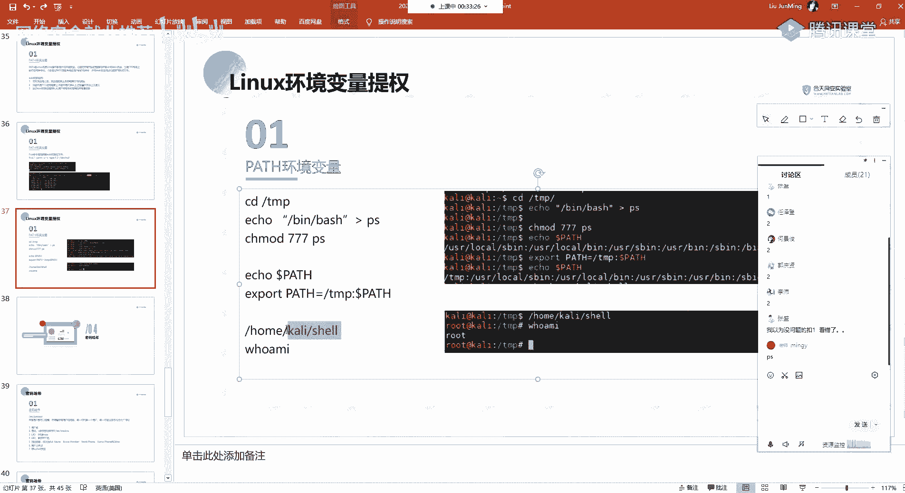

就是说再去执行这边的一个shell，我们这边的话当前的话是一个普通用户对吧，我去执行这样子的一个shell这个命令，我这边执行之后的话，它是一个root权限去执行的一个p对吧。

那么他在这边去执行这个ps的时候，他怎么去找到这样子的一个ps的一个命令，它同样的也是去环境变量当中去查找。

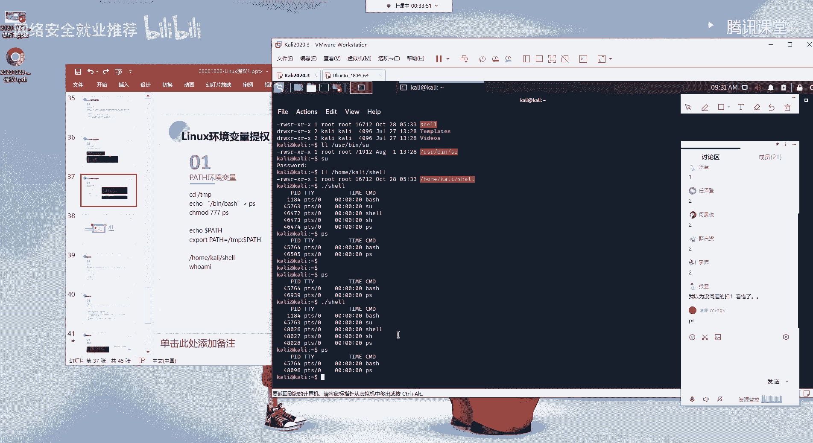

所以的话他同样会走这样子的一个过程，就是走这边环境变量它会去这一个目录，它当中去查找，是不是有这样的一个ps的一个命令对吧，如果有的话，他就会去执行它，然后在这边的话。

我们在tap录下面有添加了这样的一个p的，这样的一个呃文件对吧，然后他正好的话找到了它，就在tap目录下面找到有这样一个ps文件，然后的话他就会去执行这个ps文件，然后执行这个ps文件的话。

这个文件里面的内容是一个bin bash，也就是他执行之后的话。

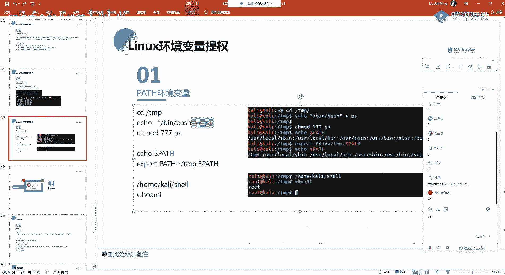

他会去有得到这样子的一个啊bash对吧，我直接我直接执行bash的话，就进入到了bash了是吧，我ist那就退出了当前的那个bash是。

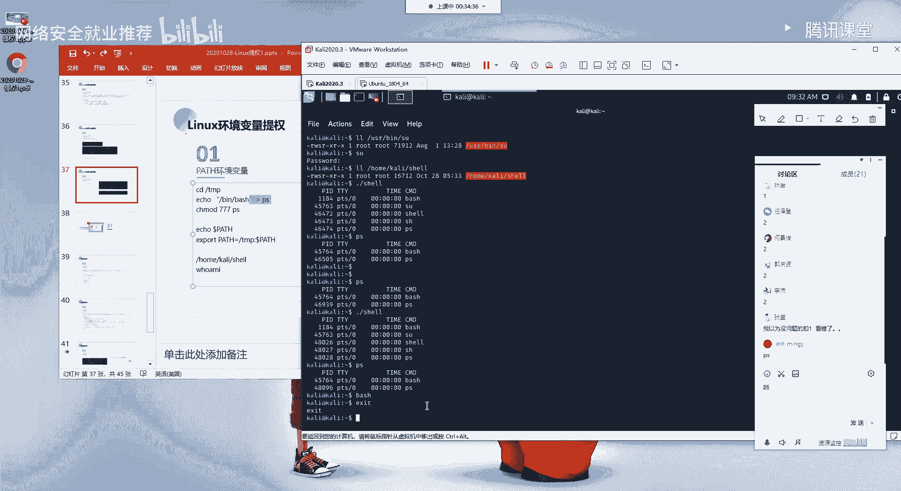

然后在这边的话就是呃可能就是正常的话对吧，你如果没有这样子的一个，s u a e的一个权限的话，你只你正常的，你就算去添加这样子的环境变量对吧，你添加这个环境变量之后的话。

你在当前你去执行这样一个ps命令，他去找到这样的一个目录，你得到这个bin bench，它其实也是一个你当前用户的一个权限。

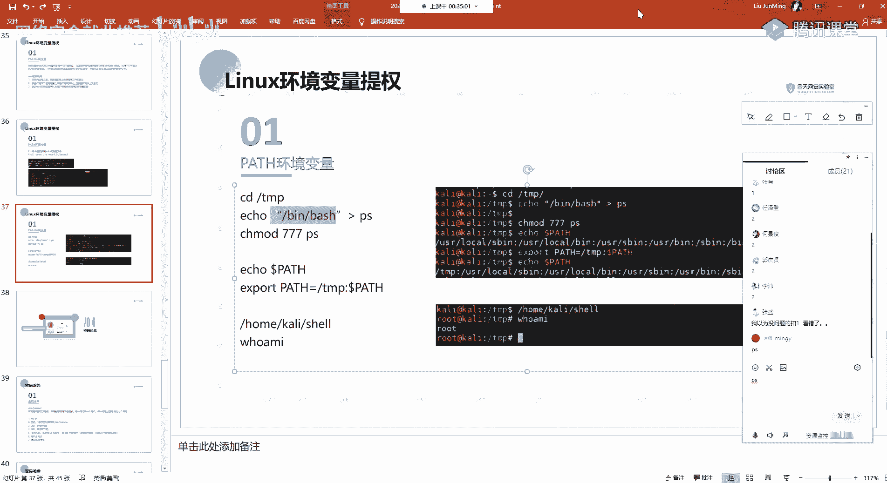

的一个bash，就像我在这边去执行的这样子的对吧。

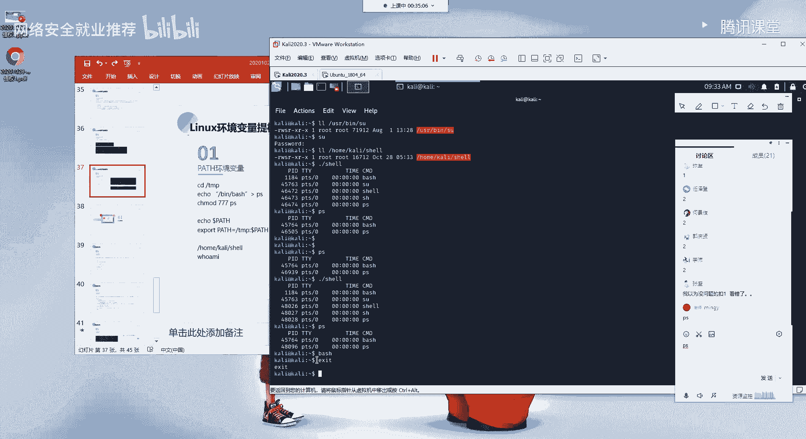

我这边执行之后的话，我还是要看你的一个权限，然后在这边的话就是不同的一个点的话，就是这边的这一个啊程序这边的这个小程序，它是有一个s u d的一个权限，也就是我这边执行这个sd的话，他会去查找目录。

下面，他是不是有这样子一个ps的，这样子的一个命令对吧，然后的话他找到这个tap目录，找到这个tap目录，找到这边的一个ps文件，他会去执行这个bbh，然后这边执行边半血的时候的话，大家回过头来看一下。

这边就是他在去执行这样子的一个，s u d权限的时候，就这个用户他会去啊，继承这个程序的一个所有者的一个权限，也就是啊以及这边就是启动为进程之后对吧，就你执行这个ps命令之后的话，它同样有一个进程对吧。

然后这个进程它的一个属组，是云程序程序的一个数组，也就是它是一个note的一个权限，就呃总结的来说的话，就是我这边执行在执行之后，执行这个命令之后的话，它会以一个root的一个权限去执行这边的一个ps。

里面的一个内容，也就是这个bbs，所以的话我们最后的话就能够去得到这样子的，一个root的一个bash，因为执行这边的这个batch的这个进程的话，它会继承这边的这个root的权限。

所以的话我们就能够去得到这样子的一个，root的一个群，root的一个shell，也就是达到了这样子的一个期权的一个目的。

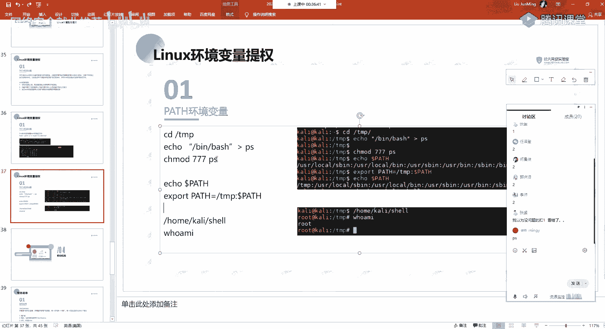

我们啊实际的来看一下呃，我这边的话我先到探索目录对吧，呃我这边的话写一个这样子的一个，文件，把我们的一个ps文件当中对吧，然后其实呃我们给他一个提取器的一个权限，然后我这边去执行这个ps对吧。

其实执行这个ps的话，你就是执行了一个这样子的一个b型嘛对吧，我可以exist，exist之后的话就退出了当前的一个bush是吧，呃可能这样子不是很明显，我这边改一下吧，我改成s h。

啊我这边执行这一个ps，执行之后的话就得到了一个s h对吧，这边当前的话是一个s h，我这边一个exist k掉，但是的话我我当前它是一个普通用户对吧，我一个普通用户，我去执行的话。

它还是一个普通用户的一个需要，那么我当前的一个pass的一个环境变量，我们可以来看一下，是这样子的一个啊记录记录的一个值对吧，然后在这边的话，我们可以通过export来去添加这样子的一个。

去更改我们这边的一个环境变量的一个值，呃，啊其实这边的话就是好更改了这样子的一个，pass的一个环境变量对吧，为这一串，这边的这一串的话，就是其实就是前面的这一串嘛对吧，然后在这一串前面的话。

我们加了这样的一个temp，以一个冒号做一个风格，其实就是在这一串前面加了这样的一个temp，冒号也就是添加这样子一个tap目录嘛对吧。

看一下应该没写错吧。

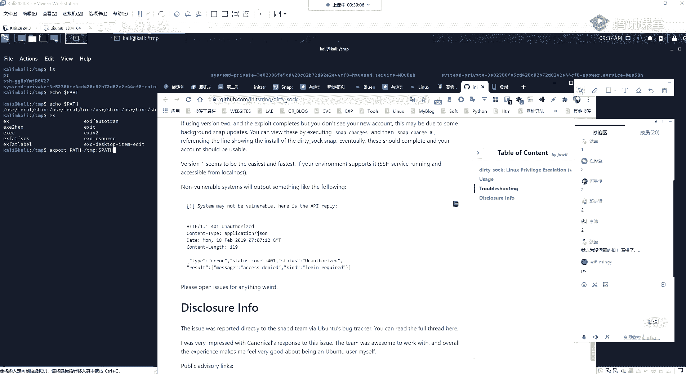

没错，然后我再echo一下环境变量，然后它就变成了这样子对吧，变成了这样子，那么我当前我去执行ps对吧，你会发现你会发现我进入到的是一个呃share对吧，我当前执行我执行ps。

我进入到了一个s h的一个线是吧，它不是它不是像我之前去执行一个嗯，不是像我之前对吧，我直接执行的话，它是一个返回这样子的一个内容，然后我在这边的话，我之前的话就得到了一个s h的一个线。

但是我这边得了一个s h cl的话，是一个普通用户的，其实其实就是我这边执行命令的话，他在这个tap下面去找到了这个文件对吧，然后的话执行了，然后在这边的话，就是我们结合这边我发现的这一个。

这个拥有s u i d权限的这个程序对吧，那么我在这边去执行之后，你会发现我这边执行之后的话，它同样的进入到这样子的一个s h的一个线，但是不同的话是我这边执行挂卖，你会发现的话。

我这边是一个root的权限，就不是像前面这边是一个呃，当前的一个卡里的一个普通权限是吧，快快滴，我这边呢就得到了这样子的一个root的一个权限。

呃也就是通过这样子的一个方法，达到了这样子的一个提前的一个目的，就利用利用的是这样子的，他的这个s u a d的这样子的一个权限，以及结合我们这边的一个bash的一个环境变量，就是整好的话。

他的这个u s e d权限的这个程序对吧，就是他想要让普通用户，那普通用户也能够去执行，就是root用户的这样子的一个命令对吧，就是他写了这样子的一个啊可执行程序的一个，就是二进制的一个程序对吧。

就是它其实它原本的目的，是想要让普通用户去执行这样子的一个卸载，之后的话，能够以note用户对一个权限，去执行对应的一个命令，然后的话他在这边的话，就存在这样子的一个问题。

我们可以利用它得一个s u d的一个权限，以及结合我们这边的一个环境变量。

来达到一个提前的一个目的，这边的话就是呃一个环境变量提权的一个例子，以及呃第四个的话就是密码哈。

希密码哈希的话其实呃我们就刚开始讲。

就说提权的时候就有提到，就是通过密码的一个方法。

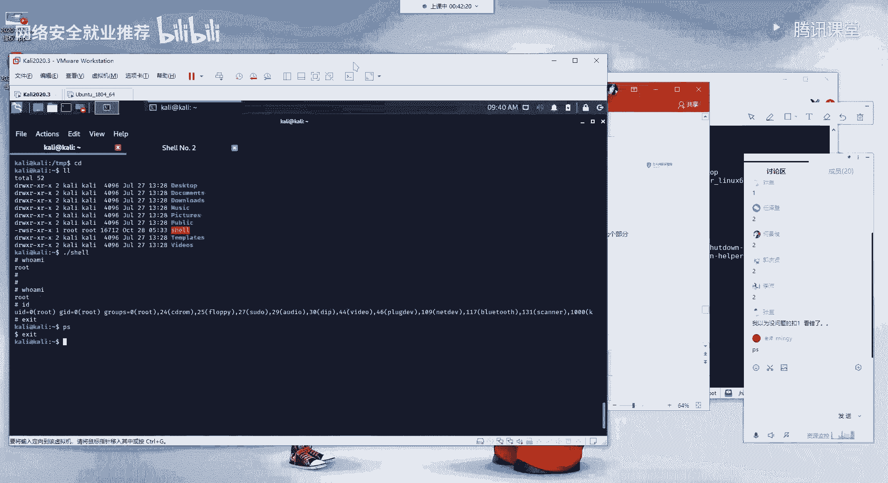

来去进行一个提权对吧，就密码的一个方式，账号密码的一个方式提取是最直接，最简单直接的一个方法是，如果你知道了对应的一个而用户的一个密码，那么你就能够去得到它对应的一个权限了是吧。

然后在这边的话就是呃介绍就介绍一下密码哈，希其实就是这样子的两个文件，就这一个etc的一个password，以及这边的一个etc需要的一个两个文件，呃，这个的话就是前面已经比较详细的有介绍了。

我这边话我就不多说了，就前面在讲那个linux的一个信息收集的时候对吧，去收集我们的这样的一个用户的一个信息，就有有给大家介绍是吧，然后这边的话呃我就大概的说一下，就是这两个文件它的一个特点。

就是这个etc的一个password的话，它是所有用户都可以去查看的，然后它是存储着所有用户的一个信息，每一行的话它代表一个用户，我们可以。

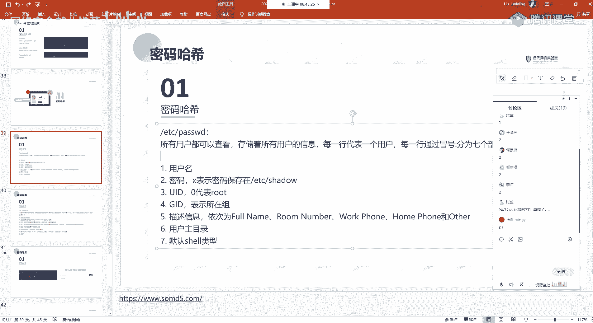

比如在这边是吧，我cat etc password开了之后的话，在这边的话他就有这么多的一些内容对吧，他这边的话都是存储在用户的一个信息，每一行的话代表着一个用户，然后呃每一行他的每一行。

它所存储的这样子的一个啊内容代表什么，意思的话，就是我这边写的，我这边的话我就不说了呀，前面已经有介绍过了，是吧啊啊，第二个的话就是这个etc shader这个文件的话。

它是只有root用户能够去查看它保存加密后的，一个密码和用户相关密码的一个信息，然后同样的也是每个用户一行，好，然后的话就是，然后的话就是我们如何去进行一个，就是说啊去进行一个利用，利用它呢。

就是呃我们原本的话就是我前面有说对吧，就是etc password这个文件的话，它里面它是不存在，就是它没有存放我们的这样子的一个啊，密码的一个哈希值的，就是说它的一个密码的哈希值我们可以看一下。

像root对吧，然后后面的话有这样子的一个x，这样子的一个就是占位符，这个x的话就是表示的就是密码的一个哈希值，它这边x的话，它呃，他原本的话是存放着这个密码，这个用户对应的一个密码的哈希值。

但是后面的话就是啊为了安全的一个考虑，因为这个文件的话，是所有用户都能够去查看的对吧，那么如果你得到了一个普通用户的权限，然后的话你查看这个文件的话，那么你就能够去得到它对应的一个哈希值对吧。

那么你得到它的一个哈希值的话，也可以去尝试做一个解密，就是有可能能够去解密出来，它的一个铭文的一个密码，对吧，然后的话呃它实际的话实际它的一个密码的，卡西的话，它是存储在这样的一个。

sha的一个文件当中对吧，那么在这边的话，我们通常的话也会去查看这样子的两个文件。

就是这一个啊password以及shasha这两个文件对吧，然后通常的话你想要去验证就是你的一个用户，他是不是有root权限的话，就是呃就是我这边的话就最简单的一个方法。

就是你去cat一下那个sha这个文件对吧，如果你能够去查看的话，那么你就是一个root的用户吧，以及你可以去cd一下root的一个目录是吧，然后呃在这边的话，在这边的话，我们因为我们是一个普通用户对吧。

我们可以去有权限去查看这样子的一个啊，etc的一个password，那么我们在这边的话，我们呃以这个，掉了。

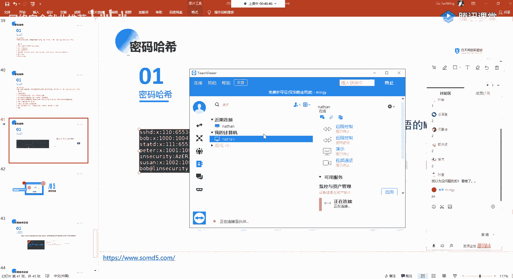

以这边的这一个法鸡为例。

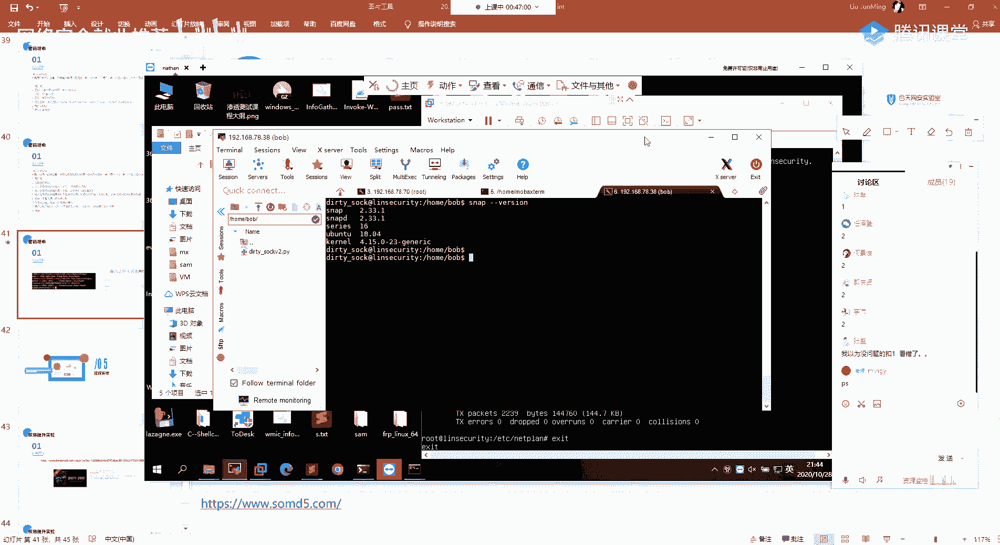

一些对这次，啊你你可以发现就是对吧，原版的话它是2。3。1的这样子的一个版本，然后你过一会的话，它会自动的去升级到2。4。7的，这样的一个版本，可以的话，我如果我现在我再去进行一个利用的话。

是利用不成功呀，这点的话大家要注意，然后在这边的话，我以这个榜机为例对吧，我们去收集他的一个e tc的pass word的一个信息，其实如果你用脚本的话，就是用我们前面的那个信息，收集的一个脚本的话。

也同样的能够去就发现啊，呃以及在那个脚本当中的话，它还会有呃啊关掉了。

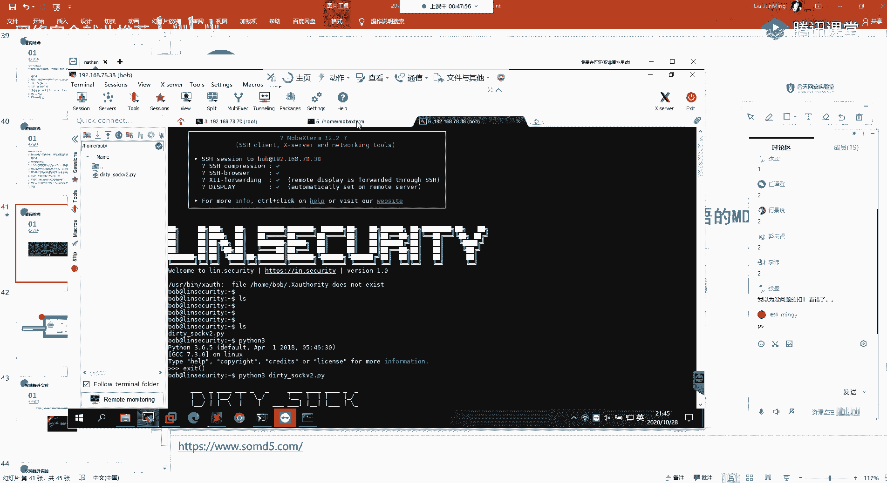

就是你去认真看，你在这个板子上面，你去执行那个脚本的话，它会就列出来，就是像比如说在这边对吧，我这边查看这个etc password这个目录，然后我去查看这边有的，这样是指的一些用户对吧。

然后像比如说在这边就有一个这样子的，一个用户对吧，这个用户的话可以看到跟前面这些的话，它有不同的一个地方，就是在这边原本第二位它是一个呃，就是正常的话是一个普通的。

正常的话是一个x的这样子一个占位符对吧，就他那个密码哈，希它不会在这边的，然后在这边的话它是他的一个密码哈，希就是写在了这边，以及他它有这样子的一个特点，就是它是一个root的权限。

我们可以看到它的这边的一个ui d及gg，的话是为零，前面的话有讲，就是你只有root用户的话，他那个ui d以及gd他才是为零，也就是如果你的一个用户，你的一个ui d j i d为零的话。

那么你的一个权限它就是一个note的一个权限呃，呃就linux它会通过这样子的一个呃，u i d j i d来去标识来去，就是就是来去标识你嘛对吧，就是能够通过这边的这个内容，来去判断你的一个权限。

然后在这边的话它那个哈希值的话是这边。

那么我们得到它的一个哈希值对吧，我当你是个普通用户，我都能够去看到的，我可以去对他一个哈希值尝试做一个解密，是，这边的话要付费呃，我通常的话是就是用这两个就是cmd 5，还有这个sm d5 。

就其实呃挺多时候的话。

这个sm d5 要还要好用一些，当然的话你这边的话，你要是呃你付钱的话，那那么肯定这个要好用一些啊，这个的话然后这边这个的话是这个sm d5 的话，它是免费的嘛，就不用钱，而且就是能查出来的东西的话。

也是跟这边的话呃，我个人感觉还是差别不大，然后这句话我们就解除了他的账号密码对吧。

就这个，那么我们就可以通过su来切换到这样子的一个，ios e c，这样子的一个用户对吧，呃它的一个小它是变s h，所以是这样子的啊，我们可以执行一下换麦，可以看到当前的话是一个root的用户。

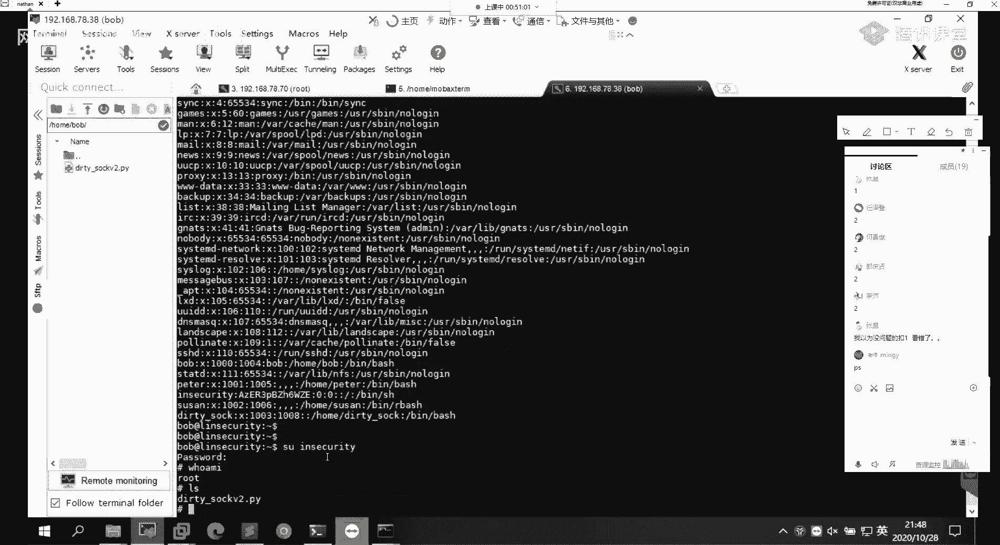

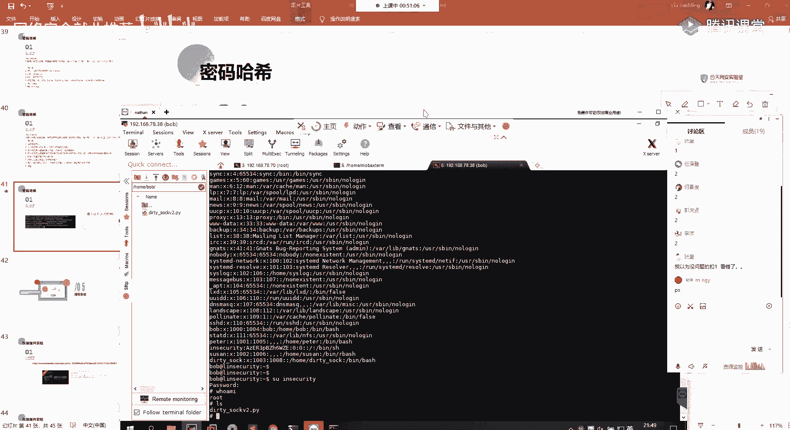

这是这就是通过这样子的一个呃，密码哈希的一个方法，就他那个密码哈希的话，它是存储在这样子的一个呃文件当中，然后其实呃我们在linux当中对吧，我们想要去添加这样子的一个，后门的一个账号对吧。

然后想得到一个root的一个用户，然后的话你牛这样子的一个，你可以去留这样子的，通过这样子的一个方法，就是给这一个普通用户，给一个ui d j i d为零，你就能够去得到这样子的一个root的一个账号。

呃以上的话就是我们本节课的一个所有内容呃，最后这边的话就是呃两个提前的一个实验，就包括这个呃暂留的一个提前实验，以及这一个无关图的一个，本地提权的一个实验啊，给大家做一个课后作业。

以及啊还有的话就是啊同样的ppt上面的内容啊，大家自己动手去做一下，然后呃就扣住的话就是两个嘛，就是这两个实验以及ppt的一个内容。

大家自己动手去操作好吧。

然而大家有没有什么疑问，呃今天的话今天的话呃，因为喉咙确实有点难受啊，以及有点咳嗽，就我个人感觉今天确实没讲好，就大家就我自己都讲的有点难，我自己都觉得讲的不是很好啊。

今天这边的话唉喉咙确实有点有点难受，讲话都有点就是卡着对吧，就是呃希望大家尽量好吧，这边的话说声抱歉吧，应该呃今天的内容的话，今天内容的话不是很多，我这个，我就是咳嗽而已，咳嗽而已。

去年去年这个时候也是好像也是，然后喉咙哑的话是哇确实这样子，连续给大家讲课有点顶不住啊，主要一讲没得填，一讲讲一两个小时，好呃，有问题的话在讨论区扣一，没问题的话扣二吧。

打的哦应该是没有问题的，然后pp话已经发给大家好吧，那么没没有问题的话，那么我们下课吧好吧。

