# 【B站最系统的网络安全教程】北大大佬196小时讲完的网安教程，全程干货无废话！学完即可就业，别在盲目自学了！！！ - P74：第43天：权限提升-Linux定时任务提权、SUDO权限滥用 - 网络安全就业推荐 - BV1Zu411s79i

扣个一，然后下次大家想那个就是等待时间，想听歌的话，就是你可以提前在群里说，好吧，就不玩啊，这位同学点了这首歌的话，因为时间关系就听不完了，好吧好啊，现在的话已经八点多钟了，应该就是能来的，应该都来了。

那么我们这次开始我们今天的一个课程内容，今天的话呃，同样的跟上节课给大家介绍的同样的内容，就是linux的一个系统提权，那本节课的话主要分为了四个部分，第一部分的话就是滥用的一个收录权限。

第二个的话就是linux的一个定时任务的一个提权，第三个是s u i d这个特殊权限的一个，提前提前，第四个的话就是其他的一些提前的一个呃实例，第一部分的话就是滥用的一个收do权限。

就我们前面在讲linux的时候对吧，呃以及前面再去呃，与提前与提权相关的，就是就是说在linux下面，我们一个普通用户的一个权限要去执行啊，比如说要去启动一个服务对吧，以及比如说你要去执行一个像啊。

if configure这种命令，如果说你是一个普通权限的话，它可能就是有限制你的一个执行，就是你没有权限，没有相应的一个权限，去执行这样的一个命令对吧，所以说我们通常的话在linux系统下面的话。

通常会用这样子的一个so do命令对吧，这个命令的话大家应该都熟悉，就是呃经常呃玩linux的话对吧，然后这边呢这个so do的话，就是它是linux系统的一个管理的一个指令，主要的话它就是用来就是啊。

允许我们的一个系统管理员，让普通用户去执行一些，或者是说全部都这样子的一个root root命令，它是一个啊工具，就我们可以简单直接的理解，就是它是一个linux下面的一个提取工具。

然而这个命令的话它的一个执行流程，就是大家可能就呃就是经常用这个对吧，但是你不知道它是它实际的一个流程是怎样的，是这边的话我们来一起了解一下，就我们执行这个收入命令的话，他会呃将当前的一个用户。

它会转换成一个root的一个用户，然后的话以root的一个身份去执行一个命令，然后执行这个命令之后的话呃，他就会直接退回到当前的一个用户，也就是它有这样子的一个过程，就是比如说我去执行一个收入。

我之前一个收队要去骑一个service对吧，我提起一个这个service，我一个普通用户的话，我是无法去启动这样子的一个服务的，那么我们在这个时候的话，我们尝试使用收do这一个命令对吧。

然后他在呃执行这个命令的时候的话，他就会把我当前的就说，如果你当前，这，当然前提是你当前这个用户有权限，去执行这样子的一个收入啊，好的话，你当前的这个普通户，你通过收入这个命令。

它会以一个root的用户来去进行一个执行，因为我们知道的话，root用户它是啊，linux系统下面的一个最高权限的一个用户是吧，那么他肯定是有权限去执行这样子的一个服务，的一个启动这个命令的对吧。

那么他呃用这个命令之后的话，他以root身份去执行执行这个服务，启动之后对吧，启动之后的话，它就会立马退回到当前的一个用户，所以说我们呃这这这边的这个收入命令的话，只是一个达到一个短暂提前的一个目的。

就是呃短暂的把我当前的一个用户提，提升到一个root的权限，然后去执行相应的命令，但是你执行完之后的话，你还是会回回到当前的一个用户，也就是回到一个普通的一个用户权限，然而要注意的一点的话。

就是你在执行收入的时候，就是输入的一个密码，就是你如果说你的这个用户，你是有权限去执行这样的一个so do命令的对吧，然后的话你执行这个收do命令之后的话，它会让你输入一个密码。

这个密码它就是你当前用户的一个密码，而不是root的密码呃，呃这个的话应该很好理解对吧，就是你你说你当你当前的一个用户权限，去执行这个命令，那么你肯定输的一个，就说你验证了一个密码的话。

肯定就是你当前用户的密码是吧，如果说你都知道root的密码的话，那你不就可以直接得到root的权限吗，对吧，然后呃还有的话就是这边有一个需要注意的，就是收do的一个配置文件，就我们的收入的话。

它有这样子的一个配置文件，就是这一个etc的一个收到这样子的一个文件，这个文件它的一个文件权限是0440，也就是说它是没有其他这种特殊权限，然后只有root用户以及root组，他才有权限去执行这样子啊。

去读取这个文件里面的一个内容，它是然后其他的一个普通用户以及啊，它是没有权限去啊读取以及写入的，我们这边的话。

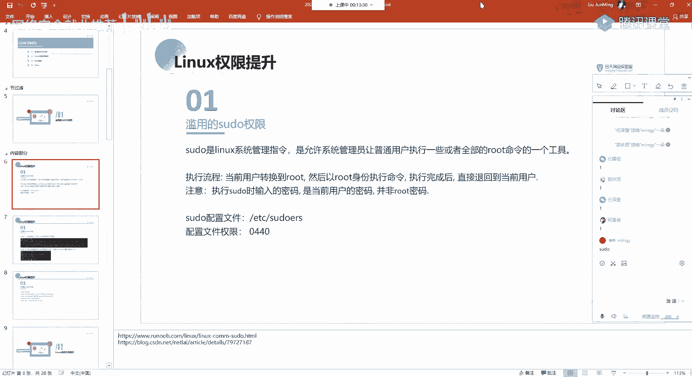

我们大家如果就是有在电脑前面操作的话。

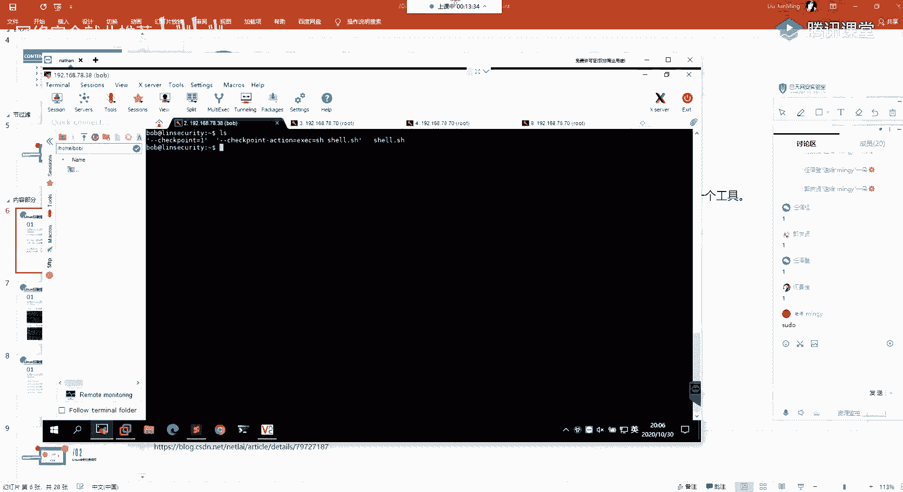

大家可以跟着我就是这样子来查看，就呃比如我这边的这个机器对吧。

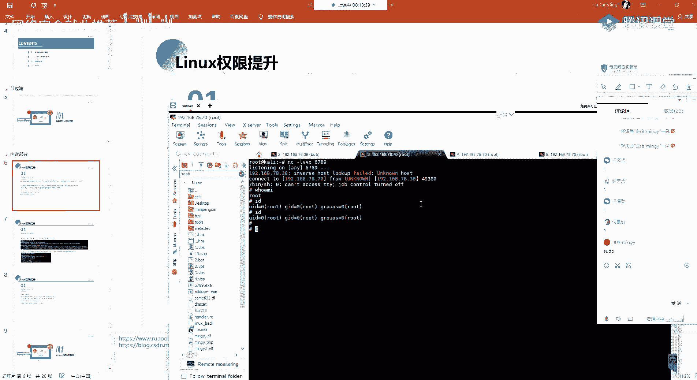

呃这边能看得清吗，应该能看得清吗，嗯我们可以啊，我们先来查看一下这个so ddos这个文件，它的一个权限，这个文件权限的话是这样子的，就是只有root用户以及note组的用户，他才有权限去读取这个文件。

然后你会发现，其实note用户，他这边也没有给一个写的一个群像是吧，但是因为note用户的话，你是一个系统的一个最高权限对吧，呃你虽然没有在这边没有写这样子的，一个写的一个权限。

但是我们可以通过像比如说vm，然后我这边pc，这个文件对吧，然后我在这边我进入这个文件，我修改之后的话，可以通过就是w q加一个干，就是强制保存，然后的话也是可以去做一个修改的，因为你是一个root用。

然后还有的话就是你要去修改的话，有这样子的vi so do的这样子的一个命令，我们呃可以通过这一个命令来去做一个修改，就同样的也是进入到这边，然后他在这边的话，就是呃你他这边使用的一个编辑器。

是那个narrow，应该能到，然后呃我我是我是不常用这个，我对这个编辑器的话不是很熟悉，然后我通常的话都是使用vm，然后在这边看，在这边的话就是你可以做一个编辑嘛，就跟我们平常的一个编辑器是一样的。

就你可以在这边去写入对吧，然后呃退出的话就是ctrl加x，然后n就通过这样子一个方法来去做一个修改，但是你如果说是你是一个普通用户的话，是没有任何权限，是没有任何权限去查看以及修改这个文件的。

因为在这个文件当中的话，我们可以来查看一下，在这个文件当中的话，它里面它是存的存的，存储的这样子的一个内容啊，就是我们这边的一个收入的这个，特权用户的一个信息，就说我们的一个普通用户对吧。

我们的一个普通用户，我们要想要去执行这样子的收do命令的话，你需要把你的这个用户，把它给添加到这个文件当中，然后可以在这边有看到，就是这边有一个root，就它这里面它默认的话是有这样子的两个对吧。

有这样子的一个root root用户，然后的话or等于or等于or，然后or对吧，这边全是or全是all的话，就代代表就是说这一个用户它是有啊，有完全的一个权限，就是有一个完全的一个root用户的权限。

也就是因为它本我这边的话，本来就是一个root用户嘛，所以的话我可以有完整的一个权限去啊，用so do对吧，然后这边的话就是s这边有一个百分号，然后收入的话这个的话就是表示收度组。

就这个的话就表示主这边是表示用户，然后这边呢这一个收do组的话，它同样的也有就是呃有note的一个权限，就我们可以通过收do来得到root的一个，完整的一个权限对吧。

那么我们想要去就是呃想要得到一个root的权限，你也可以把你的一个用户，把它给添加到这样子的一个收入，主动收入组在这个so do的一个组当中，然后的话你同样的也能够去得到这样子。

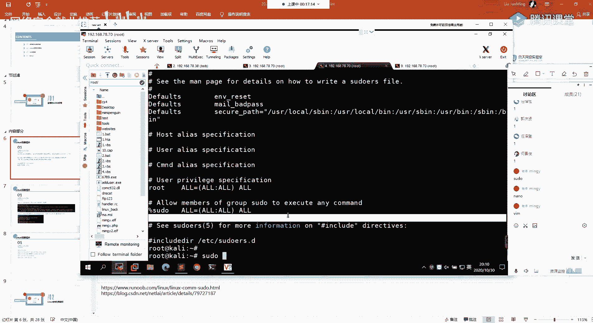

一个root的一个群像，就是啊sodas这个文件，然后呃关于这个文件的话，关于这个文件更详细的这样子的一个呃介绍啊，大家可以看一下这篇文章，我放在这个预习内容当中了，就这一个sodas的一个文件。

这这篇文章的话详细的介绍的，就是这个sodows文件，它的一个就是它的一个，它的一个配置的一个组成，就像比如说在这边对吧，就默认的话它这里的话它会有这样子的几行呃。

还有的话可能还会有这样子的一个admin的，这样子的一个组，就是表示的话就是这个admin组的一个用户，同样的有所有的一个权限，然后呃他这边的话呃，我这边就大概的给大家介绍一下，好吧，就是来理解一下嗯。

其实详细的话大家看这一篇文章吧好吧，我这边的话就以他这边给的几个例子，给大家介绍，然后在这边他有详细的介绍，就是说有这样子的一个公式对吧，就是首先的话这边的话授权用户还有主对吧。

也就是我们这边比如说root这个用户，或者说你是一个其他的一个普通用户，像比如说一个看你用户对吧，然后主机主机的话，这边这边对应的就or or的话，就是表示所有的一个主机。

就是呃你任何的这样子的一个主机，你都你去登录，你去用这一个用户的话，你都有都能够去得到这样子的一个，就是对应的这样子的一个权限，然后后面这边的话就是切换到哪些用户或组。

就是这边的话all的话就是表示所有的，也就是它可以通过收do这个命令，去切换其他的所有的一个用户，以及你可以就是指定某一个用户，像比如说指定一个root用户对吧，就在这边指定一个root用户。

然后要注意的话要在括号当中，好像这边的话就是or的话，就是所有的一个用户嘛，all的话就是所有的一个组，就是用户，还有组通过这样子的一个形式，然后呃其实也可以省略就省略，就是在这边只加一个or的话。

就是表示所有的嘛对吧，然后的话要注意要加括号，然后还有的话就是呃是否要输入密码验证，像我们呃如果说不加这样子的一个no password，这个字段，就这一个字段，那么你再去啊用so do。

就说你当前的这，比如说这边的一个lucy这个用户对吧，你通过收do你切换到note的一个用户的话，你用搜你用收队去执行相应的一个命令的话，像我们正常的话，如果不加这个，我们执行收队，我们需要去输入。

当前的一个用户的一个密码对吧，那么你如果有这样子的一个字段的话，那么你去只通过收入去执行啊，相应的一个命令的话，你可以不用输当前用户的一个密码，也就是说你不需要知道当前用户的一个密码啊。

就像我们前面的话，我们要执行收购的话，我们需要输入当前的一个用户密码对吧，所以的话你想要你虽然你得到了这个用户，你你得到这个用户的权限，你而且这个用户有权限去执行这个收入对吧。

但是的话如果你不知道它的一个，当前用户的密码的话，你同样的就是呃，不能够暂时不能够临时的去获得这样子的一个，root的一个权限，然后后面这边它是接我们之前的一个命令，也就是说它限定了在这边呃。

如果说是all的话，就是表示所有嘛，就是所有的命令，你都可以去通过收do来去提前对吧，那么你在这边限定了相应的一个命令的话，也就是像以这边的这个为例，就是这个lucy这个用户他执行收入的话。

他可以不输入，不输入当前的一个用户密码对吧，然后我要去通过执行这一个user a的，也就是他不输入当前密码的话，它只作用于这一个usa的这个命令，而且是只只有执行这个usa的这个命令的话，你才能够啊。

就是说你才有权限去执行，你才能够通过so do来去执行这个u za的，来去得到一个，就是以note的一个权限去执行这个命令，来去听一下用户对吧，而且不需要去输入密码。

然后其他的一个命令的话就是没有权限去执行，就这个意思呃，然后还有这边要注意的话，就是像比如说这边的这边的这个例子的话，就是这个no password，它只作用只作用于第一个命令，然后后面的这个命令的话。

就是它同样的也需要去输入密码，也就是你只有在执行用收do去执行这个children，来去更改我们的一个权限的时候对吧，就执行这个命令的时候，你可以不输入密密码，然后你后面的这些命令的话。

它同样的需要输入密码，以及的话就是多个命令之间的话，用这样子的一个逗号做一个分隔呃，关于更多的话呃，其实主要大家要了解的话，就是我上面讲的这些对吧，然后你想要去了解更多的话。

你从头到尾看一下这篇他的这样子的一篇文章，好吧，应该能大家应该能理解吧，我刚刚讲的那些能大家你能理解吗，好的能理解是吧，那么我们继续，嗯下面的话就是两个命令，就给大家介绍这两个命令。

就是我们呃我们如何去进行一个查看，查看自己当前用户的，就是能够去用收do这个命令，去进行一个提前的这样子的一些命令，首先第一个就是这个so do gul，就显示出自己的一个权限，注意的话。

这边的一个权限的话就是刑诉，是自己当前用户能够去通过收do这个命令，去执行的这样子的一些命令呃，其实啊可能只用收do这个命令来说，可能大家不是很那个就是啊，通过收do这个提成工具对吧。

这样这样说应该应该会更好理解一点对吧，就是通过收do这个工具来去执行啊，这样子的一些命令，你才能够呃就是说你不好意思啊，我这边突然卡了一下，就是我这边执行收do gl对吧。

然后的话他在这边有显示出这样子的一些命令，对吧，这些命令的话就是说你你可以有权限，你可以去使用so do这样子的一个工具，来去执行这样子的一些命令，然后这些命令的话呃。

我们可以通过我们能够以一个root的权限去执行，然后so do杠s的话就是执行环境变数中的shell，所指定的一个shell，或者是etc password里面所指定的这样子的一个系。

就我们呃so do杠s，就我当前用户的话，我当前用户的话呃。

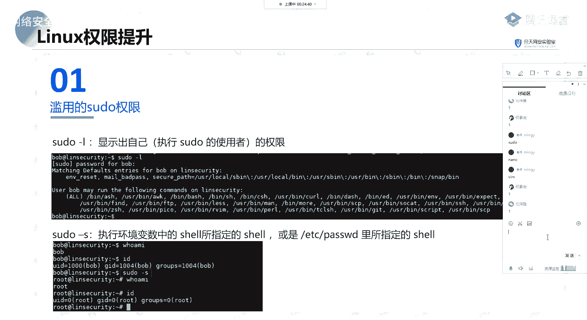

就是，能看实际的例子吧，嗯我们先看一下他说word这个文件对吧，然后这个文件里面的话，就存储着当当前所有用户的这样子的，一些信息嘛对吧，然后最这边的话有这样子的一个字段，就是最在最后有这样子的一个啊。

需要环境变量的这样子的一个字段，在这边，也就是像比如说我这边的这个卡里，用户的话，你的这样子这个shell的一个变数的话，就是这个bbh对吧，然后的话你在当前的话，你啊通过就是你远程登录。

你远程登录这个用户的话，你得到这个shell的话。

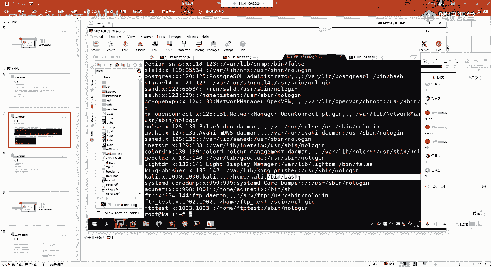

就是这个bh的一个shell，然后在这边的话就是我们通过so do杠s，因为我们知道so do的话，它是以root的一个权限去执行对。

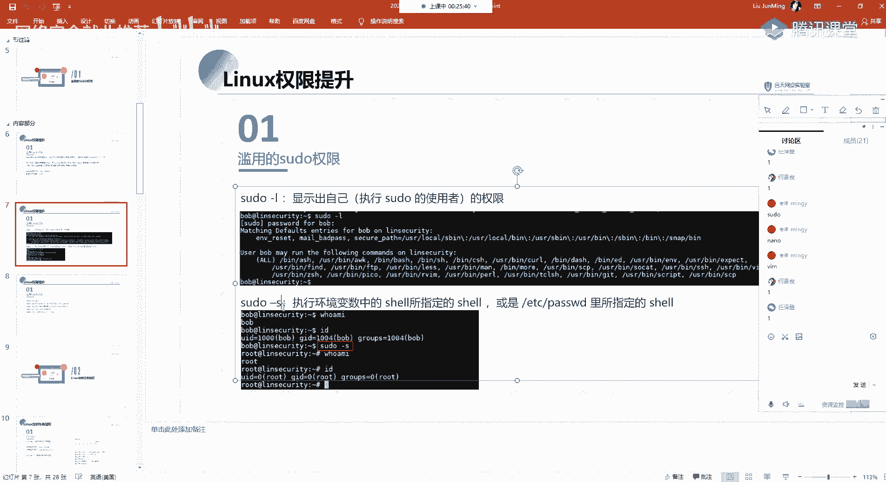

那么在这边的话呃，就是对应的我收do杠s的话，就是表示的就是我这边以一个note的一个权限，去指定，去执行，我们这边的一个啊root的所对应的，这样子的一个小就是这一个bh对吧，比如说我这边一个意思。

我先进入s h不对哦，搜对干s对吧，我这边的话就进入到了一个bh，对我当前的话就是一个b，因为root的话，他在这边他呃默认的它指定的这样子的一个shell，的一个变量的话，就是这个shell环境的话。

是这个bbh，然后呃收do gl的话，就是查看当前的当前用户，能够以用收do这个工具去执行的，这样子的一些命令，so do gul啊，我当前是一个root用户，所以的话他这边表示的是沃尔沃。

就是我们在那个sodas文件当中所配置的。

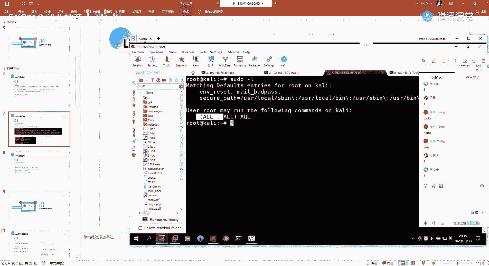

这样子的一个权限对吧，然而我们我在这边的话，我以这样子的一个这个靶机为例，就这边的这个靶机的话，我当前我通过执行这个速度干扰他，这边的话，需要我们输入这个bob的一个用户名啊密码。

然后我这边输入密码之后的话，我在这边就能够去查看到当前的这个报表，用户能够去用收录这个工具所执行的一个命令，也就是能够以note用户去执行的，这样子的一些命令，就在这边的话也列出来了。

然后其实这边的他所列出来的这样子的一些，所列出来的这样子的一些命令，我们在这个他的这样子的一个缩短时的，在他的呃这一个soldiers是文件当中，我们能够去查看到呃，我们来呃一我们啊。

我带大家一起来看一下它的，这边的这个solo是文件它的一个组成啊，首先的话就是呃，他在这边的话有这样子的这么几条对吧，第一条的话就是这个root，这个root的话就是呃我们默认的话就有的对吧。

然后在这边的话它有这样子的两条，这两条的话就是它添加了两个普通用户，然后peter首先电话首先的话就是这个peter用户，peter用户的话它的一个它的一个特点的话。

就是在这边有一个no password对吧，就我们前面说的，就是说他peter再去执行这边的这个命令，这边的这一个命令的话，它其实是对应的这个表，在这边就他这边加了这样子，这个alex也就是别名吧。

也就是他在去执行这一个命令，只是这边的话，它其实就是指指定的这边的这个命令，就是这个user变trast，这个确实命令它就是一个呃路由跟踪的，就是跟踪进程的通信的这样子的一个命令。

然后呃他在这peter这个用户再去执行这个chess，chest命令的时候，他是不需要输入当前用户的一个密码的，然后bob的用户的话，就是他这边的话。

他指定了这边的一个或者what the sense对吧，然后这边或者sense的话，它同样的就是对应的这边，对应的这边他给了这样子的一个值，然后这边的这一串的话就是说它限制了它，限制了这边这个报表。

用户能够通过收购这个工具来去执行，这边的这些命令，然后其实就是对应的在这边所显示的。

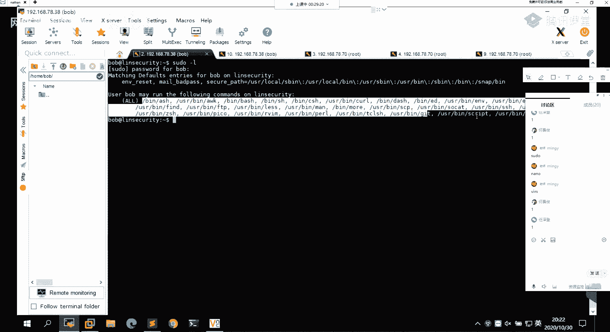

就是啊这两个，好呃下面的话我们来就是介绍一下。

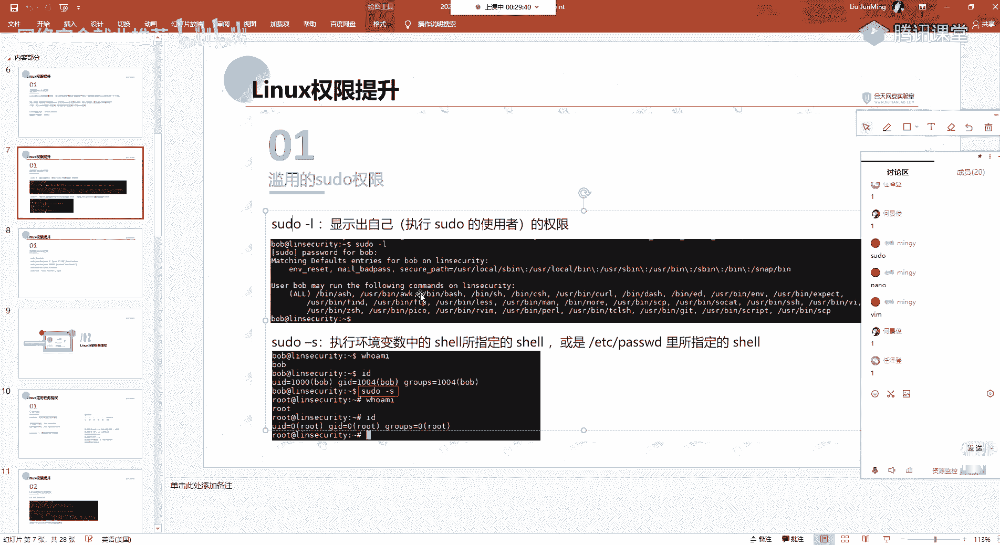

就是说我们通过这个收入感啊对吧，我查看到了当前的这一个用户，它能够与root用户去执行这样子的一些命令对吧，那么我知道这些东西有什么用呢对吧，我当前的一个普通用户，用收据来去执行对应的这些命令。

那么我们因为我们最终的一个目的的话，我们是要去进行一个提前的，就是我们的本节课的一个主要内容，就是去进行一个题全对吧，那么我们通过这样子的一个收do，我们能够去临时的得到一个root的一个权限。

以及我们再去执行这些命令的时候，能够去临时的得到root的权限对吧，那么我们如何去利用这样子的一些呃，他在这边所配置的这样子的一些命令。

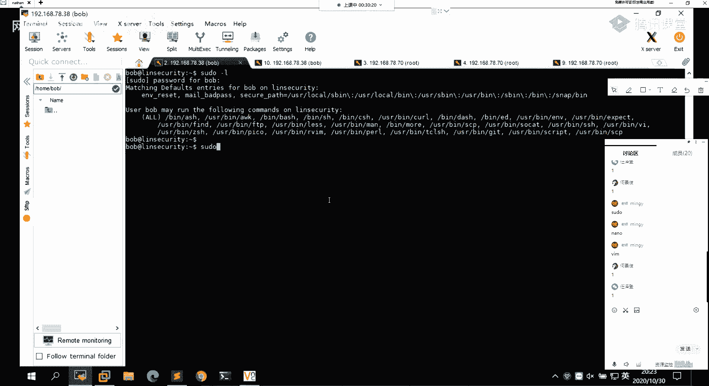

来去进行一个齐全的，然后讲到这边的话呃。

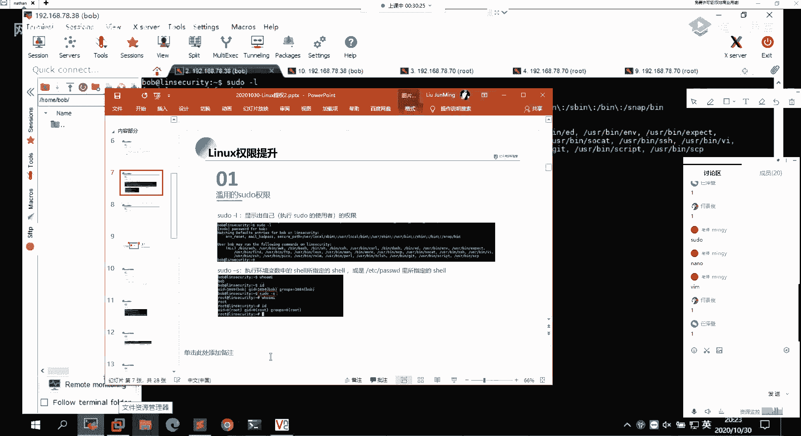

就是先带大家来看一下这边的这个项目。

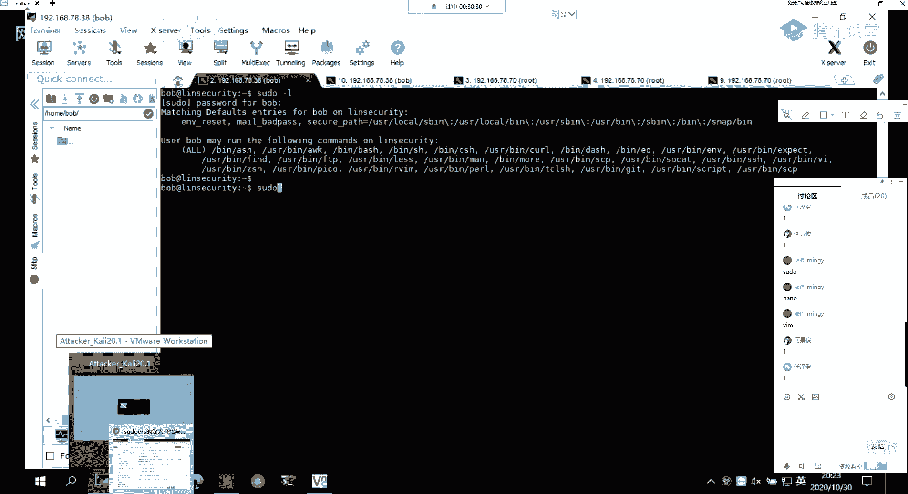

我这边的话放在了这个啊预习内容当中，就这个。

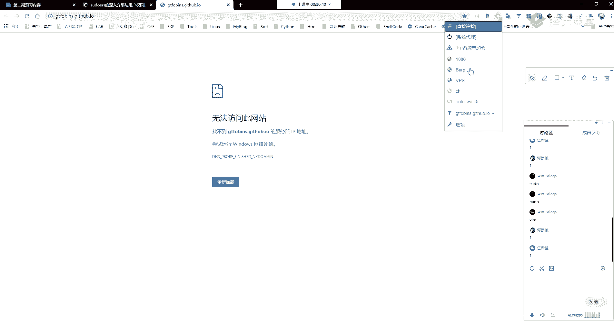

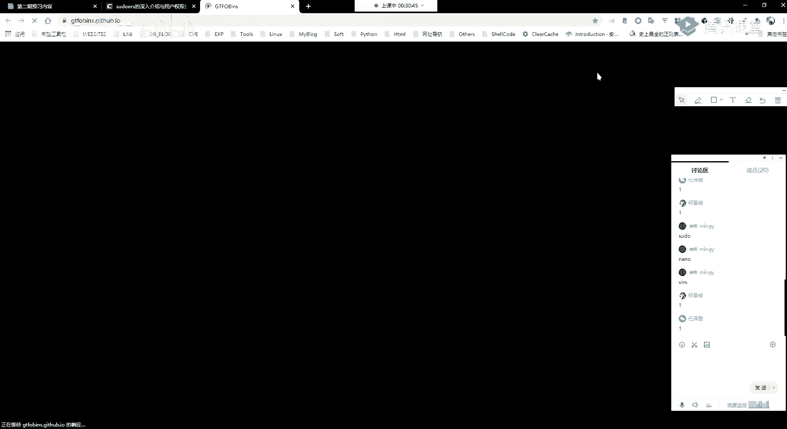

就这个gtfo bs这样子的一个项目，这个项目的话它是嗯这里翻译一下吧，这个项目的话它是一个呃，unix下面的一个二进制的一个列表，然后的话它主要的一个作用，就是。

我们可以利用它来去绕过本地的一个安全限制，也就是这边呢在他这边，他所收集的这样子的一些二进制的一些命令，它有对应的这样子的一些功能，我们可以去进行一个利用，然后呃他在这边的话。

就说他收集了这样子的一些就耽误当系统，他再去滥用这样子的一些呃，二进制的一些程序的时候，我们可以利用它来去进行一个啊，权限的一个提升，也就是突破我们的一个壳，这边的壳的话翻译的意思就是吸氧。

就是突破当前需要的一个限制，也是能够啊，进行一个由普通权限去提升到一个高权限的，一个目的，以及可以去传输文件，还有对应的反弹shell等等的这样子的一些作用，然后在这边的话呃，这边先不翻译了。

在这边的话有列举了这样子的，这么多的一些命令，然后这一些命令的话，我们可以在这边去一一的去查看啊，像比如说这个a s h对吧，然后这边的话它就有列出了关于这一个a s h。

这个二进制程序的这样子的一些作用，首先第一个位置需要shell的话，就是他这边可以用它来去得到这样子的一个shell，绘画嗯，翻译一下吧，能够得到这样子的一个程序系统的一个外壳。

也就是我们的一个shell嗯，我们在这边直接执行一个a s h的话，就能够去得到。

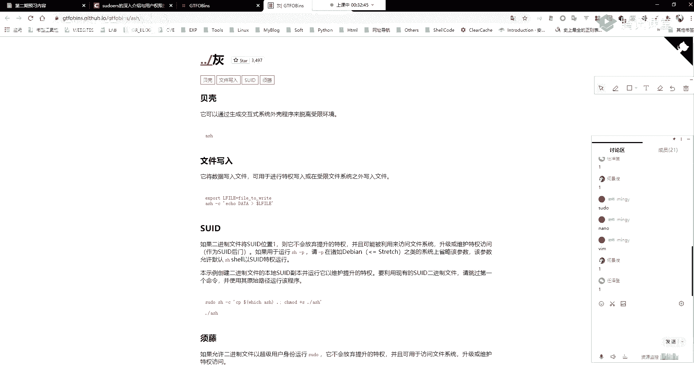

我们来尝试一下，比如说我在这边对吧，我在这边我去执行这个s h对吧，我这边他就得到了这样子的一个小，就得到这样子的一个s h的一个像是。

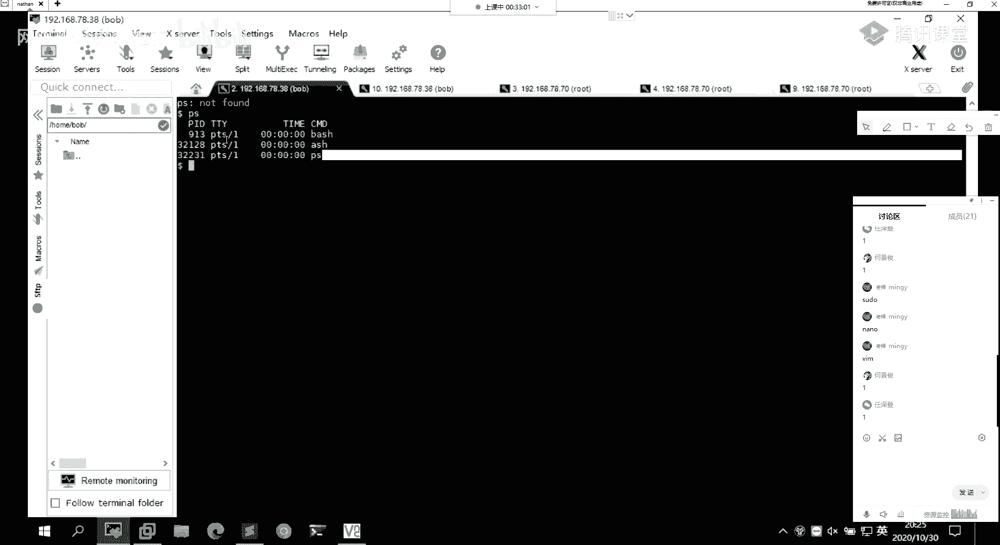

好的话，还有就是它有文件写入的一个功能，就是我们可以通过s h来去写入文件，就像在这边的话，就是呃他首先的话加了这样子的一个变量，这个变量的话就是你要去写入的这个文件，然后的话你在a s h。

然后其实就是写的就是通过echo这一个命令，来去写了这样子的一个数据，把它写入到这样子的一个文件当中，这边的话就是添加这样子的一个变量，啊其实像这整个的这一句意思的话，就是我们s h的话。

杠c的话就是呃我们直线a s h呢，它会进入到一个shell对吧，然后在这个shell下面执行这边的这个命令，这边的这个变化就是echo，就是把我们这边的一个数据，把它从电线到了这个文件当中对吧。

这个大于号的话，就是我们的一个输入重定向嘛对吧，前面已经讲过了，以及还有so seid，也就是这边的这个，如果说这边的这个s h这个二进制程序对吧，它有一个s l o i d的一个权限。

那么我们就可以利用它来去进行一个呃提权，就我们其实前面也有有有说对吧，就如果说你你是一个s ud的一个呃权限的话，你一个普通用户去执行这样子的一个权限，执行这样子的一个程序对吧。

他会继承他的一个这个文件的一个所有者，就这一个文件所有者的话呃一般的话是root对吧，那么你以普通用户去执行这样子的一个u，s l a d的这个程序的话，我们就能够去得到一个啊。

root用户的这样子的一个外壳，就这样子的一个shell是吧，以及还有就是收do，就我们如果说你有so do的这样子的，一个权限对吧，你可以通过so do，来得到这样子的一个s h的一个系。

那我们收对话就是一个root的一个权限嘛，等于就是说我们一个note的一个权限，去执行了一个s h，然后的话就得到了一个root的一个啊，需要我这句话就以这个为例子，就给大家大概的介绍了一下呃。

他这边的这样子的一些组成的，以及就是呃就大家看不懂英文的话，就是翻译一下嘛是吧，以及就是大家碰到一些错误啊，就是大家再去啊执行一些命令啊，以及去安装软件对吧，有碰到这样子这些错误。

像一般的话在进行审面的话，都是用的英文的是吧，然后的话这些英文的话，其实这些报错的一些信息，其实你的一些解决方法，那就包含在了他的一些报错信息当中是吧，然后如果你看不懂英文的话，你就把它抠出来嘛。

然后翻译一下嘛，翻一下之后的话，你至少能够去大概的知道它是什么意思对吧，然后的话你就能够去进行一个尝试了，就是啊提一下，就是大家大家去解决这样子的一些，方法的一个思路啊，也其实也是一个就是解决自己问题。

以及去自己去学习，相应的这样子的一些知识的一个思路啊，就大家养成这样子的一个习惯，然后在这边的话，就是呃他这边有列举了很多的这样子的一些，million啊，他在这边有这样子的一些标签。

像比如说shell shell的话，也就是像我们在这边就是这个share对吧，就等于就是说如果说他这个程序，它有这样子的一个标签的话，那么他可以去得到这样子的一个外壳。

也就是得到这样子的一个需要环境对吧，i i的话就是come on的话就是执行命令以及呃，revise的话就是反弹系等等的，还有s u i d，就是如果说这个程序，它有一个s u d的一个权限。

我们可以利用它来做什么，然后他在这边的话就已经懂详细的列出来了，就是它的一个使用方法是吧，像比如说它是有收do的一个权限，就我们可以用so do来去执行这边的这个，比如说这个sp对吧。

那么我们就可以通过这样的方法，速度加这一个s p n，然后的话执行这样子的一个e s e c，来去得到这样子的一个batch的一个shell，然后在这边得到了这个bish shell的话。

它其实是一个root的一个选，就是它是因为我们执行这个cp n的话，cp n的话它是一个root的一个循序执行的对吧，以及还有等等的，像在这边可以去防弹，谢尔他在这边的话就列举了这样子的一个实例。

我们可以直接去进行一个呃，可以直接呃去进行一个使用，然后在这边的话呃，为什么要去给大家介绍这一个呢，就是我们结合我们在这边通过收do gul，所收集到的这样子的一些信息，就是我们在这边搜都改啊对吧。

我在这边的话就有这么多这一些可执行，呃就是我这边对吧，我通过收do干扰这个命令执行之后，我在这边的话获取到了这样子的一些啊，命令的话，我是可以通过收do这个工具去进行一个呃。

用note的一个权限去执行的对吧，那么对应的这些成二进制的一些程序，我们怎么去进行一个利用对吧，你可能不是很清楚对吧，那么我们就可以把它抠出来对吧，我们放到这个项目当中来找到这样子的。

像比如说这个a s h，也就是我们刚刚我刚刚给大家介绍了，它的这样一些作用是吧，好在这里的话我们是so do，我们能够去用so do的一个权限去执行，对，那么对应的在这边的话就找到这边的一个收入。

我们有这样子的一个收入的一个群啊，能够去用收录这个工具去执行的话，我们如何去进一个利用，就这边我们可以通过收do加，这样子都要a s h，so do l加s h。

然后的话得到了这样子的一个i s h对吧，好在这边的话呃，我在这边的话就是呃提个问题，就我这边的话，我执行a s h对吧，我在这里的话能够去得到这样子的一个呃，shell的一个外壳对吧。

那么我当前执行的这个s h，然后我当前得到这个外壳呃，是什么样子的一个权限，又有谁能回答一下，能看得清吗，就我当前我这边执行一个s h对吧，然后的话我得到这样一个需要外壳。

我当前的这个权限的话是什么样子的一个权限，就是什么哪一个用户的权限是note用户，还是这个bb的一个用户，有知道的同学回答一下吗，知道的同学扣一，不知道的扣二，呃每一位同学知道吗，好吧，那我们继续看。

就我这边执行s h对吧，然后这边这个的话其实毫无疑问嘛是吧，我们执行贩卖我当前的话就是一个bob，因为我当前是一个bb的一个用户啊，我以一个bob用户的一个权限，去执行这个s h对吧。

那么我得到的对应得到的这样子的一个shell，不就是一个bob用户的一个shell嘛对吧，这个应该好理解吧，这这你能理解吗，就就跟这边就不就不就是跟我这边之前，s h对吧。

那我这边之前s h得到这样子的一个，小小的一个外壳，我当前的一个啊用户的一个权限是什么呢，现在知道了，那肯定是报表嘛对吧，因为我是一个报表的用户去执行的嘛，那么我现在用so do对吧，我这边我这边的话。

它是能够用收入去进行一个执行的对吧，那么我在这边通过so do来去执行这个s h，我当前这边得到了一个用户的一个权限，就我这边得到这个小小的一个外壳，的一个权限是什么，有同学能回答一下吗，root。

out嗯好的对了，那大家还是理解了是吧，没错就是root，就说我在这边的话，so do对吧，就是其实这边的话就是大家理解，收入这个工具啊，它的一个作用对吧，我在这边我也能够用收入去执行对吧。

然后的话收入的话它是能够去进行一个提前的，它是一个提前的一个工具，然后的话它会以一个root的一个权限，去执行这边的一个命令对吧，那么他在这边的话，以root的权限去执行这个s h的话。

那么我在这边得到这个小外壳，不就是root的权限吗对吧，也就是我通过这样子的一个方法，我就简单的进行了一个提取，就得到了一个root一个权限对吧，你会发现是不是很简单，就是说他这边的一个呃。

它它这边的一个漏洞，或者说是一个权限的一个配置的一个缺陷，就是说他在这边他配置的这样子的，用收入的这样子的一个权限，他给了这样子的一个s h，那么我们就可以用收do来去执行。

这样子的一个s h来得到一个note的一个权限，以及同理的话在后面后面在这边还有其他的，嗯还有其他的这样子的一些变量对吧，有这么多像我们常见的bin bash，bash的话，它同样的也是一个外壳嘛对吧。

那么我当前我之前半血的话，我得的还是一个bb嘛是吧，那么我它可以用收do来提权，那么我收do bh的话，我这边的话就得到了一个root对吧，以及还有就是啊s h。

还有cs i c s h等等的这样子的一些，就是希尔的这样子的一些呃，这些就是能够去得到需要外壳的这样子的一些，linux的二进制的一个程序，然后其实如果你不知道这样子的一些呃程序。

它的一个利用的一个方法对吧，我们就可以把它扣过来嘛，扣到这边来，我们以这个同样的以这个bh为例对吧，bh这边的话你会发现就有这么多的一些标签了，像法兰西尔对吧，以及shell的一个外壳啊。

对应的shell外壳的话，我直接执行bh，我就能够去得到这样的一个shell外壳，以及能够去反弹shell，反正cl的话这边的话就不用多说了吧对吧，前面已经花了很多的时间给大家介绍。

这个就呃重点的介绍了，就linux下面反弹需要的这个bh，下面的就通过这样子的一个方法对吧，以及还有就是呃像文件上传，文件下载等等这样子的一些，他在这边的话有列举了这样子的一些实力，大家自己去看好吧。

然后呃我们在这块主要就是看这个收do对吧，就我当前的话是收do嘛对吧，我能够用收do来去进行这样的一个操作，那么我的一个操作的一个方法就是收do。

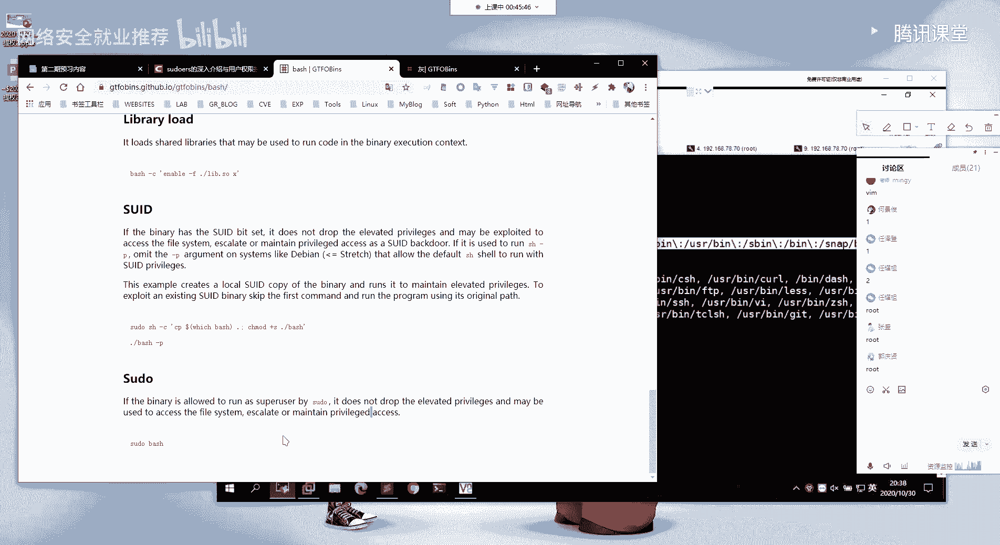

加这个bh我就能够去得到一个root的一个线。

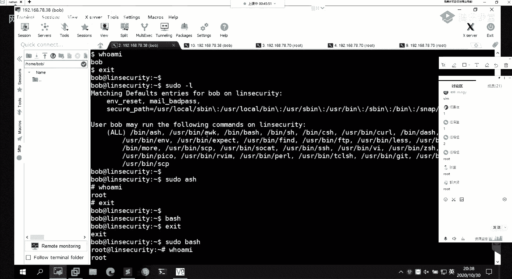

同理其他的也是一样的，好呃介绍了就是说介绍了这个so do gul，以及就结合我们这边的这个项目啊，第一个使用下面的话，我这边的话就以一些啊，实际的一个例子给大家来展示一下。

就是说我们如何去利用它的这样子的一些，滥用的这个收入的一个权限来去进行一个提权，首先第一块就是前面说的这个对吧，然后第二个话就是这个awk就在这边的话，这边可以看到这边他同样的有这个a的。

a w k的一个命令对吧，那么我们把它拖过来。

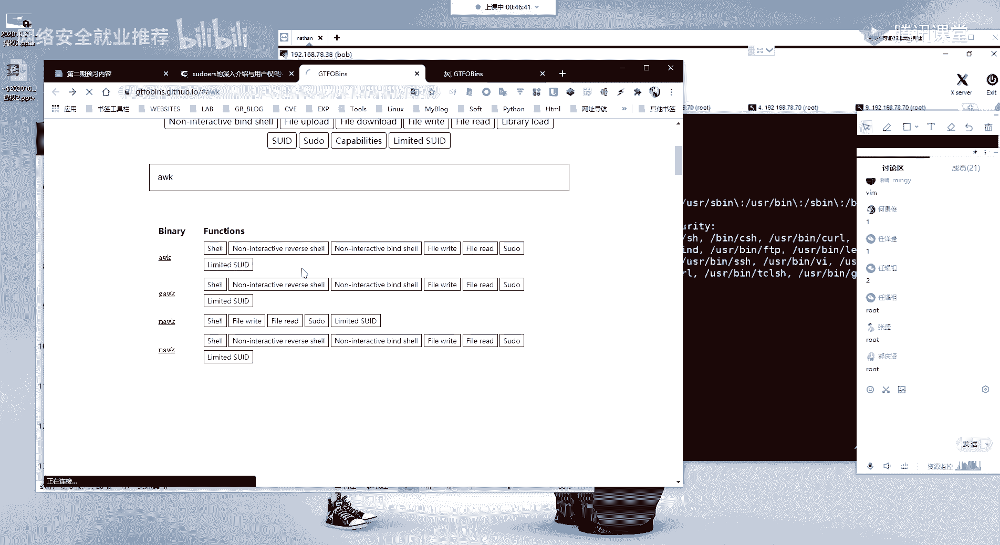

拖到这边来就是这个对吧，找到这一个so do so do。

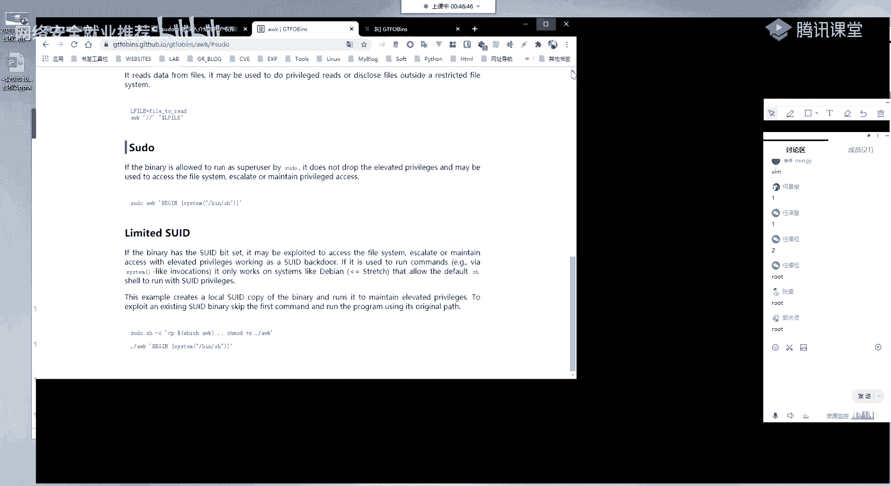

这边的话我们可以怎么去利用它呢，就这里这边他命令他命令都已经给出来了。

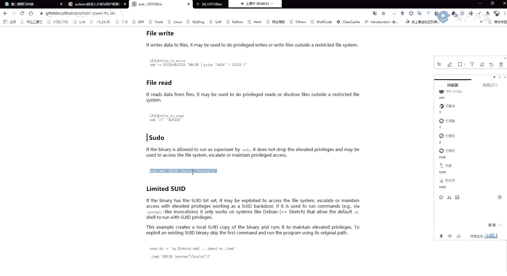

我们直接call过来，好的话，在这边来去进行一个执行，然而我通过执行这个命令之后，得到了这样子的一个shell的一个外壳对吧，然后我来查看一下当前的一个权限，就是一个root的权限。

然后这边的一个面的话，就是利用这个aw k的这样子的一个文本啊，文本的一个处理器啊，文本的一个处理工具处理命令，然后的话他这边的话是他的这样子的，相应的一个语法，然后其实主要就是在这边对吧。

他在这边的话，我们可以去通过调用这个system来去执行，在这样子的一个bbs，啊必须。

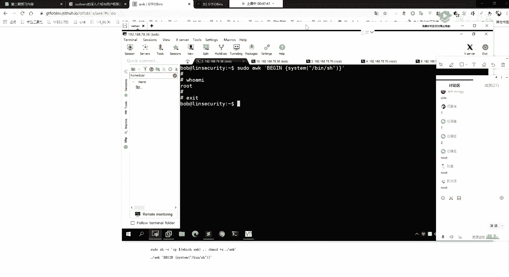

然后的话呃，呃这边还有一个例子，就是用这个aw。k来去进行一个啊，文件的一个读取，就读取文件，然后在这话就是以这样子的一个需要的，这个文件为例，就是我们正常的话，对我们正常的话。

普通用户是没有全新去只去去读取这个文件的，对吧，那么我们在这的话可以利用这个aw k l，我们在这边像这个awk，文件的firead就是文件的一个读取对吧，诶，他这边表示怎么跟我不一样呢。

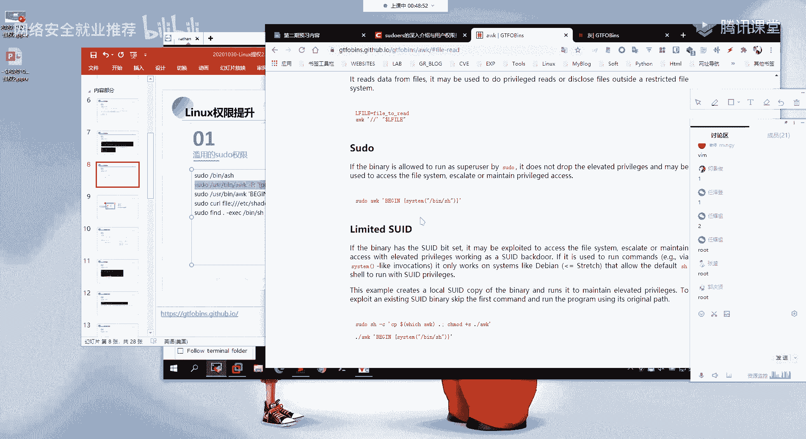

直接这样可以读吗，试一下，哦可以读啊。

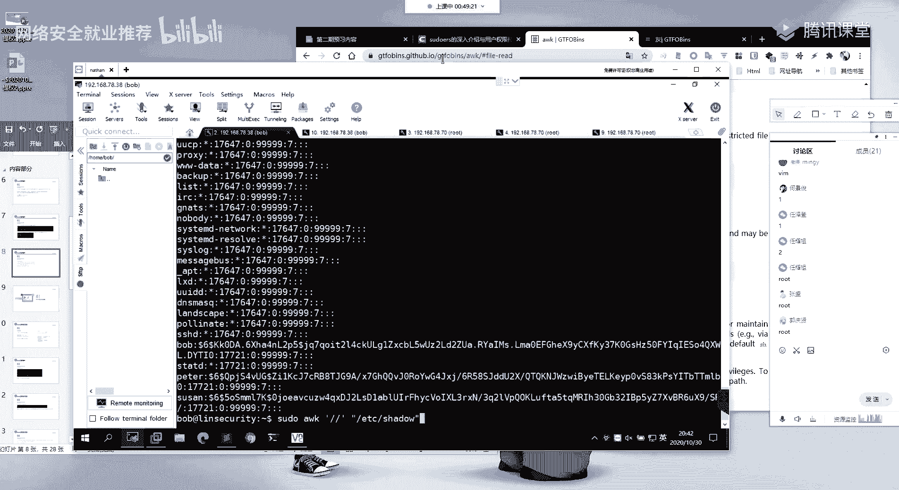

就直接通过这样子的一个方法就能够去读啊，这样子，然后呃我这边还是通过这这一个方法，就是同样的也是用aw k嘛，然后的话在这边的话，就是我这边只输出的就是print，输出第一列以及第2年。

然后的话这边的话指定这个文件，然后其实达到了一个效果的话，就是跟他在呃类似的。

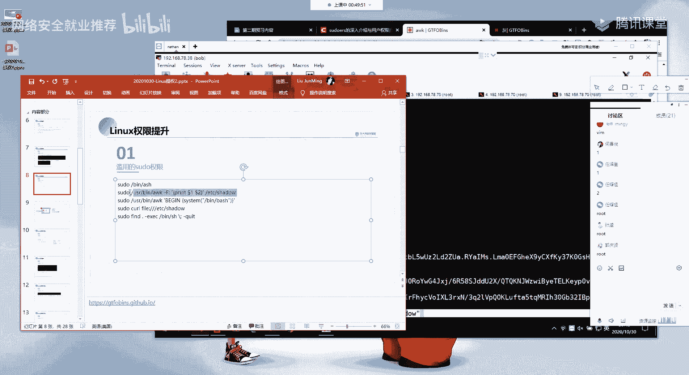

然后主要的话就是在这边，在这边的话我们执行一下，就是我只要那个用户以及密码是吧，我只列出。

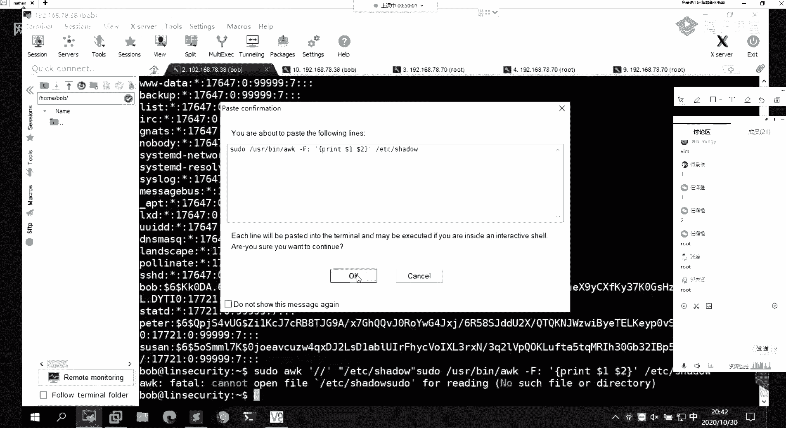

对吧，在这边我只出列出了第一列以及第二列，就第一列的话就是用户嘛对吧，第二列的话就是用户的一个哈希嘛，因为是在需要的是文件当中嘛对吧，然后我只要第一列以及第二列那个内容，然后现在这边的话就是他啊。

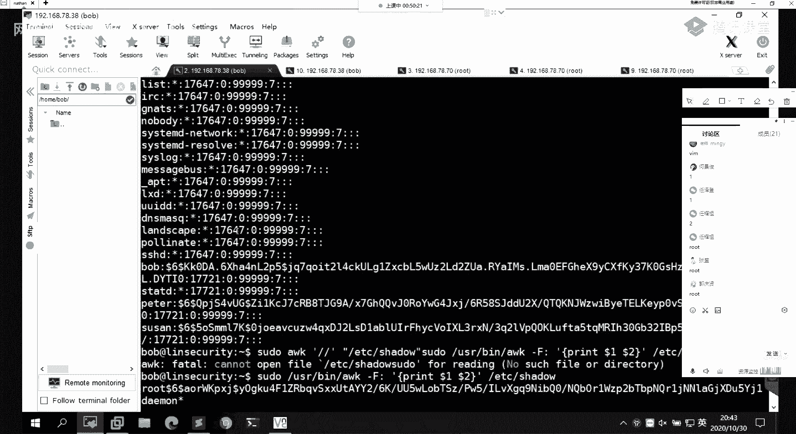

列出了这一个shell文件所有的一个内容，就是呃通过aw k的这样子的一个，文件的一个读取，以及还有就是文件的一个写入，这边的话我就不演示了，就是可以看这边对吧，然后呃还有的话就是cr c o r l。

就cl的话也是我们常用的暂定，下面就前面在讲那个文件传输的时候，我们可以通过cl来去进行一个文件的一个下载，对吧啊，呃同样的cl的话，它也能够去读取本地系统的这样子的一个文件，像比如说来看一下对吧。

首先的话就是一个文件的一个上传，我们可以通过这样子，就cl的话有这样子的一个pose的一个方法对吧，我们可以通过啊这个pose的方法来去，把我们的一个数据，把它给传递到指定的这样子的一个url当中对吧。

就给一个指定的一个网站，以及能够去进一个文件的一个读取，就读取我们的一个文件，通过杠小写的o，把就是下载了这个文件，保存到我们本地指定的一个目录是吧，还有文件的一个读取，文件读取的话。

在这里他就利用了这个file协议，就我们的这个法尔协议的话，就是用来读取我们本地的一个本地，文件系统的一个文件的，像比如说呃我们可以通过ucl干，对，就我通过这边的这个file协议。

能够去读取我本地的这样子的一个etc password，这样子的一个啊文件的一个内容，然后的话我尝试读取消的，然后在这的话可以看到就是不能够去打开这啊，这边写错了，这样的话是打不开这样子的一个文件对吧。

因为在这边的话它没有权限，是一个普通用户端，然后这句话，如果说这个cr，我们可以用收据来去进行一个执行的话，那么我是可以去读取本地的这样子的一个啊，这个root用户才能读取的一个文件的。

呃以及最后的就是我们常见的这样子，一个fd fd命令就放，等命令的话，我们我们前面有介绍，我们通过方案的命令能够去查找，就是说它是一个就紧锁我们文件系统，我们啊指定的这样子的一些文件的对吧。

就是用来去做文件的一个检索，以及查找的这样子的一个命令，然后在这边的话，我们可以通过这个方案的命令，来去进行一个提权，就是主要的话就是利用到它的这个杠e x e，杠e x e c来去执行这样的一个命令。

就是说他再去找到这样子的一个呃，找到这样子的一个，通过方案的命令去找到我们呃，文件系统当中的一个文件的时候对吧。

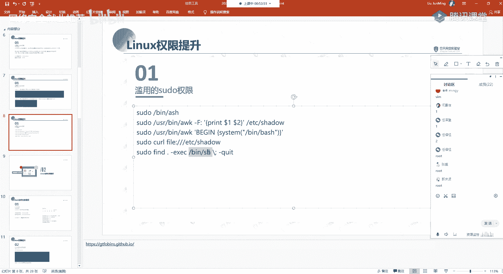

他会去执行这样子的一个命令，然后的话就会去得到这样子的一个线，我们来看一下，对，好吧，得到一个note一个选项，然后现在这句话主要的话就是用的这个干e x，e c的这样子的一个选项，呃。

这边的一个命令的一个意思的话就是我放的吗，放的点的话就是当前目录嘛，就是我从当前目录开始查找，然后的话找找的话就是呃我当前目录去查找，然后的话找到，然后的话加这一个选项的话。

就是他会去执行这边的一个bh，然后干q的话就是找到之后的话就退出啊，也就是我通过放的话，放着这样的一个查找，因为在这边的话，加目的话是他的一个命令的格式，所以的话你需要去加这样子的一个那个。

可以来查看一下这个。

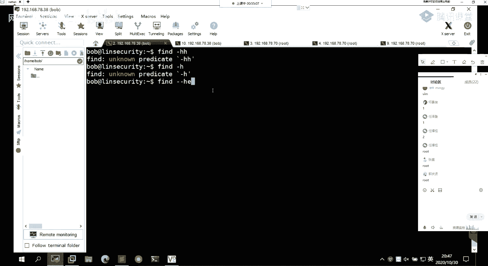

这个发展命令的一个选项就是，呃他这边的话。

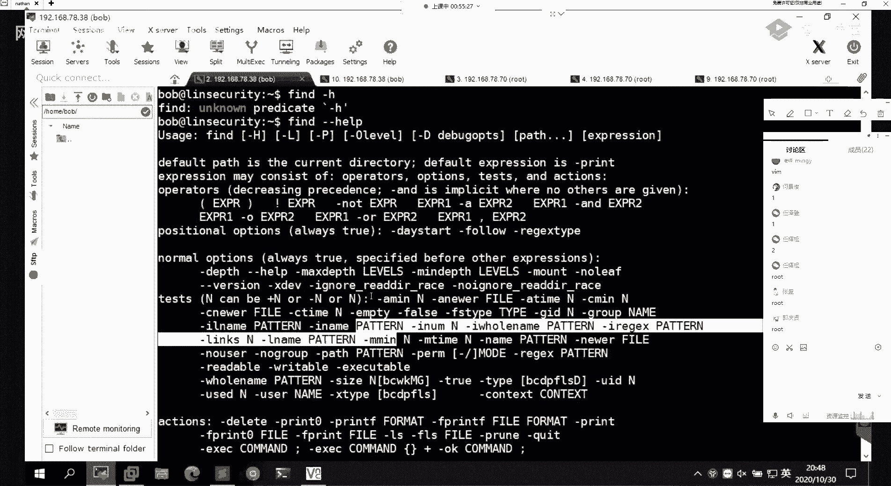

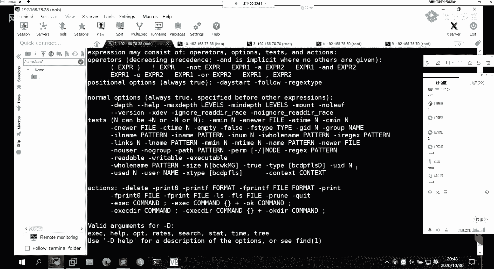

啊我这边不早了，就是就是在这一个刚刚e x，e c这个选项后面的话，我们可以去接我们的一个命令，就是他查找之后的话，我们可以去执行命令，然后的话如果他能够去用深度去进行一个，查找的话。

那么我就能够去得到这样子的一个root的一个小，以上的话就是呃关于这个收do的这个权限，的一个滥用，所导致的这样子的一个提前的，这样子的一个一些方法，呃大家能理解吗，就是第一部分的一个内容。

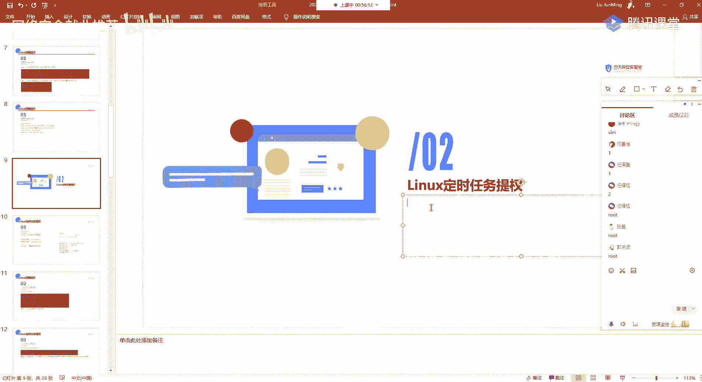

呃先休息两分钟吧。