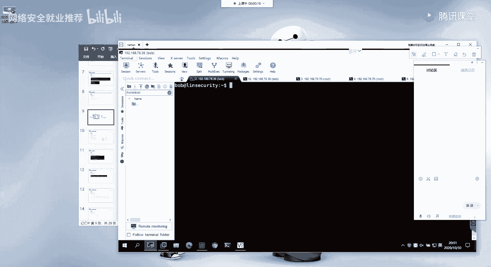
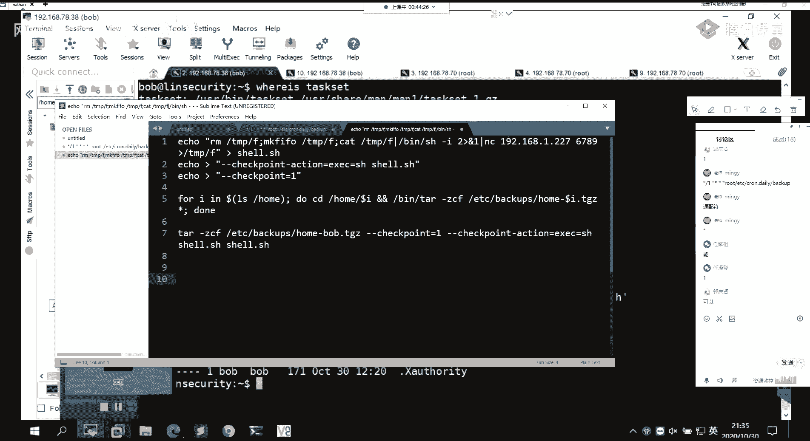
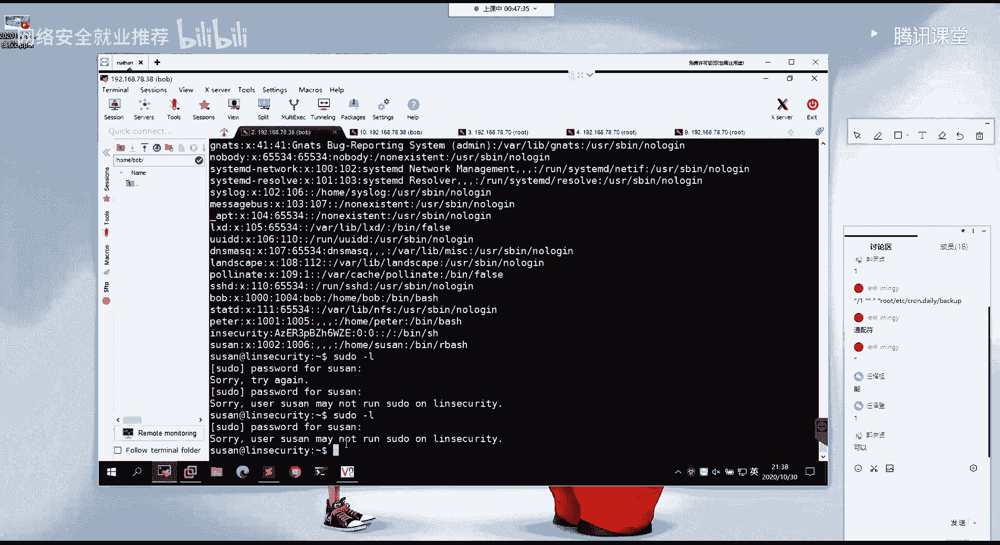

# 【B站最系统的网络安全教程】北大大佬196小时讲完的网安教程，全程干货无废话！学完即可就业，别在盲目自学了！！！ - P75：第44天：权限提升-SUID提权 - 网络安全就业推荐 - BV1Zu411s79i

好我们继续啊，呃大家关于第一部分的这个收do，滥用权限的一个提前的一些方法，大家能理解吗，理解的在讨论区扣个一，不理解的扣二，是是是有有有延迟吗，我我怎么感觉是不是有点延迟，我这边说完话。

然后大家总是要就是过一会才有回应啊，啊应该是没有问题的对吧，应该讲的讲的应该挺详细的，然后下面他就是第二部分的一个linux的一个，定时任务的一个提前呃，关于这个定时任务的话，就是在讲题群的时候。

我们先来大概的了解一下，就是什么是这个电池任务啊，就linux下面的一个定时任务，就这一个cortable，那前面在讲信息收集的时候对吧，有对这个定时任务的一个信息的一个收集对吧，然后嗯。

同样的我们想要去去利用他的这样的一个题型，对吧，我们同样的需要去对这样子这个定时任务，去进行一个新型的一个收集嘛，啊好，那么我们就需要去了解这个cortable，这个电池生物，它所对应的这样子的一些。

像比如说它系统的一个电池任务的一个文件，它是在哪对吧，以及用户的一个电池生物，它的一个文件在哪啊，我们需要去在这样子的一些目录下面，去查找到对应的一个定时任务的一个配置，然后这边的一个ktable的话。

就是linux下面的一个电视人物啊，就是它的一个守护进程，大家理解什么是电池任务吧，就定时任务的话，就相当于就是嗯相当于就是一个闹钟对吧，你定你每天早上定一个闹钟，八点钟的。

那么你每天每天早上的八点钟他就会去，他就会想对吧，那么就是每天他去想的这个时间是八点钟对吧，那么我们就可以去试，我们设置闹钟的话，就需要去设置时间以及设置它呃，到了这个时间之后的一个行为对吧。

也就是呃也就是闹铃嘛对吧，或者说设置播放什么样子的一个歌曲对吧，那么在这边的话，这边的一个ktb的一个电池的话，那么我们需要去设置啊，哪一个时间就是到了这个时间之后的话，去执行对应的一个命令对吧。

就是去执行这对应的一个任务嘛，然后在这边的话要去了解的话，就是这样子的两个目录啊，就系统的一个定时任务，是在这这样子的一个文件当中。

我们可以来看一下，像比如说在这边的话，我们可以通过c t来查看一下这个cotable，这个文件对吧，然后这边的话就是我们的一个系统，用户的这样子的一个定时任务，然后在这边的话我们可以看一下。

就是有这样子的一个电磁炉，就这个，然后在这边的话它的这个定时任务的话，就是像这样子的一个呃这样子的一行啊。

然后关于这一行的话，我们来理解一下，就是说他是他这样子。

他为什么是这样子写的对吧，他这样子写的一个作用是什么，就是大家看一下，这边就这边的一个空空table的这个定时任务，它的一个格式是这样子的，就是我们可以看到，我们可以看到对吧。

就在这的话它有这样子的一个新号，这边的这个新号的话，就是代表了就是有这样子的，123455个星号就代表了分时日月周，也就是每分钟每小时，或者说几分钟几小时，几天几月几周对吧。

然后command后面的话就是接mini，然后在这边他就是呃详细的对吧，就是第1年就是我们知道分钟的话，就是1~59分钟嘛对吧，好的话，每分钟的话可以用心来去表示，或者说用心干一。

这边的干一的话就是表示频率嘛，就是你每隔一分钟他会去执行这边的一个命令，如果你这边是二的话，那就是每隔两分钟对吧，然后还有就是小时日期等等这样子的一些呃，然后在这边的话这边实际的一个例子对吧。

我们来看一下，就在这里的话就是它会每隔一分钟，然后的话去执行这边的这一个命令，执行这边的这一个目录，下面的这个back up的这个命令对吧，然后在这边的话有这样子的，中间在这边跟前面稍微有点差别对吧。

就在这边有这样子的一个note这边的这个root的话，就是说它会以一个root的权限去执行，这边的这个命令，也就是说这个电池任务的话，它是一个note的一个权限去执行的。

呃呃如果说你想要以其他的一个用户，像比如说你想要，你想要一个普通的用户去执行这个程序的，那么你就可以通过这样这样子的一个方法，来去做一个设置，然后还有的话就是用户的一个电池的话，也就是呃我们的。

一些普通的用户对吧。

用户的一个电池，用户的话在这个下面on table啊。

不是，在这样子的一个目录下面，然后在这个目录下面的话，它会有这样子的一个，啊我这里没权限就行，啊我这边的话没有权限，就是说在这边的这一个目录下面，那个是怎样，啊不好意思，有人因为我在家家里这边讲课。

刚刚有人敲门，然后的话就是说在这边啊，这一个目的就是用户的一个电池的话，也就是他在这个目录下面的话，如果说你是bob用户，我这边的一个bob用户，我，我在bob用户下面有去创建这样子的一个。

定时任务的话，那么他会在这个目录下面，它会有一个以bob用户为名的，这样子的一个文件夹，然后的话在这个文件夹下面的话，就是写的记录着我们的一个定时的一个任务。

然后我们可以通过这样子的一个on table杠l，来去查看，当前用户下面的，是否有这样子的一个用电池的话，然后我们从这个文件夹这边也看到，他没有这样子一个bob的，而当前的一个boss用户的话。

它是没有没有设置电池任务的。

然后的话在这里的话，我们通过在系统的一个定时任务当中对吧，这个文件夹的这个文件当中，又找到了这样子的一个电磁炉对吧，而且它是一个note的一个用户去执行的一个，定时任务对吧，就这个。

那么我们如何去利用它呢。

啊首先的话我们需要去搞清楚，就说他执行了这样子的一个电池任务。

它是它是干嘛的对吧，我们可以啊，就是这个，我们可以呃cd到这个目录下面，然后的话它有这样子的一个，look up，还有一个这样子的一个back up的，这样子的一个文件对吧，好的话。

我们可以通过cat来查看一下它的一个文件内容，对吧，我们要了解清楚它执行的这一个程序，它是干嘛的对吧，我们才能够去说有方法，或者说找到方法去尝尝试去利用，对好，在这边的话我们查看它里面的一个内容。

它是一个这样子的一个bh的一个脚本对吧，然后这是它的一个脚本内容，他这边的一个脚本内容的话。

我们来分析一下，是这样子的对吧，然后这里的话前面的这部分就是一个for循环嘛，就是for i in对吧，这种的话应该大家应该都都都理解对吧，大家都是学计算机专业的话，这种的话应该很好理解。

就是一个for循环吧对吧，然后在这边的话，for循环这边音的话，就是说它会这里这里有一个n的这样子，一个变量，然后这边的话他括号里面的话是执行的，这个l s的这个后杠home对吧，然后其实这一部分的话。

其实就是啊这边l s干home执行的一个结果对吧。

我们来可在这边执行一下啊，scar home执行之后的一个结果，它就是有这样子的三个对吧，那么在这边的话就是它会把i这个变量对吧，它会把这边执行的这个结果它会分别的付给i。

这个值，也就是分别就是bob peter susan，然后的话挨着的话，i的值话就分别等于这三个嘛对吧。

它会它会付给他，然后的话但就是它是一个循环嘛对吧，他会做这样子的，就是当比如说i等于这个bob的时候，对i等于这个bob的时候，它会do对的话，就是cd到这样子的一个干home，就是把呃多了。

i也就是进入到这样子的啊，比如说我当前的话是得了是一个bug对吧，那么这边i这边的话就等于抱抱吧，然后在这边的话就执行了，cd到这个bob这个目录下面对吧，然后的话执行了这样子的一个命令，就是变态的话。

就是在闭幕下面找到这个tag程序对吧，他的话就是我们的一个压缩的一个程序嘛，解压缩的一个就压缩啊，我们的这样子的一个压缩包的这样子一个命令，然后呃在这边他就是呃压缩了这样子的一个。

这一部分对这一部分的话，就是说他通过他这个命令把这边当前目录，然后注意的话这边当前目录是在这里啊，就我们先cd到了这个bob这个目录下面对吧，然后cd到这个bob下面目录下面之后的话。

这边用了一个通配符星，关于通配符的话，这边大家大家了解吗，就理解吗，通配符，像我们这边的一个新就是我们linux linux上面的话，通常会常用的这样子的一个新的一个通配符。

对吧，大家了解吗啊不了解的话。

我这边有一个例子来看一下是吧，就比如说我这边，我这边对啊。

比如说我这边我这边的话，当前有这么多的一些文件对吧，有这么多的一些文件，然后的话我想要去把这边所有的这些文件呃。

或者是说把这边以v b s结尾的，这样子的一些文件对吧，你这边以顶v b s结尾的这样子的一些文件，把它给copy到这样子的一个啊temp目录下面对吧，那么我的一个命令的话通常是怎样的对吧。

就是cp新嘛，然后点这样子这个vbs，然后到cap目录下面对吧，好我们可以在这个探索目录下面看一下，就是多了这样子的一个1234，这四个vbs的一个文件对吧，那么这个命令它是怎么去找到。

这样子的四个文件呢，就是利用的这样子的一个新的一个通配符，这边通配符的一个意思的话，它就是会有这样子的一个就是模糊查询，就是他会去我当前的话在这个目录对吧，当前这个目录下面的话有这样子的一些文件。

这些文件的话我这边新点vbs，就是新的话，他首先他会去找到这样子的一个点v bs嘛，呃，就是以点ub s结尾的这样子的一个文件，然后的话新这边的话他不管就是不管前面。

不管点vbs前面它是什么样子的一个内容，只要它是以点vbs结尾的这样子的一个文件，那么它都会去执行，它都会copy到这样的一个探路，然后其实它是这样子的一个过程，就是我这个通配符。

我cp他首先会找这个文件检索这个文件，看它是不是符合我这边的对吧，就是它是以顶一边时结尾的，他不是对吧，然后找第二个这个二等于b s，然后它是一个等于b s结尾的，然后前面的这一个它是二。

然后这一部分我们不用管，因为它是就是呃模糊查询嘛对吧，它不，它不是像我们的一个精确的去找到某一个文件，然后他会去一的去进行一个检索，然后的话匹配这边以点vbs结尾的，这样子的一个文件。

然后的话他会去分别的去执行copy这个命令，把它复制到这个tap目录下面，现在应该能理解吧对吧，以及我们以及我们就是我想要copy当前所有目录，下面的一个文件到这个tab目录对吧。

我我的一个面积就是像这样子嘛，cp新是吧，而我不可能说我不可能说我一个一个文件的去，就是我一个一个文件，像比如说cp 10点cp，然后到temp，然后的话下一个文件的话就是2。1b s。

这样这样子去copy对吧，这样子的话就是呃，没有任何效率的一个方法对吧，我们通常会用这个通配符星，然后在这边的话，他就会去把单节目下面所有的一个文件，它都会去紧锁，解锁之后的话。

他会去执行一个copy的一个命令，然后的话复制到tav下面这边。

这我这样讲的话应该能理解吧，大家都没有点没点反馈啊，就就其实，呃就我我一般的话我会我首先会问大家，就是大家对这个了解嘛对吧，就是如果你了解的话，或者说大部分同学都了解的话，我就不会去细讲了啊。

如果但是你们不你们不回应我的话，我不知道你们就是有没有两脚，就所以的话我这边的话，就是我我可能的话，就是就觉得大家不了解这个东西，所以说所以的话我就会给大家就讲的比较细嘛，对吧，但是如果大家都了解的话。

我就没必要去再讲这个东西了，所以的话还是我问大家的时候，大家给我一点反馈的吧，就是就节省一点时间好吧，然后的话呃，就是这边的话就是这个电池任务的一个意思啊。

对吧，然后在这的话他就是他会去分别的去报本目录，以及在这边。

以及在这边啊p层目录。

还有苏省目录下面去做一个压缩，就是把它目录下面的所有文件都做一个打包，打包到这样子的一个目录下面，etc back啊，back up这个目录下面，然后的话它的一个名字的话就是home干啊。

以他的一个呃用户名为名的这样子的一个，tgc的一个压缩包对吧，然后其实这里的这个定时任务的一个作用的话，就是他每隔一分钟他会去啊这个用户目录下面，去把它下面所有的一个文件做一个打包对吧，像这种的话。

应该也是比较常见的一个操作了是吧，就是备份你的这样子的一个用户的一个文件嘛，就是你用户文件的话啊，就是你每次你每次的每次都这样子的一些更改，一些数据的话，他都会去做一个打包。

然后的话备份到啊指定的目录下面。

然后这边的话就是它的这一个电池，任务的一个作用。

那么针对这样子的一个电池的话，我们单从这样子看的话，它其实是没有问题的对吧，是一个比较正常的，很正常的，这样子的一个就是啊备份的一个定时任务嘛，对吧，那么它的一个问题它是出在哪呢。

就是我们如何去利用他的这样子的一个，电池任务来去达到一个提权的目的呢，就是我们下面要讲的，好像在这边的话，其实它的一个问题就出在于这一个呃心呃，这个新的一个通配符啊，就是我们这个通配符的一个注入。

关于这个的话，大家可以去看看一下这篇文章，嗯嗯嗯就这一个他这篇文章的话呃，很详细的介绍了，就是说linux下面的这个通配符的一个注入，以及我们如何去利用它，现在这边的话他也介绍了这个。

他的一个通配符的一个注入方法，就通过这样子的一个电池任务，然后其实他的一个问题的话，他就是这边的这个啊新的这个通配符啊，好，我们可以去注入我们自己的这样子的一个命令，以及选项。

然后呃具体的一个应用方法的话，就是我这边的这边列出来的，这个就这三条命令，就能够去达到这样子的一个提前的一个目的啊，在这个话我分别给大家，就是我们分别一起来看一下。

我这边命令的一个意思，首先的话就是echo这边的这一个关于这里的话，应该不用我多说了吧对吧，大家应该都熟悉了，这边他就是一个反特希尔的这样子的一个，命令嘛对吧，然后的话它是就是nc。

就是nc没有杠一这个选项的这样子的一个呃，这样子的一个方方式对吧。

利用的是这个make make f i f o的这样子的一个呃。

这个命令，然后呃其实我们在这边的话，nc这边的话它是有nc这个命令。

但是他这个nc这个命令的话，他就有这样子的一个情况，就他没有杠一的这一个选项对吧。

就我们前面的话有介绍。

就是nc如果有杠一这个选项的话，那么我们可以直接nc。

然后的话直接干预嘛，就是nc到指定的那个ip端口。

然后的话把我们的一个需要环境，把它给做一个重建项对吧。

然后在这边的话它没有杠一选项的话，就用到我们前面讲的，就是没有杠一的这个选项的，这样子一个反弹需要的一个方法，然后这边的话是把它写入到这个shell，点s h的一个shell啊，一个文件当中对吧。

然后的话第二个的话就是echo，然后的话加了这样的一个输入的一个重定向，而这边echo前面的话它没有东西，也就是呃eq为空，也就是它像这样一个文件当中，他写了一个空的一个呃内容对吧。

其实就是相当于就是创建了这样子的一个文件，然后这个文件的话它里面内容为空，就这两，然后的话呃还有的话就是这个跟上面的话。

这边的话是一样的，就是他创创建这样子的两个文件。

然后命令的一个之前的一个效果的话，就像这样子，就是在这里分别的话，就创建了这样子的三个文件，首先第一话就是这个c2 点s h这一个，然后在这的话我就写入了这样子一个反弹，希尔的一个呃命令对吧。

然后我这边反弹的话是反弹到了这边啊，其实在这边的话，我这边的话其实已经得到了呃，等会的话再重新来给大家看吧，然后呃，还有的话就在这边有创建了这样子的两个文件，对吧，就是，嗯应该是com对吧对。

呃在这边的话，在这边话是不能通过这样子的一个方法去查看，然后其实在这边的话，你会发现我在这边通过cat这个命令，去查看这个文件对吧，他会发现就是它的一个报错，就是unrecognized option。

也就是他没有找到这样子的一个选项，就是说选项是什么意思呢，就我们cat这个命令对吧，我们看的这个命令的话，它会有就是对应的这样子的一些参数选项对吧，就啊这边的这些option嘛对吧，这一些。

然后他在这边的话，我们通过这样子的一个方法cat这个文件的话，他报的是没有找到这样子的一个选项，这个然后的话也就是说我这边的话，本来是我要去cat这个文件的对吧，我们看，对吧。

我们来看一下这个它是一个文件的对吧，它是一个文件，本来的话我是要cat，就是查看这个文件里面的内容的，但是在这边的话，他把我这边的一个文件的这一个文件名，把它作为了一个选项对。

然后呃我这边的话再引另一个例子为例，比如说我在这一个tap木下面，创建一个这样子的一个文件，就是gank help对吧，就这边gank help的话，我们可以看一下，就我这边的话就这一个嘛对。

然后你会发现有这样子的一个效果，我这边的话创建了这样子的一个文件对吧，然后就是这个刚刚help的这个文件，看一下它是一个文件，然后我在这里的话，我想要通过cat来去查，来去查看这个文件的一个内容对吧。

这样应该可以看，还是不行啊，我通过这样子的一个方法，cat来去查看这个文件的一个内容对吧，然后你会发现的话，在这边他不是查看的文件内容，而是他把我这个文件的文件名，作为了他的一个选项。

也就是跟我们前面这边cat刚刚help的这个mini，它是一样的是吧，然后其实是我的一个目的的话，他是要去查看当前的这个gk号的这个文件。

但是他在这边。

他把我的这个文件名作为了一个选项，然后的话执行。

然后在这边的话其实也有利用到了这里的，这一个就是我们通过构造这样子的啊一个文件，然后的话其实主要的话就是利用了它的，就我上上面啊，我刚刚所演示的那样子的一个效果，然后在这边的话实际的一个。

呃实际的一个neo就是这样子的两个选项，就是主要的其实就是这个check point action的这个选项，然后这个选项的话就是它的一个作用，是用于指定到了检查点时将要执行的一个程序。

然后它将允许我们运行一个任意的一个命令，其他的我们都不用管，我们只只要知道就是说这一个选项，后面的话我们可以指定，我们就是指定我们想要去运行的一个，任意的一个命令，那么我们在这的话。

我们就可以构造这样子的一个干干check point，然后后面的话我们可以接这样子的一个，就是它的一个语法，就是干等于e x e c，然后的话下下点s h，然后这边的这个选项的意思的话。

就是他会去执行我们这边的一个，就是通过e x e c的一个方法，去执行我们这边的一个啊shell脚本，也就是执行我们这边的这个，然后在这边的话，我们是通过创建了这样子的一个文件的一个方，法对吧。

那么我们呃他的这样子的一个定时任务，他们是怎么去进行一个，就是说我们如何去利用它这个电池任务，来去进行一个提前的呢，就是我们来捋一下，就捋捋一下它的一个定时任务。

他在打包，我呃，他在做一个打包的这个操作的时候的一个过程。

首先的话我当前的话是在这一个呃，我当前的话是在这个bb的这个用户目录下，面对吧，因为我当前的话是一个bob用户嘛，所以的话我的一个加密就是home bb嘛对吧，然后的话我当前是在这个墓。

那么它的一个电池任务，他在啊打包的时候对吧，当这个i当这边的这个i，等于bob的时候，那么它就会进入到这个bb用户目录下面。

去打包我当前的所有的一个文件对吧，然后他执行的命令的话，就是他呃，当前新的话，就是它其实就是在我当前的这个目录下面。

执行了这样子一个面。

对吧就是执行的这样子一个命令，然后的话他是把我当前的所有的文件，也就是这边的这些所有的一个文件，它通过time命令做了一个打包对吧，那么实际的话在这边新这个通配符的话，我们前面也讲了。

它是会有一个这样子的一个模糊的一个紧锁，它会检索当前目录下面所有的这样的一个文件，对吧，那么实际的话他当去打包这个bob用户的时候。

他实际执行了一个命令，它其实是这样子的，就这边。

咳咳对吧，它实际执行的话，就是说我们的一个新的一个通配符的话，它其实就是检索到了我这边的这些文件吧对吧，就是我这边的这个新的这个通配符，它其实就是检索到了我当前目录的这样子，这三个文件对吧。

123这三个文件，当然如果还有其他文件的话，就一样的嘛，就是往后面加嘛，好的话，他检索到这些文件的话，它会去把我这边所有的文件做一个压缩对吧，压缩到这个文件当中，那么其实完整的一个命令的话，就像这样子。

就是这样子的一个命令对吧，那么在这边的话，我们就用到了前面的这样子的一个呃。

它的一个特性就是我们，嗯嗯就我们，嗯哪，所以我们在这里啊对吧，我们这边cat这个命令去执行，去执行，或者说去查看这个烂节目录下面。

这个文件的时候，它会把它作为一个选项对吧，那么在这边也是同样的嘛，就他这个命令它把它压缩到这边，然后的话他在这边的话，同样的是我们的一个选项，就他要把我们这边的这个文件作为一个选项，以及这边他也是。

那么它作为一个选项的话，就是他在这边他会他当加载到这边对吧，他会去执行我们当前目录下面的，这个需要点s h的一个文件，也就是执行我们这边一个反弹希尔的这样子的，一个这个shell文件对吧。

那么在这边他执行这个shell文件的话，它的一个效果是什么呢，就是反弹一个shell吧，反弹到我们这边的这个ip对吧，然后的话大家还要注意的一点的话，就是我如果说只是单纯的。

就是在当前用户下面去执行这个shell点文件的话，我虽然反弹的一个shell，它是我虽然能反弹shell对吧，但是他得到了一个shell，它只是一个当前用户的一个权限对吧。

而不是说我们想要的一个root用户的权限对吧，但是的话他在这边的话，就是说他的这个定时任务的话，它是一个root的一个权限去执行的，就是说他每隔一分钟，他会以root一个权限去执行这个程序。

然后这个程序的话它执行的话，它同样的是一个root用户去打包，我们这边的一个文件的对吧，那么他在打包这个文件的时候，它是以root权限去打包的，也就是说他在执行到这边的时候。

它是以一个root的一个权限去执行，我这边的一个需要点s h的一个文件的，也就是我他会以root的一个权限去执行，我这边的这个命令，以及反弹一个note的一个shell给我们。

就是像这样子的一个效果。

再看一下，我这边断一下，然后，而我当前目的话已经呃已经写好了嘛对吧，然后只需要在这边做一个精听，我这边进行一下我的6789的一个端口，然后的话在这边等他定时任务，就等他一分钟对吧，等他一分钟。

他会去压缩我我这边目录的一个文件，那么他就会去执行我这边的这样子的一个下定。

s h的一个项，然后我这边就能够去接收到信号，这边的话要等一下。

等待时间的话，我们先继续看后面的。

那么呃在这边的话，就是呃我在这个话就是使用的这一种方法对吧，就是我首先写一个c2 点s h对啊，这样子的一个shell的一个脚本对吧，然后的话通过这样子的一个check point这个选项。

然后他去执行这边的一个shell文件啊，然后的话同样的，我们这边的这一个需要点s h的一个内容啊，对吧，我们前面这边的一个内容还是反弹一个shell对吧，我们也可以通过这样子的就是写一个。

就是说把我们这边的这个内容，把它写入到我们的一个sodas文件当中，就呃因为我们如果说我们前面的这样子的。

一个操作的话是正确的对吧。

就是说他能够去得到这样的一个root的一个权限，那么我们在这边的话。

他去啊执行我们这边的一个需要点s h的，这样子的一个文件的时候，它会以note权去执行，也就是他能够去啊，以note权限，去往这个soldiers文件当中去加这一部分内容。

对吧，这一部分内容的话就是我们前面也讲了对吧，就它能够以root的权限，而且它不需要去输入密码，去执行任意的一个啊所有的一个命令，注意的话这边是有空格的，就是而且的话他的这个no password的话。

这边是有一个冒号这样子的一个格式，也就是说我这边的话加入到这个，sodas文件的话，我就可以通过sodas的这个工具对吧，就是在bob用户下面能够以搜到这个工具，去得到一个root的一个权限。

以及还有的话就是通过这边我可以写入，这样子的，就是一个权限去执行这样子的一个，就是给find命令加一个s i，s u i d的一个权限对吧，然后的话我们就可以通过前面的这边的一个啊，find。

通过前面这边的find，以s u i d的一个方法来去进行一个得到呃，就这两对吧，得到一个root的一个s h的一个线。

就是啊给大家扩展一下另外的一些思路啊对吧。

就其实就结合了我们前面所讲的一个内容对吧，我们可以通过这样子的一些方法，来去得到一个note的一个权限啊。

然后的话在这边应该就是差不多一分钟了对吧，在这的话我就得到了这样子的一个接收，到了这样的一个小编s h的一个shell对吧，然后他的这个小小的话，它是来自这边的一个78。38，也就是这边的这个机器。

那么我们在这边的话我就可以啊，直线或卖，可以看到当前的话是一个root的一个用户。

说明的话，我我们这边的话是呃。

成功地达到了一个提权的目的，然后呃效果的话就是像这样子最终的一个效果，然后呃以及的话就说关于这个linux定时任务，提前的，有相关的这样子的使用，就是这样子的，one hub的这个靶场。

大家可以去那个我们在一个实验室上面去做啊，然后大家也有vip，有会员做，这些话都是免费的。

呃呃建议大家去做一下，就是在这里的wahab的话，它是一个靶场，它是一个实战的一个靶场，然后他这边的话大家可以照着指导书做，也可以自己先尝试自己做是吧，他这里面的话它是一个重要性的一个东西啊。

就是他啊涉及到了，就是我们呃渗透测试相关的，这样子的一些内容吧对吧，首先的话就是信息收集对吧，通过给定的ip端口找对应的服务的一个漏洞，然后通过相应的这样的一个漏洞来去得到，需要得到稀有之后的话。

还有相应的一个提前对吧，然后的话结合我们msf的对应的这样子的一些，应用的一个方法是吧，得到需要之后的话啊，通过提权，然后在这边上，就是他这边也是通过，就在计划任务当中找到了这样子的一个定时脚，本。

有定时任务的一个脚本，然后通过这个脚本，它的一个就是它的一个呃功能对吧，就它通过它这个脚本那个功能来达到了，就是提前的一个目的呃，这边的话内容就涉及到内容哈，内容的话还是挺多的呀。

就是你通过做这边的这些实验的话，你也能够去学到很多的一个东西，就综合性的话比较强，好啊，下面的话我们来一起看一下，就是s u i d的一个提前，就s u i d提前的话。

前面的话也前面的话已经有有介绍了对吧，就是sd的这个权限，主要的话就是理解他的这个权限的一个作用，就我们呃我这边的话我就不多说了，因为上节课的话也也介绍了是吧，然后我们如何去利用他的这样子。

那个sd的一个权限呢，就是我们首先需要去找到对应的。

就是有这种s u i d，全新的这样子的一个啊可执行的一个文件对吧。

然后我们可以通过通过fd命令，然后的话加这样子干p p杠pm的这个参数，这个参数后面的话就是接，我们就是指定了这样子的一个u嘛，也就是文件的一个所有者。

有sid的一个权限，得这样子的一些文件。

然后的话通过这样子的一个方法找到，然后的话念出来对吧，也就是这边的这些文件都是有啊，su id的一个权限的，然后在这边的话，就针对这样子的s u d的这些文件对吧，我们如何去利用。

这边的话就又回到了这个项目对吧，你一个一个去那个吧，去尝试去啊。

在这个项目当中去找到对应的一个，利用的一个方法。

我这边他就是用这个啊，我这句话就是举了以这个task set这个为例，就是，在这边对吧，找到有这样子的一个，他是个set，你怎么没有啊，嗯应该是有的吧，哎我这边不找了。

应该是有这一段有一个这样子的task a set，就是我们在这边直接搜一下好吧，就是这个，然后的话有s u d权限对吧，那我们可以去怎么去利用，就通过这样的一个方法。

我们在这边试一下吧，它是可set对吧，是有这样的一个命令的，我这边的话应该是哎我懒得找了，然后的话呃通过这样子的一个方法就是一，然后bs h干p是b站，b站s h好在这块就得到了这样子的一个shell。

我们来执行一下，换一，怎么还是爸爸呢。

等一下。

什么关系。

我是不是没有sd的一个权限没找到吗。

怎么这边它没有，cd的一个权限的奇了怪了。

这边的话呃，我这边的截图方式，之前的这个话是同一个靶场。

啊我这边给它加一个吧。

算了不加了吧，就就这样子的，就就这样子，他是如果有sd权限的话，是可以通过这样的方法去得到的，呃我这边怎么就没了呢，就是这样子的一个啊，直接通过这样的方法就能够去得到这样的一个，root的一个系，呃。

那样的话大家自己课后再去自己去尝试好吧，我这边我就我就不做了，然后呃同样的就是这边的话就是这一个实验，同样的也是这一个靶场，就实战马场，下面的话有涉及到这样的s u d的一个提权。

然后这个实验就是作为课后作业，啊呃第四部分的话就是阿泽，阿泽的话就是我这边的话，就其他的这样子的一些方法，首先的话第一个就是这个隐藏文件，就是隐藏文件的话。

就是说我们的一个目标系统下面的话，有一些就是说有一些隐藏的一个文件。

这些隐藏文件什么的，就是像比如说我们ios的话，查看的话是这样子的一些对吧，那么我ios干la啊，就是有能够查看到以这种点开头，这样这样子一些文件，就这些文件的话。

它是呃就通过ios就列出当前的一个目录，文件的话是看不到的，那么在这样子一些文件当中的话。

我们可能去找到，就是说啊一些隐藏的这样子的一些文件。

包含有敏感的这样子的一些信息对吧，我们可以通过这样子的一个fd命令。

来去做一个检索。

就是这样，通过放的命令，然后这边的话就是查找这样子的一个，就是在home目录下面嘛，就是在home目录下面就包括了，就，就在home目录下面所有的这样子的一些用户对吧，然后的话他会去查找。

就是呃顶点心对吧，就是以点开头的，然后点开头的后面的就是模糊的一个检索，就是不管后面它是什么，就是只要一点开头的这样子的一个文件，我都找到，我都列出来对吧，然后的话他是在所有的这样子的home目录下面。

就是所有的这种用户目录下面去查找的，就在这的话就列出来了，有这么多一些文件对吧，然后呃像并by bh r c v m info，这一些的话，都是我们常见的这样子的一些配置文件对吧，我们都知道它是干嘛的。

然后主要就是我们要去在这些东西去找到，我，们就是说可能是用户添加了这样子的一，些文件是吧，像比如说这个。

就这一个的话，在这边的话它的一个文件名就是secret对吧，就是秘密的一个意思嘛，然后我们查看这个文件里面的话，他这样子一个字符串，我们猜测是它的一个，就是这一个susan这个用户对吧。

他把他的一个密码的话，它记录在了当前的一个目录下面是吧，记录在这个文件当中，是我们猜测它是一个用户，我们可以尝试去登录，然后可以看到成功的登录啊对吧，就我们这样子去尝试。

把它作为一个密码去尝试的话是正确的，然后当前的话我是一个书生的一个用户，那么susan这个用户，他有什么就是特别的一个地方呢，我们可以来查看一下这个etc password，看一下这个用户它有什么呃。

没什么特别。

然后呃so do打。

啊说是这个用户不行。

诶，这边的话就是说这个用户的话他不能用so do啊。

就是他没有在搜的那个文件当中的，其实就是这样，就是我通过对吧，就查找他的这种隐藏的一个文件，然后的话发现它里面的一个敏感的一个信息嘛，是吧，然后的话就能够去得到对应的这个用户，它的一个权限嘛对吧。

然后第二个的话就是这个nfs的一个，低权限访问呃。

这个的话涉及到的一个东西比较多啊，首先的话就是关于这个nfs，就它是什么样子的一个东西，就是一个网络文件系统，它可以允许网络中的计算机，通过tcp i p网络共享资源，就一个文件共享吧。

然后的话我们可以通过搭建这样一个，nfs的一个文件系统来去共享我们的一个文件。

然后的话在这边的话，我们首先对吧。

我们可以通过这样的一个方法就对了，我们从哪里去，知道他是不是开启了这样的一个服务呢，对吧嗯。

这边这个点个机器。

就这一个机器，啊这个，呃我在这边的话，我在这个呃看你机器上面啊，首先的话我们要去，就说，我们如果我们是通过什么样的方法去发现了它，是它是有这样子的一个nfs的一个服务的呢，对吧。

那么肯定的话就是通过我们前面的一个信息的，一个收集嘛对吧，就是我们的一个通过这样子的一个。

端口的一个扫描，首先我们通过map啊，我们通过map去就我们首首先得到这个目标对吧，我们肯定也会去对它的一个呃ip，做一个这样的一个端口的一个探测对吧，就看探测它开放了一些端口及对应的一个服务，对吧。

好在这边就有这样的nfs的一个服务，开启了对吧，还有一个端口的话，是这个2049tcp的一个端口，然后这个nfs服务开放了对吧，那么我们通过可以通过什么样的方法来去呃，获取到它的一个信息呢。

就是通过这个shment这个命令，我们可以通过shamt来去查看到，这个nfs服务的一个信息。

就是嗯通过这样子一个变量杠，一加我们的这样子的一个这个nfs啊。

服务所在的一个ip，然后它是用于这个命令。

它是用于查询af nfs服务器相关的一个信息，我们在这边，在这边上通过show mt来查看这个我们的一个目标，78。38，对啊来去获取到这个远程的这个机器，它的关于nfs的一个相关的一个信息。

然后在这的话它就有列出了这样子的一个，这样子的一个目录啊，就列出来这个目录它是什么意思呢，就是说呃他的这个nfs服务的话，它有就是有共享的这样子的一个目录。

这个目录的话是这个home peter的这个目录，然后的话他把这个目录的话，它共享出来的是通过这个nfs的这个啊服务啊，那么那么它这个目录共享出来了对吧。

那么我们其他的这样子的一些机器对吧。

因为我们这个nfs的这个网络，文件系统的一个作用的话，就是允许网络中的一个计算机，来去进行一个资源的一个共享对吧。

那么它共享出来了，我的一个在这个网络当中的一个机器，我就能够去访问到他这样子的一个目录对吧，那么我们怎么去访问呢，访问这个目录的话，我们需要去用mt这样子的一个命令。

来去做一个挂载，就是把我们的这样子的一个呃，把远程计算机的这样子一个，他共享的这样的一个目录，把它挂载到我们的一个本地，就呃大家可以理解成，就是我们前面在讲windows的时候对吧。

那个用net钥匙来去映射磁盘对吧，就我把远程的这样子的一个，共享的这样子的一个目录对啊，把它映射到我本地的某一个磁盘，然后再利用死里面的话，在另一层面的话就是通过这个mt命令。

就是呃如果大家经常玩linux的话，应该应该比较熟吧，就这个命令像比如呃我以我这边的服务器文件。

比如说我这边呢，这我这边的这个服务器，我可以通过mono，我可以通过慢来去查看到我当前的这个机器，它所挂载的这样子的一些目录，然后其实在这边的话，就比如说你要去把你的一个硬盘对吧，把你的硬盘。

你要去把它插到你的这个啊服务器上面去，你插到服务器上面去之后的话，他不会说像windows下面它会自动的去加载对吧，像比如说它会自动的去加载，加载到我们的这样子的一个文件系统当中啊，其实会啊会的。

其实会的，就是说你插入进去，他就会去加载到呃你的一个磁盘，你的一个目录下面，好在这边的话，其实大家可以看到我这边的话，是我这个服务器的话是有插了我的一个硬盘，然后的话它的一个硬盘的一个目录的话。

就是在这边就db的sdb，就大家就是应该理解吧，就是in 10上面的话，一切皆文件，就是就像这种硬盘对吧，像这种硬盘，它同样的它是你插入到linux系统下面的话，它同样的是把它作为一个文件。

作为一个文件或者文件夹的一个形式，那么他这句话他就是在这个文件文件下面对吧，那么我们想要去把它放到本地区，进行一个访问的话，我们需要去做一个挂载，也就是通过这样子的一个命令，还没有吧，我这边。

就这样我是通过这样子的一个方法把它挂在，就是你插入到你把硬盘插进去之后的话，它会分配这样子的一个呃，它会有这样子的一个呃目录对吧，然后的话你要去你要去在本地去访问的话，你是需要去把它挂载的。

挂载到我们本地的某一个目录下面，然后它其实它也会自动的，去挂载到一个目录当中，但那个目的话比较长，我一般我一般的话先把它给，就是会自己自己新建一个这样的一个目录像。

比如说我在root目录下面建一个这样的一个硬，盘的一个目录，然后把这一个把硬盘挂载到这个目录下面，然后我去访问的话，就不用输那么长的一个路径嘛对吧，然后挂载一个方法，就是像这样子。

然后因为呃硬盘呢是n t f s的，这样的一个格式，linux下面的话它不是啊，不是像nt，像windows下面的那个格式，所以的话我们需要用这样的方法去把它转一下。

呃呃好像扯远了呀，这其实就是让大家理解，就是同理的话，就是说在这边它是一个远程的这样的一个目录，对吧，那么我们要去访问远程目录的下面的一个文件，我们同样的可以通过这样的一个mt命令。

去把它挂载到我们本地，然后的话去进行一个访问。

就前面说这些的话，其实就是让大家理解这个。

呃那么的话，那么。

我现在这边的话。

我知道了有他的共享的一个目录，是这个p的目录段，那么我现在我要把它挂载到本地，我先创建一个这样子的一个木啊，创建在这个mn t的这个目前没，创建一个peter的这样的一个文件夹，写错了。

创建了一个这样子一个pet的一个文件夹对吧，然后的话我在这边的话，我通过mt来去做一个，挂载挂载我远程的这一个共享的他的一个目录，078038，下面的，p沉默啊，怕的话，挂载到我这边的一个。

本地的这样子的一个目录pet对吧，然后这边没有报错的话，就说明挂载成功了，然后的话我就可以在这个p整目录下面，去查看对吧，然后在这边呃，你可能你输了ios，你看不到东西啊。

但其实是这其实是他这一个目录下面，它没有文件对吧，但其实它有这样子的一些隐藏的一个文件，就是大家一定要注意啊，就不是说就是大家再碰到这种对吧，就你linux下面，如果你建一个目录下面。

你哎你你s你发现你没有下面没有东西，你就不要真以为里面没有东西啊对吧，你可以通过加一个这个gua参数，就我们一般的习惯是用l r s码来查看的吧，但是这个习惯也是，你可能因为这个习惯。

你就没有发现有趣的东西是吧，加一个杠杆，加个概念的话，你就能够去查看到这样子的一些呃，一点开头的这样子的一些隐藏的文件对吧，就其实在这边的话它是有文件的对吧，也就是我这边的话。

我这边的话是这边的这一个文件的一个内容啊，其实是我这边远程的这个bob这个用户啊，不是这个78。38，这个服务器上面的这个peter用户的一个呃，加目录下面的一个内容，就是就这这就这一些对吧。

那么在这边的话，我们就是我们进入到它的一个目录对吧，因为它是一个这样子的一个文件共享，那么我们可以去尝试去嗯写文件对吧，比如说我在这个目录下面，我touch一个文件，那么它其实它会同步到远程的那个啊。

共享的一个文件夹当中对吧，因为我这边的话挂载到本地的话，它其实我我在这边这个目录下面操作的话，它其实相当于就是在远程的他的那个home干peter，这个目录下面去操作的，那么我尝试去画几个文件。

然后你发现的话没有权限就没有权限，为什么呢，就是呃大家可以看一下他，你会发现有这样子的一个一串字符对吧，就是说原本的话在这边就正常的话应该是嗯，就正常的话应该是有这样子的一个像。

比如说如果说你是一个root用户，那么他这边他就是root嘛对吧，所以说普通用户普通用户的这样子的对吧，就说他在这边显示是这样子的话，就说明我当前的这一个系统下面，就我当前的这个。

看你机器下面没有这样子的一个啊，没有这样子的一个uid为1001，以及gd为1005的这样子的一个用户，所以的话它会显示为这样子的一个uid，以及gd的一个形式，在这边的话我以一个例子为例吧。

就比如说我又我uz的一个用户吧，test 13的一个用户的，然后我可以查看一下我的一个password，好在这边的话就有他有，他会去分配这样子的一个ui d以及gd对吧，就是1004都是1004。

那么我在这边的话呃，我在这边，当前目录，我创建这样子的一个文件，啊不唱了吧，我就改吧，就就改这个一点bt的这个文件是吧，一点bt的话它是一个note note的对吧。

那么我把这个root root改为test 123，然后一点b a p，它的一个就是用户都是test 123，用户和组都是test 123对吧，然后的话我在这边的话，我it delete。

我把这一个用户给删掉，然后的话你再去查看这个一点编辑，你就会发现他这边显示的是uid为1704，以及gd为1004对吧，因为我当前的这个系统下面的话，它没有这样子的一个用户对吧，我这边删掉了吗。

他没有这个用户，所以的话这边它会显示这样子的一个数字，这个数字它就表示这个用户是uid，为这个gid为这个的这样子的一个用户，三，然后同理的话在这边的话应该就能理解了吧，对吧，就是我这边的话。

这个目录下面它是这样子的，一个101u i d为101，701j i d为1005的这样子的一个用户，就那么呃我们知道这边的话是它的一个peter，这个用户的一个加盟，那也就说明我当前这个系统下面的话。

是没有这样一个peter的这个用户的是吧。

a t我们先来看一下是吧，确实是没有这个p图用户。

所以的话它会显示成这样子，那么在这边的话我们就可以尝试我自己去，因为我当前是没有权限的对吧，因为这个peter用户他是要peter的一个用户，他才能够去进行一个写入的。

因为它是peter的一个加目录嘛对吧，只有peter这个用户他才有权限，那么我们是不是可以尝试说我自己。

我在这边，我自己，因为我当前的一个系统它是没有pc用户的，所以他没有权限对吧，那么我通过就是说我自己来，我在我当前的这个开启器上面，我去创建这样子的一个peter，这个用户是不是能能行呢。

啊就是创建这样的一个peter用户来去啊，欺骗或者说来去伪造这样子这个文件，所有的ui d g d来去p，欺骗这一个nfs的一个服务器。

那么具体的一个步骤的话，就是我们通过这样子的一个方法，首先的话我们需要去添加这样子的一个组，就是呃peter组啊，然后的话呃再去创建这样的一个用户。

创建的这个用户的话，ui d j i d的话要分别为这边这边的这个对吧，因为他你只有这边跟这边都是对应的话，他才能够说就说那边呃，aaf s服务器它才能够识别出这边的这个用户。

它是一个peter的一个用户对吧，嗯具体一个步骤的话就是这样子，我先，添加一个这样子的一个peter的，这样子就j i d为1005的这样子的一个啊，peter组就通过group a。

然后的话呃添加一个这样子的一个用户啊，就添加这样的一个peter用户，就是u i d和g d分别为170以及1705，的这样子的一个用户，哎那我这边的话就是创建一个用户对吧。

他这边的话需要你输入密码对吧，我这边的话就输入一个p t r对吧，btr，然后的话呃服装内容的话，这边我也不管了，啊确定确定之后的话，我在这边的话查看一下这个password。

这边的话就添加这样子的一个pc用户，然后这边的一个用户的话，它是uid是1701j i d是1005对吧，然后的话我们再来看一下，这边我再来看一下这边呃挂载的这个目录啊，就原原来的话它是这样子的对吧。

然后下面我们再来看一下，可以看到在这边的话他就得到了这样子，就是它显示的是peter对吧，也就是说我当前的话是有peter的这样子的，一个用户对吧，我因为我当前系统上面是有peter这个用户。

以及它的这边的一个呃权限的话，他得到的就是说他是用的我的这样子的一个，pet的一个用户，我在这边显示的就是peter的一个权限对吧，然后我现在的话，因为我当前的话是一个peter的一个用户啊。

我当前不是我这边的话。

我们先就是要切换到这样的一个。

peter的一个用户对吧，因为我当前的是一个root用户。

我root用户我在这边去创的话，他那边他不认识，然后他认识的话，他这边只认识的话，就只能是这个pet用户，所以的话我们要先切到这样子的一个peter，这个用户下面，对啊，我切到这个批准用户下面。

skr ska对吧，然后我当前的话是一个peter用户以及，而这些文件的话都是peter用户，那么我当前在peter用户的加入下面，我是不是能够去创建文件呢，我当前是一个pet的一个权限。

我们来尝试一下对吧，可以看到我top 123，然而acle，不要删啊，不要删，然后我开启一下123对吧，你会发现的话，我当前我在我当前我切换到这个p的用户的话，我就有对这个文件有写的一个权限。

也就是说我现在的话，我现在在这个木下面创建了这样子的一个，123的一个用户对吧，那么在这边的这个peter用户，我们来看一下吧，我们可以来查看一看这样子的一个泡沫，下面的那个peter用户对吧。

然后你会发现在这边的话，就多了一个123的一个文件对吧，在这边跟这边的话，它其实是同步的，也就是我在这边写的文件，我可以把它写入到这个目录下面去了。

然后的话呃然后的话我现在对吧，我现在可以有写的一个权限是吧，那么我就是不是可以尝试去写相应的一个文件，然后我这边的话就以这一个就写入一个，s h的一个公钥来去进行一个免密登录。

就是我当前的话我是能写文件的，但是我这边的话我执行的一个命令，我执行的一个命令，它其实还是在你当前的这个机器上面，去执行的是吧，我只是能够，我只是得到了这个目录的一个，写文件的权限是吧。

那么我想要去得到这边的这个呃，这边的这个机器的一个权限的话。

我需要去我可以去做这样的一个操作，就是我能够去写吗，那么我可以去写一个公钥，写一个s h的一个公钥，然的话以呃，以这个pet的一个用户来去进行一个登录，因为我写入公样了嘛。

所以的话我不需要知道这个peter用户，它是它的一个密码是吧。

我直接就可以去进行一个秘密的一个登录，然后具体的一个步骤的话，就像这样子。

我在这边的话，首先去生成这样的一个公钥以及试药是吧，就是嗯，然后我这边的话，我生成了这样子的一个吃药对吧，是在这样子的一个点s h的这样子一个木下面，好，就这个i d i s a的一个cel。

以及这个公钥a d s a等于p b对吧，那么现在的话我。

就可以把这边我这边的这个公钥啊对吧。

把它给写入到呃目标机器上面的这一点，取的这个目录，下面看一下这个供养。

对这是它的一个就是它的一个内容，好的话，我们我们要写入到他的这个系统目录下面。

没有。

他这边没有这个文件，我这边插一个，然后我在那个文件名有点长，我这边call一下，怎么没有。

写不到这个文件当中，唉我先拖拖起一个这个问题吧，然后的话我再嗯，a。a还是q5 l t，好我们来查看一下这个好的key对吧，我现在这边的话就已经写进去了，写到了这个目录下面，我们可以在这边来看一下。

对啊，然后在这边的话就。

然后在。

然后在这边的话就已经写入到了他的这一个呃，authorize kiss这个目录就是我们的一个公钥的话，就要写入到，就是要写入到我们的目标机器上面的这个目录，下面这个文件当中要写进去，然后的话我们在这里。

我们就可以通过s h来去进行一个明确的登录，领域，登录ppeter，以peter用户来去登录这个1920208。7，8。38的这个机器对吧，好这句话啊，yes，我们这句话没有输入密码对吧。

我这边的话就进入到了这个peter这个用户对吧，就得到这个peter的一个权限，然后在这边的话，我们的这个peter这个用户，我们的这个peter的这个用户啊，它我们可以看一下。

他其实也是一个普通的一个用户对吧，它不是一个很高权限的一个用户，就是就一个普通用户，我们通过这样的一个方法，得到了他的这个peter的这一个，普通用户的权限对吧，但是他在这边的话有这样子的一个权限。

就这里有一个多口的一个权限，然后在这边的话就是呃涉及到了。

这里最后的这一个多主题选，就是呃大家看预习内容吧，以及看一下这篇文章，呃这边的话虽然是英文的，你翻译一下的话，就知道就是通过docker的一个升级的特权，就是通过多k的一个组的一个权限。

来去进行一个权限的一个提升，然后他在这边的话就是他的一个作者的话，他呃添加了，就是说他用他做了这样子一个多口的一个镜像，然后的话，如果你发现就是说你得了这个用户权限，它是一个多组的一个纯音乘员。

那么你可以通过这样的一个方法，就是直接执行这一个就这一个变化，它就会是起一个容器，它起了这个容器，然后他是从这边脱下来的，这边的话是他的一个镜像地址，然后的话他会去偷一个龙骑下来。

然后拖一个容器下来之后的话，在这边我们就能够去得到这个希尔。

我们来看一下，而在这边的话呃，需要有一个前提，就是你的这个机器呀，零网就是你要能访问到这边的一个网网，就是你要能访问到这个镜像，然后这边的话它起这一个多口的这个镜像的话，他首先会去在本地去找。

是不是有这样子的一个镜像，如果没有的话，他就会去啊远程的去拖获取这样的一个镜像，然后的话基于这个镜像来去创建一个容器，这边的话有几十兆，可能要稍微等一下，有四点钟。

好啊，我们先来看一下实际的一个效果吧，实际的一个效果呢就像这样子，他呃把这个镜像拖下来之后的话，它会自己的启动，启动之后的话，它会进入到这样的选。

进入到的这个shell的话就是一个root的一个shell，然后它就是利用了他的这样子，一个多组的一个权限，因为这个p的用户它有这个多可组的一个权限，那么它可以通过这样子的一个dk组权限。

来去得到这样一个root的权限，嗯以上的话就是我们本节课的所有内容啊，大家有没有什么疑问，我起来了，呃大家觉得我能听懂吗，呃呃觉得有问题的好吧，觉得没问题的，以及能听懂的，在讨论区扣个一。

然后觉得有问题的，然后就是你指出哪里，就是你觉得哪里听不懂，或者说哪里有问题，你现在指出来，我再给你讲一遍，可以吧，计划任务那里，定时任务吗，这里吗啊具体一点，直接创建一个shell，你直接创建。

你怎么创建shell呢，就是说他这边的一个定时任务啊，不是说你能够去写，你能够去往这个定时任务里面去写的呀，你知道吗，他的这个定时任务的话是已经写实的，就是说它是这样子的，不是说定时任务你能够去写。

然后的话你直接写一个写对吧，那么你定你能够去写定时任务的话，你直接那你不直接定时任务，反弹需要不就可以了嘛对吧，他在这边的话，他的这个电池任务的话，它是它的这个配置，它使用了一个通配符。

就是这边的一个新知道吧，他的一个问题的一个点的话，就是通配符这边用心就是他用他的，然后我们利用这个他的这个通配符的一个注入，我们注入了这样子的一个呃选项，这个选项的话。

我们是因为他他他继续打包这个目录下面的，一个所有的一个文件的时候的话，他用通配符的一个方式，他会去检索下面所有的这样子的一个文件对吧，然后的话他在用它执行这个命令的时候，他其实是实际的话。

是执行的这样子的一个命令对吧，而不是它实际是执行到这样的命令，然后他会把这边我们原本是文件的，这样整个命令它会把它作为一个选项去执行，然后具体的话其实实际的一个利用点的话，就是这样。

就这个check point action的这个选项，他能够去执行这样子的一个呃，后面接一个命令，然后我们这边执行了一个命令的话，就是执行我们当前目录下面的这个需要点s h，能理解吗。

为什么要创建，明白了，就说这边的这个s h点下的话，我们是在当前的这个普通用户下面去创建的。

对吧，然后我为什么要去创建这个呢，就是因为我要去我构造的这一个对吧，构造的这一个选项，他再去他去去检索这边的这一个文件的时候，他会把这边的一个我这个文件作为一个选项，然后这边的这个选项的话。

在后面可以接一命令，接到这个命令的话，他就会去执行上对吧。

就是它的一套命令的话，就是我这边写的嘛。

他就他到这边对吧，他到这边的话，他就会去执行这边的一个希尔希尔的脚本吧。

然后的话他就会去执行我当前目录下面写的，这个嘛，这边有点慢啊，明白了还有其他问题吗，这手机什么意思啊，而其他同学呢其他还在听的同学能理解吗，就有有没有问题，有问题直接提啊，或者哪里我你觉得我没讲好的吧。

你可以直接指出来，呃应该是都没有什么问题了是吧好嗯，这个的话这个的话大家自己唉自己去尝试吧。

好吧，就实际的一个效果的话是能达到的，这没有问题的。

就是我ppt这边的一个这边的这个效果。

我这边的话他就要下的话，还要一会儿，好吧呃大家没有问题的话，就下课吧，好吧，应该是没有问题的。

