# 【B站最系统的网络安全教程】北大大佬196小时讲完的网安教程，全程干货无废话！学完即可就业，别在盲目自学了！！！ - P77：第47天：权限提升-Postgresql数据库提权 - 网络安全就业推荐 - BV1Zu411s79i

这位同学说的有道理啊，每天早点来听会歌是吧，美好的美好的晚上就开始了，呃然后的话大家能听到我声音的话，在讨论区扣个一吧，就还是照常了，好的应该没有没有问题啊，好的话嗯，我们本节课的一个内容的话。

就是按课表上来的话，就是呃上节课的呃数据库的一个应用，提前的话，因为呃我这边的话是计划呢有三个，就是呃多了这个cosical seyle的，这个加特希尔的这个呃提纯。

所以的话呃因为上节课的话是讲的那个mysql，跟那个succel的一个题全对吧，然后这个的话就是呃上节课的话讲不完，所以的话就放到这节课，然后的话我这边的话，其实笔记的话都已经呃给给大家了。

然后的话大家有没有自己去做，大家有没有自己去做，就是这里的这个还需要我去给大家讲一下，或者是说演示一下吧，因为这个的话其实呃，我这边的话已经写的很详细了，然后的话讲的话应该没什么好讲的。

主要的话就是就你跟着我这边去操作就ok了，就命令命令什么的都给了，然后你照着这边你复制粘贴，你就就能够去得到，大家呃需要我去讲了。

这里。

呃需要讲的在讨论区讨论区扣个一，不需要的话，在讨论区扣个二，呃要讲啊，而其他同学呢就是有不同的意见，就是我看多数的好吧，思路大概过一下，其实我这边也是计划的，就是因为我这边的话。

笔记已经很详细的给大家聊对吧。

然后大家只需要去搭一个这样子的一个，很简单的一个环境，照着我这边的命令敲就可以了，大概的思路的话，就呃这个的话其实就是利用这个post procycle，来去进行一个good share嘛。

就是利用他的这个数据库，然后呃这你的这个数据库的话，它跟我们前面的那个mysql的这个命令，执行的话挺像的，就在这边的话，它是呃，它我们前面在讲那个mysql的那个udf，集权的时候对吧。

需要去用到我们的一个自定义的一个，就是用户自定义的一个函数对吧，然后的话我们要去创建那样子的一个，u d f的一个函数的话，我们就需要一个呃dl的一个文件，因为我们需要去通过这个dio文件来去呃。

创建这样子的一个执行命令的一个函数对吧，好的话，我们再去调用这个执行命令，一个函数来去执行我们的一个系统的一个命令，然后在这边的话，它同样的也是就是说呃，通过这边的有一个nb c1 。

就是说在linux下面的这样子的一个，soo的这样子的一个文件，然的话利用这一个调用它的这个文件，来去进行一个啊执行系统的一个命令，好，这边后面呢就是步骤的话，就是把我们这边的这个soo的一个文件。

用它的这边的这个就是创建大对象，就我这边的话也呃，首先的话是写入对象，创建一个这样子的一个，9023的这样的一个对象，然后的话把我们的这样子的一个文件，这边这个文件的话他是做了一个编码的。

然后在这边的话做一个解码，解码之后的话，很快的存储到了这一个对象当中，存储到这个对象中当中的话，我们在呃调用这个对象，就是把这一个对象里面的这个内容，把它导出到我们的一个系统的一个目录下面。

就在这个目录下面，然后的话再调用这里的这个soo的这个文件，来去创建这样子的一个s y s l ever的，这样子的一个函数，然后这个函数的话，我们就能够去通过这样子的一个语句。

就select这样子的一个语句，来去调用它的一个系统的一个命令，然后具体的一个效果的话，就是在这块就是插入数据嘛，就是啊insert into，把我们这边前面所要用到的这样子的一个文件。

这一个就是创建这个执行系统命令，在一个函数的一个文件，把它导入到我们的一个系统当中，然后的话再导导出来，导入到数据库当中，然后然后的话再从数据库当中，导到我们的一个目标系统上面去。

然后调用它来去创建一个这样子的一个函数，然后最后的一个效果它就是像这样子，我们可以执行我们的一个系统的一个命令，然后以及的话就是说我们在在这边的话，也能够通过，就是说通过这一个号啊，通过这个数据库啊。

来去读取我们系统的一个文件，就是把这给我们mysql一样的对吧，我们可以去啊，把系统当中的一个文件的一个内容，把它导入到我们的一个数据数据库表当中对吧，好的，我们在我们就能够去查看数据库表当中的内容。

或者说把数据库表的内容导出来对吧，然后在这边的话，它也同样的可以用这样子的一个方法，把就是系统当中的这样子的一个，像比如说这边etc password这个文件，把它通过copy的一个方式。

就他这个的话这个命令的话，他是psque cycle里面的一个就特别的这种mini，意思的话就是从这个文件当中去，把它里面的一个内容，copy到这样子的一个p这个表当中对吧。

然后的话copy到这个表中的话，我们只要查看这个表当中的内容，我们就能够去查啊，找到我们就能够去查看到呃，系统上面的一个文件内容对吧，大概的思路就是这样子。

需要我操作吗。

呃好吧。

我操作一下吧。

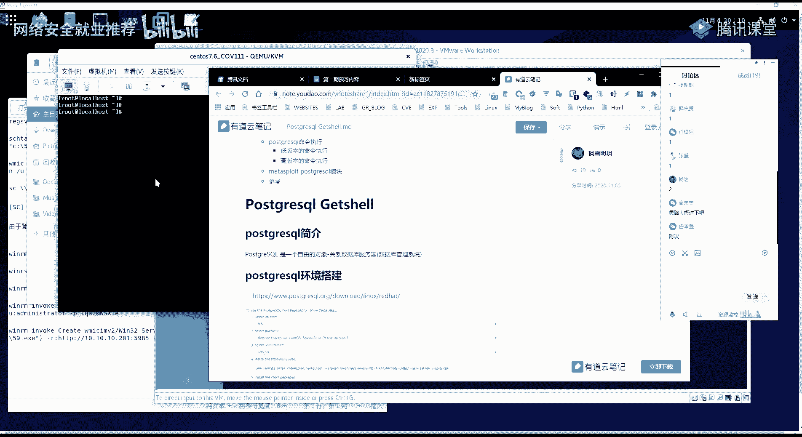

呃这边的话，我在这边的这个机器上面，我已经就是已经。

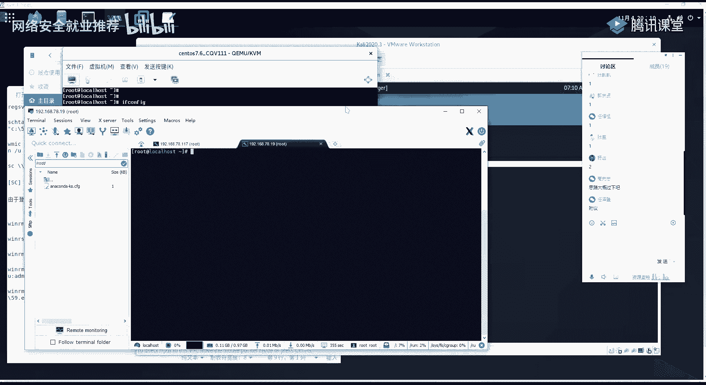

我在这边的这个机器上面的话，已经就是呃安装好了。

这样子这个cos recycle的一个数据库，然后安装的话命运的话就是在这边呃，我这边还是用的升到27的一个系统，所以的话我这样子的一个方法装啊，如果说你是用其他的一个系统的方法，就稍微有点区别。

然后看这个旗下，我的话呃重启一下我的一个数据库啊，就之前的话机器关掉了，然后这边重启之后的话呃，就是你要启动它的话，然后你要进入到这个数据库的话，你要做这样的一个操作，就是需要去创建这样的一个用户啊。

然后这个用户的话你在安装这个数据库的时候，它会有创建，但是呃你要去登录的话，你就需要呃设置一个密码，就是要password这个呃用户，然后的话我们可以通过这样的一个方法，切换到这个数据库当中。

然后的话再去呃，连接我们的这样子的一个数据库，啊我这边的话，啊呃我这边的话就是呃我就不不去模拟，说去登录这样子的一个数据库的，我这边的话直接就是在呃我的这一个系列当中。

因为我前期的话就是你已经呃得到这样子的，一个数据库，就是你连接到了这样的一个数据库，至于怎么去得到这个数据库的一个连接的话，就是呃得到他的账号密码对吧，然后或者或者是说绕口令这种。

你能够去连接到它的一个数据库当中，那么我们连接到它，连接到它的一个数据库的话，一般的话就只能去查看到查看它的数据对吧，当时在这边的话，我们可以利用这个我们得到的，连接到了这样的一个数据库来去啊。

进行下面的这样子的一些操作，像比如说呃读取系统的一个文件对吧，文件内容，呃然后在这边的话就是它的一些配置，就是你需要去配置它的数据库的访问权限，就是说你的这个数据库是要能够去被远程允许，远程的一个零件。

那你只能够去远程的去连接，我们才能够去连接到它的这个数据库嘛对吧，然后这边的话就是它的一个这个数据库的一个，一些基本的一个命令，然后这边的话就已经连接到了这个，psp cycle的一个数据库。

然后连接连接上之后的话呃，我们可以通过这样子的一个反斜杠h。

来去查看它的一个帮助现象，好就查看到这些帮助信息的话，就是呃一些像比如说，比如说create table对吧，然后就是一些创建表的这样子一些操作，以及删除啊，删除表等等，还有删除。

就是关于这个数据库相关的一些内容啊，这样子的一些mini。

然后在这的话我们需要去了解的一些选项，就是这里，像比如说我们要去查看它的一个数据库，比如干l在这块，这是他默认的有这样子的一些数据库是吧，up干，就是列出数据表等等等一些东西，对他干爹就是列出用户。

就说这个数据库它的一个用户是哪一个，这个pro和一个pograss grass，分一个数据库，还有的话再待会儿会用到的这样子的一个干dl，就是这样子的一个大对象，这是我们单卡的话。

会去呃创建一个这样子的一个对象，然后的话把我们要要写入的概念，把它写入到这个对象当中，嗯然后的话就是读取系统的一个文件，读取系统文件的话，我这边的话，首先的话就是drop table p。

因为我之前的话就是这个命运的话，意思的话就是删除这个批表对吧，就是删除表批，就如果说你当前的这个数据库当中，有这个表皮的话，那么你去穿的话就穿不了的对吧，所以我们在这边就是把它删除掉。

然后的话再创建一个这样子的一个p表，创建好之后的话，我们再通过这个copy million，把我们的这个etc password，就是说在当前系统下面的这个t parsword，这个文件里面的一个内容。

把它给copy到这个p表当中，然后的话我们在这边就能够通过这个。

通过去查查询这个表当中一个内容啊，去输出它的一个结果对吧，我们这边的话就是只查了一行，就是我们可以查两行对吧，以及他这边的话我们可以看一下，就是这句话copy 21，也就是它有21号对吧。

我们就是能够去输出21行的一个内容，然后这边的这个内容的话，就是我们这边的这个机器的一个，etc password的一个内容，就这一个。

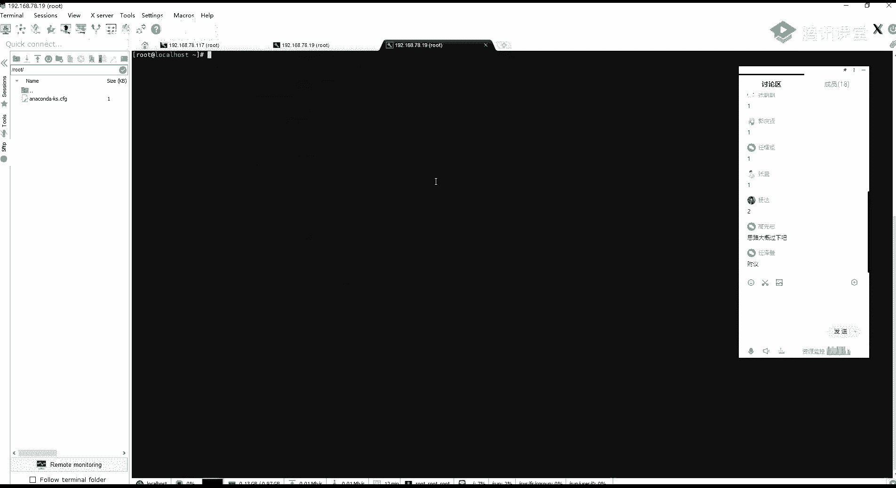

这边的话就是读取文件，以及的话，还有就是可以利用这样子的一个大对象，来去读取文件，方法的话就是先通过这样子的一个。

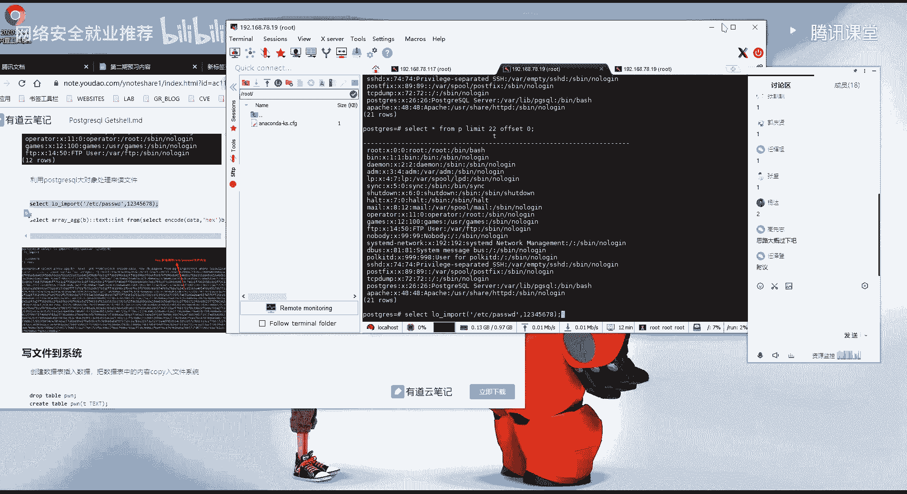

语句把这个e t c password的一个内容，把它写入到这个12345678这边的，这个e345678 的话就是一个大对象，我们可以干dl来查看一下。

当前这边的话，删除一下这个，我这话，先把我之前测试的这一个大对象给删除掉，停了三，然后这边的话就没有没有这样子的一个，大对象了是吧，然后的话我们在呃，把这里的一个文件的一个内容。

把它给写入到这样子的一个大对象当中，把这个号改了嗯，然后这句话他就呃新增新增了这样子的一个id，为这个12345678的这个large object对吧，然后这个这个对象里面的一个内容的话。

就是这个etc password的一个内容。

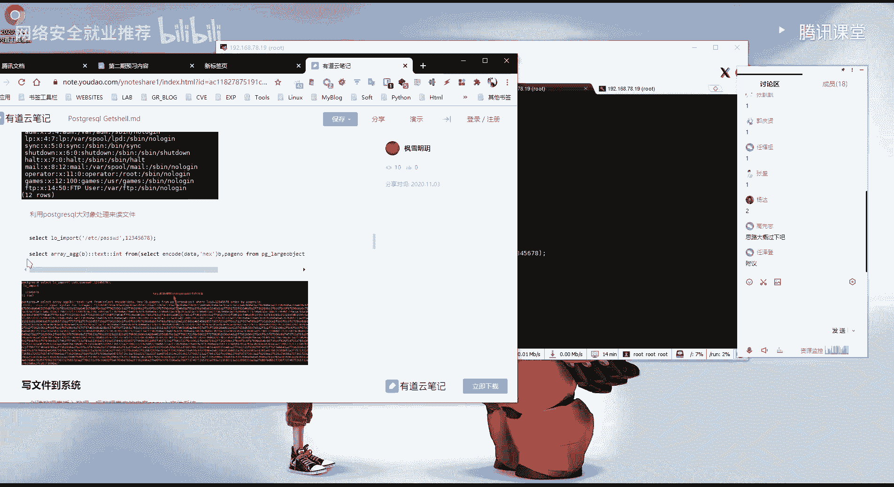

好在这边的话，我们通过这样子的一个语句，可以把它里面的一个内容读取出来，然后这边读取的一个内容的话，可以看一下，这边的话有这样子的一个冰嘛，就是把它做了一个hex的一个冰嘛，就把这边读起来的一个数据。

做了一个hex的一个编码，然后的话呃输出来，而在这边执行之后的话，之前就在这边的一个呃。

花括号当中的这一串的一个值，就是我们的一个呃，经过hex编码之后的这一串数据。

我这边的话呃，做一个解，做一个解码，解码之后的话，它的一个内容的话就是像这样子对吧，然后在这边这边的话是他的hs，编码之后的一个值，然后我们这边啊把它从hx来去做一个解码，解码之后的话。

这边的话就是我们这个etc password里面的一个内容。

对吧。

好的，还有就是呃如果说你知道你的这个机器，它是有这样子的一个，它是有这样子的一个web的一个目录，然后的话这个外文物下面的话，正好有一个可写的这样子的一个文件夹对吧，你知道这个文件夹你是可写的。

他在某一个目录下面去，那么你就可以通过这样子的一个呃数据库，把把数据库表当中的这样子一个内容，把它给导出到我们的一个文件系统当中，然后在这话就是呃写了这样子的一个，一句话对吧。

写入到了我的一个目标机器当中，就其实还是跟前面的好操作是一样的。

以及这句话我们可以直接通过这样子的一句话。

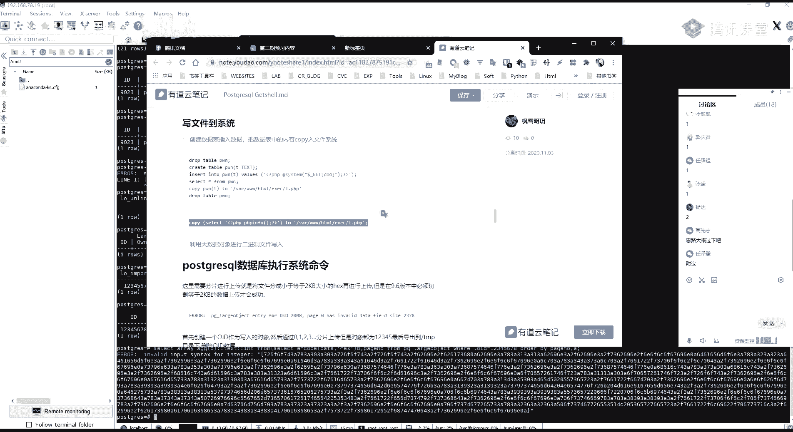

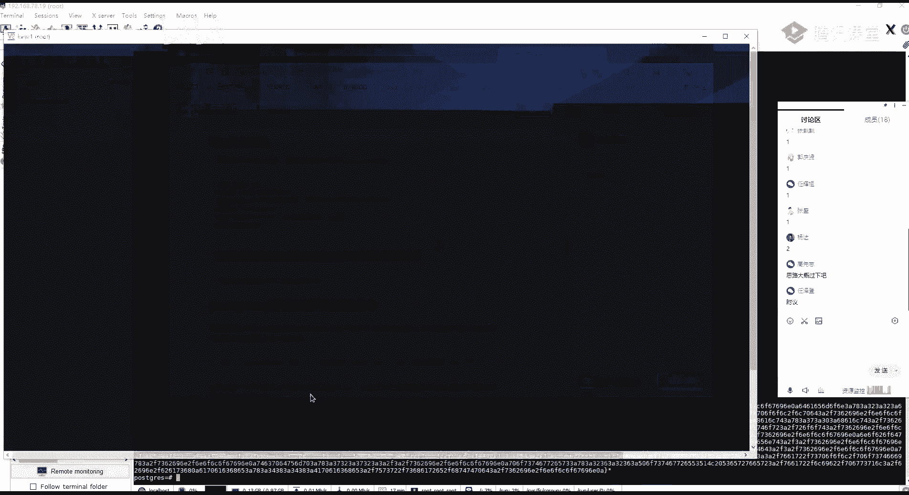

我这句话和起个这样的一个web服务，再举个例子。

啊嗯就这样子的，有，然后他的一个机器，这个的话有这样子的一个。

那这样子的一个可写的一个文件夹，就这个e x e c的一个文件夹。

我的话就只是做演示，然后的话我们就可以通过我这边得到这个。

数据库啊，来去做一个写一句话码的一个操作，首先要创建一个这样子的一个表达的话。

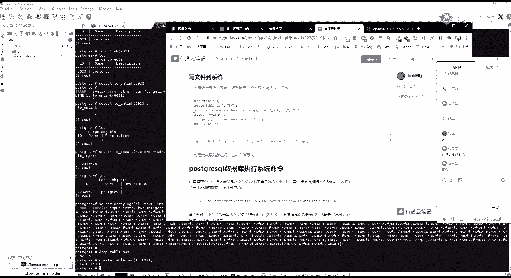

把我们这边的一个一句话码的一个内容，把它写入到这个表当中，写入到这个表中，这边的话就是一个。

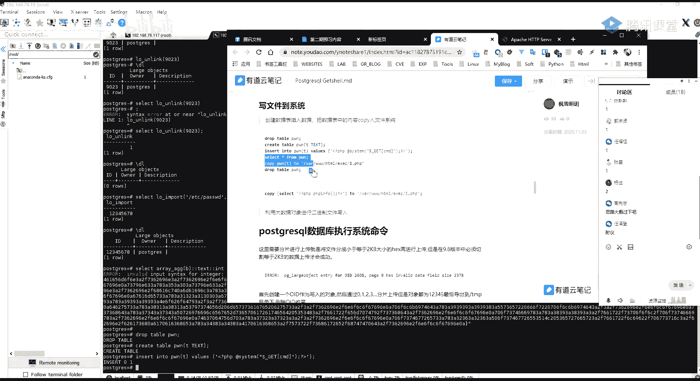

常见的一个一句话嘛对吧，然后我们在这边可以去查看一下，它里面的一个内容啊。

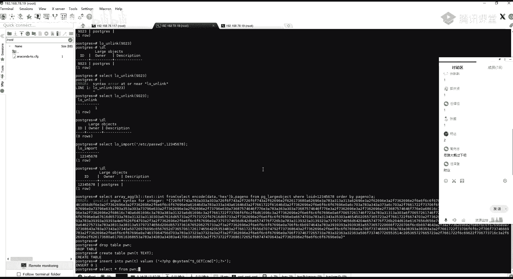

对吧，这边的话它里面那个的话就是这样子的一句话。

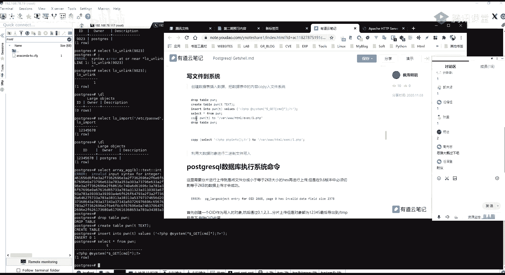

然后我们就可以通过这个copy命令copy to，就从这个表当中呃，把它的一个内容copy到这样子的。

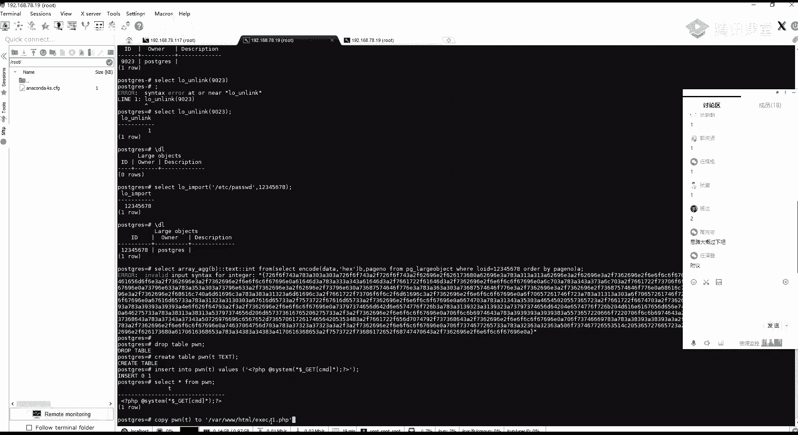

一个指定的一个目录下面的这个文件当中。

然后copy过去之后的话。

嗯copy之后的话，我们可以来去在这边验证一下，就这样的一个一点p h p对吧，然后他这边的话没有那它的一个报错，就说明的话他这边的话有解析这样子的一个，没有解析这样子的一个。

我们的一个菲律宾的一个一句话是吧，然后我们这的话就可以去通过这样子的一个呃，一句话就执行命令得到得到它的一个web系对吧。

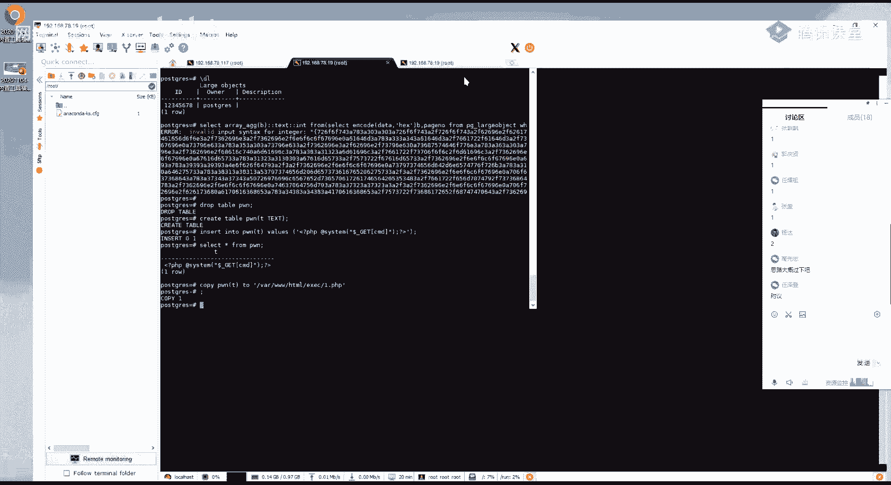

以及呃，我们也可以直接就直接通过这样子的一个方法，这里的话就是呃直接copy这样，这里select的这里的一个内容的话，就是select这个语句话，就是输出这边的这个内容嘛对吧。

然后的话就是把这边的这个内容，把它copy到这个文件当中。

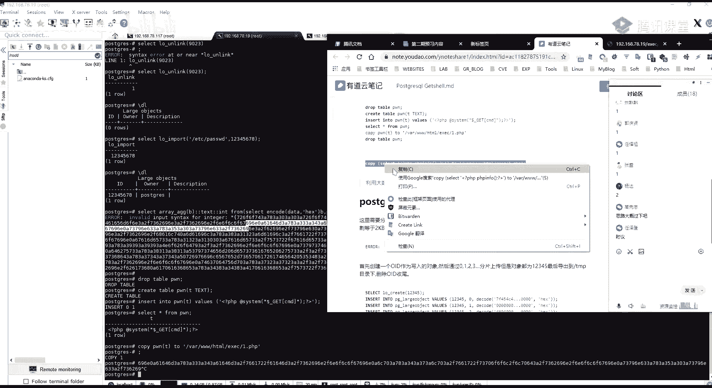

这话好熟。

那就可以去。

让我们来验证一下对吧，能够去正常的访问。

这说明我们这一个文件的话，是已经写到我们指定的这个目录下面去了啊，以及呃来去执行数据库的一个系统命令，嗯这边的话就是首先的话我们需要去查看一下。

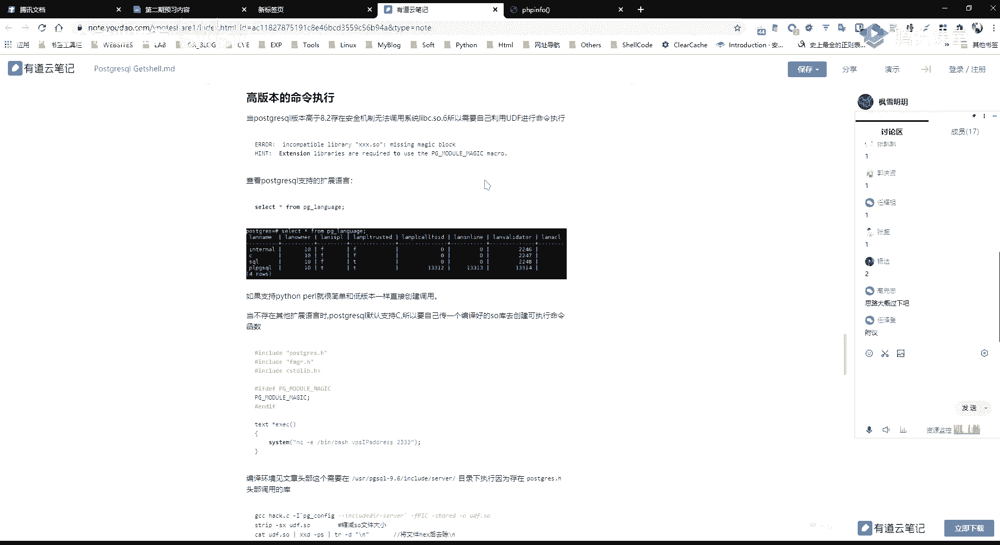

它这个数据库，它能够去支持的这样的扩展语言，就在这边的话，它默认的话它会有支持一个c语言，就是它它的这个啊数据库，它是支持我们去调用这样子的。

一个用c语言写的这样子的一个扩展，以及还有的话，如果说他支持python pp r这种的话，那我们就可以利用他的这样子的一个环境，来去进行一个呃进行一个执行系统命令。

然后这边的话呃如果没有这样子的扩展的话，我们就需要去编译这样子的一个呃，soo的一个文件，然后这个编译的话我就不操作了。

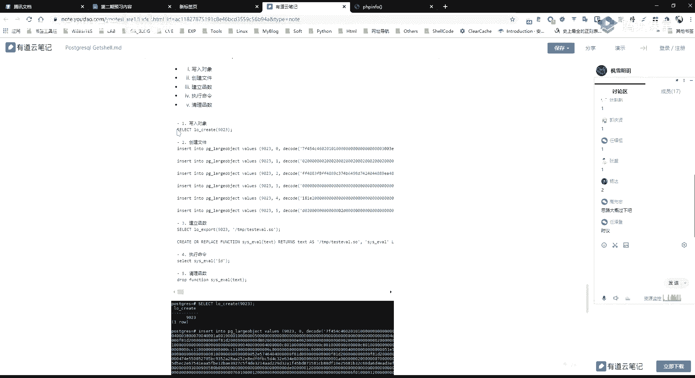

然后我们这边直接看效果吧，然后首先的话就是呃，创建一个这样子的一个大对象，就是9023的这个我们可以干掉来查看一下，这个话是之前的这个对吧，这个还是我们新进的，然后的话我们这边的话东西有点多啊。

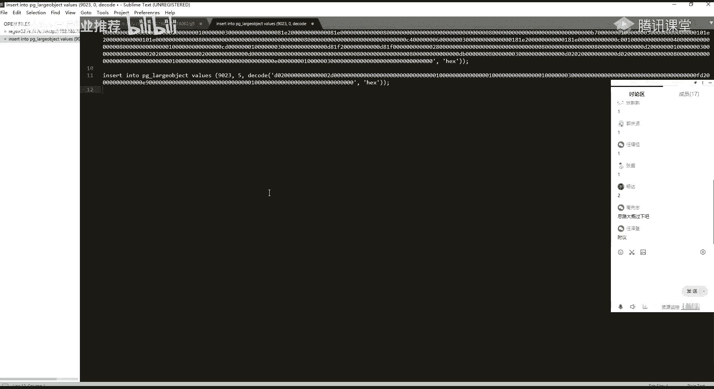

然后分别的把这边的这一个我把那个插进去啊，好注意的话，这边你插进去之后的话，就是说他这边他是hx的一个编码，同样的，然后的话他是把这边的这个编码做一个解码，解码之后的一个值，再去把它给写入到这个表当中。

就比如我们前面，这个我们之前的一个udf对吧，我们的一个优点f的那个文件呃，就是他我们同样的也是先把它转成一个hs的，一个hook px的一个格式，然后的话再去进行一个插入，又在。

这里的话也是一样的，然后在这边的话要注意的一个点的话，就是他这边的话，他这边的话有这样子的一个长度的一个性质，就是呃我我们的这个文件的话，我们需要去把它做一个分块，就是分成好几块，就每一块的话。

它不能去大于这样子的一个2048的一个质，检，要小于或者等于这样子的204吧，如果说大于的话，他会去呃，大约的话它会报错，然后的话我们在的话就需要去，就是这边每一个呃字节这边插入的一个字儿，都需要去。

小于这样子的一个2048的一个长度，好我们这边的话分别把这几块，他这边的话是分成了五块，顺便把这五块插入到这样子的一个酒量上的，这个大对象当中，然后插入进去之后的话。

我们的这样子的一个呃呃这样子的一个定义的，这个soo的一个文件，就已经写入到了这个表当中对吧，这个对象当中好的话，我们就可以通过这样子的一个方法，把这边的一个内容把它导出到我们指定的一个。

目录下面去，好在这里的话实在是一个tp，不然我先把这个视频的这个删掉啊，其实我们可以来看一下这个，就是原本它里面那个话是像这样子的这种乱码，所以的话我们需要去把它作为，做一个静止的一个转换，转换这种呃。

可见的这种hex的这种进步的一些格式，我等会把它把那个文件删掉吧，删掉之后的话，我在这边，导出一下，导出之后的话。

在这边的话就会多这样子的，一个soo的一个文件，就是这个test driver这个点sol的一个文件，那么下面的话我们就可以去利用这个sr文件，来去创建进行一个函数啊，经历了这个函数的一个作用的话。

就是我们可以去执行，我们执行啊系统的一个命令，然后这边的一个函数名的话，就是这个xy s等于ever，执行执行说的话可以看到创创建成功了，这样子的一个function函数是吧，那么这边创建好之后的话。

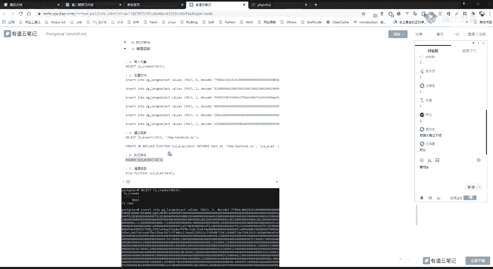

我们就可以调用它去执行我们的系统命令，先比如说执行id对吧，以及执行外卖，还有的话就是然后再c t，他说了的对吧，这边呢我们在这块就能够去执行啊，系统的一个变量对吧，那么我们既然能够去执行命的话。

我们就能够去进行一个反弹器啊，等等这一些操作是吧，这话就是这一个cosl cycle，这个数据库的一个get share，然后这个的话大家大家自己去动手操作一下，因为呃东西的话就是这些东西啊。

没有什么很特别的，然后的话你知道有这个东西就可以了，然后你碰到了你碰到了这样子的一个东西对吧，你就可以直接去用了是吧，你直接直接按照这样的一个方法去进行，一个使用就可以了，然后以及的话呃。

在msf当中有对应的这样子的一个模块啊，就是cospur cycle的一个模块，比如说啊read file读取文件对吧，还有其他的这样子的一些模块，呃这种话就是关于这个cosport cycle。

get share的一个方法。

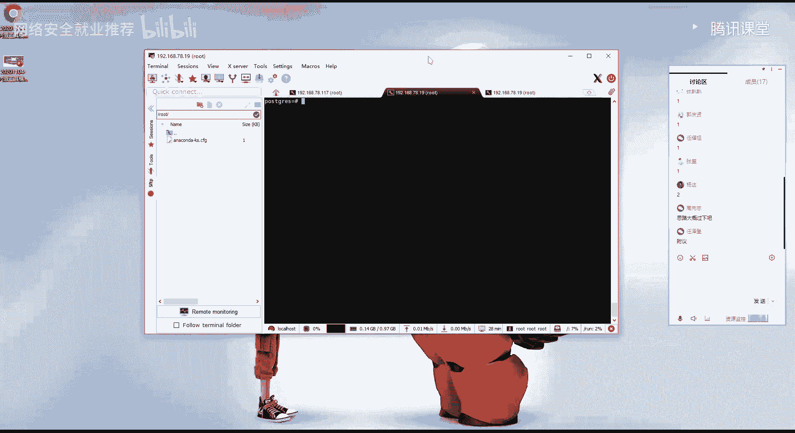

大家应该没有什么疑问吧，就像这种的话，你知道你知道有这个东西对吧，然后的话你知道怎么用就ok了好吧，能理解吗，就是思路的话应该能理解吧，具体的操作的话看看看我的那个文档好不好啊，应该是没有问题啊。

那我们继呃开始，我们今天的一个主要的一个内容，我们这的话主要的话就是给大家介绍，这个内置工具的一个横向移动，或者说是横向移动的啊，就是说我们能够去进行横向移动的，这样子的一些啊。

windows系统下面的内置的这样的一些工具啊，然后呃本节课的话主要分为了十块，第一块，那就是i pc加这样子的一个s c s c h tasks，而这个s c h text的话是呃。

windows系统下面的这样子的一个计划，任务的一个管理工具，然后还有的话其实还有就是这个a t a t的话，它同样的也是呃去创建我们的一个定时任务的，这样子的一个工具命令。

然后的话呃这两个命令它的一个区别的话，就是这个命令的话他是在新版的这种server啊，还有windows系统上面啊，是使用的，然后的话这个tp的话，他在呃新版的这种系统上面的话，它是已经被弃用了。

所以的话我们通常的话会去使用这个工具，当然的话老板的这种系统的话，你就可以去使用这个at命令呃，在本节课的话也会给大家去呃演示，然后第一个的话呃，然后第二个的话就是这个i p c加s c，s c的话。

这个变化前面已经有介绍了对吧，它是一个呃去管理我们系统的这样子的，一个服务的一个工具的一个管理工具，我们可以去，我们可以去利用这个命令来去进行一个服务的，一个启动，停止创建等等的这样的一个操作是吧。

然后第三个号就是wm i c啊，前面他也同样介绍了对吧，我们可以利用它来去做一做一些啊，服务的一个配置，以及信息的一些查看对吧，像比如前面我们讲信息收集的时候就呃有啊，就有经常去使用这样的一个命令啊。

第四个的话就是一个wi，呃首先的话第一部分就是呃，我们那个i p c连接，加这样子一个定定时任务的一个横向移动，呃在讲这个之前的话，我们先来了解一下什么是pc啊，保护，我们先来了解一下什么是ipc啊。

这个ipc的话就是这样子的一个internet process connection，就是呃一个共享的一个匿名广告的一个资源，就他是共享秘密管道一个资源，然后他的一个目的是为了让进程。

经通信和开放的这样子的一个命名管道，然后我们可以通过用户名密码，然后的话通过它开放的这样子的一个命名管道，来去进行临界好，然后通过这里建立的一个连接的话，我们可以去进行数据的一个交换，以及对。

以及实现对远程计算机的一个访问，然而这边的这种ipc这种零件啊，我们去前面也要给大家介绍对吧，像我们，直接的需要执行它需要轴的话，在这边的话就是它会显示了我们的系统的一个，共享的一个资源的一个呃链接。

然后的话他有这样子的一些默认共享，这些默认共享的话，主要的话就是我们的一个呃，计算机上面的一个磁盘对吧，然后它的一个主要的一个作用的话就是呃，用来就是方便管理员来去进行一个啊远程管理。

我们的这样子的一个计算机啊，好了，就是这个i p c i p c的话，它是一个远程的这样子的一个，i p c的一个零件，然后我们要去进行这样子的一个，共享的一个连接的话。

我们需要通过这样子的一个i p c，去建立这样的i p c的一个连接，然后的话才能够去访问这样子的一些，默认的一个共享，以及这样子来的min admin的话就是它的一个目的话，就是呃系统的一个安装录。

然后的话就是呃，我们去利用这样的一个i p c的一个呃，建立连接，建立共享连接的话有相应的一个条件呃，我这边列了这三个，第一个就是开放了139445的一个端口，就是他对该pc连接的话。

它是通过这样子的两个端口，去进行一个数据的一个传递的，以及去建立一个呃连接的一个通信，然后第二个的话就是要开启这样的ipc的一个，文件共享的一个服务，就是你需要去开启这个服务，如果这个服务被禁用的话。

那么你就无法去进行这样子的一个啊，共享的一个连接，然后第三的话就是你需要目标机械的一个，管理员的账号以及密码，就是呃再去进行一个ipc连接的话，也是需要呃，就只有管理员的一个用户，你才能够去进行去啊。

进行这样的ipc的一个连接，所以的话在这边的话，我们有一个前提，就是我们已经获得了目标机器的一个管理，员的账号以及密码，啊呃第三话就是常用的一些命令，就是呃利用这样子的一个i p c。

连接的一些常用的命令，首先第一个号就是建立连接，建立连接的话，我们通过net yels的样子个命令哦，那这样子接接我们的一个，接我们的一个远程主机的一个i p，就是在这边吗，这边的这个共享名对吧。

就是这个i p c，也就是我们去连接这样子一个远程ip c的，这个服务，然后的话干user后面的话接我们的一个用户名，注意的是要是管理员的一个用户名，以及接我们的一个密码密码的话。

用这样子的一个双引号做一个包裹，然后第二的话就是查看连接的一个情况，我们可以通过net 2来去查看，以及查看目标主机的一个时间，就是如果我们这边建立连接之后的话，我们可以通过net time来去查看。

远程机器上面的一个呃当前的一个时间，然后删除连接的话，就是net yj这样子的一个呃连接名啊，然后的话接我们的一个干d d l d l就是delay，delete，就是删除这样的一个共享的连接。

以及的话我们可以通过这样子一个共享链接，来去进行一个数据的一个传递，像比如说我们可以把我们本地的这样子的，一个程序，把它给复制到我们的一个远程的一个机器上面，的这样子的一个tp路下面是吧。

以及我们也可以从就通过copy这个命令啊，从远程的，通过这个copy命令啊，从远程的这个机器上面的c盘这个目录下面，把它的一个这个程序，把它copy到我们本地的一个目录下面去。

就是前面的话也有介绍嘛对吧，我们可以通过这个链接，就是建立了这个连接之后的话，我们可以用它来去进行一个数据的交换对吧，那么就可以去进行文件的一个传递对吧，以及的话可以去进行一个呃。

文件系统的一个访问对吧，就前面的话也有介绍，就是我们可以通过net o呃，就是经历了这样子的一个临界对吧，然后的话我们可以通过这个临界来去查看啊，我们的一个默认共享的这样子的一个资源。

对吧，嗯呃这边的话我们来具体的来看一下。

呃在这边的话就是。

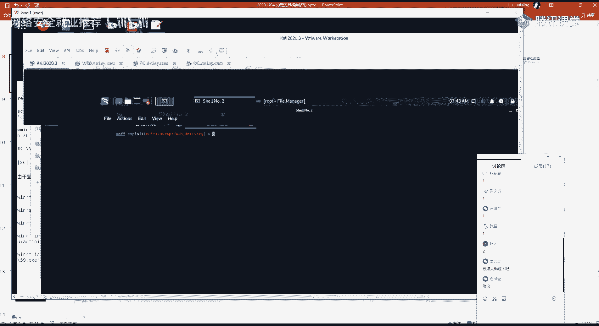

在这边的话，其实就是我呃已经省略了前面的，很很多的一些步骤，就说我们在呃在讲这个之前的话，呃，我们一起来捋一下这样子的一个思路。

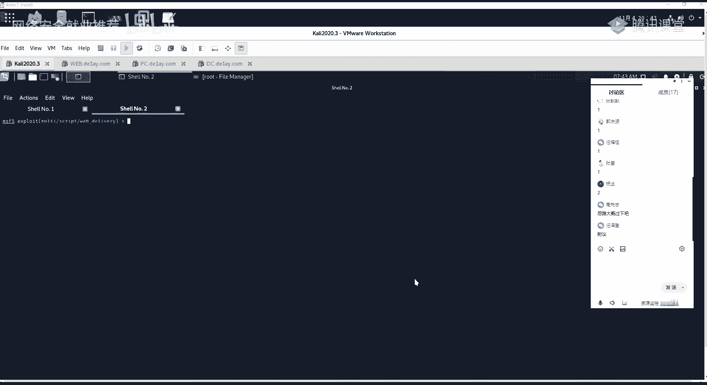

就是给大家捋清一下这样子的思路，就是大家可能就觉得呃，我这边讲这个横向移动对吧，这个横向移动它是处于一个什么样子的，一个阶段的，就说我们其实我们这个课程内容的话，它是呃我是按照这样子的一个。

就是我们的一个呃渗透测试的，一个基本的一个流程，来去进行一个呃内容的一个安排的，就是我们前面的一个内容的话，就是为我们后面的一个内容做一个铺垫对吧，好，我们前面的话，大家可以回想一下讲的哪些内容对吧。

我们有就是呃外网的一个信息收集对吧，信息收集以及额外网的一些突破口，然后的话通过这一个突破口来去进行一个呃，进入内网，然后的话建立相应的一个构建通道对吧，构建代理通道来去访问内网。

然后的话以及多层的一个代理，也就是一个纵向的一个渗透，也就是纵向移动对吧，就其实前面前面已经有介绍，就是说呃纵向的这样子的一个渗透，就是我们有多层的这样子的一个网站对吧。

然后的话我们一层一层的去建一个啊渗透移动，然后这句话横向移动的话，同样的就是说我们横向移动的一个横向移动的，这样子的一个阶段，是在我们已经得到了内网的一个权限，就说我们已经能够去访问内网，好的话。

我们能够去通过呃，访问内网的这样子的一个机器对吧，来去进行一个横向的一个移动，就说我们得到了能够去访问内网的那台机器，然后通过那一台机器来去进行一个呃，到他同一个网段的这样子的。

一个其他机器的这样子的一个权限对吧，这其实呃，怎么说呢，就其实我们在讲前面的一个构建带呃，构建通道的时候对吧，我们是有讲这样子的一个三层的一个网吧对吧，那么三层的一个网站，你每一个网站的话。

你不可能是只有你不可能是只有这样子的一个，只有啊前面把机所说的这样子的一个机器对吧，你的每一个网段，像比如说你一的这个网站，你不可能是只有一个机器存活的，你还有其他的这样的一个机器的一个存活啊。

那么同一个网段机器的话，我们的这样子的一个就是说呃大家再去，或者说你公司的这样子一个网络，你去划分网段的话，那么你这个网络的一个机器，你肯定是能够互相访问的对吧，那么这个网站机器人能够去互相访问的话。

那么呃它其实它是有，它是会有相应的这样的一些光明的对吧，就比如说你的一个web服务以及你的一个数据库，你都是在同一个网站对吧，那么你的一个数据库以及web服务的话，他们之间是要能够去互相访问的是吧。

那么在管理员去管理这样子的，两个机器的时候是吧，你可能的话就是他去登录，他会去登录这样子的一个机器，去进行一个一个管理对吧，那么他登录去机机器去管理的话，我们如果说正好拿到了这个机器，相。

比如说是通过一个外表机器的，通过外一个web机器，拿到了他这个机器的一个权限，然后的话管理员有去登录这样子的一个机器，以及它还有一个这样的一个数据库的，一个服务器是吧，它在同一个网段。

这个跟这个web机器它是在同一个网站啊，我们拿下这个web机器，我们就能够去访问这个数据库的一个机器对吧，然后能去访问到这个机器的话，我们如何去拿下这个机器呢，就是我们需要去去通过这样子的一个。

横向移动对吧，就是说它是在同一个网站，我们需要去横向的去扩展呃，横向的去利用其他的同一个网段的，这样的一些机器啊，那么在这样子的一个场景的话，我们可以去考虑一下，就是说呃你就是说你管理你去管理这个机器。

对你可能你密码它不是，它是同样子的一个密码对吧，就是说管理，因为他去管理多个机器，你不可能每个机器密码都不一样啊，都不一样对吧，但话呃可以这样子去实现对吧，但是其实像这种绕口令也还有的话。

就是说你的一个密码的话，就其实原本的话是没有这样子的一些问题的，对吧，其实有人的这样子的一个操作的话，就是会存在这样子的一些问题吧，因为你人的一个纪念的话是有限的，然后的话那么他就可能会存在这样的情况。

他webb机器它登录的一个管理的一个用户密码，对吧，他同样的也能够去登录这样子的一个数据库，的一个服务器，以及同一个网段的其他的某一些机器对吧。

那么我们拿下这个web机器的一个shell之后，我们就是去进行怎样的一些操作，前面已经有介绍了对吧，就是对它做一个信息收集，收集他收集他的一些详细的信息，以及的话，在这个主机上面。

我们需要去获取的一个一些内容对吧，像呃网络连接以及呃ip和敏感信息。

账号密码等等这些东西是吧，那么在这边的话呃，我在这边的话，就是省略了前面的这样子的一些东西啊，我这边直接就是因为前面的话已经有介绍，介绍了对吧，而这句话我就通过。

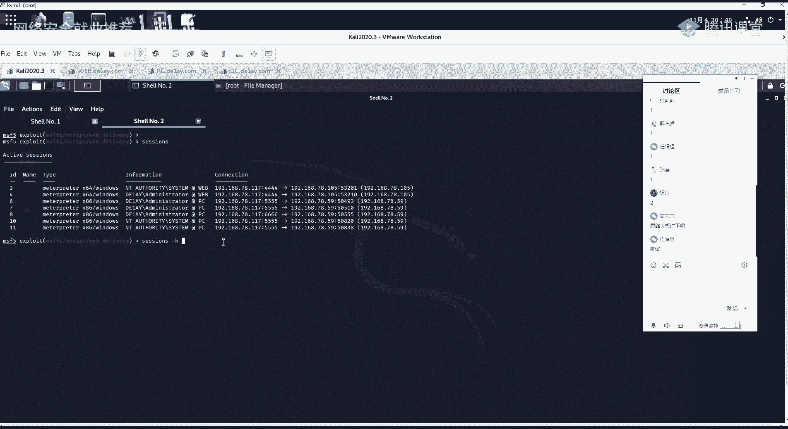

这边是我之前操作的，呃我这边的话是用的还是用的。

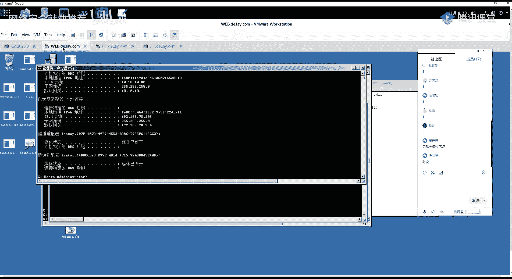

之前的这个绑架啊，首先这个的话就是一个web机器。

这话是另外的一个机器对吧，这样的话是预控啊。

我我这边的话通过相应的一个漏洞，拿下了这一台机器的一个线是吧，我这边的话就是我这边的这个操作。

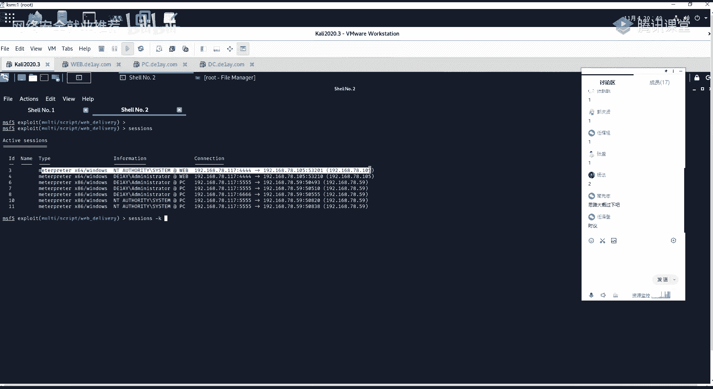

就是处于这个阶段，就是我已经拿下了啊。

这个机器的一个希尔，这个计划就是这个，然后我这边的话通过，通过这个筛选三个啊，其他的这些筛选呢是我之前测试用的，这这些的话大家可以不用管啊，我当前的话是只拿到了这个筛选对吧。

这个筛选的话就是这个机器的一个shell，那么我在这边的话，我就，可以去进行参与的一些操作。

