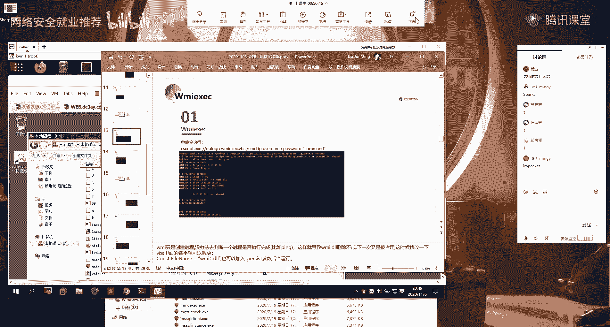

# 【B站最系统的网络安全教程】北大大佬196小时讲完的网安教程，全程干货无废话！学完即可就业，别在盲目自学了！！！ - P79：第49天：内网横向移动-CobaltStrike、Metasploit、mimikatz - 网络安全就业推荐 - BV1Zu411s79i

呃大家晚上好啊，怎么才13个人呢，其他同学呢，呃那不等其他同学啊，我们呃现在的话已经八点过二分了，大家能听到我声音吗，能听到我声音的话，在讨论区扣个一，好的应该是没有问题啊，呃没有没有问题的话。

那么我们正式开始我们今天的课程内容啊，我们今天的话呃内容的话呃算是比较多的，就是本节课的话主要给大家介绍一下，横向移动的一个外部工具片，就上一节课的话给大家介绍了，就是呃在windows下面的话。

我们要去进行一个横向移动对吧，我们所常用的呃，在windows windows系统下面，所内置的这样子的一些工具对吧，然后内置的一个意思的话，就是说他的这些工具它是已经在windows系统上面。

它已经有了对吧，然后我们可以直接在呃在它的一个系统上面，直接去进行一个使用，那么外部的一个工具片的话，就是说呃在windows系统上面它没有的一些工具，也就是说呃我们需要用。

我们需要去把我们自己的这边的一些，web的一个工具，把它给上传到我们的一个目标机上面去，然后的话再去进行一个啊，再去进行一个移动横向移动对吧，以及的话还有就是对我们内部的这样子的一个。

命令的一个功能的一个扩充，就比如说我们这节课会讲到一个w m i e x，e c的这样子的一个脚本，就这个脚本的话，它就是对于我们上一节课所讲到的啊，利用w m i c去进行一个横向移动的。

那样子的一个呃扩展扩充，因为我们上节课有介绍对吧，就是说我们用这个w m i c的一个创建，进程的一个方法来去进行一个横向移动的话，它是没有回血的，最后说就是说我们它是能够去在远程的一个。

目标机上面去执行命令对吧，但是的话他执行的一个命令的话，是我们是看不到它的一个啊执行的一个结果的，那么在这边的话我们就可以利用它，利用这个脚本来呃，这个脚本它的一个原理的话。

其实就是利用到我们上节课所所说的，那个w m i c好，然后的话他这边的话它的一个优点的话，就是我们能够去得到一个，就是能够去直接去执行命令，然后的话能够去得到它的一个回血，以及我们能够去得到一个呃。

可交互式的这样子的一个shell，然后本节课的话呃，我这边的话分为了这样子的五块，就是呃内内容的话还是比较多的，这样的话呃就是一些呃技巧性的一个东西啊，然后呃首先这个话就是呃300ex 1。

以及呃ex 1 c以及呃p s e x e c啊，这边的话呃我会给大家介绍，就是说他的这两个脚本工具，首先第一个的话就是这个p s e x e c，它是呃我们前面在讲那个啊，前面应该有介绍，就是在。

就是在windows的话呃，微软的话它有一个这样子的一个工具集，它这里面的话就有包括了这样子的，p e x一的这样子的一个工具，然后的话我们可以直接去进行一个使用，以及的话还有就是有一个那个。

in impact的一个套件，然后这个套件里面的话，就是它呃这样子的两个工具，然后的话我们可以直接去使用它，来去进行一个横向的一个移动，然后第二个的话就是w mi的一个e x。

e c的一个vbs的一个脚本，第三个就是在我们的一个msf以及cs上面的话，我们如何去进行一个横向的一个移动，以及最后的一个sharp r d p，就是用的啊这样子的一个i dp的一个呃东西，来去进行。

一个在远程的一个计算机上面去执行命令，好，首先的话我们先来看一下，第一部分的一个300ex e c呃，以及p s e x e c，我这边的话把它这两个的话放到了一块。

因为呃其实就是说这边的一个300ex e c的话，它其实就是用的这边的一个p s e x e c啊，就是它是基于这一个来去达到这样子的，一个目的的，然后的话首先来一起了解一下。

就说什么是这个p s e x e c r，它是一个呃，有一种轻巧的这样子的一个tnt的一个代替品，就它的一个作用的话，就是能够在其他的一个系统上面去执行进程，并且为控制台的这种应用程序。

来个来提供一个完整的一个交互性，而无需我们去安装我们的一个客户端，的一个软件，就我们只需要用这个工具，我们就能够去与我们那个远程主机，去进行一个啊交互，然后的话它的一个原理就是这边列的这四个。

就是他的这个p一个eex 1 c的话，它同样的是会利用到我们的一个，i p c的一个连接，它首先会去建立这样一个i p c连接，然后的话它会释放一个这样子的一个服务程序，释放到它的呃。

释放到我们的一个目标机器上面去，然的话他会用这一个open sc的一个manager，来去打开机器上面的一个服务控制器的，这样子的一个聚变，然后的话利用利用它来去创建一个服务，然后创建了这个服务的话。

我们就能够去进行一个命令的一个控制，然后的话就是呃这个p s e c的一个使用，它的一个使用的话，我们从这边的一个基本的一个原理，也能够大概的知道，他首先需要去建立这样的一个，i p c的一个零件对吧。

那么我们在这边经历了这样的一个，i p c连接的话，他就会直接去使用这个ipc连接，来去进行一个呃啊，进行一个远程的一个命令的一个控制对吧，然后的话不需要我们再去输入密码。

如果说你没有去经历这样的ipc连接的话，你就需要去通过这样子的一个啊语法来去呃，通过这样子的两个参数，杠优杠p的呃，这两个参数来去指定我们的一个，用户名以及密码，然后的话再去进行一个呃。

利用它来去进行一个命令的一个执行，那我们先来看一下，就是说我们呃首先的话建立ip c0 ，就是这种情况我们怎么去进行一个使用，而今年ipc连接的话，上节课已经给大家详细的介绍了对吧，就是通过nels。

然后的话接我们呃域名称，预账号的话，密码，当然的话我这边的话是已在，就说在域内的这样子的一个情况是吧，如果说你是在工作组的话，你就是啊直接加你的账号，然后的话接你的密码。

然后的话呃它能够去实现这样子的两个呃，就是功能就是首先这个话就是反弹cmd，就我们可以直接通过这个工具来得到一个，sam d的这样子的一个呃绘画，就是能够去得到一个这种可交互式的一个，simd绘画。

然后呃之前的一个面的话，就是通过这样子的一个i p c的一个连接对吧，然后通过这个杠s的一个参数指定一个cmd，也就是说呃啊在这边还有个干accept cl，就是这个工具它在第一次执行的话。

它会有一个那个就是要你去选择一个，就是接受的这样子的一个弹框，如果你加这个的话，它就可以把那个弹框就是默认的就是啊去掉，然后呃这个语句他那个意思的话，其实就是呃我这边通过这个i p c连接对吧。

然后的话我们前面有说到这个啊，p s e s e c这个工具，它的一个作用，就是它可以在其他的一个系统上面去执行进程，对吧，就是说在远程的这样子，一个目标镜上面去执行一个进程。

那么在这边我们指定干s这个参数，就是指定我们要去执行的一个进程，那么执行的这个进程的话，就是在远程的一个机器上面去执行一个cmd，然后的话我们能够去这个cmd做一个交互，也就是能够去得到啊。

远程机器上面的这样子的一个啊，sam d的一个呃一个shell对吧，然后的话就是执行命令，执行命令的话就是直接加命令就可以了，就加我们想要去执行一个命令，然后呃这边的话就是它的一个使用的一个效果。

就像这样子，首先的话我们是新建一个这样的零件对吧，ip的零件，然后的话我们直接去执行命令，这边的话就是它返回的一个结果，然后的话就是呃，我们也可以通过这样子的两个参数。

杠优杠p的一个参数来去指定用户名密码，然后的话直接去进行一个命令的一个直线，以及啊反弹啊，就是得到一个cmd的一个绘画对吧，呃我在这边的话是通过在cs上面去进行的，一个啊这样子的一个操作。

就是呃给大家举一个例子对吧，然后我在这边的话就是它的一个用法对吧，然后的话其实我们实际去使用的话，我们实际去使用的话，我们因为我们前面的话，像比如说我们上节课的话是通过msf对吧，通过msf得到了。

已经得到了一个跳板机的一个绘画，然后的话在基于那个绘画来去进行一个，横向的一个移动对吧，然后的话就是同样的这样子的一个这样子的，一个外部的一个工具，我们要去执行对吧，我们在前面的话是直接。

我们通过那个跳板机上面，它已经有内置的这样子的一个命令，能够去进行相应的一个横向移动是吧，那么在这边的话我们的这个样子，一些外部的一个工具程序的话，我们首先需要通过我们前面得到一个绘画。

然后把我们的一个工具做一个上传，上传到我们的那个跳板机上面去，然后的话再以那个跳板机去进行一个执行，然后呃在这边的话是呃cs的一个，就是在cs上面的一个操作的一个步骤。

然后在msf上面的话也是同理啊对吧，就是我们在那个绘画下面的话，我们就能够去进行这样的一个操作，然后在cs上面的话要注意的话，就是说呃cs跟msf的话，它不一不同的一个点的话。

就是呃我们在cs上面去执行，像比如说执行这样子的一个，找到一个cmd的一个绘画对吧，因为我们在cs上面的话，它是它不是一个呃，就是它是通过htp的这样子的一个方式对吧，去做一个零件。

然后我们的这样子的一个连接的话，他不能够去创建一个这种可交互式的一个，绘画是吧，它只是我这边我这边发送这个请求对吧，我这边执行这个命令，那么他就会把我的这个请求啊，不知道就是那个back on。

他会连接我们的这边的一个cs的一个服务端，把我们的这个命令把它给就是通过get请求对吧，把它呃在我们的一个back on上面，也就是在目标机上面去进行一个执行，执行之后的话，它就会返回结果。

然后的话把这个结果返回到我们那个cs的一个，服务端对吧，它是这样子的一个，你请求我这边的啊服务端所给你的一个命令，然后的话执行之后的话再返回结果，所以的话他没有这样子的一个。

他不能够去创建这样的一个交互式的一个绘画，那么我们在这边的话去使用的话，就是因为我们呃利用它的一个横向移动的，一个目的，就是我们能够去基于我这边的一个跳板机对吧，然后的话再去啊横向的去渗透其他的。

在这一个同网段下面的其他机器对吧，拿下其他机器的一个share绘画，通过这样子的啊，横向移动来去拿一下其他机器的一个，需要绘画对吧，那么我们在这边的话，通过啊这个工具能够去进行一个呃。

在远程的一个机器上面去执行命令，那么我们就能够去啊，在远程的计算机上面去执行，我们反弹希尔的这样子的一个命令对吧，像比如说我在这边的话是通过就是cs的一个msi。

就是在问的下面利用m s h ta来去加载，去远程的加载我啊，cs服务端的这样子的一个呃，一个posher的这样子的一个脚本，然后它加载之后的话，它会在我的这边的，就是在这个远程机上面他会去执行。

执行之后的话，它就能够去呃，反弹一个绘画到我的一个cs的一个服务端对吧，然后在这边的话要注意的一个点的话，就是你在cs上面去用这个进行一个传递，命令的时候，不要去添加一个双引号，就是在这边。

比如说你可以看到我这边的一个命令对吧，是这样子，就在后面的话，你把命令加在最后面，然后的话它就能够去自动的去识别啊，就是说你在这边不要去加一个双引号，把你的一个命令做一个包裹，因为你在这边去执行的话。

他会报这个错误，就是找不到指定的一个文件，就你直直接在后面加你的一个命令就可以了，呃这边的话，我们来演示一下吧。

我这边的话还是用的之前的这样子的，一个靶机啊，唉这边分辨率有点那个就是啊，首先的话还是用的跟上节课同样的，一个这样子的一个产品，是我这边的话已经得到了这个机器的，一个绘画对吧。

然后的话我通过这个绘画来去进行一个，横向移动来啊，利用这边的来去得到这边的这个机器的，一个绘画对吧。

首先的话就是这个p s e x e c是吧。

然后的话嗯我先我这边的话。

我就不在这边msf上面去进行那个了，就是操作的话都是一样的，是因为呃在这里的话更直接一点。

首先我们通过net柚子来查看一下，就是当前是不是有这样子的一个，i p c的一个零件，没有对吧，那么我们可以通过net柚子来去进行一个，i pc连接的一个建立。

诶我在哪，还有。

这边看了一下。

这边怎么还有零件呢。

呃这边的话报错了，报的这个错误的一个意思的话，就是呃因为他这边的话，他这边写了，就是不允许一个用户使用一个或一个以上的，一个用户与服务器共享资源的多重连接，意思的话就是我这边的话还有一个连接。

就是已经用了这样的一个用户名，就是我当前在这个机上面有连接了，这样子的一个201啊。

这个机器，所以的话它会有冲突，就是你只能同时存在一个这样子的一个，i p c的一个零件，用同样的这样子的一个用户。

我这边这边是哪里被占用了呢。

我去。

应该是三二饼干的，没有啊。

哎。

我这边不知道是哪边。

因为我今天的话有做很多尝试啊，就是备课嘛。

就所以的话我这边cs，然后msf以及在这边都有搞这种凝胶。

我这边我现在不确定是哪个哪个占用了。

呃这边的话大家大家我这边快就介绍一下吧，大家就是自己去操作吧，好吧，就是照着我这边操作的话，肯定是没有问题的，诶，我这边我这边不确定多少什么没，你占用了，我可能要重启一下机器什么的。

才有那个我这边话就不麻烦了，好吧，大家自己课后扣扣自己去动手去操作，然后我这边的话就介绍我就不演示了，好吧呃，呃内容还是比较多的，然后呃具体的一个步骤的话，就是像这样子。

就是通过这个p s e x e c的，这样子的一个工具，这个工具的话是那个啊windows下面的话有内置的，就是它的一个下载地址的话，就是这个呃我课后哦，忘我又忘记把预期内容发给他发给大家了。

就是这几天有点忙，然后而就是在这边的话，可以去下载到这样子的p e e x e c，然后它是呃微软的一个官方的，这样子的一个工具，然后下面的话第二个的话就是同样的。

也是这个p s e x e c的这样子一个脚本，这个脚本的话它跟前面的这个啊，就是微软官方自带的这个话它是不同的，就是它与官方的这样子的一个呃程序的话，它相比，它会自动的去删除服务的。

去删除创建的一个服务，然后的话就能够去增加一个隐蔽性，就是我们前面的话有说就是他会去创建，创建一个服务对吧，然后创建的那个服务之后的话，我们就能够去与我们的一个远程的计算机，去做这样子的一个呃交互对吧。

以及能够去执行命令，那么在这边的话他的这个脚本的话，它就能够它会自动的把那个服务器删除掉，就是创建之后的话，它会删除掉，删除掉之后的话，我们就就能够去增加我们的一个隐蔽性吗，就是呃你的一个服务。

你起就是这种异常的服务，你起来了对吧，就是不容易被发现，你删掉了的话，然后执行命令，执行的一个命令的一个语句话，就像这样子就直接加这个e s e c，然后的话它的一个啊构成的话就是像这样子。

就是我们的一个域域名，加我们的一个加我们那个预账户名，然后的话加我们的一个密码，然加我们的那个呃远程主机的一个ip，再加我们的一个命令，然后要注意的话就是我们的这边的一个dd的，就是域名啊。

我们通常的话前面在写这个是通过这样子对吧，通常的话我们前面在写的话，是通过比如说这样子的一个d类域对吧，然后他接我们的一个用户名对吧，这样子写，然后在这的话要注意的话，它是我这边不是反斜杠。

它是一个斜杠呃，如果你不是这样写的话，它报就是呃，找不到这样子的一个就是用户名错误啊，然后的话加一个冒号，就是冒号来去分隔，我们这边的一个用户名以及密码，然后后面的话就接我们的一个密码。

然后的话在art接我at符号，接我们的一个远程主机的ip，在最后的话空格加我们的一个命令，然后在这边的话，我这边特意把就执行之后的一个过程，把它给截出来了，就是像这样子，就他这边执行之后的话。

他首先会去呃请求他的一个shells，也就是共享连接，他会去建立一个共享链接，就是与我们的这个远程的一个机器，然后他建立这个共享连接之后的话，可以看到它会就是呃。

他查找到有这样子的一个可写的一个共享连接，add me是吧，add me的话就是我们的一个系统的，用远程主机的一个系统的一个目录是吧，然后的话他们去上传这样子的一个服务文件啊。

就是这个就这样子的一个e一的一个文件对吧，就呃他们去释放一个这样子的一个，服务的一个程序，然后的话他释放之后的话，他是上传上去之后的话，它会通过呃打开这样子的一个s vc的一个manager。

来去打开我们的一个那个就是服务管服务控制，服务管理控制器，然后去创建这样子的一个服务，这边的话创建了这样子一个s一的，q x的这样的一个服务对，然后创建好之后的话，他就会去啊执行我们这边的一个命令对吧。

执行的这一个命令的话，执行执行命令之后的话，他他他会在这边去返回一个解，返回结果给我们对吧，然后他这边执行之后，对，执行之后的话，就是呃可以看到就是执行这个货卖这一个进程，它完毕之后它会退出。

退出之后的话，他就会去关闭这样子的一个服务，然后的话把这样子的一个服务程序，把它给删除掉，给绿幕掉是吧，然后我们前面的这个官方的话，他不会有这样子的这个脚本，这样子的一个操作。

然后的话就是一个交互式的一个命令行，前面的话是我们呃执行命令对吧，就是把我们的这样子这个要去执行那个命令，把它给传到目标机上面去执行，执行之后返回结果，那么我们可以通过这样子的一个啊。

通过这样子的一个工具来直接去得到一个，交互式的一个命令哈，就是他那个使用的话，就是我们在后面不加命令，不加这一个命令的话，那么他就会去得到这样子的一个samd，我们可以看到。

我单纯的是在c盘的这个目录下面，然后的话我执行这个程序之后的话，他在这边他会同样的会经历前面的这样子的，一个步骤对，就是这那个p s e x一的一个，就是直线的一个原理嘛，他经过这边的一个步骤的话。

他就会去得到这样子的一个cmd，我们可以看到这边得了一个三维的话，它直接是一个system的一个呃权限，因为其实我们这边还是一个管理员的，一个权限啊，我们这边管理员的一个权限，我们其实前面有缩短。

就是你的一个服务的话，你启动你服务的一个启动，它其实是一个system的一个权限区间，一个启动，那么你启动这边的话，我们可以去得到一个system一个权限，然后前提是你要有管理员。

或者或者是有管理员的一个一个呃权限是吧，我们这边得到一个账号的话，就是一个管理员的一个账号吗，好我们这边就能够去得到这样一个system的一个，sam d的一个绘画对吧，然后我们在这边就可以去执行命令。

那比如说在这边我执行ip config，这边的话就是呃，远程主机的一个ip的一个配置信息，然后我们在这边的话呃exist退出之后的话，他就会去执行我们这边的啊，下面的这一个操作。

就是做一个啊服务的一个删除，好啊，第二个的话就是这个300ex c，300e x e c的话，它它是一款基于我们前面的这个p s e，e s e c的一个啊测试工具啊，然后的话它有配套的这样的一个。

sumer的一些工具，就我们sumer协议的话就是一个网络共享，网络文件共享的一个协议嘛对吧，像我们的一个m s170010 ，就是用的这样子的一个300的一个呃，协议的一个漏洞对吧。

那我们可以去得到呃，直接去得到目标机器的一个system system的一个绘画，然后在这边的话，他的这个工具的使用跟前面是一样的，就是因为它同样的也是这个impact。

这个impact套件的这样子的一个工具，然后他的一个执行命令的一个格式的话，呃都是呃类似的是吧，都是一样的，然后他这边的话执行之后的一个结果的话，跟前面也是一样的，然后呃还有的话就是行，就是。

就是这个这个impact的一个套件呃，大家可以在github上面去查找到，去下载这样的一个工具，而这边的一个套件的话，你点开这个example，然后它这里的话就有很多这样子的一个脚本。

python的一个脚本，然后这些脚本的话它对应的不同的一个功能啊，就它的功能的话很丰富，好像比如说呃，我们这边的一个p s e x e c的这样子，一个脚本对吧，我们可以直接用这个脚本去进行一个执行。

当然这边的话它是一个python的这样的一个脚本，所以的话需要目标机上面有python的一个环境，然后的话这个项目的话它同样的有呃可编译的，就是已经编译好的这样子的一个已经打不好的。

这样子的一个ex一的这样的一个程序，那么我们在windows系统上面的话，我们通常的话会去用这样子的一个e x e c，ex一的可执行程序对吧，我们直接执行就可以了，然后这边的话就是给大家说一下。

就是有这样子的啊，两种形式，就是python脚本呢以及ex一的这样子的一个呃，可执行程序的形式，然后这边截图的话就是你用python的，以及你用ex一的话。

它的一个使用的一个方法都是一样的，以及效果的话都是一样的，然后这边的话呃。

这个的话应该可以操作。

我这边的话就是呃没有在没有在msf或者cs，上面去进行这样的操作，这些实际的话我们得到的这样子的一个筛选，绘画对吧，得到的这个跳板就来绘画，一般的话呃我们在msf cs上面去操作。

然后其实在这边操作的话。

它它的一个效果的话都是一样的啊，我这边的话是演示，为了方便，所以的话我直接在呃，这一个跳板机上面去操作是吧，因为大家看的也更直观一点，然后这边的话我已经把就是要用的这样子的，脚本已经传上去了对吧，首先。

首先的话就是这个p的一个e x e c，那我们可以通过呃杠h h，查看它的使用的一个方法，然后其实在这边的话，它已经呃也写好了对吧，就这边对吧，然后我这边的话嗯，首先的话就是域名域名。

然后的话接我们的一个域的一个，我们得到一个管理员的一个账号，账户名对吧，然后注意的话这边是一个斜杠，不是反斜杠，然的话冒号接我们的一个密码，对好，art art for的话，接我们的一个顶层的一个主机。

然后我这边的话首先的话先执行一个命令对吧，执行换麦，然后这边的话可以看到执行之后的一个效果，就像这样，在这边的话我们可以去知道呃，目标机器当前的它的一个权限是，这个system的权限是好。

然后我这边呃不要命令的话，我这边直接回车，我就能够去得到一个绘画，得到一个cmd在绘画，然后当前的话，当前的话我们可以看一下ip，是这个1010。10。1，0。201的这样的一个主机端。

然后我当前这边的这个机器的话是，与他同网段的一个呃1008的，这样子的一个机器啊，也就是我这边的话，直接得到了他的这样的一个可交互式的，这样的一个cmd的一个绘画，对吧。

然后呃在还有的话就是我再演示一下。

在比如说在msf里面。

就是可能大家，在msf里面操作的话，是我们经常去这样子操作的对吧，呃首先的话我这边的话是已经得到得到了，跳板机的一个绘画对吧，然后我可以通过执行，需要得到它的一个samd的一个笑对吧。

然后的话我当前的话是在这个目录下面啊，其实还有一个步骤的话，就是我在matt peter下面，我需要把这样的一个工具上传上去对吧，上不上去的话，我再去进行一个执行，那么在这边执行的话。

就跟我在刚刚那个目标器上面去执行，是一样的啊，比如说我这边的p s e s e c，呃呃我这边首先先执行二命令换麦对吧，跟在这边的这个机器上面去执行的一个。

效果的话是一样的对吧。

以及的话，以及的话我们直接执行，能够去得到这样的一个samd的一个绘画，我们可以执行一下ip和fig对。

呃冲突了吗。

我这边好像没断掉啊。

咳咳，呃我刚刚那边没断掉，这边应该是冲突了，卡死了呢，我的命令打错了，我卡死了，我这边命令打错了呀，啊就是就是这样子，就是这边的话应该是没有问题的，我这边我就不那个了，大家自己啊去靠自己去尝试一下。

然后的话呃。

然后的话就是这个300ex一呃，其实这个的话跟p s e x一是一样的，我这个话，少打，然后这个的话同样的能够去得到这样子的，一个绘画对吧，我们可以直接去执行命令，得到这样c md的一个绘画。

这样的话也是没有问题的。

这边的话就是这两个呃工具啊，来去进行一个横向移动，就是这两个，然后其实它的一个呃使用方法，以及它的一个原理都是类似的，就是他这个311它也是基于这个嘛，然后这一个的话就跟这边官方的这个。

它的一个原理是一样的，只是的话它是呃能够去自动的，去把它创建的一个符做一个清楚对吧，这边他就是他的个基本的一个原理，而这一部分的内容的话，大家有没有什么疑问，应该应该很很很好理解对吧，应该没有问题吧。

好关于这些工具的话，呃那个我记得工具包里面应该是有的，如果没有的话，呃下载的一些链接什么的，我课后的话都会放到预习内容当中，嗯好吧，呃没有问题啊，应该是那我们继续啊，然后第二部分的话。

就是这个w mi的一个e x e c，就是啊，对我们上节课的那个w m i c的一个，这样子的一个扩充啊，就是解决了它的一个缺点，就是不能够去进行一个回旋的一个缺点，然后在这边的话它的一个用法的话。

就是呃他可以去执行命令，以及的话，他能够去进行得到一个办一个，这种半交互的一个模式，就是跟我们前面一样吧，就是能够去直接去得到这样子的一个啊，semd这样子的一个绘画对吧，然后在这边的话。

单命令的一个执行这一个格式是这样子的，就是它是一个ub s的一个脚本，所以的话它需我们需要去手动的去添加，一个这样子的一个cs script这样子的一个解释工具，就这个工具的话。

它其实就是去解释执行我们的vbs脚本的啊，啊我们在windows，我们在windows下面去执行这个vbs的脚本的话，我们通常都是直接双击对吧，或者说你在命令行当中，你在命令行当中的话，你可以直接啊。

就是你直接执行这一个，也能够去进行一个执行对吧，然后的话其实你双击执行，以及在命令行上面去执行的话，他都会去调用这样子的一个ccs啊，cs secret这样子的一个啊，v bs的一个脚本的一个解释器啊。

只是的话你就是看不到嘛对吧，然后我们在这的话指定这一个，用它去进行一个解释执行这个脚本，然后后面的话就是我们接我们的一个参数，干c m d干cmd的话，意思就是去得到一个cmd的这样的一个。

交互式的一个呃，呃不是这边说错了，这边cmd的话就是命令，就是执行命令，就是就加我们的一个sam d的这样子的一个参数，然后的话将我们的一个远程ip，然后账号密码以及在最后的话，我们要去执行一个命令。

在这个方面的话，我们可以用双引号去做一个包裹，然后他之前的一个效果的话，就是像这样子，我这边的话是在cs去，在cs里面去进行的一个执行啊，呃呃在这边还漏了一个就是。

刚刚low log就是这个参数的话是呃。

就我们执行用vbs去执行解释。

执行这个的话，它会有相应的一些呃。

弹框以及确认的这样子的一些东西，我们。

再比如说这个对吧，比如说我这边我这边直接双击去执行的话，他会有这样子的一个弹框对吧，然后需要你去确认，然后这边的话其实就是它里面的，像比如说这边的话是它的一个用法是吧，像这样子的一些信息。

它会通过弹框的一个方式，他会去显示，那么我们在命令行当中的话。

之前的话我们肯定不是，我们肯定不不要不要这样子的一个东西了，我们我们只需要让他就是直接的能够去执行，我们的一个命令，说的话，我们在这边的话加这样子的一个no logo，no log这样子的一个参数。

就是能够去把我们刚刚那些多余的这些信息，的一个弹框把它给去掉，然后它的一个效果的话就是像这样子，就我们执行，我们在这边执行命令，对执行之后的话，他会有这样的一个过程，而在这边话过程这边的话大概的说一下。

就是他在这边的话，他他会去做一个登录对吧，呃这边登录的话，你发现它同样的是有一个shell，就是有这样子的一个啊，经历这样子的一个共享零基啊，然后的话他会上传这样子，一个w mi的一个dl的一个程序。

然后这一个电脑程序的话，它就是能够去进行一个呃，能够在目标目标机上面执行之后的话，我们就能够去呃返回我们的一个呃，回显就是执行的一个结果是，然后在这边的话呃，要注意的一个点的话，就是在这边我这边有写。

就是这个w i y i的话，我们前面有说对吧，就是它它只是创建进程，但是他们无法去判断一个进程它是否执行，就是说我们的那一个命令的话，它执行的话它是没有回血的对吧，那么没有回血的话。

我们不知道它是不是执行的对，然后的话在这边的话呃，在这边它会是它是会利用这样子的，w m i顶d l的这样子的程序是吧，这样子一个调文件在目标机器上面运行，那么我们第一次的话他会去上传这个。

那么我们第二次我们再去，就是用同样的方法去那个话，他也会再去上传这样子的一个调文件是吧，那么他可能就话就会有这样子的一个占用冲突，就是会被占用，然后的话我第二次去传的这个话，你可能传不上去是吧。

这个时候的话，你就是可以修改一下它ubs脚本里面的，这样子一个调文件名啊是吧，就我不用这样子这个点文件名嘛，那么它就不会有冲突嘛，就是这边的就是可能会碰到的一个问题，呃这边的话休息休息两分钟。

