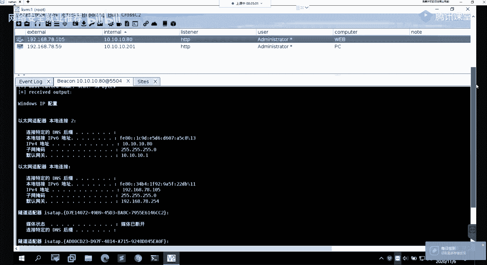
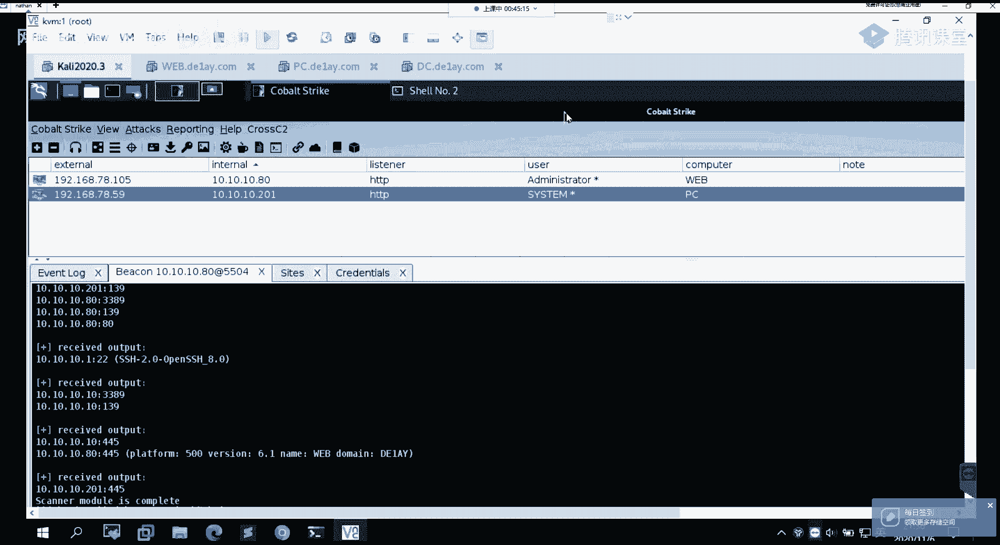

# 【B站最系统的网络安全教程】北大大佬196小时讲完的网安教程，全程干货无废话！学完即可就业，别在盲目自学了！！！ - P80：第50天：内网横向移动-smbexec、psexec、wmiexec、sharpRDP - 网络安全就业推荐 - BV1Zu411s79i

知道，呃我们继续啊，呃还在的同学扣个一吧，在讨论区扣个一，能听到我声音的，还在的同学在讨论区扣个一吧，我怎么呃，我怎么感觉大家是不是在挂机啊，就没有没有没有在听啊，都没人没人说话什么的。

就我上节课讲的那些内容的话，大家有没有什么疑问，有没有什么问题呃，有问题的扣一，没问题的扣二吧，怎么都不回呢，喂，能能能听到我说话吗，对啊有问题的扣一，没问题的扣二呃，你这直接扣三，这么自觉吗，那行吧。

那我那我懂懂懂你们意思呃，那我继续吧，我就继续讲吧。

呃这边的话。

上节课给大家介绍了这样子的一个w mi的，ex e c的这样子的一个啊脚本的一个使用对吧，然后的话在这边的话，我们是能够去直接用它来去执行命令对吧，然后的话返回结果。

然后下面的话我们可以通过这样子的一个，就是啊通过shell的一个参数，我们来能够去直接的去得到这样子的一个，得到一个这样子一个c m一的一个绘画。

而这边的话我们先来呃，我大概的演示一下，他一个使用吧，三点，504，好这边的话就是有在执行了执行之后的话，他在这边他会有回血结果对吧，可以看到这边的话，就是直接把户外mi执行命令的一个结果。

给回形出来了，然后的话其实我们这边执行命令对吧，就我们就啊不要就是固化自己的一个思维啊，就是我这边既然能执行命令，那么我就能够去反抗希尔嘛对吧，我这边的一个执行的命令的话。

我自然的话可以就是更改成就是反弹，一个需要反弹到我这边的这个，比如说我这边的这个，和cs，比如说我这边的话就用这一个。

没意思，我这边的话就用这样子的一个生成的，这样的一个抛shi的一个脚本，然后的话用m h ta的一个方法去进行一个加载，然后这边执行，然后在这边的话执行之后的话，它的一个意思其实就是呃。

它会在我这边的一个远程机器上面，他会去执行这样的一个命令对吧，那么他执行的这个命令的话，他就会他会去可以看到对吧，它会执行这个命令，然后这边执行这个命令的话，他就会去呃解释执行。

我这边4s服务端的这个脚本，然后他解释执行这个脚本的话，我这边的话就能够去接收到他的一个需要，也是这边可以看到多了这样子的一个呃，这样子的一个绘画是吧，诶时间呢怎么看不到时间，这边的话就是这个可以看到。

其他的话，这些我都我都退掉了呀，remove掉，就是这个话就是刚刚过来的对吧，它是通过poshell脚本的一个加载，来得到这样子的一个绘画，然后可以看到我这边它是基于这个呃，110。8的这个跳板机对吧。

然后得到这个10。20的这个，机器的一个绘画，以及在呃。

哎这边这边的这个分辨率太高了呀。

所以的话，就是在这边看的话就小了，以及的话在我们的一个msf上面也是同样的。

唉不能复制。

哎我这边我这边不不给大家演示了吧。

好吧呃有有有问题吗，就是我这边的话我就不敲了，就是呃大家自己课后去自己操作吧好吧，我这边的话手敲的话有点浪费时间啊。

然后我这边的话就是继续给大家介绍吧，啊其实具体的一个效果的话，我这边都截图了，就是呃因为在这边的话，那在这边的话，我们无法去直接得到这样一个，报办交互的一个模式，就是在4s上面对吧。

我们可以直接我们可以去执行命令，以及我们可以直接去反他一个shell对吧，那我们反弹shell之后，我就直接都达到了我的一个目的对吧，然后我在这边的话，我得到这样子的一个呃，通过这样子的一个方法。

得到这样一个半交互模式，其实也是一样的对吧，它同样的也是能够去啊，在远程机上面进入一个sm t，趋近一个操作嘛对吧，然后在这边的话呃，它的一个效果啊，就像这样子，就是第二个的这个w m i c。

就是呃解决了前面的这个w m i c的，没有回血的这样子的一个问题啊，然后第三个就是呃在m m sf下面的一些，就是横向移动的这样的一些模块，我这边的话会给大家介绍这样子的三个模块。

就以这三个模块为例吧，好呃，首先第一个就是这个p s e x e c的一个command，而这个的话其实从字面意思的话，我们也能够知道，其实它的一个呃原理的话，它其实也是就是跟我们前面讲的那个。

p s e x一的一个原理都是类似的，然后这边的话它是把它集成到了，我们的一个msf上面去了，那么我就可以直接在msf上面去进行，这样子的一个操作对吧，就不需不需要说我再通过上传这样子的一个啊。

p s e x e c的这样子的一个文件，然后的话再去进行一个执行命令，或者说呃反弹性对吧，那么在这的话就是关于这个模块，它的一个详细的一个使用啊，呃关于msf的这些模块使用的话，我就不多说了对吧。

现在的话大家应该都很熟悉了，这些的话应该都是基本操作好吧，然后这边的话就大概的说一下它的一个呃，它的一个就是功能作用啊，就它的功能就是去执行命令，就我们可以看到就是command嘛，就是去执行命令。

然后他在这边的话执行一个命的话，就是我们在这边set的一个command，比如说我这边set的话是一个户外mi是吧，那么他会通过这样子的一个就是ps ex ec，来去执行我们这边的一个换mi的一个命令。

然后的话回信结果给我们对吧，在这边，然后第二个的话就是这个ps ex 1 c，这个的话就是，这个的话这个模块的话，就是我们可以直接的去得到一个match part，一个绘画，也就是说呃。

他的这个模块跟前面的话，这个不同的一个地方的话，就是我们在这边的话，它只是会去执行我们这边设置的一个命令是吧，那么他在这边的话，我们可以去设置payload，也就是我这边呃用p s e s e c。

用用这样子的一个模块呃，我这边配置好执行之后的话，他会去呃得到这样子的一个matt的一个绘画，也就是我们可以直接去得到啊，远程的这个2201的这个机器的一个matx，by一个session会话。

呃以及第三个的这个就是m s17020 的，这样的一个command，就是利用的一个三本的一个那个啊，其实这个的话就是我们前我前面也有提对吧，就是这个17020的话呢，他有去利用。

它是利用的三本的一个这样子的一个呃，协议的一个漏洞对吧，那么三本这个协议的话，就说我们呃，它是一个网络文件共享的这样子的一个协议，对吧，那它的一个作用的话，就是我们呃不同的一个计算机上面的话。

我们要去共享这样子的一些文件或者说服务，那么他会去使用这样的一个sb协议，去进行一个通信，然后的话呃sb协议通信的话，比如说我这边要去访问远程主机的一个，三本服务对吧。

我这边需要去提供啊一个账号密码对吧，然后的话才能够去进行一个登录验证，那么我这边的话知道他一个账号密码的话，我就可以用这样的一个三本的一个呃服务，来去得到来去执行命令，以及能够去得到啊筛选的一个绘画。

这句话就是呃这个模块的一个十，然后呃我这边的话，同样的就是设置了一个执行的命令的话，是这个hui的一个命令，然后它的一个结果就是呃形式在这边对吧，然后的话呃，第二个的话就是介绍一下。

msf下面的一个token窃取，然后其实这边的一个token窃取的话，在前面的话已经有给大家介绍了是吧，已经留给大家介绍，然后我看大家的一个作业的话，大家也对这个的话完成的都是没问题的对吧。

就我利用这样子的个呃token的一个窃取，来推荐一个提权是吧，那么在这边的话，我们的，这边的这个token接取要跟前面的话也是一样的，就是在msf当中的话，我们可以使用这样子的一个模块。

这个啊encore encorneal，这样子的一个模块来实现这样的一个token窃取，然后他的这个msf下面的这个这个token，窃取的一个工具，它其实就是从windows下面。

从windows平台下面的那个呃工具移植过来的，然后这边的话就是它的一个使用的一个方法，就我们在msf里面的一个使用步骤的话，就是我们首先需要去加载这样一个模块，就使用这个load命令。

然后加载这个ink inconnor这样子的一个模，这样子的一个模块，然后你加载这个模块之后的话，你可以在msi下面去执行一个help，执行这个help命令之后的话。

你会你就能够去在他的一个帮助选项当中，找到这样子，这个in conneo这个模块的，一个使用的一个帮助的一个信息对吧，以及它的一个选项，然后呃在这边的话，我们常用的这样子的一些命令。

就是首先第一个就是list tok，就是list的token的话，就是我们调用这个模块来去呃，列出当前的单纯计算机上面的，所存在的这样子的一些token啊，我在这边的话，哇，实在不好意思啊，可爱的我。

我这就是一讲话就有点咳啊，就是有点咳的，有点难受，然后呃中间讲课的时候，可能就是有这样的一些停转，然后哎再次说声抱歉吧好吧，就希望大家呃不影响大家听课，就是希望大家希望能够不影响大家听课。

而在这句话在讲这个token之前的话，这边就是还是介绍一下这个token，就是对token的一个简介，然后其实这边的话前面前面在讲，那个时候的话已经有给大家介绍了是吧，然后在这的话再重新就是回顾一下。

就是啊，windows下面的话有这样子的两种类型的一个token，首先第一句话就是这个delegate，delegate，选择这样的一个token就是授权硬盘，然后他的这个token的话。

它的一个作用就是用于交互绘画的一个登录像，比如说我们用本地的用户，直接去进行一个远程桌面的一个登录，就比如说我这边我这边通过i d p对吧，去连接到我这边的一个靶机，那么它就会在他的机器上面。

就是说你使用什么样子的一个用户，去登录的这样子的一个机器，那么它就会在这个机器上面去生成，对应的这样子的一个用户权限的一个token，也就是这边所说的一个授权令牌。

然后第二个就是这个impression，impressional这样子的一个token，也就是模拟令牌，就他的这个模拟令牌的一个作用，就是用于非交互的这样子的一个登录。

就是比如说我们用net use来去访问，这样子的文件共享对吧，那么我们所使用的就是这样子的一个，模拟的一个令牌，然后这边的token的话，这两种token它只有在系统重启之后，他才会去清除，也就是说。

也就是说，他只要有用户去登录这样子的一个机器，那么他就会去在这个机器上面去生成，这样子的一个token，就说它是用什么样子的一个方式去进行的，一个登录的话，它就会生成对应的一个token。

然后的话在这边的话有这样子的一个，有这样子的一个需要注意的一个点，就是具有这样子的一个授权令牌的，这样子的一个用户，他在注销之后啊，它的一个token，它会变成这样子的一个impassion in。

python nation的一个token，然后这个token的话它是依然有效的，也就是说它系统它没有重启，那么它这个token的话它就有效呃，什么意思呢，就是说就是说比如说我这边用admin的一。

个用户对吧，比如说我这边用这个d类admin的这样子的一个运，用户对吧，登录了这样子的一个机器，那么它在这个机器上面的话，它它就会有生成一个这样子的一个呃。

d类域的一个admin用户的这样子的一个token，那么这个token的话，它会在计算机上面它会有保存对吧，那么保存了这个token的话，当我们对一个当我们的这个机器，它在呃注销之后。

也就是这个用户对吧，我这边这个用户我注销就是，啊就是这边对吧，我注销我注销这个用户，那么我这边注销这个用户之后的话，它的这个呃授权链牌的话，它会变成一个模拟链盘，也就是说它的这一个令牌的话。

我可以通过就是非交互式的这种，反非交互式的登录来去用这个令牌对吧，来去进行一个登录啊，因为他的这个念法就是能够去用于这样的一个，非交互的一个登录嘛，是吧，嗯然后在这边的话呃。

token的一个给大家介绍了一下token，那么下面的话我们来具体的来看一下，就是我们的话去进行一个利用，首先的话我们可以通过这样子的一个list token，这样的一个命令来去列出当前的一个主机。

下面它有哪些token，也就是说像比如说在这边有delegate，delegate，选择这样的一个token对吧，就是说呃在这个主题上面的话，有它有登录的这样子的一个用户。

就是说他有去远程桌面登录的这样子的，一个用户对吧，他把他的一个token列出来了，然后的话下面的话就是有一个impressionation，这样子个token，这个token的话就是呃模拟令牌的这样子。

一个token，也就是我们可以通过像啊net user这样子的一个，非交互登录的一个方法来去进行一个呃登录，然后的话我们在这边的话，我们想要去查看当前的一个token的话。

我们可以直接执行get uid，来去查看当前的一个token，也就是当前的一个用户权限嘛对吧，然后呃关于这个提前自system权限的话，这一革命的话前面讲了很多对吧。

就get system来去进行一个提前，然后token窃取的话，token窃取的一个命令就是这个impressional，就其实这边impression话就是模拟的一个意思吧，就就是模拟令牌。

然后他这边要模拟的一个令牌的话，就是这边指定的这个，像比如说c什么的一个令牌，那么我这边模拟了这样子的一个令牌之后的话，我就能够去得到这样子的一个nt c是什么的，一个权限。

以及的话我们可以从进程当中去窃取token，就是我们可以通过steel token，这样子的一个命令来去借来，去窃取指定进程的指定pad的这样子的这个进程，它所对应的一个用户的一个权限，以及话呃。

我们可以呃通过ie v to set to self以及drop token，在两个命令来去返回之前的一个token，这边返回之前那个token是什么意思呢，就比如说我这边通过这个token的一个窃取。

就模拟令牌对吧，然后的话模拟了这样子的一个令牌，那么它模拟这个令牌之后的话，我当前的一个token的话就变成了这个token，也就是说我这边执行执行get uid的话，我就变成了这个对吧。

但是我之前的话不是这样子的一个token，我是一个命的一个token是吧，那么我想要去回到之前那个token的话，我就可以执行这个i e v to st来去呃，得到原来的一个admin的一个token。

然后具体的一个呃使用的话，就是我这边截图的话已经列出来了，然后呃以及的话我这边有这样子的两个文章啊，两个笔记，就是啊msf的一个token，以及这个啊cs的一个token。

就是在这两个平台下面的一个token，窃取的一个呃使用的一个方法，然后在msf里面的话，就是我刚刚给大家介绍的这一个对吧。

然后呃我们这边的话主要来看一下这一间，在这张截图啊，然后其实大家在作业里面的话有呃，已经有就已经做的挺好的，我发现就是大大都有教那个做的话，应该都有做出来的吧，然后在这边的话。

我再给大家介绍一下这样子的一个token，他的一个就是一些点吧。

以及捋一下思路，以及在这边去从进程当中去窃取token。

他的一个就是他的一个方法，首先的话我们要去使用这样子的一个模块的话，我们要load它对吧，漏了它之后的话，我当前的一个就是token的话，是在一个win 7杠一的这样子的。

一个admin的这样子的一个呃，这样子的一个用户对吧，也就是当前的这个这个是我的一个token，然后的话我在这边的话，我通过steal steal token，然后的话来去进行一个token的一个窃取。

那么这边token窃取的话是4500，那这样子的一个就是进程id为4500的，这样子的一个进程，然后在这边的话，我们呃我上面的话就有省略了，这样子的一个命令，就是其实你执行ps，你在mac下面。

你执行ps之后的话，就能够去列出当前系统下面的一个进程，然后他的这个进程的话，它会显示这样子的一个，像你的一个可执行程序对吧，以及你这边的一个呃用户权限，然后其实这边的话就是显示的一个token是吧。

就跟就其实我们的这样子的一个用户啊，呃就我们的这边的一个用户，就是我们的一个，比如说我这边是一个m n g y的这个域，的一个域名对吧，然后后面的话就是我的一个adminutes，选择一个用户名。

也是我的这边它是一个我的预感的一个用户，以及这一个玉，下面有这样一个win 7杠一的这样的一个用户，对吧，嗯然后其实这边的话就是他的一个token嘛，然后其实跟这边的话也是对应的是，那么在这边的话。

他窃取的是4500的这个进程id的这个token，也就是这个这个4500对吧，因为呃为什么要去窃取这一个的一个token呢，因为我们可以看到就是说他的这个进程，它的一个token的话是这个啊。

我们的一个i n g y，这个域下面的这个administrate，一个用户的一个token是吧，也就是说当前的这个计算机的话，它有就是说它的一个预广的一个用户，有登录这个机器。

然后的话它有创建这样子的对应的一个进程，那么我在这边的话，我就可以通过进程的一个窃取进程，token的一个窃取来窃取这个进程的一个token，那么我实际窃取的一个token。

那就是我这边的一个预管用户的一个token，然后我这边窃取成功之后，我就得到了啊，这边的一个呃，预管的这样子的一个用户权限是吧，然后的话呃，下面这个的话就是一个token的一个就是窃取啊。

就是通过这个impresident token，就是模拟令牌来去啊，模拟我这边想要去得到的，就是想要的一个用户的一个权限，然后我在这边的话，其实你可以看到这边的话这种这种权限的话，他这边有的我们。

也就是他当前的话，这个主机的话有这样子的一些用户，有在处于一个登录的一个状态对吧，然后这边的话我执行这个i e v to self的话，就是呃返回我之前那个token嘛对吧，就是可以看到我之前的话。

本来是这个add面的这个预感的一个用户token，现代化，我变成了一个本地的本地机器的这样子的，一个token是吧，然后的话我在这边的话，我可以通过这个呃token的一个模拟。

就是模拟令牌来去模拟我这边的，比如我这边的这个nt system的这样子的一个token，那么我这边模拟成功之后的话，可以看到这边模拟成功之后，我就能够去得到对应的这样一个system的权限。

这个话就是msf下面的一个token的一个呃，窃取，然后呃其实在这边的话呃，讲这个token窃取对吧，就其实呃跟我们这边的这个课程内容的话，有什么就是关联呢对吧，我们本节课的话是讲的是一个横向移动是吧。

那么我这边的一个token窃取，它在横向移动的时候有什么作用。

就其实对吧，原本的话我，就其实我当前的这一个得到了这个呃，matt pad绘画的这个主机啊对吧，我的一个就是权限的话是这样的一个权限，然后呢我这边通过我token的一个窃取，我这边得到了他的一个预管的。

就预管的这样子的一个权限对吧，那么我得到了他的一个管的权限，那么那么我是不是能够去进行一个，就说以当前预览那个权限去登录其他的，在当前这个域下面的一个主机呢对吧，那么肯定是可以的。

就其实我们再去进行一个内网的。

这样子的一个渗透啊，就是在域内的这样子一个域内渗透的时候。

去进行这样子的一个横向移动，你的，你的最终目的就是去拿到预管的一个权限是吧，而不是去拿到预控的一个权限对吧，那么预控的话对应的对应的一个用户权限的话，就是我们的一个预管理员的一个用户是吧。

因为我们的一个预管理用户的话，我们得到它的一个预管理用户，那么我们就能够去同，我们就能够去得到预控的一个权限是吧，得到预控的一个选怎么去得到呢，就是我们前面所讲到的一个，横向移动的一个方法对吧。

就是我们实际去得到了一个预控的这样子的，一个呃用户密码，或者说得到了他的一个权限对吧，像我们就可以用到前面对应的这样子的，像比如说我们建立一个i p c的一个连接对吧，然后的话来去去来去执行命令。

你就可以用到我们这节课所讲到的这样子，一些外部的一个工具来去进行一个得到预控的。

这样的一个权限，这个话就是呃这个呃token窃取的一个利用，以及它的一个使用方法，呃第四个的话就是我们的一个cop stract，也就是也是我们常用的一个cs，就cs下面的话。

cs下面的话嗯它有自带的这样子的一些功能啊，呃在cs下面的话，我们如何去进行一个这样子的一个，就是呃横向移动的，首先的话，首先的话我们的一个前提，就是已经得到了这样子的一个。

得到了一个基本的一个需要绘画对吧。

所。

烦啊，这边分辨率太高了，这边，就首先的话我这边。

首先我这边得到了这样子的一个啊，稀有黑化对吧，我当前得到一个全息化，是这个就是它它的一个本地组的一个web组的，一个呃admin的这样子的一个权限对吧，然后的话我们在这边换，我得到这样子的一个绘画。

我想要去进行一个横向移动，我们要怎么去进行一个操作呢，就在cs当中我们怎么去操作呢，首先的话我当前的话是呃能够去执行命令对吧，比如说我就是去进行一个相应的一个，信息收集嘛对吧，我肯定需要去啊。

知道一些常常见的，像比如说我当前的一个呃网络情况，就我当前的一个网段的一个情况是，我当前的话是这样子的，有一个10010的这样子的一个网段对吧，那么我要去横向移动的话。

我就是针对这一个内网的这个网站来去，对这一个网段下面的呃，一个内网的一个主机做一个横向的一个移动，来去得到，其他的，就是说在同一网段下面的其他机器的一个绘画，呃，笑对吧，那么在这边的话呃。

我们首先第一个的话就是要去用到，我们前面所说的这样子的一个呃，横向移动的这样子的一个，要去进行横向移动的一个条件对吧，前面的话上节课有有讲对吧，就是你要去进行一个，像。

比如说你要去建立一个i p c的一个零件对吧，那么你需要去知道你需要去知道，就是说在这个网站下面开放了对应的，像比如说445139的这些端口的，一个主机端，以及的话你需要去知道它的对应的一个账号。

一个管理员账号的一个密码对啊，以及他是不是开启了这样一个，i p c的一个共享是吧，那么在这边的话，我在cs当中我如何去得到它的一个。

用户密码呢对吧，就其实在这边在cs上面去得到用户密码的话，其实就是又回到了我们之前所讲的一个，就是内网的一个用户密码的，就是内网的一个密码哈希的一个获取对吧，以及名为密码的一个获取。

就是在cs当中我们如何去进行一个获取，首先的话它的一个步骤的话，就是在这边我们可以直接右键，右键这样子的一个这个呃绘画对吧，然后选择这一个嗯，选择这个access。

然后让他选择这个deer hashes。

然后你选择之后的话，他其实会在这边去执行这样的cash，dp的一个命令，然后的话其实如果你记得这个命换，你直接在这个back下面，你直接执行hash dump，他就能够去列出他他的一个哈希对吧。

然后的话列出这些哈希之后的话，我们可以去对它做一个解密嘛对吧，如果能解出来的话。

那么呃在这边的话，他得到的是一个密码哈希的，那么我想要去得到它一个名为密码呢，我们在这的话它有集成这样这个命令，cut的一个命令对吧，然后的话我们可以直接run这个mini cut，然后这边乱之后的话。

唉这个好大啊。

这边run之后的话，他就会去执行这样子的一个啊，获取当前主机的一个名文密码，的这样子的一个命令是吧，就是执行的这个login password这个命令，然后他执行之后的话。

他就会去获取它的一个当前主机上面的一个密，码以及哈希是吧，然后其实在这里，我们可以看到它的一个账号密码对吧，它的一个铭文的一个账号账号密码，然后在cs当中的话，它的一个账号密码的话。

我们可以在这边去进行一个查看，呃，那个quence是，我们可以在这边real，这边有一个这个credon tn啊，我这边读的标准就是这个这个意思的话，就是凭证的一个意思，然后在这边的话。

我们可以在这边进入到它的这一个啊选项，在他在这边的这个选项的话，它这里的话就列出了我们刚刚所使用到的，像比如说hash dp这个命令对吧，我们使用这个hdmp命令的话，所得到的这个结果。

就是在这边得到的对应的这一个用户的密码哈，希是吧，它会在这边列出来了，以及的话我们在这边使用mini cars这个命令，所得到的对应的一个用户，它的一个铭文的一个密码，以及对应的一个密码哈。

希他在这边也已经列出来了对吧，那么在这边的话，我们知道了对应的一个明文密码以及名密码哈，希我们如何去进一个横向移动，就在cs当中。

我们在这边得到了，就是说呃得到了对应的一个用户的，就是，然后呢对应用户的一个账号密码对吧，那么我们下面的话我们需要去确定。

就是它的一个主机，就是它存活的一个主机，因为我们实际的话我们要去，就是要确定一个横向移动的话，我们需要去确定对吧，确定它的一个这个网站下面有哪一些主机，我们能够去进行一个呃移动嘛。

能够去进行能够去尝试得到它的一个绘画对吧。

那么在这的话，我们就需要去进行一个主机存活的一个探测嘛，然后主机存放探测的话，在这边我们可以使用使用他的这个，或者根这个功能，然后我们这句话我们要去探测的话，是这个网段对吧，然后我们选择它。

然后我们在这边画，我这边的话就不少，他这些端端口就我们探测存存活的话，像比如说我们可以填一些，我们就是常见的这种端口对吧，他比如说139 14 五对吧，像这一些的话是我们要去啊，知道的这样子的一些。

以及像呃，等等的3389对吧，这样子的一些端口我要去探测，然后我这边使用的话，就在内网的话，我们通常会使用a r p的一个方式。

然后的话我们十根点击skin之后的话。

它其实就是执行了这样子的一个命令，就是pd skin的这个命令，然后的话指定网段的话，那指定端口，然后指定我们扫描那个方式，然后他这边的话就会去扫描这个一联网站，存活的一个主机。

以及它对应的一个端口的一个开放情况。

然后在这边的话呃。

让他扫着扫着扫着，这等他扫完之后的话。

它会在这边就我们可以切换了，就我当前当前的话是在这一个，就是这边这个列表下面对吧，好我们在这边可以点这一个点，这个的话在这边的话它就会列出，就是说之前我这边通过就是端口扫描所发现的。

这样子的一些存活的这样子的一个主机对吧，以及它的一个主机名好吧，然后这边就是加粗的这样子的，一个像比如10。8对吧，这个以及这个20。1的话，这边其实就是表示我这边有了它的这样子的，一个绘画。

对吧就是我这边有工具了，因为呃这个的话是我之前的对吧，然后其实实际的话你没有去做这样的攻击的话，其实这边的这个机器的话，它是会像这边10010的这样子的一个颜色，就是比较浅对吧。

那么在这的话我们要去攻击的话，其实这是这个201对吧，我这边，这个把它推掉，这边把它退掉是吧，退掉之后的话，他这边就变灰了，然后我这边的话就可以右键，然后点击这个jump。

就其实就其实我们这边去进行一个，端口的一个探测，其实就是为了找到我们能够去进行一个，而在这个网站能够出现一个攻击的，这些机器对吧，那么在这些机器上面的话，我们可以在这边，我们可以通过一呃右键的这些方法。

来去进行对应的这样子的一些呃攻击啊，然后这句话我们选择jump，然后选择这个p s e x e c，然后选择这个选择一个之后的话，他会在这边有这样子的一个弹框，这边的这个弹框的话其实就是我们刚刚的啊。

所刚刚通过就是密码凭证获取，像通过哈希dp以及mini cut，这两种方法获取到的这样子的一些呃，它的一个啊密码，哈系，以及呃明文密码对应的这样的一个用户对吧，以及还有的话就是域名。

他这边的这些信息的话都显示出来了对吧，那么在这边的话，我们可以去选择就是使用哪一个凭证对吧，因为我们要去就是要去进行这样子的一个嗯，移动的话对吧，我当前这边的话，我得到了它一个明明文密码的一个凭证。

那么我们就可以基于这个凭证来去进行一个，横向移动吧对吧，然后在这边的话我选择的，我选择的话选择这样子的一个选择这个吧，就是d类这一个域下面，我当前只知道我当前是在这个域下面嘛对吧，然后我这边找到了。

就是就获取到了这个这个预管的这个用户啊，然后他的一个明文密码，那么我可以用这个密码，这个明文密码来区进行一个横向移动，来去得到其他的主机的这样子的一个，一个权限对，然后在这边操作的话，我们需要去选择。

就是首先那个就是listen，也就是我们的一个监听器，就是我们这边很像移动之后的话，它会反弹一个绘画给我们好，然后这边session的话，就是我们要去选择我们已经得到的那个，就是跳板机的那个绘画对吧。

因为我们的我们当前的横向移动的这样子的，一个操作对吧，是基于我这边已经得到这个跳板机的，一个绘画的一个操作，好，我们这边乱起乱起之后的话。

我们在这边话可以看到，他在这边的话，他会去执行这样子，这个要么p s e s e c这样子一个命令，然后的话他这边显示的是攻击的一个主机，这边的话是用他的一个主机名代替的，就是pc。

这边的话其实就是表示的是这边的这个啊机器，就是这个201的这个呃机器，然后使用的一个监听t4 这个htp。

然后在这边的话，我们可以看到，我这边他就得到了这个201的这个主机的，它的一个绘画，然后可以看到它是一个system的一个权限。

然后同理的话，还有其他的主机的话，我们都可以通过这样子的一个方法。

来去进行一个横向移动，呃ppt里面的内容的话就是呃详细的一个步骤，我这边的话因为pp的话发给大家嘛，就是我这边讲的话就没有呃，其实就是跟ppt跟ppt里面的内容是一样的，然后这边的话是它的一个效果。

嗯然后的话就是呃同样的，就是前面的话再讲msf对吧，讲了msf的这样的一个横向移动的一些模块，以及在msf下面的一个token的一个窃取，然后在cs当中的话。

同样的我们也能够去进行相应的一个token窃取，来去得到对应的一个权限啊，这个的话就是呃其实这个应该放到前面去了，所以我这边的话放到后面去了，然后的话我这边的话就cs下面的话呃。

大家看那个就是在预期内容的话，我就给给了这样子的一个就是笔记对吧，就这一个cs token的这样子的一个啊笔记，然后这边的话就是嗯，我这边就是通过截图加命令的一个方式，就已经很详细的介绍了。

这样子的一个token窃取的一个步骤，所以我在p p t里面的话，我就没有再加了，就是因为这个文档的话已经给你了，我这边放ppt的话，里面的话其实就呃复制粘贴就扩几张图扩进去，其实还不如这边看文档对吧。

然后这边的话呃我们来一起来了解一下，就是我们在cs当中我们如何进行一个密码呃，在cs当中的话呃，同样的就是使会使用到这样子的一个ink，inconnor这样子的一个程序，因为在msf当中它有自带的。

有就是已经有集成了这样的一个工具对吧，但是在m sf啊，我在而在msf当中是有集成这样子的一个模块，对吧，在cs当中的话，它是没有集成这样的一个模块，然的话你可以通过，就是呃有些已经小小的一个插件。

就是能够去，你直接通过我们的这样子的一个啊，鼠标的一个操作，来去利用这样子的一个呃工具啊，然后在这边的话，我是直接就是把这样的一个工具，上传到我的一个目目标机上面去，就上传到我的一个跳板机。

然后的话我再再通过cs的一个绘画，来去进行一个执行，然后其实这边的一个执行的一个命令的话，其实就是我们msf当中，msf的这样子的一些命令，跟这边的一个命令其实都是也是类似的对吧。

因为其实m3 f这边的话，它同样的也是这边的这个工具移植过来对吧，好像比如说你列举token，他这边的话只只是直接执行这个list token，干u就能够去列举列举token对吧，那么在啊。

用这样子的一个啊可执行程序去执行的话，我们就在这个可执行程序后面，加我们的一个命令是吧，像比如说加我们的一个list token，喂呃应该能听到声音吧，然后的话在这边的话。

我们加这样子的一个this token干u，我们就能够去列举出当前的这样子的一个呃，当前这一个主机下面的呃，存在着这样子的一些token，好啊，可以看到这些话有这样子的一些token存在对吧。

像呃这样子的一个运用户，win 7杠一的这样子，一个m i g y域下面的这样的一个运用户，以及有这样的一个这个win 7杠一，这个主机下面的一个台面的一个本地主用户。

还有其他的这样子的一些内置的这样子的一些，内置的这样子一些用户的一些呃token对，然后在这边的话，在这边的话我有通过这样子的一个方法，就是给大家就是通过这边的两个截图啊，来给大家。

就是让大家能够去更好的去理解，就是这边的一个token啊，就是这边这两种token，它的一个呃实际的一个效果，首先的话在第一第一种情况下的话，就是我这边的这个呃预管的一个用户。

他没有去登录这样子的一个机器的时候，我们可以看一下，当前的话，他是没有这样子的一个m m n g y干admin的，这样子一个token的对吧，那么当我在这边，我用这个啊预管理。

预管用户去登录这个主机之后的话，它会它就会在这样子的一个主机上面，他会去保存有这样子的一个token，就这个m n g y administrator这样子的个token。

这边的话是他登我这边登录之后的，它就会有这样的一个token，也就是说呃就是其实就是这边吧，就是授权令牌的一个理解是吧，就是我这边呃通过桌面的一个登录对吧，本用户直接登录之后的话。

它就会生成这样子的一个delegation的，这样的一个token，然而下面的话就是呃实际的一个使用哪个方法，就是我们如何去利用这样子的一个token，来去进行一个，比如说在这边去反他一个shell。

这边法德西尔的一个方法，就是用他的这个ex ec呃，就是execute这样子的一个参数，然后加一个杠c的一个选项，这边sq的话就是其实就是以当前的这边，杠c后面指定的这样一个权限。

来去执行我这边的一个命令，然后在这边的话，在这边的话就是以这边我要去啊，我这边指定的一个token的话，是这个呃，我的一个m m n g y u，下面的一个管理员的账户对吧，然后我这边执行一个命的话。

就是执执行我这边反弹，反弹希尔的这样子的一个命令啊，那么我这边之前的一个效果的话，就是我我当前的话，其实我当前的话它的一个权限是这边的呃，我这边没截图吗，我当前的哦，这边我当前的这样子的一个用户的话。

应该呃是这样子的一个，就是啊本地管本地管理员组的一个用户，就它不是域内的一个用户，它是一个就是win 7杠一的一个主机，下面的这个add面的一个管理员用户，这个权限是吧，那么我一个关于那个权限。

我想要去就是得到这样子的一个，预管的一个权限对吧，来去反弹一个预管的一个权限的一个绘画，那么我在这边画，因为他的这个呃预管那个token，我们是能够在这边能够获取到的。

也就是能够去啊窃取他这边域管的一个token，或者说去模拟它的一个token，来去执行对应的一个命令，那么我们对应的话就会去以这样子的一个，预管的一个权限去执行呃，这样的一个命令。

来去得到对应的一个呃预感的一个权限，那么在这边执行之后的话，它的一个效果的话，就是在cs当中，我能够去接收到一个呃一个呃，mig yu下面的一个管理员的一个绘画，然后的话呃下面的话在这边话就是呃。

在嗯我们的一个cs当中，我们如何去建一个token的一个窃取，然后在cs当中的一个token窃取的话，我们看一下这边的这一个图啊，这边的这个截图的话，其实呃我当前的一个绘画啊。

权限的话是这个admin的权限对吧，那么我这边的话呃通过窃取他的一个token，就是这个啊4500的进程id的这个token，然后这个进程的他的一个token的话，是这个域管的一个token。

那么我窃取他的一个token之后的话，我就能够去模拟它的一个token，来去得到这个预管的一个权限，大家可以看到啊，我这边就直接得到了它的一个呃，预管的一个权限，那么我在这边的话。

我得到了一个预管的权限的话，那我们就我就可以在这边啊，基于这个权限来去得到一个啊，预管理用户的这样子的一个绘画，然后在这边的话得到预管理用户的绘画的，一个面的话，就是通过cs的一个十分。

来去创建这样的一个绘画，好在这边的话，这边的使用这个命令的话，就是通过这个s p a w a n s，就大家在cs当中可以去啊，找到了这样的一个命令，好的话呃，这个命令的话这边的话，它的一个呃。

他的一个执行的一个就是命令的格式的话，就是像这样子就是域名，然后加我们那个用户名，然后的话接我们那个密码，然后在这边的话，我我就可以通过这样子的一个s p a w，a s的一个方法。

来去得到这样一个预览的用户的一个绘画，然后这边执行之后的话，我在cs当中，我就能够去接收到一个来自于管的一个绘画，呃然后的话呃下一面的话就是这个make a token。

make token的话就是我们的一个令牌的一个制作，就呃前面的话我们是去进行一个，就是我们基于已经得到了这样子的一个，就是账号密码对吧，来去进行一个呃，得到对应的一个，得到对应权限的这样子的一个绘画。

以及基于就是说，以及就是基于主机上面，它所存放的对应权限的这样的一个token对吧，我们通过窃取或者说去模拟它的一个token，来去得到对应用户的一个权限是吧，那么在这边的话。

我们如果说我们得到了对应的一个账号对吧，在cs当中，我们通过mini cards得到了对应的一个账号，以及密码，那么我们可以通过这个make token，来去制作对应的一个令牌。

然后的话我得到了这样子的一个令牌之后的话，我可以去进行一个模拟，模拟它的一个令牌，令牌，我模拟他的一个令牌之后的话，我就能够去基于这个令牌，去进行相应的一些操作，就是说以对应的一个令牌的。

你这边我模拟的令牌的一个权限，去执行对应的一个操作，首先在这边的话呃，具体的一个方法就是我这边make a token，然后的话在这边指定这样子的一个啊，我要去模拟了这样子啊。

我要去制作的这样子的一个啊，玉以及它的一个运用户对吧，然后的话接下来一个密码，那么在这边的话我执行之后的话，他在这边的话，我就能够去模拟到这样子的一个呃，对应的这样子的一个用户啊。

然后的话我就能够去对应的一个用户的一个，权限去执行这样的一个命令，像比如说在这边的话呃，在这边的话，当前的这个主机的话，我是一个就是啊管理员组的这样子的一个，就是admin的一个用户。

它不是域内的一个用户，然后的话他是无法直接去，就是直接去访问这样子的一个呃，访问这一这边的，我这边这个机器的话ip啊它是一个预控啊，是预控的一个ip，他是无法直接的去访问这样子的一个预控。

下面的一个呃磁盘的对吧，然后的话在这边的话，我可以通过make a token，来去自来去制作这样子的一个token，就这边的制作一个token的话，是域内的这样子的一个用户，是这样子的一个呃。

就是m i n g y。com，这样的一个域内的一个win 7的这样的一个用户，那么我这边呃得到了这样子的一个token，之后的话，我就能够去以这边的一个token的一个权限，来去呃。

访问这样子的一个就是访问这边的一个预控，下面的这样的一个呃磁盘的一个文件，呃这边这边这边命令的话，对应的话是这个截图，这边的这个截图，然后的话我呃也可以就直接，我直接通过sps来去得到对应的。

这样子的一个呃权限的这样子的一个图，这样子的一个呃绘画，以及的话在cs当中，我们同样的也可以去进行一个token的一个窃取，就是第二token，然后的话它的一个操作的话，跟在msf当中的话是一样的。

诶这边的话呃，这边这边重复了，就是其实就是这边的，然后我们可以通过就是通过steel token，来去窃取对应的这个呃，对应的这样子的一个广域管权限的，这样子的一个进程的一个token。

然后的话我就能够去得到对应的一个权限。

这样的话就是cs下面的一个token的一个窃取。

这边的话，我们来看一下。

我当前的话这边的话是呃，这这样子的一个用户对吧。

然后的话我这边的话有得到了对应的，这样子的一些这样子的一些嗯，首先，找找这篇文档的操作，首先呢我们在cs当中。

我们可以用这样子的一个工具来去，而列举当前的一些token对吧。

就是在当前这个主机上面所存在的一些token，我们可以通过我们已经上传上去的，这样子的一个工具，然后我们这边执行之后的话，可以看到这边的话有这样子的一些token对吧，我们在这边可以看到有这样子的一个。

预管用户的一个登录对吧，然后我当前的一个token的话是这个web ji就是web，就是一个当前的一个主机的一个用户，就主机下面那个管理用户，它不是一个域内的一个用户。

然后的话呃在这关于这边的一个对比的话，大家可以自己再去操作一下，就是应该在你的一个靶机当中，你把这样的一个预防的一个账号，你把它注销掉啊，你注销之后的话，你的你的这边的这个token的话，它就会没有。

然后的话你会在外星，会在这边他会有这样子的模拟的一个token，老特曼就是。

然后的话就是我刚刚所讲的，所讲到的这样子的一些操作，这边的话我就不一一的去那个去操作了，我这边的话就像比如说这个用这个工具去执行，这个的话，我这话大家自己去尝试啊对吧，然后我这边的话就是因为这边的话。

它的一个操作的话，跟在前面讲的那个就是windows下面的，用这个去进行一个这样的一个操作，其实是类似的啊，然后这边的话我介绍一下，就是前面没有说到的，像比如说make token。

我们要去制作对应权限的一个令牌。

我当前的一个念法还是这个web minister，然后的话我这边的话我要去制作一个token，然后我这边制作一个token的话，是，比如说我这边我已经通过前面的这样子的一个。

哈希的获取，我知道像比如说我这边那个体内域下面的，这个管理员的一个账号对吧，我要去模拟它的这样子的一个token，那么你通过这样的一个操作，给我们的一个，账号密码。

然后我这边make token之后的话，我这边就，能够去得到他的这样子的一个token，啊这里写错了，这边的话，好可以看到对吧，我这边呃呃刚刚忘记对比了啊，这边的话对比的话就不对比了。

就肯定的话呃我这边的话是这个预控，我这边的这个呃ip的话是预控的一个ip，然后我这边的一个命令的一个意思的话，就是我这边去啊访问这边预控的这个c盘是吧，然后的话如果说你你不是一个域内的一个用户。

以及你的这个用户，你是没有权限去访问，或者说去登录这样子的一个预控的话，那么你是无没，你是无法通过这样的一个呃dr来去呃，获取到这样子的一个呃，这边的这个预控下面的一个c盘的一个，目录的一个内容的对吧。

然后我当前的话是，我之前的话是一个这个web的面的一个用户对吧，我肯定是没有全新去访问这个域控的对吧，那么我这边为什么能够去访问呢，是因为我这边的话我通过make token，我制作了这样子的一个。

就是我通过前面得到这样子的一个账号，以及对应的一个密码对吧，我制作了这样子的一个token，那么我这边制作的一个token的意思的话，就是代表我这边得到了这样子的一个，得到了这样子的一个呃。

就是这个delay下面那个管理员的一个token，也就是对应的一个权限对吧，那么我这边得到它一个权限，我自然的话我就能够能够去访问到，预控下面的这样子的一个，它的一个c盘的一个木桩呃。

我这边的话可以通过i e i e v to server server，来去做一个就token清空了，就是把我们把我之前就制作了一个token，或者说模拟的一个token全都清除掉。

然后的话我现在我再去进行一个这样子的一个，访问的话，你会发现的话它是就是登录失败的，就是你没有没有对应的一个权限，就是你当前的这样子的一个token的话，是你没有权限去访问的。

然后我担心了一个token的话，是这个呃这个嘛对吧，他是没有权限去访问预控的，然后这边的话就是这个关于这个make token。

就是制作对应的一个令牌，然后的话去进行对应的一个访问。

以及的话就是第二token，也就是一个呃token的一个窃取，然后这边token窃取的话，我们可以就直接执行ps，然后的话我们这边的话就能够去列出对应的，一个进程，以及它对应的一个权限是吧。

然后我们这边要去模拟的话，比如说我这边要去模拟这个比例激励admin，这个对吧，然后我们找到这个预管的这个对应的一个进程，它所对应的一个id，就是这个3716的这个id对吧。

那么我这边的话我就可以通过stl token，然后的话接我这个进程id，我就能够去得到这个对应的一个token是吧，那么我当前的话就是得到了这样的一个权限，这个应该是可以的，怎么拒绝访问呢。

这边怎么访问不到呢，没错，201是可以的，预控怎么不行呢，就是啊，我当前的话，当前的这个主机的话是1008年的这个主机，啊对吧，然后的话我这边的呃，窃取的一个token的话是这个预管的这个token。

就按你说的话，这边应该是可以去访问到预控的这样的，一个c盘的，然后这边访问这个201的话是没有问题啊，就是原本的话，原本的话，如果说他原本的一个token，是这个admin的这个token是吧。

它我们可以r e v to solve，我们来就是以原本的一个token来去尝试访问，这个n0。20。201个c盘，应该是访问不到的对吧，可以看到他这边原本的一个token的话，是反应不到是吧。

然后的话我们通过这样的一个token窃取的话，在这话是可以去访问到这边的，因为我这边的话是一个预览的一个token是吧，当时这边余空为什么这么奇怪呢，就按理说是呃能够。

我既然能够去以一个当前的这个预感的一个，token去访问其他的一个主机的话，访问预控应该也是没有问题的。

呃这边的话就是一个token的一个tech。

以及这边的话是我这边还是通过命令的一个，方法去做的这样子的一个啊操作对吧，然后其实在这边的话，你可以通过explore这边有这样子的一个process list。

也就是我的一个进程列表嘛，是就是可以在这边去通过这样子的一个，图形化的一个界面，就图形的一个界面嗯，来去进行一个这样的一个操作，就在这边对吧，他有这样子的一些选项啊。

我们找到一个像比如说我这边找到这一个，嗯这个对吧，delete administra的这样子的一个预览的，这样子的一个绘画对吧，然后我这边可以有这样子的一个steel token。

然而其实这边你执行之后的话，你点击这边执行之后的话对吧，它steel token，然后其实他这边执行的一个面的话，其实就是我刚刚呃，在这边back on下面所执行的一个命令。

就是执行这个steel token加我们的一个进程id，我们这边的话就能够去得到对应的一个，就窃取到对应的一个token啊，其实就是大家用手的话，直接在这边bin下面直接执行命令，就直接执行命令对吧。

我直接ps去查看对应的进程，然后的话如果就是大家对面那不熟悉的话，你就可以在这边通过就是图形化的界面，去进行一个操作，是吧都是可以的，这个话就是呃cs下面的这样子的一个，token的一个窃取。

而这里的话是前面没有介绍到的。

然后这边的话给大家就是做一个介绍，那么对应的就是呃，跟前面讲msf的一个token窃取是一样的对吧，就我们得到了对应一个token，那么我就可以对应的一个token，那个权限趋近应该横向移动嘛对吧。

呃以及最后的就是第五个就是这个削法dp，这个的话就是给大家介绍一下，有这样子的一个方法吧，就是可以利用这样子的一个远程桌面协议，的一个控制台的应用程序，然后的话我们可以用它来去进行一个，横向的一个移动。

就是它的一个作用的话，它能够去对横向的目标去执行，经过身份验证的一个命令控制，就是命令执行什么意思呢，就是我可以利用这样子的一个程序啊，来去进行一个啊执行对应的一个命令，然后他的一个执行的一个方法啊。

就像这样子，这边截大家看我这边的截图，就是它的一个使用，就是我这边通过这个chef i d p，然后的话接我这边的一个computer name，也就是我这边要去呃。

在指定的这个远程机器上面去执行的一个呃，执行命令的这样子的一个主机，也就是说我要去移动的一个目标主机，然后的话这边common的话，就是接我们执行的一个命令，我这边还是执行的一个posher的一个反弹。

shell的一个amelia是吧，然后在这边的话，就是大家也可以同样的就是灵活的去使用的，就是我这边可以抛弃以及可以用呃，刚刚就常用的m h t h加载，我们的一个跨线是吧。

以及还有其他的等等的这样子的windows下面去，法兰西亚的这样子的一些命令，我们都可以在这边就是套嘛对吧，就是套进去用就可以了，然后的话后面的话就接我们的一个呃，我们要去提供一个这样子的一个身份验证。

也就是说我们要去提供一个账号密码，对应的呃主机的这样的一个账号密码，然后的话我们就能够去在目标机上面去执行，对应的一个命令，然后的话得到对应的一个绘画。

呃这边的话看一下。

我这边的话是之前因为我现在还是在家里，我在家里讲，那个这个话是我之前在公司就是操作了是吧，然后这边的话我这边执行之后的话，他执行了一个变化，就是像这样子，就是它会执行这个m s h ta。

然后的话呃加的我这边远程的这一个cs，服务端的一个发泄的一个脚本，然后的话我在这边的话就能够得到线，当然的话在这个话他是没有回血的，注意的话嗯，嗯他只是能够在利用它来去，在远程的一个主机上面去啊。

执行我们的一个命令，就其实呃功能的话跟前面我们的呃，像p s e x e c这样子的一个呃面的话，它是一样的，当然的话它的原理是不一样的。

关于这个具体的一个原理的话，呃我这边有这样的一个文章，大家可以去看一下，然后本节课这边的话我就呃，那科三的话，我这边的话，我就我再跟大家啰嗦这个了，大家自己去看一下这个。

呃以上的话就是我们本节课的一个内容啊，然后呃还在的同学有有没有什么疑问。

呃有问题的扣一，没问题的扣二，然后自己课后去操作的扣三啊啊。

呃20 20有问题还是没问题来着，这有问题的扣一，没问题的扣二，然后自己扣去操作的话，扣三呃，其实嗯好的，没问题，应该应该是没问题的，唉这些东西的话怎么说呢，呃就是大家应该就听我介绍介绍一遍之后的话。

应该就能够理解了，是因为都是就是啊，就是这些这些常用的一些外部的人来去进，横向移动一些工具的一个使用，以及的话就是好在本节课的话就是不同的一个，就是可能，可能就是有难点的一个点，一些点的话就是在。

而在msf以及cs当中的这样子的一个，token的一个窃取是吧，这个的话是大家没有去操作过的，然后的话就是大家在呃在cs以及msf当中，我们去进行对应的这样子的一些呃，这样子的一些工具的使用。

就是大家大家一定要就说不要局限，就不要局限于说我ppt里面的这样子的一个，一个操作的，就比如说我这边是在cs当中操作，那么你你也一定要在cs当中操作的，这不是不是一定的啊。

我这边我还特意就是我这边是在cs当中操作，我这边的话就放到msf是吧，就是通过这样子的例子，让大家就是去理解，就是说我实际的话，在cs当中，我以及在msf当中，我都可以去进行这样子的一个操作。

来达到一个横向移动的一个目的，然后其他同学呢，呃我发现每次都是这几位同学啊，就其他同学都都不说话的，都就然后我问我问大家，我问大家有没有问题，或者说呃能不能理解大家也没有什么反馈啊。

我发现这样就是没有交流的话，我总是就感觉，就我不知道大家就是能不能去理解的，就还是之前跟大家说的，就是你不反馈给我的话，我不知道，我不知道你们能不能理解，以及我哪里讲的，是不是有有没有什么问题等等的。

这样子的一些东西的吧，好啊，大家都不回的话，我就默认没有问题了好吧，然后的话嗯，然后的话呃在这边的话我再提一下这个吧，就是这个shop r d p，这个，这个的话大家可以在我这边的这篇文章里面。

找到这样子一个项目对吧，找到这个项目就是这里啊这里的这个项目，然后的话你把这个项目你把它给扣下来，扣下来之后的话，你在这边的话你会发现，因为他这边也没有去编译啊，所以的话这个工具的话。

你需要去自己去做一个编译。

然后这边的话就顺便的提一下，就是我们如何去编译这样子的一些呃，我们如何去编译这样子的一些呃工具啊，首先在这边的话呃，我把这边的，这边还是我已经编译好的，我这边我把这边编译的把它给删掉，然后你这边的话呃。

就是你实际下载之后的一个项目的话，就是哎我这边哦，不是这个吧，这里是sharp dmp，这边搞错了，是这个小法dp对吧，我以这个为例，然后你这边你找到这一个项目对吧，你这边通过git clan。

然后把它克隆下来之后，他就像这样子的一个文件夹对吧，然后的话这边的这个文件夹的话，他在这边的话，它是没有像这边有这样子的一个可执行程序的，这个话是我有编译的嗯，那么你下载之后的话。

就是像这样子的一个文件对吧，然后这边的话也没有已经编译好的，这种可执行的一个程序，然后实际的话它是会像这样子的，就实际使用的话，我们需要生成这样子的一个1x一的，这样子的一个可执行程序对吧。

然后碰到这样子的一个情况的话，我们怎么去进一个编译，就是有同学知道了，就是呃像这样子的一些呃github下面的一些项目，我们怎么去进行一个编译，来去得到对应的一个可执行的一个程序，就是啊知道的同学扣一。

不知道的扣二，或者说呃有自己去这样子编译过的扣一，没有没有没有这样子去做过的扣二，呃呃就是没没有去这样子尝试过对吧，那么在这边的话，我这边话就给大家介绍一下吧，因为这些的话就是就有很多这样子的一些东西。

就是别人已经写好了一些项目对吧，你想要去或者说你你懂你懂它的一个代码，你想要自己去做一个更改对吧，好的话，你更改之后的话，你要去做一个编译对吧，那么这个时候我们怎么去操作呢，首先的话你需要去。

就是说像在这一些这些项目的话，我们可以在他这边的项目这边可以查看到，他这边的话是一个呃c shop的一个语言对吧，那么像这种c shop的这种语言的话，我们在windows它是windows下面的这种。

这样子的一个编程的一个语言对吧，那么在windows下面去进行这样子的一个，像控制台的一个编程啊，以及啊对应的一个dl啊，程序程序的任务编程的话。

我们都需要去用到这样子的一个visual visual studio，这样子的一个工具，就它是一个就集成的一个id的一个工具嘛对吧，然后的话呃大家可以去下载安装，就我建议的话，大家呃在电脑里面去安装。

你安装好这样子的一个工具。

然后安装好之后的话，安装好之后的话，像这样子的一些项目，他一般的话他会有这样的点sl的，这样子的一个啊文这样子的一个文件，这个文件的话其实就是它的一个呃，解决方案的这样子的一个呃文件。

然后的话我们只需要就是双击打开，这样子的一个，就是在visual studio里面打开这样的一个文件。

打开之后的话，在这边它就会有对应的一个解决方案对吧，他这边总共就一个项目，就是这个消f rd p，然后这边的话他就有对应的对应的这样子的，写代码对吧，你可以如果你懂的话，你可以自己去做一个做一个更改。

就你想要去达到自己想要的一个功能对吧，你可以去更改它的这样的一些代码，在这边去进行一个操作，好的话，你只是想要去我们只是想要去用它的一个工具，对我想要去做一个编译，那么就是编译的话就很简单。

就我们只需要在这边，右键这样子的一个解决方案，就是右键它右键之后的话，我们这边啊在去编译之前的话，我们这边需要去选择，就是debug的话，就是调试模式嘛，因为历史的话就是我们就是，呃稳定的一个版本啊。

就是我们编译之后的话，我们在对应的各个的这种平台上面，我们都能够去进行一个使用，然后这边的话选择就默认的就可以了，就和cpu就是针对不同的一个cpu，它都能够去进一个执行。

然后的话我们在在这边去右键点点击，重新生成解决方案，然后的话他在这边的话，他就会去，他就会去做一个编译啊，它会自动的去编译好，因为他这边的话，它解决方案这边的话已经就是已经呃，已经写好了。

然后这边它自动编译之后的话，我们看这边他这边发现就是从全部重新生成，对吧，生成了一个也就是他这边的一个解决方案，它会生成对应的这样子的一个可执行程序，然后的话它的一个可执行程序的路径的话，就在这边。

其实就是在这边的一个项目下面的话，它会生成一个并的一个文件夹，然后这边的话有这样一个release，然后这边release下面的话就有了这样的一个，消防dp的一个程序。

然后我们再对话就可以直接去进行一个使用。

对，这边的话是我们直直接回车之后的话，他这边的话也列举出了这样子的一个工具，它的一个使用方法，然后呃这边的一个使用的话。

大家可以看那个我的那个这边这边的这个比较，这边还有就是呃其实这边他就是你翻译一下吧，就是翻译一下这边的那个，就我这边还用中文的一个方法去翻译了一下，就是表示这边的这个它是一个常规的rtp连接。

然后这边的话就是computer name啊，就是接我们要去连接的一个目标对吧，然后的话我们要去执行一个命令对，然后的话接我们那个用户密码，就是这样子的一个方法，然后还有其他的这样子的用他那个方法。

我这话我就不一的去介绍了。

呃这边的话就是给大家介绍一个，就是应该是说我们要去了解，或者说要去基本掌握的这样子的一个呃。

技技巧啊，或者说技能啊是吧，就是呃你可能你可能你不需要去，你可能你现在你不知道怎么去进行一个改，它的一个代码对吧，但是你你如果说我这边给你这样的一个项目，对吧，我我要让你去用它，那么你你去用它的话。

你你都不知道怎么去把这个项目编译成，可执行的一个可执行的一个文件，然后的话去使用的话，这个的话是比较尴尬的一件事对吧，就我给你这样的一个工具。

你都不知道怎么去编译去使用，是就是编译这样子的一些项目，以及去使用它的话，是一个就是最基本的一个东西啊是吧，是需要大家去亏得要。

呃当然的话。

这边的话就是你只是单纯的去编译的话，是比较简单的对吧，然后我这边的话就给大家介绍一下，这样子的一个操作好吧，看来还是就是也是有同学就是没有没有去做过，没有去尝试做过这样子的一些东西，就你之后的话。

像比如说你github上面对应的这样子的一些啊，工具的一些项目对吧，你要去做一个编译是吧，像比如说你是c语言的，你要怎么去编译的对吧，你要去就是你在windows下面的话。

你在windows上面去执行的话，你就需要有对应的一个i da对吧，你要通过gcc区间一个编译，如果说你在linux上面的话，你直接在linux上面，你直接通过gcc的一个命令去进行一个编译。

是然后这边c sharp，它是windows下面的这样子的一些啊，一个就是针对windows下面的一个编程的一个语言，那么你就需要需要用到这样子的一个呃，就是visual studio这样子的一个id。

id，来去进行一个变异呃，这边的话我就不多说了，呃应该是没有什么问题啊，好啊，我这边ppt的话呃，因为就其实有挺有我这边这些标题什么的，我都没有改哦，所以的话我这边啊我待会儿我改完之后的话。

我再发到群里吧，好吧呃其他的也不多说了，就是也不耽误大家时间了，然后呃最后的话又就是稍微啰嗦了一下好吧，然后的话呃呃还是就是，就是在要下课之前还是再再再再说一句。

就是啊我这边确实就是可能就是我这边咳嗽啊，咳嗽就是我这边讲话的话，一讲话的话就就会就会咳嗽，然后其实我不讲话的话还是不会那个了，就是就嗓子这边的话确实稍微有就是有点难受，还有点问，就是有点小毛病。

然后讲课的时候的话，就是会有这样子的一些呃停顿，或者说呃咳嗽的一个声音，就是还是希望大家就是呃不要介意吧，好吧，就是在说声抱歉吧，呃毕竟这个话是我的问题，就是可能会影响大家的。

就是比如说呃看看看录播的这些同学对吧，就可能会影响大家的这样子的一个体验，好吧，这边的话表示抱歉好吧，希望大家能理解呃，大家听课也辛苦了好吧，就是呃确实我这边唉我自己也觉得，就是我这边就是讲课。

突然就讲着讲着突然就咳一声，确实要我自己，我要我自己去听这样子的一个课，我自己感觉也不是很很很不是会很好是吧，所以的话还是就是说一下，希望大家不要介意好吧，好没有，其他的话，我们下课吧。

就不耽误大家时间了，然后呃祝大家过一个愉快的周末吧，好吧。