# 【B站最系统的网络安全教程】北大大佬196小时讲完的网安教程，全程干货无废话！学完即可就业，别在盲目自学了！！！ - P81：第51天：域内横向移动-域认证及HASH传递攻击 - 网络安全就业推荐 - BV1Zu411s79i

大家晚上好啊，大家能听到我声音的，在讨论去扣个一，好的应该是没有什么问题啊，然后没有其他问题，没有什么问题的话，那我们正式开始我们今天的一个课程内容，而我我们今天的话主要给大家介绍一下。

就是windows的一个认证机制，以及我们的一个p t h，就呃这节课的话主要就给啊，就是今天晚上的话，主要就给大家介绍这两部分的一个内容，就是前面在呃讲那个讲玉的一讲玉的时候。

以及在讲哈希的一个获取的时候对吧，有给大家做一个大概的介绍，就是windows的一个基本的一个认证，就是呃然后前面也有提到了很多次的一个，就是在域内当中的一个通信的时候对吧。

我们会去使用到的一个cas的一个协议，然后在本节课的话就是给大家详细的来解解，来介绍，或者说来带大家就是理解他的这样子的一个，认证的一个过程，就是在windows下面的这几种认证机制。

然后还有的话就是第二个的一个pdh，p d h的话是我们的一个就是哈希传递攻击，也是我们，也是我们经常去使用到的这样子的一个，横向移动的一个攻击方法。

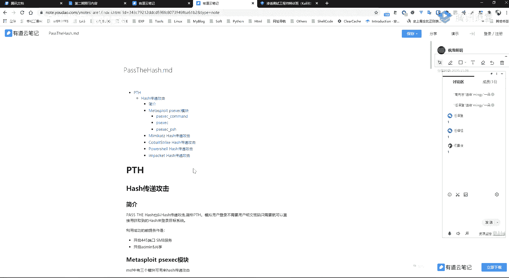

就是呃我们在前面，我们大概的回顾一下，就是说。

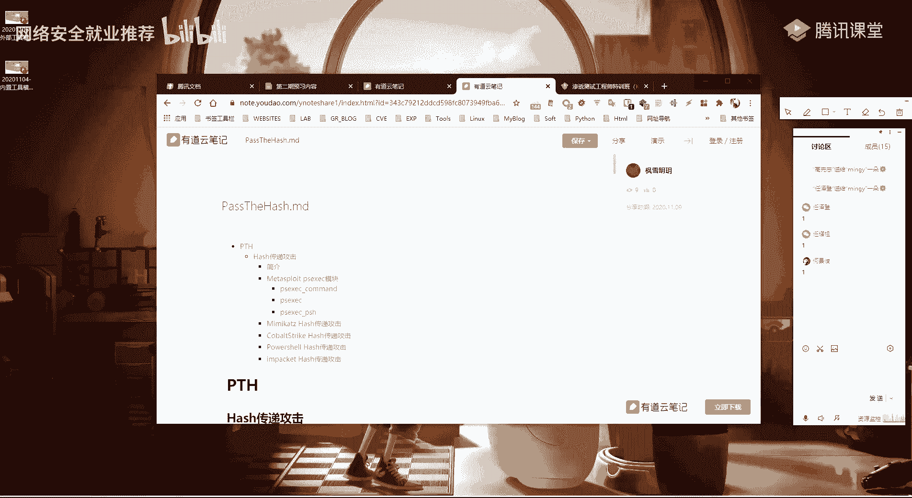

我们大概的回顾一下前面的两个，就是横向移动与横向移动相关的，这样子的一些内容是吧，呃首先的话第一个就是内置的一个工具的一个，横向移动，就给大家介绍了这四部分的一个呢对吧。

然后的话是通过呃i t c的一个连接，然后的话来去进行一个横向的一个移动，然后的话就是我们的一个利用w m i c以及，wm的这样子的两个服务，然后的话再去进行这样子的一个内置这种工具。

的一个横向移动的时候的话，我们在这边有去讲，也去介绍的，就是对应的一个应用的一个条件是吧，就是呃我们再来回顾一下，就是要去进行这边的这样子的一些横向移动的，这样子的一些攻击手法的话。

我们需要有这样子的一个一些条件，第一个就是开放了这样子的，139。45端口，然后的话就是开启的一个i p c的一个，文件共享服务，然后前面的这两点的话，就是呃就是受限于我们这边的一个。

i p c的一个连接是吧，我们需要通过这样的i p c的一个连接，我们才能够去进行一个，或者才能够去啊，远程的去访问到其他的一个主机，才能够去访问远程的这样子的一个机器。

然后的话再去进行相应的一个操作是吧，然后第三个的话就是需要目标机器的一个管，理员的一个账号密码，就是呃在这边的话，就是有有一个很重要的一个前提条件，就是需要管理员的一个账号密码。

因为我们的这边的一个dc的一个零件的话，你想要去建立这样一个接，需要有这样子的管理员的一个账号密码，你才能够去进行一个呃，尽力的尽力让这个ipc连接，那么我们在讲到这边的时候，就有给大家介绍对吧。

就是我们呃怎么去通过，或者说我们怎么去得到这样子的一个，管理员的账号密码对吧，那么这边的一个得到它的一个账号密码的话，就又回到了就是说我们前面讲的那一个呃，就工作组还有域内的这样子的一个密码哈。

希的一个获取对吧，就是在那边在那那一部分的应用的话，详细的介绍了，就是说工作组以及域内的这样子的一些密码哈，希的一个获取的一个方法对吧，然而在这边的话，我是通过就是通通过msf的这样子。

或者说通过cs的这样子的一个呃，mini cf来去获取到它的一个铭文的一个密码。

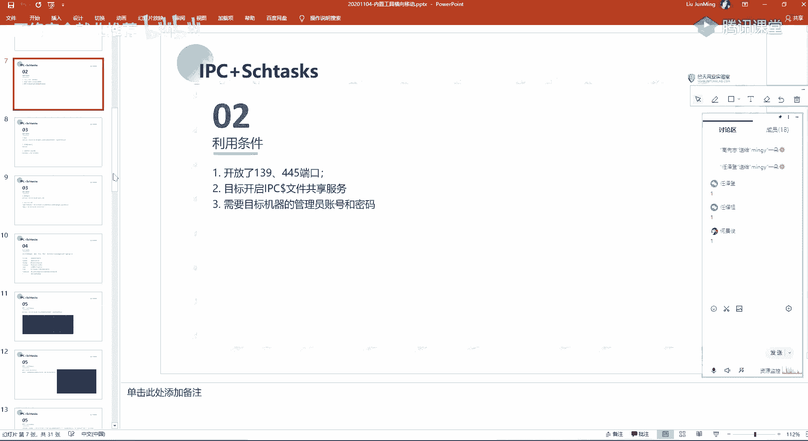

然后的话呃就是外部的这样的一个工具，横向移动的话就是呃其实区别的话没有多大，就是没太大的一个区别，跟我们内置的一个很像，也都很好，只是外部的这样的一些工具的话，它有就是说还有我们的内部工具所不具备的。

一些优势是吧，就是它的一个功能的话是对，像比如说我们的一个w m e s e c，这个的话它是为了解决，就是说我们用通过w m，通过w m i c的这样子的一个呃工具，这样子的一个命令行工具。

去进行一个呃远程的创建，通过创建进程的一个方法来去执行，我们的一个命令的话，他是没有回血的，这样的一个缺点，就是为了去解决它的这样的一个缺点，然后我们通过这样子的一个外部工具的话。

我们就能够去得到它的一个回血，比如说我们执行了对应的一个命令，我能够去呃得到他执行命令的这样的一个结果，是，然后的话就是呃两个常用的这样子的一个，深度测的一个框架对吧，就是这样子的两个框架。

我们通常把上一个，需要反弹到这两个框架上面的话，我们如何去进行这样子的一个呃横向移动对吧，就利用它已有的这样的一些模块，以及呃对应的这样的一些功能。

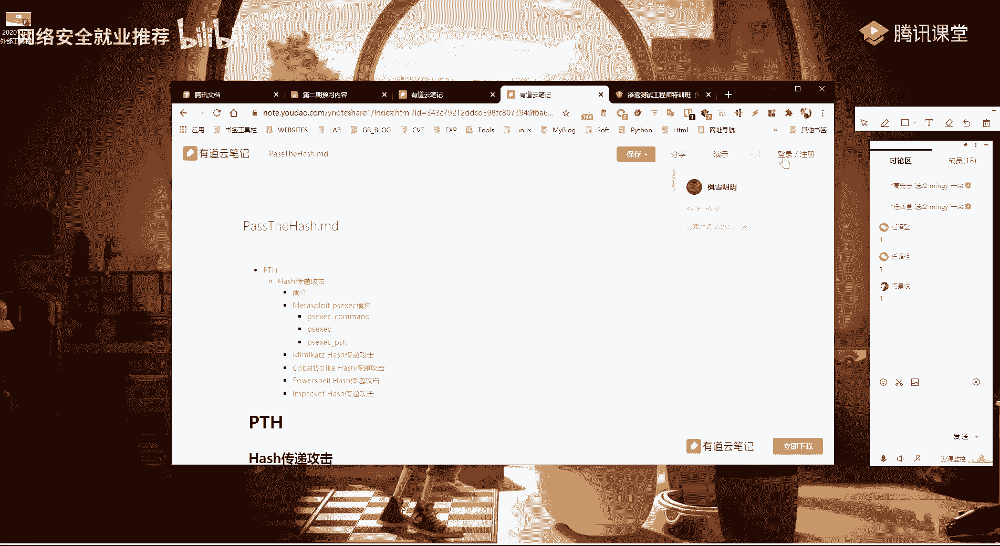

而这边的话大概就是回顾了这样子的一，些内容是吧，然后的话其实我回顾这些内容的一个目的，就是就我们前面再通过呃。

对应的这样的一些操作，像比如说。

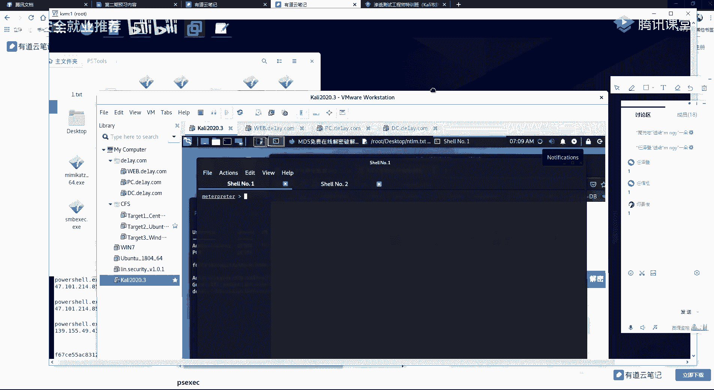

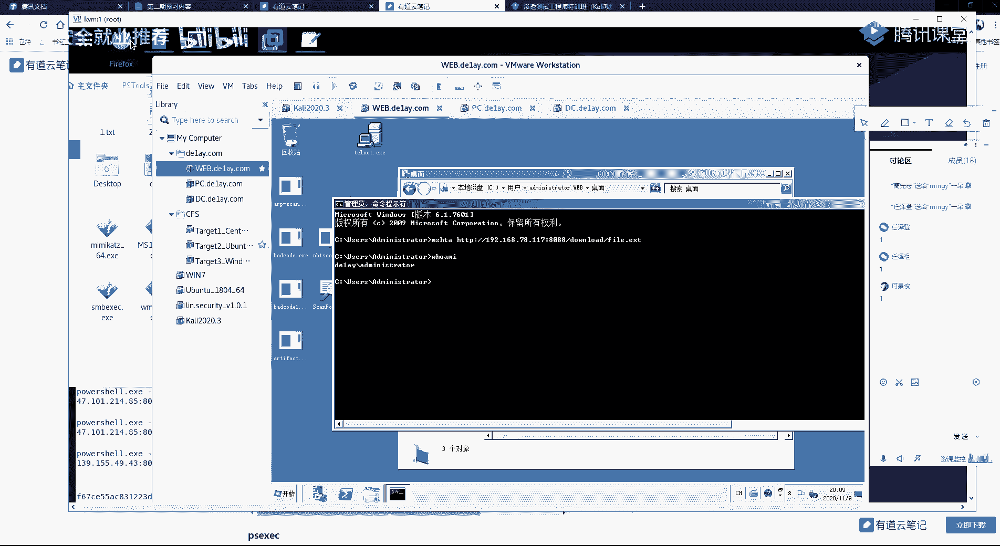

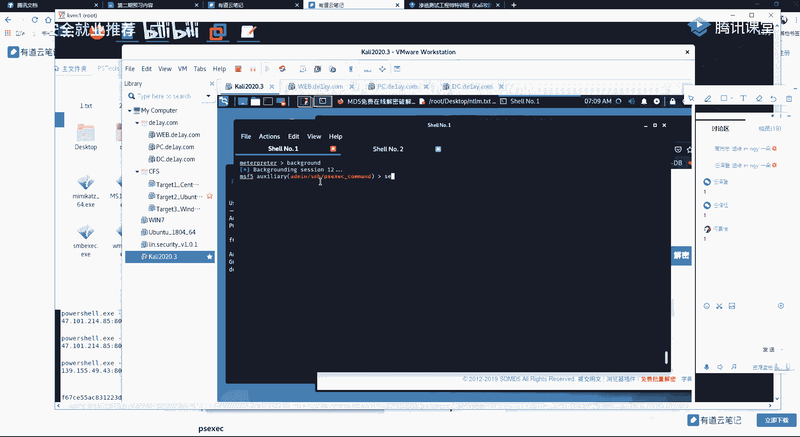

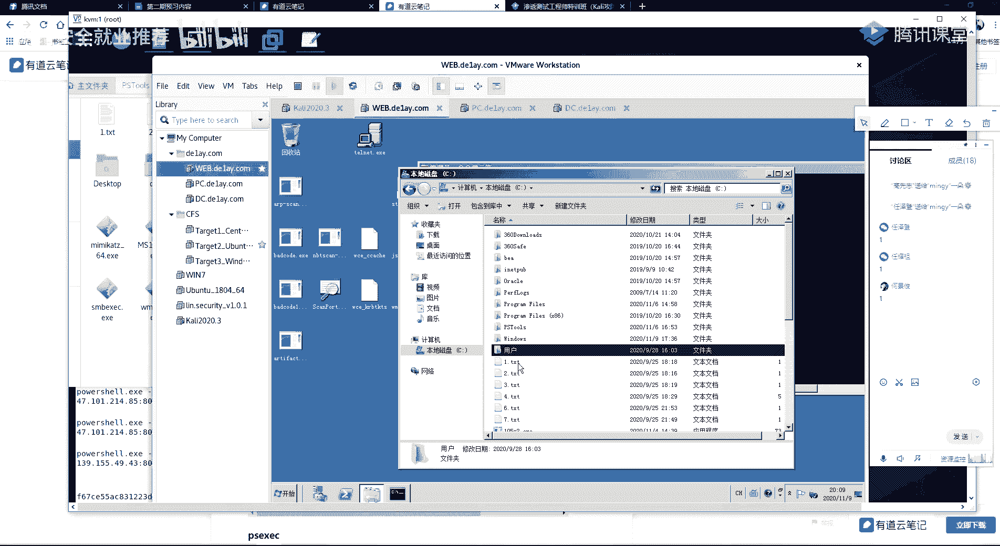

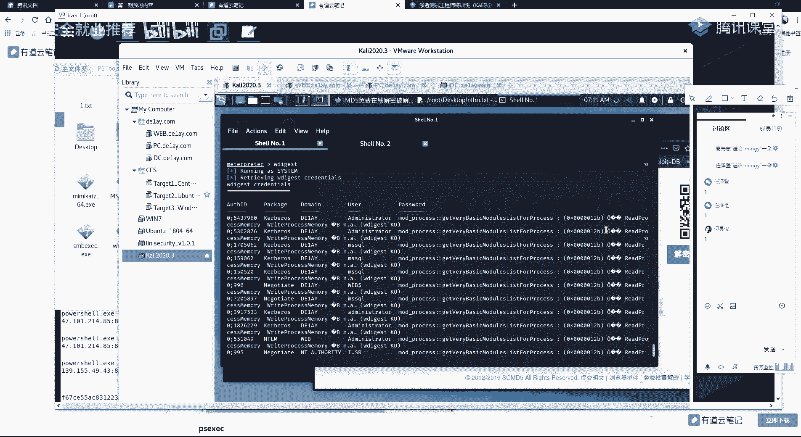

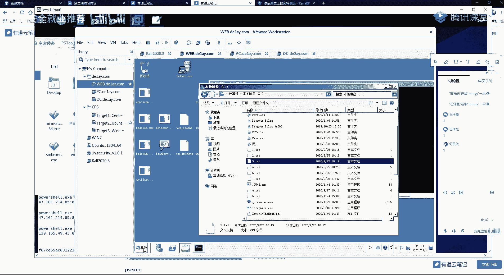

嗯稍微等一下。

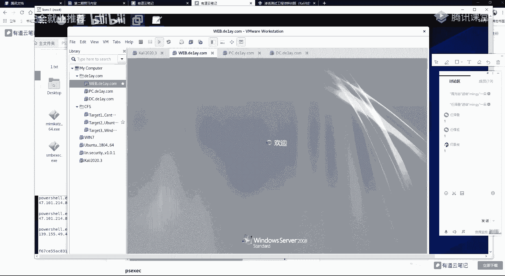

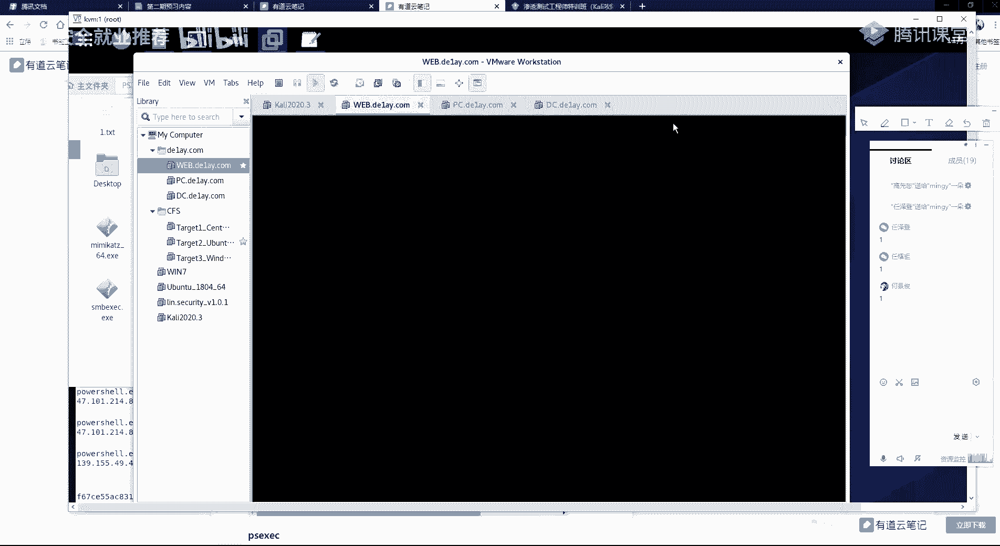

这边稍微等一下，我这边呃。

问一下，呃行吧。

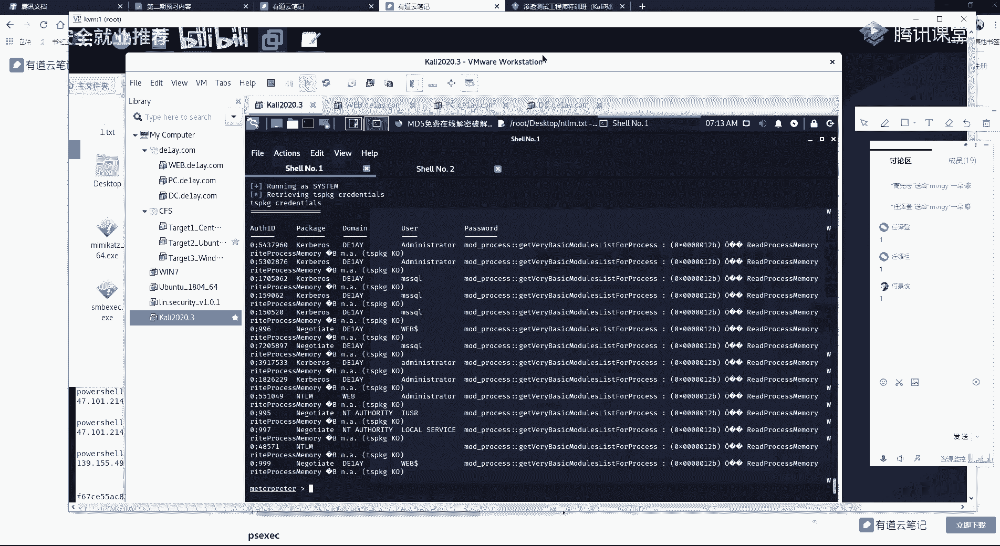

这段话有一点问题啊，我们先继续讲这边的内容。

就刚刚的话我有说到，就是甘愿给大家回顾上节课的内容的话，就是为了就是让大家呃就是再回心，就重新回想一下，就是我前面讲这样子的横向移动的时候，对我们的一个条件，就是需要他的一个管理员的账号密码是吧。

那么我在就说在这边我通过呃msf对吧，或者说cs也是同样的对吧，我通过他类似的这样的mini cards，来去得到它的一个铭文的一个密码是吧，然后这边的话我不知道怎么的有点问题啊。

他这边没有得到他的一个名为密码，但是呃这边的话，不是我们今天一个主播的主要内容吧，就是上节课的话，大家如果有听的话，就是或者说有有有看的话，就是在这边的话，我们可以去得到它的一个铭文那个密码对吧。

大家可以去再翻一下我的那个app，就能够去看到他的铭文铭文那个密码，那么他在在这种情况下的话，是他已经能够去获取到它的一个名为密码对吧，比如说我获取到对应的一个管理员的账，号的密码。

那么我就可以根据这样子的，一个管理员的账号密码，然后的话再去横向的移动，在这个网站下面的其他的一个主机对吧，它的一个条件它就是基于现有的这样的，我们获取到了这一个呃，这个在内网的这个机器的一个哈希。

或者说它的一个密码值，来去进行一个横向的一个移动是吧，那么在这边的话，如果说我就比如说现在这边，获取不到它的一个铭文的密码对吧，那么我怎么去进行一个横向移动的，我不知道他的铭文密码啊。

他这边啊获取不到是吧，那么在这边获取不到的话。

我们就会通常会使用到这样子的一个哈希值，然后呃在这边获取它的一个哈希值的话，那msf的话，我们通过run这个hash duke就能够去获取到，然后在这边的话可以看到他这边的话。

就获取到他的卡西图像admin，然后的话dz，然后的话first这样子的三个用户，以及它对应的一个呃lm的一个哈希对吧，以及nt l m的一个哈希是吧，我们在这边的话能够去获取它。

然后的话我们在这边获取到它的哈希值，之后的话，我们怎么去进行一个利用。

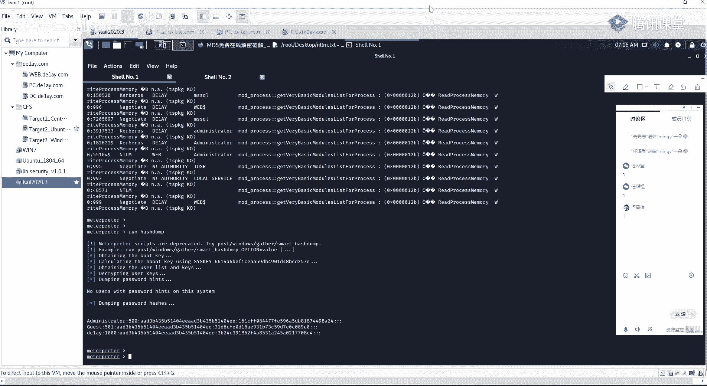

也就是在本节课会讲到这样子的一个ph，也就是利用这边我获取到的哈希值。

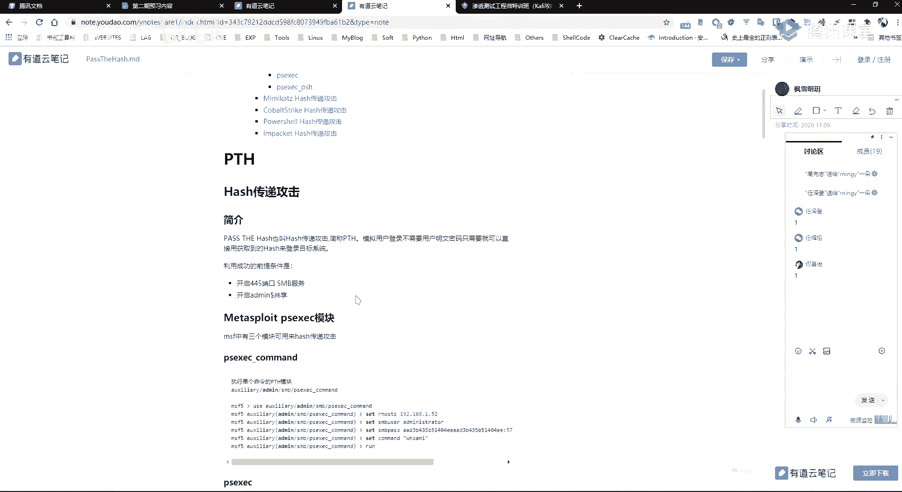

来去进行一个传递攻击，那样的话呃，还有一种的话。

就是说我这边获取了它的哈希值对吧，那么我可以根据它这个哈希哈希值，去做一个解密对吧，看尝试是不是能够去得到它的一个，名为的一个密码对吧，那么我这边获取到这个admin这个用户，他那个啊哈希。

我放到这个网站上面去做一个解密对吧，尝试解密诶，可以发现的话，自己这边的话，我们能够去解密出它的一个明文是吧，但是的话呃也还有就是这是一种情况，也还有就是你这边获取到这个哈希值。

你无法去解密出这样子的一个铭文，那么我们就只能够去说使用这样子的一个呃。

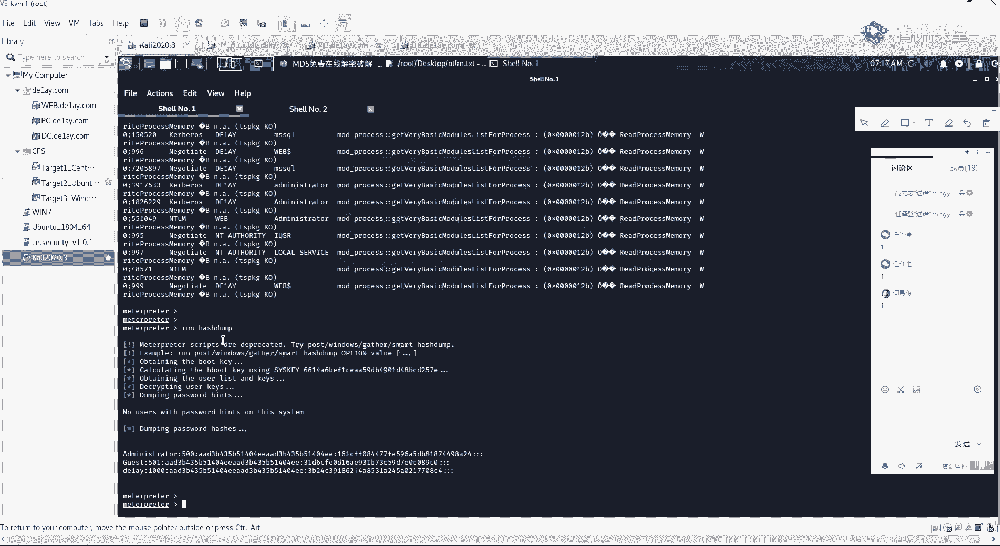

哈希的一个传递，也就是我们本节课课就讲到的这样子的一个，哈希传递的一个攻击，然后呃本节课的话我这边的话没有，就是没有写ppt啊，就是呃因为东西的话就是呃这里的这一部分呢，就拼理论理论性的一些东西。

文字这边，我这边的话都写了一个这样的一个文档，然后的话这个pdh的话，我这边的话是也是呃写了这样的一个文档，就是我感觉啊，我感觉就是可能这样子的一些文档，比ppt还会就是呃好好理解一点对吧。

就是内容什么的都有对吧，然的话这些东西啊都给大家呃，呃我已经提前放到了这边的，这就在这边，这里两个文档的一个链接，大家可以打开看一下，然后的话呃可以就是打开看着，然后跟着我一起来去进行一个呃了解好呃。

大概的介绍一下，我们本节课要讲的这样的一些内容，那么我们首先的话先给大家介绍一下，windows的一个认证机制，也是我们今天的第一部分的一个内容啊，我这边这样子的一个这样子的一个演示界面。

大家觉得可以吧，就是字会不会太大了，还是应该能够看得很清楚吧，这样子，真好啊，可以好的好呃，然后的话讲到windows的一个认证机制的话，我们先来大概的就是了解一下，不是windows认证的三个部分。

就是在这边的话windows的一个认证机制，我们可以把它分成三个部分，首先第一个的话就是本地认证啊，本地论证的话，也就是我们的一个用户，直接的去操作我们的一个计算机来去登录账，这个本地认证怎么去理解呢。

就我们就是呃在前面在讲工作组的时候对吧，讲工作组以及密码哈希的获取的时候，有给也给大家介绍的，就是本地认证的话，就像你你去直接去登录这样的一个，windows的一个机器对吧。

然后的话你登录这个windows机器的话，你需要输入一个账号密码，那么这个账号密码的话，影视直接就是下午。

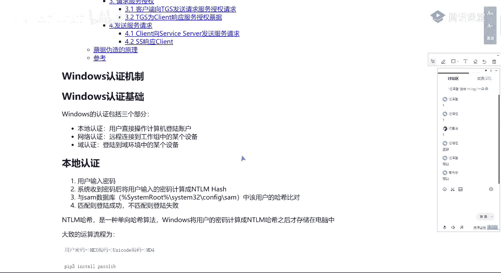

比如说这边的这个机器对吧，我这边的话直接通过输入账号密码。

有点卡，我这边的话直接通过输入账号密码来去进行，一个登登录到这样子的一个机器。

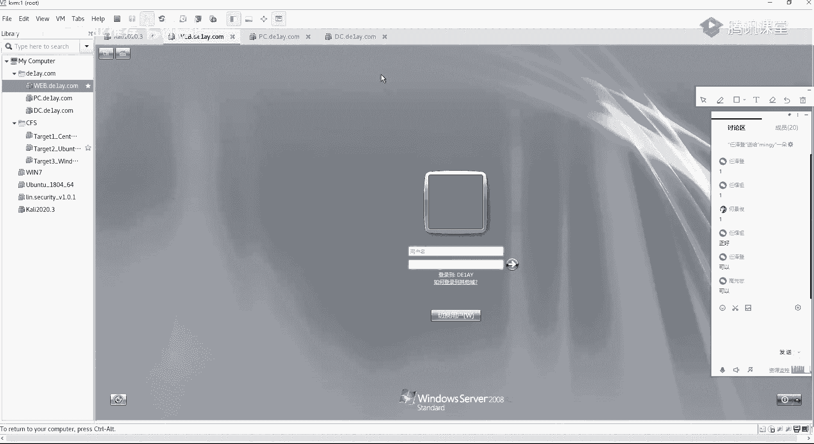

然后的话要注意的话，就是我们这边的一个本地论证，就是呃就是通常的话就是默认的，你的一个机械化，它是在一个工作组对吧，它是有分配这样的一个工作组，就是work group这样的工作组。

那么你一般的你没有去配置项啊，登录某一个域的话，你去登录这样子的一个计算机的哈，你都是使用的一个本地论证，然后的话本地认证它的一个特点的话，就是呃它的一个认，它的一个就是账号密码的一个信息。

它是存储在它的一个计算机的一个本地的，他呃大家有才，就是有谁能说一下，就是他的就本地认证的时候，他的一个计算机的一个账号密码，它是存储在哪一个文件下面吗，有哪位同学能回答一下吗，啊谁啊，还有吗。

还有其他同学们，对没错，就是就是这样了，就其实就是我们前面对吧，我们前面在讲那个windows下面的一个密码哈，希密码哈，希获取的时候对吧，有呃介绍有详细的介绍，就是说这样的一个sam文件。

那么这边呢这个sam文件的话，它里面的话就是存储的，就在本地认证的这样的一个情况下，它存储的一个计算机的一个账号密码，它就是存在这样的一个sam文件当中，它的一个具体的一个目录。

它就是在他这个呃在系统的一个安装目录，然后的话system 32 configure，然后这下面就有一个sam文件，这个文件的话它是一个这样子的一个，就是你可以把它理解成一个数据库。

然后它这里面它就存储的呃，在这个windows计算机上面的，所有的一个用户的一个密码哈，希，然后第二的话就是一个网络认证，网络认证的话，也就是远程的连接到工作组中的某个设备，我这个网络认证怎么去理解呢。

就是比如说我这边啊，我都在同一个工作组对吧，然后的话我这边我的这个主机要去访问到，要去访问到与我同一个工作组当中的，其他的一个主题对吧，像比如说我要去进行一个呃文件共享对吧。

我要去访问到远程的那个计算机的那个网络，文件共享的那个目录对吧，那么我在这边的话，我去进行一个访问的话，就会有这样子的一个认证，就比如在这边对吧，但是大家可以就是如果是用的windows的一个计算。

它可以打开这边的有一个网络的一个选项啊，然后的话这边的一个网络的话，你需要去打开你的那个网络，发现也就是你在同一个网段下面的话，能够去发现到其他的这样子的一些，共享的一个计算机是吧。

然后像比如说这边这个计算机啊，这个话应该是我本地的这边没有发现其他的，就是如果就是我们这边还是在同样子，同样的一个工作组对吧，那么我在这边也发现到有其他的一个子集啊。

我想要去访问到他的一个共享的一个呃资源，那么我这边去访问的话，他你呃这边没有其他的，我这边的话就是打开就双击，打开之后的话会弹一个框。

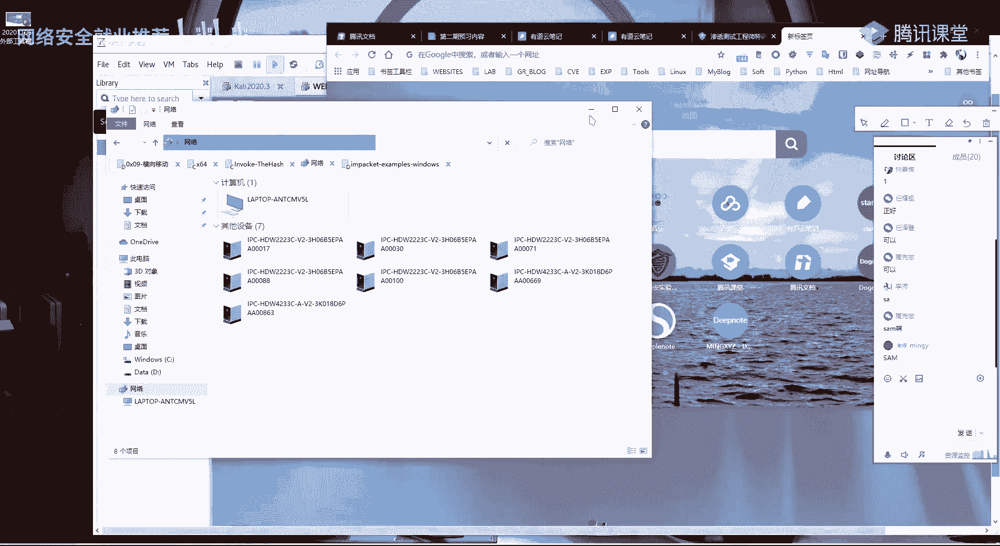

弹的那个框的话需要你输入，就是说你要这边，你要去访问的一个计算机的一个账号密码对吧，对不可能你不需要账号密码。

你就能够去访问到，那么你的这个资源的话，不是谁都能够去访问吗，好的话。

这边的话就是我这边要去访问这样子的一个，共享的一个呃，就是同一个工作组向这种共享资源的话，就会有用到这样子的一个网络认证，就是啊net n t m哈，呃就是待会会讲的一个net n t n t l m。

然而第三的话是遇难者，也是我们就是可能就是大家接触的最少的，也是就是对这个就在预渗透当中，必须不得不去了解的这样子的一个呃东西啊，就是舆论证，就是我们登录到玉环境当中的某个设备的话。

它的它就会有这样的一个预认证的一个过程，好呃，大概的介绍了这样子的一个windows认证的三个部分，我们分别的来给大家，就是讲解一下它的一些呃特点，首先第二的话就是本地论证，本地论证的话。

其实就是我这边念的这样子的三句话，就是这样子的一个过程啊，四句话就是12344个过程，首先第一个的话就是用户输入密码是吧，就是我们再去登录一个问的是计算机的时候，我们首先需要输入密码对吧。

然后的话输入用户名以及密码是吧，然后的话你再点登录，点登录之后的话，他就会去呃，有有在转对吧，他会去等等的，那个时间的话，它其实就是有做这样的一个认证的一个过程，然后他把他的这个认证过程。

就是你输入密码之后的话，你点登录之后呃，你的一个windows系统，他收到这个密码之后的话，它会将呃你输入的一个密码，把它做一个计算，计算成一个nt l的一个哈希值，那么这边的一个ntm哈希值的话。

它的一个大致的一个运算流程，就是像我这边写的这样子的一个，还要做一个这样的编码，然后再编码，然后再做m的md 4，这个话大家了解一下即可，然后的话你也可以通过这样子的一个，就是在python当中。

通过这个party lab的一个库，然后的话来去生成这样的一个，ntm的一个卡尺子，然他问的系统他搜到这个密码，他基本成哈希之后的话，它会与我们的一个sam数据库。

也是windows下面的这样子的一个存储密码，哈希的一个数据库当中的一个啊哈希，去做一个比对，这句话它是比如说你输入的用户名是对，对的对吧，那么他们去在这个sam数据库当中去查找。

与这个用户名所对应的一个哈希值，然后的话在于你这边输入一个密码，所计算出的一个哈希值做一个比对，那么如果说你的一个密码是正确的话，那么它的哈希值肯定是一样的对吧，因为他的一个就是加密的一个算法。

它是一样的对吧，你同样的一个字符，你加密之后的话，它的哈希值的话也是一样的，那么如果说它是一样的，那么就说明的话我们这边匹配成功，匹配成功的话，我们就能够去登录到我们的一个。

windows的一个计算机是吧，如果不匹配的话，那么就登录失败，然后的话呃ngm哈希的话，它是一种单向的哈希算法，呃，这边的话呃前面也有介绍，就是然后的话它会将我们用户的一个密码，计算成这样的卡西。

然后它存储在电脑当中，就是你在创建这样的一个，创建你的一个用户密码的时候对吧，就是他就会把这样的一个密码，他会做一个这样子的一个呃计算，计算成这个哈希值，然后的话存储到这个sam文件当中。

还有的话就是回顾一下，就是就n t m哈希以及lm的一个哈希啊，就是呃前面的话也说了对吧，就是n t m的一个哈希的一个前身，它是一个l m的一个哈希，而l m哈希的话是呃。

由于它存在现在的一个缺陷已经被淘汰了，就是它所存储的一个字符的话啊，在2003还是2008的这种系统下面的话，就是都是默认的使用n t m的一个哈希，然后的话就是呃本地认证的这样子的，一个与本地认证。

而这个过程当中所涉及到这样子的一个，特殊的一个进程，就是这个ios a s s，就是呃这样子这样子的一个进程的话，呃，它是用来处理我们用户输入一个密码，然后我们就是呃就是前面的话再讲。

那个的时候也有有奖对吧，就是我们的一个用户密码的话，你输入之后的话，你在windows系统当中，你去登录之后的话，他会把他的一个密码值，它会读取到这样子的一个进程当中，就是你输入密码登录之后的话。

它就会把你的密码，它会呃放到这样子的一个进程当中，然后的话这个进程它是一个铭文保存的，然后把他这把他这个就是密码的一个铭文，放到这个进程当中，之后的话，它会把它做一个计算，计算成n t m的一个哈希。

然后的话再去比对，也就是这边的这个步骤，然后这边这个物的话，它其实有这样子的一个，把明文密码放到这个l s s来，点x一这个啊进程当中的这样子的一个过程，然后的话我们使用mini cut来获取明文密码。

其实就是从这一个进程当中去进行一个读取的，因为它呃他的一个密码，它会保存在这个进程当中，而且它会有这样一个铭文的一个形式，我们可以通过mini mini cut，来去读取这个进程当中的一个明文密码。

呃第二个的话就是网络认证，网络认证的话就是在工作组环境下，远程登录另一台电脑，所采用的这样一个认证机制，好关于网络证认证的话，它主要的话分为了这样子的三部啊，呃其实我这句话写得很详细了。

然后呃这边呢这三步的话就是分别是协商，咨询印证，然后的话它的这样子的三个步骤，步骤也叫做挑战响应的一个机制，就是我们这边会说到这个challenge，还有response。

然而他的这样子的一个认证机制的话，他的一个过程是怎样的，他首先会去进行一个协商，就是我们呃，比如说就我刚刚所说的那样子的一个场景对吧，我的这个计算机要去访问，远程计算机的那个网络文件共享，是。

然后的话我去访问的话呃，我去访问他，首先第一步的话他就会去协商协商什么东西呢，就是他会去协商我们所使用的一个协议版本，就呃在这边的话就是要注意的话，就是n t m它存在两个版本。

就v1 v2 这两个版本，然后他的这两个版本的一个区别，其实就是加密方式的不同，就是你不同版本的话，它的加密方式不一样的，然后的话而第一步协商的话，其实就是协协商你的使用的协议的一个版本。

因为你只有使用相同的一个协议版本，也就是你的一个加密方式的话才是一样的对吧，你才能够说能够去有这样子的一个印证，来去进行一个啊登录认证的这样的一个匹配，然后第二步的话呃，我们还有第一步。

就是在他的这个认证过程当中的话，它就是不同的一个协议，使用的是不同格式的这样的一个challenge，还有加密算，然后这边的一个challenge的话，其实就是这边啊会说到这样子的一个随机数啊。

而第二幅画就是自寻自学的话，就是呃这样子的一个挑战，响应认证机制的一个核心，也就是这一个自选，就是呃挑战挑战还是chenge啊，这个好像写错了，卡上怎么拼来的，而这边的话写错了，这边是啊。

这个就是这个challenge c h i l l e n g，这边少了个l，然后的话响应的话就是这个response，也就是我们的一个响应，然后他的这个咨询的一个步骤的话是怎样的呢。

它首先的话呃客户端向服务端发送用户信息，就是用户名的一个请求是吧，就是啊我们这边前面协商了，我们的一个协议版本中的话，我这边我去认证对吧，我需要输入我的一个账号密码，那么在输入账号密码的话。

这边的一个密码的一个，就是用户的一个信息的话，它会从客户端发送到服务端对吧，然后的话它就会有这样子的一个请求，就你的一个用户名的一个信息的话，就包含在这样的一个请求当中，而它发送到了一个服务端对吧。

好呃，注意的话我们的一个客户端以及服务端的话，就是我这边要去访问啊，我的访问其他的这样子的一个机器对吧，就是我这边他就是一个客户端嘛，然后的话我要去访问的那个机器的一个服务。

就是网络文件共享的这样的一个服务端，那么它呃，这个文件共享服务所在的那个机器，就是服务端对吧，这个很这个能能理解吧，然后的话第二个的话就是服务器，它接收到这个请求的话，他会去判断就判断呃。

单就是本地的一个用户列表，它是否存在客户端发送的一个用户名，就是你你要去访问这样子的一个，远程的一个计算机吧，那么你肯定你你需要去输入的是，你要去登录的这样子的一个远程计算机的。

这样子这样子的一个用户名密码对吧，所以的话他会去在本地的一个用户列表当中，他去看他去查找你输入的一个用户，他是不是有这样子的一个用户，如果没有的话，他就会认证失败，如果有的话。

他就会去生成一个啊这样子的一个随机数，也就是我们这边所说的一个challenge，然后的话就是呃这边的话，这边的这一个随随机数，它根据就说你这边tm的一个协议的版本的一个，不同的话。

他这边的生成的这种cheng的一个格式，以及你所使所使用的一个加密算法是不一样的，然后的话呃，再去使用我们那个用户名对应的一个ntr哈希，来去加密这样的一个challenge。

然后它生成一个前两集一保存在内存当中，同时的话生存这个cheng一的话，它会将这样的一个challenge的一个铭文，发送给客户端，而这里这里到这，这句话怎么理解呢，就比如说我这边，输入的是一个他的命。

administration，然后密码的话是test是吧，我的一个用户名是administry，密码是test，二的话，我去进行一个登录，我把这样子的一个就是信息，它会发送到服务端。

然后的话服务端它判断呃，他本地服务，它有这样的一个administer的一个用户对吧，那么他就会去做这样的一个呃，做这样的一个事情，它会生成一个16位的一个随机数占比啊，就是，啊。

就是它会生成一个这样子的一个，16位的一个随机数，然后的话这边的这个16位的一个随机数的话，你们这样子再去假设对吧，就假装它是16位，然后这边的这个16位的一个随机数的，随机数的话。

它会使用登录的一个用户名，对应的一个n t m哈希，这是什么意思呢，就是我这边要去登录的话，是ai的命选择了一个用户的，那么这个administer的这个用户是我要去登录的。

它对应的一个n t m的一个哈希，也就是我这边的这个test，这个这一个就是它的一个密码是test对吧，然后的话他对test做的这样子的一个呃，a dm哈希的一个加密，把它加密成一个，啊不对。

这句话说错了是啊，不是说对这边的这个我这边输入的一个test的，这个密码做一个加密，而是我这边administr这边的这个用户所对应的，一个ntm的一个哈希值。

就是它的一个密码所对应的一个n t m7 子，它是存它会存储在我的一个服务端对吧，那么我这边验证的话，他会去从我的这一个啊就数据库当中，他会去读取这样子的一个呃。

administer用户所对应的一个哈希对吧，然后的话它读取到这个哈希之后的话，他会把就是通就是用这个tm的一个哈希值，把这边的一个16 16进制的哦，不16位的一个随机字符做一个加密。

然后它会生成一个这样子的一个啊challenge 1，就是生成这样子的一个，生成一个战争签了几，然后这个cheng一的话，就是呃这边加密的这样子的这个呃字符串，就是你不用啊，不用管它是什么东西。

反正就是一个就是经过加密之后的一个呃，很复杂的这样子一个字符串，然后这边呢这个字串的话，它会存储在这样子一个内存当中，它会把它放到内存当中，然后的话呃我们这边的话，它前面有生成了这样子的一个。

16进制的一个随机数对吧，就是这个challenge，这个的话就是challenge，然后的话这边的一个challenge的话，就是这边的这边的一个administer的用户，他那个对应的一个ntm。

还是只加入这个challenge之后，得到这个challenge是吧，然后生成这个chenge之后的话，他会就他会加这样的一个challenge，就是这个挑战，就是呃刚开始生成的这样子的。

一个16位的一个随机数，它会发送给客户端，就是你这边请求都要发送请求，那么这边服务端它响应它会有响应嘛是吧，然后这边他服务端响应的话，就是他会把这边的这个challenge。

就是这边生成了这个16位的一个随机字符，他发发送给客户端，然然后的话在这边的话，就是客户端这边的话就有了这样子的，就接收到了这样的一个challenge对吧，然后的话在客户端接收到这个圈子之后的话。

他会用自己提供的一个账号的一个密码转换，是可以对应的一个铁马哈，希，然后的话再用这个按键盘还是加密，对这个challenge，然后的话再发送到服务端这里，怎么理解呢。

这样的话就是我这边去进行这样的一个登录，对吧，我输了一个账号，密码是这个呃，前面这边的话它生成的那个圈转机，它是根据我这边对应的这个输入的，一个用户对吧，然后的话找到对应的存储在他服务端都这样子。

叫你tm那个哈希奥特加密生成，而我这边的话，我这边登录输入的一个密码对吧，我这边的这个密码就是这个test，那么这边的这个test的话，他在接收到我这边的一个这边服务端所发送的。

一个challenge之后的话，他会把这一个test做一个n t m的，一个哈希的一个加密，就是把它加密成一个nt嘛哈希值，然后再用这个nt m值来去啊，b这样子的一个challenge。

那么如果说这边的这一个呃就是这把字啊，它会生成这样的response，也就是一个响应嘛，然后发送到服务端这边的话，就是一个自旋的一个过程，那么在这边的话自旋的这个过程的话。

就是这边的第三部分怎么去理解呢，就我这边的一个test，它生成一个n tm的哈希值是吧，然后的话呢就加入这样一个challenge，然后的话他再把它发送到服务端。

就如果我这边的这个administer的一个密码的话，它就是一个test，那么我这边呃我这边去认证的时候，所用这一个test字段所生成的这个题目哈，希值与原本存储在这一个服务端的。

这样的一个administer用户所对应的这一个哈希值，它肯定是一样的对吧对，如果说我这边密码是正确的话，那么肯定是一样的这个哈希值，那么这个哈希值它一样的话。

那么他对同样的这样子的一个challenge对吧，就是对同一个challenge它做一个加密，它所生成的这样的一个challenge，一的话，它同样的也是会一样的对吧，这里大家能理解吧。

这不是这一步我能理解吗，这样讲我这样讲能理解的，扣一不好，ok但是应该没问题了是吧，好在这边走这边他response生成之后的话，它会放到服务端对吧，那么上服务端之后有response的一个。

这边energy它是相等对吧，如果说它是相等的，那么就是说是的话，我这边认证的话就通过了，就是它这边相等的话，就是说明的话，我这边的这个密码它是正确的对吧，因为它所生成的这样子的。

一个用同样的一个n t m的加密算法，生成的这样子一个n t m哈希值它是一样的，所以的话它的一个密码的话，就证明的话就是正确的，然后的话就能够去验证通过，然后的话验证通过的话，我这边的一个客户端。

就能够去正常的去访问到服务端的对一个服务，然后呃在这边的话，好在这边的话就是通过我们这边的哈希加密的，这个challenge，就是我们这边对应的这个challenge，还有这个response对。

那么他这他这边的这一个呃，其实实际上就变成这个圈等第一对吧，因为他是啊用的是他用的是呃，他服务端都这样子跟nt l的一个哈希，然后的话加入了一个随机字符所生成的啊，然后这边的这个challenge的话。

它在网络协议当中，就称为这个net n t m的一个卡系，好的话，这个哈希的话，所以它是不能够直接用来进行一个，哈希传递攻击的，但是的话我们可以通过暴力破解来去获取，名为密码。

然后的话呃在这边的话有介绍了，就是我们为什么能够去通过这样的一个，暴力破解来获取它的密码，就是它的一个关键点的话，就在于这边的第二步，就是客户发送的这个tm哈希值，与随机字符串加密的这个结果。

然后再到这个nt m的卡希的话，它是有用户输入一个密码，去本地计算得出的对吧，就是我们这些用户的一个输入的密码，它是是我们自己输入的，然后的话他会在本地计算成11000，买那个哈希。

然后的话再去加密那个呃challenge对吧，然后生成这个n t m的哈希，那么我们只要能够提供哲学的这个n t m阿西，就是呃其实的话不知道正确的一个密码，也可以通过认证是吧。

就是我只我只要我只要我这边的一个呃，就是加密之后的这个nt m的哈希是于我边的啊，这个哈希它是一样的，那么我就能够去登录，去访问到这样的一个服务是吧，因为他他的跟tm哈希值一样的话。

我就能够啊就是在最后印证的时候，我这边的话到了最chin的话，那么肯定是一样的，他就能够去认证通过，然后的话呃这边的一个破破解的一个方法啊，啊我们使用这个hash cat来进行一个破解。

hg cat的话它是一个就是密码破解的一个工具，它的功能的话是呃，很非常的强大的一个破解工具，然后我们可以用它来去破解这样的一个，net n t m的哈希的一个名为密码，好使用这个方法的话就是这样子啊。

就是hush cat，gm只只这个5600，注意的话这边的话这边是5600啊，然后的话呃net杠零钱，然后呃接我们的一个密码，这边的话就是我们的一个字典的一个文件，因为我们是要去爆破嘛。

去进一个暴力的一个破解，然后再去进行一个匹配，然后干完的话就是输出就是文件，就是我这边找到的话，那它就会输出到这个放的这个文件了吧，好呃就是这里的这个面的话啊，没什么好说的。

主要的话就是这个就是gm就是这个干什么参数，要指定一个哈希的一个type，也就是我们的哈希类型，然后这边的一个5600的话，对应的就是我们那个n t m哈希，就是net n t m v2 。

注意的话是v2 的一个，然后的话其实大家可以打开，就是看你，然后的话再看你自己，看你里面的话有已经呃自带有了这样的一个哈，希的一个工具啊，sk的一个工具，然后在这边的话。

你可以看h来去查看到它的一个帮助信息，然后呃我们找到这个gm的这个参数，它这边的一个帮助信息的话比较多，就是他这边的这一个。

这边的这这里就是这边的这一些这些数字。

对应的这样子的一些哈希type呃，在的话就是哈希mod，就是我们指定的这样的哈希一个模式。

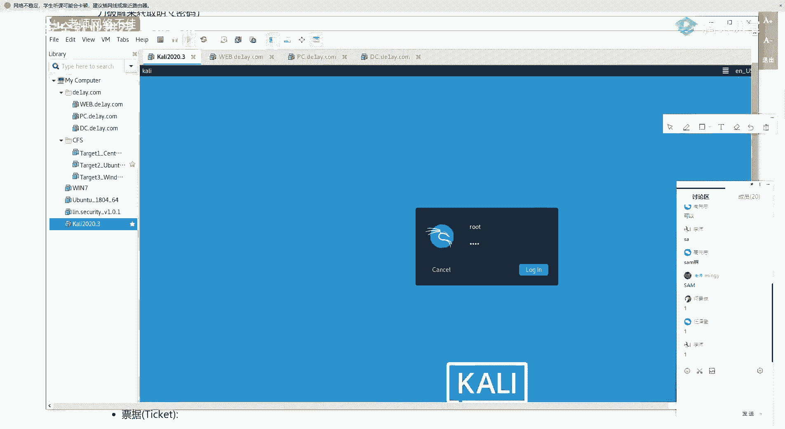

然后在这边的话呃，我们通过gm的一个参数来去质量来去指定，我们这边所使要是去使用的，就说要去爆破了这样的一个哈希的一个类型，然后这边分别的这个哈希类型的话，它有对应的有这样子的一个啊字符啊。

就是有这样的一个一串数字对吧，像比如说这边你你指定零的话，那么你就是一个md 5的这样子的一个，哈希的一个类型对吧，然后我们找到对应的一个。

我戒掉这边，找到这个呃，576的话，它对应的一个就是哈希的一个类型啊，就是个nt n t m v2 ，就注意的话是vr的一个版本，然后还有的话像还有其他的很多的这样子的，一些加密的一些呃算法呀。

然后的话我们可以通过这样子的一个hash cat，来进行一个暴力的一个破解，网络不稳定啊，呃大家听我讲课卡吗，应该不卡吧，刚刚提示说网络不稳定，有点卡吗，看一下，刚才有点呃，现在呢现在好了，有有卡顿吗。

会那不应该呀，我这里插的网线呢，我当时在公司讲课，是不是是不是还有点延迟啊，我总感觉就是我每次问大家问题，总是就是要播一会才大家才能反应过来啊。

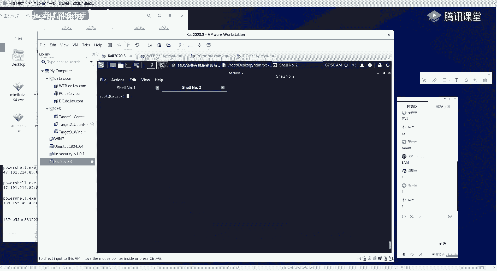

现在应该还好吧，到应该是没有问题，那么我们继续啊，就是我们可以通过这个hash ht，来去破解这样的一个net n t m的一个哈希，然后的话呃第三个就是预认证也是呃，怎么说呢，就是也是大家接触的少的。

也是大家可能不是很理解的，这样子的一个windows的一个认证，也是就是比前面两个是要复杂的多的，这样子的一个认证的一个方方式，然后这边的一个预认证的话，它的它的一个过程它是比较多的。

然后它的一个内容的话也是比较多的，就是可能我现在给大家讲的话，呃可能大家一时半会也还是不会很理解，但是的话呃我这边的话还是打算给大家讲一下，因为有录播嘛对吧，就是我这边讲的话。

你可能你而现在你听的不是很理解，然后的话大家自己课后的话，结合我这篇文章，以及我这边课上讲了这样的一个录播对吧，来去进行一个就是呃巩固吧，来去进行一个理解哇，这边，好我们继续啊。

好下面的话我们来一起来了解一下，就是舆论的以及它的一个详细的一个过程啊，呃预认证的话，就是它采用的是一个这样的cp协议，的一个认证机制，然后的话他这个认证的话，有前者最大的一个区别。

就是有一个可信的第三方机构，也就是这个kb这ktc是什么呢，就是这边的这个密钥分发中心，它的一个主要作用，就是负责管理我们的一个票据，就像我们的一个认证票据分发下去等等。

然后里面的话有包含有这样子的两个服as，还有tg s，就是这两个在as的话，就是我们的一个身份认证服务，它的一个主要作用，就是为我们那个client去生成一个tt的一个服务。

然后的话来完成对client的一个身份认印证，呃这边的话大家不是理解，不能理解的话，呃没关系啊，在后面的话会详细的给大家说，然后的话呃借tg s的话，就是这个就是票据授予服务。

他那个主要作用就是为我们那个去生成，允许对某个服务访问的app，就是我们的就是我们的一个票，然后这边的，这边的这个票据的话，就是呃我们客户端来去访问到某某一个，就是指定的这样一个对应的一个服务。

然后这边，他这边的话就是客户端它会从我们的一个as，也就是这边的一个身份认字符，他会拿到这个生成的一个777，然后这个信息期之后的话，他会去申请对某个特定服务对访问的一个ticket。

那么他要去啊申请这个tick，咱们这个服务的一个票的话，他是要去下载一个tg s发送请求，就像这个t g s对票据数据服务区请求，这个t只有获取到这个ticket之后的话。

我们那个还有访问到对应的一个服务，然后这边的一个服务提供的这样一个票据，也称为t g s，或者是说叫白银票，然后的话呃下面就是参与预认证的三个角色，以及呃就tap协议，认证认证协议的一些基础的一些概念。

其实就是这样子的一些呃这些专有名词啊，首先第一个号就是client，client的话就是我们的一个客户端嘛，就就是我这边就是客户端的话，就是比如说我这边我要去向呃某一个机器。

向域内的某一个主机去发生请求，就比如说是一个，就就同样的是一个网络文件共享的，这样子的一个，而且就是放啊访问的一个服务对吧，然后的话我这边的我要去发起的，就发起请求的这样子的一个机器端。

就叫client客户端，好的话，接收请楼的，也就是我们的网络文件共享服务，所在的一个机械化，就叫server，也就是服务的对吧，然后的话中间的话它会有这样的一个，可信的一个机构。

就是这个kd就其实我们前面向对音乐，这就是客户服务端对吧，就是我这边啊，就是像net这个网络认证对吧，就是客户端与服务端之间有这样子的一个认证，有这样子的一个请求响应和这样子的一个机制，对。

然后在在这边用论证的话，它不仅仅有这样的一个就是客户端，服务端两个角色有一个k dc，然后k d c的话，它你可以把它等价于就是我们的一个dc，也就是我们的一个预控制器，就是我们的一个预控。

就这个kdc的话，它是在我们那个预控上面的，这边的话还有就是要记得，然后的话a d的话就是我们的account database嘛，就是我们呃ad数据库嘛，就是这个t里面的话。

它存放的就是呃当前域内的所有的一个用户，它的一个行账户密码对吧，然后的话as的话就是我们的这个kdc，就这个s加tg s的两个部分啊，就包含这两个服务，这边是呃怎么理解的，就是这边kd c啊。

就是你可以把它等价于是我们的一个dc，就是k d c的话，它是存在dc上面的，然后的话，然后的话就是我们的一个客户端，要向服务端去啊进行一个服务的一个访问的话，他首先会去向，他会去向我们的一个呃。

虚空上面的那个k dc去啊进行发起请求对吧，然后的话去进行相应的一个印证，那么这个k dc的话就包含了有这样子的，就是三个部分，就包括了ag这个数据库，以及s一加七减s的这样子的两个服务。

然后从物理层面的话，就是像我们的一个a d啊，我们常说的a d，还有s t g s啊，还有k t a c啊，门都可以把它理解成就是预控之前，因为这些东西的话，这些部分的话它都存在于我们的一个预控上面。

然后的话就是呃这个认证协议的一些，基础的一个概念，就是票据，就是我们所说的一个ticket，就是呃我们要去访问，我们要去访问某一个服务的话，我们需要有这样的一个票据，那呃其实大家可以这么呃。

呃待会后面再说吧，就是这边的这个票据啊，大家其实可以理解成就，比如说我们做做就坐高铁对吧，我们需要有票，我们需要有这样子的一个票，我们才能够去呃坐高铁对吧，才能够去进入到高铁站满。

然后的话这边的这个ticket ticket对吧，这边这个tick的话，它是这个t g s生成的对吧，那么这个t g s这边呃，他呃要去要去访问这个t g s，然后的话得到这个tp的话。

他首先要去像这个样式发送请求，来生成这个t gt，这个t gt的话，这个tt的话也就是我们这边所说的这个ticket，grunting ticket，就他这个意思的话。

就是用来生成chk的一个chk名字，我们要得到这个就是从上面是得到这一个t gt，也就是这个tt的一个作用，就是用来在啊t g s上面去生成，这个访问服务的一个ticket。

那么这边的这个呃tg 7的话，你可以把它理解成就是呃你的一个身份证对吧，就是，然后这边的这个as的话，你就可以把它理解成就是呃领领领身份证的，一个就是呃那叫那叫什么公公安局，你身份证那个叫叫什么来着。

我忘了，好的话，你首先要去就是去领取你的一个身份证嘛对吧，然后的话你领取你的身份证之后的话，你再评，你再根据这个身份证来去呃买票对吧，来去得到这样的一个呃ticket，然后的话你得了这个票之后的话。

你就能够去访问服务，也就是呃你才能够去拿这个票去啊，进入到高铁上面去对吧，就这样子的话应该比较好理解一点对吧，然而ag的话就是这个ag数据库，就是存储所有用户的一个用户名。

对应的一个n t m的一个哈希啊，就是在预认证当中的话，在一个月当中的话呃，在玉当中的话，就是啊玉当中的所有主题的一个对应的一个，就用户名对应的一个n t m哈，希它不是说存储在本地。

它是存储在这样子的一个啊预控上面的，这个ad数据库当中的，为什么它会存储在这个a d数据库当中呢，因为就是说我们要去进行一个，在域内的一个认证，也就是呃实现域内的主机的一个访问的话。

你需要通过这样的一个预控啊，就是你需要去在域控上面，你去印证你的一个身份，所以的话你的一个密码的一个信息，你肯定是要存储在预控上面的对吧，因为你你的一个身份验证方，是在预控上面去进行一个处理的。

也就是你的一个就是哈希的一个认证，然后的话呃，我们那个k dc可以从d当中提取域中，所有用户的一个n t m那个哈希尔是吧，然后还有就是一个，这边的这个七gt呃，这边跟这边重复了。

就这边的这个t gt的话，就是由身份认证服务授予的一个票据嘛，就是这个就是由as上面所收取的这个票据，然后这一个票据它就叫黄金票据啊，它的一个主要作用是用于身份认证，存储在内存当中啊。

这边这边跟这边啊重复了，就他这边的话是同同一个意思啊，好，然而要注意的一些点的话，就是呃这边好，在后面会有说到这样子的一些密码，就是client密码，还有t t s密码，还有seven密钥啊等等。

这些密钥，它所对应的都是用户的一个ntm的一个哈希啊，就是在后面的话会有说到，就是这样子的一个密钥，然后还有就是像tg s那样kd s的哈希，还有cas用户的一个nt m哈希，这边。

这边的话可以就是就是类似相等啊，就是可以等价于啊，同样的在后面的话也会有说的好，然后的话就是server还有service，可以把它当当做一个东西啊，就是我们要去访问的话。

就是server上的一个service嘛对吧，就其实就是等着你访问，这个就是客户端，访问服务端，就是访问服务端上面的这个服务嘛对吧，呃然后呃这边的话就是我们的一个客户端，要去访问我们的一个服务号。

服务器或者服务的或者服务器或者服务的时候，我们这边的话它会有这样的一个session key，就是在这边的话后面会有说就是这个筛选key，他对，你可以把它看作是客户端与这个t g s服务。

然后的话与和尝试登录的一个server之间，绘画时所用的一个加密的密码，就是你的这样子的一个啊，进行好消息的一个就是请求，就是发送请求以及接收请求的话，他的跟这边的一个绘画的话。

它是有这样子的一个就密钥的一个加密的，它是一个加密的一个传输的，然后的话就是上面这边所说的那些密钥，它实际上就是我们的tm的一个哈希啊，他是为了就是加密绘画密钥的一个密钥，就是用来加密我们这边啊。

就是客户端与服务端之间绘画的一个加密，密钥的一个密码，就是我们用这个密钥来加密他这个密码，然后的话它的一个主要说就是保证我们啊，桂花蜜药的一个传输安全，就是如果说我这边得到了他一个绘画密钥对吧。

那么我就可以去获取到他的这个绘画之间的，一个数据嘛对吧，然后上面所说的这个三个n t m的那个哈希，它的一个作用就是为了保证保证我们的会画面，就是这个session tel。

就筛选上就是绘画t的话就是必要，而这个绘画密码的话就是用来就是加密，我们的这样子的一个就是啊绘画的，就是客户端与服务端之间的这样的一些，数据的一个请求，它的一个呃绘画的这样子的一些数据。

然而下面的话就是正式的一个cp的一个，认证流程啊，我们其实从这个表当中就是能够大概的有概括，就是这里啊，这里的话就是呃概括了我们这边的一个就是啊，用户就我们的一个客户端去请求去访问到呃。

去访问我们的一个服务端，对我们的一个应用服务端，然后它中间的话有经历了这样子的一些请求，然后呃下面的话就是我分了这样子的几个步骤，就是来分别的去理解这样子的一个，就是认证的一个过程了。

首先第一步的话就是一个用户登录，就我们要去在域内，比如说我在域内我要去访问，就是访问其他的一个主机对吧，去登录其他的一个主机，那么你需要输入用户密码对吧，那么你输入那个用户密码的这种信息的话。

他首先会把我把你的一个密码，它会计算成这个nt l的哈希，也就说我们那个client怎么样，这边的这个client，client密钥，就表示的就是我们的一个就是在客户端的时候，用户所输入的一个密码。

然后通过这个密码生成的这个nt哈希，就叫做client怎么样，然后第二个的话，就第二步的话就是请求身份认证，他这边他就会有这样的一个过程，就我们前面有说，就是客客户端与服务端之间的话。

有这样的一个可信任的，就是啊这个可信的一个第三方机构，也就是这边所说的一个kdc对吧，这个k d c的话，它就包含了这样子的a s，还有t g s的这样子的两个服务，那么在这边的话。

客户端它会像这个呃k dc去发送请求，具体的来说，它就是像这首先的话，它会向这个as去发送一个认证请求，他先发送他向这个s发送认证请求的话，他的请求当中，他是带着铭文的用户名的一个信息。

也就是你要去登录的一个用户名，注意的话，这边他没有把我们那个密码，以及这边的一个client密钥，它没有发送到这个s上面去，就是他的这个请求当中的话，它没有包含密码，密码密钥的一个信息啊。

它只带有铭文的这样的一个用户名的一个信息，然后的话在as也就是我们的这个，这个密钥分发中心啊，他接收到客户端的这样子的一个，就是呃请求之后的话，他会根据这边传送过来的这个用户名啊。

他会去啊数据库当中去查找用户名它是否存在，那么这边的这个就是数据库的话，就是我们的ad数据库嘛对吧，然后从他因为id数据库当中的话，它存储的就是所有的一个用户名的，一个账号密码是吧。

它会从数据库当中他要查找它是否存在，也就是判断它是不是有这样的一个用户名，是如果没有的话，那么就是说呃，就是说他访问不到域内的其他的一个主机嘛，因为域内的其他主机，他根本就没有这样的用户名。

你怎么能够去访问到的，那然后第二个的话就是呃，如果我们的一个用户名它存在的话，它会根据用户名提取的这个n t m的一个哈希，也就是他会从id数据库当中，他们提取这个ntm的哈希。

这个tm哈希所就是是对应的这个用户名啊，就是从这个d数数据库中查找到的啊，从客户端发送过这个用户名所对应的一个，n t m的哈希来来作为as生成的一个创业成立，就是这边的一个开什么样的话。

就是啊其实就是跟这边的话是类似的，但是他这边的话就是他这边的话，他的这个client怎么样的话，它是从这个ae数据库当中所找到的，对应的这个用户名的跟一些马小，然后这边的这个client密钥的话。

它是就是说根据我们输入的这样的，一个密码对吧，然后的话生成了这个铁m哈希，然后下一步的话，就是如果我们第一步当中提供的这个密码信息，正确的话，那么该密钥的话与用户登录中的一个clip密钥。

它是相等的对吧，就是说他我我这边在数据库当中，用户名对应的这样子的一个密码，跟我前面所输入的这样子的一个用户名密码，它呃它的一个就是生成的那个client mea，也就是n t m r7 。

它如果说是一样的话，那么我们那么就表明就是呃，这个用户名所对应的一个密码，是输入正确的对吧，就是你用户输入的一个密码密钥，它是，就是输入的对应的一个用户，它的一个密码它是正确的，然后第三个的话就是呃。

as它它会向我们的一个客户端，它会响应，就他接收到用户的一个请求之后的话，他做了这样的一些步骤对吧，他会去做这样子的一个就是啊，生成这样子一个开怎么样，那么它生成之后的话，它会有响应。

这个响应的话它会发送给客户端对吧，然后响应的一个内容当中，就包含了这样子的两个message，有两个消息块，首先的话呃这边的一个message a message a的话，它里面的内容就包。

就使用了一个k dc生成的这个client 1，所以的话就是在这边这个ktc，上面生成的那个密码，然后加密的这样子的一个呃，client tg s的一个筛选，t这边的这个筛选p话。

也就是我们的一个绘画密钥，就是我们，客户端与服务端之间的这样子的一个，就是加密的一个数据嘛，他在这边messaga的话，就是通过kdc生成的一个client一样，把它这边的一个绘画密钥再做一个加密。

就赠赠与的这一部分部分内容，第二部分的一个message b的话，它就是使用了一个t g s的一个密钥，加密的一个t g t，然后这边的话tg s vr的话，这边的一个gg密钥的话就蒙回过头来看一下。

这就这边的一个t js的一个密码，它其实等价于的话就是这边的一个cabin，这是kr b t gt用户的一个ntm的一个哈希呃，这边的话就是嗯，这边的这个tts的一个密钥的话。

要涉及到一个特殊的一个用户，就是这个kr kr b tgt的这样子的一个用户，kb 777的，认为，这个用户的话是它是一个比较特殊的一个用户，他那个主要作用的话是就是说用来去呃，加密我们那个t gt的。

就其实就是这边的这个cas好吧，这个用户啊，它是它会有对应的一个n t m的一个哈希，但是的话这个用户，我们是无法无法去直接去登录的，它这个主要作用的话就是呃生成这一个。

就是生成一个对应的一个t g s的一个密钥，也就是以啊，就是这个用户，它对应的一个n t m的一个哈希嘛，就是这个t js的一个密钥，那么这个密钥的话，我们它的一个作用的话就是加密这个t gt。

也就是我们加密这一个啊t t，奥特曼，然后的话它会发送到客户端对吧，然后的话因为客户端它是没有这样子的，一个没有这个k dc的一个nt m的哈希的，也就是没有这个7g s的一个密码是吧。

因为这个kk m b t t t这个用户的话，它只存在于我们的一个预控上面啊，这边可以就前面有，就我们给哪一方呢，输mac要好，你输了那些优质中之后的话，你会发现在这边的话有这样子的一些用户对吧。

像而这边的话就有这个k m b t t的一个任务，这个用户的话我们无法去直接去登录这个系统，但是的话它那个作用的话，它是用来去进行一个加入这个tt的这个ticket，然后的话它它这个nt m哈希。

也就是这个用户的话只存在预控，只存在于预控上面，就是客户端的话，它是没有在这样子的一个nt打卡器的，所以的话这边啊客户端的话，它是无法去解密这个t t t的，就这边的这一个内容就是我们的t g t啊。

然后它这里面的话就包含了，有这样子的一些信息，然后呃第四个就是呃客户端，他在接收到s的呃响应的一个消息之后的话，他会利用自己的一个科研怎么样。

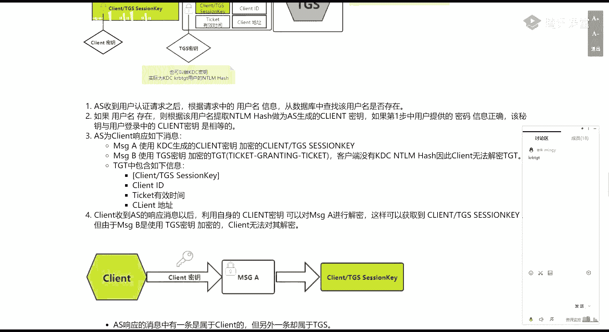

也就是我们前面呃用户输入的一个密码，所生成的这样子的一个cn t一样对吧。

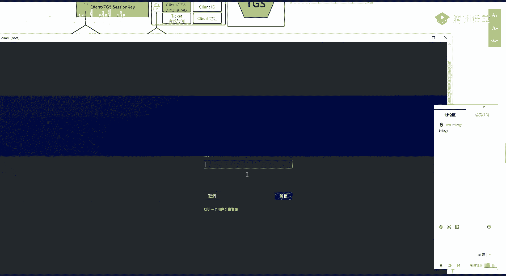

然后的话他会去对这个message a区进行一个解密。

对这边去进行一个解密，然后它就能够去得到这个kt t g s筛选t。

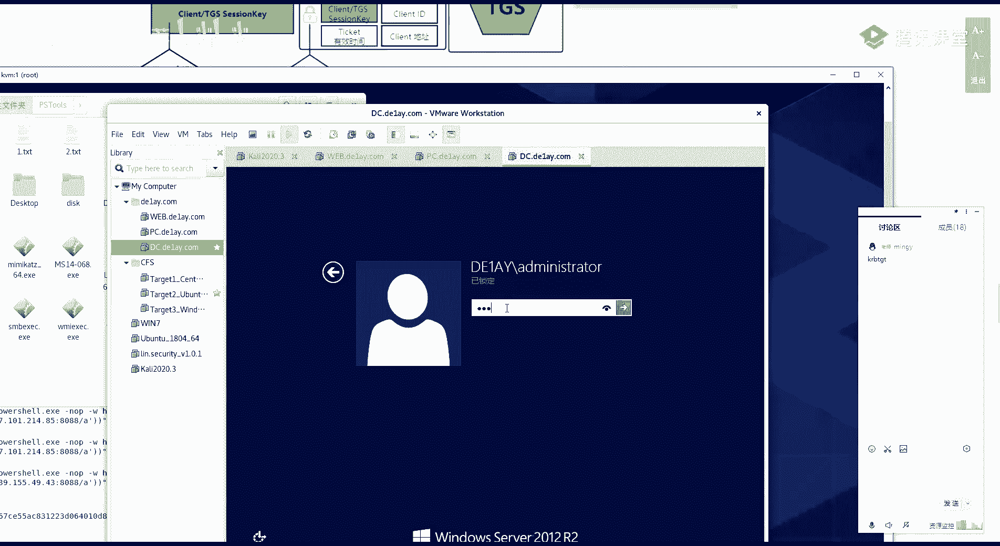

好了，这边怎么去理解呢，就是说我们这边的客户端对吧，他接收到这边的两个message之后对吧，他会利用自身的这个client怎么样，也就是用我们用户去呃再去验证的时候，所生所输入的这样子的一个密码。

所生成的这个呃ntm的一个哈希值是吧，然后的话他会去解密这边的这个message a的这个内。

容，好的话，我们前面有说就这边message a所生成的这个，而所加密的这样子一个client怎么样的话，它是呃as上面所生成的对吧，然后这边a s生成的这个开源怎么样的话。

它是根据就说根据这边呃用户请求的，就是根据请求的一个用户名所对应的，在他的一个a数据库当中，所查找的一个n t m哈希来去呃，生成的对吧，那么如果说我们用户输入一个密码。

与在ad输出库当中所对应的一个用户名的密码，它是一样的，那么他这边所生成的这个n t m哈希，也就是我们这边的一个content密钥的话，它肯定是一样的对吧，所以的话他们要啊一样的话。

那么我这边的一个在客户端上面的话，我就可以利用我自己生成的这个client能量，对它做一个解密，然后的话得到得到我这边的一个绘画，然后的话呃message b的话，也就是这边的一个t gt的话。

它使用的是一个t g s的一个密客户端的话，它是没有这个密钥的话，所以他无法去解密到它的一个内容，然后呃as响应的一个消息当中的话，有一条是属于client的，另外一条是属于tg s的啊。

这个怎么理解呢，就是呃这边就是这边他的一个message b的话，它是解决不了的对吧，然后的话嗯，下一个消息，所以的话呃他这边他解密不了的话，那么他呃无法去得到它里面的内容，但是的话他在客户端的话。

他会接收到这样的一个请求，他会在客户端上面它会有流程，然后的话呃这边的一个t g s的话，会用于后面的这样子的，第三步，就第三步的话，他会请求服务的一个授权，就我们这边验证通过了对吧。

就是客户端它通过这边的一个client怎么样，他应该通过得到message a之后的话，他就会去向tg s去发起请求，就他得到了这样子的一个筛选，绘画的一个key对吧。

他就会能够去这个t t s去发起绘画吧，去发起请求对吧，然后的话他这边发起请求之后的话，它会发送这样子的一些请求的一个内容，就是呃message c以及message d。

然后message c的话就是呃要请求的服务id，就是我们那个cx id，也就是我们的一个t g s上面呃，就是他会去发送这样的一个请求，就是我们客户端要去请求的一个服务的一个。

就是它会放在这个message c上面，然后的话以及这个t g t这边这个t g t的话，就是我这边呃这边从s响应过来的这个t t t，因为客户端它无法解密嘛对吧。

所以的话他会同样它解决不了里面的一个内容，但是它但是它会把它放到这里的，这个像tg s的一个请求当中，在这一个message c当中，然后它会发送到tg alt a message，第一的话。

它会使用前面解密得到的这样子的一个client，t j s的一个search ke对吧，然后他来去加密我们这边的这个呃，这边的这一个这一个印证，这边的这个印证的话就包含了这样的一个client。

client id，也是我们的客户端id以及一个时间说，然后它会对它做一个加密，同样的它会发送到这个t t，然后的话在ktc也就是这个七js，它接收到这边的这个客户端，发送了这些请求之后的话。

他首先的话他会用k d a c的一个n t m哈希，来去解密t t t这里什么意思呢，就是我们前面这边的话有这一个message c对吧，有一个t gt的一个信息的一个内容，然后这一部分内容的话。

客户端它解决不了，所以的话它发生了t g s，就是也就是我们那个k d c上面是，那么k d c上面的话，它就存在有这样的一个t js的meal是吧，因为他有这样一个用户嘛。

也就是有这样子的用户对应那个天马哈西，那么他就能够去解密他这个t t t里面，那个内容，然后他会从这个t t当中，他会提取出这样子的一些信息，就是client就同样的是一个筛选key嘛。

就是我们的一个绘画绘画面，然后的话再去用这边的一个client，就用这边的这个绘画密码来去解密，这边的这个authore，也就是我们这边前面所，就是这边加密的这一个对吧，然后的话它发送到这边的话。

他就会用对应的这一个client tg s的一个筛选t，来去进行一个呃解密，然后这边的话要注意的话，它就是这里就是这边的一个client t t s，还有这个session here。

它会有两个就是呃copy，就是它是它会就是有两份，一份的话就给客户端，然后客户端的话利用这个来加密这边的，这个对吧，那么一份的话就给t g s，然后给t g s的话。

tg s用来解密这边的这个啊筛选key对吧，然后的话获取到它里面的一个信息，然后来去做一个就是比对，就比对这边解密之后的内容的一个信息，如果比对成功之后的话，那么它就会响应，就tg s的话，它会响应。

就是为我们的一个客户端响应服务的一个，授权票据，就是我们最后所得的这个ticket，就是我们通过通过身份证之后的话，然后的话通过一通过身份证，就拿到身份证之后的话，我去买票对吧。

然后的话我通过就是通过啊印证身份验证完，你的一个就是你的身份证跟你本人他是对应的，对应之后，那么你就就可以买票对吧，那就能够去得到这样子的一个ticket，然后这个tick的话。

就是用来去访问我们的一个服务的，那么在这边的话就t g s的话，他就会客户端它会响应这样子的一个气体，就响应这样的一个服务授权的一个票据，然后他响应那个消息的话，有这样子的两部分。

就message一跟f，然后首先的话就是message 1，它会使用我们的一个service的一个密码，也就是服务器的一个n t m的一个哈希啊，这边的话就是这边的这个service meal。

就是对应的是服务器的一个n t m哈，希要注意这什么意思呢，就是呃我要去访问那个服务器对吧，那么那个服务器的话，他同样的有这样子的，就是他有这样子的一个就是对应用户的，就是服务所对应的这样子的一个啊。

n t m的一个哈希对吧，就是能够去访问这个服务的用户，所对应的一个n t m的一个哈希，它同样的存放在这样子的一个，就是a d数据库当中对吧，然后的话在这边的话。

他会用这样子的就是啊service的一个密钥，来去加密这边的一个呃client to service的一个ticket，就是这边的这个chek的话，就是就是客户端去访问服务端的这样子，一个票据嘛对吧。

然后的话这边的这个check的话，就包含有这样的一些信息啊，好message f的话，它就它使用了这样子的一个client tg s的一个session，key加密。

然后加密了这样子的一个client server的一个session key，呃这边的话，嗯没错，这边的话呃就是s gf的话，他这边使用了这样子的一个就client tg，s的一个筛选t来去加密。

这边就这一个client server的一个筛选key，然后呃因为我们这边的一个mesage f，它使用了这样子的一个筛选器，所以的话这个消息的话它是对client是可见的，也就是我们的客户端的话呃。

就这边这边的这个client tg s的一个session key，在客户端它上面它是有的对吧，然后的话服务端也有的，然后的话这边呢他呃这个message f的话。

它是用的这个啊client tg s的一个session key去加密的，这里这里一部分内容对吧，那么我这边的话这边m3 就m3 gf的话，这边的这一个呃消息的话，在客户端的话。

我可以用这里的这个筛选key来去做一个解密，然后的话就能够去得到这边的这个client，server的一个session ke，然后这边的这个session key的话就是用来发送到我。

我们要去请求的一个服务端，也就是发送服务请求，就是像服务发送我们的一个请求，那么我们在这边的话，我还有一个这个service service的一个密钥，我们这边的一个service密钥的话是。

就是我们的一个服务所对应的用户，对一个ntm的一个哈希对，然后客户端的话他是没有这个密钥的话，所以这里这里的一个内容，就是这个client to server的一个ticket，它是呃无法去。

就是它是解密不了的，也就是无法得到它里面的一个内容对吧，奥特曼在呃客户端向服务发送请求，也就是像我们那个服务端，注意的话，这边不是像我们那个k d c发送请求了，好像我们那个服务端。

也就是说像我们那个service发送请求，那么在这一步的话，它就会把呃在上一步当中，这边他没有解密的这一部分内容对吧，他会代入到这样的一个请求，然后就这个message一它会把它放到这个请求，发。

放到就是发现这个服务端发送的这个请求当中，好message t的话，它会它是由这个kint server session key，也就是这边的这一个呃，这边这边我客户端对吧，我客户端解密解密之后的话。

就得到这样的client service service的excession key对吧，在这边的这个的话，它是tg上面啊所所发送过来的对吧，他是用这个加密的，然后我这边客户端解密之后的话。

我就能够去得到它，得到它之后，我再用它去做一个加密加密的一个内容的话，就是这边的这个oc cut 2，这里呢就是包含了这样子的一些，就是客户端一个信息，然后的话它会把它发送到我们的一个服务端。

然后这边服务端，它接收到这个client的一个请求的话，他会响应对吧，就是它会响应他的请求，他响应这个请求的话，它呃有这样子的一个过程，首先的话它的一个服务端，他会去解密这边的这个service。

就是这边的这个message，因为的话在我们的一个service server的话，他肯定有这样子的一个，就是有这一个服务用户所推荐的一个，就是nga的一个哈希对吧，那么它就能够去解密这边的一个内容。

然后他这边解密的这个内容的话，他这边就能够去得到这样一个client，server的一个筛选器，然后呃就提取出这个client to server的一个ticket。

就这一部分就是这边的这个ticket，里面就包含了这样子的一些内容是吧，就包括了这个client server的一个筛选key，以及client id等等这些信息。

然后的话服务端的话他就会用这边解密之后，得到了这个client server的一个session key，然后的话解密这边的一个message g，来得到这边的一个osity kit啊。

这样子的一个内容，然后这边的这一概念的话，就是包含了就是客户端的一个id以及，就报报完了客户端的ip，以及我们的一个时间戳对吧，然后他这边解密之后的话，它会与这边。

就这边他得到这个啊cs的一个筛选key对吧，它解密解密这边message g之后的话，得到这边的一个内容，包含了有开client id一个。

那么这边service密钥解密之后的一个client id换呃，也能够得到对吧，那么他就会去做一个比对，就比对这边的client id它是不是一样的，如果说是一样的话，就说明你的这就是表示你的这个请求。

它都是来自同一个客户端吧对吧，也就是能够去确定你是你的，这个客户端要向我去发起请求对吧，然后他最后的话就是呃它解密出，解密得到这些信息，他确定确定了你的一个客户端，它能够就是说呃印证验证成功了对吧。

他有权限能够去访问我这边的一个服务端，那么他在这边的话它就会有一个响应，就告诉客户端对吧，告诉客户端相应的一个服务端的一个信息，然后的话呃这边的话，它是会把这边前面所解密出来的。

这个ta就time steer，也就是时间戳吧，然后它会发送到客户端上，然后的话他同样的会去做一个啊匹配啊，然后客户端的话它是能够去解密这边的一个client，server的一个筛选p的。

然后他解密之后的话得到证明time step里面的内容，然后匹配一样的话，那么就就表明我们的这边那个客户端，它是有权限去访问这边的一个服务端，以及的话呃，客户端与服务端之间的话，是能够去进行一个啊请求。

然后的话我们这边的话就经历了这样子的一个，就是呃caas的一个认证啊，然后其实从上面的这样子的啊，一些内容当中的话，我们能够知道就是他的这样子的一个交互，就是客户端与服务端之间交互的话。

他有这样子的一个就是双向认证，就是它中间的话有包含的，像呃前面所说的这样子的一个密钥啊，就是这个client怎么样，t g s么样，还有service什么样，然后大家理解这些必要的话。

其实就是对应的用户的一个ntm的一个哈希啊，就是client mei，他就是呃就是用户输入的一个密码的一个啊，n t m的哈希的t j s密码的话，就是这边的这个k r v t g t的。

这个用户的一个密钥，就这一个用户的一个n t m的哈希，然后这边呃sv什么样的话，就是对应的你要去访问的这个服务，它的一个对应用户的一个密码，也就是对应用户的一个tm的哈希，然后呃这边的这些密钥。

它的一个主要的一个作用就是用来加密，我们这边的一个绘画，绘画密钥，就是这边的一个筛选key，然后在中间的话有涉及的，就是呃你的有涉及的这样子的，就是你在客户端去解密对吧，解密来服务端的一个解密。

来自就是响应的，就是来自服务端的一个响应的一个信息对吧，然后他获取到里面的内容，然后他再发送给服务端，然后在服务端解密，解密得到里面的一个内容之后的话，再去发送给客户端，然后客户端再发送给服务端。

就是中间的话他有这样子的一个认证的一个过，程，就是有一个双向的一个认证啊，就是客户端啊验证来自服务端的一些呃数据，然后的话服务端印证来自客户端的一些数据，呃这边的话就是关于这个windows认证的。

这个cas认证的呃，详细的一个过程，以及它的一个windows的认证的一个机制，大家有没有什么问题，好问题的话，应该我猜的话应该是没有，就是，呃应该是就是大家能不能理解，大家能理解吗。

就我这边讲的这些内容，你理解的就是呃觉得没问题，就是你不管是你现在你听我讲能理解啊，或者说你觉得你已经对了，这对这个有一个概念的同学就扣个一好吧，然后的话如果对我讲的这些内容。

就是没有一个基本的一个概念的话，就扣个好吧，我看一下就是大家能不能理解，呃，一直知道这么个东西，你以前是嗯呃其实这些东西的话呃怎么说呢，这个windows的一个这个就是canvas。

这个企业就是在于渗透的话，你要去理解它，因为在后面的话有像这样子的一些，票据的一个个传递，就是票据的一个伪造，就是p t t，还有p t k等等的这样子的一些攻击啊，就是在遇难的一个权限维持。

会去用到这样一个票据的一个伪造，以及横向移动，然后就是其实你要去理解他这个票据伪造的话，你就需要去知道这样的一个认证的一个过程，然后其实你要想去比较好的理解的话，你认真的看一下我这边的这个笔记。

就是按照我的这边的这一个流程，然后结合这边的这结合，我这边就是在课上讲的这个录播好吧，我这边特意讲这个话，就是因为这个东西确实你要理解的话，一时半会确实很难理解，所以的话呃，我这边的话。

课上的话有就是特意的话花了挺多时间讲，这个就是能够让大家理解理解它，然后的话就是就算你课上不不理解，你自己看录播的话，看我的一个就是给大家讲的这样的一个思路，好吧。

咱去理解好这边的一个windows认证，其次的内容就到这边了，好呃大家自己如果还不理解的话，就按照我刚刚说的一个方法，自己课后的话再去理解一下好吧，然后下面的话就是给大家介绍一下这个p t h，呃，p。

h的话，其实我这边上就是同样的，这个文档已经写的很详细了，我这边的话就带大家一起来，或就是过一下吧，呃就包括了步骤啊，命令以及截图，我这边都给出来了，就是应该没有，就是大家看我这个文档上。

应该不可能理解不了的，然后这边的话主要就是就是大概的介绍一下，就这个p t h p hr就是这个哈希传递攻击，就是这个pass哈希的一个简称啊，就是哈希传递攻击，然后它的一个作用的话就是呃模拟用户登录。

不需要用户的一个名字密码，我们只需要可以，就是我们只需要得到它的一个哈希，我们就能够去登录他的一个目标系统啊，我要去进行一个p t h的一个攻击的话，它的前提条件是这个就是开启实时的一个端口。

就我们需要用这个sam的一个服务，以及我们的一个add面的一个共享，也就是我们前面所说的一个i p c的一个呃，就是ipc 0件的这个面的一个共享带来的命运，共享的话就是我们的一个对应的是我们的一个。

windows的一个系统安装的那个呃，那个目录下面的这个共享原因，就是应该的命了对吧，然后然后的话要能够去有这个共享的，就是要开启这样子的一个面的一个共享，然后下面的话就是分别。

就是如何去利用这样的一个pd，就是pdh啊，就是就比较直接就，呃我这边上就写了这样子的一个，就是利用这个ph的攻击的这样子的一些方法，呃首先的话就是msf下面的这样子的，一个三个模块。

就是p s e x e c的一个三个模块，我们可以用它来去做一个哈希的一个传递工具，其实这边的msf的这三个模块的话，其实上节课的话也要讲对吧，就是像比如说p s e x1 。

就是利用这个p s e x e c去进行，去执行命令对吧，然后在在这边他在上一节课的话，所使用到的话是就是在外部的这种的话，我们是已经知道了他的一个账号，已经知道了一个账号以及它的一个密码对吧。

那么我们在这边set sm本pass它就输入我们的密码，我们就能够去啊，进行一个用这样子的一个方法来去进行一个，啊执行在远程计算机上面去执行命令对吧，然后在这边的话就是ph的话。

我们只知道我只知道我的一个lm哈希，以及nt l那个哈希的，那么我在这边看就是使用的300pass的，就是我们的一个m的一个哈希，以及nt m的一个哈希，然后这边要注意的就是它这个格式是呃。

这样是不是当不是指只要这个nt m的哈希，而是要这个l m的一个哈希，加n t m的一个哈希，然后的话如果说你就是有些情况的话，lm哈希它没有的话，我们在这边可以就是呃通过就是停灵啊，就是你随意啊。

因为实际的话就是说它的这边的一个格式，是这样子的，然后的话实际的话l哈希的话他没有提到，就是没有去使用到它，然后的话呃就是这个p s e s e c，我们可以在这的话可以直接得到它的一个。

metp的一个shell是吧，我们添加这样子的一个啊，同样的一个就是呃不同跟前面不同的一个地方，就是这个三pass就听我们那个n t m的哈希啊，啊不是m的哈希呃，跟n t m那个哈气这样子的格式。

然后的话我们就能够去进行一个呃，哈希的一个传递，来去得到这样的一个来确定一个横向移动哦，这个话是工作组，工作组的话就是这边的一个300dom，就是没有嘛对吧，就是默认的话就是一个点。

就是表示当前的一个工作组是吧，然后的话玉的话就是我们在这边啊，要设置我们的一个seer dom，也就是我们的一个域名，像在这边的话就是我这边它就是一个delay，delay这个语对吧。

那么我这边要设置的就是这个sdm是一个delay，然后的话我就能够去在域内去进行一个，横向的一个移动，就用这个ph的一个方法，然而下面这个也是啊一样的，就类似的呃。

呃第二个它就是一个mini cards的一个哈，希的一个传递好呃，这边的话其实就是那个mini cs的一个就是使用了，就我在mini cs当中的话，有这样子的一个就是啊p dh的一个模块。

有这样的一个功能，我们可以用这个pg h的一个模块来去进行一个，啊哈希的一个传递，那么用法啊就像这样子，这句话就把它写成了一个一句话，就是首先的话就是呃提权嘛对吧，然后的话用这个就是ca secure。

iosa的一个pdh的一个模块，然后的话这边就是我们的一个用户名，然后的话这边的话是我的一个，就注意的话这边多门的话指定的是呃，指定的是你的那个i p2 ，这边不是指定你的一个域名，是指定你的。

就是呃那个那个那个你要去哈希传递的，那个主机的一个ip，然后n t m的话，这边的话就加我们那个n t m那个哈希值嘛，然后这边还有个x y就是执行之后的话就退出，然后执行之后的话。

在这边的话我们可以呃这个截图。

看一下这边的这个截图啊，我这边执行之后对吧，执行之后的话，它就会在这边弹出这样子的一个，semd的一个窗口，这个窗口的话它是一个就是管理员那个而权限，然后在这里的这个窗口的话。

我们可以直接ntu子来去连接，我这边的一个远程的这个啊这个机器，而不需要去输入密码，就是说我这边的话，因为我这边哈希就是哈希，传递的话已经就是传递成功了对吧，那么我这边的话等于就是我这边印证的那一步。

骤，就是去进行认证的那个步骤的话，已经成功了是吧，那么我这边认证的那个步骤成功了，我这边的话我自然的话就不需要去输入密码，然后的话我直接nc柚子这个i p c的一个连接。

我就能够去建立这样的ipc连接是吧，然后我就能够去啊查看啊，远程机隐藏目标上面的这样子的一个呃，文件结构，文件内容对吧，然后的话就我们这边的话通过这个ph对吧，经历了这样子的一个a b c连接之后的话。

就又回到我们前面的一个内容啊，就很向移动是吧，就是我们利用这个ipc连接来去进行对应的，去利用对应的一个方法来去练横向移动是，然后前面的话再讲那个就是横向移动的时候，是直接指定我们已经获得的一个账号。

账号名以及密码对，然后呃这个的话我就也觉得这样的一些操作，就没有加起其他的更多的，因为前面的话已经也讲了对吧，我们今天的这个i p c0 件，然后续的一些操作。

然而第三个就是一个cp cs上面的一个哈希传递，这边这个哈希传递的话，其实跟前面的话是跟前面的一个，就是我们已经得到了一个就是上一节课的，上一节课的那个呃cs的一个横向移动的时候。

它的一个方法是一样的对吧，就使用的一个模块，也同样的是这个p s e x e c的模块，然后的话我这边呃就是指定这个模块，指定之后的话，执行执行之后的话，我这边的话就能够去得到呃。

得到呃要去攻击的指定机器的一个呃绘画，然后在这里你选择这个ps ex，一直说的话会有一个呃这样子，这样子的一个就是宽对吧，要不你去选择，就是你要去选择的一个就是凭证。

然后呃我们上上一节课的话是直接去选择，就是我已经得到了这样的一个账号的，一个铭文的一个密码是吧，然后他如果说我这边没有获取到他的个，铭文的密码，那么我只获取了他的密码哈，希然后在这的话。

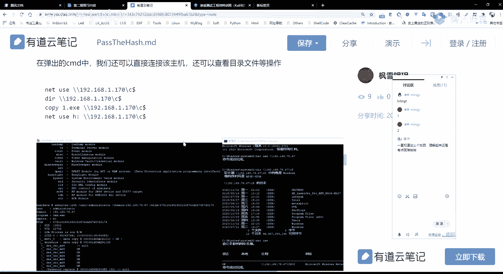

我们可以就选择使用它的一个密码哈，希好像比如说我这边的话，就选择的是这一个他的密码，然后的话选择我的一个监听器，然后的话rush rush之后的话，再在这边的话，它就会呃反反弹。

给我们一个这样的一个system的一个绘画，就返回这个呃攻击的这个主机的一个绘画，呃呃以及第四个这个抛shi的一个哈希床垫，呃，pasha这个哈希环境的话，就是主要他就是使用了这样子的两个。

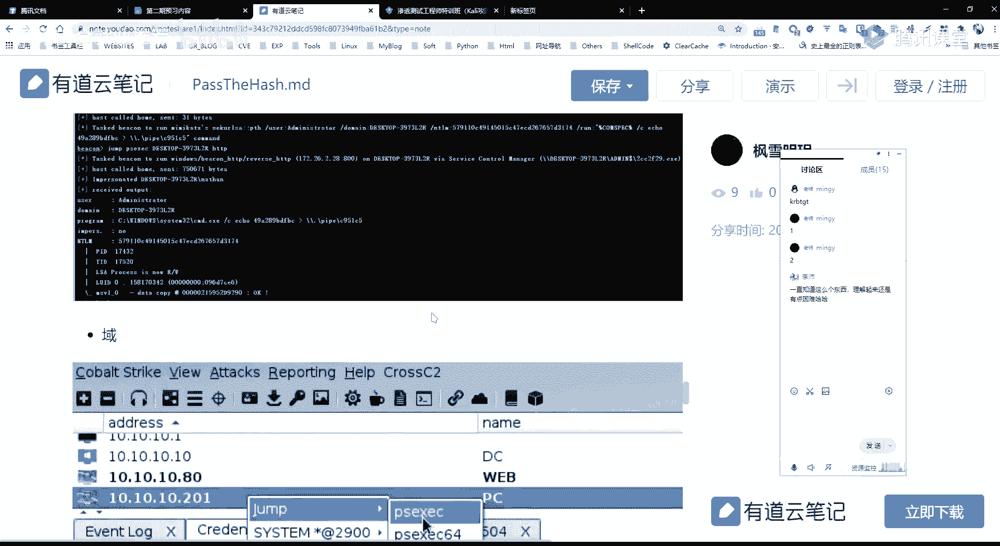

project的一个脚本，我们只需要加的这两个pasha的一个脚本，然后的话我们就可以呃执行这样的一个命令，就是用这样子的一个哈希然的话，通过这个w i e x e c的方式来去进行一个。

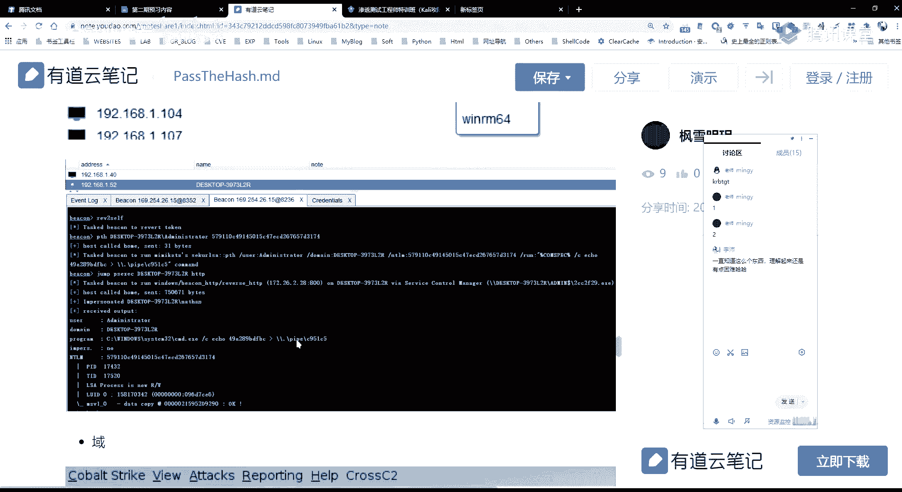

哈希的一个传递，然后这里的这个脚本。

它是一个比较好用的一个地方，就是再对再对一个网站去进行一个。

就是哈希的一个传递的话，用这样的一个方法的话是比较好，就比较快的一个方法，然后的话它会在对你指定的这个网站下面的，所有那个主机都做这样的一个哈希的一个传递。

然后让他去印证我这边的这样子的一个admin用户，以及对应的一个哈希值是否能够去登录到呃，这个网站下面的其他的一个主机，像比如说在这边的话，像在这边的话呃，x s w i和这个机器就表明的话。

这个网站下面的这个机器我是可以用的。

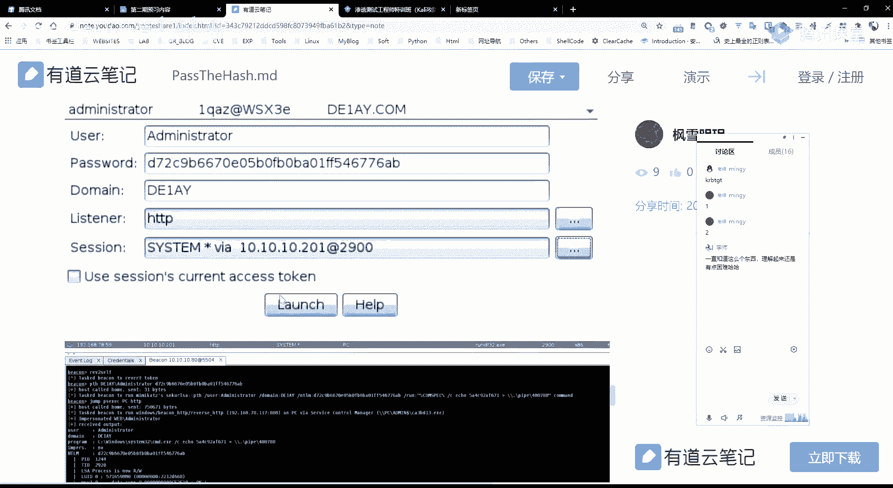

这样子那个哈希的一个，用这样子的一个哈希来去进行一个呃访问的，那么我这边验证了之后的话，我们我们就可以去针对这个主机来训练，一个哈希的一个攻击的，然后这句话呃。

通常的话我们可以去用这个impact这个套件，这个impact套件里面的话有这样子的两个脚本，这两个脚本的话它的作用的话，一个话就是呃这个w i e x e c就呃，上节课的话也讲了对吧。

我们用它来进行一个横向的移动，好在这边的话，这个脚本它同样的可以去指定我们的一个哈希，就干哈希，然后他指定注意呢，注意的话格式是lm的哈希，然后n t m的一个哈希，然后后面的话接我们的一个用户名。

然后他呃要去攻击的一个主机，以及在这块的话接我们的一个命令，就是这里的这里的一个w i c的话，就是我们可以通过这个哈希的一个方法，来去执行命令，就是只要我这边的一个哈希就是验证成功了。

那么我们这边的话就能够在目标，在远程目标机上面去执行外卖对吧，像结果的话就像这样子对吧，能够去有回显回显出这边执行换麦之后，那个结果好呃，第二个还是这个300x1 c，我们可以利用它来直接去得到一个。

这样子的一个交互式的一个啊sam d啊，我这边直直接执行之后的话，这句话他就能够去得到一个system权限的，这样子的一个呃cmd的一个交互命令行啊对吧，然后我就能够去对它做一个操作对吧。

这边的话就是关于这个p t h的一个内容，然后呃这边的这个内容的话，我这边的话我就不一不一样的演示了，因为呃时间不早了，然后的话我这边的一个呃文档的话，已经写的很详细了是吧，大家自己课后的话。

自己去照着我这边去操作好吧，呃以上的话就是本节课的所有内容，大家有没有什么疑问呢，呃其实本节课的话主要的话就是windows认证的，这样子的一个概念，就是你了解这个的话，就是其实就是为了在域内去进行。

我们去进行相应的一个预渗透的时候是吧，你需要去呃必须要去了解它这样子的一个东西，然后的话你了解这个认证的话，你在后面的话，像p t t的这样子的一些就黄金票据，保白银票据的这样子的一些伪造的。

主要的话你就会比较好的去理解它，以及的话你了解他这个预认证的话，你就能够去了解，就是说呃你的一个在域内当中的主机，你去通信对吧，你要去互相访问的话，是要去经过预控的对吧。

然后的话然后经过预控的话，它中间你去访问的话，他有什么什么样子的一些大概的一些步骤对吧。

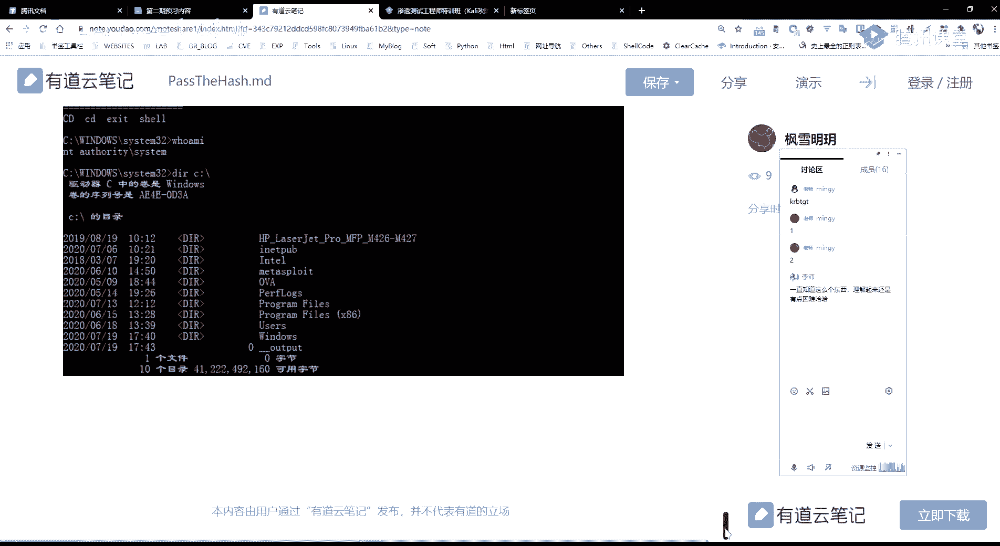

他是怎么去进行认证的对吧，就让大家呃对域内的这种主题的一个通信，能够有很好的一个理解对吧，然后第二部的话，就是这个ph，就是在没有在没有获取到明文密码，的一个情况下面，我们会确定获取到它一个哈希值。

来确定一个横向的一个移动，嗯有问题的扣一。

没问题的扣二，大家还在吗。

唉大家总是总是不跟我互动啊，有点有点尴尬，有问题的扣一，没问题的扣二，我感觉我感觉其实我感觉你们应该应该都是，都都都挺厉害的，就是我这边讲完之后都没有什么问题什么的，就两位同学们啊，行吧。

我就三位同学啊，这三位同学应该就代表了大部分的人了，因为每次都是都是那几位同学啊，就是那三四位同学回我，然后其他同学的话不管有没有问题，也不回一句什么，那我就默认大家都没有问题好吧，反正有问题你问。

然后的话呃看看录播是吧，那么没有其他问题的话，我们本期的内容的话就到这边就结束了好吧，然后大家早点休息啊。

