# 【B站最系统的网络安全教程】北大大佬196小时讲完的网安教程，全程干货无废话！学完即可就业，别在盲目自学了！！！ - P82：第53天：Windows权限维持-Meterpreter权限维持 - 网络安全就业推荐 - BV1Zu411s79i

应该是没有什么问题啊，那么我们正式开始我们今天课程的内容介绍，好吧，呃我们今天的话主要给大家介绍一下，windows下面的一个全新维持，啊我这边的话把这一部分的一个内容的话，把它分成了四块，就呃。

首先第一个开的话，就是一个matt pat的一个权限维持，第二个的话就是呃系统工具的一个替换后门，第三个是而一些开机自启动的一些注册表象好，第四的话就是呃others就是包括了其他的一些呃。

问了下面的全线维持的一些技巧好，首先呢我们先来看一下第一块的一个match，por的一个权限维持，我们知道的话，matt pat的话，它是m sf下面的一个扩展对吧，是一个。

就是呃它是m3 f下面的一个，就是扩展的一个功能，就是说他的这个match peter的话，我们通常的话会去访谈这样子的一个，matt matter的一个shell是吧。

那么我们为什么要去用这样子的一个mac por呢，就是因为他在他这个matt matter一个shell里面的话，它已经有集成了很多的一些功能，我们可以直接去啊，直接去在这个shell当中去直接去使用。

然后的话能够去啊更方便我们，更让我们能够快速的去进行相应的一些操作，以及它的功能的话，就是相比于普通的一个需要的话，是要强大很多的，好的话，在了解这个权限维持之前的话。

我们先来就是说了解一下什么是权限维持，就其实我们从字面意思上的话，我们也能够大概的知道对吧，权限维持吧，就是维持我们的一个权限是吧，那么我们这边的一个权限它是哪里来的呢，就是通过我们前面。

我们前面课程的这一些内容对吧，来得到这个权限，就包括我们，得到的一个web share是吧，然后的话通过web share，然后的话呃得到内网机器的一个shell是吧，等等这些啊shell绘画。

以及包括你在内网的这样子的一个下载，一个移动所得到的这种绘画，你都是能够去得到对应的这样子的，一个权限对吧，那么这些权限的话，我们啊就是想要去维持它，那么我们就需要对应的一些技巧，然后呃权限维持的。

就是为了保证我们获取到的一个目标权限，不会因为漏洞的修复而丢失，或者说不会因为啊管理员的一个就是发现对吧，而丢失，奥特曼，我们的通常的话会在我们的一个目标上面，去安装这样子的后门。

来去保证我们对目标的一个持久化的一个控制，就是我们呃后门的话就是什么意思呢，就是后门的话我们，呃，比如说你啊，比如说你一个房子对吧，你一个房子的话，你有正门，你从正门，你从正门能够进去。

然后的话你还有一个后门，然后的话你从后门也能够进入到这个房子对吧，那么如果说你的一个正门的话，你是锁住了对吧，就是说你的正门锁住了，那么你是无法直接的去进去的，但是的话如果说你有一个后门。

然后的话后门的话是，你就是说你能够去访问的对吧，你有权限，或者说你有后门的钥匙，你能够去访问这个后门，那么你就可以通过后门来去呃，进入到这样子的一个房子对吧，就说呃这边的一个后门的话。

也是同样的一个意思啊，就是我们在啊，我们可以把我们的一个计算机，理解成一个房子是吧，然后的话正常的这样子的一个去登录，或者说去啊访问的话是不允许去访问的是吧，那么我们在得到了对应的。

就是说通过相应的一个漏洞是吧，比如说通过他的一个窗户，它窗户没锁，然后我通过他的一个窗户进入到他的房子对吧，然后的话拿到了他的一个钥匙，那么我我在他的一个房子里面，得到了这样的一个权限。

然后的话我去留下这样的一个后门对吧，然后的话我下次我再去进，进入这个房子的话，我就能够通过这个后门来进行直接的去进是吧，然后的话不需要去通过和正文，然后就是介绍一下matt matter的一个权限。

维持的两种技术，就是说在matt python下面的话，有这样子的两种权限维持的一个技术，就这一个啊啊这个怎么，persistence，就这个persistence啊，就是呃，坚持不懈的一个意思。

然后的话呃他是一个注册表的一个后门，就是说他的这个后门的话，是通过在注册表当中去写入我们的一个呃，留下了一个后门的一个脚本，一个vbs的一个脚本的一个地址，然后的话再去进行一个，在自启动的时候。

它会去加载这样子的一个脚本，然后的话达到一个全解围持的一个目的，然后的话啊，这个第二段话就是这个matter s vc的一个后门，这个后门的话它是一个服务后门，就是说它我们使用这样子的一个模块的话。

它会在我们的一个windows 7上面，他会去创建这样子的一个啊matt pattern，就matter s vc的一个服务，然后呢这个服务的话它会进行一个端口，我们只需要去访问连接这个端口。

我就能够去进入到这个机器，就相当于就是说啊这边留了一个端口，就是留了个后门嘛对吧，然后的话我通过这个后门，我就能够进入到他的机器，好首先的话我们先来了解一下，就是这个啊persistence这个模块。

然后这个模块的话它的原理是呃，它会首先会上传一个vbs的脚本，然后的话执行这个vb s s的一个脚本，来去修改注册表啊，应该是说呃，修改注册表，来去执行这个vbs那个脚本啊，没有，应该是这样。

然后呃是这样，然后执行这个vbs的脚本，就是他擅长这个vbs脚本，他会不会去执行它，执行了之后的话，我就能够去得到一个绘画，然后的话它的一个就是呃，维持我的这样子的一个权限的一个方法。

那就是通过修改这样子的一个注册表象，就在这个注册表的这个呃乱这个乱象下面的话，我们它会随机的去添加一个项，然后在这个山下面的话，他会写这样子的一个呃，就是它的一个值，就说这个像它对应的一个值的话。

就是我这边上传的这个vb s脚本的这样子的，一个路径，然后的话能够去进行一个自启动，就说写入在这样子的一个注册表项下面的话，是的，它会随着系统的一个启动去启动，就这边的话是在后面第三部分。

讲这个注册表象的时候会有介绍，然后呃他能够去实现一个开机自启动了，但是的话他这种的话方法是容易被删了，查杀的，你就看这边的这个呃是他是不需要去认真的，就是我们可以就任何这种连接，我们都可以通过这样的。

后面就是他没有像就说我留了这个后门，他没有去上锁，这个锁的话是只有我一个人知道的对吧，但是的话他这边留着这个后门的话是啊，只要有人看到这个后门，那么他就可以去通过这个后门进入到你的房子。

或者说进入到对应的一个计算机对吧，然而像这种的话呃，它一个方法它是上传vbs的一个脚本对吧，然后的话如果说你的一个机器上面的话，但凡有一个有相应的这样子的一些沙文什么的。

这种vbs的脚本的话是直接就会被查杀了，就通过vbs脚本的这种方法，对于b s脚本的话，它里面的内容方式呃很直接的，以及的话你要去对它做一种混，做这种混淆什么的话是很难的，所以的话一般都是三轮的话。

对这种vbs脚本的话，查杀的话都是呃都是挺严格的，然后这边的话就是主要的话给大家介绍是吧，但是如果说你要碰到，那你知道你碰到没有上完的对吧，那么你可以直接用这样的一个东西吗。

然后它就是具体的一个使用的一个方法，就通过在mc下面执行这样子的一个语句。

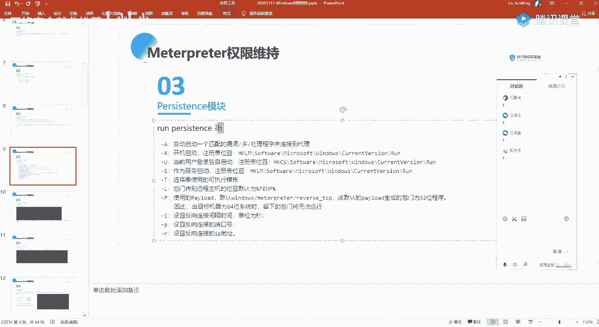

然后我们输入一个杠h的话，我们就能够去得到它的一些帮助的一个信息。

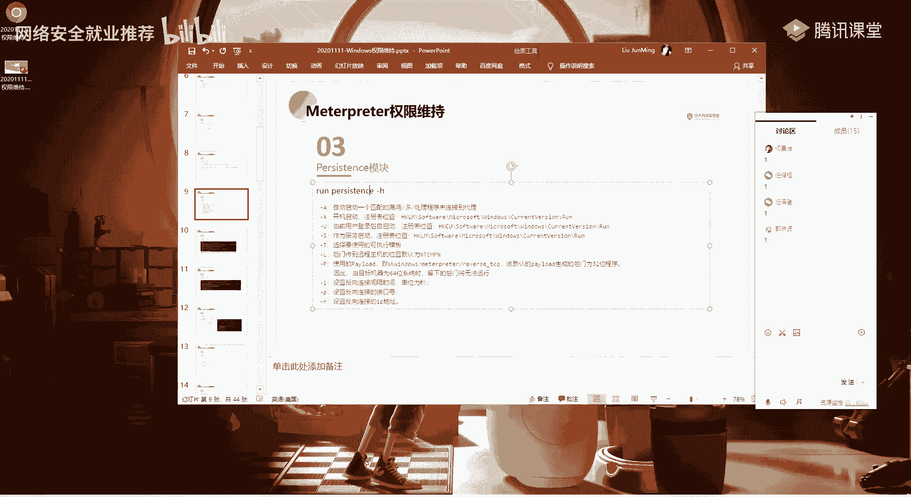

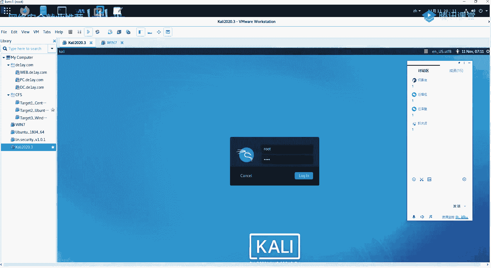

我这边的话呃这个的话是我的一个靶机，就是我要我已经得到了这个机器的这样子的，对应的一个呃绘画权限对吧，然后的话。

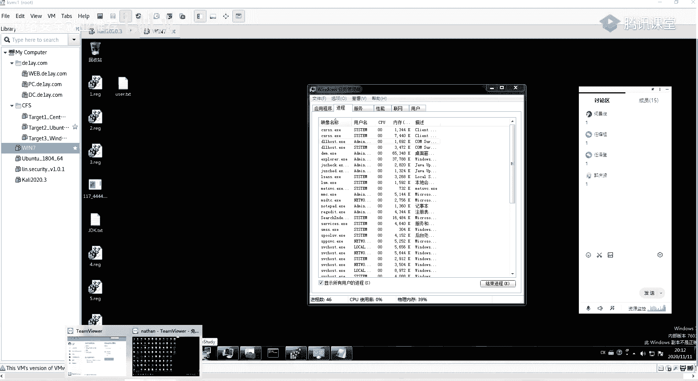

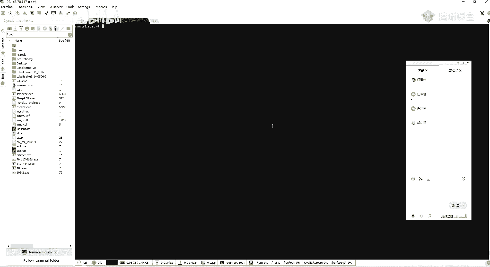

我这边先启动一下msf。

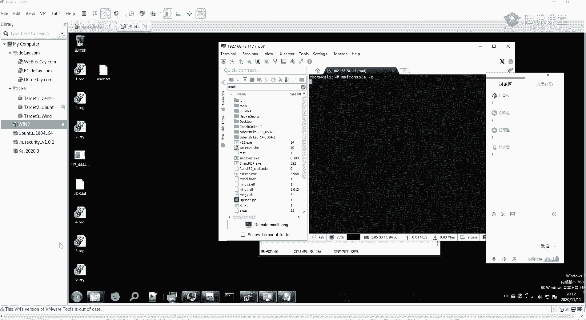

然后的话呃，就是我这边的话已经提前生成了这样子，生成这样子的一个脚本，然后的话就模拟得到的还有一个权限嘛，就前面的这种呃操作话我就省略了，呃这边的话呃，我考一下大家就是正好这边有碰到，这边的话。

问大家一个问题，就是我这边执行的这个such a exist on session force，这个语句，它的一个意思是什么，有有哪位同学知道，前面前面已经有讲过了，有同学来回答一下这个问题吧。

就是说一下在我这边set的这一段exist on session，设置为force，它的一个作用是什么。

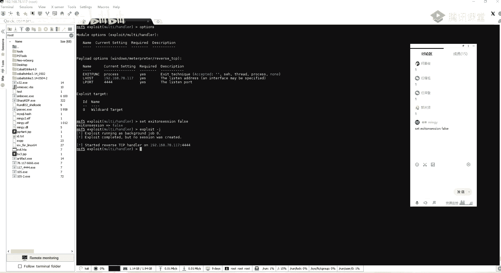

有同学能回答一下吗，知道的同学回回答一下。

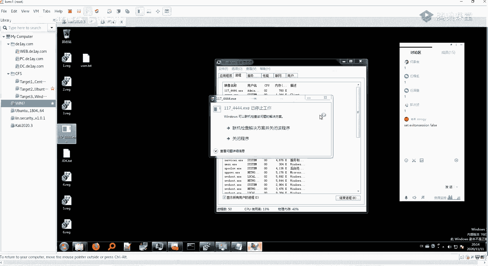

g boss啊，能说详细点吗，防止色情绘画单点啊，这位同学说的对啊，呃其他没说的同学是不知道吗，就是我这边呃，其实前面已经有提了很多次了对吧。

我这边的话设置这个exist on session force的话，就是它默认的话他这个exist on session是去，然后的话它是为去的时候，它是什么意思呢，就是我这边尽力了。

比如说我这边expose干j对吧，我在后台的话进行了这样子的一个端口，那么我这边呢就有这样的一个jboss，就有这样子的一个呃任务工作对吧，那么我这边。

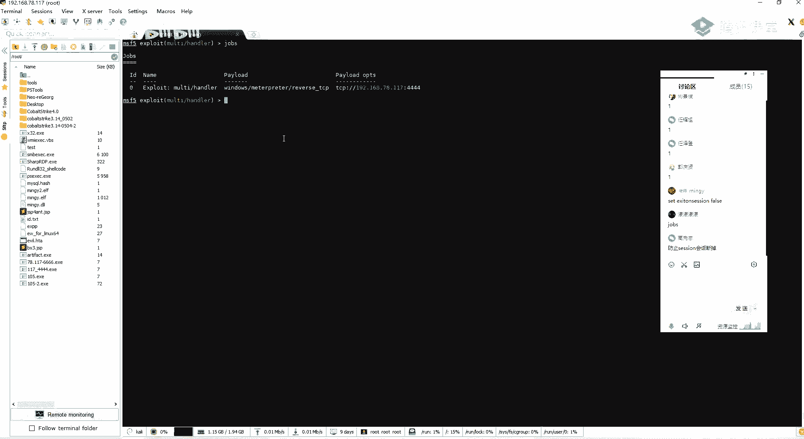

我这边得到了这个机器的一个需要绘画对吧，他这边执行我执行我的一个木板之后的话，他这边反弹一个绘画，反弹到我这边是，那么反弹到这边来之后的话，他这边就是说他经历了这样子的一个筛选分化。

他这边建立了这个筛选之后的话，我这边的这个g boss它就会停止的嗯，就是我这边的这个任务，这个任务的意思的话，就是他一直在今天这个四四的一个，ccd的一个端口嘛对吧。

那么我这边建立了一个绘画已经尽力成功了，那么我这边的一个接破手它就会断掉，那么我这边设置为force的话，就是让我这个绘画它能够处，那我这边的一个jboss，也就是这边今天的这个端口。

它是处于一个一直经天的一个状态，只要有会，只要有那个啊，来自攻击机的这样子的一个连接的一个请求，对吧，请求到我这个端口，然后进行分化的话，我这边就是他只要有请求，我这边就能够去进行分化，就这个意思啊。

然后的话呃就是我这边还有一个问题啊。

就我这边对吧嗯。

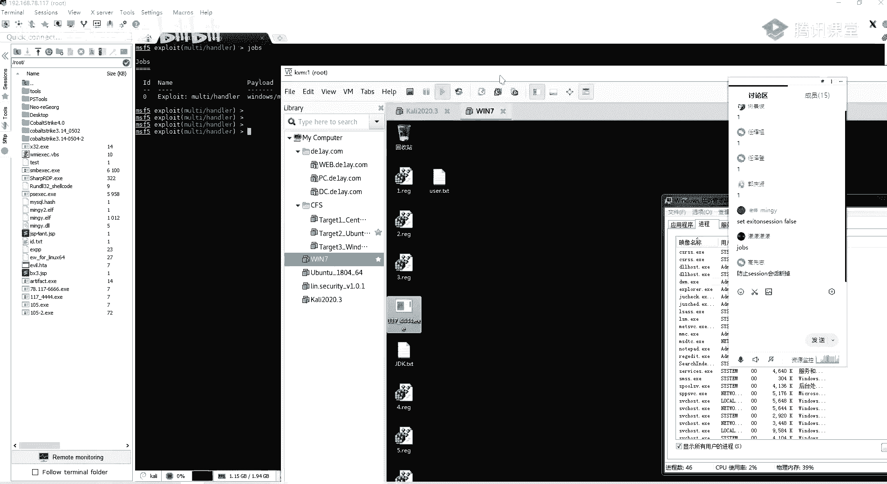

我这边我这边的话，提前生成这样子的一个117的，这个是吧，然后我这边的其boss是这样子的，就是我这边今天的一个任务是这样子的是吧。

那么我在这里的话，我这边，执行这一个之后的话，他这边报错了，就说他这边停止已经停止工作了，就弹了这样子的那个框，就有同学能回答一下，就是为什么要弹这一个框嘛。

就是我这边为什么停止工作啊对吧，然后我这边关掉了，所以我这边的一个设置方法的话也就断掉了，有同学知道，这同学啊，指导同学回忆一下，我前面的话呃前面的话在课上的话，是在课上的话是没有讲，但是的话就是说呃。

大家在群里问问题的时候对吧，就是你打上excel，然后的话以及对应的你的这个生成的，这种朋友等级，在目标机上面执行报错这种情况，网友在群里有回答了好多次的这种问题啊，就是为什么这样子，他会呃。

它会就是说你这边的这个绘画它会关闭的，以及的话你在路由器上面执行它的多错，其实在全年的话已经有给大家说过了，有同学知道吗，呃没有同学知道了，行吧，那我在我在在这边，正式的在课上给大家就是说一下吧。

因为正好这边对吧，有呃就前面的话像这种弹性啊，这种的话我没有给大家去，就是去讲了，就是去操作这样子的一个过程对吧，因为这种的话前面在讲msf的时候，应该是已经给大家有讲过了是吧。

然后在这边的话就是我这边，首先他啊我们来看一下我这边的生成的这个呃，就是设置这个payload，就我这边设置一个今天的一个payload的话，首先刚开始的话都是这样子的，一个就是呃32的这样子的一个。

就是他他不是三六十，三，60的话就是64位的这样子的一个朋友的，然后这边的话没有参与式，二就是一个32位，那么我这边的这个pd是这个是吧，然后的话我这边精听精听之后的话，我这边执行的这一个程序。

执行这个程序执行之后的话，他报错，而且的话他这边虽然有这样子的一个，就有这样子的一个零件对吧，这样子的一个连接，其实它是有这样子的一个请求，就是来自来自我们的一个目标机，上面的一个木马。

它来请求了我这边的这个服务端是吧，今天这个端口，然后他请求之后的话，但是他并没有进行一个绘画，就这是为什么呢，就是因为这边的这一个pload它是不匹配的，就什么意思呢，就是我们在前前面讲msf的时候。

应该有强调的，就是你这种的，你在选择payload的时候对吧，你首先的话你要先确定你，你的一个就是你要攻击的一个平台，它的一个啊系统架构对吧，就我们信息收集的话就会去收集这些是吧，你是64位的，别急。

你还是32位的吧，你是64位还是上32位的，如果说你是64位的，那么你要去生成的一个pyload，那么你肯定就是要生成一个，比如说你在windows系统下面的话，就是一个windows的一个插销式的。

是不是后面的话我们啊看你的需求，那么你是32位的，那么你就是windows下面的这个啊，没有就是没有x6 式的，然后后面的话啊看需求是吧，那么我们在这边在msf上面设置的一个，精听的话也是同样的。

就是你这边生成了一个payload，它是什么呀，什么位数的，因为我们这边生成pdd，是根据我这边系统的一个架构对吧，他这就是思维的生成，就是思维的一个朋友的，然后的话在他的一个系统上面执行的话。

就不会说有这样子的一些报错是吧，就无法执行这种，因为呃这样子的就说你生成这种配置的，它在不同的一个系统架构上面，它是呃就是不一样的，它这个它的一个呃生成的一个payload，它是不一样的。

比如说如果你是不同的，你的你是甚至上12个人在64位上面的话，你运行的话可能会是就是报错就运行不了是吧，然后呢，然的话，对应的我们这边设置今天的一个payload的话，那么我们也对应的要去设置成。

你这边生成这个payload的这样子的一个啊，这边的这个plode，所以的话我这边的话就是我这边生成的是这个。

然后的话我这边的这个系统，它是一个呃32 64位的一个系统。

所以的话我这边三层的是一个64位的，所以我这边执行的话，他会他虽然有请求，但是他建立不了绘画，所以的话呢就会呃close。

然后的话怎么去解决呢，就是我知道了对吧。

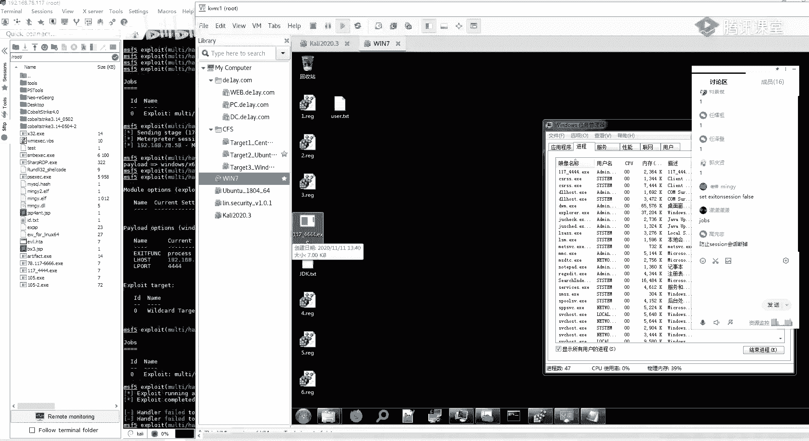

我知道我知道了，他这就是思维能让我改成了思维这个po的对吧，我设置这样子肯定是410个快活的，然后今天诶那，嗯这边我设置了这样的64位的快的对吧，然后我这边啊执行执行，这样的话，今天好。

我这边的话可以看到，就是他就能够去顺利的去进行到这个search，绘画对吧，然后的话得到对应的一个search，这个的话应该能理解吧，就是啊这样子就是因为这一些问题的话，我发现就是大家最容易碰到的。

也是就是经常去问的，就在群里问啊，或者说私下问我这样子的一些问题，就大家大家把这里的。

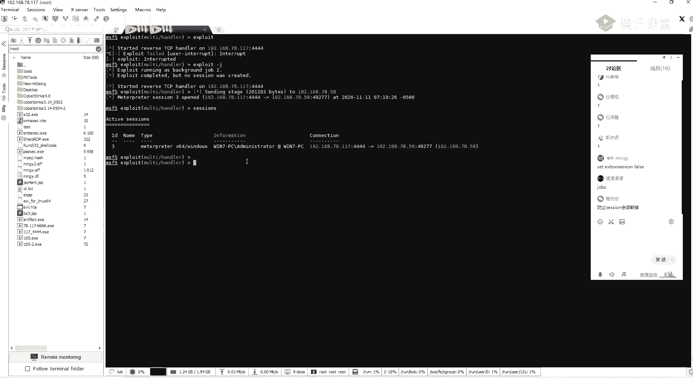

我这边讲的这个东西搞清楚的话，应该就不会说存在这样子的一些问题了。

好呃，这边的话给大家就是稍微做了一些扩展是吧。

然后我们这是我们继续我们的一个课程内容。

啊我这边的话已经得到他的这样子的一个筛选，分化是吧，是一个筛选三，那么我这边的话我就能够去啊，进入到这样的metal的一个session，然后他这边的一个metal筛选的话，你可以通过help。

来去查看他的这样的一些功能是吧，就是他这边的话有很多这样的一些命令是吧，好的话，在这边的话我们也要去啊，他也是这样子的，p s i，要用，要用run去执行啊，就run p r s。

然后呃你直接输入个run，然后pr，然后table，所以的话它就会自动补全补全这一个，然后的话你可以不干h就查看了个帮助信息，就这样子就我们直接在msi下面的话，我们可以直接通过这样的方法去执行。

这样子的一个呃模块啊，好的话能够去使用这个模块对应的一个功能。

那么这边这个模块对应的功能的话，我们来看一下那它的一些选项，我这个话呃已经列出来了，因为我们常见的这样的一些选项的话，就是首先第一个就是呃盖x大写的x，就我们这边大写的x y就是开机启动。

然后它的这边的实现开机启动的一个功能，的一个啊就是实现开机启动这个功能，它的一个方法，那就是在这样子的一个注册表下面去写了，这样子写了一个呃，像就是我们在这里这个注册表当中写一个项。

然后的话呃当系统它去启动的时候，它开机它启动的时候，他就会去执行这一个呃，这个乱象下面的这样子的一些呃程序，呃然后的话干优干优的话，就是当当前用户他登号，它它就会自启动，也也就是我这边呃。

我这边用这个甘油参数指令之后的话，只要用户它去登录了，登录了我的一个登录的系统，它就会去启动，他就会去在这一个注册表象下面，他会去找他，会去执行我下面写的这样子的一些程序。

然后感染史的话就是作为服务启动，就是它同样的也是写入到注册表的，关于这些注册表的话，后面也会呃介绍，然后的话会带大家就是一起去看一下，就是它的一个它的一个位置，呃以及的话就是杠了。

大写的l就是后面传到远程主机的位置，默认的话它是在一个tap部落这边，那个tap目录的话就是呃，就是这边啊，这边的这个就是在当你当前用户下面，用户目录下面的话，有这样的app donlocal。

下面有个tap目，就这边的话，它是一个临时临时文件存放的一个目录，它默认它是在这个目录下面，然后的话嗯在这个墓下面的话，就有相应的一个弊端，就是当用户他去重启的时候，它重启这一重启之后的话。

因为它是一个临时的那种文件对吧，它可能会它会清空这样子一个临时文件，好的话，我们在这一个里面所写入到的这样子的一个呃，写入的这样子一个后门对吧，他可能会被清除掉，所以的话你可能会就是说在重启的时候。

它的这一个啊权限维持的话会出错，会失败，然后的话我们在这边的话，可以通过gl的一个参数去指定指定一个目录，就比如说我在这边指定这样一个系统，32的一个目录对吧。

然后看大写的p就是指定使用的一个payload，就默认的话它是一个主角，默认的话它是windows vpor reverse tcp啊，也就是说如果说你是啊一个64位的对吧，也是一个64位的。

那么64位的这样子的话，你用这样的一个朋友的话，你去呃得到它的一个小小绘画的话，会报错，会出错，所以的话我们在这里的话，可以通过干大写的p来去指定对应的一个po的。

一句话干刚来就是设置反向连接的一个间隔时，间，就是它会隔多少秒来去连接我这边的，去连接我的一个msf的一个服务端对吧，然后干p的话就是指定连接的一个端口号，就是指定反向连接的端口号。

然后呃设置反向连接的一个ip地址，就是呃就是告诉这个后门你去哪，你去连接我对吧，去拿一个例子，然后的话连接哪个端口号，然后隔多多长时间来去连接我的，然后具体的一个使用的话就是这样子。

就呃我这边的话以这样子的两个例子，首先第一个的话就是通过这样子的一个乱呃，首先第一话就通过这一个乱啊，persistence这样子的一个执行这个模块，然后的话我这边使用的是这些参数是吧。

比如gx的话就是以服务的启动对吧，刚用的话就是当用户启动的时候，它就会自启，然后感s的话就是啊他会啊自取啊，当系统启动的时候，它就会启动啊，啊请求的一个进的时间是五秒，进行的一个端口14 四。

然后今天就是连接的一个i p是这个，然后我这边只编了一个64位的一个po的，因为我的一个机器的话，要攻击一个机器还是64位的，所以的话呃在这边的话，我们直接执行这样子的一个命令，执行之后的话。

它就会有这样子的一个过程，然后这边的这个过程的话，我们来一起来看一下，就呃我们看一下，我这边的话执行了这样子的一个命令，写错，执行执行这个命令对吧，执行之后的话可以看到呃。

他这边的话有这样子的两个黄色的感叹，这边的话它是一个警告的意思，就是我们看一下他这边，他的意思就是呃，这边的这一个就是这个map的一个脚本，已经被deprecate啊，就是已经被舍弃了，被放弃了。

被废弃了，然后的话就尝试使用这样子的一个po，这边呢这个pad的话就是啊，现在我们去使用的这样子的一个，就是这个persistence，这个呃权限维持的这样的一个模块。

就我们可以通过这样子的一个模块来进行，一个权限维持，然的话实际的一个操作的话其实也是类似的，然后呃我们在这看，直接在mac下面去用这样子的一个也是可以的，然后他这边的话他我们来看一下它。

首先的话他会去运行这样的一个脚本对吧，我这边乱运行了这样的一个脚本，运行之后的话，它会进入这样的一个resource file，就是一个r c的一个文件，这个文件的话它写出来。

写出来这样子的一个目录下面，然后的话它的这个文件的一个意外，他会去清除我们创建的，我们创建了这样子的一个后门，就这个下面的话它记录了我们的一个后门，它创建了一个地址，然后的话在这边的话它记录了啊。

我们如何去清除这样子的一个后面的一个方法，然后的话呃创建了这样一个payload，就是我这边指定这个payload是这个嘛对吧，然后的话呃，好用啊，然后的话它是呃指定了这样子的一个。

连接的ip及端口对吧，然后下面的话就是他会去呃，把这样子的一个脚本，它会写入到这样子的一个目录，我们可以看一下这个目录的话，就是我当前的这个用户目录，下面有这样子的一个呃，tempt的一个临时目录是吧。

然后他会在这个目录下面，写过这样子的一个文件，就这样的一个vbs那个脚本，以及的话它写入进去，写入进去之后的话，他就会去执行这样的一个脚本，然后执行之后的话呃就会去发送我们的一个stage。

也就是呃利用我们的一个利用代码，发送到指令的一个呃机器上面去，然后的话执行执行之后的话，这边他创建这样的一个pad进程对吧，也是我这边的一个脚本执行了，啊啊下面的话就是他会去写入这样子的一个。

就是alone，就是自启动的这样子的注册表，它会在这几这两个注册表下面，他会尽力这样子的一个项注册表现，然后他的一个呃，它的一个这个像它的一个对应的值，就是我们这边的这个啊u b s脚本的一个值。

然后的话我这边的一个呃系统它自启之后的话，我这边他就能够去执行这样子的一个脚本，然后的话得到一个访谈那一块，只要它启动系统，或者说只要呃他的一个用户，他去登录这一个机器，那么他就会去执行这个脚本。

然后来反弹一个绘画到我到我在看msf上面去，这个的话是这个呃，然后的话就是它的一个默认路径是这个，前面的话也讲了是吧，呃呃第二个的话就是呃这边就是通过干，然后来去指定这样子的一个，他干啥。

我来去指定我们要去啊，存放的一个脚本的一个目录，对，就是指定了，我这边的话是指定了一个c c m，32的一个目标，就是在这个目录下面的话，就写过这样的u bs的一个脚本对吧。

然后的话呃，我们来具体来来看一下它的一个效果。

我这样直接粘贴了，执行执行之后的话，它就会有这样子的一个过程了对吧，然后呃他这边的话，这一个过程，就是我们刚刚讲到的这样子的一个对吧，然后的话他这边的话他有今年这样的规划对吧。

然后的话以及他他已经说了这样子一个servers，这样子的一个服务，然后这边的这个报错的话，就是这个报错的话不用管，就呃他这边的这个意思的话，就是呃他无法去打开这样的一个服务，的一个管理器啊。

就是我们的一个service manager，就这个就服务管理服务管理器，但是这边的话不影响我们，就我们这边执行之后的话，它会呃同样的它能够去生效了，然后我们在这边的话来确认一下。

首先的话就是在这边对吧，首先的话就是在这边，他会他会去写入这样的一个vbs的脚本是吧，那么我在这边的话，我确认一下，看它是不是写进去了，对吧，然后可以看到在在这看呃，这个目录下面的话。

有了这样的一个预bs的一个脚本文件对吧，你也可以去查看它里面的内容，它里面内容的话就是一个就是一个月，月色的一个反弹需要的一个脚本，然后呃这这里呢是一个就是他已经写入进去了。

第二个的话就是他是不是写过这样子的一个，注册表象下面对吧，那他是不是有这样子的一个呃注册表象，那么我们可以通过呃ig carr来去查看，就来去查看在这边他创建的这个注册表象。

下面它是不是有我们写过的一个内容。

有错。

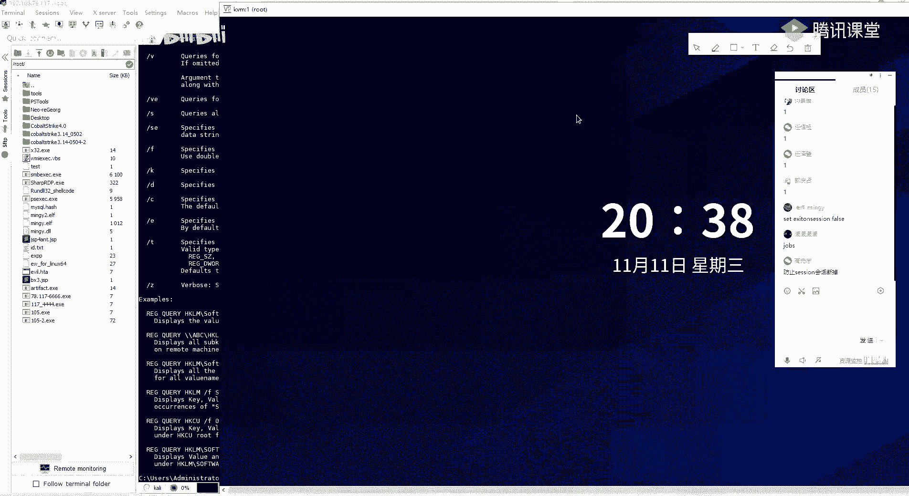

我这边直接在这我这边的一个主机上面看一下，soft 60，怎么了，好在这边的话我们可以看到在这边啊。

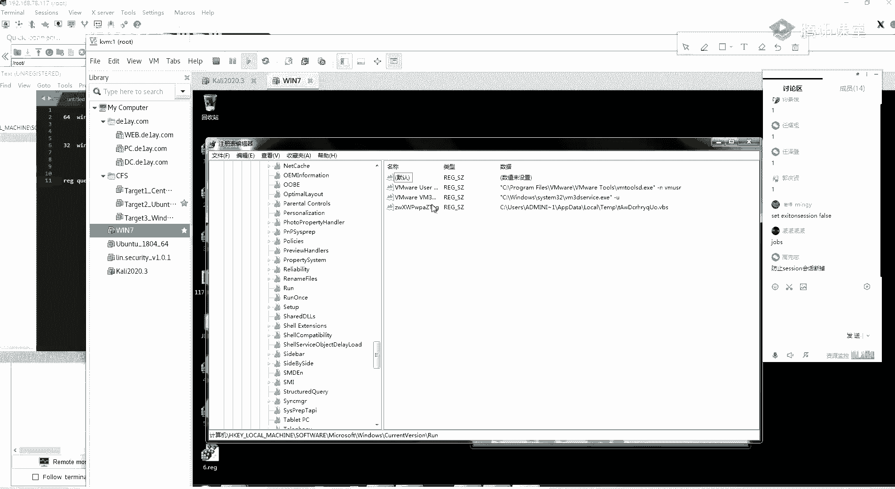

在这边的话，他已经写入了这样的一个vbs的一个脚本对吧，这是它的一个值，我们来看一下跟这边是不是一样的。

脚本内的话就是这个ta对吧，tw然后呃，那这样的话可以看到对吧，就是这个tw这个脚本，然后它其实就是在这边这个啊注册表象下面，他加了这样子的一个值，就是它的名字的话，就是这边的这个是吧。

然后的话他这边的这个呃内容的话，就是我这边写入的这样的一个vs脚本的一个值，那么它写入到这个注册表项下面的话，它系统重启之后的话，他就会去执行成一个uv bs的一个脚本，呃这边的话我们来看一下。

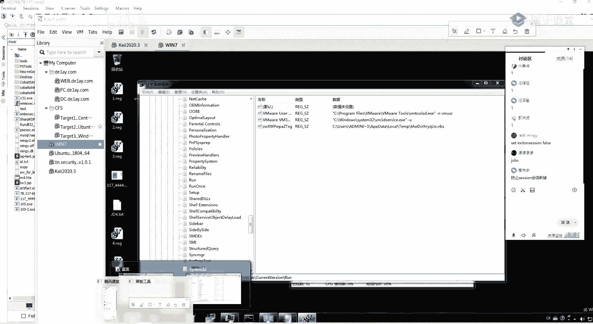

好。

我这边的话我就不重启系统了，我这边注销一下用户，就是因为我有我有加这样子的一个，我也加一个干u的一个参数对吧，然后他只要他用户，他这个用户他有去进行一个呃登录的话，他就会去得到一个黑化给我们。

然后我们可以看一下我这边的这边的这个筛选，它已经断掉了对吧，因为我这边我这边的话是已经注销了这个用户，就是在这个用户下面所有的这种进程的话，他都已经断掉了啊，然后我这边的话来登录一下。

就模拟管理员去登录这样的一个系统。

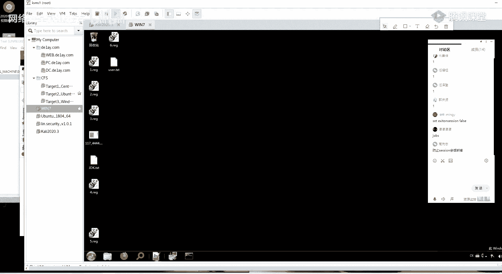

然后登录之后的话，在这边的话我们来看一下，可以看到，在这边的话就得到了这样的一个筛选方法，这是一个35明白。

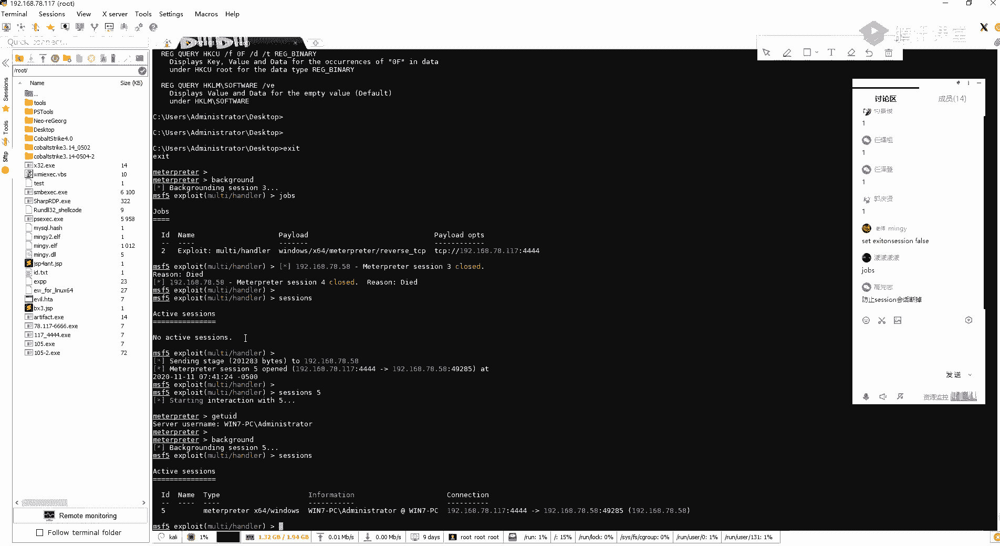

就之前的话是没有社群的啊，然后我这边的话模拟管理模拟用户，他就登登录这个主机，登录之后的话，它它这边的话他就执行了我的一个，而变成了个脚本，然后的话我这边就得到了他的一个筛选的，一个绘画对吧。

然后的话只要他每每次登录，每次重启系统对吧。

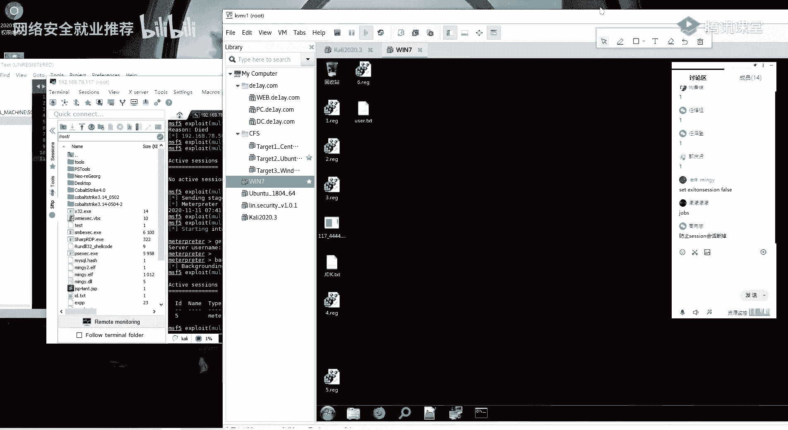

他都会去执行我的这个vs这个价格，然后反弹一个血统。

绘画到我这边就达到一个诚信维持的一个目的，就不需要我再去啊，通过前面我利用的一些漏洞对吧，来打打到这个机器上面去是吧，只要管理员用户，只要我这边的这个用户，它有登录的那种操作，他就会去执行我的一个脚本。

这是一个好，啊这个的话就是呃改一下那个路径吧，对吧对吧，我就不演示了，然后下面的话就是这个mad s vc的这个模块，这个模块的话就是一个。

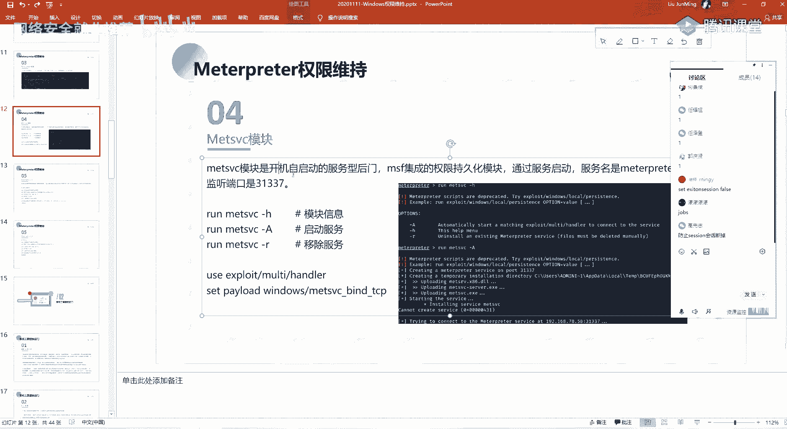

它是一个开机之前的一个服刑的一个后门对吧。

阿尔法它是通过服务区进行一个启动，它的一个服务名是这样的，一个max ra的一个服务名，好的，他今天的一个端口，时的一个31337的一个端口。

它的使用的话比较简单，就是直接乱这个麦mhs vc。

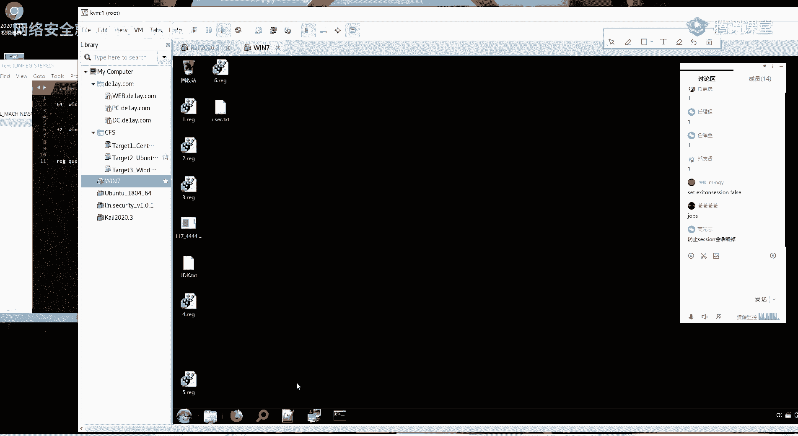

然后杠a的话就是启动的这样子有个服务，然后在这边的话，我们呃直接基于我这边得到这个就是规划是吧，这边乱一下，总体盖起来查看一下，他这个话只有只有这三个参数，然后同样的。

他这边的话有这样的一个depressed是吧，也就是说我这边的这个模块，它也是已经被丢弃了，就是已经被弃用了，然后的话尝试使用这一个模块，好我这边直接放这个，哎，然后执行执行之后的话，他在这边的话。

它就会有这样子的一个啊过程对吧，这边的呢他它的一个过程的话，它首先它会创建这样子的一个mac的一个服务，它是在这个317731，上升期的一个端口对吧，然后的话他会在这一个临时目录下面的话。

他会写入这样子的一个文件，它会创建在这个临时的一个目录，然后的话它会上传这样子的一些，就是上传这个创建这个west west west服务的，这样子的一些啊程序对吧。

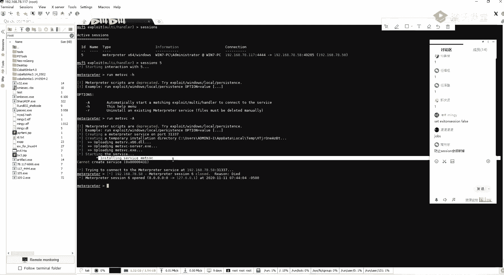

然后的话他就会去注册这样的一个服务，注册之后的话，它就会在目标机上面，它会启动这样的一个服务，我们可以在这边通过service，在这在这个服务服务控制面板这边，我们可以来找到有这样子的一个。

能够去找到这样一个matt brother的这个伏笔，二的话它是一个呃自启动的对吧，它是一个自启动的这样子的一个服务，以及的话它这个话它是已经启动了。

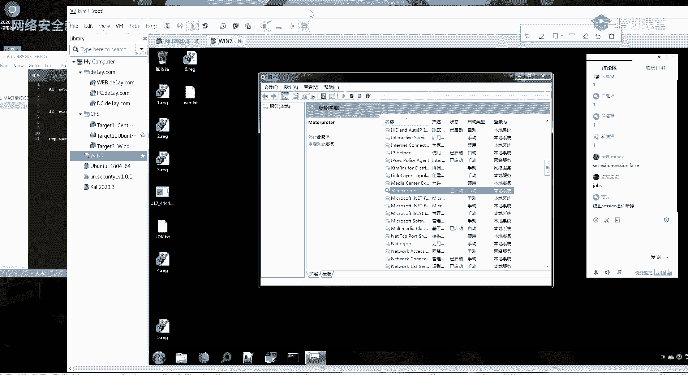

然后的话呃他这边启动了之后的话。

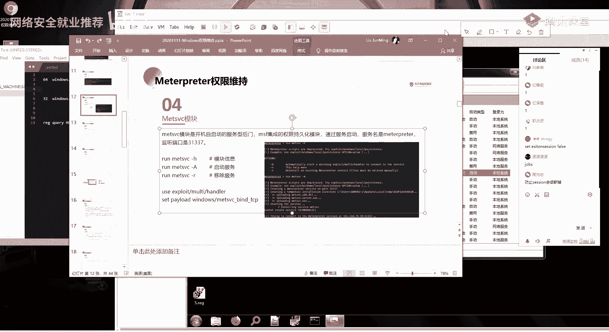

我们怎么去零呢，这边他是就说它是会在它是会在路由器上面，它会启动这样子的一个服务端，以及的话他会去精进这个端口对吧，那么我们要去啊得到这个机器的，就是说去访问这个后面的话。

就是呃就是像我们前面讲到的一个正向，正向连接对吧，我们只需要去呃正向的去连接它的，这样子的一个端口，我就能够去进行一个绘画对吧，然后我这边使用的话，就是就是设置这样子一个pdd。

就是一个matter sdc的一个半德的，这样的一个半的tcp，也就是正向的这样的一个tcb的一个连接对吧，好的话呃，设置我们要去连接的一个端口31337是吧，然后的话执行之后的话就能够去进行一个绘画。

啊呃，第五个的话就是这样子的一个auto run script，就是一个自启动的这样子的一个自动词，自动执行的一个持续化的一个脚本，就是这个water runs great，就它是一个一个选项。

我们再去设置我们的一个监听器的时候，我们可以去set这样子的一个呃这个参数，这个选项，然后呢在这个选项下面的话，后面的话我们可以接我们要去执行的一个命令，就是说他这边它是它这个脚本，它是什么意思呢。

就是单我们这边对吧，我们这边经历了这样子的一个监听器对吧，然后的话当我们的绘画他就说反弹那个shell，反正到我这边的这个端口，那么它进行连接之后的话，就能够得到一个绘画对吧。

那么他在进入连接的建立连接之后，就是建立绘画之后的话，他立马会去执行这样子的一个脚本啊，不执行这样的一个命令，就是这边执行那个命令，他就是在呃执行这个呃，没写错了，就他立马会去执行这样子。

那个这个passistence的这一个模块对吧，也就是一个前面所说的那个呃，权限维持的一个模块，然后的话他会去连接我这边的这个呃，mf的一个主机的这个556的一个端口，也就是我这边只要静静的话。

我就执行这样这样子的一个权限维持的，这个脚本是吧，然后的话我就能够去直接去去达到，得到一个就是能够去进行一个，权限维持的一个操作，就不需要我再直接去进入这个绘画，然后的话去执行对应的一个操作对吧。

然后呃在这边还要注意的一个点啊，要注意啊，就是呃就是在这边对吧，我这边今天的一个端口是五五对吧，这个呢这里的这个端口是我这边去得到，目标机器的一个就是反弹shell的一个端口对吧。

就是目标机器的那个希尔，他是连接我这边的这个端口的，然后的话在这边要注意啊，就是这边的话我是用的一个五六的一个bug是吧，这边556的一个端口的话，是我这边就是说它的这个啊权限维持的这个啊，脚本对吧。

它再去进行它生成那个vbs的这个脚本的时候，他在执行的时候，他就会去连接我这边的一个五六的一个端口，然后注意的话这边两个端口都是不一样的，然后的话你把它设成一样的话，可能会就是会有一。

就是会有持续不断的这样子的一个零件，就之前的话呃，就第一期的话是有同学就是问我这个问题啊，就是他说为什么一直会有这个，因为他一直有这种绘画来去理解你，因为你这边的话，它会隔隔你这边设置了一个时间对吧。

你隔着这个设置设置的一个时间，然后的话来去连接您的这个窗口，那么你如果说你是设置这个报考，那么它就会有连续不断的这样子绘画，来去理解你，但是的话呃如果你你的一个payload，你又就是不不一样的对吧。

你不一样的话，那么他就会一直会有这样子的一个就是session cross，这样子的一个错误，也就是你经历不了这样的一个筛选的一个绘画，同样的就是这边的一个mac s v c啊，也是一样的。

就我们在这边对吧，直接一个自启动执行这一个脚本命令，来达到一个就是权限维持的一个，就自动的去权限维持的一个目的是呃，我们先休息一会儿，然后他待会儿再继续。

好我们继续，前面的话讲了一下matt wet的一个权限，维持的就是这两个模块的一个使用，下面的话我们一起来看一下，就是系统工具的一个替换后门呃，关于这个系统工具的替换后门的话，我们先来就是了解一下。

这个辅助的一个系统工具，就是说在windows的一个系统下面的话，它有这样子的一个辅助功能，它提供了就是这种额外的一些选项，再比如说屏幕，键盘放大镜，还有屏幕阅读等等等等的这样子的一些功能。

就这些功能的话，它的一个目的，它是就是帮助这些帮助一些就是特殊人士对吧，就是能够去使用，这样就是更容易的去使用这样的一个系统，然后的话这种功能的话它会被滥用，在就是启用i vp的时候。

并且获得了这样子压在minx权限的主机上面，然后他就实现一个持久化的一个访问，要去实现这样一个目的话，就呃我们会通过修改注册表，然后的话来去执行远程的一个这样的一个pload。

然而在这边的话我们来了解一下，就是这个辅助系统的一个工具。

就是大家在这种windows的一个系统上面对吧，呃比如说以我这个机器，对于我这边的这个win 7的这个机器，然后在这边的话，你会你在这边的一个登录界面是吧，你登录界面的话，你在这边的话有这样子的一个。

这里有个轻松访问对吧，然后你点点这个的话，他在这边就有这样子的一些功能对吧，像比如说朗读屏幕内容，嗯这边没声音哦，这边没开声音，一开始就大家可以去试一下，就是你点这个的话，你勾选这个的话，没有。

他就会他就会去，就是呃他会去读取，你这边像比如说你放在这的话，它就会读取这里的一个内容啊，就是为了那些就是呃可能眼镜不是很好的，那些人是吧，就通过听的一个方法，你这话就是放大屏幕上的一个项目。

就是放大镜嘛，然后还有就是屏幕键盘啊，就是像这样子的屏幕键盘，我可以直接来点来去进行一个输入，他有这样子的一些功能，就这个它就这边的一个辅助的一个系统，的一个工具，是，那么在这边呢这个辅助系统工具的话。

我们在这边去利用它来去做一个权限维持的话，是怎样的呢，在这边的话会去涉及到这样子的一个注册表象，就这一个i f u，就这个image file execute options，就这一个注册表象的话呃。

它是默认它是只有管理，还有这一个就是本地的一个系统，有权去进行一个读写修改，也就是说我们要去啊留这个后门的话，你首先要有一个完全的群像啊，好的话，其实我们要去做这样子的一些权限维持的话。

就前面我们就是前提条件，其实就是你要有，就说你已经得到了对应的这样的一些，比较高的一些权限对啊，像比如说管理员的权限啊，也就是如何去得到管理员的权限，那就是涉及到我们前面讲的一些啊。

权限提升的这样的一些内容对吧，因为你只有在得到，就是说我们权限提升的目的，其实也是为了，就算能够去做更多的一个操作对吧，那我们普通用的话没有权限去做一些操作，那么它它就会阻止我们去呃。

做更多这样子的一些呃，做更多的这样子的一些操作，那么我们就要我们就要尝试去进行一个期权嘛，对吧，那么我在这边的话，你想要去做这样子的一个，就是权限维持的话对吧，你的一个经济条件，你就是要去有管理的权限。

不然的话呃，而且你要去得到就是你要维持的一个权限，你肯定也是要维持一个高一点的权限嘛，是不然的话没有什么太大意义，你维持了一个高权限的一个用户的话，那么你啊高曲线的一个绘画的话。

那么你下次你再去访问的时候对吧，你下次的话，你还要还是能够去得到这个机器的这样子的，一个访问的一个权限啊，而且还是个高权限的一个呃用户，然后这边的话就有这样子的一个注册表现，它在这个目录下面。

就是这个就这个注册表项，这个image file execute option，然后他的一个路径的话是这样子的一个物件啊，在win在win 7系统下面，无限win 10啊，能够去直接就是。

不像win 10能够直接在这边去进行一个选择，你只能一个一个去找，就这样子的话比较麻烦一点，然后的话呃以及他这个大概的一个原点，这边的话大家自己看一下吧，好吧，就我这边的话就不多说了。

其实就是利用它的这样的一个注册表现，它会在就说他去在这个注册表项下面去查找，对应的一个呃可执行的一个文件，就像这边的一个辅助系统的一种工具，然后他呃后面的一个原理就是我们在这边的话。

我们以这样子的一个就是这样子的一个例子，可以修改ie的一个启动程序为，然后的话来实现我们只要启动一个ie浏览器，就是啊实现启动这个ie浏览器，但是实际的话它启动的却是一个计算器。

我们来而实现这样子的一个目的，然后实现这样一个目的的话，呃它的一个过程就像这样子，就是在这样子的一个注册表象下面，我们添加一个这样子的一个呃i i express，点x一的这样的一个。

好像就是这样子的一个目录啊，然后的话在这个下面的话，我们找到就是添加一个这样的debug的一个，字符串的一个净值，然后呢给他赋一个值，我们这边赋值的一个路径，它就是这边的一个set嗯。

这边这个呃计算器所在的一个路径是吧，然后的话我们再去执行这样的一个i e，然后的话就能够去达到这样的一个目的，那么我们实际的一个就是操作了一个步骤的话，就像这样子，我这边直接通过i g a来去添加。

这样的一个注册表项啊，呃在这边的话我们看一下，添加了一个注册表现的话，是在一个ie exports对吧，然后的话呃这边的话是对应的这样子的一些啊，就是属性对吧。

干t的话就是它的一个类型就是i g3 sz，然后干预约的话就是他的一个呃，就我要去添加的这样子的一个净值是吧，然后干机的话指定我这边要去添加了一个路径，好，我们直接执行这个命令。

我们来看一下我这句话进入到这样子的一个小，对吧，然后我这边执行，然后执行之后的话，他这边的话可以看到已经直接添加成功了对吧。

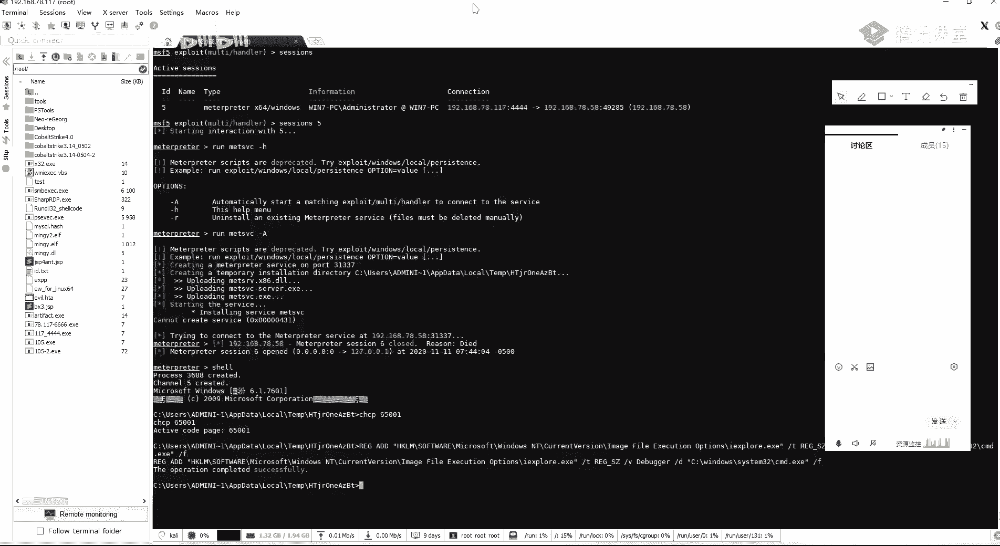

success，那么我们在这边的话呃，他删删除了之后，我们怎么去验证呢，我们可以来看一下这边的这一个性质啊，啊呃还有在这边要说一下，就是这个注册表的这种编辑器啊是吧，他的这个数据库就是说他不会去实施。

立即去刷新了，然后你可以你在这边的话呃，你在这边你去添加这样这样子一个镜子，你可能立马就看不到对吧，那么我们这话我呃直接，把它擦掉，擦掉之后我们再打开一下，打开之后的话他就会去刷新了。

然后我们在这边的这个下面的话，我们就能够去找到我们刚刚添加的这个i force，等于x一对吧，那么在这边他就添加这样子的一个名称，为这个第八个这样子的一个啊数据对吧，然后这边的一个数据就是诶我是cb的。

好这边这边的话是添加了一个cd啊，我这边添加是添加一个sam调啊，你可以把它改成cl c吗，然后我们来看一下，就是实现了一个效果是吧，就是我这边模拟管理员去打开这样子那个r，一是你打开之后的话，诶。

你会发现你这边实际打开的话，是一个cmd的一个窗口，你这边不是一个打开的一个ie浏览器，然后我这边的话把这个项删掉，我们来看一下，删掉之后的话，你再打开应该一样，半年现在的话就能够去正常打开了是吧。

然后这边的话就是利用这个呃注册表象，来做了这样子的一个呃劫持，就达到这样子的一个问题，就是你这边你去执行，去执行你这边的一个ie浏览器是吧，你打开ie浏览器，你去访问的话，他会去调用这个程序啊。

那么实际的话它它会去执行的话，实际是我们这边的一个路径，我这边的话可以改成是一个计算器，就是弹一个计算器以及弹一个cmd，然后的话呃，其实实际的话，我们可能就是想要去做一个权限维持。

就是得到一个得到一个反差，一个绘画对吧，我们这句话我们就可以去啊，添加为我一个，我们呃上行的这样子的，一个后门的一个程序对吧，然后的话他只要去打开这个ie暖器，他就会去执行我这边的一个反弹。

需要的一个后门，然后的话就能够去啊得到它的一个绘画，来达那个权限维持的一个目的，这是一个就是通过这样整个例子，来告诉大家一个原因，然后实际的话我们怎么去进行一个呃操作呢。

就是呃因为在这边的话我们是要去通过，就是说我们这边设置的话是像这种ie对吧，我们无法在外部去进行一个打开，就是需要而管理他去打开这样的ip程序的时候，他才会去调用这个，那我们想要去主动的去。

就是说啊执行对应的一个，就是说主动的去得到对应的一个啊绘画的话，我们可以通过这样子的一些方法，首先第一话就是劫持的一个narrow，讲述了这个讲述人的话，就是我刚刚有给大家说的那个辅助系统的一个。

辅助工工具里面的一个对吧，那么在这边的话我们怎么去劫持呢。

就是同样的还是用我们这边的一个方法。

我这边看呃，添加一个这样子的一个注册表现，然后这边的一个注册表现的是这个narrate dx，这个这个程序的话，其实就是那个讲述人的那个可执行，程序的一个名字，然后的话我这边指定的一个路径方式。

弹一个3d，然后我这边执行对吧。

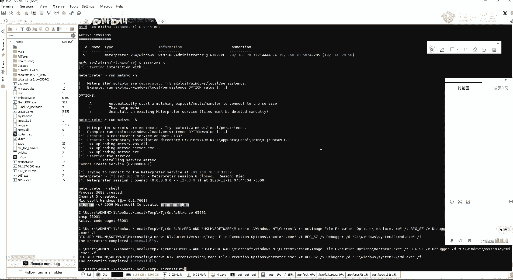

执行之后的话，我们怎么去进行一个利用了。

我们在这边对吧。

先把它搞锁了，就是呃我们在需要去利用这样子的一个权限，维持这个方法的时候，有前提条件的，就是首先的话你的这个机器，你是能够去和i dp远程登录的是吧，为什么要去远程任务，就我这边。

我只有就是我虽然我不知道账号密码对吧，我不知道他那个管理员的一个账号密码是吧，以及我不用去用这样的那个玩意，那个账号密码来进行一个登，我这边，我只要r d p登录到这样的一个登录界面。

然后的话就有这样的一些功能对吧，就是有这样的一个这个刚刚所说的这个，那么我们在这边的话，刚刚所劫持的是这一个，就是朗读屏幕内容的一个，讲述人的一个功能是吧，那我们选择它，然后点击应应用。

点击应用之后的话，在这边你会看到，因为这句话还勾了这个，所以的话他也谈了一个，这个我这边再应用一下对吧，然后你会发现这边的话就弹了，因为我这边点了两次嘛，所以弹了两个cmd的一个窗口，这边占用一下。

它同样的还会弹是吧，然后所以在这边的话，就谈了这样一个sim的一个窗口，然后我们可以来看一下，就当前的一个权限，是一个啊c什么的一个权限，就我这边的话，我只要i d p登录了。

我就在这边我就能够去对它做一个操作对吧，而且还是一个c c什么的，一个最高的一个权限，就能够通过cmd的一个方法进行一个操作，以及的话在这个话是呃。

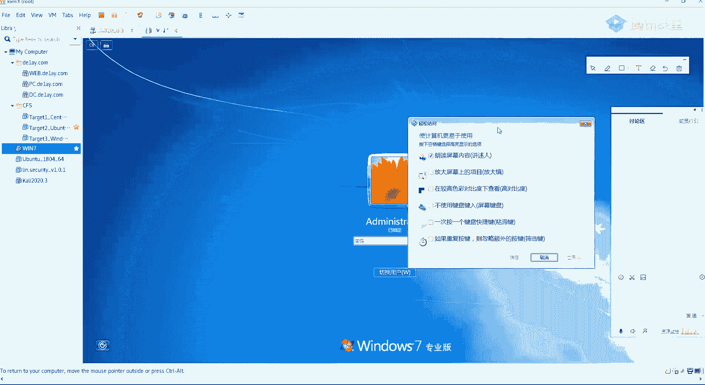

更改的是一个，就是用它的一个那个执行一个cmd对吧，谈这样一个simd的一个窗口，以及的话，我们也可以就是把我这边的这个程序路径对吧，更改成我更改为我们已经上传了这样子的一个，后门的一个可执行路径对吧。

那么他这边的话我只需要就不，我只需要ip登录对吧，然后我通过这样的方法，我点击这个，然后应用应用之后的话，他就会去执行，在目标机上面已经有了这样的一个后门对吧，然后的话他执行执执行的话。

我这边的话就能够去接收到他的一个绘画是，然后我这边绘画，我我我把它断掉了，断掉了的话，断掉之后的话，我下次还想再去得到一个号，我只需要r d p登录这边对吧，然后我这边再去执行一下。

我就还有又能够去得到一个筛选的一个绘画是，然后通过这样的方法来达到一个权限，维持的一个目的，以及的话呃，还有一块就是劫持辅助工具的管理器。

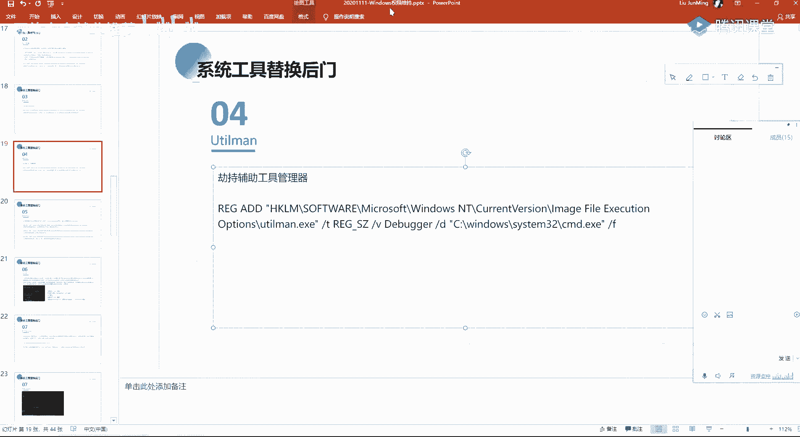

就是呃在这边的话，这个就这个按钮的话，其实就是一个辅助工具的一个管理器啊，哦还有的话就是这个屏幕键盘，我们先来看一下这个屏幕键盘吧，更改成这个boss k，然后我这边呃程序路径的话，我把它改一下吧。

改成那个反弹shell的那个物流的那个后面对吧，啊是路径是。

目前还是这一个，我这话我就不谈一个cmd了是吧，我这边把它改成为，他去执行我这边的留下的这个后门是吧，然后我这边呃执行，然后添加成功，添加成功之后的话，我这边的话我先exist。

当前的话是只有这样子的一个筛选对吧，然后我这边的话远程登录到这边，然后我点这个就是屏幕键盘啊，我应用，应用之后的话，在这边的话你看到对吧，他这段话就谈了一个筛选期的一个绘画。

就是说明的话我这边的话他已经执行了，我这边啊留下了这样的一个后门，然后的话得到这个社群七的一个分号，对吧，而且是一个system的一个选项。

同样的还有就是这一个，就是我直接劫持这样子的一个，这个就是我只要点一下这个，它就会去截止，就是这一个。

我这边点击一下这个对吧。

就直接弹出来一个三字d的一个窗口，这是一个就是呃截图，截就是劫持他的这样子的一个，就是利用他的这个辅助系统工具啊，我们通过i d p登录对吧，然后的话来区进行一个权限维持。

然后呃同样的还有就是这边的这个shift的一个。

后面就shift的一个后面的话就是那个s e c啊，就是s e c h c h的，就这个啊我们在这的话，同样的可以去劫持它呀。

啊我这边我就不不操作了，就是劫持它的一个效果的话，就是在这里我们啊我们知道那个就是张自建吧，就是你按五下shift，你按五下shift，诶，这边的话我劫持了已经，然后我下shift之后的话。

会弹出这样的一个单字建的一个框吧，然后这边他就是我劫持的一个效果，就是呃我在这边，我在这个情况，对吧，在这边它就弹出了这样的一个单字，建的这样的一个框对吧，这个他就是这个shift的一个。

就那这个s1 c t h，应该是这样拼吧，我没记错吧，就这一个，然后它会弹出这个对吧，然后的话我把这个截图啊，其实你在i dp登录的时候，登录这边的时候也同样的能够去啊。

用这样的一个shift的一个脏字点，所以的话我在这边的话，我只需要拉进去到这个界面，然后我连按五下shift键，我就能够得到这样一个sim sd，或者说去执行我的一个留下的一个后门。

然而这个shift的话还有，shift就是刚刚说的这个shift，澳门呢是通过截图，通过在这边的这个i m g对吧，呃就是，这边的这个注册表项下面，是吧，就是这个在这个注册表项里面。

做了这样子的一些截止啊，其实我们改天下的概念的话，都在这边，就都能在这边看得到，那么还有一种的话就是我直接通过，就是说通过把他的那个shift的那个程序，就这个啊这边写错了，是这个s1 。

s e t h c啊，我直接去把他的这个程序文件做做一个更改，就是我这边连按五下shift键之后的话，他会去执行这个程序是吧，那么我把他这个程序，我把它改成我自己的一个呃。

后面或者说改改为一个项目之一对吧，那么我再去按五下shift的时候，他去调用这个程序的话，他就会去呃，实际的话他是执行的呃，弹一个cmd，或者说执行我的一个木马后门是吧。

然后在这的话要去注意的一个地点的话，就是呃我们的这一个就是这个文件，你要去做更改的话，要去做更改的话，你要去更改它这个权限，所以的话在这边要去做这样的一个操作的话，你首先要能够去rtp的i dp。

能够去登录到这个目标机器上面，也就是说你已经能够去登录他的一个目标记了，那么我我已经能够去登目标机了，我为什么还要去做这个后门了对吧，就是我下次断了，就如果说我的这个管理员我虽然得到。

他就会把你的那个账号密码是吧，我已经得到了，然后我也能够去登了，那么如果说他那个管理员，那个账号密码失效了呢对吧，或者说就是过期了，然后然后的话被更改了是吧，那么我现在的话。

我就无法去用它去进行一个灯笼啊，说实话就是你后门的话就用，就是解决这样子的一个问题嘛是吧，然后就是通过这样的一个方法去做一个更改，因为我只要更改之后更改成这样子，然后的话把它的一个文件。

就是做这样子的一个啊覆盖啊，或者说拷贝一下，把它把我这个sid覆盖成他这个程序，然后的话把它一个，就是把我这边的3d ex一的一个文件名，把它改成这个就可以了啊。

然后呃还有一个就是这里的一个就是notepad，就是杰斯notepad好，当然的话这段话是以notepad为例啊，就是我们还有一点就是劫持其他的这边的这个，这边的这一个就是实现了一个目的。

或者说实现了一个效果的话，就是让云程序退出后，然后的话剧末静默的去运行，我们的一个后门程序，就我这边的话是以这个note pad为例，就因为我们在问你系统上面的话对吧，你去打开一个文件是吧。

你打开一个文件的话，你都会去，你都会去使用这样的一个pad嘛对吧，这个话毫无疑问，比如说我这边对吧，我这边我要去打开这样一个test文件对吧，它默认的话那就是用记事本打开的吧，那么在这边的话呃。

我去就是说我通过这样子的一个方法，就是呃添加了这样子的，就是说在这一个呃，首先的话就是在这个imagify这边加一个np，然后的话呃添加了在这样子的一个项下面。

就在一个silent processing this，也就是呃就是塞的时候静默嘛，就是安静嘛，然后process进程exist就退出嘛，就是在进程退出之后，在某一个进程退出之后，他会去执行。

然后去进货的去运行，我这边设置的这样子的一个呃值，然后这句话就加了这样子的一个，可能是帕的杠1x1 ，也就是在那个化的进三段，化的这个进程退出之后的话，他会去静默的去执行我这边的这个内容。

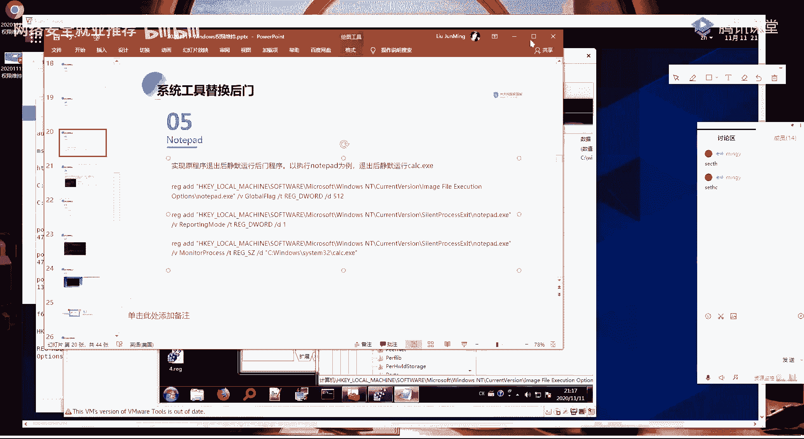

然后的话来去达到这样的一个目的，我们来看一下。

这边的话其实是已经执行成功了，虽然是乱码，虽然是乱码的。

然后的话我在这边的话，我这边的话我就不寂寞的去执行这个了，我直接改成一个就是弹弹笑的啊，就执行我这边留了一个后门嗯。

就是这个。

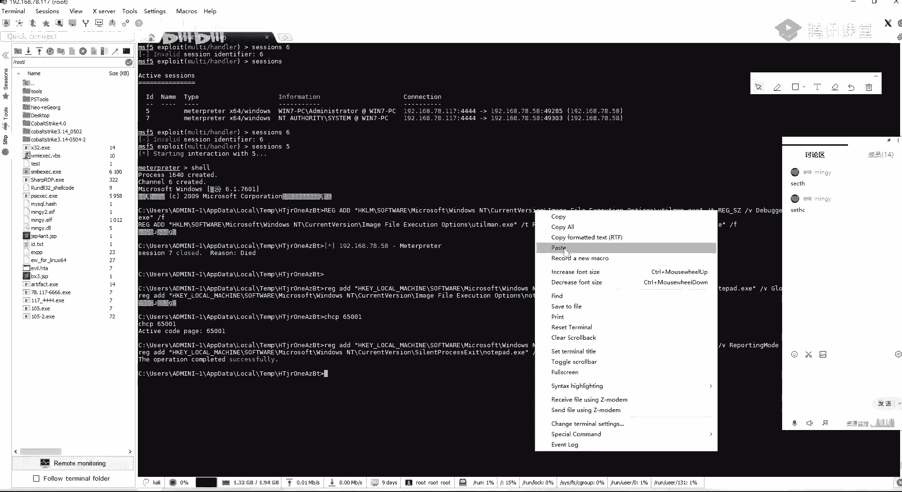

执行执行周对吧，执行周的话。

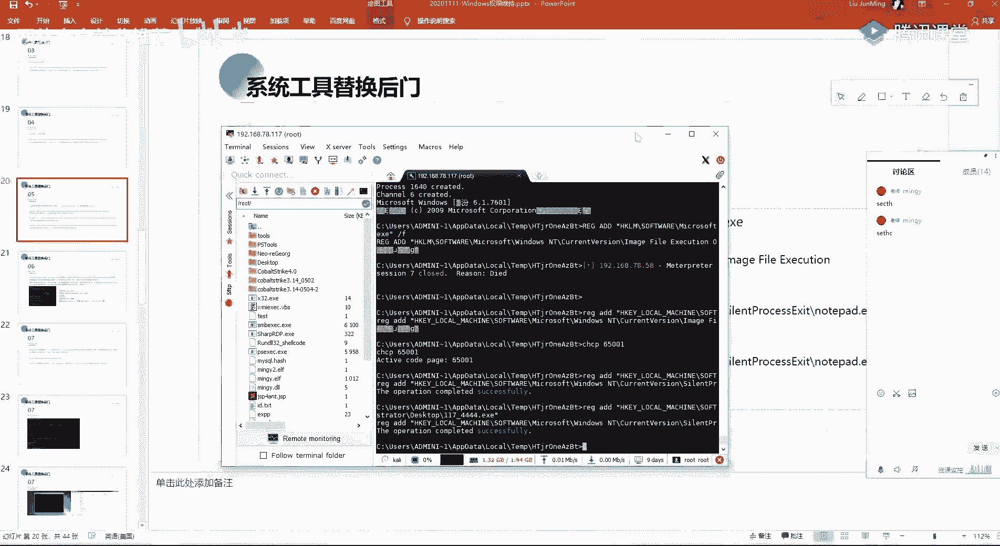

我这边的话，怎么去进行一个就是利用的，就是说当我这边的模拟管理员对吧。

我模拟管理员我去进行一个呃，打开一个记事本的一个操作是吧，我这边话先。

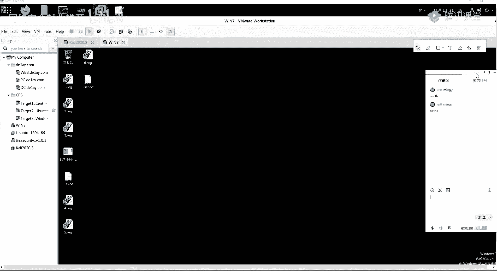

打开任务管理器吧，就是让他们让大家能够看得更清楚一点，就我这边对吧，我这边的话我打开这样子的一个文件，比如说这个这个yes 1 t这个文件，然后的话我打开之后吧，我做编辑啊什么的什么的是吧。

等等的这一些正常操作，我编辑完之后我就退出嘛，然后就我就把它擦掉了，擦掉之后的话，你会在这边发现他这边的话，它就只写了我这边的这个呃程序，其实就是我这边的这一个，那样的话呃实际的话你不可能放桌面吧。

就是你把它隐藏起来嘛，然后的话可以看到他这边，他就执行了我这边的这一个呃后门。

然后的话我们来看一下，在这边的话，同样的就收到了，还是这样子一个筛选规划是吧，就这一个三选八的这个配方。

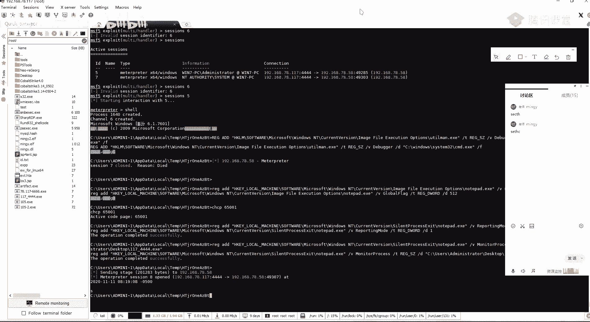

那么只只要就是说只要管理员，或者说只要这个计算机上面的这个用户，它有趣，就是打开这个记事本是吧，他打开记事本的话，它退掉，他退出之后，他就会去执行我这边的这个程序对吧。

然后的话我就能够去得到一个黑化的记事本。

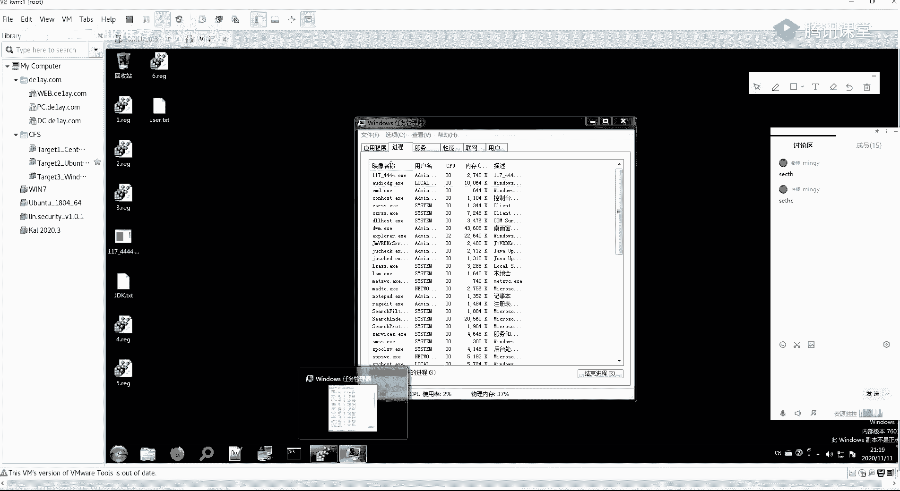

打开记事本这种操作的话应该是很频繁的对吧。

就不用担心说呃说不到这样子的一些绘画，就是呃这个，然后在这边的话是以npd为了，当然它也可以，就是以其他的这种程序为例吧是吧，就是，然后呃第七个他就是这个matters for it，呃。

这边的话其实就是用到了这个matt boy，里面的这样的这个模块，它已经集成了这个模块，就是这个sticker sticky piece，然后他的这个模块的话，它是有能够去自动化利用这个粘支架。

来虚拟一个权限维持，然后他也有包括就是像这种张志剑，还有20k这种屏幕键盘是吧，还有这个辅助管理器。

然后的话他这边的话是呃自动的。

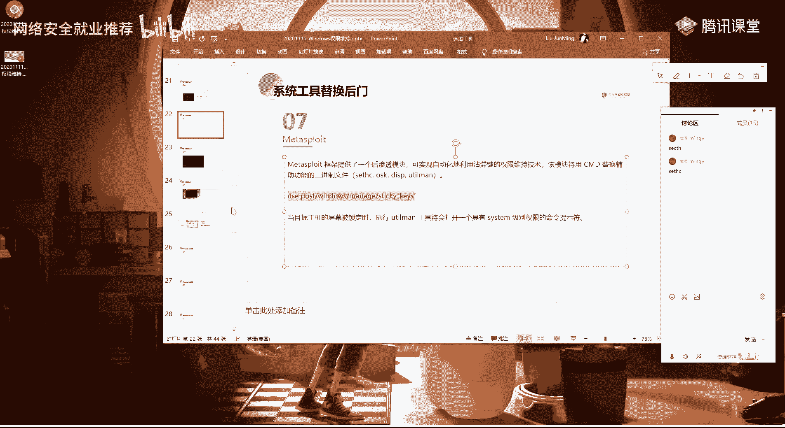

我们可以在这边。

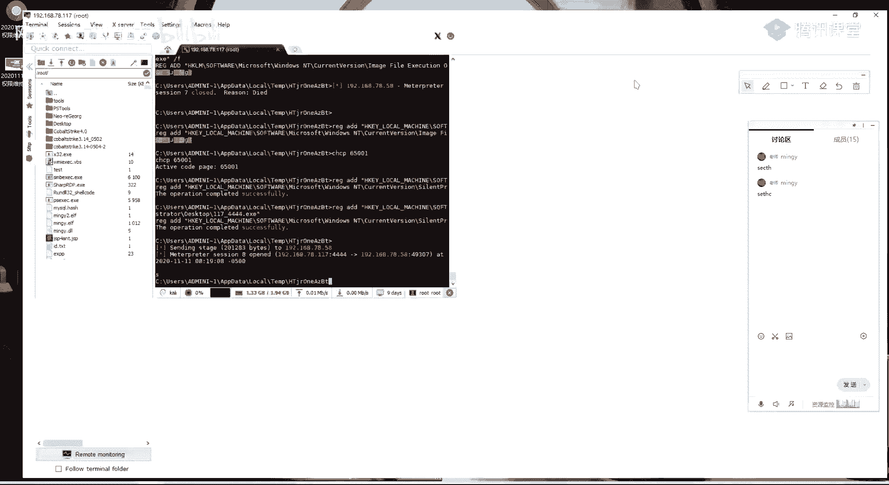

我们要只看，然后的话他在这边的话有这样的一些配置，首先你的话就是这个一级，也就是你要去执行的，或者说你要去就是再比如说你这篇章字念对吧，你劫持了它之后的话，你通过五下shift之后的话。

你这边要去执行一个程序，是这边默认方式一个省d，然后在这边要去设置一下筛选，就是你是以哪一个策划去进行一个应用的，因为它是一个一个筛选，五为例，设置好之后的话，这边的话它的一个目标的话。

就是这个s e t h 11对吧。

我们在这边看给大家就是看效果的话，我这边先把这边注册表的这些把它给删掉，删掉之后的话，我们再来执行，执行之后的话，他这边他就已经就是ccessful a的，也就是已经添加成功了对吧。

那么他这边添加上是一个s e t c h的，这个我们再来打开一下这个来看一下，然后这句话可以看到，就多了这个s e t h c对吧，然后他的一个值的话就是这边。

然后还有其他的也是同样的，就是他这边的话还有其他的三种技术的，我们可以去进行一个用。

就能够去自动化的去进行这样的一个操作。

就是呃一个，然后呃最后的一个消亡，就像这样子啊，好呃，第三个的话就是一个开机自启动的一个注册表，现，有注册表的话，前面的话已经有给大家介绍了对吧，就介绍大概的一个结构的，那么在这边的话就给大家介绍一下。

就是一些比较特殊的这样的一些注册表，一些注册表象，就是这些注册表现的话，我们可以利用它来去实现一些功能，然后在这的话就是利用它来去做相应的一些，权限的一个维持，好首先的话我们先来看一下这个ru。

就在你的这个run的话，其实前面的话呃，在用那个权限维持这个模块的时候，对这个math pad这个权限维持模块的时候对吧，这边就有这样子的一个干x该死的，这个选项的话，他其实就是在这个注册表项下面写。

写了这样子的一个，就是写了他的这样子的一个上传的，这个程序对吧，然后的话它在系统它启动的时候，它就会去执行它，那么在这边的话就是这个run的这个注册表下，它的一个意思就是每次在启动登录时。

都可以去按顺序的去自动执行，就是他在这一个注册表项下面，他写了这样子的一个呃值对吧，就是去执行某一个程序的，那么我这边把它改成，就是执行我的这样的一个后面，那么他每次在登录的时候。

他都会去执行我的这个木马后门啊，然后以及下面的还有，以及下面的还有这一些的话，也是同样的一个功能，就是能够跟这边就是实现同样的一个目标，就是这样子的一些注册表现，然后还有就是run once。

run one的话就致命，意思就是他仅会被自动的执行一次，就是在这样子的一些注册表态，对了它呃，系统启动的时候，它就会去执行一次，以及的话就是run service ones，就呃程序在系统加载的时候。

它会自动的启动执行一次这边的这一个，然而这边的这些注册表项的话，在这边要去就是说明一下这注册表的这边，我这边写的这句话，就注册表的这个h p local mansion。

还有这个hp current user这两个镜，它的一个区别就是前者就是这边的这个local mach，它是对所有的用户有效，也就是对当前的这个机器嘛，当前这个机器上面的所有用户都是有效的。

而后者的话就是只对当前用户有效，也就是说你在你你当前用户的一个选项，你像这个user下面去写这样子的一个，写一个这样子的一个就是呃像的话，那么他在他只在当前用户他去登录的时候，他才会去。

或者说他在当前用户它启动系统的时候，登录的时候，他才会去执行啊，呃呃第五个的话就是个nc，后面就是呃这边的话其实就是以nc为例啊，就是以nc为例啊，然后呃，其实这边实际的话就是跟前面其实是一样的。

跟前面那个就是呃那个past persistence，那个模块的那个群情绪，维持它的一个实现的一个作用其实是一样的啊，实现了一个目的是一样的，就呃这边的一个操作的话，就是首先的话我上传这一个c。

要上传到他那个这个模下面，或者说其实际的话我直接去上传一个啊，可执行就是我的一个木马文件是吧，上升到他的一个木下面去，然后的话我直接执行这个木马文件就可以了嘛，然后这句话就是呃以这个sc为例的话。

就是从关sc那个方法，我新上传这个c，然后的话我在这个注册表现下面，我去添加这样子的一个添加这样子的一个值，这边这个词的话就是执行，通过n c来去监听一个端口是吧，就今天一个五五的一个端口，然后的话呃。

它在系统，就是说这边的话是他在系统启动的时候，他就会去执行这个命令，也就是他在系统启动的时候，他就会去今天这个端口是吧，那么他今天这个端口的话也就是留了个后门嘛，然后我就可以通过这个端口来去得到。

这样的一个cmd的一个绘画对吧，然后呃在这边的话，在这边的话，我这边后面还有一个就是呃，其实这边的话就是说一下，就是这边这边的话是在max下面的一个操作对吧，然后直接在mac下面的话。

我们可以通过i g就呃，matt matter这个需要下面他已经有积分了，这个ig的一个命令，然后的话他有这样的一些选项，像这个inny key就是查，就是列举出这一个啊注册表象下面的一个值。

然后的话呃settle bell的话就是设置就是设置嘛，就是设置我们这个词嘛，然后的话就是像比如gv的话，就是mc的话就是我的一个名字嘛，就是这边的一个注册表象的一个呃，值的一个名字。

好d的话就是我的一个就是路径吧啊，然后这边杠，k的话是指定我们的一个注册表的一个路径，以及的话在这边要用这样子的一个呃反斜杠啊，就是两个就是要做一个转移，然后query value它就是查询嘛。

就查询这样子的一个值，然后还有的话就是我直接在，就是直接通过渲染对吧，我直接到他那个cmb的一个啊窗口下面，然的话直线的话就通过i g carver，就是去查询这样子的一个注册表项。

是a的话就是添加以及呃ky他就是查询吗，以及话还有就是delete就是删除关于这些病的话，大家可以直接就是在呃cmd下面直接直接ig啊，然后的话可以查看到对应的一些用法，这句话我就不多说了。

然而还有的话就是下面这边的话，就是呃通过q，就是呃通过执行这样子的一个方法，就是也能够去进入到我的一个cmd啊，就是这边呢就是介绍一下这个mascot下面的，一个eq能够去执行系统的一个。

就之前我这边目标机器上面的一个命令，这个话就执行应该是降低吧，就是得到一个神明的一个窗口，以及的话你要去执行某一个程序的吧，你这话就加你的一个程序的一个路径，就能够去直接执行目标机器上面的一个程序。

而不需要说直接啊通过线对吧，进入到他一个学绘画，然后让他去进行一个执行好，下面的这个话就是呃添加这样子，就是防火墙的一个操作对吧，就其实就是把我这边添加了这个，今天这个五五的一个端口对吧。

把它做了一个开放，就是我这边防火墙是吧，如果说他开了防火墙，然后的话他呃一一般的话，他不会允许这样子的一些其他的一个端口，进行个连接是吧，就我这边端口是开放的，但是你不允许你去连接，那么我还是连接不上。

所以的话我这边通过这样子的啊，更改下方向的一个规则，把这个五五的一个端口做一个开放，就允许外部的这样的一个ip来连接这个端口，然后的话呃这边向下down的话，就是重启就立即重启，呃效果的话就像这样子。

我这边的话就不一一的操作了，好吧，就跟前面的一个操作的话都是一样的，啊以及第四个就是其他的这样子的一些技巧，首先这个话就是这个计划任务啊，就这边的这个计划任务的话。

前面在讲那个越南的一个横向移动的时候对吧，已经也详细的给大家介绍啊，就这边的这个计划任务，就我已经得到他的个权限对吧，我这边话，我可以直接在他的一个计算机上面去听一下，这样子这样子的一个计划任务对吧。

那么他这边的一个计划任务的一个呃，执行的一个程序的话，就是我这边的一个留下的一个后门的一个程序，是，那么他每次就我这边设置的话是呃一分钟对吧，隔一分钟去执行一次，然后的话我要留一个后门。

我可以把他留踩一点嘛是吧，对不过一分钟吧，我把它留就是啊一天对吧，就一天的话他就执行一次对吧，然后的话实际具体的操作还是像这样子，然后前面的话也已经有介绍了是吧，你详细的介绍了这样的一个定时任务。

的一个呃操作，我这句话我就不一，我就不不再不再重复的一个操作了好吧，以及呃这个精神物的一个命令，就是它的一个一些用法啊，其实前面也有讲了，这边的话呃这边的话就是更详细一点嘛，就是前面的话只是针对那些。

就是用的一个命令对吧，然后口头的给大家介绍了他的一些参数的使用，然后这边的话我们这边的话再来重，再来看一下吧，这样你了解一下吧，就是加深一下印象，呃首先的话就是干create，就是创建新的一个计划任务。

然后的话这边的话指定计划类型也就是s c，然后呃有效值为这一项，就是呃我们这边指令比如说minute就是分分钟嘛，奥奥里的话就是小时嘛，daily的话是好听吧。

wicked的话就是周以及乐等等的这样子的，这样子的一些计划的一个类型对吧，像这边的话指定的是一个minute，就是分钟的一个计划类型是吧，然后呃干mo的话，就指定我们的一个计划类型的一个运行频率。

也就是他每隔多久去运行一次嘛是吧，比如说面的话就是，然后唯一的话就是一分钟吧，如果是阿里，然后一边more一的话就是一小时嘛，呃呃干替换，就是指定任务运行的一个程序号命令，就我这边指定。

我想要去定时执行的这样子的一个程序，的一个路径是吧，然后干企业就是指定任务的一个名称，就是我这边创建的这个电磁炉，它的名称是什么，呃呃第二个话就是这个快捷方式的一个截止啊，呃这边快捷方式的一个截图的话。

我这边的话就是给大家介绍一下，就以我这边是以这个啊open v p是吧，当然的话同样的还有其他的这样的一些呃，就是我这边是以这边为例啊，就是其他的这些话自自己自行发挥是吧，然而这边的话就大概说一下。

就是windows的一个快捷方式，就我们通常也都会去用到这样子的一个东西吧。

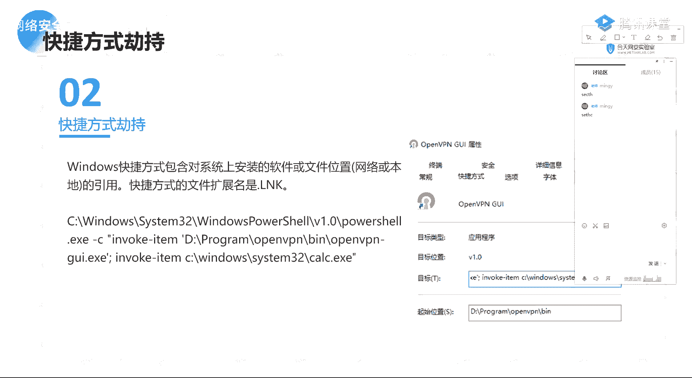

就是快捷方式嘛，就呃而且你安装了程序之后的话，你就会在桌面上有这样的一个快捷方式嘛是吧，就有这样的快捷方式，那么这个快捷方式的话，我们可以右键属性，能够去查看到它的一个就是这边的一个内容啊。

然后这边的一个内容的话，就是首先在这边就是目标这边的这个目标的话，其实就是这个程序所在的一个路径，所以的话我想要去找到这个快捷方式，它实际执行的一个程序的话，就是在这边去找吧对吧。

所以我们可以找到这个目录，对吧，诶这边是自己的，然后这边的起始位置的话，就是我这边这个程序它是从开始执行的对吧，以及在这边的话他也有这样子的写，信息对吧，嗯嗯他这边的一个文件类型是这个点link。

也就是快捷方式的一个文件类型，其实这种快捷方式，我们可以在他这一个图片这边也能看得出来，对吧，它是一个这样子的一个啊，有这样子的一个镜头。

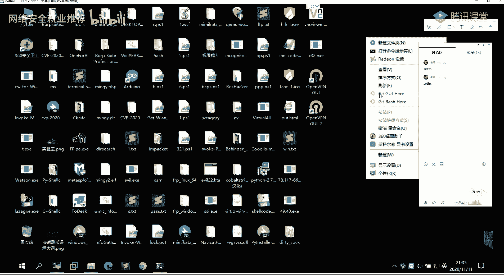

就是这种快捷方式嘛，那么在这边的话，我们如何去就是利用它的这种快捷方式呢，就是我们可以把它的资源的。

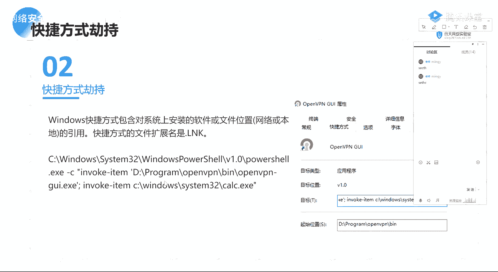

我这边双击它就能够去启动这样子的一个，那么他这边他启动这个o o p p p，它其实实际的话它是加载在这边，加载到这边的这个目标对吧，可以找到它对吧，然后我们双击双击之后的话，这边他其实也是同样的对吧。

那么我在这边呢，它其实就是他点击这个快捷方式，他就会去执行火这边留的那一个呃，目标的那个命令对吧，那么我这句话我是不是可以更改它的这个目标，为我自己想要的一个命运的是。

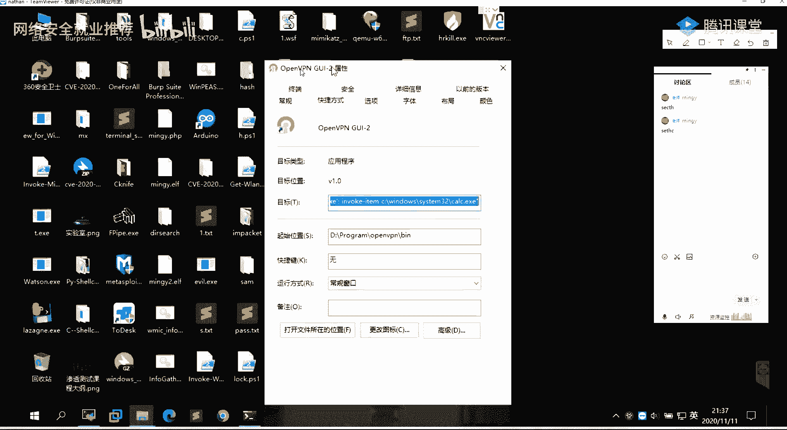

我这就创建了一个这样子的一个快捷方式，然后我这边的一个目标的话，就是这边，就这个我这边的一个目标呢是指定的一个抛弃，然后的话用通过pasha的一个方法来去加载，这边就是通过这一个。

看mt吧，又通过发现的一个方法这个invoke item来去，就我这边invoke item的话，就指定这个程序嘛，就执行它，就是这边的意思的话，就是这边是pasha的一个方法，就是在pasha当中。

我们可以通过这样子的一个方法来去啊，执行这边的一个，就是调用它的这个程序来去执行是吧，然后在这块我加一个这样子的一个invocation。

就执行这个cl c，那么我在这边的话看一下实际的一个，我这边打打开这个快捷方式对吧，实际它执行的一个东西对吧，他首先的话他会去执行这样子的一个open v p，这个程序是吧，就这个对关掉。

然后的话他还会去执行，我后面加的这样子的一个啊，这边的话是打开一个计算器是吧，然后的话你可以把他的那个程序把它更改成为，最就是你想要去运行的这样子的一个后门对吧，那么他每次打开这样子的一个程序的时候。

他都会去调用这样子的一个就是我这边啊，留留着这样子的一个后门是吧，留着这样子的一个木马，然后在这边呃就是做这样的快捷方式的话，这边要注意就是呃你这边其实是这样子的话，是一个posher的一个命令对吧。

就是用posher的一个方法来去执行，然后的话，你如果说你直接更改这边的一个目标的话，它的这个图标也会更改，就是它会更改成为一个抛shi的方法，如果说你是用其他的一个变化。

它会更改成对应的这样子的一个图表，那么在这的话我们需要去做一个图标的更改，就更改它的一个图标，然后的话做成这样的一个快捷方式，然后我把这个快捷方式删掉对吧，删掉之后的话，我留一个这样的一个快捷方式。

那么他就在桌面上。

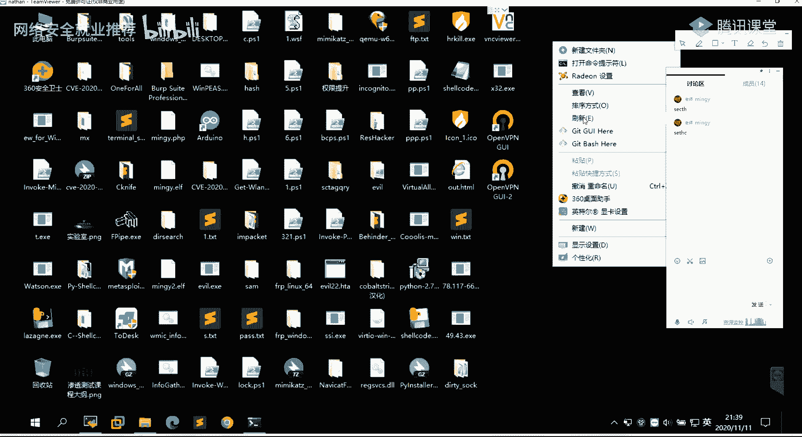

它点击这个快捷方式就能够去啊执行，我想要他执行的这样子的一个程序命令对吧。

这是呃一个，然后第三的话就是账户的一个隐藏，就是隐藏用户呃，隐藏用户的话，这边的话其实前面也有也有提对吧，就是在windows下面的话，我们可以建立这样子的一个用户，就是他的一个用户名。

后面的话有这样子的一个n的符号，那么加这个符号它的一个效果它会是怎样的呢。

我们来看一下我这边的话在这个机器上面操作。

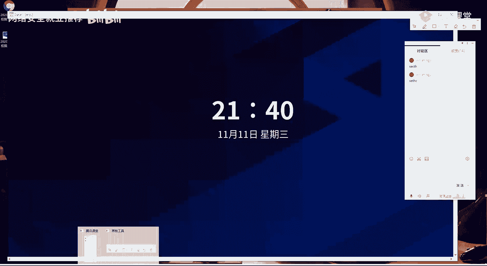

首先的话嗯，这个应该是有一个这个，然后这边把这个用户把它给好，就以这个用户为例吧，就我这边的创建了这样的一个net user，admini的这样的一个用户对吧，可以看到我通过net柚子来查看这个用户。

他的一个啊详细的一个信息是吧，好我这边之前那是柚子，你会发现的话，在这边直线那天就直说它，它这边没有这样的用法，你看不到的，但是的话如果说你知道你的一个用户名的话，你在后面用户名后面加这个方案。

你就能够去查看到它的一个信息，那么这里这里的话就是一个隐藏的一个用户啊，但是这样子的一个隐藏用户的话，其实我们在这边命令行下面那些只是看不到的，但是在他这个控制面板这边的一个用户。

呃呃管理其他账户在这边的话是能够看到的，你看到这边的话有一个这样的用户是吧，所以的话只要管理员他在这边的这个啊，控制面板当中，就能够去查看到我这边隐藏的这个用户，所以的话这种方法的话。

是不是很保险的一个方法。

然后第二个的话就是呃，这边的话其实就是添加这样的隐藏号码，然后把它加到这样子的一个管理员组当中，然后第二个话就是激活这样的一个构思的用户，好啊，ghost的一个用户的话就是呃不是ghost是怎么读来着。

guest guest这个guest的一个用户啊，那guest用户的话它是一个就是呃就是宾客嘛对吧，就是宾客就是也就是访客来宾就是访客用户。

然后这个用户的话，它默认它是呃没有启用的。

我们来看一下，在这里对，就这个来宾用户是没有启用的，那么这个用户的话，我们可以把它启用，启用那个面的话就是这样子，就是net user指定这个用户名，然后的话干active，然后yes嗯。

首先这些话可以看到它这个用户是没有启用的，因为它是要，然后我这边执行这个命令，执行之后的话，你们来看一下嗯，啊这边是不是没给没给密码呀，首先的话要给这一个用户给一个密码。

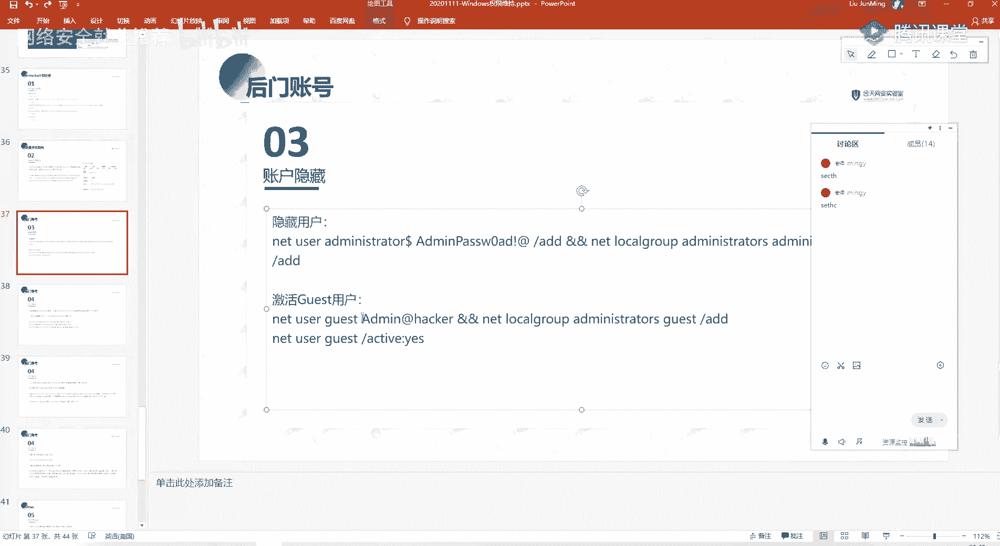

就是你不给密码的话，他还是没有激活，我给一个admin。

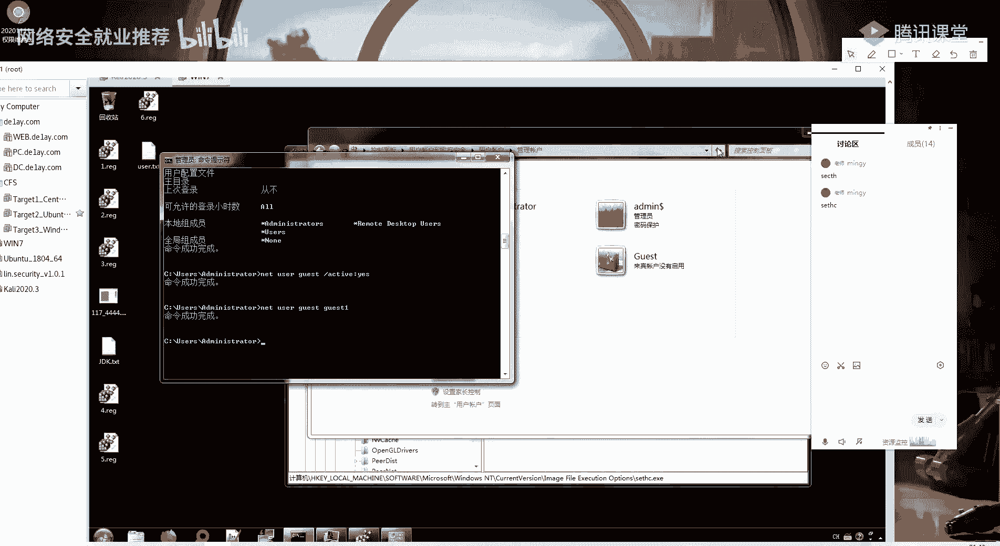

啊这边不添加，这边的话就是把它添加到这样的一个管理员组，对吧，我们再来指指一下，是可以提，你这样没钱用了，啊这边是已经启用了呀对吧，可以看到账户起啊，就已经启用了，然后我这边的话可以通过这个cos用户。

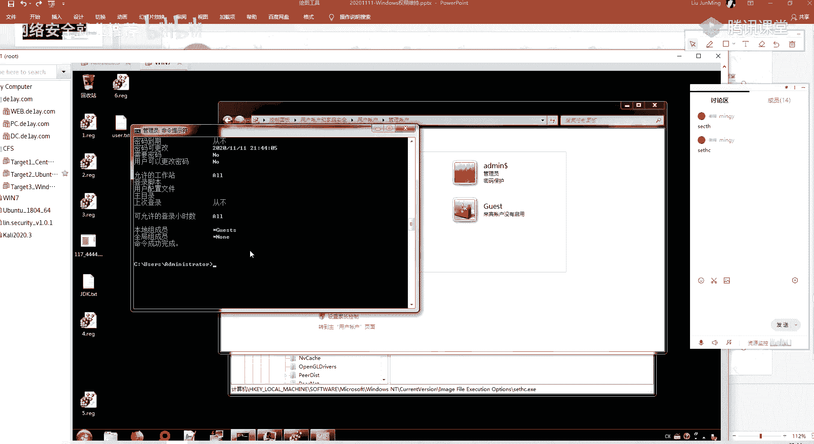

来去进行一个登录网，然后呃，我们可以把它添加到一个管理员组那种对吧，那么我用这个用户去登录之后的话，我就能够去得到一个管理员的权限，呃呃第四话就是后门账号呃。

呃创建一个克隆admin administrator的一个账号，然后的话呃，而且通过命令就是通过net，以及在控制面板当中的一个管理账户，是无法看到的，我们怎么去达到这样的一个目的呢。

就是来创建这样子的一个克隆克隆账号哦，哦我们下面这边的话，这个隐藏账户的话是在管就呃，控制面板那个是是能够看到的对吧，然后我们在这边的话，我们可以把它就创建这样子，这个对面的一个用户。

然后的话他在net news以及管理面板的管理账户，都是无法看到的，然后呃具体的一个步骤的话，怎么怎么怎么操作呢，首先的话我们需要去创建这样子，一个匿名的一个用户，然后再把它添加到一个。

这样子的一个用户组，就是一个碗里面的一个用户组，然后添加呃添加一个面的话，就像这样子嘛，这边话不用我多说了吧，然后还有在这边的话，就是呃有额外的添加了这样子一个remote。

desktop user的一个组，就这个组的话就是呃一个原啊，一个远程管，就是远程登录，就是远程桌面登录的这样的一个管理员啊，这样子的一个组，然后的话就是如果你不加这个的话，就可能就是你不是这样子的。

一个远程的一个桌面登录的一个组的用户的话，那么你可能你无法去用远程登录的，就远程桌面登录的方法来去登录它的一个系统，说实话我们为了保险的话，可以加这样子一个就把这个创建这个用户。

把它加到这个remote desktop user的一个主当中，然后的话我们再将这个呃用户对应的这个值，把它替换到后门账户的这个值呃，具体这个涉及到的一些操作的话，就是我们要呃。

这边就是要在这样子的一个注册表当中，它的这个镜子当中去导出对应的一个啊，用户下面的一个呃，注册表下面的一个值就是有这样的一个f值，然后的话我们把它做一个替换，替换之后的话再去进行一个呃导入。

导入之后的话就能够去呃，建议这样子的一个隐藏的一个后门的一个账号，呃，这边的话我们我大家看我实际操作吧。

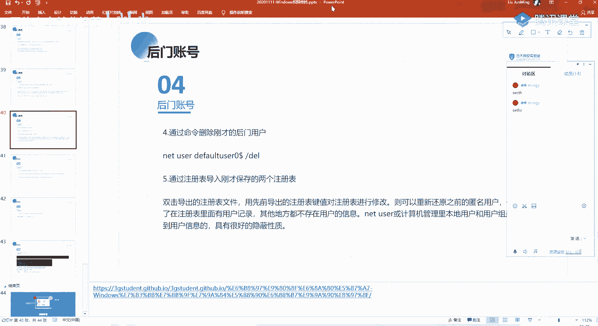

我这句话已经经历了这样的一个呃，这样子的一个用户对吧，然后它是一个admin组的一个用户，以及是一个什么desktop，users的一个组的一个用户，然后的话我们在这边，那第二只是看不到的。

然后在里面能够看到老师，然后下面的话我们要在这样子的一个，注册表当中，找到它的嗯，呃呃嗯嗯，找到找到存储这一个用户，就是存储这一个用户，它的一个信息的一个注册表象呃，它是存储在这样子的一个注册表项下面。

就是这个，我这个local matches，然后的话有这样子这个sam的一个文件夹，然后sam呃在这边的话，如果大家有在跟我操作的话，大家可能会碰到这样的一个问题，就是这边他可能没有这样的一个三角是吧。

就你打不开，那么在这边的话，我们需要做这样做这样的一个配置，就是呃他的这个sam文件的话，是有一个就是说你的一个权限，就你这边是一个admin管理员的一个用户权限对吧。

但是的话他这个sam的一个文件还比较特殊，就你这个管理用户，它是没有一个完全控制的一个权限的，就是原本化它是没有的，我这边还是改，就大家要去做这样子的一个操作的话，需要更改它的这边的这个呃权限。

就是我当前的这个用户对吧，允许对它做一个完全控制，然后的话你你就能够去打开这边的这一个好像，然后找到这个dominaccount啊啊odus这边n，然后在这边的话就存储了当前系统下面的。

所有用户的一个呃数据对吧，然后这边的一个数据的话，它实际其实就是他这边它只存储了这样子的，一个值对吧，它实际的一个数据的话，它其实是存储在上面的这样子的啊，这边的这一些值当中啊，这些选啊注册表象当中。

那么这些注册表项它对应的是哪个用户呢，那我们这边四个有他这边有四个这样子的一个，像，我们首先我们来看一下admin minutes选的这个用，它这边的一个类型是0x1 f4 对吧，它是一个呃hs。

就是16进制的这样子的一个标志，那么他这边的一个类型值，它所所以说它对应的这边的话，我们可以看到就是这个ef 4的，这边的一个类型是e f4 ，然后的话就是说在windows系统下面的话。

administer这个管理用户，它的这个选项值的话，默认的话都是这个，都是这个e f4 ，然后的话admin这个用户的话，就是我们可以看到是3d，也就是这个对吧3d。

那么下面的话我们要做怎样的一个操作呢，就是首先的话我这边其实已经导出来了，玩了删掉，首先的话我先把这样这一个，我创建了这个管理那个账户，它的一个呃导出，就是把那个注册表就导出成一个注册文件。

比如说我这边是一，就生成这样子的一个1。2g，然后我们就说生成这个ig的这个文件，其实我们可以双击，就双击的话，我就可以去把我这边的一个内容，把它给导入到注册表象当中，对就是这样子的一个内容。

然后还有的话就是这个administr，嗯不是啊，以及的话就是这个admin，对应的对应他的一个注册表现，它的一个主要就是这个3d对吧，然后我们要把他这个打出来，我这边重生2。2。21g。

一句话就是这个administrate对应的这个ef 4，我们把它导出来，三好我们下一步要做了一个操作的话，就是我这边导出来是admin的这样子一个字，我们把它打开是吧啊。

这边的话就是呃administrator，也就是说管理应用户的这个，这个话是我创建了一个隐藏账户的那个对吧，这边的话是我在管理用户的一个值，然后我们要去更改它，就是这边他的一个f值。

然后我们把这边就散开了，这admin就administry tech这个用户它的一个值对吧，我们把它复制过来，把它复制到这边的这个，我这边进了这个隐藏账号的一个指令保存，保存之后的话。

我这边我把这个adminutes选的这个用户，把它删除掉，我的全话是能够，它是有的对吧，我这边delete把它删除掉，删除掉之后的话，在这里我们来看一下，现在的话它是只有这样子的三个用户了对吧。

他没有刚刚所创建的这个用法，因为我这边三主要，那现在是找不到的，然后下面的话我把这一个呃，就是把这样子的两个注册表象把它做一个导入，就是首先这边的这个e点，按e接的话。

它是一个我刚刚所创建这个的m这个隐藏账户，它的一个呃注册表现的一个值对吧，那么我这边导入进去的话，它同样的它其实它的一个数据，它就是这边对吧，就像这边的这样子的一个数据，就是这一些数据的。

然后这边我删掉了，呃呃现在的话它是没有了对吧，那么我现在导入进去的话，他还是会有的，那么怎么去导入，导入的话，我们可以通过，ig一点这样子的一个命令就直接执行，ig d的话，就打开这个字数表编辑器吧。

然后这边就是一个命令的话，我们可以来看一下它的啊，就是，杠杠s，然后指定我们的一个要把握的这一个ig，然后执行执行，这样的话它其实已经导入进去了，然后我们在啊导入这个二点下右键，然后我们在这里看这样子。

那这样子，那个镜，然后你会发现的话，就是这边的话就已经找到了，这样子的一个就是呃admin这样子的隐藏用户对吧，然后我们再看看，如果不知道他的用户名的话，我是无法查看到它的，以及的话在这边控制面板。

我们来看一下这边控制，有的话我关掉，我重新打开，然后账户，然后再这样话同样是看不到的，但是实际的话，你可以看到他这边是有这样的一个账户，而且的话就是啊，就是我刚刚所复制到的那个就是克隆。

就复制的那个f的一个值，其实就是克隆的这个admin，管理用户的一个那个f的一个值对吧，然后的话有那个值的话，就说明我们克隆的这个addin的一个用户国，克隆的这个admin这个隐藏的用户。

他同样的有这个啊，administrate这个管理用户的一个权限，呃，然后的话呃，就是啊在这边的话我们可以看到，就是在这边他的一个注册表现当中的话，我们还是能够去查看到的。

因为我们的就我们的windows系统上面的这种信息啊，就包括你的这种用户信息，它都是存储在这样子的一个存储注，注册表当中的对吧，就前面在介绍注册表当时候已经说了对吧。

就windows系统下面你所有的这种信息，就是你系统的一些信息等等，这些配置信息等什么的，他都存储在这样的一个注册表当中，那么同样的你既然存在这样的一个用户，那么肯定就有对应的一个信息记录嘛对吧。

所以的话在注册表当中还是能够去查看到，有这样的一个呃用户网，所以的话呃其实就是给大家介绍，这个介绍这样子的一个东西，其实就是呃让大家了解，就是你如果说你直接通关，但是柚子对吧，你查看没有这样的用户。

你不要觉得就是说真没有这个用户吧，你要去控制面板里面去看一下是不是有没有，然后的话如果说你控制密码里面有没有看到，你也不要觉得就是真的没有对吧啊，其实最保险的方法就是你去注册表当中去查找。

那么怎么去查找哪些东西呢，查找哪里呢，就是这边的这个路径嘛对吧，就这样子的一个路径下面去查找这个路径下面，它就存储在系统下面，所有用户的这样的一个信息对吧，然后我们在这边的话就能够去查找到。

对应的这样子的一些用户，就大家比如说你在，你要去做这样的一个溯源对吧，你知道那个机器里面被打的，那么你就你要去确定他是不是有没有，你这样的一个隐藏的一个账户对吧，那么你就就去这样子的一个啊。

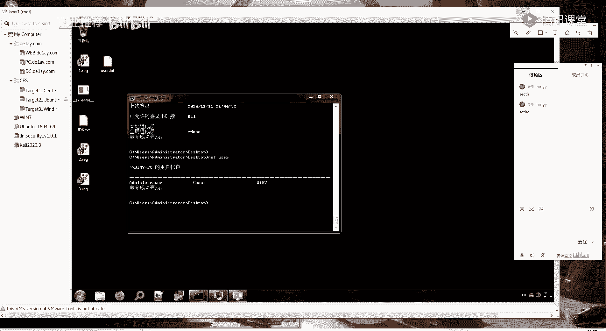

通过这样的一些方法来去进行一个查找对吧，一句话还有就是呃文件夹的一个启动，就文件夹启动的话就是这样子的一个start up，这个start up的话应该大家应该都知道吧，就是有这样子的一个启动文件夹。

然后的话我们可以把我们的一个程序，把它丢到这个启动文件夹下面，或者说快捷方式，然后丢到下面的话，它在系统启动的时候，它就会启动了，它就会启动这样的一个程序，但它站在一个木箱的话是呃很容易被发现啊，对吧。

你能够就直接能够看得到的，然后以及呃第六个呢就是一个服务后门，就服务后门的话，其实前面在讲那个m e t s v c的时候吧，那个呃那个权限维持的一个模块的话，它其实也是一个服务的客户嘛。

啊然后他他同样都是创建了对应的一个服务，然后的话他的那个队服的话，它是今天端口是吧，然后在这块我们可以通过sc一来，就创建对应的一个呃，创建对应对应的一个服务对吧，然后的话呃这边我要去执行的一个程序的。

可以留我执行的一个后门，以及我要去执行的一个命令等等的对吧，然后的话我们就说他的这个服务，它就是在系统重启的时候，他就会去执行吧，他去调用加入我们这边就服务启动的时候，就是系统重启的。

那么对应的一个服务，它启动对吧，它启动之后的话，它就会执行我这边的一个程序，然后的话它执行的话，我就能够去得到它的一个绘画，当然像这种的话嗯一般就删了都快完了，就你创建这种服务的话。

以及最后的这一个test power shell，就是利用这个发现了一个脚本，就是来去创建这样的一个电视网，这其实跟前面那个test电视任务的那个，也是类似的，就介绍一下这个pc脚本。

我们可以直接就是在mod上面去调用，这个pasha脚本，就远程加载它对吧，加载之后的话呃像比如说这边的话，就是呃这个invotask backdoor，就是一个电视任务的这个后门对吧。

然后他的一个他这个电池仓后面里面的话，它有这样的方法，就是用nc就用nc的一个方法，就它里面已经写好了这样子这个c的一个功能，然后的话他去迎接我这边，指定的这个ip及端口啊，那么我这边的一个就是我这边。

他只要在我的一个服务器，服务器上面去监听这样子的一个端口对吧，那么他在这边去执行一段，定时的执行我这边的这个程序的话，那么我这边的话就能够去接收到他的一个，绘画是吧。

其实跟前面的一个电视任务的创建电池任务，它其实是一样的，不是的话就是他的这个脚本的话，可以去进做这样子的一个反弹器啊，以上的话就是我们本节课的所有内容啊，应该是比较简单的，就是这些东西的话都是一些。

就是大家知道的话应该就知道了对吧，就是一些技巧的一些东西，就也没有说很很多这样子的一些知识点对。

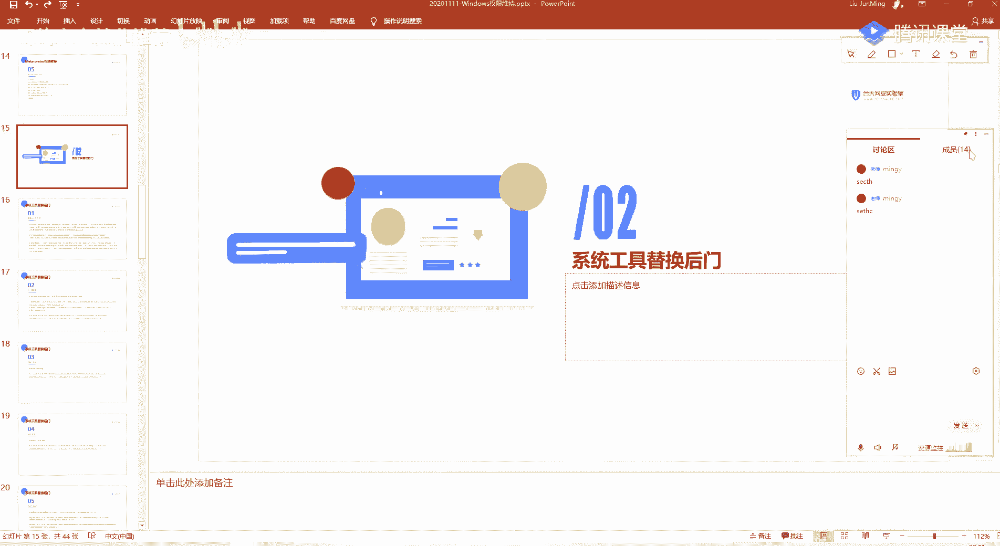

就呃还在的同学有没有什么问题。

就是啊有问题的扣一，没问题的扣啊啊啊自己扣做的扣三，三三，好啊没问题，ok，好啊，这这三位同学就是代表了大部分同学是吧，啊应该应该是都没有什么问题啊，那pp的话也已经发给大家了，然后这里的话内容的话。

嗯就是没内容的话，其实都在ppt里面了，然后还有一个就是这个，就是这篇文章好放学习内容嘛。

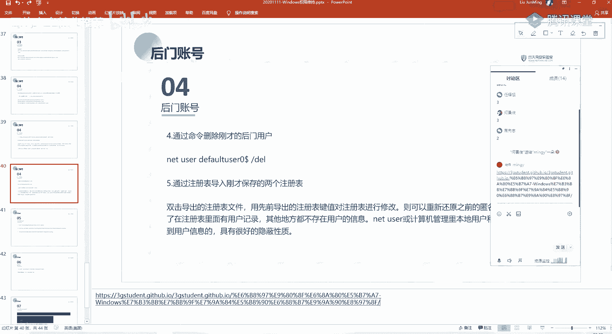

其实后面的这种东西的话，这些的话其实ppt发给大家的话，也没有什么好预习的。

我翻预期内容里就是这里的这篇文章的话，就是这个这个大佬的一个，就是windows系统的一个账户隐藏的一个方法，就其实呃刚刚讲的那个账号里查的话，好像就是呃他这边的一个，就是他这边介绍的这一个方法。

就呃大家可以去仔细的去看一下，他的这篇文章吧，以及呃大家可以去呃多去看一下他的，就这个大佬他的这样子的一些内容啊，就是相当括比如说预算透对吧，以及等等的一些渗透技巧等等的，这样子的一些东西算。

虽然大家刚刚开始看这些，可能就是呃很多东西都看不懂是吧，那没关系啊，就是你可能你现在的话就是你呃就是接触的少，就是相关的一些知识的一个累积的话还不够多，所以的话有很多东西的话你可能不理解，但是没关系。

就你后面的话，你后面你就是你的一个相关的一些东西，你积累的多的话，你这些东西的话，你其实自然而然就多亏了，然后他这边的话，他的这些文章的话都是写的都相当，就是有水平啊，都写的相当好，就真大佬。

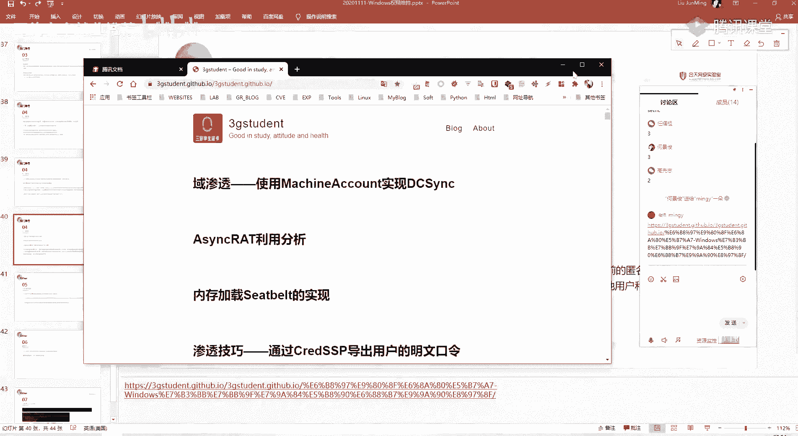

啊呃，以上就是我们监听的就是本节课的所有内容呃。

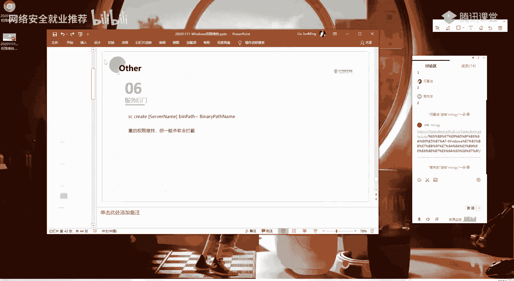

有没有其他的，大家有没有什么其他问题的话，那么我们就本地话就到这边就结束了好吧，然后的话就下课吧。