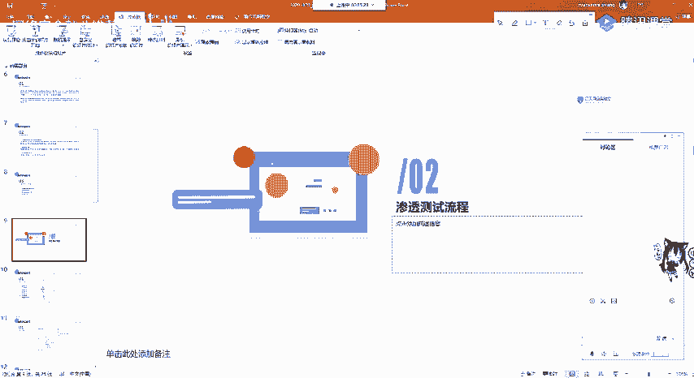
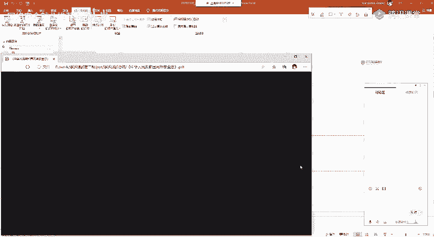
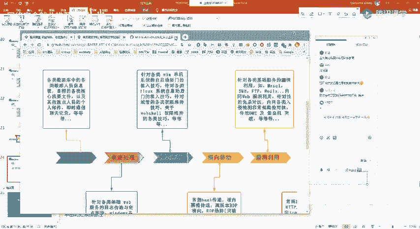
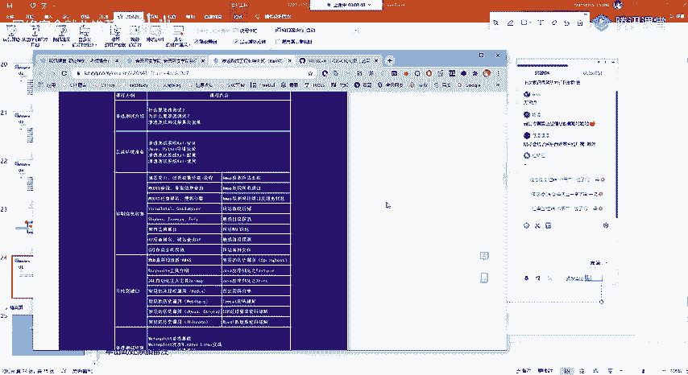
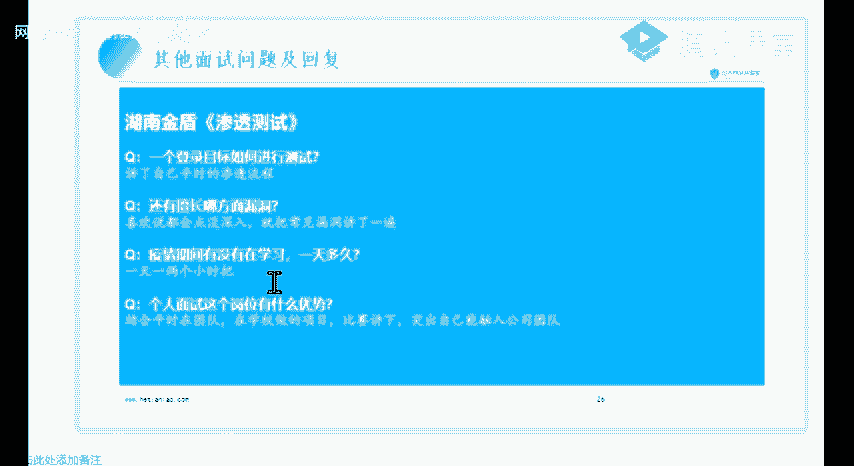
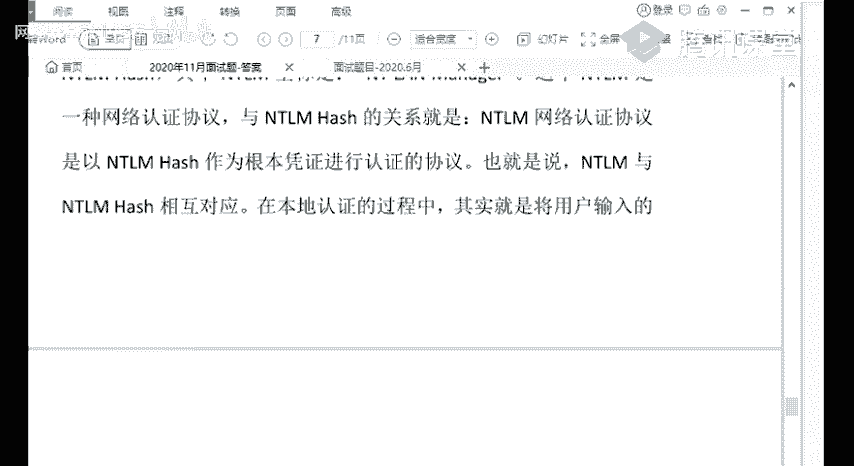

# 【B站最系统的网络安全教程】北大大佬196小时讲完的网安教程，全程干货无废话！学完即可就业，别在盲目自学了！！！ - P86：课程考核讲解 - 网络安全就业推荐 - BV1Zu411s79i

ok那我们开始今天的课程，那今天呢是没有一个技术性的课程了，因为我们技术性的课程呢，已经在昨天已经结束了，那今天呢就是由我来给大家，那就是讲一下我们渗透测试的一个课程总结。

还有大家在今后的工作中应该如何学习，还有大家去面试的时候，这个面试官呢有可能会问哪些问题，ok那我们开始今天的课程，那首先呢还是感谢大家这几个月来一直在听课，在学习，ok大家也非常辛苦啊。

从8月份这个夏天到现在已经到冬天了啊，从一件薄衣，现在已经变成个袄子了，ok也非常感谢大家的一个呃听课，但是呢我们渗透测试的一个课程呢，到这里就算是结束了，但是大家的学习呢并没有结束。

因为还是我上节课已经说过了，你既然选择了我们这一个行业，整个it行业都要做到活到老，学到老，因为我们的技术是不断的革新的啊，至少你在做前端，如果你1年不去做，不去学习这些新的知识，新的框架。

那你又觉得你好像就被前端淘汰了一样，那么渗透测试呢没有那么严重，但实则呢也是如此，大家就就需要一直去学习，深入学习学习老的东西，并且呢学习新的技术，有漏洞出现了，就尽快的进行复现，那今天呢我们首先呢。

还是对我们的一个渗透测试，这工作做一个简单的再次的了解，首先呢我们渗透测试，就是根据我们安全专家已经掌握的漏洞信息，模拟黑客真实攻击方法，对系统和网络进行一个攻击测试。

也就是说呢我们去模拟黑客的一个攻击方法，找出甲方所有的信，信息系统中存在的缺陷和漏洞，然后呢提交报告，并对这些漏洞提供修复建议，ok这个修复呢有可能不需要我们去做，这是根据你的岗位和公司而定的。

那黑客入侵攻击的入侵呢，就是利用我们网络的一个弱点，渗透测试呢也是同样的道理，也就是模拟我们黑黑客入侵攻击之后啊，以辅助以攻击工具为主，也就是我们渗透测试的整个过程呢，都是像模拟黑客一样。

那这个黑客呢首先找到这个机器的漏洞，然后进行攻击工具之后呢，就是上传木马，然后进行一个权限维持提前，甚至呢去把整个内网都给打穿，也就是获取批量的肉鸡，那我们做的呢，黑客做的呢就是获取这些肉鸡。

来做这个非法的这个收益，比如说挖矿，但是我们呢就是为这些厂商提供解决方案，还有安全加固加固一个方案，那这呢就是我们的工作，首先呢我们需要了解我们在渗透测试工，在渗透测试的一个过程中呢。

也会面临着一些风险，那这些风险呢就是我们在工作的时候，包括平时在挖掘src的时候，需要考虑的，第一个呢就是工具测试，可能对运行系统呢造成影响，就比如说我们最常用的iw vs a w vs呢。

它是爬虫的线程，包括它的速度流量都是非常高的，如果呢这个网站的服务器并不是很好，而且呢缺少维护，有可能i w s就会把这个网站呢给扫崩，也就是扫挂掉，那这时候你就已经影响到了甲方。

也就是提供这个授权给你渗透测试的这一方呢，一个正常的业务运行，那你就需要担一定的责任，因为呢在渗透测试进行之前，都是已经签了协议的，第二点就是敏感信息泄露，如果你在挖掘甲方场上的一个漏洞的时候。

你去恶意的泄露场上的一些信息啊，包括但不限于这个网络的拓扑ip地址，业务的流程，核心的代码等等，包括厂商里面的个人信息，都会对厂商的造成一个经济损失，那你也需要承担一定的法律责任。

第三呢就是对测评结果的争议，在我们在做渗透测试工程师的工作中，我们有可能去挖的漏洞呢，就是不会被这个测试单位所接收，也就是有可能有争议，那这就需要在测试之前呢，首先通过协议签好。

或者是呢进行一个交流和沟通啊，这之后呢我们都会讲，ok那就这个风险规避的方法呢，就是第一呢就是签署我们的渗透测试协议，第二呢是保密协议，第三呢在实施的过程中呢要讲究规范化。

第四呢要和甲方及时的沟通与交流，那这里呢就是一个渗透测试工程的一个渗透，测试，一个工作的一个简介，那下面呢我们再总体的来看一下，渗透测试的流程，那在看渗透测试流程之前呢，我首先呢还是给大家提一下。

这是在之后的工作，还有学习中都要注意的就是网络安全法，因为现在的网络安全法已经正式的颁布了，也就正式的已经已经运行了，如果你触犯了网络安全法，会承担相应的法律责任，有可能是是进行一个刑罚。

或者是做一个这个罚款等等。

那我们首先呢来看一下网络安全法，我永远觉得讲这个是不会多的。

ok这网络安全法呢和我们相关的地方，我们来看一下，就是在下面这个网络信息安全，ok我们来看一下这个看到没，依法附有网络安全监督管理职责的，部门及工作人员，那我们在做渗透测试工程师，其实就是这个人员。

我们在履行职责中窒息的个人信息，隐私和商业秘密必须严格保密，不得泄露出售或者非法向他人提供，就比如说我们再去挖src，你去挖一个教育s r c，然后呢，你看到了这个学校这个后台的学生信息啊。

你把它全部都抽出来，你就违反了网络安全法的第45条，然后你下面呢就要去承担这些法律的责任啊，我们来看一下我们这个45条有哪些，ok那我们就来看一下他，一般的就是第一个就是给予警告，或者是处以罚款。

这个罚款的金额呢都比较高，而且呢如果拒不改正的，也会进行一个啊拘留，还有有期徒刑的一个判罚，这里大家一定要注意，在工作的时候也一定要小心，不是说甲方给你的授权，你就可以为所欲为。

你就可以把别人的源码给删掉，比如rm rf这个你删库跑路是跑不掉的，ok这里还是他提醒大家，那我们再来看一下渗透测试的整体流程，其实呢这里所有的课程呢就已经，把渗透测试的这个流程呢给概括完了。

那我们再来回顾一下，首先呢在渗透测试之前，那我这里呢就直接用这个脑图来讲了，首先在渗透测试之前，我们要做的呢就是一个前期交互，但这个前期交互呢，一般是由公司的这个销售人员或者是安全运营。

与甲方公司进行一个沟通之后协调，那这个地方我们有可能是，只需要签个协议就行了，就不需要讲究这么多，那我这里呢就简单讲一下，第一个呢就是渗透测试的范围，那甲方呢会告诉你我就是资产有哪些啊。

我简单的一个公司的域名ip，或者是呢，我是要求你对我的内网渗透还是外网渗透，那外部测试呢就是指你去攻击公网上的目标，ok找到这个漏洞就ok了，你不能去进行内网渗透，ok这点要注意。

你千万不要就是所有的这个业务，你都去打进别人的内网啊，进行横向移动进行提权，那有的那是不被允许的，第二种呢是内部测试，也就是攻击者呢直接介入到内部网络，接入这个甲方授权的内部网络。

对他们的内部环境进行深度测试啊，帮助他发现这个网络拓扑的一个问题，还有呢就是内网中是否有这个防护，是否做的得当，那渗透测试的规则呢一般就分为这四点，第一点就是渗透的程度，还是刚刚讲的。

你能渗透到哪一个级别，能否提全，能否上传文件，能否进行内网渗透，ok这是渗透的程度程度，第二呢就是渗透的时间，为什么要规定渗透时间呢，那有的公司啊，大家再去找工作的时候，一定要注意啊，要向hr去问清。

那我再做这个安全服务，在在对厂商进行安全测试的时候，有的驻场这些工作时间是从中午到晚上，那为什么呢，就是因为我们白天的时候，这个公司呢他这些业务需要正常的流转，那我们进行一个扫描。

可能会对他的业务产生一定的影响，所以它只会允许我们在晚上进行一个渗透测试，ok这都是有的，ok那你需要按照甲方规定的这个渗透测试时间，进行一个渗透测试，第二第三点呢还是刚刚讲过了。

就是能否修改文件和上传文件，那如果不能上传文件或者是上传文件，需要向甲方进行沟通交流申请的话，那都需要你去和公司的这些运营，还有和甲方对接的销售进行一个交流沟通，ok能否提前，这里就不多讲了。

那渗透测试的风险，在刚刚的ppt我已经给大家讲过了，就是争议，还有工具的影响，敏感信息的泄露，那风险的规避呢就是通过一个保密协议规范化，还有和甲方的及时沟通交流，那这个前期交互呢基本上和我们没有关系。

我们只需要做简单的了解即可，那第二点呢，就是我们在工作中需要实打实的去干的，这个信息收集，渗透测试的保障就是信息收集的多少，是保障了我们渗透测试的成功，不论是你在外网还是在内网。

永远不要忘记慎信息收集的一个重要性，ok这个信息收集呢是我给大家讲的是吧，大家应该还记得，我就是那个lcs应该还记得吧，这基础信息，ok大家如果忘记了，在课程结束之后，你可以无限次的看我们的回放。

ok这有ip的信息收集，网段，端口域名这些大家应该还都记得，然后呢就是dns的信息收集，域名信息收集域名今日收集呢就是查看那who is，不要到，就是你去攻击这个渗透测试目标，你打了半天。

你都不知道他是属于哪个公司，他有哪些子公司，有哪些资产你都不清楚，所以域名的信息收集呢，还是一定程度上还是有必要的，然后第第四点子域名信息收集，那我觉得呢，这个和端口的信息收集呢是最重要的两个环节。

第一个子域名的信息收集多少，就直接关乎到我们收集资产的多少，那你这个公司这个甲方现在给你了一个目标，你通过这个目标是发展到了100个目标，那你这100个目标中存在的漏洞是不是更多了，就像你去打靶。

你去蒙蒙着眼睛去打一个，打一个靶，就是蒙眼打靶，那如果这个目标的这个靶子够大，那你是不是打中的几率就越大，就是这个ok就是这个原理，这我们渗透测试呢一般都是做黑盒测试，也就是你是不知道源码的。

就相当于是蒙眼打榜k子域名的信息收集呢，一般是通过google hiking，还有网络空间搜索引擎搜a so that等等，还有子域名爆破工具官方号，大家应该还记得，那下面呢就是端口信息收集。

为什么要进行端口信息收集，就是因为端口上面它运行着很多，有脆弱性漏洞的漏，有脆弱性漏洞的一个服务，也就比如就比如说s m b等等，我就不多举例子，因为在课程中都给大家已经讲过了。

下面呢就是网站信息的一个收集，就包含这个指纹识别它使用哪个框架啊，比如说c和菲律宾，它几乎每个版本都会有高危漏洞，那么在了解这个网站呢是使用了single菲律宾，并且他没有做任何防护。

是不是就可以到网上去搜索这个漏洞，进行一个利用，进行利用，就不需要我们再去一个手工的挖掘了，ok这个在渗透测试中是最常见的，大家都知道，如果大家有去挖过src，我就拿教育s r c来说。

你就有可能会发现很多的框架漏洞，或者是弱密码漏洞都是有的，ok系统信息哦，ok也是我们操作系统的，我们收集操作系统的信息呢，便于我们在内网中提取，大家应该都知道，然后应用信息版本信息人员信息防护信息。

那防护信息呢主要是了解了这个wave，也就是它使用了哪种buff，如果是老版本的啊，就比如说呃老版本的云锁，是不是就可以从网上找到他sql注入，sql map的一个自动化的脚本。

ok这些github上面都有，大家在信息收集的时候，一定要利用好被动信息收集，也就是呢网络空间安全搜索引擎，还有我们的google hiking，还有我们的搜索引擎。

这些都需要进行一个合理的利用信息收集啊，我我就讲到这里，然后下面呢就是进行了一个漏洞探测，那漏洞探测呢就是有两种方法，第一种就是使用我们的扫描器，这些扫描器的使用方法，在课程中都已经给大家讲过了。

然后我们在漏洞探测的时候，一般去探测哪种漏洞呢，第一种系统漏洞，这系统漏洞在公网的环境中是比较少存在的啊，除非你有零代，零代呢就是没有被公布出来的，这个漏洞，只有你自己知道。

或者只有你一个团队制造的漏洞，或者是呢刚出来的这个cv一系统漏洞才有，不然的话，像m s17010 这种远古的这种漏洞，在公网上可以说基本上是没有的，第二点呢，web漏洞也就是我们最常入手的地方。

o w s p，那这些框架的漏洞，新歌p a p也好，weblogic也好，它终归是什么，终归还是我们的o w s top，是这些基础的web漏洞，ok比如说反序列化等等，我就不多讲了，第三点。

中间件漏洞就是刚刚讲的阿帕奇，nginx weblogic这些漏洞，这些漏洞我们应该如何掌握呢，就是在这些漏洞的出现，这些公众号出现这种帖子之后，大家呢要及时的去搭建环境，利用他的一个e x p。

也就录用漏洞，利用脚本进行一个及时的复现，好下面端口服务漏洞啊，不多讲了，业务逻辑漏洞，这个大家应该也都清楚，就是是否有逻辑漏洞，逻辑漏洞，就比如说呃验证码爆破，或者是呢这个密码重置漏洞。

这些在真正的渗透测试中都是存在的，而且特别多，并且呢这些厂商也都是收的，ok第三点，第最后一点呢就是通信安全，那现在呢有可能这个业务逻辑呢比较大了，有可能还牵涉到移动安全，i app安全。

小程序安全等等，那这些呢还需要大家在工作的时候进行，加里的学习，关于这些移动安全，在网上也有相应的帖子和教程，大家一定要利用好百度，还有它的一个呃比百度更强的一个谷歌。

ok下面呢在漏漏洞一个扫描探测之后呢，我们就需要对漏洞呢进行一个攻击，那我们呢首先需要对我们扫描出的漏洞，或发现的漏洞呢进行一个整理，也就整理一个合集，防止呢你去忘记，如果这个渗透测试是在。

比如说是在一个市的一个呃，一个市的一个资产进行一个收集的时候，你会收集到很多漏洞，所以我们需要做一个整合，整合之后呢，分别去验证它存在的端口服务，还有应用web漏洞等等，然后我们经过这些漏洞的攻击。

寻找攻击路径，并进入我们的内网进行一个扩大影响，扩大影响之后呢，我们要提高我们的访问权限，也就是拿到我们的最高权限，但是呢这些大家应该老师呢都给大家讲过了，就是在提前还用免杀。

这两个方面呢都没有一个通用的解决解决方案，因为呢这些微软还有这些安卓，他们对于安全的研究可以说是十分啊虚心的，就是几乎每一个更新，都会有大量的安全更新补丁，那这些呢我们除非有领带或者刚爆出来的。

这些cv e漏洞，我们是没有办法找到一个通用的解决方案的，通用的提升方案啊，如果有的话，那只能说微软他做的也太差了，但是实则不是微软，他很强，ok下面我们再来看后渗透阶段。

后视镜呢就是我们已经拿到靶机的一个权限，而这个靶机呢就是资产中的任何一个机器都行，那我们拿到靶机之后，首先呢就是要对它的内网进行信息收集，因为我们知道这个靶机呢有可能是处于dmz区。

也就是它有可能又能连接外网，又能连接内网，那我们需要对它的内网进行收集，因为在内网中的它的防护呢一般比较低，就是内网中有很多的机器，大家实则没有去维护它，没有装叉的软件。

并且呢它安装的是windows 7操作系统，就有很多的这些服务，手动通过内网进行反弹shell，然后进行内网穿透啊，内网穿透大家应该都知道，这个mi老师已经给大家讲过了，提前横向移动，包括权限的维持。

因为如果你不去进行权限维持，在管理员进行一重启或者是一清理内存，你这个码就给掉了啊，这是不行的，你需要进行一个权限维持，当然这些权限维持包括提权，也就牵扯到我们的厂商是否允许你做这事，如果不允许的话。

你千万不要去碰，ok后面呢包括一个痕迹清楚，在我们在渗透测试之后呢，我们需要将我们上传的这些木马给删除，如果发现你渗透测试没有提权成功，也就是说你上传这个木马，你并并没有权限把它删除。

你就需要将这个木马上传的详细内容，还有这个路径继续进行，向甲方提交，就告诉他们的运维人员，让甲方去帮你删除，ok这些都是必须要做的，那第六点呢就是我们在这些扩大战果之后。

也就是对整个的目标进行一个完整的信息，收集之后呢，就需要对我们渗透的信息呢进行了整理，包括整理渗透测试，整理我们收集到的信息啊，包括这个敏感信息泄露，源码泄露等等，第三点呢是整理我们的漏洞信息。

给我们每个漏洞它存在的点如何进行利，用，它造成的危害都需要进行一个详细的进行写好，写好之后呢进行整理之后呢，就可以生成形成我们的渗透测试报告，那渗透测试的整个环节呢，我觉得最麻烦也就是最不想做的。

那肯定就是写报告的这个环节，有可能你前面的都很顺利，但你写报告呢就会被甲方呢是各种的啊，有可能有任何的，你说这个不行，那个不行啊，有可能会出现这个问题，当然了，大家就需要及时的沟通和交流，解决这个问题。

那甚至破报告呢就需要按需整理，然后补充介绍，提供加固的建议，为什么要进行补充介绍呢，因为这个渗透测试报告，之所以甲方邀请你这个公司，邀请你对他们进行深度测试，这说明了甲方。

他们内部呢并没有做这个渗透测试，就是安全测试的这个能力，也就是说他们有可能员工，也就是提交给他们公司的一个网络运维，并不会对安全有多么深入的了解，所以呢你需要把这个漏洞描述清楚。

描述的让小白都能看懂这些，大家在挖掘src的时候应该非常清楚，如果你写的报告股市很清楚，有可能就会被啊，就会被忽略啊，就过不了啊，这些都是存在的，那我们在渗透测试面试的时候呢。

就会把这个整个流程都有可能涵盖进来，那还要进来我们的h2 也就是人事，他是负责我面试的，一般大家在面试的时候呢，会有两个或三个人，一般呢是一个h2 ，他呢就是面试你这些细节，也就是你对工作有什么前景。

就是和你聊人生，第二个呢是一个技术人员，这个可有可无啊，有的厂商是没有技术人员的，他向你聊的呢，就是这个你对渗透测试，这个技术的一个深度了解，第三个人呢也有可能是财务，也有可能是另外一个技术。

就是分别呢有可能是更深入地向你了解，这个技术层面，或者是呢和你进行谈工资，压工资，ok就是这三个，那你唬住了呢，就是要20k唬不住了，就是2k啊，这说着玩的大家不要在意，ok那他主要会问哪些东西呢。

我在面试的时候，我觉得深度测试他问的第一点技术呢，有可能就是对信息收集的一个了解，因为信息收集是渗透测试的第一步，如果你连渗透信息收集你都答不好，那你肯定就1年就过不了，ok肯定就过不了。

那信息收集大家还需要关注一下，那很简单，你去找那些漏洞盒子的政策也好，sc也好，对他们进行一个信息收集，对他们进行一个扫描，然后呢你就能整理出自己的一个一个路线。

ok那下面呢他问到的有可能这些工具的使用，比如iw vs sql map这些最基础的工作使用，有可能啊，就是你有没有使用python自己写个工具，会不会爬虫，因为我们爬虫最常用到的这些模块呢。

都是我们这些工具，也就是socket，request，url live，这些工具也都是这些模块进行写的，那我们需要对这些python来进行了解，也就是说大家在深度测试呢，一定不要忘记去学习python。

它非常重要，ok这个d下面一个面试过程呢，就是你对这些中间件，也就是这些框架如果都有个了解，对p h p的一个了解，也就是说呢你对这个漏洞o，比如说这个反序列化你了解多少，包括了你获奖的一个情况。

也没有打过cpf呀，或者说有没有去挖掘src，src的排名，是否挖掘到政策政策或者是是否有实战经验，当然呢我们在学校里面，在进入工作岗位之前是不会有事台经验的，你的实战经验呢也就是s r c。

还有cctf比赛，大家要清楚，如果你现在呢不急着去实习，还是在校的一个大学生，或者想想继续提升自己的学历去考研，那你千万不要忘记就是去挖掘src，还有去打cctf，那cpf的一个路径呢就是以赛代练。

不要说你参加这个比赛只能做一个签到，那可以说你做出一个签到题就是非常成功的了，你这个比赛前十次比赛都是做一个嵌套题，那后面11次比赛唉，你做出一题胖做出一体逆向，那这就是你的进步，就需要以赛代天。

那c ttf呢它其实呢就是涵盖了我们安全安全，一个渗透测试，包括安全服务，二进制安全等等的这些诸多的小细节，还有深入的一个技术探讨是非常有帮助的，ok然后下面呢他就可能问到，我们现在最火的。

也就是内网渗透和日渗透的环节，他会问到你这些反弹shell的一些细节，提权的方法，横向移动，包括玉的一个概念，大家还是要记住这些d c i d，还有秘密cars这些最基本工具的一个使用，你一定要理解。

一定要理解，就比如说power shell如何远程加载脚本，不是说你把这个命令完整的背下来，你一定要了解他，他问到你一定要能说出来，就比如说这些服务好，ok你要能说出来才行。

而下面呢就是渗透测试报告和信息，信息收集整理，那这个东西呢它有可能就是问的比较少了，因为我们并没有去真正的接触一个工作，因为并没有正式的接触一个工作，ok大家可以在讨论区交流一下吗，你看我自己讲。

大家有什么问题也可以向我提问，ok关于这个深度测试的一个整个流程，那我们来再具体看一下，首先呢就是一个前期交互，然后进行信息收集，然后进行漏洞探测，渗透攻击，还有我们的后渗透攻击信息整理。

还有我们的编写一个渗透测试报告，ok在讲到这之后呢，我给大家看几个厂商的，关于渗透测试的一个业务逻辑，这里就给大家看一下，首先呢我们来看啊，长亭的长亭呢是北京长亭科技有限公司，它是一个比较大的公司。

如果你觉得自己能力比较强啊，可以去尝试面试涨停，那场景呢现在已经被阿里收购了，也就是成为阿里的一个全资子公司，ok它的发展前景是非常好的，而且待遇也比较好，那首先呢我们需要看长亭的一个网络攻击。

o它长亭呢是提供我们的渗透测试代码审计，基线检查，应急响应等等服务，那这里呢我们是关注渗透测试服务，渗透测试呢一般呢我们在寻找工作呢是有两种，一种就是叫做渗透测试。

第二种呢这些招聘网站上就是写到安全服务，安全服务呢，有可能就是比较偏向深度测试方面的，也有可能是设备方面的，大家呢还需要看清楚，如果有不了解的地方，可以向我们班主任去询问。

那我们班主任呢就是辅助你们就业的，ok有任何问题都可以向他询问询问，那我们来看它的一个深度测试，ok它的渗透测试，看一下它的一个服务流程，这是真正公司里的，第一个就是确定测试范围和刚刚我讲过的一样。

然后呢是签订委托授权收集信息啊，这一点可以发现呢，它是我们进入真正的技术层面的，第一点，就是进行一个信息收集，信息收集之后呢，制定一个测试方案，测试方案寻找可能存在利用漏洞，然后进行一个中低危漏洞。

高危漏洞，那高位漏洞呢就是指我们一般的这些框架漏洞，中间的漏洞，你反弹为share，它就是root权限，它就是最高权限，那你拿到这个之后，你就直接可以进行深入利用，去打它的内网。

ok那如果是中低位漏洞呢，你就想办法呢把多个漏洞进行一个联合利用，去想办法去提升权限啊，如果实在不行的话，唉那就没有关系，不是说所有的这个厂商都有这些漏洞的啊，是都有，但是有可能你挖挖掘不到。

ok然后获取系统权限之后呢，我们需要对我们渗透测试的过程来自进行了记，录，记录之后进行清除痕迹输出，迅速测试报告，进行报告陈述注册，然后客户反馈测试效效果，并且项目验收，这就是长亭这个公司。

渗透测试服务的一个整个流程，那我们来看下面进行一个详细的讲解，也就是呢看他的信息收集，它有什么，信息收集是模拟入侵攻击的一个基础，它包括主机的网上的扫描，操作系统识别应用判别账号扫描等等。

ok那这些我就不多讲了，ok那我们下面来看这个服务内容，有就是我们在课程中讲过的啊，外国的一个应用安全检测，也就是对象呢包括owasp top 10的常规漏洞，求购注入r c1 x44 。

cs f s s f x r一逻辑文件包含等等，那这些漏洞如果你还没有了解，或者是了解的不太深的话，就现在就抓紧时间去补一下，如果要入职的同学，ok这些是你的一个基础，也就是说你需要找到这些突破点。

你才能够完成我们的后渗透内容，你说如果这个公网的这个web你都打不进去，那如何进行提权，如何去上线cs，如何进行内网渗透呢，这些都是空讲白话，那最重要的呢还是这个web的这些漏洞，你需要进行理解。

需要会利用，不是说你能发现它，你要会利用它，ok这是一个基础的要求，第二点看它是对服务进行安全检测，就包括系统服务，常见容器组件，业务框架支撑系统等等，然后下面就是外网安全检测，这里我就不多讲了。

然后内网渗透测测试安全意识的检测，ok安全意识检测呢就包括模拟钓鱼攻击，我的cs m s f都是可以生成，这个钓鱼攻击的测试呢，我们企业的一个安全制度和员工的安全意识啊，这些都是有的。

那如果高级一点的大的厂商呢，有可能就会有下面的移动安全检测，ok就包括你的app i app是否有这些漏洞，包括移动端这些ip的一个逆向分析去发现，发现它的一个源代码中是否有这些安全，这些安全漏洞。

包括一个加密算法的安全，协议的安全接口，api的安全等等，好下面呢如果这个长长更大，这就牵扯到l o t i o t，也就是物联网设备的一个安全检测，那这些呢我们就不去关注了。

然后呢这些厂商呢还会做一个事情，叫做红蓝对抗，那红蓝对抗，那这里他已经讲得非常清楚了，红蓝对抗的就是模拟我们一个常规的，非常规的一个渗透测试思路，也就相当于我们人民军队的一个对抗演习一样。

我们需要对经过一个演习，才能发现自身的缺点啊，我的武器装备攻击方法，战术模型是否有缺陷，缺陷才能发现呢改进的一个地方，那红蓝对抗做的就是这个事情，可以发现了，红蓝对抗的是蓝军，蓝军呢就是我们的攻击队。

而攻击队一般呢把它称为蓝军或者是红队，这些呢指的都是攻击，那蓝军呢是使用非常规的渗透测试思路，不限于这物理渗透啊，这些都是有的是潜入别人的宿舍啊，进行一个u bad usb攻击等等，wifi渗透等方式。

这个目标的实施可控的真实网络攻击减攻击，那我们呢孔对蓝队呢，也就是我们的红军，就是这些甲方厂商制请的外援，或者他们自己的内部人员进行一个防御，他可以产就是引进一些设备，防护设备，或者是添加buff。

或者对这个安全产品的一个基线检查，或者是那就是直接的风雨的ip，进行一个红蓝对抗，那服务交付呢就是并且我们的渗透测试报告，那下面它的服务优势我们就不多看了，这是第一个涨停的，那我们再来看腾讯。

ok这是腾讯员的，那腾讯云他做了什么呢，我们来看一下这个渗透测试内容服务分类啊，包括我们的常规渗透，业务逻辑渗透，对的包括上次的那个hw，就是他们蓝队啊会进行分享，就是这些红队的ip。

你哪些ip我直接把你干掉哦，最严格的一个防护就是把ip给封掉，就是把网线怎么批量封封ip啊，把网线给拔掉，ok就封封ip了，那红队呢它就是存零带啊，存这些零带进行互网的时候用。

那腾讯可以可以看到它一般的服务有哪些框架，大家呢都可以到他们的官网上去，下载这些白皮书进行一个查看，那这些呢包括系统安全，windows linux这些常见的操作系统，数据安全也就是数据库了啊。

服务器这些中间件r i s tom cat阿帕奇weblogic啊，他们都是有很多漏洞的，这些呢也都比较常见，开发语言，也就是p h p j s p s p的net等主流的语言，开发的web应用。

他这些web应用啊就有我们的o w s p这些漏洞，那测试分类，ok腾讯呢是提供了白盒测试，那排白壳测试呢，也就是通过正常的渠道，可以向被测用户获取各种资料，也就是呢这个他可以要求甲方。

你把你的这个代码告诉我，把你的源代码告诉我，我进行一个代码审计检查哦，对我什么都知道，我想要知道什么，你甲方就需要提供给我这个呢叫做白盒测试，黑盒测试，也就是我们最常见的最常用的黑盒测试，就是盲打。

我们需要对目标呢进行一个自己的，主动的这个形式收集，他不会告诉我，只会告诉你啊，你对我们这个公司某个域名进行一个渗透，那你需要对这个域名进行子域名收集，端口收集等一个啊扩大一个攻击面，回合测试中。

base单位呢只有极少数人制造测试的存在，ok这个呢就是白，介于白盒和黑盒之间的一个测试，那这个白盒测试，黑盒测试回合测试，这三个测试呢在面试的过程中，也有可能这些hr也就是不会问技术的。

这些工作人员也有可能会问到，也可能会问到，那腾讯呢我们就看到这里，那下面我们来看还有起源性，前瞻性的是前身的是360的企业安全，是其安全，那360呢在这个企业安信呢，在和360的企业安全分离之后呢。

是单独成立了一个公司，那360的企业安全呢，也是分割出了一个叫360政企安全这个公司，那其他性呢几乎在每个省份都有这个分公司for，或者是在有驻场，每个城市都有大大小小城市都有驻场。

驻场呢还提供安全服务的岗位啊，大家也也可以进行考虑哦，也可以进行考虑，那这里呢我们就直接来看我们的系统工坊测试，它这个环节我们来看这个源代码，我们就不看了，这个代码审计还在下面。

ok这里那系统测试的一个方法，还是看他这个基本流程啊，这基本流程我们要熟悉，第一种呢就是信息收集，ok你可以看到呢它只是分为四大点，它分为四大点，信息收集呢就占了一点。

所以呢大家一定要去充分的了解信息收集，ok非常的重要，一点都不骗大家，非常的重要，不是说你信息你能力再强，你资产很少，你也挖不到漏洞，这是真实存在的信息收集，可以看到他收集的还是这些信息系统架构。

网络拓扑啊，配置信息等等，开放端口服务软件端版本，包括这个数据包的抓取，然后漏洞分析啊，分析不完全的配置项，开放端口和web的相关漏洞，包括身份认证啊，审审审计日志啊，三人管理等等。

ok这些都大家可以自行去了解渗透攻击啊，对开放端口进行了一个利用啊，口令破解弱口令啊，大家在渗透测试过程中，你千万不要忽略一个看似很很不不起眼，但是呢又实际有很多的漏洞，就是这个绕口令。

为什么说绕口令很多呢，我不知道有没有给大家讲过呀，就是我们在接这个渗透测试项目的时候，有可能呢就是比如说你的公司适合省厅，就是上公安厅啊，这些进行合作，那他有可能啊。

对这些省份的事业单位进行一个渗透测试，攻击那些事事业单位呢，什么是事业单位，就是公务员，这些公务员呢他还可以说安全意识啊，叫我们这些专业的深度测试人员呢，比较安全意识比较低，那他去这些他的服务上面呢。

就可能会存在很多的弱口令漏洞，因为他改个密码可能还需要向上级汇报，比较麻烦啊，现在公司现在单位呢新来了一个交换机，我为什么要给他改密码呢，我改了我还要上向上汇报，要告诉我的领导，我这个密码改了。

干脆就不改，就用这个初始密码，那你这个初始密码怎么找啊，相信你们应该知道，利用百度去百度搜索，这些常用厂商的这些交换机，这些wolf啊，ok对绕口令你怎么能发现绕口令，怎么能发现这个漏洞。

它的圆终归还是新车手续，ok你不信不信设计，就比如说现在有个web web漏机壳的漏洞，你现在都不知道他哪个地方你都没有发现他，那你怎么去利用它呢，就是这样的，然后第四个环节最麻烦的报告输出啊。

也就是检测安全检测中发现问题啊，以及检测方法加以总结，形成报告，ok我们来看一下它的一个工具环境啊，数据的这个收集我就不多讲了，下面漏洞分析啊，就是风险就是低位中位高位风险。

或者现在还有严重漏洞等等漏洞，利用缓冲区艺术测试，那像我们这些前信这些大厂商，它会有分别的一个软件安全的小组，他会对这些厂商，因为这些厂商呢它并不会只是有web服务的，它有可能有i app。

有可能有软件，那么就需要对这个软件呢进行一个逆向分析，而去分析它软件里面是否有这些缓冲区，溢出漏洞，那这些呢就是软件安全方面，软件安全可以说和我们的渗透测试是天差地别，大家呢如果不去干这一行呢。

就可以不去了解或者是相当了解一点也行，那你了解一点呢，可能对你的编程基础技术，还有一个算法的一个了解呢，要啊有有所帮助，那下面呢是拒绝的服务测试，ok这也是存在的啊，下面都是一些嗯比较杂的了。

比如说分布式拒绝服务啊，dns欺骗，而是注入啊，就搜索注入啊，防火墙穿透就绕过防火墙等等，这些呢就不多讲了，下面我们来看它的一个标准和方法，那这里我就不看了吧，因为他跟我们每个公司的。

它的一个拓扑是不一样的，那下面我们来看它的一个测试对象，而web网站这里大家要清楚你要测试什么东西，第一web网站最常见的，第二信息系统，第三内网，第四数据库，第五安全设备，第六桌面桌面软件啊。

桌面软件和安卓应用，这两个跟我们呢，有可能大家在工作之后进行深入学习，有可能会接触到，那现在呢大家有可能就是完全没有了解到安全，这个移动安全，那就没有办法去做o，那我们来看它下面的这个流程图。

让大家来看一下吧，还是跟各大厂商是一样的啊，跟场景差不多，也是进行一个呃测试范围，然后进行一个准备，然后进行一个报告的提交，ok都是一样的，可以看它的一个加固，但是呢其他系呢。

它还是提供了一个加固的一个方案，ok，加固的一个意义作用，ok这样他会告诉你，那这些呢这些三个白皮书，我在客户都会发给大家，ok对于这些渗透测试的一个整个流程，大家有没有什么疑问了，就是有疑问的话。

可以在讨论区向我提问，包括这个公司有什么，就是这些岗位有什么区别，虽然呢我没有去，我现在的工作呢并不是在做一个安全服务，但是呢我有很多的同学就认识的大佬，他们是在做这个方面的，我也一直去了解啊。

或者是大家可以向班主任进行一个啊提问，都是行的啊，有什么问题都随时找我们的班主任，还是为你们服务的，当你们找到工作稳定下来了，那我们班主任你也可以来找他，去拉拉家常等等，这些都是ok的。

ok那我们下面呢再看我们在之后呢，应该进行如何学习，我们渗透测试，大家呢一定要坚持学习，坚持复现漏洞，千万不要放弃，也就是说啊一天不学习，明天变废物，就是这样的，ok我们必须要坚持每天的一个学习。

那学习的一个方法呢，嗯ok我这里还是给大家讲一下这个内容吧，先讲一下这个内容，过一遍这个ppt这些外部安全的一个漏洞，这些大家应该都知道，可能在这个三个白皮书也都给大家讲过了，sql注入查思思啊。

这差思思大家要注意哈，这个反射性差四字大家应该非常清楚了，就是你嗯在前端的这个反射型x44 ，这个大家一般呢不需要去在意，因为除了存储型的一个差四四啊，一般的src一般还有这个深度测试啊。

一般是不收的啊，现在互网也不收这个查四四，ok反射型差四字，其他的还是收的，那跨站的脚本利用c s f s r f文件上传，或者我们这些中间件的一个啊，中框架的一个漏洞，不是中间漏洞，框架一个漏洞。

而下面业务逻辑安全用户名为举啊，你说你现在找一个甲方的网站，你找了半天啊，跟你的小伙伴奋斗了几个日夜，就发现这个甲方他不讲武德啊，他没有漏洞，他让我去测，那我们怎么办呢，我实在找不到。

我们马上就要ip了，那现在就需要把这个这些就是最小的这些bug，可以说不是漏洞的，都给他写上去，就包括但不限于我们的用户名枚举，那用户名枚举是什么意思，你现在输入一个用户名和密码，你点击登录。

它显示该用户不存在，然后你输入一个admin，然后呢再输入123456，你点击提交，它显示什么该a用户密码不正确，那你想你就想，你就可以通过这个把整个的用户名给枚举出来，当然它枚举了也没什么用处。

并且呢这个利用利益不大，你可以写成深度测试报告，因为甲方还是那句话，还有可能呢就是对这些安全呢不是很了解，并且呢这其实也是一个安全隐患的存在，并不是说它什么价值都没有啊，下面就是弱口令。

还有平行越权和垂直越权啊，验证码缺陷，这这四个东西啊，包括这五个东西啊，可这五个东西大家还是要注意一下，就是这些呢几乎除了弱口令，其他四个呢都是属于我们的逻辑漏洞，逻辑漏洞在真正的一个渗透测试环节中。

是非常的多啊，非常的多，可以说你去挖掘漏洞，现在可以说搜qq注入这些漏洞，你可以用sol map直接跑出来的啊，有但是很少啊，有但是很少，比如说这些老的站，一些厂商给你的i s p站，有可能直接一看。

直接有搜狐注意漏洞，直接就跑了，但是呢有些互联网厂商它肯定很少，很少会出现这种漏洞，那它存在漏洞呢就是逻辑漏洞，平行越线未授权访问，还有验证码缺陷，这些呢都是存在的，验证码爆破都是存在的。

ok大家可以去关注一下，包括我们小课里面也有，应该也有讲过吧，这个验证码学姐告诉你们如何简陋，s r c这些应该都有讲，那下面呢就是我们的中间件漏洞，那这些路中间中间件还有框架。

可以说是养活了我们深度测试工程师，如果说没有sync pp的存在，那我们深度测试工程师就要减半，因为新歌p a p，它在中国利用的范围实在太广了，而且呢他每个版本几乎都有漏洞，可以说他是养活了我们。

我们需要感谢森克菲律宾，那这些中心线呢同样也是养活了我们，比如weblogic，还有jboss啊，这些都有很多漏洞，大家可以去关注一下，并且呢这些漏洞啊爆出来之后呢，你可以进行及时的一个副线啊。

你不需要知道啊，weblogic它到底产生这个哪个原理，当然你想知道啊也行，你需要进行一个学习，对java一个学习，那你不知道没有关系，你进行一个造轮子，知道它怎么利用就行了。

知道怎么进行批量的扫描就ok了，那就没有问题了，那下面就是服务器的安全，就是有可能数据库的入口令，操作系统入口令，操作系统和数据库的热口令一般存在大，一般在内网渗透中啊，内网渗透中。

这个33893389端口，ok这是今天呢我跟一个小伙伴发现啊，他内网中他一个网段啊，这个3389的密码都是一样的啊，都是一样的，这是很常见，因为这个管理员呢，你公司不可能一个机器一个网管吧。

它这个机器呢都是有一个网管来管理的，那这个网管呢为了方便统一管理，它就会将这些密码都设置为一样，或者设置为一系列的一个串，ok那这里呢我们就可以使用一个绕口令的爆破，在内网中。

你可以爆破出很多的3389的机器，ok包括本地的一个权限提升啊，redis未授权访问，这些都很常见了，ok我就不多讲了，那下面呢还是给大家讲一下，那后续的学习应该如何进行啊。

这里也是目前我正在做的一个事情，因为呢我每天都在学习，我们老师，包括明华老师，胖白老师啊，每天都在进行一个新的内容的学习啊，这是必须的，第一点我这里就给大家简单讲一下吧，还是要靠自己。

第一点就是要一定要善用我们的搜索引擎，这里还是推荐大家使用谷歌，因为谷歌呢就免去了你使用github的一个繁琐，比如说你搜索one for all，你在百度里面搜索one for all。

它出来的有可能是其他东西，比如说啊是动漫里面的one for all那个技能啊，你在跟他在谷歌里面呢，你搜索one four，他指定出来的一定就是这个github的一个项目地址，这是谷歌的一个优点。

它比较有像我们的开发人员比较友好，但是它有缺点，就是我们没有办法进行一个正常的访问，我可以这些大家想办法自己去解决了，第二点就是要常看帖子，这些常看帖子大家一定要注意，不要你去码了就会了。

就收藏等于会了，我点开就等于会了，不是说这些帖子呢你去完整的复线，也不是说这些论坛了，你都去看，你只需要呢去选择啊，有精髓的潜帖子啊，这里给大家推荐先知先知社区，还有free bus，如果你偏向于二进。

就是想做软件安全，移动安全的话，这里推荐两个看雪，还有我们的五二破解论坛，那这些论坛呢都是有非常多的干货，你可以选择这些新的技术进行一个复线啊，当然你去挖掘的s r c或者有丰富的文章。

你可以提交给吐司论坛，那吐司论坛呢他一个嗯，要一个注册呢是非常严格的，那你可以去tooth知道吧，吐司论坛大家应该知道的，去查看它的一个呃方法，那投资论坛上是有很多干货的。

并且你没有账号是没有权限查看的，第三点就是大家呢要养成一个呃，其钻研的一个习惯，就是这些东西，这些漏洞你终归呢你还是要知道它的原理，就比如说syl p h p，那这些漏洞呢如何会产生，大家会发现。

你去搜索这些syl p p的一个漏洞，利用p o c你会发现了，他们这些大佬呢也都附附带了这个分析的过程，这个分析呢还需要有必要的，但是这个分析的前提呢，就是你需要对代码做一个充分的了解。

做一个充分的了解，那我本身呢我呢是做逆向的，那逆向呢可以说应用到我们这个web呢，也完全一样，就是开发高度决定逆向深度，你这个也是也就是你开发的高度，决定了你审计的一个高度，审计的一个深度。

那审计呢你开发你要会这些代码，你要首先呢使用single paa p简单做一个，不是说你去开发大型的项目啊，你是做全站，你去做全站，你不如去找这个工作了，没有必要，你用c和pp开发一个留言板。

那这个东西啊还是非常简单的，你像我在做二进制，我都可以使用，那我也没有落下这个pap，虽然会的不是很精通，那这些你了解之后呢，就可以对这个漏洞的进行一个简单的分析，当然你不需要把sp的这些核心代码。

全部都阅读完，这些不现实，你就跟着大佬唉，还是造轮子，你跟着别人分析一遍，你就能学到不少知识，ok这是一个建议，当然了，这是你在工作的闲暇之余去做的事情，你在工作，如果你不是做代码审计工作的话。

你是不会接触到这个地方，你只要会打，只要会攻击就ok了，然后下面一点也是最重要的，就是虽然我们是在做安全服务，是在做深度测试，包括我现在是在做讲师，你千万不要忘记一点，就是不要放弃代码。

这个代码你可以自己选择，那如果你觉得c语言或者是菲律宾这些太难，太枯燥，java太难，那你就可以选选择加选择python，那python包括p2 p r l，还有现在非常火的ruby都是可以进行选择的。

那并不是说这些脚本语言很简单，我没不是这样说，这些脚本语言你学深入了也非常的难，而是呢他没有像c加加一样有过多的这个，可以说过多的一个操作系统，底层的一个理论基础，也就是说它的门槛比较低一点。

可以说python的门槛要比c加a的门槛要低一点，那你学习这些有什么用，第一个是培养你的逻辑思维，第二点呢是你去挖掘漏洞的时候，是否能考虑编写一个脚本，进行一个自动化的挖掘啊，包括src。

包括这个信息收集，比如说现在别人给了你个p o c，你发现你这个p o c不适用，他一直报错，那你是不是要学习要改哪里，要改动哪里，ok这些都是有必要的，这个代码呢还是推荐呢，大家每周都要进行敲。

你千万不要去放弃代码，这代码呢在哪里就可以学习，对推荐大家啊，菜鸟教程，包括慕课网，这些呢都是有现成的一个学习一个基础学习的，这里不推荐大家再去花钱，是慕课网是几千多块钱去报那什么python班的。

因为我们并不是在做大数据，也不是在做爬虫，ok那这说到爬虫，大家在学习爬行的时候一定要注意python呢，你要有一个方向，你不要使用python是什么，做什么游戏，你做游戏就做一个就ok了。

你不要去深入的学习，也不要说什么用学习python去用那些模块做什么，人工智能，那这些人工智能你做出来了，你只是利用别人大佬写的模块，但实则上并没有什么啊，一个深度并没有一个深度，那你需要学习什么。

你最有利于我们网络安全的，可以说就是爬虫，爬虫呢能够帮助你清晰的了解，这网站的一个响应包，请求包，包括他的网站的一个协议等等，还有一个socket编程，网络编程，那你可以使用python写一个啊。

比如说聊天写一个聊天软件，聊天程序等等，这些呢都对你这些网络呀，包括网站啊，都有一个深，就一个很好的一个帮助，ok这些大家如果做过，肯定是深有体会的，那我这里呢就大概讲到这里啊。

下面呢我们后续的学习内容，大家可以去看一下，第一个呢是一个好五武器库，可武器库这个，这武器库呢大家可以进行一个了解，那我待会都会把ppt放到我们的群里，给大家可以去了解，这我就不多讲了。

可以看到这里翻译一下，这有信息收集，有执行啊，或者是集权的一些脚本，ok然后下面呢就是一个还是整个的一个流程图，大家可以自己去看一下，这些我就不多讲了，包括我们在蓝军应该做什么东西。

还是这些我就不想多讲，数据获取啊，痕迹处理，持久控制，横向移动，漏洞利用等等，ok还是这些这些老套的东西，大家呢只需要通过经验，你做过一两次，那你就熟悉这个流程了，就熟悉这个流程了。

那今天的课呢大概就到这里了，那这里呢还是提醒一下在校的学生，包括呢已经进入工作岗位的一个同事们，还同事打工人们一定不要忘记两点，第一个代码代码，第二如果你觉得工作没有办法提升你的技术了。

就两点一点呢就是去挖掘src啊，像胖白老师一样，这个挖掘s r c d能帮助你获得一些收入，第二点呢能培养你的实战技术，因为你要知道啊，这些大的互联网厂商，b a t它的防护呢可以说还是挺好的。

还是挺好的嗯，如果你不挖掘不到s r c，那还有一种方法去打c t f，c t f进的比赛特别多，而且面向社会的也挺多，你可以去关注啊这个cpf hub等等，去关注他的一个比赛信息。

一般呢这个比赛都是在周末，周末不会占用你的工作时间，并且呢你拿到奖之后也会认识很多大佬，并且呢会获得丰厚的奖金啊，这些都是可以的，那这些有的同学说啊，那打比赛y s r c这些帮助呢都是潜移默化的。

需要你坚持不懈的去做，才能体会到他的一个帮助，还是提醒大家一定要坚持，一定要学习，那这节课啊，我要讲的就这些，大家还有什么疑问吗，如果有疑问的话，可以在讨论区说一下你的想法，包括这个岗位的一个信息。

那如果大家没有什么疑问的话，我们最后一节课就是啊就不是我们老师来上了。

就是我们的班主任一直没有和你和你们露面，一直在催你们做作业啊，从夏天吹到了我们现在的冬天，ok也大家也都呃呃谅解一下，那我们的班主任呢就会在最后一节课，当场来告诉大家就业培训，那如果呢你想需要一个就业。

就是把你的简历推出去的话，你需要在下节课啊告诉班主任啊，你和他交流，私下你现在去跟他交流你的意向，或者是你想去哪个城市，那么班主任呢是有很多的这个资源的，可以把你内推过去，但是大家一定要注意，内推过去。

你的技术啊一定要到位，不要说你现在的o大v s p啊，都还没有掌握清楚，你就让班主任呢去内推这个长亭，是内推蚂蚁金服啊，这些呢我觉得是不现实的，因为这些第一呢是卡学历，第二呢是对这个技术要求非常高。

还有工作经验呢都有一定程度的要求，如果你去面试没有成功啊，就感觉哎呀这个也白白浪费时间，当然也是可以的，也是可以的，你可以去看看这些大厂是如何面试的，然后呢，如果你想在工作中有哪些。

就是哪些觉得公司比较坑，也都可以向我们的这个班主任进行询问啊，比如说这个职位，这个驻场到底坑不坑，是不是每天出差，是不是我入职之后就变成一个网管了，是不是每天在修交换机，闲的时候还修个打印机，ok不是。

就是你都可以去问我的班主任，或者是在面试的时候和面试之前和他们的hr，ok你在获得面试资格的时候，这个hr也就是我们的人事，都会和你进行一个详细的交流，你一定要问清楚，不要害羞。

这些呢第一是关注关系到你后期的一个发展，还有你的一个薪酬，你个人的一个薪酬啊，你个人的薪酬的关系，所以呢一定要大胆的大胆的去问啊，出差啊，出差啊，我觉得挺累的，出差还是挺折腾的，出差还是挺折腾的。

能不出经量不错，当然如果他待遇比较好的话，你是可以出差的，那出差也有缺点啊，比如说有的公司这些驻场的出差，驻场一般是不会出差的，一般的小公司你要出差啊，比如说一个星期出差两三次，到不同的城市。

那到了呢并没有什么事，有可能是当天去，当天回到隔壁城市，那这种呢就比较折腾，你都可以问清楚，因为这是关系到你自己的利益，都可以大大胆大胆的去问，你不要说给hr说你能带来为公司带来什么。

你说嗯你能为公司带来一个新员工，这是不行的，你要大胆的告诉他，你有什么想法，你这公司有什么就是有什么利益o，那我们下面呢我在渗透测试的最后呢，还有一个考核，那这个考核呢。

现在呢我们我还有另外还有那个bi，我们三位老师呢正在抓紧时间搭建，因为呢我们也是这公司呢，是刚刚把机器分发给我们，我们争取呢在嗯不久一段时间吧，也就是大概几天的时间会公布。

我们这一个渗透测试考核靶场的一个地址，到时候会放在我们群里，会放在我们群里，大家还是及时及时的关注去完成它，根据这个完成的一个情况，就是这个真实的我们是模拟一个真实的靶场，那为什么我们要模拟靶场呢。

就是因为这些公司，这些公司有可能你在面试完之后还有二面，二面就是比较深入技术的一个层面了，二面就没有hr了，就是技术人员专门的向你面试，然后呢给你一个靶场，那你去做，让你去找到flag。

或者是让你去拿到内网的一个东西，你不是说吗，你不是牛吗，来咱内网走一走看一看，给你个机器，你一梦一梦呀，你一蒙你之前唬住的都没有用了，就是这个原理，那这个公司啊，我清楚的，现在还正在提供考核的。

就是膳食网课，可他都会给你靶场啊，其他的我就不太清楚了，因为我们拿不到他的靶场啊，拿不到靶场，只有我的朋友，有的去面试他们获取的靶场了，有可能会发给我，让我帮忙看一下啊。

ok但是呢如果是你在现场去做的话，这就没有办法了，还是需要验证你的技术，那技术如何去提升，还是四个字，坚持学习，就这四个字，ok我要讲的就是这些，感谢大家三个月的一个听课啊，想到大家一边也收获了不少。

ok那祝愿大家都找到自己合适的工作，月入过万啊，早日实现财富自由，ok那这里呢我就先下课了，大家早点休息，过一个愉快的周末，ok下周下周是帮主的一个培训，ok下周是班主任的一个培训，大家还记得嗯。

来听下周一晚上，我看一下，是下周一吧，ok下周一晚上八点到八点半，大家还是要来听一下，班主任对于我们工作还有一个就业的一个介绍，那我这里就先下课了，简易制作和一个面试技巧，首先呢我嗯做一下自我介绍。

嗯和田敬二帮表姐嗯，可能部分咱们申通二期的一个嗯，很多学生他都可能认识我，很像嗯刚才送了一朵小花花的童鞋嗯，接触也比较多，然后在和田这块呢，主要是做做一个网络安全人才推荐的，目前的话嗯在在高校嗯。

也推荐了有很多跟安全企业对接的一些人才，那目前我们我这边主要是做做我们这个嗯，所有的vip特训班的一个推荐，它主要是一个主要地位，现在是我们vip独有的待遇，嗯然后我先介绍一下今天讲的内容。

主要是有一个简历制作面试技巧，还有一个网络安全相关面试题目的一个分享，这个面试题目呢嗯表姐也有在别的一些机构啊，看别人发的一些题目，有有在做收入，然后之前自己推荐的一些学员。

也会让他们做一个题目的一个分享，然后归纳讲师，把这些第一把一些答案给写出来，然后供我们的vip特训班的学员去嗯去学习，嗯嗯接下来先做第一个方面的一个啊内容讲解，第二是简简易制作。

那准则呢可能会就是嗯拒绝做路人，扬长避短，把握黄金十秒，那么为什么会写这样一段话呢，因为在所有的企业人力这一块，他嗯他收到的简历是非常多的，嗯为什么，所以我们要拒绝做一个路人。

那不要不要让等人一看到你的简历，就把你的简历筛掉了，要把握这黄金十秒，那我们要如何去扬长避短，把握黄金十秒的，那我们先看一下接下来的内容，首先从我们简历制作的一个版式方面，在嗯嗯讲解，第一个是结构。

结构呢是一帮一帮我们中国人的一个嗯，结构方式的话，一般都是从左到右自上而下，篇幅的话嗯像像我们如果说没有嗯，没有一个很大的一个项目经历与经验的话，一般是控制在一页纸左右的。

因为到时候嗯在人力拿到简历之后，他就不用再去翻了，你一眼就能看到嗯，这个简历他需它它的需要点在哪里，这十秒钟你就控制住了，然后一个嗯就是这这是篇幅，然后用适当的粗体进行突出和强调，这些突出和强调的话。

突出和强调，主要是嗯让让学员让让能力更加的去嗯转，吸引他的一个眼球，嗯突出你自己的一个个性和特点，字体的话主要是要采采用宋体，然后避免同时使用多种字体，这个是非常常见的，尤其是刚毕业的一个同学。

可能这方面是没有太过太过多余的去注重的，字体一定要是统一一个字体，不管是用宋体也好，别的别的字体也好，然后一定不要使用一些斜体或者是下划线，因为太花里胡哨了，嗯再一个就是一个字号，像我们的一些姓名啊。

标题啊，嗯用加大以后的那个字，然后标出就好了，然后整体内容的字号的话也是需要一致的，这样看这样看起来呢这份简历也比较简洁美观，留白的话，你这意思就是这一块嗯，这一这一份简历下来不要写得太满。

也不要太过于空旷，就是嗯看起来内容正合适就行，列表的话就是像我们统一用一些符号，像一些嗯嗯，嗯这这这一块的一些符号统一用就可以了，不要嗯符号不一致，然后再嗯简历制作的下一个内容呢，就是一个嗯内容这块。

内容这块主要是要包括一个个人信息，想必要的嗯必有信息可选信息，必有信息的话，像我们的一个姓名嗯，学历和履行民族啊，还有一个籍贯嗯，等一下啊，籍贯还有一个电话啊，电话我这边要嗯，就是要重点强调一下嗯。

碰到过几个同学写简历，竟然会把自己的电话写错，这个是在，这个是在我们那个应聘或者是hr眼眼眼里呢，它是不容不能容忍的，因为这个电话写错就非常麻烦，也会让人觉得你这个人特别不严谨，做事情。

嗯还有一个就是一个籍贯，一个你的一个现在的住址，因为它直接就影响到就是如果说是面试，面试异地的一些嗯一一些企业或者是岗位的话，他就他就能综合一下考虑，是这样，然后有一个求职意向是必须要写的。

嗯明确且有针对性，像如果说嗯我们目前投简历是看中了某一公司，某一个职位的话，那我们把求职意向学到学到他们这个公司，公司这个职位就好了，那如果我们是可能是一份简历，要投多个公司。

然后每个公司因为他的命对每个岗位的匿名，他是嗯它是有区分的，所以我们就把嗯可以把求职意向写成嗯，网络安全等相关岗位就可以了，那如果我建议就是比较优秀一点的同学呢，可以写写针对性一点。

那如果是觉得自己的能力还是稍微欠缺，那么一点点，我们就可以写等相关相关岗位，这样的话获取的机会会稍微更多一点，教育信息的话，嗯要写一些嗯必有的信息和科学信息，刚才嗯就像我们目前的一个学历。

然后嗯有一些特殊的培训等等，教育经历都是可以的，然后实习经历，实习经历的话是周，而是按时间的一个长短排序，突出一项实习的那个内容和结果，像结果的话，我们可能写的比较少一点，但是内容的话比较重要。

像实习期间你都是做了什么，然后把那些一些详细的内容写出来就可以了，项目经历的话，可能嗯就是我们对于嗯，对于对于咱们这个网安相关的一些项目啊，把一些项目的经历和课题研究写出来就行，如果说没有的话。

就把这一块去掉就行，社会实践活动也是也是抄也是一样的，写一些跟咱们嗯跟按照我们的职位要求，写一些相关的一些时间精力，不要写说嗯，因为像我看到很多大学生，就是可能刚出来不知道怎么写，写写这个是社会实践。

他以为就是在外面嗯，哎呦说了说了，这个太香了，稍等一下，稍等一下，他会把一些嗯是做过的一些兼职，那么如果说这个兼职是跟我们这个网安相关的，一些兼职，那你可以写完全没问题，那如果说不是相关的话。

我建议就不要写了，再一个就是一个奖励情况，像嗯我们在行业内的一些奖励证书，含金量高的突出，就是像比如我们会嗯，如果说有一些挖洞的或者是比赛的比赛的，大家不要觉得一定要拿123等奖，一二等奖才能写。

只要你参加过的话，都要写出来，这样的话也是给你简历调优的一个，很关键的一个东西，再一个是嗯我们要写一个职业技能，像我们的话一般选专业技能，计算机的一个技能，还有一个英语的一个水平，专业的技能的话。

可能就是我们对网络安全这块掌握了什么啊，内容工具以及为什么使用等等，这些，计算机的一个技能，像如果还会一些编程啊，嗯或者是一些嗯其他的一些，计算机方面的一些技能的话都可以写出来。

这也是给简历增加嗯加分的一个一个项目，像英语水平，我觉得我们申通二期应该是有好，有一两个海外省吧，两个还是三个，还有卫生，这个英语水平一定要写突出，这个是加分很关键的一项。

然后一个其他信息的话就是结合职位特点性嗯，结合一个极为特点的一个自我评价，可能会都会有一个个人评价，自我评价之类的，就是嗯根据咱们这个嗯，网络安全的一些职位特点写一些评价，像比如嗯吃苦耐劳啊。

然后像我之前嗯看到有一个同学的简历，接受就接受996啊，然后像我们就是嗯会仔细的去嗯嗯执着嗯，去挖洞或者是怎怎样的一个经历，会突出你在这块内容上比较用细心，耐心执着地去做这些事情就可以了。

那我们看一下接下一个像如何在简历中列呃，弥补劣势呢，像第一个嗯常见的一些劣势，第一个就是我们的学习成绩不好，怎么怎么办，其实不是说一定学习成绩好，他可能企业会看重你，也或者是有学习成绩不好。

他也他会看重你，这不是绝对的，但是我们如果说在嗯写简历准的时候，嗯学习成绩不好的怎么办，一般会突出一些相关的高分的一些课程，然后突出一些相关的实习经历，实践活动和一些动手能力，来弥补咱们这个嗯成绩不好。

在简历中的一个劣势，然后一个无实习无实习的经历怎么办，可能会有一可能会突出一些社团，学生会实践活动，强调个人一个专业技能培训经历，快速学习能力，强调勤奋苦干等等，然后第一再一个就是。

还有一个就是比较常见的是专业不对口，像不专业不对口，找嗯，做网安的话，我们不像我们身痛而起的应该也有，然后像之前表姐在之前嗯一些嗯，在做校企合作的时候，推荐的一些人才也是有的。

像有一个嗯有一个印象比较深刻的，他是山东理工大学的，他是作为一个计算机媒体专业的，但是但是他先后在知道，创宇吕蒙以及360安全学院，目前已经去了小米科技，就是都是比较大的一些企业嗯。

但是他嗯我当时问他问他的时候，他说其实其实也就是在学校的时候，自己比较感兴趣，然后一直在看这方面的课程内容，然后也也有相关的培训，然后一直在用我们的网安实验室嗯，做一些实验，所以可能兴趣。

个人感觉兴趣是学习的最大的一个动力，然后然后如果说嗯没有这块的，像没，如果说没有说像他这么优秀，但是我们在写简历的时候可以突出一下兴趣，因为我们只有兴趣，才才会促使我们转专业或者转行，对不对。

然后再突出一下我一个外语能力，如果说没有外语能力的话，也没有关系，就不要写了，然后会把一个个人技能嗯突出突出一点血，然后写一些嗯学习的以及社会的实践经历，那我们如何写简历才有一个针对性呢。

就是围绕基地分析基地基金呢，它主要是一个工作的一个职责说明和岗位，责任说明就是就是我们看重某个职位，如果说自己有这个经历是最好的，因为一份简历投递一个岗位，他肯定嗯在写的时候他肯定是最精准的。

那如果说没有没有这么大的精力去写的话，我们可以自己写一份，写一份像网安相关的，就是嗯能够投递内容，投递岗位比较多的一个简历也是可以的，但是我们在写的时候，如果说能看中某个岗位的话是最好的。

那是因为看中了这个岗位，针对性地写出一份简历，这一份简历绝对是最优质最匹配的，像我们在五一或者是支年头的时候，也也都会有一个匹配度吧，对不对，这一块的内容就是围绕基地分析基地，如果大家有条件的话。

我建议是可以这样做的，然后我们看一下一个嗯安利吧，嗯因为因为渗渗透这块嗯，可能因为像网络安全嗯也是近5年了吧，近应该是近3~5年才发展起来的，所以每个公司对于每个岗位，它的定位它可能都是不一样的。

所以表演这块举的例子呢可能是在做嗯，市场营销这块比较多的一个例子嗯，反正就是嗯依葫芦画瓢对吧，然后可以看一下先嗯像这一则招聘信息，大家可以看一下嗯，是一个新媒体运营的一个主管，它主要是职位描述呢。

主要是一个嗯像啊红字标出来的，大家可以看到有像运营啊，策划运营啊，营销运营，热点话题策划组织，以及像h5 的一个策划运营，一些关键数据的分析等等，像这些都是一个简历中突出比较多的一个内容。

那这样的话嗯要不是一个简介，sorry是基地中嗯突出比较多的内容，比较多的一个内容，所以我们在做的时候，在做做这份针对性的简历的时候，我们当然也要写跟这份简历相关的内容，比较对应的一个技能点。

然后就是你看一下嗯，看一下这个内容嗯，一个工作经历，像，像新媒体运营专员，他他的一个h5 ，一个p p t，一个excel的一个嗯，专业技能以及他的一些工作经历，都是相当于嗯跟刚才嗯表姐说的那个。

表姐说这个这个这个基地是非常相吻合的，所以在筛选的时候，无论是无论是咱们招聘的一些hr，在筛选的时候，他可能就会筛选出来这份简历，他曝光度也是比较高的，所以我们在嗯。

嗯尤其是尤其是自己看重的一个岗位的时候，可以好好的在简历上做一下文章，那如果自己愿不不太会，或者是或者是自己嗯，觉得这个内容我感觉自己没掌握好，心里没底的话，可以跟就业班多聊聊。

然后他可以帮你把简历稍微调整一下，然后会也会去找我们的一个讲师，当然不是讲师，是讲师的领导去给他看一下，这份简历匹配的这个岗位，这都是没有关系的，然后我们在发简历的时候。

因为现在目前可能嗯像我们这边推荐的话，可能是跟微信联系的比较多一点，因为这个是最方便快捷的一个方式，也是给回馈是最快的一个方式，如果是自己发简历的话，像嗯有一般都是邮件，邮件的话。

我们一定要注意几个几个大的一些问题，像一个邮件的一个命名，首先一定要把自己的名字写好，然后加上你这个岗位，第二个就是嗯一般是常使用qq以外的专用邮箱，这个这个的话以前是比较注重的，但是进近一些嗯。

近近2年来说，基本大家都是喜欢用qq邮箱的，然后就是一个嗯，第三个就是我们的一个附件的格式，应该同标题是一样的，方便咱们人力到时候搜搜搜邮件的时候，它会比较好找一点，然后第一个第四个就是介绍一下自己。

然后以及只与职位对口的一些信息，你看，第五个的话一就是要留一下联系方式，方便啊，方便咱们的人力去查找，嗯然后投递了一个时间，可以看到六早上八点前投递，因为八点前基本上八点前，如果投递的话。

因为人家在上班的时候，一般无非就是八点到八点到九点，这个时间段有的是八点半，有的是九点，如果是八点投递的话，他可能打开这个邮箱，他可能就是就直接就就搜到了，那如果说是第一头一天下午。

头头一天的晚上或者是头一天下午，可能他会简历，这个陈的可能性就会说稍微大一点，当然他也会看，但是不一定有这么嗯，最好的效果还是在八点之前投会比较好一点，那下面下面一个的话。

就是一个常见的岗位要求及职责嗯，这几呃这几块内容的话都是我在嗯，咱们各个安全行业的一个一个嗯，网站上面看到的可以看一下，像第一第一个的话嗯，稍等一下嗯，就是一个渗透测试嗯，像是绿盟的一个岗位。

看任职要求这一块，咱们主要是看这一块，熟悉web领域常用的标准和协议，好具备较强较强的一个动手能力，熟悉熟悉常见的渗透测试技术和工具，并有相关的工作经验，嗯这一块的话，然后以及精通脚本的编程。

与相关的一个开发工具，然后有linux windows诶，这个是不是写错了嗯，以及熟练使用这些工具的一些嗯，各种应用系统，然后等等这些东西的话，我感觉嗯在，因为之前我也咨询过咱们的一个讲师。

他说这些东西基本都有教，希望大家可以嗯，如果面试的话能一起拿下，然后深度测试走向走向科技的话，主要是大家可以看一下一些嗯熟悉嗯，像标红的这块安全测试，安全测试的工具，使用一些会一种编程语言。

然后以及嗯在漏洞盒子，大家知道漏洞盒子是走向科技的旗下的一个嗯，一个产品，所以它可能比较注重在多动盒子提交过s r c，像我们如果上课老师的课的话，嗯塞拉斯科的话，我们胖胖老师是经常有提交过的。

可以跟他多取取经，好的这个一个就是一个安横的嗯，标红的这个标红的这些啊可以看到嗯，掌掌握一些常见的外部安全漏洞原理及利用，然后熟悉一些嗯等等的这些渗透测试的工具，以及独立的一个挖洞，挖掘漏洞的能力。

发现每次挖洞会体验比较多，幸好我们也有开我们的s r c的一个挖洞客，希望大家以后不管是以后不不重学的，或者是同学都要经常听我们周末的这个小课，然后至少熟悉一门一个编程语言。

有一些安全漏洞的利用和安全漏洞，利用内在工具开发能力，有一定的代码审计能力等等，因为大家也知道嗯，每个公司的岗位定义它不同，可能要求要求的这个能力也不同，当然如果说某一行某某一个啊技能。

或者是某一点大这个这个技术特别喜欢，那肯定这些都是些也都不是问题了，然后再再接下来看一下这个启明星辰的嗯，你发现没这个安全漏洞原理及利用比较重要，又又又再有体现，然后嗯一个代码审计的能力。

然后一个编写简单漏洞验证工具等等，然后这块的一个任职要求，也是一个熟悉一个深度测试的，各类各类技术及方法，熟悉掌握嗯，各种的渗透测试工具，这块的话嗯我们咱们这块的内容都是有教的，然后以及等等下面的这些。

所以所以在我们为什么我们深度测试会有一个，嗯这么长的一个是课程呢，可能就是我们也需要掌握的内容，可能也是比较多的，那最后表姐总结了一下要求的一个技能小结，可能比较注重的就是要求要学会。

要有常会使用一些常用的深度测试的工具，然后熟悉linux操作系统，一种或多种的一个编程语言，然后一个一一个是常见的一个漏洞原理，即应用技术，再就是一个独立的挖洞能力。

这个的话就是也其实也没有必要太过于纠结，然后到时候我们会也会有一些嗯，一些相关的一些嗯，我们的一个简历的一个模板会会给到大家嗯，嗯下面一个就是嗯，这个应该我们申通二期，应该有好几个同学都拿到过模板了。

其实这块到时候可以删掉，后天智慧推荐这一块，然后主要是以他这份主要是一个写一个人，教育背景，实习经历，专业技能以及一些其他其他的话，可以写一些校园经历或者所所得的一个证书，然后这边是求职的一个意向。

其中意向的话大家一定要写哦，像意向岗位啊，像实习或者是能够代表那时间，如果是实习的话，写一个实习期间，如果一个是是转转岗的话，写一个到岗时间，然后意向的一个城市，然后个人信息这块大家刚才都有强调过的。

就不用再强调了，这款我主要是表姐，最重要的是强调这一点专业技能嗯，这个可能是不是有点小了，能打开一点嗯，嗯这样应该能清楚一点的，嗯大家可以看到，其实也没有必要过多的去纠结他写的。

他知道是嗯这些什么内容啊，不要过多去纠结，因为每个人他手中的内容不一样，这个人是他比较擅长二进制的，然后但是我一定要告诉大家，一定要写几个词语呢，熟悉看到没熟悉嗯，基本掌握，然后能能干什么，了解什么嗯。

能熟练使用什么，有什么经验等等，这些是大家需要学习的，像我们如果说嗯，如果说嗯，咱们知道所呃所有的一些渗透测试工具，那就是能够熟练使用什么渗透测试，常见的是常见的一些工具，例如什么什么什么等等好。

如果说只是了解或者是知道看过别人用说了解，然后等等等等等等，然后就是要么就是嗯知道如果说会一点的，就是会一点点的，就是写熟练，所以不要不要说觉得太过于夸大事实，但是我们不能太小心，也不能太太夸大。

总是往往上一级抛就可以了，那如果说只是看见过使用的话，或者是嗯见过见过像src，像像我们可能上了这些小课，那可能是嗯见过不胖白老师去用什么工具，去哪里挖漏洞，或者是自己用了什么工具去那挖洞挖漏洞。

虽然说没有去提交成功或者是没有成功过，那我们就可以写嗯曾在什么什么地方嗯提交嗯，哦哇哇就是怎么表达呢，是嗯在在某平台提交过啊，某漏洞，某漏洞，然后只写到这里就可以了，不要写未被采用或者是嗯撞库。

或者是其他的就都都不要写了，这个就已经达到了一个简易的一个条约目的了，嗯我刚才提到简历条，有这些刚好就来了，一定要嗯像我们如果有有经历，不管是有没有获奖，就是参加过什么什么比赛就可以了。

如果说没有获得奖项的话，或者好像sr经理就是在某漏洞平台，提交过某个什么什么漏洞，他就到时候他就会问你，你是不是在嗯帮我讲一下你在这块的一个经历，你到时候如实讲就好了。

然后一个如果说自己有一个技术博客的话，这个是最好的，一定要写，这个是很加分的，再一个就是各类证书，像在我们嗯我们机构嗯也有获取的中国网络网，网络空间安全人才联盟的一个证书，也是可以写的。

然后像如果我们获得奖三等奖，二等奖，一等奖，像晚安内竞赛的话也都是可以写，如果说有演讲经历的话，也是比较好的，像如果说我们在嗯在校园里面会有一个什么嗯，培训或者是校园里面会有嗯像做做了。

做了稍微有一点领导位置的话，他可能也会有一个培训经历，演讲经历，这些都是可以写的，然后体现一下吃苦耐劳，因为可能我们在做安全这一块哪有不加班的嘛，对不对，所以所以这一点也比较重要，然后有英语。

英语这块比较擅长的话，一定也要写出来，嗯这个建议的话是表现的个人建议啊，就是初次步入社会的话，可以先去大城市磨练，再回故乡，因为可能由于家庭原因，可能还有还有中国的一个老传统思想，落叶归根。

可能嗯在成家或者是以后的话，可能都会想回到自己的一个家乡，所以所以为什么我们可以，就可，就为什么不能在自己年轻的时候多去闯一闯，然后不留遗憾，还有一个还有一个呢，就是我如果说去了去了去了大城市的话。

嗯如果说我们在从外面回来之后，我们这个薪资以及嗯以这个薪资，肯定是会比在咱们同一个小地方，这样子一级一级长的回的快的很多，而且学习的一些东西，见识到的一些大佬可能都是不一样的。

还有一个就是能先进大企业的话，就可以先进大企业，到时候你再跳槽的时候，你这就是非常可观的一个薪资了，从大企业再跳出来到一个小企业，或者是一个小地方的话，这样的话跳槽可能含金量就会比较高一点。

那如果说我们技能差一点点，他先进一些小小企业是没有关系的，因为网安这块的一个缺口它是比较大，那如果说我们在小企业，可能做的事情就比较多一点，比较杂一点，你可能会的内容也会也就会多一点。

到时候再去大企业的话，录录用率也是比较高的，所以都是有利有有利有弊吧，然后我们再讲下一个内容面试的几个技巧，面试的技巧的话就是嗯先看一下，主要是三点，你是谁，为什么来这里，然后一个方面的一个分析，你嗯。

这个的话主要是看在一个直观的一个线下面试，但是目前表姐觉得可能第一面的话，第一面，第二面一直至到第三面，可能都是在线上了，但是也要注意一下自己的一个举止，还有一个成熟度，然后一个为什么来这里。

他可能会觉得嗯会考验你的一个忠诚度，一个稳定性，还有一个跟企业的一个相容性，所以你要准备一下，为什么会我为什么要来这里企业，我为什么要离这么远，嗯来做这个岗位，我为什么我为什么一定要。

嗯选择选择做网络安全，这里我这个呃选择做网络安全这块行业，然后为什么还要背井离乡嗯来到这里，为什么还要选择我们企业，这个都是我们自己需要考虑的，但是不要太傻了，说我就想找一份工作。

这个我可可可能不要这样说，因为他会觉得你自己没有自己的思想，没有自己的职业规划对，然后有一个方面分析，可能会有一个嗯工作经验，专业技能，独立性以及领导，对不对等等这方面的一个分析，这个是sorry。

究竟在究竟加一下啊，就是领导能力，然后一个面试的一个准备，像目前的电话比较多一点，主要是有一个要注意礼貌，确定的公司的名称网址，职业的一个名称，面试的地点，然后不忘了说声谢谢，你多忍不惯哦。

然后还有一个就是熟悉一个单位的基本情况，像行业地位啊，规模业务等等，不要到时候面试哪家企业都自己都不知道，一问三不知，准备一些资料，像费用简历，身份证明作品等等，嗯这个的话可能在咱们这块。

我认为会比较少一点，然后一个心理准备，心理准备的话就是平常心，不要觉得嗯因为人家在考你的同时，你也在考人家，咱们漏洞都是双方的，也都是平等的，所以觉得觉得这个家没有录音，你也没关系，那我还有下一家。

对不对，然后要看淡成败，也就是刚才说了嗯，准备一个服饰，这个是针对于线下的，像我们像我们做网络安全的，做计算机这一块的，其实像我们嗯表姐表姐平常在工作中，然后一提到哦搞it的，搞计算机软件的。

就觉得就觉得咱们这边搞基础的是蓬头垢面，头发头发油油的，然后就没剩几根的这种，在这种表姐对于咱们咱们搞技术的，这这些这些这些的，一个嗯一个看一个看看人的一个基本基准点啊，所以有时候经常送送礼品。

或者是跟同学们聊天的时候，要跟他们说，多喝枸杞保住头发，然后还有一个就是嗯嗯胡适的话，就是男生的话就是概念大方，女生庄重敲里就好了，嗯准备准备问题，可能准备的问题可能是可能会被问到的问题。

还有准备好回答的一个方法，这个就是可能是准在你自己要看字的简历，因为每一条内容面试官他都会看，然后他问他问到哪一条，你可能都不知道，所以你每一条写完，每一条你要针对每一条知道嗯，当面试官问到的时候。

我应该怎样去回答，其实如果说因为简历上的内容，大部分都是你自己做过的，所以在回答的时候嗯，自己提前提前准备一下，回答的留意，留意一点就好了，然后一个充分休息，这个的话对于线下面试比较多一点。

就是不要看到你的大黑眼圈，油油油油的头发就好了，嗯这是一个面试中的一个技巧，像我们线下面试的时候，嗯要有一个自然对视嗯，站姿坐姿要端正，拒绝一些小动作，阴招呢要自然，语速度要适中。

可能嗯这个的这块虽然说嗯觉得很哎呀，我都能做到，但是真正的在面试的时候，又有几个能几个人能做到一个语音调，自然和语速适中呢，嗯可能大家都会紧张吧，我觉得应该是的小动作，抠手摸头嗯。

跷二郎腿抖腿以及嗯啊等一下啊，小表姐抠手啊，刚才说了对，就这这这几个动作是比较多的，然后就是摇摇晃身体，这个是非常不好的，还有一个就是自然对视，有些有些咱们嗯咱们同学可能会觉得害怕，与咱们面试官对视。

但是嗯不管是在人跟人交谈的时候，要有一个自然的一个对视，他是嗯比较礼貌的，然后也会显现出你比较自信的，不要老是低着头回答问题，这个也是不礼貌的一个表现，然后有一个嗯是自我介绍，不要被简历。

因为我们简历中会有一个自我评价，嗯我或者是嗯有一个资格评价，但是我们不要把简历上的全部都背出来，我们就稍微说一下我的名字，我的爱好多少岁，然后就是嗯嗯简单的介绍一下，就好了。

然后有一个再一个就是嗯面试中的技巧，第一再一个就是可能会可能会问你，你觉得你自己适合我们这个岗位吗，或者是你觉得你自己嗯，你觉得你自己的都有什么优点，然后嗯应聘我们这个对于我们这个岗位来说。

你自己有什么优势，然后他可能会嗯你自己就要多看一下，然后要惊艳一点啊，记长篇大论，然后要与职位咱们的职位相结合，紧密的结合事实谈缺点的话，可能可能也会被问到，那那这这点怎么答呢，那我们就可能要简单的。

然后一个转换一个角度强调和克服嗯，强调克服和改变，然后再一个就是一个嗯目标的一个规划，像围绕公司的一个业务岗位，岗位要求是要求设定确认，切实可行的一个短期目标，因为如果说为什么说短期目标。

因为你可能是出入他们的一个企业，他可能会为你一个职业规划，嗯咱们一般都都会比较忌讳嗯，自己一下子就做不到的，但是短期的1年内你能做到的，或者是2年内你能做到的，就是一个短期目标，可以说出来。

让让面试官会觉得嗯这个人有野心，比较踏实，因为只有说有上进心的，可能对我们企业来说可能是比较受受欢迎的人，谁也不想应聘一个应聘，一个一个一个应聘一个职员，天天在这里摸，像我们我们这里的画像磨洋工。

对不对，所以所以职业目嗯目标规划这一块嗯，主要是要围绕一下公司的业务，然后做一个比较短期的一个可行性目标，谈薪资的话，这一块比较重要啊，主要是要了解一下整体的一个薪资范围，不必给出一些具体的数额。

也不主动去打听，像如果是实习的话，每个公司都有实习的一个标准，他可能会有一个住宿补贴餐补，然后多少钱一天嗯，这表演在这在这里毫不避讳啊，之前推荐的比较多的，所以我我个人觉得嗯。

目前碰到的待遇最好的是长亭科技，应该是6k的一个实习工资，然后再加上一个住宿的一个补贴，然后再就是这就是走向科技，因为它管住宿，上海这地方管住宿可是不得了啊，对不对嗯，然后再就是嗯像吕蒙啊，启明星辰啊。

知道创宇啊，他们薪资都不高，可能也就150~210天，然后加上一个餐补，一个电话补贴以及住宿补贴的话，我就知道知道创意是有的，是就是不是北京市户口，但是它会有一个住宿补贴，你具体的话可能人力都会跟你说。

你像这种大企业的话，他可能都是有有一个统一的标准的，但如果是转岗，或者是或者是嗯一个其他应聘的一个方式的话，大家要注意了啊，嗯可以先去他们网站，你因为第一面的话一定是人力给你打电话。

或者是就是能力跟你约好了，到时候几点钟技术给你打电话，但是你一定会知道这个嗯几点钟打电话，面试的这个企业，你也会知道你面试的这个岗位，你赶紧去查一下，去各个渠道boss直聘啊，五一啊，智联啊。

或者是像我们那个论坛里面，安全课或者是福瑞buff里面会比较多一点，查一下他们企业应该是这个岗位，他一个薪资区间，薪资区间，这个我这个是怎么看的啊，大家表表姐教你们一下薪资区间，如果选的是六到十。

他基本可能话就是六六的话，可能是有一个6+6家是什么东西呢，就是一个补贴的一个东西，那如果说嗯，如果说自己觉得跟这个岗位也比较匹配，然后面试官说的说的说的话都能够答出来的话，如果谈到最后谈薪资的时候。

你可以从六往上面加，按照你自己的一个期望薪职加，但是不要我六到十的话，个人建议是不要顶到九的，大概是在7~8的话就可以了，对一定要去看一下这个区间，为什么要看一下，因为到时候因为你在企业人力的时候。

你越便宜越好，但是如果说你这个人很优秀，我也不会给你很便宜，因为我怕你走啊，对不对，所以这也是有一个小技巧的，但是如果说自己一下子就像如果是六到十，你说嗯或者是或者或者是人力问你，你觉得你适合多少。

你一下子说，5000如果觉得觉得你这个人资质平平嗯，5000也可以，刚好，对不对，因为你已经在收低了，你要加上去就比较困难，但是你说高了，但是你说高了，或或者是略微对于人力心理嗯，心理这个这个价位。

他会你如果说收的高了一点点，他会再跟你谈，这样子再降的话，就也就无所谓，对不对，看你自己是不喜喜欢这个企业，喜欢这个岗位，好的说了这么多，有没有有问题的呀，今天表姐有些激动，说话有点快啊。

嘴瓢有没有问题的，都不说话，是在线不在线了，一看在线的，扣个一啦，哦都在线在线就行嗯，像后期有什么问题的话，也可以都可以问我啊，问就业帮都可以问，就业帮都可以的啊，然后我再往下走了，第三个部分。

一个是面试经验，下面试经验的话，嗯表姐嗯会会把嗯之前一些嗯一些学员，或者是推荐过的，一些一些同学们的一些一些经验会写出来，然后到时候一会儿我也会发到群里面，有个pdf文档，大家可以看一下。

常见的一些岗位啊，针对于咱们这个嗯这个培训和安全这块的，深度测试工程师，web安全工程师，安全服务工程师，网络安全工程师，每个企业它的叫法不一样，他的岗位职责不一样，叫法不一样。

那有可能是你应聘的是外部安全，做的是安全服务的活，有可能是你应聘的是网络安全工程师，做的是他们三个的活，他不有嗯，就具体还是要看一下自己的一个基地，就是岗位职责嗯，下面是一些嗯面试问题。

大家可以看一下问题一渗透测试的一个流程，就是问的非常多的，问题二文件上传的绕过思路嗯，这些都是一些比较专业的，可能表姐也不太懂，到时候pdf好像你们都是发这个pdf的。

到时候我把这个pdf文件发到咱们那个群里面，然后把那个面试的题目也发到咱们群里面，然后第一个三三的话就是一个内网渗透，这个都是咱们学过的，然后一个免杀的一个新思路，嗯这个是，然后嗯。

问题五的话是应急响应相关的一个linux命令等等，然后再一个就是一个，这是北京华为的一个深度测试的一个面试题目，大家可以看一下啊，主要是嗯主要是围绕哪些内容，你看对。

这这个就是比较突出了自己简历的一些项目啊，简历的一些比赛经历，可能会，因为还是面试官都会看你的简历来问问题，所以为什么刚才我很强调，就是你写完了简历之后，一定要有应对的一些答案。

不要到时候说的时候一点都不流利，或者是就是要想很久，因为如果说你想很久，你就输了，因为什么让面试官觉得，你写的东西都可能不是你自己的东西，有个小建议啊，写完之后，如果说如果说嗯自己觉得这个简历呃。

抬得有点高，那没关系，我们我们可以背一张纸，把所有的一些就是针对于你简历写的东西，可能回答的问题，你可以写下来写出来，因为当时现在都是电话面试，或者是一个语音面试，那没关系，那只拿出来就可以了，对不对。

至少我不会写这么多内容，但是会提醒自己讲讲这一块内容对，这是一个北京知道创宇的一个报班，安全工程师的一个一些题目，然后一个其他面试的问题及回复。

嗯具体还给你们准备了一些东西，你看一下啊，这是密室井，这是6月份的一个嗯pdf文档啊，到时候我会发到群里面诶，有点长，卡住了嗯，大家可以看一下，这是经常会被问到的一些题目，然后这是11月份的一个面试。

这个的话就是我们的一个真实案例了，像我们身处深深度测试二期的一个学员，而且还一直担心啊，表姐我为什么没有人给我打电话，我是不是找不到工作了，其实完全不用担心，因为有时候嗯不要太着急，嗯有时候像人力。

人力的话，他可能一天都要面对很多的一个，很多很多的一个简历，那为什么刚才也强调了，为什么说要有黄金十秒，因为他因为他们收简历的那个邮箱或者是手机，他可能都是上上以以百为定论，或者是以以几十为定论的。

所以所以他在这个处理的过程中，他也是需要嗯需要需要时间的，然后他因为像人力收到简历之后，他还要去找技术，他也沟通也是需要成本的，像表姐这边合作了很多嗯，有能力也有技术，其实就是用人部门。

因为用人部门看到这份简历，她说可以面试的话，他直接会丢给人力，你去打电话就好了，这会就会省掉一个环节，嗯这一篇的话就是我们的一个嗯二期学员，我就是谁，我也不我也不要不说了，他要给了我一个嗯一些嗯面试的。

面试的一些题目，然后这些答案呢都是我们的师傅做的，大家可以看一下，这是我们师傅做的一些答案，一会呢我也会一并全部都发到群里面去，三个大概是三个文档，一个是我的ppt，一个是一个面试的嗯。

11月份的面试题的答案题解答案，还有一个是6月份的一个面试题目和答案嗯，大家可以做一下参考，好了如果没什么问题的话，表姐的今天的一个内容就到这里了，嗯那有什么问题的话，可以直接在直播间问我哦。

嗯又来了两位成员，还有没有，以前在北方的时候嗯，说的普通话还是比较标准的，现在回到湖南之后，这个普通话是越来越长沙普通话了，有空的话也能也能来长沙，表姐请你们吃喝，茶颜悦色，吃臭豆腐啊，都没有问题吗。

都这么优秀，是不是，那如果都这么优秀的话，那我就下课喽，来给我师傅送一朵花花呢，有没有给我送花花的，好谢谢谢谢各位嗯，还有就是嗯后期的话，如果说想同学或者是想想推荐工作的话，大家可以都过来找一下就业班。

嗯咱们那个群里面是有就业班的，一个qq的，嗯然后可乐的话也在这方面也比较专注，然后大家可以可以找一下，好的那如果说没有问题的话，那嗯小姐姐先下线喽，江湖再见，拜拜下课啦，放学啦。

