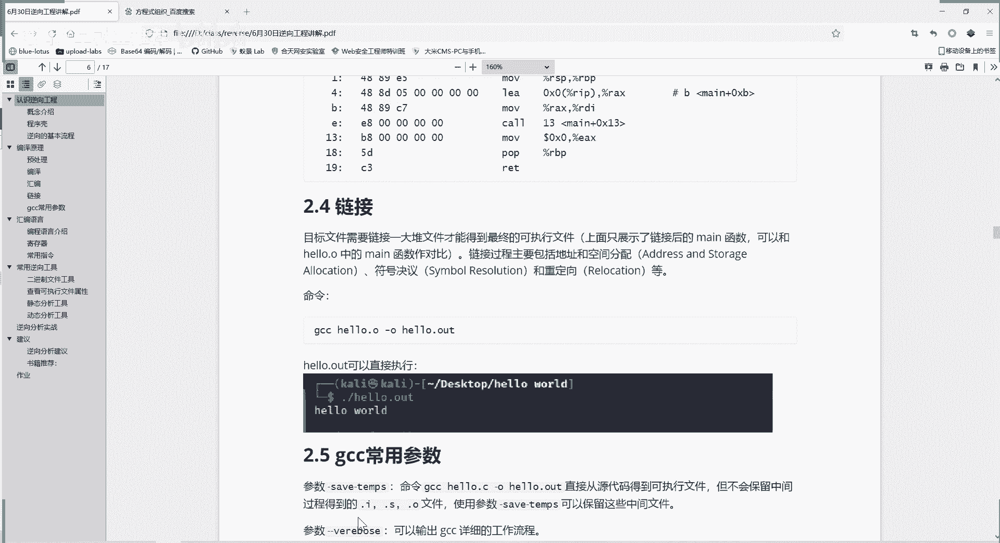
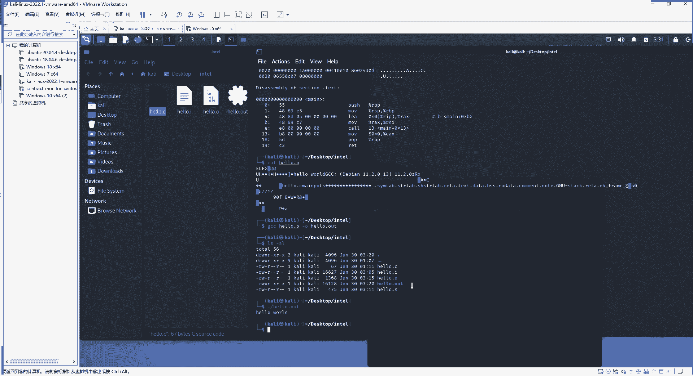
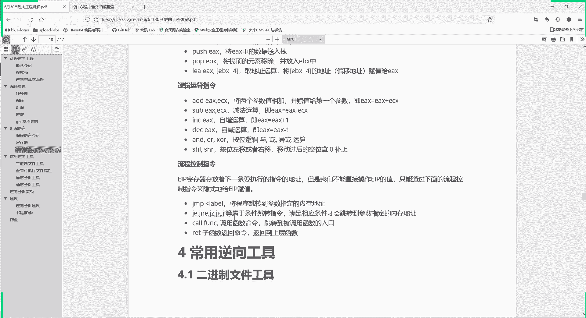

# 【B站最系统的网络安全教程】北大大佬196小时讲完的网安教程，全程干货无废话！学完即可就业，别在盲目自学了！！！ - P89：逆向工程--汇编语言 - 网络安全就业推荐 - BV1Zu411s79i

提问大家是这些东西都很简单，都掌握了，还是说大家啊不敢提问，掌握了就很好，大家千万不要不敢提问，要把握学习的机会，好的我们继续开始上课，第四个链接就是这样，那我们把整个四步走完之后呢。

就得到一个可执行的文件。

这个文件呢可执行的文件，就是我们我们自己命名的，hello，点out，这就是一个软件或者是一个程序，大家平常所用的软件程序，都是通过这种方式来得到的，不过可能就是不是用我们gcc编译器，用别的编译器。

或者说不用经过中间的步骤。

直接得到最后的结果，我们再来看一下上面的这个图，就了解了这个整个过程，这个整个变形的过程是怎么样的，先是我们写一个c语言的代码，源代码还有点c，然后进行预处理，预处理之后呢，就去除掉一些注释啊。

还有些红的定义等等，得到一个预处理的文件，然后呢再进行编译，把这个预处理的文件呢编译，得到了一个汇编的代码，编译就叫，然后呢在第三步呢进行汇编，就把这些汇编代码转成机器码，转成二进制。

这是计算机可以理解的语言，然后呢再经过第四步，就是链接，我这个程序中需要引用的一些动态，链接库的文件，或者是一些别的链接文件，我把它包含进来加进来，然后进行链接，得到了一个最终的可执行文件。

一个最终的二进制文件啊，这就是一个编译的全过程，最后呢再给大家介绍一下g7 cc，另外的两个常用参数，一个是杠save temple，你使用gcc hello。c可以直接得到最终的结果。

但是它不会保留中间文件，你使用gun save temples，他就会保留下中间的文件，然后供大家分析学习，第二个参数是杠杠verbles，他就是输出gcc一个详细的工作流程，而不是只输出结果啊。

这两个参数大家可以自己去拥有，自己编写一个c语言文件，看一看，不一定要像我这样编写hello word，你可以进行别的，你就简单的计算一个1+2也可以，重要的是理解这个程序它编译的过程。

这是理解啊一个计算机的本质，然后我们进行立项呢，就是处理底层的，就是理解本质，然后这是一个编译的过程，编译的过程，大家发现生成了很多，这个c这个汇编的语言的代码，是不是。

那么我们第三章呢就介绍一下汇编语言，首先给大家介绍一下这三个编程语，三种编程语言的概念，就是机器语言，汇编语言，高级语，机器人是什么呢，是计算机的硬件，它是一种电路元件，大家都知道就是高电平低电平嘛。

二极管半导体半导体它只有输输入和输出，只能是有电或者没电，没电，也就是高电平低电平，所以计算机是根本上来说，它只能识别二进制，这也就是为什么说计算机采用二进制的原因，而不是什么十进制。

八进制就是为计算机硬件还只能识别高电平，低电平，刚开始的时候呢，计算机发明之初呢，为了能控制计算机完成自己的任务，就是编程，只能是编写零一这样的二进制数字串，去控制电脑。

它其实就是控制计算机硬件的高电平和低电平，那这种只是用零一来编程的呢，这种语言叫机器语言，非常接近本质，但是呢也非常难理解，之前在学校里面，老教授上课的时候，就说他们以前编程要什么打孔，用纸袋来打孔。

这个纸袋打孔呢实际上就是进行零一编程，有孔没孔就是零一，他只有这两种状态，这是最开始的机器语言，所以后面的发展呢就发展出了一种汇编语言，汇编语言是电子计算器啊，精微处理器等等，对于使用的一种低级语言。

一乘坐一个符号语言，但汇编语言是什么呢，就是用助记符代替机器指令的操作码，这就是机器码，这左边会员呢就是把这些代码，本来这些4889这些全都是数字，这还是16进制的数字，二进制的更难解，这些有什么含义。

非常普遍一记，所以就发展出一套助记符，555，就是这个这488915就是mol s p r b p，用这样的方式来助记，实际上汇编代码就是一个助记符，所以它仍然是很贴近于这个机器人的。

但是比机器人好记好编写，更加啊对人类友好，在不同的设备中，汇编语言对应着不同的机器语言，指令集就是汇编源啊，到底代表着什么，机器人是跟设备平台相关的，你要换平台的话，就要通过一个转换程序。

所以说汇编语言是和cpu架构相关的，不同的架构，x86 pop c arm cpu指令并不相同，这就是为什么，就是windows它上面有大量的电脑的程序，它是x86 ，它是不能移植。

或者说是很难移植到这个移动端的，安卓呀，iphone的手机都是arm，因为他们的底cpu的价格都不同，所以说你编写出高级语言再转成汇编语言，再转成机器语言，它里面对应的转换都不一样。

如果说有的人是使用的那个苹果电脑，m一的那个电脑，它是基于arm架构的，他虽然是电脑，但是arm架构它就非常难，和那个windows程序兼容，会出现很多问题，以前苹果是采用英特尔架构的。

你装个windows虚拟机，在苹果系统上还是比较容易的，但是现在它采用arm架构，你装windows虚拟机当然也能装，会麻烦很多，因为会遇到很多兼容的问题，这是汇编语言，汇编语言虽然比机器语言好听很多。

但是还是不太方便，后面就发展出高级语言，为什么存在高级语言就是编程员进的机器语言，汇编语言之后呢，人们发现限制程序推广的关键因素，就是程序的可移植性，因为机器语言汇编语言都是基于平台的。

因此呢就是同时他们也非常啊对人类不友好，非常难记，所以呢就需要设计一个不依赖于计算机硬件，能够在各种计算机平台上进行运行的程序，这就可以免去很多编程的重复过程，同时呢这种语言要接近于人类的数学语言。

或人的自然语言，其实这种需求呢就发展出了c语言，像java python c都是这基于不同平台，就是说我的c语言的代码我也可以放在linux，c市场，我也可以进行编译，在windows上也可以进行变异。

我的对于人要进行的工作，就是编写的源代码放在两个平台都能进行编译，那后面要编译，那编译器的事，它自然会生成适合于windows系统，适合于linux系统的可执行程序，这样是不是人编程的效率就大大提高了。

这是他们三个语言的一个特点，一个关系越来越复杂，越来越啊，人类越来越懂，但是效率是越来t的，大家这应该可以理解，高级语言，他虽然就是很利于很有益于人类的编程，但是它的效率相比会比人家机器还是低很多的。

同时c语言是比较接近于会员言的，所以c语言的效率又比python他们的高，但是python编程呢就比c语言简单很多，大家应该先python用起来非常方便，c语言用起来就是门槛要高一些，复杂一些。

但c语言编得好的话，它的效率是比python高很多的，当然对于普通用户的话，你用c编程，用python编程，你就看你是要是工作的要求，最终呈现效于普通人来说没有特别大的区别，那汇编语言有什么特点呢。

目标代码比较简短，占用内存少，执行速度快，就相当于高级原来是演的，但你相对机器语言，它肯定不能说是执行速度快了，它比机器人呢就更加便于记忆和书写，同时汇编语言是和机器相关的，大家不能直接。

我们后面会给大家讲这个汇编语言，他们常用的命令，但是不能直接套用，在这要进行一个转换，因为这是机遇，a t n t的其实差别也不是很大了，英特尔的就是木ax在前零在后，它就是零在前a在后。

就是这样一个区别，其实也是很小的区别，然后要理解汇编语言呢，关键一点我们要理解一个寄存器，这都是啊计算机底层的，寄存器了，它是cpu内部的高速存储单元，cpu就是中央处理单元吗，单元它是个集成的。

它集成的内容之一就是寄存器和，寄存器是cpu的一部分，它的访问速度比内存快，内存比硬盘快，内存就是硬盘，就是我们说的电脑存储空间500g1 t这些，那内存呢就是运行内存。

有的是4g8 g 16 g32 g都有寄存器，比这个内存访问速度还快，它就集成在cpu内部，当然它价格也很高了，就是这是一个层次关系，寄存器内存和硬盘寄存器速度是最快的，价格是最贵的，容量是最小的。

是最贴近于cpu的，寄存器呢可以分成四类，总共四呢就是八个通用寄存器，然后六个段寄存器，还有一个标志寄存器和一个指令指针寄存器，这里这个图给大家解释通用寄存器，这是标志寄存器。

一个叫e flag 32位的，就叫e flex 16位的操作系统吗，就是flag 16位的cpu，就是flags，这同样的指令寄存器16位的叫i p，32位的叫一ip。

64位的就是r e是32位这个命名关系，然后还有断机存器，通用寄存器呢又符合数据寄存器和指针，变质寄存器，大家看这些可能刚开始还比较晕，但是不要着急，我们后面一个个解释，它们是有逻辑关系的。

我们首先看这几四个数据计算器，一ax它的命名也是很好记的，ea 1 b1 c1 d，abcd这四个数据计算器，我们看一下数据寄存器，数据寄存器呢，主要是用于各种计算和数据的传送。

每个数据寄存器呢都可以作为一个32位，16位或者八位来用，为什么可以这么用呢，我们以数据计算器ex为例，它是32位的，你把截一半ax就是16，你可以只用它的一半，a x又可以分为a h a l。

h就是hi l就是l高位，低位它又能分为高八位和低八位，所以它可以作为一个32位的用，可以作为16位的用，可以作为八位的来用，都可以，ebx ec x d x也是同样的，它们的用途呢ex成为累加器。

它就是来进行算数运算的，eb x呢是一个基地址寄存器，是用来存放基地值，这里给大家介绍一个啊这个基地值的这个概念，因为在我们寄存器就在cpu里面，我们要进行寻址。

就是我要知道我下一条指令执行的地址是在哪，然后就相当于人嘛，你你明天做什么事儿，你是找谁，是班主任安排你还是班长安排，你需要下一条指令，然后有时候还要找数据，我要取得什么数据。

你要知道这些命令或者数据它的地址是在哪里，你才能够知道这个命令取到这个数据，是不是地址，怎么判断呢，怎么知道地址呢，地址是由两部分组成的，一部分叫基地址，一部分叫偏移，就是地址他不会告诉你。

其实这个我们用的也是很多的，就像你在学校，你别人问你什么事，你说啊那个东西在教学楼五楼啊，在食堂，其实这个教学楼五楼啊，这食堂都是一个偏移，它是什么偏移，它是在于你们就是。

基于你们湖南警察学院的一个偏移，是指债务，你们学校内部的这个教学楼五楼，他要说完整的地址是什么，中国什么省，什么市，什么区，什么什么地方，但是每次那么用不是太麻烦了吗，是不是。

所以就采用了一种基地址加偏移的一种方式，来定位地址，啊e c x c呢，那你肯定有为count c o u n t计数，它是个计数器，它可以用来保存这个循环的索引，就是大家平常用到一个循环。

for for i等于零，a小于100，a加加，那么i是不是要计数，要增长，这个技术就保存在c里面，ecs里面每运算一次，e4 x这个寄存器的值就加一，然后下一次再取e c x里面的值和这个100。

来进行判断，看程序决定下一步是往哪个分支走，e d x呢，它常用来保存这个整数除法产生的余数，这是它们的作用，这以上每个技能这个作用都是它的默认作用，但编写汇编代码是不是必须的，这个是什么意思。

就是大家在分析逆向程序的时候，基本上可以照这个理解，但不是百分之百的，一般都是按照这样来做的，但是你如果说你直接用汇编语言编程序，也是可以的，你就不按照这么用，你把ex作为这个计数器程序也没毛病。

但是因为大家所遇到的程序，都是用编译器来进行编译的，所以一般都是按照这个默认的作用来存储学习，这个寄存器是为了让大家能够更好地理解，我们逆向的程序，这是啊这部分数据数据寄存器。

那我们看这个第二部分指针变质寄存器，它也有四个，我们分别来看一下，这四个相当于第二类的，他们也是相关的指针变值计算器是什么呢，它可以按照32位或16位来使用，就s i e s i这样说。

但是不能像通用通用寄存器那样啊，再分割成高八位，低八位，这是不行的，他只能分分隔为16位和32位，那它的用途是什么，有四个e b p e s p e s i e d i，他们的16位就把前面的去掉。

就bp s p s i d什么作用呢，我们一个看ebp就是堆栈，大家理解一个堆栈的概念，我push pop这堆栈先进先出，先进后出，这些堆栈机制寄存器，只要bp还是用来防证堆栈中的数据。

它是保存堆栈的什么断机制，e s p呢是暂停指日，它就可以配合bp来访问这个站的数据，啊把这里理解成一个栈存在数据，e bp是站的机制，然后e s p呢是站点，我访问站点就得到这个数据bp再往下一位。

e s p再往下，这样就访问到站的每一个数据，所以e b p e s比他们俩是一个组合，来访问堆栈的数据的，下面来看第二个组合。

e s r e d r s就是source d就是destination目的地，所以s呢叫原址真切存器，d i就是目的均分期存器，他们俩作用都是用于内存数据的传送，我要把内存中的数据。

从一个地方传递到另一个地方，那我就要知道这个数据从哪来到哪去，从哪来，就是原地址，它有数据的来源，这里呢是指向数据的目的，为什么采用这种模式，这前面是基地址，后面是偏移完整的。

他们组合起来就是完整的地址，这个看这个字字母就应该理解s source d destination，目的地，这是指针变质的一些机型，说白了就是用来寻找地址的，我是要对战的地址。

或者是我转移数据的一个地址，那么还有一个计算，还有一类寄存器呢，就是段寄存器上面代码有六个，氮寄存器呢是16位的，他在16位的cpu中呢就只有四个叫cs代码的code，用蛋就是segment，cs。

就是code segment，这就是code，有代码吗，代码段，那同样的d date segment数据的，这是stack堆栈的，这是附加段，在32位的cpu数，它扩展了两个段，寄存器。

增加了f s g s实际上也是作为附加段来使用，这是段寄存器，然后呢是一个指令指针寄存器，e i p 16位中解决的ip，它是保存着，这相当于专用专用的一个寄存器，就是保存指令，保存了下一条指令的地址。

通过cs ip来制来访问我下一条指令是在哪，所以当这个程序在顺序执行的时候，为什么程序能顺序时间，它实际上进行的操作，就是进行这样一个赋值操作，e i p就等于原来e i p加上拟合指令的nice。

我现在这条指令是占了四字节，那我e i p加四得到了一个新的e i p，告诉我下次要从正定来执行，那为什么有的时候能够跳转，能扩扩一个函数，或者是跳转到什么地方。

遇到这个jump还接一loop这些循环啊，跳转的指令的时候，事实上进行的操作就是改变e i p的值，那我就不是按照你执行的这个命令的，nt字节数来进行增加了，我就直接指定e i p等于多少。

直接指定jump到哪里去，还记得我们上节课给大家介绍的这个本地标签，标签其实就是一个地址，那我直接降p到这个标签处，实际上就把那个标签的地址付给ei p，然后他就知道要执行哪里了。

这是顺序执行和改变和进这种跳转到循环，这种执行，他们是实际上是怎么实现的，就是通过改变ei p这个寄存器的值，这每个寄存器里面存的都是数据啊，所以说存的大于你，可你会存的这个数字，所以改变它的值。

也就改变了你的程序的执行走向，然后我们再看一下这个标志，寄存器标志技能，这就叫flags，32位呢就叫-1 flex就命名的规律，大家应该掌握了，32位就多个一嘛，因为四位就是r。

但是不管是32位还是六位的cpu呢，它这个标志寄存器都只用到了前16位，01236~15，每一位是什么作用呢，这里给大家总结了，所以这个标志寄存器，就是它是保存一些运算的结果。

比如说我比较两个数是不是相等，比较结果就保存在标志寄存器里面，我进行一个两个数相加或者相乘的运算的时候，我有没有溢出，也是保存在这个标志寄存器中，那么后面的程序通过访问这个标志寄存器。

它对应的某一个位数的值是零和一，就知道我有没有中断，有没有溢出，这就是一个标志寄存器，这每一个每一位的具体作用，还是这里给他写出来，但是大家真正要理解的话，还是要在逆向实际的一个破解程序。

逆向程序逆向分析的过程中，不断地对比着看，才能真正的理解，啊前面都是给大家介绍的标成员的特点，还有它的寄存器，就是这些就是数据存储器，它里面存储的是数据，这里面存储的是一些地址信息。

然后这个是一个运算的标志信息，这是指令信息，这是存折断的信息，这是一个寄存器，那么汇编的指令有哪些呢，啊汇编的指令，刚才我们可以看到声明声明段的指令，点text就是代码段，还是放着可执行程序的点。

date就是数据的，它放数据的，还有io date就是只读数据的，大家有的时候还会遇到点b s s，这是这这些数据都是在哪看的呢，都在我们的编译过程啊，在这里面有会出，可能会出现。

bs就是暂时无法确定的这个数据，点comment就是编译器版本信息，我们后面看到啊，gcc就是用gcc来进行编译，将这个eh frame是调试信息，这些是一些声明的信息，那具体的指令呢。

比如常见的move指令，move 1 a x1 b x，什么意思，就是将e b x的值赋值成一ax复制个ex，这是我们说是基于英特尔的处理器，因为汇编语言它也是跟你处理器相关的。

我们给大家讲的是英特尔的处理器，但是你把英特尔的掌握，你就x86 吗，x86 是最主流的，那么x86 掌握你在学习别的arm啊什么的，其实都很类似，就像大家学编程一样，第一门学c语言，你把c语言学会了。

你后面再学python java都容易很多，再就是push，push就是将ea x数它里面的数据送到站里面，它不会让这个寄存器送到站里面，寄存器它是个物理实体，你只能从里面取它存的数据放到站里面。

pop呢就是把站点的数据移除，把这个数据放在哪，放在e b x这个寄存器当中，这个逆了lee a呢就是取地址指令，就是把后面这个地址传给放在ex当中，把这个地址保存在ee ax当中，这是数据移动的指令。

第二类呢就叫做逻辑运算指令，诺，就是一些运算，add增加e x e c x就是把e ax和e4 x相加，然后把值放在ex当中，同样相减，也是相减，之后把值前一个减后一个放在e s当中。

还有常见的i n c increase，增加就自增，就相当于c语言里面的i加加嘛，d1 c就减少i减减这样的，and waxy就是逻辑运算与或异或运算，这个s h l s h r就是按位左移和右移。

它左移和右移相当于什么呢，相当于乘以二和除以二，但是比进行乘法运算会快很多，这是啊逻辑运算的一些指令，然后呢再就是流程运算的指令，流程运算，我们知道e i p计算器呢就存放着下一条指令，要执行的地址。

所以我们的流程运算呢就是改变ei p的值，比如说常见的jump jump到一个标签，他就是跳转到这个标签的地址处，把这个标签的地址放在1p当中，或者je je jz就大于小于等于。

这些命令属于条件跳转指令，满足条件就会跳转到相应的内存地址，括号括号一个function就调用函数指令。

