# 【B站最系统的网络安全教程】北大大佬196小时讲完的网安教程，全程干货无废话！学完即可就业，别在盲目自学了！！！ - P90：逆向工程--常用逆向工具 - 网络安全就业推荐 - BV1Zu411s79i

是把被调用函数入口的地址付给这个，r e t就是返回返回上层函数，就把上层函数的地址，就是这个子函数被调用之前的那个地址，给e i p，那么一ip就知道下一步要执行什么命令，这是一个汇编语言给大家啊。

再回顾一下，首先是一个总体的一个介绍，再加上介绍了这个寄存器，每个寄存器都是一个什么样的作用，然后常用的指令指令就分为一个声明的指令，数据移动运算流程控制这些类型，然后我们现在进入第四部分。

就是一些逆向工具的一个介绍，首先是一个常用的二进制工具，就是我们这些二进制文件，我们要查看的编辑也需要一些二进制工具，比如说有win hx 16进制查看工具，所谓的二进制查看工具就是其实就是16进制。

查看空间是一个意思，因为二进制不是零零来显示0101，这样显示是16进制来显示的，是不是上节课给大家说，因为16进制和二进制是一一对应的关系，但是16进制更容易被人类理解。

所以采用16进制来表示二进制的数据，二进制的文件，嗯在这u一啊，然后010editor，这些常见的工具可以查看二进制文件，也可以修改，也可以对比两个文件。

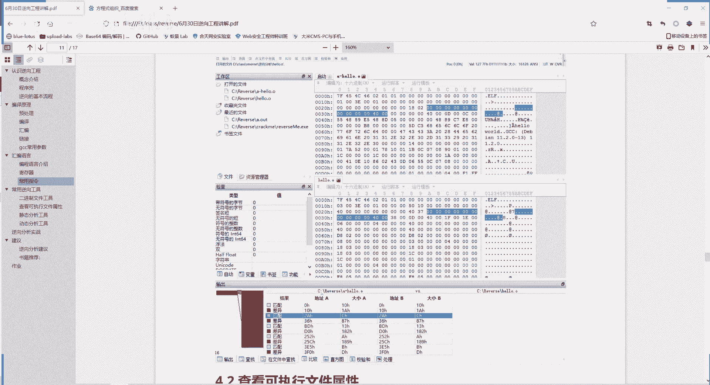

我们还是在虚拟机里面看一下，比如说我们看到这个，我们今天要破解的这个程序。

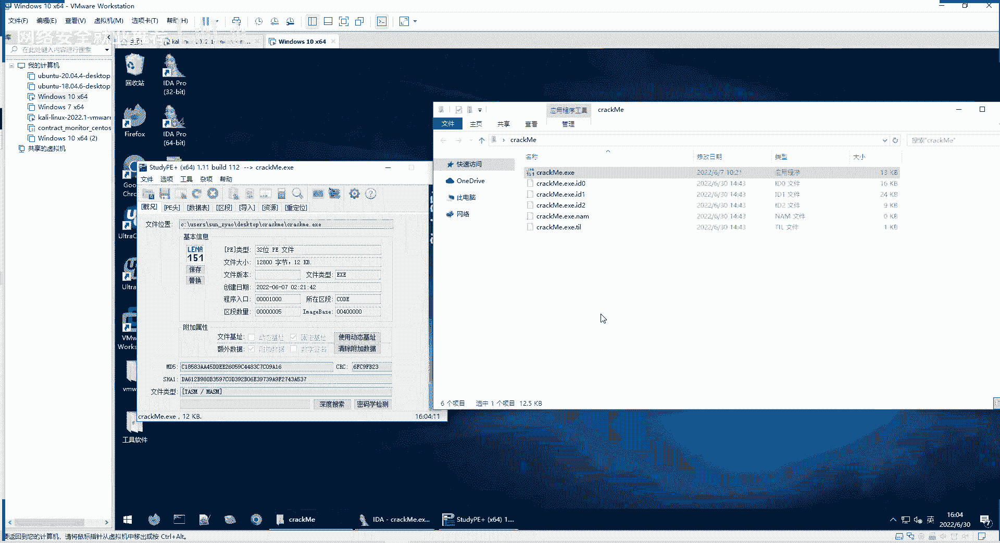

我们可以用ue打开看一下，这就是这边是它的一个16进制的程序，这是对应的那个看16进制有没有对应的字符，有多少显示，没有的话就是乱码，它这里面有一些字符串，也有很多乱码。

这些乱码呢是因为它是机器要执行的指令，它不是数据，但是你用十进入直接打开的时候，他并不知道哪些是数据，哪些是指令，它全部按数据给你显示的，这里也可以进行修改啊，看七零改成七一也是可以的。

我们把它改改回来，你可以进行任意的修改，这里用u e，然后呢也能u e，还有一个配套的叫u uu e compare，它可以进行一些文件的，也有比较，因为比较可以比较两个文件它有什么异同。

我们比较嗯比较一下，比较一下跟他一个非常相似的一个文件。

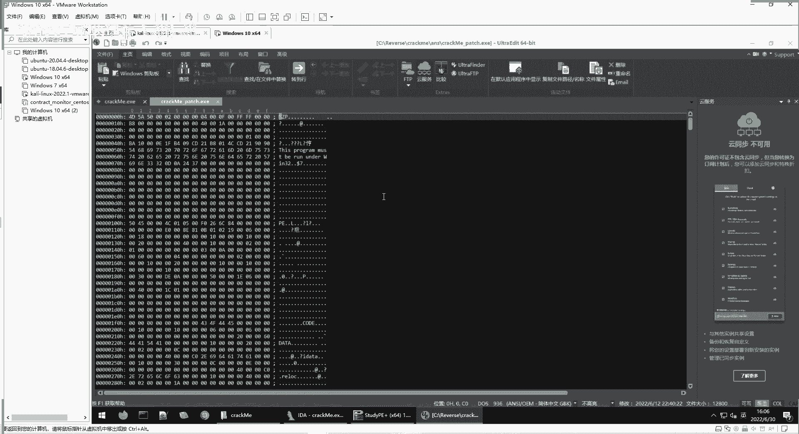

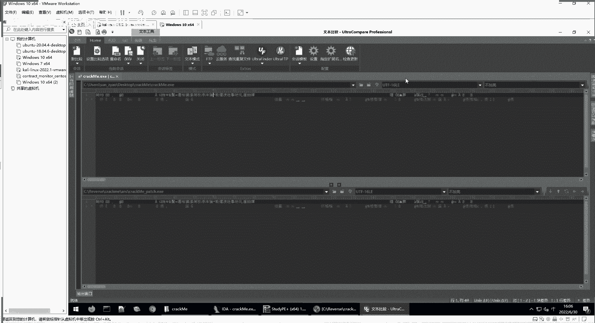

我们重重新比较一下，先把这里打开关，怎么点关闭。

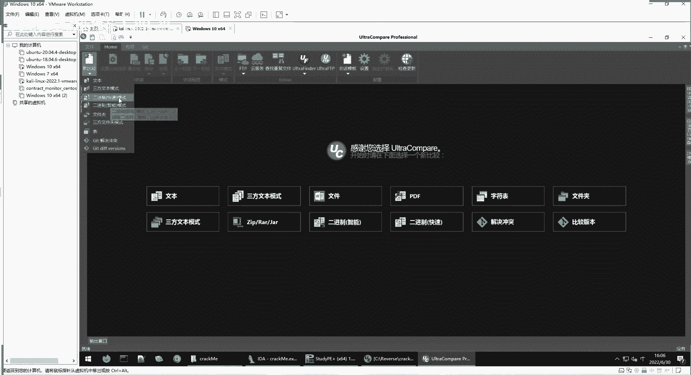

新的比较，我们用二进制的来比较。

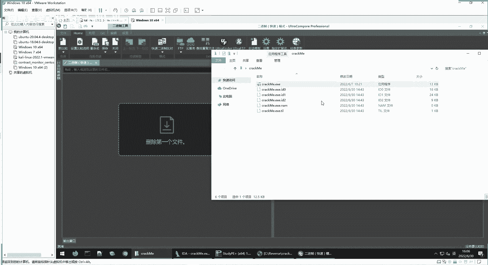

还有拖动，就是对比着看这两个文件，看它有什么差异，这是一个比较的一个功能。

刚才给大家演示的是ue，这里给大家贴图是nearly editor，都可以用，但是可能要有些可能要经过付费或者是破解，这个大家啊都理解，然后第二个是可查看可执行文件的属性的工具。

比如说study p刚才给大家看了，就是一个查看pe文件的一个分析形成工具，pe就是portable executive，就是可执行文件，windows下可执行文件其实都是pg文件。

比如说我们看到这个reverse me，其实就是啊我们今天这correct me这个程序，那么他用pe来看呢。

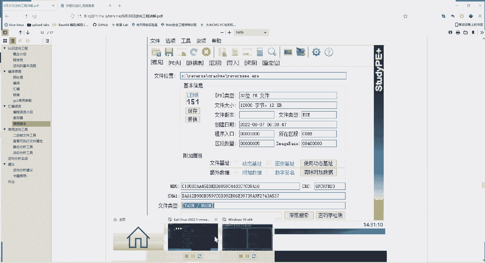

它就会我们直接打开看一下。

我们刚才p一看了，他就告诉我们，这是一个32位的pe文件，那么我们后面再进行动态静态分析的时候，都有32位，ida 64位a d这个x64 呢，这debug也也差，debug也有32位u4 。

你就知道用32位的能打开，还有这个文件的哈，希值md 5值下one的值，如果对这个文件进行任何一个改动，它这个值就会变，可以用这个值来保证这个文件没有经过改变，然后下面有文件类型。

这个t a s m和m sm，这文件位实际上确实它是一个汇编的文件，就是它没有加壳，如果加壳了，在这里文件类型也可以找出来，大家不理解的话，没关系，把这个文件类型复制出来，在百度里面搜一下。

就知道你查看不同文件，它是什么，代表什么含义，所以说这道题我们是讲解的，是一个比较入门的题，它没有加壳的，我们可以直接进行分析。

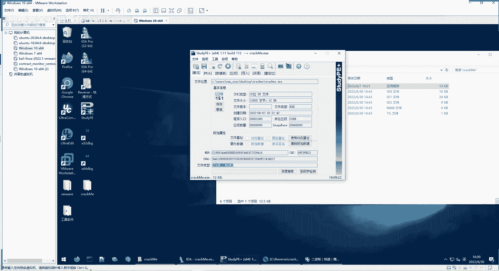

利用，这是在windows里面，那么在linux里面用什么查看呢，就选择read e r f，e l f就是linux里面的可执行文件。

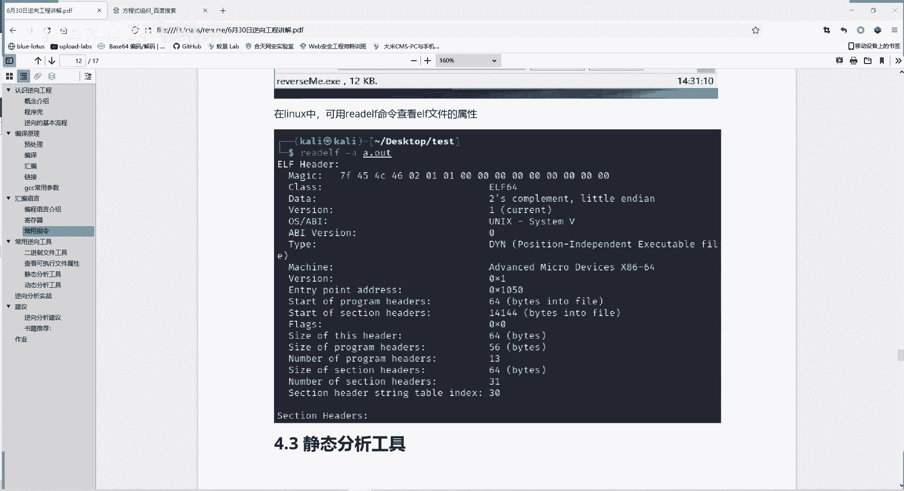

我们在这里看一下，使用read e l f，然后使用杠a这个参数就是查看所有的信息，然后你要查看哪个文件，就是我们刚刚生成的可可执行文件，hello，点out，他就给我们显示出这个信息。

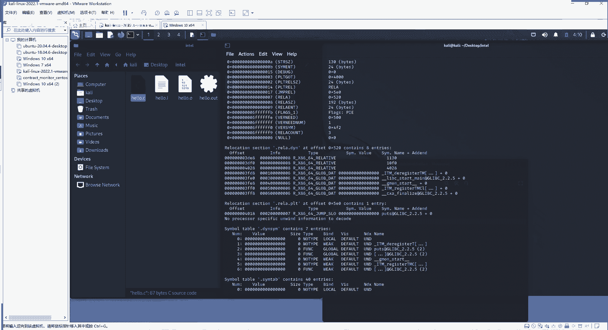

这个信息还是很多的，因为a就是所有，啊这里给大家截取一部分，像什么版本啊，编译的一些，你看他是在什么，在x866 64位的机器上编译的。

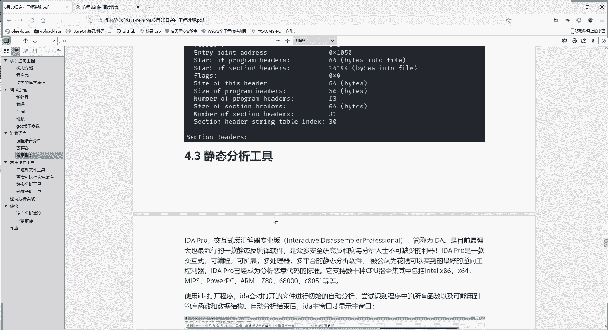

这些信息都有。

这是整体来查看文件的一个属性的，和windows linux两种系统的一些工具，然后呢就进入我们的ida工具，i da简称是d你全程的ida pro，它是交互式反汇编七专业版，简称就是i d a。

它是目前的最强大，也最流行的一个静态反编译软件，是我们安全分析必不可少的力气，它的功能确实很强大，这个这个软件也是，之前也是上传到群文件里面的，大家如果之前装了，那就可以直接用，没装的。

就可以把群文件里面的那个文件下载下来，然后解压缩就可以用。

解压缩我给大家看一下，i da诶我这id是，解压缩之后就会得到这样的软件，这样你就会看到这样的文件，然后这里面有个ida和一个ida 64，以32位的，你用ida这个打开64位的程序。

你用ida 64来打开来进行分析就可以了。

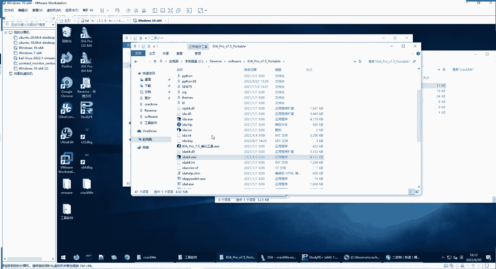

这是个免安装的，非常好用，大家直接下载下来就可以用。

使用ida打开之后呢，它会对打开的文件进行自动分析，我们这里给大家看一下，比如说我们就打开这个ida 64，大家可以new就是新打开一个文件previous。

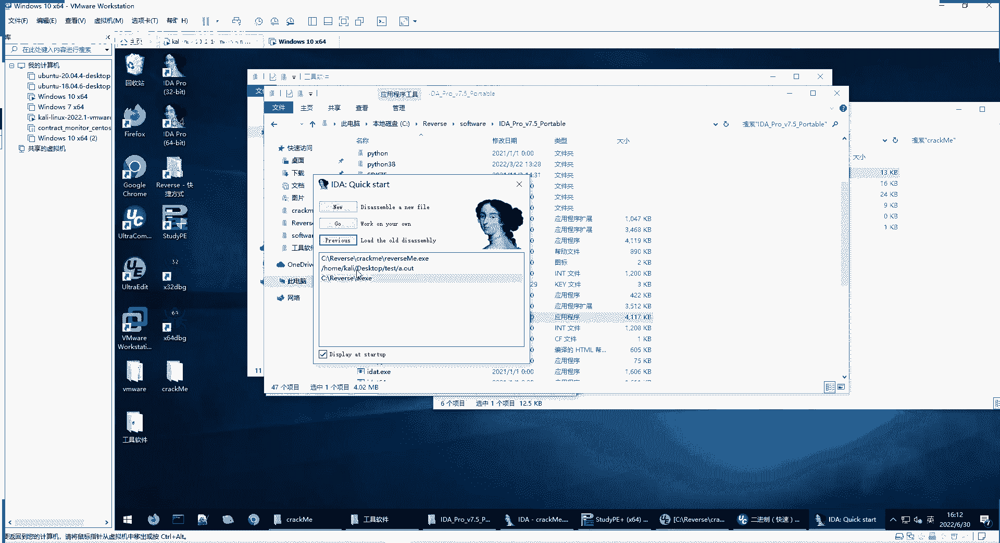

就打开之前的某个文件，你打开也可以，你go直接点一个，就是暂时不打开文件，然后你在这里面可以选择打开，这是一个ida的界面，然后我们打开一个分析软件之后呢，它的这个窗口可以分为这几步。

可以分为这几个窗口，大家可以看一下，第一个窗口就是下面这一横条，它是对不同的代码块使用不同的颜色区分，你直接点击对应的颜色，就可以定位到不同的代码块，然后第二个窗口就这里，左边这是一个函数窗口。

就是ida分析出来的函数，然后右边第三是id的主窗口，这是显示它里面有哪些命令，或者是一个程序整体的一个概览图，整体的运行的图。

然后第四个是函数的一个控制还是缩略图，第五个脚本终端。

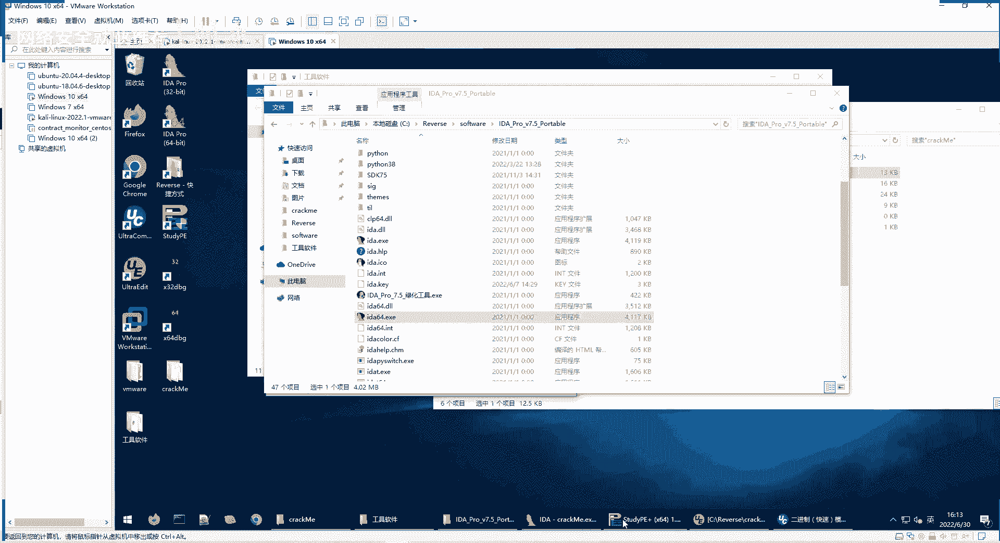

我们看一下，这是我们i da打开的，我们要分析的quick me程序，这上面是不同的代码段，看都是可以直接点击跳转的，这里面是他分析出来的函数，他分析了start函数，这是现在这个程序的入口啊。

这这里是主窗口，可以看到各种命令和程序的一个情况，这里面是一个缩略图，可以你拖动这个思维图，可以调整这个框的内容，显示内容，然后这里面呢是一个脚本，这i d a是支持python脚本的。

你进行一些操作可以使用脚本，或者说你发现一个应用的时候，可以导入脚本来进行工工作，这里是一个显示信息，output显示的一个窗口，下面我们重点看一下主窗口，主窗口包括什么呢。

我们啊还是直接对着这个i d a来看更清楚，首先这个i d a v u a这就是war，就是显示当前函数的控制流图，它这个每一步可能跳转到哪去，前面这hx是16进制，你可以打开多个，就是v u123 。

这样以16进制的形式来查看这个代码structure，这就是分析出来的结构体，这是ida分析出来的结构体，i da是个很强大的工具，它分析的一般是正确的，但是它也是只是一个参考。

不一定他分析这个结构就有，也不一定他没有找到的就没有，我们作为初学者的话，还是就相信i da就行了，如果你就是以后水平越来越高了，你要知道i da它也不是百分之百正确的，它是最强大的，但是不是绝对正确。

这是枚举信息啊，因为我们这个程序要简单，所以这里没有这个导出信息，import导入，这就是这个程序导入的一些函数，就是我们之前link是不是link，它要导入一些函数，导入了。

然后像我们correct me这个函，这个程序编译生成的过程中，也要导入一些函数，那导入了哪些呢，i da就给他一顿分析，然后就分析出来导入了这些函数，然后这是导出函数，就是输出的最后存在的一个函数。

因为它本身整体就作为一个函数，就是start，这是一个i da，它的主窗口的一个每个栏目的一个作用，主窗口介绍了之后，我们介绍一下i d常用的快捷键，f2 下断点。

这里虽然说把i d a作为一个静态的工具，但是随着这个工具的发展，它本来是一个静态分析工具，它现在功能越来越强大，现在d也具有强大的动态分析能力，我们后面就用i d a来进行分析。

动态静态动态都用i d非常方便，然后它的宽容快进到f2 下，断点就是动态分析的时候暂停的地方，单f7 单步步入，它会它只单步单步的执行指令，每按f71 下，它就会执行一个单的指令，f8 也是单薄。

不过还是不过f7 f8 的区别是什么呢，你之前f7 的时候，括号一个函数，它会下一步会进入函数内部，f8 呢它会把括号那个函数整体作为一个命令，它不会进入子函数的内部，f5 是查看反汇编生成的伪代码。

f9 呢是运行程序，它会一直运行，直到遇到断点，或者说程序最终结束，e s c呢就是那个键盘上esc键，就是返回到之前的位置，这是个id，然后后面，然后这也给大家介绍一下，我们这个动态的一个分析工具。

动态分析工具就是，运行起来来看是吧，我们这里给大家介绍的是一个o d o d t bug，给大家发的好像是那个差xd bug，因为xd bug它也能分析64位的程序，o d的话只能分析32位。

不过他们的分析方法都是差不多的，这里给大家介绍一下这个o d呢。

它是分为这么几个窗口，你打开之后，我我们这里，打开一个o d，比如说我们打开x32 debug，它其实，我们可以把我们要要动态分析的程序给放进来，放进来之后呢，大家可以看到这边是一个返回边窗口。

他本来这些都是神六进制的，其实也就二进制的代码嘛，然后程序就把它反汇编出对应的汇编代码了啊，这边是寄存器窗口，保留要寄存器，我们刚才给大家ex 1 b x1 c x e b p s p。

这些寄存器它的值是多少，然后这里面是一些输出，就显示信息窗口，这里呢这个是数据窗口显示的那个内存的数据，内存地址，这一块地址的数据还可以看多个，我另一块地方内存，它现在是什么数据，这是一个啊数据窗口。

然后这是堆栈的窗口，现在这里站里面有哪些信息。

这是我们一个动态调试工具，基本上都是这些窗口，它们的界面是比较像的，用法也是很像的，就是这些窗口啊，嗯那现在04：20，我们还是啊休息十分钟，四点半开始上课，最后最后一节课就是带大家实际分析一下。

crack me这个程序，最后进入到实战的环节，诶今天最重要的一个环节。

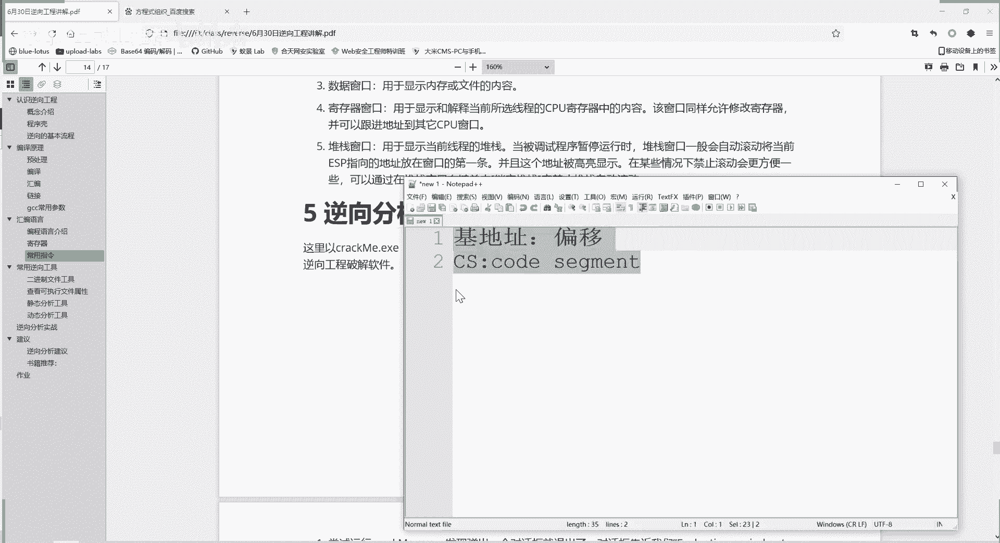