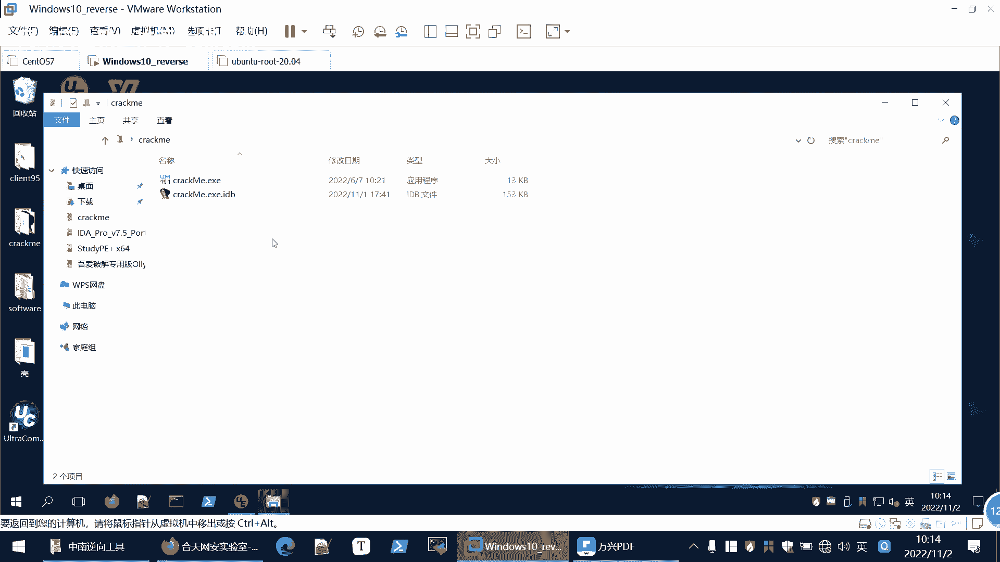

# 【B站最系统的网络安全教程】北大大佬196小时讲完的网安教程，全程干货无废话！学完即可就业，别在盲目自学了！！！ - P93：逆向工程--逆向工具培训 - 网络安全就业推荐 - BV1Zu411s79i

第三章，那我们再进行一个一项分析的时候，首先要看一下这个文件的一个基本的情况，可以使用这个使用禁止查修改和查看的工具，比如说这里给大家指的是u1 u1 editor。

丢失edit，这个工具可以查看16进制情况，可以进行一个修改。

也可以比对文件，是吧，这是我们是在一个虚拟机里面做的，大家，大家在进行逆向的时候，最好也是在虚拟机里面做，因为大家分析的这个程序很可能是带有后门的，如果说你在主机里面做，你被抓到后门。

到时候清理非常的麻烦，所以说最好专门有一个虚拟机来做，然后这是我们的一个优异的程序，那么我们今天要分析的这个。

啊先把之前的东西删了，这是我们今天要分析的程序，我们可以在ui里面打开啊。

这是通过16进制查看，那情况也可以进行一个修改，但这时候修改是修改不了什么的，因为我们还不了解这个程序的机制，不知道在哪个地方进行修改。

啊那么大家都是高材生，这这方面这些简单的工具，应该就不用过多介绍了，这是u e和下面那些u e compare，就是比对两个文件，你可以在进行一个程序修改的时候比对一下，看你修改的是哪个部分。

这个有红色的地方，就是有差异的地方，然后呢我们再给大家介绍一个工具，就是这个studp，它是一款pe文件的分析工具，我们打开这个是，然后打开一个文件，这是我们要分析的这个程序，我们先看一下。

从从这里就可以看到，它告诉我们这是32位的pe文件，那么我们后面再进行分析的时候，比如说你用i da来看的时候，i da有i da，它就是三查看32位程序了，还有i da 64查看64位程序了。

你就知道要用ida打开，同样的这里是如果是64位的话，你用d n64 来打开，然后下面这里有个文件类型啊，这就是没有价格的，有的时候它有价格的，有一些u p s以及其他的，你查看这个p的文件头。

然后他的一些躯干等等信息，都可以通过这个studp来进行查看。

这是我们这个sp这个工具，那么在linux中可以使用read e l f，来查看这个e l f文件的属性啊，这里是这个a。out，就是很简单。

就是hello world程序就prenf hello world，这是因为linux里面是e l f文件嘛，刚才3p是一个windows平台下的一个工具，可以看到这只是1f64 位。

然后其他的一些信息等等，啊，那么前面是给大家简单介绍一下，我们一向相关的一些情况。

