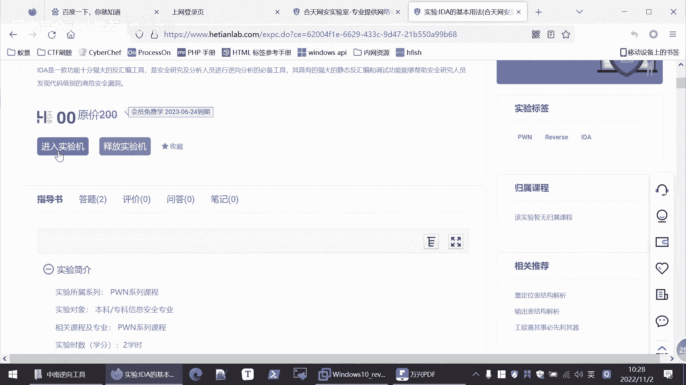
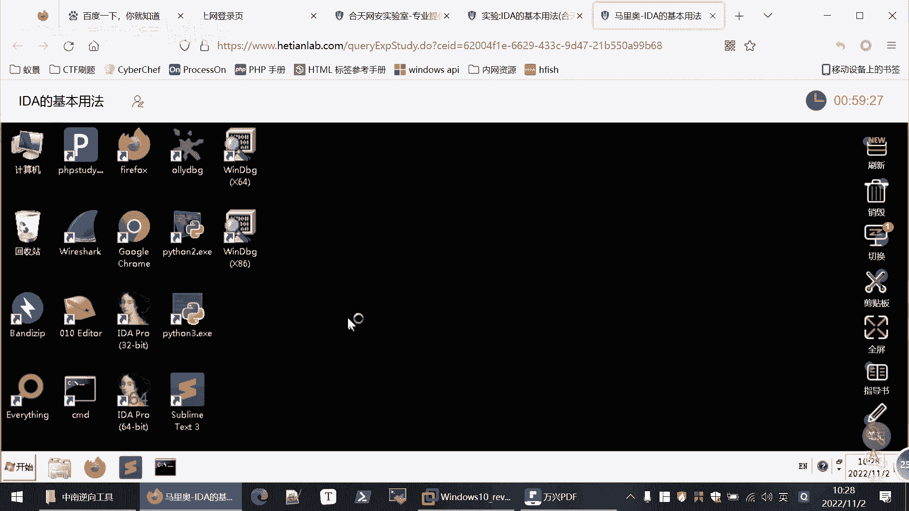
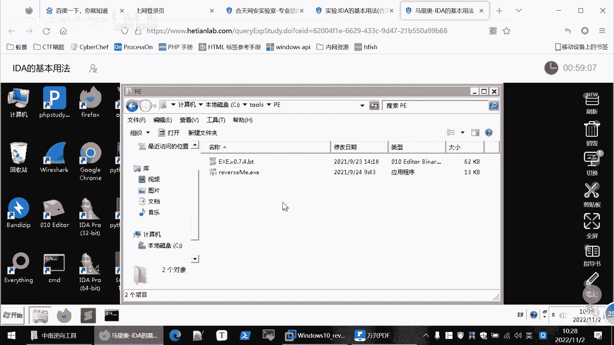
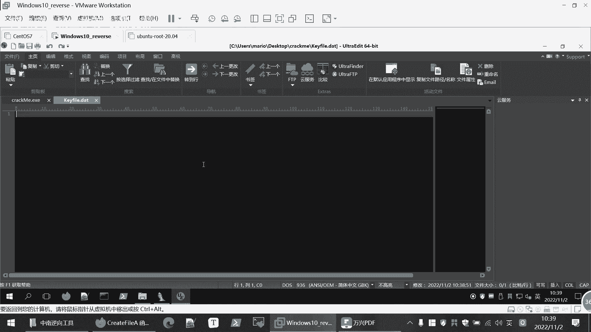
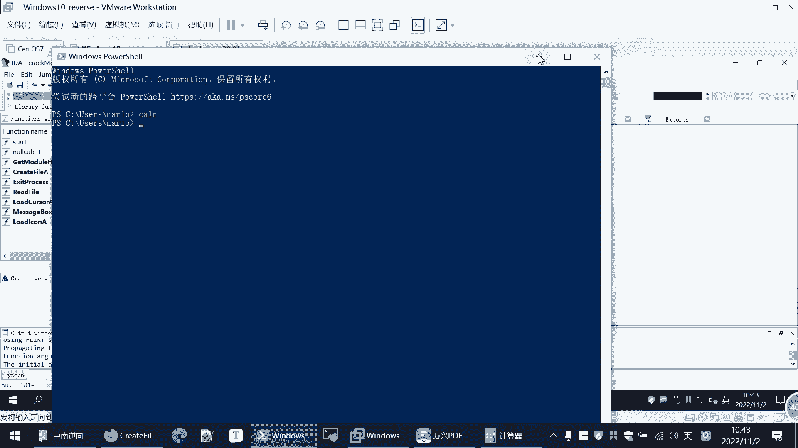
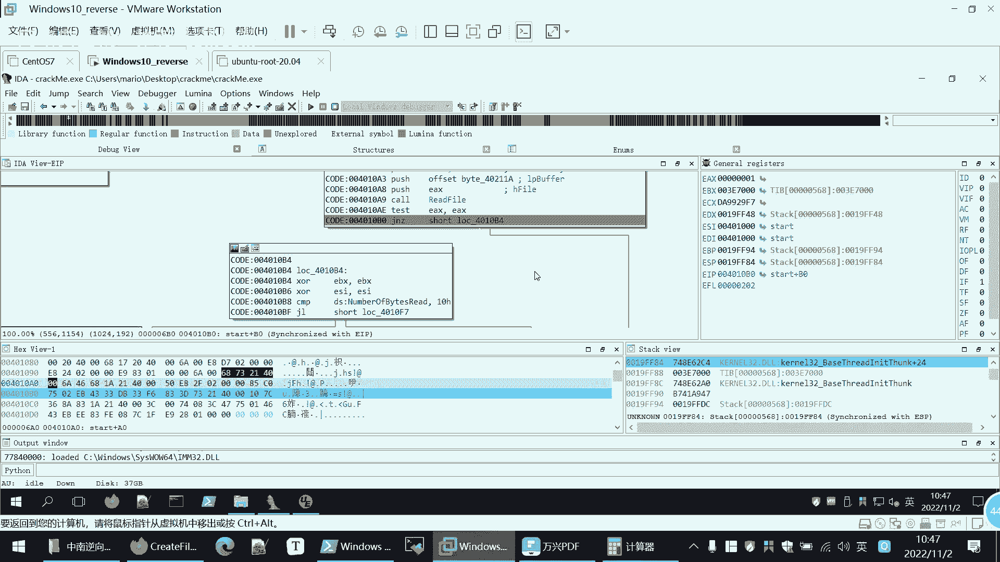
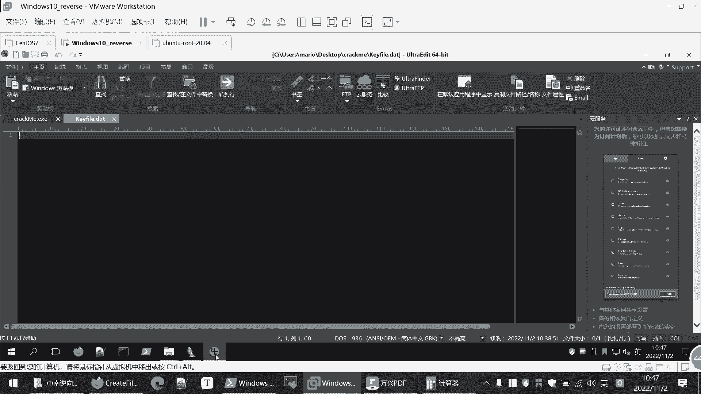
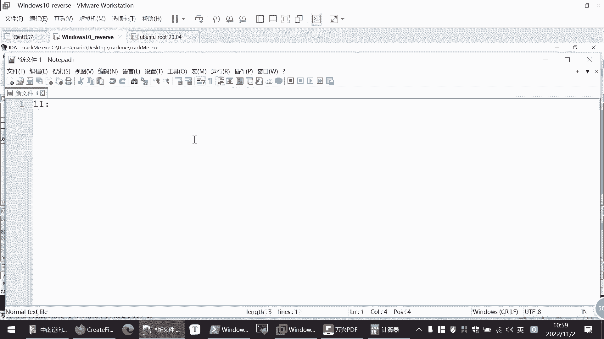

# 【B站最系统的网络安全教程】北大大佬196小时讲完的网安教程，全程干货无废话！学完即可就业，别在盲目自学了！！！ - P94：逆向工程--IDA Pro介绍及实战 - 网络安全就业推荐 - BV1Zu411s79i

本次课程的主题就是ida pro的一个介绍，ida pro呢首先介绍一下，后面是在实战演示一下怎么使用，那么ida pro呢就是一个交互式的反汇编专业版，或者你检查i d就可以了。

i da就是交互式反馈编，是目前最强大，最流行的一个静态反汇编的一个软件，这个软件其实是要付费的，但是也有嗯激活的办法，反正大家都知道i d pro它的功能是非常强大的，这些描述性的话就不介绍了。

我们看一下它的一些窗口，那么使用ida打开程序呢，会对打开的程序进行自动分析，尝试识别程序中所用的函数以及所用的一些库，还有数据结构，那么会呈现给我们这样一个界面，那我们边介绍的时候。

我们就边用ida来打开看一下，因为我们刚才已经分析出来，他是一个32位的程序，看到它是32位程序嗯，然后呢它是没有加壳的，所以我们可以直接进行分析，我们打开i da，然后我们open这个文件。

我们需要分析的程序，这里他会帮我们自动识别，这种自动识别一般都是对的，大家可以直接打开就行，大家可以看到这，这里面呢就是我们的一个主要的分析窗口，这是一个嗯程程序的一个执行流程，这是start吗。

程程序的入口啊，执行，那么执行到这里呢，就会有一个跳转，它根据运行时的一些情况，他可能往左边跳转，也可能往右边跳转，但如果往右边跳水，下面啊也有各种情况来进行一个调整。

然后呢这里呢是这个框是他帮我们分析出来的，一些就这个程序使用到的一些函数，比如说这是start函数，它就你点击它进入到这里，然后这边呢是一些windows api的一些函数，可以的。

还file app都可以定位到，你如果想看男孩子都可以定位，导致，然后下面这里呢是一个我们这个图的流程，图的一个缩缩，越，因为我们这个程序的刚开始给大家介绍，是介绍的比较简单，它的流程呢也是比较简单。

基本上我们在这里面看的也也是可以看清楚，有时候大家后面要分析的程序可能是非常大的，你直接在这里看到就是太多了，可能太久，所以可以在缩略图里面进行一个拖动，而定位到你所需要观看的地方。

然后正面是一些信息的窗口，有时候你比如说什么操作出错了，你会在这里可以爆出，下面这里有个pyth，就是i da呢，它是支持你编写python脚本的，可以执行一些python的命令。

那么我们课件课件当中啊，也是给大家写的，第一个呢是不同的代码块，这里的一个使用颜色进行一个区分，然后第二块这里是一些函数，另一个i d a所分析的函数，第三块呢是这里是一个主窗口。

然后这里是函数控制流图的一个缩略图，然后第五这里是一个脚本，然后主窗口当中它还有多个项目，我们看一下，这是我们刚才看的主要问题，还有这里可以看hx，hx就是16进制吗。

这跟我们用ue打开这个程序是一样的，可以看他16进制的一个情况，然后它的一些结构，因为我们这些比较简单，这些就基本上没有，然后import import就是导入，就是这个程序它引用了一些函数。

比如right fire这些，这都是库函数，这属于windows的库函数，并不是这个程序自己写的，是这个程序导入的函数导出的，就这成绩他自己写的函数就是start，当然复杂程序这里面导入导出。

就有更多的一个函数，除了这些窗口以外，这些窗口如果说不需要的，你可以点击叉掉，把它关掉也可以，那么有的窗口你还需要看，但是又没有默认显示的，大家可以在这个vu里面可以open stu。

你可以把一些别的窗口没在这里显示的打开，比如说我们这里后面要用string string创口是什么呢，它就提取这个程序当中出现了一些字符串，比如说这些字符串它会提取出来，然后在什么位置。

我们先放在这后面会用到它，这是对ida窗口的一个介绍，然后它的一些常用快捷键，因为给大家说多了，大家可能也记不住，其实最常用的就是f2 ，就是这些f2 呢就下断点，因为i da也是可以动态执行的。

包括我们后面的mod，其实它们的快捷键有很多都是通用的，都是同一套模拟器，f2 呢就是下端点，然后呢f7 呢就是单步步入，就是一步一步执行，执行汇编代码，一步步执行吗，如果说遇到一个函数括号一个函数。

那么f7 呢就会进入这个函数内部，我们看一下这个这里面是不是有有矿这个函数，这个函数也是可以点进去，就可以进入这个函数内部，这是f7 ，如果像这种不是调用函数，它就正常一步一步执行。

那f8 和f7 的区别呢相同点都是单步执行，区别呢就是单步步过，对于一个函数，我跨一个函数，它把这个当成一条命令，它不会进入函数内部，它直接执行下一条命，这是f7 和f8 的一个区别。

有的时候我们需要进入这个函数内部，查看一下这个函数就行了，这可能是我们很关键的一个函数，那么你要f7 进入函数内部，但有的时候这只是一个windows库函数，那我们了解一下这个库函数。

它的输入输出是什么就行了，就不需要跟进去一步一步执行，因为库函数一般是比较复杂的，那么不需要跟进去的时候，就是用f8 ，那么f5 呢就是查看五代码，因为我们这里看到的就是一些，这些都是汇编的秘密。

然后汇编命令转成那个c语言的伪代码，就是f5 f9 呢就是直接运行程序，他会遇到我们前面下的断点会停下来，或者说没有断点的话，会直接运行的程序结束，然后esc那就是跳转到返回到前面的位置，就退出嘛。

就是啊最常用的快捷键，当然还有很多的快捷键，这个因为这些东西说多了，就是我们不能像文科一样去背诵这些东西，就跟大家写程序一样不存在，我要把这些常用的函数背下来，都是自己写，自己用使用的过程熟悉。

然后有些不清楚的也是查手册，就是这样，然后呢还有一点就是显示地址，大家可以看到，直接我们打开它，这里是不显示这个他这个我们显示这个命令，但是不显示这个命令的地址的，所以这里给大家介绍一下。

怎么样把这个代码的地址给显示出来，就是在我们，这里option我们打开看一下，vin general，这里面在课件上也给大家写，我们勾选这个nine perfect这个前缀啊。

ok那么这个每个代码相比刚才呢，它的地址就显示出来，那我们这么分析的时候，就更好定位是哪一个代码，或者说你有时候跟别人协作的时候，你会告诉你，我分析的是哪一块，就是显示地址的一个方法，啊。

那么前面给大家讲了一下，i da的一些介绍的情况，那么下面呢就是一个实际破解程序，因为这些工具的使用，只有在实际使用当中才能体会到它的作用，才能熟练使用，然后这个破解程序呢也是可以。

在我们和天王实验室可以在线做的，我们看一下这个地址，啊当然之前应该用过这个黑玩实验室，就你创建实验实验机嘛，然后这里面也有一个教学视频，如果不太清楚的，也可以看一下视频，然后等待这个实验机创建。

那么根据这个网络情况，有时候会比较慢，要等一会儿，然后在创建过程中，大家用的时候可以看一下这个实验指导书，实验步骤啊，实验目的这些，那么这个实验呢，就是我们今天要破解的这个程序，大家在课后呢。

可以自己登上这个实验室来做一下，我们创建了虚拟机之后，这个整个的实验环境都是有的。

工具都是有的。

这idea以及这个程序。

这里面是，在实验指导书里面都会写案，我们要破解程序是在哪里，啊需要破解这个程序，这个呢就是大家课后自己去实操一点。

那我们这里呢就是在我们本地的一个环节里面，讲这样一句话，就是更快一些，不会受到网络的一个波动，然后大家课后的话，自己在我们实验室里面进行一个练习，实验室的这个实验的地址呢就是在这里。

好那么我们就开始分析我们这个程序，我们先把之前的，这些东西关了，包括把这个也删除了，我们从从头开始分析，走一遍流程，那么我们遇到这个程序呢，就是一个破解它，这个程序我们可以先试着运行一下。

当然如果你知道这是一个很危险的程序，你就不要直接运行了，那么我们如何直接运行这个程序呢，它会告诉我们这个valuation period out of date是吧，就是过期了，要我们购买这个品证。

就很多软件都会遇到这个情况，那么我们现在就是在不购买纯电的情况下，来破解它，首先呢还是使用studp来打开一下这个文件，那么这里就知道了，是32位的，然后呢是没有加u p x，没有加壳了。

因为u p s是最常用的课，后面会再给大家介绍一下，这个区段里面也是没有任何可乐信息的，那我们就直接进行分析，我们使用32位的id来打开这个程序，open fi，然后我们进行一个分析。

这个流程呢也不是很复杂，大家可以自己看一下，如果说遇到复杂程序吧，根据我们我们现在假设它是一个很复杂的，就不能够直接我们一个一个看，因为这个本身不复杂，那我们就可以像刚才呢我们在vue里面。

我们打开一些他这里没有默认显示的窗口，我们打开string窗口，发现这里面字符串是不是，那么这个字符串呢，revaluation period out of date，那么就是我们刚才直接运行。

看到这个字符串，那么这我们就要跟踪一下这个字符串是不是，我们点击一下我们跟踪到这个字符，这个字符串的地址，我们点击一下ctrl x ctrl加x，然后呢就会跳到这里，就是引用到这个字符串的地方是哪里。

用到了它，我们要跟踪进去，我们跳转到这里来，发现是在这里面使用了这个字符串，那么我们再看一下这个相关的，它附近的一些代码，大家可以看到呢就是从这里进行一个跳转，来跳转到左边，左边呢，就是显示一些信息。

然后呢这是一些字符串，是不是push入栈，然后扩一个函数，从这个我们可以知道前面push的是不是，我们这个下面函数的参数，就是把前面的值，前面这些量作为后面这个函数的参数，放到这里面。

然后再调用这个函数，那这个函数呢可能刚开始不知道什么意思，不知道什么意思的时候，这大家可以看到他这个经验吧。

这明显是一个windows的库函数，我们可以查一下这个库函数是什么意思。

其实遇到别的库函数也是这样的，我们不要进入库函数里面分析，这样的话效率很低，我们直接查这个库函数，message bo，那么这个函数就直接给我解释，它显示一个模式对话框，会显示这些消息嘛。

状态或错误信息，让它的语法参数，这样的话相当于是我们是正向的来看，会比逆向的来看会容易很多，所以像这些库函数直接就查一下，跟别的库函数这里都有，都可以进行一个查询，他就弹出一个对话框嘛，然后显示信息。

那么结合我们刚才的职业运行，是不是可以知道，那么这里面呢实际上就是弹出了这个valuation，period auto date，就弹出这个信息，那说明如果说程序直接运行的话。

是走的左边这条线是不是要弹出来，那反过来说，如果说要使这个成绩能够破解，那么它就应该走右边的这条线，因为左边这条线这里就没有一个跳转的判断呢，它都是顺序执行，它就必然要出错。

所以这里的关键点就在于这上面，这部我们可以在这里下个断点，就在跳转之前，这是问题的关键，是目前我们知道问题的关键，当然有可能前面的代码也有有，那么后面可以再分析，这一切那个步骤啊，在我们实验指导书。

在我们现在这个课件当中，也就给大家详细写了，是吧，然后才退出进程，然后我们看一下这里是关键，那么这里面既然这里面，我们就分析一下这附近的代码，不要分析太多，如果你看的太多或者不相关的，你就很容易绕进去。

半天找不到一个嗯逻辑，一个节奏，那么这里呢它减z就是不相等，就跳转，是不是那部下的是什么不一样呢，是上面标明是ex和这个0f f f就是-1 ex，就寄存器的值和这个值比较是否相等，比较是否相等。

我们再往前面看，前面是框，这又是个库函数，那么这个ex呢就是这个库函数的返回值，但很多时候，这个函数的返回，是默认放在ex这个计算机当中的，这个大家就是在我们这个汇编语言，这个里面会简单介绍一下。

所以说那么现在是不是我要看一下create fa，这个函数是干什么，这个还是你清楚的就可以清楚的，你不要他进入函数内，他这不函数，我们直接进行一个搜索，那么这里面就给我们写的，它是一个打开，它是。

它是创建或者是打开，这个不太不太稳定，它是创建或者打开文件，或者是一个输入输出设备，这个函数的作用，那么前面的这些push是不是就是这个函数的参数，你如果是仔细分析的话。

你可以也可以下面对着这个函数有哪些参数，每个参数什么作用，可以仔细的看一下，那么一般情况下呢，我们是不需要看得这么仔细的，我们可以先大概看一下，因为这里我们是否需要深入的看看，现在还不知道。

我们现在大概了解它的功能，把程序把整个程序的一个大致的功能了解清楚，然后后续再看哪个地方是我要仔仔细分析，他每一个代码都要进行分析，如果你一开始就每个大白金分析，那就就是工作效率就很低。

那么这就是它的参数，那么这里呢就传入了一个file name，是不是file name，这个它的数据的值呢就是可以发点d的，这也是出现在我们一个我们来联发现的，他用了一个字符字符串常量。

接下来都是使用的一些字符串常量，他就要导入这个文件，是不是，然后调用create file a，也就是说要打开这个文件，那么现在我们就可以知道问题在哪，因为我们现在这个文件里面。

我们刚才直接运行的是不是不存在，它只有quick quick me，点击f c e这个文件，它是不存在可以fail。date这个文件的，所以他就出错，然后他就跳转到左侧，这时候我就可以想。

如果说我有这个文件，那么它是否就会跳转到右侧，我们这里可以测试一下自己的想法，我们新建一个文件，那么文件名呢就是刚才看的文件名可以fail，点d，那么这个文件呢是没有任何内容的。

我们优优e打开来看。

这完全是一个空文件，但是不管我们先创建这个文件，然后啊我们再把这个程序我们再运行一下，唉现在给我们显示就变了，原来是这个out of date，是不是现在是not valid是无效。

那说明我们创建的这个文件它是起到了作用的，至少是改变了它程序的一个执行流程，那这个可以fail is not value是在哪呢，我们按照刚才的方法来看一下，我们在这个字符串传口中看到还有这一项。

我们点进来看一下，kefile is not mine，sorry，就是刚才显示的内容，同样的我们ctrl加x，ctrl x一使用这个快捷键，然后呢就是使用这个字符串的地方，我们点击进去看一下。

还在这里进行一个使用，那么这里哦我们可以先在这里下个断点，然后作为一个标识，我们这里把这个地址给显示一下，好是在这里进行一个使用，那么到这里使用，大家可以看到有三个箭头，说明三个方向都可能会走到这一步。

相当于这是我们目前程序运行的一个终点，那么程序现在现在是不会运行到这儿了，所以现在会运行到这里，就这里是我们能够确定的，我们确定程序会到这，然后呢最后又回到这中间是走哪条线，我们是不确定的。

就前面的流程我们已经知道了，是不是，因为前面只存在一个跳转的地方，我们加了kefile。date就会跳转到右边这里，那右边的就是顺序执行，这里面也就调用一个函数，然后做一个判断。

判断有不同的分支就可能到这里，那具体哪个分支到这里呢，我们现在还不是很清楚，所以说我们要看一下这一段代码，这种少量的就是可能7878行的，这种汇编语言，我们可以逐行的看一下。

这里面的这个look 40109 a，这是标签，这不是一个代码，我们前面跳转的，这是相当于一个地址嘛，跳转到这个地址这里，然后第一个代码，这就是几个破解，这是传入参数，把函数的参数放到栈中。

然后呢调用这个函数，这个函数同样的也可以查一下，当然不查也可以，基本上你看到这个名字，你也知道是什么意思，read file，我读文件，然后这里面是它的一些参数是吧，这里面写的number of b。

number of beats to read，那么这是i da给我们自动加的注释，就是i da我们识别出来的这个参数是什么意思，那么它使我们使用工具，就要利用它给我们的帮助嘛，它识别出来。

我们就直接看number will be to read，这个顾名思义就是我要读多少个字节，是不是这里是46h46 h h就是16进制。

我们看一下16进制，46h也就是70 十进制的70。

说明他要读70个字节，当然你如果详细的看到这个read file，这个库函数的意思，它实际上意思，它实际上这里是代表读取不超过70个字节，就你的文件如果特别大，我也只读取70个，如果说很小。

只有一两个字节，我就读你实际的字节，这是这是一个安全的函数，它都要限制你读取的长度，这个大家可能也了解过一些啊，战役出的一些问题，比如c t f里面胖，是不是如果你不限制它读取的这个变量的长度。

它就会那么攻击者就会任意的输入这个内容嘛，然后就会造成战役出，就会控制你的一个执行流程，所以说这里要进行一个限制，他最多读取70个字节，就是零差4646a h和字节，然后毒血之后就进行了两种跳转。

如果跳转到右右边呢，那就必然走到失败的这个环节，如果跳转到左边呢，那就有多种可能，其实这里面我们就可以猜测到，是不是因为我们的kf 2点data里面没有内容，所以导致跳转到右边，因为如果说有内容的话。

应该是在左边，他要对这些读书的内容进行一个处理，现在是怎么处理，我们先不管是吧，因为逆向的话后面也会给大家，就就是他不是说我们数学公式，第一步必然得到第二步什么的，还有有的时候要根据一些经验来进行一个。

猜测判断，所以我们可以可以认为就是没有输入的时候，我们文件没有内容的，它是走到右边这里，那么如何验证我们的猜想呢，其实我们现在i j它本来是一个静态分析的，但是它现在也集成了一定的一个动态的功能。

有简单的动态分析程序，我们可以直接在i d e里面看，我们可以直接运行一下这个程序，这里我们首先要选择一个这个分析器，我们选择local windows第八个，然后我们点击运行。

因为我们之前已经下过断点了，所以说它会它不会直接结束，它会断在我们下断点的地方，我们直接点击运行，这是这是程序的一个主要窗口，这里是16进制，就可以跟随跟随内存中的数据。

然后啊这些线程这些我们不用看这个模块呢，我们也不用看，我们把它关掉，这里是寄存器，e s e x这些e s p v p这些寄存器当中值，我们现在呢我们是由于我们在前面一步判断，是影下的断点。

所以它断在这里了，40107b这个地方，然后这时候注意da给我们一个提示，他在跳舞是不是右边的这里在跳，说明了他下一步不要跳转到右边这个分支，看闪烁的这个分支是下下一个跳转的。

我们可以按f8 或者f7 都行，我们直接下一步，那么他果然就跳掉了这个分支了，然后我们继续执行执行，不行，唉这里它是给我们跳转到左边的分支，那我们看到，怎么继续执行。

你把这个先关掉，那就是它不用判断，就是keep fig里面有没有内容，所以说就是要靠我们的猜测来判断，然后来加验证来进来明确我们的判断，这是我们做逆向分析的一个过程，那么现在就跳转到这里面，是不是。

这个时候呢我们可以先把它关掉，直接点击这里是停止，那说明了程序，目前我们就依托于我们现在的直串的，这个开发点，data，没有任何内容，那么程序呢就会走到这里，同样这个地方呢也会进行一个跳转。

我们在这个跳转的地方下载断点，那么前面这些地方我们可以在f2 就取消断点，我们就不用再下断点了，我们直接断了关键的地方，现在程序是到这我们就清楚了，然后最后怎么到这儿呢，有可能直接到有可能啊。

经微信一系列的运算来到，都有可能，这个时候我们可以再运行一下，看看在目前的情况下，它是一个怎样的一个执行流程，那么直接就跳转到我们下断点的地方，因为前面断点已经取消了，那么是右边进行闪烁啊。

那么就走这个右边这个分值我们可以执行一下，按下f8 ，然后执行就到这里面，然后调用这个弹框的这个函数，就会弹出这个窗，k flob，那说明啊问题的关键就在这一段代码这里。

是不是现在我们肯定是不希望他走这个右边，因为这里面就告诉我们，这个k file是无效的，我们现在就要使这个kefile是有效的，那么就希望他走左边，那这里是怎么判断开发有效无效的，大家可以看到这里面啊。

这x y异或运算异或运算最关键的是cmp，就是比较还是比较，这是js就是data s就segment数据段，这是基地址，在选址的方式整合后面的是偏移，就是这个地址出的值要和10h做比较。

l l就是nice嘛，有小于的话进行一个跳转，跳转到4010f7401 ，这里，所以说我们要读取的内容呢，就前面这里判断，就要让它大于大于等于这个1年h10 ，h就是16。

是不是他才就是不会跳转到这个无效的地方，我们可以先测试一下，这里面就是number will be read嘛，就读到的字节数，因为我们现在这里面呢是没有内容的，所以他得到自己数肯定是小于10h。

也就是小于十进制16的，那么我们这里可以随便给他输几个123，a b c d e f g，11，然后我们保存，然后再重新运行一下，还是到这儿，这个时候呢我们看一下这个地址的值。

我们点击一下就会给我们显示，我们首先放在这i d就给我们显示是多少，0a h a就是十嘛，那我们这里面是不是正好十个，因为看这里面你点击到一旁边就是二楼，你点击到g旁边是11，那么只正好是十个字符。

说明呢，说明这里比较的就是我们文件当中的字节数，和这个1年去做比较，那么他现在油门输的比较少，它还是跳转到无效，那说明我们输入的内容要比较多，要至少大于16个，那么现在我们先把这个停掉，然后现在还不够。

我们再随便输入一些内容，让它比较多，现在肯定是大于16个了，已经到39，就有38个字符了，然后我们再进行一个运行，同样它会直接断在我们这，然后这个时候呢它闪烁的就是左边的线，那说明我们的判断是正确的。

那我们再静态的看一下，然后这里面我们也分析清楚了，那我们把这个断点呢也可以进行一个取消，那么就我们知道，只要在我们可以说一点data里面，填入超过16个字节的数据，就可以跳转到左边。

就不会直接到kfl无线，看完左边呢，这就是正常执行的，我们先不用管，我们可以在这个判断的地方，这个跳转的地方做一个断点来分析一下，它是根据什么来进行跳转，大家可以我们先大概看一下这个流程。

它跳转的有两种情况，往左边走呢，大家可以看到是一个循环，又走到这里，是不是，这就像一个循环，我们添加是个-2，a等于一，a小于十来加加这些或y啊，a小于十，这样一个循环，然后呢右边呢是啊，这就退出循环。

然后进行执行，执行，然后有左右两种情况，然后呢左边右边这里就kefile是无效的，我们让他到这里，然后到左边呢是继续执行这个，you really did it，这是成功了，那说明到这里之后。

我们要希望他走左边这条线，就是大家在进行分析的时候，也要结合一定的只有自己在写代码的一个经验，因为这些代码都，这些程序都是由代码编译生成的，这就是一个啊循环的一个结构，那么我们就先遇到这种循环的时候。

大家可以先不看循环内的内容，由于这个循环内容可能比较复杂，一时半会儿看不明白，我们直接在最后这个关键的跳转的地方，做一个判断，下一个断点我们把这个断点先取消掉，我们看一下这个跳转的情况是什么。

我们再次再次运行诶，直接因为前面的断点都已经取消了，那么直接运行到我们刚才相当于这个地方，他现在呢告诉我啊，是右边整体删除就跳转了，这key fire是无效的，那么这段代码我分析一下它是根据什么判断。

它是比较e s i和八的值，那么e si是多少，我们看一下计算器，看e s i是零，那么nice 0是小于八的，所以进行一个跳转，也就是nl e s s，那么这里就是。

说明我们要尽尽量使e si的值大于八，或者是大于等于八，是不是，那么它才会跳转到左边，然后后面才能够破解成功，这是我们的执行一个流程嗯，那么我们先休息十分钟吧，文11。05再讲好吧，大家有什么疑问的。

也可以跟我交流一下，如果没有这个他们自己实操是玩玩的战力对，因为持仓可以继续装备，在铲屎，你是实验室，也是就提成这样环境对我的意思就是大城呃，这个课上完了之后，你们告诉告诉你一个平台的网址。

让你登到这个这两个实验室，让他们自己也做了啊，就是讲完了之后让他自己看不，这个不是吧，那可以两个实力真的让他们学生自己非常帅，一会我们租客客家人，前面诸葛就是这样啊，他对他那女的是一个人在干嘛。

如果他在家里切磋的时候，已经有一个课程了，所以他们也没操作过，当时我给你打对对，就宋宋老师带他们到我们认知实习的时候讲过，这个不是讲这个内容，是通过前十，你说对一个平台，那谁是外部，外部的。

主要是在外边的，应该是到时会让他们自己练一把，就把这个网址给发到他们群里，我们课件里科技的那种，嗯哼，哦哦哦我的意思是他说的那个是空的那个表，那个表头李宁商城的这个就是一个我懂你意思，你学会了。

一天整出一个新的人答应。

