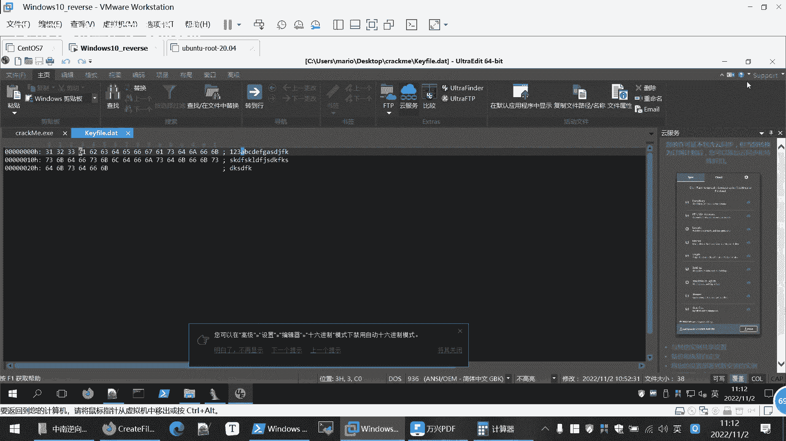
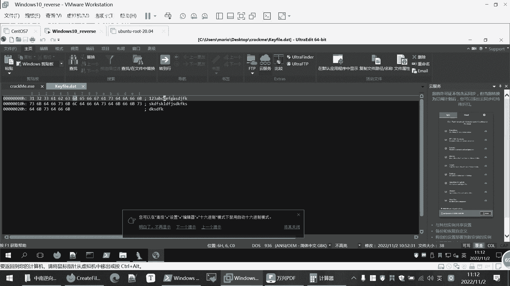
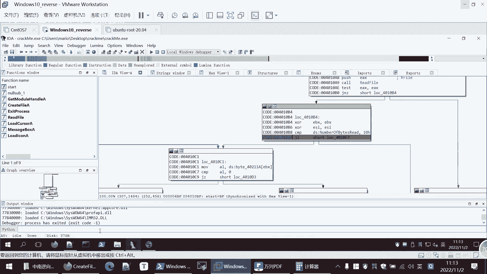
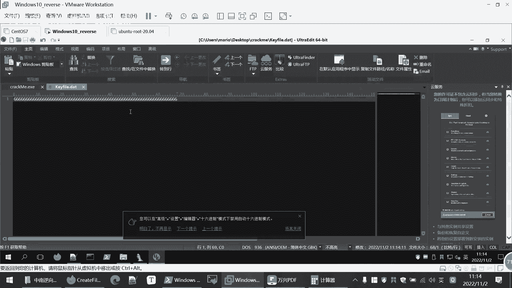
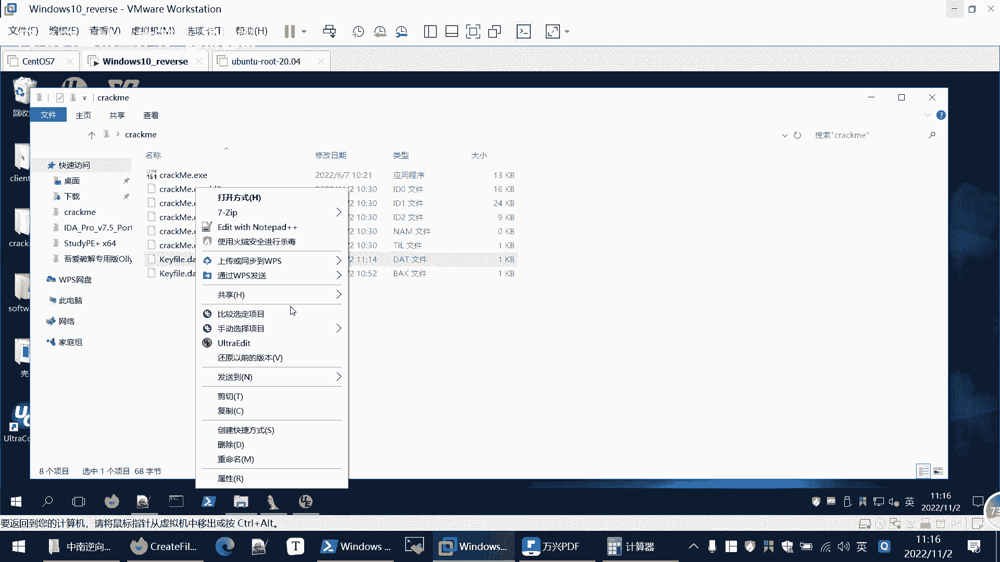
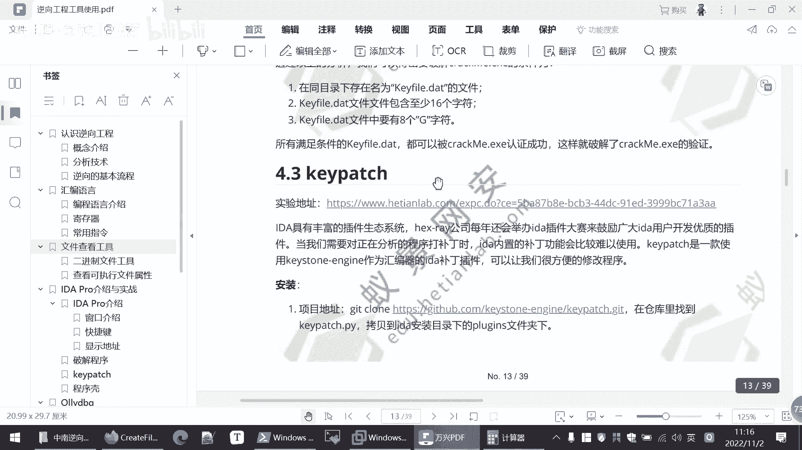

# 【B站最系统的网络安全教程】北大大佬196小时讲完的网安教程，全程干货无废话！学完即可就业，别在盲目自学了！！！ - P95：逆向工程--IDA Pro实战（二） - 网络安全就业推荐 - BV1Zu411s79i

11点过五分，那我们继续上课嗯，其实其实刚刚讲那么多，大家有什么意见，有什么疑问都可以给我反馈，因为这个逆向的内容呢，它整体它就是比较难一些，所以如果说啊有大神的话，那么觉得今天的内容就是比较基础。

比较简单，但如果说之前没有接触过理想的话，就可能觉得啊好多都不懂，看大家这都是正常的，当然有意见有意见，有疑问都提出来，那我们就接着啊，上节课都有讲，那么我们这里面就知道，它关键是要比较这个e si。

看这个e s i这个寄存器的值相当于零和八，比较要小于八呢，就说我们k file是无效的，那么我们呢现在就知道了，就是要通过改变kpl的内容，是这里面不是我们随便输入的内容了。

要是一些特定的内容通过输入特定的内容，是这个e s i大于等于八，那么它就会走左边，然后呢就会后面就会执行成功，那么我们先把这个退出调试，我们再看一下，他这个e si的值是由什么确定的。

那么前面我们知道这个循环呢，我们之前还是没有看，那么现在呢就需要看一下，因为之前都没有涉及到这个e si嘛，所以说我们这个猜测应该是，由这个e s循环来决定，这e s i的值，因为循环这里之前。

我们已经读到了这个文件的内容嘛，那么这里面循环是做什么呢，我们看一下，首先呢是比较这个ebx的值，那我们在调试的时候来看一下，更好的理解，在这里下了断点，然后我们调试，然后这时候我们一步一步执行f8 。

然后，这个时候大家可以看，我点放在这里就可以看到它是吧，这个40211a的值，这里的地址给读到了我们的a l当中，图大是嘛，31，那么现在文件当中是多少，啊，是30也是30多个字符。

然后他呢来比较a l是否等于零，来决定这个跳转的方向，从这里就可以看到，a l呢就相当于一个判断循环是否退出的，就相当于我们for循环里面的i，是不是看i等于零，i等于零的话，就进行一个退出是否等于零。

然后现在当然它是31是不等于零的，这个三一是那个16进制的意思，然后他在这里面它是比较a l和，447h之间的一个，值是否相等，这个bl这个ax e x这就是寄存器ex 32位，如果是16位的。

这个处理器就是a a x吗，如果是八位的，就是a a h a r这里的a啊，就是说我现在虽然是32位的，但是对于八五十六啊都是兼容的，bl就是第二ex的这个最低一位l就是no吗，no的意思。

然后就是第一把位嘛，然后h就是high就高把位这个意思，然后就比较和四七是不相等，那么现在呢当然是不相等的，三一和四期当然是不相等的，那么来这里我们直接到这里面，不相等呢就会跳跳转到这个。

我把这里缩小一点，跳转到这个44010d0 啊，跳转到这，当然这个就很明显了，跳转不跳转的区别就是是否执行这个i n c，e s i这个命令，其他的都没有区别，其实跳不跳过这条命令，那这条命令是什么。

i n c就是自增，相当于i加加这样自增1e si的e si是多少，是你是你说明执行这个命令，e si就自增一零就变成一，一就变成二，那么结合我们刚才最后面要判断，e si的值要大于等于八。

这说明是不是，就是我们尽量要让它执行这个i n c，e s i这条指令，就尽量不让它跳过，那么如果说你每次都执行的话，那1e31 直自增，那就会大于等于八，所以这里呢我们的思路就是要让它跳转。

让它直接往下不往右，那么让它往下接n z就是跳转n就是not，这也就是这二个学习下就相等的意思吗，它不相等于调整，那么c m p跟a l l就要相等，需要尽量是a2 的值，等于这个479。

那我们继续执行，那么跳转来这里继续左哎，又回到又回到这里了，又回到循环了，现在变成了三二，那我们继续执行，大家当然是不等的了，又回到运动就变成三三哎，是不是好像有一个规律，这个a l的值，继续执行。

又变成六爻。

这里呢我们用16进制来打开这个文件，可以看到，那么我们这个文件呢，是不是就是31323361，那么下六幺下面是一个是六二，我们再执行一下。

看一下，现在是牛羊龙，再循环一遍，诶右边六二通过这次循环就知道所谓的a的值。

就是每次读入我们这个开发点data里面的，这个每个字符，然后它显示值的就是这个字符的16进制的值。

那么我们的目的呢，就是要使这些值尽可能的等于47h47 h，这里面来定一个标识，它在字符里面就是大g，那么如果说我这k five的data里面的内容都是大g，那么是不是这里面就是相等。

然后就会就不会进行跳转，就会执行e s i就会自增，这里面也我们也可以手动的改一下，我们可以赢，我记得应该是可以编辑这个内容的，六二我手动编辑一下，编辑选四期，然后我们继续后面的执行。

那么这时候呢就相等，那么就往下走，e s i原来是零，现在执行这条命令变成了一，那这条命令多执行几次就会变成八九十，那么后面呢就可以，这里比较的就不会进行这个错误，跳转那个k file无效的地方了。

那么这里的程序呢我们基本上就分析清楚，所以说现在的目的呢，我们刚才看的这个k p一有两个条件，第一个呢是它的字符要大于等于16个，第二个呢他要还有很多个g，所以我们这里进行测试的时候。

那我就输入很多个大g进行一个保存。

然后我们再运行。

这里啊现在读的就是47h4 期了，因为这都是大g这个文件里面没有别的字符。

所以他读每一步都是四期，然后呢就会执行e si字母加一变成了一档，现在我们再执行一下u到e s在这里要变成二，要多运行几次，是不是会变成345，这个循环我们就不一步步循环了，我们直接点f9 跳跃到这里。

让他走出这个循环，这个时候e si就变成了四四。

因为我们输入了非常多的这个大金。

这时候e si再和八比较，是不是就会大于八，这个箭头进去，左边灯亮了，闪烁了，那么它就会跳转到左边，然后这个窗口的函数调用，那么就会给我弹出这个窗口，比如redit。

那么这个验证的文件我们就完全的弄出来了，课件当中的这个过程也给大家写，它的精确条件就是最少要含有八个这个大g，这个时候因为我们已经有了这个大g文件，如，如果说我们直接运行这个。

他就不会报刚才的out of date或者是无形，sorry啊什么的，这样就破解成功了，所以说这个程序它所需要的验证文件。

用同样道理，其实也可以，或者其他程序的一些验证码呢，其实也是同样的，他怎么验证码，他怎么判断你验证码是否正确，他就把你的验证码读进去，然后经过他的一系列的运算，然后再进行比较。

这里呢就是比较这个大g的个数。

要求大于等于八，啊这是一种方法认证的方法。

