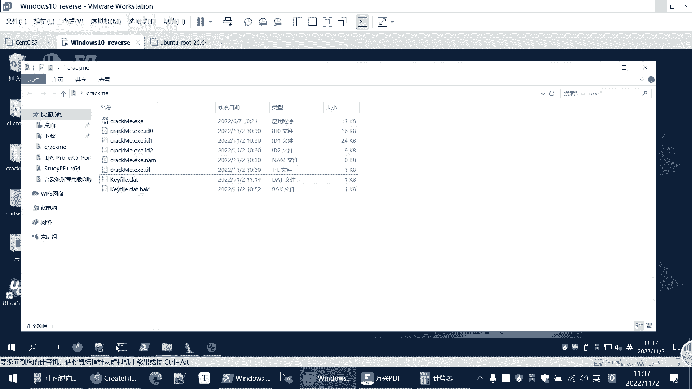
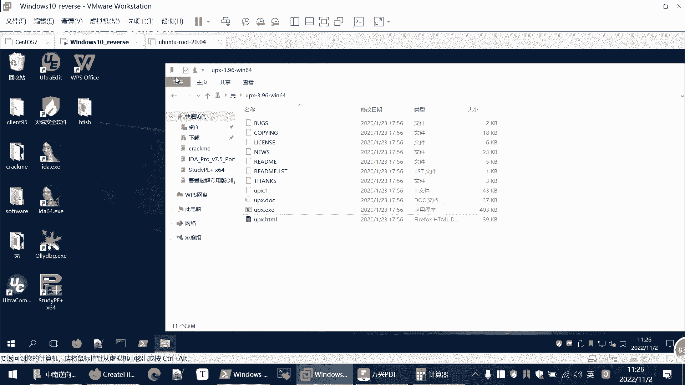
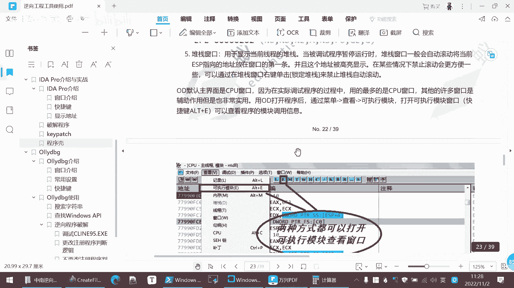

# 【B站最系统的网络安全教程】北大大佬196小时讲完的网安教程，全程干货无废话！学完即可就业，别在盲目自学了！！！ - P96：逆向工程--keypatch使用 - 网络安全就业推荐 - BV1Zu411s79i

但这样的话我们每次运行这个程序呢，就要带上这个kf 2点date，除了这个之外，还有一种呢就是我们可以修改程序，这里面呢就给他介绍一个key pet ket，是一个给我们这个程序打补丁的一个插件。

那么我们后面的内容快一点，这个当然在我们实验室里面也有它的项目，地址呢，是这个怎么怎么用呢，就把仓库里找到k开始点pl文件，然后拷贝到ida目录里面的这个插件文件夹下，然后启动id就可以。

这个插件就有了，插件有了，然后我们怎么用，我们这里给大家演示用一下。

那你先我先讲啊，先把这个关了。

我把这个加个一，那么现在呢就没有开发点data这个文件了，就直接运行，这是我们最开始的情况，我们想更改这个程序，让他不用读这个k h r t也能够运行，也能够直接到我们最后希望的这里，这个时候呢。

我们就因为刚才我们已经对程序分析清楚了，我们就直接修改一下，我们知道在第一步呢，没有开发点data就会跳转到左边，但是为什么呢，jn z进行一个跳转，这个时候你想我如果说改变它的判定条件。

并改成jz跳转，那么是不是就会逆转它的一个判定，是不是它本来你改成jc了之后，他本来到左边的就会到右边，那么怎么改呢，我们点击这条命令来点击右键右键，这里有个kpad，因为这个插件我已经装过了。

和直接用点击这个patch，然后呢这里面我们直接把这个jn z改成jz，那我们点击patch，它后面还会自动提示，我们要不要修改后面的指令，我们就后面的命令就不改了，取消我们只改这一条指令。

然后我们这样运行，我们在这里下一下一个道理，这样运行，啊这里还不太行，因为我们只是修改了，并没有保存，同样的道理，就是我们这里是在相当于i da的数据库里面，修改的，并没有真正的修改这个程序。

我们先把所有的修改改完之后再保存，然后同样的下面这里这个判定不用不用改，这里面是不是本来是读不到这个文件内容，是直接跳转到这里无效的文件，那这里也可以进行一个修改，是吧，改变它的判定。

你只要加个n就行了，n就是否定嘛，它有的有的，那你删除没n的就加n，那么这就是一个改变了他的判定，减n l l l l是小于嘛，不小于就是大于等于g1 g就是great大于等于，这个判定就改了。

那么它就会从这里走，这里读不到文，他这里同样e s i肯定小于八的，因为我们没有这个文件内容，是不是，那么这里的判定也可以改一下，这就是给大家写的，要改这些命令，每次改的时候呢，你去改一下。

你后面再弹出提示，你修改pc，你不用再改，不要改后面的指令，修改完后呢，我们选了，我们只改了i d a的数据库，其他i da对这个程序的一些记录信息，并没有改程序本身，那想要改真正的改变程序代码呢。

需要保存一下我们的修改，我在editor里面有个past program，然后应用，这时候的我们可以创建一个备份，那么这是我们改变后的一个程序，这是我们原来原始的，你们再打开这个文件，然后运行。

唉key value is kefile is not value，那说明我们就是尽管没有这个可以发点data，这个文件，我们前面下来一嘛，但是他也不会说out of date，说明我们的改动是生效的。

那么刚才他没有到最后的成功了，说明中间没有改，完全我们可以动态执行一下，嗯嗯这里是正常的，说明这一步呢也要进行一个修改，是不是你再看一下，就是我们不改动之前呢，它是往左边走，先改动之后呢，它是往右边走。

所以这里面也要进行一个修改，这里面同样的我们，改一下就行了，然后呢进行一个保存，现在这就是修改过的软件，就不需要任何的条件，直接就能运行，这样就是实现了对这个软件的修改，所以说这就是我们看一下两种方法。

一种是我搞清楚它的一个验证条件，然后我制造一个文件能满足他的验证条件，第二种呢就是我直接修改这个程序，使用kpatch这个插件来修改程序，然后最后呢在这个ida部分给大家介绍一下，我们的程序壳，就有了。

程序会在外面加一个，有的程序会在外面加上壳，就本来这个文件是这样，那加壳后呢，他就把e s e文件压缩，然后在外面套层壳，它执行的时候呢，这个noa部分把这个e s e n加到内存当中。

然后解压缩来执行，这样你直接分析的话也是分析不出来的，这个最常用的一个可能就是u p x啊，大家可以使用一下u p x这个工具，我们这里给大家看一下，啊这个就分析完了，我们把它关了。

这是一个cctf的题目，就是先给大家看一下，首先呢我们还是用cp来分析一下，他还是64位的文件，然后它这里的文件类型呢是unknown，不知道让我们看看别的信息。

我们注意到这个区段里面呢有很多u p s，就说明它是一个u p s的压缩壳，如果说我们摩托可直接进行分析，这是64位的球，球们使用ida 64来进行分析，我们打开这个文件，你看直接这个文件呢也是啊。

看起来啥也没有，中主要呢中间就调用了一个函数，跨这个函数，这个函数是什么呢，大家可以看这个所谓的就是啊非常的复杂的，然后你如果直接这么分析的话，就走进死胡同了，就分析不出来了，因为这个题是加可能的。

是不能够直接这么分析的，我们把它关掉，我们要进行使用这个u p脱壳工具，来进行一个脱壳，大家可以把这个用这点。

加入到我们的环境变量里面，然后就是在任何地方都可以执行u p x的命令，我们打开cmd，在当前窗口打开cmd，我们使用一下u p，这点u p s调用的就是就是这个，这里是给我们的一些使用帮助。

让我们对这个程序来进行脱口，怎么talker u p x杠d就是解压缩，因为这压缩er吧，解压缩就talker cooled，就是输出文件，输出文件就是随便吧，这个2。1x c。

那么第二点ex也就脱壳后的程序。

然后我们再使用dna来分析，我们这时候呢打开2。1x1 ，这个程序就正常多了，然后呢这里面是flag，这是w cctf的一道题，一道嗯，反正你只要会脱壳就很简单，如果不会脱壳，那就肯定做不出来。

所以说这是一个简单的脱壳，嗯这详细的步骤也是你们写在课件当中的啊，这对ida的一些情况的介绍。

