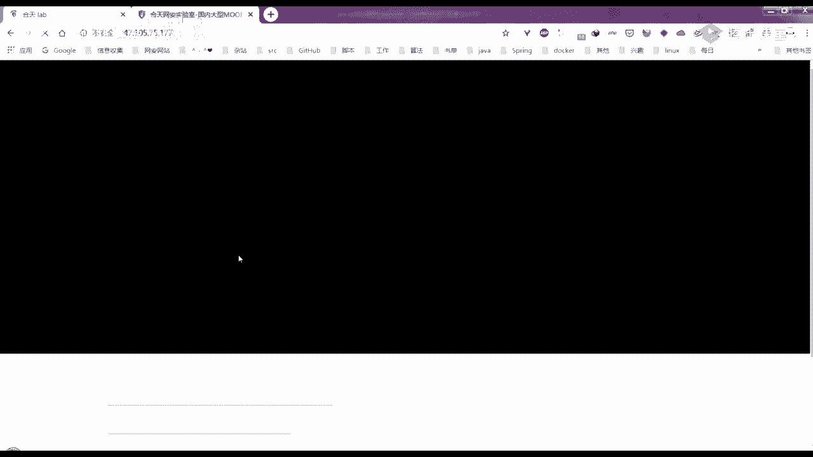
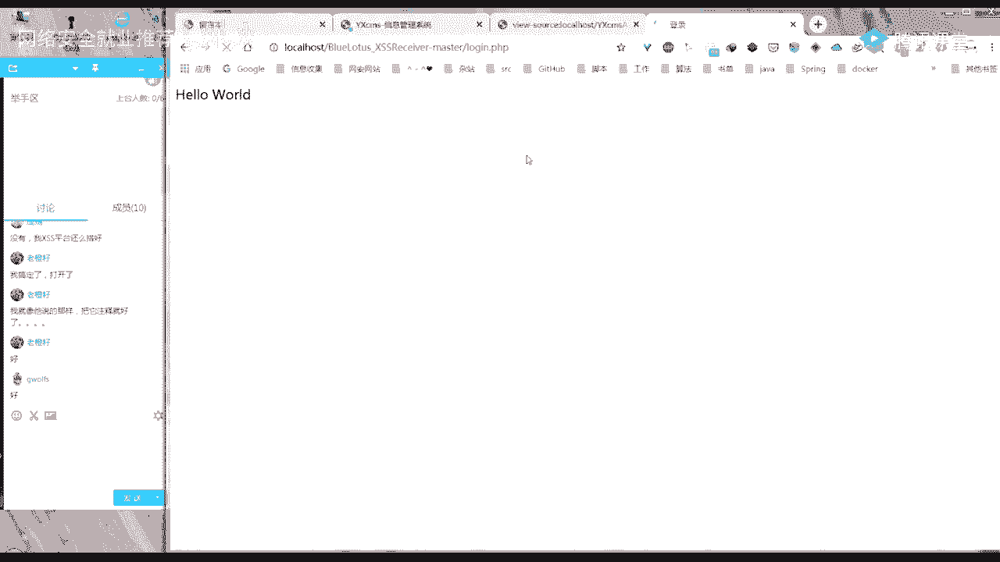
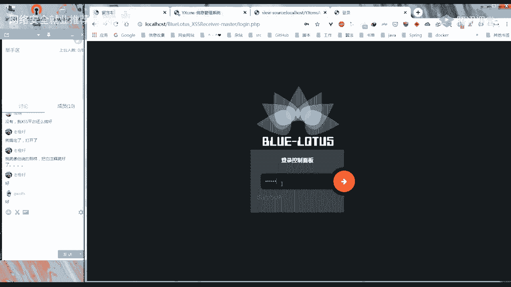

# 【B站最系统的网络安全教程】北大大佬196小时讲完的网安教程，全程干货无废话！学完即可就业，别在盲目自学了！！！ - P9：第7天：课程考核讲解 - 网络安全就业推荐 - BV1Zu411s79i

人家都没有放假的概念。

你们现在能看得到我的屏幕吗，如果看得见我屏幕的话，就打个一，是你们最后那个trs拿，最后哪个xs，你这是不是，哦我刚才自己做了一下，就刚才七点多钟的时候，最后这个吗，就是这个i这个与合法输入，最后两个。

那个游戏一共有几关，一共其实应该是有20关吧，好像但是他这里的话就只有只列了这么多。

这个。

这个存储型xs这个吗，你们课后有做，就是那几个实验实验室的实验，大家有错吗，第一个应该还是不难的吧，就是第一个这个存储型xss，我好像之前也做了一点点，第一个的话就是嗯他没有进行什么过滤。

三个实验都一样的对啊，他实验场景是一样的，但是它的嗯就是那个嗯，从从第一关好像是到第九关吧对吧，第二个这个存储型的话，它其实注入点在你就可以各种去试一下，然后他其实是在这个链接，这我们可以，插入一个。

这样插入之后再发布，他就有一个yee弹出来，那前面这个反射型的xss。

这大家都就是已经能全部做出来了吗。

如果能做出来的话，有人愿意分享一下吗，反射型的最后两个，那反射型最后两个有同学做出来了吗，如果有的话就扣一下一呗，没有的话就打一个二，最后这两个都没有做出来吗，就是后面这两个，最后个不会。

最后一个不会还是两个不会，最后一个不会啊，那你可以给大家分享一下，倒数第二个嘛，就是这个h这个这道题可以吗，我点这个举手的话，你们是不是自动开启去，你们是不是就可以举手了。

举手的话就可以能听得到你们的声音，你要不要来讲一下g wolfs，我也不太会读，啊你是输入的这个是吧，这个实体化，嗯那我那你看着我打一下啊，看看就对不对，就直接输入，要输别的东西吗。

还是就直接输入javasque ra，alert，xs，然后呢，然后把它们多进行一个实体化吗，行那我找个，就是将这个，复制下来ctrl v，然后对它进行一个实体化，用这个吗，这样是吧，是这样吗。

把它复制下来，把它这个替换掉，就这样对吧对吗，添加一个友情链接，然后点击这个友情链接可以哟，很棒，对其实就是这样，然后它其实是插入在了这个a里面，它有两个输出的地方，第一个的话就是。

这个地方还有一个是在这个a标签里面，然后直接输出在了这个hr ef的双冒号，这个属性里面，那其实这道题的话给了我们提示，就是这话是使用这个伪协议编码，之前上一节课的时候，我是不是有给大家就是。

发一个编码的那种pdf，然后有说如果他是在属性值状态下的话，它是能进行一个解码的，所以说在这儿你将我们刚才的，我们先将它进行一个解码，将它进行一个编码之后，然后直接存到了这里面。

这个a标签里面的这个hr a f属性里面去的话，那是不是这样，它就能进行一个解码，我们可以用f 12，来看一下这个友情链接，这，不是在这个地方，他现在已经没有了吗，哦哦他现在已经没有了，重新插入一下。

进行一个编码，将它复制，而且你要把它原本的那个let's try给去掉，因为它是直接拼到这个h r e f里面吗，如果你前面已经有这个let's try，然后再加上后面的话，他就不会成功。

这里添加一个友情链接，然后我们来看一下对吧，在这儿的话它就进行了一个解码，解析成了javascript冒号alert tiss，我这么讲对吗，这个，wolf，你有什么要补充的吗，你应该可以点举手啊。

点举手之后，我们大家就能听到你的声音，那样的话就能快一点，我这么说，大家有听懂了吗，然后这位同学，你有要补充的吗，没有，那大家有听懂吗，听懂的话就打个一，没听懂的话就打个二，你们是尝试了哪一些。

然后他没有成功呢，我们可以，就直接输入一个我在这儿，其实之前给的是这样的一个牌子的，就只对中间两个进行了一个编码，那如果我们不对它进行编码，直接这么这样子的话，我们可以查看一下它的右键，查看源代码。

这它是会，它可能是匹配了我们这个scream这个关键字，然后在这个中间的话插入了一个下划线，所以说我们只需要把它这个，这个p或者是t等等进行一个编码之后，它就那后端判断的时候。

它就不能正常的识别为一个script，这样的话它就不能插入一个下划线，然后从而达到一个绕过的效果，嗯可以看到我原本是这样的，那这个这两个拼起来其实就是一个t，这个116就是嗯阿斯克码的t字符。

五八就是冒号，我们添加一个，然后查看它的源代码，你可以看到在这边它输出的话，就是以这样的形式输出的，但是在我们的页面里面，它有进行一个解码，在这儿对吧，然后我们点击之后，它就能弹出一个对话框。

给我们警告框，给我们，那大家这一道题有听懂吗，如果听懂的话就打个一，没有听懂的话就打个二，听懂了，那自然这一道题能做的话，第九题是有什么哪里不会呢，哪里卡着的呢，我们来看一下这个反射型xss的。

最后这个这个伪协议编码，这个是吧，我们可以输入一下这个嗯，neo 8第八关的它的一个pload来试试一下，添加友情链接，在这里的话，它会将我们的这个，这是一个输出的地方，然后就没有了。

就没有地方输出了对吧，这是第九关，前面的话，在第八关的话，他除了在这里进行了一个输出的时候，他还输出在这个a标签的hr ef里面，这个是第八关的那个这个level 8 mp h p。

我刚才查看源代码留在这的，但是在第九关的时候，这这个的话大家有去查吗，这个是什么的实体店吗，嗯在这儿还不能进行解码，它没有匹配的，这个应该就是那个连接符号的实体编码对吧，我们百度1下就知道。

嗯就是这个连接符号，在这的话，它对我们的连接符号进行了一个实体编码，然后这个井号没有进行编码，数字也没有进行编码，就是对我们这些比较特殊字符进行了一个编码，那在第九关的时候。

可能从这从这个input标签，这我们不能突破，这样的话他说我们的链接，您的链接不合法，那我来添加一个正常的链接，看一下是不是就是合法的，我前面试的时候添加这个百度htv 3 w点。

百度点com添加一个有情链接，然后我们查看一下它的网页源代码，这个时候他的这个h e f，这它就变成了我们这那个友情链接里面的一个，呃，就是我们在这里输入的这个对吧，所以说他可能就是进行了一个判断。

如果说你这个就是你输入的这一串东西，里面还有某个前缀，比如说htp或者是3w点什么什么什么，它就将你认定为是一个合法的一个链接，然后嗯把它输出在这个h e f里面，所以说在这的话是不是就可以来尝试一下。

我在这儿有写的，这个这个就是今天其实发到群里面了，然后想将他这个hdp这个后面把它过滤掉，就是这个字符串我们其实是含有了的，就是含了这个字符串，我们添加一个，然后，你可以看到在这的话它就不会像前面这样。

像说您的链接不合法，然后只有一个这个内战的话，它就是成功把这个显示出来了，那就表明它可能就只是判断了，你这个字符串里面嗯，是否还有这个hdp这个东西，你如果含有的话，它就把它放在这里，内卷的话。

他同样对这个scream可能识别了一下，然后在中间加了一个下划线，那所以同样我们在这里对它进行一个编码，刚才是啥来着，嗯就是这个，然后在后面加上我们的这个http，哦我多打了一个题，对吧。

然后我们点击一下这个友情链接，就有一个这个flag给我们，我这么说，大家有听懂吗，如果听懂的话就打个一，如果没有听懂的话，就打个二，哪里没有听懂，就是他在第九关的话，如果我们就是用上一关的。

比如说用上一关的这个来生成一个，添加一个友情链接，你可以看到他在这里查看源代码的时候，他在这个后面直接就是您的链接不合法，有没有，然后他是没有，这在这个地方没有插入的，但是他除了这个地方之外。

还输出在了这样的一个地方，就是这个value值里面，但是这样的话，它对我们的特殊字符进行了一个编码，所以我们这儿就可能不能够进行一个绕过，所以说我们就尝试添加一个正常，我的是我做这道题的思路是这样的。

就是添加一个正常是一个网链接，添加友情链接，然后查看源代码的时候，这边的话，他在这这里就会将我们输入的这个嗯3w点，百度点com插入到这个h e f里面，而不是前面的那种，您的链接不合法，所以我就猜测。

后台可能是对你这边输入的一个内容，进行了一个判断，判断判断什么呢，可能就是判断你这个输入的这一串字符串里面，是不是可能判断是不是http开头或者是怎么样，然后才把它插入到这个h e f里面。

这个属性里面来，所以说我们就在前面那个po的基础上，在后面再加上一个hdp，嗯这个样子，就是让既让这个字符串里面能符合，有这个有这个htp冒号，两个斜杠这样的一个字符串，让它匹配到。

然后能让我们的我们输入的这个东西，输入的这一个字符串，输入的这些字符，能够到这个hief等于这个属性里面来，但是这个前面又有一个这个javascript alert 1，这样的话就能实现一个弹窗。

所以说这点添加友情链接之后，右键查看源代码，在这儿的话可以看到它因为有这个htp，所以他在这里的话，把我们输入的这个字符串添加过来了，所以说我在这儿再进行一个点击的时候，它就是有一个弹窗。

因为在这这个h e f里面，我们是有一个javascript为协议为协议的内容，后面是我们的一个嗯javascript代码，然后就是l，嗯然后这个的话就直接跳到第十关了，嗯那第九块的话大家有弄清楚吗。

如果弄清楚的话，就打个一，如果没有弄清楚，我的话就打个二，老橙子老橙子已经弄清楚了，ok应该大部分人都弄清楚了，这个是那我前面给大家发的那个靶场，大家有去做吗，就是那个y x cms那个，那个没安装好。

搭不上，那个就留言板发现了，为什么会答不上呢，内陈商同学，你能给我们讲讲吗，你可以举手吗，举手让我们听见你的声音，啊我这没有开那个，没有举手的案件，那你要不然在群里面发，老哥上对，快上呀，我一个人讲。

很没意思的，来说来分享一下你的一个思路，听得到吗，听得到听得到，你们能听得到吗，如果能听得到的话，就打个一就就敲个一，嗯他们也能听得到，嗯你说吧，就留言内容那里直接写一个弹窗啊，写一个怎么样的弹窗。

我就直接写的alert 1，写了一个alert 1 a script一就把这个，稳稳把这个对对对script的监控号，这样子吗，嗯去提交到后台，它有个审核，啊这样提交之后。

楼去后台查看后台他的那个留言板，啊，喂等一下我看看我当时写的嘿嘿嘿，等一下我看看我当时写的配乐的行好的，那大家还有还有同学做了这个题吗，就只有陈商同学一个人做了什么，对啊我的我的我的这个打不开了。

这一下子，你哪个打不开，是你这个界面打不开了还是什么，我把他端口换了一下，我现在调回来啊，好吧，安装后是这个样子，查一下这是什么错误，哦可以了我啊可以的是吧，防漏的那个防漏的事件，网络的世界啊。

你现在说，我用的onload事件，然后给他一个弹窗，就加载完毕之后直接触发哦，那你是用了什么标签呢，还是没有直接一个漏的，用了svg，嗯s vg，然后呢，然后杠一个unload标签弹窗lt 1。

这样子吗，对，然后来到他的一个后台是吗，对，嗯然后这边编辑的话就会直接触发，嗯我这为什么没有触发不动，我就是可以直接触发，对可以的很棒，好下了，可以可以，那之后那你之后有没有去尝试。

就把它发到发到我们平台上面，就是那种接收平台上面，会觉得他的一个cookie什么的，后面的步骤有进行吗，陈翔同学，没有你p trs平台还没搭，好好吧，就只有陈翔同学一个人做了这个题目吗，还有同学做了吗。

想要分享的，我搞定了，打开了，诶真棒，那你教一教g wolf，是同学吧，这我写了一个，也就是我自己尝试的一个过程，你们，就像他说的那样，把注释把它注释就好了，好吧，那我带着大家，如果大家没有做的话。

我来带着大家来做一下吧行吗，嗯那在这的话这个留言地方我最开始也是比较，就是尝试了一下这个，8420，然后提交之后，在这边管理，这边的话，直接进到这个结构管里有一个留言本。

它会在这个地方看到我们留言的一个信息，那在这的话有一个编辑场嗯，先不点击查看，就我们先来看一下，因为我们右键查看源代码的时候，他的这些这些留言的信息应该是动态加载的，然后在我们这边的话。

在这个页面里面是没有显示的，比如说我这直接输入刚才的那个ellent 1，可以看到在这的话它是找不到的，所以说我们可以直接使用f 12，然后点这个来选取元素，看一下它在里面是怎样的内。

在这的话可以看到在这个地方我把放大一点，在这儿的话，它是会在我们这个中间加上一个左右尖括号，一个x这样的一个标志，那可能就猜测后台的话，他可能就是对这个scream这个进行了一个判断。

如果你这有一个scream的话，我就在中间加一个这个x，所以的话这样的话，那就不能使用这个scream这个标签了，那我们就尝试一个别的呗，比如说一个image标签，src，然后，ero等于l，4278。

提交，然后同样来到一个他的留言本，这个地方同样进行一个编辑查看，嗯你在这的话可以看到它在这个on事件这，然后页入这中间也是加了这个x的，那刚才那位同学又说他说编辑查看之后嗯，它这就有一个弹窗了。

我们可以就是来看一下，应该是在这个地方留言内容，这你可以看到就是在这个地方的话，它中间那个前面中间这个on ero，中间不是插了一个左右尖括号x吗，在这的话它就并没有对它进行一个过滤了。

所以说他在这里的话就进行了一个ent 1，就弹出了一个一的一个警告框给我们，嗯这大家可以想一下，那么如果我是想绕过的话，有哪些方式呢，就是在这这里的时候，就是不点不让他点，就是即使他不点这个编辑查看。

也能让他有这个弹窗嗯，这样的话就可能需要大家去想一下有哪些啊，可以进行一个绕过，嗯那在这里的话，它除了它，既然我们编辑查看之后，它是可以有一个弹窗的，就是在这个后面。

它是就是那个on yroll中间就不过滤了嘛，那所以我们在这个前面是不是就，人在这里，这个后面我们加一些image。s r c这种，你们之前实验做实验的时候，是不是做过这种，就是做那个xs s啊。

原理与实践的时候，那个实验，在这里的话我们就可以输入我们的那个，local host，那在这的话我就直接用蓝莲花的吧，这个平台。

这两个这两个是一样的，这两个js都是一样的，只是它们名称不一样，在这里生成po的，把他的这个src复制下来，然后直接粘贴到这个地方，把这个复制下来，然后这边6852提交之后，来到留言本，然后编辑查看。

这样的话他并没有一个什么，不是我们之前啊，如果他能接受的话，他在这个title这就有一个收到一条消息吗，那在这没有显示的话，可能是说明失败了，那我们来看一下，嗯可以看到在这个地方这个on ero站。

它从我们这个空格这里就直接将它断开了，就它自动加了一个双引号，它的onerror就等于new，然后image。source就等于后面的，然后我们看source的话，呃，network的话。

这里面也是没有对那个js进行一个加码加载的，我们这里是用的，哪个po的这个test。js，我们可以在这个这边找一下，他也是，嗯在这个地方它是有有发出去的，这里他去请求了，而且是一个200。

但是我们在这并没有接收到，嗯那所以他在后台的话可能做一些限制，或者是怎么样，那阵的话就我就可能想了，另外一种方式就是，将它们进行了一个拼接，大家看得清吗，就是在这个，on eua，这里，在这里的话。

我直接在document。body。append child，我可以，嗯我直接把这个pdd输入进去给大家看一下吧，就看一下效果，它会是怎样的，嗯可以看到在这的话它就有一个提示，就是收到一封消息。

改到接触面板，这，就是刚才收到了吗，4月3号08：47，然后在这的话就有他的一个cookie对吧，那我们来看一下在这个留言内容，这它最终，是什么呢，就是在这个on euro这document。body。

他就是选取了我们这个body html里面，不是第一节课的时候给大家说，就是头部和玻璃部分吗，然后在这的话他加了一个标签，然后使用srt，因为他后台是顾虑了squt这一个字符串的。

它们连在一起的一个字符串，所以在这里的话直接使用加号，将两个分开，然后用加号，然后把它们拼接起来，就是一个scream的一个字符串，只是他们嗯输入的内容就不是连续的了。

然后这个create element的话就是创建一个script这个标签，然后这个script的src，就是引用外部的一个js代码吗，那在这的话我就直接输入了一个，我们这边接受平台的一个地址。

你可以看到在这个下面，在这个地方的话，他就创建了一个cript的，的元素，然后它的s r c就等于这个，这个就是当如果这个图片加载失败的时候，就是出现错网页游的时候，这个我刚才输入的这一串代码。

它最终执行的效果，就是生成了一个cript的一个标签，然后它的src是这个样子的，我这么说，大家有听懂吗，没有人理我，如果大家有听懂的话，就打个一，如果没有听懂的话，就打个二，锤商听懂了。

就感觉好像就这么操作就可以，但是就是有点懵，啊我不知道你什么意思，原理懂了，回头再研究一下这个写法，可以的，有些东西是也是需要靠积累的，然后就是积累一下别人的一种姿势或者怎么样。

然后自己就进行一个模仿改造，可能有些东西就能进行一个热锅了，那在这儿的话之前，不是说我们这个前面要点开之后，就依靠自己，他后台在这边可能没有进行一个过滤了，然后有就直接这样给我们有一个弹窗了吗。

那我们有没有办法进行一个绕过呢，嗯那在这的话其实有一个绕过方法，可能是他后台那边没有处理得，当，然后造成了这样的一种绕过，我这是也有写，就是后台可能识别的事件，那如果把on和后面的load on eo。

就是unload on eo这种字符分开的话，他是不是就嗯不能检测到，然后就不能插入那个左右键，括号x那个东西了是吧，然后可以有一种方式，就是在这中间插入一些，sc等于，在这的话插入0%a的话就是。

0%a和00d就是回车换行符，有些时候你中间加这个，它还是能够触发的，所以在这里我们也同样进行一个添加试试，看，看看能不能有一个效果，因为这样的话就能将它们就是两个，嗯隔开嘛，然后让它不匹配到。

然后不让他插入那个左右肩宽和x，在这里看一下，嗯他这里的话还是把0a插到了这个on error里面，所以说他也没有一个弹窗给我们，那在这的话可能这种方式就不行，那我们尝试另一种。

我直接在这个中间加入一个回车呢，他能不能行呢，在这个留言板这里，然后这个也是没有弹窗的，说说明还是不行，看一下这里的话，它中间就有一种这种空格，然后对形式展示给我们，然后没有把这两个字符连接起来。

虽然它中间没有插入那个左右尖括号x8 ，但是他也不能进行一个触发，所以的话在这里的话就不行，然后就胡，也是无意中发现等于一，在这个中间加一个反斜杠，这样也是将他们进行了一个隔开内。

看一下他们是惠普能不能起作用的，因为反斜杠他的意思就是在程序里面的意思，就是转移嘛，那我后面那个字符本来就是一个字符，并没有需要转移的，所以说它还是原本的一个字符，但是又在字符上面上面将它们隔开了。

可以看到在这的话它就有一个弹窗给我们，我们可以来看一下，嗯这样的话就把它连接起来了，然后起到了一个alert一的一个作用，后续的操作的话，所以说在这即使我们后台后台的管理员。

只要打开这个留言本本这个标签，然后他就有一个一弹出来，所以说在这其余后面的那些操作，这种这个就跟前面的一样，嗯我到时候把这个，我简单写的这个东西发给大家吧，其实刚才都有讲，这个还需要发吗。

如果需要发的话，就扣个一嗯行，那大家还有什么疑问吗，嗯可能你们比较忙，然后有些地方没有，就是自己没有亲自去尝试一下的话，还是可能差点意思，那大家嗯星期六星期天的时候，大家就尽量去尝试一下。

而且我们之后老师估值时，会带着大家进行实践嘛，求大家好好学，像这种双引号实体编码后是不是就不行了，嗯可以这么说，因为你要看他输出的地方，如果他输出的地方，就单单只是在那一个属性里面进行一个输出。

就比如说在这里的话，它只在某个属性里面，某个value属性里面进行一个输出，然后他又对你输出的一个内容，进行了一个实体编码，那这样的话，你无论如何也跳出不了他的那个属性值的，那个双引号，就你无法闭合它。

然后插入自己的一个嗯代码，所以说的话就可能不能进行一个绕过，大家还有什么问题吗，我这么说，大家能懂吗，这样就能防御了，但是并不是并不是每一个，就是你要看它的一个业务功能，它并不是每一个都输出在属性中。

他有时候可能输出在多个地方，那你可能如果有些地方他没有进行一个嗯判断，或者是露露的话，还是，就是有疏忽的话，我们就还是能进行一个绕过嘛，当然他如果做得好的话，那我们也没办法。

或者是说嗯可能我们技术还不达标，然后还要继续学习，看一下是不是有其他的一些方式，嗯大家还有什么问题吗，实验的话大家有问题吗，就是，实验其实实验指导书说的都还蛮详细的，应该不会有什么问题，那个进阶123。

xs s进阶123，其实在那个如果大家不会的话，xs s进阶123吗，不是给大家布置的，然后在这个xs基础防御对策里面，基础防御对策123里面，其实他给了给了我们能够注入的牌楼的。

嗯在这儿他就教你怎么样来进行一个测试，以及怎么样进行一个防御，就是这个基础防御对策，123这三个实验里面对这个xs s进阶，123的那些实验进行了一个讲解吧，大家还有什么问题吗。

你不是你不是直接你不是用ph p study打开了吗，我不是看你，那p h p4 那里的话，它默认就是mysql，mysql数据库啊，已启动了吗，你们俩都是这样的，怎么会呢，做环境的话。

我待会我待会给你们查一下，那课程内容的话，大家还有什么问题吗，ph哎嗯，是单独开启的，你重启试一下呢，要不换这个mysql，5。7。26试试，这个装环境的话，后面再说，那今天的课程直接下一步。

他应该不会让你直接下一步吧，那你直接下一步试一试，你这他不支持的话，他应该不会让你直接下一步，不会有不会有什么问题了，你大不了就重新删掉了，然后重新解压吗，嗯他让你进来了，那好吧，那你那你继续吧。

啊那你就嗯输入数据库名啊什么的什么的，嗯那大家应该就没有什么问题啦，那今天的内容又没有人提的话，那今天暂时就先到这儿，大家星期六星期天的话好好跟老师一起学，好吗，那今天就到这儿行。

那今天课程内容就到这儿，大家嗯再见，好好学习。

