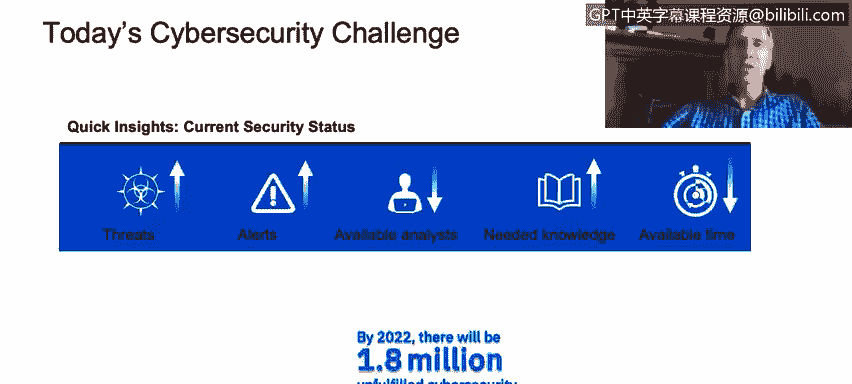
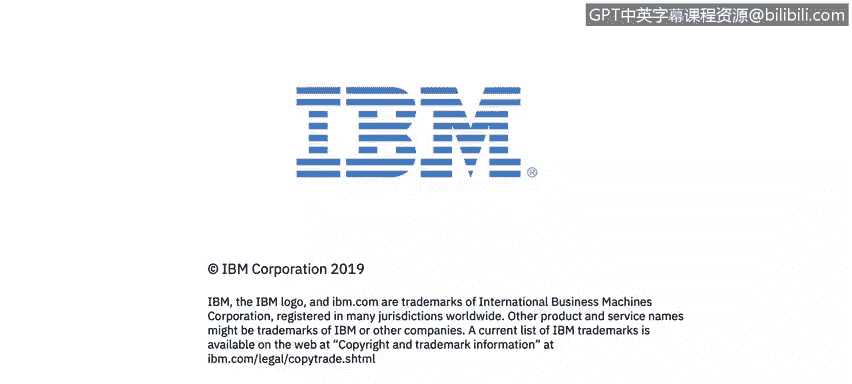

# 课程1：《网络安全工具与网络攻击简介》：1：0_网络安全工具和网络攻击简介

## 概述
在本节课中，我们将要学习网络安全领域当前面临的挑战、安全运营中心（SOC）分析师的核心职责，以及为什么网络安全是一个充满机遇且至关重要的职业领域。

大家好，我是Jeff Crew。我是IBM的安全架构师和杰出工程师。我在IBM工作了36年，其中大部分时间都专注于安全领域。我对这个特定主题的兴趣可以追溯到高中时期，那时我大部分下午都在实验室里进行黑客活动，试图弄清楚系统如何工作、如何被破坏以及如何防御攻击。因此，对我而言，这始终是一个引人入胜的话题，希望你们也能发现它的魅力。欢迎参加本课程，希望你们觉得它有趣。

我们将进入下一张幻灯片，它涉及我们目前在网络安全领域面临的挑战，这些挑战是巨大的。事实上，这些挑战中的大多数在很长一段时间内都是如此，并且我怀疑在未来很长一段时间内仍将持续存在。这也是使这个领域如此有趣、如此值得投入时间发展技能的原因之一。

## 网络安全领域的核心挑战

以下是当前网络安全领域面临的主要挑战。

*   **威胁持续增加**：自从我们通过互联网将计算机互联以来，威胁就一直在增加，没有理由认为这种情况会改变。
*   **攻击者动机增强**：这是因为我们越来越多地将重要信息、有价值的信息以及具有实际货币价值的资源放在IT系统上。正如著名（或臭名昭著）的银行劫匪威利·萨顿被问及为何不断抢劫银行时所说：“因为钱在那里。”如果威利·萨顿今天还在抢劫，他很可能是在攻击IT系统，成为一名黑客，因为“钱在那里”，并且这种情况将持续下去。
*   **系统日益复杂**：系统变得更加复杂，这也扩大了威胁面，增加了我们为这些系统设定的目标范围。
*   **攻击警报不断变化**：换句话说，关于人们使用不同类型攻击向量进行攻击和特定技术的通知在不断变化和演变。我们有一些持续存在的普遍主题，但攻击的细节会不断变化。
*   **安全分析师数量不足**：幻灯片底部有一个统计数据特别提到了技能短缺问题，我们预计到2022年，将会有180万个网络安全职位空缺。这个数字很大。有些人可能会争论说这个数字被夸大了，那么让我们将其减半，粗略地说大约是一百万，这仍然是一个巨大的数字。这意味着，即使你有职位需求去招聘熟练人员，也根本没有足够的熟练人员，而且我们培养网络安全专家的速度无法满足这一需求。
*   **所需知识持续增长**：处理更复杂攻击所需的知识在持续增加。
*   **响应时间不断缩短**：不幸的是，我们处理这些攻击的时间越来越少，因为就这些攻击而言，时间就是金钱。响应时间越长，成本就越高，泄露的数据就越多，造成的损害就越大。在某些情况下，当我们谈论合规法规时，例如欧洲的《通用数据保护条例》（GDPR），如果你没有足够快地响应并通知所有需要被告知数据泄露的人，你的公司也将面临巨额罚款。

所有这些因素综合起来，得出了一个不可避免的结论：我们需要更多具备网络安全技能的个人来帮助应对威胁。

## 安全运营中心（SOC）分析师的核心工作

上一节我们介绍了网络安全领域面临的宏观挑战，本节中我们来看看安全运营中心（SOC）分析师日常需要做些什么。

SOC是安全运营中心，可以看作是接收安全信息和事件管理（SIEM）信息的控制中心或神经中枢。SIEM指的是将所有警报和安全信息汇集到一个地方。分析师需要能够在控制台上查看这些事件和事故，判断哪些重要，哪些不重要。这是此处进行分类筛选的重要组成部分。在进行分类筛选时，我们必须决定这是否是真实事件。如果是，则需要进一步调查；如果不是，则可以继续处理其他事务，并且可能希望对其进行分类，以便将来不会在类似类型的信息和警报上浪费时间。因此，我们不断希望根据我们的环境来调整这些设置，以提高工作效率。

在某些情况下，调查工作涉及使用各种不同的安全工具。你可能有许多不同的控制台，尽管我们越来越倾向于创建一个集成的整体视图，以便能够从数据层、操作系统层、网络层、应用层、身份层等汇集信息，以集成的方式将它们整合在一起。但在许多情况下，这些入侵指标可能来自不同的系统，我们需要能够将它们全部整合起来。因此，需要具备进行搜索、进行调查的技能，拥有好奇的头脑，能够走出去，将我们拥有的所有不同线索拼凑成一个完整的图景，并开始构建一个叙事：这件事发生了，然后导致了那件事，接着我们又遇到了这个情况，现在我们面临的不是一个单一事件，而是一个影响许多系统的大型恶意软件活动。

我们对此的缓解和协调响应方式，就成为我们必须关注的下一个核心技能。因此，首要任务是识别问题，然后尝试发现其范围和涉及的风险，例如，这对组织的影响有多大。最终，我们需要决定采取何种响应措施：我们能否自动化未来的部分响应？这是一个需要我们一次性处理的问题，还是需要通知特定人员来响应？我们是否需要与其他可能连接到我们系统的合作伙伴合作？我们的上游互联网服务提供商是否需要实施网络封锁以清除恶意内容？我们是否需要安装新工具来帮助未来进行缓解？你可以看到，这里涉及许多不同种类的事情，我们只是触及了冰山一角。

## 总结
本节课中我们一起学习了网络安全领域的严峻挑战，包括威胁持续增长、攻击者动机增强、系统复杂化以及专业人才短缺等问题。我们还探讨了安全运营中心（SOC）分析师的核心职责，从接收和分类警报，到进行调查、评估风险并协调响应措施。网络安全是一个不断发展的、充满挑战的领域，如果你喜欢挑战和解决难题，这里将是一个很好的职业发展方向。希望本课程的信息对你有用。