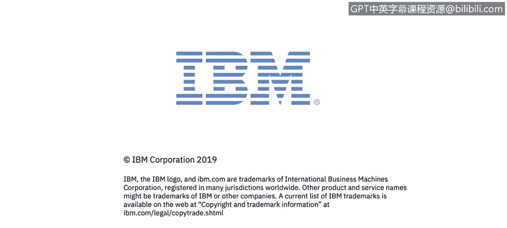

# 课程1：《网络安全工具与网络攻击简介》：2：1_欢迎来到网络安全历史

在本节课中，我们将开启网络安全的学习之旅，了解课程的整体安排以及你将遇到的专家讲师。

正如你刚才听到的，网络安全技能在当今市场需求巨大。全球的公司、组织和政府机构都发现，要招聘到足够数量的熟练网络安全专业人员来满足需求非常困难。

我是特里·佩特，IBM安全部门的内容策略师和教学设计师。在你的整个学习旅程中，我将与你同行，帮助你整合需要掌握的知识，以便在当今的网络安全市场中取得成功。你将听到来自IBM主题专家的分享，他们对当今分析师面临的网络安全挑战有着全球性的视角。

他们将为你提供信息，帮助你达成本课程每个模块的学习目标。

以下是本课程第一模块的讲师介绍：

*   **肯尼斯·冈萨雷斯**：来自IBM X-Force Red团队的渗透测试员，常驻哥斯达黎加。他将从网络安全简史开始你的学习。
*   **约翰·麦克劳克林**：专注于美国联邦政府项目的执行安全架构师。他将进一步解释为何网络安全在当今世界变得如此具有挑战性。
*   **克里斯汀·达尔**：IBM X-Force的安全顾问。她将讨论批判性思维，这是本课程中将要介绍的众多软技能中的第一个。克里斯汀的视频借用了她向IBM“网络安全女性”分会所做的一次网络研讨会内容。

事实上，加入一个网络安全组织是向所有技能和经验水平的志同道合者学习的好方法。本课程中会提供指向WISSS及类似组织的链接。

那么，让我们开始吧。

本节课中，我们一起了解了网络安全领域的巨大需求，认识了本课程的引导者以及第一模块的专家讲师团队。在接下来的学习中，我们将从网络安全的历史开始，逐步深入这个充满挑战与机遇的领域。