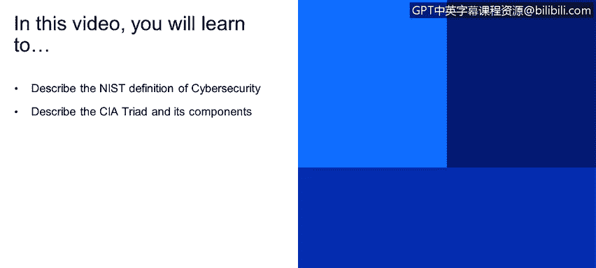
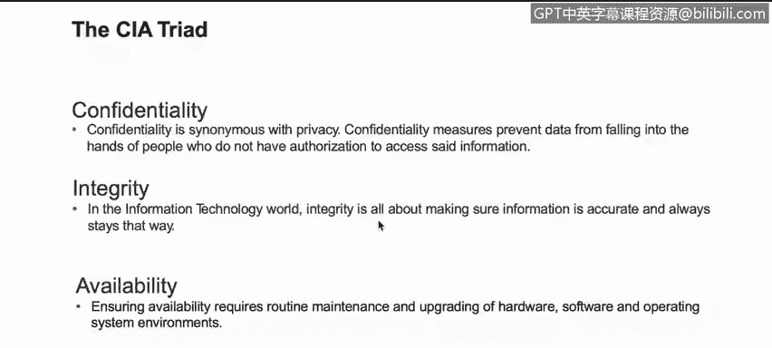

# 课程1：《网络安全工具与网络攻击简介》：3：2_网络安全定义

在本节课中，我们将学习美国国家标准与技术研究院（NIST）对网络安全的定义，并深入理解构成网络安全基础的CIA三要素模型。

## 概述

本节课将介绍网络安全的官方定义及其核心原则。我们将首先了解NIST对信息安全的定义，然后详细探讨构成其基础的CIA三要素：保密性、完整性和可用性。

## NIST网络安全定义

根据美国国家标准与技术研究院（NIST）的定义，**信息安全**是指保护信息系统免受未经授权的活动影响，以提供**保密性**、**完整性**和**可用性**。这三个原则共同构成了著名的**CIA三要素**。

上一节我们了解了网络安全的官方定义，本节中我们将详细拆解其核心组成部分——CIA三要素。

## CIA三要素详解

CIA三要素是信息安全的基石，它包含三个核心原则：保密性、完整性和可用性。

以下是CIA三要素的详细说明：

*   **保密性**
    *   保密性类似于隐私概念。
    *   其核心要求是：对资源或数据的访问必须仅限于被授权的实体。
    *   数据加密是确保保密性的常用方法。其核心思想可以用一个简单的加密公式表示：`密文 = 加密函数(明文， 密钥)`。

*   **完整性**
    *   完整性涉及在整个数据生命周期中保持数据的一致性和准确性。
    *   数据在传输过程中（例如通过互联网或局域网发送时）不得被更改。
    *   必须采取措施确保数据不会被未经授权的人员修改。哈希值常用于数据完整性验证。例如，从网上下载新操作系统后，首要步骤之一就是比较操作系统作者提供的哈希值与下载文件的哈希值，两者必须匹配以确保数据完整无误。

*   **可用性**
    *   确保可用性需要对硬件、软件和操作系统环境进行维护和升级。
    *   其核心是保持业务运营持续运行。防火墙、代理服务器、计算机等所有设备都必须能够7天24小时不间断运行。
    *   业务连续性计划、灾难恢复和冗余机制虽然是确保可用性的最佳实践，但其根本目标是保证业务始终在线。

## 总结

本节课中，我们一起学习了NIST对网络安全的定义，并深入探讨了构成信息安全基础的CIA三要素模型。我们了解到，网络安全的目标是通过技术和管理措施，确保信息的**保密性**、**完整性**和**可用性**，从而保护信息系统免受威胁。理解这三个核心原则是进一步学习网络安全知识和技能的重要基础。