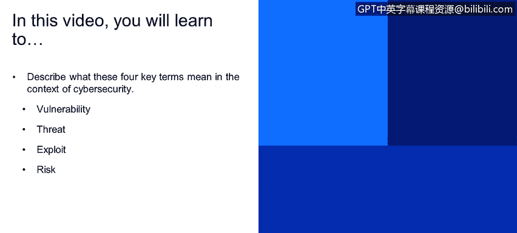
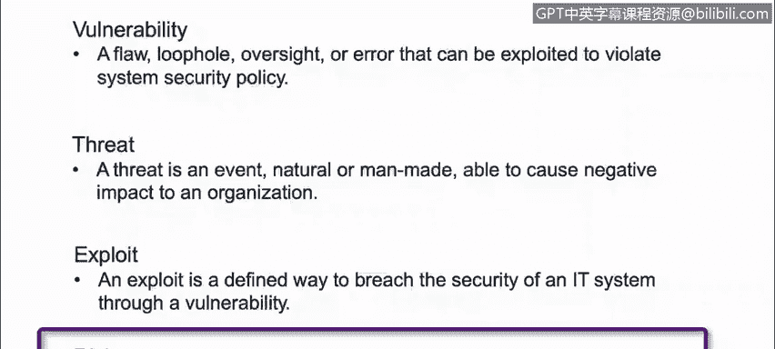

# 课程1：《网络安全工具与网络攻击简介》：4：3_关键术语

在本节课程中，我们将学习并描述网络安全领域的四个核心术语：**漏洞**、**威胁**、**利用**和**风险**。理解这些基本概念是构建网络安全知识体系的第一步。

本节我们将回顾四个关键术语：漏洞、威胁、利用和风险。

## 漏洞

一个**漏洞**是指系统中可以被利用来违反安全策略的缺陷、疏漏、疏忽或错误。

例如，一个软件或应用程序中存在可以被缓冲区溢出攻击利用的代码缺陷。

## 威胁

**威胁**是指能够对组织造成负面影响的自然或人为事件。

例如，它可能是一场风暴、飓风，或者一名黑客。

## 利用

**利用**是指通过漏洞破坏IT系统安全性的已定义方法。

就像我之前提到的缓冲区溢出例子，一个**利用**可以是一段在互联网上可获取的代码，用于对恰好存在漏洞的应用程序执行此类攻击。

## 风险

**风险**是指一个事件发生的概率，或者在该情境下，一个漏洞被利用的可能性。

---

本节课中，我们一起学习了网络安全的四个核心概念：**漏洞**、**威胁**、**利用**和**风险**。理解这些术语及其相互关系，是分析和管理网络安全问题的基础。