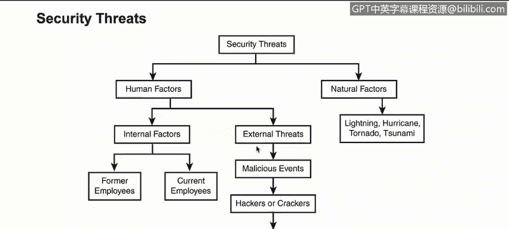

# 课程1：《网络安全工具与网络攻击简介》：5：4_安全威胁

在本节课程中，我们将学习如何描述由人为因素和自然因素引发的安全威胁类别。理解这些威胁的来源和性质，是构建有效防御策略的基础。

上一节我们介绍了安全威胁的基本概念，本节中我们将深入探讨其具体分类。下图展示了一个更详细的分类树，它帮助我们进一步理解人为因素和自然因素下的不同威胁类别。

从根本上说，安全威胁主要分为内部因素和外部威胁两大类。

## 内部因素威胁

内部因素威胁源自组织内部，主要包括前雇员和现雇员。

以下是内部因素的具体说明：

*   **现雇员**：这是非常关键的一点，因为大多数被检测到的、或对组织构成严重影响的攻击，实际上都来源于内部因素，比如在职员工。
*   **前雇员**：前雇员同样构成威胁，因为他们曾拥有访问内部资源的权限。如果他们在离职时没有经过妥善的离职程序，其账户未被正确禁用，那么他们将继续对组织构成威胁。此外，他们了解组织的运作方式和内部流程，这无疑是一个巨大的风险因素。

## 外部威胁

外部威胁来自组织外部，形式多样。

以下是外部威胁的具体说明：

*   **恶意事件**：例如，源自特定国家、针对我们某个DMZ（非军事区）服务器的攻击。
*   **黑客或骇客**：指那些试图利用系统漏洞、寻找入侵途径的个人或团体。
*   **病毒、木马或蠕虫**：这些是危害组织的不同攻击载体。它们都属于人为因素，因为它们要么需要与人类交互（如诱骗用户点击），要么本身就是由人类开发的。例如，病毒是由黑客编写，用以利用特定用户的弱点；同时，用户也可能在非恶意或无意的情况下，因访问某些内容而导致系统被病毒感染。

## 自然因素威胁

除了人为因素，自然因素也是必须考虑的安全威胁。

以下是自然因素威胁的具体说明：

*   这类威胁包括**闪电、飓风、龙卷风、海啸**等自然灾害。在制定业务连续性计划和灾难恢复策略时，充分考虑这些因素至关重要。

本节课中，我们一起学习了安全威胁的两大主要类别：**人为因素**（包括内部雇员和外部攻击者）与**自然因素**。理解这些威胁的来源，能帮助我们在后续课程中更好地识别风险并采取相应的防护措施。