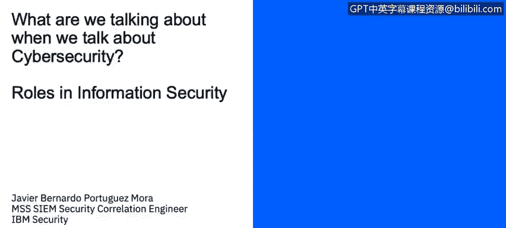
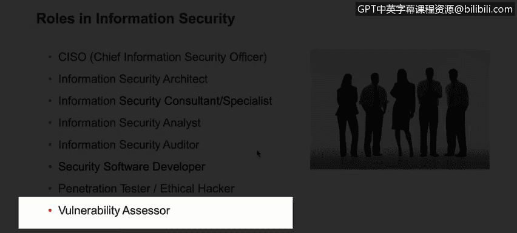

# 课程1：《网络安全工具与网络攻击简介》：7：6_安全角色

在本节课中，我们将学习描述网络安全组织中典型的各类角色。

## 信息安全中的角色

尽管这不是一份完整的角色列表，因为每个组织可能针对不同的信息安全领域设有特定职位，但以下是一些在大型组织中非常常见的角色。

以下是这些核心安全角色的介绍：

*   **首席信息安全官**：这是一个相对较新的角色，其设立是为了确保信息安全部门有负责人来监督、管理并领导整个信息安全体系。
*   **信息安全架构师**
*   **信息安全顾问/专家**
*   **信息安全分析师**
*   **安全审计员**
*   **安全软件开发人员**
*   **渗透测试员**：也称为红队成员。
*   **漏洞评估员**
*   **数字取证分析师**：例如，属于蓝队成员。
*   **安全工程师**：熟悉各种安全技术的人员。

所有这些角色都非常重要。如果你注意到，这些角色原本就存在于IT领域，但现在我们为其增加了安全部分，使其更加专业化，并确保它们以安全为导向。这些角色的职责是保证组织遵循安全最佳实践和标准。

## 关键角色详解

上一节我们列举了常见的安全角色，本节中我们来详细看看其中几个关键角色的具体职责。

首先是**首席信息安全官**。这是一个高级管理职位，是安全部门的负责人。此人负责监督整个安全部门及其员工。这是一个非常重要的角色，在过去并不常见，但现在在组织中看到这个特定职位已经非常普遍。

接下来是**信息安全分析师**。这更像是一个日常分析岗位。此人负责分析事件、警报以及任何可能有助于识别威胁的信息。例如，此人应该能够验证或分析由SIEM系统（如IBM QRadar、Splunk等）收集的事件，能够理解并调查来自这些SIEM平台的警报，或与特定设备健康检查相关的任何警报。任何可能实际导致潜在威胁的信息都需要处理。例如，如果IPS向SIEM发送了一个威胁警报，信息安全分析师应该能够前往SIEM获取该警报，调查相关事件，甚至前往IPS设备了解具体是什么触发了警报，并能够跟进直至问题解决。

另一方面，**信息安全审计员**负责测试计算机信息系统的有效性，以确保它们遵循最佳实践和特定标准。例如，确保组织遵循ISO 27001或27002等法规中定义的最佳实践，并确保组织受到尽可能完善的保护。

## 总结

本节课中，我们一起学习了网络安全组织中的典型角色。我们了解到，许多IT角色通过增加安全职责而演变为专业的安全岗位，例如首席信息安全官、信息安全分析师和安全审计员。这些角色共同协作，确保组织遵循安全标准、分析潜在威胁并维护整体信息安全态势。理解这些角色是构建网络安全职业道路的重要第一步。