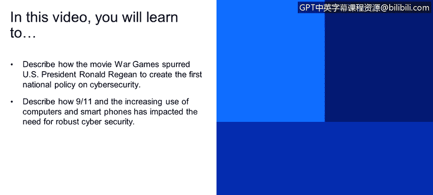
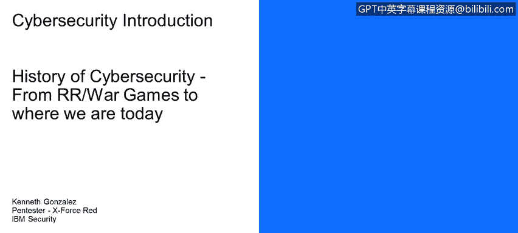
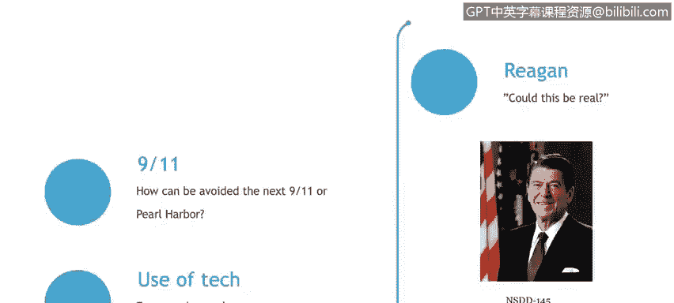

# 课程1：《网络安全工具与网络攻击简介》：8：从罗纳德·里根《战争游戏》到今天的网络安全




在本节课中，我们将学习现代网络安全政策与意识的起源。你将了解到一部电影如何促使美国总统制定了首个国家网络安全政策，以及“9·11”事件和计算机、智能手机的普及如何深刻影响了我们对强大网络安全的需求。



## 🎬 电影《战争游戏》的启示

上一节我们探讨了网络攻击的类型，本节中我们来看看网络安全意识是如何被一部电影激发的。

一切始于罗纳德·里根。罗纳德·里根是美国总统，也曾是好莱坞演员。他观看了电影《战争游戏》后，向他的安全顾问提出了一个问题：电影中的情节是否可能在现实中发生。

以下是电影中的一个关键场景，它展示了黑客如何与一台军用计算机互动：
```
计算机：想玩个游戏吗？
```
这部电影的核心情节是，一名青少年黑客入侵了五角大楼的计算机系统。他与该系统的**人工智能**进行了一场“游戏”，而人工智能误以为这是真实的战争，险些启动了真实的导弹和核武库。这意味着，一个青少年从自家地下室就能控制国家的导弹系统。

里根总统因此询问其顾问：“这可能是真的吗？这种事现在正在发生吗？”这个问题直接推动了美国首个国家网络安全政策的诞生。

## 📜 首个国家网络安全政策的诞生

基于电影引发的担忧，美国政府开始着手制定相关政策。他们创建了第一份关于网络安全领域的国家政策，即 **《国家电信与自动化信息系统安全政策》**。

这份政策标志着美国政府正式将网络安全提升到国家战略层面，为后续的网络安全建设奠定了基础。

## 🏙️ “9·11”事件的影响与反思

时间跳转到“9·11”事件。这场悲剧发生后，美国政府内部开始深入反思。人们提出的核心问题是：“我们如何避免下一次‘9·11’？如何防范可能导致国家关键基础设施（例如航空系统、发电厂能源系统）中断的网络威胁？”

“9·11”事件凸显了国家安全面临的非传统威胁，促使政府和社会将网络安全与物理世界的关键基础设施保护紧密联系起来，加强了对潜在网络攻击的防范意识。

## 📱 技术普及带来的挑战

最后一部分历史课程是关于技术的使用。30或40年前，普通家庭几乎没有电脑。而今天，每个家庭至少拥有一台电脑和一部智能手机。

以下是技术普及带来的核心变化：
*   **设备数量激增**：连接互联网的设备呈指数级增长。
*   **信息量爆炸**：海量的个人、商业和政府数据被数字化。
*   **攻击面扩大**：每一个联网设备都可能成为潜在的攻击入口。

这意味着，存在大量可能被共享、窃取或通过技术手段破坏的信息。技术的普及极大地扩展了网络攻击的潜在范围，使得强大的网络安全措施变得比以往任何时候都更加重要。

## 📝 总结



本节课中，我们一起学习了现代网络安全发展的几个关键历史节点。我们从电影《战争游戏》如何促使里根政府出台首个网络安全政策讲起，探讨了“9·11”事件如何将网络安全提升到关键基础设施保护的高度，最后分析了计算机和智能手机的普及如何极大地增加了对稳健网络安全的需求。理解这段历史，有助于我们认识当前网络安全格局形成的背景与必要性。